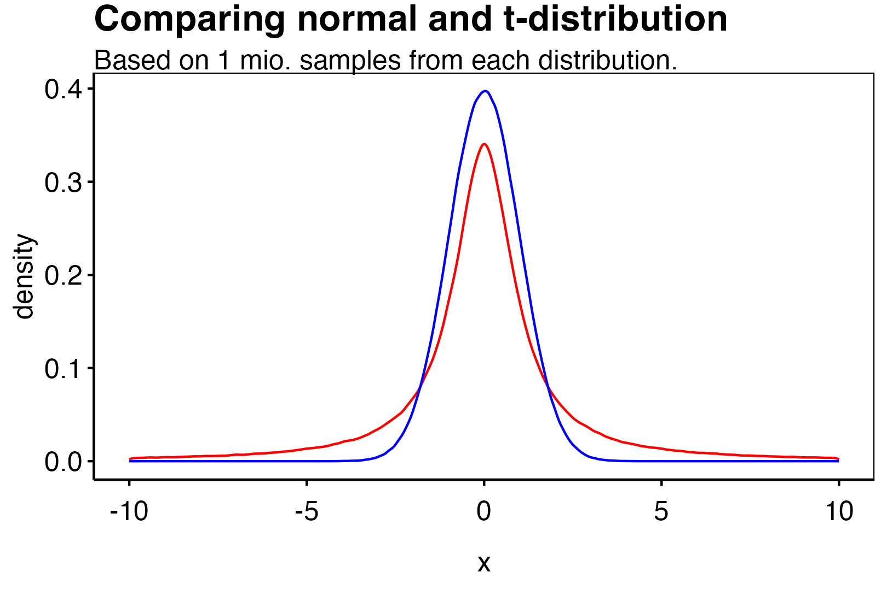
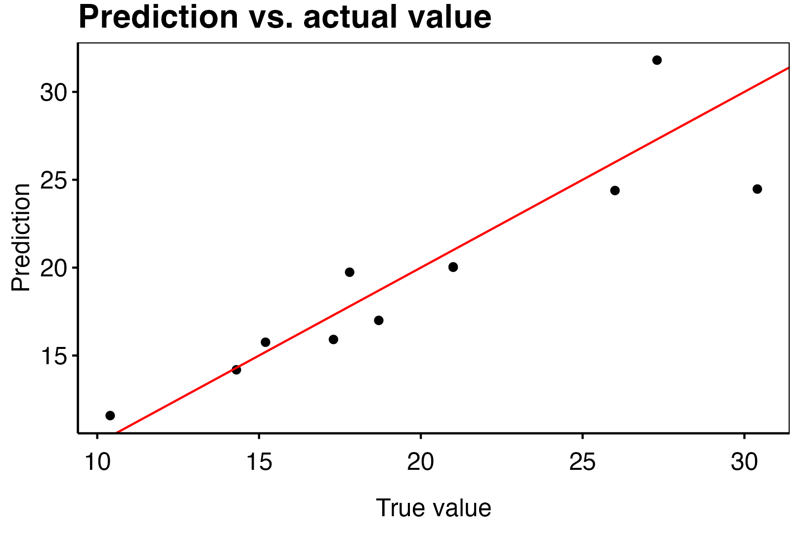
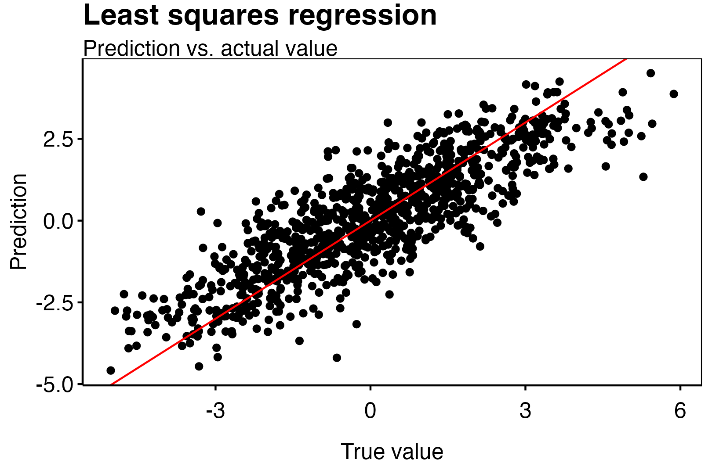
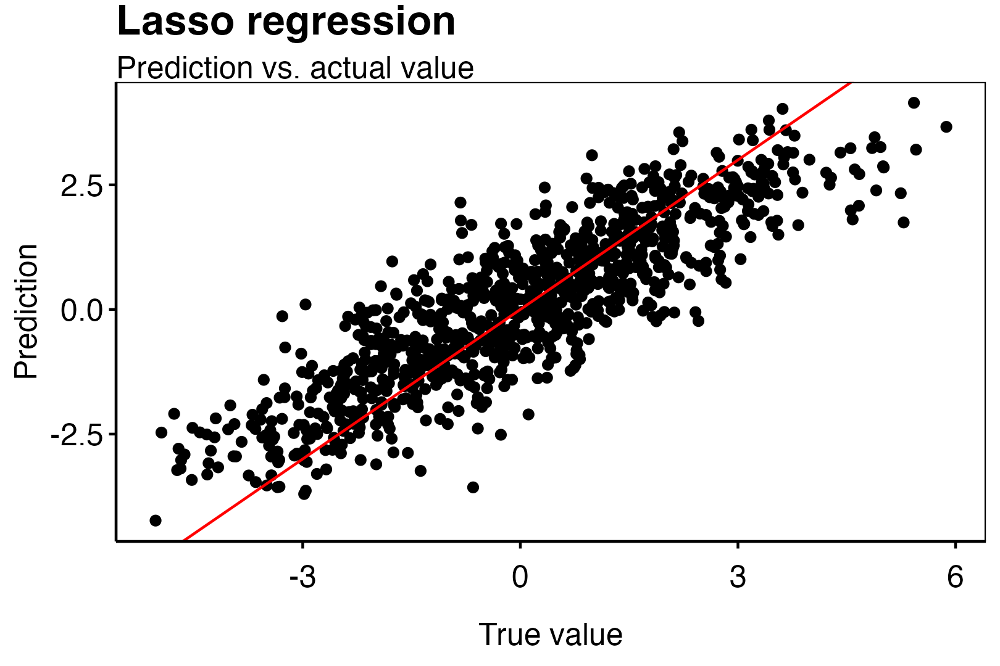
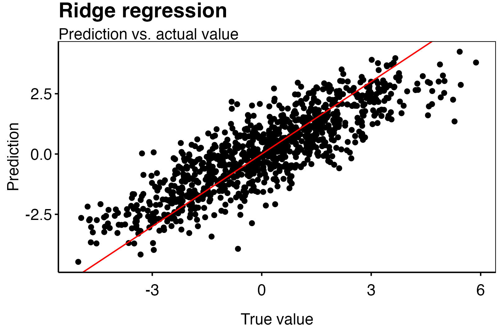
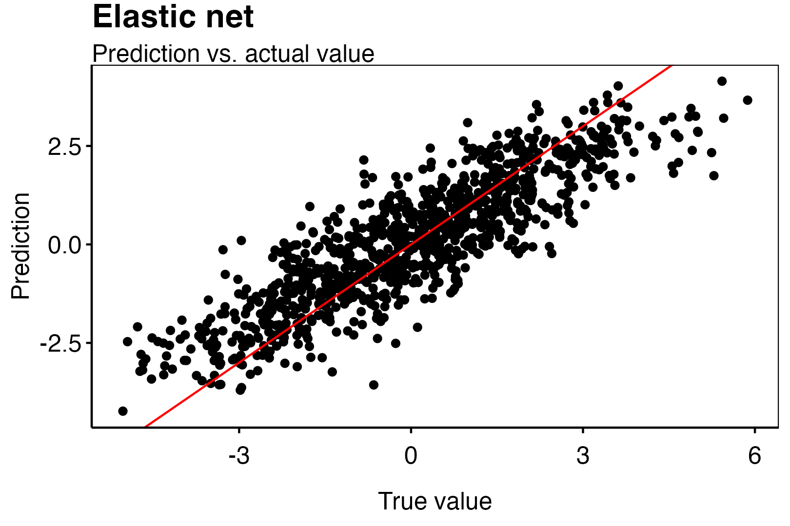
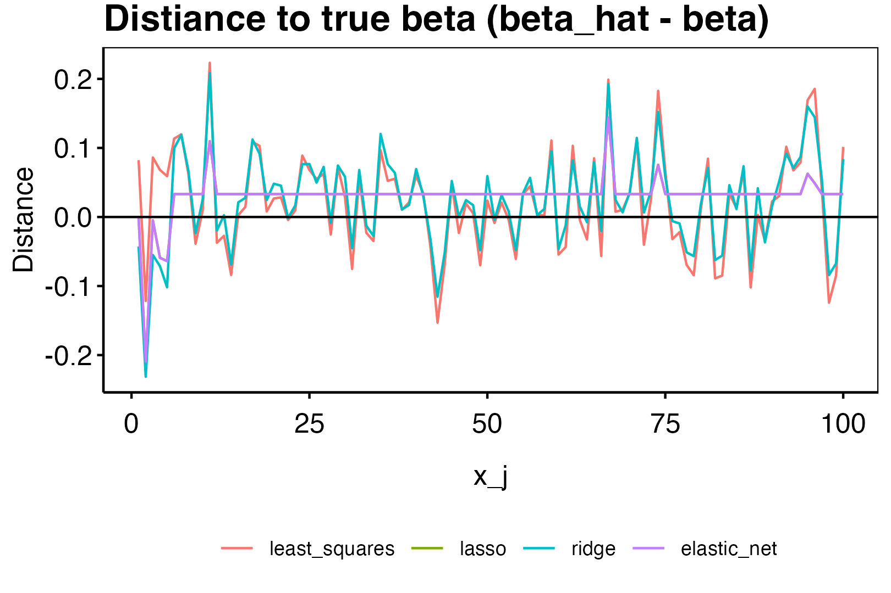

```{r, include=FALSE}
library(ggplot2)
library(dplyr)
theme_custom <- function() {
  
  theme_minimal() %+replace%
    
    theme(
      
      panel.grid.major = element_blank(),
      panel.grid.minor = element_blank(),
      panel.border = element_rect(colour = "black", fill=NA),
      axis.ticks = element_line(),
      #axis.line.x = element_line(color = "#C5C5C5"),
      axis.line = element_line(color = "black"),
      #axis.ticks = element_blank(),
      legend.position = "bottom",
      legend.title = element_blank(),
      #plot.background = element_rect(fill='transparent', color=NA),
      
      plot.title = element_text(             #title
                   #family = font,            #set font family
                   size = 16,                #set font size
                   face = 'bold',            #bold typeface
                   hjust = 0,                #left align
                   vjust = 2,
                   color = "black"),               #raise slightly
      
      plot.subtitle = element_text(          #subtitle
                   #family = font,            #font family
                   size = 12,
                   hjust = 0,
                   color = "black"),               #font size
      
      plot.caption = element_text(           #caption
                   #family = font,            #font family
                    face = "italic",
                   size = 8,                 #font size
                   hjust = 1,
                   color = "black"),               #right align
      
      axis.title = element_text(             #axis titles
                   #family = font,            #font family
                   size = 12,
                   color = "black"),               #font size
      
      axis.text = element_text(              #axis text
                   #family = font,            #axis famuly
                   size = 12,
                   color = "black"),                #font size
      
      axis.text.x = element_text(            #margin for axis text
                    margin=margin(5, b = 10))
      
    )
}
```

# Probabilistic Machine Learning

## Week 1

**Exercise 1.** Let $\tilde m = \arg\min_{m\in\mathcal G} r(m)$. Proof that

$$
r(\hat m_n)-r(\tilde m)\le 2\sup_{m\in\mathcal G}\left\vert\hat R_n(m)-r(m) \right\vert.
$$

<details>
<summary>**Solution.**</summary>

We recall that per definition

$$
R(\hat m_n)=\mathbb E[L(Y,\hat m_n(X))\ \vert\ \mathcal D_n]\quad \text{and}\quad r(\hat m_n)=\mathbb E[R(\hat m_n)]
$$

for some estimator $\hat m_n$. Assume now that $m(\mathcal D_n)=\hat m_n\in \mathcal G$ is the estimator given the data $\mathcal D_n$ from the precedure $m$. We led $\tilde m$ be the Bayes estimator on $\mathcal G$. We therefore have
\begin{align*}
r(\hat m_n)-r(\tilde m)&=r(\hat m_n)-r(\tilde m)+\hat R_n(\hat m_n)-\hat R_n(\hat m_n)+\hat R_n(\tilde m)-\hat R_n(\tilde m)\\
&=r(\hat m_n)-\hat R_n(\hat m_n)+\hat R_n(\tilde m)-r(\tilde m)+\underbrace{\hat R_n(\hat m_n)-\hat R_n(\tilde m)}_{\le 0}\\
&\le \Big(r(\hat m_n)-\hat R_n(\hat m_n)\Big)+\Big(\hat R_n(\tilde m)-r(\tilde m)\Big)\\
&\le \Big\vert \hat R_n(\hat m_n)-r(\hat m_n)\Big\vert+\Big\vert \hat R_n(\tilde m)-r(\tilde m)\Big\vert\\
&\le2\sup_{m\in \mathcal G} \Big\vert \hat R_n(m)-r(m)\Big\vert
\end{align*}
as desired. $\square$

</details>

We consider the Poisson deviance loss

$$
L_{\text{pois:dev}}(y_1,y_2)=2\left(y_1\log \frac{y_1}{y_2}-y_1+y_2\right).
$$

  1. Show that $\arg\min r(m)=m^*(x)=E[Y\ \vert\ X=x]$.
  2. In the squared loss case $L_2(y_1,y_2)=(y_1-y_2)^2$, we used its Hilbert space property to derive that for any estimator $\hat m_n(x)$
  $$
  r_2(\hat m_n(x))-r_2(m^*(x))=\mathbb E[L_2(\hat m_n(x),m^*(x))]
  $$
  Show that an anaolgue result for the he Poisson deviance loss is not true, i.e.,
  \begin{align*}
  r_{\text{pois:dev}}(\hat m_n(x))-r_{\text{pois:dev}}(m^*(x))&=\mathbb E\left[2\left(Y\log \frac{m^*(x)}{\hat m_n(x)}-m^*(x)+\hat m_n(x)\right)\right]\\
  &\ne \mathbb E[L_{\text{pois:dev}}(\hat m_n(x),m^*(x))]
  \end{align*}

<details>
<summary>**Solution (1).**</summary>

We have that
\begin{align*}
r(m)&=\mathbb E\left[2\left(Y\log \frac{Y}{m(X)}-Y+m(X)\right)\right]\\
&=\mathbb E\left[ \mathbb E\left.\left[2\left(Y\log \frac{Y}{m(x)}-Y+m(x)\right)\ \right\vert\ X=x\right]\right]\\
\end{align*}
We see that the integrand is differentiable in $m=m(x)$ and so we have
\begin{align*}
\frac{\partial}{\partial m}r(m)&=\frac{\partial}{\partial m}\mathbb E\left[ \mathbb E\left.\left[2\left(Y\log \frac{Y}{m}-Y+m\right)\ \right\vert\ X=x\right]\right]\\
&=\mathbb E\left[ \mathbb E\left.\left[\frac{\partial}{\partial m}2\left(Y\log \frac{Y}{m}-Y+m\right)\ \right\vert\ X=x\right]\right]\\
&=\mathbb E\left[ \mathbb E\left.\left[2\left(-Y \frac{m}{Y}\frac{Y}{m^2}+1\right)\ \right\vert\ X=x\right]\right]\\
&=\mathbb E\left[ \mathbb E\left.\left[2\left(-\frac{Y}{m}+1\right)\ \right\vert\ X=x\right]\right]\\
&=-2\mathbb E\left[ \mathbb E\left.\left[\frac{Y}{m}\ \right\vert\ X=x\right]\right]+2
\end{align*}
Setting this equal to zero gives

$$
1=\mathbb E\left[ \mathbb E\left.\left[\frac{Y}{m}\ \right\vert\ X=x\right]\right]=\frac{1}{m}\mathbb E\left[ \mathbb E\left.\left[Y\ \right\vert\ X=x\right]\right]
$$

Giving that the expectation is minimized for 

$$
m=E\left.\left[Y\ \right\vert\ X=x\right]
$$

as desired. $\square$

</details>

<details>
<summary>**Solution (2).**</summary>

Take any estimator $\hat m_n$ and consider the risk associated with the estimator:
\begin{align*}
r_{\text{pois:dev}}(\hat m_n(X))-r_{\text{pois:dev}}(m^*(x))&=\mathbb E\left[2\left(Y\log \frac{Y}{\hat m_n(X)}-Y+\hat m_n(X)\right)\right]-\mathbb E\left[2\left(Y\log \frac{Y}{ m^*(X)}-Y+m^*(X)\right)\right]\\
&=\mathbb E\left[2\left(Y\log \frac{Y}{\hat m_n(X)}-Y+\hat m_n(X)-Y\log \frac{Y}{ m^*(X)}+Y-m^*(X)\right)\right]\\
&=\mathbb E\left[2\left(Y\log \frac{Ym^*(X)}{\hat m_n(X)Y}+\hat m_n(X)-m^*(X)\right)\right]\\
&=\mathbb E\left[2\left(Y\log \frac{m^*(X)}{\hat m_n(X)}+\hat m_n(X)-m^*(X)\right)\right]
\end{align*}
Yielding the desired result. $\square$

</details>

**Exercise 3.** We consider a simple regression case with no explanatory variables. We denote by $\hat m_{n,1}$ the sample mean and by $\hat m_{n,2}$ the sample mean. Furthermore, $\hat R_{n,1}$ and $\hat R_{n,2}$ denote the empirical risk with respect to the $L_1$ loss and the squared loss respectively.

  1. Generate 10,000 iid observations $y_1,...,y_{10000}$ from a standard normal distribution. Compare
  $$
  \hat R_{n,1}(\hat m_{n,1}),\hat R_{n,1}(\hat m_{n,2}),\hat R_{n,2}(\hat m_{n,1}),\hat R_{n,2}(\hat m_{n,2}).
  $$
  2. Generate 10,000 iid observations $y_1,...,y_{10000}$ from a $t$-distribution with one degree of freedom. Compare
  $$
  \hat R_{n,1}(\hat m_{n,1}),\hat R_{n,1}(\hat m_{n,2}),\hat R_{n,2}(\hat m_{n,1}),\hat R_{n,2}(\hat m_{n,2}).
  $$
  3. What conclusion can you draw from the two exercises?

<details>
<summary>**Solution (1).**</summary>

We set the seed to 1 `set.seed(1)` and generate the $n=10000$ samples.

```{r}
set.seed(1)
y <- rnorm(n =10000,
           mean = 0,
           sd = 1)
```

We may now compute the sample mean and median.

```{r}
hat_m_1 <- median(y)
hat_m_2 <- mean(y)
```

One may recall that $\text{median}(X)=\mathbb E[X]=0$ for $X\sim \mathcal N(0,1)$ and so we would expect $\hat m_{n,1}\approx \hat m_{n,2}$. We can compute the empirical risk wrt. the $L_1$ and $L_2$ loss.

```{r}
hat_R_11 <- sum(abs(y-hat_m_1))/length(y)
hat_R_11
hat_R_12 <- sum(abs(y-hat_m_2))/length(y)
hat_R_12
hat_R_21 <- sum((y-hat_m_1)**2)/length(y)
hat_R_21
hat_R_22 <- sum((y-hat_m_2)**2)/length(y)
hat_R_22
```

Although these are empirical risk we have not computed an estimate of the risk as we should generate more samples of the risk. As such we draw using the above method $S=1000$ samples of the risks and compute the means.

```{r}
S <- 1000
n <- 10000
hat_R <-  rowMeans(
  #Generate S samples (in 4 x S-matrix)
  sapply(1:S, function(s) {
    #Generate y's
    y <- rnorm(n,mean=0,sd=1)
    #Compute estimates
    hat_m_1 <- median(y)
    hat_m_2 <- mean(y)
    #Compute risks
    c(
      sum(abs(y-hat_m_1))/length(y),
      sum(abs(y-hat_m_2))/length(y),
      sum((y-hat_m_1)**2)/length(y),
      sum((y-hat_m_2)**2)/length(y)
    )
  })
  #The output i then taken rowMeans on
)
```


We may compare the results in the table below.

| Measure | Value |
|:-----:|:------:|
| $\hat R_{n,1}(\hat m_{n,1})$ | `r hat_R[1]` |
| $\hat R_{n,1}(\hat m_{n,2})$ | `r hat_R[2]` |
| $\hat R_{n,2}(\hat m_{n,1})$ | `r hat_R[3]` |
| $\hat R_{n,2}(\hat m_{n,2})$ | `r hat_R[4]` |

We can see that the following holds:

  1. For the $L_1$ loss the empirical median does better than the empirical mean,
  2. For the squared loss the empirical median does worse than the empirical mean.

</details>

<details>
<summary>**Solution (2).**</summary>

We set the seed to 1 `set.seed(1)` and generate the $n=10000$ samples.

```{r}
set.seed(1)
y <- stats::rt(n =10000,
               df = 1)
```

We may now compute the sample mean and median.

```{r}
hat_m_1 <- median(y)
hat_m_2 <- mean(y)
```

One may recall that $\text{median}(X)=\mathbb E[X]=0$ for $X\sim \mathcal t(1)$ and so we would expect $\hat m_{n,1}\approx \hat m_{n,2}$. We can compute the empiracal risk wrt. the $L_1$ and $L_2$ loss.

```{r}
S <- 1000
n <- 10000
hat_R <-  rowMeans(
  #Generate S samples (in 4 x S-matrix)
  sapply(1:S, function(s) {
    #Generate y's
    y <- rt(n,df=1)
    #Compute estimates
    hat_m_1 <- median(y)
    hat_m_2 <- mean(y)
    #Compute risks
    c(
      sum(abs(y-hat_m_1))/length(y),
      sum(abs(y-hat_m_2))/length(y),
      sum((y-hat_m_1)**2)/length(y),
      sum((y-hat_m_2)**2)/length(y)
    )
  })
  #The output i then taken rowMeans on
)
```

We may compare the results in the table below.

| Measure | Value |
|:-----:|:------:|
| $\hat R_{n,1}(\hat m_{n,1})$ | `r hat_R[1]` |
| $\hat R_{n,1}(\hat m_{n,2})$ | `r hat_R[2]` |
| $\hat R_{n,2}(\hat m_{n,1})$ | `r hat_R[3]` |
| $\hat R_{n,2}(\hat m_{n,2})$ | `r hat_R[4]` |

We see that for the $t$-distribution with one degree of freedom we see the same relation as in the normal case. The median does better in the $L_1$ loss but worse under the squared loss.

</details>

<details>
<summary>**Solution (3).**</summary>

We can see that the risk is far greater than the normal case. Comparing the density functions of a standard normal distribution and the $t$-distribution with one degree of freedom we see that the mean is the same but the variance is far greater than the normal case. In fact, with degrees of freedom below 2 we have that the variance is infinite.

```{r, echo = FALSE, out.width="75%",fig.align='center',warning=FALSE}
y_t <- stats::rt(n = 1000000,
               df = 1)
v_y_t <- mean((y_t-mean(y_t))^2)
y_norm <- rnorm(n=1000000,
                mean = 0,
                sd = 1)
library(ggplot2)
p <- ggplot(data = data.frame(y_t= y_t,y_norm=y_norm)) +
  geom_density(aes(x=y_t), col = "red") +
  geom_density(aes(x=y_norm), col = "blue") +
  xlim(-10,10) + theme_custom() +
  labs(title = "Comparing normal and t-distribution",
       x = "x",
       subtitle = "Based on 1 mio. samples from each distribution.")
ggsave("figures/ML_week1_ex3.png",bg='transparent',plot = p, height = 1080,width = 1620, units="px")

```

\begin{figure}[H]
  \begin{center}
    \includegraphics[width=0.48\textwidth]{figures/ML_week1_ex3.png}
  \end{center}
\end{figure}

This gives that for a given sample size the risk will tend to infinity as $n$ grows to infinity. This in turn explains the large values we see in the risk. We see that for the $t$-distribution with one degree of freedom we see the same relation as in the normal case. The median does better in the $L_1$ loss but worse under the squared loss.

</details>

**Exercise 4.** We want to practise model tuning with the mlr3 package. Go through the following steps:

1. Install and load the relevant ml3 packages: mlr3, mlr3learners, mlr3tuning, mlr3mbo.
2. Create a task
  + Load the `mtcars` data (write: *data(mtcars)*)
  + Use the `as_task_regr` to create a task with `mpg` as target
3. Set `regr.xgboost` as learner with corresponding search space; e.g.,
\begin{align*}
eta &= to\_tune(0, 1)\\
nrounds &= to\_tune(10, 5000)\\
max\_depth &= to\_tune(1, 20)\\
colsample\_bytree &= to\_tune(0.1, 1)\\
subsample &= to\_tune(0.1, 1)
\end{align*}
4. Tune your learner on you task using the `tune` function with
  + Resampling method: 5-fold cross validation
  + Measure: squared loss
  + Method: `mbo` or `random search`
  + Terminator: 10 evaluations
5. Fit your learner on the task using the optimal hyper parameters calculated

<details>
<summary>**Solution (1).**</summary>

We install the required packages.

```{r,eval = FALSE}
packages <- c("mlr3",
              "mlr3learners",
              "mlr3tuning",
              "mlr3mbo")
install.packages(packages, dependencies = TRUE)
```


</details>

<details>
<summary>**Solution (2).**</summary>

We start by loading the data.

```{r}
data("mtcars")
head(mtcars)
```

We now transform the data into a task.

```{r, message=FALSE}
#Load the relevant libraries
library(mlr3)
library(mlr3learners )
library(mlr3tuning)
library(mlr3mbo)

#Start task
task_mtcars = as_task_regr(
  mtcars,
  target = "mpg",
  id = "cars"
)
```

We may now split out data set into random partions of a training dataset and a testing dataset.

```{r}
#Split data
splits = partition(task_mtcars)
splits
```

We see that the testing dataset has $N_1=`r length(splits$test)`$ and the training dataset has $N_2=`r length(splits$train)`$. We will be training the model on the training dataset. Therefore we start a task on the subset.

```{r}
task_mtcars_train = as_task_regr(
  mtcars[splits$train,],
  target = "mpg",
  id = "cars_train"
)
```

</details>

<details>
<summary>**Solution (3).**</summary>

We now initiate a learner.

```{r}
# load regression xgboost
learner_xgboost = lrn("regr.xgboost")
```

We can now look at the current configuration of the leaner by looking at the parameter space of the hyperparameter.

```{r}
as.data.table(learner_xgboost$param_set)[,c("id","class","lower",
                                            "upper","nlevels")]
```

As the text says we set som of the parameters to as specific section of the parameter space.

```{r}
my_xg_learner = lrn("regr.xgboost",
                    eta = to_tune(0, 1),
                    nrounds = to_tune(10, 5000),
                    max_depth = to_tune(1, 20),
                    colsample_bytree = to_tune(0.1, 1),
                    subsample = to_tune(0.1, 1))
```


</details>

<details>
<summary>**Solution (4).**</summary>

We tune a regression model using `mbo` search.

```{r,message = FALSE,results='hide',eval=FALSE}
instance = tune(
  method = tnr("mbo"), ### tuning method
  task = task_mtcars_train,
  learner = my_xg_learner,
  resampling = rsmp("cv", folds = 5), #### resampling method: 5-fold cross validation
  measures = msr("regr.rmse"), #### root mean squared error
  terminator = trm("evals", n_evals =10) #### terminator
)
```
```{r,echo=FALSE,eval=FALSE}
saveRDS(instance, file = "rds/ML_week1_rds1.rds")
```
```{r,echo=FALSE}
instance <- readRDS("rds/ML_week1_rds1.rds")
```

We can consider the the estimates from each subset and the fitted parameters.

```{r}
#All 20 runs
as.data.table(instance$archive)[, c("eta", "nrounds",
                                    "max_depth", "regr.rmse")]
#Optimal fitting
instance$result
#Optimal parameters
instance$result_learner_param_vals
```

</details>

<details>
<summary>**Solution (5).**</summary>

We can now use optimal paramteres in `instance$result_learner_param_vals` to create a learner that we may fit to the training data.

```{r}
#Define new tuner
xgb_tuned = lrn("regr.xgboost", id = "xgb tuned")
#Set parameters to the optimals from before
xgb_tuned$param_set$values = instance$result_learner_param_vals
```

We now fit the data.

```{r}
xgb_tuned$train(task_mtcars_train)
```

We can now predict onto the testing data.

```{r}
predictions = xgb_tuned$predict_newdata(mtcars[splits$test,])
predictions
#empirical risk
risk <- mean((predictions$truth-predictions$response)**2)
```

Using a diagram we can see. That the model does pretty well. In fact the empirical risk is `r round(risk,2)`.

```{r, echo = FALSE, out.width="75%",fig.align='center',warning=FALSE}
df <- as.data.table(predictions)
p <- ggplot(data = df) +
  geom_point(aes(x=truth,y=response)) +
  geom_abline(slope = 1,intercept = 0, col = "red") +
  theme_custom() +
  labs(title = "Prediction vs. actual value",
       x= "True value",
       y = "Prediction")
ggsave("figures/ML_week1_ex4.png",bg='transparent',plot = p, height = 1080,width = 1620, units="px")

```

\begin{figure}[H]
  \begin{center}
    \includegraphics[width=0.48\textwidth]{figures/ML_week1_ex4.png}
  \end{center}
\end{figure}

</details>

## Week 2

From now on, given sample size $n$, a dimension $p$, and a correlation parameter $0\le \texttt{rho}<1$ we will generate data $X$ via the following code.

```{r, eval = FALSE}
z_1 <- rnorm(p*n,0,(1-rho)^(1/2))
z_0 <- rnorm(n,0,rho^(1/2))
X <- 2.5*atan(z_1+z_0)/pi
dim(X) <- c(n,p)
```

The resulting features will have approximately support on $[−1, 1]$ and will have approximately pairwise correlation of size $\texttt{rho}$. Given the distribution of $\varepsilon$ and a regression function $m$, we then generate data $(X_i,Y_i)_{i=1,...,n}$ via

$$
Y_i=m(X_i)+\varepsilon_i,
$$

where $\varepsilon_i$ are iid copies of $\varepsilon$ and $X_i$ is the $i$th row of $X$.

**Exercise 1.** We want to try out ordinary least squares regression, lasso, ridge regression and elastic net on some different data generating settings (Model 1–4).

|     |  n | p | s | rho | m | $\varepsilon$ |
| :-- | :-: | :-: | :-: | :-: | :-: | :-: |
| Model 1 | 1000 | 100 | 5 | 0.3 | $\sum_{j=1}^s x_j$ | $\mathcal N(0,1)$ |
| Model 2 | 1000 | 100 | 100 | 0.3 | $\sum_{j=1}^s x_j$ | $\mathcal N(0,1)$ |
| Model 3 | 1000 | 100 | 5 | 0.3 | $\sum_{j=1}^s 0.1x_j$ | $\mathcal N(0,1)$ |
| Model 4 | 1000 | 100 | 100 | 0.3 | $\sum_{j=1}^s 0.1x_j$ | $\mathcal N(0,1)$ |

  a. Given one set of training data for each model tune (i.e. estimate optimal hyperprameter) via 5-fold cross-validation using a search method and number of evals of your choice. You should now have an estimated optimal hyperparameter for every combination of model and method.
  b. Generate 100 test sets each of size n for every model and calculate empirical mean and standard deviation of the test error for each method and model using the hyperparameters calculated in (a). Create a table of your results (each missing entry should show hyperparameter: mean(sd)):

| | Least Squares | Ridge | Lasso | Elastic Net |
| :-- | :-: | :-: | :-: | :-: |
| Model 1 | $\cdot$ | $\cdot$ | $\cdot$ | $\cdot$ |
| Model 2 | $\cdot$ | $\cdot$ | $\cdot$ | $\cdot$ |
| Model 3 | $\cdot$ | $\cdot$ | $\cdot$ | $\cdot$ |
| Model 4 | $\cdot$ | $\cdot$ | $\cdot$ | $\cdot$ |

  c. Discuss why test error alone might often not be the (only) quantity of interest.

<details>
<summary>**Solution (a).**</summary>

We start by simulating the data with the seed 1 for the training data and 2 for testing data.

```{r}
#Generate data
generateData <- function(n,p,s,rho,m,epsilon,seed) {
  set.seed(seed)
  z_1 <- rnorm(p*n,0,(1-rho)^(1/2))
  z_0 <- rnorm(n,0,rho^(1/2))
  X <- 2.5*atan(z_1+z_0)/pi
  dim(X) <- c(n,p)
  Y <- m(X) + rnorm(n,0,epsilon)
  dat <- data.frame(Y = Y, X=X)
  return(list(dat=dat,Y=Y,X=X))
}
```

**Model 1**

We may now estimate under model 1 by setting the parameters and generating the data.

```{r}
#Model 1
n <- 1000
p <- 100
s <- 5
rho <- 0.3
m <- function(x) { rowSums(x[,1:s])}
epsilon <- 1
data_train <- generateData(n,p,s,rho,m,epsilon,1)$dat
data_test <- generateData(n,p,s,rho,m,epsilon,2)$dat
head(data_train[,1:10])
head(data_test[,1:10])
```

We can estimate the optimal parameters under least squares estimation with the `lm` function.

```{r}
ls_lm <- lm(Y ~ ., data = data_train)
```

We can use `predict` to see the model prediction vs. the true values.

```{r}
fit <- data.frame(response = predict(ls_lm,data_test),
                  truth = data_test$Y)
```
```{r, echo = FALSE, out.width="75%",fig.align='center',warning=FALSE}
p1 <- ggplot(data = fit) +
  geom_point(aes(x=truth,y=response)) +
  geom_abline(slope = 1,intercept = 0, col = "red") +
  theme_custom() +
  labs(title = "Least squares regression",
       subtitle = "Prediction vs. actual value",
       x= "True value",
       y = "Prediction")
ggsave("figures/ML_week2_ex1_01.png",bg='transparent',plot = p1, height = 1080,width = 1620, units="px")

```

\begin{figure}[H]
  \begin{center}
    \includegraphics[width=0.48\textwidth]{figures/ML_week2_ex1_01.png}
  \end{center}
\end{figure}

We can also use `mlr3` to tune optimal hyperparameters for a lasso, ridge and elastic net estimator. We start as usual by slitting the data into training and testing datasets and starting a task.

```{r}
#Load the relevant libraries
library(mlr3)
library(mlr3learners )
library(mlr3tuning)
library(mlr3mbo)

#Start task
task_model1 = as_task_regr(
  data_train,
  target = "Y",
  id = "model1"
)
```

We can now initiate a leaner. We start by fitting the hyperparameter for the lasso learner.

```{r}
learner_lasso = lrn("regr.glmnet")
```

We use the `glmnet` as it is an algorithm that solves the minimizing problem

$$
\hat{\beta}_\lambda^{\text {glmnet }} =\underset{\beta \in \mathbb{R}^p}{\arg \min }\left\{\hat{R}_n(\beta)+J_\lambda(\beta)\right\},\hspace{15pt}J_\lambda(\beta)=\lambda \left[\alpha\sum_{j=1}^p\left|\beta_j\right|+\frac{1-\alpha}{2}\sum_{j=1}^p\beta_j^2\right],
$$

One may recall that the lasso estimator is given by

$$
\hat{\beta}_\lambda^{\text {lasso }} =\underset{\beta \in \mathbb{R}^p}{\arg \min }\left\{\hat{R}_n(\beta)+J_\lambda(\beta)\right\},\hspace{15pt}J_\lambda(\beta)=\lambda \sum_{j=1}^p\left|\beta_j\right|,
$$

and so the lasso estimator is a specialcase of the `glmnet` with $\alpha=1$. From the above we see that the minimizing algorithm punishes large beta's. The hyperparameter to tune is then $\lambda\ge 0$ (`s` is the syntax for $\lambda$). Looking at the parameters in the `learner_lasso` one can see the entire hyperparameter space.

```{r}
as.data.table(learner_lasso $param_set)[, list(id, class, lower, upper, nlevels)]
```

Let us tune a lasso learner by setting `alpha = 1` and tuning `s = totune(0,1)` i.e. searching for $\lambda \in [0,1]$.

```{r,eval= FALSE}
#Define the learner
my_lasso_learner = lrn("regr.glmnet",
                       s= to_tune(0, 1),
                       alpha=1)
#Tune the learner
instance = tune(
  method = tnr("mbo"), ### tuning method
  task = task_model1,
  learner = my_lasso_learner,
  resampling = rsmp("cv", folds = 5), #### resampling method: 5-fold cross validation
  measures = msr("regr.rmse"), #### root mean squared error
  terminator = trm("evals", n_evals = 100) #### terminator
)
```
```{r,echo=FALSE,eval=FALSE}
saveRDS(instance, file = "rds/ML_week2_rds1.rds")
```
```{r,echo=FALSE}
instance <- readRDS("rds/ML_week2_rds1.rds")
```
```{r}
#One might go through the archive
#as.data.table(instance$archive)
instance$result
```

Now that we have tuned the algorithm we can fit the model with the above $s$ (`r round(instance$result$s,4)`).

```{r}
lasso_tuned = lrn("regr.glmnet")  
lasso_tuned$param_set$values = instance$result_learner_param_vals
lasso_tuned$train(task_model1)
```

Lets quickly look at the predictions.

```{r}
predictions = lasso_tuned$predict_newdata(data_test)
```
```{r, echo = FALSE, out.width="75%",fig.align='center',warning=FALSE}
df <- as.data.table(predictions)
p1 <- ggplot(data = df) +
  geom_point(aes(x=truth,y=response)) +
  geom_abline(slope = 1,intercept = 0, col = "red") +
  theme_custom() +
  labs(title = "Lasso regression",
       subtitle = "Prediction vs. actual value",
       x= "True value",
       y = "Prediction")
ggsave("figures/ML_week2_ex1_02.png",bg='transparent',plot = p1, height = 1080,width = 1620, units="px")

```

\begin{figure}[H]
  \begin{center}
    \includegraphics[width=0.48\textwidth]{figures/ML_week2_ex1_02.png}
  \end{center}
\end{figure}

One can get the coefficients of $\beta$ by predicting the data frame `I = diag(1,nrow = 100)` being the identity.

```{r}
#Make identity matrix
I <- diag(x=1,nrow = p) %>% as.data.frame()
colnames(I) <- colnames(data_train)[2:(p+1)]
predictions = lasso_tuned$predict_newdata(I) 
beta_lasso <- predictions$response #Look at the beta
beta_lasso
```

One can see that the values is close to the true value $\beta=(1,1,1,1,1,0,...,0)$.

We can now estimate the parameters in ridge regression by setting $\alpha = 0$ and then getting a scaled version of $\lambda$.

```{r,eval= FALSE}
#Define the learner
my_ridge_learner = lrn("regr.glmnet",
                       s= to_tune(0, 1),
                       alpha=0)
#Tune the learner
instance = tune(
  method = tnr("mbo"), ### tuning method
  task = task_model1,
  learner = my_ridge_learner,
  resampling = rsmp("cv", folds = 5), #### resampling method: 5-fold cross validation
  measures = msr("regr.rmse"), #### root mean squared error
  terminator = trm("evals", n_evals = 100) #### terminator
)
```
```{r,echo=FALSE,eval=FALSE}
saveRDS(instance, file = "rds/ML_week2_rds2.rds")
```
```{r,echo=FALSE}
instance <- readRDS("rds/ML_week2_rds2.rds")
```
```{r}
#One might go through the archive
#as.data.table(instance$archive)
instance$result
```

We fit the model with the above $s$ (`r round(instance$result$s,4)`).

```{r}
ridge_tuned = lrn("regr.glmnet")  
ridge_tuned$param_set$values = instance$result_learner_param_vals
ridge_tuned$train(task_model1)
```

Lets quickly look at the predictions.

```{r}
predictions = ridge_tuned$predict_newdata(data_test)
```
```{r, echo = FALSE, out.width="75%",fig.align='center',warning=FALSE}
df <- as.data.table(predictions)
p1 <- ggplot(data = df) +
  geom_point(aes(x=truth,y=response)) +
  geom_abline(slope = 1,intercept = 0, col = "red") +
  theme_custom() +
  labs(title = "Ridge regression",
       subtitle = "Prediction vs. actual value",
       x= "True value",
       y = "Prediction")
ggsave("figures/ML_week2_ex1_03.png",bg='transparent',plot = p1, height = 1080,width = 1620, units="px")

```

\begin{figure}[H]
  \begin{center}
    \includegraphics[width=0.48\textwidth]{figures/ML_week2_ex1_03.png}
  \end{center}
\end{figure}

For good measures we calculate the beta's as in lasso.

```{r}
#Make identity matrix
I <- diag(x=1,nrow = p) %>% as.data.frame()
colnames(I) <- colnames(data_train)[2:(p+1)]
predictions <- ridge_tuned$predict_newdata(I)
beta_ridge <- predictions$response #Look at the beta
beta_ridge
```

Finally, let us tune an elastic net.

```{r,eval= FALSE}
#Define the learner
my_elastic_learner = lrn("regr.glmnet",
                       s= to_tune(0, 1),
                       alpha= to_tune(0,1))
#Tune the learner
instance = tune(
  method = tnr("mbo"), ### tuning method
  task = task_model1,
  learner = my_elastic_learner,
  resampling = rsmp("cv", folds = 5), #### resampling method: 5-fold cross validation
  measures = msr("regr.rmse"), #### root mean squared error
  terminator = trm("evals", n_evals = 100) #### terminator
)
```
```{r,echo=FALSE,eval=FALSE}
saveRDS(instance, file = "rds/ML_week2_rds3.rds")
```
```{r,echo=FALSE}
instance <- readRDS("rds/ML_week2_rds3.rds")
```
```{r}
#One might go through the archive
#as.data.table(instance$archive)
instance$result
```

We fit the model with the above $s$ (`r round(instance$result$s,4)`).

```{r}
elastic_tuned = lrn("regr.glmnet")  
elastic_tuned$param_set$values = instance$result_learner_param_vals
elastic_tuned$train(task_model1)
```

Lets quickly look at the predictions.

```{r}
predictions = elastic_tuned$predict_newdata(data_test)
```
```{r, echo = FALSE, out.width="75%",fig.align='center',warning=FALSE}
df <- as.data.table(predictions)
p1 <- ggplot(data = df) +
  geom_point(aes(x=truth,y=response)) +
  geom_abline(slope = 1,intercept = 0, col = "red") +
  theme_custom() +
  labs(title = "Elastic net",
       subtitle = "Prediction vs. actual value",
       x= "True value",
       y = "Prediction")
ggsave("figures/ML_week2_ex1_04.png",bg='transparent',plot = p1, height = 1080,width = 1620, units="px")

```

\begin{figure}[H]
  \begin{center}
    \includegraphics[width=0.48\textwidth]{figures/ML_week2_ex1_04.png}
  \end{center}
\end{figure}

For good measures we calculate the beta's as in lasso.

```{r}
#Make identity matrix
I <- diag(x=1,nrow = p) %>% as.data.frame()
colnames(I) <- colnames(data_train)[2:(p+1)]
predictions <- elastic_tuned$predict_newdata(I)
beta_elastic <- predictions$response #Look at the beta
beta_elastic
```

Let's lastly look at how the different estimators do with respect to the true beta.

```{r, echo = FALSE, out.width="75%",fig.align='center',warning=FALSE}
I <- diag(x=1,nrow = p) %>% as.data.frame()
colnames(I) <- colnames(data_train)[2:(p+1)]
predictions <- elastic_tuned$predict_newdata(I)
ls_beta <- predict(ls_lm, I)
true_beta <- c(rep(1,s),rep(0,p-s))
plotdf <- data.frame(
  j = 1:p,
  least_squares = ls_beta-true_beta,
  lasso = beta_lasso-true_beta,
  ridge = beta_ridge-true_beta,
  elastic_net = beta_elastic-true_beta
) %>% reshape2::melt(., id.vars = "j")
p1 <- ggplot(plotdf) + geom_line(aes(x= j, y = value, col = variable))+
  geom_hline(yintercept = 0, col = "black")+ theme_custom() +
  labs(title = "Distiance to true beta (beta_hat - beta)",
       x= "x_j", y= "Distance")
ggsave("figures/ML_week2_ex1_05.png",bg='transparent',plot = p1, height = 1080,width = 1620, units="px")

```

\begin{figure}[H]
  \begin{center}
    \includegraphics[width=0.48\textwidth]{figures/ML_week2_ex1_05.png}
  \end{center}
\end{figure}

We may now estimate the remaining three models.

**Model 2-4.** We generate the data and estimate under the model. We define a function that compute the estimators.

```{r}
getEstimates <- function(n,p,s,rho,m,epsilon){
  #Get data
  data_train <- generateData(n,p,s,rho,m,epsilon,1)$dat
  data_test <- generateData(n,p,s,rho,m,epsilon,2)$dat
  
  #Identity matrix for parameters
  I <- diag(x=1,nrow = p) %>% as.data.frame()
  colnames(I) <- colnames(data_train)[2:(p+1)]

  #Make ls model
  ls_lm <- lm(Y ~ ., data = data_train)
  beta_ls <- predict(ls_lm,I)
  predictions_ls <- predict(ls_lm,data_test)
  
  #Make task
  task_model = as_task_regr(
    data_train,
    target = "Y"
  )
  
  #Tune lasso
  my_lasso_learner <- lrn("regr.glmnet",
                       s= to_tune(0, 1),
                       alpha= 1)
  lasso_instance <- tune(
    method = tnr("mbo"), ### tuning method
    task = task_model,
    learner = my_lasso_learner,
    resampling = rsmp("cv", folds = 5), #### resampling method: 5-fold cross validation
    measures = msr("regr.rmse"), #### root mean squared error
    terminator = trm("evals", n_evals = 100) #### terminator
  )
  lasso_tuned = lrn("regr.glmnet")  
  lasso_tuned$param_set$values = lasso_instance$result_learner_param_vals
  lasso_tuned$train(task_model)
  predictions_lasso = lasso_tuned$predict_newdata(data_test)
  beta_lasso <- lasso_tuned$predict_newdata(I)$response
  
  #Tune ridge
  my_ridge_learner <- lrn("regr.glmnet",
                       s= to_tune(0, 1),
                       alpha= 0)
  ridge_instance <- tune(
    method = tnr("mbo"), ### tuning method
    task = task_model,
    learner = my_ridge_learner,
    resampling = rsmp("cv", folds = 5), #### resampling method: 5-fold cross validation
    measures = msr("regr.rmse"), #### root mean squared error
    terminator = trm("evals", n_evals = 100) #### terminator
  )
  ridge_tuned = lrn("regr.glmnet")  
  ridge_tuned$param_set$values = ridge_instance$result_learner_param_vals
  ridge_tuned$train(task_model)
  predictions_ridge = ridge_tuned$predict_newdata(data_test)
  beta_ridge <- ridge_tuned$predict_newdata(I)$response

  #Tune elastic net
  my_elastic_learner <- lrn("regr.glmnet",
                       s= to_tune(0, 1),
                       alpha= to_tune(0, 1))
  elastic_instance <- tune(
    method = tnr("mbo"), ### tuning method
    task = task_model,
    learner = my_elastic_learner,
    resampling = rsmp("cv", folds = 5), #### resampling method: 5-fold cross validation
    measures = msr("regr.rmse"), #### root mean squared error
    terminator = trm("evals", n_evals = 100) #### terminator
  )
  elastic_tuned = lrn("regr.glmnet")  
  elastic_tuned$param_set$values = elastic_instance$result_learner_param_vals
  elastic_tuned$train(task_model)
  predictions_elastic = elastic_tuned$predict_newdata(data_test)
  beta_elastic <- elastic_tuned$predict_newdata(I)$response
  
  #Combine beta's
  beta_true <- m(diag(1,nrow = p))
  beta <- data.frame(
    j = 1:p,
    true = beta_true,
    ls = beta_ls,
    lasso = beta_lasso,
    ridge = beta_ridge,
    elastic_net = beta_elastic
  )
  
  #Combining predictions
  predictions <- data.frame(
    i = 1:n,
    Truth = data_test$Y,
    ls = predictions_ls,
    lasso = predictions_lasso$response,
    ridge = predictions_ridge$response,
    elastic_net = predictions_elastic$response
  )
  return(list(
    data_train = data_train,
    data_test = data_test,
    beta = beta,
    predictions = predictions,
    instances = list(
      lasso = lasso_instance,
      ridge = ridge_instance,
      elastic_net = elastic_instance
    )
  ))
}
```

Now we simply gather the results.

```{r,eval = FALSE}
results1 <- getEstimates(
  n = 1000, p = 100, s = 5, rho = 0.3, epsilon = 1,
  m = function(x){rowSums(x[,1:5])}
)
results2 <- getEstimates(
  n = 1000, p = 100, s = 100, rho = 0.3, epsilon = 1,
  m = function(x){rowSums(x[,1:100])}
)
results3 <- getEstimates(
  n = 1000, p = 100, s = 5, rho = 0.3, epsilon = 1,
  m = function(x){rowSums(0.1*x[,1:5])}
)
results4 <- getEstimates(
  n = 1000, p = 100, s = 100, rho = 0.3, epsilon = 1,
  m = function(x){rowSums(0.1*x[,1:100])}
)
```
```{r,echo=FALSE,eval=FALSE}
saveRDS(results1, file = "rds/ML_week2_results1.rds")
saveRDS(results2, file = "rds/ML_week2_results2.rds")
saveRDS(results3, file = "rds/ML_week2_results3.rds")
saveRDS(results4, file = "rds/ML_week2_results4.rds")
```
```{r,echo=FALSE}
results1 <- readRDS("rds/ML_week2_results1.rds")
results2 <- readRDS("rds/ML_week2_results2.rds")
results3 <- readRDS("rds/ML_week2_results3.rds")
results4 <- readRDS("rds/ML_week2_results4.rds")
```

</details>

<details>
<summary>**Solution (b).**</summary>

We simply generate $N=100$ test sets and compute the mean squared error for each run, then take the empirical mean and standard deviation of the 100 samples of the empirical mean squared error.

```{r,message=FALSE}
N <- 100
computeMSE <- function(n,p,s,rho,m,epsilon,results,N){
  MSE <- sapply(1:N+1, function(j) {
    #Get data
    data_test <- generateData(n,p,s,rho,m,epsilon,j)$dat
    mse_ls <- mean((data_test$Y - as.matrix(data_test[,2:(p+1)]) %*% results$beta$ls)^2)
    mse_lasso <-  mean((data_test$Y - as.matrix(data_test[,2:(p+1)]) %*% results$beta$lasso)^2)
    mse_ridge <-  mean((data_test$Y - as.matrix(data_test[,2:(p+1)]) %*% results$beta$ridge)^2)
    mse_elastic <-  mean((data_test$Y - as.matrix(data_test[,2:(p+1)]) %*% results$beta$elastic_net)^2)
    return(c(mse_ls,mse_lasso,mse_ridge,mse_elastic))
  })
  df <- data.frame(
    method = c("LS","Lasso","Ridge","Elastic net"),
    mean_MSE = rowMeans(MSE),
    sd_MSE = sapply(1:4, function(i) sd(MSE[i,]))
  )
  return(df)
}
MSE_model1 <- computeMSE(
  n = 1000, p = 100, s = 5, rho = 0.3, epsilon = 1,
  m = function(x){rowSums(x[,1:5])},
  results = results1, N
)
MSE_model2 <- computeMSE(
  n = 1000, p = 100, s = 100, rho = 0.3, epsilon = 1,
  m = function(x){rowSums(x[,1:5])},
  results = results2, N
)
MSE_model3 <- computeMSE(
  n = 1000, p = 100, s = 5, rho = 0.3, epsilon = 1,
  m = function(x){rowSums(0.1*x[,1:5])},
  results = results3, N
)
MSE_model4 <- computeMSE(
  n = 1000, p = 100, s = 100, rho = 0.3, epsilon = 1,
  m = function(x){rowSums(0.1*x[,1:5])},
  results = results4, N
)
MSE_means <- rbind(
  MSE_model1$mean_MSE,MSE_model2$mean_MSE,
  MSE_model3$mean_MSE,MSE_model4$mean_MSE
)
colnames(MSE_means) <- c("Least Squares","Lasso","Ridge","Elastic net")
row.names(MSE_means) <- c("Model 1","Model 2","Model 3", "Model 4")
library(kableExtra)
kbl(MSE_means)
```

</details>

<details>
<summary>**Solution (c).**</summary>

In general, it is better to have as small of a test error as possible. It it however also important not to overcomplicate the model if not all variables is relevant. Ridge regression does well in the models with fewer explanatory variable $s$ as it punishes under $L^2$ distance rather than $L^1$. This means that ridge does a better job in setting $\beta_j\approx 0$ for $j> s$.

</details>

## Week 3

**Exercise 1.** Random forests are known for their computational speed and can be used in settings with thousands of features. Here we discuss how it is usually decided where to split a node. Assume we have n observations at a node, and want to find the optimal split. The `mtry` provides us with a list of possible features to split. Fix one feature and assume that observations in that node are sorted according to the value of that feature. In the current node the squared loss is

$$
Q=\sum_{i=1}^n(x_i-\overline x)^2=\sum_{i=1}^nx_i^2-n\overline{x}^2.
$$

Define

$$
Q_L(k)=\sum_{i=1}^k(x_i-\overline{x}_k^+)^2,\qquad Q_R(k)=\sum_{i=k+1}^n(x_i-\overline{x}_k^-)^2
$$

where

$$
\overline{x}_k^+=\frac{1}{k}\sum_{i=1}^kx_i\quad \text{and}\quad \overline{x}_k^-=\frac{1}{n-k}\sum_{i=k+1}^nx_i.
$$

The node is split at that $k$ that minimizes $Q_L(k)+Q_R(k)$. Discuss how the optimal $k$ can be found more efficiently than calculating for every $k$ $Q_L(k)+Q_R(k)$ from scratch.

<details>
<summary>**Solution.**</summary>


</details>

**Exercise 2.** We extend the framework from previous week and now also consider classification tasks. When considering a classification task, the only change in the data generation compared to the regression setting is that we generate the response $Y$ via

$$
Y=\frac{\text{sign}(m(X_i)+\varepsilon_i)+1}{2}.
$$

Try out least squares regression and classification with least squares and binary loss. As learners, we will work with linear regression/logistic regression (with e.g. elastic net penalization), generalized additive models from the `mgcv` package and random forest via the `ranger` package. Part of the task is to figure out how to optimize the (penalty) parameters to be successful in the sparse settings as given below. We will consider the following models.

|     |  n | p | s | rho | m | $\varepsilon$ |
| :-- | :-: | :-: | :-: | :-: | :-: | :-: |
| Model 1 | 1000 | 100 | 5 | 0.3 | $\sum_{j=1}^s x_j$ | $\mathcal N(0,1)$ |
| Model 3 | 1000 | 100 | 5 | 0.3 | $\sum_{j=1}^s 0.1x_j$ | $\mathcal N(0,1)$ |
| Model 5 | 1000 | 100 | 5 | 0.3 | $\sum_{j=1}^s m_j(x_j)$ | $\mathcal N(0,1)$ |
| Model 6 | 1000 | 100 | 5 | 0.3 | $\sum_{j=1}^s m_j(x_j)+\sum_{j=1}^{s-1} m_j(x_jx_{j+1})$ | $\mathcal N(0,1)$ |

Here $m_j(x_j)=(-1)^j2\sin(\pi x_j)$

  a. For each of the three settings (regression: squared loss, classification: squared loss, classification: binary loss), given one set of training data for each model tune (i.e. estimate optimal hyperprameter) via 5-fold cross-validation using a search method and number of evals of your choice. You should now have an estimated optimal hyperparameter for every combination of setting, model and learner.
  b. Generate 100 test sets each of size n for every setting, model and learner and calculate empirical mean and standard deviation of the test error for each setting, model and learner using the hyperparameters calculated in (a). Create three tables ofor your results (each missing entry should show hyperparameter: mean(sd)):

| | Linear model | glm | Random forest |
| :-- | :-: | :-: | :-: | :-: |
| Model 1 | $\cdot$ | $\cdot$ | $\cdot$ |
| Model 3 | $\cdot$ | $\cdot$ | $\cdot$ |
| Model 5 | $\cdot$ | $\cdot$ | $\cdot$ |
| Model 6 | $\cdot$ | $\cdot$ | $\cdot$ |

<details>
<summary>**Solution (a).**</summary>


</details>

<details>
<summary>**Solution (b).**</summary>


</details>