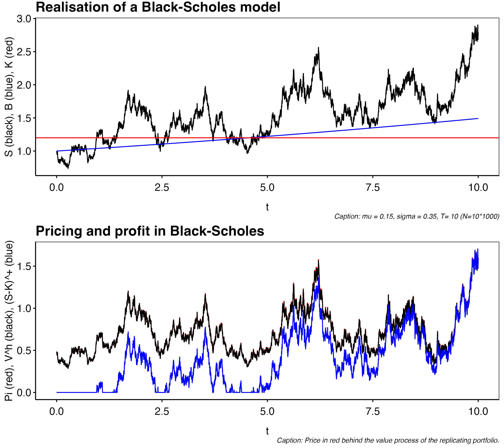

# Continuous Time Finance

This topic revolves around the theory of the Brownian motion and martingale processes. Other main topics are the binomial model and an introduction to financial derivatives. Financial derivatives is contingent on the outcome of a stochastic process at some future time $t=T$ and often is a function $\Phi$ of some assets price $S_t$. As such the derivative will give a stochastic payout, at time $t=T$ of the size $X_T=\Phi(S_T)$. Naturally we want to say something about the *fair* price of the derivative in the form of

$$
\Pi_t(X_T)=\mathbb{E}\left[\Phi(S_T)\ \vert\ \mathcal{F}_t\right],
$$

where $\mathcal{F}_t\subset\mathcal{F}$ is the available information at time $t$. We will by defualt intepret the times $t=0$ as *today* and $t=T$ as *tomorrow*. This indeed require some fundamental understanding of the behaviour of the asset price $S_t$. This lead us over to discussing the process in center of the *Black-Scholes* model: the Brownian motion.

## Discrete time models

### One-period time models

The study of this course is the **European call** option\index{European call option} (and *put* option). This financial derivative\index{financial derivative} is an agreement between two parties where the holder of the option has the right to *"exercise"* the derivative, at a future time $t=T$. Exercising means buying an asset at a certain agreed opon price-strike $K$. In the case of the put-option: the holder has the right (but not obligation) to sell the asset at the strike price $K$. As such the derivative has the payoff

$$
\text{Call}\ \text{option:}\hspace{10pt}\Phi(S_T)=(S_T-K)^+,\hspace{20pt}\text{Put}\ \text{option:}\hspace{10pt}\Phi(S_T)=(K-S_T)^+.
$$

Our objective is to understand when an arbitrage exist and to find the fair price of these derivative. The strategy in pricing is finding a replicating portfolio with the same payoff as the option (with probability one) and then price the derivative accordingly.

#### Model description

In the one-period model we consider the simplest possible market. We have two distinct times $t=0$ (today) and $t=1$ (tomorrow) and we may buy any portfolio as a mixture of bonds and one stock. We denote the bonds price by $B_t$ and the stocks price by $S_t$ and we assume the following:

$$
B_0=1,\ B_1=1+R,\hspace{20pt}S_0=s,\ S_1=\left\{\begin{matrix}s\cdot u, & with\ probability\ p_u.\\s\cdot d, & with\ probability\ p_d.\end{matrix}\right.
$$

We may introduce $Z$ as the random variable

$$
Z=u\cdot (I)+d\cdot (1-I),
$$

for an bernoulli variable $I$ with succes probability $p_u$. Naturally, we assume $d\le (1+R)\le u$ (this is imperative to ensure no arbitrage as we will see).

#### Portfolios and arbirtage

We study any portfolio on the $(B,S)$ market as a vector $h=(x,y)$ where $x$ is the amount of bonds and $y$ is the amount of stock held in the portfolio. Notice that we allow for shorting, that is $x<0$ or $y<0$. As such, we have that $h\in \mathbb{R}^2$. In this we have made some unrealistic, but attractable assumptions included in the assumptions:

  * We allow short positions and fractional holding, i.e. $h\in \mathbb{R}^2$,
  * We assume no spread between ask and bids,
  * No transaction costs and
  * A completely liquid market i.e. we may borrow and buy as much stock and bonds as wanted.

Given that we have chosen a portfolio $h$ we may introduce the value process.

<blockquote class = "def">

**Definition 2.1. (Bjork)**  _The **value process**\index{value process} of the porfolio $h\in\mathbb{R}^2$ is the stochastic process_

$$
V^h_t=xB_t+yS_t,\ t=0,1.
$$

</blockquote>

Given this notation we may define what an arbitrage is.

<blockquote class = "def">

**Definition 2.2. (Bjork)** _An **arbitrage**\index{arbitrage} is a portfolio $h$ with the properties: 1) $V^h_0=0$, 2) $P(V^h_1\ge 0)=1$ and 3) $P(V^h_1>0)>0$._

</blockquote>

That is $h$ is an deterministic money-machine where we at least never loose any money. Granted the bonds give a determinictic non-negative return, but an arbitrage does not require any money out of pocket. With the notion of an arbitrage we will show the first proposition regarding the choice of $R,u,d$ as defined above.

<blockquote class = "prop">

**Proposition 2.3. (Bjork)** _The one-period binomial model\index{one-period binomial model} is arbitrage free if and only if the following inequality hold:_

$$
d\le (1+R)\le u.\tag{2.1}
$$

</blockquote>
\noindent\makebox[\linewidth]{\rule{\textwidth}{0.4pt}}
<details>
<summary>**Proof.**</summary>

The statement is proofed by contradiction. Assume that $d>1+R$ holds. Then by definition $u>d>1+R$. Notice that any portfolio satisfying $V_0^h=0$ must satisfy

$$
0=xB_0+yS_0=x+ys\iff x=-ys
$$

That is for some choice $y$ the only arbitrage candidate is the portfolio $h=(-ys,y)$. Calculating the value at time $t=1$ we have

$$
V_1^h=-ys\cdot(1+R)+y\cdot s\cdot Z=ys(Z-1-R)
$$

However since $Z\ge d$ we have $Z-(1+R)\ge 0$ and therefore an arbitrage (for $y>0$). The other inequality $1+R>u$ follows analog steps. Simply choose some $y<0$ and the result follows. $\blacksquare$

</details>
\noindent\makebox[\linewidth]{\rule{\textwidth}{0.4pt}}
From inequality (2.1) we see that since $1+R$ is between $u$ and $d$ we may find a pair $q_d,q_u\ge 0$ with $q_d+q_u=1$ such that

$$
1+R=q_u\cdot u+q_d\cdot d.
$$

This yields the important risk neutral valuation formula as summed op in the following definition

<blockquote class = "def">

**Definition 2.4. (Bjork)** _A probability measure $Q$ is called a **martingale meausre**\index{martingale meausre} if the following condition holds:_

$$
S_0=\frac{1}{1+R}E^Q[S_1].
$$

</blockquote>

The above measure $Q$ is the measure $Q(Z=d)=q_d$ and $Q(Z=u)=q_u$ for the binomial model. This does in fact yield the risk neautral valuation formula:
\begin{align*}
S_0&=\frac{1}{1+R}E^Q[S_1]=\frac{1}{1+R}(Q(Z=d)\cdot d\cdot s+Q(Z=u)\cdot u\cdot s)\\
&=s\frac{1}{1+R}(q_d\cdot d+q_u\cdot u)=s,
\end{align*}
where we simply use $1+R=q_d\cdot d+q_u\cdot u$. We call this the risk neautral valuation formula because it in some sense gives an expected discounted value of the future stock price. We end this endavour with reformulating the arbitrage proposition and determining the values of the $Q$-measure.

<blockquote class = "prop">

**Proposition 2.5. (Bjork)** _The one-period binomial model is arbitrage free if and only if there exists a martingale measure $Q$._

</blockquote>

<blockquote class = "prop">

**Proposition 2.6. (Bjork)** _The one-period binomial model has martingale probabilities given by:_

$$
\left\{\begin{matrix}q_u=\frac{(1+R)-d}{u-d},\\ q_u=\frac{u-(1+R)}{u-d}.\end{matrix}\right.
$$

</blockquote>

#### Contingent Claims

This chapter revolves around the financial derivative and we start by stating the definition of the financial derivative.

<blockquote class = "def">

**Definition 2.7. (Bjork)** _A **contingent claim**\index{contingent claim} (financial derivative)\index{financial derivative} is *any* stochastic variable $X$ of the form $\Phi(Z)$, where $Z$ is the stochastic varible driving the stock price process._

</blockquote>

We may also call the function $\Phi$ the **contract function**\index{contract function} as it states how the contract is resolved once the stochastic variable $Z$ has been realised. Our objective is now to study, what a buyer of said contract would have to pay at any given time $t$. We call the fair price of $X$ at time $t$: $\Pi_t[X]$. As such it is easy to see that the fair price at the time of maturity $T$ is simply the payout $X$ i.e. $\Pi_T[X]=X$. Our strategy is to find a replicating portfolio $h$ and determine the price of said portfolio.

<blockquote class = "def">

**Definition 2.8. (Bjork)** _A contingent claim $X$ can be **replicated**\index{replicated}, or said to be **reachable**\index{reachable} if there exist a portfolio $h$ such that_

$$
V_1^h=X,
$$

_with probability one. In that case, we say that the portfolio $h$ is a **hedging** portfolio\index{hedging portfolio} or a **replicating** portfolio.\index{replicating portfolio} If all claims can be replicated we say that the market is **complete**\index{complete market}._

</blockquote>

Our pricing strategy is then to determine the value process of the replicating portfolio and then by the first pricing principle below we say that the price is imply the value of the replicating portfolio.

**Pricing principle 1.** If a clain $X$ is reachable with replicating portfolio $h$, then the only reasonable price process for $X$ is given by

$$
\Pi_t[X]=V_t^h.
$$

Notice, that this assumes that a replicating portfolio exist and even so we have a uniqueness statement to solve. We end this section by writing two important results.

<blockquote class = "prop">

**Proposition 2.9. (Bjork)** _Suppose that a claim $X$ is reachable with replicating portfolio $h$. Then any price at time $t\ge 0$ of the claim $X$ other than the value process of $h$ will lead to an arbitrage on the extended market $(B,S,X)$._

</blockquote>

<blockquote class = "prop">

**Proposition 2.10. (Bjork)** _If the one-period binomial model is free of arbitrage, then it is also complete._

</blockquote>

The hedging portfolio in the one-period binomial model is given by the portfolio $(x,y)$ below
\begin{align*}
x&=\frac{1}{1+R}\cdot\frac{u\Phi(d)-d\Phi(u)}{u-d},\tag{2.2}\\
y&=\frac{1}{s}\cdot\frac{\Phi(u)-\Phi(d)}{u-d}.\tag{2.3}
\end{align*}

#### Risk Neutral Valuation

We see that since the one-period model is complete we can price any contingent claim and we see that
\begin{align*}
\Pi_0[X]&=\frac{1}{1+R}\cdot\frac{u\Phi(d)-d\Phi(u)}{u-d}+s\frac{1}{s}\cdot\frac{\Phi(u)-\Phi(d)}{u-d}\\
&=\frac{1}{1+R}\left\{\frac{u\Phi(d)-d\Phi(u)}{u-d}+(1+R)\frac{\Phi(u)-\Phi(d)}{u-d}\right\}\\
&=\frac{1}{1+R}\left\{\frac{(1+R)-d}{u-d}\Phi(u)+\frac{u-(1+R)}{u-d}\Phi(d)\right\}\\
&=\frac{1}{1+R}E^Q[X].
\end{align*}
i.e. the price at time $t=0$ should simply be the expected discounted payout according to the martingale measure. This leads to the important pricing proposition:\index{risk-neutral valueation formula}

<blockquote class = "prop">

**Proposition 2.11. (Bjork)** _If the one-period binomial model is free of arbitrage, then the arbitrage free price of a contingent claim $X$ is given by_

$$
\Pi_0[X]=\frac{1}{1+R}E^Q[X].\tag{2.4}
$$

_Here the martingale measure $Q$ is uniquely determined by the relation_

$$
S_0=\frac{1}{1+R}E^Q[S_1],\tag{2.5}
$$

and the explicit expressions for $q_u$ and $q_d$ are given in proposition 2.6. Furthermore the claim $X$ can be replicated using the portfolio
\begin{align*}
x&=\frac{1}{1+R}\cdot\frac{u\Phi(d)-d\Phi(u)}{u-d},\tag{2.6}\\
y&=\frac{1}{s}\cdot\frac{\Phi(u)-\Phi(d)}{u-d}.\tag{2.7}
\end{align*}
</blockquote>

\newpage 

### Multi-period model

The one-period binomial model can easily be extended to a multi-period model,\index{multi-period model} by assuming that the bond and stock pricess evolve by the processes:

$$
t\ge1:\ B_t=(1+R)B_{t-1}\hspace{20pt}\text{and}\hspace{20pt}B_0=1,
$$

$$
t\ge1:\ S_t=Z_{t-1}S_{t-1}\hspace{20pt}\text{and}\hspace{20pt}S_0=s,
$$

where we obviously have that $B_t=(1+R)^t$ for $t\ge 0$. In the above $Z_t$ is $u$ with probability $p_u$ and $d$ with probability $p_d$. In this context, we need to define a portfolio in terms of a strategy.

<blockquote class = "def">

**Definition 2.13. (Bjork)** _A **portfolio strategy**\index{portfolio strategy} is a stochastic process on $\{1,...,T\}$_

$$
h=\left\{h_t=(x_t,y_t);\ t=1,...,T\right\}
$$

_such that $h_t$ is a function of $S_0,S_1,...,S_{t-1}$. For a given portfolio strategy $h$ we set $h_0=h_1$ by convention. The associated **value process**\index{value process} corresponding to the portfolio $h$ is defined by_

$$
V_t^h=x_t(1+R)+y_tS_t.
$$

</blockquote>

Given this notation we may define what an arbitrage is, but first we introduce the notion of a self-financing portfolio. A self-financing portfolio in an intuative sense is a portfolio that is not withdrawn from or deposited into.

<blockquote class = "def">

**Definition 2.14. (Bjork)** _A portfolio strategy $h$ is said to be **self-financing**\index{self-financing portfolio} if the following condition holds for all $t=0,...,T-1$:_

$$
x_t(1+R)+y_tS_t=x_{t+1}+y_{t+1}S_t.
$$

</blockquote>

The above equation says that the portfolio purchased at time $t$ and helt until $t+1$ $(x_{t+1},y_{t+1})$ can only be financed by the market value of the portfolio held from $[t-1,t)$ i.e. $(x_{t},y_{t})$. We now define an arbitrage.

<blockquote class = "def">

**Definition 2.15. (Bjork)** _An **arbitrage** is a self-financing portfolio $h$ with the properties: 1) $V^h_0=0$, 2) $P(V^h_T\ge 0)=1$ and 3) $P(V^h_T>0)>0$._

</blockquote>

The multiperiod binomial model has an just like the oneperiod model a result regarding when an arbitrage exists.

<blockquote class = "lem">

**Lemma 2.16. (Bjork)** _If $d\le (1+R)\le u$ (eq. 2.8) then the multiperiod model is arbitrage-free._

</blockquote>

As one can see, the multiperiod model is rather similar to the one period model. We wil in the following summarise equivalent statements for the multiperiod model as the ones in the oneperiod model. 

<blockquote class = "def">

**Definition 2.17. (Bjork)** _The martingale probabilities $q_u$ and $q_d$ are defined as the probabilities for which the relation below holds._

$$
s=\frac{1}{1+R}E^Q[S_{t+1}\ \vert\ S_t].
$$

</blockquote>

<blockquote class = "prop">

**Proposition 2.18. (Bjork)** _The martingale probabilities $q_u$ and $q_d$ are given by_

$$
\left\{\begin{matrix}q_u=\frac{(1+R)-d}{u-d},\\ q_u=\frac{u-(1+R)}{u-d}.\end{matrix}\right.
$$

</blockquote>

<blockquote class = "def">

**Definition 2.19. (Bjork)** _A **contingent claim**\index{contingent claim} is a stochastic variable $X$ of the form_

$$
X=\Phi(S_T),
$$

_where the **contract function**\index{contract function} $\mathbf{\Phi}$ is some given real valued function._

</blockquote>

<blockquote class = "def">

**Definition 2.20. (Bjork)** _A given contingent claim $X$ is said to be **reachable**\index{reachable} if there exists a self-financing portfolio $h$ such that_

$$
V_T^h=X,
$$

_with probability one. In that case we say that the portfolio $h$ is a **hedging** portfolio\index{hedging portfolio} or a **replicating** portfolio\index{replicating portfolio}. If all claims can be replicated we say that the market is *(dynamically)* **complete**\index{complete market}._

</blockquote>

**Pricing principle 2. (Bjork)** _If a claim $X$ is reachable with replicating portfolio $h$, then the only reasonable price process for $X$ os given by_

$$
\Pi_t[X]=V_t^h,\ t=0,1,...,T.
$$

<blockquote class = "prop">

**Proposition 2.21. (Bjork)** _Assume $X$ is reachable by $h$, then any price other than $V_t^h$ for some $t\ge 0$ leads to an arbitrage opportunity._

</blockquote>

<blockquote class = "prop">

**Proposition 2.22. (Bjork)** _The multiperiod model is complete, i.e. every claim can be replicated by a self-financing portfolio._

</blockquote>

<blockquote class = "prop">

**Proposition 2.24. (Bjork)** _**(Binomial algorithm)**\index{Binomial algorithm} Consider a $T$-claim $X=\Phi(S_T)$. Then this claim can be replicated using af self-financing portfolio. If $V_t(k)$ denotes the value of the portfolio at the node $(t,k)$ ($k$ referring to $k$ amount of up-moves for the stock), then $V_t(k)$ can be computed recursively by the scheme_

$$
\left\{\begin{matrix}V_t(k)=\frac{1}{1+R}\left\{q_uV_{t+1}(k+1)+q_dV_{t+1}(k)\right\},\\ V_T(k)=\Phi(su^kd^{T-k}).\end{matrix}\right.
$$

_where the martingale probabilities $q_u$ and $q_d$ are given by_

$$
\left\{\begin{matrix}q_u=\frac{(1+R)-d}{u-d},\\ q_u=\frac{u-(1+R)}{u-d}.\end{matrix}\right.
$$

_With the notation as above, the hedging portfolio is given by_

$$
\left\{\begin{matrix}x_t(k)=\frac{1}{1+R}\cdot\frac{uV_t(k)-dV_t(k+1)}{u-d},\\ y_t(k)=\frac{1}{S_{t-1}}\cdot\frac{V_t(k+1)-V_t(k)}{u-d}.\end{matrix}\right.
$$

_In particular, the arbitrage free price of the claim at $t=0$ is given by $V_0(0)$._

</blockquote>

<details>
<summary>**Example.**</summary>

```{tikz,echo=FALSE,fig.align = 'center',out.width = "75%"}
\tikzstyle{level 1}=[level distance=4cm, sibling distance=3.5cm,->]
\tikzstyle{level 2}=[level distance=4cm, sibling distance=2cm,->]

\tikzstyle{bag} = [text width=2em, text centered]
\tikzstyle{end} = []

\begin{tikzpicture}[grow=right, sloped]
\node[bag] {100}
    child {
        node[bag] {90}        
            child {
                node[end, label=right:
                    {81}] {}
                edge from parent
                node[above] {}
                node[below]  {$p_d^2$}
            }
            child {
                node[end, label=right:
                    {99}] {}
                edge from parent
                node[above] {}
                node[below]  {$p_dp_u$}
            }
            edge from parent 
            node[above] {}
            node[below]  {$p_d$}
    }
    child {
        node[bag] {110}        
        child {
                node[end, label=right:
                    {99}] {}
                edge from parent
                node[above] {$p_dp_u$}
                node[below]  {}
            }
            child {
                node[end, label=right:
                    {121}] {}
                edge from parent
                node[above] {$p_u^2$}
                node[below]  {}
            }
        edge from parent         
            node[above] {$p_u$}
            node[below]  {}
    };
\end{tikzpicture}
```

Consider $R=0.04$, $s=100$, $u=1.1$, $d=0.9$, $p_u=0.6$ and $p_d=0.4$. We consider a model of length $T=2$ and we want to evaluate the price of the european call option with srike $K=90$ that is the contingent claim

$$
X=(S_T-K)^+,\hspace{20pt}\Phi(s)=(s-K)^+.
$$

For each time $t$ we know the replicating portfolio, if we know the payoff the following period. Therefore we start from the leaves of the tree and work towards the root. Since the strike price is $K=90$ the end result will be the following payoffs:
\begin{align*}
u^2:\hspace{20pt}&(121-90)^+=31\\
ud:\hspace{20pt}&(99-90)^+=9\\
du:\hspace{20pt}&(99-90)^+=9\\
d^2:\hspace{20pt}&(81-90)^+=0
\end{align*}
Therefore by the risk neautral valuation formula with $q_u=\frac{(1+R)-d}{u-d}=0.7$ and $q_d=\frac{u-(1+R)}{u-d}=0.3$ we have that the cost of the replicating portfolio at time $t=1$ is respectively
\begin{align*}
u:\hspace{20pt}&\frac{1}{1+R}\left\{31\cdot q_u + 9 \cdot q_d\right\}\approx 23.46\\
d:\hspace{20pt}&\frac{1}{1+R}\left\{9\cdot q_u + 0 \cdot q_d\right\}\approx 6.06
\end{align*}
To replicate this payoff at time $t=1$ we can use the risk neutral valuation formula once more to find the base cost of the replicating portfolio i.e. the price of $X$ at time $t=0$

$$
\frac{1}{1+R}\left\{23.46\cdot q_u + 6.06 \cdot q_d\right\}\approx 17.54.
$$

Working from the root to the leaves we can now calculate the hedging portfolio at time $t=0,1$ for each path. For time $t=0$ we calculate
\begin{align*}
x=&\frac{1}{1+R}\cdot \frac{u\cdot 6.06-d\cdot 23.46}{u-d}\approx -69.46,\\
y=&\frac{1}{s}\cdot\frac{23.46-6.06}{u-d}\approx0.87
\end{align*}
We see by calculations that this does indeed replicate the payoff at time $t=1$:
\begin{align*}
u:\hspace{20pt}&V_1^h=(1+R)\cdot x + 110\cdot y\approx 23.46,\\
d:\hspace{20pt}&V_1^h=(1+R)\cdot x + 90\cdot y\approx 6.06.
\end{align*}
We also see by calculation that the initial portfolio does cost the expected 17.54 as

$$
x\cdot 1+y\cdot100=87-69.46=17.54.
$$

Following these steps at time $t=1$ the portfolios $(-86.54,1)$ (for the up-scenario) and $(-38.94,0.5)$ (for the down-scenario) would arise. Notice when calculating $y$ one has to use the current price $S_1=S_0\cdot Z$ not $S_0$. One should also check by similar calculations as above, that these portfolios does indeed replicate the payoff of the contingent claim $X$. $\square$

</details>

<blockquote class = "prop">

**Proposition 2.25. (Bjork)** _The arbitrage free price at $t=0$ of a $T$-claim $X$ is given by_

$$
\Pi_0[X]=\frac{1}{(1+R)^T}E^Q[X]
$$

_where $Q$ denotes the martingale measure, or more explicitly_

$$
\Pi_0[X]=\frac{1}{(1+R)^T}\sum_{k=0}^T\binom{T}{k}q_u^kq_d^{T-k}\Phi(su^kd^{T-k}).
$$

</blockquote>

<details>
<summary>**Example.**</summary>

```{r}
R <- 0.04
s <- 100
u <- 1.1
d <- 0.9
p_u <- 0.6
p_d <- 0.4
q_u <- (1+R-d)/(u-d)
q_d <- (u-1-R)/(u-d)
cap_t <- 2

#Test for K=90
K <- 90
pi_0 <- (1+R)**(-cap_t)*sum(
  choose(cap_t,0:cap_t)*q_u**(0:cap_t)*q_d**(cap_t - 0:cap_t)*pmax(s*u**(0:cap_t)*d**(cap_t - 0:cap_t)-K,0)
) # = 17.53883

pi_0 <- unlist(lapply(0:ceiling(s*u**cap_t), function(K){
  (1+R)**(-cap_t)*sum(
    choose(cap_t,0:cap_t)*q_u**(0:cap_t)*q_d**(cap_t - 0:cap_t)*pmax(s*u**(0:cap_t)*d**(cap_t - 0:cap_t)-K,0)
  )
}))
```
```{r, echo = FALSE,fig.align='center',out.width = "75%",fig.cap="The pricing function of the European call option."}
library(dplyr)
library(ggplot2)
p <- data.frame(K = 0:ceiling(s*u**cap_t),
           Pi_0 = pi_0) %>%
  ggplot(.) + geom_line(aes(x=K,y=Pi_0)) +
  labs(title = "Price of european call option",
       x = "Strike", y = "Price") +
  theme_bw() +
  theme(axis.text = element_text(size = 12),
        axis.title = element_text(size = 12),
        title = element_text(size = 16),
        plot.caption  = element_text(size = 10)) + theme_custom()
ggsave("figures/BS_call_price.png",bg='transparent',plot = p, height = 1080,width = 1620, units="px")

```

\begin{figure}[H]
  \begin{center}
    \includegraphics[width=0.75\textwidth]{figures/BS_call_price.png}
  \end{center}
  \caption{The pricing function of the European call option.}
\end{figure}

We follow an analog example as the one after proposition 2.24. Let $K=90$ and we see that
\begin{align*}
&\Pi_0[X]\\
&=\frac{1}{(1+0.04)^2}\sum_{k=0}^2\binom{2}{k}\cdot0.7^k\cdot0.3^{2-k}\cdot\Phi(100\cdot 1.1^k\cdot0.9^{2-k})\\
&=0.9245562\cdot\left(\underbrace{1\cdot 1\cdot0.09\cdot0}_{k=0}+\underbrace{2\cdot 0.7\cdot0.
3\cdot 9}_{k=1}+\underbrace{1\cdot 0.49\cdot1\cdot31}_{k=2}\right)\\
&=0.9245562\cdot\left(0+3.78+15.19\right)\\
&=17.53883
\end{align*}
Since we know that $K$ must meaningfully range in $[0,121]$ we could try to calculate the price of the contingent claim at time $t=0$ for all integers in this interval. We see that the price range between $S_0$ and 0 as expected. One can also see that the price changes slope at the prices 99 and 121 as the function is linear in $\Phi$ and som realisations loose any effect on the price when the strike is higher than the outcome. $\square$

</details>

<blockquote class = "prop">

**Proposition 2.26. (Bjork)** _The condition $d<(1+R)<u$ is necessary and sufficient condition for absence of arbitrage._

</blockquote>

\newpage

### Generelised one-period model

In the previous we had the simpel model where we only had one stochastic asset $S$ and only one stochastic variable $Z$ determining the future stock price. Now we will generelise this model by introducing $N$ assets and introducing som stochastic behaviour to the system.

#### Model specification

We consider the market consisting of a collection of stochastic prices assets $i=1,...,N$ with $N$-dimensional price process.

$$
S_t=\begin{bmatrix} S_t^1\\
\vdots\\
S_t^N\end{bmatrix}
$$

We now assume that $S_t$ is defined on a background space with finite sample space $\Omega = \{\omega_1,...,\omega_M\}$ with associated probabilities $p_j=P(\omega_j)$, $j=1,...,M$. We can then for eact time $t=1,...,T$ define the $N\times M$ matrix $D_t$ as such

$$
D_t=\begin{bmatrix} S_t^1(\omega_1)&\cdots &S_t^1(\omega_M)\\
\vdots &\ddots & \vdots\\
S_t^N(\omega_1) &\cdots&S_t^M(\omega_M)\end{bmatrix}.
$$

We will assume that $S_0^1>0$ and $S_1^1(\omega_j)>0$, $j=1,...,M$.

#### Absence of Arbitrage

We now define a **portfolio**\index{portfolio} as an $N$-dimensional row vector

$$
h=\begin{bmatrix} h^1, \dots,h^N\end{bmatrix}
$$

representing the amount of assets held at time $t=0$ and held until $t=1$. The **value process** is then

$$
V^h_t=h\cdot S_t=\sum_{i=1}^N h^iS_t^i,\ t=0,1.\tag{3.1}
$$

For a given $\omega_j\in\Omega$ we have the realisation

$$
V_t^h=hS_t(\omega_j)=hd_j=(hD)_j.
$$

<blockquote class = "def">

**Definition 3.1. (Bjork)** _The portfolio $h$ is an **arbitrage portfolio**\index{arbitrage portfolio} fil it satisfies the conditions: $V_0^h=0$, $P(V_1^h\ge 0)=1$ and $P(V_1^h>0)>0$._

</blockquote>

<blockquote class = "lem">

**Lemma 3.2. (Bjork)** _**(Farkas' Lemma)**\index{Farkas' Lemma} Suppose that $d_0,d_1,...,d_M$ are column vectors in $\mathbb{R}^N$. Then exactly one of the following problems possesses a solution._

  * **Problem 1**: _There exist $\lambda_1,...,\lambda_M\ge0$ such that $d_0=\sum_{j=1}^M\lambda_jd_j$._
  * **Problem 2**: _There exist $h\in\mathbb{R}^N$ such that $h^\top d_0<0$ and $h^\top d_j\ge 0$ for $j=1,...,M$._

</blockquote>

We now investegate this system for any possible arbitrage portfolios. However first we acknowledge that there exist a nominal price system $S_t$ and a normalised price system $Z_t$. The latter we define as the nominel pricess under the numeraire $S_t^1$ that is

$$
Z_t=\begin{bmatrix} S_t^1/S_t^1\\
S_t^2/S_t^1\\
\vdots\\
S_t^N/S_t^1\end{bmatrix}=\begin{bmatrix} 1\\
S_t^2/S_t^1\\
\vdots\\
S_t^N/S_t^1\end{bmatrix}.
$$

The reason for introducing the normalized price system is that we can without much effort translate results in this system to the nominal system and the normalised system is easier to analize. For this, however, we need af few results.

<blockquote class = "lem">

**Lemma 3.3. (Bjork)** _With notation as above, the following hold._

  1. _The $Z_t$ value process i related to the $S_t$ value process by_
  $$
  V_t^{h,Z}=hZ_t=\frac{1}{S_t^1}V_t^h.
  $$
  2. _A portfolio is an arbitrage in the $S_t$ system if and only if there is an arbitrage in the $Z_t$ system._
  3. _In the $Z_t$ price system, the numeraie asset $Z^1$\index{numeraie asset} has unit constant prices i.e. $Z_t^1=1$ for all $t\ge 0$._

</blockquote>

One of the reason that the normalised system is attractable is that the numeraire asset is constant i.e. risk free in the normalised system. Let us formulate our first main result.

<blockquote class = "prop">

**Proposition 3.4. (Bjork)** _The market is arbitrage free if and only if there exists strictly positive real numbers $q_1,...,q_M\ge 0$ with $q_1+\cdots + q_M=1$ (eq. 3.2) (probability vector) such that the following vector equality holds_

$$
\begin{bmatrix} Z_0^1\\
\vdots\\
Z_N^1\end{bmatrix}=\begin{bmatrix} Z_1^1(\omega_1)\\
\vdots\\
Z_1^N(\omega_1)\end{bmatrix}q_1+\cdots +\begin{bmatrix} Z_1^1(\omega_M)\\
\vdots\\
Z_1^N(\omega_M)\end{bmatrix}q_M.\tag{3.3}
$$

</blockquote>

#### Martingale Measures

<blockquote class = "def">

**Definition 3.5. (Bjork)** _Given the objective probability measure $P$ on $(\Omega,\mathcal{F},P)$, we say that another probability measure $Q$ defined on $\Omega$ is  **equivalent**\index{equivalent measure} to $P$ if_

$$
\forall A\in\mathcal{F}:P(A)=0\iff Q(A)=0,
$$

_or equivalently_

$$
\forall A\in\mathcal{F}:P(A)=1\iff Q(A)=1.
$$

</blockquote>

<blockquote class = "def">

**Definition 3.7. (Bjork)** _Consider the market model above and set $S^1$ as the numeraire asset. We say that a probability measure $Q$ defined on $\Omega$ is a **martingale measure**\index{martingale measure} if it satisfies the following conditions:_

  1. _$Q$ is equivalent to $P$, i.e. $Q\sim P$._
  2. _For every $i=1,...,N$, the normalized asset price process_
  $$
  Z_t^i=\frac{S_t^i}{S_t^1},
  $$
  _is martingale under the measure $Q$._

</blockquote>

<blockquote class = "thm">

**Theorem 3.8. (Bjork)** **(First Fundamental Theorem)**\index{First Fundamental Theorem} _Given a fixed numeraire, ther market is free of arbitrage possibilities if and only if there exists a martingale measure $Q$._

</blockquote>

By assuming that the numeraire asset is risk free (i.e. does not depend on $\omega$) then by scaling we can derive the short interest rate as

$$
1+R=\frac{S_1^1}{S_0^1}.
$$

With this in mind we can formulate theorem 3.8 in its more widely used form.

<blockquote class = "thm">

**Theorem 3.9. (Bjork)** **(First Fundamental Theorem)** _Assume that there exist a risk free asset, and denote the corresponding risk free interest rate by $R$. Then the market is arbitrage free if and only if there exist a measure $Q\sim P$ such that_

$$
S_0^i=\frac{1}{1+R}E^Q[S_1^i],\hspace{20pt}\text{for all}\ i=1,...,N.\tag{3.9}
$$

</blockquote>

#### Martingale Pricing

Moving forward we will assume that there exist a risk free asset and we will denote it by $B_t$ ($B_t=S^1_t/S^1_0$).

<blockquote class = "def">

**Definition 3.10. (Bjork)** _A **contingent claim**\index{contingent claim} is any random variable $X$, defined on the sample space $\Omega$._

</blockquote>

To ensure no arbitrage in the extended market containing the $N$ assets and the contingent claim we can apply the first fundamental pricing theorem on the extended market.

<blockquote class = "prop">

**Proposition 3.11. (Bjork)** _Consider a given claim $X$. In order to avoid arbitrage, $X$ must then be priced according to the formula_

$$
\Pi_0[X]=\frac{1}{1+R}E^Q[X],\tag{3.10}
$$

_where $Q$ is a martingale measure for the underlying market $(\Pi,S^1,...,S^N)$._

</blockquote>

#### Completeness

Given that a market is arbitrage-free we may run into a uniqueness issue when determining the price of a contingent claim. If a martingale measure exist we will very much like it to be unique as this will ensure that the price from the risk neutral valuation formula is unique. To this we need the market to be complete.

<blockquote class = "def">

**Definition 3.12. (Bjork)** _Consider a contingent claim $X$. If there exists a portfolio $h$, based on the underlying assets, such that_

$$
V_1^h=X,\ \text{with probability 1}\tag{3.11}
$$

_i.e._

$$
V_1^h(\omega_j)=X(\omega_j),\ j=1,...,M,\tag{3.12}
$$

_then we say that $X$ is **replicated**\index{replicated}, or **hedged**\index{hedged} by $h$. Such a portfolio $h$ is called a replicating, or hedging portfolio\index{replicating portfolio}\index{hedging portfolio}. If every contingent claim can be replicated, we say that the market is **complete**._

</blockquote>

We can now formulate a proposition on when the market is complete in terms of the matrix $D$.

<blockquote class = "prop">

**Proposition 3.13. (Bjork)** _The market is complete if and only if the rows of the matrix $D$ span $\mathbb{R}^M$, i.e. if and only if $D$ has rank $M$._

</blockquote>

Now we formulate the second fundamental pricing theorem in terms of the martingale measure $Q$.

<blockquote class = "prop">

**Proposition 3.14. (Bjork)** **(Second Fundamental Theorem)**\index{Second Fundamental Theorem} _Assume that the model is arbitrage free i.e. $Q$ exist. Then the market is unique if and only if the martingale measure is unique._

</blockquote>

#### Stochastic Discount Factors

<blockquote class = "def">

**Definition 3.16. (Bjork)** _The random variable $L$ on $\Omega$ is defined by_

$$
L(\omega_i)=\frac{q_i}{p_i},\hspace{20pt} i=1,...,M.
$$

</blockquote>

<blockquote class = "def">

**Definition 3.17. (Bjork)** _Assume the absence of arbitrage, and fix a martingale measure $Q$. With notation as above, the **stochastic discount factor**\index{stochastic discount factor} (or "state price deflator"\index{state price deflator}) is the random variable $\Lambda$ on $\Omega$ by_

$$
\mathbf{M}(\omega)=\frac{1}{1+R}\cdot L(\omega).\tag{3.19}
$$

</blockquote>

<blockquote class = "prop">

**Proposition 3.18. (Bjork)** _The arbitrage free price of any claim $X$ is given by the formula_

$$
\Pi_0[X]=E^P[\mathbf{M}\cdot X]\tag{3.20}
$$

_where $\mathbf{M}$ is a stochastic discount factor._

</blockquote>

\pagebreak

## Self-financing portfolios

We move forward in this chapter by first defining a self-financing portfolio in discrete time and then by letting the step length tend to zero obtain the continuous time analogue.

### Discrete time SF portfolio

We consider $N$ different adapted price processes $S^1,...,S^N$. We use the following definition.

<blockquote class = "def">

**Definition 6.1. (Bjork)** _We use the following definitions._

  * _$S_n^i$ is th price of asset $i$ at time $n$,_
  * _$h_n^i$ is the number of units of asset $i$ held during $[n,n+1)$, that is bought at time $n$,_
  * _$d_n^i$ is the dividends from asset $i$ in the time-interval $[n-1,n)$, that is recieved at time $n$,_
  * _$h_n$ is the portfolio $(h_n^1,...,h_n^N)$ held during $[n,n+1)$,_
  * _$c_n$ is the consumption i.e. withdrawel at time $n$ (negative being deposits/saving),_
  * _$V_n$ is the value of the portfolio just before time $n$ i.e. of the portfolio $h_{n-1}$ at time $n$._

</blockquote>

We are now ready to define the self-financing portfolio

<blockquote class = "def">

**Definition 6.2. (Bjork)** _A **self-financing portfolio supporting the consumption stream**\index{self-financing portfolio}\index{consumption stream} $\mathbf{c}$ is a portfolio adhering to the **budget constraint**\index{budget constraint} given as_

$$
h_{n+1}S_{n+1}+c_{n+1}=h_nS_{n+1}+h_nd_{n+1.}
$$

_The interpretation being, that we may only use funds obtained from selling the old portfolio $h_n$ and recieved in dividends to buy the new portfolio $h_{n+1}$ and consume the amount $c_{n+1}$._

</blockquote>

Before studying the self-financing portfolio we define the operator $\Delta$ (in definition 6.3) as the increment $\Delta x_n=x_{n+1}-x_n$ of a countable sequence $(x_n)_{n\in\mathbb{N}_0}$. Notice that we define the increment forward so the increment $n$ is the increment over the time period $[n,n+1)$ with the first increment being $[0,1)$. Using this notation we can derive the lemma below.

<blockquote class = "lem">

**Lemma 6.4. (Bjork)** _For any pair of sequences of real numbers $(x_n)_{n\in\mathbb{N}_0}$ and $(y_n)_{n\in\mathbb{N}_0}$ we have the relations_
\begin{align*}
\Delta(xy)_n&=x_n\Delta y_n+y_{n+1}\Delta x_n,\tag{6.5}\\
\Delta(xy)_n&=y_n\Delta x_n+x_{n+1}\Delta y_n,\tag{6.6}\\
\Delta(xy)_n&=x_n\Delta y_n+y_n\Delta x_n+\Delta x_n\Delta y_n.\tag{6.7}
\end{align*}
_This is also valid if the sequances are $N$-dimensional, where we interpret the products above as scalar products ($xy^\top$)._

</blockquote>

Using these definitions and the lemma above we see that the dynamics of the self-financing portfolio is given below.

<blockquote class = "prop">

**Proposition 6.6. (Bjork)** _The dynamics of any self-financing portfolio supporting the consumption stream $c$ are given by_

$$
\Delta V_n=h_n \Delta S_n+h_nd_{n+1}-c_{n+1},\tag{6.11}
$$

_or, in more detail_

$$
\Delta V_n=\sum_{i=1}^Nh_n^i(\Delta S_n^i+d^i_{n+1})-c_{n+1}.\tag{6.12}
$$

</blockquote>

We may rewrite the dividends as accumulating dividends $D^i_n=\sum_{k=1}^nd^i_k$ and see that $d_{n+1}^i=\Delta D^i_n$ and so the above condition is equivalent with.

<blockquote class = "prop">

**Proposition 6.8. (Bjork)** _The dynamics of any self-financing portfolio supporting the consumption stream $c$ are given by_

$$
\Delta V_n=h_n \Delta S_n+h_n\Delta D_n-c_{n+1},\tag{6.15}
$$

_or, in more detail_

$$
\Delta V_n=\sum_{i=1}^Nh_n^i(\Delta S_n^i+\Delta D^i_n)-c_{n+1}.\tag{6.16}
$$

</blockquote>

### Continuous time SF portfolio

Formulating the dynamics of the self-financing portfolio in continuous time is easy work given the discrete setup above. However since we now are in continuous time we will change the $n$ with a $t$ and cosider the behavour $V_{t+dt}-V_t$ as we let $dt\to 0$. First we formulate some basic notation.

<blockquote class = "def">

**Definition 6.9. (Bjork)** _We use the following definitions._

  * _$S_t^i$ is th price of asset $i$ at time $t$,_
  * _$h_t^i$ is the number of units of asset $i$ held at time $t$,_
  * _$D_t^i$ is the cumulative dividend processs for asset $i$,_
  * _$h_t$ is the portfolio $(h_t^1,...,h_t^N)$ held at time $t$,_
  * _$c_t$ is the consumption rate at time $n$ (negative being deposits/saving),_
  * _$V_t$ is the value of the portfolio at time $t$ i.e. of the portfolio $h_t$ at time $t$._

</blockquote>

Given these definitions we may define a portfolio strategy that is self-financing.

<blockquote class = "def">

**Definition 6.10. (Bjork)** _Let $S$ be and adapted $N$-dimensional price process. We define the following_

  1. _A **portfolio strategy**\index{portfolio strategy} is any adapted $N$-dimensional process $h$._
  2. _The **value process**\index{value process} $V^h$ corresponding to the portfolio $h$ is given by_
  $$
  V_t^h=\sum_{i=1}^N h_t^iS_t^i.\tag{6.17}
  $$
  3. _A **consumption process**\index{consumption process} is any adapted one-dimensional process $c$._
  4. _A portfolio-consumption pair $(h,c)$ is called **self-financing** if the value process $V^h$ satisfies the condition_
  $$
  dV_t^h=\sum_{i=1}^N h_t^i(dS_t^i+d D^i_t)-c_t\ dt,\tag{6.18}
  $$
  _i.e. if_
  $$
  dV_t^h=h_t\ dS_t + h_t\ dD_t -c_t\ dt.
  $$
  5. _The **gain process**\index{gain process} $G$ is defined by_
  $$
  G_t=S_t+D_t\tag{6.19}
  $$
  _so we can write the self-financing condition\index{self-financing condition} as_
  $$
  dV_t=h_t\ dG_t-c_t\ dt.\tag{6.20}
  $$
  6. _The portfolio $h$ is said to be **Markovian**\index{Markovian} if it is of the form_
  $$
  h_t=h(t,S_t),
  $$
  _for some function $h : \mathbb{R}_+\times \mathbb{R}^N\to\mathbb{R}^N$._

</blockquote>

### Portfolio weights

<blockquote class = "def">

**Definition 6.11. (Bjork)** _For a given portfolio $h$ the corresponding **relative portfolio**\index{relative portfolio} or **portfolio weights**\index{portfolio weights} $w$ are defined by_

$$
w_t^i=\frac{h_t^iS_t^i}{V_t^h},\ i=1,...,N,\tag{6.21}
$$

_so, in particular, we have $\sum_{i=1}^N w_i=1$._

</blockquote>

<blockquote class = "lem">

**Lemma 6.12. (Bjork)** _A portfolio-consumption pair\index{portfolio-consumption pair} $(h,c)$ is self-financing if and only if_

$$
dV_t^h=V_t^h\sum_{i=1}^N w_t^i\frac{dS_t^i+dD_t^i}{S_t^i}-c_t\ dt\tag{6.22}
$$

_or equivalently with the absolute weights_

$$
dV_t^h=\sum_{i=1}^N h_t^i(dS_t^i+dD_t^i)-c_t\ dt.
$$

</blockquote>

<blockquote class = "lem">

**Lemma 6.13. (Bjork)** _Consider the case with no dividends. Let $c$ be a consumption process, and assume that there exist a scalar process $Z$ and a vector process $q=(q^1,...,q^N)$ such that_

$$
dZ_t=Z_t\sum_{i=1}^N q_t^i\frac{dS_t^i}{S_t^i}-c_t\ dt,\tag{6.23}
$$

_and $\sum_{i=1}^Nqq^i=1$ (eq. 6.24). Now define a portfolio $h$ by_

$$
h_t^i=\frac{q_t^iZ_t}{S_t^i}.\tag{6.25}
$$

_Then the value process $V^h$ is given by $V^h=Z$, the pair $(h,c)$ is self-financing, and the corresponding relative portfolio $w$ is given by $w=q$._

</blockquote>

\newpage 

## Black-Scholes PDE

The Black-Scholes model revolves arround SDE's as seen above. In this model we have two assets a risk free asset $B$ and a stochastic priced asset $S$. We therefore start by defining what we mean by a quote-on-qoute *risk free* asset.

<blockquote class = "def">

**Definition 7.1. (Bjork)** _The price process $B$ is the price of a **risk free asset**\index{risk free asset} if it has the dynamics_

$$
dB_t=r_t B_t\ dt,\tag{7.1}
$$

_where $r$ is any $\mathcal{F}_t$ adapted process._

</blockquote>

We see from this definition that the meaning of "risk free" is the property, that $B$ is priced locally deterministic in the sence that $r$ is adapted and therefore known at time $t$ and we therefore know the yield on a short term basis. This is also why we may call $r$ the **short interest rate**\index{short interest rate}. Given the dynamics above, we know that $B$ in fact is represented by the process

$$
B_t=B_0e^{\int_0^tr_s\ ds},
$$

for some $B_0$ initial value. We will moving forward assume that $B_0=1$. The stochastic asset $S$ has dynamics.

$$
dS_t=\mu(t,S_t)\ dt + \sigma(t,S_t)\ dW_t,\tag{7.2}
$$

where as usual $\mu$ and $\sigma$ are deterministic functions and $W_t$ is a standard Brownian motion. Note that the risk free asset has a similarly process with $\sigma = 0$. We may now include this in the definition of the Black-Scholes model.

<blockquote class = "def">

**Definition 7.2. (Bjork)** _The **Black-Scholes model**\index{Black-Scholes model} consists of two assets with dynamics given by_
\begin{align*}
dB_t&=rB_t\ dt,\tag{7.3}\\
dS_t&=\mu S_t\ dt+\sigma S_t\ dW_t,\tag{7.4}
\end{align*}
_where $r,\mu,\sigma$ are deterministic constants._

</blockquote>

<blockquote class = "def">

**Definition 7.3. (Bjork)** _A **zero coupon bond**\index{zero coupon bond} with maturity $T$ (henceforth "$T$-bond"\index{$T$-bond}) is an asset which pays the holder the face value 1 dollar at time $T$. The price at time $n$ of a $T$-bond is denoted by $p(n,T)$._

</blockquote>

<blockquote class = "def">

**Definition 7.4.** _The (possible stochastic) discrete **short rate**\index{short rate} $r_n$, for the period $[n,n+1]$, is defined as_

$$
p(n,n+1)=\frac{1}{1+ r_n}.\tag{7.6}
$$

</blockquote>

From this short rate we may derive the dynamics of the bank account recieving zero-coupon rates for each distinct time interval.

<blockquote class = "def">

**Definition 7.5. (Bjork)** _The dynamics of the bank account\index{bank account} are given by_

$$
\Delta B_n=r_n B_n.\tag{7.7}
$$

</blockquote>

### Contingent Claims and Arbitrage

<blockquote class = "def">

**Definition 7.6. (Bjork)** _A **European call option**\index{European call option} with **exercise price**\index{exercise price} (or strike price\index{strike price}) $K$ and **time of maturity**\index{time of maturity} (exercise date\index{exercise date}) $T$ on the **underlying asset** $S$ is a contract defined by the following clauses:_

  * _The holder of the option has, at time $T$, the right to buy one share of the underlying stock at the price $K$ dollars from the underwriter of the option._
  * _The holder of the option is in no way obliged to buy the underlying stock._
  * _The right to buy the underlying stock at the price $K$ can only be exercised at the precise time $T$._

</blockquote>

Obviously, we also have the **european put** option which gives the owner the right to sell an asset at price $K$ at time $T$. Let os formally define a contingent claim.

<blockquote class = "def">

**Definition 7.7.** _Consider a financial market with vector price process $S$. A **contingent claim** with **date of maturity** $T$, also called a $T$-claim, is any random variable $\mathcal{X}\in\mathcal{F}_T^S$. A contingent claim $\mathcal{X}$ is called a **simple** claim if it is of the form $\mathcal{X} = \Phi(S_t)$. The function $\Phi$ is called the **contract function**._

</blockquote>

<blockquote class = "def">

**Definition 7.8. (Bjork)** _An **arbitrage** possibility\index{arbitrage portfolio} on a financial market is a self-financed portfolio $h$ such that_
\begin{align*}
V^h(0)&=0,\tag{7.13}\\
P(V_T^h\ge0)&=1,\tag{7-14}\\
P(V_T^h>0)&>0.\tag{7.15}
\end{align*}
_We say that the market is **arbitrage free** if there are no arbitrage possibilities._

</blockquote>

<blockquote class = "def">

**Definition 7.9. (Bjork)** _Suppose that there exists a self-financing portfolio $h$, such that the value process $V^h$ has the dynamics_

$$
d V_t^h=k_tV_t^h\ dt,\tag{7.16}
$$

_where $k$ is an adapted process. Then it must hold that $k_t=r_t$ for all $t$, ore there exists an arbitrage possibility._

</blockquote>

<blockquote class = "thm">

**Theorem 7.10. (Bjork)** **(Black-Scholes equation)**\index{Black-Scholes equation} _Assume that the market is specified by the equations_
\begin{align*}
dB_t&=rB_t\ dt,\tag{7.18}\\
dS_t&=\mu(t,S_t) S_t\ dt+\sigma(t,S_t)S_t\ dW_t,\tag{7.19}
\end{align*}
_and that we want to price a contingent claim of the form $\mathcal{X}=\Phi(S_t)$ (eq. 7.20). Then the only pricing function of the form $\Pi_t[\Phi(S_t)]=F(t,S_t)$ (eq. 7.21) which is consistent with the absence of arbitrage in the market $[B_t,S_t,\Pi_t]$ is when $F$ is the solution of the following boundary value problem in the domain $[0,T]\times\mathbb{R}_+$:_
\begin{align*}
F_t(t,s)+rsF_s(t,s)+\frac{1}{2}s^2\sigma^2(t,s)F_{ss}(t,s)-rF(t,s)&=0,\\
F(T,s)&=\Phi(s).
\end{align*}
</blockquote>

### Risk Neutral Valuation

<blockquote class = "thm">

**Theorem 7.11. (Bjork)** **(Risk Neutral Valuation)**\index{Risk Neutral Valuation formula} _The arbitrage free price of the claim $\Phi(S_t)$ is given by $\Pi_t[\Phi]=F(t,S_t)$, where $F$ is given by the formula_

$$
F(t,s)=e^{-r(T-t)}E^Q_{t,s}[\Phi(S_T)],\tag{7.43}
$$

_where the $Q$-dynamics of $S$ are those of_

$$
dS_t=rS_t\ dt+S_t\sigma(t,S_t)\ dW_t^Q.\tag{7.42}
$$

</blockquote>

<blockquote class = "prop">

**Property 7.12. (Bjork)** **(The Martingale Property)**\index{Martingale Property} _In the Black-Scholes model, the price process $\Pi_t$ for every traded asset, be it the underlying or derivate asset, has the property the the normalized price process_

$$
Z_t=\frac{\Pi_t}{B_t},
$$

_(including $S_t/B_t$) is a martingale under the measure $Q$._

</blockquote>

### Black-Scholes formula

```{r,echo=FALSE,include=TRUE,out.width="75%",fig.align='center'}
set.seed(10)
mu <- 0.15
sigma <- 0.35
r <- 0.04
N <- 1000 #Observations pr. year
T <- 10
t <- (0:(T*N))/N
deltaW <- rnorm(length(t)-1,mean =0, sd = sqrt(1/N))
S_0 <- 1
K <- 1.2
d_1 <- (log(S_0/K)+(r+0.5*sigma**2)*(T-0))/(sigma*sqrt(T-0))
d_2 <- d_1 - sigma*sqrt(T-0)
Pi_0 <- S_0 * pnorm(d_1)-exp(-r*(T-0))*K*pnorm(d_2)
W_B_0 <- (Pi_0-S_0*pnorm(d_1))/Pi_0
W_S_0 <- 1 - W_B_0
Prices <- data.frame(t = t,
                     S = S_0,
                     B = exp(r*t),
                     Pi = Pi_0,
                     W_B = W_B_0,
                     Value = Pi_0,
                     Phi = max(S_0-K,0))
for (i in 2:length(t)){
  S_t <- Prices[i-1,"S"]
  S_t <- S_t+S_t*mu/N+S_t*sigma*deltaW[i-1]
  Prices[i,"S"] <- S_t
  Prices[i,"Value"] <- Prices[i-1,"Value"]*(1+((S_t/Prices[i-1,"S"]-1)*(1-Prices[i-1,"W_B"])+(Prices[i,"B"]/Prices[i-1,"B"]-1)*Prices[i-1,"W_B"]))
  d_1 <- (log(S_t/K)+(r+0.5*sigma**2)*(T-Prices[i,"t"]))/(sigma*sqrt(T-Prices[i,"t"]))
  d_2 <- d_1 - sigma*sqrt(T-Prices[i,"t"])
  Pi <- S_t * pnorm(d_1)-exp(-r*(T-Prices[i,"t"]))*K*pnorm(d_2)
  Prices[i,"Pi"] <- Pi
  W_B <- (Pi-S_t*pnorm(d_1))/Pi
  Prices[i,"W_B"] <- W_B
  Prices[i,"Phi"] <- max(S_t-K,0)
}
p1 <- ggplot2::ggplot(data = Prices) + geom_line(aes(x=t,y=S), col = "black") + geom_line(aes(x=t,y=B),col = "blue") + geom_hline(yintercept = K, col = "red") +
  labs(title = "Realisation of a Black-Scholes model",
       y="S (black), B (blue), K (red)",
       caption = "Caption: mu = 0.15, sigma = 0.35, T= 10 (N=10*1000)") +
  theme_bw() +
  theme(axis.text = element_text(size = 12),
        axis.title = element_text(size = 12),
        title = element_text(size = 16),
        plot.caption  = element_text(size = 10)) + theme_custom()
p2 <- ggplot2::ggplot(data = Prices)+ geom_line(aes(x=t,y=Pi), col = "red") +geom_line(aes(x=t,y=Value), col = "black") + geom_line(aes(x=t,y=Phi), col = "blue") +
  labs(title = "Pricing and profit in Black-Scholes",
       y="Pi (red), V^h (black), (S-K)^+ (blue)",
       caption = "Caption: Price in red behind the value process of the replicating portfolio.") +
  theme_bw() +
  theme(axis.text = element_text(size = 12),
        axis.title = element_text(size = 12),
        title = element_text(size = 16),
        plot.caption  = element_text(size = 10)) + theme_custom()
p <- ggpubr::ggarrange(p1,p2,nrow = 2)
ggsave("figures/BS_sim.png",bg='transparent',plot = p, height = 1080*2,width = 1620*1.5, units="px")

```

\begin{figure}[H]
  \begin{center}
    \includegraphics[width=0.75\textwidth]{figures/BS_sim.png}
  \end{center}
\end{figure}

This chapter will center on deriving the famous Black-Scholes formula. We start by laying out the assumptions of the model. We have a market consiting of two assets: a stochastic prices asset $S$ and a risk free asset $B$. The prices processes have dynamics:
\begin{align*}
dS_t&=\mu S_t\ dt+\sigma S_t\ dW_t,\tag{7.45}\\
dB_t&=r B_t\ dt,\tag{7.44}
\end{align*}
where $S_0=s$ and $B_0=1$ (by assumption). Now from Feymann-Kac and the definition of arbitrage we know that a simple claim $\Phi(S_t)$ has the arbitrage free price given by the risk neutral valueation formula.

$$
F(t,s)=e^{-r(T-t)}E^Q_{t,s}[\Phi(S_T)],\tag{7.46}
$$

where $Q$ is a probability measure, namely a Martingale measure, such that the dynamics of $S$ under this measure is

$$
dS_t=r S_t\ dt+\sigma S_t\ dW^Q_t,\tag{7.47}
$$

with $W_t^Q$ being a Brownian motion wrt. to the probability measure $Q$ (not $P$). The above still has the initial condition $S_0=s$. Given these assumptions we may formulate the Black-Scholes formula.

<blockquote class = "thm">

**Theorem 7.13. (Bjork)** **(Black-Scholes formula)**\index{Black-Scholes formula} _The price of the european call option with strikeprice $K$ and maturity $T$ (contract function $\Phi(S_t)=\left( S_t - K\right)^+$) takes the form $\Pi_t=F(t,s)$, where_

$$
F(t,s)=s N(d_1(t,s))-e^{-r(T-t)}KN(d_2(t,s)),\tag{7.52}
$$

_where $N$ is the distribution-function for an $\mathcal{N}(0,1)$-distributed random variable and_
\begin{align*}
d_1(t,s)&=\frac{1}{\sigma \sqrt{T-t}}\left(\log\left(\frac{s}{K}\right)+\left(r+\frac{1}{2}\sigma^2\right)(T-t)\right),\tag{7.53}\\
d_2(t,s)&=d_1(t,s)-\sigma\sqrt{T-t}.\tag{7.54}
\end{align*}
</blockquote>
\noindent\makebox[\linewidth]{\rule{\textwidth}{0.4pt}}
<details>
<summary>**Proof.**</summary>

We let the market be given in terms of the price processes $S$ and $B$ with dynamics.
\begin{align*}
dS_t&=\mu S_t\ dt+\sigma S_t\ dW_t,\\
dB_t&=r B_t\ dt,
\end{align*}
with $B_t=1$ and $S_t=s$. We assume that $\mu,\sigma, r$ are deterministic real numbers. Consider the contingent claim 

$$
\Phi(S_t)=\left( S_t - K\right)^+,
$$

that is the European call option. Let $Q$ be a martingale measure such that the dynamics of $S$ may be written as

$$
dS_t=r S_t\ dt+\sigma S_t\ dW^Q_t,
$$

then $S_t$ is clearly a GBM wrt. the measure $Q$. Therefore we know the solution given in terms of the increment of the Brownian motion $W^Q$ as follows

$$
S_u=s\cdot \exp\left\{\left(r-\frac{1}{2}\sigma^2\right)(u-t)+\sigma\left(W_u^Q-W_t^Q\right)\right\},
$$

for some initial condition $S_t=s$. From theorem 7.10 we know that the only pricing function which takes the form

$$
\Pi_t[\Phi(S_T)]=F(t,S_t),
$$

can only be consistent with the absence of arbitrage if $F$ is the solution the the boundary value problem
\begin{align*}
F_t(t,s)+rsF_s(t,s)+\frac{1}{2}s^2\sigma^2F_{ss}(t,s)-rF(t,s)&=0,\\
F(T,s)&=\Phi(s).
\end{align*}
From Feymann-Kac we then know that the stochastic representation of such a solution take the form

$$
F(t,s)=e^{-r(T-t)}E_{t,s}^Q[\Phi(S_T)].
$$

Here the superscript refers to taking mean value with respect to the measure $Q$. This gives the solution to the pricing function

$$
F(t,s)=e^{-r(T-t)}\int \Phi(S_T)\ dQ.
$$

Under the measure $Q$ we have that for $u\ge t$:

$$
Z_u=\log (S_u/s)\sim \mathcal{N}\left(\left(r-\frac{1}{2}\sigma^2\right)(u-t),\sigma\sqrt{u-t}\right)
$$

Hence we may set $u=T$ and observe that
\begin{align*}
F(t,s)&=e^{-r(T-t)}\int_{-\infty}^\infty \Phi(se^z) f(z)\ dz\\
&=e^{-r(T-t)}\int_{-\infty}^\infty (se^z-K)^+ f(z)\ dz\\
&=e^{-r(T-t)}\int_{\log\left(\frac{K}{s}\right)}^{\infty} (se^z-K) f(z)\ dz\\
&=e^{-r(T-t)}\left(s\int_{\log\left(\frac{K}{s}\right)}^{\infty} e^z f(z)\ dz-K\int_{\log\left(\frac{K}{s}\right)}^{\infty} f(z)\ dz\right),
\end{align*}
where we used that $f$ is the distribution function of a normal distributed random variable with mean $(r-\sigma^2/2)(T-t)$ and variance $\sigma\sqrt{T-t}$ and that

$$
(se^z-K)^+ \ge 0\iff se^z\ge K\iff z\ge \log\left(\frac{K}{s}\right)
$$

Using that the MGF of a $X\sim\mathcal{N}(\alpha, \beta^2)$ variable is

$$
E[e^{tX}]=e^{\alpha t+\frac{1}{2}\beta ^2t^2},
$$

and the shorthand $N(t)$ for the distribution function of the standard normal distribution, we have
\begin{align*}
F(t,s)&=e^{-r(T-t)}\left(sE\left[e^{Z_T}1_{Z_T\ge \log\left(\frac{K}{s}\right)}\right]-K P\left(Z_T\ge \log\left(\frac{K}{s}\right)\right)\right)\\
&=e^{-r(T-t)}s\exp\left\{\left(r-\frac{1}{2}\sigma^2\right)(T-t)+\frac{1}{2}\sigma^2(T-t)\right\}E\left[1_{Z_T\ge \log\left(\frac{K}{s}\right)}\right]\\
&-e^{-r(T-t)}K P\left(X\ge\frac{1}{\sigma\sqrt{T-t}}\left( \log\left(\frac{K}{s}\right)-(r-\sigma^2/2)(T-t)\right)\right)\\
&=sE\left[1_{Z_T\ge \log\left(\frac{K}{s}\right)}\right]-e^{-r(T-t)}K P\left(X\le\frac{1}{\sigma\sqrt{T-t}}\left(\log\left(\frac{s}{K}\right)+(r-\sigma^2/2)(T-t)\right)\right)\\
&=sN(d_1(s,t))-e^{-r(T-t)}K N\left(d_2(s,t)\right),
\end{align*}
as desired. $\blacksquare$

</details>

\newpage

## Completeness and Hedging

We derived the pricing function of the european call option above and introduced the theory around boundary value problems and Feymann-Kac solution to the partial differential stochastic equation. Now we want to see if a portfolio exists such that it gives the payout $\Phi(S_T)$ with probability one.

In order to do this, we return to the concept of hedge and replication.

<blockquote class = "def">

**Definition 8.1. (Bjork)** _We say that a $T$-claim $\mathcal{X}$ can be **replicated**\index{replicated}, alternatively the it is **reachable**\index{reachable} or **hedgeable**\index{hedgeable}, if there exists a self-financing portfolio $h$ such that_

$$
V_T^h=\mathcal{X},\ P-\text{a.s.}\tag{8.1}
$$

_In this case we say that $h$ is a **hedge** against $\mathcal{X}$. Alternatively, $h$ is called a **replicating** or **hedging** portfolio\index{replicating portfolio}\index{hedging portfolio}. If every contingent claim is reachable we say that the market is **complete**\index{complete market}._

</blockquote>

If we can find a portfolio $h$ that reaches $\mathcal{X}$ in value over the time period $[t,T]$ it must mean, that holding the portfolio is equivalent with holding the contract itself. We therefore have the natural assumption that the price process must satisfie $\Pi_t[\mathcal{X}]=V_t^h$ for all $t\ge 0$. How this relates to the absence of arbitrage is given below.

<blockquote class = "prop">

**Proposition 8.2. (Bjork)** _Suppose $\mathcal{X}$ is hedged using the portfolio $h$. Then the only price process $\Pi_t[\mathcal{X}]$ which is consistent with no arbitrage is given by $\Pi_t[\mathcal{X}]=V_t^h$. Furthermore, if $\mathcal{X}$ can be hedged by both $h$ and $g$ then $V_t^g=V_t^h$ for all $t$ with probability one._

</blockquote>

### Completeness in Black-Scholes

The Black-Scholes model will be investegated in the following. We start by stating the important theorem.

<blockquote class = "thm">

**Theorem 8.3. (Bjork)** _Consider the Black-Scholes model given by_
\begin{align*}
dS_t&=\mu(t,S_t) S_t\ dt+\sigma(t,S_t) S_t\ dW_t,\tag{8.2}\\
dB_t&=r B_t\ dt,\tag{8.3}
\end{align*}
_The model above is complete._

</blockquote>

The following lemma gives us replicability of a **simple** claim\index{simple claim} (which we will restrict ud to).

<blockquote class = "lem">

**Lemma 8.4. (Bjork)** _Suppose that there exist an adapted process $V$ and an adapted process $w=[w^B,w^S]$ with $w^B_t+w^S_t=1$ (eq. 8.4) for all $t\ge 0$, such that_
\begin{align*}
dV_t&=V_t(w_t^Br+w_t^S\mu(t,S_t))\ dt+V_tw_t^S\sigma(t,S_t)\ dW_t,\tag{8.5}\\
V_t&=\Phi(S_t).\tag{8.5}
\end{align*}
_Then the claim $\mathcal{X}=\Phi(S_t)$ can be replicated using $w$ as the relative portfolio. The corresponding value process is given by the process $V$ and the absolute portfolio $h$ is given by_
\begin{align*}
h_t^B&=\frac{w_t^B V_t}{B_t},\tag{8.6}\\
h_t^S&=\frac{w_t^S V_t}{S_t}.\tag{8.7}
\end{align*}
</blockquote>

Doing some heuristics we come up with some clever weights, which turns on to adhere to the boundary value problem formulated in the Black-Scholes equation. Given that the weights gives rise to the desired value process, we have succesfully found the portfolio weight (see lemma above).

<blockquote class = "thm">

**Theorem 8.5. (Bjork)** _Consider the Black-Scholes model given in (8.3)-(8.4), and a simple contingent claim $\mathcal{X}=\Phi(S_t)$. Define $F$ as the solution to the boundary value problem_
\begin{align*}
F_t(t,s)+rsF_s(t,s)+\frac{1}{2}s^2\sigma^2F_{ss}(t,s)-rF(t,s)&=0,\tag{8.17}\\
F(T,s)&=\Phi(s).\tag{8.17}
\end{align*}
_Then $\mathcal{X}$ can be replicated by the relative portfolio_
\begin{align*}
w_t^B&=\frac{F(t,S_t)-S_tF_s(t,S_t)}{F(t,S_t)},\tag{8.18}\\
w_t^S&=\frac{S_tF_s(t,S_t)}{F(t,S_t)}.\tag{8.19}
\end{align*}
_The corresponding absolute portfolio is given by_
\begin{align*}
h_t^B&=\frac{F(t,S_t)-S_tF_s(t,S_t)}{B_t},\tag{8.20}\\
h_t^S&=F_s(t,S_t),\tag{8.21}
\end{align*}
_and the value process $V^h$ is given by_

$$
V^h_t=F(t,S_t).\tag{8.22}
$$

</blockquote>

<blockquote class = "prop">

**Proposition 8.6. (Bjork)** _Consider the Black-Scholes model given in (8.3)-(8.4), and a contingent claim on the form $\mathcal{X}=\Phi(S_T,Z_T)$ (eq. 8.29). We define the process $Z_t$ as_

$$
Z_t=\int_0^tg(u,S_u)\ du,\tag{8.30}
$$

_for some choice of the deterministic function $g$. Then $\mathcal{X}$ can be replicated using a relative portfolio given by_
\begin{align*}
w_t^B&=\frac{F(t,S_t,Z_t)-S_tF_s(t,S_t,Z_t)}{F(t,S_t,Z_t)},\tag{8.31}\\
w_t^S&=\frac{S_tF_s(t,S_t,Z_t)}{F(t,S_t,Z_t)}.\tag{8.32}
\end{align*}
_where $F$ is the solution to the boundary value problem_
\begin{align*}
F_t(t,s,z)+rsF_s(t,s,z)+\frac{1}{2}s^2\sigma^2F_{ss}(t,s,z)-rF(t,s,z)&=0,\tag{8.33}\\
F(T,s,z)&=\Phi(s,z).\tag{8.33}
\end{align*}
_The corresponding value process is given by $V_t=F(t,S_t,Z_t)$, and $F$ has the stochastic representation_

$$
F(t,s,z)=e^{-r(T-t)}E^Q_{t,s,z}[\Phi(S_T,Z_T)],\tag{8.34}
$$

_where the $Q$-dynamics are given by_
\begin{align*}
dS_u&=rS_u\ du + S_u\sigma(u,S_u)\ dW^Q_u,\tag{8.35}\\
S_t&=s,\tag{8.36}\\
dZ_u&=g(u,S_u)\ du,\tag{8.37}\\
Z_t&=z.\tag{8.38}
\end{align*}

</blockquote>

### Absence of Arbitrage

In general we have conflicting forces when evaluating when a certain market is arbitrage free and/or complete. We have in simple terms the non-rigorous theorem below.

<blockquote class = "thm">

**Meta-theorem 8.3.1. (Bjork)** _Let $N$ denote the number of underlying **traded** assets in the model **excluding** the risk free asset, and let $R$ denote the number of random sources driving the price system. Genericallly we then have the following statements._

  * _The model is arbitrage free if and only if $N\le R$._
  * _The model is complete if and only if $N\ge R$._
  * _The model is arbitrage free and complete if and only if $N=R$._

</blockquote>

### Incomplete Markets

We \index{incomplete market}assume a market with a risk free asset and one risky assets with dynamics

$$
dX_t=\mu(t,X_t)\ dt+\sigma(t,X_t)\ dW_t.\tag{9.1}
$$

We want to find a unique price of a derivative on a functional form of the risky asset. We assume that we cannot invest in the asset representing the process $X_t$ and so we can solely write contracts based on the observation $X_T$. The problem here is that we can only short or long the risk free asset and so no derivative is replicable.

The way we solve this problem is by having the market set the price of risk and universally price derivatives based on this given price process. We then have the assumptions

**Assumption 9.2.1** _We have the market given with the only investable asset $B$ with dynamics_

$$
dB_t=rB_t\ dt.\tag{9.2}
$$

_We furthermore, have an empirically observable stochastic process $X$ which is **not** the price process of any traded asset. The $P$-dynamics of $X$ is given by_

$$
dX_t=\mu(t,X_t)\ dt+\sigma(t,X_t)\ dW_t.
$$

**Assumption 9.2.2** _There is a liquid market for every contingent claim._

**Assumption 9.2.3** _We assume that_

  * _There is a liquid, frictionless market for each of the contingent claims $\mathcal{Y}$ and $\mathcal{Z}$._
  * _The market prices of the claims are of the form_
  $$ \Pi_t[\mathcal{Y}] = F(t,X_t),$$
  $$ \Pi_t[\mathcal{Z}] = G(t,X_t),$$
  _where $F$ and $G$ are smooth real valued function._

From Ito's formula we have the dynamics
\begin{align*}
dF=\mu_F F\ dt+\sigma_F F\ dW,\tag{9.4}\\
dG=\mu_G G\ dt+\sigma_G G\ dW.\tag{9.5}
\end{align*}
Where the processes $\mu_F$ and $\sigma_F$ are given by
\begin{align*}
\mu_F&=\frac{F_t+\mu F_x+\frac{1}{2}\sigma^2 F_{xx}}{F},\\
\sigma_F&=\frac{\sigma F_x}{F}.
\end{align*}
By forming a portfolio of the two contracts we lead to the relation.

$$
\frac{\mu_F-r}{\sigma_F}=\frac{\mu_G-r}{\sigma_G}.
$$

This gives the important insight.

<blockquote class = "prop">

**Proposition 9.1. (Bjork)** _Assume that the market for derivatives is free of arbitrage. Then there exists a universal process $\lambda(t,X_t)$ such that, with probability one, and for all $t$, we have_

$$
\frac{\mu_F(t,X_t)-r}{\sigma_F(t,X_t)}=\mu(t,X_t),\tag{9.7}
$$

_regardless of the specific choice of the derivative $F$._

</blockquote>

<blockquote class = "prop">

**Proposition 9.2. (Bjork)** _Assume absence of arbitrage, the pricing function $F(t,x)$ of the $T$-claim $\Phi(X_T)$ solves the following boundary value problem._
\begin{align*}
F_t(t,x)+\mathcal{A}F(t,x)-rF(t,x)&=0,\hspace{15pt}&(t,x)\in (0,T)\times \mathbb{R},\tag{9.8}\\
F(T,x)&=\Phi(x), &x\in\mathbb{R},\tag{9.9}
\end{align*}
_where_

$$
\mathcal{A}F(t,x)=\left\{\mu(t,x)-\lambda(t,x)\sigma(t,x)\right\}F_x(t,x)+\frac{1}{2}\sigma^2(t,x)F_{xx}(t,x).
$$

</blockquote>

<blockquote class = "prop">

**Proposition 9.3. (Bjork)** **(Risk neutral valuation)**\index{risk-neutral valueation formula} _Assuming absence of arbitrage, the pricing function $F(t,x)$ of the $T$-claim $\Phi(X_T)$ is given by the formula_

$$
F(t,x)=e^{-r(T-t)}E^Q_{t,x}[\Phi(X_T)].\tag{9.11}
$$

_The dynamics of $X$ under the martingale measure $Q$ are given by_

$$
dX_t=\left\{\mu(t,x)-\lambda(t,x)\sigma(t,x)\right\}F_x(t,x)+\sigma(t,x)\ dW^Q_t,
$$

_where $W^Q$ is a $Q$-Brownien motion._

</blockquote>

\newpage 

## Parity relations

### Put-call Parity

The notion of continuous rebalancing the replicating portfolio require leads to problems in the real world. Trading does cost some money (typical in fractions) and so contiuous balancing would make the portfolio go to 0 rather quickly. Why? The Brownian motion has unbounded variation and so we would have to sell and buy the portfolio uncountable many time in any interval and the shift in weight is not neglible. Because of this we would like to see which claims we can replicate by buying and holding a combination of assets and derivatives.

<blockquote class = "prop">

**Proposition 10.1. (Bjork)** _Let $\Phi$ and $\Psi$ be contract functions for the $T$-claims $\mathcal{X}=\Phi(S_T)$ and $\mathcal{Y}=\Psi(S_T)$. Then for any real numbers $\alpha$ and $\beta$ we have the following price relation:_

$$
\Pi_t[\alpha \Phi + \beta\Psi]=\alpha \Pi_t[\Phi]+\beta\Pi_t[\Psi].\tag{10.1}
$$

</blockquote>

If we consider the basic contract functions
\begin{align*}
\Phi_S(x)&=x,\tag{10.2}\\
\Phi_B(x)&=1,\tag{10.3}\\
\Phi_{C,K}(x)&=(x-K)^+,\tag{10.4}\\
\Phi_{P,K}(x)&=(K-x)^+.
\end{align*}
That is a contract paying (respectively): the price of one stock, 1 dollar, one european call and one european put both with strike $K$. It is clear that the following prices are
\begin{align*}
\Pi_t[\Phi_S]&=S_t,\tag{10.5}\\
\Pi_t[\Phi_B]&=e^{-r(T-t)},\tag{10.6}\\
\Pi_t[\Phi_{C,K}]&=c(t,S_t;K,T),\tag{10.7}\\
\Pi_t[\Phi_{P,K}]&=p(t,S_t;K,T).
\end{align*}
Where $c(t,s,K,T,r,\sigma)$ and $p(t,s,K,T,r,\sigma)$ are the pricing function of the european call and put option. We see that we can replicate these payouts by: buying the stock today and selling at time $T$, buying a zero coupon $T$-bond with face value 1, buying the call and put option.

Then we can by choosing $\alpha,\beta,\gamma_1,...,\gamma_n$ form a portfolio consisting of $\alpha$ stocks, $\beta$ $T$-bonds and $\gamma_i$ call options with maturity $T$ and strike $K_i$. The price is then a linear combination given the choice (se proposition 10.1).

The put option is not includet in the above portfolio as we have the put-call parity below

<blockquote class = "prop">

**Proposition 10.2. (Bjork)** **(Put-call parity)**\index{Put-call parity} _Consider a European call and a European put, both with strike $K$ and time of maturity $T$. Then we have the relation._

$$
p(t,s) = Ke^{-r(T-t)}+c(t,s)-s.\tag{10.11}
$$

_In particular the put option can be replicated by a constant portfolio consisting of $K$ zero coupon $T$-bonds, a European call option and a single short position in the underlying stock._

</blockquote>

We now have the pleasing proposition given the class of claims we can reach with the buy-and-hold portfolio with $T$-bonds, stock and call options

<blockquote class = "prop">

**Proposition 10.3. (Bjork)** _Fix an arbitrary continuous contract function $\Phi$ with compact support. Then the corresponding contract can be replicated with arbitrary precision (in sup-norm) using a constant portfolio consisting only of bonds, call options and the underlying stock._

</blockquote>

### The Greeks

When holding a portfolio we may denote the pricing function by $P(t,s)$. Here we only have one **underlying** asset with price process $S_t$. We now have two types of risk:

  * Price changes in the underlying asset.
  * Misspecifications in the model parameters.

These two risk give rise to "the greeks" as defined below.

<blockquote class = "def">

**Definition 10.4. (Bjork)** _The greeks of a portfolio is given by_

$$
\Delta=\frac{\partial P}{\partial s},\ \Gamma=\frac{\partial^2 P}{\partial s^2},\ \rho=\frac{\partial P}{\partial r},\ \Theta=\frac{\partial P}{\partial t},\ \mathcal{V}=\frac{\partial P}{\partial s}.
$$

</blockquote>

For the call option in particular we have the following derivatives.

<blockquote class = "prop">

**Proposition 10.5. (Bjork)** _The greeks\index{the greeks} of a portfolio consisting of a single European call option with maturity $T$ and strike price $K$ have the following greeks ($\varphi$ denoting the density function of a $\mathcal{N}(0,1)$-variable):_
\begin{align*}
\Delta&=N(d_1),\tag{10.17}\\
\Gamma&=\frac{\varphi(d_1)}{s\sigma\sqrt{T-t}},\tag{10.18}\\
\rho&=K(T-t)e^{-r(T-t)}N(d_2),\tag{10.19}\\
\Theta&=-\frac{s\varphi(d_1)\sigma}{2\sqrt{T-t}}-rKe^{-r(T-t)}N(d_2),\tag{10.20}\\
\mathcal{V}&=s\varphi(d_1)\sqrt{T-t}\tag{10.21}.
\end{align*}
</blockquote>

\newpage 

## Fundamental pricing theorem I and II

We start by stating the following theorem.

<blockquote class = "thm">

**Theorem 11.1. (Bjork)** _If at least on of the assets $S^1,...,S^N$ has diffusion term which is non-zero at all times, and if naive portfolio strategies are admitted, then the model admits arbitrage._

</blockquote>

We will go as follows. Derive the fundamental pricing theorem 1 and 2 in a setting with zero interest rate. Then we will extend the result in general by choosing a simple numeraire. We start by defining some basic notation.

<blockquote class = "def">

**Definition 11.2. (Bjork)** _Define the process $h$ as_

$$
h=[h^0,h^S]:=[h^0,h^1,...,h^N]
$$

_We define the following._

  * _For a process $h$, its **value process** $V_t^h$ is defined by_
  $$
  V_t^h=h^0_t\cdot 1+\sum_{i=1}^Nh_t^iS_t^i,\tag{11.3}
  $$
  _or in compact form_
  $$
  V_t^h=h_t^0\cdot 1 + h_t^S S_t\tag{11.4}
  $$
  * _An adapted process $h^S$ is called **admissible**\index{admissible portfolio} if there exists a non-negative real number $\alpha$ (which may depend on the choice of $h^S$) such that_
  $$
  \int_0^th_u^SdS_u\ge -\alpha,\tag{11.5}
  $$
  _for all $t\in[0,T]$. A process $h$, is called an **admissible portfolio** process if $h^S$ is admissible._
  * _An admissible portfolio is said to be **self-financing**, if_
  $$
  V_t^h=V_0^h+\int_0^th_u^S\ dS_u,\tag{11.6}
  $$
  _i.e. if_
  $$
  dV_t^h=h_t^S\ dS_t.\tag{11.7}
  $$

</blockquote>

<blockquote class = "lem">

**Lemma 11.3. (Bjork)** _For any adapted process $h^S$ satisfying the admissibility condition above, and for any real number $x$, there exists a unique adapted process $h^0$, such that:_

  * _The process $h$ defined by $h=[h^0,h^S]$ is self-financing._
  * _The value process is given by_
  $$
  V_t^h=x+\int_0^th_u^S\ dS_u.\tag{11.8}
  $$

_In particular, the space $\mathcal{K}_0$ of portfolio values, reachable at time $T$ by means of a self-financing portfolio with zero initial cost is given by_

$$
\mathcal{K}_0=\left\{\int_0^Th_t^S\ dS_u :\ h^S\ \text{is}\ \text{admissible}\right\}.\tag{11.9}
$$

</blockquote>

<blockquote class = "def">

**Definition 11.4. (Bjork)** _A probability measure $Q$ on $\mathcal{F}_T$ is called **equivalent martingale measure**\index{equivalent martingale measure} for the market model, the numeraire $S^0$, and the time interval $[0,T]$, if it has the following properties:_

  * _$Q\sim P$ on $\mathcal{F}_T$, so $P$ and $Q$ are equivalent._
  * _All price processes $S^0,S^1,...,S^N$ are martingales under $Q$ on the time interval $[0,T]$._

_An equivalent martingale measure will often be referred to as just "a martingale measure" or as "an EMM". If $Q\sim P$ has the property that $S^0,S^1,...,S^N$ are local martingales, then $Q$ is called a **local martingale measure**\index{local martingale measure}._

</blockquote>

<blockquote class = "thm">

**Theorem 11.5. (Bjork)** **(The First Fundamental Theorem)**\index{the First Fundamental Theorem} _The model is arbitrage free "essentially" if and only if there existis a (local) martingale measure $Q$._

</blockquote>

<blockquote class = "def">

**Definition 11.6. (Bjork)** _With the notation above, we say that the model admits_

  * _**No Arbitrage** (NA)\index{no arbitrage, NA} if_
  $$
  \mathcal{C}\cap L_+^\infty=\{0\},\tag{11.21}
  $$
  * _**No Free Lunch with Vanishing Risk** (NFLVR)\index{No Free Lunch with Vanishing Risk, NFLVR} if_
  $$
  \tilde{\mathcal{C}}\cap L_+^\infty=\{0\},\tag{11.22}
  $$
  _where $\tilde{\mathcal{C}}$ denotes the closure of $\mathcal{C}$ in $L^\infty$._

</blockquote>

<blockquote class = "thm">

**Theorem 11.7. (Bjork)** **(Kreps-Yan Separation Theorem)**\index{Kreps-Yan Separation Theorem} _If $\mathcal{C}$ is weak* closed, and if_

$$
\mathcal{C}\cap L_+^\infty=\{0\},
$$

_then there exists a random variable $L\in L^1$ such that $L$ is $P$ almost surely strictly positive, and_

$$
E^P[L\cdot X]\le 0,
$$

_for all $X\in\mathcal{C}$._

</blockquote>

<blockquote class = "prop">

**Proposition 11.8. (Bjork)** _If the asset price processes are uniformly bounded, then the condition NFLVR implies that $\mathcal{C}$ is weak* closed._

</blockquote>

<blockquote class = "thm">

**Theorem 11.9. (Bjork)** **(First Fundamental Theorem)**\index{First Fundamental Theorem} _Assume that the asset price process $S$ is bounded. Then there exists an equivalent martingale measure if and only if the model satisfies NFLVR._

</blockquote>

<blockquote class = "thm">

**Theorem 11.10. (Bjork)** **(First Fundamental Theorem)** _Assume that the asset price process $S$ is locally bounded. Then there exists an equivalent martingale measure if and only if the model satisfies NFLVR._

</blockquote>

**Assumption 11.4.1. (Bjork)** *We assume that *$S_t^0>0$ $P$*-a.s. for all *$t\ge 0$.

<blockquote class = "def">

**Definition 11.11. (Bjork)** _The **normalized economy**\index{normalized economy} (also referred to as the "Z-economy") is defined by the price vector process $Z$, where_

$$
Z_t=\frac{S_t}{S_t^0}.
$$

</blockquote>

<blockquote class = "def">

**Definition 11.12. (Bjork)**

  * _A **portfolio stragegy** is any adapted $(N+1)$-dimensional process_
  $$
  h_t=[h_t^0,h_t^1,...,h_t^N].
  $$
  * _The **S-value process** $V_t^S$ corresponding to the portfolio $h$ is $h_tS_t$._
  * _The **Z-value process** $V_t^Z$ corresponding to the portfolio $h$ is $h_tZ_t$._
  * _A portfolio is said to be **admissible** if it is admissible as an $Z$ portfolio._
  * _An admissible portfolio is **S-self-balancing** if_
  $$
  dV_t^S=\sum_{i=0}^Nh_t^i\ dS_t^i\tag{11.26}
  $$
  * _An admissible portfolio is **Z-self-balancing** if_
  $$
  dV_t^Z=\sum_{i=0}^Nh_t^i\ dZ_t^i.\tag{11.28}
  $$

</blockquote>

<blockquote class = "lem">

**Lemma 11.13. (Bjork)** **(Invariance Lemma)**\index{Invariance Lemma} _With assumptions as above, the following hold._

  i. _A portfolio $h$ is S-self-financing if and only if it is Z-self-financing._
  ii. _The value processes $V^S$ and $V^Z$ are connected by_
  $$
  V_t^Z=\frac{1}{S_t^0}\cdot V_t^S.
  $$
  iii. _A claim $\mathcal{Y}$ is S-replical if and only if the claim_
  $$
  \frac{\mathcal{Y}}{S_T^0}
  $$
  _is Z-replicable._
  iv. _The model is S arbitrage free if and only if it is Z arbitrage free._

</blockquote>

<blockquote class = "thm">

**Theorem 11.14. (Bjork)** **(The First Fundamental Theorem)** _Consider the market model $S^0,S^1,...,S^N$ where we assume that $S^0_t>0$, $P$-a.s. for all $t\ge 0$. Assume furthermore that $S^0,S^1,...,S^N$ are locally bounded. Then the followin conditions are equivalent:_

  * _The model satisfies NFLVR._
  * _There exists a measure $Q\sim P$ such that the processes_
  $$
  Z^0,Z^1,...,Z^N,
  $$
  _are local martingales under $Q$._

</blockquote>

### Completeness

<blockquote class = "lem">

**Lemma 11.15. (Bjork)** _Consider a given $T$-claim $X$. Fix a martingale measure $Q$ and assume that the normalized claim $X/S^0_T$ is integrable. If the $Q$-martingale $M$, defined by_

$$
M_t=E^Q\left[\left. \frac{X}{S^0_T}\right\vert \mathcal{F}_t\right],\tag{11.34}
$$

_admits an integral representation of the form_

$$
M_t=x+\sum_{i=1}^N\int_0^th_s^i\ dZ_s^i,\tag{11.35}
$$

_then $X$ can be hedged in the S-economy. Furthermore, the replicating portfolio $(h^0,h^1,...,h^N)$ is given by the above for $h^i$, $i=1,...,N$ and $h_t^0=M_t-\sum_{i=1}^Nh_t^iZ_t^i$._

</blockquote>

<blockquote class = "thm">

**Theorem 11.16. (Bjork)** **(Jacod)**\index{Jacod} _Let $\mathcal{M}$ denote the convex set of equivalent martingale measures. Then, for any fixed $Q\in\mathcal{M}$, the following statements are equivalent:_

  * _Every $Q$ local martingale $M$ has dynamics of the form_
  $$
  dM_t=\sum_{i=1}^Nh_s^i\ dZ_s^i.
  $$
  * _$Q$ is an extremal point of $\mathcal{M}$._

</blockquote>

<blockquote class = "thm">

**Theorem 11.17. (Bjork)** **(The Second Fundamental Theorem)**\index{The Second Fundamental Theorem} _Assume that the market is arbitrage free and consider a fixed numeraire asset $S^0$. Then the market is complete if and onlt if the martingale measure $Q$, corresponding to the numeraire $S^0$, is unique._

</blockquote>

### Risk Neutral Valuation Formula

We have the setting of a market consisting of the assets $S^0,...,S^N$ of $N+1$ assets. We consider the numeraire $S^0$ being a risk free asset. We introduce a price of contingent claim $X$, such that the extended market consisting of the price process of $X$ and the $N+1$ assets is arbitrage free. Alternatively, we can, equivalently, find a replicating portfolio $h$ such that $V^h_T=X$ with probability one.

<blockquote class = "thm">

**Theorem 11.18. (Bjork)** **(General Pricing Equation)**\index{General Pricing Equation} _The arbitrage free price process for the $T$-claim $X$ is given by_

$$
\Pi_t[X]=S_t^0E^Q\left[\left.\frac{X}{S^0_T}\right\vert \mathcal{F}_t\right],\tag{11.41}
$$

_where $Q$ is the (not necessarily unique) martingale measure for the a priori given market $S^0,S^1,...,S^N$, with $S^0$ as the numeraire._

</blockquote>

If if we assume that the bank account takes the form

$$
S_t^0=S_0^0e^{-\int_0^tr(s)\ ds},
$$

where $r$ is the short rate, then we have the familier *risk neutral valuation formula*.

<blockquote class = "thm">

**Theorem 11.19. (Bjork)** **(Risk Neutral Valuation Formula)**\index{Risk Neutral Valuation Formula} _Assuming the existence of a short rate, the pricing formula takes the form_

$$
\Pi_t[X]=E^Q\left[\left.e^{-\int_0^Tr(s)\ ds}X\right\vert \mathcal{F}_t\right],\tag{11.42}
$$

_where $Q$ is the (not necessarily unique) martingale measure with the bank account as the numeraire._

</blockquote>

<blockquote class = "def">

**Definition 11.20. (Bjork)** _A **zero coupon bond**\index{zero coupon bond} with **maturity date** $T$, also called a $T$-bond, is a contract which guarantees the holder one dollar to be paid on the date $T$. The price at time $t$ of a bond with maturity date $T$ is denoted by $p(t,T)$._

</blockquote>

<blockquote class = "prop">

**Proposition 11.21. (Bjork)** _The price of a zero coupon $T$-bond\index{$T$-bond} is given by_

$$
p(t,T)=E^Q\left[\left.e^{-\int_t^Tr(s)\ ds}\right\vert \mathcal{F}_t\right],\tag{11.43}
$$

_and in particular we have $p(T,T)=1$ for all $T\ge 0$ (eq. 11.44)._

</blockquote>

### Stochastic Discount Factors

<blockquote class = "def">

**Definition 11.22. (Bjork)** _Assume the existence of a short rate $r$. For any fixed martingale measure $Q$, let the likelihood process\index{likelihood process} $L$ be defined by_

$$
L_t=\frac{dQ}{dP},\ on\ \mathcal{F}_t.\tag{11.48}
$$

_The **stochastic discount factor**\index{stochastic discount factor} (SDF) process $\mathbf{M}$, corresponding to $Q$, is defined as_

$$
\mathbf{M}_t=e^{-\int_0^tr(s)\ ds}L_t\ \ \left(=\frac{1}{B_t}\cdot L_t\right).\tag{11.49/50}
$$

</blockquote>

<blockquote class = "prop">

**Proposition 11.23. (Bjork)** _Assume absence of arbitrage. With notation as above, the following hold:_

  * _For any sufficiently integrable $T$-claim $X$, the arbitrage free price is given by_
  $$
  \Pi_t[X]=E^P\left[\left. \frac{\mathbf{M}_T}{\mathbf{M}_t} X \ \right\vert\ \mathcal{F}_t\right].\tag{11.51}
  $$
  * _For any arbitrage free asset price process $S$ (derivative or underlying) the process $\mathbf{M}_tS_t$ is a (local) $P$-martingale._
  * _The $P$-dynamics of $\mathbf{M}$ are given by_
  $$
  d\mathbf{M}_t=-r_t\mathbf{M}_t\ dt+\frac{1}{B_t}\ dL_t.\tag{11.53}
  $$

</blockquote>

### Summary

<blockquote class = "thm">

**Theorem 11.24. (Bjork)** **(First Fundamental Theorem)** _The market model is free of arbitrage if and only if there exists a **martingale measure**, i.e. a measure $Q\sim P$ such that the processes_

$$
\frac{S_t^0}{S_t^0},\frac{S_t^1}{S_t^0},...,\frac{S_t^N}{S_t^0}
$$

_are (local) martingales under $Q$._

</blockquote>

<blockquote class = "prop">

**Proposition 11.25. (Bjork)** _If the numeraire $S^0$ is the money account, i.e._

$$
S^0_t=e^{\int_0^t r(s)\ ds},
$$

_where $r$ is the (possibly stochastic) short rate, and if we assume that all processes are Brownian driven, then a measure $Q\sim P$ is a martingale measure if and only if all assets $S^0,S^1,...,S^N$ have the short rate as their local rates of return, i.e. if the $Q$-dynamics are of the form_

$$
dS_t^i=S_t^ir_t\ dt+S_t^i \sigma_t^i\ dW_t^Q,\tag{11.54}
$$

_where $W^Q$ is a (multidimensional) $Q$-Brownian motion._
</blockquote>

<blockquote class = "thm">

**Theorem 11.26. (Bjork)** **(Second Fundamental Theorem)** _Assuming absence of arbitrage, the market model is complete if and only if the martingale measure $Q$ is unique._

</blockquote>

<blockquote class = "prop">

**Proposition 11.27. (Bjork)**

  1. _In order to avoid arbitrage, $X$ must be priced according to the formula_
  $$
  \Pi_t[X]=S^0_tE^Q\left[\left. \frac{X}{S^0_T}\ \right\vert\ \mathcal{F}_t\right],\tag{11.55}
  $$
  _where $Q$ is a martingale measure for $[S^0,S^1,...,S^N]$, with $S^0$ as the numeraire._
  2. _In particular, we can choose the bank account $B_t$, as the numeraire. Then $B$ has the dynamics_
  $$
  dB_t=r_tB_t\ dt,\tag{11.56}
  $$
  _where $r$ is the (possibly stochastic) short rate process. In this case the pricing formula above reduces to_
  $$
  \Pi_t[X]=E^Q\left[\left. e^{-\int_t^T r(s)\ ds}X\ \right\vert\ \mathcal{F}_t\right].\tag{11.57}
  $$
  3. _As a special case, the price of a zero coupon $T$-bond is given by_
  $$
  p(t,T)=E^Q\left[\left. e^{-\int_t^T r(s)\ ds}\ \right\vert\ \mathcal{F}_t\right].\tag{11.58}
  $$
  4. _Defining the stochastic discount factor $\mathbf{M}$ by $\mathbf{M}_t=B_t^{-1}L_t$ we also have the pricing formula._
  $$
  \Pi_t[X]=E^Q\left[\left. \frac{\mathbf{M}_T}{\mathbf{M}_t}X\ \right\vert\ \mathcal{F}_t\right].\tag{11.59}
  $$
  5. _Different choices of $Q$ will generically give rise to different price processes for a fixed claim $X$. However, if $X$ is attainable then all choices of $Q$ will produce the same price process, which then is given by_
  $$
  \Pi_t[X]=V_t^h,\tag{11.60}
  $$
  _where $h$ is the hedging portfolio. Different choices of hedging portfolios (if such exist) will produce the same price process._
  6. _In particular, for every replicable claim $X$ it holds that_
  $$
  V_t^Q=E^Q\left[\left. e^{-\int_t^T r(s)\ ds}X\ \right\vert\ \mathcal{F}_t\right].\tag{11.61}
  $$

</blockquote>

\newpage 

## Mathematics of the martingale approach

### Martingale representation theorem

<blockquote class = "thm">

**Theorem 12.1. (Bjork)** **(Representation of Brownian Functionals)**\index{Representation of Brownian Functionals} _Let $W$ be a $d$ dimensional Brownian motions, and let $X$ be a random variable such that_

  * $X\in\mathcal{F}^W_T$,
  * $E[\vert X\vert]<\infty$.

_Then there exist uniquely determined $\mathcal{F}^W_t$-adapted processes $h^1,...,h^d$, such that $X$ has the representation_

$$
X=E[X]+\sum_{i=1}^d\int_0^Th^i_s\ dW_s^i.\tag{12.2}
$$

_Under the additional assumption_

$$
E[X^2]<\infty,
$$

_then $h^1,...,h^d$ are in $\mathcal{L}^2$._

</blockquote>

<blockquote class = "thm">

**Theorem 12.2. (Bjork)** **(The Martingale Representation Theorem)**\index{Martingale Representation Theorem} _Let $W$ be a $d$ dimensional Brownian motions, and assume that the filtration $\mathbf{F}$ is defined as_

$$
\mathcal{F}_t=\mathcal{F}^W_t,\hspace{20pt}t\in[0,T].
$$

_Let $M$ be any $\mathcal{F}_t$-adapted martingale. Then there exist uniquely determined $\mathcal{F}_t$-adapted processes $h^1,...,h^d$ such that $M$ has the representation_

$$
M_t=M_0+\sum_{i=1}^d\int_0^t h_s^i\ dW_s^i,\hspace{20pt}t\in[0,T].\tag{12.9}
$$

_If the martingale $M$ is square integrable, then $h^1,...,h^d$ are in $\mathcal{L}^2$._

</blockquote>

### Girsanov theorem

<blockquote class = "thm">

**Theorem 12.3. (Bjork)** **(The Girsanov Theorem)**\index{Girsanov Theorem} _Let $W$ be a $d$ dimensional $P$-Brownian motion on $(\Omega,\mathcal{F},P,\mathbf{F})$ and let $\varphi$ be any $d$-dimensional adapted column vector process. Choose a fixed $T$ and define the process $L$ on $[0,T]$ by_
\begin{align*}
dL_t&=\varphi^\top_t L_t\ dW_t,\tag{12.16}\\
L_0&=1,\tag{12.17}
\end{align*}
_i.e._

$$
L_t = \exp\left\{\int_0^t \varphi^\top_s\ dW_s - \frac{1}{2}\int_0^t \Vert\varphi_s\Vert ^2\ ds\right\}.
$$

_Assume that_

$$
E^P[L_T]=1,\tag{12.18}
$$

_and define the new probability measure $Q$ on $\mathcal{F}_T$ by_

$$
L_T=\frac{dQ}{dP},\hspace{15pt}on\ \mathcal{F}_T.\tag{12.19}
$$

_Then_

$$
dW_t=\varphi\ dt+dW_t^Q,\tag{12.20}
$$

_where $W^Q$ is a $d$ dimensional $Q$-Brownian motion or equivalently_

$$
W_t^Q=W_t-\int_0^t\varphi_s\ ds\tag{12.21}
$$

_is a standard $Q$-Brownian motion._

</blockquote>

We will often refere to $\varphi$ as the **Girsanov kernel**\index{Girsanov kernel} of the measure transformation. Furthermore, we have written on component form above and the $L$ dynamics will have the form

$$
dL_t=L_t\sum_{i=1}^d\varphi^i_t\ dW_t^i,
$$

and $L$ will have the explicit form

$$
L_t=\exp\left\{\sum_{i=1}^d\int_0^t\varphi^i_s\ dW_s^i - \frac{1}{2}\int_0^d\sum_{i=1}^d(\varphi^i_s)^2\ ds\right\}.
$$


The conclusion of the Girsanov Theorem is thwn that we can write

$$
dW_t^i=\varphi_t^i\ dt+dW_t^{Q,i},
$$

for $i=1,...,d$ where $W_t^{Q,1},...,W_t^{Q,d}$ are independent standard Brownian motions under $Q$.

<blockquote class = "def">

**Definition 12.4. (Bjork)** _For any Brownian motion $W$ and any kernel process $\varphi$, the **Doleans exponential** process\index{Doleans exponential process} $\mathcal{E}$ is defined by_

$$
\mathcal{E}(\varphi\bullet W)_t=\exp\left\{\int_0^t\varphi^\top_s\ dW_s -\frac{1}{2}\int_0^t\Vert \varphi\Vert^2_s\ ds\right\}.\tag{12.24}
$$

</blockquote>

<blockquote class = "lem">

**Lemma 12.5. (Bjork)** **(The Novikov Condition)**\index{Novikov Condition} _Assume that the Girsanov kernel $\varphi$ is such that_

$$
E^P\left[e^{\frac{1}{2}\int_0^T\Vert \varphi_t\Vert^2\ dt}\right]<\infty.\tag{12.27}
$$

_Then $L$ is a martingale and in particular $E^P[L_T]=1$._

</blockquote>

<blockquote class = "thm">

**Theorem 12.6. (Bjork)** **(The Converse of the Girsanov Theorem)**\index{Girsanov Theorem, converse} _Let $W$ be a $d$-dimensional standard $P$-Brownian motion on $(\Omega,\mathcal{F},P,\mathbf{F})$ and assume that_

$$
\mathcal{F}_t=\mathcal{F}^W_t,\ \forall t.
$$

_Assume that there exists a probability measure $Q$ such that $Q<<P$ on $\mathcal{F}_T$. Then there exists an adapted process $\varphi$ such that the likelihood process $L$ has the dynamics_
\begin{align*}
dL_t&=L_t\varphi^\top_t\ dW_t,\\
L_0&=1.
\end{align*}
</blockquote>

This gives us a recipe to transform dynamics of Ito processes under the measure $Q$ as we may rewrite the dynamics of the Brownian motion. We therefore have for an Ito process $X$ with dynamics

$$
dX_t=\mu(t,X_t)X_t\ dt+\sigma(t,X_t) X_t\ dW_t,
$$

may be transformed under $Q$ as
\begin{align*}
dX_t&=\mu(t,X_t)X_t\ dt+\sigma(t,X_t) X_t\ dW_t\\
&=\mu(t,X_t)X_t\ dt+\sigma(t,X_t) X_t\ (\varphi_t\ dt+dW_t^Q)\\
&=\left(\mu(t,X_t) + \varphi_t\right) X_t\ dt + \sigma(t,X_t)X_t\ dW_t^Q.
\end{align*}
This may lead us into deducing that

$$
\mu(t,X_t)+\sigma(t,X_t)\varphi_t=r_t\iff\varphi_t=\frac{r_t-\mu(t,X_t)}{\sigma(t,X_t)}.
$$

We furthermore have the Levy characterisation of a Brownian motion.

<blockquote class = "thm">

**Theorem. (Remark FinKont)** **(Levy Characterisation of Brownian motion)**\index{Levy Characterisation of Brownian motion} _Let $X_t$ be an Ito process with $X_0=0$. Then $X_t$ is a Brownian motion if and only if the two processes $X_t$ and $X_t^2-t$ are continuous martingales._

</blockquote>

\newpage 

## Black-Scholes model - martingale approach

We consider the standard Black-Scholes model with a single risk free asset and risky asset with dynamics
\begin{align*}
dS_t &= \mu S_t\ dt+\sigma S_t\ dW_t,\tag{13.1}\\
dB_t &= r B_t\ dt.\tag{13.2}
\end{align*}
We want check whether the model is arbitrage free on any time interval $[0,T]$, and find a (perhaps unique) martingale measure such that we may apply the fundamental pricing theorem 1 and 2. From Girsanov this endavour is equivalent with searching for a (perhaps unique) Girsanov kernel $\varphi$. We therefore define as usual the likelihood process

$$
dL_t=\varphi_ tL_t\ dW_t,
$$

and setting $dQ=L_T\ dP$ on $\mathcal{F}_T$, we know from Girsanov theorem that

$$
dW_t=\varphi_t\ dt+dW_t^Q.
$$

Inserting into the Black-Scholes model we have

$$
dS_t=S_t(\mu + \sigma \varphi_t)\ dt+\sigma S_t\ dW_t^Q.
$$

We know that for $Q$ to be a martingale measure we know that the local rate of return under $Q$ of $S$ must be the short rate $r$ i.e. we have

$$
\mu + \sigma \varphi_t=r\iff \varphi_t=\frac{r-\mu}{\sigma}=-\frac{\mu -r}{\sigma},\tag{13.3}
$$

and so we see the Girsanov kernel is **constant and deterministic**. The process has the economic interpretation that the Girsanov kernel is the risk premium per unit volatility.

<blockquote class = "lem">

**Lemma 13.1. (Bjork)** _The Girsanov kernel $\varphi$ is given by_

$$
\varphi = -\lambda
$$

_where the market price of risk $\lambda$ is defined by_

$$
\lambda =\frac{r-\mu}{\sigma}.
$$

</blockquote>

We therefore have determined *a martingale* and so we have the result.

<blockquote class = "thm">

**Theorem 13.2. (Bjork)** _The Black-Scholes model above is arbitrage free._

</blockquote>

We could in general have that $\mu,\sigma,r$ are adapted processes. If this is the case we would have to show the Nivokov condition.

Pricing then of any $T$-claim $X$ then is given by the risk neatral pricing formula

$$
\Pi_t[X]=e^{-r(T-t)}E^Q[X\ \vert\ \mathcal{F}_t],\tag{13.7}
$$

where the $Q$ dynamics of $S$ has local drift $r$ and volatility from the $Q$-brownian motion $W^Q$.

<blockquote class = "thm">

**Theorem 13.3. (Bjork)** _The Black-Scholes model above is complete. This also holds for the more general model where $r,\mu,\sigma$ are adapted processes._

</blockquote>

Hedging is the possible by considiering a $T$ claim with

$$
E^Q\left[\frac{X}{B_T}\right]<\infty.
$$

Notice the numeraire $B_t$ as in the normalized $Z$-economy. Consider now the $Q$-martingale

$$
M_t=E^Q\left[\left. \frac{X}{B_T}\ \right\vert\ \mathcal{F}_t\right],\tag{13.9}
$$

and it now follows from lemma 11.15 the the model is complete if we can find a process $h_t^1$ such that

$$
dM_t=h_t^1\ dZ_t^i.\tag{13.10}
$$

In order to prove existance of such a process $h^1$ we use the Martingale Representation Theorem 12.2, which says that there *exists* a process $g_t$ such that

$$
dM_t=g_t\ dW_t^Q.\tag{13.11}
$$

We can now combine these two equation by the following $Q$ dynamics

$$
dZ_t^1=Z_t^1\sigma\ dW_t^Q.\tag{13.12}
$$

Hence we have

$$
dM_t=h_t^1Z_t^1\sigma\ dW_t^Q=g_t\ dW_t^Q\ \Rightarrow\ h_t^1=\frac{g_t}{Z_t^1\sigma}.
$$

<blockquote class = "thm">

**Theorem 13.4. (Bjork)** _In the Black-Scholes model every $T$-claim $X$ satisfying_

$$
E^Q\left[\frac{X}{B_T}\right]<\infty
$$

_can be replicated. The replicating portfolio is given by_
\begin{align*}
h_t^1&=\frac{g_t}{Z_t^1\sigma},\tag{13.13}\\
h_t^0&=M_t-h_t^1Z_t^1,\tag{13.14}
\end{align*}
_where $M$ is defined by the above and $g$ is defined by above._

</blockquote>

If the $T$-claim is simple that is $X=\Phi(S_T)$ we may solve a boundary value problem with Feymann-Kac to arrive at the familiar result.

<blockquote class = "prop">

**Proposition 13.5. (Bjork)** _In the Black-Scholes model every $T$-claim on the form $X=\Phi(S_T)$. Then $X$ can be replicated by the portfolio_
\begin{align*}
h_t^0&=\frac{F(t,S_t)-S_t\frac{\partial F}{\partial s}(t,S_t)}{B_t},\tag{13.15}\\
h_t^1&=\frac{\partial F}{\partial s}(t,S_t),\tag{13.15}
\end{align*}
_where $F$ solves the **Black-Scholes equation**\index{Black-Scholes equation}_
\begin{align*}
\frac{\partial F}{\partial t}(t,s)+rs\frac{\partial F}{\partial s}(t,s)+\frac{1}{2}\sigma^2s^2 \frac{\partial^2 F}{\partial s^2}(t,s)-rF(t,s)&=0,\tag{13.16}\\
F(T,s)&=\Phi(s).\tag{13.16}
\end{align*}
_Furthermore the value process for the replicating portfolio is given by_

$$
V_t=F(t,S_t).
$$

</blockquote>

\newpage 

## Multidimensional models

We specify the general model by the assumptions below.

**Assumption 14.0.1** _We assume the following:_

  * _There are $n$ risky assets $S^1,...,S^n$._
  * _Under the objective probability measure $P$\index{objective probability measure}, the $S$-dynamics are given by_
  $$
  dS_t^i=\mu_t^iS_t^i\ dt +S_t^i\sum_{j=1}^N\sigma_t^{ij}\ dW_t^j,\tag{14.1}
  $$
  _for $i=1,...,n$._
  * _The coefficients processes $\mu^i$ and $\sigma^{ij}$ above are assumed to be adapted._
  * _We have a standard risk free asset with price process $B$ with dynamics_
  $$
  dB_t=r_tB_t\ dt,\tag{14.2}
  $$
  _where the short rate process $r$ is assumed to be an adapted stochastic process._

We can use the representation of $\mu^i$, $\sigma^{ij}$ and $S^i$ as vectors and matrices on the form.

$$
\mu =
\begin{bmatrix}
\mu ^1\\
\vdots\\
\mu ^n
\end{bmatrix},\ \sigma=
\begin{bmatrix}
\sigma^{1,1}& \cdots & \sigma^{i,N}\\
\vdots & \ddots & \vdots\\
\sigma^{n,1}&\cdots&\sigma^{n,N}
\end{bmatrix},\ D(S)=
\begin{bmatrix}
S^{1}& \cdots & 0\\
\vdots & \ddots & \vdots\\
0&\cdots&S^n
\end{bmatrix}.
$$

And so we have the model on compact form.
\begin{align*}
dS_t&= D(S_t)\mu_t\ dt+D(S_t)\sigma_t\ dW_t,\tag{14.3}\\
dB_t&=r_tB_t\ dt.\tag{14.4}
\end{align*}
Now using Girsanov Theorem we can define the prospective likelihood process\index{likelihood process} $L$ by
\begin{align*}
dL_t&=L_t\varphi_t^\top\ dW_t,\tag{14.5}\\
L_0&=1,\tag{14.6}
\end{align*}
where $\varphi$ is an adapted $N$-dimensional process. Then our candidate martingale measure $Q$ is given by $dQ=L_t\ dP$ on $\mathcal{F}_t$ and the Girsanov theorem give the dynamics

$$
dW_t=\varphi_t\ dt+dW_t^Q,\tag{14.7}
$$

where $W^Q$ is a standard $Q$-Brownian motion. Inserting into the $P$-dynamics we obtain.

$$
dS_t=D(S_t)[\mu_t+\sigma_t\varphi_t]\ dt+D(S_t)\sigma_t\ dW_t^Q.\tag{14.8}
$$

The from (11.54) we know that $Q$ is a martingale measure if and only if the local rate of return (the $dt$-term) is the short interest rate i.e. if and only if

$$
\mu_t+\sigma_t\varphi=\mathbf{r}_t,\tag{14.9}
$$

where $\mathbf{r}_t=[r,...,r]^\top\in\mathbb{R}^n$. We then have that

$$
\sigma_t\varphi_t = \mathbf{r}_t-\mu_t,\tag{14.11}
$$

where we want to solve for $\varphi$. Thus we may write a condition for the absence of arbitrage in linear algebra terms.

<blockquote class = "prop">

**Proposition 14.1. (Bjork)** _A necessary condition for absence of arbitrage is that_

$$
\mathbf{r}_t-\mu_t\in Im[\sigma_t]
$$

_with probability one for each $t$. A sufficient condition for absence of arbitrage is that there exists a process $\varphi$ which solves (14.11) and such that $L$ is a martingale._

</blockquote>

Note that it is not enought for $\varphi$ to solce (14.11). We also need that $L$ is a martingale.

<blockquote class = "def">

**Definition 14.2. (Bjork)** _A Girsanov kernel $\varphi$ is said to be **admissible** if it generates a martingale measure, i.e. it solves (14.11) and $L$ is a true martingale._

</blockquote>

<blockquote class = "def">

**Definition 14.3. (Bjork)** _The model above is said to be **generically arbitrage free**\index{generically arbitrage free} if it is arbitrage free for every choice of $\mu$._

</blockquote>

<blockquote class = "prop">

**Proposition 14.4. (Bjork)** _Disregarding integrability problems the model is generically arbitrage free if and only if, for each $t\le T$ and $P$-a.s., the mapping_

$$
\sigma_t : \mathbb{R}^B\to \mathbb{R}^n
$$

_is surjective, i.e. if and only if the volatility matrix $\sigma_t$ has rank $n$._

</blockquote>

<blockquote class = "prop">

**Proposition 14.5. (Bjork)** _Assume that the model i generically arbitrage free and that the filtration $\mathbf{F}$ is defined by_

$$
\mathcal{F}_t=\mathcal{F}^W_t.\tag{14.14}
$$

_Then, disregarding integrability problems, the model is complete if and only if $n=N$ and the volatility matrix $\sigma_t$ is invertible $P$-a.s. for each $t\le T$._

</blockquote>

**Assumption 14.3.1. (Bjork)** _We assume that the model is generically free of arbitrage, i.e. that_

$$
Im[\sigma_t]=\mathbb{R}^n,\tag{14.16}
$$

_for all $t$ and with probability one. We also assume that the model is purely Brownian driven, i.e. that $\mathcal{F}_t=\mathcal{F}_t^W$._

<blockquote class = "prop">

**Proposition 14.6. (Bjork)** _Under assumption 14.3.1 the model is complete if and only if_

$$
Im[\sigma_t^\top]=\mathbb{R}^N.\tag{14.23}
$$

_If the model is complete then, using the notation of chapter 11, the replicating portfolio $[h^0,h^S]$ is given by_
\begin{align*}
h_t^S&=g_t\sigma_t^{-1}D^{-1}(Z_t),\tag{14.24}\\
h_t^2&=M_t-h_tZ_t.\tag{14.25}
\end{align*}
_With $M_t$ defined by_

$$
M_t=E^Q\left[\left. \frac{\mathcal{X}}{B_T}\ \right\vert\ \mathcal{F}_t \right].\tag{14.17}
$$

</blockquote>

<blockquote class = "thm">

**Theorem 14.7. (Bjork)** **(The Second Fundamental Theorem)**\index{The Second Fundamental Theorem} _Under assumptions 14.3.1 the model is complete if and only if the martingale measure is unique. This is equivalent with the statements: $Ker[\sigma_t]=\{0\}$, $Im[\sigma_t^\top]=\mathbb{R}^N$ and $\sigma_t^{-1}$ exists (i.e. $\sigma_t$ is invertible)._

</blockquote>

Pricing of any $T$-claim $\mathcal{X}$ is now given by the risk neutral valuation formula

$$
\Pi_t[\mathcal{X}] = E^Q\left[\left. e^{-\int_t^Tr_u\ du}\mathcal{X} \ \right\vert\ \mathcal{F}_t\right],\tag{14.27}
$$

where $Q$ is some choice of martingale measure. Alternatively we can write the price as

$$
\Pi_t[\mathcal{X}] = E^Q\left[\left. \frac{\mathbf{M}_T}{\mathbf{M}_t}\mathcal{X} \ \right\vert\ \mathcal{F}_t\right],\tag{14.29}
$$

where $\mathbf{M}$ is the stochastic discount factor, defined by

$$
\mathbf{M}_t=\frac{1}{B_t}L_t.
$$

If we have a simple claim i.e. of the form $\mathcal{X}=\Phi(S_t)$ and if $S$ is Markovian we have

$$
e^{-r(T-t)}E^Q[\Phi(S_t)\ \vert\ \mathcal{F}_t]=e^{-r(T-t)}E^Q[\Phi(S_t)\ \vert\ S_t],
$$

and then the pricing process must be of the form $\Pi_t[\Phi]=F(t,S_t)$. We then have $F$ to be the solutions to the PDE
\begin{align*}
F_t(t,s)+\sum_{i=1}^nrs_iF_i(t,s)+\frac{1}{2}\text{tr}\left\{\sigma^\top D(S)F_{ss}D(S)\sigma\right\}-rF(t,s)&=0,\tag{14.31}\\
F(T,s)&=\Phi(s),\tag{14.31}
\end{align*}
where $F_i=\frac{\partial F}{\partial s_i}$ and $F_{ss}$ denotes the Hessian matrix. Furthermore, $\text{tr}(A)$ denotes the trace of $A$ i.e. the sum of the diagonal. We have that the hedging portfolio has value process $V_t^h=F(t,S_t)$ with dynamics

$$
dV_t^h=\sum_{i=1}^n F_i(t,S_t)\ dS_t^i.
$$

Then we must gave the solution
\begin{align*}
h_t^i&=\frac{\partial F}{\partial s_i}(t,S_t),\hspace{10pt}i=1,...,n,\tag{14.32}\\
h_t^0&=\frac{1}{B_t}\left\{F(t,S_t)-\sum_{i=1}^n \frac{\partial F}{\partial s_i}(t,S_t)\ S_t^i\right\}.\tag{14.33}
\end{align*}
<blockquote class = "prop">

**Proposition 14.8. (Bjork)** _With $L$-dynamics as in $dL_t=L_t\varphi^\top_t\ dW_t$, the $\mathbf{M}$-dynamics are_

$$
d\mathbf{M}_t=-r_t\mathbf{M}_t\ dt+\mathbf{M}_t\varphi_t^\top\ dW_t,\tag{14.39}
$$

_or alternatively in terms of the market price of risk $\lambda_t=-\varphi_t$_

$$
d\mathbf{M}_t=-r_t\mathbf{M}_t\ dt-\mathbf{M}_t\lambda_t^\top\ dW_t.\tag{14.40}
$$

</blockquote>

<blockquote class = "prop">

**Proposition 14.9. (Bjork)** **(The Hansen-Jagannathan Bounds)**\index{The Hansen-Jagannathan Bounds} _Assume generic absence of arbitrage. Then the following holds for all assets, underlying or derivative, and for all admissible Girsanov kernels $\varphi$, and market prices of risk $\lambda$._

$$
\frac{\vert \mu_t^p - r_t\vert}{\Vert \sigma_t ^p\Vert}\le \Vert \varphi_t\Vert,\hspace{15pt} \frac{\vert \mu_t^p - r_t\vert}{\Vert \sigma_t ^p\Vert}\le \Vert \lambda_t\Vert.\tag{14.42}
$$

</blockquote>