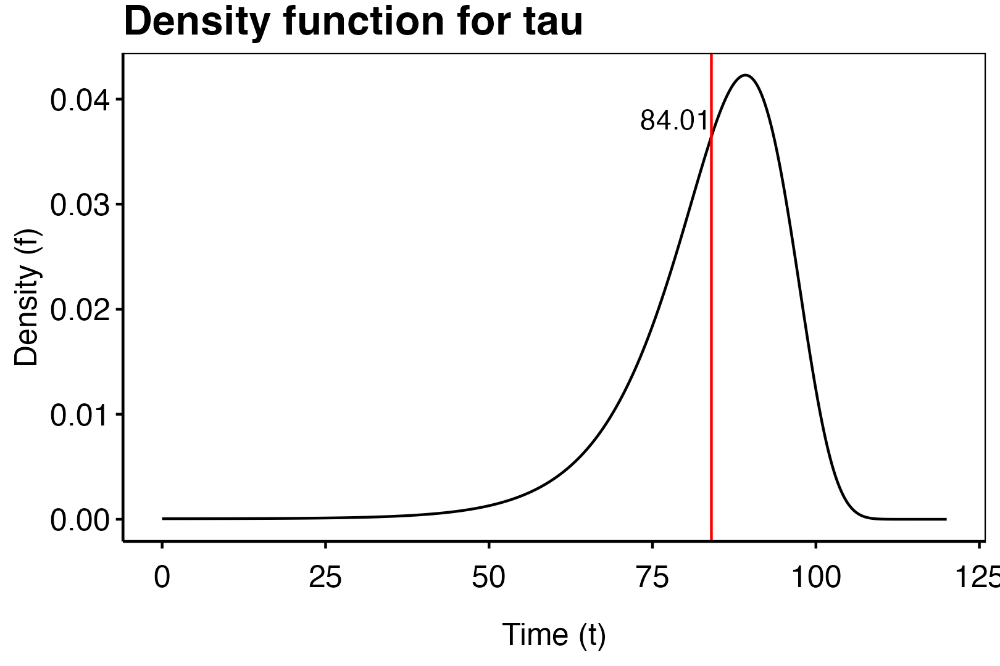
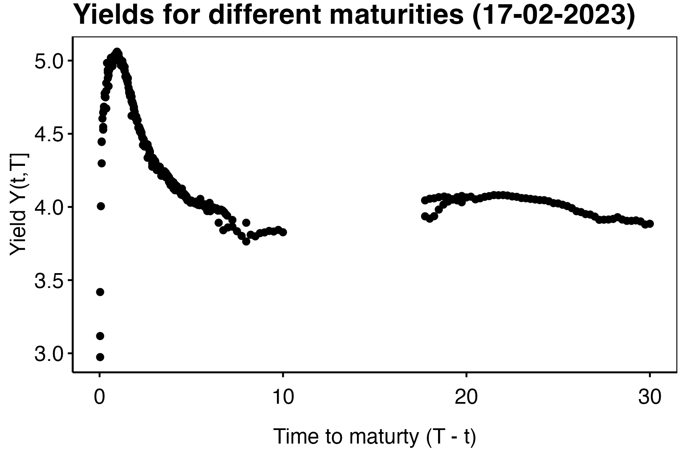

```{r,echo=FALSE}
library(knitr)
if (knitr::is_latex_output()) {
  knitr::opts_chunk$set(
    fig.show = 'hide',
    results = 'hide',
    echo = FALSE,
    warning=FALSE,
    message = FALSE
  )
} else {
  knitr::opts_chunk$set(
    warning=FALSE,
    message = FALSE
  )
}
library(ggplot2)
library(dplyr)
theme_custom <- function() {
  
  theme_minimal() %+replace%
    
    theme(
      
      panel.grid.major = element_blank(),
      panel.grid.minor = element_blank(),
      panel.border = element_rect(colour = "black", fill=NA),
      axis.ticks = element_line(),
      #axis.line.x = element_line(color = "#C5C5C5"),
      axis.line = element_line(color = "black"),
      #axis.ticks = element_blank(),
      legend.position = "bottom",
      legend.title = element_blank(),
      #plot.background = element_rect(fill='transparent', color=NA),
      
      plot.title = element_text(             #title
                   #family = font,            #set font family
                   size = 16,                #set font size
                   face = 'bold',            #bold typeface
                   hjust = 0,                #left align
                   vjust = 2,
                   color = "black"),               #raise slightly
      
      plot.subtitle = element_text(          #subtitle
                   #family = font,            #font family
                   size = 12,
                   color = "black"),               #font size
      
      plot.caption = element_text(           #caption
                   #family = font,            #font family
                    face = "italic",
                   size = 8,                 #font size
                   hjust = 1,
                   color = "black"),               #right align
      
      axis.title = element_text(             #axis titles
                   #family = font,            #font family
                   size = 12,
                   color = "black"),               #font size
      
      axis.text = element_text(              #axis text
                   #family = font,            #axis famuly
                   size = 12,
                   color = "black"),                #font size
      
      axis.text.x = element_text(            #margin for axis text
                    margin=margin(5, b = 10))
      
    )
}
```


# Topics in Life Insurance Mathematics

Below is given the abbreviations used when referencing to books:

  - **Asmussen**: *Risk and Insurance*: A Graduate Text by Soren Asmussen and Mogens Steffensen (2020).\cite{asmussen2020}
  - **Bladt**: Notes from lectures in Liv2.

## Markov Jump Processes

Life insurance mathematics revolves arrow Markov processes in continuous time on some discrete (or at least countable) state space. This may in the simplest model be the life-death model or it can be a generalized life-death model with interest levels. In any case, we use Markov processes to determine the possible payments that may occur in the future or have occurred in the past. Let us start by define the Markov jump process as follows.

<blockquote class = "def">
**Definition 2.1. (Bladt)** _A continuous-time stochastic process $\{X_t\}_{t\ge 0}$ taking values in a countable space $E$ is called a Markov jump process\index{Markov jump process} with state space $E$ if for all $t_n>t_{n-1}>\cdots > t_1>0$ and $i_n,i_{n-1},...,i_0\in E$ it holds that_

$$
P(X_{t_n}=i_n \ \vert\ X_{t_{n-1}}=i_{n-1},...,X_{t_1}=i_1,X_0=i_0)=P(X_{n-1}=i_n\ \vert\ X_{n-1}=i_{n-1}).
$$

</blockquote>

It is seen that process have some property of "forgetability" in the sense that the jump to a fixed state at some future time only depends on the current state, not the sample path of $X$. We may then define the transition probabilities\index{transition probabilities} as

$$
p_{ij}(s,t)=P(X_t=j\ \vert\ X_s=i),
$$

being the probability of the process being in state $j$ at time $t$ given that the process is in state $i$ at time $s$. This gives the natural transition matrix\index{transition matrix}

$$
\mathbf{P}(t,s)=\big\{p_{ij}(s,t)\big\}_{i,j\in E},\hspace{10pt} s\le t.
$$

In general, we study the time in-homogeneous models where the above is possibly different for any pair $s\le t$. There does however exist the special case, where the probabilities only depends on the time $h=t-s$. We call these time homogeneous Markov jump processes\index{time homogeneous Markov jump processes} and they have the form

$$
p_{ij}(t,s)=p_{ij}(t-s).
$$

I.e. the probability of jumping from $i$ to $j$ is the same so long the interval is the same length. Let us now define the transition intensities as below.

<blockquote class = "def">

**Definition 2.2. (Bladt)** _Assume that the limit_

$$
\mathbf{M}(s)=\big\{\mu_{ij}(s)\big\}_{i,j\in E}=\lim_{h\to 0_+}\frac{\mathbf{P}(s,s+h)+\mathbf{I}}{j}
$$

_exist for all $s\ge 0$. The matrices $\mathbf{M}(s)$ are called intensity matrices\index{intensity matrices}. The the special case of time-homogenous processes we have $\mathbf{M}(s)=\mathbf{M}$ is a constant matrix. _

</blockquote>

We may interpret the intensity matrices in the infinitesimal interpretation as

$$
\mathbf{P}(s,s+h) = \mathbf{I}+h\mathbf{M}(s)+o(h),
$$

i.e.

$$
p_{ij}(s,s+h)=\delta_{ij}+\mu_{ij}(s)h+o(h),
$$

where $\delta_{ij}=1_{i=j}$ is the Kronecker delta. We furthermore see, that the matrix $\mathbf{M}(s)$ has non-positive diagonal and non-negative upper and lower triangle. Furthermore, the matrix has zero row sums and so it follows that

$$
\mu_{ii}(s)=-\sum_{j\ne i}\mu_{ij}(s):=-\mu_{i}(t),
$$

for all $i\in E$. Returning to the infinitesimal interpretation we may write the dynamics of $\mu_{ij}$ in the following manner

$$
d\mu_{ij}(t)=\mu_{ij}(t)\ dt=P(X_{t+dt}=j\ \vert\ X_t=i)
$$

i.e. the probability of a jump from state $i$ to state $j$ during $[t,t+dt)$. On the other hand we have

$$
1-\mu_{ii}(t)\ dt=P(X_{t+dt}=i\ \vert\ X_t=i),
$$

i.e. the probability that no jumps occur during $[t,t+dt)$. We can then define the conditional probability that a jump, if one occurs, is to state $j$ from $i$ as
\begin{align*}
q_{ij}(t)&=P(X_{t+dt}=j\ \vert\  X_t=i,X_{t+dt}\ne i)=\frac{P(X_{t+dt}=j\ \vert\  X_t=i)}{P(X_{t+dt}\ne i\ \vert\  X_t=i)}\\
&=\frac{\mu_{ij}(t)}{\mu_i(t)}=-\frac{\mu_{ij}(t)}{\mu_{ii}(t)}.
\end{align*}
We can now look at the time until the next jump as the random variable

$$
T(s)=\inf\left\{u\ge 0\ :\ X_{s+u}\ne X_s\right\},
$$

i.e. $T(s)$ is a positive random variable. If we condition on $X_s=i$ then $T(s)\ \vert\ X_s=i$ is the time until $X$ jumps out of state $i$ into some other state $j\ne i$. If we set $S_i(t)=P(T(s)>t\ \vert\ X_s=i)$ and $f_i(t)$ is the density of $T(s)\ \vert\ X_s=i$, then we have

$$
\mu_i(u)=\frac{f_i(u)}{S_i(u)}=-\frac{S'_i(u)}{S_i(u)}=-\frac{d}{du}\log(S_i(u))
$$

which is solved for

$$
S_i(t)=P(T(s)>t\ \vert\ X_s=i)=\exp\left(-\int_s^t \mu_i(u)\ du\right)
$$

and then

$$
f_i(t)=\exp\left(-\int_s^t \mu_i(u)\ du\right)\mu_i(t).
$$

<blockquote class = "thm">

**Theorem 2.3. (Bladt)** **(Kolmogorov' Differential Equations)**\index{Kolmogorov' Differential Equations} _Relation between $\mathbf{M}(s)$ and $\mathbf{P}(s,t)$ are given by Kolmogorov' forward and backward differential equations:_

$$
\frac{\partial}{\partial s}\mathbf{P}(s,t)=-\mathbf{M}(s)\mathbf{P}(s,t)
$$

_and_

$$
\frac{\partial}{\partial t}\mathbf{P}(s,t)=\mathbf{P}(s,t)\mathbf{M}(t).
$$

_the soluction of which is given by_

$$
\mathbf{P}(s,t)=\prod_s^t(\mathbf{I}+\mathbf{M}(x)\ dx).
$$

_In the time-homogeneous case we have that_

$$
\frac{d}{d t}\mathbf{P}(t)=\mathbf{M}\mathbf{P}(t)=\mathbf{P}(t)\mathbf{M}
$$

_with solution_

$$
\mathbf{P}(t)=\exp(\mathbf{M}t).
$$

</blockquote>

We may subdivide the interval $[s,t]$ into $[s,u]$ and $[u,t]$ and use theorem 1.5 from the chapter on Product Integrals to obtain the Chapman-Kolmogorov's\index{Chapman-Kolmogorov's} equation

$$
\mathbf{P}(s,t)=\mathbf{P}(s,u)\mathbf{P}(u,t)
$$

and in the time homogeneous case we have

$$
\mathbf{P}(s+t)=\mathbf{P}(s)\mathbf{P}(t).
$$

Finally, let us define a stopping time and introduce the strong markov property.

<blockquote class = "def">

**Definition 2.4. (Bladt)** **(Stopping time)**\index{Stopping time} _Let $X$ be a Markov jump process and let $\mathcal{F}_t=\sigma(X_s\ :\ s\le t)$. A nonnegative random variable $\tau$ is called a stopping time for $X$ of $\{\tau \le t\}\in\mathcal{F}_t$ for all $t$._\\
_The $\sigma$-algebra of the process up to a stopping time $\tau$, $\mathcal{F}_\tau$, is defined by the measurable sets $A$ for which_

$$
\forall t\ge 0 : A\cap \{\tau\le t\}\in\mathcal{F}_t.
$$

</blockquote>

We see that a stopping time in an intuitive sense is a random variable which at any time $t$ we know either that the stopping time is in the future i.e. $\tau > t$ or that the stopping time already occured and so $\tau$ becomes known at time $t$. Furthermore, we see that $\{\tau \le t\}$ is $\mathcal{F}_t$ measurable and so we only need information from the Markov jump process in order to determine the above.

<blockquote class = "thm">

**Theorem 2.5. (Bladt)** **(Strong Markov property)**\index{Strong Markov property} _Every Markov jump process satisfies the strong Markov property, i.e., for all $0\le h_1\le h_2\le \cdots \le h_n$, we have that_

$$
P(X_{\tau +h_1}=i_1,...,X_{\tau + h_n}=i_n\ \vert\ \mathcal{F}_t)=P(X_{\tau +h_1}=i_1,...,X_{\tau + h_n}=i_n\ \vert\ X_\tau)
$$

_on $\{\tau <\infty\}$. For time-homogeneous processes this further reduces to_

$$
P(X_{\tau +h_1}=i_1,...,X_{\tau + h_n}=i_n\ \vert\ \mathcal{F}_t)=P_{X_\tau}(X_{\tau +h_1}=i_1,...,X_{\tau + h_n}=i_n)
$$

_also on $\{\tau <\infty\}$._

</blockquote>

## Phase-type distributions

In life insurance models we often, that is always, have a model with one absorbing state, namely, *death*. This means that the state space $E$ will have the form of $p\ge 1$ transient states (states that may interact in both ways) and one absorbing state (a state that is never moved away from). In this case we would often like to study the distribution of

$$
\inf\{t\ge 0 : X(t)=p+1\},
$$

where $p+1$ is the absorbing state and $1,...,p$ are the transient states. We will assume that $P(X(0)=p+1)=0$ i.e. the above is at least zero and never $-\infty$. Let us now formalise this setup.

Consider a time-inhomogeneous Markov jump process $\{X_t\}_{t\ge 0}$ on the finite state-space $E=\{1,...,p,p+1\}$ where the states $1,...,p$ are transient states and $p+1$ is the only absorbing state. This implies that the intesity matrix of $\{X_t\}_{t\ge 0}$ take the form

$$
\Lambda(t)=\begin{bmatrix}
\mathbf{T}(t) & \mathbf{t}(t)\\
\mathbf{0} & 0
\end{bmatrix}.
$$

In the above $\mathbf{T}(t)$ is a $p\times p$ matrix function and $\mathbf{t}(t)$ is a $p\times 1$ matrix function. We now define the initial distribution of $X_0$ as

$$
\{P(X_0=i)\}_{i\in E\setminus \{p+1\}}=\mathbf{\pi}=\begin{pmatrix}\pi_1\\ \vdots\\ \pi_p\end{pmatrix}^\top.
$$

By assumption we have $P(X_0=p+1)=0$ and so $\sum_{i=1}^p\pi_i=1$ and $\mathbf{\pi}$ is a proper distribution.

<blockquote class = "def">

**Definition 2.10. (Bladt)** **(Phase-Type distribution)**\index{Phase-Type distribution} _Let_

$$
\tau = \inf\{t\ge 0 : X(t)=p+1\}
$$

_denote the time until absorption of $X$. The distribution of $\tau$ is then said to be an inhomogeneous phase-type distribution with representation $(\mathbf{\pi},\mathbf{T}(t))$ and we write $\tau \sim IPH(\mathbf{\pi},\mathbf{T}(t))$._

</blockquote>

<blockquote class = "lem">

**Lemma 2.11. (Bladt)** _We have the following decomposition:_

$$
\mathbf{P}(s,t)=\prod_s^t(\mathbf{I}+\mathbf{\Lambda}(u)\ du)=
\begin{bmatrix}
\prod_s^t(\mathbf{I}+\mathbf{T}(u)\ du) & \mathbf{e} -\prod_s^t(\mathbf{I}+\mathbf{T}(u)\ du)\mathbf{e}\\
\mathbf{0} & 1
\end{bmatrix},
$$

_where $\mathbf{e}=(1,1,...,1)^\top$._

</blockquote>

<blockquote class = "thm">

**Theorem 2.12. (Bladt)** _Assume that $\tau \sim IPH(\mathbf{\pi},\mathbf{T}(t))$. Then the density $f$ and the distribution function $F$ of $\tau$ are given by_
\begin{align*}
f(x)&=\mathbf{\pi}\prod_0^x(\mathbf{I}+\mathbf{T}(u)\ du)\mathbf{t}(x),\\
F(x)&=1-\mathbf{\pi}\prod_0^x(\mathbf{I}+\mathbf{T}(u)\ du)\mathbf{e}.
\end{align*}

</blockquote>

<blockquote class = "thm">

**Theorem 2.13. (Bladt)** _If $\tau \sim IPH(\mathbf{\pi},\mathbf{T}(t))$ then_

$$
P(\tau >s+t\ \vert\ \tau >s)=\frac{\mathbf{\pi}\prod_0^s(\mathbf{I}+\mathbf{T}(u)\ du)}{\mathbf{\pi}\prod_0^s(\mathbf{I}+\mathbf{T}(u)\ du)\mathbf{e}}\prod_s^t(\mathbf{I}+\mathbf{T}(u)\ du)\mathbf{e}
$$

_so that_

$$
\tau-s\ \vert\ \{\tau>s\}\sim IPH(\mathbf{\alpha},\mathbf{S}(\cdot)),
$$

_where $\mathbf{S}(u)=\mathbf{T}(s+u)$ and _

$$
\mathbf{\alpha}=\frac{\mathbf{\pi}\prod_0^s(\mathbf{I}+\mathbf{T}(u)\ du)}{\mathbf{\pi}\prod_0^s(\mathbf{I}+\mathbf{T}(u)\ du)\mathbf{e}}.
$$

</blockquote>

<blockquote class = "prop">

**Corollary 2.14. (Bladt)** _If $\tau\sim IPH(\mathbf{\alpha},\mathbf{T}(t))$ and $\mathbf{T}(t_1)$ and $\mathbf{T}(t_2)$ commute for all $t_1,t_2\ge 0$, then the density $f$ and the distribution function $F$ of $\tau$ are given by_
\begin{align*}
f(x)&=\mathbf{\pi}\exp\left(\int_0^x\mathbf{T}(u)\ du\right)\mathbf{t}(x),\\
F(x)&=1-\mathbf{\pi}\exp\left(\int_0^x\mathbf{T}(u)\ du\right)\mathbf{e}.
\end{align*}

</blockquote>

<details>
<summary>**Example (Approximation in time-inhomogeneous case).**</summary>

Consider the Markov jump process on the state space $E=\{1,2,3\}$ where 1 is the state *"alive"* (working), 2 is *"disabled"* and 3 is the state *"death"*. We assume that $\Lambda(t)$ has the structure:
\begin{align*}
\Lambda(t)&=\begin{bmatrix}
\mu_{11}(t) & \mu_{12}(t) & \mu_{13}(t)\\
\mu_{21}(t) & \mu_{22}(t) & \mu_{23}(t)\\
\mu_{31}(t) & \mu_{32}(t) & \mu_{33}(t)
\end{bmatrix}\\
&=
\begin{bmatrix}
-\mu_{12}(t)-\mu_{13}(t) &  0.000015 + 10^{(4.6-10+0.015\cdot t)} & 0.00005 + 10^{(4.6-10+0.05\cdot t)}\\
0.000005 + 10^{(4.6-10+0.015\cdot t)} & -\mu_{21}(t)-\mu_{23}(t) & 0.0001 + 10^{(4.6-10+0.05\cdot t)}\\
0 & 0 & 0
\end{bmatrix}
\end{align*}
We can now implement this intensity matrix as a function in R:
```{r,echo = TRUE,results='markup'}
mu12 <- function(t) {
  0.000015 + 10^(4.6-10+0.015*t)
}
mu13 <- function(t) {
  0.00005 + 10^(4.6-10+0.05*t)
}
mu11 <- function(t) {
  -mu12(t)-mu13(t)
}
mu21 <- function(t) {
  0.000005 + 10^(4.6-10+0.015*t)
}
mu23 <- function(t) {
  0.0001 + 10^(4.6-10+0.05*t)
}
mu22 <- function(t) {
  -mu21(t)-mu23(t)
}
mu31 <- function(t) {0}
mu32 <- function(t) {0}
mu33 <- function(t) {0}
M <- function(t) {
  matrix(
    c(mu11(t),mu21(t),mu31(t),
      mu12(t),mu22(t),mu32(t),
      mu13(t),mu23(t),mu33(t)),
    ncol = 3
  )
}
M(0)
```

We see that the intensities is choosen such that the following holds for any time interval $[t,t+dt)$

  1. The transition $1\to 3$ is less likely than $2\to 3$,
  2. The transition $2\to 1$ is less likely than $1\to 2$,
  3. The transition $1\to 2$ is less likely than $1\to 3$.

We now wish to compute the density and distribution of

$$
\tau =\inf\{t\ge 0\ :\ X(t)=3\}.
$$

We assume that $\pi=(1,0)$ i.e. the person is alive. Calculating the distribution of $\tau$ is then the distribution of the length of a newborn child lifespan. From theorem 2.12 this ammount to calculating the product integral of

$$
\mathbf{T}(t)=\{\mu_{ij}(t)\}_{i,j\in \{1,2\}}
$$

i.e. 

$$
\prod_0^x(\mathbf{I}+\mathbf{T}(u)\ du).
$$

To du this we simply approximate with stepsize $h=1/n$ (for some $n\ge 1$) by

$$
\prod_0^{x+h}(\mathbf{I}+\mathbf{T}(u)\ du)=h\prod_0^x(\mathbf{I}+\mathbf{T}(u)\ du)\mathbf{T}(x)+\prod_0^x(\mathbf{I}+\mathbf{T}(u)\ du),
$$

and

$$
\prod_0^0(\mathbf{I}+\mathbf{T}(u)\ du)=\mathbf{I}.
$$

This is done in the code below

```{r,echo = TRUE,results='markup'}
n <- 12 #monthly
h <- 1/n
N <- 120 #max number years
T_matrix <- function(t) {
  matrix(
    c(mu11(t),mu21(t),
      mu12(t),mu22(t)),
    ncol = 2
  )
}
T_matrix(0)
t_matrix <- function(t) {
  matrix(
    c(mu13(t),mu23(t)),
    ncol=1
  )
}
t_matrix(0)
library(rlist)
#Initial condition t=0
T_product_integral <- list(diag(c(1,1)))
pi <- matrix(c(1,0),ncol = 1)
f <- t(pi) %*% diag(c(1,1)) %*% t_matrix(0)
F <- 1-t(pi) %*% diag(c(1,1)) %*% matrix(c(1,1),ncol = 1)
for (i in 1:(N*n)) {
  x_1 <- i/n
  x_0 <- (i-1)/n
  T_0 <- T_matrix(x_0)
  M_0 <- T_product_integral[[i]]
  M_1 <- h*M_0 %*% T_0 + M_0
  T_product_integral <- list.append(T_product_integral,M_1)
  f <- c(f,t(pi) %*% M_1 %*% t_matrix(x_1))
  F <- c(F,1-t(pi) %*% M_1 %*% matrix(c(1,1),ncol = 1))
}
```
```{r,echo = FALSE, out.width="75%",fig.align='center'}
library(ggplot2)
df <- data.frame(t = 0:(N*n)/n,
           f = f)
p <- ggplot(data = df) + geom_line(aes(x=t,y=f)) +
  geom_vline(xintercept = sum(df$t * df$f)/n, color = "red")+
  annotate(geom = "text",x=sum(df$t * df$f)/n,y=max(df$f)*0.9,label = round(sum(df$t * df$f)/n,digits = 2),hjust = 1) +
  labs(title = "Density function for tau",
       x = "Time (t)", y= "Density (f)") +
  theme_custom()
ggsave("figures/ex1_PT_dist.png",bg='transparent',plot = p, height = 1080,width = 1620, units="px")

```

\begin{figure}[H]
  \begin{center}
    \includegraphics[width=0.48\textwidth]{figures/ex1_PT_dist.png}
  \end{center}
\end{figure}

We see that by calculating

$$
E[\tau\ \vert\ X_0=1]=\int_0^\infty \tau f(\tau)\ d\tau\approx\int_0^{120}\tau f(\tau)\ d\tau\approx\frac{1}{n}\sum_{i=0}^{120\cdot n} i/n\cdot f(i/n).
$$

that the life expectation is `r round(sum(df$t * df$f)/n,digits = 2)` years. We have that we may approximate $f$ and $F$ with an arbitrary precision by choosing $n$ appropriately. $\square$

</details>

I practice we may have alot complications in calculating the product integral of $\mathbf T$ as the matrix may have large dimensions, be non-cummative, encounter alternating sums with growing terms and obviously being time in-homogeneous. So one has to be smart when constructing numerical methods in computing the integral. We will briefly consider some considerations an implementer may use in calculating the product integral.

  1. **Applying differential equation.** Assume that $X$ is a time in-homogeneous markov jump process then we may always calculate $\prod_s^t(\mathbf I + \mathbf T(x)\ dx)$ using a stepwise argument:
  $$
  \prod_s^t(\mathbf I + \mathbf T(x)\ dx)=\prod_s^{s+1\cdot (t-s)/n}(\mathbf I + \mathbf T(x)\ dx)\prod_s^{s+2\cdot (t-s)/n}(\mathbf I + \mathbf T(x)\ dx)\cdots\prod_s^{t}(\mathbf I + \mathbf T(x)\ dx)
  $$
  for some $n\ge 1$. In particular one can simply choose $n$ large enough such that the increments is approximately linear and so this is a brute force methods (see example above).
  2. **Piece wise constant matrix.** Since data is scarce it often occur that mortality rates are constant over at least a monthly timeline hence one may assume that $\Lambda$ is piecewise constant for some fine grid. This in particular means that if the grid has size $1/n$ (for instance $n=12$ or $n=4$) we have
  $$
  \prod_s^{s+1/n}(\mathbf I + \mathbf T(x)\ dx)=\mathbf{I}e^{\mathbf{T}(s)\frac{1}{n}}=e^{\mathbf{T}(s)\frac{1}{n}}.
  $$
  and so the above reduces to
  $$
  \prod_s^t(\mathbf I + \mathbf T(x)\ dx)=e^{\mathbf{T}(s)\frac{1}{n}}e^{\mathbf{T}(s+1/n)\frac{1}{n}}\cdots e^{\mathbf{T}(t-1/n)\frac{1}{n}},
  $$
  assuming that $s$ and $t$ are integers (one could make this more general).
  3. **Diagonalization.** Assume that $\mathbf{T}(x)$ is constant on some interval $[s,t]$ and that for the constant matrix $\mathbf{T}:=\mathbf{T}(s)$ there exist unique eigenvalues $\lambda_1,...,\lambda_p$. Then we can diagonalize $\mathbf{T}$ as
  $$
  \mathbf{T}=\mathbf{B}\mathbf{D}\mathbf{B}^{-1},
  $$
  where as usual $\mathbf{D}=\text{diag}(\lambda_1,...,\lambda_p)$ and $\mathbf{B}$ is a $p\times p$ matrix with columns of eigenvectors for $\lambda_1,...,\lambda_p$. In this case we can calculate
  \begin{align*}
  \prod_s^t(\mathbf I + \mathbf T(x)\ dx)&=e^{\mathbf{T}(t-s)}=e^{\mathbf{B}\mathbf{D}\mathbf{B}^{-1}(t-s)}=\sum_{n=0}^\infty \frac{\left(\mathbf{B}\mathbf{D}\mathbf{B}^{-1}\right)^n(t-s)^n}{n!}\\
  &=\sum_{n=0}^\infty \frac{\mathbf{B}\mathbf{D}\mathbf{B}^{-1}\mathbf{B}\mathbf{D}\mathbf{B}^{-1}\cdots \mathbf{B}\mathbf{D}\mathbf{B}^{-1}\mathbf{B}\mathbf{D}\mathbf{B}^{-1}(t-s)^n}{n!}\\
  &=\sum_{n=0}^\infty \frac{\mathbf{B}\mathbf{D}^n\mathbf{B}^{-1}(t-s)^n}{n!}=\mathbf{B}\left(\sum_{n=0}^\infty \frac{\mathbf{D}^n(t-s)^n}{n!}\right)\mathbf{B}^{-1}\\
  &=\mathbf{B}\left(\sum_{n=0}^\infty \frac{\text{diag}(\lambda_1^n(t-s)^n,...,\lambda_p^n(t-s)^n)}{n!}\right)\mathbf{B}^{-1}\\
  &=\mathbf{B}\text{diag}\left(\sum_{n=0}^\infty \frac{\lambda_1^n(t-s)^n}{n!},...,\sum_{n=0}^\infty \frac{\lambda_p^n(t-s)^n}{n!}\right)\mathbf{B}^{-1}\\
  &=\mathbf{B}\text{diag}\left(e^{\lambda_1(t-s)},...,e^{\lambda_p(t-s)}\right)\mathbf{B}^{-1}.
  \end{align*}
  which is much easier than any approximation. This is however a unrealisitic expectations to have.
  4. **Univerformization.**\index{Univerformization} Assume that $\mathbf{T}(x)$ is constant on some interval $[s,t]$ and define $\mathbf{T}:=\mathbf{T}(s)$. We may furthermore define $\lambda= \max_{i}(-\lambda_{ii})$ as the largest diagonal entry in $\mathbf T$ ($\lambda <0$). We now set
  $$
  \mathbf P = \mathbf I + \lambda^{-1}\mathbf T,
  $$
  and see that $\mathbf P$ is a transition matrix i.e. rowsums is 1 and the the diagonals $0\le p_{ii}\le 1$. We see this as $0\le \lambda^{-1}\lambda_{ii}\le1$ as $\lambda_{ii}\le 0$ for all $i$ and $\lambda\ge 0$ and dominates all diagonal entries. The rowsums is 1 as $\mathbf T$ is a intensity matrix i.e. rowsums is 0 and so adding one to the diagonal of the scaled matrix gives a rowsum of 1. We can now rearrange and see that
  \begin{align*}
  \prod_s^t(\mathbf I + \mathbf T(x)\ dx)&=e^{\mathbf{T}(t-s)}=e^{\lambda (\mathbf P - \mathbf I)(t-s)}=e^{\lambda \mathbf P (t-s)}e^{-\lambda \mathbf I(t-s)}\\
  &=e^{\lambda \mathbf P (t-s)}\mathbf Ie^{-\lambda (t-s)}=e^{-\lambda (t-s)}e^{\lambda \mathbf P (t-s)}\\
  &=e^{-\lambda (t-s)}\sum_{n=0}^\infty \frac{(t-s)^n}{n!}\mathbf{P}^n.
  \end{align*}
  This is nice since $\mathbf P$ has entries in the interval $[0,1]$ and so the series above converges and is monotonic, so we avoid the alternating sums from the negative diagonal in $\mathbf T$.
  5. **Scaling and squaring argument.**\index{Scaling and squaring argument} Assuming the setup above. If the interval $(t-s)$ is large we may apply a scaling and squaring argument by setting
  $$
  e^{\mathbf T(t-s)}=\mathbf{S}^{2^n},\hspace{15pt}\mathbf{S}=e^{\mathbf T (t-s)2^{-n}}.
  $$
  This ensures small entries in the matrix $S$ and we can simply square $\mathbf S$ $n$ times after approximating $\mathbf S$ numerically.

## Interest rates

### Basic definitions and properties

In money markets interest is derived from the short term rate $r$ that is a continuously compounded interest rate i.e. a bank account $B(t)$\index{bank account} is on the form

$$
B(t)=B(0)e^{\int_0^tr(u)\ du}
$$

where we will by convention assume $B(0)=1$. Let us define what we will require for the process $r$.

<blockquote class = "def">

**Definition. (Interest rate process)**\index{Interest rate process} _A stochastic process $\{r(t)\}_{t\ge 0}$ is an interest rate process if and only if $r(t)$ is adapted to some filtration $\mathcal F_t$ on the probability space $(\Omega,\mathcal F,\mathbb P)$._

</blockquote>

This in particular means that in theory we may construct the rate as a diffusion process, piecewise constant function jumping at random times and so forth. The class of possible rate process is large but few is realistic. We will in the following think of $r$ generally as a given process which we only assume is adapted to some filtration $\mathcal F$. The most important price process other than the bank account is the zero-coupon bond.

<blockquote class = "def">

**Definition. (Zero-Coupon Bond)**\index{Zero-Coupon Bond} _A zero-coupon bond with maturity $T$ with underlying interest rate process $r(t)$ is a security which at time $T$ pays the holder 1 and the price of the claim at time $0\le t\le T$, $B(t,T)$, satisfies_

$$
\left\{\frac{B(t,T)}{B_t}\right\}_{0\le t\le T},
$$

_is a $\mathbb Q$-martingale measure for some equivalent martingale measure $\mathbb Q\sim \mathbb P$ (including $\mathbb Q = \mathbb P$)._

</blockquote>

We can in particular deduce the price process under a $\mathbb Q$-expectation by the equation

$$
E^{\mathbb Q}\left[\left.\frac{1}{B_T}\right\vert \mathcal F_t\right]=E^{\mathbb Q}\left[\left.\frac{B(T,T)}{B_T}\right\vert \mathcal F_t\right]=\frac{B(t,T)}{B_t},
$$

since $B(T,T)=1$ and the integrant is a $\mathbb Q$-martingale. Rearranging we have

$$
B(t,T)=B_tE^{\mathbb Q}\left[\left.\frac{1}{B_T}\right\vert \mathcal F_t\right]=e^{\int_0^t r(u)\ du}E^{\mathbb Q}\left[\left.e^{-\int_0^T r(u)\ du}\right\vert \mathcal F_t\right]=E^{\mathbb Q}\left[\left.e^{-\int_t^T r(u)\ du}\right\vert \mathcal F_t\right].\tag{11}
$$

#### Forward rates and yields

There exist alot of different transformations of $r(t)$ which may be useful in simplifying complex equation and/or easing interpretation. Some of the most used include *forward rates* and *yields*. Let us start by defining a simple forward rate called the LIBOR forward rate.

<blockquote class = "def">

**Definition 3.1. (Bladt)**\index{LIBOR forward rate} _Consider three fixed time-points $t\le S< T$ and the corresponding self-financing portfolio consisting of one short position in a zero-coupon bond with maturity $S$ and a long position in a zero-coupon bond with maturity $T$ of size $B(t,S)/B(t,T)$. This portfolio gives the payout: -1 at time $S$ and $B(t,S)/B(t,T)$ at time $T$. This in particular results in the investment of 1 dollar at time $S$ with a $\mathcal F_t$ deterministic payout_

$$
\frac{B(t,S)}{B(t,T)}
$$

_at time $T$. The **LIBOR forward rate** $L(t,S,T)$ is thus the average return in the interval i.e._

$$
L(t,S,T)=\frac{1}{T-S}\left(\frac{B(t,S)}{B(t,T)}-1\right).
$$

</blockquote>

We could of couse define the rate as a continuously compounding rate by solving

$$
e^{(T-S)R}=\frac{B(t,S)}{B(t,T)}\iff R=\frac{1}{T-S}\left(\log B(t,S)-\log B(t,T)\right).
$$

<blockquote class = "def">

**Definition. (Continuously compounded forward rate)**\index{continuously compounded forward rate} _Let $t\le T$ be a fixed maturity date. The continuously compounded forward rate on $[S,T]$ is defined by_

$$
f(t,S,T)=-\frac{\log B(t,T)-\log B(t,S)}{T-S}
$$

_being the continuously compounded rate for a portfolio consisting of $B(t,S)/B(t,T)$ zero-coupon bond with maturity $T$._

</blockquote>


The yield with maturity $T$ is the defined by.

<blockquote class = "def">

**Definition. (Yield)**\index{Yield} _Let $t\le T$ be a fixed maturity date. The yield on $[t,T]$ is defined by_

$$
Y(t,T)=-\frac{\log B(t,T)}{T-t},
$$

_being the continuous rate on the portfolio consisting of 1 zero-coupon bond with maturity $T$._

</blockquote>

We obviously have that $Y(t,T)=f(t,t,T)$ is the continuous compounded forward rate on $[S,T]$ with $S=t$. Furthermore, we call $\{Y(t,T)\}_{T\ge t}$ the **yield curve**\index{yield curve}. 

<blockquote class = "def">

**Definition. (Forward rate)**\index{forward rate} _Let $t\le T$ be a fixed maturity date. The forward rate on $[t,T]$ is defined by_

$$
f(t,T)=-\frac{\partial}{\partial T}\log(B(t,T)).
$$

</blockquote>

We see that the forward rate is simply the continuously compounded forward rate on a infinitesimal interval of time $[T-d t,T]$ i.e.

$$
f(t,T)=\lim_{S\to T}f(t,S,T)=\lim_{S\to T}-\frac{\log B(t,T)-\log B(t,S)}{T-S}=-\frac{\partial}{\partial T}\log(B(t,T)).
$$

Note that this is all in expectation. The forward rate is useful in the sense that we can write

$$
B(t,T)=\exp\left[-\int_t^T f(t,s)\ ds\right]=\mathbb E^{\mathbb Q}\left[\left.\exp\left(-\int_t^T r(s)\ ds\right) \right\vert \mathcal{F}_t\right].
$$

We may use forward rate interchangeably as expectation-weighted discounting factor, in constructing fixed rates and arbitrage free loans.

### Phase-type representation of bond prices

Consider the interest rate process

$$
r(t)=r_{X(t)}(t),
$$

where $\{X(t)\}_{t\ge 0}$ is a time-inhomogeneous Markov jump process on a statespace $E=\{1,...p\}$ with intensity matrix $\mathbf M(t)=\{\mu_{ij}\}_{i,j\in E}$ and $r_i(t)$ for $i=1,...,p$ are deterministic functions. We call this a Markov-jump representation interest model and we summaries the model below.

<blockquote class = "def">

**Definition. (Markov-jump representation interest model)**\index{Markov-jump representation interest model} _Let $\{X(t)\}_{t\ge 0}$ be a $p$ dimensional time-inhomogeneous Markov jump process. Define $\mathcal F_t=\sigma(X(s) : 0\le s\le t)$. Then if $r_i(t)$ is bounded from below and deterministic the process_

$$
r(t)=r_{X(t)}(t),
$$

_is an $\mathcal F_t$ adapted interest rate process._

</blockquote>

We see that in the context of this interest rate model the zero-coupon bond with maturity $T$ has price process

$$
B(t,T)=\mathbb E^{\mathbb Q}\left[\left.\exp\left(-\int_t^Tr_{X(s)}(s)\ ds\right) \right\vert \mathcal F_t\right]=\mathbb E^{\mathbb Q}\left[\left.\exp\left(-\int_t^Tr_{X(s)}(s)\ ds\right) \right\vert X_t\right].
$$

We can then make the matrix representation of the discounting factors.

<blockquote class = "thm">

**Theorem 3.2. (Bladt)** _For $i,j\in E$, let_

$$
d_{ij}(s,t)=\mathbb E^{\mathbb Q}\left[\left.1_{\{X(t)=j\}}\exp\left(-\int_s^tr_{X(u)}(u)\ du\right) \right\vert X_s=i\right],
$$

_for $s\le t$. Then the matrix $\mathbf D(s,t)=\{d_{ij}(s,t)\}_{i,j\in E}$ has representation_

$$
\mathbf D(s,t)=\prod_s^t\Big(\mathbf I+(\mathbf M(u)-\Delta (r(u)))\ du\Big),
$$

_with $\Delta(r(u))=\text{diag}(r_1(u),...,r_p(u))$._

</blockquote>

We can then by setting $\rho$ as

$$
\rho=\max\left(0,-\min_{i\in E}\inf_{x\ge 0}r_i(x)\right),
$$

use the matrix representation of $\mathbf D(s,t)$ to represent the zero-coupon bond and make a statement that relate $B(t,T)$ to an IPH distributed random variable.

<blockquote class = "thm">

**Theorem 3.3. (Bladt)** **(Phase-type representation of bond prices)**\index{Phase-type representation of bond prices} _Assume the Markov-jump interest model. The price process of the zero-coupon bond satisfies_

$$
B(t,T)=\mathbb E^{\mathbb Q}\left[\left.\exp\left(-\int_t^Tr_{X(s)}(s)\ ds\right) \right\vert X_t\right]=\pi_{X(t)}^\top\mathbf D(t,T)\mathbf e,
$$

_where $\mathbf e=(1,...,1)^\top$ and $\pi_{X(t)}$ is the distribution of $X(t)$. Let $\tau\sim IPH(\pi_{X(t)},\mathbf M(x+t)-\Delta (r(x+t))-\rho \mathbf I)$ and define $\overline F(t)$ as the survival function for $\tau$. Then we have_

$$
B(t,T)=e^{\rho (T-t)}\overline F(T).
$$

_In particular if $\rho = 0$ then $B(t,T)=\overline F(T)$ is the survival function of $\tau$._

</blockquote>

We furthermore have the following result regarding the forward rate.

<blockquote class = "prop">

**Corollary 3.4. (Bladt)** _Assume the Markov-jump interest model and that $X(t)=i$. The forward rate is then the hazard rate at $T$ for the random variable $\tau\sim IPH(\pi_{X(t)},\mathbf M(x+t)-\Delta (r(x+t))-\rho \mathbf I)$ less $\rho$ i.e._

$$
f(t,T)=\frac{f_{\tau}(T)}{\overline F(T)}-\rho.
$$

_where $f_\tau$ is the density function of $\tau$._

</blockquote>

We can now for explicity write the distribution function of $\tau$ in 3.3 and 3.4 above.

<blockquote class = "prop">

**Corollary 3.5. (Bladt)** _The stopping time $\tau(t)\sim IPH(\mathbb \pi,\mathbf M(x+t)-\Delta (r(x+t))-\rho \mathbf I)$ with $\pi_j=1_{\{j=i\}}$ has distribution function_

$$
F_{\tau(t)}(T)=\mathbb E^{\mathbb Q}\left[\left.\int_t^T r_{X(y)}(y)\exp\left(-\int_t^yr_{X(u)}(u)\ du\right)\ dy\ \right\vert\ X(t)=i\right].
$$

</blockquote>

<blockquote class = "prop">

**Corollary 3.6. (Bladt)** _The stopping time $\tau(t)\sim IPH(\mathbb \pi,\mathbf M(x+t)-\Delta (r(x+t))-\rho \mathbf I)$, with $\pi$ as the initial distribution of $X(t)$. Then the following holds_
\begin{align*}
\mathbb P(\tau > T)&=\mathbb E^{\mathbb Q}\left(\exp\left(-\int_0^T r_{X(u)}(u)\ du\right)\right),\\
F_{\tau(t)}(T)&=\mathbb E^{\mathbb Q}\left(\int_0^T r_{X(y)}(y)\exp\left(-\int_0^y r_{X(u)}(u)\ du\right)\ dy\right),\\
f_{\tau(t)}(t)&=\mathbb E^{\mathbb Q}\left( r_{X(t)}(t)\exp\left(-\int_0^t r_{X(u)}(u)\ du\right)\right),\\
f(0,T)&=\frac{f_{\tau(t)}(T)}{1-F_{\tau(t)}(T)}.
\end{align*}

</blockquote>

### Term structure models

We may introduce another rate model, where $r$ is drifting with a locally deterministic term and a drift given by a Brownian motion. We call these models term structure models.

<blockquote class = "def">

**Definition. (Term structure interest model)**\index{Term structure interest model} _Let $\mathbb Q$ be an equivalent martingale measure and let $W^{\mathbb Q}$ be a $\mathbb Q$-Brownian motion. Assume that the process $r$ has dynamics_

$$
dr(t)=\alpha(t,r(t))\ dt + \sigma(t,r(t))\ dW^{\mathbb Q}(t),
$$

_with $r(0)=r_0$. Assume that $\alpha(t,r)$ and $\sigma(t,r)$ are deterministic functions. Define $\mathcal F_t=\sigma(W^{\mathbb Q}(s) : 0\le s\le t)$. Then $r$ is $\mathcal F_t$-adapted and we call $r$ a term structure interest rate with local drift $\alpha$ and volatility $\sigma$._

</blockquote>

One easily sees that $r$ is indeed a Markov process and the arbitrage free price of a zero-coupon bond in this model is given by the price process

$$
B(t,T)=p(t,r(t))
$$

i.e. a function of time and the current rate. Furthermore, the pricing is derived from the risk neutral valuation formula:

$$
p(t,r(r))=\mathbb E^{\mathbb Q}\left[\left.e^{-\int_t^Tr(\tau)\ d\tau} \right\vert \mathcal{F}_t\right]=\mathbb E^{\mathbb Q}\left[\left.e^{-\int_t^Tr(\tau)\ d\tau} \right\vert r(t)\right],
$$

as $r$ is Markov. We then know that the process

$$
e^{-\int_0^t r(u)\ du}B(t,T)=\mathbb E^{\mathbb Q}\left[\left.e^{-\int_0^Tr(\tau)\ d\tau} \right\vert \mathcal{F}_t\right]\tag{23}
$$

is a Doob $\mathbb Q$-martingale and so this gives rise to the term structure equation below.

<blockquote class = "thm">

**Theorem 3.9. (Bladt)** **(Term structure equation)**\index{Term structure equation} _Assume the term structure model. Then the bond price $B(t,T)=p(t,r(t))$ satisfies the PDE_

$$
p_t(t,r)=rp(t,r)-\alpha(t,r)p_r(t,r)-\frac{1}{2}\sigma^2(t,r)p_{rr}(t,r)
$$

_subect to the condition_

$$
p(T,r)=1.
$$

</blockquote>

The result follows from Ito's formula on the martingale in (23) (simply set the local drift equal to 0).

The equation above is generally not solvable, but there exist some restricted models, that does have an explicit solution. One of the models that does have a solution is the **affine model**.

<blockquote class = "prop">

**Corollary.** **(Affine models)** _Assume that the pricing function $p$ of a zero-coupon bond has representation_

$$
B(t,T)=p(t,r(t))=e^{f(t)r(t)+g(t)},
$$

_then the term structure equation becomes_

$$
r=f'(t)r+g'(t)+\alpha(t,r)f(t)+\frac{1}{2}\sigma^2(t,r)f^2(t),
$$

_with terminal conditions_

$$
f(T)=g(T)=0.
$$

_Assume furthermore that $\alpha$ and $\sigma$ has representation_

$$
\alpha(t,r)=a(t)+b(t)r\quad \text{and}\quad\sigma(t,r)=\sqrt{c(t)+d(t)r}
$$
_then it follows that_

$$
f'(t)=1-b(t)f(t)-\frac{1}{2}d(t)f^2(t)\quad \text{and}\quad g'(t)=-a(t)f(t)-\frac{1}{2}c(t)f^2(t).
$$

</blockquote>

<details>
<summary>**Proof.**</summary>

From theorem 3.9 the term structure equation is

$$
p_t(t,r)=rp(t,r)-\alpha(t,r)p_r(t,r)-\frac{1}{2}\sigma^2(t,r)p_{rr}(t,r).
$$

Under assumption that the log of the price process is affine we find that

$$
p_t(t,r)=(f'(t)r+g'(t)p(t,r),\quad p_r(t,r)=f(t)p(t,r),\quad p_{rr}(t,r)=f^2(t)p(t,r)
$$

and so

$$
(f'(t)r+g'(t)p(t,r)=rp(t,r)-\alpha(t,r)f(t)p(t,r)-\frac{1}{2}\sigma^2(t,r)f^2(t)p(t,r)
$$

Hence

$$
r=f'(t)r+g'(t)+\alpha(t,r)f(t)+\frac{1}{2}\sigma^2(t,r)f^2(t).
$$

This shows the first part. Now assume that

$$
\alpha(t,r)=a(t)+b(t)r,\quad\sqrt{c(t)+d(t)r}.
$$

When inserting in the equation before we have

$$
 r=f'(t)r+g'(t)+(a(t)+b(t)r)f(t)+\frac{1}{2}(c(t)+d(t)r)f^2(t).
$$

Then by a coefficient matching argument we have

$$
\begin{pmatrix}
1\\ 0
\end{pmatrix}^\top=
\begin{pmatrix}
f'(t)+b(t)f(t)+\frac{1}{2}d(t)f^2(t)\\
g'(t)+a(t)f(t)+\frac{1}{2}c(t)f^2(t)
\end{pmatrix}^\top
$$

since by multiplying by $(r,1)^\top$ we get the equation above. Isolating $f'$ and $g'$ yields the result. $\blacksquare$

</details>

One popular model is proposed by Vasicek where

$$
\alpha(t,r)=a-br(t)\quad \text{and}\quad \sigma(t,r)=\sigma,
$$

with $a,b\in \mathbb R$ and $\sigma\in\mathbb R_+$ are constants. Given the initial condition $r(0)=r_0\in\mathbb R$ we have the solution as

$$
r(t)=r_0e^{-bt}+\frac{a}{b}\left(1-e^{-bt}\right)+\sigma\int_0^t e^{-(t-s)b}\ dW^{\mathbb Q}(t).
$$

One may achieve the above integration result by differentiating the function $h(t,r)=r(t)e^{bt}$ and integrating the derivative giving
\begin{align*}
r(t)e^{bt}-r(0)&=\int_0^tdh=\int_0^tbe^{bs}r(s)+e^{bs}(a-br(s))\ ds+\int_0^te^{bs}\sigma\ dW^{\mathbb Q}(s)\\
&=\frac{a}{b}(e^{bt}-1)+\sigma\int_0^te^{bs}\ dW^{\mathbb Q}(s)
\end{align*}
where simple isolation gives the equation.

### Estimation of PH bond models

Estimation of rate models may be done by observing current spot rates on the market for zero-coupon bonds with a variety of maturity dates. One may for instance consider $T=t+1,...,t+30$ or even up to $T=t+100$. This gives us the corresponding yield curve defined as

$$
T\mapsto Y(t,T)=-\frac{\log p(t,T)}{T-t}=-\frac{\log B(t,T)}{T-t}.
$$

If we make probabilistic assumptions on $r(t)$ we may in a parametrialized model estimate a parameter $\theta$ that associate a distribution function for $r(t)$ i.e. $\theta \mapsto F_{\theta,t}(r)$. Let us see how we may estimate a Markov-jump model and a term structure model below.

#### Data for estimation

We consider yield for non-zero coupon bonds listed on [The Wall Street Journal](https://www.wsj.com/market-data/bonds/treasuries?mod=md_bond_view_treasury_quotes). The data considered was pulled on the 17th of february 2023.

```{r,echo = FALSE, out.width="75%",fig.align='center'}
library(openxlsx)
tbl <- read.xlsx("data/wsj_yields.xlsx", sheet = "Formatted") %>%
  mutate(date = as.Date(date, origin = "1899-12-30"),
         maturity = as.Date(maturity, origin = "1899-12-30"),
         price = (bid + ask)/2,
         time = as.numeric(difftime(maturity,date, units = "days")) / 365.25,
         estYield = -log(price/100)*100/time-coupon.rate,
         asked.estYield = -log(ask/100)*100/time-coupon.rate)

library(ggplot2)
p <- ggplot() +
  geom_point(data = filter(tbl, time>17.5 | time<10),aes(x= time, y = asked.yield)) + theme_custom() +
  labs(title = "Yields for different maturities (17-02-2023)",
       x = "Time to maturty (T - t)",
       y = "Yield Y(t,T]")

ggsave("figures/ph_est_data.png",bg='transparent',plot = p, height = 1080,width = 1620, units="px")

```

\begin{figure}[H]
  \begin{center}
    \includegraphics[width=0.48\textwidth]{figures/ph_est_data.png}
  \end{center}
\end{figure}

 It must be stressed that the rates are not from zero-coupon bonds and so we in general have yields form contracts paying $R$ continuously until maturity where the face value of $1$ is payed. This in particular means that the prices in the data is prices according to

$$
B_R(t,T]=\mathbb E^{\mathbb Q}\left[\left.\int_t^T Re^{-\int_t^s r(u)\ du}\ ds+e^{-\int_0^T r(u)\ du} \right\vert\mathcal F_t\right]=R\ \mathbb  E^{\mathbb Q}\left[\left.\int_t^T e^{-\int_t^s r(u)\ du}\ ds \right\vert\mathcal F_t\right]+ B(t,T]
$$

This means that the yields are not equivalent to the zero-coupon yields. In fact it must hold that

$$
Y_R(t,T]\ge Y(t,T]
$$

with $Y_R(t,T)\approx Y(t,T]+R\cdot f(T-t)$ where $f\to 0$ for $T-t\to 0$ and $f\to 1$ for $T-t\to \infty$. We will in any case try to determine estimate a statistical model of the yield curve based on the yields in the dataset.

#### Estimation of Phase-type models

We restrict ourselves to the transition matrices on the form

$$
\mathbf T(x)=\lambda_\theta(x)\mathbf T,
$$

where $\mathbf T$ is a constant $p\times p$ matrix and $\lambda_\theta$ is a real-valued function. The parameter space $\Theta\subset \mathbb R^d$ for some $d\ge 1$. This then gives a constant *base dynamic* between the rate states $1,...,p\in E$ and $\lambda_\theta$ homogeneously speeds up or slows down the waiting time in each state by scaling the transitions intensities.

## Survival and mortality rates

### Survival probabilities and forward mortality rates

We consider a non-negative random variable $\tau$ on a probability space $(\Omega,\mathcal F, P)$. The mortality rate of $\tau$ at time $t$ is defined through the dynamics in the following definition.

<blockquote class = "def">

**Definition. (Mortality rate)**\index{Mortality rate} _Let $\tau\ge 0$ be a non-negative stochastic variable. The mortality rate function $\mu(t)$ is a, possibly stochastic, function defined as_

$$
\mu(t)\ dt=\mathbb P(\tau\in[t,t+dt)\ \vert\ \tau > t)=\frac{f(t)}{\overline F(t)}\ dt,
$$

_where $\overline F(t)=1-F(t)=\mathbb P(\tau >t)$ is the survival function of $\tau$._

</blockquote>

The definition above shows that we may alternatively define $\mu$ in terms of the below derivative

$$
\mu(t)=-\frac{d}{dt}\log\Big(\overline F(t)\Big),
$$

hence we have that

$$
-\int_0^t\mu(s)\ ds=\log\Big(\overline F(t)\Big)-\log\Big(\overline F(0)\Big)=\log\Big(\overline F(t)\Big),
$$

giving the well-known formula

$$
\overline F(t)=\exp\left(-\int_0^t\mu(s)\ ds\right).
$$

This also gives the nice interpretation for the conditional distribution of $\tau$ given $\tau>t$ since.

$$
\mathbb P(\tau > s\ \vert\ \tau > t)=\frac{\overline F(s)}{\overline F(t)}=\exp\left(-\int_t^s\mu(u)\ du\right).
$$

<blockquote class = "prop">

**Corollary.** _Let $\tau\ge 0$ be a non-negative stochastic variable with mortality rate $\mu(t)$. The probability that $\tau \in [t,s)$ in the event $\tau >t$ is_

$$
p(t,s)=\mathbb P(\tau > s\ \vert\ \tau > t)=\exp\left(-\int_t^s\mu(u)\ du\right).
$$

</blockquote>

How to deal with these random intensities. Either we could model them directly under a probability measure, $\mathbb P$ say, but since we do not know much about the probabilities anyway, we might as well model the consequences in price (reserve) by changes of the intensities. That is, how much does a change in intensity cost? This might been seen in a financial context, even as a derivative security, and should therefore be evaluated relative to a risk–free asset, i.e. by using an equivalent martingale measure, $\mathbb Q$ say. We therefore define the mortality forward rates as

<blockquote class = "def">

**Definition. (Mortality forward rate)**\index{Mortality forward rate} _Let $\tau\ge 0$ be a non-negative stochastic variable with mortality rate $\mu(t)$. The mortality forward rate rate $m(t,s)$ is a function defined by_

$$
\exp\left(-\int_t^s m(t,u)\ du\right)=q(t,s)=\mathbb E^{\mathbb Q}\left[\left. \exp\left(-\int_t^s\mu(u)\ du\right)\right\vert \mathcal F(t)\right].
$$

</blockquote>

Notice that in particular the function $q(t,s)$ solves the differential equation

$$
\frac{\partial q(t,s)}{\partial s}=-m(t,s)q(t,s),\qquad q(t,t)=1.
$$

When evaluating a payment from insurance company and the insuread we also need to take into account the interest rate $r$ and so bonds would be priced according to the quantity

$$
E^{\mathbb Q}\left[\left. \exp\left(-\int_t^sr(u)+\mu(u)\ du\right)\right\vert \mathcal F(t)\right].
$$

Notice that the filtration $\mathcal F(t)$ is now given by the path of $(\mu(t),r(t))$. A payment of 1 in the event the insured dies in the time interval $[s,s+dt)$ is given by

$$
E^{\mathbb Q}\left[\left. \exp\left(-\int_t^sr(u)+\mu(u)\ du\right)\mu(s)\right\vert \mathcal F(t)\right].
$$

Then means that we may price for instance a contract of a payment of 1 in the event of death as

$$
E^{\mathbb Q}\left[\left. \int_t^T\exp\left(-\int_t^sr(u)+\mu(u)\ du\right)\mu(s)\ ds\right\vert \mathcal F(t)\right]
$$

where the contract matures at time $T>t$. Furhermore if we assume indepence between the mortality and the rates (obviously satisfies) we have the following decompositions:
\begin{align*}
(\text{Forward rates}):\qquad& E^{\mathbb Q}\left[\left. \exp\left(-\int_t^sr(u)\ du\right)\right\vert \mathcal F(t)\right]=e^{-\int_t^sf(t,u)\ du},\\
(\text{Bond prices}):\qquad& E^{\mathbb Q}\left[\left. \exp\left(-\int_t^sr(u)+\mu(u)\ du\right)\right\vert \mathcal F(t)\right]=e^{-\int_t^sf(t,u)+m(t,u)\ du},\\
(\text{Insurance event}):\qquad& E^{\mathbb Q}\left[\left. \exp\left(-\int_t^sr(u)\ du\right)\mu(s)\right\vert \mathcal F(t)\right]=e^{-\int_t^sf(t,u)+m(t,u)\ du}m(t,s).
\end{align*}

### Forward transistion rates

In the above sections we considered the simple Markov process with two states, one real and a absorbing state. In that context we simply model one jump. However in the general case, we would assume a Markov jump on a finite state space $E$ i.e. $\{Z(t)\}_{t\ge 0}$ with random intensities $\mu_{ij}(t)$ with $i,j\in E$. We can combine these intensities into the matrix function

$$
\mathbf M(s)=\{\mu_{ij}(s)\}_{i,j\in E}.
$$

Then the natural definition of forward transition rates are the elements of the matrix, $\mathbf F(t,s)$, given by the product integral below

$$
\mathbb E^{\mathbb Q}\left(\left.\prod_t^s(\mathbf I+\mathbf M(u))\ du\right\vert \mathcal F (t)\right)=\prod_t^s(\mathbf I+\mathbf F(t,u))\ du.
$$

We in this context define 

$$
\mathbf P(t,s)=\prod_t^s(\mathbf I+\mathbf M(u))\ du,
$$

being the transition probabilities $p_{ij}(t,s)$. We furthemore set the matrix $\mathbf q$ to

$$
\mathbf q(t,s)=\mathbb E^{\mathbb Q}\left(\left.\mathbf P(t,s)\right\vert \mathcal F (t)\right)=\prod_t^s(\mathbf I+\mathbf F(t,u))\ du.
$$

If we assume we may differentiate under the $\mathbb Q$ expectation we get
\begin{align*}
\mathbb E^{\mathbb Q}\left(\left.\mathbf P(t,s)\mathbf M(s)\right\vert \mathcal F (t)\right)&=\mathbb E^{\mathbb Q}\left(\left.\frac{\partial}{\partial s}\mathbf P(t,s)\right\vert \mathcal F (t)\right)=\frac{\partial}{\partial s}\mathbb E^{\mathbb Q}\left(\left.\mathbf P(t,s)\right\vert \mathcal F (t)\right)\\
&=\frac{\partial}{\partial s}\prod_t^s(\mathbf I+\mathbf F(t,u))\ du=\mathbf q(t,s)\mathbf F(t,s),
\end{align*}
where we simply use the above definition and the definition of the product integral.

<blockquote class = "lem">

**Lemma. (Mortality forward rate)**\index{Mortality forward rate} _Let $\{Z(t)\}_{t\ge 0}$ be a Markov jump process on the finite state space $E$. Assume that the intensity matrix function $\mathbf M(t)$ exists, then_

$$
\mathbf F(t,s)=\mathbf q(t,s)^{-1}\mathbb E^{\mathbb Q}\left(\left.\mathbf P(t,s)\mathbf M(s)\right\vert \mathcal F (t)\right)
$$

_with_

$$
\mathbf q(t,s) = \mathbb E^{\mathbb Q}\left(\left.\mathbf P(t,s)\right\vert \mathcal F (t)\right).
$$

</blockquote>

### Reserves revisited

Consider an life insurance contract of an insured with underlying Markov jump process $\{Z(t)\}_{t\ge 0}$ commencing at time $T>0$. The contract pays continuous rate $b^i(t)$ while $Z(t)= i$ and transition lump sum payments $b^{ij}(t)$ in the event $Z$ jumps from $i$ to $j$ at time $t$. That is the payment has dynamics

$$
dB(t)=dB^{Z(t)}(t)+\sum_{j\ne Z(t-)}b^{Z(t-)j}dN_{Z(t-)j}(t),
$$

where $N_{ij}(t)=\#\{s\le t:Z(s-)=i,Z(s)=j\}$ is the number of jumps from $i$ to $j$
in the interval $[0,t]$. The above is equivalent with the process

$$
dB(t)=\sum_{i\in E}I^i(t)\ dB^i(t)+\sum_{i\in E}\sum_{j\in E : j\ne i}b^{ij}(t)\ dN_{ij}(t),
$$

where obviously $I^i(t)=1_{Z(t)=i}$. We assume that $\{r(t)\}_{t\ge 0}$ is the stochastic interest rate process which is independent of the payment process. The market reserve or third order reserve is defined under the martingale measure $\mathbb Q$ as

$$
V(t)=\mathbb E^{\mathbb Q}\left[\left.\int_t^Te^{-\int_t^ur(s)\ ds}\ dB(u)\right\vert \mathcal F(t)\right],
$$

i.e. the discounted expected value of the payments. The above filtration is the one given by the sample path of both $r$ and $Z$. Using the independence assumption we have
\begin{align*}
V(t)&=\int_t^TE^{\mathbb Q}\left[\left.e^{-\int_t^ur(s)\ ds}\ dB(u)\right\vert \mathcal F(t)\right]\\
&=\int_t^TE^{\mathbb Q}\left[\left.e^{-\int_t^ur(s)\ ds}\right\vert \mathcal F(t)\right]E^{\mathbb Q}\left[\left.dB(u)\right\vert \mathcal F(t)\right]\\
&=\int_t^Te^{-\int_t^uf(t,s)\ ds}E^{\mathbb Q}\left[\left.dB(u)\right\vert \mathcal F(t)\right],
\end{align*}
by the definition of the forward rate $f(t,s)$. Notice that now we have two terms both not depending on one another. In other words, $E^{\mathbb Q}\left[\left.dB(u)\right\vert \mathcal F(t)\right]$ only depends on $Z$ not $r$. When evaluating the expected dynamics under $\mathbb Q$ we have

$$
E^{\mathbb Q}\left[\left.dB(u)\right\vert \mathcal F(t)\right]=E^{\mathbb Q}\left[\left.dB(u)\right\vert Z(t)\right]=\sum_{i\in E}I^i(t)E^{\mathbb Q}\left[\left.dB(u)\right\vert Z(t)=i\right]
$$

with 
\begin{align*}
&E^{\mathbb Q}\left[\left.dB(u)\right\vert Z(t)=i\right]=E^{\mathbb Q}\left[\left.\sum_{k\in E}I^k(u)\ dB^k(u)+\sum_{k\in E}\sum_{j\in E : j\ne k}b^{kj}(u)\ dN_{jk}(u)\right\vert Z(t)=i\right]\\
&=\sum_{k\in E}E^{\mathbb Q}\left[\left.I^k(u)\right\vert Z(t)=i\right]\ dB^i(u)+\sum_{k\in E}\sum_{j\in E : j\ne k}b^{kj}(u)\ E^{\mathbb Q}\left[\left.dN_{jk}(u)\right\vert Z(t)=i\right]\\
&=\sum_{k\in E}q_{ik}(t,u)\ dB^i(u)+\sum_{k\in E}\sum_{j\in E : j\ne k}b^{kj}(u)\ E^{\mathbb Q}\left[\left.p_{ik}(t,u)\mu_{kj}(u)\right\vert Z(t)=i\right]\ du\\
&=\sum_{k\in E}q_{ik}(t,u)\ dB^i(u)+\sum_{k\in E}\sum_{j\in E : j\ne k}E^{\mathbb Q}\left[\left.p_{ik}(t,u)b^{kj}(u)\mu_{kj}(u)\right\vert Z(t)=i\right]\ du.
\end{align*}

### Stochastic mortality rates

## Matrix methods in life insurance

### Basic setup

We consider the time-inhomogeneous Markov jump process $X=\{X(t)\}_{t\ge 0}$ with a finite state–space $E$ and intensity matrix $\mathbf \Lambda(t)=\{\lambda_{ij}(t)\}_{i,j\in E}$. We then define the payment process as

$$
dB(t)=\sum_{i\in E}1_{X(t-)=i}\left(b_i(t)\ dt +\sum_{j\in E}b_{ij}(t)\ dN_{ij}(t)\right),
$$

with $b_i(t)$ are continuous payment rates (negative if premiums) and $b_{ij}(t)$ lump sum payments, which occur according to the counting measure $N_{ij}(t)$. The intensity matrix is decomposed into

$$
\mathbf \Lambda(t)=\mathbf \Lambda^0(t) + \mathbf \Lambda^1(t),
$$

where $\mathbf \Lambda^1(t)$ is a non–negative matrix and, consequently, $\mathbf \Lambda^0(t)$  a sub–intensity matrix, i.e. row sums are non–positive. We choose this decomposition in a way such that $\mathbf \Lambda^1(t)$ contains the intensities with a factor $l_{ij}(t)$ being the probability upon jump from $i$ to $j$ at time $t$ of recieving the payment $b_{ij}(t)$. In other words, we have the decomposition

$$
\lambda_{ij}(t)=\lambda_{ij}^0(t)+\lambda_{ij}^1(t)=l_{ij}(t)\lambda_{ij}^0(t)+(1-l_{ij}(t))\lambda_{ij}^1(t)\iff l_{ij}(t)=\frac{\lambda_{ij}^1(t)}{\lambda_{ij}^0(t)+\lambda_{ij}^1(t)}.
$$

In the case $i=j$ then the counting measure $N_{ii}$ denotes a poisson arrival process for lump sum payments arriving during the visit in the state $i$. This in particular means that the payment $b_{ii}(t)$ will be triggered in $[t,t+dt)$ with probability $\lambda_{ii}^1\ dt$ given that $X(t-)=i$.

Finally, we assume that the spot interest rates in state i follow a deterministic function $r_i(t)$. Hence the interest rates follow the model

$$
r(u) = r_{X(u)}(u).
$$

Recall that the reserve is defined as

$$
V(t)=\mathbb E^{\mathbb Q}\left[\left.\int_t^Te^{-\int_t^ur(s)\ ds}\ dB(u)\right\vert \mathcal F(t)\right].
$$

We will be using the following matrix functions when computing the reserve and higher order moments.
\begin{align*}
\mathbf B(t)&=\{b_{ij}(t)\}_{i,j\in E},\\
\mathbf R(t)&=\mathbf \Lambda^1(t)\bullet \mathbf B(t) + \mathbf \Delta (\mathbf b(t)),\\
\mathbf C^{(k)}(t)&=\mathbf \Lambda^1(t)\bullet \mathbf B^{\bullet k}(t),\qquad k\ge 2,
\end{align*}
where $\bullet$ denotes the Schur product simply defined as $\mathbf A\bullet\mathbf B=\{a_{ij}b_{ij}\}$ with $\mathbf A=\{a_{ij}\}$ and $\mathbf B=\{b_{ij}\}$. The notation $\mathbf \Delta (\cdot)$ operator sets $\cdot$ as the diagonal i.e.

$$
\mathbf \Delta (\mathbf b(t))=\text{diag}(b_1(t),...,b_p(t)),
$$

assuming $E=\{1,...,p\}$. We call $\mathbf B(t)$ the transition payments, $\mathbf R(t)$ the rewards and $\mathbf C^{(k)}(t)$ the $k$th order contributions. The matrix $\mathbf C^{(k)}(t)$ is mostly usefull notationally rather than intuitively.

### Interest rate free analysis

In this section, we consider the risk free context where we are not concerned with any discounting of expected payments. This make us introduce the following random process

$$
U^0(s,t) = \sum_{i\in E}\int_s^tb_i(u)1_{X(u-)=i}\ du+\sum_{i,j\in E}\int_s^tb_{ij}(u)\ dN_{ij}(u),
$$

giving the total reward obtained in the time interval $[s,t]$. We are interested in higher order moments of this quantity (representing the rate free reserve). To this goal we introduce the conditional moments with

$$
m_{ij}^{(k)}(s,t)=\mathbb E\left.\Big[1_{X(t)=j}U^0(s,t)^k\right\vert X(s)=i\Big],
$$

representing the weighted expected moment upon start in state $i$ weighted with the probability with end in state $j$. This forms the matrix

$$
\mathbf m^{(k)}(s,t)=\left\{m_{ij}^{(k)}(s,t)\right\}_{i,j\in E}.
$$

For simplicity we simply for $k=1$ write $\mathbf m^{(1)}(s,t) = \mathbf m(s,t)$.

<blockquote class = "thm">

**Theorem 5.1. (Bladt)** _With the above assumptions it holds that_

$$
\mathbf m(s,t)=\int_s^t\mathbf P(s,u)\mathbf R(u)\mathbf P(u,t)\ du.
$$

_In particular, by Van Loans formula we have_

$$
\prod_s^t\left(\mathbf I + \begin{pmatrix}\mathbf \Lambda(x) & \mathbf R(t)\\ \mathbf 0 & \mathbf \Lambda(x)\end{pmatrix} dx\right)=
\begin{pmatrix}
\mathbf P(s,t) & \mathbf m(s,t)\\
\mathbf 0 & \mathbf P(s,t).
\end{pmatrix}
$$

</blockquote>

### Transform of rewards and higher order moments

Recall that for a random variable $X$ the moment generating function $M(\theta)$ given by

$$
M(\theta)=\mathbb E[e^{\theta X}],
$$

gives us a comprehensive insight into the moments of $X$. Take the taylor approximation of $e^{\theta X}$:

$$
e^{\theta X}=\sum_{n=0}^\infty\frac{(\theta X)^n}{n!}
$$

Hence taking expectation gives

$$
M_X(\theta)=\mathbb E[e^{\theta X}]=\mathbb E\left[\sum_{n=0}^\infty\frac{(\theta X)^n}{n!}\right]=\sum_{n=0}^\infty\frac{\theta^n \mathbb E[X^n]}{n!}.
$$

Now differentiating wrt. $\theta$ yields the important result

$$
\frac{\partial M_X(\theta)}{\partial \theta}(\theta)=\sum_{n=1}^\infty\frac{n\theta^{n-1} \mathbb E[X^n]}{n!}=\sum_{n=1}^\infty\frac{\theta^{n-1} \mathbb E[X^n]}{(n-1)!}=\mathbb E[X]+\sum_{n=1}^\infty\frac{\theta^{n} \mathbb E[X^{n+1}]}{n!},
$$

hence by evaluating in $\theta = 0$ we get $M'_X(0)=\mathbb E[X]$. In general we have

$$
\left.\frac{\partial^n M_X(\theta)}{\partial \theta^n}(\theta)\right\vert_{\theta = 0}=\mathbb E[X^n],\qquad n\ge 1.
$$

This is really the motivation for examining the moment generating function of the reward obtained in the interval $[s,t]$ i.e. the quantity $U^0(s,t)$. To this we define

$$
\hat F_{ij}(\theta;s,t)=\mathbb E\left[\left.e^{\theta U^0(s,t)}1\{X(t)=j\}\ \right\vert\ X(s)=i\right],
$$

for $i,j=1,...,p$. Obviously we have the following identity

$$
\sum_{j=1}^p\hat F_{ij}(\theta;s,t)=\mathbb E\left[\left.e^{\theta U^0(s,t)}\ \right\vert\ X(s)=i\right].
$$

Furthermore, if we define the distribution of $X(t),U^0(s,t)$ given $X(s)$ by

$$
F_{ij}(x; s,t)=\mathbb P(X(t)=j,U^0(s,t)\le x\ \vert\ X(s)=i)
$$

then we have the integral decomposition

$$
\hat F_{ij}(\theta; s,t)=\int_{\mathbb R} e^{\theta x}\ dF_{ij}(x; s,t).
$$

The following theorem gives a way of calculating the object $\hat{\mathbf F}(\theta; s,t)=\{\hat F_{ij}(\theta; s,t)\}$.

<blockquote class = "thm">

**Theorem 5.5. (Bladt)** _Let $\hat{\mathbf F}(\theta; s,t)=\{\hat F_{ij}(\theta; s,t)\}_{i,j=1,...,p}$ and_

$$
\mathbf A(\theta;u)=\mathbf\Lambda^1(u)\bullet\left\{e^{\theta b_{kl}(u)}\right\}_{k,l}+\mathbf \Lambda^0(u)+\theta \mathbf \Delta(\mathbf b(u))
$$

_where $\bullet$ denotes the Schur matrix product. Then the moment generating function of $U^0(s,t)$ is given by_

$$
\hat{\mathbf F}(\theta; s,t)=\prod_s^t(\mathbf I + \mathbf A(\theta; u)\ du).
$$
</blockquote>

By the above theorem we see that

$$
\mathbb E\left[\left.e^{\theta U^0(s,t)}\ \right\vert\ X(s)=i\right] =e_i^\top\hat{\mathbf F}(\theta; s,t)e = e_i^\top\prod_s^t(\mathbf I + \mathbf A(\theta; u)\ du)e,
$$

in particular

$$
\prod_s^t(\mathbf I + \mathbf A(\theta; u)\ du)e=
\begin{pmatrix}
\mathbb E\left[\left.e^{\theta U^0(s,t)}\ \right\vert\ X(s)=1\right]\\
\mathbb E\left[\left.e^{\theta U^0(s,t)}\ \right\vert\ X(s)=2\right]\\
\vdots\\
\mathbb E\left[\left.e^{\theta U^0(s,t)}\ \right\vert\ X(s)=p\right]
\end{pmatrix}.
$$

Furthermore, we have from the property above that

$$
\left.\frac{\partial^k}{\partial \theta^k}\left(e_i^\top\prod_s^t(\mathbf I + \mathbf A(\theta; u)\ du)e\right)\right\vert_{\theta = 0}=m^{(k)}_{i}(s,t).
$$

<blockquote class = "lem">

**Lemma 5.6. (Bladt)** _Given the definitions in theorem 5.5 we have_
\begin{align*}
\left.\frac{\partial^0}{\partial \theta^0}\mathbf A(\theta; s)\right\vert_{\theta=0}&=\mathbf A(\theta; s)\Big\vert_{\theta=0}=\mathbf \Lambda^1(s)+\mathbf\Lambda^0(s)=\mathbf\Lambda(s),\\
\left.\frac{\partial}{\partial \theta}\mathbf A(\theta; s)\right\vert_{\theta=0}&=\mathbf \Lambda^1(s)\bullet \mathbf B(s)+\mathbf \Delta(\mathbf b(s))=\mathbf R(s),\\
\left.\frac{\partial^k}{\partial \theta^k}\mathbf A(\theta; s)\right\vert_{\theta=0}&=\mathbf \Lambda^1(s)\bullet \mathbf B^{\bullet k} B(s)=\mathbf C^{(k)}(s),\qquad k>1.
\end{align*}

</blockquote>

Recall that we defined the moments in general by

$$
\mathbf m^{(k)}(s,t)=\left\{\mathbb E\left[\left. 1\{X(t)=j\}U^0(s,t)^k\ \right\vert\ X(s)=i\right]\right\}_{i,j=1,...,p}=\left\{m^{(k)}_{ij}(s,t)\right\}_{i,j=1,...,p},
$$

hence we can define (for ease of notation) the reduced moments by

$$
\mathbf m_r^{(k)}(s,t)=\left\{\frac{m^{(k)}_{ij}(s,t)}{k!}\right\}_{i,j=1,...,p}=\frac{1}{k!}\mathbf m^{(k)}(s,t).
$$

Furthermore, we define the reduced contributions

$$
\mathbf C^{(k)}_r(s,t)=\frac{1}{k!}\mathbf C^{(k)}(s,t)=\frac{1}{k!}\mathbf \Lambda^1(t)\bullet \mathbf B^{\bullet k}(t).
$$

<blockquote class = "thm">

**Theorem 5.7. (Bladt)** _Given the definitions above we have_

$$
\mathbf m^{(k)}(s,t)=\int_s^t\mathbf P(s,x)\mathbf R(x)\mathbf m^{(k-1)}_r(x,t)\ dx+\sum_{m=2}^k\int_s^t\mathbf P(s,x)\mathbf C^{(m)}_r(x)\mathbf m^{(k-m)}_r(x,t)\ dx.
$$

</blockquote>


Using this result we can make a powerful statement regarding how one could calculate all of the $k$th moments at once. To this we have the result.

<blockquote class = "thm">

**Theorem 5.8. (Bladt)** _Let $\mathbf F^{(k)}(x)$ be given by_

$$
\mathbf F^{(k)}(x)=
\begin{bmatrix}
\mathbf \Lambda(x) & \mathbf R(x) & \mathbf C^{(2)}_r(x) & \cdots & \mathbf C^{(k-1)}_r(x) & \mathbf C^{(k)}_r(x)\\
\mathbf 0 & \mathbf \Lambda(x) & \mathbf R(x) & \cdots & \mathbf C^{(k-2)}_r(x) & \mathbf C^{(k-1)}_r(x)\\
\vdots & \vdots & \vdots & \ddots & \vdots & \vdots \\
\mathbf 0 & \mathbf 0 & \mathbf 0 & \cdots &\mathbf \Lambda(x) & \mathbf R(x)\\
\mathbf 0 & \mathbf 0 & \mathbf 0 & \cdots & \mathbf 0 &\mathbf \Lambda(x)
\end{bmatrix},
$$

_and $\mathbf H^{(k)}(s,t)$ defined by_

$$
\mathbf H^{(k)}(x)=
\begin{bmatrix}
\mathbf P(s,t) & \mathbf m_r^{(1)}(s,t) & \mathbf m_r^{(2)}(s,t) & \cdots & \mathbf m_r^{(k-1)}(s,t) & \mathbf m_r^{(k)}(s,t)\\
\mathbf 0 & \mathbf P(s,t) & \mathbf m_r^{(1)}(s,t) & \cdots & \mathbf m_r^{(k-2)}(s,t) & \mathbf m_r^{(k-1)}(s,t)\\
\vdots & \vdots & \vdots & \ddots & \vdots & \vdots \\
\mathbf 0 & \mathbf 0 & \mathbf 0 & \cdots & \mathbf P(s,t) & \mathbf m_r^{(1)}(s,t)\\
\mathbf 0 & \mathbf 0 & \mathbf 0 & \cdots & \mathbf 0 & \mathbf P(s,t)
\end{bmatrix}.
$$

_Then we have the result_

$$
\prod_s^t(\mathbf I + \mathbf F^{(k)}(x)\ dx)=\mathbf H^{(k)}(s,t).
$$

</blockquote>

For ease of notation we define the Toeplitz matrix as

$$
\mathcal T(\mathbf A_1,\mathbf A_2,...,\mathbf A_n)=
\begin{bmatrix}
\mathbf A_1 & \mathbf A_2 & \mathbf A_3 & \cdots & \mathbf A_{n-1} & \mathbf A_n\\
\mathbf 0 & \mathbf A_1 & \mathbf A_2 & \cdots & \mathbf A_{n-2} & \mathbf A_{n-1}\\
\vdots & \vdots & \vdots & \ddots & \vdots & \vdots \\
\mathbf 0 & \mathbf 0 & \mathbf 0 & \cdots & \mathbf A_1 & \mathbf A_2\\
\mathbf 0 & \mathbf 0 & \mathbf 0 & \cdots & \mathbf 0 & \mathbf A_1
\end{bmatrix}.
$$

And hence we could write:

$$
\mathbf F^{(k)}(x)=\mathcal T(\mathbf \Lambda(x), \mathbf R(x) , \mathbf C^{(2)}_r(x) , ... , \mathbf C^{(k-1)}_r(x), \mathbf C^{(k)}_r(x)),
$$

and

$$
\mathbf H^{(k)}(x)=\mathcal T(\mathbf P(s,t) , \mathbf m_r^{(1)}(s,t) , \mathbf m_r^{(2)}(s,t), ...,\mathbf m_r^{(k-1)}(s,t) , \mathbf m_r^{(k)}(s,t)).
$$

### Markovian interest rates

We now study how we may calculate the moments of the reserves in the case with rates. To this we start by assuming the Markov-jump interest model in sync with the Markov-jump process for the policy holder. Obviously, we in practice would assume that these two processes are independent, but for generality we will not insist on this for now. We therefore define the process

$$
\mathbf r(t)=\{r_i(t)\}_{i\in E_r}
$$

and the two Markov jump processes

$$
X_r=\{X_r(t)\}_{t\ge 0}\in E_r=\{1,...,p\},\qquad X_b(t)=\{X_b(t)\}_{t\ge 0}\in E_b=\{1,...,q\},
$$

and naturally we at time $t$ have the interest rate $r_{X_r(t)}(t)$ and $X_v(t)$ governs the state of the policy holder. Using this we define the combined Markov jump process as

$$
X(t)=\{X_r(t),X_b(t)\}_{t\ge 0}\in E_r\times E_b.
$$

The processes $X_b$ and $X_r$ may or may not be independent, and the payment processes likewise may or may not be independent of $X_r$. In the independent case the processes $X_b$ and $X_r$ are defined on each their state–space, and the common state–space will be the product set of the two. If the processes are sharing states, with the possibility of having simultaneous jumps, then we obtain dependency of the processes. Such a case could, e.g. be a rise in the interest rate causing an increased intensity of jumping to surrender or free–policy states.

In the case where we have independence we have that the transition intensities of $X$ is given by

$$
\mathbf \Lambda(t)=\mathbf \Lambda_b(t)\oplus \mathbf\Lambda_r(t)=\mathbf \Lambda_b(t)\otimes \mathbf I_p+\mathbf I_p \otimes \mathbf \Lambda_r(t)=\{\lambda_{ij}\}_{i,j=1,...,pq},
$$

where $\oplus$ is the Kronecker sum and $\otimes$ is the Kronecker product given by

$$
\mathbf A\otimes \mathbf B=\{a_{ij}\mathbf B\}=\begin{bmatrix}
a_{1,1}\mathbf B & \cdots & a_{1,n}\mathbf B\\
\vdots & \ddots & \vdots\\
a_{n,1}\mathbf B & \cdots & a_{n,n}\mathbf B
\end{bmatrix}.
$$

### Reserves

We now consider the valuation of the payment process $B$. Introduce the matrix of partial state–wise prospective reserves,
\begin{align*}
\mathbf V(s,t)&=\{V_{ij}(s,t)\}_{i,j\in E_b},\\
V_{ij}(s,t)&=\mathbb E\left[\left.1\{X(t)=j\}\int_s^te^{-\int_s^xr_{X(u)}(u)\ du}\ dB(x) \ \right\vert\ X(s)=i\right].
\end{align*}
From the Markov-jump representation we recall that we defines $d_{ij}(s,t)$ by

$$
d_{ij}(s,t)=\mathbb E\left[\left.1\{X(t)=j\}\exp\left\{-\int_s^tr_{X(u)}(u)\ du\right\} \ \right\vert\ X(s)=i\right],
$$

and that the matrix $\mathbf D(s,t)=\{d_{ij}(s,t)\}$ has representation

$$
\mathbf D(s,t)=\prod_s^t\Big(\mathbf I+[\mathbf \Lambda(u)-\mathbf\Delta (r(u))]\ du\Big).
$$

Using this we have the theorem.

<blockquote class = "thm">

**Theorem 5.10. (Bladt)** _The matrix of partial state-wise prospective reserves $\mathbf V(s,t)$ has the following integral representation_

$$
\mathbf V(s,t)=\int_s^t\mathbf D(s,x)\mathbf R(x)\mathbf P(x,t)\ dx.
$$
</blockquote>

Using Van loans formula we can avoid the integration and calculate the product integral from below.

<blockquote class = "prop">

**Corollary 5.11. (Bladt)** _The matrix of partial state-wise prospective reserves $\mathbf V(s,t)$ has the following product integral representation_

$$
\prod_s^t\left(\mathbf I+
\begin{pmatrix}
\mathbf \Lambda(u)-\mathbf \Delta (r(u)) & \mathbf R(u)\\
\mathbf 0 & \mathbf \Lambda(u)
\end{pmatrix}
\right)=\begin{pmatrix}
\mathbf D(s,t) & \mathbf V(s,t)\\
\mathbf 0 & \mathbf P(s,t)
\end{pmatrix}.
$$
</blockquote>

Finally, we state and prove Thiele’s differential equations for partial reserves with stochastic interest rates.

<blockquote class = "thm">

**Theorem 5.12. (Bladt)** _The state-wise reserves satisfies the differential equations_

$$
\frac{\partial}{\partial s}\mathbf V(s,t)=-[\mathbf \Lambda(s) - \mathbf\Delta(r(s))]\mathbf V(s,t) - \mathbf R(s)\mathbf P(s,t)
$$

_where $\mathbf V(t,t)=0$. For the conventional state-wise prospective reserves $\mathbf V^{Th}(t)=\mathbf V(t,T)\mathbf e$, this has the form_

$$
\frac{\partial}{\partial s}\mathbf V^{Th}(t)=-[\mathbf \Lambda(t) - \mathbf\Delta(r(t)]\mathbf V^{Th}(t) - \mathbf R(t)\mathbf e,
$$

_where $\mathbf V^{Th}(T)=\mathbf 0$._

</blockquote>

### Higher order moments

Consider the matrix of partial state-wise higher order moments of future payments, given by, for $k\in\mathbb N$,
\begin{align*}
\mathbf V^{(k)}(t,T)&=\Big\{V_{ij}^{(k)}(t,T)\Big\}_{i,j\in E}\\
V_{ij}^{(k)}(t,T)&=\mathbb E\left[\left.1\{X(T)=j\}\left(\int_s^te^{-\int_s^xr_{X(u)}(u)\ du}\ dB(x)\right)^k \ \right\vert\ X(s)=i\right],
\end{align*}
and introduce what we shall term the *reduced* partial state-wise higher order moments:

$$
\mathbf V_r^{(k)}(t,T)=\frac{\mathbf V^{(k)}(t,T)}{k!}
$$

and denoting

$$
\mathbf D^{(m)}(s,t)=\prod_s^t\Big(\mathbf I + [\mathbf\Lambda(u)-m\mathbf\Delta(r(u))]\ du\Big),\qquad m\in\mathbb N,
$$

we then obtain the following version of Hattendorff’s theorem for partial reserves with stochastic interest rate.

<blockquote class = "thm">

**Theorem 5.13. (Bladt)** _The matrix of reduced partial state-wise higher order moments satisfies the integral equation, for $k\in\mathbb N_0$,_
\begin{align*}
\mathbf V_r^{(k)}&(t,T)\\
&=\int_t^T\mathbf D^{(k)}(t,x)\mathbf R(x)\mathbf V^{(k-1)}_r(x,T)\ dx+\sum_{m=2}^k\int_t^T\mathbf D^{(k)}(t,x)\mathbf C^{(m)}_r(x)\mathbf V^{(k-m)}_r(x,T)\ dx.
\end{align*}
</blockquote>
Using Van loan we can define the following matrix

$$
\mathbf F_U^{(k)}(x)=
\begin{bmatrix}
\mathbf \Lambda(x)-k\mathbf \Delta(r(x)) & \mathbf R(x) & \mathbf C^{(2)}_r(x) & \cdots & \mathbf C_r^{(k-1)}(x) & \mathbf C_r^{(k)}(x)\\
\mathbf0 & \mathbf \Lambda(x)-(k-1)\mathbf \Delta(r(x)) & \mathbf R(x)  & \cdots & \mathbf C_r^{(k-2)}(x) & \mathbf C_r^{(k-1)}(x)\\
\vdots & \vdots & \vdots & \ddots & \vdots & \vdots\\
\mathbf 0 & \mathbf 0 & \mathbf 0 & \cdots & \mathbf \Lambda(x)-\mathbf \Delta(r(x)) & \mathbf R(x)\\
\mathbf 0 & \mathbf 0 & \mathbf 0 & \cdots & \mathbf 0 & \mathbf \Lambda(x)
\end{bmatrix},
$$

then we get the usefull product integral

$$
\prod_t^T\Big(\mathbf I + \mathbf F_U^{(k)}(x)\ dx\Big)=
\begin{bmatrix}
* & * & * & * & \cdots &* & \mathbf V_r^{(k)}(t)\\
* & * & * & * & \cdots &* & \mathbf V_r^{(k-1)}(t)\\
* & * & * & * & \cdots &* & \mathbf V_r^{(k-2)}(t)\\
\vdots & \vdots & \vdots & \vdots & \ddots &\vdots & \vdots\\
* & * & * & * & \cdots &* & \mathbf V_r^{(2)}(t)\\
* & * & * & * & \cdots &* & \mathbf V(t)\\
* & * & * & * & \cdots &* & \mathbf P(t,T)
\end{bmatrix}.
$$

Then by differentiating we obtain the classical differential equations below.

<blockquote class = "thm">

**Theorem 5.14. (Bladt)** _The matrix of reduced partial state-wise higher order moments satisfies the system of differential equations, for $k\in \mathbb N_0$,_

$$
\frac{\partial}{\partial t}\mathbf V_r^{(k)}(t,T)=\Big(k\mathbf\Delta(r(t)) - \mathbf \Lambda(t)\Big)\mathbf V_r^{(k)}(t,T)-\mathbf R(t)\mathbf V_r^{(k-1)}(t,T)-\sum_{i=2}^k\mathbf C_r^{(i)}(t)\mathbf V_r^{(k-i)}(t,T),
$$

_with terminal condition $\mathbf V_r^{(k)}(T,T)=1_{(k=0)}\mathbf I$._
</blockquote>

### Equivalence premium

We assume that a policy has payments determined and fixed and that we want to adjust one or more payments such that $V^{Th}$ satisfies the equivalence principle i.e. $V_{X(0)}^{Th}(0)=0$. To this define $\mathbf R(t)=\mathbf R(t;\theta)$ for some payment $\theta$. Notice that $\theta$ is rather general and may be thought of as either a single transition payment or payment rate. This in particular gives the mapping $\theta \mapsto \mathbf V(t;\theta)$ given by

$$
\mathbf V(t;\theta) = \int_t^T\prod_t^u\Big(\mathbf I +[\mathbf\Lambda(s)-\mathbf\Delta(r(s))]\ ds\Big)\mathbf R(u;\theta)\prod_u^T\Big(\mathbf I +\mathbf \Lambda(s)\ ds\Big)\ du,
$$

hence if $\mathbf R(t;\theta)$ is continuously differentiable and $\mathbf \Lambda$ and $\mathbf r$ are continuous we have

$$
\frac{\partial}{\partial \theta}\mathbf V(t;\theta) = \int_t^T\prod_t^u\Big(\mathbf I +[\mathbf\Lambda(s)-\mathbf\Delta(r(s))]\ ds\Big)\frac{\partial}{\partial \theta}\mathbf R(u;\theta)\prod_u^T\Big(\mathbf I +\mathbf \Lambda(s)\ ds\Big)\ du.
$$

and then by Van loan formula

$$
\prod_t^T\left(\mathbf I+
\begin{pmatrix}
\mathbf \Lambda(u)-\mathbf \Delta(r(u)) & \frac{\partial}{\partial \theta}\mathbf R(u;\theta)\\
\mathbf 0 & \mathbf \Lambda(u)
\end{pmatrix}du
\right)=
\begin{pmatrix}
\mathbf D(t,T) & \frac{\partial}{\partial \theta}\mathbf V(t;\theta)\\
\mathbf 0 & \mathbf P(t,T)
\end{pmatrix}.
$$

Using this framework we can make establish the pricing corollary below.

<blockquote class = "prop">

**Corollary.** _(Equivalence premium)\index{Equivalence premium} Assume that $\mathbf R(t)=\mathbf R(t;\theta)$ for $\theta\in\Theta$. Let $\tilde\theta$ b the equivalence premium i.e. $\tilde \theta$ solves $V^{Th}_{X(0)}(0;\tilde\theta)=0$, then the sequence $\{\theta_n\}_{n\in \mathbb N_0}$ defined by_

$$
\theta_0\in\Theta,\qquad \theta_{n+1}=\theta_{n}-\frac{\mathbf e_{X(0)}^\top\mathbf V(0;\theta_n)\mathbf e}{\mathbf e_{X(0)}^\top\mathbf V_\theta(0;\theta_n)\mathbf e},
$$

_converges to $\tilde\theta$. In the above $\mathbf V_\theta(0;\theta)$ denote the first derivative in $\theta$. In case $V^{Th}_{X(0)}(0;\tilde\theta)$ is linear in $\theta$ then the above converges for $n=1$ and_

$$
\tilde\theta = -\frac{\mathbf e_{X(0)}^\top\mathbf V(0;0)\mathbf e}{\mathbf e_{X(0)}^\top\mathbf V_\theta(0;0)\mathbf e}.
$$

</blockquote>

## Financial Mathematics in Life Insurance

### Background and Simple Claims

We consider a Black-Scholes market consisting of two assets $(S^0,S)$ with dynamics
\begin{align*}
dS^0(t)&=r(t)S^0(t)\ dt,\\
dS(t)&=\mu(t)S(t)\ dt+\sigma(t) S(t)\ dW(t)\\
&=r(t)S(t)\ dt + \sigma(t)S(t)\ dW^{\mathbb Q}(t),
\end{align*}
for adapted processes $r$, $\mu$ and $\sigma$. Note that we for now consider the deterministic and constant case with

$$
r(t)=r,\quad\mu(t)=\mu, \quad\sigma(t)=\sigma.
$$

We furthermore there exist a equivalent martingale measure $\mathbb Q\sim \mathbb P$ which as usual is given by the Radon-Nikodym derivative in the Girsanov theorem where

$$
\frac{d\mathbb Q}{d\mathbb P}(t)=\phi(t)=\frac{r(t)-\mu(t)}{\sigma},
$$

i.e. $W^{\mathbb Q}$ is a $\mathbb Q$-martingale with $\mathbb P$-dynamics

$$
dW^{\mathbb Q}(t)=dW(t)-\phi(t)\ dt.
$$

By the risk neutral valuation formula we have for the simple claim $\Phi(S(T))$ the arbitrage free price is given by

$$
\Pi(t)=\mathbb E^{\mathbb Q}\left[\left.e^{-\int_t^Tr(u)\ du}\Phi(S(T))\ \right\vert\ \mathcal F(t)\right]
$$

remember $\mathbb Q$ is not necessarily unique if we only assume that the market is arbitrage free. If we want uniqueness the market $(S^0,S)$ need to be complete. This happens to hold in the Black-Scholes model even if $r$, $\mu$ and $\sigma$ are not constant.

### Payment Streams

Using the notation from the above section we consider a contract that pays in accordance to the pricing function of the risky asset $S$. We let $B$ denote the accumulated payments on the interval $[0,t]$ and assume that $B$ has dynamics

$$
dB(t)=b(t,S(t))\ dt+\Delta B(t,S(t)),
$$

where $b(t,s)$ denotes a continuous payment at time $t$ priced according til the price of the asset: $s$. Likewise, $\Delta B(t,s)$ is lump sums payed at time $t$ according to the price $s$.

We know that $\mathbb Q$ exist and is unique in the Black-Scholes model so we may define the prospective reserve by

$$
V(t,s)=\mathbb E^{\mathbb Q}\left[\left.\int_t^Te^{-\int_t^vr(u)\ du}dB(v)\ \right\vert\ S(t)=s\right]=\mathbb E^{\mathbb Q}\left[\left.\int_t^Te^{-(v-t)r}dB(v)\ \right\vert\ S(t)=s\right].
$$

Notice that we can decompose into discrete and continuous payments by
\begin{align*}
V(t,s)&=\mathbb E^{\mathbb Q}\left[\left.\int_t^Te^{-(v-t)r}b(v,S(v))\ dv\ \right\vert\ S(t)=s\right]\\
&+\mathbb E^{\mathbb Q}\left[\left.\sum_{t< v\le T}e^{-(v-t)r}\Delta B(v,S(v))\ dv\ \right\vert\ S(t)=s\right],
\end{align*}
where the sum is over all lump sums in the interval $(t,T]$. We could construct a collection of arrival times, but these will be stochastic anyways. Since the reserve is prices as a contingent claim we have the Black-Scholes PDE in the following proposition.

<blockquote class = "prop">
**Proposition 2.1. (Asmussen)** _The reserve $V(t,s)$ fulfills the PDE on $t\in\{\Delta B(t,s)=0\}$:_
\begin{align*}
V_t(t,s)&=rV(t,s)-b(t,s)-V_s(t,s)rs-\frac{1}{2}V_{ss}(t,s)\sigma^2s^2,\\
V(T,s)&=0.
\end{align*}
_On the events $t\in \{\Delta B(t,s)\ne 0\}$ we have the jumps_

$$
V(t-,s)=V(t,s)+\Delta B(t,s).
$$
</blockquote>

<details>
<summary>**Proof.**</summary>

Consider the martingale

$$
m(t)=\mathbb E^{\mathbb Q}\left[\left. \int_0^Te^{-ru}\ dB(u)\ \right\vert\ \mathcal F(t)\right].
$$

Then we can decompose into
\begin{align*}
m(t)&=\int_0^te^{-ru}\ dB(u)+\mathbb E^{\mathbb Q}\left[\left. \int_t^Te^{-ru}\ dB(u)\ \right\vert\ \mathcal F(t)\right]\\
&=\int_0^te^{-ru}\ dB(u)+e^{-rt}V(t,S(t))
\end{align*}
Then we can derive the dynamics by Ito's formula.
\begin{align*}
e^{rt}dm(t)&=dB(t)+e^{rt}d\Big(e^{-rt}V(t,S(t))\Big)\\
&=b(t,S(t))\ dt+\Delta B(t,S(t))-rV(t,S(t))\ dt\\
&+V_t(t,S(t))\ dt+V_y(t,S(t))\ dS(t)+\frac{1}{2}V_{yy}(t,S(t))\big(dS(t)\big)^2\\
&+V(t,S(t))-V(t-,S(t))\\
&=b(t,S(t))\ dt+\Delta B(t,S(t))-rV(t,S(t))\ dt\\
&+V_t(t,S(t))\ dt+V_y(t,S(t))rS(t)\ dt + V_y(t,S(t))\sigma S(t)\ dW^\mathbb Q(t)\\
&+\frac{1}{2}V_{yy}(t,S(t))\sigma^2S^2(t)\ dt\\
&+V(t,S(t))-V(t-,S(t))
\end{align*}
Then since $m$ is a martingale we must have a zero drift i.e.
\begin{align*}
0&=b(t,S(t))-rV(t,S(t))\\
&+V_t(t,S(t))+V_y(t,S(t))rS(t)\\
&+\frac{1}{2}V_{yy}(t,S(t))\sigma^2S^2(t)
\end{align*}
Hence we have

$$
V_t(t,S(t))=rV(t,S(t))-b(t,S(t))-V_y(t,S(t))rS(t)-\frac{1}{2}V_{yy}(t,S(t))\sigma^2S^2(t)
$$

and on discontinuity points

$$
V(t-,S(t))=V(t,S(t))+\Delta B(t,S(t))
$$

as desired. $\blacksquare$
</details>

We also have the reverse statement:

<blockquote class = "prop">
**Proposition 2.2. (Asmussen)** _Assume that a function $V$ exist that solve proposition 2.1's PDE with the gluing condition, then this functions defines the reserve._
</blockquote>

From finance mathematics we certainly can find a hedging strategy for this portfolio. This is simply done by choosing the portfolio $h(t)=(h^0(t),h^1(t))$ in accordance to the scheme

$$
h^1(t)=V_s(t,S(t)),\qquad h^0(t)=\frac{V(t,S(t))-V_s(t,S(t))S(t)}{S^0(t)}.
$$

Normally we would adjust the model such that $S^0(t)=1$ (by dividing by $S^0$) and so we see we simply hold the amount $V(t,S(t))-h^1(t)S(t)$ in the bank account/risk free asset.

We can list a few common contracts used in practice:

  * **Pure endowment insurance**: Consider a person aged $x$ at time $0$. The pure endowment insurance product pays a single payment $S(t)$ at time $T>0$ if and only if the insured is alive. The equivalence premium is identified as:
  $$\tilde\theta =\mathbb P(T_x> T)S(0)$$
  * **Term life insurance insurance**: The insured heirs are payed $S(t)$ in the event of death at time $t\le T$. Equivalence premium:
  $$\tilde\theta(s) =\int_0^T\mathbb E^{\mathbb Q}\left(\left.e^{-rT}S(t)\ \right\vert\ S(0)=s\right)f_{T_x}(t)\ dt=S(0)\mathbb P(T_x\le T)$$
  * **Pure endowment**: The insured is payed $N(T)S(T)$ at time $T$, though at minimum $G(T)$, regardless of state. Equivalence premium:
  $$\tilde\theta(s) =e^{-rT}\mathbb E^{\mathbb Q}\left(\left.\max\Big(N(T)S(T),G(T)\Big) \ \right\vert\ S(0)=s\right)$$
  * **Term life insurance**: The insured heirs are payed $N(T)S(T)$ at time $T$, though at minimum $G(T)$, if insured dies at time $t\le T$. Equivalence premium:
  $$\tilde\theta(s) =\int_0^Te^{-rt}\mathbb E^{\mathbb Q}\left(\left.\max\Big(N(t)S(t),G(t)\Big) \ \right\vert\ S(0)=s\right)f_{T_x}(t)\ dt$$

### Unit-Link Insurance

Let us start with stating the Thiele differential equation and provide a proof.

<blockquote class = "thm">
**Theorem. (Thiele differential equation)**\index{Thiele differential equation} _Let $B$ denote the accumulated payments with dynamics_
\begin{align*}
dB(t)&=dB^{Z(t)}(t)+\sum_{k:k\ne Z(t-)}b^{Z(t-)k}(t)\ dN^k(t)\\
&=b^{Z(t)}(t)\ dt+\Delta B^{Z(t)}(t)+\sum_{k:k\ne Z(t-)}b^{Z(t-)k}(t)\ dN^k(t)
\end{align*}
_where $Z$ is the a Markov-jump process on finite state space $E=\{1,...,p\}$ that governs the payments. The process $N$ is defined as_

$$
N^k(t)=\#\{Z(t-)\ne k,Z(t)=k\},
$$

_that is counting the number of visits in the $k$th state. Assume that the interest rate $r$ is deterministic and integrable. The reserve is defined as_

$$
V(t)=V^{Z(t)}(t)=\mathbb E\left[\left.\int_t^Te^{-\int_t^u r(v)\ dv}\ dB(u)\ \right\vert\ Z(t)\right].
$$

_Then $V^j$ has representation_

$$
V^j(t)=\int_t^Te^{-\int_t^ur(v)\ dv}\underbrace{\left(\sum_{k\in E}p_{jk}(t,u)\left(b^k(u)\ du+\Delta B^k(u)+\sum_{l:l\ne k}\lambda_{kl}(u)b^{kl}(u)\ du\right)\right)}_{:= dC^j(u)}
$$

_and follows the dynamics_
\begin{align*}
d\Big(V^{Z(t)}(t)\Big)&=rV^{Z(t)}(t)\ dt-b^{Z(t)}(t)\ dt -\Delta B^{Z(t)}(t)\\
&-\sum_{k : k\ne Z(t)}\lambda_{Z(t)k}(t)\underbrace{\Big(b^{Z(t)k}(t)+V^k(t)-V^{Z(t)}(t)\Big)}_{:=R^{Z(t)k}}\ dt\\
&+\sum_{k : k\ne Z(t-)}\Big(V^k(t)-V^{Z(t-)}(t)\Big)\ dN^k(t).
\end{align*}
_called the Thiele differential equations._

</blockquote>
<details>
<summary>**Proof.**</summary>

Split the proof into two parts. The first part we show the representation

$$
V^j(t)=\int_t^Te^{-\int_t^ur(v)\ dv}\ dC^j(t)
$$

then we give two profs for Thieles differential equation. The first is direct on the above and the other is an indirect martingale approach.

*"(Part i)"* We assume that $r$ is deterministic. This is rather important, although if stochastic we could ease the computations with assuming $Z$ and $r$ are independent. If $r$ is deterministic it holds that
\begin{align*}
V^j(t)&=\int_t^Te^{-\int_t^ur(v)\ dv}\mathbb E\left[\left.dB(u) \ \right\vert\ Z(t)= j\right]\\
&=\int_t^Te^{-\int_t^ur(v)\ dv}\mathbb E\left[\left. dB^{Z(u)}(u)+\sum_{k:k\ne Z(u-)}b^{Z(u-)k}(u)\ dN^k(u) \ \right\vert\ Z(t)= j\right]\\
&=\int_t^Te^{-\int_t^ur(v)\ dv}\mathbb E\left[\left. dB^{Z(u)}(u) \ \right\vert\ Z(t)= j\right]\tag{1}\\
&+\int_t^Te^{-\int_t^ur(v)\ dv}\sum_{k:k\ne Z(u-)}\mathbb E\left[\left. b^{Z(u-)k}(u)\ dN^k(u) \ \right\vert\ Z(t)= j\right]\tag{2}
\end{align*}
where we for ease of notation use $dB^{Z(u)}(u)=b^{Z(u)}(u)\ dt+\Delta B^{Z(u)}(u)$. Then we can work on (1) and (2) independently. For (1) we simply have

$$
\mathbb E\left[\left. dB^{Z(u)}(u) \ \right\vert\ Z(t)= j\right]=\sum_{k\in E}p_{jk}(t,u)d B^k(u),
$$

since we need only the transition $j\to u$ on $[t,u]$ which happens with probability $p_{jk}(t,u)$ if $Z(t)=j$. For (2) we do an additional conditioning and obtain
\begin{align*}
\sum_{k:k\ne Z(u-)}\mathbb E&\left[\left. b^{Z(u-)k}(u)\ dN^k(u) \ \right\vert\ Z(t)= j\right]\\
&=\mathbb E\left[\left.\mathbb E\left[\left.\sum_{k:k\ne Z(u-)} b^{Z(u-)k}(u)\ dN^k(u) \ \right\vert\ Z(t)= j,Z(u-)\right]\ \right\vert\ Z(t)= j\right]\\
&\stackrel{(\dagger_1)}{=}\mathbb E\left[\left.\sum_{k:k\ne Z(u-)} b^{Z(u-)k}(u)\mathbb E\left[\left. dN^k(u) \ \right\vert\ Z(t)= j,Z(u-)\right]\ \right\vert\ Z(t)= j\right]\\
&\stackrel{(\dagger_2)}{=}\mathbb E\left[\left.\sum_{k:k\ne Z(u-)} b^{Z(u-)k}(u)\lambda_{Z(u-)k}(u)\ du\ \right\vert\ Z(t)= j\right]\\
&=\sum_{\ell\in E}\sum_{k:k\ne \ell}\mathbb E\left[\left.1\{Z(u-)=\ell\} b^{\ell k}(u)\lambda_{\ell k}(u)\ du\ \right\vert\ Z(t)= j\right]\\
&=\sum_{\ell\in E}\sum_{k:k\ne \ell} p_{j\ell}(t,u) b^{\ell k}(u)\lambda_{\ell k}(u)\ du\\
&=\sum_{\ell\in E}p_{j\ell}(t,u)\sum_{k:k\ne \ell}  b^{\ell k}(u)\lambda_{\ell k}(u)\ du\\
&=\sum_{k\in E}p_{jk}(t,u)\sum_{\ell :\ell \ne k}  b^{k\ell }(u)\lambda_{k\ell }(u)\ du
\end{align*}
where we in $(\dagger_1)$ used that $b^{Z(u-)k}(u)$ is $Z(u-)$-measurable, in $(\dagger_2)$ we used that $N^k$ has predictable compensator $\lambda_k$
\begin{align*}
N^k(t)=M^k(t)+\int_0^t\lambda_k(s)\ ds\Rightarrow dN^k(t)=dM^k(t)+\lambda_k(t)\ dt
\end{align*}
hence

$$
\mathbb E[dN^k(t) \ \vert\ Z(t-)]=\lambda_{Z(t-)k}(t)\ dt.
$$

The last step is simply a re indexing wich we use in the below
\begin{align*}
V^j(t)&=\int_t^Te^{-\int_t^ur(v)\ dv}\sum_{k\in E}p_{jk}(t,u)d B^k(u)\\
&+\int_t^Te^{-\int_t^ur(v)\ dv}\sum_{k\in E}p_{jk}(t,u)\sum_{\ell :\ell \ne k}  b^{k\ell }(u)\lambda_{k\ell }(u)\ du\\
&=\int_t^Te^{-\int_t^ur(v)\ dv}\sum_{k\in E}p_{jk}(t,u)\left(d B^k(u)+\sum_{\ell :\ell \ne k}  b^{k\ell }(u)\lambda_{k\ell }(u)\ du\right)
\end{align*}
which gives the desired result.

*"Part 2"* We proceed as follows. By the change of variables formula the dynamics in general is given by

$$
d\Big(V^{Z(t)}(t)\Big)=V_t^{Z(t)}(t)\ dt+\sum_{k: k\ne Z(t)}\Big(V^k(t)-V^{Z(t-)}(t)\Big)\ dN^k(t)
$$

where 
$$
\frac{d}{dt}V^{Z(t)}(t)=V_t^{Z(t)}(t).
$$

Hence we want to study the $V_t^{Z(t)}(t)$ term. We give a proof of the structure of this term with two approaches.

*"Part 2.a"* *(Direct approach)* Using the above we have
\begin{align*}
V_t^{Z(t)}(t)&=\frac{d}{dt}\int_t^Te^{-\int_t^ur(v)\ dv}\sum_{k\in E}p_{jk}(t,u)\left(d B^k(u)+\sum_{\ell :\ell \ne k}  b^{k\ell }(u)\lambda_{k\ell }(u)\ du\right)\\
&=\frac{d}{dt}e^{\int_0^tr(v)\ dv}\int_t^Te^{-\int_0^ur(v)\ dv}\sum_{k\in E}p_{jk}(t,u)\left(d B^k(u)+\sum_{\ell :\ell \ne k}  b^{k\ell }(u)\lambda_{k\ell }(u)\ du\right).
\end{align*}
Then using the product rule we have
\begin{align*}
V_t^{Z(t)}(t)&=r(t)e^{\int_0^tr(v)\ dv}\int_t^Te^{-\int_0^ur(v)\ dv}\sum_{k\in E}p_{jk}(t,u)\left(d B^k(u)+\sum_{\ell :\ell \ne k}  b^{k\ell }(u)\lambda_{k\ell }(u)\ du\right)\\
&+e^{\int_0^tr(v)\ dv}\left(\sum_{k\in E}\frac{d}{dt}\left(\int_t^Te^{-\int_0^ur(v)\ dv}p_{jk}(t,u)\left(d B^k(u)+\sum_{\ell :\ell \ne k}  b^{k\ell }(u)\lambda_{k\ell }(u)\ du\right)\right)\right)\\
&=r(t)V^{Z(t)}(t)\\
&-e^{\int_0^tr(v)\ dv}\sum_{k\in E}e^{-\int_0^tr(v)\ dv}p_{jk}(t,t)\left(b^k(t)+\sum_{\ell :\ell \ne k}  b^{k\ell }(t)\lambda_{k\ell }(t)\right)\\
&+e^{\int_0^tr(v)\ dv}\sum_{k\in E}\int_t^T\frac{d}{dt}e^{-\int_0^ur(v)\ dv}p_{jk}(t,u)\left(d B^k(u)+\sum_{\ell :\ell \ne k}  b^{k\ell }(u)\lambda_{k\ell }(u)\ du\right)\\
&=r(t)V^{Z(t)}(t)-b^j(t)-\sum_{k :k \ne j}  b^{jk}(t)\lambda_{jk }(t)\\
&+\sum_{k\in E}\int_t^Te^{-\int_t^ur(v)\ dv}\frac{d}{dt}p_{jk}(t,u)\left(d B^k(u)+\sum_{\ell :\ell \ne k}  b^{k\ell }(u)\lambda_{k\ell }(u)\ du\right)\\
&=r(t)V^{Z(t)}(t)-b^j(t)-\sum_{k :k \ne j}  b^{jk}(t)\lambda_{jk }(t)\\
&+\sum_{k\in E}\int_t^Te^{-\int_t^ur(v)\ dv}\left(\lambda_j(t)p_{jk}(t,u)-\sum_{i:i\ne k}\lambda_{ji}(t)p_{ik}(t,u)\right)\\
&\left(d B^k(u)+\sum_{\ell :\ell \ne k}  b^{k\ell }(u)\lambda_{k\ell }(u)\ du\right)\\
&=r(t)V^{Z(t)}(t)-b^j(t)-\sum_{k :k \ne j}  b^{jk}(t)\lambda_{jk }(t)\\
&+\sum_{k\in E}\int_t^Te^{-\int_t^ur(v)\ dv}\lambda_j(t)p_{jk}(t,u)\left(d B^k(u)+\sum_{\ell :\ell \ne k}  b^{k\ell }(u)\lambda_{k\ell }(u)\ du\right)\\
&-\sum_{k\in E}\int_t^Te^{-\int_t^ur(v)\ dv}\sum_{i:i\ne k}\lambda_{ji}(t)p_{ik}(t,u)\left(d B^k(u)+\sum_{\ell :\ell \ne k}  b^{k\ell }(u)\lambda_{k\ell }(u)\ du\right)
\end{align*}
using that

$$
\frac{d}{dt}\int_t^s g(t,u)\ du=-g(t,t)+\int_t^s\frac{d}{dt}g(t,u)\ du
$$

and Kolmogorov differential equation

$$
\frac{d}{dt}p_{jk}(t,u)=\lambda_{j}(t)p_{jk}(t,u)-\sum_{i:i\ne k}\lambda_{ji}(t)p_{ik}(t,u).
$$

We notice that the second term is $\lambda_jV^j(t)$ and the second is a sum over $\lambda_{ji}(t)V^i(t)$ hence
\begin{align*}
V_t^{Z(t)}(t)&=r(t)V^{Z(t)}(t)-b^j(t)-\sum_{k :k \ne j}  b^{jk}(t)\lambda_{jk }(t)\\
&+\lambda_j(t)V^j(t)-\sum_{i:i\ne j}\lambda_{ji}(t)V^i(t)\\
&=r(t)V^{Z(t)}(t)-b^j(t)-\sum_{k :k \ne j}  b^{jk}(t)\lambda_{jk }(t)\\
&+\sum_{k:k\ne j}\lambda_{jk}(t)V^j(t)-\lambda_{jk}(t)V^k(t)\\
&=r(t)V^{Z(t)}(t)-b^j(t)-\sum_{k :k \ne j}\lambda_{jk }(t)\Big(b^{jk}(t)+V^k(t)-V^j(t)\Big)
\end{align*}
as desired.

*"Part 2.b"* *(Martingale approach)* Consider the Doob-meyer martingale
\begin{align*}
m(t)&=\mathbb E\left[\left.\int_0^Te^{-\int_0^ur(v)\ dv}dB(u)\ \right\vert\ \mathcal F(t)\right]\\
&=\mathbb E\left[\left.\int_0^Te^{-\int_0^ur(v)\ dv}dB(u)\ \right\vert\ Z(t)\right]
\end{align*}
We know that if $m$ is a martingale it must have zero drift term. We have at time $t$ the decomposition
\begin{align*}
m(t)&=\int_0^te^{-\int_0^ur(v)\ dv}dB(u)+\mathbb E\left[\left.\int_t^Te^{-\int_0^ur(v)\ dv}dB(u)\ \right\vert\ Z(t)\right],
\end{align*}
since the process $B$ is known on $[0,t]$. Notice that the above is
\begin{align*}
m(t)&=\int_0^te^{-\int_0^ur(v)\ dv}dB(u)+e^{-\int_0^tr(v)\ dv}\mathbb E\left[\left.\int_t^Te^{-\int_t^ur(v)\ dv}dB(u)\ \right\vert\ Z(t)\right]\\
&=\int_0^te^{-\int_0^ur(v)\ dv}dB(u)+e^{-\int_0^tr(v)\ dv}V^{Z(t)}(t)
\end{align*}
On the one hand side we have
\begin{align*}
d\left(e^{-\int_0^tr(v)\ dv}V^{Z(t)}(t)\right)&=-r(t)e^{-\int_0^tr(v)\ dv}V^{Z(t)}(t)\ dt+e^{-\int_0^tr(v)\ dv}d\Big(V^{Z(t)}(t)\Big)\\
&=-r(t)e^{-\int_0^tr(v)\ dv}V^{Z(t)}(t)\ dt\\
&+e^{-\int_0^tr(v)\ dv}\Big(V_t^{Z(t)}(t)\ dt+\Delta B^{Z(t)}(t)+V^{Z(t)}(t)-V^{Z(t-)}(t)\Big)\\
&=e^{-\int_0^tr(v)\ dv}\left(-r(t)V^{Z(t)}(t)+V_t^{Z(t)}(t)\right)\ dt\\
&+e^{-\int_0^tr(v)\ dv}\left(\Delta B^{Z(t)}(t)+\sum_{k: k\ne Z(t-)}\left(V^{k}(t)-V^{Z(t-)}(t)\right)\ dN^k(t)\right)\\
&=e^{-\int_0^tr(v)\ dv}\left(-r(t)V^{Z(t)}(t)+V_t^{Z(t)}(t)+\sum_{k: k\ne Z(t-)}\left(V^{k}(t)-V^{Z(t-)}(t)\right)\ \lambda_{jk}(t)\right)\ dt\\
&+e^{-\int_0^tr(v)\ dv}\left(\Delta B^{Z(t)}(t)+\sum_{k: k\ne Z(t-)}\left(V^{k}(t)-V^{Z(t-)}(t)\right)\ dM^k(t)\right)
\end{align*}
and the first time we have
\begin{align*}
d\left(\int_0^te^{-\int_0^ur(v)\ dv}dB(u)\right)&=e^{-\int_0^tr(v)\ dv}dB(t)\\
&=e^{-\int_0^tr(v)\ dv}\left(b^{Z(t)}(t)\ dt + \Delta B^{Z(t)}(t)+\sum_{k:k\ne Z(t-)}b^{Z(t-)k}(t)\ dN^k(t)\right)\\
&=e^{-\int_0^tr(v)\ dv}\left(b^{Z(t)}(t)\ +\sum_{k:k\ne Z(t-)}b^{Z(t-)k}(t)\lambda_{Z(t-)k}(t)\right)\ dt\\
&+e^{-\int_0^tr(v)\ dv}\left( \Delta B^{Z(t)}(t)+\sum_{k:k\ne Z(t-)}b^{Z(t-)k}(t)\ dM^k(t)\right)
\end{align*}
by using the compensated version of $N^k(t)$ that is $M^k(t)+\int_0^t\lambda_{k}(t)\ dt$. Then cobining we get
\begin{align*}
\frac{d}{dt}m(t)&=e^{-\int_0^tr(v)\ dv}\Big(-r(t)V^{Z(t)}(t)+V_t^{Z(t)}(t)+b^{Z(t)}(t)\\
&+\sum_{k:k\ne Z(t-)}b^{Z(t-)k}(t)\lambda_{Z(t-)k}(t)\\
&+\sum_{k: k\ne Z(t-)}\left(V^{k}(t)-V^{Z(t-)}(t)\right)\lambda_{jk}(t)\Big)\ dt
\end{align*}
Hence $m$ is a martingale if and only if
\begin{align*}
0&=-r(t)V^{Z(t)}(t)+V_t^{Z(t)}(t)+b^{Z(t)}(t)\\
&+\sum_{k:k\ne Z(t-)}b^{Z(t-)k}(t)\lambda_{Z(t-)k}(t)\\
&+\sum_{k: k\ne Z(t-)}\left(V^{k}(t)-V^{Z(t-)}(t)\right)\lambda_{jk}(t)
\end{align*}
giving that
\begin{align*}
V_t^{Z(t)}(t)&=r(t)V^{Z(t)}(t)-b^{Z(t)}(t)\\
&-\sum_{k:k\ne Z(t-)}b^{Z(t-)k}(t)\lambda_{Z(t-)k}(t)\\
&-\sum_{k: k\ne Z(t-)}\left(V^{k}(t)-V^{Z(t-)}(t)\right)\lambda_{jk}(t)\\
&=r(t)V^{Z(t)}(t)-b^{Z(t)}(t)\\
&-\sum_{k: k\ne Z(t-)}\lambda_{jk}(t)\left(b^{Z(t-)k}(t)+V^{k}(t)-V^{Z(t-)}(t)\right)
\end{align*}
as desired. $\blacksquare$

</details>

We form the following payment stream for the reserve for an insurance contract.
\begin{align*}
dA(t)&=dA^{Z(t)}(t)+\sum_{k:k\ne Z(t-)}a^{Z(t-)k}(t)d N^k(t),\\
dA^{Z(t)}&=a^{Z(t)}(t)\ dt+\Delta A^{Z(t)}(t),
\end{align*}
where $Z(t)$ is the state of the insured at time $t$ on the state space $E=\{1,...,p\}$. For now ignore the use of $A$ instead of $B$, we will soon fix this. The dynamics of the reserve is then given by
\begin{align*}
dV^{Z(t)}(t)&=rV^{Z(t)}(t)\ dt-dA^{Z(t)}(t)-\sum_{k:k\ne Z(t-)}\lambda_{Z(t)k}(t) R^{Z(t)k}(t)\ dt\\
&+\sum_{k:k\ne Z(t-)}\Big(V^k(t)-V^{Z(t-)}(t)\Big)dN^k(t),\\
R^{Z(t)k}(t)&=a^{Z(t)k}(t)+V^{k}(t)-V^{Z(t)},
\end{align*}
where we call $R^{ij}$ the risk sum. By definition the reserve terminates at 0 i.e. $V^{Z(T)}(T-)=\Delta A^{Z(T)}(T)$ and so the above is a backward differential equation. If we furthermore want equivalence we would insist that the payment stream is constructed such that $V^{Z(0)}(0-)=0$.

We can reverse the differential equation and consider a forwards stochastic equation where we define a new reserve, namely $X$, where $X$ is not valued in as the expected value of the future payments, but instead is governed by an initial condition $X(0-)=0$ and dynamics
\begin{align*}
dX(t)&=rX(t)\ dt-dA^{Z(t)}(t,X(t-))-\sum_{k:k\ne Z(t-)}\lambda_{Z(t)k}(t) \varrho^{Z(t)k}(t,X(t))\ dt\\
&+\sum_{k:k\ne Z(t-)}\Big(\chi^k(t,X(t-))-X(t-)\Big)dN^k(t),\\
\varrho^{Z(t)k}&=a^{Z(t)k}(t,X(t))+\chi^k(t,X(t))-X(t)
\end{align*}
where we now let the payments $a^i$, $a{ij}$ and $\Delta A^i$ depend on the value of $X$ itself. The process $\chi^k$ is the value of the process $X$ upon a jump into the state $k$. A traditional choice is $\chi^k(t,x)=1_{(k\ne p)}x$ if $p$ is the death state.

If we also allow for investment of porportion $\pi(t,x)$ into the risky asset with dynamics given earlier we would have the following dynamics of $X$.
\begin{align*}
dX(t)&=\Big(r+\pi(t,X(t))(\mu(t)-r)\Big)X(t)\ dt+\sigma(t)\pi(t,X(t))X(t)\ dW(t)\\
&-dA^{Z(t)}(t,X(t-))-\sum_{k:k\ne Z(t-)}\lambda_{Z(t)k}(t) \varrho^{Z(t)k}(t,X(t))\ dt\\
&+\sum_{k:k\ne Z(t-)}\Big(\chi^k(t,X(t-))-X(t-)\Big)dN^k(t),
\end{align*}
since the investment would yield an additional $\mu(t)-r$ deterministic more profits than the bank account with an additional volatility $\sigma(t)$.

We then define the payment stream the policy holder is faced with as
\begin{align*}
dB(t)&=dB^{Z(t)}(t,X(t-))+\sum_{k:k\ne Z(t-)}b^{Z(t-)k}(t,X(t-))\ dN^k(t),\\
dB^{Z(t)}(t,X(t-))&=b^{Z(t)}(t,X(t))\ dt + \Delta B^{Z(t)}(t,X(t-)).
\end{align*}
where we see that the payments depend on the state transitions in $Z$ and the state of the reserve $X$ at time $t$.

We want to evaluate the value of the future payment to present value i.e. the integral

$$
\int_t^Te^{-\int_t^u r(v)\ dv}dB(u),
$$

which depends on the the process $Z$ and $X$, where $X$ fundamentally is a process dependent on both $X$ and $S$. In financial markets we know how to evaluate derivative by finding an equivalent martingale measure $\mathbb Q$, but in regard to the transition risk in $Z$ it is natural to adhere to the objective measure $\mathbb P$. This is why we choose to evaluate the payment stream wrt. the product measure $\mathbb P\otimes \mathbb Q$. Recall that we have have two probability spaces $(\Omega, \mathcal F,\mathbb P)$ and $(\Omega, \mathcal F,\mathbb Q)$ where we simply denote

$$
\sigma(\Omega\times\Omega)=\mathcal F \otimes \mathcal F:=\mathcal F^{\otimes2}
$$

and measure a set $A\in \mathcal F^{\otimes2}$ in accordance to $\mathbb P\otimes \mathbb Q$ *simply* by defining
\begin{align*}
\mathbb P\otimes \mathbb Q(A):&=\int_\Omega \mathbb P(\{\omega_1 \in \Omega\ \vert\ (\omega_1,\omega_2) \in A\})\ d\mathbb Q(\omega_2)\\
&=\int_\Omega \mathbb Q(\{\omega_2 \in \Omega\ \vert\ (\omega_1,\omega_2) \in A\})\ d\mathbb P(\omega_1)
\end{align*}
In the case $A=A_1\times A_2$ with $A_1,A_2\in \Omega$ then the above is

$$
\mathbb P\otimes \mathbb Q(A)=\mathbb P(A_1)\mathbb Q(A_2)=\mathbb P(A_2)\mathbb Q(A_1).
$$

This is not essential to understand for the discussion but we are in simple terms trying to separating the market risk and life risk. We define the reserve under this new measure:

$$
V^{Z(t)}(t,X(t))=\mathbb E^{\mathbb P\otimes\mathbb Q}\left[\left. \int_t^Te^{-\int_t^u r(v)\ dv}\ dB(u)\ \right\vert\ X(t),Z(t)\right].
$$

Here the intensities $\mathbf \Lambda$ for $Z$ does not change but the dynamics of $S$ is transformed by the $\mathbb Q$-dynamics of $W^\mathbb Q$

$$
dW^\mathbb Q(t)=dW(t)-\frac{r-\mu}{\sigma}dt.
$$

The dynamics of the $X$-reserve under $\mathbb P\otimes \mathbb Q$ then becomes
\begin{align*}
dX(t)&=r(t)X(t)\ dt+\sigma(t)\pi(t,X(t))X(t)dW^\mathbb Q(t)\\
&-dA^{Z(t)}(t,X(t-))-\sum_{k:k\ne Z(t-)}\mu_{Z(t)k}(t) \varrho^{Z(t)k}(t,X(t))\ dt\\
&+\sum_{k:k\ne Z(t-)}\Big(\chi^k(t,X(t-))-X(t-)\Big)dN^k(t).
\end{align*}
When conditioning on $(X(t),Z(t))=(x,j)$ we get the family of functions $V^j(t,x)$ fulfilling the below proposition.

<blockquote class = "prop">

**Proposition 3.3. (Asmussen)** _Assuming that $V^j(t,x)$ is sufficiently differentiable, the following set of PDE's is fulfilled:_
\begin{align*}
V_t^j(t,x)&=rV^j(t,x)-b^j(t,x)-\sum_{k:k\ne j}\lambda_{jk}(t)R^{jk}(t,x)-\mathcal D_x V^j(t,x),\\
V^t(t-,x)&=\Delta B^j(t,x)+V^j(t,x-\Delta A^j(t,x)),\\
V^j(T,x)&=0,
\end{align*}
_where $\mathcal D_x$ is the operator_

$$
\mathcal D_xV^j(t,x)=V_x^j(t,x)\left(rx-a^j(t,x)-\sum_{k:k\ne j}\lambda_{jk}(t)\varrho^{jk}(t,x)\right)+\frac{1}{2}V^j_{xx}(t,x)\pi^2(t,x)\sigma^2x^2
$$

_and_

$$
R^{jk}(t,x)=b^{jk}(t,x)+V^k(t,\chi^k(t,x))-V^j(t,x).
$$

_Conversely, if there exist a set of functions $V^j(t,x)$ such that the above holds, then $V^{Z(t)}(t,X(t))$ is the reserved defined as_

$$
V^{Z(t)}(t,X(t))=\mathbb E^{\mathbb P\otimes\mathbb Q}\left[\left. \int_t^Te^{-\int_t^u r(v)\ dv}\ dB(u)\ \right\vert\ X(t),Z(t)\right].
$$
</blockquote>

<details>
<summary>**Proof.**</summary>

*"Existence"* Consider the martingale

$$
m(t)=\mathbb E^{\mathbb Q}\left[\left. \int_0^Te^{-ru}\ dB(u)\ \right\vert\ \mathcal F(t)\right].
$$

Then we can decompose into
\begin{align*}
m(t)&=\int_0^te^{-ru}\ dB(u)+\mathbb E^{\mathbb Q}\left[\left. \int_t^Te^{-ru}\ dB(u)\ \right\vert\ \mathcal F(t)\right]\\
&=\int_0^te^{-ru}\ dB(u)+e^{-rt}V^{Z(t)}(t,X(t))
\end{align*}
Then we can derive the dynamics by Ito's formula.
\begin{align*}
e^{rt}dm(t)&=dB(t)+e^{rt}d\Big(e^{-rt}V^{Z(t)}(t,X(t))\Big)\\
&=b^{Z(t)}(t,X(t-))\ dt+\Delta B^{Z(t)}(t,X(t-))+\sum_{k:k\ne Z(t-)}b^{Z(t-)k}(t,X(t-))dN^k(t)\\
&-rV^{Z(t)}(t,X(t))\ dt+dV^{Z(t)}(t,X(t))\\
&=b^{Z(t)}(t,X(t-))\ dt+\Delta B^{Z(t)}(t,X(t-))+\sum_{k:k\ne Z(t-)}b^{Z(t-)k}(t,X(t-))dM^k(t)\\
&+\sum_{k:k\ne Z(t-)}b^{Z(t-)k}(t,X(t-))\lambda_{Z(t-)k}\ dt-rV^{Z(t)}(t,X(t))\ dt\\
&+V_t^{Z(t)}(t,X(t))\ dt+V_x^{Z(t)}(t,X(t))\ dX^c(t)+\frac{1}{2}V_{xx}^{Z(t)}(t,X(t))\ \big(dX^c(t)\big)^2\\
&+\sum_{k:k\ne Z(t-)}\left(V^{k}(t,\chi^k(t,X(t-)))-V^{Z(t-)}(t-,X(t-))\right)dM^k(t)\\
&+\sum_{k:k\ne Z(t-)}\left(V^{k}(t,\chi^k(t,X(t-)))-V^{Z(t-)}(t-,X(t-))\right)\lambda_{Z(t-)k}(t)\ dt
\end{align*}
By the construction of $X$ we have
\begin{align*}
dX^c(t)&=rX(t)\ dt+\pi(t,X(t-))\sigma X(t)\ dW^\mathbb Q(t)\\
&-a^{Z(t)}(t,X(t-))-\sum_{k:k\ne Z(t-)}\lambda_{Z(t-)k}\varrho^{Z(t-)k}(t,X(t))\ dt\\
&-\sum_{k:k\ne Z(t-)}\lambda_{Z(t-)k}\varrho^{Z(t-)k}(t,X(t))\ dt\\
\big(dX^c(t)\big)^2&=\pi^2(t,X(t-))\sigma^2 X^2(t)\ dt
\end{align*}
Hence we have the $dt$ terms
\begin{align*}
e^{rt}\frac{d}{dt}m(t)&=-rV^{Z(t)}(t,X(t))+b^{Z(t)}(t,X(t-))+\sum_{k:k\ne Z(t-)}b^{Z(t-)k}(t,X(t-))\lambda_{Z(t-)k}\\
&+V_t^{Z(t)}(t,X(t))\\
&+V_x^{Z(t)}(t,X(t))\left(rX(t)-a^{Z(t)}(t,X(t-))-\sum_{k:k\ne Z(t-)}\lambda_{Z(t-)k}\varrho^{Z(t-)k}(t,X(t))\right)\\
&+\frac{1}{2}V_{xx}^{Z(t)}(t,X(t))\pi^2(t,X(t-))\sigma^2 X^2(t)\\
&+\sum_{k:k\ne Z(t-)}\left(V^{k}(t,\chi^k(t,X(t-)))-V^{Z(t-)}(t-,X(t-))\right)\lambda_{Z(t-)k}(t)
\end{align*}
Giving the desired PDE when setting equal to zero and rearranging. On discontinuity points where $Z$ does not jump we have the gluing condition

$$
V^{Z(t)}(t,X(t))=V^{Z(t)}(t,X(t-)+\Delta A^{Z(t)}(t,X(t-))=\Delta B^{Z(t)}(t,X(t-))+V^{Z(t-)}(t,X(t-))
$$

as desired.

*"Uniqueness"* Assume that $f^{Z(t)}(t,X(t))$ satisfies the PDE with gluing and terminal condition. Then it holds that
\begin{align*}
e^{rt}d\left(e^{-rt}f^{Z(t)}(t,X(t))\right)&=-rf^{Z(t)}(t,X(t))\ dt+d\left(f^{Z(t)}(t,X(t))\right)\\
&=-rf^{Z(t)}(t,X(t))\ dt\\
&+f_t^{Z(t)}(t,X(t))\ dt+f^{Z(t)}_x(t,X(t))\ dX^c(t)\\
&+\frac{1}{2}f_{xx}^{Z(t)}(t,X(t))\ (dX^c(t))^2\\
&+f^{Z(t)}(t,X(t))-f^{Z(t-)}(t,X(t-))\\
&=-rf^{Z(t)}(t,X(t))\ dt+f_t^{Z(t)}(t,X(t))\ dt\\
&+f^{Z(t)}_x(t,X(t))\left(rX(t) + a^{Z(t)}(t)+\sum_{k:k \ne Z(t-)}\varrho_{Z(t-)k}(t,X(t))\lambda_{Z(t-)k}(t)\right)\ dt\\
&+f_x^{Z(t)}(t,X(t))\sigma \pi(t,X(t))X(t)\ dW^\mathbb Q(t)\\
&+\frac{1}{2}f_{xx}^{Z(t)}(t,X(t))\sigma^2 \pi^2(t,X(t))X^2(t)\ dt\\
&+\sum_{k:k\ne Z(t-)}\left(f^k(t,\chi^k(t,X(t-)))-f^{Z(t-)}(t,X(t-)\right)\ dN^k(t)\\
&+f^{Z(t)}(t,X(t-)+\Delta A^{Z(t)}(t,X(t-)))-f^{Z(t)}(t,X(t-))
\end{align*}
Integrating $e^{-rt}f^{Z(t)}(t,X(t))$ on $[t,T]$ we have
\begin{align*}
e^{-rt}f^{Z(t)}(t,X(t))&=-\int_t^Te^{-ru}\left(-rf^{Z(u)}(u,X(u))+f_t^{Z(u)}(u,X(u))\right)\ du\\
&-\int_t^Te^{-ru}f^{Z(u)}_x(u,X(u))\left(rX(u) + a^{Z(u)}(u)+\sum_{k:k \ne Z(u-)}\varrho_{Z(u-)k}(u,X(u))\lambda_{Z(u-)k}(u)\right)\ du\\
&-\int_t^Te^{-ru}f_x^{Z(u)}(u,X(u))\sigma \pi(u,X(u))X(u)\ dW^\mathbb Q(u)\\
&-\int_t^Te^{-ru}\frac{1}{2}f_{xx}^{Z(u)}(u,X(u))\sigma^2 \pi^2(u,X(u))X^2(u)\ du\\
&-\int_t^Te^{-ru}\sum_{k:k\ne Z(u-)}\underbrace{\left(f^k(u,\chi^k(u,X(u-)))-f^{Z(u-)}(u,X(u-)\right)}_{=R^{Z(u-)k}(u,X(u-))-b^{Z(u-)k}(u,X(u-))}\ dN^k(u)\\
&-\sum_{t\le u\le T}e^{-ru}\left(\underbrace{f^{Z(u)}(u,X(u-)+\Delta A^{Z(u)}(u,X(u-)))-f^{Z(u)}(t,X(u-))}_{=-\Delta B^{Z(u)}(u,X(u-))}\right)\\
&=-\int_t^Te^{-ru}\underbrace{\left(-rf^{Z(u)}(u,X(u))+f_t^{Z(u)}(u,X(u))+\mathcal D_xf^{Z(u)}(u,X(u))\right)}_{=-b^{Z(u)}(u,X(u-))-\sum_{k:k\ne Z(u-)}R^{Z(u-)k}(u,X(u-))\lambda_{Z(u-)k}(t)}\ du\\
&-\int_t^Te^{-ru}f_x^{Z(u)}(u,X(u))\sigma \pi(u,X(u))X(u)\ dW^\mathbb Q(u)\\
&-\int_t^Te^{-ru}\sum_{k:k\ne Z(u-)}\left(R^{Z(u-)k}(u,X(u-))-b^{Z(u-)k}(u,X(u-))\right)dM^k(u)\\
&-\int_t^Te^{-ru}\sum_{k:k\ne Z(u-)}\left(R^{Z(u-)k}(u,X(u-))-b^{Z(u-)k}(u,X(u-))\right)\lambda_{Z(u-)k}(u)\ du\\
&+\sum_{t\le u\le T}e^{-ru}\Delta B^{Z(u)}(u,X(u-))\\
&=-\int_t^Te^{-ru}\left(-b^{Z(u)}(u,X(u-))-\sum_{k:k\ne Z(u-)}\color{red}{R^{Z(u-)k}(u,X(u-))}\lambda_{Z(u-)k}(t)\right)\ du\\
&-\int_t^Te^{-ru}\sum_{k:k\ne Z(u-)}\left(\color{red}{R^{Z(u-)k}(u,X(u-))}-b^{Z(u-)k}(u,X(u-))\right)\lambda_{Z(u-)k}(u)\ du\\
&-\sum_{t\le u\le T}e^{-ru}\Delta B^{Z(u)}(u,X(u-))\\
&-\int_t^Te^{-ru}f_x^{Z(u)}(u,X(u))\sigma \pi(u,X(u))X(u)\ dW^\mathbb Q(u)\\
&+\int_t^Te^{-ru}\sum_{k:k\ne Z(u-)}\left(R^{Z(u-)k}(u,X(u-))-b^{Z(u-)k}(u,X(u-))\right)dM^k(u)\\
&=-\int_t^Te^{-ru}\left(-b^{Z(u)}(u,X(u-))-\sum_{k:k\ne Z(u-)}b^{Z(u-)k}(u,X(u-))\lambda_{Z(u-)k}(t)\right)\ du\\
&+\sum_{t\le u\le T}e^{-ru}\Delta B^{Z(u)}(u,X(u-))\\
&-\int_t^Te^{-ru}f_x^{Z(u)}(u,X(u))\sigma \pi(u,X(u))X(u)\ dW^\mathbb Q(u)\\
&-\int_t^Te^{-ru}\sum_{k:k\ne Z(u-)}\left(R^{Z(u-)k}(u,X(u-))-b^{Z(u-)k}(u,X(u-))\right)dM^k(u)\\
&=\int_t^Te^{-ru}\ dB(u)\\
&-\int_t^Te^{-ru}f_x^{Z(u)}(u,X(u))\sigma \pi(u,X(u))X(u)\ dW^\mathbb Q(u)\\
&-\int_t^Te^{-ru}\sum_{k:k\ne Z(u-)}\left(R^{Z(u-)k}(u,X(u-))-b^{Z(u-)k}(u,X(u-))\right)dM^k(u)
\end{align*}
Multiplying with $e^{rt}$ we have
\begin{align*}
f^{Z(t)}(t,X(t))&=\int_t^Te^{-r(u-t)}\ dB(u)\\
&-\int_t^Te^{-r(u-t)}f_x^{Z(u)}(u,X(u))\sigma \pi(u,X(u))X(u)\ dW^\mathbb Q(u)\\
&-\int_t^Te^{-r(u-t)}\sum_{k:k\ne Z(u-)}\left(R^{Z(u-)k}(u,X(u-))-b^{Z(u-)k}(u,X(u-))\right)dM^k(u)
\end{align*}
Taking expectation wrt. to $\mathbb P\otimes \mathbb Q$ gives

$$
f^{Z(t)}(t,X(t))=\mathbb E^{\mathbb P \otimes \mathbb Q}\left[\left.\int_t^Te^{-r(u-t)}\ dB(u)\ \right\vert\ Z(t),X(t) \right]
$$

since $W^\mathbb Q$ is a martingale wrt. $\mathbb Q$ and $M^k$ is a martingale wrt. $\mathbb P$. $\blacksquare$
</details>

### With-Profit Insurance and the Dynamics of the Surplus

One popular model for life insurance policies is the *with-profit* insurance policy where the payments are agreed upon on a prudent basis of deterministic $(r^*,\Lambda ^*)$ and as such there arises a reserve bases on the *first order basis* market with a $*$. We call the pair $(r^*,\Lambda ^*)$ the *technical basis* or *first-order basis* and

$$
V^{j*}(t)=\mathbb E^*\left[\left.\int_t^Te^{-\int_t^u r^*(v)\ dv}\ dB(u)\ \right\vert\ Z(t)=j\right]
$$

the *technical reserve* or *first-order reserve*. The payment stream $B$ is constructed in such a way that the technical reserve fulfills the equivalence principle i.e. $V^{Z(0)*}(0-)=0$. The technical basis is chosen conservatively such that in general the market value of the reserve is less than the technical reserve that is the real interest rate $r>r^*$ and $\lambda^*<\lambda$ i.e. the policy holder is expected to live longer than in reality and the interest obtained is greater than the "guaranteed" $r^*$. The surplus that arises is payed back to the insured by a *dividend payment stream* $D$ defined by
\begin{align*}
dD(t)&=dD^{Z(t)}(t)+\sum_{k:k\ne Z(t-)}\delta^{Z(t-)k}(t)dN^k(t),\\
dD^{Z(t)}(t)&=\delta^{Z(t)}(t)\ dt+\Delta D^{Z(t)}(t).
\end{align*}
If we assume a general investment strategy with value process $G$ then we can consider the accumulated value of the account

$$
Y_0(t)=\int_0^t\frac{G(t)}{G(s)}d(-(B+D)(s))
$$

i.e. a payment at time $s$ bears the interest $G(t)/G(s)$ up until time $t$. Remember that premiums is negative in $B$ and $D$ and benefits positive, hence the factor $-1$. With this in mind we can define the surplus

$$
Y(t)=Y_0(t)-V^{Z(t)*}(t).
$$

If we assume that $G$ is a portfolio consisting of $q$ weight in a risk asset and $1-q$ in the risk free asset with weight chosen by

$$
\pi(t,Y(t))=q(t)\frac{Y_0(t)}{Y(t)}\iff q(t)=\pi(t,Y(t))\frac{Y(t)}{Y_0(t)}>0.
$$

As we will see this in fact leads to the proportion $\pi$ is invested in the risky asset. This indeed means that the assets of the insurance company have dynamics
\begin{align*}
dG(t)&=r(1-q(t))G(t)\ dt+q(t)(rG(t)\ dt + \sigma G(t)\ dW^{\mathbb Q}(t)\\
&=rG(t)\ dt+q(t)\sigma G(t)\ dW^\mathbb Q(t).
\end{align*}
Notice that we use the actual interest $r$. 
<blockquote class = "prop">
**Proposition 4.2. (Asmussen)** _Assuming the with-profit model, the surplus increases with_
\begin{align*}
dY(t)&=rY(t)\ dt+\sigma\pi(t,Y(t)) Y(t)\ dW^\mathbb Q(t)+ d(C-D)(t),\\
dC(t)&=c^{Z(t)}(t)\ dt-\sum_{k:k\ne j}R^{Z(t-)k*}(t)\ dM^k(t),\\
c^j(t)&=(r-r^*)V^{j*}(t)+\sum_{k:k\ne j}\Big(\lambda_{jk}^*(t)-\lambda_{jk}(t)\Big)R^{jk*}(t),\\
R^{jk*}(t)&=b^{jk}(t)+V^{k*}(t)-V^{j*}(t).
\end{align*}
_In the above $C$ is called the **surplus contribution process**._
</blockquote>
<details>
<summary>**Proof.**</summary>
We have the dynamics of $Y_0$
\begin{align*}
dY_0(t)&=\frac{Y_0(t)}{G(t)}dG(t)+G(t)\frac{1}{G(t)}d(-(B+D)(s))\\
&=d(-(B+D)(s))+rY_0(t)\ dt+q(t)\sigma Y_0(t)\ dW^\mathbb Q(t)\\
&=d(-(B+D)(s))+rY_0(t)\ dt+\pi(t,Y(t))\frac{Y(t)}{Y_0(t)}\sigma Y_0(t)\ dW^\mathbb Q(t)\\
&=d(-(B+D)(s))+rY_0(t)\ dt+\pi(t,Y(t))Y(t)\sigma \ dW^\mathbb Q(t)\\
&=d(-(B+D)(s))+rY_0(t)\ dt-rV^{Z(t)*}(t)\ dt+\pi(t,Y(t))Y(t)\sigma \ dW^\mathbb Q(t)+rV^{Z(t)*}(t)\ dt\\
&=rY(t)\ dt+rV^{Z(t)*}(t)\ dt+\pi(t,Y(t))Y(t)\sigma \ dW^\mathbb Q(t)-d(B+D)(s)
\end{align*}
and the dynamics of the technical reserve
\begin{align*}
dV^{Z(t)*}(t)&=V_t^{Z(t-)*}(t)\ dt-\Delta B^{Z(t)}(t)+\sum_{k:k\ne Z(t-)}\Big(V^{k*}(t)-V^{Z(t-)*}(t)\Big)\ dN^k(t)\\
&=\left[r^*(t)V^{Z(t)*}(t)-b^{Z(t)}(t)-\sum_{k:k\ne Z(t-)}\Big(b^{Z(t-)k}(t)+V^{k*}(t)-V^{Z(t-)*}(t)\Big)\lambda_{Z(t-)k}^*(t)\right]\ dt\\
&-\Delta B^{Z(t)}(t)+\sum_{k:k\ne Z(t-)}\Big(V^{k*}(t)-V^{Z(t-)*}(t)\Big)\ dN^k(t)\\
&=\left[r^*(t)V^{Z(t)*}(t)-b^{Z(t)}(t)-\sum_{k:k\ne Z(t-)}R^{Z(t-)k*}(t)\lambda_{Z(t-)k}^*(t)\right]\ dt\\
&-\Delta B^{Z(t)}(t)+\sum_{k:k\ne Z(t-)}\Big(V^{k*}(t)-V^{Z(t-)*}(t)\Big)\ dN^k(t)
\end{align*}
thus the surplus arrises from
\begin{align*}
dY(t)&=dY_0(t)-dV^{Z(t)*}(t)\\
&=rY(t)\ dt+rV^{Z(t)*}(t)\ dt+\pi(t,Y(t))Y(t)\sigma \ dW^\mathbb Q(t)-d(B+D)(t)\\
&-\left[r^*(t)V^{Z(t)*}(t)-b^{Z(t)}(t)-\sum_{k:k\ne Z(t-)}R^{Z(t-)k*}(t)\lambda_{Z(t-)k}^*(t)\right]\ dt\\
&+\Delta B^{Z(t)}(t)-\sum_{k:k\ne Z(t-)}\Big(V^{k*}(t)-V^{Z(t-)*}(t)\Big)\ dN^k(t)\\
&=-dD(t) + rY(t)\ dt + \pi(t,Y(t))Y(t)\sigma \ dW^\mathbb Q(t)\\
&+(r-r^*)V^{Z(t)*}(t)\ dt\\
&+b^{Z(t)}(t)\ dt+\sum_{k:k\ne Z(t-)}R^{Z(t-)k*}(t)\lambda_{Z(t-)k}^*(t)\ dt+\Delta B^{Z(t)}(t)-dB(t)\\
&-\sum_{k:k\ne Z(t-)}\Big(V^{k*}(t)-V^{Z(t-)*}(t)\Big)\ dN^k(t)\\
&=-dD(t) + rY(t)\ dt + \pi(t,Y(t))Y(t)\sigma \ dW^\mathbb Q(t)+(r-r^*)V^{Z(t)*}(t)\ dt\\
&+\sum_{k:k\ne Z(t-)}R^{Z(t-)k*}(t)\lambda_{Z(t-)k}^*(t)\ dt-\sum_{k:k\ne Z(t-)}b^{Z(t-)k}(t)dN^k(t)\\
&-\sum_{k:k\ne Z(t-)}\Big(V^{k*}(t)-V^{Z(t-)*}(t)\Big)\ dN^k(t)\\
&=-dD(t) + rY(t)\ dt + \pi(t,Y(t))Y(t)\sigma \ dW^\mathbb Q(t)+(r-r^*)V^{Z(t)*}(t)\ dt\\
&+\sum_{k:k\ne Z(t-)}R^{Z(t-)k*}(t)\lambda_{Z(t-)k}^*(t)\ dt-\sum_{k:k\ne Z(t-)}R^{Z(t-)k*}(t)\ dN^k(t)\\
&=-dD(t) + rY(t)\ dt + \pi(t,Y(t))Y(t)\sigma \ dW^\mathbb Q(t)\\
&+\underbrace{(r-r^*)V^{Z(t)*}(t)\ dt+\sum_{k:k\ne Z(t-)}R^{Z(t-)k*}(t)\Big(\lambda_{Z(t-)k}^*(t)-\lambda_{Z(t-)k}(t)\Big)\ dt}_{:=c^{Z(t)}(t)\ dt}\\
&\underbrace{-\sum_{k:k\ne Z(t-)}R^{Z(t-)k*}(t)\ dM^k(t)}_{dC(t)-c^{Z(t)}(t)\ dt}\\
\end{align*}
as desired.$\blacksquare$
</details>

We will assume that we pay only dividend rates and allow for lump sum dividend at the end of the contract i.e.

$$
dY(t)=rY(t)\ dt+\sigma \pi(t,Y(t))Y(t)\ dW^\mathbb Q+(c^{Z(t)}(t)-\delta^{Z(t)}(t))\ dt-\Delta D^{Z(t)}(t)d1_{\{T\}}(t).
$$

### Cash Dividends and Market Reserve

We now turn to evaluating the market value of the reserve i.e.

$$
V^{Z(t)}(t,Y(t))=\mathbb E^{\mathbb P\otimes \mathbb Q}\left[\left.\int_t^Te^{-\int_t^u r(v)\ dt}\ d(B+D)(u)\ \right\vert\ Z(t),Y(t)\right]
$$

It happens to hold that we can achieve a PDE the reserve must satisfies by choosing the functions $A$, $\chi$ and $\varrho$ and repeating the Unit-link PDE. Notice that we can link the dynamics of the surplus in the with profit case with the unit link case by considering the with-profit dynamics:
\begin{align*}
dY(t)&=r(t)Y(t)\ dt + \sigma\pi(t,Y(t)) Y(t)\ dW^\mathbb Q(t) + d(C-D)(t)\\
&=r(t)Y(t)\ dt + \sigma\pi(t,Y(t)) Y(t)\ dW^\mathbb Q(t)\\
&+(c^{Z(t)}(t)-\delta^{Z(t)}(t))\ dt-\Delta D^{Z(t)}(t)d1_{\{T\}}(t)
\end{align*}
and the unit-link dynamics
\begin{align*}
dX(t)&=r(t)X(t)\ dt + \sigma\pi(t,X(t)) X(t)\ dW^\mathbb Q(t)\\
&-dA^{Z(t)}(t,X(t-))-\sum_{k:k\ne Z(t-)}\lambda_{Z(t)k}(t)\varrho^{Z(t)k}(t,X(t))\ dt\\
&+\sum_{k:k\ne Z(t-)}\Big(\chi^k(t,X(t-))-X(t-)\Big)\ dN^k(t),
\end{align*}
Then if we set $A=D-C$, $\varrho=0$ and $\chi = X$ then we obtain the with-profit surplus. This in particular gives us the following proposition for free.

<blockquote class = "prop">

**Proposition 5.1. (Asmussen)** _Assuming that $V^j(t,x)$ is sufficiently differentiable, the following set of PDE's is fulfilled:_
\begin{align*}
V_t^j(t,y)&=rV^j(t,y)-b^j(t,y)-\delta^j(t,y)-\sum_{k:k\ne j}\lambda_{jk}(t)R^{jk}(t,y)-\mathcal D_y V^j(t,y),\\
V^t(t-,y)&=\Delta B^j(t,y)+\Delta D^j(t,y)+V^j(t,y-\Delta D^j(t,y)),\\
V^j(T,y)&=0,
\end{align*}
_where $\mathcal D_y$ is the operator_

$$
\mathcal D_yV^j(t,y)=V_y^j(t,y)\left(ry+c^j(t,y)-\delta^j(t,y)\right)+\frac{1}{2}V^j_{yy}(t,y)\pi^2(t,y)\sigma^2y^2
$$

_and_

$$
R^{jk}(t,y)=b^{jk}(t)+V^k(t,y)-V^j(t,y).
$$

_Conversely, if there exist a set of functions $V^j(t,y)$ such that the above holds, then $V^{Z(t)}(t,Y(t))$ is the reserved defined as_

$$
V^{Z(t)}(t,Y(t))=\mathbb E^{\mathbb P\otimes\mathbb Q}\left[\left. \int_t^Te^{-\int_t^u r(v)\ dv}\ d(B+D)(u)\ \right\vert\ Z(t),Y(t)\right].
$$
</blockquote>

### The Pure Case of Cash Dividends

We consider as before the payment streams
\begin{align*}
dB(t)&=b^{Z(t)}(t)\ dt + \Delta B^{Z(t)}+\sum_{k:k\ne Z(t-)}b^{Z(t-)k}(t)dN^k(t),\\
dD(t)&=\delta^{Z(t)}(t)\ dt+\Delta D^{Z(t)}(t)d1_{\{T\}}(t),\\
dC(t)&=c^{Z(t)}(t)\ dt,\\
dY(t)&=r(t)Y(t)\ dt + \sigma\pi(t,Y(t)) Y(t)\ dW^\mathbb Q(t) + d(C-D)(t)\\
&=r(t)Y(t)\ dt + \sigma\pi(t,Y(t)) Y(t)\ dW^\mathbb Q(t)\\
&+(c^{Z(t)}(t)-\delta^{Z(t)}(t))\ dt-\Delta D^{Z(t)}(t)d1_{\{T\}}(t),
\end{align*}
We will now consider a contract like the above but where all dividends is held in cash in the insurance company and payed out when the contract is terminated. This is the case where

$$
\forall t\ge 0:\qquad\delta^j(t)0,\quad\Delta D^j(t,y)=y.
$$

We then claim that the reserve may be decomposed as

$$
V^j(t,y)=f^j(t)+y
$$

i.e. as a pure time component and linear in the surplus. When considering the PDE for the reserve we can put in

$$
V_t^j=f_t^j,\quad V_y^j=1,\quad V_{yy}^j=0,
$$

hence we optain
\begin{align*}
f_t^j(t)&=rf^j(t)+ry-b^j(t)-\sum_{k:k\ne j}\lambda_{jk}(t)\Big(b^{jk}(t)+f^k(t)-f^j(t)\Big)\\
&-ry-c^j(t)\\
&=rf^j(t)-b^j(t)-c^j(t)-\sum_{k:k\ne j}\lambda_{jk}(t)\Big(b^{jk}(t)+f^k(t)-f^j(t)\Big),\\
f^j(t)+y&=\Delta B^j(t)+f^j(t-)+y
\end{align*}
with terminal condition

$$
f^j(T-)+y=\Delta D^j(T)+\Delta B^j(T)=y+\Delta B^j(T)
$$


hence we have the ODE for $f$ given by
\begin{align*}
f_t^j(t)&=rf^j(t)-b^j(t)-c^j(t)-\sum_{k:k\ne j}\lambda_{jk}(t)\Big(b^{jk}(t)+f^k(t)-f^j(t)\Big),\\
f^j(t)&=\Delta B^j(t)+f^j(t-),\\
f^j(T-)&=\Delta B^j(T)
\end{align*}
We can reqognize this as the PDE of the reserve with payment stream $B+C$ hence
\begin{align*}
V^j(t,y)&=\mathbb E^{\mathbb Q}\left[\left.\int_t^Te^{-\int_t^u r(v)\ dv}d(B+C)(u)\ \right\vert\ Z(t)=j\right]+y\\
&=V_B^j(t)+V_C^j(t)+y.
\end{align*}
However, we also know that the reserve is the expected present value of the payment stream $B+D$ and since only $D$ depends on $Y$ we must have

$$
V^j(t,y)=V_B^j(t)+V_D^j(t,y).
$$

This of cause gives the equality

$$
V_D^j(t,y)=V_C^j(t)+y.
$$

We call $V_B$ the *Guaranteed Benefits* (or just GB) and $V_D$ is called *Future Discretionary Benefits* (or just FDB). Only in the case with pure cash dividends and payout at termination is FDB this easy to calculate. This is in general not the case.

### Bonus Payments and Market Reserve

We consider a contract where we decompose the payment stream $B$ into $B_1$ and $B_2$ where $B_1$ is increasing (premiums) and $B_2$ is decreasing (benefits). We define $B_1$ and $B_2$ as usual

$$
dB_i(t)=b_i^{Z(t)}(t)\ dt + \Delta B_i^{Z(t)}+\sum_{k:k\ne Z(t-)}b_i^{Z(t-)k}(t)dN^k(t),
$$

for $i=1,2$. The payments are deterministic and determined under the first order basis $(r^*,\lambda^*)$ under the equivalence principle:

$$
V^{Z(0)*}_1(0-)+V_2^{Z(0)*}(0-)=0,
$$

with $V_i^{j*}$ refering to the technical reserve for the payment stream $B_i$. The dividends is split into a cash payment $D_1$ and a dividend payment used to buy a unit of the payment stream $B_2$. That is we decompose $D=D_1+D_2$. Where we assume that we have infitisimal payments in $D_2$ and the rest in $D_1$, that is

$$
dD(t)=\delta_1^{Z(t)}(t)\ dt+\Delta D_1^{Z(t)}(t)+ \delta_2^{Z(t)}(t)\ dt+\sum_{k:k\ne Z(t-)}\delta^{Z(t-)k}(t)\ dN^k(t) 
$$

We know that one unit of future payments $B_2$ cost at time $t$ $V_2^{Z(t)*}(t)$ and so if we assume that we have accumulate an $1-Q(t)$ additional $B_2$ payments at time $t$. In pratice we will have that $Q(0-)=1$ and increasing in time. We must have that

$$
dD_2(t)=V^{Z(t)*}_2(t)dQ(t)
$$

and so

$$
dQ(t)=\frac{\delta_2^{Z(t)}(t)}{V_2^{Z(t)*}(t)}\ dt,\quad Q(0-)=1.
$$

In total the insured receive the payment stream

$$
dB(t)=dB_1(t)+Q(t-)dB_2(t)
$$

and the cash dividends $dD_1(t)$. Using this setup we can determine the technical reserve with the $Q(t)$ units of $B_2$ as

$$
X^{Z(t)}(t)=V_1^{Z(t)*}(t)+Q(t)V_2^{Z(t)*}(t)
$$
hence we also have

$$
Q(t)=\frac{X^{Z(t)}(t)-V_1^{Z(t)*}(t)}{V_2^{Z(t)*}(t)}.
$$

Returning to the payment stream we have that
\begin{align*}
dB^j(t,x)&=dB_1^j(t)+Q(t-,x)\ dB_2^j(t)\\
&=dB_1^j(t)+\frac{x-V_1^{Z(t)*}(t-)}{V_2^{Z(t)*}(t-)}\ dB_2^j(t)\\
&=\Big(b_1^j(t)+b_2^j(t,x)\Big)\ dt+\Delta B_1^j(t)+\Delta B^j_2(t,x)\\
&+\sum_{k:k\ne j}\Big(b_1^{jk}(t)+b_2^{jk}(t,x)\Big)\ dN^k(t)\\
&=dB^{j}(t,x)+\sum_{k:k\ne j}b^{jk}(t,x)\ dN^k(t)
\end{align*}
Recall that by construction we have $V_i^{j*}(T-)=\Delta B_i^j(T)$ hence
\begin{align*}
\Delta B^j(T,x)&=\Delta B_1^j(T)+\frac{x-V_1^{Z(t)*}(T-)}{V_2^{Z(t)*}(T-)}\Delta B^j_2(T)\\
&=\Delta B_1^j(T)+\frac{x-\Delta B_1^j(T)}{\Delta B_2^j(T)}\Delta B^j_2(T)\\
&=x
\end{align*}
that is the reserve is payed out at termination. We can from Thiele derive the dynamics of $X$ by
\begin{align*}
dX(t)&=d\Big(V_1^{Z(t)}(t)\Big)+Q(t)\ d\Big(V_2^{Z(t)}(t)\Big)+V_2^{Z(t)}(t)\ d\Big(Q(t)\Big)\\
&=V_2^{Z(t)}(t)\ d\Big(Q(t)\Big)+r^*\Big(V_1^{Z(t)}(t)+Q(t)V_2^{Z(t)}(t)\Big)\ dt\\
&-dB^{Z(t)}_1(t)-Q(t)dB^{Z(t)}_2(t)\\
&-\sum_{k:k\ne Z(t-)}\lambda^{Z(t-)k}(t)\left(b^{Z(t-)k}_1(t)+Q(t)b^{Z(t-)k}_2(t)\right)\ dt\\
&-\sum_{k:k\ne Z(t-)}\lambda^{Z(t-)k}(t)\left(V^{k}_1(t)+Q(t)V^{k}_2(t)-V^{Z(t-)}_1(t)-Q(t)V^{Z(t-)}_2(t)\right)\ dt\\
&+\sum_{k:k\ne Z(t-)}\left(V^{k}_1(t)+Q(t)V^{k}_2(t)-V^{Z(t-)}_1(t)-Q(t)V^{Z(t-)}_2(t)\right)\ dN^k(t)
\end{align*}
If we define $\chi^{Z(t-)k}(t,X(t-))=V^{k}_1(t)+Q(t)V^{k}_2(t)$ and use the dynamics of the accumulator $Q$ we have
\begin{align*}
dX(t)&=V_2^{Z(t)}(t)\frac{\delta_2^{Z(t)}(t)}{V_2^{Z(t)*}(t)}\ dt+r^*X(t)\ dt\\
&-dB^{Z(t)}(t,X(t))\\
&-\sum_{k:k\ne Z(t)}\lambda^{Z(t)k}(t)\left(b^{Z(t)k}_1(t,X(t))+\chi^{Z(t)k}(t,X(t))-X(t)\right)\ dt\\
&+\sum_{k:k\ne Z(t-)}\left(\chi^{Z(t-)k}(t,X(t-))-X(t-)\right)\ dN^k(t)\\
&=r^*X(t)\ dt+\delta_2^{Z(t)}(t)\ dt-dB^{Z(t)}(t,X(t))\\
&-\sum_{k:k\ne Z(t)}\lambda^{Z(t)k}(t)R^{Z(t)k*}(t,X(t))\ dt\\
&+\sum_{k:k\ne Z(t-)}\left(\chi^{Z(t-)k}(t,X(t-))-X(t-)\right)\ dN^k(t)
\end{align*}
Where we recall that $dD_2(t)=\delta_2^{Z(t)}(t)\ dt$. We also used that $Q$ is continuous.

If we use a decomposition of the assets $Y_0(t)=Y(t)+X(t)$ with $Y_0$ defined as

$$
Y_0(t)=-\int_0^t\frac{G(t)}{G(u)}d(B+D_1)(u)
$$

hence the surplus $Y$ has dynamics

$$
dY(t)=dY_0(t)-dX(t).
$$

If we as usual assume that an amount $q(t)=\pi(t,X(t-))Y(t)/Y_0(t)$ is invested in the risky asset we see that $G$ has dynamics

$$
dG(t)=rG(t)\ dt + \sigma q(t) G(t)\ dW^{\mathbb Q}(t)
$$

giving that the dynamics of $Y$ is
\begin{align*}
dY(t)&=d\left(G(t)\int_0^t\frac{1}{G(s)}d(-B-D_1)(s)\right)-dX(t)\\
&=\left(\int_0^t\frac{1}{G(s)}d(-B-D_1)(s)\right)dG(t)+G(t)\frac{1}{G(t)}d(-B-D_1)(t)-dX(t)\\
&=\frac{Y(t)+X(t)}{G(t)}dG(t)+d(-B-D_1)(t)-dX(t)
\end{align*}
writing out gives
\begin{align*}
dY(t)&=r(Y(t)+X(t))\ dt + \sigma \pi(t,X(t-))\frac{Y(t)}{Y(t)+X(t)} (Y(t)+X(t))\ dW^{\mathbb Q}(t)\\
&-d(B+D_1)(t)-r^*X(t)\ dt-\delta_2^{Z(t)}(t)\ dt+dB^{Z(t)}(t,X(t))\\
&+\sum_{k:k\ne Z(t)}\lambda^{Z(t)k}(t)R^{Z(t)k*}(t,X(t))\ dt\\
&-\sum_{k:k\ne Z(t-)}\left(\chi^{Z(t-)k}(t,X(t-))-X(t-)\right)\ dN^k(t)\\
&=rY(t)\ dt+\sigma \pi(t,X(t-))Y(t)\ dW^{\mathbb Q}(t)-d(D_1+D_2)(t)\\
&+(r-r^*)X(t)\ dt\\
&+\sum_{k:k\ne Z(t)}\left(\lambda^{Z(t)k*}(t)-\lambda^{Z(t)k}(t)\right)R^{Z(t-)k*}(t,X(t-))\ dt\\
&-\sum_{k:k\ne Z(t-)}R^{Z(t-)k*}(t,X(t-))\ dM^k(t)
\end{align*}
If we throw away the martingale term $M^k$. We may define the contributions as

$$
c^{Z(t)}(t)=(r-r^*)X(t) +\sum_{k:k\ne Z(t)}\left(\lambda^{Z(t)k*}(t)-\lambda^{Z(t)k}(t)\right)R^{Z(t)k*}(t,X(t))
$$

with $dC(t)=c^{Z(t)}(t)\ dt$. Then the dynamics of $Y$ boils down to

$$
dY(t)=rY(t)\ dt+\sigma \pi(t,X(t-))Y(t)\ dW^{\mathbb Q}(t)+d(C-D)(t).
$$

If we only allow lumpsums at termination and assume $\delta_1$, $\delta_2$ and $\Delta D_2$ is chosen based on the states of $Z$, $X$ and $Y$ we can formalize the dividends as
\begin{align*}
dD(t)&=dD_1(t,X(t),Y(t))+dD_2(t,X(t),Y(t))\\
dD_1(t,X(t),Y(t))&=\delta_1^{Z(t)}(t,X(t),Y(t))\ dt+\Delta D_1^{Z(t)}(t,X(t-),Y(t-))d1_{\{T\}(t)}\\
dD_2(t,X(t),Y(t))&=\delta_2^{Z(t)}(t,X(t),Y(t))\ dt
\end{align*}
and the market reserve as
\begin{align*}
V^{Z(t)}(t,X(t),Y(t))&=\mathbb E^\mathbb Q\left[\left.\int_t^Te^{-\int_t^ur(v)\ dv}d(B+D_1)(u)\ \right\vert\ Z(t),X(t),Y(t)\right]
\end{align*}
We can derive a PDE for the family $V^j$ for $j\in E$ using similar techniques as previous PDE's.

<blockquote class = "prop">
**Proposition 7.1. (Asmussen)** _Assuming that there exist $V^j(t,x,y)$ that is sufficiently differentiable and furfulls the following set of PDE's:_
\begin{align*}
V_t^j(t,x,y)&=rV^j(t,x,y)-b^j(t,x)-\delta_1^j(t,x,y)\\
&-\sum_{k:k\ne j}\lambda_{jk}(t)R^{jk}(t,x)-\mathcal D_x V^j(t,x,y)-\mathcal D_yV^j(t,x,y),\\
V^t(t-,x,y)&=\Delta B^j(t,x)+\Delta D_1^j(t,x,y)+V^j(t,x-\Delta B^j(t,x),y-\Delta D_1^j(t,x,y)),\\
V^j(T,x,y)&=0,
\end{align*}
_where $\mathcal D_x$ and $\mathcal D_y$ is the operators_
\begin{align*}
\mathcal D_xV^j(t,x,y)&=V_x^j(t,x,y)\left(r^*x-b^j(t,x)+\delta_2^j(t,x,y)-\sum_{k:k\ne j}\lambda_{jk}(t)R^{jk*}(t,x)\right),\\
\mathcal D_yV^j(t,x,y)&=V_y^j(t,x,y)\left(rx+c^j(t,x)-\delta_1^j(t,x,y)-\delta_2^j(t,x,y)\right)\\
&+\frac{1}{2}V_{yy}^j(t,x,y)\sigma^2 \pi^2(t,y)y^2,
\end{align*}
_and_
\begin{align*}
R^{jk*}(t,x)&=b^{jk}(t,x)+\chi^{jk}(t,x)-x,\\
R^{jk}(t,x,y)&=b^{jk}(t,x)+V^k(t,\chi^{jk}(t,x),y)-V^j(t,x,y),
\end{align*}
_Then $V^{Z(t)}(t,X(t),Y(t))$ is the reserved defined as_

$$
V^{Z(t)}(t,X(t),Y(t))=\mathbb E^\mathbb Q\left[\left.\int_t^Te^{-\int_t^ur(v)\ dv}d(B+D_1)(u)\ \right\vert\ Z(t),X(t),Y(t)\right].
$$
</blockquote>

### The Pure Case of Bonus Payments

In the case where the surplus is emptied at the time of termination i.e.

$$
dD_1(T,x,y)=y
$$

then we can show that 

$$
V^j(t,x,y)=x+y.
$$

This is evidend by inserting the derivatives and seeing that $x+y$ does indeed satisfiy proposition 7.1. Furthermore, we have that the entire assets is payed out at terminiation since we from the previous section learned that $\Delta B^j(T,x)=x$ hence

$$
\Delta B^j(T,x)+dD_1(T,x,y)=x+y=V^j(T-,x,y).
$$

By evaluating the guaranteed benefits $V_B^j(t)$ as usual (the market value of the payment $B=B_1+Q(t)B_2$) we can see that the future discretionary benefits are

$$
V^j(t,x,y)-V^j_B(t)=x+y-V_B^j(t),
$$

hence the difficult part is to evaluate GB which is simply the solution to Thieles differential equation.

### Incidental Policy Holder Behavior

Policy holder behavior is a study of what drives the policy holder to either prematurely stop the insurance contract or decide not to pay premiums. We say that if the policy holder terminates the contract the contract *surrender* (a so-called use of the *surrender option*) and if the policy holder decide to stop paying premiums the policy becomes a *free-policy* or *paid-up policy* (again call the *free-policy* or *paid-up* option). The insurance company and the insured should in advance know the consequences of such choices.

I an insurance contract, the insurance company has a debt to the policy holder and so the insurance company is willing to pay out some amount to the contract holder. In the case where the holder stops paying premiums we would have to recalculate the benefits the holder can receive since the premiums has not been payed to completion. We formalize the setup as follows.

_**The model framwork:**_ Consider as usual that the markov state process is defined on some finite state space $E=\{0,1,...,p\}$. Now we add the option to surrender the contract and so we add an additional absorbing state to $E$ say the state $p+1$. In this state the contract is terminated and so the contract holder receives $b^{Z(t-),p+1}(t)$ upon a transition at time $t$. Furthermore, we add the free policy option by extending $E$ including $p+1$ with a copy of all states but without any premiums. In particular, we define a markov process $Z$ on

$$
\widetilde E=\{(0,p),(1,p),...,(p,p),(p+1,p),(0,f),(1,f),...,(p,f),(p+1,f)\},
$$

where $p$ correspond to a premium paying state and $f$ refers to a free policy state. For ease of notation we explicit state that

$$
E=\{0,1,2,...,p,p+1\}.
$$

We here assumes the *incidental policy behavior model*, that is there exist continuous function $\widetilde\lambda^{jk}(t)$ for $j=(\ell,p)$ and $k=(m,f)$ for $\ell, m\in\{0,1,...,p-1\}$ such that the transition probabilities

$$
\widetilde p_{jk}(t,s)=\mathbb P(Z(s)=k\ \vert\ Z(t)=j)
$$

has dynamics obey $\widetilde p_{jk}(t,t+dt)=\widetilde \lambda^{jk}(t)\ dt$. This in particular means that the policy holder surrender or transition to a free policy state at random. Notice that we excluded the dead state $p$ and the surrender state $p+1$. Of cause one can construct $\widetilde {\mathbf \Lambda}(t)=\left\{\widetilde \lambda^{jk}(t)\right\}_{j,k\in \widetilde E}$ such that some transitions are not possible, say from a benefit receiving premium paying state to the sister free policy state (for instance disabled). And so if $j$ is a state with no possibility of turning to a free policy we simply have

$$
\left\{\widetilde {\mathbf \Lambda}(t)\right\}_{j,\cdot}=
\begin{pmatrix}
\widetilde\lambda^{j,(0,p)}(t)\\
\vdots\\
\widetilde\lambda^{j,(p+1,p)}(t)\\
\widetilde\lambda^{j,(0,f)}(t)\\
\vdots\\
\widetilde\lambda^{k,(p+1,f)}(t)
\end{pmatrix}^\top=
\begin{pmatrix}
\lambda^{j,0}(t)\\
\vdots\\
\lambda^{j,p+1}(t)\\
0\\
\vdots\\
0
\end{pmatrix}^\top,
$$

where the non-tilde rates refer to the model without the free policy option. Note that we in particular we could make the model more elaborate for instance restricting to $\widetilde \lambda^{(j,p),(k,f)}(t)\ne 0$ if and only if $j=k$ i.e. one cannot use make use of the free policy option at the same time of a transition only during a visit in a state. In total we would in general assume:

  * Transitions such as $(j,p)\to (k,f)$ is only possible for $j=k$,
  * If $(j,p)$ is a benefit receiving state then $\lambda^{(j,p),(k,f)}(t)=0$ for all $k$ and 
  * For all states $(j,f)$ and $(k,p)$ we have $\lambda^{(j,f),(k,p)}(t)=0$ (a free-policy stays a free-policy).

_**The payments:**_ With the model framework with $Z$ being a markov jump process on $\widetilde E$ with now four absorbing states $(p,p)$, $(p+1,p)$, $(p,f)$ and $(p+1,f)$. The payment process is then as usual given by

$$
dB(t)=b^{Z(t)}(t)\ dt+\Delta B^{Z(t)}(t)+\sum_{k:k\ne Z(t-)}b^{Z(t-)k}(t)\ dN^k(t)
$$

We construct the payments in the free policy states by defining the transition time from premium paying to free policy by

$$
\tau=\inf\{s\ge 0:Z(s)=(j,f)\text{ for some }j\in E\}.
$$

Of cause if $\{s\ge 0:Z(s)=(j,f)\text{ for some }j\in E\}=\emptyset$ then $\tau =\infty$. We then translate all benefits from the state $(j,f)$ via the free policy factor $f(\tau)\in[0,1]$ and set

$$
dB^{(j,f)}(t)=f(\tau)dB^{(j,p)}_2(t),\qquad b^{(j,f),(k,f)}(t)=f(\tau)b^{(j,p),(k,p)}_2(t)
$$

where the subscript refer to only benefits. Of cause upon transition to a free policy we have $t=\tau + u$ and so

$$
dB^{(j,f)}(t)=f(t-u)dB^{(j,p)}_2(t),\qquad b^{(j,f),(k,f)}(t)=f(t-u)b^{(j,p),(k,p)}_2(t).
$$

_**Market valuation:**_ We construct two sets of PDE's for the market reserve of the incidental behavior model: One for the value process of the premium states and one for the free policy states. Let us start with the free policy state. We know that the reserve is defined as
\begin{align*}
V^{(j,f)}(t,u)&=\mathbb E^\mathbb Q\left[\left.\int_t^Te^{-\int_t^sr(v)\ dv}dB(s)\ \right\vert\ Z(t)=(j,f),U(t)=u\right]\\
&=\mathbb E^\mathbb Q\left[\left.\int_t^Te^{-\int_t^sr(v)\ dv}f(t-u)dB_2(s)\ \right\vert\ Z(t)=(j,f),U(t)=u\right]\\
&=f(t-u)\mathbb E^\mathbb Q\left[\left.\int_t^Te^{-\int_t^sr(v)\ dv}dB_2(s)\ \right\vert\ Z(t)=(j,f)\right]\\
&=f(t-u)V^{j}_2(t)
\end{align*}
where we simply have defined $V_2^j$ in accordance to the above. From the state duration models we know that $V{(j,f)}$ satisfies the PDE
\begin{align*}
V^{(j,f)}_t(t,u)+V^{(j,f)}_u(t,u)&=rV^{(j,f)}(t,u)-f(t-u)b_2^{(j,p)}(t)\\
&-\sum_{k:k\ne j}\widetilde \lambda^{(j,f),(k,f)}(t)\left(f(t-u)b^{(j,p),(k,p)}_2(t)+V^{(k,f)}(t,u)-V^{(j,f)}(t,u)\right)\\
V^{(j,f)}(t-,u)&=V^{(j,f)}(t,u)+f(t-u)\Delta B_2^{(j,p)}(t)
\end{align*}
We can evaluate the reserve by calculating $V^{j}_2(t)$ using Thiele. In fact, by guessing that $V^{(j,f)}(t,u)=f(t-u)g(t)$ one can establish differential equations for $g$ that represent the reserve according to the payments $B_2$.

In the case of the market valuation during the premium paying state we get the usual PDE
\begin{align*}
V^{(j,p)}_t(t)&=rV^{(j,p)}(t)-b^{(j,p)}(t)\\
&-\sum_{k:k\ne j}\widetilde \lambda^{(j,p),(k,p)}(t)\left(b^{(j,p),(k,p)}(t)+V^{(k,p)}(t)-V^{(j,p)}(t)\right)\\
&-\widetilde\lambda^{(j,p),(j,f)}(t)\left(V^{(j,f)}(t,0)-V^{(j,p)}(t)\right)\\
V^{(j,p)}(t-)&=V^{(j,p)}(t)+\Delta B^{(j,p)}(t).
\end{align*}
