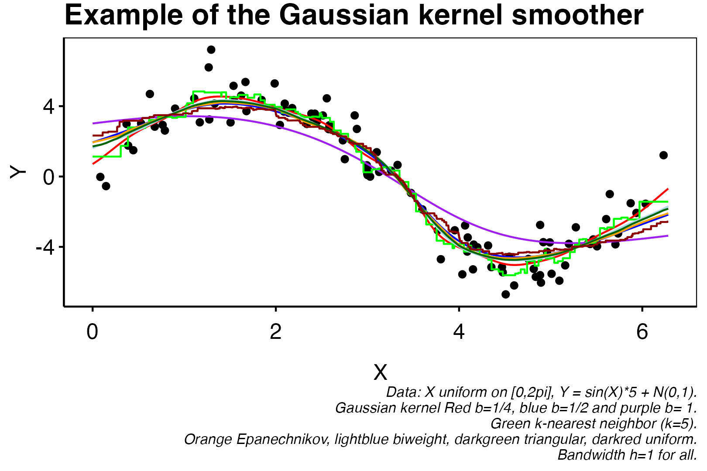

```{r,echo=FALSE}
rm(list = ls())
library(knitr)
if (knitr::is_latex_output()) {
  knitr::opts_chunk$set(
    fig.show = 'hide',
    results = 'hide',
    echo = FALSE,
    warning=FALSE,
    message = FALSE
  )
} else {
  knitr::opts_chunk$set(
    warning=FALSE,
    message = FALSE
  )
}
library(ggplot2)
library(dplyr)
theme_custom <- function() {
  
  theme_minimal() %+replace%
    
    theme(
      
      panel.grid.major = element_blank(),
      panel.grid.minor = element_blank(),
      panel.border = element_rect(colour = "black", fill=NA),
      axis.ticks = element_line(),
      #axis.line.x = element_line(color = "#C5C5C5"),
      axis.line = element_line(color = "black"),
      #axis.ticks = element_blank(),
      legend.position = "bottom",
      legend.title = element_blank(),
      #plot.background = element_rect(fill='transparent', color=NA),
      
      plot.title = element_text(             #title
                   #family = font,            #set font family
                   size = 16,                #set font size
                   face = 'bold',            #bold typeface
                   hjust = 0,                #left align
                   vjust = 2,
                   color = "black"),               #raise slightly
      
      plot.subtitle = element_text(          #subtitle
                   #family = font,            #font family
                   size = 12,
                   color = "black"),               #font size
      
      plot.caption = element_text(           #caption
                   #family = font,            #font family
                    face = "italic",
                   size = 8,                 #font size
                   hjust = 1,
                   color = "black"),               #right align
      
      axis.title = element_text(             #axis titles
                   #family = font,            #font family
                   size = 12,
                   color = "black"),               #font size
      
      axis.text = element_text(              #axis text
                   #family = font,            #axis famuly
                   size = 12,
                   color = "black"),                #font size
      
      axis.text.x = element_text(            #margin for axis text
                    margin=margin(5, b = 10))
      
    )
}
```

# Probabilistic Machine Learning

## Supervised Learning

In this chapter we restrict our selves to the area of *Supervised Learning* as we use numerical methods and machine learning algorithms to estimate models in a restricted framework. Take for instance the random forest, this algorithm's estimation method is perfectly capable of being written recursively and so no "leaning" is done in the sense, that the calculations are predetermined from the algorithm. We therefore call the area of study supervised learning instead of the wider area of study *machine learning*. Let us define what we mean by supervised learning.

<blockquote class = "def">

**Definition. (Supervised Learning)**\index{Supervised Learning} _Supervised learning is a field in machine learning that works with labeled data, i.e. data consisting of a set of features $X$, and a response $Y$. The goal is to learn a function $m^*$ that maps a given input $x$ to an output $y$._

</blockquote>

We will in this chapter only use data in the form of a spread sheet e.g.

$$
\mathcal{D}_n=
\left(X_i, Y_i \right)_{i=1,...,n}=
\left[
\begin{array}{cccc|c}
X_{11} & X_{12} & \cdots & X_{1p} & Y_1\\
X_{21} & X_{22} & \cdots & X_{2p} & Y_2\\
\vdots & \vdots & \ddots & \vdots & \vdots\\
X_{n1} & X_{n2} & \cdots & X_{np} & Y_n
\end{array}
\right],
$$

we could however consider any data that may be interpreted by computer software.

The setting is then; assume that we have $n$ independent copies of the random variable $D=(X,Y)\in \mathcal{X}\times \mathcal{Y}$, where $X$ is $p$-dimensional and $Y$ is one-dimensional. We make no assumption on whether $X_j$, $j=1,..,p$ and $Y$ are discrete or continuous, however in concrete cases this will be specified. We combine the sample of the $n$ observations in the matrix $\mathcal{D}_n=(X_i,Y_i)_{i=1,...,n}$ being a $n\times p+1$ matrix as in the above. We call $\mathcal{D}_n$ the **training data**\index{training data}.

This specification does indeed imply that $D_i=(X_i,Y_i)$ are iid. This is actually a bit controversial as we would expect that the distribution of $D$ will shift over time. For instance, the distribution of ages in a population changes over time and have been more right skewed as humanity advances. This may be accounted for by transforming the data such that the distribution becomes the same. This may be done in a variety of ways some example include: 1) transforming to uniform variable with the time dependent distribution $F_t$, 2) normalizing using a price index and so forth. One should therefore start any analysis by ensuring that the data a given algorithm is trained on is iid.

The job becomes finding a good estimator such that we may predict $Y$ given $X$ i.e. $Y\ \vert\ X$. Let us define what an estimator is.

<blockquote class = "def">

**Definition. (Estimator)**\index{Estimator} _Consider a training dataset $\mathcal{D}_n$. A estimator $m$ is a function-valued mapping that takes $\mathcal{D}_n$ as input and associates a function $m_n : \mathcal{X}\to \mathcal{Y}$ i.e. $m$ takes the form_

$$
m(\mathcal{D}_n)=m_n:\mathcal{X}\to \mathcal{Y}
$$

_the class of estimators is called $\mathcal{G}$._

</blockquote>

### What is a good estimator?

It is easy to construct an estimator $\hat{m}$ for instance by maximum likelihood esitmation, bayes optimization or simply by taking conditional expectations. We are however interested in two problems:

  1. What is the best class of estimators $\mathcal{G}_0\subset\mathcal{G}$,
  2. In the subset of estimators $m \in \mathcal{G}_0$, what is then the best estimator.

We will now discuss the meaning of being the *"best"* estimator. Obviously, the first type of consideration is regarding the inherent restrictions of some algorithm, where the second is the problem of error comming from the restriction that we do not have infinite observations. We therefore have two problems namely the **inductive bias** from the class $\mathcal{G}_0$ and the **estimation error** from the available data. A typical problem is that the larger a class $\mathcal{G}_0$ gives low inductive bias we then may not be able to estimate anything and so the estimation error will be large. The converse also applies.

<blockquote class = "def">

**Definition.** _Let $D=(X,Y)$ be a random variable on the background space $(\Omega, \mathcal{F},P)$. Then we define the following:_

  * _A **decision rule**\index{decision rule} is a deterministic function $m:\mathcal{X}\to \mathcal{Y}$,_
  * _A **loss function**\index{loss function} is a deterministic function $L: \mathcal{Y}\times \mathcal{Y}\to \mathbb{R}_+$,_
  * _The **risk**\index{risk} of a decision rule $m$ is given a loss function $L$ is $r(m)=E[L(Y,m(X))]$._

</blockquote>

Notice that in the definition of risk we see that $m$ is included inside the expectation. This means in particular that the training data $\mathcal{D}_n$ is also accounted for i.e. by the tower rule we have

$$
r(m)=\mathbb{E}[L(Y,m(X))]=\mathbb{E}\left[\mathbb{E}\Big[L(Y,m_n(X))\ \Big\vert\ \mathcal{D}_n\Big]\right]:=\mathbb{E}\left[R(m)\right].
$$

Some widely used loss function include

  * Quadratic loss function:\index{Quadratic loss function} $L(y_1,y_2)=(y_1-y_2)^2$,
  * Poisson Deviance:\index{Poisson Deviance} $L(y_1,y_2)=2\left(y_1\log\frac{y_1}{y_2}-y_1+y_2\right)$,
  * Binary loss function:\index{Binary loss function} $L(y_1,y_2)=1_{y_1\ne y_2}$.

Given a loss function $L$ we may find a (possibly non-unique) solution $m^*$ that minimizes $R(m)$. We call this the **Bayes estimator**\index{Bayes estimator}. The quantity $R(m^*)$ is called the **Bayes risk**\index{Bayes risk}. On some special case loss functions we may determine the unique solution.

<blockquote class = "lem">

**Lemma.** _Assume $Y$ is $L_2$ (square integrable), then the decision function that minimized the risk for the quadratic loss function is_

$$
m^*=\underset{m}{\text{argmin}}\ \mathbb{E}[(Y-m(X))^2]=E[Y\ \vert\ X=x]
$$
i.e. the conditional expectation.

</blockquote>

<details>
<summary>**Proof.**</summary>

Consider the loss function $L(y_1,y_2)=(y_1-y_2)^2$ i.e. the $L^2$ loss function. For any estimator $m(X)\in \mathcal G$ we have
\begin{align*}
R(m(X))&=\mathbb E[L(m(X),Y)\ \vert\ X]=\mathbb E[(m(X)-Y)^2\ \vert\ X]\\
&=\mathbb E[m(X)^2\ \vert\ X]+\mathbb E[Y^2\ \vert\ X]-2\mathbb E[m(X)Y\ \vert\ X]\\
&=m(X)^2+\mathbb E[Y^2\ \vert\ X]-2m(X)\mathbb E[Y\ \vert\ X]
\end{align*}
We see that the risk is minimized for the $m$ that minimizes $m(X)^2-2m(X)\mathbb E[Y\ \vert\ X]$. The first order condition is then

$$
\frac{\partial}{\partial m}R(m(X))=2m(X)-2\mathbb E[Y\ \vert\ X]=0
$$

hence giving that

$$
m(X)=\mathbb E[Y\ \vert\ X]
$$

as desired. $\blacksquare$

</details>

**Remarks on the $L^2$-loss.** The loss function $L(y_1,y_2)=(y_1-y_2)^2$ i.e. the $L^2$ loss function gives some nice interpretations. We know that $L$ as a norm on $\mathbb R$ forms a Hilbert Space. This means, for instance, that we have some nice geometric interpretations, but more importantly we have alot of tools from linear algebra. We know that the projection $m^*$ onto the space $\mathcal G$ and so any vector $\hat m(X)-m^*(X)$ is orthogonal to $Y-m^*(X)$. In particular, this gives that
\begin{align*}
r(\hat m(X))&=\mathbb E[L(\hat m(X),Y)]=\mathbb E\left[(\hat m(X)-Y)^2\right]\\
&=\mathbb E\left[(\hat m(X)-m^*(X)+m^*(X)-Y)^2\right]\\
&\stackrel{(\dagger)}{=}\mathbb E\left[(\hat m(X)-m^*(X))^2\right]+\mathbb E\left[(m^*(X)-Y)^2\right]\\
&=\mathbb E\left[(\hat m(X)-m^*(X))^2\right]+r(m^*(X))
\end{align*}
Using in $(\dagger)$ that $\hat m(X)-m^*(X)$ and $m^*(X)-Y$ are orthogonal with the last equation simply being the definition of risk. Rearranging the above gives

$$
r(\hat m(X))-r(m^*(X))=\mathbb E\left[(\hat m(X)-m^*(X))^2\right]=\text{MSE}(\hat m(x))
$$

We can further write out the Mean Squared Error in terms of variance and bias.
\begin{align*}
\text{MSE}(\hat m(x))&=\mathbb E\left[(\hat m(X)-m^*(X))^2\right]\\
&=\mathbb E\left[(\hat m(X)-\mathbb E[\hat m(X)\vert X])^2\right]+\mathbb E\left[(\mathbb E[\hat m(X)\vert X]-m^*(X))^2\right]\\
&=\text{Var}(\hat m(X))+\text{Bias}^2(\hat m(X)).
\end{align*}

<blockquote class = "lem">

**Lemma.** _Assume $\mathcal{Y}=\{1,...,K\}$, the decision function that minimizes the risk for the binary loss function satisfies_

$$
m^*=\underset{m}{\text{argmin}}\ \mathbb{E}[1_{Y\ne m(X)}]=\underset{m}{\text{argmin}}\  \mathbb{P}(Y\ne m(X))=\underset{k=1,..,K}{\text{argmax}}\ \mathbb{P}(Y=k\ \vert\ X=x).
$$

</blockquote>

We can now define the prediction risk and the generalization error which relates to the balance of a sufficiently large class $\mathcal{G}_0$ and how effective the optimal estimator is conditional on the class $\mathcal{G}_0$.

<blockquote class = "def">

**Definition. (Conditional risk)**\index{Conditional risk} _Let $\mathcal{D}_n$ be some training data. Given an estimator $\hat{m}_n$ we call_

$$
R(\hat{m}_n)=\mathbb{E}[L(Y,\hat{m}_n(X))\ \vert\ \mathcal{D}_n]
$$

_the prediction risk or conditional generalized error.\index{conditional generalized error}_

</blockquote>

<blockquote class = "def">

**Definition. (Risk)**\index{Risk} _We call_

$$
r(\hat{m}_n)=\mathbb{E}[R(\hat{m}_n)],
$$

_the prediction risk or generalized error.\index{generalized error}_

</blockquote>

### Excess risk

<blockquote class = "def">

**Definition. (Excess Risk)**\index{Excess Risk} _Consider the set $\mathcal{G}$ be the set of all measurable estimators. Fix a subset $\mathcal{G}_0\subset\mathcal{G}$. Given some training data $\mathcal{D}_n$ consider the Bayes estimator restricted to $\mathcal{G}_0$ denoted by $\hat{m}_n$ and the unconditional Bayes estimator restricted to $\mathcal{G}$ we define the quantity_

$$
R(\hat{m}_n)-r(m^*)
$$

_or_

$$
\mathbb{E}[R(\hat{m}_n)\ \vert\ X_1,...,X_n]-r(m^*),
$$

_as the excess risk. This is the difference between the generalization error and the risk obtained by an optimal decision function._

</blockquote>

In the context of the above definition we can decompose the risk associated with the optimal estimator $\hat{m}_n\in\mathcal{G}_0$ into the estimation error and the inductive bias.

$$
R(\hat{m}_n)-r(m^*)=\underbrace{\left[R(\hat{m}_n)-\inf_{m\in\mathcal{G}_0}R(m)\right]}_{\text{estimation error}}+\underbrace{\left[\inf_{m\in\mathcal{G}_0}R(m)-R(m^*)\right].}_{\text{inductions bias/approximation error}}
$$
\index{estimation error}\index{inductions bias}
where we have to balance the trade-off with a larger $\mathcal{G}_0$ infer a lower induction bias but larger estimation error and a smaller class $\mathcal{G}_0$ infer a lower estimation error but larger induction bias.

<blockquote class = "def">

**Definition. (Empirical risk and empirical risk minimizer)**\index{empirical risk}\index{empirical risk minimizer} _Given training data $\mathcal{D}_n$ and a loss function $L$, we call_

$$
\hat{R}_n(m):=\sum_{i=1}^nL(Y_i,m(X_i))
$$

_the **empirical risk**. Given an additional function class $\mathcal{G}_0$,_

$$
\underset{m\in\mathcal{G}_0}{\text{argmin}}\ \hat{R}_n(m)=\underset{m\in\mathcal{G}_0}{\text{argmin}}\ \sum_{i=1}^nL(Y_i,m(X_i))
$$

_is called **empirical risk minimizer** or (standard leaner)._

</blockquote>

For larger function classes $\mathcal{G}_0$ the empirical risk minimizer might not be unique and possibly too noisy. In this case one sometimes adds a penalty term $J_\lambda : \mathcal{G}\to \mathbb{R}_+$ that penalizes the complexity of $m$ and minimizes the penalized empirical risk:

$$
\underset{m\in\mathcal{G}_0}{\text{argmin}}\ \hat{R}_{n,\lambda}:=\underset{m\in\mathcal{G}_0}{\text{argmin}}\ \sum_{i=1}^nL(Y_i,m(X_i)) + J_\lambda(m).
$$

If $J_\lambda$ and $\hat{R}_n$ is convex one can show that

$$
\underset{m\in\mathcal{G}_0}{\text{argmin}}\ \hat{R}_{n,\lambda}=\underset{m\in\mathcal{G}_\eta}{\text{argmin}}\ \hat{R}_{n}
$$

for the class $\mathcal{G}_\eta=\{m\in \mathcal{G}_0\ \vert\ J_\lambda(m)\le \eta\}$. Some penalty terms could be

  * $J_\lambda(m)=\lambda\int m''(x)\ dx$,
  * $J_\lambda(m)=\lambda \int\vert m'(x)\vert\ dx$,
  * $J_\lambda(m)=\lambda \int(m(x))^2\ dx$.

<blockquote class = "prop">

**Proposition. (Probability bounds)** _Let $\tilde{m}=\underset{m}{\text{argmin}}\ r(m)$. We have_

$$
r(\hat{m}_n)-r(\tilde{m})\le 2\sup_{m\in\mathcal{G}_0}\Big\vert\hat{R}_n(m) - r(m) \Big\vert,
$$

_and for all $\lambda \in \Lambda$,_

$$
r(\hat{m}_{n,\lambda})-r(\tilde{m})\le 2\sup_{m\in\mathcal{G}_0}\Big\vert\hat{R}_{n,\lambda}(m) - r(m) \Big\vert + J_\lambda(\tilde{m})-J_\lambda(\hat{m}_n).
$$

</blockquote>

<blockquote class = "def">

**Definition.** _We say $\hat{m}_n$ is $\varepsilon$-accurate with probabiltiy $1-\delta$, if_

$$
P\Big(R(\hat{m}_n)-\inf_{m\in\mathcal{G}}r(m)>\varepsilon\Big)<\delta.
$$

</blockquote>

## Training, Validating and Testing

When deciding which method too choose for a given task, one may like to pick the method with the smallest generalization error. However, most machine learning methods depend on hyper parameters and one may first need to decide which hyper parameters are best for the given task. In short: We would like to compare the generalization error of optimally tuned machine learning methods given our data.

<blockquote class = "def">

**Definition. (Training and test set)** _One often randomly divides the given data into training data and test data:_

  * $\mathcal{D}_n=(X_i,Y_i)_{i=1,...,n}$ _(training data)\index{traning data}_
  * $\mathcal{T}_m=(\tilde{X}_j,\tilde{Y}_j)_{j=1,...,m}$ _(test data)\index{test data}_

_with $n\in[0.8m,0.95m]$._

</blockquote>

<blockquote class = "def">

**Definition. (Training and test error)** _The empirical risk on the training data is called training error and on the test data test error._

</blockquote>

<blockquote class = "def">

**Definition. (Validation set)** _To tune the hyper parameters for an algorithm, one often randomly divides the given training data into training data (yes: also called training data.) and validation data:_

  * $\mathcal{D}_{n_1}=(X_i,Y_i)_{i=\tau(1),...,\tau(n_1)}$ _(traning data)_
  * $\mathcal{V}_{n_2}=(\tilde{X}_j,\tilde{Y}_j)_{j=\tau(n_1+1),...,\tau(n)}$ _(validation data)\index{validation data}_

_where $\tau$ is a randomly picked permutation of $\{1,...,n\}$ and $n_1+n_2=n$ is respectively the size of the training set and the validation set._

</blockquote>

One can now compare different methods via the following simple algorithm:

  1. Split your data into train, validation and test set.
  2. For a given method and a rich set of hyper parameter configurations train the method on the training set and compare performance via empirical risk on the validation set.
  3. For every method, pick the hyper parameter with the smallest empirical risk.
  4. Compare different methods with the chosen hyper parameters on the test set (trained on training+validation set) and pick the method with smallest empirical risk.

Notice that the procedure above is stochastic and has bias and variance both for selecting the optimal hyper parameters and for selecting the optimal method.

  * Bias: Bias occurs because the sample sizes used for learning the hyper parameters   $n_1$ are smaller than the actual training size $n$ and also the full data size $n+m$.
  * Variance: The results are stochastic because the validation and test set are not of infinite size.

Variance can be reduced by repeating steps 1-4 several times. The most popular method for doing so is (nested) cross validation.

### Estimating risk

We want to estimate the generalization error of a method $\hat{m}_{n,\lambda}$ that depends on a fixed hyper parameter $\lambda$.

<blockquote class = "def">

**Definition. (M-fold Cross validation)**\index{M-fold Cross validation} _Given the indices of a data set $S=\{1,...,n\}$, M-fold cross validation follows the following steps:_

  1. _Divide the data into $M$ disjoint sets $S_1,...,S_M$ of same size. Define $S_{-l}=\cup_{k\ne l}S_k$ being the complement to $S_l$. ($\#S_l=n/M$ and $\#S_{-l}=(M-1)n/M$)_
  2. _For each subdivision $l=1,...,M$ train the algorithm on $S_{-l}$ and denote the estimator $\hat{m}_\lambda(S_{-l})$._
  3. _Calculate the cross validated empirical risk_
  $$
  CV(\hat{m}_{n,\lambda})=\frac{1}{M}\sum_{l=1}^M\frac{1}{\vert S_{-l}\vert}\sum_{i\in S_{-l}}L\big(Y_i,\hat{m}_\lambda(S_{-l})(X_i)\big)
  $$

</blockquote>

It is a non-trivial discussion what $CV(\hat{m}_{n,\lambda})$ is estimating. Consider the heuristic
\begin{align*}
CV(\hat{m}_{n,\lambda})&=\frac{1}{M}\sum_{l=1}^M\frac{1}{\vert S_{-l}\vert}\sum_{i\in S_{-l}}L\big(Y_i,\hat{m}_\lambda(S_{-l})(X_i)\big)\\
&\approx \frac{1}{M}\sum_{l=1}^MR\big(Y,\hat{m}_\lambda(S_{-l})(X)\big)\\
&\approx \mathbb{E}\left[R\big(Y,\hat{m}_\lambda(S_{-l})(X)\big)\right].
\end{align*}
Where we used the law of large numbers in the first approximation. The last approximation is not so clear because the summands are dependent for $M>2$.

The bias is minimal for large $M$ since estimation is based on training the algorithm on $(M-1)n/M$ data points. In the case that $M=n$, M-fold cross validation is also known as leave-one-our cross validation. It is however often not practical because of the computational cost. In practice, setting $M=5$ or $M=10$ is common choices.

When deciding on an optimal hyper parameter we would like to pick

$$
\underset{\lambda \in \Lambda}{\text{argmin}}\ CV(\hat{m}_{n,\lambda}).
$$

But the hyper parameter space $\Lambda$ is often multi-dimensional and partly continuous. Hence it is infeasible to try out all parameters. Common practice are

  * Grid search
  * Random search (e.g. pick 200 parameters uniformly random from the parameter space)
  * Advanced optimization techniques (i.e. techniques that aim to find the minimzer of a function (here: cross validated empirical risk) without the requirement of knowing the analytical form of the function to optimize.
  
Above we have discussed how we can use cross validation to pick an optimal parameter for a given method and data set. But how to choose between different methods? One popular way is nested cross validation comprising an inner loop for hyper parameter selection (tuning) and an outer loop for method comparison. Assume that we want to compare $J$ methods $\hat{m}_{n,j}$, $j=1,...,J$. then we may use nested cross validation.

<blockquote class = "def">

**Definition. (Nested $M_1-M_2$ Cross-validation)**\index{Nested $M_1-M_2$ Cross-validation} _Given the indices of a data set $S=\{1,...,n\}$, nested $M_1-M_2$ cross validation follows the following steps:_

  1. _Divide the data into $M_1$ disjoint sets $S_1,...,S_{M_1}$ of same size. Define $S_{-l}=\cup_{k\ne l}S_k$ being the complement to $S_l$. ($\#S_l=n/M_1$ and $\#S_{-l}=(M_1-1)n/M_1$)_
  2. _For each $l=1,...,M_1$, run $M_2$-fold cross validation on $S_{-l}$ for all $J$ methods, returning optimal hyper parameters $\hat{\lambda}(j,l)$, $j=1,...,J$ and $l=1,...,M_1$. (the one with lowest $CV$ is choosen for each $(j,l)$)_
  3. _Calculate the cross validated empirical risk_
  $$
  CV(\hat{m}_{n,j})=\frac{1}{M_1}\sum_{l=1}^{M_1}\frac{1}{\vert S_{-l}\vert}\sum_{i\in S_l}L\big(Y_i,\hat{m}_{\lambda(j,l)}(S_{-l})(X_i)\big)
  $$
  4. _Pick the method with the smallest risk (and possibly tune again for fitting)_

</blockquote>

## Linear Models

We may take the linear model as a case study of the methods introduced in the above chapter. As such we consider the squaed loss $L(y_1,y_2)=(y_1-y_2)^2$ for which we already know the Bayes rule:

$$
m^*(x)=\underset{m}{\text{argmin}}\ R(m)=\mathbb{E}[Y\ \vert\ X=x].
$$

The linear model has the following assumptions. There exists paramaters $\beta_0^*,\beta_1^*,...,\beta_p^*$, with

$$
m^*(x)=\beta_0^*+\sum_{j=1}^{p}\beta_j^*x_j.
$$

In other words, we assume that $m^*$ is a linear function, i.e.,

$$
m^*\in\mathcal{G}=\{f : \mathbb{R}^p\to \mathbb{R}\ \vert\ f(x)=\beta^\top x\}.
$$

Given iid training data $(X_i,Y_i)_{i=1,...,n}$ we have an additive noise model

$$
Y_i=\beta_0^*+\sum_{j=1}^{p}\beta_j^*X_{ij}+\varepsilon_i,
$$

with $\varepsilon_i=Y_i-m^*(X_i)$ and hence iid with $\mathbb{E}[\varepsilon_i\ \vert\ X_i]=0$.

Notice, that since we are assuming $m^*\in\mathcal{G}$ we have by assumption no inductive bias and we therefore only consider estimation error i.e.

$$
R(\hat{m}_n)-r(m^*).
$$

Given the training data we may approximate the coefficients using the following.

<blockquote class = "lem">

**Lemma. (Coefficients in the linear model)** _Under the Linear model assumption we have for $j=1,...,p$_

$$
\beta^*_j=\frac{\text{Cov}\Big(X_{1j},Y_1-\sum_{k\in \{1,...,p\}\setminus \{j\}} \beta_k^*X_{1k}\Big)}{\text{Var}(X_{1j})}
$$

_In particular, if the components of $X$ are uncorrelated, we have_

$$
\beta_j^*=\frac{\text{Cov}(X_{1j},Y_1)}{\text{Var}(X_{1j})}.
$$

</blockquote>

<blockquote class = "lem">

**Lemma. (Bayes risk in the linear model)** _Under the Linear model assumption we have_

  1. $r(m^*)=\text{Var}(\varepsilon_i)$
  2. For $m(x)=\beta_0+\sum_{j=1}^p \beta_jx_j$,
  $$
  r(m)-r(m^*)=\Vert\Sigma^{1/2}(\beta -\beta^*) \Vert^2_2.
  $$

_with $\Sigma = \mathbb E[\mathbf X\mathbf X^\top]$._

</blockquote>

<details>
<summary>**Proof.**</summary>

(1). We have by assumptions that $m^*(X)=\mathbb E[Y\ \vert\ X]=X^\top\beta^*$ is the Bayes estimator. Using that the noise is additive we have $Y=m^*(X)+\varepsilon$ with $\mathbb E[\varepsilon]=0$.
\begin{align*}
r(m^*)&=\mathbb E[(m^*(X)-Y)^2]=\mathbb E[(X^\top\beta ^*-Y)^2]\\
&=\mathbb E[\varepsilon^2]=\text{Var}(\varepsilon)-\mathbb E[\varepsilon]^2\\
&=\text{Var}(\varepsilon).
\end{align*}
(2). Take any linear estimor $m(X)=X^\top \beta$, then we have
\begin{align*}
r(m)&=\mathbb E[(m(X)-Y)^2]\\
&=\mathbb E[(m(X)-m^*(X)+m^*(X)-Y)^2]\\
&=\mathbb E[(m(X)-m^*(X))^2]+\mathbb E[(m^*(X)-Y)^2]+2\mathbb E[(m(X)-m^*(X))(m^*(X)-Y)]\\
&=\mathbb E[(m(X)-m^*(X))^2]+r(m^*)
\end{align*}
Using that $m^*(X)-Y$ is orthogonal to $m(X)-m^*(X)$. This gives us the following
\begin{align*}
r(m)- r(m^*)&=\mathbb E[(m(X)-m^*(X))^2]\\
&=\mathbb E[(X^\top \beta -X^\top \beta^*)^2]\\
&=\mathbb E[XX^\top(\beta-\beta^*)^2]\\
&=\Sigma(\beta-\beta^*)^2=\Vert \Sigma^{1/2}(\beta - \beta^*)\Vert ^2_2
\end{align*}
as desired. $\blacksquare$

</details>

### Least Squares Estimator

Moving forward we will assume $\beta_0^*=0$ since we can always translate the data and make the centered around 0. We will furthermore use the notation:

$$
\mathbf{X}=
\begin{bmatrix}
X_{11} & \cdots & X_{1p}\\
\vdots & \ddots & \vdots\\
X_{n1} & \cdots & X_{np}
\end{bmatrix},\hspace{10pt} \mathbf{Y}=
\begin{pmatrix}
Y_1\\
\vdots\\
Y_n
\end{pmatrix},\hspace{10pt} \varepsilon=
\begin{pmatrix}
\varepsilon_1\\
\vdots\\
\varepsilon_n
\end{pmatrix}.
$$

In this cases the empirical risk takes the form

$$
\hat{R}_n(m)=\frac{1}{n}\Vert\mathbf{Y}-\mathbf{X}\beta \Vert^2_2.
$$

<blockquote class = "lem">

**Lemma. (Least squares estimator)**\index{Least squares estimator}

  * _It holds that $(\mathbf{X}^\top\mathbf{X})\hat{\beta}=\mathbf{X}^\top \mathbf{Y}$,_
  * _If $\mathbf{X}$ has full rank, then_
  $$
  \hat{\beta}_n^{LS}=(\mathbf{X}^\top\mathbf{X})^{-1}\mathbf{X}^\top \mathbf{Y}.
  $$

</blockquote>

<blockquote class = "thm">

**Theorem. (Excess risk Least squares estimator)** _If $\mathbf{X}^\top\mathbf{X}$ is invertible, then_

$$
\mathbb{E}[R(\hat{m}_n^{LS})\ \vert\ \mathbf{X}]-r(m^*)=\frac{\sigma^2}{n}\cdot \text{tr}\left(\Sigma\hat{\Sigma}^{-1}\right)
$$

_with $\Sigma=\mathbb{E}[\mathbf{X}^\top\mathbf{X}]$ and $\hat{\Sigma}=\frac{1}{n}\mathbf{X}^\top\mathbf{X}$._

</blockquote>

<details>
<summary>**Proof.**</summary>

$$
\hat{\beta}^{LS}=\left(\mathbf{X}^T \mathbf{X}\right)^{-1} \mathbf{X}^T \mathbf{Y}=\left(\mathbf{X}^T \mathbf{X}\right)^{-1} \mathbf{X}^T \mathbf{X} \beta^*+\left(\mathbf{X}^T \mathbf{X}\right)^{-1} \mathbf{X}^T \mathbf{\varepsilon}=\beta^*+\left(\mathbf{X}^T \mathbf{X}\right)^{-1} \mathbf{X}^T \mathbf{\mathbf { \varepsilon }}.
$$

Thus
\begin{align*}
R\left(\hat{m}^{LS}\right)-r\left(m^*\right) & =\left\|\Sigma^{1 / 2}\left(\hat{\beta}^{L S}-\beta^*\right)\right\|_2^2=\left\|\Sigma^{1 / 2}\left(\mathbf{X}^T \mathbf{X}\right)^{-1} \mathbf{X}^T \mathbf{\varepsilon}\right\|_2^2=n^{-1}\left\|n^{-1/2}\Sigma^{1 / 2} \hat{\Sigma}^{-1} {\mathbf{X}^T \mathbf{\varepsilon}}\right\|_2^2 \\
& =n^{-1}\|A \mathbf{\varepsilon}\|_2^2,
\end{align*}
where $\hat \Sigma=n^{-1} \mathbf{{X^T}X}, A:=n^{-1/2}\Sigma^{1 / 2} \hat{\Sigma}^{-1} {\mathbf{X}^T}$. We calculate the excess risk conditional on $\mathbf{X}$. Note that $\operatorname{tr}(\cdot)$ is linear and invariant under cyclic permutations. We have
\begin{align*}
\mathbb{E}\left[R\left(\hat{m}^{LS}\right) \mid \mathbf{X}\right]-r\left(m^*\right) & =n^{-1} \mathbb{E}\left[\|A \mathbf{\varepsilon}\|_2^2 \mid \mathbf{X}\right] \\
& =n^{-1} \mathbb{E}\left[\operatorname{tr}\left(A \mathbf{\varepsilon \varepsilon}^T A^T\right) \mid \mathbf{X}\right]=n^{-1} \operatorname{tr}(A \underbrace{\mathbb{E}\left[\mathbf{\varepsilon \varepsilon}^T\right]}_{=\sigma^2 I_{p \times p}} A^T)=\frac{\sigma^2}{n}\|A\|_F^2 \\
& =\frac{\sigma^2}{n} \cdot \operatorname{tr}\left(\Sigma^{1 / 2} \hat{\Sigma}^{-1} \hat{\Sigma} \hat{\Sigma}^{-1} \Sigma^{1 / 2}\right) \\
& =\frac{\sigma^2}{n} \cdot \operatorname{tr}\left(\Sigma \hat{\Sigma}^{-1}\right) .
\end{align*}
as desired. $\blacksquare$

</details>

From the above it follos that if $\hat{\Sigma}\approx \Sigma$ then

$$
\mathbb{E}[R(\hat{m}_n^{LS})\ \vert\ \mathbf{X}]-r(m^*)\approx\frac{\sigma^2p}{n}.
$$

This approximation does not take into account the variation of $X$. Due to the inverse, it is not easily possible to derive an upper bound for the expectation of $\hat{\Sigma}^{-1}$.  Therefore, we only obtain a result for the excess Bayes risk which holds with high probability and under additional assumptions (which could be relaxed but would lead to much more complicated proofs).

<blockquote class = "thm">

**Theorem. (PAC Least squares estimator)**\index{PAC Least squares estimator} _We do not assume a linear model. Let $m(x)=E[Y\ \vert\ X=x]$ and assume $m^*(x)=x\Sigma^{-1}E[YX]$ is the best linear approximation. Assume that $X$ has bounded support and sub-Gaussian noise, i.e., there exists a $\sigma$ such that for all $t$:_

$$
E[e^{tx}\ \vert\ X=x]\le e^{t^2\sigma^2/2},
$$

_then for $n$ big enough, and $t>\max\{0,2.6-\log p\}$_

$$
P\left(r(\hat{m}^{LS})-r(m^*)\ge \frac{2 A}{n}(1+\sqrt{8t})^2+\frac{\sigma^2(p+2\sqrt{pt}+2t)}{n} + o(1/n)\right)\le 3e^{-t}
$$

_where $A=\mathbb{E}\left[\Vert\Sigma^{1/2}X(m(X)-\beta^\top X) \Vert^2\right]$ is an approximation error._

</blockquote>

Up until now we have assumed that $\mathbf{X}$ has full rank. This is not very realistic for very large $p$ ($p> > n$). Even if $\mathbf{X}^\top\mathbf{X}$ is invertible, the variance of the estimation error might be too large. This leads us to penalized models that reduce variance by adding some bias. Other alternatives (not discussed here) are dimension reduction, say via PCA, or feature selection, say forward stepwise regression.

### Ridge Regression

<blockquote class = "def">

**Definition. (Ridge regression)**\index{Ridge regression} _Let $\lambda \geq 0$ and_

$$
J_\lambda(\beta)=\lambda\|\beta\|_2^2=\lambda \sum_{j=1}^p \beta_j^2.
$$

_The Ridge estimator is defined as _
\begin{align*}
\hat{\beta}_\lambda^{\text {ridge }} & =\underset{\beta \in \mathbb{R}^p}{\arg \min }\left\{\hat{R}_n(\beta)+J_\lambda(\beta)\right\} \\
& =\underset{\beta \in \mathbb{R}^p}{\arg \min }\left\{\|\mathbf{Y}-\mathbf{X} \beta\|_2^2+\lambda\|\beta\|_2^2\right\} .
\end{align*}
_The corresponding algorithm is_

$$
\hat{m}_{n, \lambda}^{\text {ridge }}(x)=\sum_{j=1}^p \hat{\beta}^\text{ridge}_{\lambda, j} x_j.
$$

</blockquote>

<blockquote class = "lem">

**Lemma. (Ridge regression solution)** _Let $\lambda>0$. Then _

$$
\hat{\beta}^\text{ridge}_\lambda=\left(\mathbf{X}^T \mathbf{X}+\lambda n I_{p \times p}\right)^{-1} \mathbf{X}^T \mathbf{Y}
$$
</blockquote>

In ridge regression, the matrix $\mathbf{X}^T \mathbf{X}$ is 'made invertible' by adding a positive multiple of the identity matrix. Therefore, the ridge estimator also can be used in the case $p>n$. The name 'ridge' stems from the fact that the optimization problem is equivalent to 

$$
\min _{ \beta \in \mathbb{R}^p} \hat{R}_n(X\beta) \quad \text { s.t. } \quad\|\beta\|_2 \leq t
$$

for some suitable $t>0$.

<blockquote class = "thm">

**Theorem. (Excess risk for ridge regression estimator)** _Under the linear model, _

$$
\mathbb E[ R\left(\hat{m}^{n,\text{ridge}}_\lambda \right)|X]-r\left(m^*\right)=\frac{\sigma^2}{n} \cdot \operatorname{tr}\left(\Sigma\left(\hat{\Sigma}+\lambda I_{p \times p}\right)^{-1} \hat{\Sigma}\left(\hat{\Sigma}+\lambda I_{p \times p}\right)^{-1}\right)+\lambda^2\left\|\Sigma^{1 / 2}\left(\hat{\Sigma}+\lambda I_{p \times p}\right)^{-1} \beta^*\right\|_2^2.
$$

_Let $\Sigma=U D U^T$ be the spectral decomposition of $\Sigma$ with orthogonal matrix $U$ and diagonal matrix $D=\operatorname{diag}\left(s_1, \ldots, s_p\right.$ ) (entries are the eigenvalues of $\Sigma$ ). By assuming $\hat \Sigma= \Sigma$, the excess risk simplifies to _

$$
\frac{\sigma^2}{n} \sum_{j=1}^p \frac{s_j^2}{\left(s_j+\lambda\right)^2}+\lambda^2 \cdot \sum_{j=1}^p \frac{s_j\left(U^T \beta^*\right)_j^2}{\left(s_j+\lambda\right)^2}.
$$
</blockquote>

<details>
<summary>**Proof.**</summary>

\begin{align*}
\hat{\beta}_\lambda-\beta^* & =-\lambda n\left(\mathbf{X}^T \mathbf{X}+\lambda n I_{p \times p}\right)^{-1} \beta^*+\left(\mathbf{X}^T \mathbf{X}+\lambda n I_{p\times p}\right)^{-1} \mathbf{X}^T \mathbf{\varepsilon} \\
& =-\lambda\left(\hat{\Sigma}+\lambda I_{p \times p}\right)^{-1} \beta^*+\frac{1}{n}\left(\hat{\Sigma}+\lambda I_{p \times p}\right)^{-1} \mathbf{X}^T \mathbf{\varepsilon}
\end{align*}.
thus 

$$
R\left(\hat{\beta}_\lambda\right)-R\left(\beta^*\right)=\left\|B-\frac{1}{\sqrt{n}} A \mathbf{\varepsilon}\right\|_2^2=\|B\|_2^2-\frac{2}{\sqrt{n}}\langle B, A\varepsilon \rangle+\frac{1}{n}\|A \mathbb{\mathbf { \varepsilon }}\|_2^2
$$

where $A=\Sigma^{1 / 2}\left(\hat{\Sigma}+\lambda I_{p \times p}\right)^{-1} \frac{\mathbf{X}^T}{\sqrt{n}}$ and $B:=\lambda \Sigma^{1 / 2}\left(\hat{\Sigma}+\lambda I_{p \times p}\right)^{-1} \beta^*$. Since $\mathbb{E} \mathbf{\varepsilon}=0$, we have 
\begin{align*}
\mathbb{E}\left[R\left(\hat{\beta}_\lambda\right) \mid \mathbf{X}\right]-R\left(\beta^*\right) & =\frac{\sigma^2}{n}\|A\|_F^2+\|B\|_2^2 \\
& =\frac{\sigma^2}{n} \cdot \operatorname{tr}\left(\Sigma\left(\hat{\Sigma}+\lambda I_{p \times p}\right)^{-1} \hat{\Sigma}\left(\hat{\Sigma}+\lambda I_{p \times p}\right)^{-1}\right)\\
&+\lambda^2\left\|\Sigma^{1 / 2}\left(\hat{\Sigma}+\lambda I_{p \times p}\right)^{-1} \beta^*\right\|_2^2
\end{align*}
Furthermore, assuming $\hat \Sigma= \Sigma$ the above expression simplifies to 
\begin{align*}
&\frac{\sigma^2}{n} \cdot \operatorname{tr}\left(\Sigma\left(\Sigma+\lambda I_{p \times p}\right)^{-1} \Sigma\left(\Sigma+\lambda I_{p \times p}\right)^{-1}\right)+\lambda^2\left\|\Sigma^{1 / 2}\left(\Sigma+\lambda I_{p \times p}\right)^{-1} \beta^*\right\|_2^2 \\
=&\frac{\sigma^2}{n} \cdot \operatorname{tr}\left(D\left(D+\lambda I_{p \times p}\right)^{-1} D\left(D+\lambda I_{p \times p}\right)^{-1}\right)+\lambda^2\left\|D^{1 / 2}\left(D+\lambda I_{p \times p}\right)^{-1} U^T \beta^*\right\|_2^2 \\
=&\frac{\sigma^2}{n} \sum_{j=1}^p \frac{s_j^2}{\left(s_j+\lambda\right)^2}+\lambda^2 \cdot \sum_{j=1}^p \frac{s_j\left(U^T \beta^*\right)_j^2}{\left(s_j+\lambda\right)^2}
\end{align*}

and the result follows. $\blacksquare$

</details>

If all eigenvalues are equal, that is, $s_j=s$ and if additionally $\left(U^T \beta^*\right)_j=b(j=1, \ldots, p)$, then the expression of the theorem simplifies to 

$$
\frac{\sigma^2 p}{n} \cdot \frac{s^2}{(s+\lambda)^2}+\lambda^2 \frac{s b^2 p}{(s+\lambda)^2} \underset{\lambda=\frac{\sigma^2/n}{b^2}}{\stackrel{\min }{\rightarrow}} \frac{\sigma^2 p}{n} \cdot \frac{b^2 s}{\frac{\sigma^2}{n}+b^2 s} \leq \frac{\sigma^2 p}{n} .
$$

We see that for a suitable choice of the penalization parameter $\lambda$, the excess Bayes risk of the ridge estimator can be smaller than the corresponding upper bound of the LS estimator.

### Lasso Regression

If we believe that some covariates are pure noise, i.e., unrelated to $Y$, the most obvious choice to penalize $\beta$ would be of the form $\|\beta\|_0=\#\{j=$ $\left.{1, \ldots, p: \beta_j} \neq 0\right\}$. Then, one would simply penalize the number of non-zero entries of $\beta$. However, this leads to an NP-hard optimization problems whose solutions are not accessible in practice. One therefore uses a different norm which has similar properties but leads to a convex optimization problem.

<blockquote class = "def">

**Definition. (Lasso - Least absolute shrinkage and selection operator regression)**\index{Lasso regression} _Let $\lambda \geq 0$ and _

$$
J_\lambda(\beta)=\lambda \cdot\|\beta\|_1=\lambda \sum_{j=1}^p\left|\beta_j\right| .
$$

_The LASSO estimator is given by _
\begin{align*}
\hat{\beta}_\lambda^{\text {lasso }} & \in \underset{\beta \in \mathbb{R}^p}{\arg \min }\left\{\hat{R}_n(X\beta)+J_\lambda(X\beta)\right\} \\
& =\underset{\beta \in \mathbb{R}^p}{\arg \min }\left\{\frac{1}{n}\|\mathbf{Y}-\mathbf{X} \beta\|_2^2+\lambda \cdot\|\beta\|_1\right\}
\end{align*}
_The corresponding algorithm reads _

$$
\hat{m}_{n, \lambda}^{l a s s o}(x)=\sum_{j=1}^p \hat{\beta}^{\text{lasso}}_{\lambda, j} x_j.
$$

</blockquote>

There exists no easy closed-form solution for $\hat \beta^{\text{lasso}}_{\lambda}$ besides some special cases.

For $\beta \in \mathbb{R}^p$, define 

$$
S(\beta):=\left\{j \in\{1, \ldots, p\}: \beta_j \neq 0\right\}.
$$

For $S \subset\{1, \ldots, p\}$ and $v \in \mathbb{R}^p$, put $v_S:=\left(v_j \mathbb{1}_{\{j \in S\}}\right)_{j=1, \ldots, p}$

If $p \ll n$, then $\hat{\Sigma}$ would usually be invertible and the smallest eigenvalue (Rayleigh quotient) would satisfy 

$$
\lambda_{\min }(\hat{\Sigma}):=\inf _{v \in \mathbb{R}^p} \frac{v^T \hat{\Sigma} v}{\|v\|_2^2}>0.
$$

Then $\hat{\Sigma}$ would be one-to-one (injective) and the linear equation system $\hat{\Sigma} \beta=\frac{1}{n} \mathbf{X}^T \mathbf{Y}$ would lead to the (unique) least squares estimator.

For $p \gg n$, one has $\lambda_{\min }(\hat{\Sigma})=0$.

When employing LASSO, we are usually only interested in estimators $\hat{\beta}$ whith non-zero entries at the components $S\left(\beta^*\right)$. This means that in principle we only need injectivity of $\hat{\Sigma}$ on the set 

$$
\tilde{C}=\left\{\beta \in \mathbb{R}^p: S(\beta)=S\left(\beta^*\right)\right\}=\left\{\beta \in \mathbb{R}^p:\left\|\beta_{S\left(\beta^*\right)^ c}\right\|_1=0\right\},
$$

or equivalently, $\inf _{v \in \tilde{C}} \frac{v^T \hat{\Sigma} v}{\|v\|_2^2}=\inf _{v \in \tilde{C}} \frac{v^T \hat{\Sigma} v}{\left\|v_{S\left(\beta^*\right)}\right\|_2^2}>0 .$

<blockquote class = "def">

**Definition. (Restricted eigenvalue property (REP))**\index{Restricted eigenvalue property (REP)} _We say that the restricted eigenvalue property (REP) is satisfied with $\alpha>0$ if for_

$$
C:=\left\{\beta \in \mathbb{R}^p:\left\|\beta_{S\left(\beta^*\right)^c}\right\|_1 \leq \alpha \left\|\beta_{S\left(\beta^*\right)}\right\|_1\right\}
$$

_it holds that_

$$
\Lambda_{\min }(\Sigma):=\inf _{v \in C} \frac{v^T \Sigma v}{\left\|v_{S\left(\beta^*\right)}\right\|_2^2}>0,
$$

</blockquote>

<blockquote class = "thm">

**Theorem.** _Let $\varepsilon \sim N\left(0, \sigma^2\right), X \sim N(0, \Sigma)$ and $\Sigma_{j j}=1(j=1, \ldots, p)$. Define $s:=\# S\left(\beta^*\right)$. Then there exist universal constants $c_1, c_2>0$ such that the condition_

$$
n \geq c_1 \frac{\|\Sigma\|_2}{\Lambda_{\min }(\Sigma)^2} s \log (e p / s)
$$

_implies: For each $t \geq 0$ and _

$$
\lambda \geq \frac{6 \sqrt{2} \sigma}{\sqrt{n}} \sqrt{\log (p)+t},
$$

_it holds that_

$$
\mathbb{P}\left(R\left(\hat{m}_{n,\lambda}\right)-r\left(\beta^*\right)>16 \lambda^2 \frac{s}{\Lambda_{\min }(\Sigma)}\right) \leq e^{-t}+2 p e^{-c_2 n} .
$$

</blockquote>

The upper bound for the convergence rate of the excess risk of the LASSO estimator is minimized for $\lambda=6 \sqrt{2} \cdot \frac{\sigma}{\sqrt{n}} \sqrt{\log (p)}$. With that choice, 

$$
16 \lambda^2 \frac{s}{\Lambda_{\min }(\Sigma)}=\frac{\text {c }}{\Lambda_{\min }(\Sigma)} \cdot \frac{\sigma^2 s}{n} \cdot \log (p)
$$


Interpretation: $\hat{\beta}_\lambda$ behaves like the LS estimator in a model with $s$ instead of $p$ dimensions.

The LASSO estimator $\hat{\beta}_\lambda$ has to 'pay' with a factor $\log (p)$ for the missing insight which components are non-zero. This is a rather small price to pay even if $p$ is large.

One can prove similar theoretical statements without the conditions $\varepsilon \sim N\left(0, \sigma^2\right)$ and $X \sim N(0, \Sigma)$ and still can preserve the small $\log (p)$ term.

Regarding the REP: The smallest eigenvalue $\lambda_{\min }(\Sigma)$ measures how strongly the components of $X$ are correlated. Note that a strong correlation of $X$ is a problem for estimation of $\beta^*$, but not for the excess risk itself: In the extreme case $X_1=X_2$, it is clear that $\hat{\beta}$ cannot distinguish the values of $\beta_1^*$ and $\beta_2^*$, but it can still provide good predictions through $X \hat{\beta}$. Unfortunately, the proof technique underlying the theorem transfers the estimation quality of $\beta^*$ to an upper bound of the excess risk, therefore this fact is not adequately represented in the result.

The assumption $\Sigma_{j j}=1$ is only to provide an easier result. In practice, this normalization can be obtained by standardizing $X_1, \ldots, X_n$ before computing the LASSO estimator (that is, center $X_i$ and divide by the empirical standard deviation).

<blockquote class = "thm">

**Theorem.** _We do not assume that the linear model holds. Assume that $X$ and $Y$ have bounded support (bounded by $B>0$). Let _

$$
\beta_*=\underset{\|\beta\|_1 \leq \eta}{\operatorname{argmin}}\ r(X\beta)
$$

_Then for any $\xi>0$,_

$$
\mathbb P\left (r(\widehat{\beta})- r\left(\beta_*\right)\geq\sqrt{\frac{2(\eta+1)^4 B^2}{n} \log \left(\frac{2p^2}{\xi}\right)}\right) \leq \xi  .
$$

</blockquote>

<details>
<summary>**Proof.**</summary>

Set $Z=(Y, X)$ and $Z_i=\left(Y_i, X_i\right)$, $\gamma = \gamma(\beta)=(-1, \beta)$. Then 

$$
r(X\beta)=\mathbb{E}\left(Y-\beta^T X\right)^2=\gamma^T \Lambda \gamma
$$

where $\Lambda=\mathbb{E}\left[Z Z^T\right]$. Note that $\|\gamma\|_1=\|\beta\|_1+1$. Let $\mathcal{B}=\left\{\beta:\|\beta\|_1 \leq \gamma\right\}$. 

$$
\hat{R}_n( X\beta)=\frac{1}{n} \sum_{i=1}^n\left(Y_i-X_i^T \beta\right)^2=\gamma^T \widehat{\Lambda} \gamma
$$

where $\widehat{\Lambda}=\frac{1}{n} \sum_{i=1}^n Z_i Z_i^T$. For any $\beta \in \mathcal{B}$ 
\begin{align*}
|\hat{R}_n(\mathbf X\beta)-r(X\beta)| & =\left|\gamma^T(\widehat{\Lambda}-\Lambda) \gamma\right| \\
& \leq \sum_{j, k}|\gamma_j||\gamma_k||\widehat{\Lambda}_{j k}-\Lambda_{jk}| \\
& \leq(\eta+1)^2 \max_{jk} |\widehat{\Lambda}_{j k}-\Lambda_{jk}|
\end{align*}
Note that $|\Lambda_{jk}| \leq B^2$. By Hoeffding's inequality, 

$$
\mathbb{P}\left( |\widehat{\Lambda}_{j k}-\Lambda_{jk}|\geq \epsilon\right) \leq 2 e^{-2n \epsilon^2 / B^2}
$$

and so, by the union bound, 

$$
\mathbb{P}\left(\max _{j, k}|\widehat{\Lambda}_{j k}-\Lambda_{j k}| \geq \epsilon\right) \leq 2 p^2 e^{-2n \epsilon^2 / B^2}=\xi,
$$

if we choose $\epsilon=\sqrt{\frac{B^2} {2 n} \log \left(\frac{{2} p^2}{{ \xi}}\right)}$.
Hence, with probability $1-\xi$ (see slide 14, lecture 1), 

$$
r({X \hat\beta}) - r\left(X\beta^*\right)\leq 2(\eta+1)^2 \varepsilon. 
$$

as desired. $\blacksquare$

</details>

<blockquote class = "def">

**Definition.** _If $P(S(\widehat{\beta})=S(\beta)) \rightarrow 1$ we call $\hat \beta$ **sparsistent**\index{sparsistent}._

_We call $\hat{\beta}$ weakly **sparsistent** if, for every $\beta$ as $n \rightarrow \infty$ _

$$
P_\beta\left(I\left(\widehat{\beta}_j=1\right) \leq I\left(\beta_j=1\right) \text { for all } j\right) \rightarrow 1
$$

</blockquote>

In the above $S(\cdot)$ represent the covariates with non-zero covariates. Therefore we can interpret a sparsistent estimator as an estimator which for increasing information converges to choosing the correct explanatory variables, where the weak condition only ensure that we may choose the right covariates but at least not the wrong. Suppose that $p$ is fixed. Then the least squares estimator $\widehat{\beta}_n$ is minimax and satisfies 

$$
\sup _\beta E_\beta\left(n\left\|\widehat{\beta}_n-\beta\right\|^2\right)=O(1) .
$$

But sparsistent estimators have larger risk:

<blockquote class = "thm">

**Theorem.** _We don't assume the linear model. Suppose that the following condiitons hold:_

  * _$p$ is fixed._
  * _The covariariates are nonstochastic and $n^{-1} \mathbf{X}^T \mathbf{X} \rightarrow \Sigma$ for some positive definite matrix $\Sigma$._
  * _The errors $\epsilon_i$ are independent with mean 0, finite variance $\sigma^2$ and have a density $f$ satisfying _
  $$
  0<\int\left(\frac{f^{\prime}(x)}{f(x)}\right)^2 f(x) d x<\infty
  $$

_If $\widehat{\beta}$ is weakly sparsistent, then_ 

$$
\sup _\beta \mathbb E_\beta\left(n\left\|\widehat{\beta}_n-\beta\right\|^2\right) \rightarrow \infty .
$$

_More generally, if $\ell$ is any loss function $\ell: \mathbb R \mapsto \mathbb R_{\geq 0}$.then _

$$
\sup _\beta  \mathbb E_\beta\left(\ell\left(n^{1 / 2}\left(\widehat{\beta}_n-\beta\right)\right)\right) \rightarrow \sup _s \ell(s) .
$$

</blockquote>

<details>
<summary>**Proof.**</summary>

Choose any $s \in \mathbb{R}^d$ and let $\beta_n=-s / \sqrt{n}$. Then, 
\begin{align*}
\sup _\beta \mathbb E_\beta\left(\ell\left(n^{1 / 2}(\widehat{\beta}-\beta)\right)\right. & \geq \mathbb E_{\beta_n}\left(\ell\left(n^{1 / 2}(\widehat{\beta}-\beta)\right) \geq \mathbb E_{\beta_n}\left(\ell\left(n^{1 / 2}(\widehat{\beta}-\beta)\right) I(\widehat{\beta}=0)\right)\right. \\
& =\ell\left(-\sqrt{n} \beta_n\right) \mathbb P_{\beta_n}(\widehat{\beta}=0)=\ell(s) P_{\beta_n}(\widehat{\beta}=0) .
\end{align*}
Now, $\mathbb P_0(\widehat{\beta}=0) \rightarrow 1$ by assumption. It can be shown (via contiguity) that we also have $\mathbb P_{\beta_n}(\widehat{\beta}=0) \rightarrow 1 .$ Hence, with probability tending to 1, 

$$
\sup _\beta E_\beta\left(\ell\left(n^{1 / 2}(\widehat{\beta}-\beta)\right) \geq \ell(s) .\right.
$$

Since $s$ was arbitrary the result follows. $\blacksquare$

</details>

### Conclusion

Lasso and Ridge regression aim for different things. Ridge regression reduces variance of the estimator by restricting the function space. Heuristically, the smaller $||\beta^\ast||_2$ the more helpful is ridge regression. Lasso is useful in sparse setting, i.e, if one wishes to eliminate components/features.

**Example.** Assume that $\rm{corr}(X_{1},X_2)=1$ and $Y=0.5X_1+0.5X_2$. While Lasso will probably estimate $\beta_1=1, \beta_2=0$, Ridge will probably estimate correctly $\beta_1=0.5, \beta_2=0.5$.

<blockquote class = "def">

**Definition. (Elastic net)**\index{Elastic net} _For $\lambda>0, \alpha \in (0,1)$, and $J^{elastic.net}(\beta)= \sum_{j=1}^p \alpha |\beta_j| + (1-\alpha) \beta_j^2$, we call_
\begin{align*}
\hat{\beta}_\lambda^{\text {elastic.net }} & \in \underset{\beta \in \mathbb{R}^d}{\arg \min }\left\{\hat{R}_n(\beta)+J^{elastic.net}_\lambda(\beta)\right\} \\
\end{align*}
_**elastic net** estimator._

</blockquote>

## Nonparametric Regression

Linear models are quite restrictive and one may ask how one can achieve more flexibility. In this chapter we will look at the nonparametric regression problem with squared loss $L(y_1,y_2)=(y_1-y_2)^2$. We already know that the Bayes-rule is $m^\ast(x)=\mathbb E[Y|X=x]$.

### Linear Smoothers

<blockquote class = "def">

**Definition. (k-nearest-neighbor)**\index{k-nearest-neighbor} _The k-nearest-neighbor estimator is _

$$
\hat m^{knn}(x)= \frac 1 k \sum_{i \in \mathcal N_k(x)}Y_i,
$$

_where $\mathcal N_k(x)$ contains the indices of the $k$ closest points of $\{X_1, \dots X_n\}$ to $x$._

</blockquote>

<blockquote class = "def">

**Definition. (Linear Smoother)**\index{Linear Smoother} _An estimator is called linear smoother if it can be written as _

$$
\hat m(x)= \sum_i w_i(x)Y_i,
$$

_where the weight function $w_i$ can depend on $\{X_1, \dots, X_n\}$._

</blockquote>

**Example.** The k-nearest-neighbor estimator is a linear smoother: 

$$
\hat m^{knn}(x)= \sum_i^n w_i(x) Y_i,
$$

with 

$$
w_i(x)=\begin{cases}\frac 1 k & X_i \ \text{belongs to the}\  k \ \text{closest points to}\  x \\ 0 & else\end{cases}
$$

In the below proposition the definition of Lipschitz continuity is used. We recall that a real-valued function $f:\mathbb R\to\mathbb R$ is $L$-Lipschitz continuous if and only if

$$
f(x_1)-f(x_2)\le L\Vert x_1-x_2\Vert_2
$$

for all $(x_1,x_2)\in\mathbb R^2$. This in particulat means that $f(x)\in[f(x_1)-L\vert x_1-x\vert,f(x_1)+L\vert x_1-x\vert]$ i.e. does not on any interval grow faster that a linear function with slope $L$.

<blockquote class = "prop">

**Proposition. (MSE k-nearest-neighbor)** _Assume that_

$$
E[Y|X=x]=m^\ast(x)\in \mathcal G_L = \{m: \mathbb R^p \mapsto \mathbb R\ |\ m \ \text{is L-Lipschitz continuous}\},
$$

_and $\textrm{Var}(Y|X=x)=\sigma^2(x)\leq \sigma^2.$ Then _

$$
\mathbb E[(\hat m^{knn}(x)-m^\ast(x))^2]\leq (cL)^2 \left(\frac k n \right)^{2/p}+\frac {\sigma^2}k.
$$

_In particular, for $k_n=O_p( n^{2/(2+p)})$, we get _

$$
\mathbb E[(\hat m^{knn}(x)-m^\ast(x))^2]=O_p(n^{-2/(2+p)}).
$$

</blockquote>

<details>
<summary>**Proof.**</summary>

Write $\mathbf X=(X_1,\dots, X_n)$ and denote by $Y_i^{(x)}$ the $i$th closest $Y$ to $x$ among $Y_1,\dots Y_n$.
\begin{align*}
\mathbb E[(\hat m^{knn}(x)-m^\ast(x))^2]& \stackrel{(\dagger_1)}{=}\mathbb E \Big [{\left(\mathbb{E}[\hat m^{knn}(x)|\mathbf  X]-m^\ast(x)\right)^2}\Big]+{\mathbb{E}\Big[(\hat m^{knn}(x)-\mathbb{E}[\hat m^{knn}(x)|\mathbf  X])^2\Big]}\\
&\stackrel{(\dagger_2)}{=}\mathbb E\left[ \Big \{\frac{1}{k} \sum_{i \in \mathcal{N}_k(x)}\left(m^\ast\left(X_i\right)-m^\ast(x)\right)\Big \}^2\right] \\ 
&+ \frac 1 {k^2} \mathbb E \left[ \sum_i^k \sum_j^k \{Y_i^{(x)}- \mathbb  E[Y_i^{(x)}| \mathbf X]\}\{Y_j^{(x)}- \mathbb  E[Y_j^{(x)}| \mathbf X]\} \right] \\
&\stackrel{(\dagger_3)}{\leq} \mathbb  E\left[ \left(\frac{L}{k} \sum_{i \in \mathcal{N}_k(x)}\left\|X_i-x\right\|_2\right)^2 \right]+\frac{\sigma^2}{k} \\
&\stackrel{(\dagger_4)}{\leq}  L^2 c \left(\frac k n \right)^{2/p}+\frac {\sigma^2}k
\end{align*}
where we as usual in $(\dagger_1)$ use that $m^*(x)-Y$ is orthogonal to any element $m(x)-m^*(x)$. In the $(\dagger_2)$ we use the assumption that $m^*(x)=\mathbb E[Y\vert X=x]$ and hence

$$
\mathbb E\left[\left. \hat m^{knn}(x)\right\vert X\right]=\frac{1}{k}\sum_{i\in \mathcal N_k(x)}\mathbb E\left[\left.  Y_i\right\vert X \right]=\frac{1}{k}\sum_{i\in \mathcal N_k(x)}m^*(X_i).
$$

Furthermore, the second term is derived from the below
\begin{align*}
\mathbb{E}\left[(\hat m^{knn}(x)-\mathbb{E}[\hat m^{knn}(x)|\mathbf  X])^2\right]&=\mathbb{E}\left[\left(\frac{1}{k}\sum_{l\in \mathcal N_k(x)}Y_l-\frac{1}{k}\sum_{i\in \mathcal N_k(x)}\mathbb E\left[\left.  Y_i\right\vert X \right]\right)^2\right]\\
&=\frac 1 {k^2} \mathbb E \left[ \sum_i^k \sum_j^k \{Y_i^{(x)}- \mathbb  E[Y_i^{(x)}| \mathbf X]\}\{Y_j^{(x)}- \mathbb  E[Y_j^{(x)}| \mathbf X]\} \right] 
\end{align*}
The $(\dagger_3)$ is derived by the definition of a $L$-Lipschitz function and the assumption regarding the variance of the conditional variable $Y\ \vert\ X=x$. $(\dagger_4)$ is a result taken from Gyorfi et al. 2002, vol. 1, chap. 6.3. $\blacksquare$

</details>

Note that this is slower than the "parametric" MSE of $n^{-1}$. In particular the rate depends on $p$. Even worse: It grows exponentially in $p$.

We have learned that the knn estimator can be written as 

$$
\hat m^{knn}(x)= \frac 1 k w_i(x_i) Y_i,
$$

Note that $w_i(x)$ is not smooth as a function of $x$. This also makes the estimator not smooth. Given that we assume that $m^\ast$ is smooth, this may not be desirable. An alternative are kernel smoothers.

<blockquote class = "def">

**Definition. (Kernel Smoother)**\index{Kernel Smoother} _The kernel smoother is a linear smoother with _

$$
\hat m^{ks}(x)=  \sum_i w_i(x_i) Y_i,
$$

_where _

$$
w_i(x)=\frac{K\left(\frac{||x-X_i||}{h}\right)}{\sum_j K\left(\frac{||x-X_j||}{h}\right)}
$$

_Often $K=\prod_j k_j$, such that $K\left(\frac{||x-X_i||}{h}\right)=\prod_j k(x-X_{ij})$. The function $k: \mathbb R \mapsto \mathbb R$ is usually a symmetric density function._

</blockquote>

```{r,eval = TRUE,echo = FALSE, out.width="75%",fig.align='center'}
N <- 100
set.seed(1)
X <- runif(n = N, min = 0, max = 2*pi)
Y <- rnorm(n=N,0,1) + sin(X)*5
df <- data.frame(X=X,Y=Y)
b <- 1/4
m_1 <- sapply(0:10000/10000*(2*pi), function(x) {
  sum(Y*exp(-(x-X)**2/(2*b**2)))/sum(exp(-(x-X)**2/(2*b**2)))
})
b <- 1/2
m_2 <- sapply(0:10000/10000*(2*pi), function(x) {
  sum(Y*exp(-(x-X)**2/(2*b**2)))/sum(exp(-(x-X)**2/(2*b**2)))
})
b <- 1
m_3 <- sapply(0:10000/10000*(2*pi), function(x) {
  sum(Y*exp(-(x-X)**2/(2*b**2)))/sum(exp(-(x-X)**2/(2*b**2)))
})
k <- 5
m_4 <- sapply(0:10000/10000*(2*pi), function(x) {
  1/k*sum(df[order(abs(df$X-x)),"Y"][1:k])
})
p <- 1
m_5 <- sapply(0:10000/10000*(2*pi), function(x) {
  sum(Y*(abs(x-X)<=1)*(1-(x-X)^2)^p/(2^(2*p+1)*gamma(p+1)^2*gamma(2*p+2)^(-1)))/sum((abs(x-X)<=1)*(1-(x-X)^2)^p/(2^(2*p+1)*gamma(p+1)^2*gamma(2*p+2)^(-1)))
})
p <- 2
m_6 <- sapply(0:10000/10000*(2*pi), function(x) {
  sum(Y*(abs(x-X)<=1)*(1-(x-X)^2)^p/(2^(2*p+1)*gamma(p+1)^2*gamma(2*p+2)^(-1)))/sum((abs(x-X)<=1)*(1-(x-X)^2)^p/(2^(2*p+1)*gamma(p+1)^2*gamma(2*p+2)^(-1)))
})
m_7 <- sapply(0:10000/10000*(2*pi), function(x) {
  sum(Y*(1-abs(x-X))*(abs(x-X)<=1))/sum((1-abs(x-X))*(abs(x-X)<=1))
})
m_8 <- sapply(0:10000/10000*(2*pi), function(x) {
  sum(Y*0.5*(abs(x-X)<=1))/sum(0.5*(abs(x-X)<=1))
})
df1 <- data.frame(x= 0:10000/10000*(2*pi),
           m_1 = m_1,
           m_2 = m_2,
           m_3 = m_3,
           m_4 = m_4,
           m_5 = m_5,
           m_6 = m_6,
           m_7=m_7,
           m_8 = m_8)
p <- ggplot() + geom_point(data = df, mapping = aes(x=X,y=Y)) +geom_line(data = df1, mapping = aes(x=x,y=m_1),col = "red")+
  geom_line(data = df1, mapping = aes(x=x,y=m_2),col = "blue")+
  geom_line(data = df1, mapping = aes(x=x,y=m_3),col = "purple") +
  geom_line(data = df1, mapping = aes(x=x,y=m_4),col = "green") +
  geom_line(data = df1, mapping = aes(x=x,y=m_5),col = "orange")+
  geom_line(data = df1, mapping = aes(x=x,y=m_6),col = "lightblue")+
  geom_line(data = df1, mapping = aes(x=x,y=m_7),col = "darkgreen")+
  geom_line(data = df1, mapping = aes(x=x,y=m_8),col = "darkred") + theme_custom() +
  labs(title = "Example of the Gaussian kernel smoother",
       caption = "Data: X uniform on [0,2pi], Y = sin(X)*5 + N(0,1).\nGaussian kernel Red b=1/4, blue b=1/2 and purple b= 1.\nGreen k-nearest neighbor (k=5).\nOrange Epanechnikov, lightblue biweight, darkgreen triangular, darkred uniform.\nBandwidth h=1 for all.")
ggsave("figures/ML_fig_kernel.png",bg='transparent',plot = p, height = 1080,width = 1620, units="px")

```


\begin{figure}[H]
  \begin{center}
    \includegraphics[width=0.48\textwidth]{figures/ML_fig_kernel.png}
  \end{center}
\end{figure}

The general idea is to fit a smooth function to the data points $(X,Y)$ such that $m(X)$ is somewhat centered between the data points. The choice of a symmetric function $k$ ensures that the estimator weighs the datapoints closer to $x$ higher than further away data point. In the case with $X,Y\in \mathbb R$ we can choose for instance

  1. Gaussian kernel: $k_j(z)=\exp\left(\frac{z}{2b^2}\right)$ with $b>0$,
  2. Uniform kernel: $k_j(z)=1_{[0,1]}(z)/2\in \{0,1\}$,
  3. Triangular kernel: $k_j(z)=\big(1-z\big)^+$,
  4. Epanechnikov kernel: $k_j(z)=\frac{(1-z^2)^a}{2^{2a+1}\Gamma(a+1)^2\Gamma(2a+2)^{-1}}1_{[0,1]}(z)$ with $a=1$.
  5. Biweight kernel: Above with $a=2$.

where of course the argument is $z=\vert x-X_{ij}\vert/h$ with $h>0$ being the bandwidth. Notice that the uniform kernel in fact is the Epanechnikov kernel with $a=0$.

<blockquote class = "prop">

**Proposition. (MSE Kernel Smoother)** _Assume that $E[Y|X=x]=m^\ast(x)\in \mathcal G_L$ with_

$$
\mathcal G_L = \{m: \mathbb R^p \mapsto \mathbb R\ |\  m \ \text{is L-Lipschitz continuous}\},
$$

_and $\textrm{Var}(Y|X=x)=\sigma^2(x)\leq \sigma^2.$ Then _

$$
\mathbb E[(\hat m^{ks}(x)-m^\ast(x))^2]= O_p\left( \frac{1}{nh^p} + h^2 \right)
$$

_In particular, for $h_n=O_p(n^{-1/(2+p)})$, we get _

$$
\mathbb E[(\hat m^{ks}(x)-m^\ast(x))^2]=O_p(n^{-2/(2+p)}).
$$

</blockquote>

### Curse of dimensionality

We have seen that under a Lipschitz condition, both kernel smoother and knn have an asymptotic mean squared error of order $n^{-2/(2+p)}$. One can show that under the assumption that $m^\ast$ is twice continuously differentiable, the rate for both methods can be improved to 

$$
n^{-4/(4+p)}.
$$


But this rate is still exponentially decreasing in $p$. Furthermore, it has been shown that no method can do better under the given assumptions.

A new observation $x_0$ will have very few or no observations in its neighborhood. This leads to high variance and high bias when increasing the size of the neighborhood.

Under the model in the previous section, the setting $n=50,p=1$ has the same expected amount of observations in a neighborhood as the setting $n=7.5\times10^{110}, p=100$.

There are two ways to tackle the curse of dimensionality.

**Sparsity:** Assume that the intrinsic dimension is lower. E.g. Not all variables are relevant. Or feature engineer a few highly predictive variables.

**Structure:** Interactions are limited and structure can be exploited
e.g. an additive structure $m(x)=m_1(x_1)+m_2(x_2)$. Remember that structure is essential for interpretability.

### Splines

We want to establish a framework to estimate additive regression functions. To this end, assume $p=1$ until further notice.

<blockquote class = "def">

**Definition. (Splines)**\index{Splines} _Consider a function $S : \mathbb R\to \mathbb R$. If_

$$
S(t)=\sum_{i=1}^\ell 1_{[t_{i-1},t_i)}(t)P_i(t),
$$

_for a family of polynomial functions $\{P_i\}_{i=1,...,\ell}$ of at most order $k$. If $S(t)$ is $C^n$ ($n\ge 1$) we say that $S$ is a $k$th-order spline with $\ell$ knotpoints and smoothness $n$. We call $t_0<t_1<\cdots <t_\ell$ for knotpoints._

</blockquote>

**Example. (Truncated Power Basis)** A $k$th-order spline $m$ with $l$ knotpoints can an be uniquely written as 

$$
m(x)=\sum_{j=1}^{k+1+l}\theta_jg_j(x)
$$

For $j=1,\dots, k+1$: $g_{j}=x^{j-1}$ and for $j=1,\dots,l:$ $g_{k+1+j}=(x-x_j)^k_+$. We call this the truncated power basis. Note that $\theta_j$ is some indicator function.
    
Splines have high variance at the boundaries. Solution: Let the piecewise polynomial function have a lower degree at $(-\infty,x_1],[x_l,\infty)$.

<blockquote class = "def">

**Definition. (Natural Splines)**\index{Natural Splines} _Consider a $k$th order spline $S$, $k$ odd, with smoothness $k-1$ defined for the knotpoints $t_0,...,t_\ell$. We say that $S$ is a natural spline of order $k$ if $S$ is a $C^{(k-1)/2}$ on $(-\infty,t_0)\cup (t_\ell,\infty)$._

</blockquote>

Note that natural splines have dimension $l$ which is in particular independent of the order $k$ (compare to dimension $k+l$ for splines). There is also a truncated power basis and a B-splines basis for natural splines. An example is the cubic spline which is a 3rd order natural spline. One can find a unique [solution](https://random-walks.org/content/misc/ncs/ncs.html) to the problem of fitting a natural cubic spline to a dataset $\{(x_i,y_i)\}_{i=1,...,n}$. Furthermore, this interpolated function minimizes $\int_{x_0}^{x_n} (f''(x))^2\ dx$. Which makes this interpolation tractable.

### Linear regression with splines.

We still assume the one-dimensional case, $p=1$. Instead of looking at observations $(X_i,Y_i)_{i=1,\dots,n}$ we can consider a natural splines basis and look at observations $(g_1(X_i), \dots, g_l(X_i), Y_i)_{i=1,\dots,n}.$ By doing so we are able to approximate any natural spline in $x$ instead of just linear functions in $x$, while still being in a linear regression framework, i.e., 

$$
\hat \beta = {\arg \min }_\beta \sum_i (Y_i - { G_i^T}\beta )^2= (\mathbf G^T\mathbf  G)^{-1}\mathbf  G^T\mathbf Y
$$

where $G_i^T=(g_1(X_i), \dots, g_l(X_i))$, the rows of $\mathbf G$. Problem: How do we choose the number of knotpoints $l$ and their position? First thought: Cross validation. But that would be quite expensive to run.

Let us look at the following minimization problem: 

$$
\hat m= \arg\min_{m} \sum_i (Y_i-m(X_i))^2+\lambda\int_a^b m''(x)^2\mathrm dx,
$$

where minimization runs over all twice times differentiable functions $m$ and observations $X_i$ are in $[a,b]$ for all $i$.

<blockquote class = "thm">

**Theorem (Smoothing splines)** _If $m$ is twice differentiable and the solution to _

$$
\arg\min_{m} \sum_i (Y_i-m(X_i))^2+\lambda\int_a^b m''(x)^2\mathrm dx,
$$

_then $m$ is a natural spline of order 3 (natural cubic spline)._

</blockquote>

<details>
<summary>**Proof.**</summary>

Consider a dataset $\mathcal D_n=\left\{(X_i,Y_i)\right\}_{i=1,..,n}$ orderet such that $X_1\le X_2\le \cdots \le X_n$. Let $m^*$ be the minimizer to the minimization problem

$$
m^*=\underset{m\in\mathcal G}{\text{arg min}}\left\{\sum_i (Y_i-m(X_i))^2+\lambda\int_a^b m''(x)^2\mathrm dx\right\},
$$

for $\mathcal G$ being the class of $C^2$ functions and $\lambda\ge 0$ be given. We know from [earlier](https://random-walks.org/content/misc/ncs/ncs.html) that the cubic spline does indeed minimize the integral above and so if $m(X_i)=Y_i$ for all $i$ then we will have a minimizer. Let us for good measure show that the cubic spline fitted to the dataset $\mathcal D_n$, call it $\tilde m$, is indeed the minimizer.

Let $\tilde m$ be the unique natural cubic spline interpolated to the points $\mathcal D_n$. This in particular gives that $X_1,...,X_n$ are knotpoints for $\tilde m$ and so we have

$$
m(X_i)=Y_i,\quad m^{(3)}(X_i)=0,\quad \forall x\notin [X_1,X_n]:m''(x)=0.
$$

Assume that $[X_1,X_n]\subset [a,b]$. By now we already have

$$
\sum_i(Y_i-\tilde m(X_i))^2=0\le \sum_i(Y_i-m^*(X_i))^2,
$$

and so if we show that

$$
\int_a^b(\tilde m''(x))^2\ dx\le \int_a^b({m^*}''(x))^2\ dx,
$$

then $\tilde m=m^*$. In particular we have to show that

$$
0\le  \int_a^b({m^*}''(x))^2\ dx-\int_a^b(\tilde m''(x))^2\ dx.
$$

We start by seeing that

$$
(a-b)^2=a^2+b^2-2ab=a^2+2b^2-2ab-b^2=a^2-2(a-b)b-b^2
$$

hence

$$
\int_a^b\left({m^*}''(x)-\tilde m''(x)\right)^2\ dx=\int_a^b({m^*}''(x))^2\ dx-\int_a^b(\tilde m''(x))^2\ dx-2\int_a^b\tilde m''(x)({m^*}''(x)-\tilde m''(x))\ dx
$$

and so if the last term is zero, then we would trivially have

$$
 \int_a^b({m^*}''(x))^2\ dx-\int_a^b(\tilde m''(x))^2\ dx=\int_a^b\left({m^*}''(x)-\tilde m''(x)\right)^2\ dx\ge 0
$$

as desired. Define $h=m^*-\tilde m$ then we have

$$
\int_a^b\tilde m''(x)({m^*}''(x)-\tilde m''(x))\ dx=\int_a^b\tilde m''(x)h''(x)\ dx.
$$

Since $\tilde m''=0$ for all $x\notin [X_1,X_n]$, the bound can be moved in and so by using integration by parts we have
\begin{align*}
\int_a^b\tilde m''(x)h''(x)\ dx
&=\sum_{i=1}^{n-1}\int_{X_i}^{X_{i+1}}\tilde m''(x)h''(x)\ dx \\
&=\sum_{i=1}^{n-1}\left[\tilde m''(x)h'(x)\right]_{X_i}^{X_{i+1}}-\int_{X_i}^{X_{i+1}}\tilde m'''(x)h'(x)\ dx \\
&\stackrel{(\dagger_1)}{=} -\sum_{i=1}^{n-1}\int_{X_i}^{X_{i+1}}\tilde m'''(x)h'(x)\ dx\\
&\stackrel{(\dagger_2)}{=} -\sum_{i=1}^{n-1}\tilde m'''(X_i)\int_{X_i}^{X_{i+1}}h'(x)\ dx\\
&=-\sum_{i=1}^{n-1}\tilde m'''(X_i)\left[h(x)\right]_{X_i}^{X_{i+1}}\\
&=-\sum_{i=1}^{n-1}\tilde m'''(X_i)(m^*(X_{i+1})-\tilde m(X_{i+1})-m^*(X_i)+\tilde m(X_i))\\
&\stackrel{(\dagger_1)}{=}0
\end{align*}
where we used that $h=0$ on $x\in\{X_i\}_{i=1,...,n}$ ($\dagger_1$) twice and that $m'''$ is constant ($\dagger_2$). Then we have shown the desired equality hence

$$
\int_a^b(\tilde m''(x))^2\ dx\le \int_a^b({m^*}''(x))^2\ dx
$$

as desired. $\blacksquare$

</details>

We can conclude the following:

  * Let $\mathbf G$ be the matrix with with rows $G_i=(g_1(X_i), \dots, g_l(X_i))$.
    * $\{g_j\}_{j=1,\dots,l}$ is a basis for natural cubic splines.
  * Define
  $$\hat \beta  = \arg\min_{\beta} \sum_i (Y_i- G_i^T\beta)^2+\lambda\int_0^1 \left\{{\sum_j \beta_jg_j''}(x)\right\}^2\mathrm dx.$$
  Then,
  $$\sum_j \hat \beta_j g_j=\arg\min_{m} \sum_i (Y_i-m(X_i))^2+\lambda\int_0^1 m''(x)^2\mathrm dx.$$

Smoothing splines can be seen as a special case of generalized ridge regression:

  * Write $\mathbf W_{ij}=\int_0^1g_i''(x)g_j''(x)\mathrm dx,$ then
  \begin{align*}
  &\arg\min_{\beta} \sum_i (Y_i- G_i^T\beta)^2+\lambda\int_0^1 \left\{{\sum_j \beta_jg_j''}(x)\right\}^2\mathrm dx\\=
  &\arg\min_{\beta} \sum_i (Y_i- G_i^T\beta)^2+\lambda \beta^T \mathbf W \beta.
  \end{align*}
  Hence,
  $$
  \hat \beta= (\mathbf G^T\mathbf G+\lambda \mathbf W)^{-1}\mathbf G^T\mathbf Y.
  $$

It can be shown the smoothing splines are asymptotically equivalent to kernel smoothers with varying bandwidth and a specific choice of kernel, see Silverman (1984) or Wang, Du, and Shen (2013) for a more recent contribution. In general, smoothing splines are more practical since they can be efficiently calculated while kernel smoothers are much easier to analyze theoretically.

We have seen that fully nonparametric methods suffer from the curse of dimensionality: the optimal rate of convergence for twice continuously differentiable functions is $n^{-4/(4+p)}$. One solution is to restrict oneself to the class of additive functions

$$
\mathcal G=\{m\ |\ m(x)=m_1(x_1)+\cdots +m_p(x_p)\}
$$

Stone (1985) showed that the components $m_k$, if twice continuously differentiable, can be estimated with one-dimensional rate of $n^{-4/(4+p)}$. The components $m_j$ are usually estimated via the so called backfitting algorithm (Hastie and Tibshirani 1990).

Backffitting comprises the following two steps:

<blockquote class = "def">

**Definition. (Backfitting Algorithm)**\index{Backfitting Algorithm} 

  * _Intialize: $\hat m_j^{[0]}=0, j=1,\dots,p$_
  * _Iterate for $r=1,\dots$_
    1. _Residuals: $r_{ij}^{[r]}=Y_i-\sum_{k < j} \hat{m}_{k}^{[r]}(x_{ik})-\sum_{k > j} \hat{m}_{k}^{[r-1]}(x_{ik})$._
    2. _Smooth: $\hat{m}_j^{[r]}=\operatorname{Smooth}\left(\left\{X_{ij},r_{ij}^{[r]}\}_{i=1,\dots,n}\right\}\right).$_
    3. _Center: $\hat{m}_j^{[r]}=\hat{m}_j^{[r]}-\frac{1}{n} \sum_{i=1}^n \hat{m}_j^{[r]}\left(X_{i j}\right)$._

</blockquote>

Note that Smooth is a one-dimensional regression problem. In practice Smooth is most often a smoothing spline.
It has been shown backfitting via smoothing splines achieve optimal rate of $n^{-4/(4+p)}$ for each component and $pn^{-4/(4+p)}$ for the p-dimensional additive regression function.

Problem: Additive methods are still not optimal in the case of sparsity (i.e. some features being not relevant) and interactions between features.

## Trees and forests

In this chapter we will look at the nonparametric regression problem with squared loss $L(y_1,y_2)=(y_1-y_2)^2$ and also the classification problem with Binary loss function $L(y_1,y_2)= 1(y_1\neq y_2)$ or squared loss.

We already know that the Bayes-rule is

$$
m^\ast(x)=\mathbb E[Y|X=x]
$$

for the squared loss and

$$
m^\ast(x)=\underset{k=1,\dots,K}{\operatorname{argmax}}\ \mathbb P(Y=k|X=x)
$$

for the binary loss.

<blockquote class = "def">

**Definition. (Decision trees)**\index{Decision trees} _A decision tree is an estimator, that partition the feature space $\mathcal X$ into sections $T=\{R_1,R_2,...,R_k\}$ such that $R_i\cap R_j=\emptyset$ (pairwise disjoint) for all $i\ne j$ with $1\le i,j\le k$ and_

$$
\bigcup_{i=1}^kR_i=\mathcal X
$$

_The algorithm associated with the decision tree is then_

$$
m(T)(x)=\sum_{i=1}^k m_i 1_{R_i}(x).
$$

</blockquote>

From the above we notice that the tree estimate is a piecewise constant function. We call the constant areas of the tree estimate *leaves* or *terminal nodes*. The leaves partition the feature space $\mathcal X$.

Given the data $\mathcal D_n$ the value within a leave is given by averaging the responses (regression with $L_2$ loss) or majority vote (classification with binary loss). In particular we have

$$
m_i=\left(\sum_{j=1}^n1_{R_i}(X_j)\right)^{-1}\left(\sum_{j=1}^n1_{R_i}(X_j)X_j\right),\qquad (\text{continuous case})
$$

i.e. the simple estimated conditional mean $\mathbb {\hat E}[Y\ \vert\ X\in R_i]$ and

$$
m_i=\underset{y\in \mathcal Y}{\operatorname{argmax}}\left\{\sum_{j=1}^n1_{R_i}(X_j)1_{y}(Y_j)\right\}.\qquad (\text{discrete case})
$$

i.e. the mode.

Decision trees are popular because the decision making (estimate) is nicely visualizable/interpretable if not too deep. One can easily draw out the subsetting tree starting with the entire feature space $\mathcal X$ and then spitting in two all the way down to the terminal notes. The interior edges on this representation are called nodes and can also be interpreted as subset of $\mathcal X$.

Decision trees can be quite efficient in classification tasks where we are interested in 0-1 (binary) decisions. This is the case in many application but is often not the case in insurance since it is impossible and frankly not usefull having a 0/1 estimate of whether a claim may arrive. Instead the insurance company is interested in the probability that a claim may arrive during a timespan.

### CART

A decision tree is uniquely defined by its leaves. Given a tree $T$, we write $m(T)$ for the corresponding regression or classification function. The naive approach of looking for leaves $R_1,\dots, R_l$  that minimize a certain loss is practically not feasible because of the computational cost. Instead: top-down greedy approach, called CART (classification and regression trees). We now describe how to construct nodes via the CART algorithm.

<blockquote class = "def">

**Definition. (CART)**\index{CART} _Start with $\mathcal X$ as initial node for splitting. Follow the process below for all subnotes made from splitting._

  1) _Let $R\subseteq \mathcal X$ be the input note. (In initial run $R=\mathcal X$)_
  2) _For every dimension $j=1,\dots,p$ and every point $s_j\in R(j)$ where_
  $$R(j)= \{x_j\ |\ 	\exists\ x_1,\dots,x_{j-1},x_{j+1},\dots,x_p\ \text{with}\ (x_1,\dots,x_p)\in R\}$$
  _i.e. the support of $x_j$ under the node $R$. We define the following:_
  $$R_1(j,s_j)=\{(x_1,\dots,x_p)\in R| \ x_j \leq s_j\}, \quad R_2(j,s_j)=\{(x_1,\dots,x_p)\in R| \ x_j > s_j\}.$$
  _being a subdivision of $R=R_1(j,s_j)\cup R_2(j,s_j)$ since $R_1(j,s_j)\cap R_2(j,s_j)=\emptyset$. Notice that one intepret $R_1(j,s_j)$ is the lower section of $R$ through the splitter $s_j$ in dimension $j$ and $R_2(j,s_j)$ being the upper section of the note._
  3) _We pick the following minimizer_
  $$(j^\ast,s^\ast)= \arg\min_{j,s} Q_n(R_1(j,s_j)) + Q_n(R_2(j,s_j))$$
  _and split the note $R$ into $R_1(j^*,s^*)$ and $R_1(j^*,s^*)$._
  4) _If either of $R_1(j^*,s^*)$ and $R_1(j^*,s^*)$ satisfy some predertermined stopping criterion the note is no longer splittet. If not it is further split as long as stopping criterion does not apply._

</blockquote>

<blockquote class = "def">

**Definition. (CART loss)** _For regression the most common loss function is the squared loss:_

$$
Q_n(R_l)= \sum_{i: X_i \in R_l} (Y_i - \overline Y_i(R_l))^2
$$

_with_

$$
\overline Y_i(R_l)= \frac 1 {|R_l|}\sum_{i: X_i \in R_l}Y_i\ \text{and}\ |R_j|=\#\{i: X_i\in R_j\}
$$

_In the classification case, define_

$$
\hat p_{lk}= \frac 1 {|R_l|} \sum_{i: X_i \in R_l}   1(Y_i=k)
$$

_i.e. the proportion of class $k$ observation in $R_l$._

</blockquote>

Other commom loss functions include:

- Brier score: $Q_n(R_l)= \sum_{i: X_i \in R_l} (Y_i - \overline Y_i(R_l))^2$ (=squared loss)
- Misclassification error: $Q_n(R_l)= 1 - \max_{k}\hat p_{lk}$
- Gini index: $Q_n(R_l)= \sum_{k=1}^K \hat p_{lk}(1-\hat p_{lk})$
- Entropy : $Q_n(R_l)=-\sum_{k=1}^K \hat p_{lk}\log\hat p_{lk}$

Note: In classification, even if binary loss is the ultimate goal, Gini index and entropy might be the better choices for splitting.

The most common stopping criterion is specifying a min-node size, i.e. stop if $|R_j|<c$. A common choice is $c=5$. An alternative stopping criteria is the depth of $R_j$, i.e., the number of parent nodes of $R_j$.

The process described so far will probably lead to an overfit. One may think that one way out is to stop growing the tree early enough.n This is not advisable because stopping the growing early because the current split does not lead to great improvement in the loss does not mean that a split afterwards might not turn very effective.

### Pruning

The idea of pruning is to let a tree grow very deep first (= small min node size) and then select a subtree (pruning) as final fit. Idea: We can compare different subtrees via a penalized loss.

<blockquote class = "def">

**Definition. (Subtree)**\index{subtree} _We call $T'$ a subtree of $T$ if the nodes of $T'$ is a subset of the nodes of $T$. $T'$ and $T$ have the same root. If $T'$ is a subtree of $T$, we also write $T'\subseteq T$._

</blockquote>

We can derive a subtree, by  pruning a tree at any non-terminal node (i.e. by deleting all descendants of that node)

<blockquote class = "def">

**Definition. ($\alpha$-pruned tree)**\index{$\alpha$-pruned tree} _Consider a tree $\hat T_n$ with corresponding estimator $\hat m_n(\hat T_n)$. Given a parameter $\alpha>0$,  the $\alpha$-pruned tree is_

$$
\hat T_{n,\alpha} := \arg \min_{T\subseteq \hat T_n}\{\hat R_n(\hat m_n) + \alpha |T|\},
$$

_where $|T|$ is the number of leaves of $T$._

</blockquote>

How do we find an optimal $\alpha$ (and also the optimal subtree for a fixed $\alpha$)? Brute force cross-validation will be too computationally intensive even if we know the answer to the second question. The answer to both questions is the weakest link algorithm.

<blockquote class = "prop">

**Proposition (weakest link)**\index{weakest link algorithm} _The $\alpha$-pruned tree $\hat T_{n,\alpha}$ is unique. Furthermore, there exist (unique) trees  $T_0\supset \cdots\supset T_l$ with $\{T_0,\dots, T_l\}=\{\hat T_{n,\alpha} : \alpha>0\}:=\hat{ \mathbb T}_n$; in particular the set $\{\hat T_{n,\alpha} : \alpha>0\}$ is finite._

_(Weakest link algorith): Let $\widetilde Q_n$ be the loss function corresponding to $\hat R_n$. The trees $T_0,\dots, T_l$ can be found with the following algorithm_

  1) _Let $t_L,t_R$ be any two terminal nodes in $\hat T_n$  resulting from a split of the immediate ancestor node t. If $\widetilde Q_n(t) = \widetilde Q_n(t_L)+\widetilde Q_n(t_R)$, prune off  $t_L$ and $t_R$. Continue this process until no more pruning is possible. The resulting tree is $T_0$._
  2) $k=0$
  3) _Go through all non-terminal nodes $t$ of $T_k$ and calculate _
  $$g(t)=\frac{\widetilde Q_n(t)-\widetilde Q_n(T_t)}{|T_t|-1},$$
  _where $T_t$ is the tree (branch) with root $t$  and nodes consisting of $t$ and the descendants of $t$ in $T_k$. Furthermore $\widetilde Q_n(T_t)=\sum_{t \ \text{leaf of}\  T_t} \widetilde Q_n(t)$._
  4) $\alpha= \min_{t \ \text{ non-terminal node of} \ T_k}g(t)$.
  5) _From top to bottom in $T_k$ prune all non-terminal nodes with $g(t)=\alpha$ and call the resulting tree $T_{k+1}$._
  6) _If $T_{k+1}$ has more than one node, set $k \leftarrow k+1$ and go to step 3._

</blockquote>

The above proposition gives a surprising result, that for all $\alpha\in \mathbb R_+$ the mapping $\alpha \mapsto\hat T_{n,\alpha}\in\hat{ \mathbb T}_n$ is well defined and the set $\hat{ \mathbb T}_n$ is finite. Intuitively one can come to this conclusion by pre-assuming that the mapping before is unique and considering that the mapping $f : \alpha \mapsto \vert \hat T_{n,\alpha}\vert$ is monotonic and that $f(\alpha)\to \vert \hat T_n\vert$ for $\alpha \to 0_+$ and $f(\alpha)\to 1$ for $\alpha \to \infty$. In particular, the tree is pruned more and more harshly for larger $\alpha$ and for sufficiently large $\alpha$ the tree $\hat T_{n,\alpha}\to\mathcal X$ for $\alpha \to \infty$.

Given $l$ trees $\{T_0,\dots, T_l\}=\{\hat T_{n,\alpha} : \alpha>0\}$, we can pick the  optimal tree via cross validation.

**Problem  with decision trees.** There are (at least) two major problems with decision trees

  - Instability: Small variations in the data can lead to a very different tree
  - Performance: The performance (measured via test error) is usually much weaker compared to other learning algorithms

### Bagging

Bagging stands for Bootstrap aggregation. Idea: Generate artificial data  via bootstrap, build a decision tree for each data-set and average. Hope: It reduces the variance of decision trees. In the following recall that Bootstrap sampling involves drawing $m$ samples $(\tilde X_i,\tilde Y_i)$ from the original dataset with replacement. This gives a new dataset $\tilde {\mathcal D}_m$ of new data which may be analised. The process of drawing alot of dataset will reduce the variance by simply averaging over all boostrap samples  $\tilde {\mathcal D}_m^{(1)},...,\tilde {\mathcal D}_m^{(B)}$.

<blockquote class = "def">

**Definition.** *(Bagging)*\index{Bagging} _Given data ${(X_1,Y_1),\dots, (X_n,Y_n)}$, draw $B$ bootstrap samples $\tilde {\mathcal D}^{(b)}_n={(\tilde X^{(b)}_1,\tilde Y^{(b)}_1),\dots, (\tilde X^{(b)}_n,\tilde Y^{(b)}_n)}$, for  $b=1,\dots, B$, i.e., $\tilde {\mathcal D}^{(b)}_n$ arises from $\mathcal D_n$ by drawing $n$ times with replacement. The bagging estimator is defined as the following. In the squared loss case (average):_

$$
\hat m^{bagg}_n=\frac 1 B \sum_{b=1}^B \hat m_n(\tilde {\mathcal D}^{(b)}_n)
$$

_and in the binary loss case (majority vote):_

$$
\hat m^{bagg}_n(x)=\arg \max_{k\in {1,\dots K}} \#\{b: m_n(\tilde {\mathcal D}^{(b)}_n) (x)=k\}
$$

</blockquote>

Note that $\hat m^{bagg}_n$ is a stochastic estimator, even given $\mathcal D_n$. Note: Usually, bagging is applied on non-pruned trees. (See it as an alternative way to reduce variance)

While bagging improves performance of decision trees, interpretability is worsened. If interpretability is not a concern, then bagging is still inferior compared to other learning techniques. Random forests are a modification on bagging estimators.

### Random Forests

\index{Random forest} As bagging random forest are an ensemble of decision trees. They add the following modification to bagging:
  - $\texttt{mtry}$: Each time a node is split it is only done on a subset of size $\texttt{mtry}$ of viable variables. I.e., each time you want to split a node, turn on a random generator and draw $1\leq\texttt{mtry}<p$ viable variables from $\{1,\dots,p\}$. Only those  variables drawn are allowed to be considered for the next split.
  - We denote the random forest estimator by $\hat m^{rf}_n$. Note that $\hat m^{rf}_n$, as $\hat m^{bagg}_n$, is a stochastic estimator, even given $\mathcal D_n$. 

Why is $\texttt{mtry}$ so useful? Assume that we are given $l$ estimators $m_n(\mathcal D_n, U_1), \dots m_n(\mathcal D_n, U_l)$. Here, $U_1,\dots, U_l$ are iid variables inducing the additional stochasticity of the  estimators (e.g. through random forest or bagging). Assume that  $\hat m_n(\mathcal D_n, U_1), \dots \hat m_n(\mathcal D_n, U_l)$ have pairwise correlation $\rho$ and variance $\sigma^2$. We get 
\begin{align*}
\textrm{Var}\left (\frac 1 l \sum_{j=1}^l \hat m_n(\mathcal D_n, U_j)\right)&= \frac 1 {l^2} \sum_{jk} \textrm{Cov}(m_n(\mathcal D_n, U_j),m_n(\mathcal D_n, U_k))\\&=\frac 1 {l^2} \left( l\sigma^2+ (l^2-l)\rho\sigma^2\right)\\&= \rho \sigma^2 + \frac{1-\rho}{l}\sigma^2
\end{align*}
Meaning: Variance of an ensemble of trees is small the smaller the correlation between the trees. The $\texttt{mtry}$ parameter aims to make trees less alike and hence more uncorrelated.

Random forest are competitive to many state of the art learners. While not having "best performance" in terms off accuracy they are not too far behind. Advantages of random forests are

  - Default hyperparameters already lead to very strong results (i.e. without tuning hyperparameter)
    - $\texttt {mtry}=\lfloor \sqrt{p}\rfloor$
    - min node size= 1 for classification, 5 for regression
  - Can be implemented (and is implemented) very fast    

Random forest (and also trees) don't perform well for additive functions

Decision trees are not good with additive functions (example). Consider  $m^\ast(x) = \sum_j^p  1(x_j \leq 0)$ for large $p$. For a perfect fit, a tree algorithm would have to grow a tree with depth $p$,
where each leaf is the result of splitting once with respect to each covariate. Hence, we end up with $2^p$ leaves, which on average contain $n/(2^p)$ data points. Even if all splits are optimal for $2^p>n$, the tree will not be able to lead to a perfect decision rule.

While predictions of random forests are relatively smooth, they are not monotonic. e.g. in car insurance, if everything else is the same, more mileage should lead to higher insurance price. Random forests deal well with sparsity, i.e., when the number of features $p$ is large, but the number of relevant features is rather small: $s<<p$.

## Boosting and additive trees

In the previous section we have discussed that random forests are not good in estimating additive structures. In this section we will see two tree-based estimators that can deal better with additive structures.

### Gradient Boosting Machines

The general idea of boosting is to construct an estimator of the form

$$
\hat m_n(x)=\sum_{j=1}^B \hat m_{n,j}(x),
$$

where $\hat m_{n,b}$ is the result of improving on the estimator $\hat m_n^{(b-1)}(x)=\sum_{j=1}^{b-1} \hat m_{n,j}(x)$.


<blockquote class = "def">

**Definition.** *(Forward Stagewise Additive Modeling)* _The function $\hat m_n(x)=\sum_{j=1}^B \hat m_{n,j}(x)$ is called Forward Stagewise Additive Modeling estimator if_

$$
m_{n,0}(x)=\arg \min_{\eta\in \mathcal G} \sum_{i=1}^N L\left(Y_i, \eta\right)
$$ 

_and for $b=1,\dots,B$_

$$
\hat m_{n,b} =  \arg \min_{\eta\in \mathcal G} \hat R_n\left( \hat m_n^{(b-1)}(x)+\eta(x)\right),
$$

_where $\hat m_n^{(b-1)}=\sum_{j=1}^{b-1}\hat m_{n,j}.$. The set  $\mathcal G$ is chosen to be very restrictive/small. The component $m_{n,b}$ is called weak learner._

</blockquote>

Problem: Finding the exact minimizer is only feasible (not harder than than the usual minimisation) for very specific loss functions $\hat R_n$. In the case of squared loss, minimization in step $b$ boils down to minimizing the empirical squared loss with respect to the residuals $Y_i- m_n^{(b-1)}(X_i)$.

$$
L\left(Y_i, \hat m_n^{(b-1)}(X_i)+\eta(X_i)\right)=L\left(Y_i-\hat m_n^{(b-1)}(X_i),\eta(X_i)\right)
$$

In the classification case with $\{-1,1\}$ valued response and an exponential loss $(L(y_1,y_2)=e^{-y_1y_2})$, minimization in step $b$ boils down to minimizing the weighted empirical exponential loss with observation $i$ receiving weight $e^{-Y_im_n^{(b-1)}(X_i)}$.

$$
L\left(Y_i,  \hat m_n^{(b-1)}(X_i)+\eta(X_i)\right)=e^{Y_im_n^{(b-1)}(X_i)}L\left(Y_i,\eta(X_i)\right)
$$

This algorithm is also known as AdaBoost.M1. Adaboost.M1 was introduced in Freund and Schapire (1997) and was only later (J. Friedman, Hastie, and Tibshirani 2000) identified as Forward Stagewise Additive Modeling with exponential loss.

<blockquote class = "def">

**Definition.** *(Gradient Boosting Machine v1)* (J. H. Friedman 2001) _Gradient Boosting approximates Forward Stagewise Additive Modeling. The idea is to choose to hyperparameters: the function space $\mathcal G$ and the learning rate $\eta$. The algorithm for chosen hyperparameters is._
    
_Step 0: Initialize_

$$
\hat m_{n}^{(0)}(x)=\arg \min_{m \in \mathcal G} \sum_{i=1}^N L\left(Y_i, m\right).
$$

_Step $1,..., B$: For $b=1,\dots,B$ do:_

  (a) _For each observation $i=1,2, \ldots, n,$ calculate the gradient:_
  $$g_{ib}=-\frac{\partial L(Y_i,y)}{\partial y} \Bigr\rvert_{y=m_n^{(b-1)}(X_i)}.$$
  (b) _Improve the estimator by finding:_
  $$(\xi_b, \tilde m_{n,b})= \arg \min_{\xi\in \mathbb R_+,m \in \mathcal G}\sum_{i=1}^n(g_{ib}-\xi m(X_i))^2$$ 
  _Note: $\xi_b$ is only necessary if $\mathcal G$ is not closed under multiplication by constants._
    (i) _Search for $\tilde m_{n,b}$ by line search:_
    $$\alpha_b= \arg \min_{\alpha} \hat R_n(m_n^{(b-1)}+\alpha \tilde  m_{n,b})$$
      _We call $\hat m_{n,b}(x)= \alpha_b \tilde m_{n,b}(x)$ the weak learner._
  (c) _Improve the estimator by setting:_
  $$\hat m^{(b)}_n(x)=\hat m^{(b-1)}_n(x)+\eta \hat m_{n,b}(x).$$

_One may tune the hyperparameters, max depth $J$, $\mathcal G=\{\text{trees of max depth} \ J\}$ and learning rate $\eta$, by:_

1. Initialize $\hat m_{n}^{(0)}(x)=\arg \min_{m \in \mathcal G} \sum_{i=1}^N L\left(Y_i, m\right)$.
2. For $b=1,\dots,B$ :
    (a) For $i=1,2, \ldots, n,$ calculate the gradient:
$$
g_{ib}=-\frac{\partial L(Y_i,y)}{\partial y} \Bigr\rvert_{y=m_n^{(b-1)}(X_i)} .
$$
    (b) Fit a regression tree with squared loss and max depth $J$ to the targets $g_{ib}$.  $\rightarrow$ leaves $R_{bj}, j=1,2, \ldots, J_b$.
    (c) For $j=1,2, \ldots, J_b$ calculate the value for leaf $R_{bj}$:
$$
v_{bj}=\arg \min_{ v_{bj} \in \mathbb R} \sum_{i: X_i \in R_{kj}} L\left(Y_i, m_n^{(b-1)}(X_i)+ v_{bj}\right) .
$$
    (d) $\hat m_{n,b}(x)=\sum_{j=1}^{J_b} v_{bj} 1\left(X_i \in R_{b j}\right)$
    (e) Update: $\hat m^{(b)}_n(x)=\hat m^{(b-1)}_n(x)+ \eta \hat m_{n,b}(x)$.
    
</blockquote>

The main difference between the tree gradient booster and general gradient boosting is: Least squares problem is not solved directly but greedy step-wise by growing a tree via CART-algorithm. Instead of a line search we minimize the empirical loss in each leaf.
  
More recently Chen and Guestrin (2016) proposed to optimize a regularized objective in the Forward Stagewise Additive Modeling with the following further changes: 
  1. Replace $\hat R_n$ by $\hat R_{n,\gamma,\lambda}(\hat m_n^{(b-1)}+m_{n,b}) =\hat R_n(\hat m_n^{(b-1)}+m_{n,b}) + J_{\gamma,\lambda}(m_{n,b})$
     - $J_{\gamma,\lambda}(m_{n,b})= \gamma J_b+ \frac 1 2 \lambda ||v_b||_2^2$
         - $J_b$= number of leaves of tree in iteration $b$
         - $v_b=$ leaf values of tree in iteration $b$
  2. Use second order approximation instead of gradient descent (see next slide)
     - i.e. gradient descent in 2b,c is replaced by a Newton-Raphson type approximation

The algorithm is implemented in the $\texttt{xgboost}$ package. Main hyperparameters:
  - Penalties: $\gamma$, $\lambda$
  - learning rate: $\eta$
  - max tree depth

**Gradient Boosting (Second version)** *XGBoost*\index{XGBoost} Use a second order approximation of $\hat R_{n,\gamma,\lambda}$
\begin{align}
&\hat R_{n,\gamma,\lambda}(\hat m_n^{(b-1)}(x))+\hat m_{n,b}(x))\\
\\&\approx\sum_{i=1}^n \left\{ L(Y_i,\hat 
m_n^{(b-1)}(X_i))+ g_i\hat m_{n,b}(X_i)+ \frac 1 2 h_i \hat m_{n,b}(X_i)^2\right \}+ J_{\gamma,\lambda}(m_{n,b})\\
&= \sum_{j=1}^{J_b}\left \{ \left[\sum_{i: X_i \in R_{jb}}g_i\right]v_{jb} + \frac 1 2 \left[\sum_{i: X_i \in R_{jb}}h_i+\lambda\right]v_{jb}^2 \right\}+\gamma J_b \quad \text{(ignoring constants)}
\end{align} 

with $g_i= \frac{\partial  L(Y_i,y_i)}{\partial y_i} \Bigr\rvert_{y_i=m_n^{(b-1)}(X_i)}$ and $h_i= \frac{\partial^2  L(Y_i,y_i)}{\partial^2 y_i} \Bigr\rvert_{y_i=m_n^{(b-1)}(X_i)}$. In the last expression, for a fixed tree, the optimal leaf values $v_{jb}$ are given by

$$
v_{jb}=-\frac{\sum_{i: X_i \in R_{jb}} g_i }{\sum_{i: X_i \in R_{jb}} h_i+\lambda}
$$

This leads to the objective function

$$
-\frac 1 2\sum_{j=1}^{J_b} \frac {(\sum_{i: X_i \in R_{jb}}g_i)^2}{\sum_{i: X_i \in R_{jb}}h_i+\lambda}+\gamma J_b
$$

Hence, in step $b$, when growing a tree the loss reduction  of splitting $R_{jb}$ in $R_{jb,L},R_{jb,R}$ is given by

$$
\frac 1 2 \left\{\frac {(\sum_{i: X_i \in R_{jb,L}}g_i)^2}{\sum_{i: X_i \in R_{jb,L}}h_i+\lambda}+\frac {(\sum_{i: X_i \in R_{jb,R}}g_i)^2}{\sum_{i: X_i \in R_{jb,R}}h_i+\lambda}-\frac {(\sum_{i: X_i \in R_{jb}}g_i)^2}{\sum_{i: X_i \in R_{jb}}h_i+\lambda}\right\}-\gamma
$$

In step $b$ the $j$th node is split a dimension and position that maximises the loss reduction, given that the maximising loss reduction is positive and the current node has depth smaller $J$. Otherwise the node is not further split.


Gradient boosting machines are known to often provide the strongest predictive performance. $\texttt{xgboost}$ and $\texttt{lightgbm}$ are popular implementations. They are quite fast, but not as fast as random forests and also more reliant on optimal parameter tuning. The most relevant parameters are tree depth and learning rate
   
Why are gradient boosting machines so powerful? A contributing factor may be that a small max depth restricts the number of interactions fitted.

  - max dept=$1$ corresponds to an additive model etc....
Gradient boosting machines, in contrast to random forests have also, no problem to fit additive functions. Different additive components can be fitted in different iterations $b$.

### Bayesian additive regression trees

Another powerful algorithm is BART\index{BART}

<blockquote class = "def">

**Definition.** *(Bayesian additive regression trees (BART) (for least squares))* (Chipman, George, and McCulloch 2010)

1. Let $\hat{m}^1(x)=\sum_{k=1}^K \hat{m}_k^1(x)$,  $\hat{m}_1^1(x)=\hat{m}_2^1(x)=\cdots=\hat{m}_K^1(x)=\frac{1}{n K} \sum_{i=1}^n Y_i$.
2. For $b=2, \ldots, B$ :
    (a) For $k=1,2, \ldots, K$ :
         i. For $i=1, \ldots, n$, calculate residuals
$r_i=y_i-\sum_{k^{\prime}<k} \hat{m}_{k^{\prime}}^b\left(X_i\right)-\sum_{k^{\prime}>k} \hat{m}_{k^{\prime}}^{b-1}\left(X_i\right)$
         ii. Consider a new tree, $\hat{m}_k^b$ by making ONE of the following changes to $\hat{m}_k^{b-1}$ (every change has a fixed probability).
               - GROW: split one leaf
               - PRUNE: prune sister leaves
               - CHANGE: change the decision rule of one node
               - SWAP: swap decision rule of two nodes
          iii. The change is accepted by throwing a coin with the probabilities of the coin given by comparing posterior of old tree and proposed tree. Otherwise, tree is kept: $\hat{m}_k^{b}=\hat{m}_k^{b-1}$
          iii. Update leaf values for $\hat{m}_k^{b}$ by sampling from a posterior distribution.
    (b) Set $\hat{m}^b(x)=\sum_{k=1}^K \hat{m}_k^b(x)$.

3. Compute the mean after $L$ burn-in samples,
$\hat{m}(x)=\frac{1}{B-L} \sum_{b=L+1}^B \hat{m}^b(x)$

</blockquote>

Only a heuristic of BART is presented here. Many packages differ in the exact implementation. In general BART can be seen as a mix of random forest, boosting, additive models. BART is very expensive to train. But if one is able to tune the hyperparameters, BART has often shown to provide unmatched accuracy.

## Some practical considerations

In this lecture we will discuss some practical issues that may help for your projects.

**Categorical data. **One point often ignored is that in many applications a significant part of features are categorical. All algorithms we have introduced so far implicitly assume, however, that features are numerical. The most "famous" ways of dealing with categorical features are one-hot encoding or dummy encoding.

<blockquote class = "def">

**Definition.** *(One-hot encoding)* Given a feature with $X$ that can take  $k$ differen categorical values, one-hot encoding entails transforming the feature into $k$
binary features where

$$
X^{(l)}=1(X=l), \quad l=1,\dots,k.
$$

</blockquote>

<blockquote class = "def">

**Definition.** *(Dummy encoding)* Given a feature with $X$ that can take $k$ differen categorical values, dummy encoding entails transforming the feature into $k-1$
binary features where, given a reference $l^\ast$,

$$
X^{(l)}= 1(X=l), \quad l=1,\dots,l^\ast-1,l^\ast+1,\dots,k.
$$

</blockquote>

Dummy encoding solves the problem of collinearity when one-hot encoding. Both methods can easily make the dimension of the problem rapidly increase if a feature has many categories e.g. car brand, country, or postcode. Grouping variables with similar effect on the response might reduce variance. This could e.g. be done via expert knowledge. Trees are an automated alternative.

There are $B_k = \sum_{j=0}^k \binom k j$ ways to partition a categorical feature with $k$ values [(Bell number)](https://en.wikipedia.org/wiki/Bell_number).

  - $B_2=2$, $B_3=5$, $B_4=15$, $B_5=52$, $B_6=203$, $B_7=877$, $B_8=4140$.

In a CART algorithm, we would only partition a current node into two child-nodes. In this case there are $2^{k - 1}-1$ possible partitions. This is still not feasible for large $k$. It is well known Wright and König (2019) that if optimal partition is with respect to gini index or squared loss, then the optimal partition can be found by considering only $k-1$ partitions:

  1. Order feature values by mean response.
  2. The optimal partition is a contiguous partition.
    - Search for optimal partition treating the categorical features as numerical, i.e., split into a left and right partition.

Wright and König (2019) propose to order categorical variables only once when fitting a random forest. This is the default in $\texttt{ranger}$. $\texttt{lightgbm}$ and very recently (April 2022) $\texttt{xgboost}$ offer the option to order variables before every split.
  
**Trees with different loss functions.** In many insurance applications it is common to assume that $Y|X$ has a certain (known) parameterized distribution. In this case the loss function can correspond to the negative log likelihood or deviance. When fitting a tree, leaf values then correspond to the maximum likelihood parameter estimate for observations conditioned on that leaf. One advantage is that if the distribution is chosen well this can lead to more robust/better results and additionally it provides estimates of the full distribution. The disadvantage is that: It leaves room for misspecification. If one is only interested in the mean response, then estimating the distribution first may lead to a biased estimate of the mean. Computational time might be an issue if the likelihood function is too complicated.
    

**Example.** *(Poisson loss with given exposure)* Assume that the response $Y$ given $X$ is Poisson distributed with mean $\lambda(X)E$. Given iid observations  $(X_i,Y_i,E_i)_{i=1,\dots,n}$, the log likelihood in leaf $R_1$ is given by

$$
l(\lambda)= \sum_{i: X_i\in R_1} -\lambda E_i+ Y_i\log(\lambda E_i)-log(Y_i!)
$$

The minimzer is given by

$$
\hat \lambda = \frac{\sum_{i: X_i\in R_1}  Y_i}{\sum_{i: X_i\in R_1} ^n E_i}
$$

Which has the same minimizer as when minimizing the empirical risk of the Poisson Deviance

$$
\hat R_n(\lambda E_i)=\sum_{i=1}^n 2\left(Y_i\log {\frac {Y_i}{\lambda E_i }}-Y_i+\lambda E_i \right).
$$

[$\texttt{distRforest}$](https://github.com/henckr/distRforest) is a recent attempt to add more distributions to random forest.

In boosting algorithms we don't directly work with the loss function but only with its gradient (boosting v1) or with a second order approximation (boosting v2). Assume $Y|X$ follows a distributions from an exponential dispersion family, i.e., the density (for fixed $X=x$) can be written as

$$
f\left(Y ; \theta, E^{-1} \phi\right)=\exp \left\{ \frac{\theta Y-A(\theta)}{\phi/E}+c\left(Y ; \phi/E\right)\right\}.
$$

$\phi$ is dispersion parameter. $E$ is exposure. $A$ is twice continuously differentiable, gradient of $A$ one-to-one. We ignore the dispersion parameter $\phi$ since it does not change point prediction if it does not change over different observations $i=1,\dots,n$. Then, the negative log likelihood up to additive terms that do not depend on $\theta$  is

$$
- E\times(\theta Y - A(\theta))
$$

We can translate  this to a generalized framework: We could say we wish to estimate the distribution $\tilde g (\mathbb E[Y])$, given canonical link function $\tilde g$. $\Rightarrow \tilde g(\mathbb E(Y))=\theta$. Meaning we wish to minimize the loss $L(Y,\theta)= - E\times(\theta Y - A(\theta)).$ Hence, when employing a gradient boosting machine algorithm we can use the gradient:

$$
g_i= \frac{\partial  L(Y_i,\theta)}{\partial \theta} \Bigr\rvert_{\theta=m_n^{(b-1)}(X_i)}=-E_i\times \left(Y-  \frac{\partial  A(\theta)}{\partial \theta} \Bigr\rvert_{\theta=m_n^{(b-1)}(X_i)}\right),
$$

and the second derivative: 

$$
h_i= \frac{\partial^2  L(Y_i,\theta)}{\partial^2 \theta} \Bigr\rvert_{\theta=m_n^{(b-1)}(X_i)}=E_i\times \left(  \frac{\partial^2  A(\theta)}{\partial^2 \theta} \Bigr\rvert_{\theta=m_n^{(b-1)}(X_i)}\right).
$$

$\texttt{xboost}$ and $\texttt{lightgbm}$ come with many pre-configured loss functions.

**Imbalanced data.** When considering individual insurance claims data, one will find that most policies do not have a claim registered. In other words: The number of observed zeros will be much higher than observations of other numbers when looking at claim frequencies or claim amounts. This can be a problem when modelling under a Poisson assumptions and zero inflated distributions have been suggested. It is usually not problematic when modelling under a Bernoulli assumption (logistic regression). It can be a problem if we are instead interested in 0/1 decisions (e.g. in fraud detection). In this case, there have been loss modifications suggested that reward more detecting 1s than detecting 0s. A prominent example is focal loss (Lin et al. 2017). In pricing we are rather interested in the probability and not in 0/1 decisions.

Claim amounts are often modeled via a frequency severity approach modelling frequency and severity separately (assuming independence between frequency and severity):

$$
\pi=\mathbb{E}\left(\frac{L}{E}\right) = \mathbb{E}\left(\frac{N\times Y}{E}\right)= \mathbb{E}\left(\frac{N}{E}\right) \times  \mathbb{E}\left(Y\right)=\mathbb{E}(F) \times \mathbb{E}(Y).
$$

where $\pi$= technical price, $L$= loss, $E$= exposure, $N$= frequency and $Y$= severity. Note that it is important here how to define a claim (is a claim with claim size zero a claim?). If it is is not counted as a claim, then modelling $E[Y]$ is easier.

## Neural Networks

In this lecture we will introduce neural networks.  Neural networks with multiple layers are also known as deep learners. We will only consider feed forward neural networks. Usually used for tabular (=unstructrued) data. The recent popularity of neural networks stems mostly from modification more suitable for structured data, like

  - Convolutional neural networks for image classification
  - Transformers in natural learning processing

As usual, we assume that we are given an iid dataset $\mathcal D_n=\{X_i,Y_i\}_{i=1,\dots,n}$.

**Single Layer Feed Forward.** We start with a single layer neural network (= 1 hidden layer).

```{r,echo = FALSE}
library(DiagrammeR)

grViz("digraph G1 {
  graph [layout=neato overlap = true]     
  X0 [pos='1,3.25!' shape=plaintext label='input layer' fontsize=20]
  X_1 [pos='1,2.5!'  style=radial label = <X<SUB>1</SUB>>]  
  X_2 [pos='1,1!'    style=radial label = <X<SUB>2</SUB>>]
  X_3 [pos='1,-0.5!' style=radial label = <X<SUB>3</SUB>>]
  H_0 [pos='4,3.25!' shape=plaintext label='hidden layer' fontsize=20]
  H_1 [pos='4,2.7!' style=radial label = <H<SUB>1</SUB>>]     
  H_2 [pos='4,1.5!'    style=radial label = <H<SUB>2</SUB>>]   
  H_3 [pos='4,0.3!' style=radial label = <H<SUB>3</SUB>>]   
  H_4 [pos='4,-1.1!' style=radial label = <H<SUB>4</SUB>>]   

  O0 [pos='7,3.25!' shape=plaintext label='output layer' fontsize=20]
    m [pos='7,1!'  style=radial]
 #O7 [pos='6,0!' shape=plaintext label='output']

 
  #X_1 -> H_1 [label='w=0.8']
  X_1 -> {H_1 H_2 H_3 H_4}
  X_2 -> {H_1 H_2 H_3 H_4}
  X_3 -> {H_1 H_2 H_3 H_4}  
  {H_1 H_2 H_3 H_4} -> m
  
}")
```


The architecture of a single layer neural network corresponds to
the function class $\mathcal G$ such that
$\hat m(D_n)(x)=\hat m_n(x): \mathcal X \mapsto \mathcal Y$ can be written as
\begin{align}
\hat m_n(x)&=g\left(\beta_0 + \sum_{k=1}^{K} \beta_kH_k(x)\right)\\
&= g\left(\beta_0 + \sum_{k=1}^{K} \beta_k\phi\left(w_{k0} + \sum_{j=1}^p w_{kj}x_j\right)\right).
\end{align}
In the the previous slide the illustration showed $p=3$, $K=4$. To ease notation we will be ignoring the intercepts, here: $\beta_0, w_{k0}$. In matrix notation, the hidden layer is $H(x)=\phi(x^tw)$ and the output is

$$
\hat m_n(x)=g \left( H(x)^T\beta \right)=g\left(\phi(x^Tw)^T\beta\right).
$$

with $w \in \mathbb  R^{p\times K}$, $\beta \in \mathbb  R^{K}$. The functions $\phi$ and $g$ are called activation  functions and are applied element-wise. The activation functions make the estimator non-linear.

**Popular activation functions.**

  - Sigmoid: $\phi(z)=\frac{e^z}{1+e^z}$
    - maps to $[0,1]$
  - Hyperbolic tangent:    $\phi(z)=\textrm{tanh}(z)= \frac{e^z-e^{-z}}{e^x+e^{-z}}$
    - maps to $[-1,1]$
  - Rectified Linear Unit (ReLU): $\phi (z)=\max(z,0)$
    - "standard" activation function
  - Leaky ReLU: $\phi (z)=\max(z,0)+ \alpha \min(0,z)$


**Backpropagation.** Neural networks are fitted via gradient descent with small step sizes. We are hence interested in $\frac{\partial L(Y_i,m(\beta,w))}{\partial w}, \frac{\partial L(Y_i,m(\beta,w))}{\partial \beta}.$ Calculating the gradient via the chain rule is called backpropagation.

Note that the loss is calculated via the following composition:

$$
X_i \stackrel{w}{\rightarrow } Z_1 \stackrel{\phi}{\rightarrow } H \stackrel{\beta}{\rightarrow }Z_2\stackrel{g}{\rightarrow } m \stackrel{}{\rightarrow } L(Y_i,m)
$$

Hence, by the chain rule we have

$$
\frac{\partial L(Y_i, \partial m)}{\partial \beta}=\frac{\partial L(Y_i,m)}{m}\frac{\partial m}{Z_2}  \frac{\partial Z_2}{\partial \beta},
$$

as well as

$$
\frac{\partial L(Y_i,m)}{\partial w}=\frac{\partial L(Y_i,m)}{\partial m}\frac{\partial m}{\partial Z_2} \frac{\partial Z_2}{\partial H} \frac{\partial H}{\partial Z_1}\frac{\partial Z_1}{\partial w}.
$$

In step $r$ and given a learning rate $\gamma$ the weights are updated as
\begin{align*}
\beta^{(r+1)}= \beta^{(r)} -\gamma \frac 1 n \sum_{i=1}^n\frac{\partial L(Y_i,\hat m_n^{(r)}(X_i))}{\partial \beta^{(r)}},  \\
w^{(r+1)}= w^{(r)} -\gamma  \frac 1 n \sum_{i=1}^n \frac{\partial L(Y_i,\hat m_n^{(r)}(X_i))}{\partial w^{(r)}}. 
\end{align*}

**Feed foreward Neural Network.** Usually one works with multiple hidden layers and possibly mutlipe outputs.


```{r,echo=FALSE}
library(DiagrammeR)

grViz("digraph G1 {
  graph [layout=neato overlap = true]     
  X0  [pos='1,3.25!' shape=plaintext label='input layer' fontsize=20]
  X_1 [pos='1,2.5!'  style=radial label = <X<SUB>1</SUB>>]  
  X_2 [pos='1,1!'    style=radial label = <X<SUB>2</SUB>>]
  X_3 [pos='1,-0.5!' style=radial label = <X<SUB>3</SUB>>]
  H_0 [pos='3,3.25!' shape=plaintext label='1st hidden layer' fontsize=20]
  H_1 [pos='3,2.7!' style=radial label = <H<SUB>1</SUB><SUP>(1)</SUP>>]     
  H_2 [pos='3,1.5!'    style=radial label = <H<SUB>2</SUB><SUP>(1)</SUP>>]   
  H_3 [pos='3,0.3!' style=radial label = <H<SUB>3</SUB><SUP>(1)</SUP>>]   
  H_4 [pos='3,-1.1!' style=radial label = <H<SUB>4</SUB><SUP>(1)</SUP>>]   
  H_02 [pos='5,3.25!' shape=plaintext label='2nd hidden layer' fontsize=20]
  H_12 [pos='5,2.5!' style=radial label = <H<SUB>1</SUB><SUP>(2)</SUP>>]     
  H_22 [pos='5,1!'    style=radial label = <H<SUB>2</SUB><SUP>(2)</SUP>>]   
  H_32 [pos='5,-0.5!' style=radial label = <H<SUB>3</SUB><SUP>(2)</SUP>>]   

  O0 [pos='7,3.25!' shape=plaintext label='output layer' fontsize=20]
   m_1 [pos='7,1.75!'  style=radial label = <m<SUB>1</SUB>>] 
   m_2 [pos='7,0.25!'  style=radial label = <m<SUB>2</SUB>>] 
  #X_1 -> H_1 [label='w=0.8']
  X_1 -> {H_1 H_2 H_3 H_4}
  X_2 -> {H_1 H_2 H_3 H_4}
  X_3 -> {H_1 H_2 H_3 H_4}  
  H_1 -> {H_12 H_22 H_32 }
  H_2 -> {H_12 H_22 H_32 }
  H_3 -> {H_12 H_22 H_32 } 
  H_4 -> {H_12 H_22 H_32} 
  {H_12 H_22 H_32} -> m_1
  {H_12 H_22 H_32} -> m_2

  
}")
```

the $l$th hidden layer arises from the $l-1$th hidden layer from (ignoring intercepts)

$$
H^{(l)}=\phi_l(H^{(l-1)}w^{(l)}).
$$

The fitting is analogue to the single layer case. To avoid overfitting one can imploy penalty terms, e.g. lasso and/or ridge. In the machine learning community this is also known as weight decay. Especially ridge penalty is popular. Ridge penalty means penalizing every entry of $\beta, w$ by its square.

**Stochastic Gradient Descent and Early Stopping.** In "deterministic" gradient descent, weights are updated via

$$
\beta^{(r+1)}= \beta^{(r)} -\gamma \sum_{i=1}^n\frac{\partial L(Y_i,\hat m_n^{(r)}(X_i))}{\partial \beta^{(r)}},  \quad
w^{(r+1)}= w^{(r)} -\gamma  \sum_{i=1}^n \frac{\partial L(Y_i,\hat m_n^{(r)}(X_i))}{\partial w^{(r)}}.
$$

For large data sets this may not be computationally feasible/too expensive and an alternative is Stochastic Gradient Descent (SGD).
 
<blockquote class = "def">

**Definition.** *Stochastic Gradient Descent (SGD)*

Input: $\texttt{batch-size}$, early stopping criteria (most often whether improvement is better than some treshold on the validation set)

- For $j=1,\dots$STOP (=epochs)
    1. For $k=1,\dots, n/\texttt{batch-size}$
    2. Sample without replacement $\texttt{batch-size}$ from $\{1,\dots,n\}\setminus \cup_{l=1}^{k-1}B_j^j$, resulting in the $k$th batch, $B_k^j$.
    3. Perform gradient descent with using only observations $i \in B_k^j$ 

</blockquote>

**Dropout learning.** An alternative/additional way to perform regularization is dropout, introduced in Srivastava et al. (2014). It is an analogue to random forest, but the obvious idea of averaging the outputs of many separately trained nets is prohibitively expensive. Instead: In every mini-batch, for every $i$, randomly remove a fraction $p$ of the units in a layer when calculating the gradient. The surviving units get an additional weight of $1/(1 − p)$. I.e. in epoch $j$ and mini-batch $k$,  for individual $i$ and current unit $H(j,k)$,

$$
\widetilde H(j,k,i)=\begin{cases}0 & \text{with probability}\  p \\ H(k,j)/(1 − p) &\text{else}\end{cases}
$$

Note: $\mathbb E[\widetilde H(j,k,i)]=H(k,j)$. The heuristic is that many thinned networks are trained in parallel.

**More Hyperparameters.** An alterantive to a ridge penalty is max-norm regularization, with parameter $c$. I.e. in every learning step enforce $||\beta||^2_2, ||w||^2_2\leq c$,  where $||\cdot||^2_2$ denotes the squared sum of all entries.

Instead of standard SGD, alternative updates can be performed, e.g., momentum:

$$
w^{(r+1)}=w^{(r)} +\alpha \Delta w^{(r)}  - \gamma  \sum_{i=1}^n \frac{\partial L(Y_i,\hat m_n^{(r)}(X_i))}{\partial w^{(r)}}
$$

$$
\Delta w^{(r)}= w^{(r)}-w^{(r-1)}
$$

 or Adam.

**Further comments.** The size of the learning rate can depend on the current epoch, also known as learning rate decay. Initial weights, i.e,  starting values for $w, \beta$, do effect the outcome. Covariates are often standardized via minmax scaling.

$$
\tilde x = \frac{x- \min(x)}{\max(x)-\min(x)} \in [0,1]
$$

In R, implementation of neural network is provided via keras/tensorflow [https://tensorflow.rstudio.com/](https://tensorflow.rstudio.com/). Given the many options to configure, initialize and stop training a neural network, training a neural network is often seen as "art".

For tabular (=unstructured) data tree-based algorithms usually outpeform neural networks with respect to test error. Neural networks are however unchallenged for structured data (especially when also extending the feed forward network accounting for the structure)

## Local explanations

In this lecture we shift the perspective and we wish to understand what a predictor $\hat m_n(x)$ is actually doing.

### Interpretability 

Regression: $Y_i=m(X_i)+\varepsilon_i$

$$
X\qquad \rightarrow \qquad  \widehat m (X)  \qquad \rightarrow  \qquad   m (X)\quad \text{or}\quad Y\ \vert\ X
$$

Interpretability is understanding the relationship between $X$ and $\widehat m (X)$. This is different to understanding the relationship between $X$ and $Y$.


|      Quality                  |Linear Models               |Machine Learning|
|-------------------------------|-------------------|-------------------|
|  interpretable                |  yes         |  no         |
|  interactions manually        | yes          |  yes         |
|  interactions                 | no          |  yes         |
|  variable selection/sparsity  | yes          |    yes       |
|  non-linearity                | no          |  yes         |

Current machine learning algorithms are often highly flexible and 
can deal with interaction, non-linearity, sparsity and variable selection;
but they  are  not interpretable.


**Local explanations.** Fix a value $x_0 \in \mathbb R^p$. A local approximation at $x_0$ of the function $\hat m_n$ is given by

$$
\hat m\left(x_0\right)=\phi_{0}+\sum_{k=1}^{p} \phi_k(x_0),
$$

where $\phi_0,\phi_1(x_0),\dots,\phi_p(x_0)$ are constants. Note: the right hand-side is not identified. Local explanations add constraints  such that $\phi_k(x_0)$ is uniquely identified and best reflects the local contribution of feature $k$ to $\hat m_n\left(x_0\right)$.

**Definition.** *(Additive Value functions)* _A value function $v$  assigns a real value
$v(S)$ to each subset $S \subseteq \{1,\dots p\}$._

<blockquote class = "def">

**Definition.** *(Shapley Axioms)*

_Given a vaue function $v_{x_0}$ with $v_{x_0}(\{1,\dots,p\})=m(x_0)$. The four Shapley axioms are_

  1. **Efficiency** $m\left(x_0\right)=\phi_{0}+\sum_{k=1}^{p} \phi_k(x_0)$, $\phi_{0}=v(\emptyset)$.
  2. **Symmetry**: F_ix any $k,l \in \{1,\dots,p\}, k\neq l$. If $v_{x_0}(S\cup k)=v_{x_0}(S\cup l)$, for all  $S \subseteq \{1,\dots p\}\setminus \{k,l\}$, then $\phi_k(x_0)=\phi_l(x_0).$_
  3. **Dummy**  _For $k=1,\dots,p$: If $v_{x_0}(S\cup k)=v_{x_0}(S)$, for all $S \subseteq \{1,\dots p\}\setminus \{k\}$, then $\phi_k=0.$_
  4. **Linearity** _For $k=1,\dots,p$: If $m(x_0)=m^1(x_0)+m^2(x_0)$, then  $\phi_k(x_0)=\phi^1_k(x_0)+\phi^2_k(x_0)$, where $\phi^l$ is the explanation corresponding to the function $m^l$._

</blockquote>

<blockquote class = "thm">

**Theorem.** *(Shapley Axioms)* _Given a value function $v_{x_0}$, there exist unique constants $\phi_0,\phi_1(x_0),\dots,\phi_p(x_0)$ such that the four Shapley axioms are satisfied. They are given by_
\begin{align}
\phi_{k}(x_0)&=\frac{1}{p !} \sum_{\pi \in \Pi_p} \Delta_{v_{x_0}}\left(k, \{\pi(1),\dots,\pi(k-1)\}\right)\\
&=\frac 1 {p!}\sum_{S: S \subseteq \{1,\dots,p\} \setminus\{k\}} {|S| !(p -|S|-1) !}\Delta_{v_{x_0}}(k, S),
\end{align}
_where $\Delta_{v_{x_0}}(k, S)=v_{x_0}(S \cup k)-v_{x_0}(S)$ and $\Pi_p$ is the set of permutations of $\{1,\dots,p\}$._

</blockquote>

<details>
<summary>**Proof.**</summary>

For $R\subseteq\{1,\dots,p\}$, and a value fucntion $v$, define the value function

$$
v_R(S)=\begin{cases}m(x_0) & \text{if}\  R\subseteq S \\ 0 & \text{else} \end{cases}
$$

  - By the symmetry axiom, if $j,k\in R$, then $\phi_j(v_R)=\phi_k(v_R).$
  - By the dummy axiom, if $k\notin R$, then $\phi_k(v_R)=0$.

Hence, by the efficiency axiom $(v_R(\{1,\dots,p\})=m(x_0))$, for $k\in R$, 

$$
\phi_k(v_R)= \frac{m(x_0)}{|R|}.
$$

We will (later) show that

$$
\tag{1}
v(U)=\sum_{T: T\subseteq\{1,\dots,p\}}\sum_{S: S\subseteq T} (-1)^{|T-S|}\frac{v(S)}{m(x_0)}v_T(U).
$$

Then, by the linearity axiom
\begin{align}
\phi_k(v)&=\sum_{T: T\subseteq\{1,\dots,p\}}\sum_{S: S\subseteq T} (-1)^{|T-S|} \frac{v(S)}{m(x_0)} \phi_k(v_T)\\
&=\sum_{T: T\subseteq\{1,\dots,p\}, k \in T}\sum_{S: S\subseteq T} (-1)^{|T-S|} \frac{v(S)}{|T|}\\
&=\sum_{S: S\subseteq\{1,\dots,p\}}\sum_{T: S \cup \{k\} \subseteq T} (-1)^{|T-S|} \frac{v(S)}{|T|} .
\end{align}
We can write 

$$
\phi_k(v)=\sum_{S: S\subseteq\{1,\dots,p\}}\gamma_i(S) v(S)  , \quad  \gamma_k(S)=\sum_{T: S\cup \{k\}\subseteq T} (-1)^{|T-S|} \frac{1}{|T|}
$$

Observe that for $S_1\neq S_2, S_2=S_1\cup\{k\}$,  $\gamma_k(S_1)=-\gamma_k(S_2)$. Hence,
\begin{align}
\phi_k(v)&=\sum_{S: S\subseteq\{1,\dots,p\}}\gamma_k(S) v(S) \\
&= \sum_{S: S\subseteq\{1,\dots,p\}, k\in S}\gamma_k(S) v(S) +\sum_{S: S\subseteq\{1,\dots,p\}, k\notin S}\gamma_k(S) v(S) \\
&= \sum_{S: S\subseteq\{1,\dots,p\}, k\notin S}-\gamma_k(S) v(S\cup\{k\}) +\sum_{S: S\subseteq\{1,\dots,p\}, k\notin S}\gamma_k(S) v(S) \\
&= \sum_{S: S\subseteq\{1,\dots,p\}, k\notin S}-\gamma_k(S) \left [ v(S\cup\{k\})  - v(S) \right]
\end{align}
The proof follows by showing that 

$$ 
\tag{2}
\gamma_k(S)=-\frac{|S|!(p-|S|-1)!}{p!}, \qquad k \notin S,
$$

as well as equation (1).

We first show $(2)$. We will use that

$$
\frac 1 l = \int_0^1 x^{l-1}\mathrm dx.
$$

Such that for $k \notin S$, we have
\begin{align}
\gamma_k(S)&= \sum_{l=0}^{p-|S|-1} (-1)^{l+1}\binom{p-|S|-1}{l}\frac 1 {|S|+1+l} \\
&= -\int_0^1x^{|S|}\sum_{l=0}^{p-|S|-1} (-1)^{l}\binom{p-|S|-1}{l}x^{l}\mathrm dx.
\end{align}
By the binomial theorem, this simplifies to
\begin{align}
\gamma_k(S)&=  - \int_0^1x^{|S|}(1-x)^{p-|S|-1}\mathrm dx \\
&= -\frac{|S|!(p-|S|-1)!}{p!}.
\end{align}
The last equality follows from 

$$
\int_0^1 x^a (1-x)^b\mathrm dx= \frac{a!b!}{(a+b+1)!}, \qquad a,b\geq0
$$

which can be proven by induction over $b$.
It remains to show (1). We have
\begin{align}
& \quad \sum_{T: T\subseteq\{1,\dots,p\}}\sum_{S: S\subseteq T} (-1)^{|T-S|}\frac{v(S)}{m(x_0)}v_T(U) \\
&=\sum_{T: T\subseteq U}\sum_{S: S\subseteq T} (-1)^{|T-S|}v(S)\\
&= \sum_{S: S\subseteq U}\left[\sum_{D: D \subseteq \{U\setminus S\}} (-1)^{|D|} \right]v(S)\\
&= v(U),
\end{align}
where the last equation follows because the expression in the square bracket is zero for  $U\neq S$. That is because  a non-empty set has an equal number of subsets with an odd number of elements as subsets with an even number of elements.

</details>

Note that we will slightly abuse notation by ignoring ordering in the input of the functions below. Lundberg and Lee (2017) proposed to use Shapley values with value function

$$
v(S)=\mathbb E[ \hat m_n(X_S,X_{-S})| X_S=x_S] = \int \hat m_n(x_1,\dots,x_p) p_X(x_S,X_{-S}) \mathrm dx_{-S}
$$

for model explanation. And called it SHAP (SHapley Additive exPlanations). To simplify calculations, Lundberg and Lee (2017) proposed to calculate

$$
v(S)= \mathbb E[\hat m_n(x_S,X_{-S})]= \int \hat m_n(x_1,\dots,x_p) p_{X_{-S}}(X_{-S}) \mathrm dx_{-S}
$$

Janzing, Minorics, and Blöbaum (2020) argue that the latter value function should actually be the preffered value function. Chen et al. (2020) coin it interventional SHAP (and the original SHAP above observational SHAP). In the next, we give an example why interventional SHAP values might be preferred compared to observational SHAP values.

**Example.** *(Observational SHAP vs Interventional SHAP)* Assume

$$
\hat m_n(x_1,x_2)=x_1
$$

Let $X_1$, $X_2$ be binary with

$$
p(x_1,x_2)=
\begin{cases}
\frac 1 2 & \text{if} \ x_1=x_2 \\
0 & \text{else}
\end{cases}
$$

For observational SHAP, we have
  
  - $v_x (\emptyset)=\mathbb E[\hat m_n(X_1,X_2)   ]=0.5$
  - $v_x (\{1\})=\mathbb E[\hat m_n(X_1,X_2) |X_1=x_1  ]=x_1$
  - $v_x (\{2\})=\mathbb E[\hat m_n(X_1,X_2) |X_2=x_2  ]=x_2$
  - $v_x (\{1,2\})=\hat m_n(x_1,x_2) =x_1$

Hence,

  -  $\Delta(2,\emptyset)= v_x (\{2\})-v_x (\emptyset)=x_1-0.5$
  -  $\Delta(2,\{1\})= v_x (\{1,2\})-v_x (\{1\})=x_1-x_1=0$

Such that

  - $\phi_2= \frac 1 2 (x_1-0.5)\neq 0$

For interventional SHAP, we have

  - $v_x (\emptyset)=\mathbb E[\hat m_n(X_1,X_2)   ]=0.5$
  - $v_x (\{1\})=\mathbb E[\hat m_n(x_1,X_2) ]=x_1$
  - $v_x (\{2\})=\mathbb E[\hat m_n(X_1,x_2)  ]=0.5$
  - $v_x (\{1,2\})=[\hat m_n(x_1,x_2) =x_1$


Hence,

  -  $\Delta(2,\emptyset)= v_x (\{2\})-v_x (\emptyset)=0$
  -  $\Delta(2,\{1\})= v_x (\{1,2\})-v_x (\{1\})=0$

Such that

  - $\phi_2=  0$

We conclude, that if one uses observational SHAP for model explanation, then the contribution of a feature is a combination of its own contribution and the contribution of features it is correlated with.

**Discussion Point.** If $\mathbb P(X_1=X_2)$, then $\tilde m_n(x)=x_2$ is as good in estimating the response  as $\hat  m_n(x)=x_2$. In particular the Bayes rule is not unique. With that regard, it could make sense to attribute $x_1$ and $x_2$ the same importance. An argument against assigning $x_2$ any importance is that if $\phi$ is to explain the behaviour of $\hat  m_n(x)=x_2$, then it is not directly affected by $x_2$.

We will later see that observational SHAP has one further issue: One may need to extrapolate in order to calculate it.

**How do we calculate/estimate Shapley values?** Rember, Shapley values are:
\begin{align}
\phi_{k}(x_0)&=\frac{1}{p !} \sum_{\pi \in \Pi_p} \Delta_{v_{x_0}}\left(k, \{\pi(1),\dots,\pi(k-1)\}\right)\\
&=\frac 1 {p!}\sum_{S: S \subseteq \{1,\dots,p\} \setminus\{k\}} {|S| !(p -|S|-1) !}\Delta_{v_{x_0}}(k, S),
\end{align}
To calculate Shapley values exact, one would need to evaluate $p!$ or (second equation) $2^p$ summands. For large $p$ that may be infeasible.

<blockquote class = "def">

**Definition.** *(Estimate Shapley values via permutation sampling)*

The Shapley value $\phi_k$  can be approximated by the following algorithm:

For $r=1,\dots$, 

  - Sample a permutation $\pi$ of $\{1,\dots,p\}$
  - Approximate  $\Delta_{v_{x_0}}\left(k, \{\pi(1),\dots,\pi(k-1)\}\right)$ (call the result $\Delta^{(r)}$)
    - I.e approximate   $v(\{\pi(1),\dots,\pi(k-1)\}\cup \{k\})$ and $v(\{\pi(1),\dots,\pi(k-1)\})$
      - $\Delta^{(r)}$ is the difference
    - If $v(S)=\mathbb E[ \hat m_n(X_S,X_{-S})| X_S=x_S]$,  (observational SHAP)
        - Not clear what to do. One would need to estimate the distribution of $X$ first.
          - Which is a high dimensional problem...
    - If $v(S)=\mathbb E[ \hat m_n(x_S,X_{-S})]$  (interventional SHAP)
      - Draw $m$ individuals from $\{1,\dots,n\}$, say $I\subseteq n$,
      -  $v(S)\approx \frac 1 I \sum_{i \in I} \hat m_n(x_S,x_{i,-S})$  

$\hat \phi_k$ is the average of all $\Delta^{(r)}$ 

</blockquote>

Problem: many samples needed to get accurate approximation. Hence, slow.

Charnes et al. (1988) discussed that Shapley values can be re-written as the solution of the following constraint minimisation problem:

$$
(\phi(x_0))_{0,\dots,p} = \arg\min_{(\phi_k)_{k=1,\dots,p}} \mu(S) \sum_{S: S\subseteq\{1,\dots,p\}} \left(v_{x_0}(S)-  \left [\phi_0 + \sum_{k \in S} \phi_k\right]\right)^2,
$$
$$ 
\mu(S) =\frac{p-1} {\binom{p}{|S|} |S| (p-|S|)}.
$$

Note that $\mu(\emptyset)=\mu(\{1,\dots,p\})=\infty$ and so the minimisation is not well defined. The infinite weight practically enforces $\phi_0=v_{x_0}(\emptyset)$, $\sum_{k=0}^p \phi_k=v_{x_0}(\{1,\dots,p\})$. One can hence, exclude the two sets $(\emptyset, \{1,\dots,p\})$  from the minimisation and add the two constraints, $\phi_0=v_{x_0}(\emptyset)$, $\sum_{k=0}^p \phi_k =v_{x_0}(\{1,\dots,p\})$, to the minimisation.

This is a quadratic programing problem (good), but estimating $v_{x_0}(S)$ for all $2^p$ subsets might  economically not be feasible.

Introduced in Lundberg and Lee (2017), Covert and Lee (2021) give a detailed explanation on how Kernel SHAP is implemented. Instead of estimating $v_{x_0}(S)$ for all $2^p$ subsets they only evaluate $n$ subsets. The $m$ subsets are drawn from the set of all subsets of $\{1,\dots,p\}$ minus the empty set and the full set, where the probability of drawing set $S$ is proportional to $\mu(S)$

Hence the final minimisation reads 
\begin{align}
\min_{(\phi_k)_{k=1,\dots,p}}  \frac 1 m  \sum_{i=1}^m \left(v_{x_0}(S_i)-  \left [v_{x_0}(\emptyset)+ \sum_{k \in S_i} \phi_k\right]\right)^2, \\ \text{subject to} \sum_{k=1}^p  \phi_k =v_{x_0}(\{1,\dots,p\})-v_{x_0}(\emptyset),
\end{align}
where $S_i$ is the subset from draw $i$. The value function used in Kernel SHAP is interventional SHAP, i.e., $v_{x_0}(S)=\mathbb E[\hat m_n(x_S,X_{-S})]$.

Lundberg and Lee (2017) propose a method to estimate interventional SHAP that is fast and exact (exact in the sense that it calculates the exact plug-in estimates). It is specific for tree based algoirthms. The algorithm is called TreeSHAP and it makes use of the binary tree structures that leads to a partitioning of the feature space. For calculating $\mathbb E[\hat m_n(x_S,X_{-S})]$, TreeSHAP recursively follows the decision path for $x_0$ if the split feature is in $S$, and takes the weighted average of both branches if the split feature is not in $S$. For efficient caulculation, TreeSHAP does not go down the tree for every $S$ separately but only once and while doing so keeps track of all possible $S$.

## Causality

This lecture covers a selected topic on causaliy leading to the so called adjustment formula. We mostly follow Peters, Janzing, and Schölkopf (2017).

<blockquote class = "def">

**Definition.** *(Graph Terminology)*

  - We are given a  random variables $X = (X_1,...,X_p)$ with index set $V := \{1,...,p\}$. 
  
  - A graph $G = (V,\mathcal E)$ consists of 
    - nodes or vertices $V$ and 
    - edges $\mathcal E \subseteq V^2$ with $(v, v) \notin  \mathcal E$ for any $v \in V$.
  - A node $k$ is called a 
    - parent of $j$ if $(k,j)\in \mathcal E$ and $(j,k)\notin \mathcal E$ 
      - The set of parents of $k$ is denoted by $pa_G(k)$
    - a child if $(j,k) \in \mathcal E$ and $(k, j) \notin\mathcal E$. 
      - The set of childrens of $k$ is denoted by $ch_G(k)$
  
   - Two nodes $k$ and $j$ are adjacent if either $(k,j)\in \mathcal E$ or $(j,k) \in \mathcal E$. 
   - We say that there is an undirected edge between two adjacent nodes $k$ and $j$ if $(k, j) \in \mathcal E$ and $( j, k) \in \mathcal E$.
   
  - An edge between two adjacent nodes $(k,j)$ is directed if $(k,j)\in \mathcal E$ and $(j,k) \notin \mathcal E$  or vice versa.
    -  We   write $k \rightarrow j$ for $(k, j) \in \mathcal E$, $(j, k) \notin \mathcal E$ and $j \rightarrow k$ for $(j, k) \in \mathcal E$, $(k, j) \notin \mathcal E$
  -   $G$ is called directed if all its edges are directed.
  
  - A path in $G$ is a sequence of (at least two) distinct vertices $k_1,\dots ,k_m$, such that there is an edge between $k_l$ and $k_{l+1}$ for all $l = 1,\dots ,m − 1$.
  
      - If $k_{l-1} \rightarrow  k_l$ and $k_{l+1} \rightarrow k_l$ ($k_{l-1} \rightarrow  k_l\leftarrow k_{l+1}$), $k_l$ is called a collider relative to this path.
  
     -  If $k_l \rightarrow  k_{l+1}$ for all $l$, we speak of a directed path from $k_1$ to $k_m$
        -  In this case, We call $k_1$ an ancestor of $k_m$ and
        -  $k_m$ a descendant of $k_1$. 
  
  - $G$ is called a directed acyclic graph (DAG) if all edges are directed
  and there is no pair $(j,k)$ with directed paths from $j$ to $k$ and from $k$ to $j$.

</blockquote>

<blockquote class = "def">

**Definition.** *(Pearl’s d-separation)*

In a DAG $G$, a path between nodes $k_1$ and $k_m$ is blocked by a set $S$ (with neither $k_1$ nor $k_m$ in $S$ ) if there is a node $k_l$ fulfilling one of the two points:

  (a) $k_l \in S$ and
  \begin{align}
  k_{l-1} & \rightarrow k_l \rightarrow k_{l+1} \\
  \text { or } \ k_{l-1} & \leftarrow k_l \leftarrow k_{l+1} \\
  \text { or }\  k_{l-1} & \leftarrow k_l \rightarrow k_{l+1}
  \end{align}
  (b) neither $k_l$ nor any of its descendants is in $S$, and
  $$
  k_{l-1} \rightarrow k_l \leftarrow k_{l+1}
  $$

In a DAG $G$, we say that two disjoint subsets of vertices $A$ and $B$ are $d$-separated by a third (also disjoint) subset $S$ if every path between nodes in $A$ and $B$ is blocked by $S$.    
  - We then write
    $$
    A \perp\!\!\!\!\perp_G B \mid S
    $$

</blockquote>

<blockquote class = "def">

**Definition.** *(Structural causal models)* A structural causal model (SCM) $\mathfrak{C}:=\left(S, P_N\right)$ consists of a collection $S$ of $p$ (structural) assignments

$$
X_j:=f_j\left(pa(j), N_j\right), \quad j=1, \ldots, p,
$$

and a distribution $P_N=\bigtimes_{j=1}^p P_{N_j}$ of jontly independent  noise variables $N_1\dots,N_p$.

</blockquote>

Note: An SCM $\mathfrak{C}$ defines a unique graph $G$ and a unique distribution, $P^{\mathfrak{C}}_X$, over the variables $X_1,...,X_p$. The reverse is not true.

**Example.** *(Structural causal models with acyclic graph structure)*
\begin{align*}
& X_1:=f_1\left(X_3, N_1\right) \\
& X_2:=f_2\left(X_1, N_2\right) \\
& X_3:=f_3\left(N_3\right) \\
& X_4:=f_4\left(X_2, X_3, N_4\right)
\end{align*}
$N_1, \ldots, N_4$ jointly independent

<blockquote class = "def">

**Definition.** *(Interventional distribution/ do-operator)*

- Consider an SCM $\mathfrak C := (S,P_N)$ and its entailed distribution $P^{\mathfrak C}_X$. 

- We deifine a new SCM, $\tilde {\mathfrak C}$, by replacing the assignment for $X_k$ by 
$$ 
X_k = \tilde f(\tilde {pa}(k), \tilde N_k).
$$
The resulting entailed distribution of the new SCM is called interventional distribution.
We write short:

$$
do(X_k = \tilde f(\tilde {pa}(k), \tilde N_k)), \quad P_X^{\tilde {\mathfrak C}}=P^{\mathfrak C, do(X_k = \tilde f(\tilde {pa}(k), \tilde N_k))}_X
$$
 
 - An intervention can also simply assign a fixed value $a$ (i.e., $\tilde N_k=a$ (deterministic) and the set of parents is empty). 
    - This is called an atomic or deterministic intervention and can be denoted by $do(X_k = a)$.

</blockquote>

<blockquote class = "def">

**Definition.** *(Total causal effect)* Given an SCM $\mathfrak{C}$, we say there is a total causal effect from $X$ to $Y$ if

$$
X \perp\!\!\!\!\perp Y \quad \text { in } P_{{X}}^{\mathfrak{C} ; d o\left(X=\tilde{N}_X\right)}
$$

for some random variable $\tilde{N}_X$.

</blockquote>

Note: A directed path from $X$ to $Y$ is a necessary but not sufficient condition for a total causal effect (effects can cancel out). In contrast, a directed path from $X$ to $Y$ or $Y$ to $X$ is NOT  necessary 
for $X$ and $Y$ to be correlated.

<blockquote class = "def">

**Definition.** *(Markov property)* Given a DAG $G$ and an entailed joint absolutely continuous distribution $P_{{X}}$, this distribution is said to satisfy

(i) the global Markov property with respect to the DAG $G$ if
$$
{A} {\perp\!\!\!\!\perp }_{\mathcal{G}} {B}|{C} \Rightarrow {A} {\perp\!\!\!\!\perp } {B}| {C}
$$
for all disjoint sets of nodes ${A}, {B}, {C}$.
(ii) the local Markov property with respect to the DAG ${G}$ if each variable is independent of its non-descendants given its parents, and
(iii) the Markov factorization property with respect to the DAG ${G}$ if
$$
p({x})=p\left(x_1, \ldots, x_d\right)=\prod_{j=1}^d p\left(x_j \mid {pa}(j)\right).
$$

</blockquote>

<blockquote class = "thm">

**Theorem.** *(Equivalence of Markov properties, see e.g. Lauritzen (1996))* If $P_X$ is absolutely continuous, then all three Markov properties above are equivalent.

</blockquote>

**Remark (SCM induced Graph is Markov):** Note that every SCM induced Graph satisfies the markovian properties.

<blockquote class = "prop">

**Proposition.** *(Adjustment formula)* Consider an SCM over variables ${V}$ with $X, Y \in {X}$ and $Y \notin {pa(X)}$. 

  - $Z$ is called valid adjustment set if it fulfills one of the three following conditions
  
      1. "parent adjustment":
  $$
  {Z}=pa(X)
  $$
      2. "backdoor criterion":  ${Z} \subseteq {V} \backslash\{X, Y\}$ with
          (i) ${Z}$ contains no descendant of $X$ AND
          (ii) ${Z}$ blocks all paths from $X$ to $Y$ entering $X$ through the backdoor $(X \leftarrow \ldots)$.
      3.  "toward necessity": ${Z} \subseteq {V} \backslash\{X, Y\}$ with
          (i) ${Z}$ contains no descendant of any node on a directed path from $X$ to $Y$ (except for descendants of $X$ that are not on a directed path from $X$ to $Y$ ) AND
          (ii) ${Z}$ blocks all non-directed paths from $X$ to $Y$
  - If $Z$ is a valid adjustment set, then
  $$
  p^{\mathfrak{C}, d o(X=x)}(y)=\int  p^{\mathfrak{C}}(y \mid x, {z}) p^{\mathfrak{C}}({z}) \mathrm dz.
  $$   

</blockquote>

<details>
<summary>**Proof.**</summary>

We only proof "parent adjustment" and "backdoor criterion".  "towards necessity"  can be looked up in Shpitser, VanderWeele, and Robins (2010)

We call the interventional density $\tilde p$ and the original density $p$.

For the parent adjustment, $Z=pa(X)$, note that  
\begin{align}
\tilde p (y|z)&= \tilde p (y|x,z)= p (y|x,z) \\
\tilde p(z)&= p(z)
\end{align}
Hence,

$$
p(y|do(X=x))= \tilde p(y)= \int \tilde p(y|z) \tilde p(z) \mathrm dz = \int  p(y|x,z)  p(z) \mathrm dz
$$

- For the backdoor adjustment, let $Z$ fulfill (i) and (ii) and let $S=pa(X)$. We have
\begin{align}
p(y|do(X=x))&\stackrel{\text{parent adjustment}}{=} \int  p(y|x,s)  p(s) \mathrm ds\\
&=\int p(s)\int   p(y,z|x,s) \mathrm ds \mathrm dz \\
&\stackrel{\text{Bayes formula}}{=}\int p(s)\int   p(y|x,s,z) p(z|x,s) \mathrm ds \mathrm dz \\
&\stackrel{\text{(ii):} Y {\perp\!\!\!\!\perp } {S}| {X,Z}}{=}\int p(s)\int   p(y|x,z) p(z|x,s) \mathrm ds \mathrm dz \\
&\stackrel{\text{(i):} X {\perp\!\!\!\!\perp } {Z}| {S}}{=}\int p(s)\int   p(y|x,z) p(z|s) \mathrm ds \mathrm dz \\
&\stackrel{p(z)= \int p(s)p(z|s) \mathrm ds}{=}\int   p(y|x,z)   \mathrm dz 
\end{align}

</details>

Intuition behind backdoor criterion: Backdoor paths carry spurious associations from $X$ to $Y$. Blocking all backdoor paths ensures that measured assoziation is causal. We don’t include descendants of $𝑋$ that are also ancestors of $𝑌$ because this would block a causal path. We don’t include descendants of $𝑋$ that are also descendants of $𝑌$ because this would introduce collider bias.


```{r,echo=FALSE,message=FALSE}
library(ggplot2) 
library(ggdag)
coord_dag <- list(
  x = c(Y = 4, X = 0, Z_1 = 0, Z_2 = 4, Z_3=2),
  y = c(Y = 0, X = 0, Z_1 = 2, Z_2 = 2, Z_3=1)
)
our_dag <- ggdag::dagify(X ~ Z_1,
                         Z_3 ~ Z_1,
                         X ~ Z_3,
                         Y ~ Z_3,
                         Y ~ X,
                         Z_3 ~ Z_2,
                         Y ~ Z_2,
                         coords = coord_dag)

ggdag::ggdag(our_dag) + theme_dag_blank()
```

**Questions.**

  a. Do we need to observe $Z_1$ to be able to calculate $P(Y|do(X=x))$?
  b. What are all valid adjustment sets for calculating $P(Y|do(X=x))$?

**Solution.** All valid adjustment sets are
$$
\{Z_1,Z_3\},\{Z_2,Z_3\},\{Z_1,Z_2,Z_3\}.
$$
In particular, $Z_1$ is not needed need to calculate $P(Y\vert do(X=x))$.

**Measuring Total causal effect.** How can we calculate $\mathbb E[Y\vert do(X =x)]-\mathbb E[Y]$, i.e. the total causal effect of $X=x$ on $Y$. If we have a valid adjustment set $Z$, then
\begin{align}
E[Y\vert do(X =x)]&= \int y p^{d o(X=x)}(y) \ dy \\
&= \int \int  y p(y\vert x,z)p(z) \ dy \ dz \\
&= \int p(z)   \int y p(y\vert x,z)\ dy \ dz \\
&= \int p(z)  \mathbb E[  Y\vert X=x,Z=z]\ dz .
\end{align}
Which can be estimated from iid observations of $(X,Z,Y)$.

**Counterfactual fairness.** Assume $U$ is a set of protected features. For example $U=\{\text{gender, ethnicity}\}$. Let  $U \cup V=\{1,\dots, p\}, U\cap V=\emptyset$. Can we debias an algorithm predicting $\mathbb E[Y\vert X=x]$ such that it does not use information contained in $X_U$; neither directly nor indirectly. Kusner et al. (2017) introduced the notion of counterfactual fairness. We here present a sufficient condition: Given a structural causal model of $(X,Y)$, an estimator is counterfactual fair if it is a function of the non-descendents of $X_U$. A counterfactual estimator is in particular given by $\hat m_n^{debiased}(x_v)=E[\hat m_n(X)\vert do(X_v =x_v)]$

## Local and Global Explanations

In this lecture we will introduce some global explanations and see how they are connected to local explanations. We will also see how these explanations can be used for de-biasing.

### Interpretability

Reminder: Why interpretability.

  - Algorithmic accountability
    - Are risk estimates transparent? 
    - EU regulation
      - GDPR: "Individuals have the right to an explanation of the logic behind the decision."
      - EU AI Act
  - If process of decision making is transparent 
      - $\rightarrow$ Biases easier to detect
      - $\rightarrow$ more robustness a
        - unmeasured confounders can hunt you later under distributional shifts 

### Partial dependence plots  

Partial dependence plots are popular post-hoc global explanations

<blockquote class = "def">

**Definition.** *(Partial dependence plots Friedman 2001)* Given an estimator $\hat m_n$ and a target subset $S\subset \{1,\dots,p\}$, the partial dependence plot \citep{}, $\xi_S$, is defined as

$$
\xi_S(x_S)= \int \hat m_n(x) \hat p_{-S}(x_{-S})\mathrm dx_{-S}.
$$

In particular, a partial dependence plot for feature $k$ is

$$
\xi_k(x_k)= \int \hat m_n(x) p_{-k}(x_{-k})\mathrm dx_{-k}.
$$

</blockquote>

Partial dependence can be misleading because they ignore interaction effects. Approximation is highly non-trivial and can be very unstable trough extrapolatio.

### A functional decomposition

Assume a data set with $p$ features. Also assume that we can approximate the regression function $m$ by a \(q-th\) order functional decomposition:
    
$$
m(x) \approx  m_0+\sum_{k=1}^p  m_k(x_{k}) + \sum_{k_1<k_2}  m_{k_1k_2}(x_{k_1},x_{k_2}) + \cdots +\sum_{k_1<\cdots <k_q}  m_{k_1,\dots,k_q} (x_{k_1},\dots,x_{k_q}).
$$

Optimal rates of convergence under the assumption that $m$ has
two continuous partial derivatives:

| **Model general** | **general **$p$ | $p=6$ | **Comparable sample sizes for p=6** |
| :- | :- | :- | :- |
| Full model | $O_p(n^{-2/(p+4)})$ | $O_p(n^{-1/5})$ | 1 000 000 |
| Interaction (q) | $O_p(n^{-2/(p+4)})$| $O_p(n^{-2/(p+4)})$| 1 000 - 1 000 000 |
| Interaction (q=2) | $O_p(n^{-1/3})$ | $O_p(n^{-1/3})$| 4 000 |
| Additive (q=1) |$O_p(n^{-2/5})$ | $O_p(n^{-2/5})$|  1 000 |

Generalized ANOVA is probably the most considered functional decomposition identification.

**Generalized ANOVA**: For every$S\subseteq \{1,\dots,d\}$ and $k\in S$, 

$$
\int m_{S}\left(x_{S}\right) \int w(x) \mathrm dx_{-S} \ \mathrm d x_{k}=0
$$

Common choices for $w$ are

  - $w \equiv 1$
  - $w(x)=p(x),\ $ $p=$ density of $X$.
  - $w(x)=\prod p_j(x_j),\ $ $p_j=$ density of $X_j$.

Generalized ANOVA, however, has drawbacks for interpretability

  - $w=1$ ignores the distribution of $X$ 
  - $w=p$ uses the correlation structure (analog to observational SHAP)
  - $w=\prod p_j$ Assumes that features are independent

<blockquote class = "def">

**Definition.** *(Marginal Identification)* For every $S\subseteq \{1,\dots,d\}$,

$$
\sum_{T: T \cap S \neq \emptyset} \int  \hat m_T(x_T)  p_{S}(x_{S}) \mathrm dx_S=0.
$$

</blockquote>

<blockquote class = "thm">

**Theorem.** Given any initial estimator $\hat m^{(0)}=\{\hat m^{(0)}_S | S\subseteq \{1,\dots,d\}\}$, 
there exists exactly one set of functions $\hat m^\ast=\{\hat m^\ast_S | S\subseteq \{1,\dots,d\}\}$ satisfying the  marginal identification with $\sum_S \hat m^\ast_S = \sum_S \hat m^{(0)}_S$.
The functions are given by

$$
\hat m^\ast_S (x_S)=  \sum_{T \supseteq S} \sum_{T\setminus S \subseteq U\subseteq  T}(-1)^{|S|-|T\setminus U|} \times \int \hat m^{(0)}_T(x_T) \hat p_U(x_U)\mathrm dx_U. \notag
$$

In particular $\hat m^\ast$ does not depend on the particular identification of $\hat m^{(0)}$.

</blockquote>

The are three reasons why the  marginal identification is particularly interesting

  - Partial dependence plots
  - Interventional SHAP values
  - Fairness/ discrimination-free pricing

Remember: partial dependence plot,  $\xi_S$, is defined as

$$
\xi_k(x_S)= \int \hat m(x) p_{-S}(x_{-S})\mathrm dx_{-S}.
$$

<blockquote class = "prop">

**Corollary.** If $\hat m^{\ast}$ satisfies the  marginal identification, then

$$
\xi_S=\sum_{U \subseteq S} \hat m_U^{\ast}.
$$

In particular if $S$ is only one feature, i.e.,  $S=\{k\}$, we have

$$
\xi_k(x_k)= \hat m_0^{\ast} + \hat m_k^\ast(x_k).
$$

</blockquote>

<blockquote class = "thm">

**Theorem.** 

  - $\hat m^{\ast}$ satisfies the  marginal identification
  - Then,  interventional SHAP values are weighted averages components
      - interaction component is equally split between involved features:
    
$$
\phi_k(x)= \hat m^{\ast}_k(x_k)+ \frac 1 2 \sum_j  \hat m^{\ast}_{kj}(x_{kj}) + \cdots + \frac 1 d \hat m^{\ast}_{1,\dots,d}(x_{1,\dots,d}).
$$

</blockquote>

Assume $U$ is a set of protected features</span>. For example $U=\{\text{gender, ethnicity}\}$. Let  $U \cup V=\{1,\dots, d\}, U\cap V=\emptyset$. $E[m(X) |\  do(X_V=x_V))$ does not use information contained in $X_U$; neither directly nor indirectly. Under the assumed causal structure we have 

$$
E[m(X) |\ do(X_V=x_V)]= \int m(x) p_U(x_U) dx_U.
$$

Under  marginal identifiaction:  

$$
\int \hat m_n^\ast(x) \hat p_U(x_U) dx_U= \sum_{S \subseteq V} \hat {m}^\ast_S(x_S),
$$

i.e., a "de-biased" estimator can be extracted from $\hat m_n$ by dropping all components that include features in $U$.

**Summary (Identification)** If $m$ is identified via martginal identification, 

$$
\hat m_n(x)=\hat m_0^\ast + \sum_j \hat m_j ^\ast (x_j) + \sum_{j<k} \hat m_{j,k} ^\ast (x_j,x_k)+ \cdots
$$

then

  - **Interventional SHAP values** are:
  $$
  \phi_k(x)= \hat m^{\ast}_k(x_k)+ \frac 1 2 \sum_j  \hat m^{\ast}_{kj}(x_{kj}) + \cdots 
  $$
  - **Partial dependence plots** are:
  $$
  \xi_k(x_k)= \hat m_0^{\ast} + \hat m_k^\ast(x_k).
  $$
  - **Fairness/Discrimination-free pricing:** If $S$ are protected variables and all components that contain a subset of $S$ are dropped,we derive a de-biased estimator.

**What does discrimination free pricing actually mean?**

Average claim Size

| Car | Male | Female |
| :- | :- | :- |
| Male Car Type   | \$1  | \$2    |
| Female Car Type | \$2  | \$1    |

Proportions in population $(p_{X,D})$

| Car | Male | Female |
| :- | :- | :- |
| Male Car Type  | 0.45 | 0.05   |
| Female Car Type | 0.05 | 0.45   |

If we use $p_D(d) = 0.5$ for pricing, then the price for Male Car Type 1 and Female Car Type would be \$1.50 each.

**Problem:** The prices are **not calibrated** now: The insurance company is charging more than the *expected average claim size of \$1.10 *. (We ignore risk loading) We could multiply the price by $\frac{1.10}{1.50}\approx 0.7333$. Hence charge everyone $\$1.10$.

Problem: Is the price still discrimination free?  Note that \$1.10 is also the price if we would ignore gender completely,  $\mathbb E[Y|X=x]$ (i.e. allow for indirect discrimination). The answer will most likely be around the question why we wanted to de-bias for gender in the first place; what are the risk-factors we want to use, and what are unmeasured confounders.