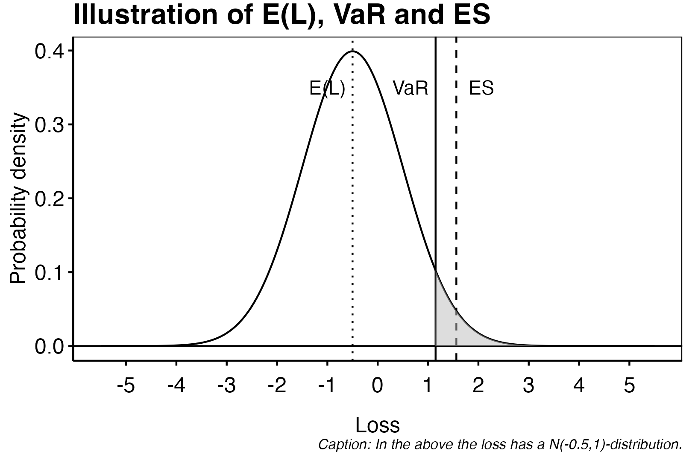

```{r,echo=FALSE}
rm(list = ls())
library(knitr)
if (knitr::is_latex_output()) {
  knitr::opts_chunk$set(
    fig.show = 'hide',
    results = 'hide',
    echo = FALSE,
    warning=FALSE,
    message = FALSE
  )
} else {
  knitr::opts_chunk$set(
    warning=FALSE,
    message = FALSE
  )
}
library(ggplot2)
library(dplyr)
theme_custom <- function() {
  
  theme_minimal() %+replace%
    
    theme(
      
      panel.grid.major = element_blank(),
      panel.grid.minor = element_blank(),
      panel.border = element_rect(colour = "black", fill=NA),
      axis.ticks = element_line(),
      #axis.line.x = element_line(color = "#C5C5C5"),
      axis.line = element_line(color = "black"),
      #axis.ticks = element_blank(),
      legend.position = "bottom",
      legend.title = element_blank(),
      #plot.background = element_rect(fill='transparent', color=NA),
      
      plot.title = element_text(             #title
                   #family = font,            #set font family
                   size = 16,                #set font size
                   face = 'bold',            #bold typeface
                   hjust = 0,                #left align
                   vjust = 2,
                   color = "black"),               #raise slightly
      
      plot.subtitle = element_text(          #subtitle
                   #family = font,            #font family
                   size = 12,
                   color = "black"),               #font size
      
      plot.caption = element_text(           #caption
                   #family = font,            #font family
                    face = "italic",
                   size = 8,                 #font size
                   hjust = 1,
                   color = "black"),               #right align
      
      axis.title = element_text(             #axis titles
                   #family = font,            #font family
                   size = 12,
                   color = "black"),               #font size
      
      axis.text = element_text(              #axis text
                   #family = font,            #axis famuly
                   size = 12,
                   color = "black"),                #font size
      
      axis.text.x = element_text(            #margin for axis text
                    margin=margin(5, b = 10))
      
    )
}
```

# Quantative Risk Management

Below is given the abbreviations used when referencing to books:

  - **McNeil**: *Quantitative Risk Management* by McNeil (2015).\cite{mcneil2015}

## The Loss Variable

We describe the financial risk with random variables defined on a filtered probability space $\left(\Omega,\mathcal{F},P,\left\{\mathcal{F}_t\right\}_{t\in \mathbb{R}_+}\right)$. We assume that *the value process* $V_t$, denoting the market value of the portfolio at time $t$, is adapted to the filtration i.e. may be determined at time $t$ or from information available at time $t$. We will be considering discrete time jumps of size $\Delta t$ for simplicity and assume that

  * the portfolio remains fixed over the time horizon $[t,t+\Delta t)$,
  * there are no income or payments made during the time period.

This means in particular that the value

$$
\Delta V_{t+\Delta t}=V_{t+\Delta t}-V_t,
$$

only depends on the valuation of the components in the portfolio. We will henceforth be using the notation $t$ and $t+1$ and so forth denoting the intervals $[t+n\Delta t,t+(n+1)\Delta t)$ i.e. $t$ may be any time and the integer representing how many time jumps of size $\Delta t$ has been made since $t$.

Under the assumptions above it is reasonable to assume that $V_t$ is Markovian in the sense that there exist $d\ge 1$ random sources $\mathbf{Z}_t=(Z_{t,1},...,Z_{t,d})^\top$ such that

$$
V_t=f(t,\mathbf{Z}_t)\tag{2.2}
$$

for some measurable function $f : \mathbb{R}_+\times \mathbb{R}^d\to\mathbb{R}$. We will call $\mathbf{Z}_t$ the *risk factors* associated with the portfolio. The could be for instance the stockprice of a stock held in the portfolio. We may now define the *loss variable* as $L_{t+1}:=-(V_{t+1}-V_t)$ and *risk-factor changes* as $\mathbf{X}_{t+1}:=\mathbf{Z}_{t+1}-\mathbf{Z}_t$ and see that

$$
L_{t+1}=-\left(f(t+1,\mathbf{Z}_t+\mathbf{X}_{t+1})-f(t,\mathbf{Z}_t)\right),\tag{2.3}
$$

if one assume differentiability of $f$ we may approximate $L_{t+1}$ as

$$
L_{t+1}^\Delta:=-\left(\frac{\partial f}{\partial t}(t,\mathbf{Z}_t)+\sum_{i=1}^d \frac{\partial f}{\partial z_i}(t,\mathbf{Z}_t)\mathbf{X}_{t+1,i}\right).\tag{2.4}
$$

This is obviously a nice linear but the approximation error may be large if $\Delta t$ is large. We are interested in the the distribution of $L_{t+1}$ such that we may determine sufficiently capital holding in realtion to the risk associated with the assets and liabilities held on the firm's balance sheet.

### Risk measures

In the general sense, a *risk measure* is simply a measurable function $\rho : \mathbb{L} \to\mathbb{R}$ taking a loss variable $L\in \mathbb{L}$ as input and associating a number $\rho(L)$ as output. In this setting we let $\mathbb{L}$ be the set of all real-valued random variables. We may interpret this as the riskyness of the portfolio with associated loss variable $L$. That is say we have two loss variable from the value processes $V$ and $V'$ i.e. $L$ and $L'$ we say that $V$ is riskier than $V'$ if and only if $\rho(L)\ge \rho(L')$.

We may now consider the fundamental definition of a coherent risk measures as in [*Coherent Measures of Risk*](https://www.researchgate.net/publication/227614132_Coherent_Measures_of_Risk) by Artzner, Delbean, Eber and Heath (1999), by first stating the definition of a risk measure.

<blockquote class = "def">

**Definition.** **(Risk Measure)** _Let $\mathbb{L}$ be the set of all real valued random variable i.e._

$$
\mathbb{L}=\left\{X\ \vert \ X : (\Omega,P,\mathcal{F})\to (\mathbb{R},\mathbb{B})\right\}
$$

_Any mapping $\rho : \mathbb{L} \to\mathbb{R}$ is called a measure of risk._

</blockquote>

We now want some properties to be satisfied by the mapping $\rho$ such that it is a sensable measure of risk. To this we define four axioms as.

<blockquote class = "def">

**Definition.** **(Coherent Risk Measure)** _Let $\rho$ be a measure of risk. We say that $\rho$ is a coherent risk measure if and only if $\rho$ satisfies the axioms below._

  1. **Translation invariance:** _Let $\alpha\in\mathbb{R}$ and $r$ be a predictable process we have $\rho(X+\alpha\cdot r)=\rho(X)+\alpha$._
  2. **Subadditivity:** _Let $X_1,X_2\in\mathbb{L}$, then $\rho(X_1+X_2)\le \rho(X_1)+\rho(X_2)$._
  3. **Positive homogeneity:** _Let $c>0$, then $\rho(cX)=c\rho(X)$._
  4. **Monotonicity:** _Let $X,Y\in\mathbb{L}$ such that $X\le Y$ $P$-a.s., then $\rho(X)\le \rho(Y)$._

</blockquote>

*Remark:* We see that axiom (1) gives the equation $\rho(X+\rho(X)\cdot r)=0$ i.e. we may hedge the risk by holding $\rho(X)$ in a asset with rate of return $r$. The axiom (2) ensures that we take into account the correlation of multiple assets i.e. we will in general not experience the maximal loss of two sources at the same time (although this is possible). If $X_1$ and $X_2$ satisfies $\text{Corr}(X_1,X_2)=1$ then $\rho(X_1+X_2)= \rho(X_1)+\rho(X_2)$.

There exist alot of different tangible measures of risk, some being coherent others non-coherent. The most well studied include Value at Risk VaR and Expected Shortfall ES. These two measures are in the realm of the loss distribution approach, however before studying these we introduce a few other worthy mentions: Factor sensitivity measures and scenario based risk measures:

**Factor sensitivity measures** are measures on the form $\rho=g(\nabla L)$ where $g$ is some $d$-dimensional measurable function. In this $\nabla L$ is the gradient i.e.

$$
\nabla L=\nabla \Big(f(t,\mathbf{Z}_t)-f(t+1,\mathbf{Z}_{t+1})\Big)=\left(\frac{\partial L}{\partial z_1},...,\frac{\partial L}{\partial z_d}\right).
$$

**Scenario based risk measures** are measures where one assume that a collection $\mathbf{x}=(x_1,...,x_N)$ of events $x_i\in \Omega$ such that $\sum_{i=1}^N P(x_i)=1-\varepsilon$ for some small $\varepsilon>0$. We may then associate the measures $\psi$ as

$$
\psi(L)=\max\left\{w_1L(x_1),...,w_NL(x_N)\right\},
$$

with $\mathbf{w}\ge 0$ and $\sum_{i=1}^Nw_i=1$ being weights. That is $\psi$ gives the largest weighted loss. A natural way of choosing $w_i$ is such that $w_i\approx P(x_i)$, but one may also weight certain events with a larger weight for a more prudent measure. Notice also that the criteria $\sum_{i=1}^N P(x_i)=1-\varepsilon$ does not necessarily have to be satisfied when considering the worst possible outcomes.

#### Value at Risk

The Value at Risk, henceforth VaR, is a quantile measure of the loss distribution $F_L$ associated with $L$. We define VaR as such:

<blockquote class = "def">

**Definition 2.8. (McNeil)** **(Value-at-Risk)** _Let $\alpha\in (0,1)$ ($\alpha$ being large) we define the VaR of a portfolio with loss variable $L$ at the confidence level $\alpha$ is a given by_
\begin{align*}
\text{VaR}_\alpha(L)&=\inf\left\{ l\in\mathbb{R}\ :\ P(L>l)\le 1-\alpha \right\}\\
&=\inf\left\{ l\in\mathbb{R}\ :\ F_L(l)\ge \alpha \right\}\\
&=F^{\leftarrow}_L(\alpha),
\end{align*}
_where $F^{\leftarrow}_L$ is the generalized inverse of $F_L$._

</blockquote>

```{r, echo = FALSE}
L <- seq(-10,10,by = 0.01)
F_L <- pnorm(L,mean =-0.5,sd=1,lower.tail = TRUE)
f_L <- dnorm(L,mean =-0.5,sd=1)
plotdf <- data.frame(L = L,
                     F_L = F_L,
                     f_L = f_L)
alpha <- 0.95
EL <- sum(plotdf$L*plotdf$f_L*0.01)
VaR <- min(plotdf$L[plotdf$F_L >= alpha])
ES <- sum(plotdf$L[plotdf$L >= VaR]*plotdf$f_L[plotdf$L >= VaR]*0.01)/(1-alpha)
```
```{r,echo = FALSE, out.width="75%",fig.align='center'}
p <- plotdf %>%
  ggplot(.) +
  geom_line(aes(x=L,y=f_L)) +
  geom_vline(xintercept = EL,linetype = "dotted")+
  geom_vline(xintercept = VaR,linetype = "solid") +
  geom_vline(xintercept = ES,linetype = "dashed") +
  geom_hline(yintercept=0,color = "black") +
  annotate(geom = "text",x=VaR-0.5,y=0.35, label = "VaR") +
  annotate(geom = "text",x=EL-0.5,y=0.35, label = "E(L)") +
  annotate(geom = "text",x=ES+0.5,y=0.35, label = "ES") +
  geom_area(data= (plotdf %>% filter(L>= VaR)), aes(x=L,y=f_L), fill = "gray", alpha = 0.5)+
  scale_x_continuous(breaks = -5:5,limits = c(-5.5,5.5)) +
  labs(title = "Illustration of E(L), VaR and ES",
       x = "Loss", y = "Probability density",
       caption = "Caption: In the above the loss has a N(-0.5,1)-distribution.") +
  theme_custom()
ggsave("figures/VaR_ES.png",bg='transparent',plot = p, height = 1080,width = 1620, units="px")

```

\begin{wrapfigure}{r}{0.5\textwidth}
  \begin{center}
    \includegraphics[width=0.48\textwidth]{figures/VaR_ES.png}
  \end{center}
\end{wrapfigure}

There exist alot of different tangible measures of risk, some being coherent others non-coherent. The most well studied include Value at Risk VaR and Expected Shortfall ES. These two measures are in the realm of the loss distribution approach, however before studying these we introduce a few other worthy mentions: Factor sensitivity measures and scenario based risk measures.

Returning to the notion of a coherent risk measure we show the lemma, that VaR is not a coherent risk measure.

<blockquote class = "lem">

**Lemma.** Consider the risk measure VaR (Value-at-Risk) given as above. The VaR is not a coherent risk measure.

</blockquote>
<details>
<summary>**Proof.**</summary>

*Translation invariance:* Consider that for all $a\in\mathbb R$ we have

$$
F_{L+ar}(\ell)=\mathbb P(L+a\le \ell)=\mathbb P(L\le\ell - a)=F_L(\ell-a).
$$

Hence we have
\begin{align*}
\text{VaR}_\alpha(L+a)&=\inf\left\{ \ell\in\mathbb{R}\ :\ F_{L+\alpha}(\ell)\ge \alpha \right\}\\
&=\inf\left\{ \ell\in\mathbb{R}\ :\ F_{L}(\ell-a)\ge \alpha \right\}\\
&=\inf\left\{ m\in\mathbb{R}\ :\ F_{L}(m)\ge \alpha \right\}+a\\
&=\text{VaR}_\alpha(L)+a,
\end{align*}
So VaR adhere to translation.

*Subadditivity:*

*Positive homogeneity:*

*Monotonicity:*

</details>

## Extreme value theory

## Elliptical distributions and copulas

## Credit risk modelling

## Models for operational risk
