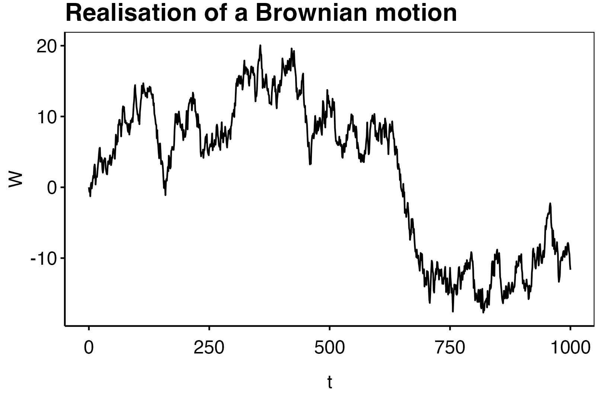

# Continuous Time Stochastic Processes

Below is given the abbreviations used when referencing to books:

  - **Bjork**: *Arbitrage Theory in Continuous Time (Fourth edition)* by Thomas Bjork, Oxford University Press (2019).\cite{bjork2009}

<blockquote class = "def">

**Definition 1.1. (Schmidli) (Stochastic process)** _A **stochastic process**\index{stochastic process} is a family of random variables $X_t : (\Omega,\mathbb F,\mathbb P) \to (E,\mathbb E,\mu)$ indexed by $t\in \mathcal I$, where $\mathcal I\subseteq \mathbb N$ or $\mathcal I\subseteq \mathbb R$, denoted by $\mathbf X=\{X_t\}_{t\in \mathcal I}$. In the case that $\mathcal I=\mathbb R$, we say that $\mathbf X$ is **CADLAG**\index{CADLAG stochastic process} if_

$$
X(t)=\lim_{h\to 0}X(t+h)
$$

_and $\lim_{h\to 0}X(t-h)$ exist almost surely. Furthermore, if $X(t)$ is continuous almost surely we say that $\mathbf X$ is **continuous**\index{continuous stochastic process}._

</blockquote>

## Point processes

<blockquote class = "def">

**Definition 1.2. (Schmidli) (Point process)** _A CADLAG stochastic process $\{N_t\}$ is called a **point process**\index{point process} if i) $N_0=0$, ii) $N_t\ge N_s$ for all $t\ge s$ (increasing) and iii) $N_t\in \mathbb N$ for all $t$. Furthermore, if for the mapping $T_k : k\mapsto\inf\{t\ge 0 : N_t\ge k\}$ (jumping times) $T_k\ne T_j$ for all $k\ne j$, then $\mathbf N$ is said to be a **simple point process**.\index{simple point process}_

</blockquote>

<blockquote class = "def">

**Definition 1.3. (Schmidli)** _Let $\{X_t\}$ be a stochastic process. If for all partitions $0=t_0<t_1<\cdots<t_n$ the random variables $X_{t_i}-X_{t_{i-1}}$ for $i=1,...,n$ are jointly independent, then $\{X_t\}$ has **independent increments**\index{independent increments}. If furthermore for all $h>0$ it holds that_ 

$$
\{X_{t_i}-X_{t_{i-1}}\}_{i=1,...n}\stackrel{d}{=}\{X_{t_i+h}-X_{t_{i-1}+h}\}_{i=1,...n}
$$

_then $\{X_t\}$ hast **stationary increments**\index{stationary increments}._

</blockquote>

<blockquote class = "def">

**Definition 1.9. (Schmidli) (Poisson process)** _A point process $\{N_t\}$ is called a (homogeneous) **Poisson process**\index{poisson process} with rate $\lambda >0$ if i) $\{N_t\}$ has stationary and independent increments and ii) $\mathbb P[N_j=0]=1-\lambda h+o(h)$ as $h\to 0$._

</blockquote>

<blockquote class = "prop">

**Proposition 1.10. (Schmidli) (Poisson process, alternative version)** _A point process $\{N_t\}$ is a (homogeneous) **Poisson process**\index{poisson process} with rate $\lambda >0$ if one of the following statements is true:_

  i) _$\{N_t\}$ has independent increments and $N_t\sim \text{Pois}(\lambda t)$,_
  ii) _the interarrival times $T_k-T_{k-1}$ are independent and $\text{Exp}(\lambda)$ distributed,_
  iii) _For each $t$ $N_t\sim \text{Pois}(\lambda t)$ and on the event $\{N_t=n\}$ the ordered samples $T_0,T_1,...,T_n$ are uniformly distributed on $[0,t]$ and independent,_
  iv) _$\{N_t\}$ has independent increments and $\mathbb E[N_1]=\lambda$ and on the event $\{N_t=n\}$ the ordered samples $T_0,T_1,...,T_n$ are uniformly distributed on $[0,t]$ and independent and_
  v) _$\{N_t\}$ has independent and stationary increments such that $\mathbb P[N_h\ge 2]=o(h)$ as $h\to 0$ and $\mathbb E[N_1]=\lambda$._

</blockquote>

The Poisson process has the following properties.

<blockquote class = "prop">

**Proposition 1.11. (Schmidli)** _Let $\{N_t\}$ and $\{\tilde N_t\}$ be two independent Poisson processes with rates $\lambda$ and $\tilde\lambda$ respectively. Let $\{I_i : i \in \mathbb N\}$ be an iid sequence of random variables independent of $\{N_t\}$ with $\mathbb P[I_i = 1] = 1−\mathbb P[I_i = 0] = q$ for some $q \in (0,1)$. Furthermore let $a > 0$ be a real number. Then_

  i) _$\{N_t+\tilde N_t\}$ is a Poisson process with rate $\lambda +\tilde \lambda$._
  ii) _$\sum_{i=1}^{N_t}I_i$ is a Poisson process with rate $\lambda q$._

</blockquote>

<blockquote class = "def">

**Definition 1.12. (Schmidli) (inhomogeneous Poisson process)**\index{inhomogeneous Poisson process} _Let $\Lambda(t)$ be an increasing right continuous function on $[0,\infty)$ with $\Lambda(0) = 0$. A point process $\{N_t\}$ on $[0, \infty)$ is called **inhomogeneous Poisson process** with intensity measure $\Lambda(t)$ if_

  i) $\{N_t\}$ _has independent increments,_
  ii) $N_t-N_s\sim\text{Pois}(\Lambda (s)-\Lambda(s))$.

</blockquote>

If there exists a function $\lambda(t)$ such that $\Lambda(t) = \int_0^t \lambda(s)\ ds$ then $\lambda(t)$is called **intensity** or **rate** of the inhomogeneous Poisson process. Note that a homogeneous Poisson process is a special case with $\Lambda(t) = \lambda t$. Define $\Lambda^{−1}(x) = \sup\{t \ge 0 : \Lambda(t) \le x\}$ the inverse function of $\Lambda(t)$.

<blockquote class = "prop">

**Proposition 1.13. (Schmidli)** _Let $\tilde N_t$ be a homogeneous Poisson process with rate 1. Define $N_t=\tilde N_{\Lambda (t)}$. Then $N_t$ is an inhomogeneous Poisson process with intensity measure $\Lambda(t)$. Conversely, let $N_t$ is an inhomogeneous Poisson process with intensity measure $\Lambda(t)$. Define $\tilde N_t=N_{\Lambda^{-1}(t)}$. Then $\tilde N_t$ is a homogeneous Poisson process with rate 1._

</blockquote>

For an inhomogeneous Poisson process we can construct the following martingales.

<blockquote class = "prop">

**Lemma 1.14. (Schmidli)** _Let $r\in \mathbb R$. The following processes are martingales._

  i) $\{N_t-\Lambda(t)\}$,
  ii) $\{(N_t-\Lambda(t))^2-\Lambda(t)\}$,
  iii) $\{\exp[rN_t-\Lambda(t)(e^r-1)]\}$.

</blockquote>

## Filtration

Filtrations\index{Filtration} is widely used in stochastic processes, as they allow for the concept of knowledge/information. This is useful when considering mean-values of future states but in an increasing information setting. For this we introduce the term adapted processes.

<blockquote class = "def">

**Definition B.17. (Bjork)** **(Adapted process)**\index{Adapted process} _Let $(\mathcal{F}_t)_{t\ge 0}$ be a filtration on the probability space $(\mathcal{F}_t)_{t\ge 0}$. Furthermore, let $(X_t)_{t\ge 0}$ be a stochastic process on the same space. We say that $X_t$ is adapted to the filtration $\mathbf{F}$ if_

$$
X_t\ \text{ is }\ \mathcal{F}_t-\text{measurable},\hspace{20pt}\forall t\ge 0.
$$

</blockquote>

Obviously, we may introduce the **natural filtration**\index{natural filtration} $\mathcal{F}^X_t$ given by the trajectory of the process $X_t$:

$$
\mathcal{F}^X_t=\sigma(\{X_s,\ s\le t\}).
$$

Indeed, $X_t$ is adapted to this filtration.

## Martingale

<blockquote class = "def">

**Definition.** _Let $M_t$ be a stochastic process defined on a background space $(\Omega,\mathcal{F},P)$. Let $(\mathcal{F}_t)_{t\ge 0}$ be a filtration. If $M_t$ is adapted to the filtration $\mathcal{F}_t$, $E\vert M_t\vert <\infty$ and_

$$
E[M_t\vert \mathcal{F}_s]=M_s,\hspace{20pt}P-\text{a.s.}
$$

_holds for any $t>s$ we say that $M_t$ is a martingale\index{martingale} ($\mathbf{F}$-martingale). If the above has $\le$ or $\ge$ we say that $M_t$ is either a **submartingale**\index{submartingale} or **supermartingale**\index{supermartingale} respectively._

</blockquote>

Naturally, this defintions may easily be extended to discrete models and we have the trivial equality:

$$
E[M_t-M_s\ \vert\ \mathcal{F}_s]=0.
$$

Martingales is useful, when proofing probalistic statements as the posses tractable properties. A useful technique often include the construction of the martingale

$$
M_t=E[X\ \vert\ \mathcal{F}_t].
$$

<blockquote class = "prop">

**Proposition 4.8. (Bjork)** _For any process $X_t\in\mathcal{L}^2[s,t]$ the following hold:_

$$
E\left[\left.\int_s^t X_s\ dW_s\right\vert\mathcal{F}_s^W\right]=0
$$

</blockquote>

<blockquote class = "prop">

**Corollary 4.9. (Bjork)** _For any process $X_t\in\mathcal{L}^2$ the process_

$$
M_t=\int_s^t X_s\ dW_s,
$$

_is an $(\mathcal{F}_t^W)$-martingale. In other words, modulo an integrability condition, **every stochastic integral is a martingale**._

</blockquote>

<blockquote class = "lem">

**Lemma 4.10. (Bjork)** _Let $M_t$ be a stochastic process with stochastic differential, then $M_t$ is a martingale if and only if the stochastic differential has the form $dM_t=X_t\ dW_t$ i.e. $M_t$ as no $dt$-term._

</blockquote>

<blockquote class = "prop">

**Proposition 1.7. (Schmidli) (Martingale stopping theorem)**\index{Martingale stopping theorem} _Let $M_t$ be an martingale wrt. a filtration $\mathcal F_t$. Assume that $T$ is a $\mathcal F_t$ stopping time. If $\mathcal F_t$ is continuous, then $M_{\min\{T,t\}}$ is also a $\mathcal F_t$ martingale. Furthermore, $\mathbb E[M_t\ \vert\ \mathcal F_T]=M_{\min\{T,t\}}$_

</blockquote>

<blockquote class = "prop">

**Proposition 1.8. (Schmidli) (Martingale convergence theorem)**\index{Martingale convergence theorem} _Let $M_t$ be an martingale wrt. a filtration $\mathcal F_t$. If $\sup\mathbb E\vert M_t\vert <\infty$, then $M_\infty:=\lim_{t\to\infty} M_t$ exists and $\mathbb E\vert M_t\vert<\infty$._

</blockquote>

## Brownian Motion

<blockquote class = "def">

**Definition 4.1. (Bjork)** _A stochastic process $W$ is called a **Brownian motion**\index{Brownian motion} or **Wiener process**\index{Wiener process} if the following conditions hold_

 1. $W_0=0$.
 2. _The process $W$ has independent increments, i.e. if $r<s\le t< u$ then $W_u-W_t$ and $W_s-W_r$ are independent random variables._
 3. _For $s<t$ the random variable $W_t-W_s$ has the Gaussian distribution $\mathcal{N}(0,t-s)$._
 4. _$W$ has continuous trajectories i.e. $s\mapsto W(s;\omega)$ i continuous for all $\omega \in\Omega$._

</blockquote>

```{r}
#Example of trajectory for BM
set.seed(1)
t <- 0:1000
N <- rnorm(
  n = length(t)-1, #initial value = 0
  mean = 0, #incements mean = 0
  sd = sqrt(t[2:length(t)] - t[1:(length(t)-1)]) #increment sd = sqrt(t-s)
)
W <- c(0,cumsum(N))
```
```{r,echo=FALSE,include=TRUE,out.width="75%",fig.align='center'}
p <- data.frame(t = t, W = W) %>%
  ggplot() +
  geom_line(aes(x=t,y=W)) +
  labs(title = "Realisation of a Brownian motion") +
  theme_bw() +
  theme(axis.text = element_text(size = 15),
        title = element_text(size = 18)) +
  theme_custom()
ggsave("figures/BM_sim.png",bg='transparent',plot = p, height = 1080,width = 1620, units="px")

```

\begin{figure}[H]
  \begin{center}
    \includegraphics[width=0.75\textwidth]{figures/BM_sim.png}
  \end{center}
\end{figure}

As one can see from the simulated sample path on the right, the Brownian motion is rather irratic. In fact, the process varies infinitely on any interval with length greater than 0. This gives some of the characteristics of the process including that: $W$ is continuous and $W$ is non-differential everywhere. This irratic behaviour is summed up in the theorem.


<blockquote class = "thm">

**Theorem 4.2. (Bjork)** _A Brownian motions trajectory $t\mapsto W_t$ is with probability one nowhere differential, and it has locally infinite total variation._

</blockquote>