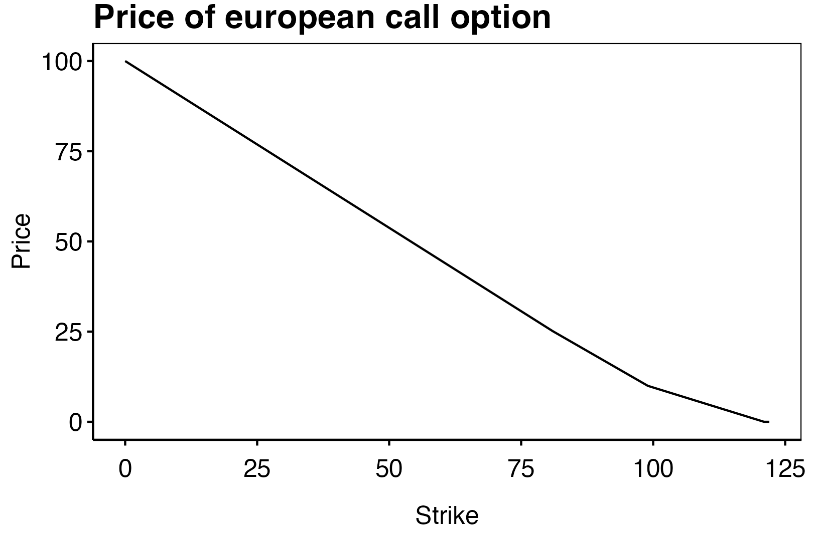
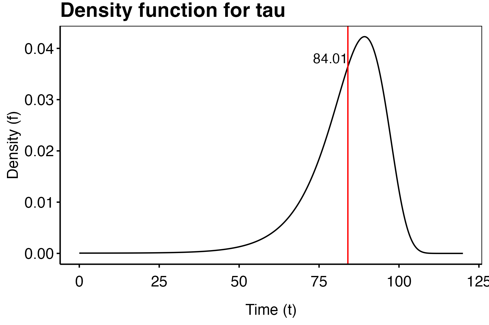
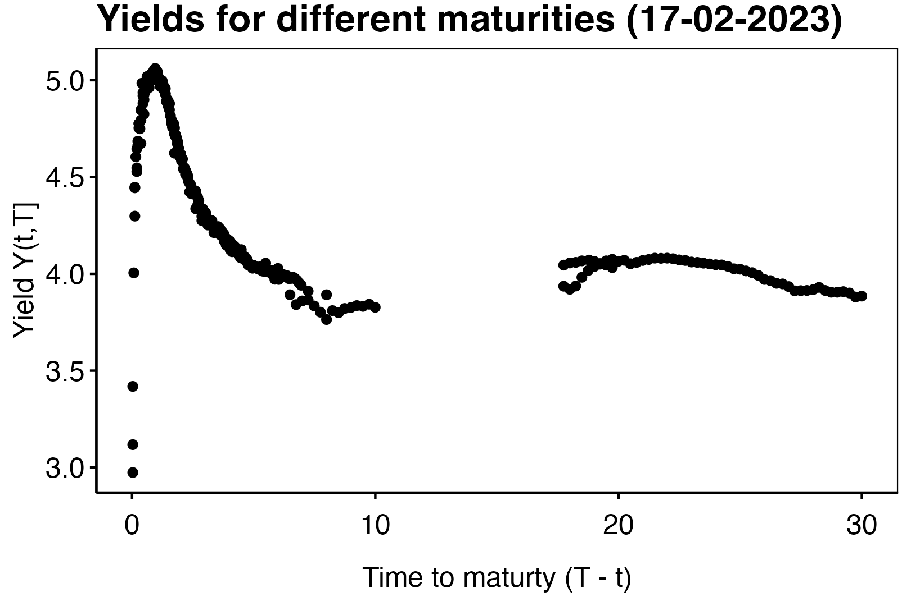

--- 
document-type: "Lecture Notes"
font-size: 10
title: "Mathematics of the Actuarial Sciences"
subtitle: "A comprehensive outline of actuarial maths"
author: "Joakim Bilyk"
date: '`r stringr::str_to_sentence(format(Sys.time(), "%B %d, %Y"))`'
site: bookdown::bookdown_site
documentclass: book
bibliography: book.bib
url: "joakim-bilyk.github.io/books/theory"
preface: |
  This book contains a comprehensive outline of theory on probability theory and mathematical statistics applied in finance, life insurance and non-life insurance. The notes outlines the contents of the major courses regarding the mathematics behind the markov models in life insurance including valuation of financial contracts under the market measure $\mathbb Q$ and the statistical methods used in non-life insurance when estimating the equivalence premium that is the expected expenses of the insurance contract.
  
  The notes are structured as follows: The notes are divided into three parts. The first part is called *The Mathematics of Life Insurance and Financial Contracts* and revolves around payment streams and a market consistent valuation of these. This is indeed the main topics of life insurance and mostly all efforts in this field work towards more robust and/or consistent valuation methods. The second part is called *The Mathematics and Methods of Non-Life Insurance*. In this part we outline the stochastic models behind claim arrivals in homogeneous portfolios and estimation of the premium. We also partly focus on risk management as methods in this field relate somewhat to the non-life field. The third part of the notes outlines some of the mathematics behind the mathematical fundamental taken *as given* in the first two parts. This include the fundamental theory of random variables, measure theory, markov chains and stochastic processes including stochastic calculus.
  
  **The Mathematics of Life Insurance and Financial Contracts**
  
  Life insurance contracts are stochastic payments between two parties agreed upon in advance. These differ from financial contracts in the sense that the issuer of the contract i.e. the insurance company takes on the risk associated with the buyer of the contracts life events and in financial contracts the issuer typically a bank or financial institution takes on some risk associated with a price fluctuation. In recent years, the *unit-link contract* has become the norm in the pension field and so life insurance today have some overlap with banking sector. The valuation of the payments in the life contract is evaluated under the market measure and priced such that there is no arbitrage in the market extended with the life insurance contract. Therefore, the study of market valuation from financial mathematics plays an integral role in the actuarial endeavors.
  
  This first part of the book, starts out with an introduction to the ideas around payment streams, interest, mortality, markov chains and reserves. This is done in the chapter *Basic Life Insurance Mathematics*. Afterwards, in the chapter *Stochastic Processes in Life Insurance Mathematics* we formalize the stochastic processes behind the payment process by considering CADLAG processes that is of finite variations (FV-functions). This will lead us to an extended version of the integral where we allow to integrate with respect to payment streams and other FV-functions. It turns out that the maths around the expected value of such integrals is a bit more complicated than one would let on.
  
  The following two chapters start with an introduction into the mathematics of continuous finance and the theory of arbitrage free valuation of derivatives. This is used afterwards used in the chapter *Topics in Life Insurance*, where Black Scholes types of PDEs are constructed that describe the statewise reserves. However before this we introduce a matrix approach to life insurance and some interest theory. For the definition of the product integral see the appendix.
  
  **The Mathematics and Methods of Non-Life Insurance**
  
  Non-life mathematics revolves around policies where the insurance company takes upon themselves the economic risk arising from events that insured may encounter. The essential here is that these risk cannot be any that offers risk taking of life based risks for instance pensions or sickness and death. As such non-life insurance is insurance of assets or stochastic expenses (for instance court expenses or compensations to third person). Non-life insurance differs significantly from life insurance since the nature of the insurance events is assumed to arrive iid between a homogeneous portfolio of contracts and is often modelled through renewal processes such as the Cramer-Lundberg model. It is the job of the actuarial to determine the theoretical premium of a contract with a certain time exposure (usually one yer), reserve money for claims that are under processing, that may occur in the future or the may already have occurred but not yet reported. To this end the actuarial may deployed a wide range of tools such as generalized linear model or machine learning algorithms for modelling claims arrivals and reserving and estimating probability bounds for the probability of ruin from claims or investments. In this part we also include a chapter on quantitative risk management.
  
  The first chapter, called *Basic Non-Life Insurance Mathematics*, introduces the Poisson process and defines the classical Cramer-Lundberg model. In this chapter we also give some introductory considerations on the ruin probability and estimation methods. The following chapter *Stochastic Processes in Non-Life Insurance Mathematics* gives a deep-dive into the processes behind the claim arrivals in the Cramer-lundberg model, and later the renewal risk model. We finish the chapter by relating the classical renewal risk model to more modern approach including the case with stochastic investment. Lastly, we lay the foundation of claim reserving.
  
  The chapter *Probabilistic Machine Learning* is a introductory chapter on how one may apply machine learning algorithms to tabular data, that is a spreadsheet with $p$ covariates and one response. In this chapter we consider linear models with and without penalties, decision trees including bagging and random forests and neural networks. Lastly, we give some considerations on how one may interpret the results from the ML models discussed earlier. It is common knowledge that ML models are well suited for a wide variety of scenarios but due to their structure we loose alot of interpretability for the linear models (and generalized additive and linear models). Because of this one has to somehow figure out what the model does and how it treats say gender. This is also something we dig into, as we want to debias a potential biassed model (bias may arise from the data itself).
  
  The final chapter on risk management is an introduction to risk measures such as Value-At-Risk and expected shortfall and elliptical and heavy-tailed distributions. In investments we often see a concentration of returns around the mean and then a heavy tail of losses and or gains. This is important when one calculates the capital needed in order to sustain large losses that may arise during a crisis. It is furthermore, an accepted truth that investment are correlated in the sense that they tend to get large together. This is why elliptical distributions are studied. The final sections of this chapter is on credit risk and operational risks.
  
  In the chapter *Projects in the Mathematics of Life Insurance*, we study various popular topics in the academic field of life insurance mathematics. This include a inclusive framework for defining a wide range of life insurance models including the classical smooth markov model. In this first section, we also study models that include policy behavior and how one may accommodate this in a consistent payment stream.
  
  **Mathematical Prerequisites**
  
  This part of the notes are a rough collection of important results from measure theory and theory on stochastic variables.
keywords: |
  probability theory, insurance mathematics, life insurance, non-life insurance, stochastic differential equations.
description: |
  This document contains lecture notes from the courses i attended during my education. The notes mostly contains results from the master courses but there are also included some results from the bachelor as these lay out some of the fundamentals of the mathematics used during the master courses. I want to stress that this is a work in progress and as such is subject to some small and some severy errors. The contents of these notes have not been supervised by anyone other than myself and so, although i an confident in most of the content, i would not take any of the below as clear facts. Always due your own research and derivations to confirm the results.
---

```{r, setup,include=FALSE}
library(knitr)
if (knitr::is_latex_output()) {
  knitr::opts_chunk$set(
    fig.show = 'hide',
    results = 'hide',
    echo = FALSE,
    warning=FALSE,
    message = FALSE
  )
} else {
  knitr::opts_chunk$set(
    warning=FALSE,
    message = FALSE
  )
}
library(ggplot2)
library(dplyr)
theme_custom <- function() {
  
  theme_minimal() %+replace%
    
    theme(
      
      panel.grid.major = element_blank(),
      panel.grid.minor = element_blank(),
      panel.border = element_rect(colour = "black", fill=NA),
      axis.ticks = element_line(),
      #axis.line.x = element_line(color = "#C5C5C5"),
      axis.line = element_line(color = "black"),
      #axis.ticks = element_blank(),
      legend.position = "bottom",
      legend.title = element_blank(),
      #plot.background = element_rect(fill='transparent', color=NA),
      
      plot.title = element_text(             #title
                   #family = font,            #set font family
                   size = 16,                #set font size
                   face = 'bold',            #bold typeface
                   hjust = 0,                #left align
                   vjust = 2,
                   color = "black"),               #raise slightly
      
      plot.subtitle = element_text(          #subtitle
                   #family = font,            #font family
                   size = 12,
                   color = "black"),               #font size
      
      plot.caption = element_text(           #caption
                   #family = font,            #font family
                    face = "italic",
                   size = 8,                 #font size
                   hjust = 1,
                   color = "black"),               #right align
      
      axis.title = element_text(             #axis titles
                   #family = font,            #font family
                   size = 12,
                   color = "black"),               #font size
      
      axis.text = element_text(              #axis text
                   #family = font,            #axis famuly
                   size = 12,
                   color = "black"),                #font size
      
      axis.text.x = element_text(            #margin for axis text
                    margin=margin(5, b = 10))
      
    )
}
```

`r if (knitr::is_html_output()) '
# Preface {-}

This book contains a comprehensive outline of theory on probability theory and mathematical statistics applied in finance, life insurance and non-life insurance. The notes outlines the contents of the major courses regarding the mathematics behind the markov models in life insurance including valuation of financial contracts under the market measure $\\mathbb Q$ and the statistical methods used in non-life insurance when estimating the equivalence premium that is the expected expenses of the insurance contract.

The notes are structured as follows: The notes are divided into three parts. The first part is called *The Mathematics of Life Insurance and Financial Contracts* and revolves around payment streams and a market consistent valuation of these. This is indeed the main topics of life insurance and mostly all efforts in this field work towards more robust and/or consistent valuation methods. The second part is called *The Mathematics and Methods of Non-Life Insurance*. In this part we outline the stochastic models behind claim arrivals in homogeneous portfolios and estimation of the premium. We also partly focus on risk management as methods in this field relate somewhat to the non-life field. The third part of the notes outlines some of the mathematics behind the mathematical fundamental taken *as given* in the first two parts. This include the fundamental theory of random variables, measure theory, markov chains and stochastic processes including stochastic calculus.

**The Mathematics of Life Insurance and Financial Contracts**

Life insurance contracts are stochastic payments between two parties agreed upon in advance. These differ from financial contracts in the sense that the issuer of the contract i.e. the insurance company takes on the risk associated with the buyer of the contracts life events and in financial contracts the issuer typically a bank or financial institution takes on some risk associated with a price fluctuation. In recent years, the *unit-link contract* has become the norm in the pension field and so life insurance today have some overlap with banking sector. The valuation of the payments in the life contract is evaluated under the market measure and priced such that there is no arbitrage in the market extended with the life insurance contract. Therefore, the study of market valuation from financial mathematics plays an integral role in the actuarial endeavors.

This first part of the book, starts out with an introduction to the ideas around payment streams, interest, mortality, markov chains and reserves. This is done in the chapter *Basic Life Insurance Mathematics*. Afterwards, in the chapter *Stochastic Processes in Life Insurance Mathematics* we formalize the stochastic processes behind the payment process by considering CADLAG processes that is of finite variations (FV-functions). This will lead us to an extended version of the integral where we allow to integrate with respect to payment streams and other FV-functions. It turns out that the maths around the expected value of such integrals is a bit more complicated than one would let on.

The following two chapters start with an introduction into the mathematics of continuous finance and the theory of arbitrage free valuation of derivatives. This is used afterwards used in the chapter *Topics in Life Insurance*, where Black Scholes types of PDEs are constructed that describe the statewise reserves. However before this we introduce a matrix approach to life insurance and some interest theory. For the definition of the product integral see the appendix.

In the chapter *Projects in the Mathematics of Life Insurance*, we study various popular topics in the academic field of life insurance mathematics. This include a inclusive framework for defining a wide range of life insurance models including the classical smooth markov model. In this first section, we also study models that include policy behavior and how one may accommodate this in a consistent payment stream.

**The Mathematics and Methods of Non-Life Insurance**

Non-life mathematics revolves around policies where the insurance company takes upon themselves the economic risk arising from events that insured may encounter. The essential here is that these risk cannot be any that offers risk taking of life based risks for instance pensions or sickness and death. As such non-life insurance is insurance of assets or stochastic expenses (for instance court expenses or compensations to third person). Non-life insurance differs significantly from life insurance since the nature of the insurance events is assumed to arrive iid between a homogeneous portfolio of contracts and is often modelled through renewal processes such as the Cramer-Lundberg model. It is the job of the actuarial to determine the theoretical premium of a contract with a certain time exposure (usually one yer), reserve money for claims that are under processing, that may occur in the future or the may already have occurred but not yet reported. To this end the actuarial may deployed a wide range of tools such as generalized linear model or machine learning algorithms for modelling claims arrivals and reserving and estimating probability bounds for the probability of ruin from claims or investments. In this part we also include a chapter on quantitative risk management.

The first chapter, called *Basic Non-Life Insurance Mathematics*, introduces the Poisson process and defines the classical Cramer-Lundberg model. In this chapter we also give some introductory considerations on the ruin probability and estimation methods. The following chapter *Stochastic Processes in Non-Life Insurance Mathematics* gives a deep-dive into the processes behind the claim arrivals in the Cramer-lundberg model, and later the renewal risk model. We finish the chapter by relating the classical renewal risk model to more modern approach including the case with stochastic investment. Lastly, we lay the foundation of claim reserving.

The chapter *Probabilistic Machine Learning* is a introductory chapter on how one may apply machine learning algorithms to tabular data, that is a spreadsheet with $p$ covariates and one response. In this chapter we consider linear models with and without penalties, decision trees including bagging and random forests and neural networks. Lastly, we give some considerations on how one may interpret the results from the ML models discussed earlier. It is common knowledge that ML models are well suited for a wide variety of scenarios but due to their structure we loose alot of interpretability for the linear models (and generalized additive and linear models). Because of this one has to somehow figure out what the model does and how it treats say gender. This is also something we dig into, as we want to debias a potential biassed model (bias may arise from the data itself).

The final chapter on risk management is an introduction to risk measures such as Value-At-Risk and expected shortfall and elliptical and heavy-tailed distributions. In investments we often see a concentration of returns around the mean and then a heavy tail of losses and or gains. This is important when one calculates the capital needed in order to sustain large losses that may arise during a crisis. It is furthermore, an accepted truth that investment are correlated in the sense that they tend to get large together. This is why elliptical distributions are studied. The final sections of this chapter is on credit risk and operational risks.

**Mathematical Prerequisites**

This part of the notes are a rough collection of important results from measure theory and theory on stochastic variables.

'`

# Introduction {-}

## To-do reading {-}

| Week | Course | Chapter | X |
| :- |  :---- | :-------- | :-: |
| 1 | QRM       | Finish risk measures                  |  |
|   | Liv1      | Chapter 1-3                           | X |
|   | StokLiv   | Chapter 1-4                           | X |
|   | Skade1    | Chapter 1-2.1                         | X |
|   | SkadeStok | Chapter 1-2 (Schmidli)                | X |
|   | Skade2    | Chapter 4.1-4.4 + 6 (1 + 2, 4.5-4.7)  | Mangler 1 + 2, 4.5-4.7 og 6.2 |
| 2 | QRM       | Extreme value theory with heavy tails; Hill estimator; POT method.            | |
|   | Liv1      | Chapter 4                             | X |
|   | StokLiv   | Chapter 6-11                          | (X) |
|   | Skade1    | Chapter 2.2-2.3                       | |
|   | SkadeStok | Chapter 3 (Schmidli)                  | |
|   | Skade2    | Chapter 7 + 8 (3)                     | |
| 3 | QRM       | Multivariate distributions and dependence. Elliptical distributions; copula | |
|   | Liv1      | Chapter 5-6                           | |
|   | StokLiv   | Chapter 12, 14-16                     | |
|   | Skade1    | Chapter 3.1-3.2                       | |
|   | SkadeStok | Notes on stochastic investments       | |
|   | Skade2    | Chapter 9 (5)                         | |
| 4 | QRM       | Credit risk modelling                 | |
|   | Liv1      | Chapter 7                             | |
|   | StokLiv   | Chapter 17-18                         | |
|   | Skade1    | Chapter 3.3-3.4                       | |
|   | SkadeStok | Claims reserving                      | |
|   | Skade2    | TBD                                   | |
| 5 | QRM       | Models for operational risk.          | |
|   | Liv1      | Chapter 10                            | |
|   | StokLiv   | Chapter 20-22                         | |
|   | Skade1    | Chapter 4                             | |
|   | Skade2    | TBD                                   | |
| 6 | StokLiv   | Chapter 23                            | |
|   | Skade1    | Chapter 5                             | |
|   | Skade2    | TBD                                   | |
| 7 | StokLiv   | Chapter 24                            | |
|   | Skade1    | Chapter 6                             | |
|   | Skade2    | TBD                                   | |

## Notation {-}

We use the following shorthand notation.

| Symbol | Interpretation |
| :-: | :------ |
| $f(t-)=f_{t-}$ | $\lim_{s\ \nearrow\ t}f(s)$ being the left limit of $f$ |
| $f(t+)=f_{t+}$ | $\lim_{s\ \searrow\ t}f(s)$ being the right limit of $f$ |
| $\Delta f(t)$ | $f(t)-f(t-)$ being the jump function of $f$ |
| $\int_0^t r$ | $\int_0^tr(u)\ du$. |

<!--chapter:end:index.Rmd-->

# (PART) The Mathematics of Life Insurance and Financial Contracts {-}

# Basic Life Insurance Mathematics

Below is given the abbreviations used when referencing to books:

  - **Ragnar**: *Basic Life Insurance Mathematics* by Ragnar Norberg (2002).\cite{norberg2002}

## Payments, interest and mortality

### Payments

We will give precise mathematical content to the notion of payment streams and, referring to Appendix A, we deal only with their properties as functions of time and do not venture to discuss their possible stochastic properties for the time being.

To fix ideas and terminology, consider a financial contract commencing at time 0 and terminating at a later time $n$ $(\le \infty)$, say, and denote by At the total amount paid in respect of the contract during the time interval $[0, t]$. The payment function $\{A_t\}_{t\ge 0}$ is assumed to be the difference of two non-decreasing, finite-valued functions representing incomes and outgoes, respectively, and is thus of finite variation (FV). Furthermore, the payment function is assumed to be right-continuous (RC). From a practical point of view this assumption is just a matter of convention, stating that the balance of the account changes at the time of any deposit or withdrawal. From a mathematical point of view it is convenient, since payment functions can then serve as integrators. In fact, we shall restrict attention to payment functions that are piece-wise differentiable (PD):

$$
A_t=A_0+\int_0^ta_\tau d\tau+\sum_{0\le \tau\ le}\Delta A_\tau,\tag{1}
$$

where $\Delta A_\tau=A_\tau-A_{\tau-}$. The integral adds up payments that fall due continuously, and the sum adds up lump sum payments. In differential form this
reads

$$
dA_t=a(t)\ dt+\Delta A(t).\tag{2}
$$

It seems natural to count incomes as positive and outgoes as negative. Sometimes, and in particular in the context of insurance, it is convenient to work with outgoes less incomes, and to avoid ugly minus signs we introduce $B = -A$.

### Interests

Suppose money is currently invested on (or borrowed from) an account that bears interest. This means that a unit deposited on the account at time s gives the account holder the right to cash, at any other time $t$, a certain amount $S(s,t)$, typically different from 1. The function $S$ must be strictly positive, and we shall argue that it must satisfy the functional relationship

$$
S(s, u) = S(s, t) S(t, u) ,\tag{3}
$$

implying, of course, that $S(t,t) = 1$ (put $s = t = u$ and use strict positivity): If the account holder invests 1 at time $s$, he may cash the amount on the left of (3) at time $u$. If he instead withdraws the value $S(s,t)$ at time $t$ and immediately reinvests it again, he will obtain the amount on the right of (3) at time $u$. To avoid arbitrary gains, so-called arbitrage, the two strategies must give the same result.

It is easy to verify that the function $S(s,t)$ satisfies (3) if and only if it is of the form

$$
S(s,t)=\frac{S_t}{S_s},\tag{4}
$$

for some strictly positive function $S_t$ (allowing an abuse of notation), which can be taken to satisfy

$$
S_0=1.
$$

Then $S_t$ must be the value at time $t$ of a unit deposited at time 0, and we call it the *accumulation function*\index{accumulation function}. Correspondingly, $S_t^{-1}$ is the value at time 0 of a unit withdrawn at time $t$, and we call it the *discount function*\index{discount function}.

We will henceforth assume that $S_t$ is of the form

$$
S_t=e^{\int_0^t r},\qquad S_t^{-1}=e^{-\int_0^t r},\tag{5}
$$

where we suppress the integrant i.e. $e^{\int_0^t r}=e^{\int_0^t r_u\ du}$ Here $r_t$ is some piece-wise continuous function, usually positive. Accumulation factors of this form are invariably used in basic banking operations (loans and savings) and also for bonds issued by governments and corporations.

Under the rule (5) the dynamics of accumulation and discounting are given by

$$
dS_t=r(t)S(t)\ dt.\tag{6}
$$

The relation (6) says that the interest earned in a small time interval is proportional to the length of the interval and to the current amount on deposit. The proportionality factor $r_t$ is called the *force of interest*\index{force of interest} or the *(instantaneous) interest rate*\index{instantaneous interest rate} at time $t$. In integral form (6) reads.

$$
S_t=S_0+\int_0^tr_uS_u\ du,\tag{7}
$$

We will be working with the expressions

$$
S(s,t)=e^{-\int_s^tr}\tag{8}
$$

for the *general discount factor* when $t \le s$ and

$$
S(t,u)=e^{\int_u^tr}\tag{9}
$$

for the *general accumulation factor* when $t\le u$.

### Valuation of paymentstreams

For a account bearing the instantaneous interest rate $r_t$ and payment function $A$ we accumulate the interest $e^{\int_s^t r}$ of a payment at time $s$ up untill the time $t$. That is summing over all payments on $[0,t]$ we have

$$
U_t=e^{\int_0^tr}A_0+\int_0^te^{\int_s^tr}a_s\ ds+\sum_{0\le s\le t}e^{\int_s^tr}\Delta A(s),\tag{10}
$$

being the account value at time $t\ge 0$. We can also on integral form write

$$
U_t=e^{\int_0^tr}A_0+\int_0^te^{\int_s^tr}dA(s),\tag{11}
$$

Similarly if one has promised the payments $B$ ($B=-A$) to a party in the future we have that each payment at time $s\ge t$ will be discounted with the factor $e^{-\int_t^s r}$ hence the value of the payment stream $B$ at time $t$ is

$$
V_t=\int_t^Te^{-\int_t^sr}dB(s),\tag{12}
$$

where $dB(s)=0$ for all $s>T$ i.e. $B$ terminates at time $T$. Notice we do not include a initial or terminate amount $B_T$ since this is included in the jump term in $dB$ at time $T$.

Typically, the financial contract will lay down that incomes and outgoes be equivalent in the sense that

$$
U_T =0\qquad \text{and/or}\qquad V_{0-}=0,\tag{13}
$$

that is the account is emptied at termination and we do not owe anything upon the creation of the contract.

### Mortality

Consider an aggregate of individuals, e.g. the population of a nation, the persons covered under an insurance scheme, or a certain species of animals. The individuals need not be animate beings; for instance, in engineering applications one is often interested in studying the worklife until failure of technical components or systems. Having demographic and actuarial problems in mind, we shall, however, be speaking of persons and life lengths until death.

Due to differences in inheritance and living conditions and also due to events of a more or less purely random nature, like accidents, diseases, etc., the life lengths vary among individuals. Therefore, the life length of a randomly selected new-born can suitably be represented by a non-negative random variable $T$ with a cumulative distribution function

$$
F(t)=\mathbb P[T\le t].\tag{1}
$$

In survival analysis it is convenient to work with the *survival function*\index{survival function}

$$
\overline F(t)=1 -\mathbb P[T\le t]=\mathbb P[T> t].\tag{2}
$$

We assume that $F$ is absolutely continuous and denote the density by $f$;

$$
dF(t)=f(t)\ dt=-d\overline F(t),\tag{3}
$$

for some non-negative continuous function $f$ s.t. $F(t)\to 1$ assuming $F(0)=0$.

When dealing with non-negative random variables representing life lengths, it is convenient to work with the derivative of $-\log \overline F$,

$$
\mu(t)=-\frac{d}{dt}\Big(\log \overline F(t)\Big)=-\left(-f(t)\frac{1}{\overline F(t)}\right)=\frac{f(t)}{\overline F(t)},\tag{4}
$$

which is well defined for all $t$ such that $\overline F(t) > 0$. For small, positive $dt$ we have

$$
\mu(t)\ dt=\frac{f(t)\ dt}{\overline F(t)}=\frac{\mathbb P(t< T\le t+dt)}{\mathbb P(T> t)}=\mathbb P(T\le t+dt\ \vert\ T> t).\tag{5}
$$

Thus, for a person aged $t$, the probability of dying within $dt$ years is (approximately) proportional to the length of the time interval, $dt$. The proportionality factor $\mu (t)$ depends on the attained age, and is called the *force of mortality*\index{force of mortality} at age $t$. It is also called the *mortality intensity*\index{mortality intensity} or *hazard rate*\index{hazard rate} at age $t$, the latter expression stemming from reliability theory, which is concerned with the durability of technical devices.

Integrating (4) from 0 to $t$ and using $\overline F(0) = 1$, we obtain

$$
\overline F(t)=e^{-\int_0^t\mu}\tag{6}
$$

also (4) may be written as

$$
f(t)=\overline F(t)\mu(t)=e^{-\int_0^t\mu}\mu(t).\tag{7}
$$
which says that the probability $f (t)\ dt$ of dying in the age interval $(t, t + dt)$ is the product of the probability $\overline F(t)$ of survival to $t$ and the conditional probability $\mu(t)\ dt$ of then dying before age $t + dt$.

The functions $F,\overline F, f$, and $\mu$ are equivalent representations of the mortality law; each of them corresponds one-to-one to any one of the others.

Since $\overline F(\infty) = 0$, we must have $\int_0^\infty \mu=\infty$. Thus, if there is a finite highest attainable age $\omega$ such that $\overline F(\omega) = 0$ and $\overline F(t) > 0$ for $t < \omega$, then $\int_0^t\mu\nearrow\infty$ as $t\nearrow \omega$. If moreover, $\mu$ is non-decreasing, we must also have $\lim_{t\nearrow \omega}\mu(t)=\infty$.

## Insurance of a single life

We consider a person aged $x$ at the time $t=0$ hence the person at time $t$ will have age $x+t$. We further introduce the indicator $I_t=1\{T_x>t\}$, where $T_x$ is the time of death in "$t$" time. Hence $I_t$ gives the indication that the person is still alive at time $t$. Let us valueate some standard insurance contracts for the person $(x)$.

### Some standard forms of insurance

#### Pure endowment insurance

An n-year pure (life) endowment of 1 is a unit that is paid to $(x)$ at the end of $T$ years if he is then still alive. In other words, the associated payment function is an endowment of $I_T$ at time $T$. Its present value at time 0 is

$$
PV(t)=e^{-\int_t^T r\ dv}I_T=e^{-r(T-t)}I_T.
$$

Then we can see that the expected payment of this contract discounted back to time $t$ is

$$
\mathbb E[PV(t)]=e^{-r(T-t)}\mathbb P(I_T=1)=e^{-r(T-t)}e^{-\int_t^T\mu(s)\ ds}.
$$

This simplifies to

$$
\mathbb E[PV(t)]=e^{-\int_t^Tr+\mu(s)\ ds}.
$$

#### The life assurance

A life assurance contract specifies that a certain amount, called the sum insured, is to be paid upon the death of the insured, if this happens before some future time $T$. Hence the present value is

$$
PV(t)=e^{-r(T_x-t)}(1-I_T).
$$

Since we discount 1 unit from the time of death $T_x$ back to time $t$ and only if the insured is *not* alive at time $T$. The expected value is

$$
\mathbb E[PV(t)]=\int_t^Te^{-r(s-t)}\mu(s+x)\mathbb P(I_s=1) \ ds.
$$

The expression reads: for all possible payout times $s$ in  $t$ to $T$ we discount the payment of 1 unit back to time $t$ if the insured dies in the time interval $[s,s+ds)$, that is with probability $\mu(s+x)$, and this can only happen if the insured lived up until the point $s$. This simplifies to 

$$
\mathbb E[PV(t)]=\int_t^Te^{-\int_t^sr+\mu(u)\ du}\mu(s+x) \ ds.
$$

#### The life annuity

An $T$-year temporary life annuity of 1 per year is payable as long as $(x)$ survives but limited to $T$ years. That is we deterministicly pay 1 unit all years so long the insured is alive. This has present value

$$
PV(t)=\int_t^Te^{-r(s-t)} I_s\ ds.
$$

This gives the expected value

$$
\mathbb E[PV(t)]=\int_t^T e^{-\int_t^sr+\mu(u)\ du}\ ds.
$$

#### Deferred life annuity

An $m$-year deferred $n$-year temporary life annuity commences only after $m$ years, provided that $(x)$ is then still alive, and is payable throughout $n$ years thereafter as long as $(x)$ survives. The present value of the benefits is

$$
PV(t)=\int_{\max\{t,m\}}^{m+n} e^{-r(s-t)}I_s\ ds.
$$

This gives the expected value

$$
\mathbb E[PV(t)]=\int_{\max\{t,m\}}^T e^{-\int_t^sr+\mu(u)\ du}\ ds.
$$

### The principle of equivalence

The equivalence principle of insurance states that the expected present values of premiums and benefits should be equal. Then, roughly speaking, premiums and benefits will balance on the average. This idea will be made precise later. For the time being all calculations are made on an individual net basis, that is, the equivalence principle is applied to each individual policy, and without regard to expenses incurring in addition to the benefits specified by the insurance treaties. The resulting premiums are called (individual) net premiums.

The premium rate depends on the premium payment scheme. In the simplest case, the full premium is paid as a single amount immediately upon the inception of the policy. The resulting net single premium is just the expected present value of the benefits, which for basic forms of insurance is given in the above.

The net single premium may be a considerable amount and may easily exceed the liquid assets of the insured. Therefore, premiums are usually paid by a series of installments extending over some period of time. The most common solution is to let a fixed level amount fall due periodically, e.g. annually or monthly, from the inception of the agreement until a specified time m and contingent on the survival of the insured. Assume for the present that the premiums are paid continuously at a fixed level rate $\pi$.

The principle of equivalence then states that including single premium $\pi_0$ at time 0 and continuous payments until time $T$ the following must hold

$$
\mathbb E[PV^-(0)]=\mathbb E[PV^+(0)],
$$

where $PV^+$ is the present value of the benefits of the contract and $PV^-$ is the present value of the premiums. In particular at time 0 we have by equivalence

$$
\mathbb E[PV^+(0)]=\mathbb E[PV^-(0)]=\pi_0+\int_0^T\pi e^{-\int_0^sr+\mu(u+x)\ du}\ ds.
$$

### Prospective reserves

The expected value

$$
\int_0^ne^{-\int_0^s r+\mu(u+x)\ du}\mu(s+x)b(s)\ ds-\pi_0-\pi\int_0^Te^{-\int_0^s r+\mu(u+x)\ du}\ ds
$$

for a contract expiring at time $n\ge T$ and has benefits $b(s)$ at time $s\ge 0$, continuous premiums $\pi$ from 0 to $T$ and single premium $\pi_0$ represents, in an average sense, an assessment of the economic prospects of the policy at the outset. At any time $t > 0$ in the subsequent development of the policy the assessment should be updated with regard to the information currently available. If the policy has expired by death before time $t$, there is nothing more to be done. If the policy is still in force, a renewed assessment must be based on the conditional distribution of the remaining life length. Insurance legislation lays down that at any time the insurance company must provide a reserve to meet future net liabilities on the contract, and this reserve should be precisely the expected present value at time $t$ of total benefits less premiums in the future. Thus, if the policy is still in force at time $t$, the reserve\index{reserve} is

$$
V(t)=\int_t^T e^{-\int_t^s r+\mu(u+x)\ du}(\mu(s+x)b(s)-\pi(s))\ ds+\sum_{t<s\le T}e^{-\int_t^Tr+\mu(u+x)\ du}\Delta B(s),
$$

where $\Delta B(s)$ is lump sums payed at time $s$ if the insured is alive at time $s$. The sum is over all $s$ such that $\Delta B(s)\ne 0$. Notice that the equivalence principle gives that

$$
V(0)=V^+(0)-V^-(0)=0
$$

hence we need to construct $\pi$ such that this holds. We will furthermore construct $\pi$ such that $V(t)\ge 0$ for all $t\ge 0$ to ensure, that the customer is never in debt to the company.

### Thiele's differential equation

With the reserve defined as

$$
V(t)=\int_t^T e^{-\int_t^s r+\mu(u+x)\ du}(\mu(s+x)b(s)-\pi(s))\ ds+\sum_{t<s\le T}e^{-\int_t^Tr+\mu(u+x)\ du}\Delta B(s),
$$

we have that $V$ is differential at time $t$ and we have the differential form *Thiele's differential equation*

$$
\frac{d}{dt}V(t)=(r+\mu(t+x))V(t)+\pi(t)-b(t)\mu(t+x)
$$

valid at each $t$ where $b$, $\pi$, and $\mu$ are continuous. The right hand side expression in the above shows how the fund per surviving policy-holder changes per time unit at time $t$. It is increased by the excess of premiums over benefits (which may be negative, of course), by the interest earned, $rV(t)$, and by the fund inherited from those who die, $\mu(t+x) V(t)$. When combined with the boundary condition

$$
V(T-)=\Delta B(T)
$$

the differential equation determines $V(t)$ for fixed $b$ and $\pi$.

If the principle of equivalence is exercised, then we must add the condition

$$
V(0-)=0.
$$

This represents a constraint on the contractual payments $b$ and $\pi$; typically, one first specifies the benefit $b$ and then determines the premium rate for a given premium plan (shape of $\pi$).

## Expenses

## Multi-life insurances

## Markov chains in life insurance

## Safety loadings and bonus

<!--chapter:end:01-basic-life.Rmd-->

# Stochastic Processes in Life Insurance Mathematics

Below is given the abbreviations used when referencing to books:

  - **Lund**: *Stochastic Processes in Life Insurance*: The Dynamic Approach by Jesper Lund Pedersen (2022)\cite{lund2022}

## Lebesgue-Stieltjes calculus

In context of life insurance, this chapter presents general mathematical definitions and results to describe (formalise) payment streams as well as valuation of payment streams. This chapter form the foundation for the next chapters. The definitions and results from measure and integration theory are outlined, where some are extensions of what is covered in a first course on the subject.

### CADLAG functions

Functions (sample paths) often considered in stochastic process theory are functions where discontinuities are jumps.

<blockquote class = "def">

**Definition 1.1. (Lund)** _A right-continuous $\mathbb R$-valued function $x(t)$ with finite left-limits defined on $[0,\infty)$ is called CADLAG\index{CADLAG} if_

  i) $x(t)=x(t+)=\lim_{t\searrow s}x(s)$ _(right-continuous),_
  ii) $x(t-)=\lim_{t\nearrow s}x(s)$ _exists for all $t$._
  
_A left-continuous function on $(0,\infty)$ with right-limits on $[0, \infty)$ is called CAGLAD\index{CAGLAD}._

</blockquote>

The jump function of a CADLAG function $x(t)$ is defined by

$$
\Delta x(t)=x(t)-x(t-).
$$

for $t>0$ and is the size of the jump at point $t$. Thus a CADLAG function can only have jump discontinuities and the jump discontinuities is at most countable as stated in the next proposition.

<blockquote class = "prop">

**Proposition 1.2. (Lund)** _A CADLAG function $x : [0, \infty) \to \mathbb R$ has at most countable many discontinuity points, that is, the set of jump times $D_x = \{t > 0 : \Delta x(t)\ne 0\}$ is at most countable._

</blockquote>

Some basic properties of CADLAG functions are summarised in the next result.

<blockquote class = "prop">

**Proposition 1.3. (Lund)** _Let $x$ and $x_i$ for $i=1,...,N$ be CADLAG functions and $\alpha_i$ be constants then_

  i) $\sum_{i=1}^N \alpha_ix_i(t)$ _is CADLAG,_
  ii) $x$ _is a Borel function,_
  iii) $x$ _is continuous in $t$ if and only if $\Delta x(t)=0$,_
  iv) _Uniform limit of a sequence of CADLAG functions on bounded intervals is itself CADLAG and_
  v) $x$ _can be approximated by a sequence of piecewise constant functions._

</blockquote>

### Functions of finite variation

The mathematical concept to the notion of payment streams is variation. Moreover, variation is the foundation of integration theory. Variation measures the total up-and-down movement of a function, that is, the total vertical distance traveled by the function. Thus, a function of finite variation is a function that wiggles finitely. Variation is also applied in theory of stochastic processes, stochastic control theory, and other subjects.

<blockquote class = "def">
**Definition 2.2. (Lund) (Variation)**\index{Variation} _The variation of the function $x : [0, \infty) \to\mathbb R$ on the interval $[0, t]$ is defined by_

$$
V^x(t)=\sup\sum_{i=1}^n\vert x(t_i)-x(t_{i-1})\vert
$$

_and the positive and negative variation of the function $x$ is given by, respectively_

$$
V^x_+(t)=\sup\sum_{i=1}^n\big( x(t_i)-x(t_{i-1})\big)^+\quad \text{and}\quad V^x_-(t)=\sup\sum_{i=1}^n\big( x(t_i)-x(t_{i-1})\big)^-.
$$

_where the supremums are over all finite partitions $0 = t_0<t_1<\cdots<t_{n-1}<t_n=t$ of $[0,t]$. The function x is of finite variation if $V^x(t)<\infty$ for all $t\ge 0$_

</blockquote>

<blockquote class = "prop">

**Proposition 2.3. (Lund)** _Let $x$ and $x_i$ for $i=1,...,n$ be functions and $\alpha_i$ be constants then_

  i) _$V^x(t)$, $V^x_+(t)$ and $V^x_-(t)$ are increasing functions._
  ii) _If $x$ is increasing or decreasing then it is of finite variation._
  iii) _If $x_1,...,x_n$ are of finite variation then $\sum_{i=1}^n\alpha_ix_i(t)$ is of finite variation._

</blockquote>

<blockquote class = "lem">

**Lemma 2.5. (Lund) (Jordan decomposition)**\index{Jordan decomposition} _Let $x$ be af function of finite variation. Then_

$$
x(t)=x(0)+V_+^x(t)-V_-^x(t)\quad\text{and}\quad V^x(t)=V_+^x(t)+V_-^x(t).
$$

</blockquote>

<blockquote class = "thm">

**Theorem 2.6. (Lund) (Jordan decomposition)** _A function $x$ is of finite variation if and only if $x$ is the difference of two increasing functions $a_+$ and $a_-$. In that case, we have_

$$
V_{\pm}^x(t)-V_{\pm}^x(s)\le V_{\pm}^{a_+-a_-}(t)-V_{\pm}^{a_+-a_-}(s).
$$

</blockquote>

<blockquote class = "prop">

**Proposition 2.7. (Lund)** _Let $x$ be a function of finite variation. Then the left-limit $x(t-)$ for $t>0$ and right-limit $x(t+)$ exist and $x$ has at most countable many discontinuity points. Moreover, the jumps of the variation function coincide with the absolute value of the corresponding points._

</blockquote>

#### FV-functions

Right-continuous finite variation functions are an important class of func- tions for measure theory as well for sample paths of stochastic processes.

<blockquote class = "def">

**Definition 2.8. (Lund) (FV-functions)**\index{FV-functions} _A function $x : [0,\infty) \to \mathbb R$ is an FV-function if _$x(t)$ is of finite variation and is CADLAG._

</blockquote>

<blockquote class = "prop">

**Proposition 2.9. (Lund)** _Let $x$ and $x_i$ for $i=1,...,n$ be FV-functions and $\alpha_i$ be constants then_

  i) _$V^x$ and $V_\pm^x$ are increasing CADLAG functions._
  ii) _$\sum_{i=1}^n \alpha_ix_i(t)$ is a FV-function._

</blockquote>

<blockquote class = "thm">

**Theorem 2.10. (Lund) (Jordan decomposition)** _An FV-function $x$ may be decomposed into_

$$
x(t)=x(0)+x^d(t)+x^c(t)
$$

_where $x^d$ is a piece-wise constant jump function and $x^c$ is a continuous function FV-function._

</blockquote>

Obviously we can simply find a solution with

$$
x^d(t)=\sum_{0\le s\le t}\Delta x(s)\quad \text{and}\quad x^c(t)=x(t)-x(0)-x^d(t).
$$

<blockquote class = "prop">

**Proposition 2.12. (Lund) (Lebesgue decomposition of function of finite variation)**\index{Lebesgue decomposition} _An FV-function $x$ can be written as_

$$
x(t)=x(0)+x^d(t)+x^{ac}(t)+x^{sc}(t),
$$

_where $x^d$ is a pure jump function (piece-wise constant function), $x^{ac}$ is an absolutely continuous function and $x^{sc}$ is a singular continuous FV-function._

</blockquote>

We recall that an absolutely continuous function $x$ is a function on the form

$$
x(t)=\int_0^t\lambda(s)\ ds,
$$

for some continuous function $\lambda$.

### Lebesgue-Stieltjes integration

Lebesgue-Stieltjes integrals are at the core of this section. The starting point is to define integrals with respect to increasing functions using general theory of measures and integrations. Then using Jordan decomposition to deal with the case of integration with respect to functions of finite variation.

<blockquote class = "def">

**Definition 3.1. (Lund) (Lebesgue-Stieltjes measure)**\index{Lebesgue-Stieltjes measure} _A measure $\mu$ on $((0,\infty),\mathcal B(0,\infty))$ is a Lebesgue-Stieltjes measure if $\mu(A)<\infty$ for every bounded interval $A\subseteq (0,\infty)$._

</blockquote>

<blockquote class = "prop">

**Proposition 3.2. (Lund) (Lebesgue-Stieltjes decomposition)** _There is a one-to-one correspondence between CADLAG increasing functions (up to addition of a constant) and Lebesgue-Stieltjes measures, given by $\mu((s,t])=a(t)-a(t)$ for all $0\le s< t$._

</blockquote>

For Lebesgue-Stieltjes measures, we can introduce integrals with respect to increasing functions.

<blockquote class = "def">

**Definition 3.4. (Lund) (Lebesgue-Stieltjes integral)**\index{Lebesgue-Stieltjes integral} _Let $a : [0,\infty) \to \mathbb R$ be an increasing CADLAG function. A Borel function $f:(0,\infty)\to\mathbb R$ is $a$-integrable if_

$$
\int_{(0,\infty)}\vert f(t)\vert\ d\lambda ^a(t):=\int_{(0,\infty)}\vert f(t)\vert\ da(t)<\infty
$$

_and we define the Lebesque-Stieljes integral as_

$$
\int_s^tf(u)\ da(u)=\int_s^t f(u)\lambda^a(u)
$$

_where_

$$
\lambda^a(t)=\lambda(\{x : g(x)\in (s,t]\})=a(t)-a(s),\quad g(x)=\inf\{t>0 : a(t)\ge x\}.
$$

_and $\lambda$ denotes the Lebesgue-measure on $((0,\infty),\mathcal B(0,\infty))$._

</blockquote>

We will for ease of calculation use that for an integrator function $B$ we may decompose the measure in terms of the discrete function and the continuous functions obtaining:

$$
\int f(u)\ dB(u)=\int f(u)\ dB^d(u)+\int f(u)\ dB^{ac}(u)+\int f(u)\ dB^{sc}(u).
$$

If furthermore $B$ is the sum of FV functions we can accordingly integrate over all functions in the sum that makes up $B$. We have the following results regarding some elementary integrals.

<blockquote class = "prop">

**Proposition 3.11. (Lund)** _Let $x$ be an FV-function then (assuming integrability) the following holds._
\begin{align*}
\text{(i):}&\quad\int_s^t\ dx(u)=\lambda^x((s,t])=x(t)-x(s),\\
\text{(ii):}&\quad \int_{\{t\}}f(u)\ dx(u)=f(t)\Delta x(t),\\
\text{(iii):}&\quad x(t)=c\Longrightarrow \int_s^t f(u)\ dx(u)=0,\\
\text{(iv):}&\quad \int_s^t f(u)\ dx^d(u)=\sum_{s< u\le t} f(u)\Delta x(u),\\
\text{(v):}&\quad \int_s^t f(u)\ dx^{ac}(u)=\int_s^t f(u)\varphi(u)\ du,\\
\text{(vi):}&\quad \int_s^t \Delta f(u)\ dx(u)=\sum_{s< u\le t} \Delta f(u)\Delta x(u).
\end{align*}
</blockquote>
If we can write a function $f$ as

$$
f(t)=f_0+\int_0^t\varphi(u)\ dx(u)
$$

then we can write this on **differential form**\index{differential form}

$$
df(t)=\varphi(u)\ dx(u),\qquad f(0)=f_0.
$$

This notation is equivalent with the integral above but is often easier to write down. We also say the $f$ has *dynamics*\index{dynamics} $\varphi(u)\ dx(u)$.

### Change of variables formula (Ito formula for FV-functions)

In practice the definition of a Lebesgue-Stieltjes integral is not applied for a calculation of an integral. The Lebesgue-Stieltjes integral is useful by reason of its properties and rules which it can be manipulated. The previous section explores some of the properties of the Lebesgue-Stieltjes integral and this section explores the rules which integrals can be manipulated.

The next result is a cornerstone for FV-functions.

<blockquote class = "thm">

**Theorem 4.1. (Lund) (Integration by parts formula)**\index{Integration by parts formula} _If $x$ and $y$ are two FV-functions then the function $z(t)=x(t)y(t)$ is given by_

$$
z(t)=z(0)+\int_0^t y(s-)\ dx(s)+\int_0^t x(s-)\ dy(s)+\sum_{0<s\le t}\Delta x(s)\Delta y(s)
$$

_or on differential form_

$$
dz(t)=y(s-)\ dx(s)+ x(s-)\ dy(s)+\Delta x(s)\Delta y(s).
$$

</blockquote>

<blockquote class = "thm">

**Theorem 4.2. (Lund) (Change of variable formula — Ito formula for FV-functions)**\index{Ito formula}\index{Change of variable formula} _Let $f$ be a $C^1$-function and let $x(t)$ be a FV-function. Then $z(t)=f(x(t))$ is an FV-function and_

$$
z(t)=z(0)+\int_0^tf'(x(s))\ dx^c(s)+\sum_{0<s\le t}\Big(f(x(s))-f(x(s-))\Big)
$$

_or on differential form_

$$
dz(t)=f'(x(t))\ dx^c(t)+\Big(f(x(t))-f(x(t-))\Big)\ dN^x(t)
$$

_where $N^x(t)=\#\{0<s\le t: x(s)\ne x(s-)\}$._

</blockquote>

Below is the $n$-dimensional version of Change of variable formula. The proof is based on the same method to prove the one-dimensional version (Theorem 4.2).

<blockquote class = "thm">

**Theorem 4.3. (Lund) (Change of variable formula — Ito formula for FV-functions)** _Let $f : \mathbb R^n\to\mathbb R$ be a $C^1$-function and let $x(t)=\big(x_1(t),...,x_n(t)\big)$ be an $n$-dimensional function of FV-functions. Then $z(t)=f(x(t))$ is an FV-function and_

$$
z(t)=z(0)+\sum_{i=1}^n\int_0^t\frac{\partial}{\partial x_i}f(x(s))\ dx_i^c(s)+\sum_{0<s\le t}\Big(f(x(s))-f(x(s-))\Big)
$$

_or on differential form_

$$
dz(t)=\sum_{i=1}^n\frac{\partial}{\partial x_i}f(x(s))\ dx_i^c(s)+\Big(f(x(t))-f(x(t-))\Big)\ dN^x(t).
$$

</blockquote>

For the applications in the next sections we use the following speciale version of Change of variable formula.

<blockquote class = "prop">

**Corollary 4.4. (Lund)** _Let $f^j : \mathbb R^n\to\mathbb R$ be a $C^1$-functions for $j=1,...,m$ and let $z : [0,\infty) \to \{1,..,m\}$ be a pure jump function. Let furthermore $x(t)=\big(x_1(t),...,x_n(t)\big)$ be an $n$-dimensional function of FV-functions. Assume that $x$ has jumps on a subset of the jump times of $z$. Then $g(t)=f^{z(t)}(x(t))$ is an FV-function and_

$$
g(t)=g(0)+\sum_{i=1}^n\int_0^t\frac{\partial}{\partial x_i}f^{z(s)}(x(s))\ dx_i^c(s)+\int_0^t\left(f^{z(s)}(x(s))-f^{z(s-)}(x(s-))\right)\ dn(s)
$$

_where $n(t)=\#\{0<s\le t: z(s)\ne z(s-)\}$. This is equivalent to the differential form_

$$
dg(t)=\sum_{i=1}^n\frac{\partial}{\partial x_i}f^{z(s)}(x(s))\ dx_i^c(s)+\left(f^{z(s)}(x(s))-f^{z(s-)}(x(s-))\right)\ dn(s).
$$

</blockquote>

Hence $g$ evolves according to the selected function $f^j$ given by the state of $z$ and jumps to another function $f^k$ on $z(t)=k$ and $z(t-)=j$. This intuitive insight is a very important result when we later will be writing down the dynamics of the reserve.

As an application of the change of variables formula is Exponential formulas, also called the Dol ́eans exponential. These solutions have many applications.

<blockquote class = "thm">

**Theorem 4.6. (Lund) (Doleans exponential formula for FV-functions)** _Let $x$ be an FV-function. The unique solution of_

$$
dy(t)=y(t-)\ dx(t),\qquad y(0)=y_0,
$$

_is given by_

$$
y(t)=y_0\exp(x^c(t))\prod_{0<s\le t}\big(1+\Delta x(s)\big).
$$

</blockquote>

## Stochastic processes

In this chapter we will study the stochastic processes used for modelling in the insurance and statistical part of the note. All the life insurance and statistical models in this note are in continuous time. In what follows $(\Omega,\mathcal F,\mathbb P)$ denotes a given probability space.

### General theory of stochastic processes

#### Stochastic processes

This is a short introduction to a few concepts and terminology concerning the general theory of stochastic processes. Moreover basic notations are introduced which are used in the sequel.

A stochastic process is a mathematical model for the occurrence, at each moment after the initial time, of a random phenomenon. Thus, a stochastic process is a family of stochastic variables indexed by time. In this note the state space $\mathcal X$ is $\mathbb R$, $\mathbb Z$, $\mathbb R^d$, or a subset of those.

<blockquote class = "def">

**Definition 6.1. (Lund) (Continuous-time stochastic process)**\index{Continuous-time stochastic process} _A continuous-time stochastic process with state space $\mathcal X$ is a family of stochastic variables $(X(t),t \ge 0)$ where $X(t)$ takes values in $\mathcal X$ for all $t \ge 0$._

</blockquote>

A stochastic process $X(t)$ is called

  * Continuous if $X(t;\omega)$ is continuous almost surely,
  * CADLAG if $X(t;\omega)$ is CADLAG almost surely,
  * Of finite variation if $X(t;\omega)$ is of finite variation almost surely,

If the process $X(t)$ is CADLAG, we can define two other processes by

  * $X(t-)=\lim_{h\to 0}X(t-h)$ for $t>0$ and we set $X(0-)=X(0)$.
  * $\Delta X(t)=X(t)-X(t-)$ for $t>0$ and we set $\Delta X(0)=0$.

We also have that $X(t-)$ is CAGLAD (left continuous with right limits).

#### Filtrations and stopping times

The definition of a stochastic process has the feature of a flow of time, in which, at any time $t \ge 0$, we can talk about a past, present, and future. Filtrations are heuristically the collection of events which may occur before or at time $t$.

<blockquote class = "def">

**Definition 6.2. (Lund) (Filtration)**\index{Filtration} _A filtration $\mathcal F(t)$ is an increasing family of sub-$\sigma$-algebras of $\mathcal F$. That is, for each $t$ there is a $\sigma$-algebra $\mathcal F(t)$ and $\mathcal F(s)\subseteq \mathcal F(t)$ for $0\le s<t<\infty$. Moreover_

  * _$\mathcal F(t-)=\sigma(\cup_{s<t} \mathcal F(s))$ is the information strictly prior to $t$,_
  * _$\mathcal F(t+)=\cap_{\varepsilon >0}\mathcal F(t+\varepsilon)$ is the information immidieately after $t$._

</blockquote>

The natural filtration of a stochastic process $X(t)$ is the simplest choice of a filtration that is generated by the process itself and is denoted by

$$
\mathcal F^X(t) = \sigma (X(s) : 0 \le  s \le t).
$$

A filtration $\mathcal F(t)$ satisfies the *usual conditions* (les conditions habituelles) if it is right-continuous and $\mathcal F(0)$ contains all $\mathbb P$-negligible events in $\mathcal F$, that is, if $A \subseteq  B \in \mathcal F$ such that $P(B) = 0$ then $A \in\mathcal F(0)$.

<blockquote class = "def">

**Definition 6.4. (Lund) (Adapted process)**\index{Adapted process} _A stochastic process $X(t)$ is adapted to the filtration $\mathcal F(t)$ if, $X(t)$ is an $\mathcal F(t)$-measurable stochastic variable for each $t$._

</blockquote>

Note that any process $X(t)$ is adapted to its natural filtration $\mathcal F^X(t)$. In fact, $\mathcal F^X(t)$ is the smallest filtration to which $X(t)$ is adapted.

<blockquote class = "def">

**Definition 6.5. (Lund) (Stopping time)**\index{Stopping time} _A $[0,\infty]$-valued random variable $\tau$ is a stopping time with respect to the filtration $\mathcal F(t)$ if_

$$
\{\tau\le t\}\in \mathcal F(t)
$$

_for all $t\ge 0$. Moreover_

$$
\mathcal F(\tau)=\{A\in\mathcal F\ \vert\ A\cap \{\tau\le t\}\in\mathcal F(t),\ \text{for all}\ t\ge 0\}
$$

_is a $\sigma$-algebra containing all information at the stopping time $\tau$._

</blockquote>

<blockquote class = "lem">

**Lemma 6.6. (Lund)** _Let $\tau$ be a $[0,\infty]$-valued random variable and let $Z$ be a random variable. Then_

  (i) _$\tau$ is a stopping time with respect to a filtration $\mathcal F(t)$ if an only if the process $t\mapsto \tau 1_{[\tau,\infty)}(t)$ is adapted to $\mathcal F(t)$ and $\{\tau = 0\}\in\mathcal F(0)$.,_
  (ii) _If $\tau$ is a stopping time with respect to a filtration $\mathcal F(t)$. Then $Z$ is measurable with respect to $\mathcal F(t)$ if and only if the process $t\mapsto Z1_{[\tau,\infty)}(t)$ is adapted to $\mathcal F(t)$._
  (iii) _$\mathcal F(t)=\sigma(1_{\{\tau = 0\}},\tau 1_{[\tau,\infty)}(t),Z1_{[\tau,\infty)}(t))$ is the smallest filtration such that $\tau$ is a stopping time and $Z$ is measurable with respect to $\mathcal F(t)$_

</blockquote>

#### Progressive and predictable measurability

Implicit in the definition of a stochastic process is the assumption that each $X(t)$ is measurable. But a stochastic process is really a function of the pair of variables $(t, \omega)$ and it is convenient to have some measurability properties.

<blockquote class = "def">

**Definition 6.7. (Lund)** _The stochastic process $X(t)$ is measurable if $(t,\omega) \mapsto X(t,\omega)$ is measurable with respect to $\mathcal B([0, \infty)) \otimes \mathcal F$._

</blockquote>

All the sample paths of a measurable process are Borel functions. But the process does not need to be adapted. The following definition relates measurability in $t$ and $\omega$ with the filtration.

<blockquote class = "def">

**Definition 6.8. (Lund)** _Let $\mathcal F(t)$ be a filtration and define the progressive $\sigma$-algebra by_

$$
Pr(\mathcal F)=\Big\{A\in \mathcal B([0,\infty)) \otimes \mathcal F\ \vert\ A \cap ([0,s] \times \Omega)\in \mathcal B([0,s])\otimes \mathcal F(s)\ \text{for all}\ s\ge 0\Big\}.
$$

_A stochastic process $X(t)$ is progressive if the mapping $(t,\omega) \mapsto X(t,\omega)$ is measurable with respect to $Pr(\mathcal F)$._

</blockquote>

<blockquote class = "lem">

**Lemma 6.9. (Lund)** _A stochastic process $X(t)$ is progressive if and only if the map $(t,\omega) \mapsto X(t,\omega)$ restricted to $[0, s] \times\Omega$ is measurable with respect to $\mathcal B([0, s]) \otimes\mathcal F (s)$ for every $s \ge 0$._

</blockquote>

An important example of a progressive process is provided by the following lemma.

<blockquote class = "lem">

**Lemma 6.10. (Lund)** _If an adapted process $X(t)$ is CADLAG or CAGLAD then the process $X(t)$ is progressive._

</blockquote>

<blockquote class = "lem">

**Lemma 6.11. (Lund)** _Let $(X (t), t \ge 0)$ be a progressive process. If $\tau$ is a stopping time then the stopped process $(X(\min\{\tau,t\}),t \ge 0)$ is progressive and the random variable $X(\tau)1[0,∞)(\tau)$ is measurable with respect to $\mathcal F(\tau)$._

</blockquote>

<blockquote class = "def">

**Definition 6.12. (Lund) (Elementary predictable sets)**\index{Elementary predictable sets} _Let $\mathcal F(t)$ be a filtration and let the elementary predictable sets be_

$$
\mathcal E=\Big\{\{0\}\times F\ \vert\ F\in\mathcal F(0)\Big\}\cup\Big\{(s,t]\times F\ \vert\ F\in\mathcal F(s), 0\le s<t<\infty\Big\}.
$$

_The predictable $\sigma$-algebra $\mathcal P(\mathcal F)$ is the $\sigma$-algebra that is generated by the elementary predictable sets, that is,_

$$
\mathcal P(\mathcal F) = \sigma(\mathcal E).
$$

_A stochastic process $X(t)$ is predictable if the mapping $(t,\omega) \mapsto X(t,\omega)$ is measurable with respect to the predictable $\sigma$-algebra $\mathcal P(\mathcal F)$._

</blockquote>

The next proposition gives conditions for a process to be predictable.

<blockquote class = "prop">

**Proposition 6.13. (Lund)** _The process $X(t)$ is predictable if one of the following conditions is satisfied:_

  (i) _$X(t)$ is an adapted CAGLAD process._
  (ii) _$X(t)$ is a measurable (Borel) deterministic process._
  (iii) _$X(t)$ is a Borel-measurable function of a predictable process._

</blockquote>

<blockquote class = "prop">

**Corollary 6.14. (Lund)** _If $X(t)$ is an adapted CADLAG process, then $X(t)$ is a progressive process and $X(t−)$ is a predictable process. Moreover, if $X(t)$ is predictable, then $\Delta X(t)$ is predictable._

</blockquote>

<blockquote class = "prop">

**Proposition 6.15. (Lund)** _Let $\mathcal F(t)$ be a filtration._

  (i) _If $X(t)$ is a predictable process then $X(t)$ is adapted to the filtration $\mathcal F^−(t) =\mathcal F(t−)$. Particularly, $X(t)$ is adapted to the filtration $\mathcal F(t)$._
  (ii) _If $X(t)$ is a predictable process then $X(t)$ is also progressive._
  (iii) _If $X(t)$ is a progressive process then $X(t)$ is adapted to the filtration $\mathcal F(t)$._
  (iv) _If $X(t)$ is a progressive process then $X(t)$ is also measurable._

</blockquote>

### Markov processes

For modeling, Markov processes are mathematical tractable and allows for computations of for example reserves in the multi-state contract.

<blockquote class = "def">

**Definition 7.1. (Lund)** _An adapted stochastic process $X(t)$ is a Markov process with respect to the filtration $\mathcal F(t)$ if_

$$
\mathbb P(X(t)\in A\ \vert\ \mathcal F(s))=\mathbb P(X(t)\in A\ \vert\ X(s))\quad \text{(Markov property)}
$$

_for all $0\le s< t$ and all $A\in\mathcal B(\mathbb R)$._

</blockquote>

A process is Markov, intuitively speaking, if today to make a prediction on what is going to happen in the future, it is useless to know anything more about the whole past up to today than the present state.

In the insurance part we study present values of future payments, and therefore we need other formulations of the Markov property. Let $\mathcal F^t = \sigma(X(s)\ \vert\ s \ge t)$ be the information generated by the process in the future. The result has the interpretation that the future depends on the past only through the present.

<blockquote class = "prop">

**Proposition 7.2. (Lund)** _Let $X(t)$ be a Markov process. If $Y$ is a bounded $\mathcal F^t$ measurable random variable, then_

$$
\mathbb E[Y\ \vert\ \mathcal F(t)]=\mathbb E[Y\ \vert\ X(t)].
$$

</blockquote>

### Finite variation processes

As it is discussed in the section *"Life insurance models"* below, the sample paths of a payment process (or function) is of finite variation. Thus processes of finite variation (FV-process), that is, the sample paths are of finite variation are building blocks for the theory of payment streams for an insurance policy. Below is the formal definition.

<blockquote class = "def">

**Definition 8.1. (Lund)** _A process $X(t)$ is called an FV-process if_

  (i) _$X(t)$ is adapted to a given filtration._
  (ii) _The sample paths $t \mapsto X(t)$ are almost surely FV-functions._

</blockquote>

By Proposition 2.3, if $X(t)$ and $Y (t)$ are FV-processes then $\alpha X(t) + \beta Y (t)$ is an FV-process, where $\alpha$ and $\beta$ are two constants.

<blockquote class = "def">

**Definition 8.2. (Lund)** _An $n$-dimensional process $(X(t), t \ge 0) = ((X^1(t),..., X^n(t)), t \ge 0)$ is called a $n$-dimensional FV-process if the component process $(X^i(t),t \ge 0)$ is an FV-process for $i = 1,...,n$._

</blockquote>

### Finite variation martingales

The basic approach employed in the insurance part and in the statistical part is martingale methods. Let $\mathcal F(t)$ be a given filtration.

#### Basic martingale theory

<blockquote class = "def">

**Definition 9.1. (Lund)** _A process $M(t)$ is an $\mathcal F(t)$-martingale if_

  (i) _$M(t)$ is adapted to the filtration._
  (ii) _$M(t)$ is integrable, that is, $\mathbb E\vert M(t)\vert<\infty$ for all $t$._
  (iii) _$\mathbb E[M(t)\ \vert\ \mathcal F(s)]=M(s)$ for all $0\le s\le t$ (martingale property)._

</blockquote>

The process $M(t)$ is a submartingale if the latter condition is replaced by the inequality $\mathbb E[M (t)\ \vert\ \mathcal F (s)] \ge M (s)$ for all $0 \le  s \le t$. With the inequality reversed, $M (t)$ is a martingale.

Taking expectation of the martingale property gives that

$$
\mathbb E[M(t)]=\mathbb E[M(s)]=\mathbb E[M(0)].
$$

The next proposition gives a construction of martingales.

<blockquote class = "prop">

**Proposition 9.3. (Lund)** _Let $Y$ be an integrable random variable. Then $M(t)=\mathbb E[Y\ \vert\ \mathcal F(t)]$ is a martingale._

</blockquote>

#### FV-martingales

Martingales of finite variation are of partially interest in this note. For short notation we denote a martingale with finite variation as an FV-martingale and the formal definition is given below.

<blockquote class = "def">

**Definition 9.4. (Lund)** _A process $M(t)$ is an FV-martingale if_

  (i) _$M(t)$ is an integrable FV-process._
  (ii) _$\mathbb E[M(t)\ \vert\ \mathcal F(s)]=M(s)$ for all $0\le s\le t$ (martingale property)._

</blockquote>

We have the following informal criterion: $M(t)$ is an FV-martingale if and only if $\mathbb E[dM(t)\ \vert\ \mathcal F(t−)] = 0$ for all $t$. Indeed, by adding up increments of $M (t)$ over small subintervals $[u, u + du)$ partitioning $[s + ds, t + dt) = (s, t]$ for $s < t$, we have informally that
\begin{align*}
\mathbb E[M(t)\ \vert\ \mathbb F(s)]-M(s)&=\mathbb E[M(t)-M(s)\ \vert\ \mathbb F(s)]\\
&=\mathbb E\left[\left.\int_s^t dM(u)\ \right\vert\ \mathbb F(s)\right]\\
&=\int_s^t\mathbb E\left[\left. dM(u)\ \right\vert\ \mathbb F(s)\right]\\
&=\int_s^t\mathbb E\left[\left.E\left[\left. dM(u)\ \right\vert\ \mathbb F(u-)\right]\ \right\vert\ \mathbb F(s)\right]\\
&=0.
\end{align*}
<blockquote class = "prop">
**Proposition 9.5. (Lund)** _If $X(t)$ is a continuous FV-martingale, then $X(t)$ is a constant process, that is, $X(t) = X(0)$._

</blockquote>

<blockquote class = "prop">

**Proposition 9.6. (Lund)** _Let $X(t)$ be an FV-process. If $X(t)$ is predictable martingale then $X(t)$ is a constant process, that is, $X(t) = X(0)$._

</blockquote>

The two propositions will be applied in the insurance part with following formulation.

<blockquote class = "prop">

**Corollary 9.7. (Lund)** _If $X(t)$ is a martingale with representation_

$$
X(t)=X(0)+M(t)+B(t)
$$

_where $M(t)$ is an FV-martingale and $B(t)$ is a predictable FV-process, then $B(t)$ is a constant process. In the special case that $B(t) = \int_0^tH(s) ds$ where $H(t)$ is a progressive process. Then $H(t)$ is equal to zero._

</blockquote>

#### Doob-Meyer decomposition: Predictable compensators

An FV-process can be decomposed into a martingale part and a predictable part. The decomposition is called the Doob-Meyer decomposition and is a deep result in martingale theory. The Doob-Meyer decom- position is in general formulated for submartingales (or the difference of two submartingales). Since an integrable increasing process is a submartingale and an integrable FV-process is the difference of two submartingales, the Doob-Meyer decomposition below is first formulated for increasing processes and then for FV-processes.

<blockquote class = "thm">

**Theorem 9.8. (Lund) (Doob-Meyer decomposition for increasing processes)** _Assume that the filtration $\mathcal F(t)$ satisfies the usual conditions. Suppose $X(t)$ is an adapted increasing CADLAG process that is locally integrable (there is a sequence of stopping times $(\tau_n, n = 1, 2, . . .)$, increasing to $\infty$, such that $E[X (\tau_n ) − X (0)] < \infty$ for every $n$)._

_Then there is a unique predictable CADLAG increasing process $\Lambda^X(t)$ with $\Lambda^X(0) = 0$ such that $X(t) − \Lambda^X(t)$ is a local FV-martingale. Moreover, if $E[X(t) − X(0)] < \infty$ or $E[\Lambda^X(t)] < \infty$ then $X(t) − \Lambda^X(t)$ is a martingale._

</blockquote>

In other words, there exists a predictable CADLAG increasing process $\Lambda^X(t)$ with $\Lambda^X(0) = 0$ and a (local) FV-martingale $M(t)$ with $M(0) = 0$ such that increasing process $X(t)$ has the decomposition

$$
X(t)=X(0)+M(t)+\Lambda^X(t).
$$

In this note we avoid local martingales and we will always assume in what follows that we have enough integrability, $E[X(t)−X(0)] < \infty$ for all $t$, such that the process $M(t)$ is a martingale. In this case note that Proposition 9.6 gives the uniqueness of the predictable compensator $\Lambda^X(t)$. Recall that an FV-process $X(t)$ of integrable variation ($E[V^X(t)] < \infty$ for all $t$) can be decomposed into the difference of two (adapted CADLAG) integrable increasing processes. Then we can apply the Doob-Meyer decomposition for increasing processes on both increasing processes and get the following version of Doob-Meyer decomposition.

<blockquote class = "thm">

**Theorem 9.9. (Lund) (Doob-Meyer decomposition for FV-processes)** _Assume that the filtration $\mathcal F(t)$ satisfies the usual conditions. Suppose $X(t)$ is an integrable FV-process ($E[V^X(t)] < \infty$ for all $t$). Then there is a unique integrable predictable FV-process $\Lambda^X (t)$ with $\Lambda^X (0) = 0$ such that_

$$
X(t)-\Lambda^X(t)
$$

_is an FV-martingale._

</blockquote>

Again, $X(t)$ has the decomposition

$$
X(t)=X(0)+M(t)+\Lambda^X(t).
$$

where $M(t)$ is an FV-martingale with $M(0) = 0$.

<blockquote class = "def">

**Definition 9.10. (Lund)** _The predictable FV-process $\Lambda^X (t)$ from Doob-Meyer decomposition is called the predictable compensator of $X(t)$._

</blockquote>

As already used in the argument for extending Theorem 9.8 to Theorem 9.9, the predictable compensator is linear in the following sense.

<blockquote class = "lem">

**Lemma 9.11. (Lund)** _Let $X_1(t)$ and $X_2(t)$ be two FV-processes of integrable variation and let $\Lambda_1(t)$ and $\Lambda_2(t)$ be the associated predictable compensators, respectively. Let $\alpha$ and $\beta$ be two constants. Then the FV-process $X(t) = \alpha X_1(t) + \beta X_2(t)$ has predictable compensator given by $\Lambda(t) = \alpha\Lambda_1(t) + \beta\Lambda_2(t)$._

</blockquote>

By the martingale property of $M(t) = X(t) − \Lambda^X(t)$ we get that

$$
\mathbb E[X(t)-X(s)\ \vert\ \mathcal F(s)]=\mathbb E[\Lambda^X(t)-\Lambda^X(s)\ \vert\ \mathcal F(s)]
$$

for $0\le s< t$. By setting $s=0$ and taking expectaion gives that

$$
\mathbb E[X(t)-X(0)]=\mathbb E[\Lambda^X(t)].
$$

In this note we will be interested in the case that predictable intensities exists, that is, a so- called absolutely continuous case. By the short informal notation we have that the intensity process is given by $\lambda^X(t)dt = \mathbb E[dX(t)\ \vert\ \mathcal F(t−)]$. The formal definition is the following.

<blockquote class = "def">

**Definition 9.13. (Lund)** _Let $X(t)$ be an FV-process with integrable variation. The FV-process $X(t)$ has intensity process $\lambda^X(t)$ if_

  (i) _$\lambda ^X(t)$ is a predictable process._
  (ii) _$\int_0^t\vert \lambda^X(s)\vert\ ds<\infty$ for all $t\ge 0$._
  (iii) _$\Lambda^X(t)=\int_0^t\lambda^X(s)\ ds$ for all $t\ge 0$._

</blockquote>

In the special case that $X(t)$ is an increasing process, then $\lambda^X(t) \ge 0$ is a positive process.

<blockquote class = "lem">

**Lemma 9.14. (Lund)** _Let $X_1(t)$ and $X_2(t)$ be two FV-processes with intensity processes $\lambda_1(t)$ and $\lambda_2(t)$ be the associated predictable compensators, respectively. Let $\alpha$ and $\beta$ be two constants. Then the FV-process $X(t) = \alpha X_1(t) + \beta X_2(t)$ has intensity process given by $\lambda(t) = \alpha\lambda_1(t) + \beta\lambda_2(t)$._

</blockquote>

#### Predictable variation and covariation processes

To be able to formulate the martingale central limit theorem for counting processes - which we will use in the statistical part — we need the concept of variation processes, which results from the Doob-Meyer decomposition.

Consider a square integrable FV-martingale $M(t)$. Then we know that $M^2(t)$ is also an integrable FV-process. By the Doob-Meyer decomposition theorem $M^2$ has a unique predictiable FV-process $\langle M\rangle (t)$ which is the predictable compensator of $M^2(t)$. One can show that

$$
d\left(M^2(t)\right)=2M(t-)dM(t)+\left(dM(t)\right)^2.
$$

and so the process $\langle M\rangle$ has dynamics
\begin{align*}
d\langle M\rangle (t)&=\mathbb E\left[\left.d\left(M^2(t)\right)\ \right\vert\ \mathcal F(t-)\right]\\
&=\mathbb E\left[\left.\left(dM(t)\right)^2\ \right\vert\ \mathcal F(t-)\right]\\
&=\text{Var}(dM(t)\ \vert\ \mathcal F(t-)).
\end{align*}
Furthermore, if we have two integrable FV-martingales $M_1(t)$ and $M_2(t)$ with $\mathbb E[M_1(t)M_2(t)]<\infty$ for all $t$, then we define the covariation process $\langle M_1,M_2\rangle(t)$ as the unique predictable compensator for the product process $M_1(t)M_2(t)$. Note that $\langle M,M\rangle =\langle M\rangle$. We have some properties of the covariation process:
\begin{align*}
\text{(a)}:&\qquad\langle aM_1+bM_2,M_3\rangle(t)=a\langle M_1,M_3\rangle(t)+b\langle M_2,M_3\rangle (t),\\
\text{(b)}:&\qquad\langle M_1,M_2\rangle(t)=\langle M_2,M_1\rangle(t),\\
\text{(c)}:&\qquad\langle M_1,M_2\rangle(t)=\frac{1}{4}\Big(\langle M_1+M_2\rangle(t)-\langle M_1-M_2\rangle (t)\Big),\\
\text{(d)}:&\qquad d\langle M_1,M_2\rangle(t)=\text{Cov}\Big(dM_1(t),dM_2(t)\ \vert\ \mathcal F(t-)\Big).
\end{align*}
We also have the following theorem.

<blockquote class = "thm">

**Theorem 9.15. (Lund) (Lenglart’s inequality)** _Let $M(t)$ be a square integrable FV-martingale and
$\langle M\rangle(t)$ its predictable variation process. For any $\varepsilon > 0$ and any $\delta > 0$ then_

$$
\mathbb P \left(\sup_{0\le s\le t}\vert M(s)\vert > \varepsilon\right)\le \frac{\delta}{\varepsilon^2}+\mathbb P(\langle M\rangle (t)> \delta).
$$

</blockquote>

### Integral processes

For the present value of a payment process (FV-process) it is important to form an integral of one stochastic process with respect to another. In this note, it is the Lebesgue-Stieltjes integral defined $\omega$-by-$\omega$ in the class of FV-processes. In this section, let $\mathcal F(t)$ be a given filtration.

#### Integral process and basic properties

Let $X(t)$ be an FV-process and let $H(t)$ be a progressive process. Let $\omega$ be fixed, then the sample path $t \mapsto X(t, \omega)$ is an FV-function and the sample path $t \mapsto X(t, \omega)$ is a Borel function (see Remark 6.16 ), then by Definition 3.9 we have the Lebesgue-Stieltjes integral with respect to the sample path of $H(t)$ with respect to the sample path of $X(t)$. We have then the following definition

Let $X(t)$ be an FV-process. We say that a progressive process $H(t)$ is locally $X$-integrable if

$$
\int_0^t \vert H(t,\omega)\vert dV^x(t,\omega) <\infty
$$

for all $t>0$ and all $\omega \in\Omega$. Then we define, $\omega$-by-$\omega$, the integral process of $H(t)$ with respect to $X(t)$ to be

$$
Y(t,\omega)=\int_0^tH(s,\omega)\ dX(s,\omega)
$$

the Lebesgue-Stieltjes integral.

By Proposition 3.14, the sample paths of the integral process have the following properties.

<blockquote class = "prop">

**Properties 10.1. (Lund)** _The intergral process has the following properties._

  (i) _The sample paths $t\mapsto \int_0^t H(s,\omega)\ dX(s,\omega)$ are CADLAG._
  (ii) _The sample paths $t\mapsto \int_0^t H(s,\omega)\ dX(s,\omega)$ are continuous if $t\mapsto X(t,\omega)$ is continuous._
  (iii) _The sample paths $t\mapsto \int_0^t H(s,\omega)\ dX(s,\omega)$ have finite variation._

</blockquote>

By Proposition 3.10, the calculus of the integral process is the following.

<blockquote class = "prop">

**Properties 10.2. (Lund)** _Assume that all integrals below exists and are well defined, then we have the following properties where $\alpha$ and $\beta$ are constants._

  (i) _If $H_1(t)$ and $H_2(t)$ are progressive processes and $X(t)$ is an FV-process then_
  $$\int_0^t\Big(\alpha H_1(s) + \beta H_2(s)\Big)\ dX(s)=\alpha\int_0^t H_1(s)\ dX(s)+\beta\int_0^t H_2(s)\ dX(s).$$
  (ii) _If $H(t)$ is a progressive process and $X_1(t)$ and $X_2(t)$ are two FV-processes then_
  $$\int_0^tH(s)\ d\Big(\alpha X_1(s) + \beta X_2(s)\Big)=\alpha\int_0^tH(s)\ d X_1(s)+\beta \int_0^tH(s)\ d X_2(s).$$

</blockquote>

The following proposition shows that the condition that $H(t)$ is progressive is made to insure that the integral process is adapted.

<blockquote class = "prop">

**Properties 10.3. (Lund)** _The integral process $Y(t)=\int_0^t H(s)\ dX(s)$ is adapted to the filtration $\mathcal F(t)$. Moreover, if $X(t)$ and $H(t)$ are predictable processes then the integral process $Y(t) = \int_0^t H(s)\ dX(s)$ is also predictable._

</blockquote>

Finally, let us summing up the results in this section using Proposition 10.3, Proposition 10.1, and Proposition 3.14.

<blockquote class = "prop">

**Properties 10.4. (Lund)** _Let $X(t)$ be an FV-process and let $H(t)$ be a locally $X$-integrable progressive process. Then the integral process_

$$
Y(t)=\int_0^tH(s)\ dX(s)
$$

_is an FV-process which is bilinear in $H(t)$ and $X(t)$ and has following properties._

  (i) $\Delta Y(t)=H(t)\Delta X(t)$.
  (ii) _Let $K(t)$ be a progressive process and provided that the integrals are well defined then_
  $$\int_0^t K(s)\ dY(s)=\int_0^tK(s)H(s)\ dX(s).$$
  
</blockquote>

#### FV-martingales as integrators

An important result is that the integral of a predictable process with respect to an FV-martingale is another FV-martingale. This shows how martingales, integral processes, and predictable processes are tightly linked.

<blockquote class = "prop">

**Properties 10.5. (Lund)** _Let $M(t)$ be an FV-martingale and let $H(t)$ be a predictable process satisfying_

$$
\mathbb E\left[\int_0^t\vert H(s)\vert\ dV^M(s)\right]< \infty
$$

_for every $t>0$. Then the integral process $\int_0^t H(s)\ dM(s)$ is also an FV-martingale._
  
</blockquote>

#### Predictable compensator

The predictable compensator of an integral process over a predictable process $H(t)$ with respect to $X(t)$ is given in the following proposition.

<blockquote class = "prop">

**Properties 10.6. (Lund)** _Let $X(t)$ be an FV-process of integrable variation with predictable compensator $\Lambda(t)$ and let $H(t)$ be a predictable process such that_

$$
\mathbb E\left[\int_0^t\vert H(s)\vert\ dV^X(s)\right]< \infty\ \text{or}\ \mathbb E\left[\int_0^t\vert H(s)\vert\ dV^\Lambda(s)\right]< \infty.
$$

_Then the integral process_

$$
\int_0^t H(s)\ d\Big(X(s)-\Lambda(s)\Big)=\int_0^t H(s)\ dX(s)-\int_0^t H(s)\ d\Lambda(s)
$$

_is an FV-martingale. Moreover, $\int_0^t H(s)\ d\Lambda(s)$ is the predictable compensator for the integral process $\int_0^t H(s)\ dX(s)$. In the special case that $X(t)$ has intensity process $\lambda(t)$, then_

$$
\int_0^t H(s)\ dX(s)-\int_0^t H(s)\lambda(s)\ ds
$$

_is an FV-martingale and $\int_0^t H(s)\ dX(s)$ has intensity process $H(t)\lambda (t)$._

</blockquote>

The martingale property implies that

$$
\mathbb E\left[\left.\int_s^t H(u)\ dX(u)\ \right\vert\ \mathcal F(s)\right]=\mathbb E\left[\left.\int_s^t H(u)\ d\Lambda (u)\ \right\vert\ \mathcal F(s)\right].
$$

#### Predictable variation and covariation processes

Let $M(t)$ be an FV-martingale and use the informal notation
\begin{align*}
d\left\langle \int_0^t H(s)\ dM(s)\right\rangle(t)&=\text{Var}\left(\left.d\left(\int_0^t H(s)\ dM(s)\right)\ \right\vert\ \mathcal F(t-)\right)\\
&=\text{Var}\Big(\left.H(t)\ dM(t)\ \right\vert\ \mathcal F(t-)\Big)\\
&=H^2(t)\text{Var}\Big(\left.\ dM(t)\ \right\vert\ \mathcal F(t-)\Big)\\
&=H^2(t)\ d\langle M\rangle (t).
\end{align*}
Thus, we have the following result for integral processes.

<blockquote class = "prop">

**Properties 10.7. (Lund)** _Let $M(t)$ be a square integrable FV-martingale with predictable variation process $\langle M\rangle(t)$. Let $H(t)$ be a predictable process such that_

$$
\mathbb E\left[\int_0^t H^2(s)\ dV^{\langle M\rangle}(s)\right]<\infty\ \text{or}\ \mathbb E\left[\left(\int_0^t H(s)\ dV^{\langle M\rangle}(s)\right)^2\right]<\infty
$$

_Then_

$$
\int_0^t H(s)\ dM(s)
$$

_is a square integrable FV-martingale and its predictable variation process is given by_

$$
\left\langle \int_0^t H(s)\ dM(s)\right\rangle(t)=\int_0^t H^2(s)\ d\langle M\rangle (s).
$$

</blockquote>

For the predictable covariation process, we have a result corresponding to Proposition 10.7.

<blockquote class = "prop">

**Properties 10.8. (Lund)** _Let $M_1(t)$ and $M_2(t)$ be two FV-martingales such that $\mathbb E[M_1(t)M_2(t)] < \infty$. Let $H(t)$ and $K(t)$ be two predictable processes such that_

$$
\mathbb E\left[\int_0^t \vert H(s) K(s)\vert\ dV^{\langle M_1,M_2\rangle }(s)\right]<\infty.
$$

_Then the predictable covariation process of the integral processes is given by_

$$
\left\langle \int_0^t H(s)\ dM_1(s),\int_0^t H(s)\ dM_2(s)\right\rangle(t)=\int_0^t H(s)K(s)\ d\langle M_1,M_2\rangle (s).
$$

</blockquote>

#### Different look-a-like Fubini results for integral processes

Let $X(t)$ be an FV-process and $H(t)$ a progressive process such that the integral process is well-defined. Due to that $X(t)$ is stochastic (depends on $\omega$), it is not possible directly to apply Fubini Theorem (see Theorem 26.10). Indeed, the mean value $\mathbb E[\int_0^t H(s)\ dX(s)]$ is a number while $\int_0^t\mathbb E[H(s)]\ dX(s)$ is stochastic. However, if we assume that either the integrand or the integrator is deterministic, then there are results that gives condition for changing the order of integrations.

Before we state the condition for changing the order of integrations, we need a preliminary technical lemma.

<blockquote class = "lem">

**Lemma 10.9. (Lund)** _Let $H(t)$ be a measurable process, that is, $H(t)$ is $\mathcal B([0, \infty)) \otimes\mathcal F$ (see Definition 6.7) and let $\mathcal G \subseteq\mathcal F$ be a sub $\sigma$-algebra of $\mathcal F$. Consider $t\mapsto \mathbb E[H(t)\ \vert\ \mathcal G]$ as a stochastic process. Then $\mathbb E[H(t)\ \vert\ \mathcal G]$ admits a version which is $\mathcal B([0, \infty)) \otimes\mathcal G$.If $H(t)$ furthermore is CADLAG then $\mathbb E[H(t)\ \vert\ \mathcal G]$ is also CADLAG._

</blockquote>

If the integrator is deterministic then we have the well known Fubini’s theorem (Theorem 26.10) and moreover the conditional Fubini theorem stated in theorem below. We can change the (conditional) expectation into the integrand.

<blockquote class = "thm">

**Theorem 10.10. (Lund)** _Let $x$ be a deterministic FV-function (see Definition 2.8) and let $H(t)$ be a progressive process satisfying_

$$
\mathbb E\left[\int_0^t\vert H(s)\vert\ dV^x(s)\right]=\int_0^t \mathbb E\vert H(s)\vert\ dV^x(s) <\infty
$$

_for all $t>0$. Then we have Fubini theorem_

$$
\mathbb E\left[\int_0^t H(s)\ dx(s)\right]=\int_0^t \mathbb E[ H(s)]\ dx(s).
$$

_Let $\mathcal G \subseteq\mathcal F$ be a sub $\sigma$-algebra of $\mathcal F$ then we have conditional Fubini_

$$
\mathbb E\left[\left.\int_0^t H(s)\ dx(s)\ \right\vert\ \mathcal G\right]=\int_0^t \mathbb E[ H(s)\ \vert\ \mathcal G]\ dx(s).
$$

</blockquote>

If the integrand is deterministic then we can change the conditional expectation condition the integrator.

<blockquote class = "thm">

**Theorem 10.11. (Lund)** _Let $X(t)$ be an FV-process and let $f(t)$ be a measurable (Borel) function satisfying_

$$
\mathbb E\left[\int_0^t \vert f(s)\vert \ dV^X(s)\right]=\int_0^t f(s)\ d\mathbb E[V
^X(s)] <\infty
$$

_for all $t>0$. Then we have Fubini theorem_

$$
\mathbb E\left[\int_0^t f(s)\ dX(s)\right]=\int_0^t f(s)\ d\mathbb E[X(s)]
$$

_Let $\mathcal G \subseteq\mathcal F$ be a sub $\sigma$-algebra of $\mathcal F$ then we have conditional Fubini_

$$
\mathbb E\left[\left.\int_0^t f(s)\ dX(s)\ \right\vert\ \mathcal G\right]=\int_0^t f(s)\ d\mathbb E[ X(s)\ \vert\ \mathcal G].
$$

</blockquote>

### Counting processes and point processes

Suppose there is an (particular) event occurring repeatedly and random in time. A counting process is a stochastic process that counts the number of the given event that have occurred as time proceeds. For such a process, we will in this note use two equivalent descriptions of the sample paths.

  * Increasing integer-valued piecewise constant functions: (multivariate) counting process.
  * Sequence of points: (multivariate) point process.

A third way to view this process is as a random counting measure, but will not be used in this note.

#### Counting process and point process

### Piecewise constant processes on finite state spaces

## Life insurance models

### General definition of reserves

### Multi-state policy, general model

### Standard multi-state policy, Markov model

### Models with state duration, semi-Markov model

### Surplus and dividends

## Introduction to survival and event history analysis

This chapter introduces some basic concepts and ideas of survival and event history analysis. The observations of moving among a finite number of states are assumed to happen in con- tinuous time and often there are incomplete observations. The statistical models are based on counting processes.

### Hazard rate (force of mortality)

The hazard rate is used to model survival times. The results below are a reminder to hazard rate and basic properties.

<blockquote class = "def">

**Definition. (Lund) (Hazard rate)** _Let $\tau>0$ be a positive random variable with distribution function $F(t)=\mathbb P(\tau \le t)$ and survival function $\overline F(t)=\mathbb P(\tau > t)$ for $t\ge 0$. The hazard rate $\mu$ is defined by the dynamics._

$$
d\overline F(t)=-\overline F(t)\ d\mu(t)
$$

_or equivalently_

$$
\mu(t)=\lim_{h\to 0}\mathbb P(t\le \tau < t+ h\ \vert\ \tau\ge t)=1_{(\overline F(t)>0)}\frac{f(t)}{\overline F(t)}.
$$

</blockquote>

We have that

$$
\overline F(t)=\exp\left(-\int_0^t\mu(s)\ ds\right).
$$

Hence we also have

$$
f(t)=\overline F(t)\mu(t).
$$

That is, we can by choosing $\mu$ entirely describe the survival function, distribution function and density function, that is, if $F$ is absolutely continuous.

### Examples of basic counting processes models

In this section we introduce the counting processes associated to two concrete models—the survival model and the Markov model (multi-state model).

Incomplete observation can rarely be avoided in the study of life and event history data. The point is that one has to wait for the event to happen and when the study ends one will find the event has occurred for some individuals but not for others. The observations come as a mixture of complete and incomplete observations. In this note the form of incomplete observations is right-censoring at a given deterministic time, that is, the censoring cut off the time interval to the right-hand side at a given time. The concept is called right-censoring.

#### Uncensored survival

We consider a Markoc chain $Z(t)$ on state space $\{a,d\}$ with absorbing state $d$ and $Z(0)=a$. We define the stopping time

$$
\tau = \inf\{s\ge 0 : Z(s)=d\}
$$

as the time of transition from $a$ to $b$ or equivalently in this case, the time of absorption. The counting process

$$
N(t)=1_{[\tau,\infty)}=\#\{0< s\le t\ \vert\ Z(s-)=a,Z(s)=d\}
$$

that counts the number of transition on the interval $(0,t]$ has intensity process given by

$$
\lambda (t)=\mu(t)1_{[0,\tau]}=\mu(t)1_{(Z(t-)=a)}.
$$

The dataset thus consist of $(\tau_i)_{i=1,...,N}$ if the event is not censored.

#### Censured survival

Assuming the same Markov chain as above we now define $C$ as a censoring time. For now we simply assume that $C=c$ is a constant and therefore independent of $Z(t)$. This means in particular we only observe the data $(\tilde \tau_i)_{i=1,...,N}=(\tau_i \wedge c)_{i=0,...,N}$. We may define the indicator $D=1_{\tilde \tau = \tau}$. The observed counting process thus is

$$
\tilde N(t)=1_{[\tilde \tau ,\infty)}1_{(D=1)}=\int_0^t 1_{[0,c](s)}\ dN(s).
$$

Where $1_{[0,c]}$ ensures that the integral only counts on the interval $[0,t\wedge c]$. This gives that $\tilde N$ has intensity process

$$
\tilde \lambda(t)=1_{[0,c]}(t)\lambda (t)=1_{[0,c]}(t)\mu(t)1_{(Z(t-)=a)}
$$

or simply

$$
\tilde \lambda(t)=1_{[0,\tilde \tau]}(t)\mu(t).
$$

In this case we can use all of the data in estimating $\mu$.

#### Markov model


### Multiplicative intensity model

### Nonparametric models

### Parametric models

<!--chapter:end:02-stoch-life.Rmd-->

# Continuous Time Finance

Below is given the abbreviations used when referencing to books:

  - **Bjork**: *Arbitrage Theory in Continuous Time (Fourth edition)* by Thomas Bjork, Oxford University Press (2019).\cite{bjork2009}

This topic revolves around the theory of the Brownian motion and martingale processes. Other main topics are the binomial model and an introduction to financial derivatives. Financial derivatives is contingent on the outcome of a stochastic process at some future time $t=T$ and often is a function $\Phi$ of some assets price $S_t$. As such the derivative will give a stochastic payout, at time $t=T$ of the size $X_T=\Phi(S_T)$. Naturally we want to say something about the *fair* price of the derivative in the form of

$$
\Pi_t(X_T)=\mathbb{E}\left[\Phi(S_T)\ \vert\ \mathcal{F}_t\right],
$$

where $\mathcal{F}_t\subset\mathcal{F}$ is the available information at time $t$. We will by defualt intepret the times $t=0$ as *today* and $t=T$ as *tomorrow*. This indeed require some fundamental understanding of the behaviour of the asset price $S_t$. This lead us over to discussing the process in center of the *Black-Scholes* model: the Brownian motion.

## Discrete time models

### One-period time models

The study of this course is the **European call** option\index{European call option} (and *put* option). This financial derivative\index{financial derivative} is an agreement between two parties where the holder of the option has the right to *"exercise"* the derivative, at a future time $t=T$. Exercising means buying an asset at a certain agreed opon price-strike $K$. In the case of the put-option: the holder has the right (but not obligation) to sell the asset at the strike price $K$. As such the derivative has the payoff

$$
\text{Call}\ \text{option:}\hspace{10pt}\Phi(S_T)=(S_T-K)^+,\hspace{20pt}\text{Put}\ \text{option:}\hspace{10pt}\Phi(S_T)=(K-S_T)^+.
$$

Our objective is to understand when an arbitrage exist and to find the fair price of these derivative. The strategy in pricing is finding a replicating portfolio with the same payoff as the option (with probability one) and then price the derivative accordingly.

#### Model description

In the one-period model we consider the simplest possible market. We have two distinct times $t=0$ (today) and $t=1$ (tomorrow) and we may buy any portfolio as a mixture of bonds and one stock. We denote the bonds price by $B_t$ and the stocks price by $S_t$ and we assume the following:

$$
B_0=1,\ B_1=1+R,\hspace{20pt}S_0=s,\ S_1=\left\{\begin{matrix}s\cdot u, & with\ probability\ p_u.\\s\cdot d, & with\ probability\ p_d.\end{matrix}\right.
$$

We may introduce $Z$ as the random variable

$$
Z=u\cdot (I)+d\cdot (1-I),
$$

for an bernoulli variable $I$ with succes probability $p_u$. Naturally, we assume $d\le (1+R)\le u$ (this is imperative to ensure no arbitrage as we will see).

#### Portfolios and arbirtage

We study any portfolio on the $(B,S)$ market as a vector $h=(x,y)$ where $x$ is the amount of bonds and $y$ is the amount of stock held in the portfolio. Notice that we allow for shorting, that is $x<0$ or $y<0$. As such, we have that $h\in \mathbb{R}^2$. In this we have made some unrealistic, but attractable assumptions included in the assumptions:

  * We allow short positions and fractional holding, i.e. $h\in \mathbb{R}^2$,
  * We assume no spread between ask and bids,
  * No transaction costs and
  * A completely liquid market i.e. we may borrow and buy as much stock and bonds as wanted.

Given that we have chosen a portfolio $h$ we may introduce the value process.

<blockquote class = "def">

**Definition 2.1. (Bjork)**  _The **value process**\index{value process} of the porfolio $h\in\mathbb{R}^2$ is the stochastic process_

$$
V^h_t=xB_t+yS_t,\ t=0,1.
$$

</blockquote>

Given this notation we may define what an arbitrage is.

<blockquote class = "def">

**Definition 2.2. (Bjork)** _An **arbitrage**\index{arbitrage} is a portfolio $h$ with the properties: 1) $V^h_0=0$, 2) $P(V^h_1\ge 0)=1$ and 3) $P(V^h_1>0)>0$._

</blockquote>

That is $h$ is an deterministic money-machine where we at least never loose any money. Granted the bonds give a determinictic non-negative return, but an arbitrage does not require any money out of pocket. With the notion of an arbitrage we will show the first proposition regarding the choice of $R,u,d$ as defined above.

<blockquote class = "prop">

**Proposition 2.3. (Bjork)** _The one-period binomial model\index{one-period binomial model} is arbitrage free if and only if the following inequality hold:_

$$
d\le (1+R)\le u.\tag{2.1}
$$

</blockquote>

<details>
<summary>**Proof.**</summary>

The statement is proofed by contradiction. Assume that $d>1+R$ holds. Then by definition $u>d>1+R$. Notice that any portfolio satisfying $V_0^h=0$ must satisfy

$$
0=xB_0+yS_0=x+ys\iff x=-ys
$$

That is for some choice $y$ the only arbitrage candidate is the portfolio $h=(-ys,y)$. Calculating the value at time $t=1$ we have

$$
V_1^h=-ys\cdot(1+R)+y\cdot s\cdot Z=ys(Z-1-R)
$$

However since $Z\ge d$ we have $Z-(1+R)\ge 0$ and therefore an arbitrage (for $y>0$). The other inequality $1+R>u$ follows analog steps. Simply choose some $y<0$ and the result follows. $\blacksquare$

</details>

From inequality (2.1) we see that since $1+R$ is between $u$ and $d$ we may find a pair $q_d,q_u\ge 0$ with $q_d+q_u=1$ such that

$$
1+R=q_u\cdot u+q_d\cdot d.
$$

This yields the important risk neutral valuation formula as summed op in the following definition

<blockquote class = "def">

**Definition 2.4. (Bjork)** _A probability measure $Q$ is called a **martingale meausre**\index{martingale meausre} if the following condition holds:_

$$
S_0=\frac{1}{1+R}E^Q[S_1].
$$

</blockquote>

The above measure $Q$ is the measure $Q(Z=d)=q_d$ and $Q(Z=u)=q_u$ for the binomial model. This does in fact yield the risk neautral valuation formula:
\begin{align*}
S_0&=\frac{1}{1+R}E^Q[S_1]=\frac{1}{1+R}(Q(Z=d)\cdot d\cdot s+Q(Z=u)\cdot u\cdot s)\\
&=s\frac{1}{1+R}(q_d\cdot d+q_u\cdot u)=s,
\end{align*}
where we simply use $1+R=q_d\cdot d+q_u\cdot u$. We call this the risk neautral valuation formula because it in some sense gives an expected discounted value of the future stock price. We end this endavour with reformulating the arbitrage proposition and determining the values of the $Q$-measure.

<blockquote class = "prop">

**Proposition 2.5. (Bjork)** _The one-period binomial model is arbitrage free if and only if there exists a martingale measure $Q$._

</blockquote>

<blockquote class = "prop">

**Proposition 2.6. (Bjork)** _The one-period binomial model has martingale probabilities given by:_

$$
\left\{\begin{matrix}q_u=\frac{(1+R)-d}{u-d},\\ q_u=\frac{u-(1+R)}{u-d}.\end{matrix}\right.
$$

</blockquote>

#### Contingent Claims

This chapter revolves around the financial derivative and we start by stating the definition of the financial derivative.

<blockquote class = "def">

**Definition 2.7. (Bjork)** _A **contingent claim**\index{contingent claim} (financial derivative)\index{financial derivative} is *any* stochastic variable $X$ of the form $\Phi(Z)$, where $Z$ is the stochastic varible driving the stock price process._

</blockquote>

We may also call the function $\Phi$ the **contract function**\index{contract function} as it states how the contract is resolved once the stochastic variable $Z$ has been realised. Our objective is now to study, what a buyer of said contract would have to pay at any given time $t$. We call the fair price of $X$ at time $t$: $\Pi_t[X]$. As such it is easy to see that the fair price at the time of maturity $T$ is simply the payout $X$ i.e. $\Pi_T[X]=X$. Our strategy is to find a replicating portfolio $h$ and determine the price of said portfolio.

<blockquote class = "def">

**Definition 2.8. (Bjork)** _A contingent claim $X$ can be **replicated**\index{replicated}, or said to be **reachable**\index{reachable} if there exist a portfolio $h$ such that_

$$
V_1^h=X,
$$

_with probability one. In that case, we say that the portfolio $h$ is a **hedging** portfolio\index{hedging portfolio} or a **replicating** portfolio.\index{replicating portfolio} If all claims can be replicated we say that the market is **complete**\index{complete market}._

</blockquote>

Our pricing strategy is then to determine the value process of the replicating portfolio and then by the first pricing principle below we say that the price is imply the value of the replicating portfolio.

**Pricing principle 1.** If a clain $X$ is reachable with replicating portfolio $h$, then the only reasonable price process for $X$ is given by

$$
\Pi_t[X]=V_t^h.
$$

Notice, that this assumes that a replicating portfolio exist and even so we have a uniqueness statement to solve. We end this section by writing two important results.

<blockquote class = "prop">

**Proposition 2.9. (Bjork)** _Suppose that a claim $X$ is reachable with replicating portfolio $h$. Then any price at time $t\ge 0$ of the claim $X$ other than the value process of $h$ will lead to an arbitrage on the extended market $(B,S,X)$._

</blockquote>

<blockquote class = "prop">

**Proposition 2.10. (Bjork)** _If the one-period binomial model is free of arbitrage, then it is also complete._

</blockquote>

The hedging portfolio in the one-period binomial model is given by the portfolio $(x,y)$ below
\begin{align*}
x&=\frac{1}{1+R}\cdot\frac{u\Phi(d)-d\Phi(u)}{u-d},\tag{2.2}\\
y&=\frac{1}{s}\cdot\frac{\Phi(u)-\Phi(d)}{u-d}.\tag{2.3}
\end{align*}

#### Risk Neutral Valuation

We see that since the one-period model is complete we can price any contingent claim and we see that
\begin{align*}
\Pi_0[X]&=\frac{1}{1+R}\cdot\frac{u\Phi(d)-d\Phi(u)}{u-d}+s\frac{1}{s}\cdot\frac{\Phi(u)-\Phi(d)}{u-d}\\
&=\frac{1}{1+R}\left\{\frac{u\Phi(d)-d\Phi(u)}{u-d}+(1+R)\frac{\Phi(u)-\Phi(d)}{u-d}\right\}\\
&=\frac{1}{1+R}\left\{\frac{(1+R)-d}{u-d}\Phi(u)+\frac{u-(1+R)}{u-d}\Phi(d)\right\}\\
&=\frac{1}{1+R}E^Q[X].
\end{align*}
i.e. the price at time $t=0$ should simply be the expected discounted payout according to the martingale measure. This leads to the important pricing proposition:\index{risk-neutral valueation formula}

<blockquote class = "prop">

**Proposition 2.11. (Bjork)** _If the one-period binomial model is free of arbitrage, then the arbitrage free price of a contingent claim $X$ is given by_

$$
\Pi_0[X]=\frac{1}{1+R}E^Q[X].\tag{2.4}
$$

_Here the martingale measure $Q$ is uniquely determined by the relation_

$$
S_0=\frac{1}{1+R}E^Q[S_1],\tag{2.5}
$$

and the explicit expressions for $q_u$ and $q_d$ are given in proposition 2.6. Furthermore the claim $X$ can be replicated using the portfolio
\begin{align*}
x&=\frac{1}{1+R}\cdot\frac{u\Phi(d)-d\Phi(u)}{u-d},\tag{2.6}\\
y&=\frac{1}{s}\cdot\frac{\Phi(u)-\Phi(d)}{u-d}.\tag{2.7}
\end{align*}
</blockquote>

 

### Multi-period model

The one-period binomial model can easily be extended to a multi-period model,\index{multi-period model} by assuming that the bond and stock pricess evolve by the processes:

$$
t\ge1:\ B_t=(1+R)B_{t-1}\hspace{20pt}\text{and}\hspace{20pt}B_0=1,
$$

$$
t\ge1:\ S_t=Z_{t-1}S_{t-1}\hspace{20pt}\text{and}\hspace{20pt}S_0=s,
$$

where we obviously have that $B_t=(1+R)^t$ for $t\ge 0$. In the above $Z_t$ is $u$ with probability $p_u$ and $d$ with probability $p_d$. In this context, we need to define a portfolio in terms of a strategy.

<blockquote class = "def">

**Definition 2.13. (Bjork)** _A **portfolio strategy**\index{portfolio strategy} is a stochastic process on $\{1,...,T\}$_

$$
h=\left\{h_t=(x_t,y_t);\ t=1,...,T\right\}
$$

_such that $h_t$ is a function of $S_0,S_1,...,S_{t-1}$. For a given portfolio strategy $h$ we set $h_0=h_1$ by convention. The associated **value process**\index{value process} corresponding to the portfolio $h$ is defined by_

$$
V_t^h=x_t(1+R)+y_tS_t.
$$

</blockquote>

Given this notation we may define what an arbitrage is, but first we introduce the notion of a self-financing portfolio. A self-financing portfolio in an intuative sense is a portfolio that is not withdrawn from or deposited into.

<blockquote class = "def">

**Definition 2.14. (Bjork)** _A portfolio strategy $h$ is said to be **self-financing**\index{self-financing portfolio} if the following condition holds for all $t=0,...,T-1$:_

$$
x_t(1+R)+y_tS_t=x_{t+1}+y_{t+1}S_t.
$$

</blockquote>

The above equation says that the portfolio purchased at time $t$ and helt until $t+1$ $(x_{t+1},y_{t+1})$ can only be financed by the market value of the portfolio held from $[t-1,t)$ i.e. $(x_{t},y_{t})$. We now define an arbitrage.

<blockquote class = "def">

**Definition 2.15. (Bjork)** _An **arbitrage** is a self-financing portfolio $h$ with the properties: 1) $V^h_0=0$, 2) $P(V^h_T\ge 0)=1$ and 3) $P(V^h_T>0)>0$._

</blockquote>

The multiperiod binomial model has an just like the oneperiod model a result regarding when an arbitrage exists.

<blockquote class = "lem">

**Lemma 2.16. (Bjork)** _If $d\le (1+R)\le u$ (eq. 2.8) then the multiperiod model is arbitrage-free._

</blockquote>

As one can see, the multiperiod model is rather similar to the one period model. We wil in the following summarise equivalent statements for the multiperiod model as the ones in the oneperiod model. 

<blockquote class = "def">

**Definition 2.17. (Bjork)** _The martingale probabilities $q_u$ and $q_d$ are defined as the probabilities for which the relation below holds._

$$
s=\frac{1}{1+R}E^Q[S_{t+1}\ \vert\ S_t].
$$

</blockquote>

<blockquote class = "prop">

**Proposition 2.18. (Bjork)** _The martingale probabilities $q_u$ and $q_d$ are given by_

$$
\left\{\begin{matrix}q_u=\frac{(1+R)-d}{u-d},\\ q_u=\frac{u-(1+R)}{u-d}.\end{matrix}\right.
$$

</blockquote>

<blockquote class = "def">

**Definition 2.19. (Bjork)** _A **contingent claim**\index{contingent claim} is a stochastic variable $X$ of the form_

$$
X=\Phi(S_T),
$$

_where the **contract function**\index{contract function} $\mathbf{\Phi}$ is some given real valued function._

</blockquote>

<blockquote class = "def">

**Definition 2.20. (Bjork)** _A given contingent claim $X$ is said to be **reachable**\index{reachable} if there exists a self-financing portfolio $h$ such that_

$$
V_T^h=X,
$$

_with probability one. In that case we say that the portfolio $h$ is a **hedging** portfolio\index{hedging portfolio} or a **replicating** portfolio\index{replicating portfolio}. If all claims can be replicated we say that the market is *(dynamically)* **complete**\index{complete market}._

</blockquote>

**Pricing principle 2. (Bjork)** _If a claim $X$ is reachable with replicating portfolio $h$, then the only reasonable price process for $X$ os given by_

$$
\Pi_t[X]=V_t^h,\ t=0,1,...,T.
$$

<blockquote class = "prop">

**Proposition 2.21. (Bjork)** _Assume $X$ is reachable by $h$, then any price other than $V_t^h$ for some $t\ge 0$ leads to an arbitrage opportunity._

</blockquote>

<blockquote class = "prop">

**Proposition 2.22. (Bjork)** _The multiperiod model is complete, i.e. every claim can be replicated by a self-financing portfolio._

</blockquote>

<blockquote class = "prop">

**Proposition 2.24. (Bjork)** _**(Binomial algorithm)**\index{Binomial algorithm} Consider a $T$-claim $X=\Phi(S_T)$. Then this claim can be replicated using af self-financing portfolio. If $V_t(k)$ denotes the value of the portfolio at the node $(t,k)$ ($k$ referring to $k$ amount of up-moves for the stock), then $V_t(k)$ can be computed recursively by the scheme_

$$
\left\{\begin{matrix}V_t(k)=\frac{1}{1+R}\left\{q_uV_{t+1}(k+1)+q_dV_{t+1}(k)\right\},\\ V_T(k)=\Phi(su^kd^{T-k}).\end{matrix}\right.
$$

_where the martingale probabilities $q_u$ and $q_d$ are given by_

$$
\left\{\begin{matrix}q_u=\frac{(1+R)-d}{u-d},\\ q_u=\frac{u-(1+R)}{u-d}.\end{matrix}\right.
$$

_With the notation as above, the hedging portfolio is given by_

$$
\left\{\begin{matrix}x_t(k)=\frac{1}{1+R}\cdot\frac{uV_t(k)-dV_t(k+1)}{u-d},\\ y_t(k)=\frac{1}{S_{t-1}}\cdot\frac{V_t(k+1)-V_t(k)}{u-d}.\end{matrix}\right.
$$

_In particular, the arbitrage free price of the claim at $t=0$ is given by $V_0(0)$._

</blockquote>

<details>
<summary>**Example.**</summary>

```{tikz,echo=FALSE,fig.align = 'center',out.width = "75%"}
\tikzstyle{level 1}=[level distance=4cm, sibling distance=3.5cm,->]
\tikzstyle{level 2}=[level distance=4cm, sibling distance=2cm,->]

\tikzstyle{bag} = [text width=2em, text centered]
\tikzstyle{end} = []

\begin{tikzpicture}[grow=right, sloped]
\node[bag] {100}
    child {
        node[bag] {90}        
            child {
                node[end, label=right:
                    {81}] {}
                edge from parent
                node[above] {}
                node[below]  {$p_d^2$}
            }
            child {
                node[end, label=right:
                    {99}] {}
                edge from parent
                node[above] {}
                node[below]  {$p_dp_u$}
            }
            edge from parent 
            node[above] {}
            node[below]  {$p_d$}
    }
    child {
        node[bag] {110}        
        child {
                node[end, label=right:
                    {99}] {}
                edge from parent
                node[above] {$p_dp_u$}
                node[below]  {}
            }
            child {
                node[end, label=right:
                    {121}] {}
                edge from parent
                node[above] {$p_u^2$}
                node[below]  {}
            }
        edge from parent         
            node[above] {$p_u$}
            node[below]  {}
    };
\end{tikzpicture}
```

Consider $R=0.04$, $s=100$, $u=1.1$, $d=0.9$, $p_u=0.6$ and $p_d=0.4$. We consider a model of length $T=2$ and we want to evaluate the price of the european call option with srike $K=90$ that is the contingent claim

$$
X=(S_T-K)^+,\hspace{20pt}\Phi(s)=(s-K)^+.
$$

For each time $t$ we know the replicating portfolio, if we know the payoff the following period. Therefore we start from the leaves of the tree and work towards the root. Since the strike price is $K=90$ the end result will be the following payoffs:
\begin{align*}
u^2:\hspace{20pt}&(121-90)^+=31\\
ud:\hspace{20pt}&(99-90)^+=9\\
du:\hspace{20pt}&(99-90)^+=9\\
d^2:\hspace{20pt}&(81-90)^+=0
\end{align*}
Therefore by the risk neautral valuation formula with $q_u=\frac{(1+R)-d}{u-d}=0.7$ and $q_d=\frac{u-(1+R)}{u-d}=0.3$ we have that the cost of the replicating portfolio at time $t=1$ is respectively
\begin{align*}
u:\hspace{20pt}&\frac{1}{1+R}\left\{31\cdot q_u + 9 \cdot q_d\right\}\approx 23.46\\
d:\hspace{20pt}&\frac{1}{1+R}\left\{9\cdot q_u + 0 \cdot q_d\right\}\approx 6.06
\end{align*}
To replicate this payoff at time $t=1$ we can use the risk neutral valuation formula once more to find the base cost of the replicating portfolio i.e. the price of $X$ at time $t=0$

$$
\frac{1}{1+R}\left\{23.46\cdot q_u + 6.06 \cdot q_d\right\}\approx 17.54.
$$

Working from the root to the leaves we can now calculate the hedging portfolio at time $t=0,1$ for each path. For time $t=0$ we calculate
\begin{align*}
x=&\frac{1}{1+R}\cdot \frac{u\cdot 6.06-d\cdot 23.46}{u-d}\approx -69.46,\\
y=&\frac{1}{s}\cdot\frac{23.46-6.06}{u-d}\approx0.87
\end{align*}
We see by calculations that this does indeed replicate the payoff at time $t=1$:
\begin{align*}
u:\hspace{20pt}&V_1^h=(1+R)\cdot x + 110\cdot y\approx 23.46,\\
d:\hspace{20pt}&V_1^h=(1+R)\cdot x + 90\cdot y\approx 6.06.
\end{align*}
We also see by calculation that the initial portfolio does cost the expected 17.54 as

$$
x\cdot 1+y\cdot100=87-69.46=17.54.
$$

Following these steps at time $t=1$ the portfolios $(-86.54,1)$ (for the up-scenario) and $(-38.94,0.5)$ (for the down-scenario) would arise. Notice when calculating $y$ one has to use the current price $S_1=S_0\cdot Z$ not $S_0$. One should also check by similar calculations as above, that these portfolios does indeed replicate the payoff of the contingent claim $X$. $\square$

</details>

<blockquote class = "prop">

**Proposition 2.25. (Bjork)** _The arbitrage free price at $t=0$ of a $T$-claim $X$ is given by_

$$
\Pi_0[X]=\frac{1}{(1+R)^T}E^Q[X]
$$

_where $Q$ denotes the martingale measure, or more explicitly_

$$
\Pi_0[X]=\frac{1}{(1+R)^T}\sum_{k=0}^T\binom{T}{k}q_u^kq_d^{T-k}\Phi(su^kd^{T-k}).
$$

</blockquote>

<details>
<summary>**Example.**</summary>

```{r}
R <- 0.04
s <- 100
u <- 1.1
d <- 0.9
p_u <- 0.6
p_d <- 0.4
q_u <- (1+R-d)/(u-d)
q_d <- (u-1-R)/(u-d)
cap_t <- 2

#Test for K=90
K <- 90
pi_0 <- (1+R)**(-cap_t)*sum(
  choose(cap_t,0:cap_t)*q_u**(0:cap_t)*q_d**(cap_t - 0:cap_t)*pmax(s*u**(0:cap_t)*d**(cap_t - 0:cap_t)-K,0)
) # = 17.53883

pi_0 <- unlist(lapply(0:ceiling(s*u**cap_t), function(K){
  (1+R)**(-cap_t)*sum(
    choose(cap_t,0:cap_t)*q_u**(0:cap_t)*q_d**(cap_t - 0:cap_t)*pmax(s*u**(0:cap_t)*d**(cap_t - 0:cap_t)-K,0)
  )
}))
```
```{r, echo = FALSE,fig.align='center',out.width = "75%",fig.cap="The pricing function of the European call option."}
library(dplyr)
library(ggplot2)
p <- data.frame(K = 0:ceiling(s*u**cap_t),
           Pi_0 = pi_0) %>%
  ggplot(.) + geom_line(aes(x=K,y=Pi_0)) +
  labs(title = "Price of european call option",
       x = "Strike", y = "Price") +
  theme_bw() +
  theme(axis.text = element_text(size = 12),
        axis.title = element_text(size = 12),
        title = element_text(size = 16),
        plot.caption  = element_text(size = 10)) + theme_custom()
ggsave("figures/BS_call_price.png",bg='transparent',plot = p, height = 1080,width = 1620, units="px")

```

\begin{figure}[H]
  \begin{center}
    \includegraphics[width=0.75\textwidth]{figures/BS_call_price.png}
  \end{center}
  \caption{The pricing function of the European call option.}
\end{figure}

We follow an analog example as the one after proposition 2.24. Let $K=90$ and we see that
\begin{align*}
&\Pi_0[X]\\
&=\frac{1}{(1+0.04)^2}\sum_{k=0}^2\binom{2}{k}\cdot0.7^k\cdot0.3^{2-k}\cdot\Phi(100\cdot 1.1^k\cdot0.9^{2-k})\\
&=0.9245562\cdot\left(\underbrace{1\cdot 1\cdot0.09\cdot0}_{k=0}+\underbrace{2\cdot 0.7\cdot0.
3\cdot 9}_{k=1}+\underbrace{1\cdot 0.49\cdot1\cdot31}_{k=2}\right)\\
&=0.9245562\cdot\left(0+3.78+15.19\right)\\
&=17.53883
\end{align*}
Since we know that $K$ must meaningfully range in $[0,121]$ we could try to calculate the price of the contingent claim at time $t=0$ for all integers in this interval. We see that the price range between $S_0$ and 0 as expected. One can also see that the price changes slope at the prices 99 and 121 as the function is linear in $\Phi$ and som realisations loose any effect on the price when the strike is higher than the outcome. $\square$

</details>

<blockquote class = "prop">

**Proposition 2.26. (Bjork)** _The condition $d<(1+R)<u$ is necessary and sufficient condition for absence of arbitrage._

</blockquote>


### Generelised one-period model

In the previous we had the simpel model where we only had one stochastic asset $S$ and only one stochastic variable $Z$ determining the future stock price. Now we will generelise this model by introducing $N$ assets and introducing som stochastic behaviour to the system.

#### Model specification

We consider the market consisting of a collection of stochastic prices assets $i=1,...,N$ with $N$-dimensional price process.

$$
S_t=\begin{bmatrix} S_t^1\\
\vdots\\
S_t^N\end{bmatrix}
$$

We now assume that $S_t$ is defined on a background space with finite sample space $\Omega = \{\omega_1,...,\omega_M\}$ with associated probabilities $p_j=P(\omega_j)$, $j=1,...,M$. We can then for eact time $t=1,...,T$ define the $N\times M$ matrix $D_t$ as such

$$
D_t=\begin{bmatrix} S_t^1(\omega_1)&\cdots &S_t^1(\omega_M)\\
\vdots &\ddots & \vdots\\
S_t^N(\omega_1) &\cdots&S_t^M(\omega_M)\end{bmatrix}.
$$

We will assume that $S_0^1>0$ and $S_1^1(\omega_j)>0$, $j=1,...,M$.

#### Absence of Arbitrage

We now define a **portfolio**\index{portfolio} as an $N$-dimensional row vector

$$
h=\begin{bmatrix} h^1, \dots,h^N\end{bmatrix}
$$

representing the amount of assets held at time $t=0$ and held until $t=1$. The **value process** is then

$$
V^h_t=h\cdot S_t=\sum_{i=1}^N h^iS_t^i,\ t=0,1.\tag{3.1}
$$

For a given $\omega_j\in\Omega$ we have the realisation

$$
V_t^h=hS_t(\omega_j)=hd_j=(hD)_j.
$$

<blockquote class = "def">

**Definition 3.1. (Bjork)** _The portfolio $h$ is an **arbitrage portfolio**\index{arbitrage portfolio} fil it satisfies the conditions: $V_0^h=0$, $P(V_1^h\ge 0)=1$ and $P(V_1^h>0)>0$._

</blockquote>

<blockquote class = "lem">

**Lemma 3.2. (Bjork)** _**(Farkas' Lemma)**\index{Farkas' Lemma} Suppose that $d_0,d_1,...,d_M$ are column vectors in $\mathbb{R}^N$. Then exactly one of the following problems possesses a solution._

  * **Problem 1**: _There exist $\lambda_1,...,\lambda_M\ge0$ such that $d_0=\sum_{j=1}^M\lambda_jd_j$._
  * **Problem 2**: _There exist $h\in\mathbb{R}^N$ such that $h^\top d_0<0$ and $h^\top d_j\ge 0$ for $j=1,...,M$._

</blockquote>

We now investegate this system for any possible arbitrage portfolios. However first we acknowledge that there exist a nominal price system $S_t$ and a normalised price system $Z_t$. The latter we define as the nominel pricess under the numeraire $S_t^1$ that is

$$
Z_t=\begin{bmatrix} S_t^1/S_t^1\\
S_t^2/S_t^1\\
\vdots\\
S_t^N/S_t^1\end{bmatrix}=\begin{bmatrix} 1\\
S_t^2/S_t^1\\
\vdots\\
S_t^N/S_t^1\end{bmatrix}.
$$

The reason for introducing the normalized price system is that we can without much effort translate results in this system to the nominal system and the normalised system is easier to analize. For this, however, we need af few results.

<blockquote class = "lem">

**Lemma 3.3. (Bjork)** _With notation as above, the following hold._

  1. _The $Z_t$ value process i related to the $S_t$ value process by_
  $$
  V_t^{h,Z}=hZ_t=\frac{1}{S_t^1}V_t^h.
  $$
  2. _A portfolio is an arbitrage in the $S_t$ system if and only if there is an arbitrage in the $Z_t$ system._
  3. _In the $Z_t$ price system, the numeraie asset $Z^1$\index{numeraie asset} has unit constant prices i.e. $Z_t^1=1$ for all $t\ge 0$._

</blockquote>

One of the reason that the normalised system is attractable is that the numeraire asset is constant i.e. risk free in the normalised system. Let us formulate our first main result.

<blockquote class = "prop">

**Proposition 3.4. (Bjork)** _The market is arbitrage free if and only if there exists strictly positive real numbers $q_1,...,q_M\ge 0$ with $q_1+\cdots + q_M=1$ (eq. 3.2) (probability vector) such that the following vector equality holds_

$$
\begin{bmatrix} Z_0^1\\
\vdots\\
Z_N^1\end{bmatrix}=\begin{bmatrix} Z_1^1(\omega_1)\\
\vdots\\
Z_1^N(\omega_1)\end{bmatrix}q_1+\cdots +\begin{bmatrix} Z_1^1(\omega_M)\\
\vdots\\
Z_1^N(\omega_M)\end{bmatrix}q_M.\tag{3.3}
$$

</blockquote>

#### Martingale Measures

<blockquote class = "def">

**Definition 3.5. (Bjork)** _Given the objective probability measure $P$ on $(\Omega,\mathcal{F},P)$, we say that another probability measure $Q$ defined on $\Omega$ is  **equivalent**\index{equivalent measure} to $P$ if_

$$
\forall A\in\mathcal{F}:P(A)=0\iff Q(A)=0,
$$

_or equivalently_

$$
\forall A\in\mathcal{F}:P(A)=1\iff Q(A)=1.
$$

</blockquote>

<blockquote class = "def">

**Definition 3.7. (Bjork)** _Consider the market model above and set $S^1$ as the numeraire asset. We say that a probability measure $Q$ defined on $\Omega$ is a **martingale measure**\index{martingale measure} if it satisfies the following conditions:_

  1. _$Q$ is equivalent to $P$, i.e. $Q\sim P$._
  2. _For every $i=1,...,N$, the normalized asset price process_
  $$
  Z_t^i=\frac{S_t^i}{S_t^1},
  $$
  _is martingale under the measure $Q$._

</blockquote>

<blockquote class = "thm">

**Theorem 3.8. (Bjork)** **(First Fundamental Theorem)**\index{First Fundamental Theorem} _Given a fixed numeraire, ther market is free of arbitrage possibilities if and only if there exists a martingale measure $Q$._

</blockquote>

By assuming that the numeraire asset is risk free (i.e. does not depend on $\omega$) then by scaling we can derive the short interest rate as

$$
1+R=\frac{S_1^1}{S_0^1}.
$$

With this in mind we can formulate theorem 3.8 in its more widely used form.

<blockquote class = "thm">

**Theorem 3.9. (Bjork)** **(First Fundamental Theorem)** _Assume that there exist a risk free asset, and denote the corresponding risk free interest rate by $R$. Then the market is arbitrage free if and only if there exist a measure $Q\sim P$ such that_

$$
S_0^i=\frac{1}{1+R}E^Q[S_1^i],\hspace{20pt}\text{for all}\ i=1,...,N.\tag{3.9}
$$

</blockquote>

#### Martingale Pricing

Moving forward we will assume that there exist a risk free asset and we will denote it by $B_t$ ($B_t=S^1_t/S^1_0$).

<blockquote class = "def">

**Definition 3.10. (Bjork)** _A **contingent claim**\index{contingent claim} is any random variable $X$, defined on the sample space $\Omega$._

</blockquote>

To ensure no arbitrage in the extended market containing the $N$ assets and the contingent claim we can apply the first fundamental pricing theorem on the extended market.

<blockquote class = "prop">

**Proposition 3.11. (Bjork)** _Consider a given claim $X$. In order to avoid arbitrage, $X$ must then be priced according to the formula_

$$
\Pi_0[X]=\frac{1}{1+R}E^Q[X],\tag{3.10}
$$

_where $Q$ is a martingale measure for the underlying market $(\Pi,S^1,...,S^N)$._

</blockquote>

#### Completeness

Given that a market is arbitrage-free we may run into a uniqueness issue when determining the price of a contingent claim. If a martingale measure exist we will very much like it to be unique as this will ensure that the price from the risk neutral valuation formula is unique. To this we need the market to be complete.

<blockquote class = "def">

**Definition 3.12. (Bjork)** _Consider a contingent claim $X$. If there exists a portfolio $h$, based on the underlying assets, such that_

$$
V_1^h=X,\ \text{with probability 1}\tag{3.11}
$$

_i.e._

$$
V_1^h(\omega_j)=X(\omega_j),\ j=1,...,M,\tag{3.12}
$$

_then we say that $X$ is **replicated**\index{replicated}, or **hedged**\index{hedged} by $h$. Such a portfolio $h$ is called a replicating, or hedging portfolio\index{replicating portfolio}\index{hedging portfolio}. If every contingent claim can be replicated, we say that the market is **complete**._

</blockquote>

We can now formulate a proposition on when the market is complete in terms of the matrix $D$.

<blockquote class = "prop">

**Proposition 3.13. (Bjork)** _The market is complete if and only if the rows of the matrix $D$ span $\mathbb{R}^M$, i.e. if and only if $D$ has rank $M$._

</blockquote>

Now we formulate the second fundamental pricing theorem in terms of the martingale measure $Q$.

<blockquote class = "prop">

**Proposition 3.14. (Bjork)** **(Second Fundamental Theorem)**\index{Second Fundamental Theorem} _Assume that the model is arbitrage free i.e. $Q$ exist. Then the market is unique if and only if the martingale measure is unique._

</blockquote>

#### Stochastic Discount Factors

<blockquote class = "def">

**Definition 3.16. (Bjork)** _The random variable $L$ on $\Omega$ is defined by_

$$
L(\omega_i)=\frac{q_i}{p_i},\hspace{20pt} i=1,...,M.
$$

</blockquote>

<blockquote class = "def">

**Definition 3.17. (Bjork)** _Assume the absence of arbitrage, and fix a martingale measure $Q$. With notation as above, the **stochastic discount factor**\index{stochastic discount factor} (or "state price deflator"\index{state price deflator}) is the random variable $\Lambda$ on $\Omega$ by_

$$
\mathbf{M}(\omega)=\frac{1}{1+R}\cdot L(\omega).\tag{3.19}
$$

</blockquote>

<blockquote class = "prop">

**Proposition 3.18. (Bjork)** _The arbitrage free price of any claim $X$ is given by the formula_

$$
\Pi_0[X]=E^P[\mathbf{M}\cdot X]\tag{3.20}
$$

_where $\mathbf{M}$ is a stochastic discount factor._

</blockquote>


## Self-financing portfolios

We move forward in this chapter by first defining a self-financing portfolio in discrete time and then by letting the step length tend to zero obtain the continuous time analogue.

### Discrete time SF portfolio

We consider $N$ different adapted price processes $S^1,...,S^N$. We use the following definition.

<blockquote class = "def">

**Definition 6.1. (Bjork)** _We use the following definitions._

  * _$S_n^i$ is th price of asset $i$ at time $n$,_
  * _$h_n^i$ is the number of units of asset $i$ held during $[n,n+1)$, that is bought at time $n$,_
  * _$d_n^i$ is the dividends from asset $i$ in the time-interval $[n-1,n)$, that is recieved at time $n$,_
  * _$h_n$ is the portfolio $(h_n^1,...,h_n^N)$ held during $[n,n+1)$,_
  * _$c_n$ is the consumption i.e. withdrawel at time $n$ (negative being deposits/saving),_
  * _$V_n$ is the value of the portfolio just before time $n$ i.e. of the portfolio $h_{n-1}$ at time $n$._

</blockquote>

We are now ready to define the self-financing portfolio

<blockquote class = "def">

**Definition 6.2. (Bjork)** _A **self-financing portfolio supporting the consumption stream**\index{self-financing portfolio}\index{consumption stream} $\mathbf{c}$ is a portfolio adhering to the **budget constraint**\index{budget constraint} given as_

$$
h_{n+1}S_{n+1}+c_{n+1}=h_nS_{n+1}+h_nd_{n+1.}
$$

_The interpretation being, that we may only use funds obtained from selling the old portfolio $h_n$ and recieved in dividends to buy the new portfolio $h_{n+1}$ and consume the amount $c_{n+1}$._

</blockquote>

Before studying the self-financing portfolio we define the operator $\Delta$ (in definition 6.3) as the increment $\Delta x_n=x_{n+1}-x_n$ of a countable sequence $(x_n)_{n\in\mathbb{N}_0}$. Notice that we define the increment forward so the increment $n$ is the increment over the time period $[n,n+1)$ with the first increment being $[0,1)$. Using this notation we can derive the lemma below.

<blockquote class = "lem">

**Lemma 6.4. (Bjork)** _For any pair of sequences of real numbers $(x_n)_{n\in\mathbb{N}_0}$ and $(y_n)_{n\in\mathbb{N}_0}$ we have the relations_
\begin{align*}
\Delta(xy)_n&=x_n\Delta y_n+y_{n+1}\Delta x_n,\tag{6.5}\\
\Delta(xy)_n&=y_n\Delta x_n+x_{n+1}\Delta y_n,\tag{6.6}\\
\Delta(xy)_n&=x_n\Delta y_n+y_n\Delta x_n+\Delta x_n\Delta y_n.\tag{6.7}
\end{align*}
_This is also valid if the sequances are $N$-dimensional, where we interpret the products above as scalar products ($xy^\top$)._

</blockquote>

Using these definitions and the lemma above we see that the dynamics of the self-financing portfolio is given below.

<blockquote class = "prop">

**Proposition 6.6. (Bjork)** _The dynamics of any self-financing portfolio supporting the consumption stream $c$ are given by_

$$
\Delta V_n=h_n \Delta S_n+h_nd_{n+1}-c_{n+1},\tag{6.11}
$$

_or, in more detail_

$$
\Delta V_n=\sum_{i=1}^Nh_n^i(\Delta S_n^i+d^i_{n+1})-c_{n+1}.\tag{6.12}
$$

</blockquote>

We may rewrite the dividends as accumulating dividends $D^i_n=\sum_{k=1}^nd^i_k$ and see that $d_{n+1}^i=\Delta D^i_n$ and so the above condition is equivalent with.

<blockquote class = "prop">

**Proposition 6.8. (Bjork)** _The dynamics of any self-financing portfolio supporting the consumption stream $c$ are given by_

$$
\Delta V_n=h_n \Delta S_n+h_n\Delta D_n-c_{n+1},\tag{6.15}
$$

_or, in more detail_

$$
\Delta V_n=\sum_{i=1}^Nh_n^i(\Delta S_n^i+\Delta D^i_n)-c_{n+1}.\tag{6.16}
$$

</blockquote>

### Continuous time SF portfolio

Formulating the dynamics of the self-financing portfolio in continuous time is easy work given the discrete setup above. However since we now are in continuous time we will change the $n$ with a $t$ and cosider the behavour $V_{t+dt}-V_t$ as we let $dt\to 0$. First we formulate some basic notation.

<blockquote class = "def">

**Definition 6.9. (Bjork)** _We use the following definitions._

  * _$S_t^i$ is th price of asset $i$ at time $t$,_
  * _$h_t^i$ is the number of units of asset $i$ held at time $t$,_
  * _$D_t^i$ is the cumulative dividend processs for asset $i$,_
  * _$h_t$ is the portfolio $(h_t^1,...,h_t^N)$ held at time $t$,_
  * _$c_t$ is the consumption rate at time $n$ (negative being deposits/saving),_
  * _$V_t$ is the value of the portfolio at time $t$ i.e. of the portfolio $h_t$ at time $t$._

</blockquote>

Given these definitions we may define a portfolio strategy that is self-financing.

<blockquote class = "def">

**Definition 6.10. (Bjork)** _Let $S$ be and adapted $N$-dimensional price process. We define the following_

  1. _A **portfolio strategy**\index{portfolio strategy} is any adapted $N$-dimensional process $h$._
  2. _The **value process**\index{value process} $V^h$ corresponding to the portfolio $h$ is given by_
  $$
  V_t^h=\sum_{i=1}^N h_t^iS_t^i.\tag{6.17}
  $$
  3. _A **consumption process**\index{consumption process} is any adapted one-dimensional process $c$._
  4. _A portfolio-consumption pair $(h,c)$ is called **self-financing** if the value process $V^h$ satisfies the condition_
  $$
  dV_t^h=\sum_{i=1}^N h_t^i(dS_t^i+d D^i_t)-c_t\ dt,\tag{6.18}
  $$
  _i.e. if_
  $$
  dV_t^h=h_t\ dS_t + h_t\ dD_t -c_t\ dt.
  $$
  5. _The **gain process**\index{gain process} $G$ is defined by_
  $$
  G_t=S_t+D_t\tag{6.19}
  $$
  _so we can write the self-financing condition\index{self-financing condition} as_
  $$
  dV_t=h_t\ dG_t-c_t\ dt.\tag{6.20}
  $$
  6. _The portfolio $h$ is said to be **Markovian**\index{Markovian} if it is of the form_
  $$
  h_t=h(t,S_t),
  $$
  _for some function $h : \mathbb{R}_+\times \mathbb{R}^N\to\mathbb{R}^N$._

</blockquote>

### Portfolio weights

<blockquote class = "def">

**Definition 6.11. (Bjork)** _For a given portfolio $h$ the corresponding **relative portfolio**\index{relative portfolio} or **portfolio weights**\index{portfolio weights} $w$ are defined by_

$$
w_t^i=\frac{h_t^iS_t^i}{V_t^h},\ i=1,...,N,\tag{6.21}
$$

_so, in particular, we have $\sum_{i=1}^N w_i=1$._

</blockquote>

<blockquote class = "lem">

**Lemma 6.12. (Bjork)** _A portfolio-consumption pair\index{portfolio-consumption pair} $(h,c)$ is self-financing if and only if_

$$
dV_t^h=V_t^h\sum_{i=1}^N w_t^i\frac{dS_t^i+dD_t^i}{S_t^i}-c_t\ dt\tag{6.22}
$$

_or equivalently with the absolute weights_

$$
dV_t^h=\sum_{i=1}^N h_t^i(dS_t^i+dD_t^i)-c_t\ dt.
$$

</blockquote>

<blockquote class = "lem">

**Lemma 6.13. (Bjork)** _Consider the case with no dividends. Let $c$ be a consumption process, and assume that there exist a scalar process $Z$ and a vector process $q=(q^1,...,q^N)$ such that_

$$
dZ_t=Z_t\sum_{i=1}^N q_t^i\frac{dS_t^i}{S_t^i}-c_t\ dt,\tag{6.23}
$$

_and $\sum_{i=1}^Nqq^i=1$ (eq. 6.24). Now define a portfolio $h$ by_

$$
h_t^i=\frac{q_t^iZ_t}{S_t^i}.\tag{6.25}
$$

_Then the value process $V^h$ is given by $V^h=Z$, the pair $(h,c)$ is self-financing, and the corresponding relative portfolio $w$ is given by $w=q$._

</blockquote>

 

## Black-Scholes PDE

The Black-Scholes model revolves arround SDE's as seen above. In this model we have two assets a risk free asset $B$ and a stochastic priced asset $S$. We therefore start by defining what we mean by a quote-on-qoute *risk free* asset.

<blockquote class = "def">

**Definition 7.1. (Bjork)** _The price process $B$ is the price of a **risk free asset**\index{risk free asset} if it has the dynamics_

$$
dB_t=r_t B_t\ dt,\tag{7.1}
$$

_where $r$ is any $\mathcal{F}_t$ adapted process._

</blockquote>

We see from this definition that the meaning of "risk free" is the property, that $B$ is priced locally deterministic in the sence that $r$ is adapted and therefore known at time $t$ and we therefore know the yield on a short term basis. This is also why we may call $r$ the **short interest rate**\index{short interest rate}. Given the dynamics above, we know that $B$ in fact is represented by the process

$$
B_t=B_0e^{\int_0^tr_s\ ds},
$$

for some $B_0$ initial value. We will moving forward assume that $B_0=1$. The stochastic asset $S$ has dynamics.

$$
dS_t=\mu(t,S_t)\ dt + \sigma(t,S_t)\ dW_t,\tag{7.2}
$$

where as usual $\mu$ and $\sigma$ are deterministic functions and $W_t$ is a standard Brownian motion. Note that the risk free asset has a similarly process with $\sigma = 0$. We may now include this in the definition of the Black-Scholes model.

<blockquote class = "def">

**Definition 7.2. (Bjork)** _The **Black-Scholes model**\index{Black-Scholes model} consists of two assets with dynamics given by_
\begin{align*}
dB_t&=rB_t\ dt,\tag{7.3}\\
dS_t&=\mu S_t\ dt+\sigma S_t\ dW_t,\tag{7.4}
\end{align*}
_where $r,\mu,\sigma$ are deterministic constants._

</blockquote>

<blockquote class = "def">

**Definition 7.3. (Bjork)** _A **zero coupon bond**\index{zero coupon bond} with maturity $T$ (henceforth "$T$-bond"\index{$T$-bond}) is an asset which pays the holder the face value 1 dollar at time $T$. The price at time $n$ of a $T$-bond is denoted by $p(n,T)$._

</blockquote>

<blockquote class = "def">

**Definition 7.4.** _The (possible stochastic) discrete **short rate**\index{short rate} $r_n$, for the period $[n,n+1]$, is defined as_

$$
p(n,n+1)=\frac{1}{1+ r_n}.\tag{7.6}
$$

</blockquote>

From this short rate we may derive the dynamics of the bank account recieving zero-coupon rates for each distinct time interval.

<blockquote class = "def">

**Definition 7.5. (Bjork)** _The dynamics of the bank account\index{bank account} are given by_

$$
\Delta B_n=r_n B_n.\tag{7.7}
$$

</blockquote>

### Contingent Claims and Arbitrage

<blockquote class = "def">

**Definition 7.6. (Bjork)** _A **European call option**\index{European call option} with **exercise price**\index{exercise price} (or strike price\index{strike price}) $K$ and **time of maturity**\index{time of maturity} (exercise date\index{exercise date}) $T$ on the **underlying asset** $S$ is a contract defined by the following clauses:_

  * _The holder of the option has, at time $T$, the right to buy one share of the underlying stock at the price $K$ dollars from the underwriter of the option._
  * _The holder of the option is in no way obliged to buy the underlying stock._
  * _The right to buy the underlying stock at the price $K$ can only be exercised at the precise time $T$._

</blockquote>

Obviously, we also have the **european put** option which gives the owner the right to sell an asset at price $K$ at time $T$. Let os formally define a contingent claim.

<blockquote class = "def">

**Definition 7.7.** _Consider a financial market with vector price process $S$. A **contingent claim** with **date of maturity** $T$, also called a $T$-claim, is any random variable $\mathcal{X}\in\mathcal{F}_T^S$. A contingent claim $\mathcal{X}$ is called a **simple** claim if it is of the form $\mathcal{X} = \Phi(S_t)$. The function $\Phi$ is called the **contract function**._

</blockquote>

<blockquote class = "def">

**Definition 7.8. (Bjork)** _An **arbitrage** possibility\index{arbitrage portfolio} on a financial market is a self-financed portfolio $h$ such that_
\begin{align*}
V^h(0)&=0,\tag{7.13}\\
P(V_T^h\ge0)&=1,\tag{7-14}\\
P(V_T^h>0)&>0.\tag{7.15}
\end{align*}
_We say that the market is **arbitrage free** if there are no arbitrage possibilities._

</blockquote>

<blockquote class = "def">

**Definition 7.9. (Bjork)** _Suppose that there exists a self-financing portfolio $h$, such that the value process $V^h$ has the dynamics_

$$
d V_t^h=k_tV_t^h\ dt,\tag{7.16}
$$

_where $k$ is an adapted process. Then it must hold that $k_t=r_t$ for all $t$, ore there exists an arbitrage possibility._

</blockquote>

<blockquote class = "thm">

**Theorem 7.10. (Bjork)** **(Black-Scholes equation)**\index{Black-Scholes equation} _Assume that the market is specified by the equations_
\begin{align*}
dB_t&=rB_t\ dt,\tag{7.18}\\
dS_t&=\mu(t,S_t) S_t\ dt+\sigma(t,S_t)S_t\ dW_t,\tag{7.19}
\end{align*}
_and that we want to price a contingent claim of the form $\mathcal{X}=\Phi(S_t)$ (eq. 7.20). Then the only pricing function of the form $\Pi_t[\Phi(S_t)]=F(t,S_t)$ (eq. 7.21) which is consistent with the absence of arbitrage in the market $[B_t,S_t,\Pi_t]$ is when $F$ is the solution of the following boundary value problem in the domain $[0,T]\times\mathbb{R}_+$:_
\begin{align*}
F_t(t,s)+rsF_s(t,s)+\frac{1}{2}s^2\sigma^2(t,s)F_{ss}(t,s)-rF(t,s)&=0,\\
F(T,s)&=\Phi(s).
\end{align*}
</blockquote>

### Risk Neutral Valuation

<blockquote class = "thm">

**Theorem 7.11. (Bjork)** **(Risk Neutral Valuation)**\index{Risk Neutral Valuation formula} _The arbitrage free price of the claim $\Phi(S_t)$ is given by $\Pi_t[\Phi]=F(t,S_t)$, where $F$ is given by the formula_

$$
F(t,s)=e^{-r(T-t)}E^Q_{t,s}[\Phi(S_T)],\tag{7.43}
$$

_where the $Q$-dynamics of $S$ are those of_

$$
dS_t=rS_t\ dt+S_t\sigma(t,S_t)\ dW_t^Q.\tag{7.42}
$$

</blockquote>

<blockquote class = "prop">

**Property 7.12. (Bjork)** **(The Martingale Property)**\index{Martingale Property} _In the Black-Scholes model, the price process $\Pi_t$ for every traded asset, be it the underlying or derivate asset, has the property the the normalized price process_

$$
Z_t=\frac{\Pi_t}{B_t},
$$

_(including $S_t/B_t$) is a martingale under the measure $Q$._

</blockquote>

### Black-Scholes formula

```{r,echo=FALSE,include=TRUE,out.width="75%",fig.align='center'}
set.seed(10)
mu <- 0.15
sigma <- 0.35
r <- 0.04
N <- 1000 #Observations pr. year
T <- 10
t <- (0:(T*N))/N
deltaW <- rnorm(length(t)-1,mean =0, sd = sqrt(1/N))
S_0 <- 1
K <- 1.2
d_1 <- (log(S_0/K)+(r+0.5*sigma**2)*(T-0))/(sigma*sqrt(T-0))
d_2 <- d_1 - sigma*sqrt(T-0)
Pi_0 <- S_0 * pnorm(d_1)-exp(-r*(T-0))*K*pnorm(d_2)
W_B_0 <- (Pi_0-S_0*pnorm(d_1))/Pi_0
W_S_0 <- 1 - W_B_0
Prices <- data.frame(t = t,
                     S = S_0,
                     B = exp(r*t),
                     Pi = Pi_0,
                     W_B = W_B_0,
                     Value = Pi_0,
                     Phi = max(S_0-K,0))
for (i in 2:length(t)){
  S_t <- Prices[i-1,"S"]
  S_t <- S_t+S_t*mu/N+S_t*sigma*deltaW[i-1]
  Prices[i,"S"] <- S_t
  Prices[i,"Value"] <- Prices[i-1,"Value"]*(1+((S_t/Prices[i-1,"S"]-1)*(1-Prices[i-1,"W_B"])+(Prices[i,"B"]/Prices[i-1,"B"]-1)*Prices[i-1,"W_B"]))
  d_1 <- (log(S_t/K)+(r+0.5*sigma**2)*(T-Prices[i,"t"]))/(sigma*sqrt(T-Prices[i,"t"]))
  d_2 <- d_1 - sigma*sqrt(T-Prices[i,"t"])
  Pi <- S_t * pnorm(d_1)-exp(-r*(T-Prices[i,"t"]))*K*pnorm(d_2)
  Prices[i,"Pi"] <- Pi
  W_B <- (Pi-S_t*pnorm(d_1))/Pi
  Prices[i,"W_B"] <- W_B
  Prices[i,"Phi"] <- max(S_t-K,0)
}
p1 <- ggplot2::ggplot(data = Prices) + geom_line(aes(x=t,y=S), col = "black") + geom_line(aes(x=t,y=B),col = "blue") + geom_hline(yintercept = K, col = "red") +
  labs(title = "Realisation of a Black-Scholes model",
       y="S (black), B (blue), K (red)",
       caption = "Caption: mu = 0.15, sigma = 0.35, T= 10 (N=10*1000)") +
  theme_bw() +
  theme(axis.text = element_text(size = 12),
        axis.title = element_text(size = 12),
        title = element_text(size = 16),
        plot.caption  = element_text(size = 10)) + theme_custom()
p2 <- ggplot2::ggplot(data = Prices)+ geom_line(aes(x=t,y=Pi), col = "red") +geom_line(aes(x=t,y=Value), col = "black") + geom_line(aes(x=t,y=Phi), col = "blue") +
  labs(title = "Pricing and profit in Black-Scholes",
       y="Pi (red), V^h (black), (S-K)^+ (blue)",
       caption = "Caption: Price in red behind the value process of the replicating portfolio.") +
  theme_bw() +
  theme(axis.text = element_text(size = 12),
        axis.title = element_text(size = 12),
        title = element_text(size = 16),
        plot.caption  = element_text(size = 10)) + theme_custom()
p <- ggpubr::ggarrange(p1,p2,nrow = 2)
ggsave("figures/BS_sim.png",bg='transparent',plot = p, height = 1080*2,width = 1620*1.5, units="px")
knitr::include_graphics("figures/BS_sim.png")
```

\begin{figure}[H]
  \begin{center}
    \includegraphics[width=0.75\textwidth]{figures/BS_sim.png}
  \end{center}
\end{figure}

This chapter will center on deriving the famous Black-Scholes formula. We start by laying out the assumptions of the model. We have a market consiting of two assets: a stochastic prices asset $S$ and a risk free asset $B$. The prices processes have dynamics:
\begin{align*}
dS_t&=\mu S_t\ dt+\sigma S_t\ dW_t,\tag{7.45}\\
dB_t&=r B_t\ dt,\tag{7.44}
\end{align*}
where $S_0=s$ and $B_0=1$ (by assumption). Now from Feymann-Kac and the definition of arbitrage we know that a simple claim $\Phi(S_t)$ has the arbitrage free price given by the risk neutral valueation formula.

$$
F(t,s)=e^{-r(T-t)}E^Q_{t,s}[\Phi(S_T)],\tag{7.46}
$$

where $Q$ is a probability measure, namely a Martingale measure, such that the dynamics of $S$ under this measure is

$$
dS_t=r S_t\ dt+\sigma S_t\ dW^Q_t,\tag{7.47}
$$

with $W_t^Q$ being a Brownian motion wrt. to the probability measure $Q$ (not $P$). The above still has the initial condition $S_0=s$. Given these assumptions we may formulate the Black-Scholes formula.

<blockquote class = "thm">

**Theorem 7.13. (Bjork)** **(Black-Scholes formula)**\index{Black-Scholes formula} _The price of the european call option with strikeprice $K$ and maturity $T$ (contract function $\Phi(S_t)=\left( S_t - K\right)^+$) takes the form $\Pi_t=F(t,s)$, where_

$$
F(t,s)=s N(d_1(t,s))-e^{-r(T-t)}KN(d_2(t,s)),\tag{7.52}
$$

_where $N$ is the distribution-function for an $\mathcal{N}(0,1)$-distributed random variable and_
\begin{align*}
d_1(t,s)&=\frac{1}{\sigma \sqrt{T-t}}\left(\log\left(\frac{s}{K}\right)+\left(r+\frac{1}{2}\sigma^2\right)(T-t)\right),\tag{7.53}\\
d_2(t,s)&=d_1(t,s)-\sigma\sqrt{T-t}.\tag{7.54}
\end{align*}
</blockquote>

<details>
<summary>**Proof.**</summary>

We let the market be given in terms of the price processes $S$ and $B$ with dynamics.
\begin{align*}
dS_t&=\mu S_t\ dt+\sigma S_t\ dW_t,\\
dB_t&=r B_t\ dt,
\end{align*}
with $B_t=1$ and $S_t=s$. We assume that $\mu,\sigma, r$ are deterministic real numbers. Consider the contingent claim 

$$
\Phi(S_t)=\left( S_t - K\right)^+,
$$

that is the European call option. Let $Q$ be a martingale measure such that the dynamics of $S$ may be written as

$$
dS_t=r S_t\ dt+\sigma S_t\ dW^Q_t,
$$

then $S_t$ is clearly a GBM wrt. the measure $Q$. Therefore we know the solution given in terms of the increment of the Brownian motion $W^Q$ as follows

$$
S_u=s\cdot \exp\left\{\left(r-\frac{1}{2}\sigma^2\right)(u-t)+\sigma\left(W_u^Q-W_t^Q\right)\right\},
$$

for some initial condition $S_t=s$. From theorem 7.10 we know that the only pricing function which takes the form

$$
\Pi_t[\Phi(S_T)]=F(t,S_t),
$$

can only be consistent with the absence of arbitrage if $F$ is the solution the the boundary value problem
\begin{align*}
F_t(t,s)+rsF_s(t,s)+\frac{1}{2}s^2\sigma^2F_{ss}(t,s)-rF(t,s)&=0,\\
F(T,s)&=\Phi(s).
\end{align*}
From Feymann-Kac we then know that the stochastic representation of such a solution take the form

$$
F(t,s)=e^{-r(T-t)}E_{t,s}^Q[\Phi(S_T)].
$$

Here the superscript refers to taking mean value with respect to the measure $Q$. This gives the solution to the pricing function

$$
F(t,s)=e^{-r(T-t)}\int \Phi(S_T)\ dQ.
$$

Under the measure $Q$ we have that for $u\ge t$:

$$
Z_u=\log (S_u/s)\sim \mathcal{N}\left(\left(r-\frac{1}{2}\sigma^2\right)(u-t),\sigma\sqrt{u-t}\right)
$$

Hence we may set $u=T$ and observe that
\begin{align*}
F(t,s)&=e^{-r(T-t)}\int_{-\infty}^\infty \Phi(se^z) f(z)\ dz\\
&=e^{-r(T-t)}\int_{-\infty}^\infty (se^z-K)^+ f(z)\ dz\\
&=e^{-r(T-t)}\int_{\log\left(\frac{K}{s}\right)}^{\infty} (se^z-K) f(z)\ dz\\
&=e^{-r(T-t)}\left(s\int_{\log\left(\frac{K}{s}\right)}^{\infty} e^z f(z)\ dz-K\int_{\log\left(\frac{K}{s}\right)}^{\infty} f(z)\ dz\right),
\end{align*}
where we used that $f$ is the distribution function of a normal distributed random variable with mean $(r-\sigma^2/2)(T-t)$ and variance $\sigma\sqrt{T-t}$ and that

$$
(se^z-K)^+ \ge 0\iff se^z\ge K\iff z\ge \log\left(\frac{K}{s}\right)
$$

Using that the MGF of a $X\sim\mathcal{N}(\alpha, \beta^2)$ variable is

$$
E[e^{tX}]=e^{\alpha t+\frac{1}{2}\beta ^2t^2},
$$

and the shorthand $N(t)$ for the distribution function of the standard normal distribution, we have
\begin{align*}
F(t,s)&=e^{-r(T-t)}\left(sE\left[e^{Z_T}1_{Z_T\ge \log\left(\frac{K}{s}\right)}\right]-K P\left(Z_T\ge \log\left(\frac{K}{s}\right)\right)\right)\\
&=e^{-r(T-t)}s\exp\left\{\left(r-\frac{1}{2}\sigma^2\right)(T-t)+\frac{1}{2}\sigma^2(T-t)\right\}E\left[1_{Z_T\ge \log\left(\frac{K}{s}\right)}\right]\\
&-e^{-r(T-t)}K P\left(X\ge\frac{1}{\sigma\sqrt{T-t}}\left( \log\left(\frac{K}{s}\right)-(r-\sigma^2/2)(T-t)\right)\right)\\
&=sE\left[1_{Z_T\ge \log\left(\frac{K}{s}\right)}\right]-e^{-r(T-t)}K P\left(X\le\frac{1}{\sigma\sqrt{T-t}}\left(\log\left(\frac{s}{K}\right)+(r-\sigma^2/2)(T-t)\right)\right)\\
&=sN(d_1(s,t))-e^{-r(T-t)}K N\left(d_2(s,t)\right),
\end{align*}
as desired. $\blacksquare$

</details>


## Completeness and Hedging

We derived the pricing function of the european call option above and introduced the theory around boundary value problems and Feymann-Kac solution to the partial differential stochastic equation. Now we want to see if a portfolio exists such that it gives the payout $\Phi(S_T)$ with probability one.

In order to do this, we return to the concept of hedge and replication.

<blockquote class = "def">

**Definition 8.1. (Bjork)** _We say that a $T$-claim $\mathcal{X}$ can be **replicated**\index{replicated}, alternatively the it is **reachable**\index{reachable} or **hedgeable**\index{hedgeable}, if there exists a self-financing portfolio $h$ such that_

$$
V_T^h=\mathcal{X},\ P-\text{a.s.}\tag{8.1}
$$

_In this case we say that $h$ is a **hedge** against $\mathcal{X}$. Alternatively, $h$ is called a **replicating** or **hedging** portfolio\index{replicating portfolio}\index{hedging portfolio}. If every contingent claim is reachable we say that the market is **complete**\index{complete market}._

</blockquote>

If we can find a portfolio $h$ that reaches $\mathcal{X}$ in value over the time period $[t,T]$ it must mean, that holding the portfolio is equivalent with holding the contract itself. We therefore have the natural assumption that the price process must satisfie $\Pi_t[\mathcal{X}]=V_t^h$ for all $t\ge 0$. How this relates to the absence of arbitrage is given below.

<blockquote class = "prop">

**Proposition 8.2. (Bjork)** _Suppose $\mathcal{X}$ is hedged using the portfolio $h$. Then the only price process $\Pi_t[\mathcal{X}]$ which is consistent with no arbitrage is given by $\Pi_t[\mathcal{X}]=V_t^h$. Furthermore, if $\mathcal{X}$ can be hedged by both $h$ and $g$ then $V_t^g=V_t^h$ for all $t$ with probability one._

</blockquote>

### Completeness in Black-Scholes

The Black-Scholes model will be investegated in the following. We start by stating the important theorem.

<blockquote class = "thm">

**Theorem 8.3. (Bjork)** _Consider the Black-Scholes model given by_
\begin{align*}
dS_t&=\mu(t,S_t) S_t\ dt+\sigma(t,S_t) S_t\ dW_t,\tag{8.2}\\
dB_t&=r B_t\ dt,\tag{8.3}
\end{align*}
_The model above is complete._

</blockquote>

The following lemma gives us replicability of a **simple** claim\index{simple claim} (which we will restrict ud to).

<blockquote class = "lem">

**Lemma 8.4. (Bjork)** _Suppose that there exist an adapted process $V$ and an adapted process $w=[w^B,w^S]$ with $w^B_t+w^S_t=1$ (eq. 8.4) for all $t\ge 0$, such that_
\begin{align*}
dV_t&=V_t(w_t^Br+w_t^S\mu(t,S_t))\ dt+V_tw_t^S\sigma(t,S_t)\ dW_t,\tag{8.5}\\
V_t&=\Phi(S_t).\tag{8.5}
\end{align*}
_Then the claim $\mathcal{X}=\Phi(S_t)$ can be replicated using $w$ as the relative portfolio. The corresponding value process is given by the process $V$ and the absolute portfolio $h$ is given by_
\begin{align*}
h_t^B&=\frac{w_t^B V_t}{B_t},\tag{8.6}\\
h_t^S&=\frac{w_t^S V_t}{S_t}.\tag{8.7}
\end{align*}
</blockquote>

Doing some heuristics we come up with some clever weights, which turns on to adhere to the boundary value problem formulated in the Black-Scholes equation. Given that the weights gives rise to the desired value process, we have succesfully found the portfolio weight (see lemma above).

<blockquote class = "thm">

**Theorem 8.5. (Bjork)** _Consider the Black-Scholes model given in (8.3)-(8.4), and a simple contingent claim $\mathcal{X}=\Phi(S_t)$. Define $F$ as the solution to the boundary value problem_
\begin{align*}
F_t(t,s)+rsF_s(t,s)+\frac{1}{2}s^2\sigma^2F_{ss}(t,s)-rF(t,s)&=0,\tag{8.17}\\
F(T,s)&=\Phi(s).\tag{8.17}
\end{align*}
_Then $\mathcal{X}$ can be replicated by the relative portfolio_
\begin{align*}
w_t^B&=\frac{F(t,S_t)-S_tF_s(t,S_t)}{F(t,S_t)},\tag{8.18}\\
w_t^S&=\frac{S_tF_s(t,S_t)}{F(t,S_t)}.\tag{8.19}
\end{align*}
_The corresponding absolute portfolio is given by_
\begin{align*}
h_t^B&=\frac{F(t,S_t)-S_tF_s(t,S_t)}{B_t},\tag{8.20}\\
h_t^S&=F_s(t,S_t),\tag{8.21}
\end{align*}
_and the value process $V^h$ is given by_

$$
V^h_t=F(t,S_t).\tag{8.22}
$$

</blockquote>

<blockquote class = "prop">

**Proposition 8.6. (Bjork)** _Consider the Black-Scholes model given in (8.3)-(8.4), and a contingent claim on the form $\mathcal{X}=\Phi(S_T,Z_T)$ (eq. 8.29). We define the process $Z_t$ as_

$$
Z_t=\int_0^tg(u,S_u)\ du,\tag{8.30}
$$

_for some choice of the deterministic function $g$. Then $\mathcal{X}$ can be replicated using a relative portfolio given by_
\begin{align*}
w_t^B&=\frac{F(t,S_t,Z_t)-S_tF_s(t,S_t,Z_t)}{F(t,S_t,Z_t)},\tag{8.31}\\
w_t^S&=\frac{S_tF_s(t,S_t,Z_t)}{F(t,S_t,Z_t)}.\tag{8.32}
\end{align*}
_where $F$ is the solution to the boundary value problem_
\begin{align*}
F_t(t,s,z)+rsF_s(t,s,z)+\frac{1}{2}s^2\sigma^2F_{ss}(t,s,z)-rF(t,s,z)&=0,\tag{8.33}\\
F(T,s,z)&=\Phi(s,z).\tag{8.33}
\end{align*}
_The corresponding value process is given by $V_t=F(t,S_t,Z_t)$, and $F$ has the stochastic representation_

$$
F(t,s,z)=e^{-r(T-t)}E^Q_{t,s,z}[\Phi(S_T,Z_T)],\tag{8.34}
$$

_where the $Q$-dynamics are given by_
\begin{align*}
dS_u&=rS_u\ du + S_u\sigma(u,S_u)\ dW^Q_u,\tag{8.35}\\
S_t&=s,\tag{8.36}\\
dZ_u&=g(u,S_u)\ du,\tag{8.37}\\
Z_t&=z.\tag{8.38}
\end{align*}

</blockquote>

### Absence of Arbitrage

In general we have conflicting forces when evaluating when a certain market is arbitrage free and/or complete. We have in simple terms the non-rigorous theorem below.

<blockquote class = "thm">

**Meta-theorem 8.3.1. (Bjork)** _Let $N$ denote the number of underlying **traded** assets in the model **excluding** the risk free asset, and let $R$ denote the number of random sources driving the price system. Genericallly we then have the following statements._

  * _The model is arbitrage free if and only if $N\le R$._
  * _The model is complete if and only if $N\ge R$._
  * _The model is arbitrage free and complete if and only if $N=R$._

</blockquote>

### Incomplete Markets

We \index{incomplete market}assume a market with a risk free asset and one risky assets with dynamics

$$
dX_t=\mu(t,X_t)\ dt+\sigma(t,X_t)\ dW_t.\tag{9.1}
$$

We want to find a unique price of a derivative on a functional form of the risky asset. We assume that we cannot invest in the asset representing the process $X_t$ and so we can solely write contracts based on the observation $X_T$. The problem here is that we can only short or long the risk free asset and so no derivative is replicable.

The way we solve this problem is by having the market set the price of risk and universally price derivatives based on this given price process. We then have the assumptions

**Assumption 9.2.1** _We have the market given with the only investable asset $B$ with dynamics_

$$
dB_t=rB_t\ dt.\tag{9.2}
$$

_We furthermore, have an empirically observable stochastic process $X$ which is **not** the price process of any traded asset. The $P$-dynamics of $X$ is given by_

$$
dX_t=\mu(t,X_t)\ dt+\sigma(t,X_t)\ dW_t.
$$

**Assumption 9.2.2** _There is a liquid market for every contingent claim._

**Assumption 9.2.3** _We assume that_

  * _There is a liquid, frictionless market for each of the contingent claims $\mathcal{Y}$ and $\mathcal{Z}$._
  * _The market prices of the claims are of the form_
  $$ \Pi_t[\mathcal{Y}] = F(t,X_t),$$
  $$ \Pi_t[\mathcal{Z}] = G(t,X_t),$$
  _where $F$ and $G$ are smooth real valued function._

From Ito's formula we have the dynamics
\begin{align*}
dF=\mu_F F\ dt+\sigma_F F\ dW,\tag{9.4}\\
dG=\mu_G G\ dt+\sigma_G G\ dW.\tag{9.5}
\end{align*}
Where the processes $\mu_F$ and $\sigma_F$ are given by
\begin{align*}
\mu_F&=\frac{F_t+\mu F_x+\frac{1}{2}\sigma^2 F_{xx}}{F},\\
\sigma_F&=\frac{\sigma F_x}{F}.
\end{align*}
By forming a portfolio of the two contracts we lead to the relation.

$$
\frac{\mu_F-r}{\sigma_F}=\frac{\mu_G-r}{\sigma_G}.
$$

This gives the important insight.

<blockquote class = "prop">

**Proposition 9.1. (Bjork)** _Assume that the market for derivatives is free of arbitrage. Then there exists a universal process $\lambda(t,X_t)$ such that, with probability one, and for all $t$, we have_

$$
\frac{\mu_F(t,X_t)-r}{\sigma_F(t,X_t)}=\mu(t,X_t),\tag{9.7}
$$

_regardless of the specific choice of the derivative $F$._

</blockquote>

<blockquote class = "prop">

**Proposition 9.2. (Bjork)** _Assume absence of arbitrage, the pricing function $F(t,x)$ of the $T$-claim $\Phi(X_T)$ solves the following boundary value problem._
\begin{align*}
F_t(t,x)+\mathcal{A}F(t,x)-rF(t,x)&=0,\hspace{15pt}&(t,x)\in (0,T)\times \mathbb{R},\tag{9.8}\\
F(T,x)&=\Phi(x), &x\in\mathbb{R},\tag{9.9}
\end{align*}
_where_

$$
\mathcal{A}F(t,x)=\left\{\mu(t,x)-\lambda(t,x)\sigma(t,x)\right\}F_x(t,x)+\frac{1}{2}\sigma^2(t,x)F_{xx}(t,x).
$$

</blockquote>

<blockquote class = "prop">

**Proposition 9.3. (Bjork)** **(Risk neutral valuation)**\index{risk-neutral valueation formula} _Assuming absence of arbitrage, the pricing function $F(t,x)$ of the $T$-claim $\Phi(X_T)$ is given by the formula_

$$
F(t,x)=e^{-r(T-t)}E^Q_{t,x}[\Phi(X_T)].\tag{9.11}
$$

_The dynamics of $X$ under the martingale measure $Q$ are given by_

$$
dX_t=\left\{\mu(t,x)-\lambda(t,x)\sigma(t,x)\right\}F_x(t,x)+\sigma(t,x)\ dW^Q_t,
$$

_where $W^Q$ is a $Q$-Brownien motion._

</blockquote>

 

## Parity relations

### Put-call Parity

The notion of continuous rebalancing the replicating portfolio require leads to problems in the real world. Trading does cost some money (typical in fractions) and so contiuous balancing would make the portfolio go to 0 rather quickly. Why? The Brownian motion has unbounded variation and so we would have to sell and buy the portfolio uncountable many time in any interval and the shift in weight is not neglible. Because of this we would like to see which claims we can replicate by buying and holding a combination of assets and derivatives.

<blockquote class = "prop">

**Proposition 10.1. (Bjork)** _Let $\Phi$ and $\Psi$ be contract functions for the $T$-claims $\mathcal{X}=\Phi(S_T)$ and $\mathcal{Y}=\Psi(S_T)$. Then for any real numbers $\alpha$ and $\beta$ we have the following price relation:_

$$
\Pi_t[\alpha \Phi + \beta\Psi]=\alpha \Pi_t[\Phi]+\beta\Pi_t[\Psi].\tag{10.1}
$$

</blockquote>

If we consider the basic contract functions
\begin{align*}
\Phi_S(x)&=x,\tag{10.2}\\
\Phi_B(x)&=1,\tag{10.3}\\
\Phi_{C,K}(x)&=(x-K)^+,\tag{10.4}\\
\Phi_{P,K}(x)&=(K-x)^+.
\end{align*}
That is a contract paying (respectively): the price of one stock, 1 dollar, one european call and one european put both with strike $K$. It is clear that the following prices are
\begin{align*}
\Pi_t[\Phi_S]&=S_t,\tag{10.5}\\
\Pi_t[\Phi_B]&=e^{-r(T-t)},\tag{10.6}\\
\Pi_t[\Phi_{C,K}]&=c(t,S_t;K,T),\tag{10.7}\\
\Pi_t[\Phi_{P,K}]&=p(t,S_t;K,T).
\end{align*}
Where $c(t,s,K,T,r,\sigma)$ and $p(t,s,K,T,r,\sigma)$ are the pricing function of the european call and put option. We see that we can replicate these payouts by: buying the stock today and selling at time $T$, buying a zero coupon $T$-bond with face value 1, buying the call and put option.

Then we can by choosing $\alpha,\beta,\gamma_1,...,\gamma_n$ form a portfolio consisting of $\alpha$ stocks, $\beta$ $T$-bonds and $\gamma_i$ call options with maturity $T$ and strike $K_i$. The price is then a linear combination given the choice (se proposition 10.1).

The put option is not includet in the above portfolio as we have the put-call parity below

<blockquote class = "prop">

**Proposition 10.2. (Bjork)** **(Put-call parity)**\index{Put-call parity} _Consider a European call and a European put, both with strike $K$ and time of maturity $T$. Then we have the relation._

$$
p(t,s) = Ke^{-r(T-t)}+c(t,s)-s.\tag{10.11}
$$

_In particular the put option can be replicated by a constant portfolio consisting of $K$ zero coupon $T$-bonds, a European call option and a single short position in the underlying stock._

</blockquote>

We now have the pleasing proposition given the class of claims we can reach with the buy-and-hold portfolio with $T$-bonds, stock and call options

<blockquote class = "prop">

**Proposition 10.3. (Bjork)** _Fix an arbitrary continuous contract function $\Phi$ with compact support. Then the corresponding contract can be replicated with arbitrary precision (in sup-norm) using a constant portfolio consisting only of bonds, call options and the underlying stock._

</blockquote>

### The Greeks

When holding a portfolio we may denote the pricing function by $P(t,s)$. Here we only have one **underlying** asset with price process $S_t$. We now have two types of risk:

  * Price changes in the underlying asset.
  * Misspecifications in the model parameters.

These two risk give rise to "the greeks" as defined below.

<blockquote class = "def">

**Definition 10.4. (Bjork)** _The greeks of a portfolio is given by_

$$
\Delta=\frac{\partial P}{\partial s},\ \Gamma=\frac{\partial^2 P}{\partial s^2},\ \rho=\frac{\partial P}{\partial r},\ \Theta=\frac{\partial P}{\partial t},\ \mathcal{V}=\frac{\partial P}{\partial s}.
$$

</blockquote>

For the call option in particular we have the following derivatives.

<blockquote class = "prop">

**Proposition 10.5. (Bjork)** _The greeks\index{the greeks} of a portfolio consisting of a single European call option with maturity $T$ and strike price $K$ have the following greeks ($\varphi$ denoting the density function of a $\mathcal{N}(0,1)$-variable):_
\begin{align*}
\Delta&=N(d_1),\tag{10.17}\\
\Gamma&=\frac{\varphi(d_1)}{s\sigma\sqrt{T-t}},\tag{10.18}\\
\rho&=K(T-t)e^{-r(T-t)}N(d_2),\tag{10.19}\\
\Theta&=-\frac{s\varphi(d_1)\sigma}{2\sqrt{T-t}}-rKe^{-r(T-t)}N(d_2),\tag{10.20}\\
\mathcal{V}&=s\varphi(d_1)\sqrt{T-t}\tag{10.21}.
\end{align*}
</blockquote>

 

## Fundamental pricing theorem I and II

We start by stating the following theorem.

<blockquote class = "thm">

**Theorem 11.1. (Bjork)** _If at least on of the assets $S^1,...,S^N$ has diffusion term which is non-zero at all times, and if naive portfolio strategies are admitted, then the model admits arbitrage._

</blockquote>

We will go as follows. Derive the fundamental pricing theorem 1 and 2 in a setting with zero interest rate. Then we will extend the result in general by choosing a simple numeraire. We start by defining some basic notation.

<blockquote class = "def">

**Definition 11.2. (Bjork)** _Define the process $h$ as_

$$
h=[h^0,h^S]:=[h^0,h^1,...,h^N]
$$

_We define the following._

  * _For a process $h$, its **value process** $V_t^h$ is defined by_
  $$
  V_t^h=h^0_t\cdot 1+\sum_{i=1}^Nh_t^iS_t^i,\tag{11.3}
  $$
  _or in compact form_
  $$
  V_t^h=h_t^0\cdot 1 + h_t^S S_t\tag{11.4}
  $$
  * _An adapted process $h^S$ is called **admissible**\index{admissible portfolio} if there exists a non-negative real number $\alpha$ (which may depend on the choice of $h^S$) such that_
  $$
  \int_0^th_u^SdS_u\ge -\alpha,\tag{11.5}
  $$
  _for all $t\in[0,T]$. A process $h$, is called an **admissible portfolio** process if $h^S$ is admissible._
  * _An admissible portfolio is said to be **self-financing**, if_
  $$
  V_t^h=V_0^h+\int_0^th_u^S\ dS_u,\tag{11.6}
  $$
  _i.e. if_
  $$
  dV_t^h=h_t^S\ dS_t.\tag{11.7}
  $$

</blockquote>

<blockquote class = "lem">

**Lemma 11.3. (Bjork)** _For any adapted process $h^S$ satisfying the admissibility condition above, and for any real number $x$, there exists a unique adapted process $h^0$, such that:_

  * _The process $h$ defined by $h=[h^0,h^S]$ is self-financing._
  * _The value process is given by_
  $$
  V_t^h=x+\int_0^th_u^S\ dS_u.\tag{11.8}
  $$

_In particular, the space $\mathcal{K}_0$ of portfolio values, reachable at time $T$ by means of a self-financing portfolio with zero initial cost is given by_

$$
\mathcal{K}_0=\left\{\int_0^Th_t^S\ dS_u :\ h^S\ \text{is}\ \text{admissible}\right\}.\tag{11.9}
$$

</blockquote>

<blockquote class = "def">

**Definition 11.4. (Bjork)** _A probability measure $Q$ on $\mathcal{F}_T$ is called **equivalent martingale measure**\index{equivalent martingale measure} for the market model, the numeraire $S^0$, and the time interval $[0,T]$, if it has the following properties:_

  * _$Q\sim P$ on $\mathcal{F}_T$, so $P$ and $Q$ are equivalent._
  * _All price processes $S^0,S^1,...,S^N$ are martingales under $Q$ on the time interval $[0,T]$._

_An equivalent martingale measure will often be referred to as just "a martingale measure" or as "an EMM". If $Q\sim P$ has the property that $S^0,S^1,...,S^N$ are local martingales, then $Q$ is called a **local martingale measure**\index{local martingale measure}._

</blockquote>

<blockquote class = "thm">

**Theorem 11.5. (Bjork)** **(The First Fundamental Theorem)**\index{the First Fundamental Theorem} _The model is arbitrage free "essentially" if and only if there existis a (local) martingale measure $Q$._

</blockquote>

<blockquote class = "def">

**Definition 11.6. (Bjork)** _With the notation above, we say that the model admits_

  * _**No Arbitrage** (NA)\index{no arbitrage, NA} if_
  $$
  \mathcal{C}\cap L_+^\infty=\{0\},\tag{11.21}
  $$
  * _**No Free Lunch with Vanishing Risk** (NFLVR)\index{No Free Lunch with Vanishing Risk, NFLVR} if_
  $$
  \tilde{\mathcal{C}}\cap L_+^\infty=\{0\},\tag{11.22}
  $$
  _where $\tilde{\mathcal{C}}$ denotes the closure of $\mathcal{C}$ in $L^\infty$._

</blockquote>

<blockquote class = "thm">

**Theorem 11.7. (Bjork)** **(Kreps-Yan Separation Theorem)**\index{Kreps-Yan Separation Theorem} _If $\mathcal{C}$ is weak* closed, and if_

$$
\mathcal{C}\cap L_+^\infty=\{0\},
$$

_then there exists a random variable $L\in L^1$ such that $L$ is $P$ almost surely strictly positive, and_

$$
E^P[L\cdot X]\le 0,
$$

_for all $X\in\mathcal{C}$._

</blockquote>

<blockquote class = "prop">

**Proposition 11.8. (Bjork)** _If the asset price processes are uniformly bounded, then the condition NFLVR implies that $\mathcal{C}$ is weak* closed._

</blockquote>

<blockquote class = "thm">

**Theorem 11.9. (Bjork)** **(First Fundamental Theorem)**\index{First Fundamental Theorem} _Assume that the asset price process $S$ is bounded. Then there exists an equivalent martingale measure if and only if the model satisfies NFLVR._

</blockquote>

<blockquote class = "thm">

**Theorem 11.10. (Bjork)** **(First Fundamental Theorem)** _Assume that the asset price process $S$ is locally bounded. Then there exists an equivalent martingale measure if and only if the model satisfies NFLVR._

</blockquote>

**Assumption 11.4.1. (Bjork)** *We assume that *$S_t^0>0$ $P$*-a.s. for all *$t\ge 0$.

<blockquote class = "def">

**Definition 11.11. (Bjork)** _The **normalized economy**\index{normalized economy} (also referred to as the "Z-economy") is defined by the price vector process $Z$, where_

$$
Z_t=\frac{S_t}{S_t^0}.
$$

</blockquote>

<blockquote class = "def">

**Definition 11.12. (Bjork)**

  * _A **portfolio stragegy** is any adapted $(N+1)$-dimensional process_
  $$
  h_t=[h_t^0,h_t^1,...,h_t^N].
  $$
  * _The **S-value process** $V_t^S$ corresponding to the portfolio $h$ is $h_tS_t$._
  * _The **Z-value process** $V_t^Z$ corresponding to the portfolio $h$ is $h_tZ_t$._
  * _A portfolio is said to be **admissible** if it is admissible as an $Z$ portfolio._
  * _An admissible portfolio is **S-self-balancing** if_
  $$
  dV_t^S=\sum_{i=0}^Nh_t^i\ dS_t^i\tag{11.26}
  $$
  * _An admissible portfolio is **Z-self-balancing** if_
  $$
  dV_t^Z=\sum_{i=0}^Nh_t^i\ dZ_t^i.\tag{11.28}
  $$

</blockquote>

<blockquote class = "lem">

**Lemma 11.13. (Bjork)** **(Invariance Lemma)**\index{Invariance Lemma} _With assumptions as above, the following hold._

  i. _A portfolio $h$ is S-self-financing if and only if it is Z-self-financing._
  ii. _The value processes $V^S$ and $V^Z$ are connected by_
  $$
  V_t^Z=\frac{1}{S_t^0}\cdot V_t^S.
  $$
  iii. _A claim $\mathcal{Y}$ is S-replical if and only if the claim_
  $$
  \frac{\mathcal{Y}}{S_T^0}
  $$
  _is Z-replicable._
  iv. _The model is S arbitrage free if and only if it is Z arbitrage free._

</blockquote>

<blockquote class = "thm">

**Theorem 11.14. (Bjork)** **(The First Fundamental Theorem)** _Consider the market model $S^0,S^1,...,S^N$ where we assume that $S^0_t>0$, $P$-a.s. for all $t\ge 0$. Assume furthermore that $S^0,S^1,...,S^N$ are locally bounded. Then the followin conditions are equivalent:_

  * _The model satisfies NFLVR._
  * _There exists a measure $Q\sim P$ such that the processes_
  $$
  Z^0,Z^1,...,Z^N,
  $$
  _are local martingales under $Q$._

</blockquote>

### Completeness

<blockquote class = "lem">

**Lemma 11.15. (Bjork)** _Consider a given $T$-claim $X$. Fix a martingale measure $Q$ and assume that the normalized claim $X/S^0_T$ is integrable. If the $Q$-martingale $M$, defined by_

$$
M_t=E^Q\left[\left. \frac{X}{S^0_T}\right\vert \mathcal{F}_t\right],\tag{11.34}
$$

_admits an integral representation of the form_

$$
M_t=x+\sum_{i=1}^N\int_0^th_s^i\ dZ_s^i,\tag{11.35}
$$

_then $X$ can be hedged in the S-economy. Furthermore, the replicating portfolio $(h^0,h^1,...,h^N)$ is given by the above for $h^i$, $i=1,...,N$ and $h_t^0=M_t-\sum_{i=1}^Nh_t^iZ_t^i$._

</blockquote>

<blockquote class = "thm">

**Theorem 11.16. (Bjork)** **(Jacod)**\index{Jacod} _Let $\mathcal{M}$ denote the convex set of equivalent martingale measures. Then, for any fixed $Q\in\mathcal{M}$, the following statements are equivalent:_

  * _Every $Q$ local martingale $M$ has dynamics of the form_
  $$
  dM_t=\sum_{i=1}^Nh_s^i\ dZ_s^i.
  $$
  * _$Q$ is an extremal point of $\mathcal{M}$._

</blockquote>

<blockquote class = "thm">

**Theorem 11.17. (Bjork)** **(The Second Fundamental Theorem)**\index{The Second Fundamental Theorem} _Assume that the market is arbitrage free and consider a fixed numeraire asset $S^0$. Then the market is complete if and onlt if the martingale measure $Q$, corresponding to the numeraire $S^0$, is unique._

</blockquote>

### Risk Neutral Valuation Formula

We have the setting of a market consisting of the assets $S^0,...,S^N$ of $N+1$ assets. We consider the numeraire $S^0$ being a risk free asset. We introduce a price of contingent claim $X$, such that the extended market consisting of the price process of $X$ and the $N+1$ assets is arbitrage free. Alternatively, we can, equivalently, find a replicating portfolio $h$ such that $V^h_T=X$ with probability one.

<blockquote class = "thm">

**Theorem 11.18. (Bjork)** **(General Pricing Equation)**\index{General Pricing Equation} _The arbitrage free price process for the $T$-claim $X$ is given by_

$$
\Pi_t[X]=S_t^0E^Q\left[\left.\frac{X}{S^0_T}\right\vert \mathcal{F}_t\right],\tag{11.41}
$$

_where $Q$ is the (not necessarily unique) martingale measure for the a priori given market $S^0,S^1,...,S^N$, with $S^0$ as the numeraire._

</blockquote>

If if we assume that the bank account takes the form

$$
S_t^0=S_0^0e^{-\int_0^tr(s)\ ds},
$$

where $r$ is the short rate, then we have the familier *risk neutral valuation formula*.

<blockquote class = "thm">

**Theorem 11.19. (Bjork)** **(Risk Neutral Valuation Formula)**\index{Risk Neutral Valuation Formula} _Assuming the existence of a short rate, the pricing formula takes the form_

$$
\Pi_t[X]=E^Q\left[\left.e^{-\int_0^Tr(s)\ ds}X\right\vert \mathcal{F}_t\right],\tag{11.42}
$$

_where $Q$ is the (not necessarily unique) martingale measure with the bank account as the numeraire._

</blockquote>

<blockquote class = "def">

**Definition 11.20. (Bjork)** _A **zero coupon bond**\index{zero coupon bond} with **maturity date** $T$, also called a $T$-bond, is a contract which guarantees the holder one dollar to be paid on the date $T$. The price at time $t$ of a bond with maturity date $T$ is denoted by $p(t,T)$._

</blockquote>

<blockquote class = "prop">

**Proposition 11.21. (Bjork)** _The price of a zero coupon $T$-bond\index{$T$-bond} is given by_

$$
p(t,T)=E^Q\left[\left.e^{-\int_t^Tr(s)\ ds}\right\vert \mathcal{F}_t\right],\tag{11.43}
$$

_and in particular we have $p(T,T)=1$ for all $T\ge 0$ (eq. 11.44)._

</blockquote>

### Stochastic Discount Factors

<blockquote class = "def">

**Definition 11.22. (Bjork)** _Assume the existence of a short rate $r$. For any fixed martingale measure $Q$, let the likelihood process\index{likelihood process} $L$ be defined by_

$$
L_t=\frac{dQ}{dP},\ on\ \mathcal{F}_t.\tag{11.48}
$$

_The **stochastic discount factor**\index{stochastic discount factor} (SDF) process $\mathbf{M}$, corresponding to $Q$, is defined as_

$$
\mathbf{M}_t=e^{-\int_0^tr(s)\ ds}L_t\ \ \left(=\frac{1}{B_t}\cdot L_t\right).\tag{11.49/50}
$$

</blockquote>

<blockquote class = "prop">

**Proposition 11.23. (Bjork)** _Assume absence of arbitrage. With notation as above, the following hold:_

  * _For any sufficiently integrable $T$-claim $X$, the arbitrage free price is given by_
  $$
  \Pi_t[X]=E^P\left[\left. \frac{\mathbf{M}_T}{\mathbf{M}_t} X \ \right\vert\ \mathcal{F}_t\right].\tag{11.51}
  $$
  * _For any arbitrage free asset price process $S$ (derivative or underlying) the process $\mathbf{M}_tS_t$ is a (local) $P$-martingale._
  * _The $P$-dynamics of $\mathbf{M}$ are given by_
  $$
  d\mathbf{M}_t=-r_t\mathbf{M}_t\ dt+\frac{1}{B_t}\ dL_t.\tag{11.53}
  $$

</blockquote>

### Summary

<blockquote class = "thm">

**Theorem 11.24. (Bjork)** **(First Fundamental Theorem)** _The market model is free of arbitrage if and only if there exists a **martingale measure**, i.e. a measure $Q\sim P$ such that the processes_

$$
\frac{S_t^0}{S_t^0},\frac{S_t^1}{S_t^0},...,\frac{S_t^N}{S_t^0}
$$

_are (local) martingales under $Q$._

</blockquote>

<blockquote class = "prop">

**Proposition 11.25. (Bjork)** _If the numeraire $S^0$ is the money account, i.e._

$$
S^0_t=e^{\int_0^t r(s)\ ds},
$$

_where $r$ is the (possibly stochastic) short rate, and if we assume that all processes are Brownian driven, then a measure $Q\sim P$ is a martingale measure if and only if all assets $S^0,S^1,...,S^N$ have the short rate as their local rates of return, i.e. if the $Q$-dynamics are of the form_

$$
dS_t^i=S_t^ir_t\ dt+S_t^i \sigma_t^i\ dW_t^Q,\tag{11.54}
$$

_where $W^Q$ is a (multidimensional) $Q$-Brownian motion._
</blockquote>

<blockquote class = "thm">

**Theorem 11.26. (Bjork)** **(Second Fundamental Theorem)** _Assuming absence of arbitrage, the market model is complete if and only if the martingale measure $Q$ is unique._

</blockquote>

<blockquote class = "prop">

**Proposition 11.27. (Bjork)**

  1. _In order to avoid arbitrage, $X$ must be priced according to the formula_
  $$
  \Pi_t[X]=S^0_tE^Q\left[\left. \frac{X}{S^0_T}\ \right\vert\ \mathcal{F}_t\right],\tag{11.55}
  $$
  _where $Q$ is a martingale measure for $[S^0,S^1,...,S^N]$, with $S^0$ as the numeraire._
  2. _In particular, we can choose the bank account $B_t$, as the numeraire. Then $B$ has the dynamics_
  $$
  dB_t=r_tB_t\ dt,\tag{11.56}
  $$
  _where $r$ is the (possibly stochastic) short rate process. In this case the pricing formula above reduces to_
  $$
  \Pi_t[X]=E^Q\left[\left. e^{-\int_t^T r(s)\ ds}X\ \right\vert\ \mathcal{F}_t\right].\tag{11.57}
  $$
  3. _As a special case, the price of a zero coupon $T$-bond is given by_
  $$
  p(t,T)=E^Q\left[\left. e^{-\int_t^T r(s)\ ds}\ \right\vert\ \mathcal{F}_t\right].\tag{11.58}
  $$
  4. _Defining the stochastic discount factor $\mathbf{M}$ by $\mathbf{M}_t=B_t^{-1}L_t$ we also have the pricing formula._
  $$
  \Pi_t[X]=E^Q\left[\left. \frac{\mathbf{M}_T}{\mathbf{M}_t}X\ \right\vert\ \mathcal{F}_t\right].\tag{11.59}
  $$
  5. _Different choices of $Q$ will generically give rise to different price processes for a fixed claim $X$. However, if $X$ is attainable then all choices of $Q$ will produce the same price process, which then is given by_
  $$
  \Pi_t[X]=V_t^h,\tag{11.60}
  $$
  _where $h$ is the hedging portfolio. Different choices of hedging portfolios (if such exist) will produce the same price process._
  6. _In particular, for every replicable claim $X$ it holds that_
  $$
  V_t^Q=E^Q\left[\left. e^{-\int_t^T r(s)\ ds}X\ \right\vert\ \mathcal{F}_t\right].\tag{11.61}
  $$

</blockquote>

 

## Mathematics of the martingale approach

### Martingale representation theorem

<blockquote class = "thm">

**Theorem 12.1. (Bjork)** **(Representation of Brownian Functionals)**\index{Representation of Brownian Functionals} _Let $W$ be a $d$ dimensional Brownian motions, and let $X$ be a random variable such that_

  * $X\in\mathcal{F}^W_T$,
  * $E[\vert X\vert]<\infty$.

_Then there exist uniquely determined $\mathcal{F}^W_t$-adapted processes $h^1,...,h^d$, such that $X$ has the representation_

$$
X=E[X]+\sum_{i=1}^d\int_0^Th^i_s\ dW_s^i.\tag{12.2}
$$

_Under the additional assumption_

$$
E[X^2]<\infty,
$$

_then $h^1,...,h^d$ are in $\mathcal{L}^2$._

</blockquote>

<blockquote class = "thm">

**Theorem 12.2. (Bjork)** **(The Martingale Representation Theorem)**\index{Martingale Representation Theorem} _Let $W$ be a $d$ dimensional Brownian motions, and assume that the filtration $\mathbf{F}$ is defined as_

$$
\mathcal{F}_t=\mathcal{F}^W_t,\hspace{20pt}t\in[0,T].
$$

_Let $M$ be any $\mathcal{F}_t$-adapted martingale. Then there exist uniquely determined $\mathcal{F}_t$-adapted processes $h^1,...,h^d$ such that $M$ has the representation_

$$
M_t=M_0+\sum_{i=1}^d\int_0^t h_s^i\ dW_s^i,\hspace{20pt}t\in[0,T].\tag{12.9}
$$

_If the martingale $M$ is square integrable, then $h^1,...,h^d$ are in $\mathcal{L}^2$._

</blockquote>

### Girsanov theorem

<blockquote class = "thm">

**Theorem 12.3. (Bjork)** **(The Girsanov Theorem)**\index{Girsanov Theorem} _Let $W$ be a $d$ dimensional $P$-Brownian motion on $(\Omega,\mathcal{F},P,\mathbf{F})$ and let $\varphi$ be any $d$-dimensional adapted column vector process. Choose a fixed $T$ and define the process $L$ on $[0,T]$ by_
\begin{align*}
dL_t&=\varphi^\top_t L_t\ dW_t,\tag{12.16}\\
L_0&=1,\tag{12.17}
\end{align*}
_i.e._

$$
L_t = \exp\left\{\int_0^t \varphi^\top_s\ dW_s - \frac{1}{2}\int_0^t \Vert\varphi_s\Vert ^2\ ds\right\}.
$$

_Assume that_

$$
E^P[L_T]=1,\tag{12.18}
$$

_and define the new probability measure $Q$ on $\mathcal{F}_T$ by_

$$
L_T=\frac{dQ}{dP},\hspace{15pt}on\ \mathcal{F}_T.\tag{12.19}
$$

_Then_

$$
dW_t=\varphi\ dt+dW_t^Q,\tag{12.20}
$$

_where $W^Q$ is a $d$ dimensional $Q$-Brownian motion or equivalently_

$$
W_t^Q=W_t-\int_0^t\varphi_s\ ds\tag{12.21}
$$

_is a standard $Q$-Brownian motion._

</blockquote>

We will often refere to $\varphi$ as the **Girsanov kernel**\index{Girsanov kernel} of the measure transformation. Furthermore, we have written on component form above and the $L$ dynamics will have the form

$$
dL_t=L_t\sum_{i=1}^d\varphi^i_t\ dW_t^i,
$$

and $L$ will have the explicit form

$$
L_t=\exp\left\{\sum_{i=1}^d\int_0^t\varphi^i_s\ dW_s^i - \frac{1}{2}\int_0^d\sum_{i=1}^d(\varphi^i_s)^2\ ds\right\}.
$$


The conclusion of the Girsanov Theorem is thwn that we can write

$$
dW_t^i=\varphi_t^i\ dt+dW_t^{Q,i},
$$

for $i=1,...,d$ where $W_t^{Q,1},...,W_t^{Q,d}$ are independent standard Brownian motions under $Q$.

<blockquote class = "def">

**Definition 12.4. (Bjork)** _For any Brownian motion $W$ and any kernel process $\varphi$, the **Doleans exponential** process\index{Doleans exponential process} $\mathcal{E}$ is defined by_

$$
\mathcal{E}(\varphi\bullet W)_t=\exp\left\{\int_0^t\varphi^\top_s\ dW_s -\frac{1}{2}\int_0^t\Vert \varphi\Vert^2_s\ ds\right\}.\tag{12.24}
$$

</blockquote>

<blockquote class = "lem">

**Lemma 12.5. (Bjork)** **(The Novikov Condition)**\index{Novikov Condition} _Assume that the Girsanov kernel $\varphi$ is such that_

$$
E^P\left[e^{\frac{1}{2}\int_0^T\Vert \varphi_t\Vert^2\ dt}\right]<\infty.\tag{12.27}
$$

_Then $L$ is a martingale and in particular $E^P[L_T]=1$._

</blockquote>

<blockquote class = "thm">

**Theorem 12.6. (Bjork)** **(The Converse of the Girsanov Theorem)**\index{Girsanov Theorem, converse} _Let $W$ be a $d$-dimensional standard $P$-Brownian motion on $(\Omega,\mathcal{F},P,\mathbf{F})$ and assume that_

$$
\mathcal{F}_t=\mathcal{F}^W_t,\ \forall t.
$$

_Assume that there exists a probability measure $Q$ such that $Q<<P$ on $\mathcal{F}_T$. Then there exists an adapted process $\varphi$ such that the likelihood process $L$ has the dynamics_
\begin{align*}
dL_t&=L_t\varphi^\top_t\ dW_t,\\
L_0&=1.
\end{align*}
</blockquote>

This gives us a recipe to transform dynamics of Ito processes under the measure $Q$ as we may rewrite the dynamics of the Brownian motion. We therefore have for an Ito process $X$ with dynamics

$$
dX_t=\mu(t,X_t)X_t\ dt+\sigma(t,X_t) X_t\ dW_t,
$$

may be transformed under $Q$ as
\begin{align*}
dX_t&=\mu(t,X_t)X_t\ dt+\sigma(t,X_t) X_t\ dW_t\\
&=\mu(t,X_t)X_t\ dt+\sigma(t,X_t) X_t\ (\varphi_t\ dt+dW_t^Q)\\
&=\left(\mu(t,X_t) + \varphi_t\right) X_t\ dt + \sigma(t,X_t)X_t\ dW_t^Q.
\end{align*}
This may lead us into deducing that

$$
\mu(t,X_t)+\sigma(t,X_t)\varphi_t=r_t\iff\varphi_t=\frac{r_t-\mu(t,X_t)}{\sigma(t,X_t)}.
$$

We furthermore have the Levy characterisation of a Brownian motion.

<blockquote class = "thm">

**Theorem. (Remark FinKont)** **(Levy Characterisation of Brownian motion)**\index{Levy Characterisation of Brownian motion} _Let $X_t$ be an Ito process with $X_0=0$. Then $X_t$ is a Brownian motion if and only if the two processes $X_t$ and $X_t^2-t$ are continuous martingales._

</blockquote>

 

## Black-Scholes model - martingale approach

We consider the standard Black-Scholes model with a single risk free asset and risky asset with dynamics
\begin{align*}
dS_t &= \mu S_t\ dt+\sigma S_t\ dW_t,\tag{13.1}\\
dB_t &= r B_t\ dt.\tag{13.2}
\end{align*}
We want check whether the model is arbitrage free on any time interval $[0,T]$, and find a (perhaps unique) martingale measure such that we may apply the fundamental pricing theorem 1 and 2. From Girsanov this endavour is equivalent with searching for a (perhaps unique) Girsanov kernel $\varphi$. We therefore define as usual the likelihood process

$$
dL_t=\varphi_ tL_t\ dW_t,
$$

and setting $dQ=L_T\ dP$ on $\mathcal{F}_T$, we know from Girsanov theorem that

$$
dW_t=\varphi_t\ dt+dW_t^Q.
$$

Inserting into the Black-Scholes model we have

$$
dS_t=S_t(\mu + \sigma \varphi_t)\ dt+\sigma S_t\ dW_t^Q.
$$

We know that for $Q$ to be a martingale measure we know that the local rate of return under $Q$ of $S$ must be the short rate $r$ i.e. we have

$$
\mu + \sigma \varphi_t=r\iff \varphi_t=\frac{r-\mu}{\sigma}=-\frac{\mu -r}{\sigma},\tag{13.3}
$$

and so we see the Girsanov kernel is **constant and deterministic**. The process has the economic interpretation that the Girsanov kernel is the risk premium per unit volatility.

<blockquote class = "lem">

**Lemma 13.1. (Bjork)** _The Girsanov kernel $\varphi$ is given by_

$$
\varphi = -\lambda
$$

_where the market price of risk $\lambda$ is defined by_

$$
\lambda =\frac{r-\mu}{\sigma}.
$$

</blockquote>

We therefore have determined *a martingale* and so we have the result.

<blockquote class = "thm">

**Theorem 13.2. (Bjork)** _The Black-Scholes model above is arbitrage free._

</blockquote>

We could in general have that $\mu,\sigma,r$ are adapted processes. If this is the case we would have to show the Nivokov condition.

Pricing then of any $T$-claim $X$ then is given by the risk neatral pricing formula

$$
\Pi_t[X]=e^{-r(T-t)}E^Q[X\ \vert\ \mathcal{F}_t],\tag{13.7}
$$

where the $Q$ dynamics of $S$ has local drift $r$ and volatility from the $Q$-brownian motion $W^Q$.

<blockquote class = "thm">

**Theorem 13.3. (Bjork)** _The Black-Scholes model above is complete. This also holds for the more general model where $r,\mu,\sigma$ are adapted processes._

</blockquote>

Hedging is the possible by considiering a $T$ claim with

$$
E^Q\left[\frac{X}{B_T}\right]<\infty.
$$

Notice the numeraire $B_t$ as in the normalized $Z$-economy. Consider now the $Q$-martingale

$$
M_t=E^Q\left[\left. \frac{X}{B_T}\ \right\vert\ \mathcal{F}_t\right],\tag{13.9}
$$

and it now follows from lemma 11.15 the the model is complete if we can find a process $h_t^1$ such that

$$
dM_t=h_t^1\ dZ_t^i.\tag{13.10}
$$

In order to prove existance of such a process $h^1$ we use the Martingale Representation Theorem 12.2, which says that there *exists* a process $g_t$ such that

$$
dM_t=g_t\ dW_t^Q.\tag{13.11}
$$

We can now combine these two equation by the following $Q$ dynamics

$$
dZ_t^1=Z_t^1\sigma\ dW_t^Q.\tag{13.12}
$$

Hence we have

$$
dM_t=h_t^1Z_t^1\sigma\ dW_t^Q=g_t\ dW_t^Q\ \Rightarrow\ h_t^1=\frac{g_t}{Z_t^1\sigma}.
$$

<blockquote class = "thm">

**Theorem 13.4. (Bjork)** _In the Black-Scholes model every $T$-claim $X$ satisfying_

$$
E^Q\left[\frac{X}{B_T}\right]<\infty
$$

_can be replicated. The replicating portfolio is given by_
\begin{align*}
h_t^1&=\frac{g_t}{Z_t^1\sigma},\tag{13.13}\\
h_t^0&=M_t-h_t^1Z_t^1,\tag{13.14}
\end{align*}
_where $M$ is defined by the above and $g$ is defined by above._

</blockquote>

If the $T$-claim is simple that is $X=\Phi(S_T)$ we may solve a boundary value problem with Feymann-Kac to arrive at the familiar result.

<blockquote class = "prop">

**Proposition 13.5. (Bjork)** _In the Black-Scholes model every $T$-claim on the form $X=\Phi(S_T)$. Then $X$ can be replicated by the portfolio_
\begin{align*}
h_t^0&=\frac{F(t,S_t)-S_t\frac{\partial F}{\partial s}(t,S_t)}{B_t},\tag{13.15}\\
h_t^1&=\frac{\partial F}{\partial s}(t,S_t),\tag{13.15}
\end{align*}
_where $F$ solves the **Black-Scholes equation**\index{Black-Scholes equation}_
\begin{align*}
\frac{\partial F}{\partial t}(t,s)+rs\frac{\partial F}{\partial s}(t,s)+\frac{1}{2}\sigma^2s^2 \frac{\partial^2 F}{\partial s^2}(t,s)-rF(t,s)&=0,\tag{13.16}\\
F(T,s)&=\Phi(s).\tag{13.16}
\end{align*}
_Furthermore the value process for the replicating portfolio is given by_

$$
V_t=F(t,S_t).
$$

</blockquote>

 

## Multidimensional models

We specify the general model by the assumptions below.

**Assumption 14.0.1** _We assume the following:_

  * _There are $n$ risky assets $S^1,...,S^n$._
  * _Under the objective probability measure $P$\index{objective probability measure}, the $S$-dynamics are given by_
  $$
  dS_t^i=\mu_t^iS_t^i\ dt +S_t^i\sum_{j=1}^N\sigma_t^{ij}\ dW_t^j,\tag{14.1}
  $$
  _for $i=1,...,n$._
  * _The coefficients processes $\mu^i$ and $\sigma^{ij}$ above are assumed to be adapted._
  * _We have a standard risk free asset with price process $B$ with dynamics_
  $$
  dB_t=r_tB_t\ dt,\tag{14.2}
  $$
  _where the short rate process $r$ is assumed to be an adapted stochastic process._

We can use the representation of $\mu^i$, $\sigma^{ij}$ and $S^i$ as vectors and matrices on the form.

$$
\mu =
\begin{bmatrix}
\mu ^1\\
\vdots\\
\mu ^n
\end{bmatrix},\ \sigma=
\begin{bmatrix}
\sigma^{1,1}& \cdots & \sigma^{i,N}\\
\vdots & \ddots & \vdots\\
\sigma^{n,1}&\cdots&\sigma^{n,N}
\end{bmatrix},\ D(S)=
\begin{bmatrix}
S^{1}& \cdots & 0\\
\vdots & \ddots & \vdots\\
0&\cdots&S^n
\end{bmatrix}.
$$

And so we have the model on compact form.
\begin{align*}
dS_t&= D(S_t)\mu_t\ dt+D(S_t)\sigma_t\ dW_t,\tag{14.3}\\
dB_t&=r_tB_t\ dt.\tag{14.4}
\end{align*}
Now using Girsanov Theorem we can define the prospective likelihood process\index{likelihood process} $L$ by
\begin{align*}
dL_t&=L_t\varphi_t^\top\ dW_t,\tag{14.5}\\
L_0&=1,\tag{14.6}
\end{align*}
where $\varphi$ is an adapted $N$-dimensional process. Then our candidate martingale measure $Q$ is given by $dQ=L_t\ dP$ on $\mathcal{F}_t$ and the Girsanov theorem give the dynamics

$$
dW_t=\varphi_t\ dt+dW_t^Q,\tag{14.7}
$$

where $W^Q$ is a standard $Q$-Brownian motion. Inserting into the $P$-dynamics we obtain.

$$
dS_t=D(S_t)[\mu_t+\sigma_t\varphi_t]\ dt+D(S_t)\sigma_t\ dW_t^Q.\tag{14.8}
$$

The from (11.54) we know that $Q$ is a martingale measure if and only if the local rate of return (the $dt$-term) is the short interest rate i.e. if and only if

$$
\mu_t+\sigma_t\varphi=\mathbf{r}_t,\tag{14.9}
$$

where $\mathbf{r}_t=[r,...,r]^\top\in\mathbb{R}^n$. We then have that

$$
\sigma_t\varphi_t = \mathbf{r}_t-\mu_t,\tag{14.11}
$$

where we want to solve for $\varphi$. Thus we may write a condition for the absence of arbitrage in linear algebra terms.

<blockquote class = "prop">

**Proposition 14.1. (Bjork)** _A necessary condition for absence of arbitrage is that_

$$
\mathbf{r}_t-\mu_t\in Im[\sigma_t]
$$

_with probability one for each $t$. A sufficient condition for absence of arbitrage is that there exists a process $\varphi$ which solves (14.11) and such that $L$ is a martingale._

</blockquote>

Note that it is not enought for $\varphi$ to solce (14.11). We also need that $L$ is a martingale.

<blockquote class = "def">

**Definition 14.2. (Bjork)** _A Girsanov kernel $\varphi$ is said to be **admissible** if it generates a martingale measure, i.e. it solves (14.11) and $L$ is a true martingale._

</blockquote>

<blockquote class = "def">

**Definition 14.3. (Bjork)** _The model above is said to be **generically arbitrage free**\index{generically arbitrage free} if it is arbitrage free for every choice of $\mu$._

</blockquote>

<blockquote class = "prop">

**Proposition 14.4. (Bjork)** _Disregarding integrability problems the model is generically arbitrage free if and only if, for each $t\le T$ and $P$-a.s., the mapping_

$$
\sigma_t : \mathbb{R}^B\to \mathbb{R}^n
$$

_is surjective, i.e. if and only if the volatility matrix $\sigma_t$ has rank $n$._

</blockquote>

<blockquote class = "prop">

**Proposition 14.5. (Bjork)** _Assume that the model i generically arbitrage free and that the filtration $\mathbf{F}$ is defined by_

$$
\mathcal{F}_t=\mathcal{F}^W_t.\tag{14.14}
$$

_Then, disregarding integrability problems, the model is complete if and only if $n=N$ and the volatility matrix $\sigma_t$ is invertible $P$-a.s. for each $t\le T$._

</blockquote>

**Assumption 14.3.1. (Bjork)** _We assume that the model is generically free of arbitrage, i.e. that_

$$
Im[\sigma_t]=\mathbb{R}^n,\tag{14.16}
$$

_for all $t$ and with probability one. We also assume that the model is purely Brownian driven, i.e. that $\mathcal{F}_t=\mathcal{F}_t^W$._

<blockquote class = "prop">

**Proposition 14.6. (Bjork)** _Under assumption 14.3.1 the model is complete if and only if_

$$
Im[\sigma_t^\top]=\mathbb{R}^N.\tag{14.23}
$$

_If the model is complete then, using the notation of chapter 11, the replicating portfolio $[h^0,h^S]$ is given by_
\begin{align*}
h_t^S&=g_t\sigma_t^{-1}D^{-1}(Z_t),\tag{14.24}\\
h_t^2&=M_t-h_tZ_t.\tag{14.25}
\end{align*}
_With $M_t$ defined by_

$$
M_t=E^Q\left[\left. \frac{\mathcal{X}}{B_T}\ \right\vert\ \mathcal{F}_t \right].\tag{14.17}
$$

</blockquote>

<blockquote class = "thm">

**Theorem 14.7. (Bjork)** **(The Second Fundamental Theorem)**\index{The Second Fundamental Theorem} _Under assumptions 14.3.1 the model is complete if and only if the martingale measure is unique. This is equivalent with the statements: $Ker[\sigma_t]=\{0\}$, $Im[\sigma_t^\top]=\mathbb{R}^N$ and $\sigma_t^{-1}$ exists (i.e. $\sigma_t$ is invertible)._

</blockquote>

Pricing of any $T$-claim $\mathcal{X}$ is now given by the risk neutral valuation formula

$$
\Pi_t[\mathcal{X}] = E^Q\left[\left. e^{-\int_t^Tr_u\ du}\mathcal{X} \ \right\vert\ \mathcal{F}_t\right],\tag{14.27}
$$

where $Q$ is some choice of martingale measure. Alternatively we can write the price as

$$
\Pi_t[\mathcal{X}] = E^Q\left[\left. \frac{\mathbf{M}_T}{\mathbf{M}_t}\mathcal{X} \ \right\vert\ \mathcal{F}_t\right],\tag{14.29}
$$

where $\mathbf{M}$ is the stochastic discount factor, defined by

$$
\mathbf{M}_t=\frac{1}{B_t}L_t.
$$

If we have a simple claim i.e. of the form $\mathcal{X}=\Phi(S_t)$ and if $S$ is Markovian we have

$$
e^{-r(T-t)}E^Q[\Phi(S_t)\ \vert\ \mathcal{F}_t]=e^{-r(T-t)}E^Q[\Phi(S_t)\ \vert\ S_t],
$$

and then the pricing process must be of the form $\Pi_t[\Phi]=F(t,S_t)$. We then have $F$ to be the solutions to the PDE
\begin{align*}
F_t(t,s)+\sum_{i=1}^nrs_iF_i(t,s)+\frac{1}{2}\text{tr}\left\{\sigma^\top D(S)F_{ss}D(S)\sigma\right\}-rF(t,s)&=0,\tag{14.31}\\
F(T,s)&=\Phi(s),\tag{14.31}
\end{align*}
where $F_i=\frac{\partial F}{\partial s_i}$ and $F_{ss}$ denotes the Hessian matrix. Furthermore, $\text{tr}(A)$ denotes the trace of $A$ i.e. the sum of the diagonal. We have that the hedging portfolio has value process $V_t^h=F(t,S_t)$ with dynamics

$$
dV_t^h=\sum_{i=1}^n F_i(t,S_t)\ dS_t^i.
$$

Then we must gave the solution
\begin{align*}
h_t^i&=\frac{\partial F}{\partial s_i}(t,S_t),\hspace{10pt}i=1,...,n,\tag{14.32}\\
h_t^0&=\frac{1}{B_t}\left\{F(t,S_t)-\sum_{i=1}^n \frac{\partial F}{\partial s_i}(t,S_t)\ S_t^i\right\}.\tag{14.33}
\end{align*}
<blockquote class = "prop">

**Proposition 14.8. (Bjork)** _With $L$-dynamics as in $dL_t=L_t\varphi^\top_t\ dW_t$, the $\mathbf{M}$-dynamics are_

$$
d\mathbf{M}_t=-r_t\mathbf{M}_t\ dt+\mathbf{M}_t\varphi_t^\top\ dW_t,\tag{14.39}
$$

_or alternatively in terms of the market price of risk $\lambda_t=-\varphi_t$_

$$
d\mathbf{M}_t=-r_t\mathbf{M}_t\ dt-\mathbf{M}_t\lambda_t^\top\ dW_t.\tag{14.40}
$$

</blockquote>

<blockquote class = "prop">

**Proposition 14.9. (Bjork)** **(The Hansen-Jagannathan Bounds)**\index{The Hansen-Jagannathan Bounds} _Assume generic absence of arbitrage. Then the following holds for all assets, underlying or derivative, and for all admissible Girsanov kernels $\varphi$, and market prices of risk $\lambda$._

$$
\frac{\vert \mu_t^p - r_t\vert}{\Vert \sigma_t ^p\Vert}\le \Vert \varphi_t\Vert,\hspace{15pt} \frac{\vert \mu_t^p - r_t\vert}{\Vert \sigma_t ^p\Vert}\le \Vert \lambda_t\Vert.\tag{14.42}
$$

</blockquote>

<!--chapter:end:03-finance.Rmd-->

```{r,echo=FALSE}
library(knitr)
if (knitr::is_latex_output()) {
  knitr::opts_chunk$set(
    fig.show = 'hide',
    results = 'hide',
    echo = FALSE,
    warning=FALSE,
    message = FALSE
  )
} else {
  knitr::opts_chunk$set(
    warning=FALSE,
    message = FALSE
  )
}
library(ggplot2)
library(dplyr)
theme_custom <- function() {
  
  theme_minimal() %+replace%
    
    theme(
      
      panel.grid.major = element_blank(),
      panel.grid.minor = element_blank(),
      panel.border = element_rect(colour = "black", fill=NA),
      axis.ticks = element_line(),
      #axis.line.x = element_line(color = "#C5C5C5"),
      axis.line = element_line(color = "black"),
      #axis.ticks = element_blank(),
      legend.position = "bottom",
      legend.title = element_blank(),
      #plot.background = element_rect(fill='transparent', color=NA),
      
      plot.title = element_text(             #title
                   #family = font,            #set font family
                   size = 16,                #set font size
                   face = 'bold',            #bold typeface
                   hjust = 0,                #left align
                   vjust = 2,
                   color = "black"),               #raise slightly
      
      plot.subtitle = element_text(          #subtitle
                   #family = font,            #font family
                   size = 12,
                   color = "black"),               #font size
      
      plot.caption = element_text(           #caption
                   #family = font,            #font family
                    face = "italic",
                   size = 8,                 #font size
                   hjust = 1,
                   color = "black"),               #right align
      
      axis.title = element_text(             #axis titles
                   #family = font,            #font family
                   size = 12,
                   color = "black"),               #font size
      
      axis.text = element_text(              #axis text
                   #family = font,            #axis famuly
                   size = 12,
                   color = "black"),                #font size
      
      axis.text.x = element_text(            #margin for axis text
                    margin=margin(5, b = 10))
      
    )
}
```


# Topics in Life Insurance Mathematics

Below is given the abbreviations used when referencing to books:

  - **Asmussen**: *Risk and Insurance*: A Graduate Text by Soren Asmussen and Mogens Steffensen (2020).\cite{asmussen2020}
  - **Bladt**: Notes from lectures in Liv2.

## Markov Jump Processes

Life insurance mathematics revolves arrow Markov processes in continuous time on some discrete (or at least countable) state space. This may in the simplest model be the life-death model or it can be a generalized life-death model with interest levels. In any case, we use Markov processes to determine the possible payments that may occur in the future or have occurred in the past. Let us start by define the Markov jump process as follows.

<blockquote class = "def">
**Definition 2.1. (Bladt)** _A continuous-time stochastic process $\{X_t\}_{t\ge 0}$ taking values in a countable space $E$ is called a Markov jump process\index{Markov jump process} with state space $E$ if for all $t_n>t_{n-1}>\cdots > t_1>0$ and $i_n,i_{n-1},...,i_0\in E$ it holds that_

$$
P(X_{t_n}=i_n \ \vert\ X_{t_{n-1}}=i_{n-1},...,X_{t_1}=i_1,X_0=i_0)=P(X_{n-1}=i_n\ \vert\ X_{n-1}=i_{n-1}).
$$

</blockquote>

It is seen that process have some property of "forgetability" in the sense that the jump to a fixed state at some future time only depends on the current state, not the sample path of $X$. We may then define the transition probabilities\index{transition probabilities} as

$$
p_{ij}(s,t)=P(X_t=j\ \vert\ X_s=i),
$$

being the probability of the process being in state $j$ at time $t$ given that the process is in state $i$ at time $s$. This gives the natural transition matrix\index{transition matrix}

$$
\mathbf{P}(t,s)=\big\{p_{ij}(s,t)\big\}_{i,j\in E},\hspace{10pt} s\le t.
$$

In general, we study the time in-homogeneous models where the above is possibly different for any pair $s\le t$. There does however exist the special case, where the probabilities only depends on the time $h=t-s$. We call these time homogeneous Markov jump processes\index{time homogeneous Markov jump processes} and they have the form

$$
p_{ij}(t,s)=p_{ij}(t-s).
$$

I.e. the probability of jumping from $i$ to $j$ is the same so long the interval is the same length. Let us now define the transition intensities as below.

<blockquote class = "def">

**Definition 2.2. (Bladt)** _Assume that the limit_

$$
\mathbf{M}(s)=\big\{\mu_{ij}(s)\big\}_{i,j\in E}=\lim_{h\to 0_+}\frac{\mathbf{P}(s,s+h)+\mathbf{I}}{j}
$$

_exist for all $s\ge 0$. The matrices $\mathbf{M}(s)$ are called intensity matrices\index{intensity matrices}. The the special case of time-homogenous processes we have $\mathbf{M}(s)=\mathbf{M}$ is a constant matrix. _

</blockquote>

We may interpret the intensity matrices in the infinitesimal interpretation as

$$
\mathbf{P}(s,s+h) = \mathbf{I}+h\mathbf{M}(s)+o(h),
$$

i.e.

$$
p_{ij}(s,s+h)=\delta_{ij}+\mu_{ij}(s)h+o(h),
$$

where $\delta_{ij}=1_{i=j}$ is the Kronecker delta. We furthermore see, that the matrix $\mathbf{M}(s)$ has non-positive diagonal and non-negative upper and lower triangle. Furthermore, the matrix has zero row sums and so it follows that

$$
\mu_{ii}(s)=-\sum_{j\ne i}\mu_{ij}(s):=-\mu_{i}(t),
$$

for all $i\in E$. Returning to the infinitesimal interpretation we may write the dynamics of $\mu_{ij}$ in the following manner

$$
d\mu_{ij}(t)=\mu_{ij}(t)\ dt=P(X_{t+dt}=j\ \vert\ X_t=i)
$$

i.e. the probability of a jump from state $i$ to state $j$ during $[t,t+dt)$. On the other hand we have

$$
1-\mu_{ii}(t)\ dt=P(X_{t+dt}=i\ \vert\ X_t=i),
$$

i.e. the probability that no jumps occur during $[t,t+dt)$. We can then define the conditional probability that a jump, if one occurs, is to state $j$ from $i$ as
\begin{align*}
q_{ij}(t)&=P(X_{t+dt}=j\ \vert\  X_t=i,X_{t+dt}\ne i)=\frac{P(X_{t+dt}=j\ \vert\  X_t=i)}{P(X_{t+dt}\ne i\ \vert\  X_t=i)}\\
&=\frac{\mu_{ij}(t)}{\mu_i(t)}=-\frac{\mu_{ij}(t)}{\mu_{ii}(t)}.
\end{align*}
We can now look at the time until the next jump as the random variable

$$
T(s)=\inf\left\{u\ge 0\ :\ X_{s+u}\ne X_s\right\},
$$

i.e. $T(s)$ is a positive random variable. If we condition on $X_s=i$ then $T(s)\ \vert\ X_s=i$ is the time until $X$ jumps out of state $i$ into some other state $j\ne i$. If we set $S_i(t)=P(T(s)>t\ \vert\ X_s=i)$ and $f_i(t)$ is the density of $T(s)\ \vert\ X_s=i$, then we have

$$
\mu_i(u)=\frac{f_i(u)}{S_i(u)}=-\frac{S'_i(u)}{S_i(u)}=-\frac{d}{du}\log(S_i(u))
$$

which is solved for

$$
S_i(t)=P(T(s)>t\ \vert\ X_s=i)=\exp\left(-\int_s^t \mu_i(u)\ du\right)
$$

and then

$$
f_i(t)=\exp\left(-\int_s^t \mu_i(u)\ du\right)\mu_i(t).
$$

<blockquote class = "thm">

**Theorem 2.3. (Bladt)** **(Kolmogorov' Differential Equations)**\index{Kolmogorov' Differential Equations} _Relation between $\mathbf{M}(s)$ and $\mathbf{P}(s,t)$ are given by Kolmogorov' forward and backward differential equations:_

$$
\frac{\partial}{\partial s}\mathbf{P}(s,t)=-\mathbf{M}(s)\mathbf{P}(s,t)
$$

_and_

$$
\frac{\partial}{\partial t}\mathbf{P}(s,t)=\mathbf{P}(s,t)\mathbf{M}(t).
$$

_the soluction of which is given by_

$$
\mathbf{P}(s,t)=\prod_s^t(\mathbf{I}+\mathbf{M}(x)\ dx).
$$

_In the time-homogeneous case we have that_

$$
\frac{d}{d t}\mathbf{P}(t)=\mathbf{M}\mathbf{P}(t)=\mathbf{P}(t)\mathbf{M}
$$

_with solution_

$$
\mathbf{P}(t)=\exp(\mathbf{M}t).
$$

</blockquote>

We may subdivide the interval $[s,t]$ into $[s,u]$ and $[u,t]$ and use theorem 1.5 from the chapter on Product Integrals to obtain the Chapman-Kolmogorov's\index{Chapman-Kolmogorov's} equation

$$
\mathbf{P}(s,t)=\mathbf{P}(s,u)\mathbf{P}(u,t)
$$

and in the time homogeneous case we have

$$
\mathbf{P}(s+t)=\mathbf{P}(s)\mathbf{P}(t).
$$

Finally, let us define a stopping time and introduce the strong markov property.

<blockquote class = "def">

**Definition 2.4. (Bladt)** **(Stopping time)**\index{Stopping time} _Let $X$ be a Markov jump process and let $\mathcal{F}_t=\sigma(X_s\ :\ s\le t)$. A nonnegative random variable $\tau$ is called a stopping time for $X$ of $\{\tau \le t\}\in\mathcal{F}_t$ for all $t$._\\
_The $\sigma$-algebra of the process up to a stopping time $\tau$, $\mathcal{F}_\tau$, is defined by the measurable sets $A$ for which_

$$
\forall t\ge 0 : A\cap \{\tau\le t\}\in\mathcal{F}_t.
$$

</blockquote>

We see that a stopping time in an intuitive sense is a random variable which at any time $t$ we know either that the stopping time is in the future i.e. $\tau > t$ or that the stopping time already occured and so $\tau$ becomes known at time $t$. Furthermore, we see that $\{\tau \le t\}$ is $\mathcal{F}_t$ measurable and so we only need information from the Markov jump process in order to determine the above.

<blockquote class = "thm">

**Theorem 2.5. (Bladt)** **(Strong Markov property)**\index{Strong Markov property} _Every Markov jump process satisfies the strong Markov property, i.e., for all $0\le h_1\le h_2\le \cdots \le h_n$, we have that_

$$
P(X_{\tau +h_1}=i_1,...,X_{\tau + h_n}=i_n\ \vert\ \mathcal{F}_t)=P(X_{\tau +h_1}=i_1,...,X_{\tau + h_n}=i_n\ \vert\ X_\tau)
$$

_on $\{\tau <\infty\}$. For time-homogeneous processes this further reduces to_

$$
P(X_{\tau +h_1}=i_1,...,X_{\tau + h_n}=i_n\ \vert\ \mathcal{F}_t)=P_{X_\tau}(X_{\tau +h_1}=i_1,...,X_{\tau + h_n}=i_n)
$$

_also on $\{\tau <\infty\}$._

</blockquote>

## Phase-type distributions

In life insurance models we often, that is always, have a model with one absorbing state, namely, *death*. This means that the state space $E$ will have the form of $p\ge 1$ transient states (states that may interact in both ways) and one absorbing state (a state that is never moved away from). In this case we would often like to study the distribution of

$$
\inf\{t\ge 0 : X(t)=p+1\},
$$

where $p+1$ is the absorbing state and $1,...,p$ are the transient states. We will assume that $P(X(0)=p+1)=0$ i.e. the above is at least zero and never $-\infty$. Let us now formalise this setup.

Consider a time-inhomogeneous Markov jump process $\{X_t\}_{t\ge 0}$ on the finite state-space $E=\{1,...,p,p+1\}$ where the states $1,...,p$ are transient states and $p+1$ is the only absorbing state. This implies that the intesity matrix of $\{X_t\}_{t\ge 0}$ take the form

$$
\Lambda(t)=\begin{bmatrix}
\mathbf{T}(t) & \mathbf{t}(t)\\
\mathbf{0} & 0
\end{bmatrix}.
$$

In the above $\mathbf{T}(t)$ is a $p\times p$ matrix function and $\mathbf{t}(t)$ is a $p\times 1$ matrix function. We now define the initial distribution of $X_0$ as

$$
\{P(X_0=i)\}_{i\in E\setminus \{p+1\}}=\mathbf{\pi}=\begin{pmatrix}\pi_1\\ \vdots\\ \pi_p\end{pmatrix}^\top.
$$

By assumption we have $P(X_0=p+1)=0$ and so $\sum_{i=1}^p\pi_i=1$ and $\mathbf{\pi}$ is a proper distribution.

<blockquote class = "def">

**Definition 2.10. (Bladt)** **(Phase-Type distribution)**\index{Phase-Type distribution} _Let_

$$
\tau = \inf\{t\ge 0 : X(t)=p+1\}
$$

_denote the time until absorption of $X$. The distribution of $\tau$ is then said to be an inhomogeneous phase-type distribution with representation $(\mathbf{\pi},\mathbf{T}(t))$ and we write $\tau \sim IPH(\mathbf{\pi},\mathbf{T}(t))$._

</blockquote>

<blockquote class = "lem">

**Lemma 2.11. (Bladt)** _We have the following decomposition:_

$$
\mathbf{P}(s,t)=\prod_s^t(\mathbf{I}+\mathbf{\Lambda}(u)\ du)=
\begin{bmatrix}
\prod_s^t(\mathbf{I}+\mathbf{T}(u)\ du) & \mathbf{e} -\prod_s^t(\mathbf{I}+\mathbf{T}(u)\ du)\mathbf{e}\\
\mathbf{0} & 1
\end{bmatrix},
$$

_where $\mathbf{e}=(1,1,...,1)^\top$._

</blockquote>

<blockquote class = "thm">

**Theorem 2.12. (Bladt)** _Assume that $\tau \sim IPH(\mathbf{\pi},\mathbf{T}(t))$. Then the density $f$ and the distribution function $F$ of $\tau$ are given by_
\begin{align*}
f(x)&=\mathbf{\pi}\prod_0^x(\mathbf{I}+\mathbf{T}(u)\ du)\mathbf{t}(x),\\
F(x)&=1-\mathbf{\pi}\prod_0^x(\mathbf{I}+\mathbf{T}(u)\ du)\mathbf{e}.
\end{align*}

</blockquote>

<blockquote class = "thm">

**Theorem 2.13. (Bladt)** _If $\tau \sim IPH(\mathbf{\pi},\mathbf{T}(t))$ then_

$$
P(\tau >s+t\ \vert\ \tau >s)=\frac{\mathbf{\pi}\prod_0^s(\mathbf{I}+\mathbf{T}(u)\ du)}{\mathbf{\pi}\prod_0^s(\mathbf{I}+\mathbf{T}(u)\ du)\mathbf{e}}\prod_s^t(\mathbf{I}+\mathbf{T}(u)\ du)\mathbf{e}
$$

_so that_

$$
\tau-s\ \vert\ \{\tau>s\}\sim IPH(\mathbf{\alpha},\mathbf{S}(\cdot)),
$$

_where $\mathbf{S}(u)=\mathbf{T}(s+u)$ and _

$$
\mathbf{\alpha}=\frac{\mathbf{\pi}\prod_0^s(\mathbf{I}+\mathbf{T}(u)\ du)}{\mathbf{\pi}\prod_0^s(\mathbf{I}+\mathbf{T}(u)\ du)\mathbf{e}}.
$$

</blockquote>

<blockquote class = "prop">

**Corollary 2.14. (Bladt)** _If $\tau\sim IPH(\mathbf{\alpha},\mathbf{T}(t))$ and $\mathbf{T}(t_1)$ and $\mathbf{T}(t_2)$ commute for all $t_1,t_2\ge 0$, then the density $f$ and the distribution function $F$ of $\tau$ are given by_
\begin{align*}
f(x)&=\mathbf{\pi}\exp\left(\int_0^x\mathbf{T}(u)\ du\right)\mathbf{t}(x),\\
F(x)&=1-\mathbf{\pi}\exp\left(\int_0^x\mathbf{T}(u)\ du\right)\mathbf{e}.
\end{align*}

</blockquote>

<details>
<summary>**Example (Approximation in time-inhomogeneous case).**</summary>

Consider the Markov jump process on the state space $E=\{1,2,3\}$ where 1 is the state *"alive"* (working), 2 is *"disabled"* and 3 is the state *"death"*. We assume that $\Lambda(t)$ has the structure:
\begin{align*}
\Lambda(t)&=\begin{bmatrix}
\mu_{11}(t) & \mu_{12}(t) & \mu_{13}(t)\\
\mu_{21}(t) & \mu_{22}(t) & \mu_{23}(t)\\
\mu_{31}(t) & \mu_{32}(t) & \mu_{33}(t)
\end{bmatrix}\\
&=
\begin{bmatrix}
-\mu_{12}(t)-\mu_{13}(t) &  0.000015 + 10^{(4.6-10+0.015\cdot t)} & 0.00005 + 10^{(4.6-10+0.05\cdot t)}\\
0.000005 + 10^{(4.6-10+0.015\cdot t)} & -\mu_{21}(t)-\mu_{23}(t) & 0.0001 + 10^{(4.6-10+0.05\cdot t)}\\
0 & 0 & 0
\end{bmatrix}
\end{align*}
We can now implement this intensity matrix as a function in R:
```{r,echo = TRUE,results='markup'}
mu12 <- function(t) {
  0.000035 + 10^(4.6-10+0.015*t)
}
mu13 <- function(t) {
  0.00005 + 10^(4.6-10+0.05*t)
}
mu11 <- function(t) {
  -mu12(t)-mu13(t)
}
mu21 <- function(t) {
  0.00005 + 10^(4.6-10+0.015*t)
}
mu23 <- function(t) {
  0.0001 + 10^(4.6-10+0.05*t)
}
mu22 <- function(t) {
  -mu21(t)-mu23(t)
}
mu31 <- function(t) {0}
mu32 <- function(t) {0}
mu33 <- function(t) {0}
M <- function(t) {
  matrix(
    c(mu11(t),mu21(t),mu31(t),
      mu12(t),mu22(t),mu32(t),
      mu13(t),mu23(t),mu33(t)),
    ncol = 3
  )
}
M(0)
```

We see that the intensities is choosen such that the following holds for any time interval $[t,t+dt)$

  1. The transition $1\to 3$ is less likely than $2\to 3$,
  2. The transition $2\to 1$ is less likely than $1\to 2$,
  3. The transition $1\to 2$ is less likely than $1\to 3$.

We now wish to compute the density and distribution of

$$
\tau =\inf\{t\ge 0\ :\ X(t)=3\}.
$$

We assume that $\pi=(1,0)$ i.e. the person is alive. Calculating the distribution of $\tau$ is then the distribution of the length of a newborn child lifespan. From theorem 2.12 this ammount to calculating the product integral of

$$
\mathbf{T}(t)=\{\mu_{ij}(t)\}_{i,j\in \{1,2\}}
$$

i.e. 

$$
\prod_0^x(\mathbf{I}+\mathbf{T}(u)\ du).
$$

To du this we simply approximate with stepsize $h=1/n$ (for some $n\ge 1$) by

$$
\prod_0^{x+h}(\mathbf{I}+\mathbf{T}(u)\ du)=h\prod_0^x(\mathbf{I}+\mathbf{T}(u)\ du)\mathbf{T}(x)+\prod_0^x(\mathbf{I}+\mathbf{T}(u)\ du),
$$

and

$$
\prod_0^0(\mathbf{I}+\mathbf{T}(u)\ du)=\mathbf{I}.
$$

This is done in the code below

```{r,echo = TRUE,results='markup'}
n <- 12 #monthly
h <- 1/n
N <- 120 #max number years
T_matrix <- function(t) {
  matrix(
    c(mu11(t),mu21(t),
      mu12(t),mu22(t)),
    ncol = 2
  )
}
T_matrix(0)
t_matrix <- function(t) {
  matrix(
    c(mu13(t),mu23(t)),
    ncol=1
  )
}
t_matrix(0)
library(rlist)
#Initial condition t=0
T_product_integral <- list(diag(c(1,1)))
pi <- matrix(c(1,0),ncol = 1)
f <- t(pi) %*% diag(c(1,1)) %*% t_matrix(0)
F <- 1-t(pi) %*% diag(c(1,1)) %*% matrix(c(1,1),ncol = 1)
for (i in 1:(N*n)) {
  x_1 <- i/n
  x_0 <- (i-1)/n
  T_0 <- T_matrix(x_0)
  M_0 <- T_product_integral[[i]]
  M_1 <- h*M_0 %*% T_0 + M_0
  T_product_integral <- list.append(T_product_integral,M_1)
  f <- c(f,t(pi) %*% M_1 %*% t_matrix(x_1))
  F <- c(F,1-t(pi) %*% M_1 %*% matrix(c(1,1),ncol = 1))
}
```
```{r,echo = FALSE, out.width="75%",fig.align='center'}
library(ggplot2)
df <- data.frame(t = 0:(N*n)/n,
           f = f)
p <- ggplot(data = df) + geom_line(aes(x=t,y=f)) +
  geom_vline(xintercept = sum(df$t * df$f)/n, color = "red")+
  annotate(geom = "text",x=sum(df$t * df$f)/n,y=max(df$f)*0.9,label = round(sum(df$t * df$f)/n,digits = 2),hjust = 1) +
  labs(title = "Density function for tau",
       x = "Time (t)", y= "Density (f)") +
  theme_custom()
ggsave("figures/ex1_PT_dist.png",bg='transparent',plot = p, height = 1080,width = 1620, units="px")

```

\begin{figure}[H]
  \begin{center}
    \includegraphics[width=0.48\textwidth]{figures/ex1_PT_dist.png}
  \end{center}
\end{figure}

We see that by calculating

$$
E[\tau\ \vert\ X_0=1]=\int_0^\infty \tau f(\tau)\ d\tau\approx\int_0^{120}\tau f(\tau)\ d\tau\approx\frac{1}{n}\sum_{i=0}^{120\cdot n} i/n\cdot f(i/n).
$$

that the life expectation is `r round(sum(df$t * df$f)/n,digits = 2)` years. We have that we may approximate $f$ and $F$ with an arbitrary precision by choosing $n$ appropriately. $\square$

</details>

<details>
<summary>**Example (Simulation in time-inhomogeneous case).**</summary>

We elaborate on the above example with $Z(t)$ living on the state-space $E=\{1,2,3\}$ where we assume $Z(0)=1$. We want to simulate sample paths $(Z(t))_{t\ge 0}$ using the intensities $\Lambda(t)=(\mu_{ij})_{i,j\in E}$.

Recall that if $Z(t)=i$ then

$$
p^{ij}(t,t+h)=\delta_{ij}+\mu^{ij}(t)h+o(h),
$$

hence we may for an interval $[0,T]$ choose a step length $h>0$ and generate uniform random variables $(U_i)_{i=0,...,T/h}$ and decide the transition from $t$ to $t+h$ by $i\to 1$ if $U_t\le p^{i1}(t,t+h)$, $i\to 2$ if $p^{i1}(t,t+h)<U\le p^{i1}(t,t+h)+p^{i2}(t,t+h)$ and $i\to 3$ otherwise.

We set $h=1/12$ i.e. on month jumps. At time $t=0$ we have the probabilities

```{r,echo=FALSE}
options(scipen = 999)
```
```{r,echo = TRUE,results='markup'}
Z <- 1
h <- 1/12
mu <- M(0)[Z,]
p <- c(1,0,0) + mu*h
p
```

Then by drawing $U_0$ we can determine the value of $Z(0+h)$

```{r,echo = TRUE,results='markup'}
U <- runif(1,0,1)
Z <- ifelse(U<=p[1],1,ifelse(U<=p[1]+p[2],2,3))
Z
```


Let us draw one realization of $Z$ on $[0,120]$.

```{r,echo = TRUE,results='markup'}
set.seed(67)
n <- 120*12
U <- runif(n,0,1)
results <- data.frame(t = 0:(n)*h,
                      U = c(U,NA),
                      Z = NA,
                      p_Z1 = NA,
                      p_Z2 = NA,
                      p_Z3 = NA)
results[1,"Z"] <- 1
plot <- data.frame(t=0,Z=1,tend = NA, Zend = 1)
j <- 1
Z <- 1
for (i in 1:n) {
  t <- results[i,"t"]
  p <- c(1*(Z == 1),1*(Z == 2),1*(Z == 3)) +
    M(t)[Z,]*h
  results[i,c("p_Z1","p_Z2","p_Z3")] <- p
  u <- results[i,"U"]
  Z_new <- ifelse(u<=p[1],1,ifelse(u<=p[1]+p[2],2,3))
  results[i+1,"Z"] <- Z_new
  if (Z_new != Z) {
    plot[j,"tend"] <- t+h
    j <- j + 1 
    plot[j,] <- c(t+h,Z_new,NA,Z_new)
  }
  Z <- Z_new
}
plot[j,"tend"] <- 120
sum(results$Z == 1)
sum(results$Z == 2)
sum(results$Z == 3)
```
```{r,echo = FALSE, out.width="75%",fig.align='center'}
p <- ggplot(plot,aes(x=t, y=Z, xend=tend, yend=Zend)) +
  geom_segment() + #Horisontal lines
  geom_point() + #Starting point
  geom_point(aes(x=tend, y=Z), shape=1) +
  labs(title = "Realization of Z") +
  theme_custom() + scale_y_continuous(breaks = c(1,2,3))
ggsave("figures/ex1_Z_realization.png",bg='transparent',plot = p, height = 1080,width = 1620, units="px")

```

\begin{figure}[H]
  \begin{center}
    \includegraphics[width=0.48\textwidth]{figures/ex1_Z_realization.png}
  \end{center}
\end{figure}

Here we have searched for a sample path where $Z$ visits the state 2. This happened after the 67'th trial and so this is indeed not a frequent event given the intesities in $\Lambda$.

</details>

I practice we may have alot complications in calculating the product integral of $\mathbf T$ as the matrix may have large dimensions, be non-cummative, encounter alternating sums with growing terms and obviously being time in-homogeneous. So one has to be smart when constructing numerical methods in computing the integral. We will briefly consider some considerations an implementer may use in calculating the product integral.

  1. **Applying differential equation.** Assume that $X$ is a time in-homogeneous markov jump process then we may always calculate $\prod_s^t(\mathbf I + \mathbf T(x)\ dx)$ using a stepwise argument:
  $$
  \prod_s^t(\mathbf I + \mathbf T(x)\ dx)=\prod_s^{s+1\cdot (t-s)/n}(\mathbf I + \mathbf T(x)\ dx)\prod_s^{s+2\cdot (t-s)/n}(\mathbf I + \mathbf T(x)\ dx)\cdots\prod_s^{t}(\mathbf I + \mathbf T(x)\ dx)
  $$
  for some $n\ge 1$. In particular one can simply choose $n$ large enough such that the increments is approximately linear and so this is a brute force methods (see example above).
  2. **Piece wise constant matrix.** Since data is scarce it often occur that mortality rates are constant over at least a monthly timeline hence one may assume that $\Lambda$ is piecewise constant for some fine grid. This in particular means that if the grid has size $1/n$ (for instance $n=12$ or $n=4$) we have
  $$
  \prod_s^{s+1/n}(\mathbf I + \mathbf T(x)\ dx)=\mathbf{I}e^{\mathbf{T}(s)\frac{1}{n}}=e^{\mathbf{T}(s)\frac{1}{n}}.
  $$
  and so the above reduces to
  $$
  \prod_s^t(\mathbf I + \mathbf T(x)\ dx)=e^{\mathbf{T}(s)\frac{1}{n}}e^{\mathbf{T}(s+1/n)\frac{1}{n}}\cdots e^{\mathbf{T}(t-1/n)\frac{1}{n}},
  $$
  assuming that $s$ and $t$ are integers (one could make this more general).
  3. **Diagonalization.** Assume that $\mathbf{T}(x)$ is constant on some interval $[s,t]$ and that for the constant matrix $\mathbf{T}:=\mathbf{T}(s)$ there exist unique eigenvalues $\lambda_1,...,\lambda_p$. Then we can diagonalize $\mathbf{T}$ as
  $$
  \mathbf{T}=\mathbf{B}\mathbf{D}\mathbf{B}^{-1},
  $$
  where as usual $\mathbf{D}=\text{diag}(\lambda_1,...,\lambda_p)$ and $\mathbf{B}$ is a $p\times p$ matrix with columns of eigenvectors for $\lambda_1,...,\lambda_p$. In this case we can calculate
  \begin{align*}
  \prod_s^t(\mathbf I + \mathbf T(x)\ dx)&=e^{\mathbf{T}(t-s)}=e^{\mathbf{B}\mathbf{D}\mathbf{B}^{-1}(t-s)}=\sum_{n=0}^\infty \frac{\left(\mathbf{B}\mathbf{D}\mathbf{B}^{-1}\right)^n(t-s)^n}{n!}\\
  &=\sum_{n=0}^\infty \frac{\mathbf{B}\mathbf{D}\mathbf{B}^{-1}\mathbf{B}\mathbf{D}\mathbf{B}^{-1}\cdots \mathbf{B}\mathbf{D}\mathbf{B}^{-1}\mathbf{B}\mathbf{D}\mathbf{B}^{-1}(t-s)^n}{n!}\\
  &=\sum_{n=0}^\infty \frac{\mathbf{B}\mathbf{D}^n\mathbf{B}^{-1}(t-s)^n}{n!}=\mathbf{B}\left(\sum_{n=0}^\infty \frac{\mathbf{D}^n(t-s)^n}{n!}\right)\mathbf{B}^{-1}\\
  &=\mathbf{B}\left(\sum_{n=0}^\infty \frac{\text{diag}(\lambda_1^n(t-s)^n,...,\lambda_p^n(t-s)^n)}{n!}\right)\mathbf{B}^{-1}\\
  &=\mathbf{B}\text{diag}\left(\sum_{n=0}^\infty \frac{\lambda_1^n(t-s)^n}{n!},...,\sum_{n=0}^\infty \frac{\lambda_p^n(t-s)^n}{n!}\right)\mathbf{B}^{-1}\\
  &=\mathbf{B}\text{diag}\left(e^{\lambda_1(t-s)},...,e^{\lambda_p(t-s)}\right)\mathbf{B}^{-1}.
  \end{align*}
  which is much easier than any approximation. This is however a unrealisitic expectations to have.
  4. **Univerformization.**\index{Univerformization} Assume that $\mathbf{T}(x)$ is constant on some interval $[s,t]$ and define $\mathbf{T}:=\mathbf{T}(s)$. We may furthermore define $\lambda= \max_{i}(-\lambda_{ii})$ as the largest diagonal entry in $\mathbf T$ ($\lambda <0$). We now set
  $$
  \mathbf P = \mathbf I + \lambda^{-1}\mathbf T,
  $$
  and see that $\mathbf P$ is a transition matrix i.e. rowsums is 1 and the the diagonals $0\le p_{ii}\le 1$. We see this as $0\le \lambda^{-1}\lambda_{ii}\le1$ as $\lambda_{ii}\le 0$ for all $i$ and $\lambda\ge 0$ and dominates all diagonal entries. The rowsums is 1 as $\mathbf T$ is a intensity matrix i.e. rowsums is 0 and so adding one to the diagonal of the scaled matrix gives a rowsum of 1. We can now rearrange and see that
  \begin{align*}
  \prod_s^t(\mathbf I + \mathbf T(x)\ dx)&=e^{\mathbf{T}(t-s)}=e^{\lambda (\mathbf P - \mathbf I)(t-s)}=e^{\lambda \mathbf P (t-s)}e^{-\lambda \mathbf I(t-s)}\\
  &=e^{\lambda \mathbf P (t-s)}\mathbf Ie^{-\lambda (t-s)}=e^{-\lambda (t-s)}e^{\lambda \mathbf P (t-s)}\\
  &=e^{-\lambda (t-s)}\sum_{n=0}^\infty \frac{(t-s)^n}{n!}\mathbf{P}^n.
  \end{align*}
  This is nice since $\mathbf P$ has entries in the interval $[0,1]$ and so the series above converges and is monotonic, so we avoid the alternating sums from the negative diagonal in $\mathbf T$.
  5. **Scaling and squaring argument.**\index{Scaling and squaring argument} Assuming the setup above. If the interval $(t-s)$ is large we may apply a scaling and squaring argument by setting
  $$
  e^{\mathbf T(t-s)}=\mathbf{S}^{2^n},\hspace{15pt}\mathbf{S}=e^{\mathbf T (t-s)2^{-n}}.
  $$
  This ensures small entries in the matrix $S$ and we can simply square $\mathbf S$ $n$ times after approximating $\mathbf S$ numerically.

## Interest rates

### Basic definitions and properties

In money markets interest is derived from the short term rate $r$ that is a continuously compounded interest rate i.e. a bank account $B(t)$\index{bank account} is on the form

$$
B(t)=B(0)e^{\int_0^tr(u)\ du}
$$

where we will by convention assume $B(0)=1$. Let us define what we will require for the process $r$.

<blockquote class = "def">

**Definition. (Interest rate process)**\index{Interest rate process} _A stochastic process $\{r(t)\}_{t\ge 0}$ is an interest rate process if and only if $r(t)$ is adapted to some filtration $\mathcal F_t$ on the probability space $(\Omega,\mathcal F,\mathbb P)$._

</blockquote>

This in particular means that in theory we may construct the rate as a diffusion process, piecewise constant function jumping at random times and so forth. The class of possible rate process is large but few is realistic. We will in the following think of $r$ generally as a given process which we only assume is adapted to some filtration $\mathcal F$. The most important price process other than the bank account is the zero-coupon bond.

<blockquote class = "def">

**Definition. (Zero-Coupon Bond)**\index{Zero-Coupon Bond} _A zero-coupon bond with maturity $T$ with underlying interest rate process $r(t)$ is a security which at time $T$ pays the holder 1 and the price of the claim at time $0\le t\le T$, $B(t,T)$, satisfies_

$$
\left\{\frac{B(t,T)}{B_t}\right\}_{0\le t\le T},
$$

_is a $\mathbb Q$-martingale measure for some equivalent martingale measure $\mathbb Q\sim \mathbb P$ (including $\mathbb Q = \mathbb P$)._

</blockquote>

We can in particular deduce the price process under a $\mathbb Q$-expectation by the equation

$$
E^{\mathbb Q}\left[\left.\frac{1}{B_T}\right\vert \mathcal F_t\right]=E^{\mathbb Q}\left[\left.\frac{B(T,T)}{B_T}\right\vert \mathcal F_t\right]=\frac{B(t,T)}{B_t},
$$

since $B(T,T)=1$ and the integrant is a $\mathbb Q$-martingale. Rearranging we have

$$
B(t,T)=B_tE^{\mathbb Q}\left[\left.\frac{1}{B_T}\right\vert \mathcal F_t\right]=e^{\int_0^t r(u)\ du}E^{\mathbb Q}\left[\left.e^{-\int_0^T r(u)\ du}\right\vert \mathcal F_t\right]=E^{\mathbb Q}\left[\left.e^{-\int_t^T r(u)\ du}\right\vert \mathcal F_t\right].\tag{11}
$$

#### Forward rates and yields

There exist alot of different transformations of $r(t)$ which may be useful in simplifying complex equation and/or easing interpretation. Some of the most used include *forward rates* and *yields*. Let us start by defining a simple forward rate called the LIBOR forward rate.

<blockquote class = "def">

**Definition 3.1. (Bladt)**\index{LIBOR forward rate} _Consider three fixed time-points $t\le S< T$ and the corresponding self-financing portfolio consisting of one short position in a zero-coupon bond with maturity $S$ and a long position in a zero-coupon bond with maturity $T$ of size $B(t,S)/B(t,T)$. This portfolio gives the payout: -1 at time $S$ and $B(t,S)/B(t,T)$ at time $T$. This in particular results in the investment of 1 dollar at time $S$ with a $\mathcal F_t$ deterministic payout_

$$
\frac{B(t,S)}{B(t,T)}
$$

_at time $T$. The **LIBOR forward rate** $L(t,S,T)$ is thus the average return in the interval i.e._

$$
L(t,S,T)=\frac{1}{T-S}\left(\frac{B(t,S)}{B(t,T)}-1\right).
$$

</blockquote>

We could of couse define the rate as a continuously compounding rate by solving

$$
e^{(T-S)R}=\frac{B(t,S)}{B(t,T)}\iff R=\frac{1}{T-S}\left(\log B(t,S)-\log B(t,T)\right).
$$

<blockquote class = "def">

**Definition. (Continuously compounded forward rate)**\index{continuously compounded forward rate} _Let $t\le T$ be a fixed maturity date. The continuously compounded forward rate on $[S,T]$ is defined by_

$$
f(t,S,T)=-\frac{\log B(t,T)-\log B(t,S)}{T-S}
$$

_being the continuously compounded rate for a portfolio consisting of $B(t,S)/B(t,T)$ zero-coupon bond with maturity $T$._

</blockquote>


The yield with maturity $T$ is the defined by.

<blockquote class = "def">

**Definition. (Yield)**\index{Yield} _Let $t\le T$ be a fixed maturity date. The yield on $[t,T]$ is defined by_

$$
Y(t,T)=-\frac{\log B(t,T)}{T-t},
$$

_being the continuous rate on the portfolio consisting of 1 zero-coupon bond with maturity $T$._

</blockquote>

We obviously have that $Y(t,T)=f(t,t,T)$ is the continuous compounded forward rate on $[S,T]$ with $S=t$. Furthermore, we call $\{Y(t,T)\}_{T\ge t}$ the **yield curve**\index{yield curve}. 

<blockquote class = "def">

**Definition. (Forward rate)**\index{forward rate} _Let $t\le T$ be a fixed maturity date. The forward rate on $[t,T]$ is defined by_

$$
f(t,T)=-\frac{\partial}{\partial T}\log(B(t,T)).
$$

</blockquote>

We see that the forward rate is simply the continuously compounded forward rate on a infinitesimal interval of time $[T-d t,T]$ i.e.

$$
f(t,T)=\lim_{S\to T}f(t,S,T)=\lim_{S\to T}-\frac{\log B(t,T)-\log B(t,S)}{T-S}=-\frac{\partial}{\partial T}\log(B(t,T)).
$$

Note that this is all in expectation. The forward rate is useful in the sense that we can write

$$
B(t,T)=\exp\left[-\int_t^T f(t,s)\ ds\right]=\mathbb E^{\mathbb Q}\left[\left.\exp\left(-\int_t^T r(s)\ ds\right) \right\vert \mathcal{F}_t\right].
$$

We may use forward rate interchangeably as expectation-weighted discounting factor, in constructing fixed rates and arbitrage free loans.

### Phase-type representation of bond prices

Consider the interest rate process

$$
r(t)=r_{X(t)}(t),
$$

where $\{X(t)\}_{t\ge 0}$ is a time-inhomogeneous Markov jump process on a statespace $E=\{1,...p\}$ with intensity matrix $\mathbf M(t)=\{\mu_{ij}\}_{i,j\in E}$ and $r_i(t)$ for $i=1,...,p$ are deterministic functions. We call this a Markov-jump representation interest model and we summaries the model below.

<blockquote class = "def">

**Definition. (Markov-jump representation interest model)**\index{Markov-jump representation interest model} _Let $\{X(t)\}_{t\ge 0}$ be a $p$ dimensional time-inhomogeneous Markov jump process. Define $\mathcal F_t=\sigma(X(s) : 0\le s\le t)$. Then if $r_i(t)$ is bounded from below and deterministic the process_

$$
r(t)=r_{X(t)}(t),
$$

_is an $\mathcal F_t$ adapted interest rate process._

</blockquote>

We see that in the context of this interest rate model the zero-coupon bond with maturity $T$ has price process

$$
B(t,T)=\mathbb E^{\mathbb Q}\left[\left.\exp\left(-\int_t^Tr_{X(s)}(s)\ ds\right) \right\vert \mathcal F_t\right]=\mathbb E^{\mathbb Q}\left[\left.\exp\left(-\int_t^Tr_{X(s)}(s)\ ds\right) \right\vert X_t\right].
$$

We can then make the matrix representation of the discounting factors.

<blockquote class = "thm">

**Theorem 3.2. (Bladt)** _For $i,j\in E$, let_

$$
d_{ij}(s,t)=\mathbb E^{\mathbb Q}\left[\left.1_{\{X(t)=j\}}\exp\left(-\int_s^tr_{X(u)}(u)\ du\right) \right\vert X_s=i\right],
$$

_for $s\le t$. Then the matrix $\mathbf D(s,t)=\{d_{ij}(s,t)\}_{i,j\in E}$ has representation_

$$
\mathbf D(s,t)=\prod_s^t\Big(\mathbf I+(\mathbf M(u)-\Delta (r(u)))\ du\Big),
$$

_with $\Delta(r(u))=\text{diag}(r_1(u),...,r_p(u))$._

</blockquote>

We can then by setting $\rho$ as

$$
\rho=\max\left(0,-\min_{i\in E}\inf_{x\ge 0}r_i(x)\right),
$$

use the matrix representation of $\mathbf D(s,t)$ to represent the zero-coupon bond and make a statement that relate $B(t,T)$ to an IPH distributed random variable.

<blockquote class = "thm">

**Theorem 3.3. (Bladt)** **(Phase-type representation of bond prices)**\index{Phase-type representation of bond prices} _Assume the Markov-jump interest model. The price process of the zero-coupon bond satisfies_

$$
B(t,T)=\mathbb E^{\mathbb Q}\left[\left.\exp\left(-\int_t^Tr_{X(s)}(s)\ ds\right) \right\vert X_t\right]=\pi_{X(t)}^\top\mathbf D(t,T)\mathbf e,
$$

_where $\mathbf e=(1,...,1)^\top$ and $\pi_{X(t)}$ is the distribution of $X(t)$. Let $\tau\sim IPH(\pi_{X(t)},\mathbf M(x+t)-\Delta (r(x+t))-\rho \mathbf I)$ and define $\overline F(t)$ as the survival function for $\tau$. Then we have_

$$
B(t,T)=e^{\rho (T-t)}\overline F(T).
$$

_In particular if $\rho = 0$ then $B(t,T)=\overline F(T)$ is the survival function of $\tau$._

</blockquote>

We furthermore have the following result regarding the forward rate.

<blockquote class = "prop">

**Corollary 3.4. (Bladt)** _Assume the Markov-jump interest model and that $X(t)=i$. The forward rate is then the hazard rate at $T$ for the random variable $\tau\sim IPH(\pi_{X(t)},\mathbf M(x+t)-\Delta (r(x+t))-\rho \mathbf I)$ less $\rho$ i.e._

$$
f(t,T)=\frac{f_{\tau}(T)}{\overline F(T)}-\rho.
$$

_where $f_\tau$ is the density function of $\tau$._

</blockquote>

We can now for explicity write the distribution function of $\tau$ in 3.3 and 3.4 above.

<blockquote class = "prop">

**Corollary 3.5. (Bladt)** _The stopping time $\tau(t)\sim IPH(\mathbb \pi,\mathbf M(x+t)-\Delta (r(x+t))-\rho \mathbf I)$ with $\pi_j=1_{\{j=i\}}$ has distribution function_

$$
F_{\tau(t)}(T)=\mathbb E^{\mathbb Q}\left[\left.\int_t^T r_{X(y)}(y)\exp\left(-\int_t^yr_{X(u)}(u)\ du\right)\ dy\ \right\vert\ X(t)=i\right].
$$

</blockquote>

<blockquote class = "prop">

**Corollary 3.6. (Bladt)** _The stopping time $\tau(t)\sim IPH(\mathbb \pi,\mathbf M(x+t)-\Delta (r(x+t))-\rho \mathbf I)$, with $\pi$ as the initial distribution of $X(t)$. Then the following holds_
\begin{align*}
\mathbb P(\tau > T)&=\mathbb E^{\mathbb Q}\left(\exp\left(-\int_0^T r_{X(u)}(u)\ du\right)\right),\\
F_{\tau(t)}(T)&=\mathbb E^{\mathbb Q}\left(\int_0^T r_{X(y)}(y)\exp\left(-\int_0^y r_{X(u)}(u)\ du\right)\ dy\right),\\
f_{\tau(t)}(t)&=\mathbb E^{\mathbb Q}\left( r_{X(t)}(t)\exp\left(-\int_0^t r_{X(u)}(u)\ du\right)\right),\\
f(0,T)&=\frac{f_{\tau(t)}(T)}{1-F_{\tau(t)}(T)}.
\end{align*}

</blockquote>

### Term structure models

We may introduce another rate model, where $r$ is drifting with a locally deterministic term and a drift given by a Brownian motion. We call these models term structure models.

<blockquote class = "def">

**Definition. (Term structure interest model)**\index{Term structure interest model} _Let $\mathbb Q$ be an equivalent martingale measure and let $W^{\mathbb Q}$ be a $\mathbb Q$-Brownian motion. Assume that the process $r$ has dynamics_

$$
dr(t)=\alpha(t,r(t))\ dt + \sigma(t,r(t))\ dW^{\mathbb Q}(t),
$$

_with $r(0)=r_0$. Assume that $\alpha(t,r)$ and $\sigma(t,r)$ are deterministic functions. Define $\mathcal F_t=\sigma(W^{\mathbb Q}(s) : 0\le s\le t)$. Then $r$ is $\mathcal F_t$-adapted and we call $r$ a term structure interest rate with local drift $\alpha$ and volatility $\sigma$._

</blockquote>

One easily sees that $r$ is indeed a Markov process and the arbitrage free price of a zero-coupon bond in this model is given by the price process

$$
B(t,T)=p(t,r(t))
$$

i.e. a function of time and the current rate. Furthermore, the pricing is derived from the risk neutral valuation formula:

$$
p(t,r(r))=\mathbb E^{\mathbb Q}\left[\left.e^{-\int_t^Tr(\tau)\ d\tau} \right\vert \mathcal{F}_t\right]=\mathbb E^{\mathbb Q}\left[\left.e^{-\int_t^Tr(\tau)\ d\tau} \right\vert r(t)\right],
$$

as $r$ is Markov. We then know that the process

$$
e^{-\int_0^t r(u)\ du}B(t,T)=\mathbb E^{\mathbb Q}\left[\left.e^{-\int_0^Tr(\tau)\ d\tau} \right\vert \mathcal{F}_t\right]\tag{23}
$$

is a Doob $\mathbb Q$-martingale and so this gives rise to the term structure equation below.

<blockquote class = "thm">

**Theorem 3.9. (Bladt)** **(Term structure equation)**\index{Term structure equation} _Assume the term structure model. Then the bond price $B(t,T)=p(t,r(t))$ satisfies the PDE_

$$
p_t(t,r)=rp(t,r)-\alpha(t,r)p_r(t,r)-\frac{1}{2}\sigma^2(t,r)p_{rr}(t,r)
$$

_subect to the condition_

$$
p(T,r)=1.
$$

</blockquote>

The result follows from Ito's formula on the martingale in (23) (simply set the local drift equal to 0).

The equation above is generally not solvable, but there exist some restricted models, that does have an explicit solution. One of the models that does have a solution is the **affine model**.

<blockquote class = "prop">

**Corollary.** **(Affine models)** _Assume that the pricing function $p$ of a zero-coupon bond has representation_

$$
B(t,T)=p(t,r(t))=e^{f(t)r(t)+g(t)},
$$

_then the term structure equation becomes_

$$
r=f'(t)r+g'(t)+\alpha(t,r)f(t)+\frac{1}{2}\sigma^2(t,r)f^2(t),
$$

_with terminal conditions_

$$
f(T)=g(T)=0.
$$

_Assume furthermore that $\alpha$ and $\sigma$ has representation_

$$
\alpha(t,r)=a(t)+b(t)r\quad \text{and}\quad\sigma(t,r)=\sqrt{c(t)+d(t)r}
$$
_then it follows that_

$$
f'(t)=1-b(t)f(t)-\frac{1}{2}d(t)f^2(t)\quad \text{and}\quad g'(t)=-a(t)f(t)-\frac{1}{2}c(t)f^2(t).
$$

</blockquote>

<details>
<summary>**Proof.**</summary>

From theorem 3.9 the term structure equation is

$$
p_t(t,r)=rp(t,r)-\alpha(t,r)p_r(t,r)-\frac{1}{2}\sigma^2(t,r)p_{rr}(t,r).
$$

Under assumption that the log of the price process is affine we find that

$$
p_t(t,r)=(f'(t)r+g'(t)p(t,r),\quad p_r(t,r)=f(t)p(t,r),\quad p_{rr}(t,r)=f^2(t)p(t,r)
$$

and so

$$
(f'(t)r+g'(t)p(t,r)=rp(t,r)-\alpha(t,r)f(t)p(t,r)-\frac{1}{2}\sigma^2(t,r)f^2(t)p(t,r)
$$

Hence

$$
r=f'(t)r+g'(t)+\alpha(t,r)f(t)+\frac{1}{2}\sigma^2(t,r)f^2(t).
$$

This shows the first part. Now assume that

$$
\alpha(t,r)=a(t)+b(t)r,\quad\sqrt{c(t)+d(t)r}.
$$

When inserting in the equation before we have

$$
 r=f'(t)r+g'(t)+(a(t)+b(t)r)f(t)+\frac{1}{2}(c(t)+d(t)r)f^2(t).
$$

Then by a coefficient matching argument we have

$$
\begin{pmatrix}
1\\ 0
\end{pmatrix}^\top=
\begin{pmatrix}
f'(t)+b(t)f(t)+\frac{1}{2}d(t)f^2(t)\\
g'(t)+a(t)f(t)+\frac{1}{2}c(t)f^2(t)
\end{pmatrix}^\top
$$

since by multiplying by $(r,1)^\top$ we get the equation above. Isolating $f'$ and $g'$ yields the result. $\blacksquare$

</details>

One popular model is proposed by Vasicek where

$$
\alpha(t,r)=a-br(t)\quad \text{and}\quad \sigma(t,r)=\sigma,
$$

with $a,b\in \mathbb R$ and $\sigma\in\mathbb R_+$ are constants. Given the initial condition $r(0)=r_0\in\mathbb R$ we have the solution as

$$
r(t)=r_0e^{-bt}+\frac{a}{b}\left(1-e^{-bt}\right)+\sigma\int_0^t e^{-(t-s)b}\ dW^{\mathbb Q}(t).
$$

One may achieve the above integration result by differentiating the function $h(t,r)=r(t)e^{bt}$ and integrating the derivative giving
\begin{align*}
r(t)e^{bt}-r(0)&=\int_0^tdh=\int_0^tbe^{bs}r(s)+e^{bs}(a-br(s))\ ds+\int_0^te^{bs}\sigma\ dW^{\mathbb Q}(s)\\
&=\frac{a}{b}(e^{bt}-1)+\sigma\int_0^te^{bs}\ dW^{\mathbb Q}(s)
\end{align*}
where simple isolation gives the equation.

### Estimation of PH bond models

Estimation of rate models may be done by observing current spot rates on the market for zero-coupon bonds with a variety of maturity dates. One may for instance consider $T=t+1,...,t+30$ or even up to $T=t+100$. This gives us the corresponding yield curve defined as

$$
T\mapsto Y(t,T)=-\frac{\log p(t,T)}{T-t}=-\frac{\log B(t,T)}{T-t}.
$$

If we make probabilistic assumptions on $r(t)$ we may in a parametrialized model estimate a parameter $\theta$ that associate a distribution function for $r(t)$ i.e. $\theta \mapsto F_{\theta,t}(r)$. Let us see how we may estimate a Markov-jump model and a term structure model below.

#### Data for estimation

We consider yield for non-zero coupon bonds listed on [The Wall Street Journal](https://www.wsj.com/market-data/bonds/treasuries?mod=md_bond_view_treasury_quotes). The data considered was pulled on the 17th of february 2023.

```{r,echo = FALSE, out.width="75%",fig.align='center'}
library(openxlsx)
tbl <- read.xlsx("data/wsj_yields.xlsx", sheet = "Formatted") %>%
  mutate(date = as.Date(date, origin = "1899-12-30"),
         maturity = as.Date(maturity, origin = "1899-12-30"),
         price = (bid + ask)/2,
         time = as.numeric(difftime(maturity,date, units = "days")) / 365.25,
         estYield = -log(price/100)*100/time-coupon.rate,
         asked.estYield = -log(ask/100)*100/time-coupon.rate)

library(ggplot2)
p <- ggplot() +
  geom_point(data = filter(tbl, time>17.5 | time<10),aes(x= time, y = asked.yield)) + theme_custom() +
  labs(title = "Yields for different maturities (17-02-2023)",
       x = "Time to maturty (T - t)",
       y = "Yield Y(t,T]")

ggsave("figures/ph_est_data.png",bg='transparent',plot = p, height = 1080,width = 1620, units="px")

```

\begin{figure}[H]
  \begin{center}
    \includegraphics[width=0.48\textwidth]{figures/ph_est_data.png}
  \end{center}
\end{figure}

 It must be stressed that the rates are not from zero-coupon bonds and so we in general have yields form contracts paying $R$ continuously until maturity where the face value of $1$ is payed. This in particular means that the prices in the data is prices according to

$$
B_R(t,T]=\mathbb E^{\mathbb Q}\left[\left.\int_t^T Re^{-\int_t^s r(u)\ du}\ ds+e^{-\int_0^T r(u)\ du} \right\vert\mathcal F_t\right]=R\ \mathbb  E^{\mathbb Q}\left[\left.\int_t^T e^{-\int_t^s r(u)\ du}\ ds \right\vert\mathcal F_t\right]+ B(t,T]
$$

This means that the yields are not equivalent to the zero-coupon yields. In fact it must hold that

$$
Y_R(t,T]\ge Y(t,T]
$$

with $Y_R(t,T)\approx Y(t,T]+R\cdot f(T-t)$ where $f\to 0$ for $T-t\to 0$ and $f\to 1$ for $T-t\to \infty$. We will in any case try to determine estimate a statistical model of the yield curve based on the yields in the dataset.

#### Estimation of Phase-type models

We restrict ourselves to the transition matrices on the form

$$
\mathbf T(x)=\lambda_\theta(x)\mathbf T,
$$

where $\mathbf T$ is a constant $p\times p$ matrix and $\lambda_\theta$ is a real-valued function. The parameter space $\Theta\subset \mathbb R^d$ for some $d\ge 1$. This then gives a constant *base dynamic* between the rate states $1,...,p\in E$ and $\lambda_\theta$ homogeneously speeds up or slows down the waiting time in each state by scaling the transitions intensities.

## Survival and mortality rates

### Survival probabilities and forward mortality rates

We consider a non-negative random variable $\tau$ on a probability space $(\Omega,\mathcal F, P)$. The mortality rate of $\tau$ at time $t$ is defined through the dynamics in the following definition.

<blockquote class = "def">

**Definition. (Mortality rate)**\index{Mortality rate} _Let $\tau\ge 0$ be a non-negative stochastic variable. The mortality rate function $\mu(t)$ is a, possibly stochastic, function defined as_

$$
\mu(t)\ dt=\mathbb P(\tau\in[t,t+dt)\ \vert\ \tau > t)=\frac{f(t)}{\overline F(t)}\ dt,
$$

_where $\overline F(t)=1-F(t)=\mathbb P(\tau >t)$ is the survival function of $\tau$._

</blockquote>

The definition above shows that we may alternatively define $\mu$ in terms of the below derivative

$$
\mu(t)=-\frac{d}{dt}\log\Big(\overline F(t)\Big),
$$

hence we have that

$$
-\int_0^t\mu(s)\ ds=\log\Big(\overline F(t)\Big)-\log\Big(\overline F(0)\Big)=\log\Big(\overline F(t)\Big),
$$

giving the well-known formula

$$
\overline F(t)=\exp\left(-\int_0^t\mu(s)\ ds\right).
$$

This also gives the nice interpretation for the conditional distribution of $\tau$ given $\tau>t$ since.

$$
\mathbb P(\tau > s\ \vert\ \tau > t)=\frac{\overline F(s)}{\overline F(t)}=\exp\left(-\int_t^s\mu(u)\ du\right).
$$

<blockquote class = "prop">

**Corollary.** _Let $\tau\ge 0$ be a non-negative stochastic variable with mortality rate $\mu(t)$. The probability that $\tau \in [t,s)$ in the event $\tau >t$ is_

$$
p(t,s)=\mathbb P(\tau > s\ \vert\ \tau > t)=\exp\left(-\int_t^s\mu(u)\ du\right).
$$

</blockquote>

How to deal with these random intensities. Either we could model them directly under a probability measure, $\mathbb P$ say, but since we do not know much about the probabilities anyway, we might as well model the consequences in price (reserve) by changes of the intensities. That is, how much does a change in intensity cost? This might been seen in a financial context, even as a derivative security, and should therefore be evaluated relative to a risk–free asset, i.e. by using an equivalent martingale measure, $\mathbb Q$ say. We therefore define the mortality forward rates as

<blockquote class = "def">

**Definition. (Mortality forward rate)**\index{Mortality forward rate} _Let $\tau\ge 0$ be a non-negative stochastic variable with mortality rate $\mu(t)$. The mortality forward rate rate $m(t,s)$ is a function defined by_

$$
\exp\left(-\int_t^s m(t,u)\ du\right)=q(t,s)=\mathbb E^{\mathbb Q}\left[\left. \exp\left(-\int_t^s\mu(u)\ du\right)\right\vert \mathcal F(t)\right].
$$

</blockquote>

Notice that in particular the function $q(t,s)$ solves the differential equation

$$
\frac{\partial q(t,s)}{\partial s}=-m(t,s)q(t,s),\qquad q(t,t)=1.
$$

When evaluating a payment from insurance company and the insuread we also need to take into account the interest rate $r$ and so bonds would be priced according to the quantity

$$
E^{\mathbb Q}\left[\left. \exp\left(-\int_t^sr(u)+\mu(u)\ du\right)\right\vert \mathcal F(t)\right].
$$

Notice that the filtration $\mathcal F(t)$ is now given by the path of $(\mu(t),r(t))$. A payment of 1 in the event the insured dies in the time interval $[s,s+dt)$ is given by

$$
E^{\mathbb Q}\left[\left. \exp\left(-\int_t^sr(u)+\mu(u)\ du\right)\mu(s)\right\vert \mathcal F(t)\right].
$$

Then means that we may price for instance a contract of a payment of 1 in the event of death as

$$
E^{\mathbb Q}\left[\left. \int_t^T\exp\left(-\int_t^sr(u)+\mu(u)\ du\right)\mu(s)\ ds\right\vert \mathcal F(t)\right]
$$

where the contract matures at time $T>t$. Furhermore if we assume indepence between the mortality and the rates (obviously satisfies) we have the following decompositions:
\begin{align*}
(\text{Forward rates}):\qquad& E^{\mathbb Q}\left[\left. \exp\left(-\int_t^sr(u)\ du\right)\right\vert \mathcal F(t)\right]=e^{-\int_t^sf(t,u)\ du},\\
(\text{Bond prices}):\qquad& E^{\mathbb Q}\left[\left. \exp\left(-\int_t^sr(u)+\mu(u)\ du\right)\right\vert \mathcal F(t)\right]=e^{-\int_t^sf(t,u)+m(t,u)\ du},\\
(\text{Insurance event}):\qquad& E^{\mathbb Q}\left[\left. \exp\left(-\int_t^sr(u)\ du\right)\mu(s)\right\vert \mathcal F(t)\right]=e^{-\int_t^sf(t,u)+m(t,u)\ du}m(t,s).
\end{align*}

### Forward transistion rates

In the above sections we considered the simple Markov process with two states, one real and a absorbing state. In that context we simply model one jump. However in the general case, we would assume a Markov jump on a finite state space $E$ i.e. $\{Z(t)\}_{t\ge 0}$ with random intensities $\mu_{ij}(t)$ with $i,j\in E$. We can combine these intensities into the matrix function

$$
\mathbf M(s)=\{\mu_{ij}(s)\}_{i,j\in E}.
$$

Then the natural definition of forward transition rates are the elements of the matrix, $\mathbf F(t,s)$, given by the product integral below

$$
\mathbb E^{\mathbb Q}\left(\left.\prod_t^s(\mathbf I+\mathbf M(u))\ du\right\vert \mathcal F (t)\right)=\prod_t^s(\mathbf I+\mathbf F(t,u))\ du.
$$

We in this context define 

$$
\mathbf P(t,s)=\prod_t^s(\mathbf I+\mathbf M(u))\ du,
$$

being the transition probabilities $p_{ij}(t,s)$. We furthemore set the matrix $\mathbf q$ to

$$
\mathbf q(t,s)=\mathbb E^{\mathbb Q}\left(\left.\mathbf P(t,s)\right\vert \mathcal F (t)\right)=\prod_t^s(\mathbf I+\mathbf F(t,u))\ du.
$$

If we assume we may differentiate under the $\mathbb Q$ expectation we get
\begin{align*}
\mathbb E^{\mathbb Q}\left(\left.\mathbf P(t,s)\mathbf M(s)\right\vert \mathcal F (t)\right)&=\mathbb E^{\mathbb Q}\left(\left.\frac{\partial}{\partial s}\mathbf P(t,s)\right\vert \mathcal F (t)\right)=\frac{\partial}{\partial s}\mathbb E^{\mathbb Q}\left(\left.\mathbf P(t,s)\right\vert \mathcal F (t)\right)\\
&=\frac{\partial}{\partial s}\prod_t^s(\mathbf I+\mathbf F(t,u))\ du=\mathbf q(t,s)\mathbf F(t,s),
\end{align*}
where we simply use the above definition and the definition of the product integral.

<blockquote class = "lem">

**Lemma. (Mortality forward rate)**\index{Mortality forward rate} _Let $\{Z(t)\}_{t\ge 0}$ be a Markov jump process on the finite state space $E$. Assume that the intensity matrix function $\mathbf M(t)$ exists, then_

$$
\mathbf F(t,s)=\mathbf q(t,s)^{-1}\mathbb E^{\mathbb Q}\left(\left.\mathbf P(t,s)\mathbf M(s)\right\vert \mathcal F (t)\right)
$$

_with_

$$
\mathbf q(t,s) = \mathbb E^{\mathbb Q}\left(\left.\mathbf P(t,s)\right\vert \mathcal F (t)\right).
$$

</blockquote>

### Reserves revisited

Consider an life insurance contract of an insured with underlying Markov jump process $\{Z(t)\}_{t\ge 0}$ commencing at time $T>0$. The contract pays continuous rate $b^i(t)$ while $Z(t)= i$ and transition lump sum payments $b^{ij}(t)$ in the event $Z$ jumps from $i$ to $j$ at time $t$. That is the payment has dynamics

$$
dB(t)=dB^{Z(t)}(t)+\sum_{j\ne Z(t-)}b^{Z(t-)j}dN_{Z(t-)j}(t),
$$

where $N_{ij}(t)=\#\{s\le t:Z(s-)=i,Z(s)=j\}$ is the number of jumps from $i$ to $j$
in the interval $[0,t]$. The above is equivalent with the process

$$
dB(t)=\sum_{i\in E}I^i(t)\ dB^i(t)+\sum_{i\in E}\sum_{j\in E : j\ne i}b^{ij}(t)\ dN_{ij}(t),
$$

where obviously $I^i(t)=1_{Z(t)=i}$. We assume that $\{r(t)\}_{t\ge 0}$ is the stochastic interest rate process which is independent of the payment process. The market reserve or third order reserve is defined under the martingale measure $\mathbb Q$ as

$$
V(t)=\mathbb E^{\mathbb Q}\left[\left.\int_t^Te^{-\int_t^ur(s)\ ds}\ dB(u)\right\vert \mathcal F(t)\right],
$$

i.e. the discounted expected value of the payments. The above filtration is the one given by the sample path of both $r$ and $Z$. Using the independence assumption we have
\begin{align*}
V(t)&=\int_t^TE^{\mathbb Q}\left[\left.e^{-\int_t^ur(s)\ ds}\ dB(u)\right\vert \mathcal F(t)\right]\\
&=\int_t^TE^{\mathbb Q}\left[\left.e^{-\int_t^ur(s)\ ds}\right\vert \mathcal F(t)\right]E^{\mathbb Q}\left[\left.dB(u)\right\vert \mathcal F(t)\right]\\
&=\int_t^Te^{-\int_t^uf(t,s)\ ds}E^{\mathbb Q}\left[\left.dB(u)\right\vert \mathcal F(t)\right],
\end{align*}
by the definition of the forward rate $f(t,s)$. Notice that now we have two terms both not depending on one another. In other words, $E^{\mathbb Q}\left[\left.dB(u)\right\vert \mathcal F(t)\right]$ only depends on $Z$ not $r$. When evaluating the expected dynamics under $\mathbb Q$ we have

$$
E^{\mathbb Q}\left[\left.dB(u)\right\vert \mathcal F(t)\right]=E^{\mathbb Q}\left[\left.dB(u)\right\vert Z(t)\right]=\sum_{i\in E}I^i(t)E^{\mathbb Q}\left[\left.dB(u)\right\vert Z(t)=i\right]
$$

with 
\begin{align*}
&E^{\mathbb Q}\left[\left.dB(u)\right\vert Z(t)=i\right]=E^{\mathbb Q}\left[\left.\sum_{k\in E}I^k(u)\ dB^k(u)+\sum_{k\in E}\sum_{j\in E : j\ne k}b^{kj}(u)\ dN_{jk}(u)\right\vert Z(t)=i\right]\\
&=\sum_{k\in E}E^{\mathbb Q}\left[\left.I^k(u)\right\vert Z(t)=i\right]\ dB^i(u)+\sum_{k\in E}\sum_{j\in E : j\ne k}b^{kj}(u)\ E^{\mathbb Q}\left[\left.dN_{jk}(u)\right\vert Z(t)=i\right]\\
&=\sum_{k\in E}q_{ik}(t,u)\ dB^i(u)+\sum_{k\in E}\sum_{j\in E : j\ne k}b^{kj}(u)\ E^{\mathbb Q}\left[\left.p_{ik}(t,u)\mu_{kj}(u)\right\vert Z(t)=i\right]\ du\\
&=\sum_{k\in E}q_{ik}(t,u)\ dB^i(u)+\sum_{k\in E}\sum_{j\in E : j\ne k}E^{\mathbb Q}\left[\left.p_{ik}(t,u)b^{kj}(u)\mu_{kj}(u)\right\vert Z(t)=i\right]\ du.
\end{align*}

### Stochastic mortality rates

## Matrix methods in life insurance

### Basic setup

We consider the time-inhomogeneous Markov jump process $X=\{X(t)\}_{t\ge 0}$ with a finite state–space $E$ and intensity matrix $\mathbf \Lambda(t)=\{\lambda_{ij}(t)\}_{i,j\in E}$. We then define the payment process as

$$
dB(t)=\sum_{i\in E}1_{X(t-)=i}\left(b_i(t)\ dt +\sum_{j\in E}b_{ij}(t)\ dN_{ij}(t)\right),
$$

with $b_i(t)$ are continuous payment rates (negative if premiums) and $b_{ij}(t)$ lump sum payments, which occur according to the counting measure $N_{ij}(t)$. The intensity matrix is decomposed into

$$
\mathbf \Lambda(t)=\mathbf \Lambda^0(t) + \mathbf \Lambda^1(t),
$$

where $\mathbf \Lambda^1(t)$ is a non–negative matrix and, consequently, $\mathbf \Lambda^0(t)$  a sub–intensity matrix, i.e. row sums are non–positive. We choose this decomposition in a way such that $\mathbf \Lambda^1(t)$ contains the intensities with a factor $l_{ij}(t)$ being the probability upon jump from $i$ to $j$ at time $t$ of recieving the payment $b_{ij}(t)$. In other words, we have the decomposition

$$
\lambda_{ij}(t)=\lambda_{ij}^0(t)+\lambda_{ij}^1(t)=l_{ij}(t)\lambda_{ij}^0(t)+(1-l_{ij}(t))\lambda_{ij}^1(t)\iff l_{ij}(t)=\frac{\lambda_{ij}^1(t)}{\lambda_{ij}^0(t)+\lambda_{ij}^1(t)}.
$$

In the case $i=j$ then the counting measure $N_{ii}$ denotes a poisson arrival process for lump sum payments arriving during the visit in the state $i$. This in particular means that the payment $b_{ii}(t)$ will be triggered in $[t,t+dt)$ with probability $\lambda_{ii}^1\ dt$ given that $X(t-)=i$.

Finally, we assume that the spot interest rates in state i follow a deterministic function $r_i(t)$. Hence the interest rates follow the model

$$
r(u) = r_{X(u)}(u).
$$

Recall that the reserve is defined as

$$
V(t)=\mathbb E^{\mathbb Q}\left[\left.\int_t^Te^{-\int_t^ur(s)\ ds}\ dB(u)\right\vert \mathcal F(t)\right].
$$

We will be using the following matrix functions when computing the reserve and higher order moments.
\begin{align*}
\mathbf B(t)&=\{b_{ij}(t)\}_{i,j\in E},\\
\mathbf R(t)&=\mathbf \Lambda^1(t)\bullet \mathbf B(t) + \mathbf \Delta (\mathbf b(t)),\\
\mathbf C^{(k)}(t)&=\mathbf \Lambda^1(t)\bullet \mathbf B^{\bullet k}(t),\qquad k\ge 2,
\end{align*}
where $\bullet$ denotes the Schur product simply defined as $\mathbf A\bullet\mathbf B=\{a_{ij}b_{ij}\}$ with $\mathbf A=\{a_{ij}\}$ and $\mathbf B=\{b_{ij}\}$. The notation $\mathbf \Delta (\cdot)$ operator sets $\cdot$ as the diagonal i.e.

$$
\mathbf \Delta (\mathbf b(t))=\text{diag}(b_1(t),...,b_p(t)),
$$

assuming $E=\{1,...,p\}$. We call $\mathbf B(t)$ the transition payments, $\mathbf R(t)$ the rewards and $\mathbf C^{(k)}(t)$ the $k$th order contributions. The matrix $\mathbf C^{(k)}(t)$ is mostly usefull notationally rather than intuitively.

### Interest rate free analysis

In this section, we consider the risk free context where we are not concerned with any discounting of expected payments. This make us introduce the following random process

$$
U^0(s,t) = \sum_{i\in E}\int_s^tb_i(u)1_{X(u-)=i}\ du+\sum_{i,j\in E}\int_s^tb_{ij}(u)\ dN_{ij}(u),
$$

giving the total reward obtained in the time interval $[s,t]$. We are interested in higher order moments of this quantity (representing the rate free reserve). To this goal we introduce the conditional moments with

$$
m_{ij}^{(k)}(s,t)=\mathbb E\left.\Big[1_{X(t)=j}U^0(s,t)^k\right\vert X(s)=i\Big],
$$

representing the weighted expected moment upon start in state $i$ weighted with the probability with end in state $j$. This forms the matrix

$$
\mathbf m^{(k)}(s,t)=\left\{m_{ij}^{(k)}(s,t)\right\}_{i,j\in E}.
$$

For simplicity we simply for $k=1$ write $\mathbf m^{(1)}(s,t) = \mathbf m(s,t)$.

<blockquote class = "thm">

**Theorem 5.1. (Bladt)** _With the above assumptions it holds that_

$$
\mathbf m(s,t)=\int_s^t\mathbf P(s,u)\mathbf R(u)\mathbf P(u,t)\ du.
$$

_In particular, by Van Loans formula we have_

$$
\prod_s^t\left(\mathbf I + \begin{pmatrix}\mathbf \Lambda(x) & \mathbf R(t)\\ \mathbf 0 & \mathbf \Lambda(x)\end{pmatrix} dx\right)=
\begin{pmatrix}
\mathbf P(s,t) & \mathbf m(s,t)\\
\mathbf 0 & \mathbf P(s,t).
\end{pmatrix}
$$

</blockquote>

### Transform of rewards and higher order moments

Recall that for a random variable $X$ the moment generating function $M(\theta)$ given by

$$
M(\theta)=\mathbb E[e^{\theta X}],
$$

gives us a comprehensive insight into the moments of $X$. Take the taylor approximation of $e^{\theta X}$:

$$
e^{\theta X}=\sum_{n=0}^\infty\frac{(\theta X)^n}{n!}
$$

Hence taking expectation gives

$$
M_X(\theta)=\mathbb E[e^{\theta X}]=\mathbb E\left[\sum_{n=0}^\infty\frac{(\theta X)^n}{n!}\right]=\sum_{n=0}^\infty\frac{\theta^n \mathbb E[X^n]}{n!}.
$$

Now differentiating wrt. $\theta$ yields the important result

$$
\frac{\partial M_X(\theta)}{\partial \theta}(\theta)=\sum_{n=1}^\infty\frac{n\theta^{n-1} \mathbb E[X^n]}{n!}=\sum_{n=1}^\infty\frac{\theta^{n-1} \mathbb E[X^n]}{(n-1)!}=\mathbb E[X]+\sum_{n=1}^\infty\frac{\theta^{n} \mathbb E[X^{n+1}]}{n!},
$$

hence by evaluating in $\theta = 0$ we get $M'_X(0)=\mathbb E[X]$. In general we have

$$
\left.\frac{\partial^n M_X(\theta)}{\partial \theta^n}(\theta)\right\vert_{\theta = 0}=\mathbb E[X^n],\qquad n\ge 1.
$$

This is really the motivation for examining the moment generating function of the reward obtained in the interval $[s,t]$ i.e. the quantity $U^0(s,t)$. To this we define

$$
\hat F_{ij}(\theta;s,t)=\mathbb E\left[\left.e^{\theta U^0(s,t)}1\{X(t)=j\}\ \right\vert\ X(s)=i\right],
$$

for $i,j=1,...,p$. Obviously we have the following identity

$$
\sum_{j=1}^p\hat F_{ij}(\theta;s,t)=\mathbb E\left[\left.e^{\theta U^0(s,t)}\ \right\vert\ X(s)=i\right].
$$

Furthermore, if we define the distribution of $X(t),U^0(s,t)$ given $X(s)$ by

$$
F_{ij}(x; s,t)=\mathbb P(X(t)=j,U^0(s,t)\le x\ \vert\ X(s)=i)
$$

then we have the integral decomposition

$$
\hat F_{ij}(\theta; s,t)=\int_{\mathbb R} e^{\theta x}\ dF_{ij}(x; s,t).
$$

The following theorem gives a way of calculating the object $\hat{\mathbf F}(\theta; s,t)=\{\hat F_{ij}(\theta; s,t)\}$.

<blockquote class = "thm">

**Theorem 5.5. (Bladt)** _Let $\hat{\mathbf F}(\theta; s,t)=\{\hat F_{ij}(\theta; s,t)\}_{i,j=1,...,p}$ and_

$$
\mathbf A(\theta;u)=\mathbf\Lambda^1(u)\bullet\left\{e^{\theta b_{kl}(u)}\right\}_{k,l}+\mathbf \Lambda^0(u)+\theta \mathbf \Delta(\mathbf b(u))
$$

_where $\bullet$ denotes the Schur matrix product. Then the moment generating function of $U^0(s,t)$ is given by_

$$
\hat{\mathbf F}(\theta; s,t)=\prod_s^t(\mathbf I + \mathbf A(\theta; u)\ du).
$$
</blockquote>

By the above theorem we see that

$$
\mathbb E\left[\left.e^{\theta U^0(s,t)}\ \right\vert\ X(s)=i\right] =e_i^\top\hat{\mathbf F}(\theta; s,t)e = e_i^\top\prod_s^t(\mathbf I + \mathbf A(\theta; u)\ du)e,
$$

in particular

$$
\prod_s^t(\mathbf I + \mathbf A(\theta; u)\ du)e=
\begin{pmatrix}
\mathbb E\left[\left.e^{\theta U^0(s,t)}\ \right\vert\ X(s)=1\right]\\
\mathbb E\left[\left.e^{\theta U^0(s,t)}\ \right\vert\ X(s)=2\right]\\
\vdots\\
\mathbb E\left[\left.e^{\theta U^0(s,t)}\ \right\vert\ X(s)=p\right]
\end{pmatrix}.
$$

Furthermore, we have from the property above that

$$
\left.\frac{\partial^k}{\partial \theta^k}\left(e_i^\top\prod_s^t(\mathbf I + \mathbf A(\theta; u)\ du)e\right)\right\vert_{\theta = 0}=m^{(k)}_{i}(s,t).
$$

<blockquote class = "lem">

**Lemma 5.6. (Bladt)** _Given the definitions in theorem 5.5 we have_
\begin{align*}
\left.\frac{\partial^0}{\partial \theta^0}\mathbf A(\theta; s)\right\vert_{\theta=0}&=\mathbf A(\theta; s)\Big\vert_{\theta=0}=\mathbf \Lambda^1(s)+\mathbf\Lambda^0(s)=\mathbf\Lambda(s),\\
\left.\frac{\partial}{\partial \theta}\mathbf A(\theta; s)\right\vert_{\theta=0}&=\mathbf \Lambda^1(s)\bullet \mathbf B(s)+\mathbf \Delta(\mathbf b(s))=\mathbf R(s),\\
\left.\frac{\partial^k}{\partial \theta^k}\mathbf A(\theta; s)\right\vert_{\theta=0}&=\mathbf \Lambda^1(s)\bullet \mathbf B^{\bullet k} B(s)=\mathbf C^{(k)}(s),\qquad k>1.
\end{align*}

</blockquote>

Recall that we defined the moments in general by

$$
\mathbf m^{(k)}(s,t)=\left\{\mathbb E\left[\left. 1\{X(t)=j\}U^0(s,t)^k\ \right\vert\ X(s)=i\right]\right\}_{i,j=1,...,p}=\left\{m^{(k)}_{ij}(s,t)\right\}_{i,j=1,...,p},
$$

hence we can define (for ease of notation) the reduced moments by

$$
\mathbf m_r^{(k)}(s,t)=\left\{\frac{m^{(k)}_{ij}(s,t)}{k!}\right\}_{i,j=1,...,p}=\frac{1}{k!}\mathbf m^{(k)}(s,t).
$$

Furthermore, we define the reduced contributions

$$
\mathbf C^{(k)}_r(s,t)=\frac{1}{k!}\mathbf C^{(k)}(s,t)=\frac{1}{k!}\mathbf \Lambda^1(t)\bullet \mathbf B^{\bullet k}(t).
$$

<blockquote class = "thm">

**Theorem 5.7. (Bladt)** _Given the definitions above we have_

$$
\mathbf m^{(k)}(s,t)=\int_s^t\mathbf P(s,x)\mathbf R(x)\mathbf m^{(k-1)}_r(x,t)\ dx+\sum_{m=2}^k\int_s^t\mathbf P(s,x)\mathbf C^{(m)}_r(x)\mathbf m^{(k-m)}_r(x,t)\ dx.
$$

</blockquote>


Using this result we can make a powerful statement regarding how one could calculate all of the $k$th moments at once. To this we have the result.

<blockquote class = "thm">

**Theorem 5.8. (Bladt)** _Let $\mathbf F^{(k)}(x)$ be given by_

$$
\mathbf F^{(k)}(x)=
\begin{bmatrix}
\mathbf \Lambda(x) & \mathbf R(x) & \mathbf C^{(2)}_r(x) & \cdots & \mathbf C^{(k-1)}_r(x) & \mathbf C^{(k)}_r(x)\\
\mathbf 0 & \mathbf \Lambda(x) & \mathbf R(x) & \cdots & \mathbf C^{(k-2)}_r(x) & \mathbf C^{(k-1)}_r(x)\\
\vdots & \vdots & \vdots & \ddots & \vdots & \vdots \\
\mathbf 0 & \mathbf 0 & \mathbf 0 & \cdots &\mathbf \Lambda(x) & \mathbf R(x)\\
\mathbf 0 & \mathbf 0 & \mathbf 0 & \cdots & \mathbf 0 &\mathbf \Lambda(x)
\end{bmatrix},
$$

_and $\mathbf H^{(k)}(s,t)$ defined by_

$$
\mathbf H^{(k)}(x)=
\begin{bmatrix}
\mathbf P(s,t) & \mathbf m_r^{(1)}(s,t) & \mathbf m_r^{(2)}(s,t) & \cdots & \mathbf m_r^{(k-1)}(s,t) & \mathbf m_r^{(k)}(s,t)\\
\mathbf 0 & \mathbf P(s,t) & \mathbf m_r^{(1)}(s,t) & \cdots & \mathbf m_r^{(k-2)}(s,t) & \mathbf m_r^{(k-1)}(s,t)\\
\vdots & \vdots & \vdots & \ddots & \vdots & \vdots \\
\mathbf 0 & \mathbf 0 & \mathbf 0 & \cdots & \mathbf P(s,t) & \mathbf m_r^{(1)}(s,t)\\
\mathbf 0 & \mathbf 0 & \mathbf 0 & \cdots & \mathbf 0 & \mathbf P(s,t)
\end{bmatrix}.
$$

_Then we have the result_

$$
\prod_s^t(\mathbf I + \mathbf F^{(k)}(x)\ dx)=\mathbf H^{(k)}(s,t).
$$

</blockquote>

For ease of notation we define the Toeplitz matrix as

$$
\mathcal T(\mathbf A_1,\mathbf A_2,...,\mathbf A_n)=
\begin{bmatrix}
\mathbf A_1 & \mathbf A_2 & \mathbf A_3 & \cdots & \mathbf A_{n-1} & \mathbf A_n\\
\mathbf 0 & \mathbf A_1 & \mathbf A_2 & \cdots & \mathbf A_{n-2} & \mathbf A_{n-1}\\
\vdots & \vdots & \vdots & \ddots & \vdots & \vdots \\
\mathbf 0 & \mathbf 0 & \mathbf 0 & \cdots & \mathbf A_1 & \mathbf A_2\\
\mathbf 0 & \mathbf 0 & \mathbf 0 & \cdots & \mathbf 0 & \mathbf A_1
\end{bmatrix}.
$$

And hence we could write:

$$
\mathbf F^{(k)}(x)=\mathcal T(\mathbf \Lambda(x), \mathbf R(x) , \mathbf C^{(2)}_r(x) , ... , \mathbf C^{(k-1)}_r(x), \mathbf C^{(k)}_r(x)),
$$

and

$$
\mathbf H^{(k)}(x)=\mathcal T(\mathbf P(s,t) , \mathbf m_r^{(1)}(s,t) , \mathbf m_r^{(2)}(s,t), ...,\mathbf m_r^{(k-1)}(s,t) , \mathbf m_r^{(k)}(s,t)).
$$

### Markovian interest rates

We now study how we may calculate the moments of the reserves in the case with rates. To this we start by assuming the Markov-jump interest model in sync with the Markov-jump process for the policy holder. Obviously, we in practice would assume that these two processes are independent, but for generality we will not insist on this for now. We therefore define the process

$$
\mathbf r(t)=\{r_i(t)\}_{i\in E_r}
$$

and the two Markov jump processes

$$
X_r=\{X_r(t)\}_{t\ge 0}\in E_r=\{1,...,p\},\qquad X_b(t)=\{X_b(t)\}_{t\ge 0}\in E_b=\{1,...,q\},
$$

and naturally we at time $t$ have the interest rate $r_{X_r(t)}(t)$ and $X_v(t)$ governs the state of the policy holder. Using this we define the combined Markov jump process as

$$
X(t)=\{X_r(t),X_b(t)\}_{t\ge 0}\in E_r\times E_b.
$$

The processes $X_b$ and $X_r$ may or may not be independent, and the payment processes likewise may or may not be independent of $X_r$. In the independent case the processes $X_b$ and $X_r$ are defined on each their state–space, and the common state–space will be the product set of the two. If the processes are sharing states, with the possibility of having simultaneous jumps, then we obtain dependency of the processes. Such a case could, e.g. be a rise in the interest rate causing an increased intensity of jumping to surrender or free–policy states.

In the case where we have independence we have that the transition intensities of $X$ is given by

$$
\mathbf \Lambda(t)=\mathbf \Lambda_b(t)\oplus \mathbf\Lambda_r(t)=\mathbf \Lambda_b(t)\otimes \mathbf I_p+\mathbf I_p \otimes \mathbf \Lambda_r(t)=\{\lambda_{ij}\}_{i,j=1,...,pq},
$$

where $\oplus$ is the Kronecker sum and $\otimes$ is the Kronecker product given by

$$
\mathbf A\otimes \mathbf B=\{a_{ij}\mathbf B\}=\begin{bmatrix}
a_{1,1}\mathbf B & \cdots & a_{1,n}\mathbf B\\
\vdots & \ddots & \vdots\\
a_{n,1}\mathbf B & \cdots & a_{n,n}\mathbf B
\end{bmatrix}.
$$

### Reserves

We now consider the valuation of the payment process $B$. Introduce the matrix of partial state–wise prospective reserves,
\begin{align*}
\mathbf V(s,t)&=\{V_{ij}(s,t)\}_{i,j\in E_b},\\
V_{ij}(s,t)&=\mathbb E\left[\left.1\{X(t)=j\}\int_s^te^{-\int_s^xr_{X(u)}(u)\ du}\ dB(x) \ \right\vert\ X(s)=i\right].
\end{align*}
From the Markov-jump representation we recall that we defines $d_{ij}(s,t)$ by

$$
d_{ij}(s,t)=\mathbb E\left[\left.1\{X(t)=j\}\exp\left\{-\int_s^tr_{X(u)}(u)\ du\right\} \ \right\vert\ X(s)=i\right],
$$

and that the matrix $\mathbf D(s,t)=\{d_{ij}(s,t)\}$ has representation

$$
\mathbf D(s,t)=\prod_s^t\Big(\mathbf I+[\mathbf \Lambda(u)-\mathbf\Delta (r(u))]\ du\Big).
$$

Using this we have the theorem.

<blockquote class = "thm">

**Theorem 5.10. (Bladt)** _The matrix of partial state-wise prospective reserves $\mathbf V(s,t)$ has the following integral representation_

$$
\mathbf V(s,t)=\int_s^t\mathbf D(s,x)\mathbf R(x)\mathbf P(x,t)\ dx.
$$
</blockquote>

Using Van loans formula we can avoid the integration and calculate the product integral from below.

<blockquote class = "prop">

**Corollary 5.11. (Bladt)** _The matrix of partial state-wise prospective reserves $\mathbf V(s,t)$ has the following product integral representation_

$$
\prod_s^t\left(\mathbf I+
\begin{pmatrix}
\mathbf \Lambda(u)-\mathbf \Delta (r(u)) & \mathbf R(u)\\
\mathbf 0 & \mathbf \Lambda(u)
\end{pmatrix}
\right)=\begin{pmatrix}
\mathbf D(s,t) & \mathbf V(s,t)\\
\mathbf 0 & \mathbf P(s,t)
\end{pmatrix}.
$$
</blockquote>

Finally, we state and prove Thiele’s differential equations for partial reserves with stochastic interest rates.

<blockquote class = "thm">

**Theorem 5.12. (Bladt)** _The state-wise reserves satisfies the differential equations_

$$
\frac{\partial}{\partial s}\mathbf V(s,t)=-[\mathbf \Lambda(s) - \mathbf\Delta(r(s))]\mathbf V(s,t) - \mathbf R(s)\mathbf P(s,t)
$$

_where $\mathbf V(t,t)=0$. For the conventional state-wise prospective reserves $\mathbf V^{Th}(t)=\mathbf V(t,T)\mathbf e$, this has the form_

$$
\frac{\partial}{\partial s}\mathbf V^{Th}(t)=-[\mathbf \Lambda(t) - \mathbf\Delta(r(t)]\mathbf V^{Th}(t) - \mathbf R(t)\mathbf e,
$$

_where $\mathbf V^{Th}(T)=\mathbf 0$._

</blockquote>

### Higher order moments

Consider the matrix of partial state-wise higher order moments of future payments, given by, for $k\in\mathbb N$,
\begin{align*}
\mathbf V^{(k)}(t,T)&=\Big\{V_{ij}^{(k)}(t,T)\Big\}_{i,j\in E}\\
V_{ij}^{(k)}(t,T)&=\mathbb E\left[\left.1\{X(T)=j\}\left(\int_s^te^{-\int_s^xr_{X(u)}(u)\ du}\ dB(x)\right)^k \ \right\vert\ X(s)=i\right],
\end{align*}
and introduce what we shall term the *reduced* partial state-wise higher order moments:

$$
\mathbf V_r^{(k)}(t,T)=\frac{\mathbf V^{(k)}(t,T)}{k!}
$$

and denoting

$$
\mathbf D^{(m)}(s,t)=\prod_s^t\Big(\mathbf I + [\mathbf\Lambda(u)-m\mathbf\Delta(r(u))]\ du\Big),\qquad m\in\mathbb N,
$$

we then obtain the following version of Hattendorff’s theorem for partial reserves with stochastic interest rate.

<blockquote class = "thm">

**Theorem 5.13. (Bladt)** _The matrix of reduced partial state-wise higher order moments satisfies the integral equation, for $k\in\mathbb N_0$,_
\begin{align*}
\mathbf V_r^{(k)}&(t,T)\\
&=\int_t^T\mathbf D^{(k)}(t,x)\mathbf R(x)\mathbf V^{(k-1)}_r(x,T)\ dx+\sum_{m=2}^k\int_t^T\mathbf D^{(k)}(t,x)\mathbf C^{(m)}_r(x)\mathbf V^{(k-m)}_r(x,T)\ dx.
\end{align*}
</blockquote>
Using Van loan we can define the following matrix

$$
\mathbf F_U^{(k)}(x)=
\begin{bmatrix}
\mathbf \Lambda(x)-k\mathbf \Delta(r(x)) & \mathbf R(x) & \mathbf C^{(2)}_r(x) & \cdots & \mathbf C_r^{(k-1)}(x) & \mathbf C_r^{(k)}(x)\\
\mathbf0 & \mathbf \Lambda(x)-(k-1)\mathbf \Delta(r(x)) & \mathbf R(x)  & \cdots & \mathbf C_r^{(k-2)}(x) & \mathbf C_r^{(k-1)}(x)\\
\vdots & \vdots & \vdots & \ddots & \vdots & \vdots\\
\mathbf 0 & \mathbf 0 & \mathbf 0 & \cdots & \mathbf \Lambda(x)-\mathbf \Delta(r(x)) & \mathbf R(x)\\
\mathbf 0 & \mathbf 0 & \mathbf 0 & \cdots & \mathbf 0 & \mathbf \Lambda(x)
\end{bmatrix},
$$

then we get the usefull product integral

$$
\prod_t^T\Big(\mathbf I + \mathbf F_U^{(k)}(x)\ dx\Big)=
\begin{bmatrix}
* & * & * & * & \cdots &* & \mathbf V_r^{(k)}(t)\\
* & * & * & * & \cdots &* & \mathbf V_r^{(k-1)}(t)\\
* & * & * & * & \cdots &* & \mathbf V_r^{(k-2)}(t)\\
\vdots & \vdots & \vdots & \vdots & \ddots &\vdots & \vdots\\
* & * & * & * & \cdots &* & \mathbf V_r^{(2)}(t)\\
* & * & * & * & \cdots &* & \mathbf V(t)\\
* & * & * & * & \cdots &* & \mathbf P(t,T)
\end{bmatrix}.
$$

Then by differentiating we obtain the classical differential equations below.

<blockquote class = "thm">

**Theorem 5.14. (Bladt)** _The matrix of reduced partial state-wise higher order moments satisfies the system of differential equations, for $k\in \mathbb N_0$,_

$$
\frac{\partial}{\partial t}\mathbf V_r^{(k)}(t,T)=\Big(k\mathbf\Delta(r(t)) - \mathbf \Lambda(t)\Big)\mathbf V_r^{(k)}(t,T)-\mathbf R(t)\mathbf V_r^{(k-1)}(t,T)-\sum_{i=2}^k\mathbf C_r^{(i)}(t)\mathbf V_r^{(k-i)}(t,T),
$$

_with terminal condition $\mathbf V_r^{(k)}(T,T)=1_{(k=0)}\mathbf I$._
</blockquote>

### Equivalence premium

We assume that a policy has payments determined and fixed and that we want to adjust one or more payments such that $V^{Th}$ satisfies the equivalence principle i.e. $V_{X(0)}^{Th}(0)=0$. To this define $\mathbf R(t)=\mathbf R(t;\theta)$ for some payment $\theta$. Notice that $\theta$ is rather general and may be thought of as either a single transition payment or payment rate. This in particular gives the mapping $\theta \mapsto \mathbf V(t;\theta)$ given by

$$
\mathbf V(t;\theta) = \int_t^T\prod_t^u\Big(\mathbf I +[\mathbf\Lambda(s)-\mathbf\Delta(r(s))]\ ds\Big)\mathbf R(u;\theta)\prod_u^T\Big(\mathbf I +\mathbf \Lambda(s)\ ds\Big)\ du,
$$

hence if $\mathbf R(t;\theta)$ is continuously differentiable and $\mathbf \Lambda$ and $\mathbf r$ are continuous we have

$$
\frac{\partial}{\partial \theta}\mathbf V(t;\theta) = \int_t^T\prod_t^u\Big(\mathbf I +[\mathbf\Lambda(s)-\mathbf\Delta(r(s))]\ ds\Big)\frac{\partial}{\partial \theta}\mathbf R(u;\theta)\prod_u^T\Big(\mathbf I +\mathbf \Lambda(s)\ ds\Big)\ du.
$$

and then by Van loan formula

$$
\prod_t^T\left(\mathbf I+
\begin{pmatrix}
\mathbf \Lambda(u)-\mathbf \Delta(r(u)) & \frac{\partial}{\partial \theta}\mathbf R(u;\theta)\\
\mathbf 0 & \mathbf \Lambda(u)
\end{pmatrix}du
\right)=
\begin{pmatrix}
\mathbf D(t,T) & \frac{\partial}{\partial \theta}\mathbf V(t;\theta)\\
\mathbf 0 & \mathbf P(t,T)
\end{pmatrix}.
$$

Using this framework we can make establish the pricing corollary below.

<blockquote class = "prop">

**Corollary.** _(Equivalence premium)\index{Equivalence premium} Assume that $\mathbf R(t)=\mathbf R(t;\theta)$ for $\theta\in\Theta$. Let $\tilde\theta$ b the equivalence premium i.e. $\tilde \theta$ solves $V^{Th}_{X(0)}(0;\tilde\theta)=0$, then the sequence $\{\theta_n\}_{n\in \mathbb N_0}$ defined by_

$$
\theta_0\in\Theta,\qquad \theta_{n+1}=\theta_{n}-\frac{\mathbf e_{X(0)}^\top\mathbf V(0;\theta_n)\mathbf e}{\mathbf e_{X(0)}^\top\mathbf V_\theta(0;\theta_n)\mathbf e},
$$

_converges to $\tilde\theta$. In the above $\mathbf V_\theta(0;\theta)$ denote the first derivative in $\theta$. In case $V^{Th}_{X(0)}(0;\tilde\theta)$ is linear in $\theta$ then the above converges for $n=1$ and_

$$
\tilde\theta = -\frac{\mathbf e_{X(0)}^\top\mathbf V(0;0)\mathbf e}{\mathbf e_{X(0)}^\top\mathbf V_\theta(0;0)\mathbf e}.
$$

</blockquote>

## Financial Mathematics in Life Insurance

### Background and Simple Claims

We consider a Black-Scholes market consisting of two assets $(S^0,S)$ with dynamics
\begin{align*}
dS^0(t)&=r(t)S^0(t)\ dt,\\
dS(t)&=\mu(t)S(t)\ dt+\sigma(t) S(t)\ dW(t)\\
&=r(t)S(t)\ dt + \sigma(t)S(t)\ dW^{\mathbb Q}(t),
\end{align*}
for adapted processes $r$, $\mu$ and $\sigma$. Note that we for now consider the deterministic and constant case with

$$
r(t)=r,\quad\mu(t)=\mu, \quad\sigma(t)=\sigma.
$$

We furthermore there exist a equivalent martingale measure $\mathbb Q\sim \mathbb P$ which as usual is given by the Radon-Nikodym derivative in the Girsanov theorem where

$$
\frac{d\mathbb Q}{d\mathbb P}(t)=\phi(t)=\frac{r(t)-\mu(t)}{\sigma},
$$

i.e. $W^{\mathbb Q}$ is a $\mathbb Q$-martingale with $\mathbb P$-dynamics

$$
dW^{\mathbb Q}(t)=dW(t)-\phi(t)\ dt.
$$

By the risk neutral valuation formula we have for the simple claim $\Phi(S(T))$ the arbitrage free price is given by

$$
\Pi(t)=\mathbb E^{\mathbb Q}\left[\left.e^{-\int_t^Tr(u)\ du}\Phi(S(T))\ \right\vert\ \mathcal F(t)\right]
$$

remember $\mathbb Q$ is not necessarily unique if we only assume that the market is arbitrage free. If we want uniqueness the market $(S^0,S)$ need to be complete. This happens to hold in the Black-Scholes model even if $r$, $\mu$ and $\sigma$ are not constant.

### Payment Streams

Using the notation from the above section we consider a contract that pays in accordance to the pricing function of the risky asset $S$. We let $B$ denote the accumulated payments on the interval $[0,t]$ and assume that $B$ has dynamics

$$
dB(t)=b(t,S(t))\ dt+\Delta B(t,S(t)),
$$

where $b(t,s)$ denotes a continuous payment at time $t$ priced according til the price of the asset: $s$. Likewise, $\Delta B(t,s)$ is lump sums payed at time $t$ according to the price $s$.

We know that $\mathbb Q$ exist and is unique in the Black-Scholes model so we may define the prospective reserve by

$$
V(t,s)=\mathbb E^{\mathbb Q}\left[\left.\int_t^Te^{-\int_t^vr(u)\ du}dB(v)\ \right\vert\ S(t)=s\right]=\mathbb E^{\mathbb Q}\left[\left.\int_t^Te^{-(v-t)r}dB(v)\ \right\vert\ S(t)=s\right].
$$

Notice that we can decompose into discrete and continuous payments by
\begin{align*}
V(t,s)&=\mathbb E^{\mathbb Q}\left[\left.\int_t^Te^{-(v-t)r}b(v,S(v))\ dv\ \right\vert\ S(t)=s\right]\\
&+\mathbb E^{\mathbb Q}\left[\left.\sum_{t< v\le T}e^{-(v-t)r}\Delta B(v,S(v))\ dv\ \right\vert\ S(t)=s\right],
\end{align*}
where the sum is over all lump sums in the interval $(t,T]$. We could construct a collection of arrival times, but these will be stochastic anyways. Since the reserve is prices as a contingent claim we have the Black-Scholes PDE in the following proposition.

<blockquote class = "prop">
**Proposition 2.1. (Asmussen)** _The reserve $V(t,s)$ fulfills the PDE on $t\in\{\Delta B(t,s)=0\}$:_
\begin{align*}
V_t(t,s)&=rV(t,s)-b(t,s)-V_s(t,s)rs-\frac{1}{2}V_{ss}(t,s)\sigma^2s^2,\\
V(T,s)&=0.
\end{align*}
_On the events $t\in \{\Delta B(t,s)\ne 0\}$ we have the jumps_

$$
V(t-,s)=V(t,s)+\Delta B(t,s).
$$
</blockquote>

<details>
<summary>**Proof.**</summary>

Consider the martingale

$$
m(t)=\mathbb E^{\mathbb Q}\left[\left. \int_0^Te^{-ru}\ dB(u)\ \right\vert\ \mathcal F(t)\right].
$$

Then we can decompose into
\begin{align*}
m(t)&=\int_0^te^{-ru}\ dB(u)+\mathbb E^{\mathbb Q}\left[\left. \int_t^Te^{-ru}\ dB(u)\ \right\vert\ \mathcal F(t)\right]\\
&=\int_0^te^{-ru}\ dB(u)+e^{-rt}V(t,S(t))
\end{align*}
Then we can derive the dynamics by Ito's formula.
\begin{align*}
e^{rt}dm(t)&=dB(t)+e^{rt}d\Big(e^{-rt}V(t,S(t))\Big)\\
&=b(t,S(t))\ dt+\Delta B(t,S(t))-rV(t,S(t))\ dt\\
&+V_t(t,S(t))\ dt+V_y(t,S(t))\ dS(t)+\frac{1}{2}V_{yy}(t,S(t))\big(dS(t)\big)^2\\
&+V(t,S(t))-V(t-,S(t))\\
&=b(t,S(t))\ dt+\Delta B(t,S(t))-rV(t,S(t))\ dt\\
&+V_t(t,S(t))\ dt+V_y(t,S(t))rS(t)\ dt + V_y(t,S(t))\sigma S(t)\ dW^\mathbb Q(t)\\
&+\frac{1}{2}V_{yy}(t,S(t))\sigma^2S^2(t)\ dt\\
&+V(t,S(t))-V(t-,S(t))
\end{align*}
Then since $m$ is a martingale we must have a zero drift i.e.
\begin{align*}
0&=b(t,S(t))-rV(t,S(t))\\
&+V_t(t,S(t))+V_y(t,S(t))rS(t)\\
&+\frac{1}{2}V_{yy}(t,S(t))\sigma^2S^2(t)
\end{align*}
Hence we have

$$
V_t(t,S(t))=rV(t,S(t))-b(t,S(t))-V_y(t,S(t))rS(t)-\frac{1}{2}V_{yy}(t,S(t))\sigma^2S^2(t)
$$

and on discontinuity points

$$
V(t-,S(t))=V(t,S(t))+\Delta B(t,S(t))
$$

as desired. $\blacksquare$
</details>

We also have the reverse statement:

<blockquote class = "prop">
**Proposition 2.2. (Asmussen)** _Assume that a function $V$ exist that solve proposition 2.1's PDE with the gluing condition, then this functions defines the reserve._
</blockquote>

From finance mathematics we certainly can find a hedging strategy for this portfolio. This is simply done by choosing the portfolio $h(t)=(h^0(t),h^1(t))$ in accordance to the scheme

$$
h^1(t)=V_s(t,S(t)),\qquad h^0(t)=\frac{V(t,S(t))-V_s(t,S(t))S(t)}{S^0(t)}.
$$

Normally we would adjust the model such that $S^0(t)=1$ (by dividing by $S^0$) and so we see we simply hold the amount $V(t,S(t))-h^1(t)S(t)$ in the bank account/risk free asset.

We can list a few common contracts used in practice:

  * **Pure endowment insurance**: Consider a person aged $x$ at time $0$. The pure endowment insurance product pays a single payment $S(t)$ at time $T>0$ if and only if the insured is alive. The equivalence premium is identified as:
  $$\tilde\theta =\mathbb P(T_x> T)S(0)$$
  * **Term life insurance insurance**: The insured heirs are payed $S(t)$ in the event of death at time $t\le T$. Equivalence premium:
  $$\tilde\theta(s) =\int_0^T\mathbb E^{\mathbb Q}\left(\left.e^{-rT}S(t)\ \right\vert\ S(0)=s\right)f_{T_x}(t)\ dt=S(0)\mathbb P(T_x\le T)$$
  * **Pure endowment**: The insured is payed $N(T)S(T)$ at time $T$, though at minimum $G(T)$, regardless of state. Equivalence premium:
  $$\tilde\theta(s) =e^{-rT}\mathbb E^{\mathbb Q}\left(\left.\max\Big(N(T)S(T),G(T)\Big) \ \right\vert\ S(0)=s\right)$$
  * **Term life insurance**: The insured heirs are payed $N(T)S(T)$ at time $T$, though at minimum $G(T)$, if insured dies at time $t\le T$. Equivalence premium:
  $$\tilde\theta(s) =\int_0^Te^{-rt}\mathbb E^{\mathbb Q}\left(\left.\max\Big(N(t)S(t),G(t)\Big) \ \right\vert\ S(0)=s\right)f_{T_x}(t)\ dt$$

### Unit-Link Insurance

Let us start with stating the Thiele differential equation and provide a proof.

<blockquote class = "thm">
**Theorem. (Thiele differential equation)**\index{Thiele differential equation} _Let $B$ denote the accumulated payments with dynamics_
\begin{align*}
dB(t)&=dB^{Z(t)}(t)+\sum_{k:k\ne Z(t-)}b^{Z(t-)k}(t)\ dN^k(t)\\
&=b^{Z(t)}(t)\ dt+\Delta B^{Z(t)}(t)+\sum_{k:k\ne Z(t-)}b^{Z(t-)k}(t)\ dN^k(t)
\end{align*}
_where $Z$ is the a Markov-jump process on finite state space $E=\{1,...,p\}$ that governs the payments. The process $N$ is defined as_

$$
N^k(t)=\#\{Z(t-)\ne k,Z(t)=k\},
$$

_that is counting the number of visits in the $k$th state. Assume that the interest rate $r$ is deterministic and integrable. The reserve is defined as_

$$
V(t)=V^{Z(t)}(t)=\mathbb E\left[\left.\int_t^Te^{-\int_t^u r(v)\ dv}\ dB(u)\ \right\vert\ Z(t)\right].
$$

_Then $V^j$ has representation_

$$
V^j(t)=\int_t^Te^{-\int_t^ur(v)\ dv}\underbrace{\left(\sum_{k\in E}p_{jk}(t,u)\left(b^k(u)\ du+\Delta B^k(u)+\sum_{l:l\ne k}\lambda_{kl}(u)b^{kl}(u)\ du\right)\right)}_{:= dC^j(u)}
$$

_and follows the dynamics_
\begin{align*}
d\Big(V^{Z(t)}(t)\Big)&=rV^{Z(t)}(t)\ dt-b^{Z(t)}(t)\ dt -\Delta B^{Z(t)}(t)\\
&-\sum_{k : k\ne Z(t)}\lambda_{Z(t)k}(t)\underbrace{\Big(b^{Z(t)k}(t)+V^k(t)-V^{Z(t)}(t)\Big)}_{:=R^{Z(t)k}}\ dt\\
&+\sum_{k : k\ne Z(t-)}\Big(V^k(t)-V^{Z(t-)}(t)\Big)\ dN^k(t).
\end{align*}
_called the Thiele differential equations._

</blockquote>
<details>
<summary>**Proof.**</summary>

Split the proof into two parts. The first part we show the representation

$$
V^j(t)=\int_t^Te^{-\int_t^ur(v)\ dv}\ dC^j(t)
$$

then we give two profs for Thieles differential equation. The first is direct on the above and the other is an indirect martingale approach.

*"(Part i)"* We assume that $r$ is deterministic. This is rather important, although if stochastic we could ease the computations with assuming $Z$ and $r$ are independent. If $r$ is deterministic it holds that
\begin{align*}
V^j(t)&=\int_t^Te^{-\int_t^ur(v)\ dv}\mathbb E\left[\left.dB(u) \ \right\vert\ Z(t)= j\right]\\
&=\int_t^Te^{-\int_t^ur(v)\ dv}\mathbb E\left[\left. dB^{Z(u)}(u)+\sum_{k:k\ne Z(u-)}b^{Z(u-)k}(u)\ dN^k(u) \ \right\vert\ Z(t)= j\right]\\
&=\int_t^Te^{-\int_t^ur(v)\ dv}\mathbb E\left[\left. dB^{Z(u)}(u) \ \right\vert\ Z(t)= j\right]\tag{1}\\
&+\int_t^Te^{-\int_t^ur(v)\ dv}\sum_{k:k\ne Z(u-)}\mathbb E\left[\left. b^{Z(u-)k}(u)\ dN^k(u) \ \right\vert\ Z(t)= j\right]\tag{2}
\end{align*}
where we for ease of notation use $dB^{Z(u)}(u)=b^{Z(u)}(u)\ dt+\Delta B^{Z(u)}(u)$. Then we can work on (1) and (2) independently. For (1) we simply have

$$
\mathbb E\left[\left. dB^{Z(u)}(u) \ \right\vert\ Z(t)= j\right]=\sum_{k\in E}p_{jk}(t,u)d B^k(u),
$$

since we need only the transition $j\to u$ on $[t,u]$ which happens with probability $p_{jk}(t,u)$ if $Z(t)=j$. For (2) we do an additional conditioning and obtain
\begin{align*}
\sum_{k:k\ne Z(u-)}\mathbb E&\left[\left. b^{Z(u-)k}(u)\ dN^k(u) \ \right\vert\ Z(t)= j\right]\\
&=\mathbb E\left[\left.\mathbb E\left[\left.\sum_{k:k\ne Z(u-)} b^{Z(u-)k}(u)\ dN^k(u) \ \right\vert\ Z(t)= j,Z(u-)\right]\ \right\vert\ Z(t)= j\right]\\
&\stackrel{(\dagger_1)}{=}\mathbb E\left[\left.\sum_{k:k\ne Z(u-)} b^{Z(u-)k}(u)\mathbb E\left[\left. dN^k(u) \ \right\vert\ Z(t)= j,Z(u-)\right]\ \right\vert\ Z(t)= j\right]\\
&\stackrel{(\dagger_2)}{=}\mathbb E\left[\left.\sum_{k:k\ne Z(u-)} b^{Z(u-)k}(u)\lambda_{Z(u-)k}(u)\ du\ \right\vert\ Z(t)= j\right]\\
&=\sum_{\ell\in E}\sum_{k:k\ne \ell}\mathbb E\left[\left.1\{Z(u-)=\ell\} b^{\ell k}(u)\lambda_{\ell k}(u)\ du\ \right\vert\ Z(t)= j\right]\\
&=\sum_{\ell\in E}\sum_{k:k\ne \ell} p_{j\ell}(t,u) b^{\ell k}(u)\lambda_{\ell k}(u)\ du\\
&=\sum_{\ell\in E}p_{j\ell}(t,u)\sum_{k:k\ne \ell}  b^{\ell k}(u)\lambda_{\ell k}(u)\ du\\
&=\sum_{k\in E}p_{jk}(t,u)\sum_{\ell :\ell \ne k}  b^{k\ell }(u)\lambda_{k\ell }(u)\ du
\end{align*}
where we in $(\dagger_1)$ used that $b^{Z(u-)k}(u)$ is $Z(u-)$-measurable, in $(\dagger_2)$ we used that $N^k$ has predictable compensator $\lambda_k$
\begin{align*}
N^k(t)=M^k(t)+\int_0^t\lambda_k(s)\ ds\Rightarrow dN^k(t)=dM^k(t)+\lambda_k(t)\ dt
\end{align*}
hence

$$
\mathbb E[dN^k(t) \ \vert\ Z(t-)]=\lambda_{Z(t-)k}(t)\ dt.
$$

The last step is simply a re indexing wich we use in the below
\begin{align*}
V^j(t)&=\int_t^Te^{-\int_t^ur(v)\ dv}\sum_{k\in E}p_{jk}(t,u)d B^k(u)\\
&+\int_t^Te^{-\int_t^ur(v)\ dv}\sum_{k\in E}p_{jk}(t,u)\sum_{\ell :\ell \ne k}  b^{k\ell }(u)\lambda_{k\ell }(u)\ du\\
&=\int_t^Te^{-\int_t^ur(v)\ dv}\sum_{k\in E}p_{jk}(t,u)\left(d B^k(u)+\sum_{\ell :\ell \ne k}  b^{k\ell }(u)\lambda_{k\ell }(u)\ du\right)
\end{align*}
which gives the desired result.

*"Part 2"* We proceed as follows. By the change of variables formula the dynamics in general is given by

$$
d\Big(V^{Z(t)}(t)\Big)=V_t^{Z(t)}(t)\ dt+\sum_{k: k\ne Z(t)}\Big(V^k(t)-V^{Z(t-)}(t)\Big)\ dN^k(t)
$$

where 
$$
\frac{d}{dt}V^{Z(t)}(t)=V_t^{Z(t)}(t).
$$

Hence we want to study the $V_t^{Z(t)}(t)$ term. We give a proof of the structure of this term with two approaches.

*"Part 2.a"* *(Direct approach)* Using the above we have
\begin{align*}
V_t^{Z(t)}(t)&=\frac{d}{dt}\int_t^Te^{-\int_t^ur(v)\ dv}\sum_{k\in E}p_{jk}(t,u)\left(d B^k(u)+\sum_{\ell :\ell \ne k}  b^{k\ell }(u)\lambda_{k\ell }(u)\ du\right)\\
&=\frac{d}{dt}e^{\int_0^tr(v)\ dv}\int_t^Te^{-\int_0^ur(v)\ dv}\sum_{k\in E}p_{jk}(t,u)\left(d B^k(u)+\sum_{\ell :\ell \ne k}  b^{k\ell }(u)\lambda_{k\ell }(u)\ du\right).
\end{align*}
Then using the product rule we have
\begin{align*}
V_t^{Z(t)}(t)&=r(t)e^{\int_0^tr(v)\ dv}\int_t^Te^{-\int_0^ur(v)\ dv}\sum_{k\in E}p_{jk}(t,u)\left(d B^k(u)+\sum_{\ell :\ell \ne k}  b^{k\ell }(u)\lambda_{k\ell }(u)\ du\right)\\
&+e^{\int_0^tr(v)\ dv}\left(\sum_{k\in E}\frac{d}{dt}\left(\int_t^Te^{-\int_0^ur(v)\ dv}p_{jk}(t,u)\left(d B^k(u)+\sum_{\ell :\ell \ne k}  b^{k\ell }(u)\lambda_{k\ell }(u)\ du\right)\right)\right)\\
&=r(t)V^{Z(t)}(t)\\
&-e^{\int_0^tr(v)\ dv}\sum_{k\in E}e^{-\int_0^tr(v)\ dv}p_{jk}(t,t)\left(b^k(t)+\sum_{\ell :\ell \ne k}  b^{k\ell }(t)\lambda_{k\ell }(t)\right)\\
&+e^{\int_0^tr(v)\ dv}\sum_{k\in E}\int_t^T\frac{d}{dt}e^{-\int_0^ur(v)\ dv}p_{jk}(t,u)\left(d B^k(u)+\sum_{\ell :\ell \ne k}  b^{k\ell }(u)\lambda_{k\ell }(u)\ du\right)\\
&=r(t)V^{Z(t)}(t)-b^j(t)-\sum_{k :k \ne j}  b^{jk}(t)\lambda_{jk }(t)\\
&+\sum_{k\in E}\int_t^Te^{-\int_t^ur(v)\ dv}\frac{d}{dt}p_{jk}(t,u)\left(d B^k(u)+\sum_{\ell :\ell \ne k}  b^{k\ell }(u)\lambda_{k\ell }(u)\ du\right)\\
&=r(t)V^{Z(t)}(t)-b^j(t)-\sum_{k :k \ne j}  b^{jk}(t)\lambda_{jk }(t)\\
&+\sum_{k\in E}\int_t^Te^{-\int_t^ur(v)\ dv}\left(\lambda_j(t)p_{jk}(t,u)-\sum_{i:i\ne k}\lambda_{ji}(t)p_{ik}(t,u)\right)\\
&\left(d B^k(u)+\sum_{\ell :\ell \ne k}  b^{k\ell }(u)\lambda_{k\ell }(u)\ du\right)\\
&=r(t)V^{Z(t)}(t)-b^j(t)-\sum_{k :k \ne j}  b^{jk}(t)\lambda_{jk }(t)\\
&+\sum_{k\in E}\int_t^Te^{-\int_t^ur(v)\ dv}\lambda_j(t)p_{jk}(t,u)\left(d B^k(u)+\sum_{\ell :\ell \ne k}  b^{k\ell }(u)\lambda_{k\ell }(u)\ du\right)\\
&-\sum_{k\in E}\int_t^Te^{-\int_t^ur(v)\ dv}\sum_{i:i\ne k}\lambda_{ji}(t)p_{ik}(t,u)\left(d B^k(u)+\sum_{\ell :\ell \ne k}  b^{k\ell }(u)\lambda_{k\ell }(u)\ du\right)
\end{align*}
using that

$$
\frac{d}{dt}\int_t^s g(t,u)\ du=-g(t,t)+\int_t^s\frac{d}{dt}g(t,u)\ du
$$

and Kolmogorov differential equation

$$
\frac{d}{dt}p_{jk}(t,u)=\lambda_{j}(t)p_{jk}(t,u)-\sum_{i:i\ne k}\lambda_{ji}(t)p_{ik}(t,u).
$$

We notice that the second term is $\lambda_jV^j(t)$ and the second is a sum over $\lambda_{ji}(t)V^i(t)$ hence
\begin{align*}
V_t^{Z(t)}(t)&=r(t)V^{Z(t)}(t)-b^j(t)-\sum_{k :k \ne j}  b^{jk}(t)\lambda_{jk }(t)\\
&+\lambda_j(t)V^j(t)-\sum_{i:i\ne j}\lambda_{ji}(t)V^i(t)\\
&=r(t)V^{Z(t)}(t)-b^j(t)-\sum_{k :k \ne j}  b^{jk}(t)\lambda_{jk }(t)\\
&+\sum_{k:k\ne j}\lambda_{jk}(t)V^j(t)-\lambda_{jk}(t)V^k(t)\\
&=r(t)V^{Z(t)}(t)-b^j(t)-\sum_{k :k \ne j}\lambda_{jk }(t)\Big(b^{jk}(t)+V^k(t)-V^j(t)\Big)
\end{align*}
as desired.

*"Part 2.b"* *(Martingale approach)* Consider the Doob-meyer martingale
\begin{align*}
m(t)&=\mathbb E\left[\left.\int_0^Te^{-\int_0^ur(v)\ dv}dB(u)\ \right\vert\ \mathcal F(t)\right]\\
&=\mathbb E\left[\left.\int_0^Te^{-\int_0^ur(v)\ dv}dB(u)\ \right\vert\ Z(t)\right]
\end{align*}
We know that if $m$ is a martingale it must have zero drift term. We have at time $t$ the decomposition
\begin{align*}
m(t)&=\int_0^te^{-\int_0^ur(v)\ dv}dB(u)+\mathbb E\left[\left.\int_t^Te^{-\int_0^ur(v)\ dv}dB(u)\ \right\vert\ Z(t)\right],
\end{align*}
since the process $B$ is known on $[0,t]$. Notice that the above is
\begin{align*}
m(t)&=\int_0^te^{-\int_0^ur(v)\ dv}dB(u)+e^{-\int_0^tr(v)\ dv}\mathbb E\left[\left.\int_t^Te^{-\int_t^ur(v)\ dv}dB(u)\ \right\vert\ Z(t)\right]\\
&=\int_0^te^{-\int_0^ur(v)\ dv}dB(u)+e^{-\int_0^tr(v)\ dv}V^{Z(t)}(t)
\end{align*}
On the one hand side we have
\begin{align*}
d\left(e^{-\int_0^tr(v)\ dv}V^{Z(t)}(t)\right)&=-r(t)e^{-\int_0^tr(v)\ dv}V^{Z(t)}(t)\ dt+e^{-\int_0^tr(v)\ dv}d\Big(V^{Z(t)}(t)\Big)\\
&=-r(t)e^{-\int_0^tr(v)\ dv}V^{Z(t)}(t)\ dt\\
&+e^{-\int_0^tr(v)\ dv}\Big(V_t^{Z(t)}(t)\ dt+\Delta B^{Z(t)}(t)+V^{Z(t)}(t)-V^{Z(t-)}(t)\Big)\\
&=e^{-\int_0^tr(v)\ dv}\left(-r(t)V^{Z(t)}(t)+V_t^{Z(t)}(t)\right)\ dt\\
&+e^{-\int_0^tr(v)\ dv}\left(\Delta B^{Z(t)}(t)+\sum_{k: k\ne Z(t-)}\left(V^{k}(t)-V^{Z(t-)}(t)\right)\ dN^k(t)\right)\\
&=e^{-\int_0^tr(v)\ dv}\left(-r(t)V^{Z(t)}(t)+V_t^{Z(t)}(t)+\sum_{k: k\ne Z(t-)}\left(V^{k}(t)-V^{Z(t-)}(t)\right)\ \lambda_{jk}(t)\right)\ dt\\
&+e^{-\int_0^tr(v)\ dv}\left(\Delta B^{Z(t)}(t)+\sum_{k: k\ne Z(t-)}\left(V^{k}(t)-V^{Z(t-)}(t)\right)\ dM^k(t)\right)
\end{align*}
and the first time we have
\begin{align*}
d\left(\int_0^te^{-\int_0^ur(v)\ dv}dB(u)\right)&=e^{-\int_0^tr(v)\ dv}dB(t)\\
&=e^{-\int_0^tr(v)\ dv}\left(b^{Z(t)}(t)\ dt + \Delta B^{Z(t)}(t)+\sum_{k:k\ne Z(t-)}b^{Z(t-)k}(t)\ dN^k(t)\right)\\
&=e^{-\int_0^tr(v)\ dv}\left(b^{Z(t)}(t)\ +\sum_{k:k\ne Z(t-)}b^{Z(t-)k}(t)\lambda_{Z(t-)k}(t)\right)\ dt\\
&+e^{-\int_0^tr(v)\ dv}\left( \Delta B^{Z(t)}(t)+\sum_{k:k\ne Z(t-)}b^{Z(t-)k}(t)\ dM^k(t)\right)
\end{align*}
by using the compensated version of $N^k(t)$ that is $M^k(t)+\int_0^t\lambda_{k}(t)\ dt$. Then cobining we get
\begin{align*}
\frac{d}{dt}m(t)&=e^{-\int_0^tr(v)\ dv}\Big(-r(t)V^{Z(t)}(t)+V_t^{Z(t)}(t)+b^{Z(t)}(t)\\
&+\sum_{k:k\ne Z(t-)}b^{Z(t-)k}(t)\lambda_{Z(t-)k}(t)\\
&+\sum_{k: k\ne Z(t-)}\left(V^{k}(t)-V^{Z(t-)}(t)\right)\lambda_{jk}(t)\Big)\ dt
\end{align*}
Hence $m$ is a martingale if and only if
\begin{align*}
0&=-r(t)V^{Z(t)}(t)+V_t^{Z(t)}(t)+b^{Z(t)}(t)\\
&+\sum_{k:k\ne Z(t-)}b^{Z(t-)k}(t)\lambda_{Z(t-)k}(t)\\
&+\sum_{k: k\ne Z(t-)}\left(V^{k}(t)-V^{Z(t-)}(t)\right)\lambda_{jk}(t)
\end{align*}
giving that
\begin{align*}
V_t^{Z(t)}(t)&=r(t)V^{Z(t)}(t)-b^{Z(t)}(t)\\
&-\sum_{k:k\ne Z(t-)}b^{Z(t-)k}(t)\lambda_{Z(t-)k}(t)\\
&-\sum_{k: k\ne Z(t-)}\left(V^{k}(t)-V^{Z(t-)}(t)\right)\lambda_{jk}(t)\\
&=r(t)V^{Z(t)}(t)-b^{Z(t)}(t)\\
&-\sum_{k: k\ne Z(t-)}\lambda_{jk}(t)\left(b^{Z(t-)k}(t)+V^{k}(t)-V^{Z(t-)}(t)\right)
\end{align*}
as desired. $\blacksquare$

</details>

We form the following payment stream for the reserve for an insurance contract.
\begin{align*}
dA(t)&=dA^{Z(t)}(t)+\sum_{k:k\ne Z(t-)}a^{Z(t-)k}(t)d N^k(t),\\
dA^{Z(t)}&=a^{Z(t)}(t)\ dt+\Delta A^{Z(t)}(t),
\end{align*}
where $Z(t)$ is the state of the insured at time $t$ on the state space $E=\{1,...,p\}$. For now ignore the use of $A$ instead of $B$, we will soon fix this. The dynamics of the reserve is then given by
\begin{align*}
dV^{Z(t)}(t)&=rV^{Z(t)}(t)\ dt-dA^{Z(t)}(t)-\sum_{k:k\ne Z(t-)}\lambda_{Z(t)k}(t) R^{Z(t)k}(t)\ dt\\
&+\sum_{k:k\ne Z(t-)}\Big(V^k(t)-V^{Z(t-)}(t)\Big)dN^k(t),\\
R^{Z(t)k}(t)&=a^{Z(t)k}(t)+V^{k}(t)-V^{Z(t)},
\end{align*}
where we call $R^{ij}$ the risk sum. By definition the reserve terminates at 0 i.e. $V^{Z(T)}(T-)=\Delta A^{Z(T)}(T)$ and so the above is a backward differential equation. If we furthermore want equivalence we would insist that the payment stream is constructed such that $V^{Z(0)}(0-)=0$.

We can reverse the differential equation and consider a forwards stochastic equation where we define a new reserve, namely $X$, where $X$ is not valued in as the expected value of the future payments, but instead is governed by an initial condition $X(0-)=0$ and dynamics
\begin{align*}
dX(t)&=rX(t)\ dt-dA^{Z(t)}(t,X(t-))-\sum_{k:k\ne Z(t-)}\lambda_{Z(t)k}(t) \varrho^{Z(t)k}(t,X(t))\ dt\\
&+\sum_{k:k\ne Z(t-)}\Big(\chi^k(t,X(t-))-X(t-)\Big)dN^k(t),\\
\varrho^{Z(t)k}&=a^{Z(t)k}(t,X(t))+\chi^k(t,X(t))-X(t)
\end{align*}
where we now let the payments $a^i$, $a{ij}$ and $\Delta A^i$ depend on the value of $X$ itself. The process $\chi^k$ is the value of the process $X$ upon a jump into the state $k$. A traditional choice is $\chi^k(t,x)=1_{(k\ne p)}x$ if $p$ is the death state.

If we also allow for investment of porportion $\pi(t,x)$ into the risky asset with dynamics given earlier we would have the following dynamics of $X$.
\begin{align*}
dX(t)&=\Big(r+\pi(t,X(t))(\mu(t)-r)\Big)X(t)\ dt+\sigma(t)\pi(t,X(t))X(t)\ dW(t)\\
&-dA^{Z(t)}(t,X(t-))-\sum_{k:k\ne Z(t-)}\lambda_{Z(t)k}(t) \varrho^{Z(t)k}(t,X(t))\ dt\\
&+\sum_{k:k\ne Z(t-)}\Big(\chi^k(t,X(t-))-X(t-)\Big)dN^k(t),
\end{align*}
since the investment would yield an additional $\mu(t)-r$ deterministic more profits than the bank account with an additional volatility $\sigma(t)$.

We then define the payment stream the policy holder is faced with as
\begin{align*}
dB(t)&=dB^{Z(t)}(t,X(t-))+\sum_{k:k\ne Z(t-)}b^{Z(t-)k}(t,X(t-))\ dN^k(t),\\
dB^{Z(t)}(t,X(t-))&=b^{Z(t)}(t,X(t))\ dt + \Delta B^{Z(t)}(t,X(t-)).
\end{align*}
where we see that the payments depend on the state transitions in $Z$ and the state of the reserve $X$ at time $t$.

We want to evaluate the value of the future payment to present value i.e. the integral

$$
\int_t^Te^{-\int_t^u r(v)\ dv}dB(u),
$$

which depends on the the process $Z$ and $X$, where $X$ fundamentally is a process dependent on both $X$ and $S$. In financial markets we know how to evaluate derivative by finding an equivalent martingale measure $\mathbb Q$, but in regard to the transition risk in $Z$ it is natural to adhere to the objective measure $\mathbb P$. This is why we choose to evaluate the payment stream wrt. the product measure $\mathbb P\otimes \mathbb Q$. Recall that we have have two probability spaces $(\Omega, \mathcal F,\mathbb P)$ and $(\Omega, \mathcal F,\mathbb Q)$ where we simply denote

$$
\sigma(\Omega\times\Omega)=\mathcal F \otimes \mathcal F:=\mathcal F^{\otimes2}
$$

and measure a set $A\in \mathcal F^{\otimes2}$ in accordance to $\mathbb P\otimes \mathbb Q$ *simply* by defining
\begin{align*}
\mathbb P\otimes \mathbb Q(A):&=\int_\Omega \mathbb P(\{\omega_1 \in \Omega\ \vert\ (\omega_1,\omega_2) \in A\})\ d\mathbb Q(\omega_2)\\
&=\int_\Omega \mathbb Q(\{\omega_2 \in \Omega\ \vert\ (\omega_1,\omega_2) \in A\})\ d\mathbb P(\omega_1)
\end{align*}
In the case $A=A_1\times A_2$ with $A_1,A_2\in \Omega$ then the above is

$$
\mathbb P\otimes \mathbb Q(A)=\mathbb P(A_1)\mathbb Q(A_2)=\mathbb P(A_2)\mathbb Q(A_1).
$$

This is not essential to understand for the discussion but we are in simple terms trying to separating the market risk and life risk. We define the reserve under this new measure:

$$
V^{Z(t)}(t,X(t))=\mathbb E^{\mathbb P\otimes\mathbb Q}\left[\left. \int_t^Te^{-\int_t^u r(v)\ dv}\ dB(u)\ \right\vert\ X(t),Z(t)\right].
$$

Here the intensities $\mathbf \Lambda$ for $Z$ does not change but the dynamics of $S$ is transformed by the $\mathbb Q$-dynamics of $W^\mathbb Q$

$$
dW^\mathbb Q(t)=dW(t)-\frac{r-\mu}{\sigma}dt.
$$

The dynamics of the $X$-reserve under $\mathbb P\otimes \mathbb Q$ then becomes
\begin{align*}
dX(t)&=r(t)X(t)\ dt+\sigma(t)\pi(t,X(t))X(t)dW^\mathbb Q(t)\\
&-dA^{Z(t)}(t,X(t-))-\sum_{k:k\ne Z(t-)}\mu_{Z(t)k}(t) \varrho^{Z(t)k}(t,X(t))\ dt\\
&+\sum_{k:k\ne Z(t-)}\Big(\chi^k(t,X(t-))-X(t-)\Big)dN^k(t).
\end{align*}
When conditioning on $(X(t),Z(t))=(x,j)$ we get the family of functions $V^j(t,x)$ fulfilling the below proposition.

<blockquote class = "prop">

**Proposition 3.3. (Asmussen)** _Assuming that $V^j(t,x)$ is sufficiently differentiable, the following set of PDE's is fulfilled:_
\begin{align*}
V_t^j(t,x)&=rV^j(t,x)-b^j(t,x)-\sum_{k:k\ne j}\lambda_{jk}(t)R^{jk}(t,x)-\mathcal D_x V^j(t,x),\\
V^t(t-,x)&=\Delta B^j(t,x)+V^j(t,x-\Delta A^j(t,x)),\\
V^j(T,x)&=0,
\end{align*}
_where $\mathcal D_x$ is the operator_

$$
\mathcal D_xV^j(t,x)=V_x^j(t,x)\left(rx-a^j(t,x)-\sum_{k:k\ne j}\lambda_{jk}(t)\varrho^{jk}(t,x)\right)+\frac{1}{2}V^j_{xx}(t,x)\pi^2(t,x)\sigma^2x^2
$$

_and_

$$
R^{jk}(t,x)=b^{jk}(t,x)+V^k(t,\chi^k(t,x))-V^j(t,x).
$$

_Conversely, if there exist a set of functions $V^j(t,x)$ such that the above holds, then $V^{Z(t)}(t,X(t))$ is the reserved defined as_

$$
V^{Z(t)}(t,X(t))=\mathbb E^{\mathbb P\otimes\mathbb Q}\left[\left. \int_t^Te^{-\int_t^u r(v)\ dv}\ dB(u)\ \right\vert\ X(t),Z(t)\right].
$$
</blockquote>

<details>
<summary>**Proof.**</summary>

*"Existence"* Consider the martingale

$$
m(t)=\mathbb E^{\mathbb Q}\left[\left. \int_0^Te^{-ru}\ dB(u)\ \right\vert\ \mathcal F(t)\right].
$$

Then we can decompose into
\begin{align*}
m(t)&=\int_0^te^{-ru}\ dB(u)+\mathbb E^{\mathbb Q}\left[\left. \int_t^Te^{-ru}\ dB(u)\ \right\vert\ \mathcal F(t)\right]\\
&=\int_0^te^{-ru}\ dB(u)+e^{-rt}V^{Z(t)}(t,X(t))
\end{align*}
Then we can derive the dynamics by Ito's formula.
\begin{align*}
e^{rt}dm(t)&=dB(t)+e^{rt}d\Big(e^{-rt}V^{Z(t)}(t,X(t))\Big)\\
&=b^{Z(t)}(t,X(t-))\ dt+\Delta B^{Z(t)}(t,X(t-))+\sum_{k:k\ne Z(t-)}b^{Z(t-)k}(t,X(t-))dN^k(t)\\
&-rV^{Z(t)}(t,X(t))\ dt+dV^{Z(t)}(t,X(t))\\
&=b^{Z(t)}(t,X(t-))\ dt+\Delta B^{Z(t)}(t,X(t-))+\sum_{k:k\ne Z(t-)}b^{Z(t-)k}(t,X(t-))dM^k(t)\\
&+\sum_{k:k\ne Z(t-)}b^{Z(t-)k}(t,X(t-))\lambda_{Z(t-)k}\ dt-rV^{Z(t)}(t,X(t))\ dt\\
&+V_t^{Z(t)}(t,X(t))\ dt+V_x^{Z(t)}(t,X(t))\ dX^c(t)+\frac{1}{2}V_{xx}^{Z(t)}(t,X(t))\ \big(dX^c(t)\big)^2\\
&+\sum_{k:k\ne Z(t-)}\left(V^{k}(t,\chi^k(t,X(t-)))-V^{Z(t-)}(t-,X(t-))\right)dM^k(t)\\
&+\sum_{k:k\ne Z(t-)}\left(V^{k}(t,\chi^k(t,X(t-)))-V^{Z(t-)}(t-,X(t-))\right)\lambda_{Z(t-)k}(t)\ dt
\end{align*}
By the construction of $X$ we have
\begin{align*}
dX^c(t)&=rX(t)\ dt+\pi(t,X(t-))\sigma X(t)\ dW^\mathbb Q(t)\\
&-a^{Z(t)}(t,X(t-))-\sum_{k:k\ne Z(t-)}\lambda_{Z(t-)k}\varrho^{Z(t-)k}(t,X(t))\ dt\\
&-\sum_{k:k\ne Z(t-)}\lambda_{Z(t-)k}\varrho^{Z(t-)k}(t,X(t))\ dt\\
\big(dX^c(t)\big)^2&=\pi^2(t,X(t-))\sigma^2 X^2(t)\ dt
\end{align*}
Hence we have the $dt$ terms
\begin{align*}
e^{rt}\frac{d}{dt}m(t)&=-rV^{Z(t)}(t,X(t))+b^{Z(t)}(t,X(t-))+\sum_{k:k\ne Z(t-)}b^{Z(t-)k}(t,X(t-))\lambda_{Z(t-)k}\\
&+V_t^{Z(t)}(t,X(t))\\
&+V_x^{Z(t)}(t,X(t))\left(rX(t)-a^{Z(t)}(t,X(t-))-\sum_{k:k\ne Z(t-)}\lambda_{Z(t-)k}\varrho^{Z(t-)k}(t,X(t))\right)\\
&+\frac{1}{2}V_{xx}^{Z(t)}(t,X(t))\pi^2(t,X(t-))\sigma^2 X^2(t)\\
&+\sum_{k:k\ne Z(t-)}\left(V^{k}(t,\chi^k(t,X(t-)))-V^{Z(t-)}(t-,X(t-))\right)\lambda_{Z(t-)k}(t)
\end{align*}
Giving the desired PDE when setting equal to zero and rearranging. On discontinuity points where $Z$ does not jump we have the gluing condition

$$
V^{Z(t)}(t,X(t))=V^{Z(t)}(t,X(t-)+\Delta A^{Z(t)}(t,X(t-))=\Delta B^{Z(t)}(t,X(t-))+V^{Z(t-)}(t,X(t-))
$$

as desired.

*"Uniqueness"* Assume that $f^{Z(t)}(t,X(t))$ satisfies the PDE with gluing and terminal condition. Then it holds that
\begin{align*}
e^{rt}d\left(e^{-rt}f^{Z(t)}(t,X(t))\right)&=-rf^{Z(t)}(t,X(t))\ dt+d\left(f^{Z(t)}(t,X(t))\right)\\
&=-rf^{Z(t)}(t,X(t))\ dt\\
&+f_t^{Z(t)}(t,X(t))\ dt+f^{Z(t)}_x(t,X(t))\ dX^c(t)\\
&+\frac{1}{2}f_{xx}^{Z(t)}(t,X(t))\ (dX^c(t))^2\\
&+f^{Z(t)}(t,X(t))-f^{Z(t-)}(t,X(t-))\\
&=-rf^{Z(t)}(t,X(t))\ dt+f_t^{Z(t)}(t,X(t))\ dt\\
&+f^{Z(t)}_x(t,X(t))\left(rX(t) + a^{Z(t)}(t)+\sum_{k:k \ne Z(t-)}\varrho_{Z(t-)k}(t,X(t))\lambda_{Z(t-)k}(t)\right)\ dt\\
&+f_x^{Z(t)}(t,X(t))\sigma \pi(t,X(t))X(t)\ dW^\mathbb Q(t)\\
&+\frac{1}{2}f_{xx}^{Z(t)}(t,X(t))\sigma^2 \pi^2(t,X(t))X^2(t)\ dt\\
&+\sum_{k:k\ne Z(t-)}\left(f^k(t,\chi^k(t,X(t-)))-f^{Z(t-)}(t,X(t-)\right)\ dN^k(t)\\
&+f^{Z(t)}(t,X(t-)+\Delta A^{Z(t)}(t,X(t-)))-f^{Z(t)}(t,X(t-))
\end{align*}
Integrating $e^{-rt}f^{Z(t)}(t,X(t))$ on $[t,T]$ we have
\begin{align*}
e^{-rt}f^{Z(t)}(t,X(t))&=-\int_t^Te^{-ru}\left(-rf^{Z(u)}(u,X(u))+f_t^{Z(u)}(u,X(u))\right)\ du\\
&-\int_t^Te^{-ru}f^{Z(u)}_x(u,X(u))\left(rX(u) + a^{Z(u)}(u)+\sum_{k:k \ne Z(u-)}\varrho_{Z(u-)k}(u,X(u))\lambda_{Z(u-)k}(u)\right)\ du\\
&-\int_t^Te^{-ru}f_x^{Z(u)}(u,X(u))\sigma \pi(u,X(u))X(u)\ dW^\mathbb Q(u)\\
&-\int_t^Te^{-ru}\frac{1}{2}f_{xx}^{Z(u)}(u,X(u))\sigma^2 \pi^2(u,X(u))X^2(u)\ du\\
&-\int_t^Te^{-ru}\sum_{k:k\ne Z(u-)}\underbrace{\left(f^k(u,\chi^k(u,X(u-)))-f^{Z(u-)}(u,X(u-)\right)}_{=R^{Z(u-)k}(u,X(u-))-b^{Z(u-)k}(u,X(u-))}\ dN^k(u)\\
&-\sum_{t\le u\le T}e^{-ru}\left(\underbrace{f^{Z(u)}(u,X(u-)+\Delta A^{Z(u)}(u,X(u-)))-f^{Z(u)}(t,X(u-))}_{=-\Delta B^{Z(u)}(u,X(u-))}\right)\\
&=-\int_t^Te^{-ru}\underbrace{\left(-rf^{Z(u)}(u,X(u))+f_t^{Z(u)}(u,X(u))+\mathcal D_xf^{Z(u)}(u,X(u))\right)}_{=-b^{Z(u)}(u,X(u-))-\sum_{k:k\ne Z(u-)}R^{Z(u-)k}(u,X(u-))\lambda_{Z(u-)k}(t)}\ du\\
&-\int_t^Te^{-ru}f_x^{Z(u)}(u,X(u))\sigma \pi(u,X(u))X(u)\ dW^\mathbb Q(u)\\
&-\int_t^Te^{-ru}\sum_{k:k\ne Z(u-)}\left(R^{Z(u-)k}(u,X(u-))-b^{Z(u-)k}(u,X(u-))\right)dM^k(u)\\
&-\int_t^Te^{-ru}\sum_{k:k\ne Z(u-)}\left(R^{Z(u-)k}(u,X(u-))-b^{Z(u-)k}(u,X(u-))\right)\lambda_{Z(u-)k}(u)\ du\\
&+\sum_{t\le u\le T}e^{-ru}\Delta B^{Z(u)}(u,X(u-))\\
&=-\int_t^Te^{-ru}\left(-b^{Z(u)}(u,X(u-))-\sum_{k:k\ne Z(u-)}\color{red}{R^{Z(u-)k}(u,X(u-))}\lambda_{Z(u-)k}(t)\right)\ du\\
&-\int_t^Te^{-ru}\sum_{k:k\ne Z(u-)}\left(\color{red}{R^{Z(u-)k}(u,X(u-))}-b^{Z(u-)k}(u,X(u-))\right)\lambda_{Z(u-)k}(u)\ du\\
&-\sum_{t\le u\le T}e^{-ru}\Delta B^{Z(u)}(u,X(u-))\\
&-\int_t^Te^{-ru}f_x^{Z(u)}(u,X(u))\sigma \pi(u,X(u))X(u)\ dW^\mathbb Q(u)\\
&+\int_t^Te^{-ru}\sum_{k:k\ne Z(u-)}\left(R^{Z(u-)k}(u,X(u-))-b^{Z(u-)k}(u,X(u-))\right)dM^k(u)\\
&=-\int_t^Te^{-ru}\left(-b^{Z(u)}(u,X(u-))-\sum_{k:k\ne Z(u-)}b^{Z(u-)k}(u,X(u-))\lambda_{Z(u-)k}(t)\right)\ du\\
&+\sum_{t\le u\le T}e^{-ru}\Delta B^{Z(u)}(u,X(u-))\\
&-\int_t^Te^{-ru}f_x^{Z(u)}(u,X(u))\sigma \pi(u,X(u))X(u)\ dW^\mathbb Q(u)\\
&-\int_t^Te^{-ru}\sum_{k:k\ne Z(u-)}\left(R^{Z(u-)k}(u,X(u-))-b^{Z(u-)k}(u,X(u-))\right)dM^k(u)\\
&=\int_t^Te^{-ru}\ dB(u)\\
&-\int_t^Te^{-ru}f_x^{Z(u)}(u,X(u))\sigma \pi(u,X(u))X(u)\ dW^\mathbb Q(u)\\
&-\int_t^Te^{-ru}\sum_{k:k\ne Z(u-)}\left(R^{Z(u-)k}(u,X(u-))-b^{Z(u-)k}(u,X(u-))\right)dM^k(u)
\end{align*}
Multiplying with $e^{rt}$ we have
\begin{align*}
f^{Z(t)}(t,X(t))&=\int_t^Te^{-r(u-t)}\ dB(u)\\
&-\int_t^Te^{-r(u-t)}f_x^{Z(u)}(u,X(u))\sigma \pi(u,X(u))X(u)\ dW^\mathbb Q(u)\\
&-\int_t^Te^{-r(u-t)}\sum_{k:k\ne Z(u-)}\left(R^{Z(u-)k}(u,X(u-))-b^{Z(u-)k}(u,X(u-))\right)dM^k(u)
\end{align*}
Taking expectation wrt. to $\mathbb P\otimes \mathbb Q$ gives

$$
f^{Z(t)}(t,X(t))=\mathbb E^{\mathbb P \otimes \mathbb Q}\left[\left.\int_t^Te^{-r(u-t)}\ dB(u)\ \right\vert\ Z(t),X(t) \right]
$$

since $W^\mathbb Q$ is a martingale wrt. $\mathbb Q$ and $M^k$ is a martingale wrt. $\mathbb P$. $\blacksquare$
</details>

### With-Profit Insurance and the Dynamics of the Surplus

One popular model for life insurance policies is the *with-profit* insurance policy where the payments are agreed upon on a prudent basis of deterministic $(r^*,\Lambda ^*)$ and as such there arises a reserve bases on the *first order basis* market with a $*$. We call the pair $(r^*,\Lambda ^*)$ the *technical basis* or *first-order basis* and

$$
V^{j*}(t)=\mathbb E^*\left[\left.\int_t^Te^{-\int_t^u r^*(v)\ dv}\ dB(u)\ \right\vert\ Z(t)=j\right]
$$

the *technical reserve* or *first-order reserve*. The payment stream $B$ is constructed in such a way that the technical reserve fulfills the equivalence principle i.e. $V^{Z(0)*}(0-)=0$. The technical basis is chosen conservatively such that in general the market value of the reserve is less than the technical reserve that is the real interest rate $r>r^*$ and $\lambda^*<\lambda$ i.e. the policy holder is expected to live longer than in reality and the interest obtained is greater than the "guaranteed" $r^*$. The surplus that arises is payed back to the insured by a *dividend payment stream* $D$ defined by
\begin{align*}
dD(t)&=dD^{Z(t)}(t)+\sum_{k:k\ne Z(t-)}\delta^{Z(t-)k}(t)dN^k(t),\\
dD^{Z(t)}(t)&=\delta^{Z(t)}(t)\ dt+\Delta D^{Z(t)}(t).
\end{align*}
If we assume a general investment strategy with value process $G$ then we can consider the accumulated value of the account

$$
Y_0(t)=\int_0^t\frac{G(t)}{G(s)}d(-(B+D)(s))
$$

i.e. a payment at time $s$ bears the interest $G(t)/G(s)$ up until time $t$. Remember that premiums is negative in $B$ and $D$ and benefits positive, hence the factor $-1$. With this in mind we can define the surplus

$$
Y(t)=Y_0(t)-V^{Z(t)*}(t).
$$

If we assume that $G$ is a portfolio consisting of $q$ weight in a risk asset and $1-q$ in the risk free asset with weight chosen by

$$
\pi(t,Y(t))=q(t)\frac{Y_0(t)}{Y(t)}\iff q(t)=\pi(t,Y(t))\frac{Y(t)}{Y_0(t)}>0.
$$

As we will see this in fact leads to the proportion $\pi$ is invested in the risky asset. This indeed means that the assets of the insurance company have dynamics
\begin{align*}
dG(t)&=r(1-q(t))G(t)\ dt+q(t)(rG(t)\ dt + \sigma G(t)\ dW^{\mathbb Q}(t)\\
&=rG(t)\ dt+q(t)\sigma G(t)\ dW^\mathbb Q(t).
\end{align*}
Notice that we use the actual interest $r$. 
<blockquote class = "prop">
**Proposition 4.2. (Asmussen)** _Assuming the with-profit model, the surplus increases with_
\begin{align*}
dY(t)&=rY(t)\ dt+\sigma\pi(t,Y(t)) Y(t)\ dW^\mathbb Q(t)+ d(C-D)(t),\\
dC(t)&=c^{Z(t)}(t)\ dt-\sum_{k:k\ne j}R^{Z(t-)k*}(t)\ dM^k(t),\\
c^j(t)&=(r-r^*)V^{j*}(t)+\sum_{k:k\ne j}\Big(\lambda_{jk}^*(t)-\lambda_{jk}(t)\Big)R^{jk*}(t),\\
R^{jk*}(t)&=b^{jk}(t)+V^{k*}(t)-V^{j*}(t).
\end{align*}
_In the above $C$ is called the **surplus contribution process**._
</blockquote>
<details>
<summary>**Proof.**</summary>
We have the dynamics of $Y_0$
\begin{align*}
dY_0(t)&=\frac{Y_0(t)}{G(t)}dG(t)+G(t)\frac{1}{G(t)}d(-(B+D)(s))\\
&=d(-(B+D)(s))+rY_0(t)\ dt+q(t)\sigma Y_0(t)\ dW^\mathbb Q(t)\\
&=d(-(B+D)(s))+rY_0(t)\ dt+\pi(t,Y(t))\frac{Y(t)}{Y_0(t)}\sigma Y_0(t)\ dW^\mathbb Q(t)\\
&=d(-(B+D)(s))+rY_0(t)\ dt+\pi(t,Y(t))Y(t)\sigma \ dW^\mathbb Q(t)\\
&=d(-(B+D)(s))+rY_0(t)\ dt-rV^{Z(t)*}(t)\ dt+\pi(t,Y(t))Y(t)\sigma \ dW^\mathbb Q(t)+rV^{Z(t)*}(t)\ dt\\
&=rY(t)\ dt+rV^{Z(t)*}(t)\ dt+\pi(t,Y(t))Y(t)\sigma \ dW^\mathbb Q(t)-d(B+D)(s)
\end{align*}
and the dynamics of the technical reserve
\begin{align*}
dV^{Z(t)*}(t)&=V_t^{Z(t-)*}(t)\ dt-\Delta B^{Z(t)}(t)+\sum_{k:k\ne Z(t-)}\Big(V^{k*}(t)-V^{Z(t-)*}(t)\Big)\ dN^k(t)\\
&=\left[r^*(t)V^{Z(t)*}(t)-b^{Z(t)}(t)-\sum_{k:k\ne Z(t-)}\Big(b^{Z(t-)k}(t)+V^{k*}(t)-V^{Z(t-)*}(t)\Big)\lambda_{Z(t-)k}^*(t)\right]\ dt\\
&-\Delta B^{Z(t)}(t)+\sum_{k:k\ne Z(t-)}\Big(V^{k*}(t)-V^{Z(t-)*}(t)\Big)\ dN^k(t)\\
&=\left[r^*(t)V^{Z(t)*}(t)-b^{Z(t)}(t)-\sum_{k:k\ne Z(t-)}R^{Z(t-)k*}(t)\lambda_{Z(t-)k}^*(t)\right]\ dt\\
&-\Delta B^{Z(t)}(t)+\sum_{k:k\ne Z(t-)}\Big(V^{k*}(t)-V^{Z(t-)*}(t)\Big)\ dN^k(t)
\end{align*}
thus the surplus arrises from
\begin{align*}
dY(t)&=dY_0(t)-dV^{Z(t)*}(t)\\
&=rY(t)\ dt+rV^{Z(t)*}(t)\ dt+\pi(t,Y(t))Y(t)\sigma \ dW^\mathbb Q(t)-d(B+D)(t)\\
&-\left[r^*(t)V^{Z(t)*}(t)-b^{Z(t)}(t)-\sum_{k:k\ne Z(t-)}R^{Z(t-)k*}(t)\lambda_{Z(t-)k}^*(t)\right]\ dt\\
&+\Delta B^{Z(t)}(t)-\sum_{k:k\ne Z(t-)}\Big(V^{k*}(t)-V^{Z(t-)*}(t)\Big)\ dN^k(t)\\
&=-dD(t) + rY(t)\ dt + \pi(t,Y(t))Y(t)\sigma \ dW^\mathbb Q(t)\\
&+(r-r^*)V^{Z(t)*}(t)\ dt\\
&+b^{Z(t)}(t)\ dt+\sum_{k:k\ne Z(t-)}R^{Z(t-)k*}(t)\lambda_{Z(t-)k}^*(t)\ dt+\Delta B^{Z(t)}(t)-dB(t)\\
&-\sum_{k:k\ne Z(t-)}\Big(V^{k*}(t)-V^{Z(t-)*}(t)\Big)\ dN^k(t)\\
&=-dD(t) + rY(t)\ dt + \pi(t,Y(t))Y(t)\sigma \ dW^\mathbb Q(t)+(r-r^*)V^{Z(t)*}(t)\ dt\\
&+\sum_{k:k\ne Z(t-)}R^{Z(t-)k*}(t)\lambda_{Z(t-)k}^*(t)\ dt-\sum_{k:k\ne Z(t-)}b^{Z(t-)k}(t)dN^k(t)\\
&-\sum_{k:k\ne Z(t-)}\Big(V^{k*}(t)-V^{Z(t-)*}(t)\Big)\ dN^k(t)\\
&=-dD(t) + rY(t)\ dt + \pi(t,Y(t))Y(t)\sigma \ dW^\mathbb Q(t)+(r-r^*)V^{Z(t)*}(t)\ dt\\
&+\sum_{k:k\ne Z(t-)}R^{Z(t-)k*}(t)\lambda_{Z(t-)k}^*(t)\ dt-\sum_{k:k\ne Z(t-)}R^{Z(t-)k*}(t)\ dN^k(t)\\
&=-dD(t) + rY(t)\ dt + \pi(t,Y(t))Y(t)\sigma \ dW^\mathbb Q(t)\\
&+\underbrace{(r-r^*)V^{Z(t)*}(t)\ dt+\sum_{k:k\ne Z(t-)}R^{Z(t-)k*}(t)\Big(\lambda_{Z(t-)k}^*(t)-\lambda_{Z(t-)k}(t)\Big)\ dt}_{:=c^{Z(t)}(t)\ dt}\\
&\underbrace{-\sum_{k:k\ne Z(t-)}R^{Z(t-)k*}(t)\ dM^k(t)}_{dC(t)-c^{Z(t)}(t)\ dt}\\
\end{align*}
as desired.$\blacksquare$
</details>

We will assume that we pay only dividend rates and allow for lump sum dividend at the end of the contract i.e.

$$
dY(t)=rY(t)\ dt+\sigma \pi(t,Y(t))Y(t)\ dW^\mathbb Q+(c^{Z(t)}(t)-\delta^{Z(t)}(t))\ dt-\Delta D^{Z(t)}(t)d1_{\{T\}}(t).
$$

### Cash Dividends and Market Reserve

We now turn to evaluating the market value of the reserve i.e.

$$
V^{Z(t)}(t,Y(t))=\mathbb E^{\mathbb P\otimes \mathbb Q}\left[\left.\int_t^Te^{-\int_t^u r(v)\ dt}\ d(B+D)(u)\ \right\vert\ Z(t),Y(t)\right]
$$

It happens to hold that we can achieve a PDE the reserve must satisfies by choosing the functions $A$, $\chi$ and $\varrho$ and repeating the Unit-link PDE. Notice that we can link the dynamics of the surplus in the with profit case with the unit link case by considering the with-profit dynamics:
\begin{align*}
dY(t)&=r(t)Y(t)\ dt + \sigma\pi(t,Y(t)) Y(t)\ dW^\mathbb Q(t) + d(C-D)(t)\\
&=r(t)Y(t)\ dt + \sigma\pi(t,Y(t)) Y(t)\ dW^\mathbb Q(t)\\
&+(c^{Z(t)}(t)-\delta^{Z(t)}(t))\ dt-\Delta D^{Z(t)}(t)d1_{\{T\}}(t)
\end{align*}
and the unit-link dynamics
\begin{align*}
dX(t)&=r(t)X(t)\ dt + \sigma\pi(t,X(t)) X(t)\ dW^\mathbb Q(t)\\
&-dA^{Z(t)}(t,X(t-))-\sum_{k:k\ne Z(t-)}\lambda_{Z(t)k}(t)\varrho^{Z(t)k}(t,X(t))\ dt\\
&+\sum_{k:k\ne Z(t-)}\Big(\chi^k(t,X(t-))-X(t-)\Big)\ dN^k(t),
\end{align*}
Then if we set $A=D-C$, $\varrho=0$ and $\chi = X$ then we obtain the with-profit surplus. This in particular gives us the following proposition for free.

<blockquote class = "prop">

**Proposition 5.1. (Asmussen)** _Assuming that $V^j(t,x)$ is sufficiently differentiable, the following set of PDE's is fulfilled:_
\begin{align*}
V_t^j(t,y)&=rV^j(t,y)-b^j(t,y)-\delta^j(t,y)-\sum_{k:k\ne j}\lambda_{jk}(t)R^{jk}(t,y)-\mathcal D_y V^j(t,y),\\
V^t(t-,y)&=\Delta B^j(t,y)+\Delta D^j(t,y)+V^j(t,y-\Delta D^j(t,y)),\\
V^j(T,y)&=0,
\end{align*}
_where $\mathcal D_y$ is the operator_

$$
\mathcal D_yV^j(t,y)=V_y^j(t,y)\left(ry+c^j(t,y)-\delta^j(t,y)\right)+\frac{1}{2}V^j_{yy}(t,y)\pi^2(t,y)\sigma^2y^2
$$

_and_

$$
R^{jk}(t,y)=b^{jk}(t)+V^k(t,y)-V^j(t,y).
$$

_Conversely, if there exist a set of functions $V^j(t,y)$ such that the above holds, then $V^{Z(t)}(t,Y(t))$ is the reserved defined as_

$$
V^{Z(t)}(t,Y(t))=\mathbb E^{\mathbb P\otimes\mathbb Q}\left[\left. \int_t^Te^{-\int_t^u r(v)\ dv}\ d(B+D)(u)\ \right\vert\ Z(t),Y(t)\right].
$$
</blockquote>

### The Pure Case of Cash Dividends

We consider as before the payment streams
\begin{align*}
dB(t)&=b^{Z(t)}(t)\ dt + \Delta B^{Z(t)}+\sum_{k:k\ne Z(t-)}b^{Z(t-)k}(t)dN^k(t),\\
dD(t)&=\delta^{Z(t)}(t)\ dt+\Delta D^{Z(t)}(t)d1_{\{T\}}(t),\\
dC(t)&=c^{Z(t)}(t)\ dt,\\
dY(t)&=r(t)Y(t)\ dt + \sigma\pi(t,Y(t)) Y(t)\ dW^\mathbb Q(t) + d(C-D)(t)\\
&=r(t)Y(t)\ dt + \sigma\pi(t,Y(t)) Y(t)\ dW^\mathbb Q(t)\\
&+(c^{Z(t)}(t)-\delta^{Z(t)}(t))\ dt-\Delta D^{Z(t)}(t)d1_{\{T\}}(t),
\end{align*}
We will now consider a contract like the above but where all dividends is held in cash in the insurance company and payed out when the contract is terminated. This is the case where

$$
\forall t\ge 0:\qquad\delta^j(t)0,\quad\Delta D^j(t,y)=y.
$$

We then claim that the reserve may be decomposed as

$$
V^j(t,y)=f^j(t)+y
$$

i.e. as a pure time component and linear in the surplus. When considering the PDE for the reserve we can put in

$$
V_t^j=f_t^j,\quad V_y^j=1,\quad V_{yy}^j=0,
$$

hence we optain
\begin{align*}
f_t^j(t)&=rf^j(t)+ry-b^j(t)-\sum_{k:k\ne j}\lambda_{jk}(t)\Big(b^{jk}(t)+f^k(t)-f^j(t)\Big)\\
&-ry-c^j(t)\\
&=rf^j(t)-b^j(t)-c^j(t)-\sum_{k:k\ne j}\lambda_{jk}(t)\Big(b^{jk}(t)+f^k(t)-f^j(t)\Big),\\
f^j(t)+y&=\Delta B^j(t)+f^j(t-)+y
\end{align*}
with terminal condition

$$
f^j(T-)+y=\Delta D^j(T)+\Delta B^j(T)=y+\Delta B^j(T)
$$


hence we have the ODE for $f$ given by
\begin{align*}
f_t^j(t)&=rf^j(t)-b^j(t)-c^j(t)-\sum_{k:k\ne j}\lambda_{jk}(t)\Big(b^{jk}(t)+f^k(t)-f^j(t)\Big),\\
f^j(t)&=\Delta B^j(t)+f^j(t-),\\
f^j(T-)&=\Delta B^j(T)
\end{align*}
We can reqognize this as the PDE of the reserve with payment stream $B+C$ hence
\begin{align*}
V^j(t,y)&=\mathbb E^{\mathbb Q}\left[\left.\int_t^Te^{-\int_t^u r(v)\ dv}d(B+C)(u)\ \right\vert\ Z(t)=j\right]+y\\
&=V_B^j(t)+V_C^j(t)+y.
\end{align*}
However, we also know that the reserve is the expected present value of the payment stream $B+D$ and since only $D$ depends on $Y$ we must have

$$
V^j(t,y)=V_B^j(t)+V_D^j(t,y).
$$

This of cause gives the equality

$$
V_D^j(t,y)=V_C^j(t)+y.
$$

We call $V_B$ the *Guaranteed Benefits* (or just GB) and $V_D$ is called *Future Discretionary Benefits* (or just FDB). Only in the case with pure cash dividends and payout at termination is FDB this easy to calculate. This is in general not the case.

### Bonus Payments and Market Reserve

We consider a contract where we decompose the payment stream $B$ into $B_1$ and $B_2$ where $B_1$ is increasing (premiums) and $B_2$ is decreasing (benefits). We define $B_1$ and $B_2$ as usual

$$
dB_i(t)=b_i^{Z(t)}(t)\ dt + \Delta B_i^{Z(t)}+\sum_{k:k\ne Z(t-)}b_i^{Z(t-)k}(t)dN^k(t),
$$

for $i=1,2$. The payments are deterministic and determined under the first order basis $(r^*,\lambda^*)$ under the equivalence principle:

$$
V^{Z(0)*}_1(0-)+V_2^{Z(0)*}(0-)=0,
$$

with $V_i^{j*}$ refering to the technical reserve for the payment stream $B_i$. The dividends is split into a cash payment $D_1$ and a dividend payment used to buy a unit of the payment stream $B_2$. That is we decompose $D=D_1+D_2$. Where we assume that we have infitisimal payments in $D_2$ and the rest in $D_1$, that is

$$
dD(t)=\delta_1^{Z(t)}(t)\ dt+\Delta D_1^{Z(t)}(t)+ \delta_2^{Z(t)}(t)\ dt+\sum_{k:k\ne Z(t-)}\delta^{Z(t-)k}(t)\ dN^k(t) 
$$

We know that one unit of future payments $B_2$ cost at time $t$ $V_2^{Z(t)*}(t)$ and so if we assume that we have accumulate an $1-Q(t)$ additional $B_2$ payments at time $t$. In pratice we will have that $Q(0-)=1$ and increasing in time. We must have that

$$
dD_2(t)=V^{Z(t)*}_2(t)dQ(t)
$$

and so

$$
dQ(t)=\frac{\delta_2^{Z(t)}(t)}{V_2^{Z(t)*}(t)}\ dt,\quad Q(0-)=1.
$$

In total the insured receive the payment stream

$$
dB(t)=dB_1(t)+Q(t-)dB_2(t)
$$

and the cash dividends $dD_1(t)$. Using this setup we can determine the technical reserve with the $Q(t)$ units of $B_2$ as

$$
X^{Z(t)}(t)=V_1^{Z(t)*}(t)+Q(t)V_2^{Z(t)*}(t)
$$
hence we also have

$$
Q(t)=\frac{X^{Z(t)}(t)-V_1^{Z(t)*}(t)}{V_2^{Z(t)*}(t)}.
$$

Returning to the payment stream we have that
\begin{align*}
dB^j(t,x)&=dB_1^j(t)+Q(t-,x)\ dB_2^j(t)\\
&=dB_1^j(t)+\frac{x-V_1^{Z(t)*}(t-)}{V_2^{Z(t)*}(t-)}\ dB_2^j(t)\\
&=\Big(b_1^j(t)+b_2^j(t,x)\Big)\ dt+\Delta B_1^j(t)+\Delta B^j_2(t,x)\\
&+\sum_{k:k\ne j}\Big(b_1^{jk}(t)+b_2^{jk}(t,x)\Big)\ dN^k(t)\\
&=dB^{j}(t,x)+\sum_{k:k\ne j}b^{jk}(t,x)\ dN^k(t)
\end{align*}
Recall that by construction we have $V_i^{j*}(T-)=\Delta B_i^j(T)$ hence
\begin{align*}
\Delta B^j(T,x)&=\Delta B_1^j(T)+\frac{x-V_1^{Z(t)*}(T-)}{V_2^{Z(t)*}(T-)}\Delta B^j_2(T)\\
&=\Delta B_1^j(T)+\frac{x-\Delta B_1^j(T)}{\Delta B_2^j(T)}\Delta B^j_2(T)\\
&=x
\end{align*}
that is the reserve is payed out at termination. We can from Thiele derive the dynamics of $X$ by
\begin{align*}
dX(t)&=d\Big(V_1^{Z(t)}(t)\Big)+Q(t)\ d\Big(V_2^{Z(t)}(t)\Big)+V_2^{Z(t)}(t)\ d\Big(Q(t)\Big)\\
&=V_2^{Z(t)}(t)\ d\Big(Q(t)\Big)+r^*\Big(V_1^{Z(t)}(t)+Q(t)V_2^{Z(t)}(t)\Big)\ dt\\
&-dB^{Z(t)}_1(t)-Q(t)dB^{Z(t)}_2(t)\\
&-\sum_{k:k\ne Z(t-)}\lambda^{Z(t-)k}(t)\left(b^{Z(t-)k}_1(t)+Q(t)b^{Z(t-)k}_2(t)\right)\ dt\\
&-\sum_{k:k\ne Z(t-)}\lambda^{Z(t-)k}(t)\left(V^{k}_1(t)+Q(t)V^{k}_2(t)-V^{Z(t-)}_1(t)-Q(t)V^{Z(t-)}_2(t)\right)\ dt\\
&+\sum_{k:k\ne Z(t-)}\left(V^{k}_1(t)+Q(t)V^{k}_2(t)-V^{Z(t-)}_1(t)-Q(t)V^{Z(t-)}_2(t)\right)\ dN^k(t)
\end{align*}
If we define $\chi^{Z(t-)k}(t,X(t-))=V^{k}_1(t)+Q(t)V^{k}_2(t)$ and use the dynamics of the accumulator $Q$ we have
\begin{align*}
dX(t)&=V_2^{Z(t)}(t)\frac{\delta_2^{Z(t)}(t)}{V_2^{Z(t)*}(t)}\ dt+r^*X(t)\ dt\\
&-dB^{Z(t)}(t,X(t))\\
&-\sum_{k:k\ne Z(t)}\lambda^{Z(t)k}(t)\left(b^{Z(t)k}_1(t,X(t))+\chi^{Z(t)k}(t,X(t))-X(t)\right)\ dt\\
&+\sum_{k:k\ne Z(t-)}\left(\chi^{Z(t-)k}(t,X(t-))-X(t-)\right)\ dN^k(t)\\
&=r^*X(t)\ dt+\delta_2^{Z(t)}(t)\ dt-dB^{Z(t)}(t,X(t))\\
&-\sum_{k:k\ne Z(t)}\lambda^{Z(t)k}(t)R^{Z(t)k*}(t,X(t))\ dt\\
&+\sum_{k:k\ne Z(t-)}\left(\chi^{Z(t-)k}(t,X(t-))-X(t-)\right)\ dN^k(t)
\end{align*}
Where we recall that $dD_2(t)=\delta_2^{Z(t)}(t)\ dt$. We also used that $Q$ is continuous.

If we use a decomposition of the assets $Y_0(t)=Y(t)+X(t)$ with $Y_0$ defined as

$$
Y_0(t)=-\int_0^t\frac{G(t)}{G(u)}d(B+D_1)(u)
$$

hence the surplus $Y$ has dynamics

$$
dY(t)=dY_0(t)-dX(t).
$$

If we as usual assume that an amount $q(t)=\pi(t,X(t-))Y(t)/Y_0(t)$ is invested in the risky asset we see that $G$ has dynamics

$$
dG(t)=rG(t)\ dt + \sigma q(t) G(t)\ dW^{\mathbb Q}(t)
$$

giving that the dynamics of $Y$ is
\begin{align*}
dY(t)&=d\left(G(t)\int_0^t\frac{1}{G(s)}d(-B-D_1)(s)\right)-dX(t)\\
&=\left(\int_0^t\frac{1}{G(s)}d(-B-D_1)(s)\right)dG(t)+G(t)\frac{1}{G(t)}d(-B-D_1)(t)-dX(t)\\
&=\frac{Y(t)+X(t)}{G(t)}dG(t)+d(-B-D_1)(t)-dX(t)
\end{align*}
writing out gives
\begin{align*}
dY(t)&=r(Y(t)+X(t))\ dt + \sigma \pi(t,X(t-))\frac{Y(t)}{Y(t)+X(t)} (Y(t)+X(t))\ dW^{\mathbb Q}(t)\\
&-d(B+D_1)(t)-r^*X(t)\ dt-\delta_2^{Z(t)}(t)\ dt+dB^{Z(t)}(t,X(t))\\
&+\sum_{k:k\ne Z(t)}\lambda^{Z(t)k}(t)R^{Z(t)k*}(t,X(t))\ dt\\
&-\sum_{k:k\ne Z(t-)}\left(\chi^{Z(t-)k}(t,X(t-))-X(t-)\right)\ dN^k(t)\\
&=rY(t)\ dt+\sigma \pi(t,X(t-))Y(t)\ dW^{\mathbb Q}(t)-d(D_1+D_2)(t)\\
&+(r-r^*)X(t)\ dt\\
&+\sum_{k:k\ne Z(t)}\left(\lambda^{Z(t)k*}(t)-\lambda^{Z(t)k}(t)\right)R^{Z(t-)k*}(t,X(t-))\ dt\\
&-\sum_{k:k\ne Z(t-)}R^{Z(t-)k*}(t,X(t-))\ dM^k(t)
\end{align*}
If we throw away the martingale term $M^k$. We may define the contributions as

$$
c^{Z(t)}(t)=(r-r^*)X(t) +\sum_{k:k\ne Z(t)}\left(\lambda^{Z(t)k*}(t)-\lambda^{Z(t)k}(t)\right)R^{Z(t)k*}(t,X(t))
$$

with $dC(t)=c^{Z(t)}(t)\ dt$. Then the dynamics of $Y$ boils down to

$$
dY(t)=rY(t)\ dt+\sigma \pi(t,X(t-))Y(t)\ dW^{\mathbb Q}(t)+d(C-D)(t).
$$

If we only allow lumpsums at termination and assume $\delta_1$, $\delta_2$ and $\Delta D_2$ is chosen based on the states of $Z$, $X$ and $Y$ we can formalize the dividends as
\begin{align*}
dD(t)&=dD_1(t,X(t),Y(t))+dD_2(t,X(t),Y(t))\\
dD_1(t,X(t),Y(t))&=\delta_1^{Z(t)}(t,X(t),Y(t))\ dt+\Delta D_1^{Z(t)}(t,X(t-),Y(t-))d1_{\{T\}(t)}\\
dD_2(t,X(t),Y(t))&=\delta_2^{Z(t)}(t,X(t),Y(t))\ dt
\end{align*}
and the market reserve as
\begin{align*}
V^{Z(t)}(t,X(t),Y(t))&=\mathbb E^\mathbb Q\left[\left.\int_t^Te^{-\int_t^ur(v)\ dv}d(B+D_1)(u)\ \right\vert\ Z(t),X(t),Y(t)\right]
\end{align*}
We can derive a PDE for the family $V^j$ for $j\in E$ using similar techniques as previous PDE's.

<blockquote class = "prop">
**Proposition 7.1. (Asmussen)** _Assuming that there exist $V^j(t,x,y)$ that is sufficiently differentiable and furfulls the following set of PDE's:_
\begin{align*}
V_t^j(t,x,y)&=rV^j(t,x,y)-b^j(t,x)-\delta_1^j(t,x,y)\\
&-\sum_{k:k\ne j}\lambda_{jk}(t)R^{jk}(t,x)-\mathcal D_x V^j(t,x,y)-\mathcal D_yV^j(t,x,y),\\
V^t(t-,x,y)&=\Delta B^j(t,x)+\Delta D_1^j(t,x,y)+V^j(t,x-\Delta B^j(t,x),y-\Delta D_1^j(t,x,y)),\\
V^j(T,x,y)&=0,
\end{align*}
_where $\mathcal D_x$ and $\mathcal D_y$ is the operators_
\begin{align*}
\mathcal D_xV^j(t,x,y)&=V_x^j(t,x,y)\left(r^*x-b^j(t,x)+\delta_2^j(t,x,y)-\sum_{k:k\ne j}\lambda_{jk}(t)R^{jk*}(t,x)\right),\\
\mathcal D_yV^j(t,x,y)&=V_y^j(t,x,y)\left(rx+c^j(t,x)-\delta_1^j(t,x,y)-\delta_2^j(t,x,y)\right)\\
&+\frac{1}{2}V_{yy}^j(t,x,y)\sigma^2 \pi^2(t,y)y^2,
\end{align*}
_and_
\begin{align*}
R^{jk*}(t,x)&=b^{jk}(t,x)+\chi^{jk}(t,x)-x,\\
R^{jk}(t,x,y)&=b^{jk}(t,x)+V^k(t,\chi^{jk}(t,x),y)-V^j(t,x,y),
\end{align*}
_Then $V^{Z(t)}(t,X(t),Y(t))$ is the reserved defined as_

$$
V^{Z(t)}(t,X(t),Y(t))=\mathbb E^\mathbb Q\left[\left.\int_t^Te^{-\int_t^ur(v)\ dv}d(B+D_1)(u)\ \right\vert\ Z(t),X(t),Y(t)\right].
$$
</blockquote>

### The Pure Case of Bonus Payments

In the case where the surplus is emptied at the time of termination i.e.

$$
dD_1(T,x,y)=y
$$

then we can show that 

$$
V^j(t,x,y)=x+y.
$$

This is evidend by inserting the derivatives and seeing that $x+y$ does indeed satisfiy proposition 7.1. Furthermore, we have that the entire assets is payed out at terminiation since we from the previous section learned that $\Delta B^j(T,x)=x$ hence

$$
\Delta B^j(T,x)+dD_1(T,x,y)=x+y=V^j(T-,x,y).
$$

By evaluating the guaranteed benefits $V_B^j(t)$ as usual (the market value of the payment $B=B_1+Q(t)B_2$) we can see that the future discretionary benefits are

$$
V^j(t,x,y)-V^j_B(t)=x+y-V_B^j(t),
$$

hence the difficult part is to evaluate GB which is simply the solution to Thieles differential equation.

### Incidental Policy Holder Behavior

Policy holder behavior is a study of what drives the policy holder to either prematurely stop the insurance contract or decide not to pay premiums. We say that if the policy holder terminates the contract the contract *surrender* (a so-called use of the *surrender option*) and if the policy holder decide to stop paying premiums the policy becomes a *free-policy* or *paid-up policy* (again call the *free-policy* or *paid-up* option). The insurance company and the insured should in advance know the consequences of such choices.

I an insurance contract, the insurance company has a debt to the policy holder and so the insurance company is willing to pay out some amount to the contract holder. In the case where the holder stops paying premiums we would have to recalculate the benefits the holder can receive since the premiums has not been payed to completion. We formalize the setup as follows.

_**The model framwork:**_ Consider as usual that the markov state process is defined on some finite state space $E=\{0,1,...,p\}$. Now we add the option to surrender the contract and so we add an additional absorbing state to $E$ say the state $p+1$. In this state the contract is terminated and so the contract holder receives $b^{Z(t-),p+1}(t)$ upon a transition at time $t$. Furthermore, we add the free policy option by extending $E$ including $p+1$ with a copy of all states but without any premiums. In particular, we define a markov process $Z$ on

$$
\widetilde E=\{(0,p),(1,p),...,(p,p),(p+1,p),(0,f),(1,f),...,(p,f),(p+1,f)\},
$$

where $p$ correspond to a premium paying state and $f$ refers to a free policy state. For ease of notation we explicit state that

$$
E=\{0,1,2,...,p,p+1\}.
$$

We here assumes the *incidental policy behavior model*, that is there exist continuous function $\widetilde\lambda^{jk}(t)$ for $j=(\ell,p)$ and $k=(m,f)$ for $\ell, m\in\{0,1,...,p-1\}$ such that the transition probabilities

$$
\widetilde p_{jk}(t,s)=\mathbb P(Z(s)=k\ \vert\ Z(t)=j)
$$

has dynamics obey $\widetilde p_{jk}(t,t+dt)=\widetilde \lambda^{jk}(t)\ dt$. This in particular means that the policy holder surrender or transition to a free policy state at random. Notice that we excluded the dead state $p$ and the surrender state $p+1$. Of cause one can construct $\widetilde {\mathbf \Lambda}(t)=\left\{\widetilde \lambda^{jk}(t)\right\}_{j,k\in \widetilde E}$ such that some transitions are not possible, say from a benefit receiving premium paying state to the sister free policy state (for instance disabled). And so if $j$ is a state with no possibility of turning to a free policy we simply have

$$
\left\{\widetilde {\mathbf \Lambda}(t)\right\}_{j,\cdot}=
\begin{pmatrix}
\widetilde\lambda^{j,(0,p)}(t)\\
\vdots\\
\widetilde\lambda^{j,(p+1,p)}(t)\\
\widetilde\lambda^{j,(0,f)}(t)\\
\vdots\\
\widetilde\lambda^{k,(p+1,f)}(t)
\end{pmatrix}^\top=
\begin{pmatrix}
\lambda^{j,0}(t)\\
\vdots\\
\lambda^{j,p+1}(t)\\
0\\
\vdots\\
0
\end{pmatrix}^\top,
$$

where the non-tilde rates refer to the model without the free policy option. Note that we in particular we could make the model more elaborate for instance restricting to $\widetilde \lambda^{(j,p),(k,f)}(t)\ne 0$ if and only if $j=k$ i.e. one cannot use make use of the free policy option at the same time of a transition only during a visit in a state. In total we would in general assume:

  * Transitions such as $(j,p)\to (k,f)$ is only possible for $j=k$,
  * If $(j,p)$ is a benefit receiving state then $\lambda^{(j,p),(k,f)}(t)=0$ for all $k$ and 
  * For all states $(j,f)$ and $(k,p)$ we have $\lambda^{(j,f),(k,p)}(t)=0$ (a free-policy stays a free-policy).

_**The payments:**_ With the model framework with $Z$ being a markov jump process on $\widetilde E$ with now four absorbing states $(p,p)$, $(p+1,p)$, $(p,f)$ and $(p+1,f)$. The payment process is then as usual given by

$$
dB(t)=b^{Z(t)}(t)\ dt+\Delta B^{Z(t)}(t)+\sum_{k:k\ne Z(t-)}b^{Z(t-)k}(t)\ dN^k(t)
$$

We construct the payments in the free policy states by defining the transition time from premium paying to free policy by

$$
\tau=\inf\{s\ge 0:Z(s)=(j,f)\text{ for some }j\in E\}.
$$

Of cause if $\{s\ge 0:Z(s)=(j,f)\text{ for some }j\in E\}=\emptyset$ then $\tau =\infty$. We then translate all benefits from the state $(j,f)$ via the free policy factor $f(\tau)\in[0,1]$ and set

$$
dB^{(j,f)}(t)=f(\tau)dB^{(j,p)}_2(t),\qquad b^{(j,f),(k,f)}(t)=f(\tau)b^{(j,p),(k,p)}_2(t)
$$

where the subscript refer to only benefits. Of cause upon transition to a free policy we have $t=\tau + u$ and so

$$
dB^{(j,f)}(t)=f(t-u)dB^{(j,p)}_2(t),\qquad b^{(j,f),(k,f)}(t)=f(t-u)b^{(j,p),(k,p)}_2(t).
$$

_**Market valuation:**_ We construct two sets of PDE's for the market reserve of the incidental behavior model: One for the value process of the premium states and one for the free policy states. Let us start with the free policy state. We know that the reserve is defined as
\begin{align*}
V^{(j,f)}(t,u)&=\mathbb E^\mathbb Q\left[\left.\int_t^Te^{-\int_t^sr(v)\ dv}dB(s)\ \right\vert\ Z(t)=(j,f),U(t)=u\right]\\
&=\mathbb E^\mathbb Q\left[\left.\int_t^Te^{-\int_t^sr(v)\ dv}f(t-u)dB_2(s)\ \right\vert\ Z(t)=(j,f),U(t)=u\right]\\
&=f(t-u)\mathbb E^\mathbb Q\left[\left.\int_t^Te^{-\int_t^sr(v)\ dv}dB_2(s)\ \right\vert\ Z(t)=(j,f)\right]\\
&=f(t-u)V^{j}_2(t)
\end{align*}
where we simply have defined $V_2^j$ in accordance to the above. From the state duration models we know that $V{(j,f)}$ satisfies the PDE
\begin{align*}
V^{(j,f)}_t(t,u)+V^{(j,f)}_u(t,u)&=rV^{(j,f)}(t,u)-f(t-u)b_2^{(j,p)}(t)\\
&-\sum_{k:k\ne j}\widetilde \lambda^{(j,f),(k,f)}(t)\left(f(t-u)b^{(j,p),(k,p)}_2(t)+V^{(k,f)}(t,u)-V^{(j,f)}(t,u)\right)\\
V^{(j,f)}(t-,u)&=V^{(j,f)}(t,u)+f(t-u)\Delta B_2^{(j,p)}(t)
\end{align*}
We can evaluate the reserve by calculating $V^{j}_2(t)$ using Thiele. In fact, by guessing that $V^{(j,f)}(t,u)=f(t-u)g(t)$ one can establish differential equations for $g$ that represent the reserve according to the payments $B_2$.

In the case of the market valuation during the premium paying state we get the usual PDE
\begin{align*}
V^{(j,p)}_t(t)&=rV^{(j,p)}(t)-b^{(j,p)}(t)\\
&-\sum_{k:k\ne j}\widetilde \lambda^{(j,p),(k,p)}(t)\left(b^{(j,p),(k,p)}(t)+V^{(k,p)}(t)-V^{(j,p)}(t)\right)\\
&-\widetilde\lambda^{(j,p),(j,f)}(t)\left(V^{(j,f)}(t,0)-V^{(j,p)}(t)\right)\\
V^{(j,p)}(t-)&=V^{(j,p)}(t)+\Delta B^{(j,p)}(t).
\end{align*}

<!--chapter:end:04-topics-in-life.Rmd-->

# Projects in the Mathematics of Life Insurance

Below is the used material.

  - *Life insurance cash flows with policyholder behavior* by Kristian Buchardt and Thomas Moller (2015),
  - *Transaction time models in multi-state life insurance* by Kristian Buchardt, Christian Furrer and Oliver Lunding Sandqvist (2023),
  - *Note on parametric estimation of Markov chains* by Oliver Lunding Sandqvist (2023),
  - *Non-parametric estimation in Markov models* by Christian Furrer (2023).

## Cash flows, Markov models, and policyholder behavior

When we model life-insurance contracts we are faced with a list of choices around how the payments are handled, the behavior of the underlying statewise jump process and the information on which we base our valuation. The most central thing to consider is the payment process $B$ and hence under which events the insurance expect to receive premiums and pay out benefits. We model the payments by the dynamics of $B$ and assume $B(0-)=0$:

$$
dB(t)=\sum_{i\in \mathcal J}1\{Z(t)=i\}\Big(b^{i}(t)\ dt+ \Delta B^i(t)\Big)+\sum_{k,j\in \mathcal J, k\ne j}b^{kj}(t)\ dN^{kj}(t),
$$

where we assume $b^i$, $\Delta B^i$ and $b^{ij}$ are deterministic FV-functions for all $i,j\in  \mathcal J$. This is indeed the most important choice for the insurance contract.

Next, we should assume some jump process for $Z(t)$ that governs the payment process. In general we assume that $Z=(Z(t))_{t\ge 0}$ is a non-explosive pure jump process, that is for any bounded interval $[t,s]$ for $t\ne s$ the counting process, defined as

$$
N(t)=\#\{0\le s\le t : Z(s)\ne Z(s-)\},
$$

does not tend to infinity. Therefore since we assumed that the payment processes $b^i$, $\Delta B^i$ and $b^{ij}$ are FV-functions then it follows that $B$ is a CADLAG process of finite variation (FV). Notice that we did not assume any Markov properties on $Z$.

We could assume some underlying process for $Z$ but we could just as well assume something about the predictable compensators of $B$ and $Z$ that is $\Lambda^B$ and $(\Lambda^{N^{ij}})_{i,j\in E}$. Recall that for all FV-processes $X$ there exist a predictable compensator such that

$$
M^X(t)=X(t)-\Lambda^X(t),
$$

is a Martingale wrt. $\sigma(X(t))$. We determine the predictable compensator through its dynamics

$$
d\Lambda^X(t)=\mathbb E[dX(t)\ \vert\ \sigma(X(t-))].
$$

Lastly, we define the information which is used when modelling the payments and valuating the contract. This is a filtration $\mathcal F=(\mathcal F_t)_{t\ge 0}$ which may be chosen according to the needed information for the payment stream $B$. In the most simple example we would have

$$
\mathcal F_t=\sigma\left(\mathcal F_t^{Z},\mathcal F_t^{r}\right),
$$

where $r$ is the short rate on the investments and $\mathcal F_t^X=\sigma(X(t))$ is the smallest sigma algebra that makes $X$ measurable. In more elaborate models the information could also contain state duration or other information.

### Cash flows

Reserving is an important topic in life insurance as it ensures that the insurance company reserve adequate cash to pay customers in the future. The liabilities at a timepoint $t\ge 0$ is given by the reserve denoted by $V$:

$$
V(t)=\mathbb E^{\mathbb Q\otimes \mathbb P}\left[\left.\int_t^\infty e^{-\int_t^sr(u)\ du}dB(s)\ \right\vert\ \mathcal F_t\right],
$$

where we use the product measure that valuate outcomes from $B$ that is $Z$ under the objective probability measure $\mathbb P$ and the short rate under the martingale measure $\mathbb Q\sim\mathbb P$. We will furthermore assume that $r$ and $Z$ are independend and that $\mathbb Q\sim\mathbb P$ ensures this. We denote this product measure $\mathbb Q\otimes \mathbb P$ and the superscript indicates that this is used in the integral. If we use the predictable compensator for $B$ we may assume that it is absolutely continuous and so

$$
\Lambda^B(t)=\Lambda^B(0)+\int_0^t\lambda^B(s)\ ds,
$$

hence

$$
V(t)=\mathbb E^{\mathbb Q\otimes \mathbb P}\left[\left.\int_t^\infty e^{-\int_t^sr(u)\ du}\lambda^B(s)\ ds\ \right\vert\ \mathcal F_t\right]+\mathbb E^{\mathbb Q\otimes \mathbb P}\left[\left.\int_t^\infty e^{-\int_t^sr(u)\ du}d M^B(s)\ \right\vert\ \mathcal F_t\right],
$$

where of cause the martingale integral is almost surely zero and hence in expectation zero. We can furthermore move the expectation inside using Fubini and obtain.

$$
V(t)=\int_t^\infty E^{\mathbb Q}\left[\left. e^{-\int_t^sr(u)\ du}\ \right\vert\ \mathcal F_t\right]\mathbb E^{\mathbb P}\left[\left.\lambda^B(s)\ \right\vert\ \mathcal F_t\right]\ ds.
$$

We can now define the forward rate $f_t(s)$ according to

$$
E^{\mathbb Q}\left[\left. e^{-\int_t^sr(u)\ du}\ \right\vert\ \mathcal F_t\right]=e^{-\int_t^sf_t(u)\ du}.
$$

We also see that this is in fact the pricing function for the zero-coupon bond maturing at time $s\ge t$. We can furthermore define the **expected cash flow** during $[t,s]$ by

$$
A(t,s)=\int_t^s\mathbb E^{\mathbb P}\left[\left.\lambda^B(u)\ \right\vert\ \mathcal F_t\right]\ du.
$$

If we use the notation $A(t,ds)$ as the dynamics of $A(s):=A(t,s)$ we may write

$$
V(t)=\int_t^\infty e^{-\int_t^s f_t(u)\ du} A(t,ds).
$$

If one use this decomposition one can compute the expected cash flow from today until infinity and study independently the effects of changing the rate model and mortality model. Crucially we assumed that $r$ and $Z$ are independent which in the case of policy behavour may not hold (high returns may result in increased free policy intensity).

### Smooth Markov model

In classic life insurance mathematics we assume the following:

  * The functions $(\mu^{ij}(t))_{i,j\in\mathcal J}$ defined as
  $$\mu^{ij}(t)=\lim_{h\to 0}\frac{1}{h}p^{ij}(t,t+h)$$
  exists and are differentiable at all timepoints $t\ge 0$.
  * The predictable compensator of $B$ is given by
  \begin{align*}
  d\Big(\Lambda^B(s)\ \vert\ \mathcal F_t\Big)&=d\Big(\Lambda^B(s)\ \vert\ Z(t)\Big)\\
  &=\sum_{i\in \mathcal J}1\{Z(t)=i\}p^{ij}(t,s)\left(b^i(t)\ ds+\Delta B^i(t)+\sum_{j\in\mathcal J, j\ne i}b^{ij}(t)\mu^{ij}(t)\ ds\right).
  \end{align*}
  * The transition probabilities $p^{ij}(t)$ satisfies Kolmogorov's forward differential equation
  \begin{align*}
  \frac{\partial}{\partial s}p^{ij}(t,s)=\sum_{k\in\mathcal J,k\ne j}p^{ik}(t,s)\mu^{kj}(s)\ ds-p^{ij}(t,s)\sum_{k\in\mathcal J, k\ne j}\mu^{jk}(s)
  \end{align*}
  with boundary condition $p^{ij}(t,t)=\delta^{ij}$ with $\delta^{ij}=1\{i=j\}$.

We call this a smooth model becauce $\mu^{ij}$ are continuous and so $p^{ij}$ are smooth. There does exist models where $\mu^{ij}$ can be non-continuous. In this classic model the expected cash flow is given by
\begin{align*}
A(t,s)&=\mathbb E^\mathbb P\left[\left.B(s)-B(t)\ \right\vert\ \mathcal F_t\right]=\mathbb E^\mathbb P\left[\left.\Lambda^B(s)-\Lambda^B(t)\ \right\vert\  Z(t)\right]\\
&=\int_t^s\sum_{i\in \mathcal J}1\{Z(t)=i\}p^{ij}(t,u)\left(b^i(u)\ du+\Delta B^i(u)+\sum_{j\in\mathcal J, j\ne i}b^{ij}(u)\mu^{ij}(u)\ du\right)
\end{align*}
hence

$$
A(t,ds)=\sum_{i\in \mathcal J}1\{Z(t)=i\}p^{ij}(t,s)\left(b^i(s)\ ds+\Delta B^i(s)+\sum_{j\in\mathcal J, j\ne i}b^{ij}(s)\mu^{ij}(s)\ ds\right).
$$

If we calculate $p^{ij}(t,s)$ for all $i,j\in\mathcal J$ and $s\ge t$ for all $t\ge 0$ we easily obtain the vector functions

$$
\left(A^i(t,s)\right)_{i\in\mathcal J}=\left(\int_t^s p^{ij}(t,s)\left(b^i(s)\ ds+\Delta B^i(s)+\sum_{j\in\mathcal J, j\ne i}b^{ij}(s)\mu^{ij}(s)\ ds\right)\right)_{i\in\mathcal J}
$$

where $t$ is fixed and $s\ge t$. Using this result we can write the reserve as

$$
V(t)=\sum_{i\in \mathcal J}1\{Z(t)=i\}\int_t^\infty e^{-\int_t^s f_t(u)\ du}p^{ij}(t,s)\left(b^i(s)\ ds+\Delta B^i(s)+\sum_{j\in\mathcal J, j\ne i}b^{ij}(s)\mu^{ij}(s)\ ds\right).
$$

### Absorbing sub state space

One can construct models where that include policy behavior. This may include the free policy option, surrender option and/or early retirement option. By this we mean:

  * *The free policy option*; the option to at any point stop paying premiums but still be entitled to some benefits (though lower than expected),
  * *The surrender option*; the option to at any point cancel the contract and receive a compensatory payment,
  * *Early retirement option*; the option to at any point transition into the retirement state and start receiving benefits (though lower than by waiting to the agreed upon retirement date).

In any case, this leads to a subdivision of the statespace $\mathcal J$ into $\mathcal J_0$ and $\mathcal J_1$ such that $\mathcal J_0\cap \mathcal J_1=\emptyset$ and $\mathcal J_0\cup\mathcal J_1=\mathcal J$. We let the policy start in $\mathcal J_0$ i.e. $Z(0)\in\mathcal J_0$ almost surely and assume that $\mathcal J_1$ is absorbing i.e. for all $i\in \mathcal J_1$ and $j\in\mathcal J_0$ we have $p^{ij}(t,s)=0$ for all $t\le s$.

In the free policy option we would simply take a copy of $\mathcal J$ (for instance active, disabled and dead) and say that the policy may jump to a free policy version of $\mathcal J$ at any time but not back. In that case we would simply have

$$
\mathcal J=\{\text{active}(0),\text{disabled}(1),\text{dead}(2)\}\cup\{\text{active as fp}(3),\text{disabled as fp}(4),\text{dead as fp}(5)\},
$$

the so-called six state model. In general, we define the transition time from $\mathcal J_0$ to $\mathcal J_1$ as

$$
\tau =\inf\{t\ge 0 : Z(t)\in\mathcal J_1\}
$$

using the convention $\inf\emptyset =\infty$. As we would need to adjust the payment streams in $\mathcal J_1$ based on the time of transition $\tau$ we define the function $\rho(i,j,t):\mathcal J_0\times \mathcal J_1\times [0,\infty)\to\mathbb R$ typical taking values in $(0,1]$ as a adjustment factor to the payments in the sub statespace $\mathcal J_1$. The factor that is just is determined by the transition $Z(\tau -)\to Z(\tau)$, that is the factor $\rho(Z(\tau-),Z(\tau),\tau)$. In this case we define the payment stream as

$$
dB(t)=dB_0(t)+dB_1(t),
$$

with

$$
dB_0(t)=\sum_{i\in \mathcal J_0}1\{Z(t)=i\}\Big(b^{i}(t)\ dt+ \Delta B^i(t)\Big)+\sum_{k,j\in \mathcal J_0, k\ne j}b^{kj}(t)\ dN^{kj}(t)
$$

and

$$
dB_1(t)=\rho(Z(\tau-),Z(\tau),\tau)\left(\sum_{i\in \mathcal J_1}1\{Z(t)=i\}\Big(b^{i}(t)\ dt+ \Delta B^i(t)\Big)+\sum_{k,j\in \mathcal J_1, k\ne j}b^{kj}(t)\ dN^{kj}(t)\right).
$$

Notice that no payments are payed upon the transition $Z(\tau-)\to Z(\tau)$. Then we have the expected cash flow given by
\begin{align*}
A(t,s)&=\mathbb E^\mathbb P\left[\left.B(s)-B(t)\ \right\vert\ \mathcal F_t\right]=\mathbb E^\mathbb P\left[\left.\int_t^s dB_0(u)+ \int_t^s dB_1(u)\ \right\vert\ \mathcal F_t\right]\\
&=\mathbb E^\mathbb P\left[\left.\int_t^s \sum_{i\in \mathcal J_0}1\{Z(u)=i\}\Big(b^{i}(u)\ du+ \Delta B^i(u)\Big)+\sum_{k,j\in \mathcal J_0, k\ne j}b^{kj}(u)\ dN^{kj}(u)\ \right\vert\ \mathcal F_t\right]\\
&+\mathbb E^\mathbb P\left[\rho(Z(\tau-),Z(\tau),\tau)\int_t^s \sum_{i\in \mathcal J_1}1\{Z(u)=i\}\Big(b^{i}(u)\ du+ \Delta B^i(u)\Big)\right.\\
&+\left.\left.\sum_{k,j\in \mathcal J_1, k\ne j}b^{kj}(u)\ dN^{kj}(u)\ \right\vert\ \mathcal F_t\right]\\
&=\sum_{i\in \mathcal J_0}1\{Z(t)=i\}\int_t^s \sum_{j\in\mathcal J_0,j\ne i}p^{ij}(t,u)\left(\Big(b^{j}(u)\ du+ \Delta B^j(u)\Big)+\sum_{k\in \mathcal J_0, k\ne j}b^{jk}(u)\mu^{jk}(u)\ du \right)\\
&+\sum_{i\in \mathcal J}\sum_{j\in \mathcal J_1}\int_t^s\mathbb E^\mathbb P\Big[\left.1\{Z(t)=i\} 1\{Z(u)=j\}\rho(Z(\tau-),Z(\tau),\tau)\ \right\vert\ \mathcal F_t\Big]\\
&\left(\Big(b^{j}(u)\ du+ \Delta B^j(u)\Big)+\sum_{k\in \mathcal J_0, k\ne j}b^{jk}(u)\mu^{jk}(u)\ du \right),
\end{align*}
where the integral $\int_t^s dB_0(t)$ only sums over the starting states in $\mathcal J_0$ since one only receive payments in $\mathcal J_0$ at time $u\ge t$ if one starts in this subspace. If we define

$$
p_\rho^{ij}(t,s)=E^\mathbb P\Big[\left.1\{Z(s)=j\}\rho(Z(\tau-),Z(\tau),\tau)^{1\{Z(s)\in \mathcal J_1\}}\ \right\vert\ Z(t)=i\Big]
$$

then the above simplifies to

$$
A(t,ds)=p_\rho^{ij}(t,u)\left(\Big(b^{j}(u)\ du+ \Delta B^j(u)\Big)+\sum_{k\in \mathcal J_0, k\ne j}b^{jk}(u)\mu^{jk}(u)\ du \right).
$$


And so we may evaluate the reserves if we can compute $(p_\rho^{ij}(t,s))_{i,j\in\mathcal J}$.

### $\rho$-modified Kolmogorov

As we saw in the above section solving the cash flow in the policy behaviour model comes down to solving the quantities

$$
p_\rho^{ij}(t,s)=E^\mathbb P\Big[\left.1\{Z(s)=j\}\rho(Z(\tau-),Z(\tau),\tau)^{1\{Z(s)\in \mathcal J_1\}}\ \right\vert\ Z(t)=i\Big]\tag{1}
$$

we will henceforth call the $\rho$-modified transition probabilities. It follows that even though this expectations seems problematic due to the stopping time $\tau$. However, one can show that the $\rho$-modified transition probabilities follows a forward kolmogorov differential equation:

<blockquote class = "prop">

**Proposition 1.1. ($\rho$-modified Kolmogorov)**\index{$\rho$-modified Kolmogorov} _Let the $\rho$-modified transition probabilities be given by (1). For $i,j\in\mathcal J$ we have_

$$
\frac{d}{ds}p_\rho^{ij}(t,s)=\sum_{k\in\mathcal J,k\ne j}p_\rho^{ik}(t,s)\mu^{kj}(s)\rho(k,j,s)^{1_{\{j\in \mathcal J_1\}}}-p_\rho^{ij}(t,s)\sum_{k\in \mathcal J,k\ne j}\mu^{jk}(s),
$$

_with boundary condition $p_\rho^{ij}(t,t)=1$._

</blockquote>

Notice that $p_\rho^{ij}(t,s)=0$ and $\mu^{ij}(t)=0$ for all $t\le s$ with $i\in\mathcal J_1$ and $j\in\mathcal J_0$, hence the above may be simplified for some transitions.

## Transaction time modeling

This section gives a brief introduction to the real life effects of delay in the information flow and validity of the information present. In the classical Markov model we assume that the filtration $\mathcal F(s)$ is known for all $s\ge t$ and we can at time $t$ compute the reserve

$$
V(t)=\mathbb E\left[\left.\int_t^\infty e^{-\int_t^sr(v)\ dv}\ dB(s)\ \right\vert\ \mathcal F(t)\right].
$$

However, in real life the information at time $t$ is probably not enough to determine this since there are non-negative time between when an event is occurred, reported and eventually recognized. We study the terms transaction time and valid time (in danish transaktions tid and valør tid).

### The basic model

Let us lay the foundations for this study in the definition:

<blockquote class = "def">

**Definition 2.1. (Valid time model)** _Let $(X_t)_{t\ge 0}$ be a pure jump process on an finite state space $\mathcal J$ with bounded transition $(\mu_{jk}(t))_{t\ge 0,\ j,k\in\mathcal J}$ rates on compact sets and initial value $X_0=x_0$. We define the jump times $(\tau_n)_{n\in\mathbb N}$ recursively as $\tau_0=0$ and_

$$
\tau_n=\inf\{s\ge \tau_{n-1} : X_s\ne X_{\tau_{n-1}}\},\quad n\ge 1
$$

_and the associated counting process_

$$
\langle\langle t \rangle\rangle=\sum_{i=1}^\infty 1_{(\tau_i\le t)}.
$$

_We will further define $H_t$ as_

$$
H_t=\left(\tau_1,...,\tau_{\langle\langle t \rangle\rangle};X_{\tau_1},...,X_{\tau_{\langle\langle t \rangle\rangle}}\right)
$$

_and the mapping $s\mapsto f_{H_t}(s)$ given $t$ as_

$$
f_{H_t}(s)=\sum_{i=0}^{\langle\langle t \rangle\rangle}X_{\tau_i}1_{(\tau_{i}\le s< \tau_{i+1})}
$$

_with $\tau_{\langle\langle t \rangle\rangle + 1}=\infty$. Furthermore, we define $\mathcal F^X_t=\sigma(X_s : 0\le s\le t)$._

</blockquote>

Obviously, we see that

$$
f_{H_t}(t)=X_t.
$$

We further use the convention $\inf\ \emptyset=\infty$.

We can define the cash flow in the valid time model.

<blockquote class = "def">

**Definition 2.2. (Cash Flow - Valid time model)** _Let $A\subseteq \mathbb R^+$ and define the collection $x_A=(X_s)_{s\in A}$. We define the cash flow gained in $A$ as_

$$
B(x_A,dt)=1_A(t)\sum_{j\in \mathcal J}\left(1_{(X_{t-}=j)}B_j(dt)+\sum_{k\in \mathcal J, k\ne j}b_{jk}(t)n_{jk}(x_A,dt)\right),
$$

_with_

$$
n_{jk}(x_A,t)=\#\Big\{s\in \mathbb R^+\cap A : X_s=k,X_{s-}=j\Big\}.
$$

_We then define the usual cash flow model as_

$$
B(dt)\stackrel{\text{def}}{=}B(x_{\mathbb R^+},dt),\quad N_{jk}(t)\stackrel{\text{def}}{=}n_{jk}(x_{\mathbb R^+},t).
$$

</blockquote>

Furthermore, we define the rate enviroment as follows.

<blockquote class = "def">

**Definition 2.3. (Rate model)** _Let $(r_t)_{t\ge 0}$ be a real-valued random variable. We say that $r$ is the short (spot) rate and define the accumulated compounded payments payed during $A\subseteq \mathbb R^+$ as_

$$
B^\circ(x_A)=\int_0^\infty e^{-\int_0^sr(v)\ dv} B(x_A,ds).
$$

</blockquote>

Note that we will make the assumption that $r$ is deterministic or at least independent of the stochastic process $X_t$. The transaction time model is defined as follows.

<blockquote class = "def">

**Definition 2.4. (Transaction time model)** _Let $(Z_t)_{t\ge 0}$ be a pure jump process on the finite state space $\mathcal K$ as $X_t$ though with bounded transition rates $(\lambda_{jk}(t))_{t\ge 0,\ j,k\in \mathcal K}$ on any compact set on $\mathbb R^+$. We define the jump times $(T_n)_{n\in \mathbb N}$ and number of jumps at time $t$: $\langle t\rangle$ analogous to definition 2.1._

</blockquote>

The connection between $X_t$ and $Z_t$ is that we let $Z_t$ describe the flow of information the insurance company experience and so $Z_t$ determines the actual transactions between the insured. That is we need to construct some payment stream wrt. $Z_t$ such that when the insurance company knows the entire path of $X_t$ the contract will be settled with the appropriate rate accumulated. To this we define the following history process.

<blockquote class = "def">

**Definition 2.5. (History process)** _Let $(H^t_s)_{0\le s\le t}$ be a double-indexed stochastic process such that for each fixed $t$ the process $(H^t_s)_{0\le s\le t}$ is a pure jump process on $\mathcal J$ and that as $t \to \infty$ we have $(H^t_s)\to (X_s)$._

</blockquote>

The history process will be constructed in such a way that at time $t$ given the information gathered through the filtration $\mathcal F^Z_t=\sigma (Z_s : 0\le s\le t)$ up until this time point $H_s^t$ will be the assumed state of the process $X_t$ given $\mathcal F^Z_t$. We will consider the obvious construction called the *basic bi-temporal model*.

<blockquote class = "def">

**Definition 2.6. (Basic Bi-Temporal Model)**\index{Basic Bi-Temporal Model} _We say that $(X_t,Z_t,(H^t_s)_{0\le s\le t})_{t\ge 0}$ satisfy the basic bi-temporal assumptions if_

  (i) _$(H^t_s)=(H^{T_{\langle t\rangle}}_s)$ for all $t\ge 0$,_
  (ii) _there exists an $0\le \eta <\infty$ such that $Z_t=Z_\eta$ for all $t\ge \eta$ with probability one and_
  (iii) _$H^t_s$ is constant for all $\eta \le s\le t$ and we set $H_s=H^\eta_s$._

_We furthermore define $\mathcal Z_t=(Z_t,(H^t_s)_{0\le s\le t})$ and let $\mathcal F^{\mathcal Z}_t=\sigma(\mathcal Z_s : 0\le s\le t)$._

</blockquote>

The interpretations of the above is that (i) the assumed state of $X_t$ cannot change in between the jumps of $Z_t$ i.e. we gain no information outside the jumptimes $(T_n)$, (ii) we will at some finite time know for certain the entire path of $X_t$ and so be able to settle all payments and (iii) at this time the process $X_t$ is absorbed and we have no further jumps in the valid time model. Furthermore, at this time we will have the entire history of $X$. Notice, that this actually gives a framework such that the time $\eta$ may be a bankruptcy time or surrender time and so $H$ may differ from $X$ and only serve as the final settlement time for the contract.

From this construction we set

$$
H_s^t=\left( \tau_1^t,..., \tau_{\langle\langle s\rangle \rangle }^t; X_{\tau_1^t}^t,..., X_{\tau_{\langle\langle s\rangle \rangle }^t}^t\right),\quad X_s^t=f_{H^t_s}(s),
$$

where the superscript refer to the presumed history of $X$ given the information at time $t$. Notice that $\mathcal F^{\mathcal Z}_s$ is indeed known for all $s\le t$ at time $t$ where $\mathcal F^X_s$ is only known for all $0\le s\le t$ at some time $t\ge \eta$. Our endavours during the timespan $[0,\eta)$ is to transact such the payments paid up until time $t$ is consistent with $B((X_s^t)_{0\le s\le t},dt)$ on $[0,t]$. We therefore define the payments in transaction time as follows

<blockquote class = "def">

**Definition 2.7. (Cash Flow - Transaction time model)** _We define the cash flow gained at time $t$ in transaction time as_

$$
\tilde B(dt)= B(X^t_{[0,\infty)},dt)+d\left(\sum_{0\le s\le t}e^{\int_0^sr(v)\ dv}\Big(B^\circ(X^s_{[0,s]})-B^\circ(X^{-s}_{[0,s]})\Big)\right)
$$

_with $\tilde B(0)=B(0)$._

</blockquote>

The dynamics is read as follows: We pay out at time $t$ the payments in valid time as if we know the value of $X$ at time $t$ but use the assumed state of $X$ and then correct backwards in time whenever we gain new informations such that the sample path $X^{s}_{[0,s]}$ differs from $X^{s-}_{[0,s]}$. The accumulator in from ensures that the missing payment at time $u\le s$ is multiplied with the factor $e^{\int_0^sr(v)\ dv}e^{-\int_0^u r(v)\ dv}= e^{\int_u^sr(v)\ dv}$, so no arbitrage is possible. Notice that

$$
B(X^t_{[0,\infty)},dt)=\sum_{n=0}^\infty 1_{(\langle t\rangle=n)}B(X^{T_n}_{[0,\infty)},dt).
$$

### Present values and reserves

The present value in valid time is defined as

$$
PV(t)=\int_t^\infty e^{-\int_t^s r(v)\ dv}B(ds)
$$

with associated reserve

$$
V(t)=\mathbb E\left[PV(t)\ \vert\ \mathcal F^X_t\right].
$$

We may define the transaction time present value and reserve as

$$
\tilde{PV}(t)=\int_t^\infty e^{-\int_t^s r(v)\ dv}\tilde B(ds),\quad \tilde V(t)=\mathbb E\left[\tilde {PV}(t)\ \vert\ \mathcal F^{\mathcal Z}_t\right].
$$

The present value in valid time takes the form:

<blockquote class = "lem">

**Lemma 2.8.** _The valid time present value is_

$$
PV(t)=e^{\int_0^t r(v)\ dv}\Big(B^\circ(X^\eta_{[0,\infty)})-B^\circ(X^\eta_{[0,t]})\Big).
$$

</blockquote>
<details>
<summary>**Proof.**</summary>

We see that by definition
\begin{align*}
PV(t)&=\int_t^\infty e^{-\int_t^s r(v)\ dv}B(ds)\\
&=\int_0^\infty e^{-\int_t^s r(v)\ dv}B(ds)-\int_0^t e^{-\int_t^s r(v)\ dv}B(ds)\\
&=e^{\int_0^t r(v)\ dv}\left(\int_0^\infty e^{-\int_9^s r(v)\ dv}B(ds)-\int_0^t e^{-\int_0^s r(v)\ dv}B(ds)\right)\\
&=e^{\int_0^t r(v)\ dv}\Big(B^\circ(X^\eta_{[0,\infty)})-B^\circ(X^\eta_{[0,t]})\Big),
\end{align*}
as desired. $\blacksquare$

</details>

We can relate the present value in transaction time and valid time by first showing the lemma below.

<blockquote class = "lem">

**Lemma 2.9.** _The transaction time present value is_

$$
\tilde{PV}(t)=e^{\int_0^t r(v)\ dv}\Big(B^\circ(X^\eta_{[0,\infty)})-B^\circ(X^t_{[0,t]})\Big).
$$

</blockquote>
<details>
<summary>**Proof.**</summary>

Consider first that if $t\ge \eta$ we have
\begin{align*}
\tilde{PV(t)}&=PV(t)=e^{\int_0^t r(v)\ dv}\Big(B^\circ(X^\eta_{[0,\infty)})-B^\circ(X^\eta_{[0,t]})\Big)\\
&=e^{\int_0^t r(v)\ dv}\Big(B^\circ(X^\eta_{[0,\infty)})-B^\circ(X^t_{[0,t]})\Big),
\end{align*}
using that $B^\circ(X^t_{[0,t]})=B^\circ(X^\eta_{[0,t]})$ for all $t\ge \eta$. 

Next let $t<\eta$. By definition of $\tilde B$ we have
\begin{align*}
\tilde{PV}(t)&=\int_t^\infty e^{-\int_t^s r(v)\ dv}\tilde B(ds)\\
&= \int_t^\infty e^{-\int_t^s r(v)\ dv}B(X^t_{[0,\infty)},ds)+\sum_{t< s<\infty}\underbrace{\Big(B^\circ(X^s_{[0,s]})-B^\circ(X^{-s}_{[0,s]})\Big)}_{\beta_s}\\
&=\sum_{n=0}^\infty\int_t^\infty e^{-\int_t^s r(v)\ dv}1_{(\langle s\rangle = n)}B(X^{T_n}_{[0,\infty)},ds)+\sum_{n=\langle t\rangle +1}^\infty\beta_{T_n}\\
&=\sum_{n=\langle t\rangle}^\infty\int_t^\infty e^{-\int_t^s r(v)\ dv}1_{(\langle s\rangle = n)}B(X^{T_n}_{[0,\infty)},ds)+\sum_{n=\langle t\rangle +1}^\infty\beta_{T_n}\\
&=\int_t^{T_{\langle t\rangle +1}}e^{-\int_t^s r(v)\ dv}B(X^{T_{\langle t\rangle}}_{[0,\infty)},ds)+\beta_{T_{\langle t\rangle +1}}\\
&+\sum_{n=\langle t\rangle +1}^{\langle \eta\rangle-1}\left(\int_{T_n}^{T_{n +1}}e^{-\int_t^s r(v)\ dv}B(X^{T_n}_{[0,\infty)},ds)+\beta_{T_{n +1}}\right)\\
&+\int_\eta^\infty e^{-\int_t^s r(v)\ dv}B(X^{\eta}_{[0,\infty)},ds).
\end{align*}
Hence we can rewrite the present value as
\begin{align*}
\tilde{PV}(t)&=\underbrace{B^\circ\Big(X^{T_{\langle t\rangle}}_{[0,T_{\langle t\rangle})}\Big)-B^\circ\Big(X^{T_{\langle t\rangle}}_{[0,t]}\Big)}_{\int_t^{T_{\langle t\rangle +1}}e^{-\int_t^s r(v)\ dv}B(X^{T_{\langle t\rangle}}_{[0,\infty)},ds)}+\underbrace{B^\circ\Big(X^{T_{\langle t\rangle+1}}_{[0,T_{\langle t\rangle+1})}\Big)-B^\circ\Big(X^{T_{\langle t\rangle}}_{[0,T_{\langle t\rangle + 1})}\Big)}_{\beta_{T_{\langle t\rangle +1}}}\\
&+\sum_{n=\langle t\rangle +1}^{\langle \eta\rangle-1}\left(B^\circ\Big(X^{T_{n}}_{[0,T_{n+1})}\Big)-B^\circ\Big(X^{T_{n}}_{[0,T_n)}\Big)+B^\circ\Big(X^{T_{n+1}}_{[0,T_{n+1})}\Big)-B^\circ\Big(X^{T_{n}}_{[0,T_{n+1})}\Big)\right)\\
&+B^\circ\Big(X^{\eta}_{[0,\infty)}\Big)-B^\circ\Big(X^{\eta}_{[0,\eta)}\Big).
\end{align*}
This sum telescopes such that we obtain
\begin{align*}
\tilde{PV}(t)&=B^\circ\Big(X^{T_{\langle t\rangle +1}}_{[0,T_{\langle t\rangle +1})}\Big)-B^\circ\Big(X^{T_{\langle t\rangle }}_{[0,t]}\Big)+B^\circ\Big(X^{\eta}_{[0,\eta)}\Big)-B^\circ\Big(X^{T_{\langle t\rangle +1}}_{[0,T_{\langle t\rangle +1})}\Big)\\
&+B^\circ\Big(X^{\eta}_{[0,\infty)}\Big)-B^\circ\Big(X^{\eta}_{[0,\eta)}\Big)\\
&=B^\circ\Big(X^{\eta}_{[0,\infty)}\Big)-B^\circ\Big(X^{t}_{[0,t]}\Big)
\end{align*}
using that $X^{T_{\langle t\rangle }}_{[0,t]}=X^{t}_{[0,t]}$. Thus we obtain the desired result.$\blacksquare$

</details>

Combining lemma 2.8 and 2.9 we trivially obtain the relation.

<blockquote class = "thm">

**Theorem 2.10.** _The transaction and valid time present value relates as follows_

$$
\tilde{PV}(t)=PV(t) +e^{\int_0^t r(v)\ dv}\Big(B^\circ(X^\eta_{[0,t]})-B^\circ(X^t_{[0,t]})\Big).
$$

</blockquote>

The proof is trivial and therefore skipped.

The reserve in transaction time cannot be easily computed without making any independence assumptions on the filtrations $\mathcal F^X$ and $\mathcal F^{\mathcal Z}$. Furthermore, it is non-constructive to generalize the reserve given appropriate assumptions. In general, we need to make the assumption that $\mathcal F^X_\infty$, that is $\sigma\left(\bigcup_{t\ge 0} \mathcal F^X_t\right)$, is independent of $\mathcal F^{\mathcal Z}_t\ \vert\ \mathcal F^X_t$. In this case, we can compute explicitly the transaction time reserve using a weighing of the valid time reserve and a *mistake* term by transition probabilities in $X_t$ given $\mathcal F^{\mathcal Z}_t$. In general we would have something like

$$
\tilde V_{j}(t)=\mathbb E\left[\left.\tilde {PV}(t)\ \right\vert\ Z_t= j\right]=\sum_{i\in \mathcal J}\mathbb P(X_{\theta_j(t)}=i\ \vert\ \mathcal F^{\mathcal Z}_t)\left(V_i(t)+\int_{\theta_j(t)}^t e^{\int_s^t r(v)\ dv}(B_i-B_j)(ds)\right),
$$

where $\theta_j(t)=\sup\bigcup_{0\le s\le t}\inf\{0\le u\le s: Z_u=j, Z_{u-}\ne j\}$ is the latest jumptime to the state $j$. The interpretation is that we reserve in the sum of all statewise valid time reserves by the probability that the underlying jump process is at the jump time of $Z$ was in that state. We also add up the mistakes this would have caused during the time span since the jump and now and weigh these *mistake* terms by the same probability. It is however not clear how one may estimate the desired probability.

## Parametric estimation in Markov models

A way to represent a Markov chain is through a marked point process $(T_n,Y_n)_{n\in\mathbb N}$ where $T_n \in (0, \infty]$ is the $n$’th jump-time and $Y_n \in \mathcal J \cup \{\nabla\}$ is where the process jumps to at time $T_n$, also known as the $n$’th jump-mark. Here $\nabla$ is the mark corresponding to a jump that does not occur, that is $Y_n =\nabla$ if and only if $T_n =\infty$.

The distribution of $X$ is most easily characterized in terms of the marked point process representation. Since the primarily focus of this section is maximum likelihood estimation, and the likelihood is closely related to the distribution of $X$, we mainly work with the marked point process representation. Let $H_n = (T_1,Y_1,...,T_n,Y_n)$ be the first $n$ jump-times and jump-marks. We will make the conventions $T_0 = 0, Y_0 = x_0$ and $H_0 = (T_0,Y_0)$ as the case with no jumps then follows the same formulae as the case with jumps. The distribution of a marked point process is characterized by the conditional jump-time and jump-mark distributions
\begin{align*}
F_{H_n}^{(n+1)}(s)&=\mathbb P(T_{n+1} \le s\ \vert\ H_n),\\
G_{H_n,T_{n+1}}^{(n+1)}(j)&=\mathbb P(Y_{n+1} = j\ \vert\ H_n,T_{n+1}).
\end{align*}
Such a sequence of conditional distributions leads to a joint distribution of $(T_n,Y_n)_{n\in\mathbb N}$ with the desired conditional distributions follows from the Ionescu-Tulcea theorem (see e.g. Theorem 5.17 of Kallenberg (1997)). We will often denote this distribution with the letter $Q$.

Introduce non-negative measurable functions $\mu_{jk}$ with $j,k \in \mathcal J$ and $k\ne j$) which we shall assume bounded on any compact set. The marked point process corresponding to a Markov chain with transition rates $\mu_{jk}$ can be defined by the specification
\begin{align*}
\overline F_{H_n}^{(n+1)}(s)&=\exp\left(-\int_{T_n}^s\mu_{Y_n\cdot}(u)\ du \right),\\
\overline G_{H_n,T_{n+1}}^{(n+1)}(j)&=\frac{\mu_{Y_nj}(T_{n+1})}{\mu_{Y_n\cdot}(T_{n+1})}.
\end{align*}
with the usual definition $\mu_{j\cdot}(t)=\sum_{k\in \mathcal J, k\ne j}\mu_{jk}(t)$. Thus we can think of this as a in homogeneous Poisson arrival model with associated claim sizes $Y_n$ although with the major difference, that the renewal time depends on the most recent "*claim size*". We can formally define the markov chain as

$$
X_t=\sum_{n=1}^\infty Y_n1_{(T_n\le t <T_{n+1})}.
$$

### Likelihood without censoring

Let the background probability space be denoted $(\Omega,\mathcal F,\mathbb P)$ and let $\mathcal F_t \subseteq \mathcal F$ be the filtration generated by $(T_n, Y_n)_{n\in \mathbb N}$. Let $\mathcal P$ be a statistical model i.e. a collection of probability measures on $(\Omega,\mathcal F,\mathbb P)$. We think of these as candidates for the distribution of $(T_n, Y_n)_{n\in \mathbb N}$. For elements $Q, \tilde Q \in\mathcal P$ , we denote by $Q_t$ and $\tilde Q_t$ the restrictions of the measures $Q$, $\tilde Q$ to the sigma-algebra $\mathcal F_t$.

<blockquote class = "def">

**Definition 3.1.** _Let $Q$ and $\tilde Q$ be two probability measures. We say that $\tilde Q$ is absolutely locally continuous wrt. $Q$ if for all $t\ge 0$ it holds_

$$
\forall F\in\mathcal F_t: Q_t(F)=0\Rightarrow\tilde Q_t(F)=0.
$$

_If so we write $\tilde Q\stackrel{\text{loc}}{<<}Q$._

</blockquote>

If we have such two measurus then by the Radon-Nikodym Theorem we can define the *likelihood process*

$$
\mathcal L_t=\frac{d \tilde Q_t}{d Q_t}.
$$

Let $\tilde F$ and $\tilde G$ be the conditional jump-time and jump-mark distributions for $\tilde Q$ and likewise use $F$ and $G$ for $Q$. Denote by $h_n = (t_1, y_1, ..., t_n, y_n)$ a generic outcome of $H_n$ and let $\langle t\rangle = \sum_{n=1}^\infty 1_{(T_n\le t)}$ be the number of jumps that have occurred at time $t$.

<blockquote class = "prop">

**Proposition 3.2.** _Assume that the Radon-Nikodym derivatives_

$$
\frac{d\tilde F^{(n)}_{h_{n-1}}}{dF^{(n)}_{h_{n-1}}}(t)\quad \text{and}\quad \frac{d\tilde G^{(n)}_{h_{n-1},t_n}}{dG^{(n)}_{h_{n-1},t_n}}(k),
$$

_of the jump-time and jump-mark distributions exist. Then $\tilde Q$ is locally absolutely continuous wrt. $Q$ and the likelihood process takes the form_

$$
\mathcal L_t=\left(\prod_{n=1}^{\langle t\rangle} \frac{d\tilde F^{(n)}_{H_{n-1}}}{dF^{(n)}_{H_{n-1}}}(T_n) \frac{d\tilde G^{(n)}_{H_{n-1},T_n}}{dG^{(n)}_{H_{n-1},T_n}}(Y_n)\right)\frac{{\overline {\tilde F}}^{(\langle t\rangle +1)}_{H_{\langle t\rangle}}(t)}{{\overline F}^{(\langle t\rangle +1)}_{H_{\langle t\rangle}}(t)}
$$

_where ${\overline F}^{(\langle t\rangle +1)}_{H_{\langle t\rangle}}(t)=Q(T_{\langle t\rangle +1}\le t\ \vert\ H_{\langle t\rangle})$ and likewise for $\tilde Q$._

</blockquote>

Proposition 3.2 holds for a general marked point process, and may hence also be used for semi- Markov processes, processes with point-mass in their distributions etc. For Markov chains with transition rates, the likelihood simplifies. Let $\tilde \mu_{jk}$ be the transition rates for $\tilde Q$ and $\mu_{jk}$ be the transition rates for $Q$.

<blockquote class = "prop">

**Corollary 3.3.** _In the case where $Q$ and $\tilde Q$ are distributions of a Markov chain with transition rates, the likelihood $\mathcal L$ is given by_
\begin{align*}
\mathcal L_t&=\left(\prod_{n=1}^{\langle t\rangle} \frac{e^{-\int_{T_n-1}^{T_n}\tilde \mu_{Y_{n-1}\cdot}(s)\ ds}\tilde \mu_{Y_{n-1}\cdot}(T_n)}{e^{-\int_{T_n-1}^{T_n} \mu_{Y_{n-1}\cdot}(s)\ ds} \mu_{Y_{n-1}\cdot}(T_n)}\cdot \frac{\tilde \mu_{Y_{n-1}Y_n}(T_n)/\tilde \mu_{Y_{n-1}\cdot }(T_n)}{\mu_{Y_{n-1}Y_n}(T_n)/\mu_{Y_{n-1}\cdot }(T_n)}\right)\frac{e^{-\int_{T_{\langle t\rangle}}^t \tilde \mu_{Y_{\langle s-\rangle \cdot}}(s)\ ds}}{e^{-\int_{T_{\langle t\rangle}}^t  \mu_{Y_{\langle s-\rangle \cdot}}(s)\ ds}}\\
&=\frac{e^{-\int_0^t \tilde \mu_{Y_{\langle s-\rangle \cdot}}(s)\ ds}}{e^{-\int_0^t  \mu_{Y_{\langle s-\rangle \cdot}}(s)\ ds}}\left(\prod_{n=1}^{\langle t\rangle} \frac{\tilde \mu_{Y_{n-1}Y_n}(T_n)}{\mu_{Y_{n-1}Y_n}(T_n)}\right).
\end{align*}
_in other words_

$$
\mathcal L_t\propto e^{-\int_0^t \tilde \mu_{Y_{\langle s-\rangle \cdot}}(s)\ ds}\prod_{n=1}^{\langle t\rangle} \tilde \mu_{Y_{n-1}Y_n}(T_n).
$$

</blockquote>

We will henceforth switch measure notation and simply say that

$$
\mathcal L_t\propto \exp\left(-\int_0^t  \mu_{Y_{\langle s-\rangle \cdot}}(s)\ ds\right)\prod_{n=1}^{\langle t\rangle}  \mu_{Y_{n-1}Y_n}(T_n).
$$

### Likelihood with right-censoring

With our general results from the previous section, we are able to describe what is basically the most general form of right-censoring that still leaves the underlying transition rates identifiable from the observable data, namely independent right-censoring.

Let $(T_n^*,Y_n^*)_{n\in \mathbb N}$ be the marked point process corresponding to a Markov chain on the state-space $\mathcal J$ with transition rates $\mu^*_{jk}$. We will now extend the state-space with an extra absorbing state $(J + 1)$ which represents the censored state. Let $C > 0$ be a random variable which we think of as the censoring time. We construct a new marked point process $(T_n,Y_n)_{n\in\mathbb N}$ from $(T_n^*, Y_n^*)_{n\in\mathbb N}$ by deleting all jumps with $T_n^* > C$ and adding a jump $(C, J +1)$. We assume that the marked point process $(T_n, Y_n)_{n\in\mathbb N}$ leads to a Markov chain on the state-space $\mathcal J \cup \{J + 1\}$ with transition rates $\mu_{jk}$ with $j,k \in \mathcal J \cup \{J + 1\}$ and $j\ne k$. Note that we do not automatically have $\mu_{jk} = \mu_{jk}^*$ for $j,k \in\mathcal J$ since for the jump-time distribution, we now also condition on censoring not having occurred yet. We elaborate on this point after stating Assumption 1. In total, we specify the jump-time and jump-mark distributions of $(T_n,Y_n)_{n\in\mathbb N}$ as
\begin{align*}
\overline F_{H_n}^{(n+1)}(s)&=\exp\left(-\int_{T_n}^s\mu_{Y_n\cdot}(u)\ du \right),&\qquad\text{on}\ (s>T_n),\\
\overline G_{H_n,T_{n+1}}^{(n+1)}(k)&=\frac{\mu_{Y_nk}(T_{n+1})}{\mu_{Y_n\cdot}(T_{n+1})},&\qquad\text{on}\ (k\ne Y_n).
\end{align*}
We are interested in estimating the underlying transition rates $\mu^*_{jk}$, but only observe the marked point process $(T_n,Y_n)_{n\in\mathbb N}$. In order for this to be possible, we impose Assumption 1, called *independent right-censoring*.

**Assumption 1.** _For $j,k\in\mathcal J$ with $j\ne k$, it holds that $\mu_{jk}(s)=\mu^*_{jk}(s)$ for all $s\ge 0$._

In other words, the transition rates to the original states are unchanged by incorporating censoring. This means that the information that the subject has not yet been censored has no effect on the probability of making a given transition. One situation where this assumption would be violated would be a two-state life-death model $J = \{1, 2\}$ where frail people have a higher rate of censoring/drop-out, because the death-transition rate of the non-censored $\mu_{12}$ would then be lower than the population average $\mu^*_{12}$. Note also that the transition rate to the censored state $(J + 1)$ is allowed to depend on the current state i.e. $\mu_{k,J+1}$ may be different from $\mu_{j,J+1}$. Hence, the assumption of independent right-censoring is weaker than the assumption that the censoring time $C$ is independent of $(T_n^* ,Y_n^*)_{n\in\mathbb N}$. This latter assumption is called *entirely random right-censoring*.

As a final remark, note that independent right-censoring is only strictly needed if we really want to estimate $\mu^*_{jk}$ instead of $\mu_{jk}$. A life-insurance company will most often be interested in estimating the transition rates for the insureds that stay in the portfolio (i.e. $\mu_{jk}$), since these are the ones generating premium and benefit payments, and care less about whether these transition rates equal the transition rates of the group of people that originally entered the portfolio (i.e. $\mu^*_{jk}$). In life-insurance, one can think of the censoring as being explicitly modeled through policyholder options (freepolicy and surrender). For other biostatistical applications such as medical studies, the object of interest is however almost always $\mu^*_{jk}$.

We may factorize the likelihood into a part relating to censoring and one relating to the biometric transition rates as follows:
\begin{align*}
\mathcal L_t&\propto \exp\left(-\int_0^t  \sum_{k\in\mathcal J}\mu_{Y_{\langle s-\rangle k}}(s)\ ds\right)\left(\prod_{n=1,Y_n\ne J+1}^{\langle t\rangle}  \mu_{Y_{n-1}Y_n}(T_n)\right)\\
&\times\exp\left(-\int_0^t  \mu_{Y_{\langle s-\rangle J+1}}(s)\ ds\right)\left(\prod_{n=1,Y_n= J+1}^{\langle t\rangle}  \mu_{Y_{n-1}Y_n}(T_n)\right)
\end{align*}
and under Assumption 1, one may substitute $\mu^*_{jk}$ for $\mu_{jk}$ when $k\ne  J + 1$.

### Maximum likelihood estimation

We here present maximum likelihood under independent right-censoring, but the case where $\mu_{jk}$ are the objects of interest is completely analogous. To make the notation less cumbersome, we also only consider one path of the marked point process, but note that with $n$ i.i.d. subjects, the likelihood $\mathcal L_t$ becomes a product over the likelihood for each of the $n$ observed paths which can be handled analogously.

For parametric estimation, we assume that the statistical model is of the form $\mathcal P = \{P_\theta : \theta\in\Theta\}$ where $\Theta$ is a subset of some Euclidean space $\mathbb R^p$ and that the true distribution is in this family for some value $\theta_0$ of the parameter. We assume that the subject has some baseline covariates $W$ that are known at time 0 i.e. we extend the filtration with $W$ such that $W$ is $\mathcal F_0$-measurable. Then the arguments leading to the likelihood in Proposition 3.2 still hold, but now under the conditional measure given $\mathcal F_0$. We write $\mu^*_{jk}(s,W;\theta)$ and $\mu_{j,J+1}(s,W;\theta)$ for the transition rates corresponding to $P_\theta$ and $\mathcal L_t(\theta)$ for the likelihood. The maximum likelihood estimator is defined as $\hat θ= \arg\max_\theta \mathcal L_t(\theta)$ and under some standard regularity assumptions, this estimator is consistent and asymptotically normal for $\theta_0$. To avoid having to model the censoring mechanism, we impose Assumption 2, called *non-informative right-censoring*.

**Assumption 2.** _The parameter space factorizes into a product space $\Theta = \Theta_1 \times \Theta_2$. For $\theta = (\theta_1,\theta_2)$ with $\theta_1 \in\Theta_1$ and $\theta_2 \in\Theta_2$, the transition rates $\mu^*_{jk}(s,W;\theta)$ for $j,k \in\mathcal J$ and $j\ne k$ only depend on $\theta$ through $\theta_1$ and $\mu_{j,J+1}(s,W;\theta)$ for $j \in\mathcal J$ only depends on $\theta$ through $\theta_2$._

This assumption is quite weak, as it is usually unnatural to assume that the censoring and biometric transition hazards are not able to be specified separately. It would be violated if we e.g. assumed that one of the censoring transition rates was proportional to one of the biometric transition rates.

When Assumption 2 holds, the likelihood is on the form $\mathcal L_t(\theta) = \mathcal L_t(\theta_1) \mathcal L_t(\theta_2)$ with

$$
\mathcal L_t(\theta_1)= \exp\left(-\int_0^t  \sum_{k\in\mathcal J}\mu^*_{Y_{\langle s-\rangle k}}(s,W;\theta_1)\ ds\right)\left(\prod_{n=1,Y_n\ne J+1}^{\langle t\rangle}  \mu^*_{Y_{n-1}Y_n}(T_n,W;\theta_1)\right).
$$

The likelihood $\mathcal L_t(\theta)$ as a function of $\theta_1$ is thus proportional to $\mathcal L_t(\theta_1)$, which is the same as if there had been no censoring. Hence when Assumption 1 and 2 hold, one may ignore the right-censoring when making inference about $\theta 1$. Remarkably, the estimator based on $\mathcal L_t(\theta_1)$ stays consistent and asymptotically normal even if Assumption 2 does not hold, but it will have a larger asymptotic variance than the estimator based on $\mathcal L_t(\theta)$.

Write $\ell_t(\theta_1) = \log\mathcal L_t(\theta_1)$ for the log-likelihood of the biometric transition rates. Note that we can write
\begin{align*}
\ell_t(\theta_1)&= \sum_{n=1,Y_n\ne J+1}^{\langle t\rangle}  \log\left(\mu^*_{Y_{n-1}Y_n}(T_n,W;\theta_1)\right)-\int_0^t  \sum_{k\in\mathcal J}\mu^*_{Y_{\langle s-\rangle k}}(s,W;\theta_1)\ ds\\
&=\sum_{j\in \mathcal J}\sum_{k\in \mathcal J, k\ne j}\int_0^t\log\left(\mu^*_{Y_{n-1}Y_n}(T_n,W;\theta_1)\right)\ dN_{jk}(s)-\int_0^t 1_{(X_s=j)}\mu^*_{jk}(s,W;\theta_1)\ ds.
\end{align*}
A trick that allows one to use off-the-shelf statistical software to find the maximum likelihood estimator is to make a discrete approximation of the log-likelihood. Make a partition $0 = t_0 < t_1 < ... < t_M = t$ of the interval $[0,t]$ and write $O_{jk}(t_m) = N_{jk}(t_m) − N_{jk}(t_{m−1})$ and $E_j(t_m) = 1_{(X_{t_m} =j)}(t_m − t_{m−1})$ which we call the occurrences and exposures respectively. Then

$$
\ell_t(\theta_1)\approx \sum_{j\in \mathcal J}\sum_{k\in \mathcal J, k\ne j}\sum_{m=1}^M\log\left(\mu^*_{Y_{n-1}Y_n}(T_n,W;\theta_1)\right)O_{jk}(t_m)-\mu^*_{jk}(s,W;\theta_1)E_j(t_m).
$$

Now since $\log(\mu^*_{jk}(t_m,W;\theta_1)E_j(t_m)) = \log(\mu^*_{jk}(t_m,W;\theta_1))+\log(E_j(t_m))$ and $\log(E_j(t_m))O_{jk}(t_m)$ does not depend on $\theta_1$, the log-likelihood is up to an additive constant approximately equal to

$$
\sum_{j\in \mathcal J}\sum_{k\in \mathcal J, k\ne j}\sum_{m=1}^M\log\left(\mu^*_{Y_{n-1}Y_n}(T_n,W;\theta_1)E_j(t_m)\right)O_{jk}(t_m)-\mu^*_{jk}(s,W;\theta_1)E_j(t_m)
$$

The expression $\log\left(\mu^*_{Y_{n-1}Y_n}(T_n,W;\theta_1)E_j(t_m)\right)O_{jk}(t_m)-\mu^*_{jk}(s,W;\theta_1)E_j(t_m)$ can be recognized as the log-likelihood of a Poisson random variable with outcome $O_{jk}(t_m)$ and mean equal to $\mu^*_{jk}(t_m,W;\theta_1)E_j(t_m)$. Since independent random variables leads sums in the log-likelihood, one may input $(O_{jk}(t_m))_{j,k\in\mathcal J,m=1,...,M}$ as independent outcomes into a Poisson regression where the mean is modeled as $\mu^*_{jk}(t_m,W;\theta_1)E_j(t_m)$, treating $E_j(t_m)$ and $W$ as non-stochastic. If there are $n$ i.i.d. subjects, each subject will contribute with a vector of such outcomes $(O_{jk}(t_m))_{j,k\in\mathcal J,m=1,...,M}$, and the Poisson regression may still be used with these as the observations. Additionally, if any of these outcomes between subjects have the same mean (e.g. from having the same covariates $W$ at the same time $t_m$), we see from the form of the log-likelihood that the outcomes and exposures between these subjects may be summed before inputting into the Poisson regression as a single observation.

A final reparametrization makes this fit into the generalized linear model (GLM) framework: Since $\mu^*_{jk}$ and $E_j(t_m)$ are non-negative, we may write

$$
\mu^*_{jk}(t_m,W;\theta_1)E_j(t_m)=\exp\left(\log\left(\mu^*_{jk}(t_m,W;\theta_1)\right)+\log\left(E_j(t_m)\right)\right).
$$

In the language of generalized linear models, the outcome $O_{jk}(t_m)$ is modeled with the Poisson family, log-link, offset $\log(E_j(t_m))$ and mean $\log(\mu^*_{jk}(t_m,W;\theta_1))$.

As an example, take a two-state life-death model $\mathcal J = \{1, 2\}$. Let $W$ be the age at time 0 and let $\theta_1 =(\beta_0,\beta_1)$. We model the transition rate as $\mu^*_{12}(t,W;\theta_1)=\exp(\beta_0+\beta_1(t+W))$. In `R`, this could be fitted by executing `glm(occurrence ∼ 1+age+offset(log(exposure)), data, family = poisson(link = "log"))`.

We reiterate that all of this is purely a trick to make implemented statistical packages solve our likelihood equations; we are never actually assuming that $(O_{jk}(t_m))_{j,k\in\mathcal J,m=1,...,M}$ are independent Poisson random variables, but only exploit that the likelihood under this specification would be the same as a discretization of our marked point process likelihood.

## Non-parametric estimation in Markov models

We start by stating the important result *Glivenko-Cantelli theorem* that let us extend the almost surely pointwise convergence of the empirical distribution to a almost surely uniform convergence for all $x\in\mathbb R$. This result let us trust the non-parametric distributions we may fit and thus use them as benchmarks for parametric solutions.

<blockquote class = "thm">

**Theorem 4.1.** _Let $X_1,...,X_N$ be i.i.d with distribution function $F_X$, then the empirical distribution_

$$
F_N(x)=\frac{1}{N}\sum_{i=1}^N 1_{(X_i\le x)},
$$

_satisfy_

$$
\sup_{x\in\mathbb R}\left\vert F_N(x)-F_X(x)\right\vert\stackrel{\text{a.s.}}{\to}0,\qquad N\to \infty.
$$

</blockquote>
<details>
<summary>**Proof.**</summary>

Let $\varepsilon>0$ be given. Let $k\ge 2$ and define the increasing sequence $\mathbb K=(K_i)_{i\in \{0,1,...,k\}}$ as

$$
K_i=\sup_{x\in\mathbb R}\left \{F_X(x-)\le \frac{i}{k}\right\}
$$

with $K_0=-\infty$ and $K_k=\infty$. Thus we have a partition of the space $\mathbb R$. Note that some knotpoints may be equal if $F_X$ jumps a larger size than $1/k$. Given $\mathbb K$ we can define

$$
\Delta_N=\max_{j=1,..,k-1}\left\{\vert F_n(K_j)-F_X(K_j)\vert,\vert F_n(K_j-)-F_X(K_j-)\vert\right\}.
$$

One can show that $\Delta_N\stackrel{\text{a.s.}}{\to}0$ for $N\to\infty$. Then it follows that

$$
\sup_{x\in\mathbb R}\left\vert F_N(x)-F_X(x)\right\vert\stackrel{\text{a.s.}}{\to}\varepsilon
$$

as $N\to\infty$. Then by letting $\varepsilon \to 0$ the result follows. $\blacksquare$

</details>

### Modelling the counting process

Let $Z = (Z_t)_{t\ge 0}$ be a non-explosive jump process on a finite state space $\mathcal J$, and take $(\Omega, \mathcal F, \mathbb P)$ to be the underlying probability space. We also introduce a multivariate counting process $N$ with components $N_{jk} = (N_{jk}(t))_{t\ge 0}$ given by

$$
N_{jk}(t)=\#\{s\in (0,t] : Z_{s−} =j,Z_s =k\}
$$

for $j,k\in\mathcal J$ and $j\ne k$. Throughout, we assume that $\mathbb E[N_{jk}(t)]<\infty$, which especially guarantees that $Z$ is non-explosive. The Doob–Meyer decomposition of $N_{jk}$ is

$$
N_{jk}(t)=M_{jk}(t)+\Lambda_{jk}(t),
$$

where $M_{jk}$ is a mean-zero martingale and $\Lambda_{jk}$ is an increasing predictable process with initial value zero.

We focus on Markov models, that is we assume that $Z$ satisfies the Markov assumption. In this case,

$$
\Lambda_{jk}(t)=\int_0^t 1_{(Z_{s-}=j)}q_{jk}(ds).
$$

We let $q(t)=(q_{jk}(t))_{j,k\in\mathcal J}$ and setting $q_{jj}(t)=-\sum_{k\in\mathcal J, k\ne j}q_{jk}(t)$. These quantities are known as *cumulative transition rates*, and we recover the classic case of smooth Markov models whenever

$$
q_{jk}(t)=\int_0^t\mu_{jk}(s)\ ds
$$

for ordinary transition rates $\mu_{jk}$. A sufficient, but not necessary, condition for the existence of all moments of the counting processes is boundedness of the transition rates on compacts.

Recall that the transition probabilities $p_{jk}(t, s) =\mathbb P(Z_s = k\ \vert\ Z_t = j)$ can be represented as a multivariate product integral of the cumulative transition rates:

$$
(p_{jk}(t,s))_{j,k\in\mathcal J}=p(t,s)=\prod_t^s\Big(1+q(du)\Big).
$$

<blockquote class = "lem">

**Lemma 4.2.** _The function $q_{jk}$ is given by_

$$
q_{jk}(t)=\int_0^t\frac{1}{\mathbb P(Z_{s-}=j)}\ d\mathbb E[N_{jk}(s)].
$$

</blockquote>
<details>
<summary>**Proof.**</summary>

Note that by Tonelli’s theorem,

$$
\mathbb E[N_{jk}(s)]=\mathbb E[\Lambda_{jk}(s)]=\int_0^t \mathbb E[1_{(Z_{s-}=j)}] q_{jk}(ds)=\int_0^t \mathbb P(Z_{s-}=j) q_{jk}(ds)
$$

Thus we obtain

$$
\int_0^t\frac{1}{\mathbb P(Z_{s-}=j)}\ d\mathbb E[N_{jk}(s)]=\int_0^t\frac{\mathbb P(Z_{s-}=k)}{\mathbb P(Z_{s-}=k)}\ q_{jk}(ds)=q_{jk}(t)
$$

as desired. $\blacksquare$

</details>

We are interested in the case where observation of $Z$ is right-censored. Let $C$ be a strictly positive random variable describing right-censoring, so that we actually observe the pair

$$
\Big((Z_t)_{0\le t\le C}, \tau \wedge C\Big),
$$

where $\tau$ is the (possibly infinite) absorption time of $Z$. We introduce
\begin{align*}
p^c_j(t)&=\mathbb E\left[1_{(Z_t=j)}1_{(t<C)}\right],\\
p^c_{jk}(t)&=\mathbb E\left[ N_{jk}(t\wedge C)\right].
\end{align*}
<blockquote class = "prop">
**Proposition 4.3.** _Suppose that right-censoring is entirely random, that is $Z \perp \!\!\! \perp C$. Then_

$$
q_{jk}(t)=\int_0^t\frac{1}{p^c_j(s-)}p^c_{jk}(ds).
$$

</blockquote>
<details>
<summary>**Proof.**</summary>

Note that, since $Z \perp \!\!\! \perp C$, we have that

$$
p_j^c(t)=\mathbb P(t< C)\mathbb P(Z_t=j).
$$

Furthermore,

$$
N_{jk}(t\wedge C)=\int_0^t 1_{(s\le C)}N_{jk}(ds),
$$

so that by Tonelli’s theorem and similar to the proof of the previous lemma,

$$
p^c_{jk}(t)=\int_0^t \mathbb P(s\le C)\ d\mathbb E[N_{jk}(s)].
$$

Collecting results yields
\begin{align*}
\int_0^t\frac{1}{p^c_j(s-)}p^c_{jk}(ds)&=\int_0^t\frac{\mathbb P(s\le C)}{\mathbb P(s\le C)\mathbb P(Z_{s-} = j)}\ d\mathbb E[N_{jk}(s)]\\
&=\int_0^t\frac{1}{\mathbb P(Z_{s-} = j)}\ d\mathbb E[N_{jk}(s)]\\
&=q_{jk}(t)
\end{align*}
as desired. $\blacksquare$

</details>

Notice, since $Z$ satisfies the Markov assumption, the condition that right-censoring be entirely random may be replaced by a weaker condition of *independent* right-censoring.

### Estimators

Consider i.i.d. replicates $\Big((Z_t^\ell)_{0\le t\le C^\ell}, \tau^\ell \wedge C^\ell\Big)_{\ell\in \{1,...,n\}}$. We form a non-parametric estimator for the cumulative transition rates by suitably combining standard non-parametric estimators for the components $p^c_j$ and $p^c_{jk}$. To this end, define
\begin{align*}
\mathbb N_{jk}^{(n)}(t)=\frac{1}{n}\sum_{\ell = 1}^n N_{jk}^\ell(t\wedge C^\ell),\\
\mathbb I_{j}^{(n)}(t)=\frac{1}{n}\sum_{\ell = 1}^n 1_{(Z_t^\ell = j)}1_{(t<C^\ell)}.
\end{align*}
Note that, due to the strong law of large numbers,
\begin{align*}
\mathbb N_{jk}^{(n)}(t)&\stackrel{\text{a.s.}}{\to}p_{jk}^c(t),&\quad n\to\infty,\\
\mathbb I_{j}^{(n)}(t)&\stackrel{\text{a.s.}}{\to}p_{j}^c(t),&\quad n\to\infty.
\end{align*}
<blockquote class = "def">
**Definition 4.4.** _The **Nelson-Aalen estimator** for the cumulative transition rates is defined according to_

$$
\hat q_{jk}^{(n)}(t)=\int_0^t \frac{1}{\mathbb I_{j}^{(n)}(s-)}\mathbb N_{jk}^{(n)}(ds).
$$

</blockquote>

<blockquote class = "def">

**Definition 4.4.** _The **Aalen-Johansen estimator** for the transition probabilities is defined according to_

$$
\hat p^{(n)}(t,s)=\prod_t^s\Big(\mathbb I+\hat q(du)\Big),
$$

_employing the convention $\hat q^{(n)}_{jj}=-\sum_{k\in \mathcal J,k\ne j} \hat q_{jk}^{(n)}$._

</blockquote>

#### Convergence and consistency of the estimators

The product integral has many nice properties, most outside the scope of this note, which essentially allows one to easily extend results for the Nelson–Aalen estimator to the Aalen– Johansen estimator. In the following, we therefore focus on the Nelson–Aalen estimator.


We intend to prove strong uniform consistency. Adopting such a strong notion of convergence comes at a cost, though. Ideally, we would like to establish convergence on the maximal interval, which is $[0,\eta)$, where $\eta$ is the (possibly infinite) right endpoint of the support of $C$. In other words, we would like to show that

$$
\sup_{0\le t< \eta}\left\vert \hat q_{jk}^{(n)}-q_{jk}(t)\right\vert\stackrel{\text{a.s.}}{\to}0,\qquad n\to \infty.
$$

But this requires very advanced mathematical tools, so we settle for convergence on compact sets. That is, we fix some $\theta$ strictly below $\eta$, the right endpoint of the support of $C$, and consider the interval $[0, \theta]$. Furthermore, the fractions

$$
\frac{1}{p^c_j(s-)},\quad \frac{1}{\mathbb I^{(n)}_j(s-)},
$$

might blow up of the estimator around time $s$ whenever the event $\{Z_s = j\}$ is rare. There are multiple ways to circumvent this issue. We here settle for the simple but also quite crude assumption that

$$
\inf_{0\le t\le \theta}\mathbb P(Z_t=j)>0.
$$

We begin by establishing strong uniform consistency of the estimators for the components. The following decomposition might be of independent interest.

<blockquote class = "prop">

**Proposition 4.5.** _It holds for all $j\in\mathcal J$ that_

$$
1_{(Z_t=j)}1_{(t<C)}=1_{(Z_0=j)}-1_{(C\le t)}1_{(Z_C=j)}+\sum_{k\in \mathcal J, k\ne j} \left(N_{kj}(t\wedge C)-N_{jk}(t\wedge C)\right).
$$

</blockquote>

The proof is skipped. From the proposition above we see that
\begin{align*}
\mathbb I_{j}^{(n)}(t)&=\mathbb I_{j}^{(n)}(0)-\mathbb C_{j}^{(n)}(t)+\sum_{k\in \mathcal J, k\ne j} \left(\mathbb N_{kj}^{(n)}(t)-\mathbb N_{jk}^{(n)}(t)\right),\\
p_j^c(t)&=p_j^c(0)-C_j(t)+\sum_{k\in \mathcal J, k\ne j} \left(p_{kj}^c(t)-p_{jk}^c(t)\right),
\end{align*}
with $C_j(t)=\mathbb P(C\le t, Z_C=j)$ and

$$
\mathbb C_{j}^{(n)}(t)=\frac{1}{n}\sum_{\ell = 1}^n 1_{(C^\ell \le t)}1_{(Z^\ell_{C^\ell}=j)}.
$$

Again, by the strong law of large numbers,

$$
\mathbb C_{j}^{(n)}(t)\stackrel{\text{a.s.}}{\to}C_{j}(t),\quad n\to\infty.
$$

Note that although $C_j$ is not a distribution function, this is only true up to normalization. So by slightly adapting the proof of the Glinveko–Cantelli theorem, one may show that

$$
\sup_{0\le t<\infty}\left\vert \mathbb C_{j}^{(n)}(t) - C_{j}(t)\right\vert\stackrel{\text{a.s.}}{\to}0,\qquad n\to \infty.
$$

<blockquote class = "prop">

**Proposition 4.6.** _It holds that_
\begin{align*}
\sup_{0\le t\le \theta}\left\vert \mathbb N_{jk}^{(n)}(t) - p_{jk}^c(t)\right\vert\stackrel{\text{a.s.}}{\to}0,&\qquad n\to \infty,\\
\sup_{0\le t\le \theta}\left\vert \mathbb I_{j}^{(n)}(t) - p_{j}^c(t)\right\vert\stackrel{\text{a.s.}}{\to}0,&\qquad n\to \infty.
\end{align*}
</blockquote>
<blockquote class = "thm">
**Theorem 4.7. (Strong uniform consistency)** _Suppose that $\inf_{0\le t\le \theta}\mathbb P(Z_t=j)>0.$ holds. Then_

$$
\sup_{0\le t\le \theta}\left\vert \hat q_{jk}^{(n)}(t) - q_{jk}(t)\right\vert\stackrel{\text{a.s.}}{\to}0,\qquad n\to \infty.
$$

</blockquote>

Suppose now that $\mathbb E[N_{jk}(t)^2] < \infty$. It is then possible to derive asymptotic normality: The process

$$
\sqrt{n}\left(\hat q_{jk}^{(n)}(t)-q_{jk}(t)\right),\qquad t\in [0,\infty]
$$

converges weakly to a zero-mean Gaussian process $X_{jk}$ with independent increments and variances $V_{jk}(t) = \text{Var}[X_{jk}(t)]$, for which the following estimator turns out to be consistent:

$$
\mathbb V_{jk}^{(n)}(t)=\int_0^t\frac{n}{\mathbb I_{j}^{(n)}(s-)^2}\mathbb N^{(n)}_{jk}(ds).
$$

The theory of empirical processes provides an excellent framework for the derivation of such results. An alternative to the approach presented here, and to the application of empirical processes, is offered by martingale theory. Martingale methods yield quite easy extensions in various directions, but also come with certain limitations.

## Non-Markov modeling

The study of non-markov models revolves around a process $Z$ that is a pure jump process on a finite state space $\mathcal J$ where we assume that it is non-explosive. Thus we do not assume the classical Markov property. We do however study the usual payment model:

$$
B(dt)=\sum_{j\in \mathcal J}1_{(Z_{t-}=j)}B_j(dt)+\sum_{k\in\mathcal J,k\ne j} b_{jk}(t)N_{jk}(dt).
$$

Recall in the Markov case we assume that

$$
A(t_0,t)=\mathbb E\left[\left.B(t)-B(t_0)\ \right\vert\ \mathcal F_{t_0}^Z\right]=\mathbb E\left[\left.B(t)-B(t_0)\ \right\vert\ Z_{t_0}\right]
$$

we do not assume the second equation in non-markov models. In the non-markov studies we want to investegate the relation between $\mathbb E\left[\left.B(t)-B(t_0)\ \right\vert\ \mathcal F_{t_0}^Z\right]$ and $\mathbb E\left[\left.B(t)-B(t_0)\ \right\vert\ Z_{t_0}\right]$.

Furthermore, recall that in the Markovian case we have the cummutative transition rates given by

$$
q_{jk}(t)=\int_0^t\frac{1}{\mathbb P(Z_s=j)}\ d\mathbb E[N_{jk}(s)],
$$

and the matrix representation of the transition probabilities

$$
p(t_0,t)=\prod_{t_0}^t\Big(\mathbb I + q(du)\Big)
$$

or that $p_{jk}$ solves the kolmogorov forward equation

$$
p_{jk}(t_0,dt)=\sum_{\ell\in\mathcal J}p_{j\ell}(t_0,t-)q_{\ell k}(dt)
$$

and thus we have the cash flow

$$
A(t_0,dt)=\sum_{j\in\mathcal J}p_{Z_{t_0}j}\left(B_j(dt)+\sum_{k\in\mathcal J,k\ne j} b_{jk}(t)q_{jk}(dt)\right).
$$

Still assuming the markov model we can by Tonellis theorem using the predictable compensator we can calculate the increments
\begin{align*}
\mathbb E\left[\left.N_{jk}(t)-N_{jk}(t_0)\ \right\vert\ Z_{t_0}=i\right]&=\int_{t_0}^t \mathbb E[1_{(Z_{s-}=j)}\ \vert\ Z_{t_0}=i]q_{jk}(ds)\\
&=\int_{t_0}^t \mathbb P(Z_{s-}=j\ \vert\ Z_{t_0}=i)q_{jk}(ds),
\end{align*}
with

$$
q_{jk}(t)-q_{jk}(t_0)=\int_{t_0}^t\frac{1}{\mathbb P(Z_{s-}=j\ \vert\ Z_{t_0}=i)} d\mathbb E\left[\left.N_{jk}(s)-N_{jk}(t_0)\ \right\vert\ Z_{t_0}=i\right]
$$

because of the structure of the predictable compensator $\Lambda_{jk}(t)=\int_0^t 1_{(Z_{s-}=j)} q_{jk}(ds)$. Having this in mind we formulate the definition.

<blockquote class = "def">

**Definition 5.1. (Cummulative forward transition rates)** _Let $i,j,k\in\mathcal J$ then we define_

$$
q_{i,jk}(t_0,t)=\int_{t_0}^t\frac{1}{\mathbb P(Z_{s-}=j\ \vert\ Z_{t_0}=i)}d\mathbb E\left[\left.N_{jk}(s)-N_{jk}(t_0)\ \right\vert\ Z_{t_0}=i\right].
$$

_as the cummulative forward transition rates._

</blockquote>

Recall from the above we in the Markov case simply have

$$
q_{i,jk}(t_0,t)=q_{jk}(t)-q_{jk}(t_0).
$$

Notice also that we have

$$
d\mathbb E\left[\left.N_{jk}(s)\ \right\vert\ Z_{t_0}=i\right]=\mathbb P (Z_{s-}=j\ \vert\ Z_{t_0}=i)q_{i,jk}(t_0,ds).
$$

<blockquote class = "prop">

**Proposition 5.2.** _Let $p_{ij}(t_0,t)=\mathbb P(Z_t=j\ \vert\ Z_{t_0}=i)$ without assuming the Markov property of $Z$ we have_

$$
p_{ij}(t_0,dt)=\sum_{k\in\mathcal J}p_{ij}(t_0,t-)q_{i,kj}(t_0,dt)
$$

_with boundary condition $p_{ij}(t_0,t_0)=1_{(i=j)}$ and using the convention $q_{i,jj}=-\sum_{k\in\mathcal J,k\ne j}q_{i,jk}$._

</blockquote>
<details>
<summary>**Proof.**</summary>

We know that

$$
1_{(Z_{t}=j)}=1_{(Z_{t_0}=i)}+\sum_{k\in\mathcal J, k\ne j}\left(\Big(N_{kj}(t)-N_{kj}(t_0)\Big)-\Big(N_{jk}(t)-N_{jk}(t_0)\Big)\right).
$$

Hence taking conditional expectation on the above yields
\begin{align*}
\mathbb P(Z_t = j\ \vert\ Z_{t_0}=i)&=\mathbb E\left[\left.1_{(Z_{t_0}=i)}+\sum_{k\in\mathcal J, k\ne j}\left(\Big(N_{kj}(t)-N_{kj}(t_0)\Big)-\Big(N_{jk}(t)-N_{jk}(t_0)\Big)\right)\ \right\vert\ Z_{t_0}=i\right]\\
&=\mathbb P(Z_{t_0} = j\ \vert\ Z_{t_0}=i)\\
&+\sum_{k\in\mathcal J, k\ne j}\mathbb E\left[\left.\Big(N_{kj}(t)-N_{kj}(t_0)\Big)-\Big(N_{jk}(t)-N_{jk}(t_0)\Big)\ \right\vert\ Z_{t_0}=i\right]\\
&=1_{(j= i)}+\sum_{k\in\mathcal J, k\ne j}\int_{t_0}^t \mathbb P(Z_{s-}=k\ \vert\ Z_{t_0}=i)q_{i,kj}(t_0,ds)\\
&-\sum_{k\in\mathcal J, k\ne j}\int_{t_0}^t \mathbb P(Z_{s-}=j\ \vert\ Z_{t_0}=i)q_{i,jk}(t_0,ds)\\
&=1_{(j= i)} +\sum_{k\in\mathcal J}\int_{t_0}^t \mathbb P(Z_{s-}=k\ \vert\ Z_{t_0}=i)q_{i,kj}(t_0,ds)
\end{align*}
giving the desired result. $\blacksquare$

</details>

We see that the expected cash flow then has the form
\begin{align*}
A(t_0,dt)&=\sum_{j\in\mathcal J} \mathbb P(Z_{t-}= j\ \vert\ Z_{t_0})\left(B_j(dt)+\sum_{k\in\mathcal J,k\ne j}b_{jk}(t) d\mathbb E[N_{jk}(t)\ \vert\ Z_{t_0}]\right)\\
&=\sum_{j\in\mathcal J} p_{Z_0 j}(t_0,t-)\left(B_j(dt)+\sum_{k\in\mathcal J,k\ne j}b_{jk}(t) q_{Z_0,jk}(t_0,dt)\right).
\end{align*}

### Right censoring in the Non-Markov model

We now study how one may estimate the cumulative transition rate $q_{i,jk}(t_0,t)$. Let $C>0$ be a right-censoring time. We observe the pair

$$
((Z_t)_{0\le t\le C},\tau \wedge C),
$$

where $\tau$ is an absorption time. We define as somewhat like in the previous section the following
\begin{align*}
p_{ij}^c(t_0,t)&=\mathbb P(Z_t=j, t<C\ \vert\ Z_{t_0}=i),\\
p_{i,jk}^c(t_0,t)&=\mathbb E[N_{jk}(t\wedge C)-N_{jk}(t_0\wedge C)\ \vert\ Z_{t_0}=i].
\end{align*}
We can write the cumulative transition rate in terms of these processes as

<blockquote class = "prop">

**Proposition 5.3.** _Suppose $Z\perp\!\!\!\perp C$. Then_

$$
q_{i,jk}(t_0,t)=\int_{t_0}^t\frac{1}{p_{ij}^c(t_0,s-)}p_{i,jk}^c(t_0,ds).
$$

</blockquote>
<details>
<summary>**Proof.**</summary>

We start by calculating the integrator function. We have that
\begin{align*}
p_{i,jk}^c(t_0,t)&=\mathbb E\left[\left.\int_{t_0}^t 1_{(s\le C)}dN_{jk}(ds)\ \right\vert\ Z_{t_0}=i\right]\\
&=\int_{t_0}^t \mathbb E\left[1_{(s\le C)}\right]d\mathbb E\left[\left.N_{jk}(s)\ \right\vert\ Z_{t_0}=i\right]\\
&=\int_{t_0}^t \mathbb P(s\le C) d\mathbb E\left[\left.N_{jk}(s)-N_{jk}(t_0)\ \right\vert\ Z_{t_0}=i\right].
\end{align*}
and
\begin{align*}
p_{ij}^c(t_0,t)&=\mathbb P(Z_t=j, t<C\ \vert\ Z_{t_0}=i)\\
&=\mathbb P(Z_t=j\ \vert\ Z_{t_0}=i)\mathbb P(t\le C)
\end{align*}
Hence
\begin{align*}
\int_{t_0}^t&\frac{1}{p_{ij}^c(t_0,s-)}p_{i,jk}^c(t_0,ds)\\
&=\int_{t_0}^t\frac{1}{\mathbb P(Z_{s-}=j\ \vert\ Z_{t_0}=i)\mathbb P(s-\le C)}\mathbb P(s\le C) d\mathbb E\left[\left.N_{jk}(s)-N_{jk}(t_0)\ \right\vert\ Z_{t_0}=i\right]\\
&=\int_{t_0}^t\frac{1}{\mathbb P(Z_{s-}=j\ \vert\ Z_{t_0}=i)} d\mathbb E\left[\left.N_{jk}(s)-N_{jk}(t_0)\ \right\vert\ Z_{t_0}=i\right]\\
&=q_{i,jk}(t_0,t).
\end{align*}
as desired. $\blacksquare$

</details>

If we can accept the independece assumption required in the argument, then we can form empirical estimates of the probabilities and mean of the counting process. Assume that we have i.i.d. samples

$$
\Big((Z_t^\ell)_{0\le t\le C^\ell}, \tau^\ell \wedge C^\ell\Big)_{\ell\in \{1,...,n\}}.
$$

We form a non-parametric estimator for the cumulative transition rates by suitably combining standard non-parametric estimators for the components $p^c_{ij}$ and $p^c_{i,jk}$. To this end we define
\begin{align*}
\mathbb I_{j}^{(n)}(t_0,t)&=\frac{1}{\sum_{\ell = 1}^n 1_{(Z^\ell_{t_0}=i)}}\sum_{\ell = 1}^n 1_{(Z^\ell_{t_0}=i)}1_{(Z_t^\ell = j)}1_{(t<C^\ell)},\\
\mathbb N_{jk}^{(n)}(t_0,t)&=\frac{1}{\sum_{\ell = 1}^n 1_{(Z^\ell_{t_0}=i)}}\sum_{\ell = 1}^n 1_{(Z^\ell_{t_0}=i)}\left(N_{jk}^\ell(t\wedge C^\ell)-N_{jk}^\ell(t_0\wedge C^\ell)\right)
\end{align*}
Note that, due to the strong law of large numbers,
\begin{align*}
\mathbb I_{j}^{(n)}(t)&\stackrel{\text{a.s.}}{\to}p_{ij}^c(t_0,t),&\quad n\to\infty,\\
\mathbb N_{jk}^{(n)}(t)&\stackrel{\text{a.s.}}{\to}p_{i,jk}^c(t_0,t),&\quad n\to\infty.
\end{align*}
We possible throw away alot of observation by conditioning on the state at time $t_0$, so this introduces variance. Therefore, one should test if the underlying process is indeed non-Markov.

## Outlook

<!--chapter:end:05-projects-life.Rmd-->

# (PART) The Mathematics and Methods of Non-Life Insurance {-}

# Basic Non-Life Insurance Mathematics

Below is given the abbreviations used when referencing to books:

  - **Mikosch**: *Non-Life Insurance Mathematics* by Thomas Mikosch (2006).\cite{mikosch2009}

## The Basic Model

One of Lundberg’s main contributions is the introduction of a simple model which is capable of describing the basic dynamics of a homogeneous insurance portfolio. There are three assumptions in the model:

  * Claims happen at the times $T_i$ satisfying $0\le T_1 \le T_2 \le...$. We call them *claim arrivals* or *claim times* or *claim arrival times* or, simply, *arrivals.*
  * The $i$'th claim arriving at time $T_i$ causes the *claim size* or *claim severity* $X_i$. The sequence $(X_i)$ constitutes an i.i.d sequence of non-negative random variables.
  * The claim size process $(X_i)$ and the claim arrival process $(T_i)$ are *mutually independent*.

Now we can define the *claim number process*:

$$
N(t)=\#\{i\ge 1\ :\ T_i\le t\},
$$

$t\ge 0$. That is $N(t)$ is a counting process on $[0,\infty)$. $N(t)$ is the number of claims occurring before time $t$. We define *the total claim amount process* or *aggregate claim amount process*:

$$
S(t)=\sum_{i=1}^{N(t)}X_i=\sum_{i=1}^\infty X_i 1_{[0,t]}(T_i),
$$

$t\ge 0$. The process $S=(S(t))_{t\ge 0}$ is a random partial sum process and we will also refer to it as a *compound (sum) process*. Below is an example of the first 10 claims of a counting and claim process.

```{r}
set.seed(1)
lambda <- 1
n <- 10
N <- 1:n
Times <- cumsum(rexp(n,lambda))
```
```{r, echo = FALSE,fig.align='center',out.width = "75%",fig.cap="A realisation of a poisson process with $\\lambda = 1$."}
library(dplyr)
library(ggplot2)
df <- data.frame(t = c(0,Times), num = 0:n)
p <- ggplot(df) + geom_step(aes(x=t,y=num)) +
  labs(title = "Realisation of a Poisson counting process",
       x = "Time", y = "Number of claims") +
  theme_bw() +
  theme(axis.text = element_text(size = 12),
        axis.title = element_text(size = 12),
        title = element_text(size = 16),
        plot.caption  = element_text(size = 10)) + theme_custom()
ggsave("figures/skade1_plot1.png",bg='transparent',plot = p, height = 1080,width = 1620, units="px")

```

\begin{figure}[H]
  \begin{center}
    \includegraphics[width=0.75\textwidth]{figures/skade1_plot1.png}
  \end{center}
  \caption{A realisation of a poisson process with $\lambda = 1$.}
\end{figure}

## Models for the Claim Number Process

### The Poisson Process

<blockquote class = "def">

**Definition 2.1.1. (Mikosch) (Poisson process)**\index{Poisson process} _A stochastic process $N=(N(t))_{t\ge 0}$ is said to be a Poisson process if the following conditions hold:_

  (1) _The process starts at zero: $N(0)=0$ a.s._
  (2) _The process has independent increments: for any $t_i$, $i=1,...,n$ and $n\ge 1$ such that $0=t_0<t_1<...<t_n$, the increments $N(t_{i-1},t_i]$, $i=1,...,n$, are mutually independent._
  (3) _There exist a non-decreasing right-continuous function $\mu : [0,\infty)\to [0,\infty)$ with $\mu(0)=0$ such that the increments $N(s,t]$ for $0<s<t<\infty$ have a Poisson distribution $\text{Pois}(\mu(s,t])$. We call $\mu$ the mean value function of $N$._
  (4)  _With probability 1, the sample paths $(N(t,\omega))_{t\ge 0}$ of the process $N$ are right-continuous for $t \ge 0$ and have limits from the left for $t > 0$. We say that $N$ has **CADLAG** sample paths._

</blockquote>

We note $f(s,t]=f(t)-f(s)$ for $0\le s<t<\infty$. Recall that a random variable $M$ has a Poisson distribution with parameter $\lambda$ if $P(M=k)=e^{-\lambda}\frac{\lambda^k}{k!}$. We write $M\sim \text{Pois}(\lambda)$. Recall also that the Poisson distribution has the unique feature $\lambda = E\ M=\text{Var}\ M$.

Some immediate consequences of the above definition include:

  (1) A Poisson process $N$ is entirely determined by the mean value function $\mu$.
  (2) Since the process starts at 0 a.s. it follows that $N(t)=N(t)-N(0)=N(0,t]\sim \text{Pois}(\mu(0,t])=\text{Pois}(\mu(t))$ i.e. the distribution of the number of events at time $t$ has mean $\mu(t)$ and is Poisson distributed.
  (3) The process is determined by the finite distribution of $N(t_1),N(t_2),...,N(t_n)$ for an increasing sequence $t_1<t_2<\cdots <t_n$. That is the distribution of
  \begin{align*}
  \overline{N}&=\Big(N(t_1),N(t_2),...,N(t_n)\Big)=\Big(N(t_1),N(t_1)+N(t_1,t_2],...,N(t_1)+...+N(t_{n-1},t_n]\Big)\\
  &=\left(\sum_{i=1}^{m}N(t_{i-1},t_{i}]\right)_{m=1,...,n}
  \end{align*}
  if we define $t_0=0$. The distribution of $\overline{N}$ is then
  \begin{align*}
  P\left(\overline{N}=(k_1,k_1+k_2,...,\sum_{i=1}^nk_i)\right)&=P\left(N(t_1)=k_1,N(t_2)=k_1+k_2,...,N(t_n)=\sum_{i=1}^nk_i\right)\\
  &=P\left(N(t_1)=k_1,N(t_1,t_2]=k_2,...,N(t_{n-1},t_n]=k_n\right)\\
  &\stackrel{\perp \!\!\! \perp}{=}P\left(N(t_1)=k_1\right)P\left(N(t_1,t_2]=k_2\right)\cdots P\left(N(t_{n-1},t_n]=k_n\right)\\
  &=e^{\mu(t_1)}\frac{\left(\mu(t_1)\right)^{k_1}}{k_1!}e^{\mu(t_1,t_2]}\frac{\left(\mu(t_1,t_2]\right)^{k_2}}{k_2!}\cdots e^{\mu(t_{n-1},t_n]}\frac{\left(\mu(t_{n-1},t_n]\right)^{k_n}}{k_n!}\\
  &=e^{\mu(t_n)}\frac{\left(\mu(t_1)\right)^{k_1}}{k_1!}\frac{\left(\mu(t_1,t_2]\right)^{k_2}}{k_2!}\cdots \frac{\left(\mu(t_{n-1},t_n]\right)^{k_n}}{k_n!}
  \end{align*}
  since $N(t_i,t_{i+1}]$ are independent and each Poisson distributed with mean $\mu(t_i,t_{i+1}]$ and that $\mu(0,t_1]+\mu(t_1,t_2]+...+\mu(t_{n-1},t_n]=\mu(0,t_n]=\mu(t_n)$.

### The Homogeneous Poisson Process, the Intensity Function, the Cramér-Lundberg Model

<blockquote class = "def">

**Definition. (Mikosch) (Homogeneous Poisson Process)**\index{Homogeneous Poisson Process} _Consider a Poisson process as in definition 2.1.1. If $N(t)$ has mean value function_

$$
\mu(t)=\lambda t
$$

_for $t\ge 0$ and $\lambda >0$. Then $N$ is said to be Homogenious Poisson Process. If $\lambda=1$ is called standard homogeneous Poisson process._

</blockquote>

<blockquote class = "lem">

**Lemma. (Mikosch)** _If $N$ is a homogeneous Poisson process with intensity $\lambda$, then it holds that: $N$ has CADLAG sample paths, starts at zero, has independent and **stationary increments**\index{stationary increments}, that is $\mu(s,t]=\mu(s+h,t+h]$ for any $h>0$, and $N(t)\sim \text{Pois}(\lambda t)$ for every $t>0$. If the first three properties are fulfilled we say the process is a **Levy process**\index{Levy process}._

</blockquote>

<blockquote class = "def">

**Definition. (Mikosch) (Intensity function)**\index{Intensity function} _Consider a Poisson process as in definition 2.1.1. We say $N(t)$ has intensity function or rate function $\lambda$ if $\mu$ is absolutely continuous if for any $0\le s <t<\infty$ it holds that_

$$
\mu(s,t]=\mu(t)-\mu(s)=\int^t_s\lambda(y) dy\left(=\int_s^t \lambda\right)
$$

_for a non-negative and measurable function $\lambda$._

</blockquote>

Int the case that $\lambda$ is constant, we see that $N$ is homogeneous.

**Example. (The Cramer-Lundberg model)**\index{Cramer-Lundberg model} Assume that claims happens at arrival times $0\le T_1,\le T_2\le ...$ of a homogeneous Poisson process $N(t)$. The $i$'th claim arriving at time $T_i$ causes the claim size $X_i$. The sequence $(X_i)$ constitutes an iid sequence of non-negative random variables. The sequences $(T_i)$ and $(X_i)$ are independent. In particular, $N$ and $(X_i)$ are independent. The total claim amount process $S$ in the Cramér-Lundberg model is also called a compound Poisson process.

### The Markov Property

<blockquote class = "prop">

**Proposition 2.1.4. (Mikosch)** _Consider a Poisson process $N = (N(t))_{t\ge 0}$ which has a continuous intensity function $\lambda$ on $[0, \infty)$. Then, for $k \ge 0$,_

$$
\lambda_{k,k+h}(t)=\lim_{s\downarrow 0}\frac{p_{k,k+h}(t,t+s)}{s}=
\left\{\begin{array}{cc}
\lambda(t) & \text{if}\ h=1 ,\\
0 & \text{otherwise}.
\end{array}\right.
$$

_In words, the intensity function $\lambda(t)$ of the Poisson process $N$ is nothing but the intensity of the Markov process $N$ for the transition from state $k$ to state $k + 1$._

</blockquote>

### Relations Between the Homogeneous and the Inhomogeneous Poisson Process

<blockquote class = "prop">

**Proposition 2.1.5. (Mikosch)** _Let $\mu$ be the mean value function of a Poisson process $N$ and $\tilde{N}$ be a standard homogeneous Poisson process. Then the following statements hold:_

  (1) _The process $(\tilde{N}(\mu(t)))_{t\ge 0}$ is Poisson with mean value function $\mu$._
  (2) _If $\mu$ is continuous, increasing and $\lim_{t\to\infty}\mu(t)=\infty$ then $(N(\mu^{-1}(t)))_{t\ge 0}$ is a standard homogeneous Poisson process._

</blockquote>

This gives us a powerful tool to simulate a inhomogeneous Poisson Process simply by doing a timechange. Let $T_1,T_2,T_3,...$ be arrivaltimes for a standard Homogeneous Poisson process. Then the process with arrival times $\mu(T_1),\mu(T_2),...$ is a Poisson (possible inhomogeneous) process with mean value function $\mu$.

Inversely we may, if the inverse exist, time change arrival times of a inhomogeneous Poisson to a standard homogeneous process with the inverse mean value function $\mu^{-1}$. This gives us a powerful tool in estimating $\mu$ by finding a suitable inverse such that the time changed arrivaltimes are approximatly SHPP.

### The Homogeneous Poisson Process as a Renewal Process

<blockquote class = "thm">

**Theorem 2.1.6. (Mikosch)** _Let $W_1,W_2,...$ be iid $\text{Exp}(\lambda)$ and define the random walk $T_n=\sum_{i=1}^n W_i$ and initial value $T_0=0$._\index{renewal process}

  (1) _The process $N(t)=\# \{i\ge 1\ :\ T_i\le t\}$ for $t\ge 0$ constitutes a homogeneous Poisson process with intensity $\lambda >0$._
  (2) _Let $N$ be a homogeneous Poisson process with intensity $\lambda$ and arrival times $0 \le T_1 \le T_2 \le ...$. Then $N$ has representation as in (1), and $(T_i)$ has representation $T_n=\sum_{i=1}^n W_i$ for an iid exponential $\text{Exp}(\lambda)$ sequence $(W_i)$._

</blockquote>

A consequence of the above is that the inter-arrival times $W_i=T_i-T_{i-1}$ are iid exponential distributed with parameter $\lambda$ and therefore $T_i<T_{i+1}$ a.s. hence a homogeneous Poisson process does not have jump sizes larger than 1. Furthermore, by SLLN $T_n/n \stackrel{\text{a.s.}}{\to} E W_1=\lambda^{-1}$.

```{r}
set.seed(1)
lambda <- 1 #Intensity
n <- 100 #Number of claims
W <- rexp(n,rate = lambda) #Inter-arrival times
claims <- cumsum(W)
mu <- function(x){sqrt(x)} #Mean value function
inv <- function(y){y**2} #Inverse of MVF
df <- data.frame(cbind(claims,inv(claims),1:100))
names(df) <- c("SHPP","mu","n")

#Simulation of 95%-confidence interval
N <- 1000
results <- data.frame(matrix(nrow = n, ncol = N+3))
for (i in 1:N){
W <- rexp(n,rate = lambda)
claims <- cumsum(W)
results[,i] <- inv(claims)
}
for (i in 1:n){
results[i,N+1] <- quantile(results[i,], 0.025, na.rm = TRUE)
results[i,N+2] <- quantile(results[i,], 0.975, na.rm = TRUE)
results[i,N+3] <- i
}
```
```{r, echo = FALSE,fig.align='center',out.width = "75%",fig.cap="A realization of a poisson process with mean value function $\\mu(t)=\\sqrt{t}$."}
library(dplyr)
library(ggplot2)
p <- ggplot(data= df) + geom_step(aes(mu,n)) + geom_function(fun = mu, col = "red") +
xlab("t") + ylab("N(t)") +
geom_step(data = results, aes(results[,N+1],results[,N+3]), col = "blue")+
geom_step(data = results, aes(results[,N+2],results[,N+3]), col = "blue")+
  labs(title = "Realisation of an inhomogeneneous Poisson counting process",
       x = "Time", y = "N(t)") +
  theme_bw() +
  theme(axis.text = element_text(size = 12),
        axis.title = element_text(size = 12),
        title = element_text(size = 16),
        plot.caption  = element_text(size = 10)) + theme_custom()
ggsave("figures/skade1_plot2.png",bg='transparent',plot = p, height = 1080,width = 1620, units="px")

```

\begin{figure}[H]
  \begin{center}
    \includegraphics[width=0.75\textwidth]{figures/skade1_plot2.png}
  \end{center}
  \caption{A realization of a poisson process with mean value function $\mu(t)=\sqrt{t}$.}
\end{figure}

In the above 100 arrival-times of a in homogeneous Poisson process with mean value function $\mu(t)=\sqrt{t}$ is simulated using the arrival-times of a SHPP and time changing the arrivals with the inverse $\mu^{-1}(t)=t^2$, that is the arrival- times $T_1^2,T_2^2,...$. A simulation of 1000 samples from the process yielded the blue 95\%-confidence interval. The red curve represent the mapping $t\mapsto \sqrt{t}$.

**Example. (The inspection paradox)** Let $t$ be fixed. Consider $B(t)=t-T_{N(t)}=(T_{N(t)},t]$ and $F(t)=T_{N(t)+1}-t=(t,T_{N(t)+1}]$. If $N(t)$ is a HPP with intensity $\lambda>0$ then it holds that $B(t)$ and $F(t)$ are independent and $F(t)$ is $\text{Exp}(\lambda)$ distributed and and $B(t)$ follows a truncated exponential distribution with jump at $t$ i.e. $P(B(t)\le x)=1-e^{-\lambda x}$ and $P(B(t)=t)=e^{-\lambda t}$.

### The Distribution of the Inter-Arrival Times

<blockquote class = "prop">

**Proposition 2.1.8. (Mikosch) (Joint distribution of arrival/inter-arrival times)**\index{inter-arrival times} _Assume $N$ is a Poisson process on $[0, \infty)$ with a continuous a.e. positive intensity function $\lambda$. Then the following statements hold._

  (1) _The vector of the arrival times $(T_1,...,T_n)$ has density_
  \begin{align*}
  f_{T_1,...,T_n}(x_1,...,x_n)=e^{-\mu(x_n)}\prod_{i=1}^n\lambda(x_i)I_{\{0<x_1<\cdots <x_n}.
  \end{align*}
  (2) _he vector of inter-arrival times $(W_1,...,W_n)$ has density_
  \begin{align*}
  f_{W_1,...,W_n}(x_1,...,x_n)=e^{-\mu(x_1+\cdots+x_n)}\prod_{i=1}^n\lambda(x_1+\cdots +x_i).
  \end{align*}

</blockquote>

From the above we see that only in the case that $\lambda$ is constant i.e. $N$ is a HPP it only happends that $W_i$ er independent. In other words, this property is unique to the HPP.

### The Order Statistics Property

<blockquote class = "lem">

**Lemma 2.1.9. (Mikosch) (Joint density of order statistics)**\index{order statistics} _Let $X_1,X_2,...,X_n$ be iid, then the density of the order statistic $(X_{(1)},...,X_{(n)})$ is given by_

$$
f_{X_{(1)},...,X_{(n)}}(x_1,...,x_n)=n!\prod_{i=1}^n f(x_i)I_{\{x_1<\cdots <x_n\}}.
$$

</blockquote>

<blockquote class = "thm">

**Theorem 2.1.11. (Mikosch) (Order statistics property of the Poisson process)** _Consider the Poisson process $N = (N(t))_{t\ge 0}$ with continuous a.e. positive intensity function $\lambda$ and arrival times $0 < T_1 < T_2 < \cdots$ a.s. Then the conditional distribution of $(T_1 ,..., T_n )$ given $\{N (t) = n\}$ is the distribution of the ordered sample $(X_{(1)}, ... , X_{(n)})$ of an iid sample $X_1,..., X_n$ with common density $\lambda(x)/\mu(t)$, $0 < x \le t$:_

$$
(T_1,...,T_n\ \vert\ N(t)=n)\stackrel{d}{=}(X_{(1)},...,X_{(n)})
$$

_In other words, the left-hand vector has conditional density_

$$
f_{T_1,...,T_n}(x_1,...,x_n\ \vert\ N(t)=n)=\frac{n!}{(\mu(t))^n}\prod_{i=1}^n\lambda(x_i),
$$

_for $0<x_1<\cdots < x_n<t$._

</blockquote>


**Example. (Order statistics property of the homogeneous Poisson process)** Consider a homogeneous Poisson process with intensity $\lambda> 0$. From the above theorem it golds that the conditional density of the arrival times $T_i$ is:

$$
f_{T_1,...,T_n}(x_1,...,x_n\ \vert\ N(t)=n)=\frac{n!}{(\lambda t)^n}\prod_{i=1}^n\lambda=n!t^{-n},
$$

for $0<x_1<\cdots < x_n<t$. From lemma 2.1.9 we see that this is the joint density of a sample of $n$ iid variable with density $f(x)=1/t$ that is a ordered sample of $n$ iid $U(0,t)$ distributed variables. Notice that this property is independent of the intensity $\lambda$!

## The Total Claim Amount

## Ruin Theory

## Bayes Estimation

## Linear Bayes Estimation

<!--chapter:end:06-basic-non-life.Rmd-->

# Stochastic Processes in Non-Life Insurance Mathematics

Below is given the abbreviations used when referencing to books:

  - **Schmidli**: *Lecture Notes on FM2* by Hanspeter Schmidli.\cite{schmidli}

## Preliminaries

<blockquote class = "def">

**Definition 1.1. (Schmidli) (Stochastic process)** _A **stochastic process**\index{stochastic process} is a family of random variables $X_t : (\Omega,\mathbb F,\mathbb P) \to (E,\mathbb E,\mu)$ indexed by $t\in \mathcal I$, where $\mathcal I\subseteq \mathbb N$ or $\mathcal I\subseteq \mathbb R$, denoted by $\mathbf X=\{X_t\}_{t\in \mathcal I}$. In the case that $\mathcal I=\mathbb R$, we say that $\mathbf X$ is **CADLAG**\index{CADLAG stochastic process} if_

$$
X(t)=\lim_{h\to 0}X(t+h)
$$

_and $\lim_{h\to 0}X(t-h)$ exist almost surely. Furthermore, if $X(t)$ is continuous almost surely we say that $\mathbf X$ is **continuous**\index{continuous stochastic process}._

</blockquote>

We will in this chapter assume that whenever $\mathcal I=\mathbb R$ then $\mathbf X$ is CADLAG. This in non controversial in the processes we will be working on, as it is natural for real-life processes to be left deterministic and right continuous. Furthermore, if we suppress $\{X_t\}_{t\in \mathcal I}$ then $\mathcal I=\mathbb R^+=[0,\infty)$ and we simply write $\{X_t\}$ or $\mathbf X$.

<blockquote class = "def">

**Definition 1.2. (Schmidli) (Point process)** _A CADLAG stochastic process $\{N_t\}$ is called a **point process**\index{point process} if i) $N_0=0$, ii) $N_t\ge N_s$ for all $t\ge s$ (increasing) and iii) $N_t\in \mathbb N$ for all $t$. Furthermore, if for the mapping $T_k : k\mapsto\inf\{t\ge 0 : N_t\ge k\}$ (jumping times) $T_k\ne T_j$ for all $k\ne j$, then $\mathbf N$ is said to be a **simple point process**.\index{simple point process}_

</blockquote>

<blockquote class = "def">

**Definition 1.3. (Schmidli)** _Let $\{X_t\}$ be a stochastic process. If for all partitions $0=t_0<t_1<\cdots<t_n$ the random variables $X_{t_i}-X_{t_{i-1}}$ for $i=1,...,n$ are jointly independent, then $\{X_t\}$ has **independent increments**\index{independent increments}. If furthermore for all $h>0$ it holds that_ 

$$
\{X_{t_i}-X_{t_{i-1}}\}_{i=1,...n}\stackrel{d}{=}\{X_{t_i+h}-X_{t_{i-1}+h}\}_{i=1,...n}
$$

_then $\{X_t\}$ hast **stationary increments**\index{stationary increments}._

</blockquote>

We will also be needing the definition of a filtration and a martingale. These are given in the appendix. See also the **Martingale stopping theorem** and **Martingale convergence theorem**.

### Poisson process

<blockquote class = "def">

**Definition 1.9. (Schmidli) (Poisson process)** _A point process $\{N_t\}$ is called a (homogeneous) **Poisson process**\index{poisson process} with rate $\lambda >0$ if i) $\{N_t\}$ has stationary and independent increments and ii) $\mathbb P[N_j=0]=1-\lambda h+o(h)$ as $h\to 0$._

</blockquote>

<blockquote class = "prop">

**Proposition 1.10. (Schmidli) (Poisson process, alternative version)** _A point process $\{N_t\}$ is a (homogeneous) **Poisson process**\index{poisson process} with rate $\lambda >0$ if one of the following statements is true:_

  i) _$\{N_t\}$ has independent increments and $N_t\sim \text{Pois}(\lambda t)$,_
  ii) _the interarrival times $T_k-T_{k-1}$ are independent and $\text{Exp}(\lambda)$ distributed,_
  iii) _For each $t$ $N_t\sim \text{Pois}(\lambda t)$ and on the event $\{N_t=n\}$ the ordered samples $T_0,T_1,...,T_n$ are uniformly distributed on $[0,t]$ and independent,_
  iv) _$\{N_t\}$ has independent increments and $\mathbb E[N_1]=\lambda$ and on the event $\{N_t=n\}$ the ordered samples $T_0,T_1,...,T_n$ are uniformly distributed on $[0,t]$ and independent and_
  v) _$\{N_t\}$ has independent and stationary increments such that $\mathbb P[N_h\ge 2]=o(h)$ as $h\to 0$ and $\mathbb E[N_1]=\lambda$._

</blockquote>

The Poisson process has the following properties.

<blockquote class = "prop">

**Proposition 1.11. (Schmidli)** _Let $\{N_t\}$ and $\{\tilde N_t\}$ be two independent Poisson processes with rates $\lambda$ and $\tilde\lambda$ respectively. Let $\{I_i : i \in \mathbb N\}$ be an iid sequence of random variables independent of $\{N_t\}$ with $\mathbb P[I_i = 1] = 1−\mathbb P[I_i = 0] = q$ for some $q \in (0,1)$. Furthermore let $a > 0$ be a real number. Then_

  i) _$\{N_t+\tilde N_t\}$ is a Poisson process with rate $\lambda +\tilde \lambda$._
  ii) _$\sum_{i=1}^{N_t}I_i$ is a Poisson process with rate $\lambda q$._

</blockquote>

<blockquote class = "def">

**Definition 1.12. (Schmidli) (inhomogeneous Poisson process)**\index{inhomogeneous Poisson process} _Let $\Lambda(t)$ be an increasing right continuous function on $[0,\infty)$ with $\Lambda(0) = 0$. A point process $\{N_t\}$ on $[0, \infty)$ is called **inhomogeneous Poisson process** with intensity measure $\Lambda(t)$ if_

  i) $\{N_t\}$ _has independent increments,_
  ii) $N_t-N_s\sim\text{Pois}(\Lambda (s)-\Lambda(s))$.

</blockquote>

If there exists a function $\lambda(t)$ such that $\Lambda(t) = \int_0^t \lambda(s)\ ds$ then $\lambda(t)$ is called **intensity** or **rate** of the inhomogeneous Poisson process. Note that a homogeneous Poisson process is a special case with $\Lambda(t) = \lambda t$. Define $\Lambda^{−1}(x) = \sup\{t \ge 0 : \Lambda(t) \le x\}$ the inverse function of $\Lambda(t)$.

<blockquote class = "prop">

**Proposition 1.13. (Schmidli)** _Let $\tilde N_t$ be a homogeneous Poisson process with rate 1. Define $N_t=\tilde N_{\Lambda (t)}$. Then $N_t$ is an inhomogeneous Poisson process with intensity measure $\Lambda(t)$. Conversely, let $N_t$ is an inhomogeneous Poisson process with intensity measure $\Lambda(t)$. Define $\tilde N_t=N_{\Lambda^{-1}(t)}$. Then $\tilde N_t$ is a homogeneous Poisson process with rate 1._

</blockquote>

For an inhomogeneous Poisson process we can construct the following martingales.

<blockquote class = "lem">

**Lemma 1.14. (Schmidli)** _Let $r\in \mathbb R$. The following processes are martingales._

  i) $\{N_t-\Lambda(t)\}$,
  ii) $\{(N_t-\Lambda(t))^2-\Lambda(t)\}$,
  iii) $\{\exp[rN_t-\Lambda(t)(e^r-1)]\}$.

</blockquote>

### Renewal processes

<blockquote class = "def">

**Definition 1.15. (Schmidli) (Renewal process)**\index{Renewal process} _A simple point process $\{N_t\}$ is called an **ordinary renewal process** if the interarrival times $\{T_k-T_{k-1}\}_{k\in\mathbb N}$ are iid. If $T_1-T_0=T_1$ has a different distribution then $\{N_t\}$ is called **delayed renewal process**. If $\frac{1}{\lambda}=\mathbb E[T_2-T_1]$ exist and_

$$
\mathbb P[T_1\le x]=\lambda\int_0^x\mathbb P[T_1-T_1>y]\ dy
$$

_then $\{N_t\}$ is called **stationary renewal process**. If $\{N_t\}$ is an ordinary renewal process then the function $U(t)=1_{\{t\ge 0\}}+\mathbb E[N_t]$ is called the **renewal measure**._\index{renewal measure}

</blockquote>

In the rest of this section we denote by $F$ the distribution function of $T_2 − T_1$. For simplicity we let $T$ be a random variable with distribution $F$. Note that because the point process is simple we implicitly assume that $F(0) = 0$. If nothing else is said we consider in the sequel only ordinary renewal processes.

We recall that the convolution\index{convolution} $*$ is an operator defined as follows:

$$
(g * F)(x)=\int g(x-y)\ dF(y)
$$

and we write $(F * F)=F^{*1}$ and by convention we let $F^{*0}(x)=1_{\{t : F(t)>0\}}(x)$. Notice that $F$ in renewal process has support on $[0,\infty)$ and so we have assuming that $F$ is absolutely continuous 
\begin{align*}
(g*F)(x)&=\int g(x-y)f(y)\ dy=\int g(y)f(x-y)\ dy\\
&=\int_{-\infty}^x  g(y)f(x-y)\ dy.
\end{align*}
and if $g=F$ we obtain

$$
F^{*1}(x)=\int_{-\infty}^x F(y)f(x-y)\ dy=\int_0^x F(y)f(x-y)\ dy.
$$

With this in min we move to rewriting the renewal measure.

<blockquote class = "lem">

**Lemma 1.16. (Schmidli)** _The renewal measure can be written as_

$$
U(t)=\sum_{n=0}^\infty F^{*n}(t).
$$

_Moreover, $U(t)<\infty$ for all $t\ge 0$ and $U(t)\to\infty$ as $t\to \infty$._

</blockquote>

In the renewal theory one often has to solve equations of the form

$$
Z(x)=z(x)+\int_{0}^x Z(x-y)\ dF(y)
$$

where $z(x)$ is a known function and $Z(x)$ is unknown. This equation is called the **renewal equation**\index{renewal equation}. The equation can be solved explicitly.

<blockquote class = "prop">

**Proposition 1.17. (Schmidli) (Renewal equation)** _Let $z$ be given and let $F$ be the distribution of a non-negative random variable. Define $Z$ as the solution to_

$$
Z(x)=z(x)+\int_{0}^x Z(x-y)\ dF(y).
$$

_If $z$ is bounded on bounded intervals then_

$$
Z(x)=\int_{0-}^x z(x-y)\ dU(y)=z*U(x)
$$
_is the unique solution to $Z$ that is bounded on bounded intervals._

</blockquote>

Let us take some explicit solutions by defining arithmetic distributions.

<blockquote class = "def">

**Definition 1.20. (Schmidli)**\index{arithmetic distribution} _Let $F$ be a distribution function for a random variable $X$. If $\gamma$ exists such that_

$$
\mathbb P\left[X\in\bigcup_{n=0}^\infty \{2^n\gamma\}\right]=1
$$

_then $F$ is called **arithmetic**. We call the largest number $\gamma$ such that the above holds for the **span**._

</blockquote>

<blockquote class = "prop">

**Proposition 1.17. (Schmidli) (Renewal theorem)** _If $z$ is directly Riemann integrable i.e. the following holds:_
\begin{align*}
-\infty<\lim_{h\to 0^+}&h\sum_{k=1}^\infty\sup\Big\{z\big([(k-1)h,kh)\big)\Big\}=\\
&\lim_{h\to 0^+}h\sum_{k=1}^\infty\inf\Big\{z\big([(k-1)h,kh)\big)\Big\}<\infty,
\end{align*}
_then the solution to the renewal equation satisfies_

$$
\lim_{t\to\infty}Z(t)=\lambda \int_0^\infty z(y)\ dy=\frac{1}{\mathbb E[X]}\int_0^\infty z(y)\ dy
$$

_and is given by_

$$
Z(t)=\left(z*\sum_{n=0}^\infty F^{*n}\right)(t)=\sum_{n=0}^\infty\int_0^tz(t-y)dF^{*n}(t).
$$
</blockquote>

A comprehensive look at the derivation may be read in [this note](https://halweb.uc3m.es/esp/personal/personas/bdauria/1112/stoc_proc_phd/Notes/2012-02-28Tu_Notes.pdf).

### Wiener-Hopf factorisation

Let $\{X_i\}$ be a sequence of iid. random variables. Let $U(x)$ be the distribution function of $X_i$. Define

$$
S_n=\sum_{i=1}^nX_i,
$$

with $S_0=0$. Assume that $-\infty<\mathbb E[X_i]<0$. Define

$$
\tau_+=\inf\{n > 0 : S_n>0\},\qquad \tau_-=\inf\{n>0 : S_n\le 0\}.
$$

Using this we define

$$
H(x)=\mathbb P[\tau_+<\infty, S_{\tau_+}\le x],\qquad \rho(x)=\mathbb P[S_{\tau_-}\le x].
$$

Next define the functions

$$
\psi_n(x)=\mathbb P\Big[S_1>0,S_2>0,...,S_n>0,S_n\le x\Big],\quad \psi_0(x)=1_{[0,\infty)}(x)
$$

and

$$
\psi(x)=\sum_{n=0}^\infty \psi_n(x).
$$

<blockquote class = "lem">

**Lemma 1.27. (Schmidli)** _For $n\ge 1$ we have_

$$
\psi_n(x)=\mathbb P[S_n>S_j, (0\le j\le n-1),S_n\le x]
$$

_and therefore $\psi$ is the result of the renewal equation_

$$
\psi(x)=H + \psi_n* H
$$

_that is_

$$
\psi(x)=\sum_{n=0}^\infty H^{*n}(x).
$$

</blockquote>

It further may be shown that $U$ has factorisation

$$
U=H+\rho-H * \rho
$$

which is called the **Wierner-Hopf factorisation**.\index{Wierner-Hopf factorisation}

### Subexponential distributions

<blockquote class = "def">

**Definition 1.28. (Schmidli) (Subexponential distribution)**\index{Subexponential distribution} _A distribution function $F$ with $F(x)=0$ for $x<0$ is called **subexponential** if_

$$
\lim_{t\to\infty}\frac{1-F^{*2}(t)}{1-F(t)}=2.
$$

</blockquote>

We want to show that the moment generating function of such a distribution does not exist for strictly positive values. We first need the following.

<blockquote class = "lem">

**Lemma 1.29. (Schmidli)** _If $F$ is subexponential then for all $t\in\mathbb R$_

$$
\lim_{x\to\infty}\frac{1-F(x-t)}{1-F(x)}=1.
$$

</blockquote>

<blockquote class = "lem">

**Lemma 1.30. (Schmidli)** _If $F$ is subexponential then for all $r>0$_

$$
\lim_{t\to\infty}e^{rt}(1-F(t))=\infty,
$$

_in particular_

$$
\int_{0-}^\infty e^{rx}\ dF(x)=\infty.
$$

</blockquote>

The following lemma gives a condition for subexponentiality.

<blockquote class = "lem">

**Lemma 1.31. (Schmidli)** _Assume that for all $z\in (0,1]$ the limit_

$$
\gamma(z)=\lim_{x\to\infty}\frac{1-F(zx)}{1-F(x)}
$$

_exists and that $\gamma(z)$ is left-continuous at 1. Then $F$ is a subexponential distribution function._

</blockquote>

Next we give an upper bound for the tails of the convolutions.

<blockquote class = "lem">

**Lemma 1.33. (Schmidli)** _Let $F$ be subexponential. Then for any $\varepsilon>0$ there exist a $D\in\mathbb R$ such that_

$$
\frac{1-F^{*n}(t)}{1-F(t)}\le D(1+\varepsilon)^n
$$

_for all $t>0$ and $n\in\mathbb N$._

</blockquote>

<blockquote class = "lem">

**Lemma 1.34. (Schmidli)** _Let $F(x)=0$ for $x<0$. The following are equivalent:_

  i) _$F$ is subexponential._
  ii) _For all $n\in\mathbb N$_
  $$\lim_{x\to\infty}\frac{1-F^{*n}(x)}{1-F(x)}=n.$$
  iii) _There exists $n\ge 2$ such that the above holds._

</blockquote>

<blockquote class = "lem">

**Lemma 1.35. (Schmidli)** _Let $U$ and $V$ be two distribution functions with $U(x)=V(x)=0$ for all $x<0$. Assume that_

$$
1-V(x)\sim a(1-U(x)),\qquad \text{as}\ x\to\infty
$$

_for some $a>0$. If $U$ is subexponential then also $V$ is subexponential._

</blockquote>

## The Cramer-Lundberg model

### Definition of the Cramer-Lundberg process

Modelling a risk by a compound Poisson distribution is very popular. That is because the compound Poisson model has nice properties. For instance it can be derived as a limit of individual models. This was the reason for Filip Lundberg to postulate a continuous time risk model where the aggregate claims in any interval have a compound Poisson distribution. Moreover, the premium income should be modelled. In a portfolio of insurance contracts the premium payments will be spread all over the year. Thus he assumed that that the premium income is continuous over time and that the premium income in any time interval is proportional to the interval length. This leads to the following model for the surplus of an insurance portfolio

$$
C_t=u+ct-\sum_{i=1}^{N_t}Y_i.
$$

$u$ is the initial capital, $c$ is the premium rate. The number of claims in $(0,t]$ is a Poisson process $N_t$ with rate $\lambda$. The claim sizes $\{Y_i\}$ are a sequence of iid positive random variables independent of $\{N_t\}$. This model is called **Cramer-Lundberg process**\index{Cramer-Lundberg process} or **classical risk process**\index{classical risk process}.

We denote the distribution function of the claims $Y_i$ by $G$, its moments by $\mu_n = \mathbb E [Y_1^n]$ and its moment generating function by $M_Y (r) = \mathbb E [\exp\{rY_1\}]$. Let $\mu = \mu_1$. We assume that $\mu < \infty$. Otherwise no insurance company would insure such a risk. Note that $G(x) = 0$ for $x < 0$. We will see later that it is no restriction to assume that $G(0) = 0$.

For an insurance company it is important that $\{C_t\}$ stays above a certain level. This level is given by legal restrictions. By adjusting the initial capital it is no loss of generality if we assume this level to be 0. We define the ruin time

$$
\tau = \inf\{t>0 : C_t< 0\},\qquad (\inf\ \emptyset =\infty).
$$

We will mostly be interested in the probability of ruin in a time interval $(0, t]$

$$
\psi(u,t)=\mathbb P [\tau \le t\ \vert\ C_0=u]=\mathbb P\left[\inf_{0<s\le t} C_s<0\right]
$$

and the probability of ultimate ruin

$$
\psi(u)=\lim_{t\to \infty}\psi(u,t) =\mathbb P [\tau <\infty\ \vert\ C_0=u]=\mathbb P\left[\inf_{t>0} C_t<0\right].
$$

It is easy to see that $\psi(u, t)$ is decreasing in $u$ and increasing in $t$.

As in the first section we denote the claim times by $T_1,T_2,...$ and by convention $T_0 = 0$. Let $X_i = c(T_i − T_{i−1}) − Y_i$. If we only consider the process at the claim times we can see that

$$
C_{T_n}=u+\sum_{i=1}^n X_i
$$

is a random walk. Note that $\psi (u)=\mathbb P[\inf_{n\in\mathbb N}C_{T_n}<0]$. From the theory of random walks we can see that ruin occurs a.s. iff $\mathbb E [X_i] \le 0$, compare with Lemma 1.26. Hence we will assume in the sequel that
\begin{align*}
\mathbb E[X_i]>0\iff c\frac{1}{\lambda}-\mu>0\iff c> \lambda\mu\iff \mathbb E[C_t-u]>0.
\end{align*}
Recall that

$$
\mathbb E\left[\sum_{i=1}^{N_t}Y_i \right]=\lambda t\mu.
$$

The condition can be interpreted that the mean income is strictly larger than the mean outflow. Therefore the condition is also called the **net profit condition**\index{net profit condition}.

If the net profit condition is fulfilled then $C_{T_n}$ tends to infinity as $n \to\infty$. Hence

$$
\inf\{C_t-u : t>0\}=\inf \{C_{T_n}-u : n\ge 1\}
$$

is a.s. finite. So we can conclude that

$$
\lim_{u\to\infty}\psi(u)=0.
$$

#### A note on the model and reality

In reality the mean number of claims in an interval will not be the same all the time. There will be a claim rate $\lambda(t)$ which may be periodic in time. Moreover, the number of individual contracts in the portfolio may vary with time. Let $a(t)$ be the volume of the portfolio at time $t$. Then the claim number process $\{N_t\}$ is an inhomogeneous Poisson process with rate $a(t)\lambda(t)$. Let

$$
\Lambda (t)=\int_0^t a(s)\lambda(s)\ ds
$$

Then $\{\tilde N_t\}$ where $\tilde N_t = N_{\Lambda^{−1}(t)}$ is a Poisson process with rate 1. Let now the premium rate vary with $t$ such that $c_t = ca(t)\lambda(t)$ for some constant $c$. This assumption is natural for changes in the risk volume.

It is artificial for the changes in the intensity. For instance we assume that the company gets more new customers at times with a higher intensity. This effect may arise because customers withdraw from their old insurance contracts and write new contracts with another company after claims occurred because they were not satisfied by the handling of claims by their old companies.

The premium income in the interval $(0,t]$ is $c\Lambda(t)$. Let $\tilde C_t = C_{\Lambda^{−1}(t)}$. Then

$$
\tilde C_t=u+c\Lambda(\Lambda^{-1}(t))-\sum_{i=1}^{N_{\Lambda^{-1}(t)}}Y_i=u+ct-\sum_{i=1}^{\tilde N_t}Y_i
$$

is a Cramer-Lundberg process. Thus we should not consider time to be the **real time** but **operational time** since we at any point may time translate the process into a standard homogeneous Poisson process.

### A differential equation for the ruin probability

We first prove that $\{C_t\}$ is a strong Markov process.

<blockquote class = "lem">

**Lemma 2.1. (Schmidli)** _Let $\{C_t\}$ be a Cramer-Lundberg process and $T $be a finite stopping time. Then the stochastic process $\{C_{T+t}−C_T : t\ge 0\}$ is a Cramer-Lundbergp rocess with initial capital 0 and independent of $\mathcal F_T$._

</blockquote>

That is any time shift of a Cramer-Lundberg process is itself af Cramer-Lundberg process. This gives us a differential form of the ruin probability.

Let $h$ be small. If ruin does not occur in the interval $(0,h]$ then a new Cramer-Lundberg process starts at time $h$ with new initial capital $C_h$. Let $\delta(u) = 1 − \psi(u)$ denote the probability that ruin does not occur. Using the definition of the Poisson process we obtain
\begin{align*}
\delta (u)&=\mathbb P[N_{t+h}=N_t]\delta(u+ch)+\mathbb P[N_{t+h}=N_t+1]\mathbb E[\delta((u-Y_1)^+)]\\
&=\Big(1-\lambda h+o(h)\Big)\delta(u+ch)+\Big(\lambda h + o(h)\Big)\mathbb E[\delta((u-Y_1)^+)]+o(h)\\
&=\Big(1-\lambda h\Big)\delta(u+ch)+\lambda h\int_0^u\delta((u-y)^+)\ dG(y)+o(h),
\end{align*}
where $\delta((u-y)^+)$ exists because $\delta(u)$ is increasing. Letting $h$ tending to 0 shows that $\delta(u)$ is right continuous. If we rearrange we see that

$$
c\frac{\delta(u+ch)-\delta(u)}{ch}=\lambda\left[\delta(u+ch)-\int_0^u\delta(u-y)\ dG(y)\right]+o(1)
$$

Letting $h$ tend to 0 shows that $\delta(u)$ is differentiable from the right. A similar argument shows the differentiability from the left. If we let $h\to 0$ we obtain the differential form

$$
\frac{d}{du}\delta(u)=\frac{\lambda}{c}\left[\delta(u)-\int_0^u\delta(u-y)\ dG(y)\right].
$$

By integrating we have

$$
\frac{c}{\lambda}(\delta(u)-\delta(0))=\int_0^u \delta(x)-\int_0^x\delta(x-y)\ dG(y)\ dx=\int_0^u\delta(u-x)(1-G(x))\ dx
$$

Since $\delta(u)\to 1$ for $u\to\infty$ we have

$$
\frac{c}{\lambda}(1-\delta(0))= \int_0^\infty(1-G(x))\ dx=\mu
$$

hence

$$
\delta(0)=1-\frac{\lambda\mu}{c},\qquad \psi(0)=1-\delta(0)=\frac{\lambda\mu}{c}.
$$

In total we see that

$$
\frac{c}{\lambda}\left(\delta(u)-1+\frac{\lambda\mu}{c}\right)=\int_0^u\delta(u-x)(1-G(x))\ dx
$$

hence

$$
\delta(u)=1-\frac{\lambda\mu}{c}+\frac{\lambda}{c}\int_0^u\delta(u-x)(1-G(x))\ dx
$$

and
\begin{align*}
\psi(u)&=\frac{\lambda\mu}{c}-\frac{\lambda}{c}\int_0^u\delta(u-x)(1-G(x))\ dx\\
&=\frac{\lambda\mu}{c}-\frac{\lambda}{c}\int_0^u(1-\psi(u-x))(1-G(x))\ dx\\
&=\frac{\lambda\mu}{c}+\frac{\lambda}{c}\int_0^u\psi(u-x)(1-G(x))\ dx-\frac{\lambda}{c}\int_0^u(1-G(x))\ dx\\
&=\frac{\lambda}{c}\int_u^\infty (1-G(x))\ dx+\frac{\lambda}{c}\int_0^u\psi(u-x)(1-G(x))\ dx
\end{align*}
using that $\mu=\int_0^\infty (1-G(x)) dx$.

### The adjustment coefficient

Let

$$
\theta(r)=\lambda(M_Y(r)-1)-cr,
$$

where $M_Y(r)=\mathbb E\{e^{rY}\}$ is the moment generating function for $Y$. Let $\theta$ be defined on the set where $M_Y$ is exists. We have the following martingale.

<blockquote class = "lem">

**Lemma 2.3. (Schmidli)** _Let $r\in\mathbb R$ such that $M_Y(r)<\infty$. Then the stochastic process_

$$
e^{-rC_t-\theta(r)t}
$$

_is a martingale._

</blockquote>

It would be nice to have a martingale which is only dependent on the surplus and not explicitly on time. Let us therefore consider the equation $\theta(r) = 0$. This equation has obviously the solution $r = 0$:

$$
\theta(0)=\lambda(M_Y(0)-1)-c\cdot 0=\lambda\mathbb E[e^{0\cdot Y}]-\lambda=0,
$$

We differentiate $\theta(r)$ to find the *possible* other solution

$$
\theta'(r)=\lambda M_Y'(r)-c,\qquad \theta''(r)=\lambda M_Y''(r).
$$

Using that $M_Y^{(n)}(r)=\mathbb E[Y^ne^{rY}]$ we have

$$
\theta'(r)=\lambda \mathbb E[Ye^{rY}] - c,\qquad \theta''(r)=\lambda E[Y^2e^{rY}]>0.
$$

Hence we know that $\theta$ is *stricly* convex. And since $\theta'(0)=\lambda\mu-c<0$ by the net profit condition there exist another solution $R>0$ such that $\theta(R)=0$. We call this solution the **adjustment coefficient**\index{adjustment coefficient} or the **Lundberg exponent**\index{Lundberg exponent}. The Lundberg exponent will play an important role in the estimation of the ruin probabilities.

In general the adjustment coefficient is difficult to calculate. So we try to find some bounds for the adjustment coefficient. Note that the second moment $μ_2$ exists if the Lundberg exponent exists. We have by some calculations the upper bound for $R$

$$
R<\frac{2(c-\lambda\mu)}{\lambda \mu_2}.
$$

We are not able to find a lower bound in general. But in the case of bounded claims we get a lower bound for $R$. If $Y\le M$ almost surely we have

$$
\frac{1}{M}\log\frac{c}{\lambda \mu}<R<\frac{2(c-\lambda\mu)}{\lambda \mu_2},
$$

although since $M$ may in general be large or wanted to be large for modelling purposes this lower bound is somewhat useless.

### Lundberg's inequality

We will now connect the adjustment coefficient and ruin probabilities.

<blockquote class = "thm">

**Theorem 2.4. (Schmidli)** _Assume that the adjustment coefficient $R$ exists. Then_

$$
\psi(u)<e^{-Ru}.
$$

</blockquote>

We have got an upper bound for the ruin probability. We would like to know whether $R$ is the best possible exponent in an exponential upper bound. This question will be answered in the next section.

### The Cramer-Lundberg approximation

Consider the equation

$$
\psi(u)=\frac{\lambda}{c}\int_u^\infty (1-G(x))\ dx+\frac{\lambda}{c}\int_0^u\psi(u-x)(1-G(x))\ dx
$$

This equation looks almost like a renewal equation, but

$$
\frac{\lambda}{c}\int_0^\infty (1-G(x))\ dx=\frac{\lambda \mu}{c}<1
$$

by the net profit condition. Hence $\frac{\lambda}{c}(1-G(x))$ is not a probability distribution. Can we manipulate the above to get a renewal equation?

<blockquote class = "thm">

**Theorem 2.6. (Schmidli) (Cramer-Lundberg approximation)**\index{Cramer-Lundberg approximation} _Assume that the Lundberg exponent exists and that_

$$
\int_0^\infty xe^{Rx}\frac{\lambda}{c}(1-G(x))\ dx<\infty.
$$

_Then_

$$
\lim_{u\to\infty} \psi(u)e^{Ru}=\frac{c-\lambda \mu}{\lambda M'_Y(R)-c}
$$

_and we write_

$$
\psi(u)\sim e^{-Ru}\frac{c-\lambda \mu}{\lambda M'_Y(R)-c} \quad \text{for}\quad u\to\infty.
$$

</blockquote>

Thus for large u we get an approximation to $\psi(u)$. This approximation is called the Cramer-Lundberg approximation. The theorem shows that it is not possible to obtain an exponential upper bound for the ruin probability with an exponent strictly larger than $R$. 

### Reinsurance and ruin

#### Proportional reinsurance

Recall that for proportional insurance the insurer covers $Y_i^I = \alpha Y_i$ of each claim, the reinsurer covers $Y_i^R = (1 − \alpha )Y_i$. Denote by $c^I$ the insurer's premium rate. The insurer's adjustment coefficient is obtained from the equation

$$
\lambda (M_{\alpha Y} (r) − 1) − c^Ir = 0.
$$

The new moment generating function is

$$
M_{\alpha Y} (r) = \mathbb E [e^{r\alpha Y}] = M_Y (\alpha r).
$$

Assume that both insurer and reinsurer use an expected value premium principle with the same safety loading. Then $c^I = \alpha c$ and we have to solve

$$
\lambda (M_Y (\alpha r) − 1) − c\alpha r = 0.
$$

This is almost the original equation, hence $R = \alpha R^I$ where $R^I$ is the adjustment coefficient under reinsurance. The new adjustment coefficient is larger, hence the risk has become smaller.

#### Excess of loss reinsurance

Under excess of loss reinsurance with retention level $M$ the insurer has to pay $Y_i^I = \min\{Y_i,M\}$ of each claim. The adjustment coefficient is the strictly positive solution to the equation

$$
\lambda \left(\int_0^Me^{rx}\ G(x) + e^{rM}(1-G(M))-1\right)-c^Ir=0.
$$

There is no possibility to find the solution from the problem without reinsurance. We have to solve the equation for every $M$ separately. But note that $R^I$ exists in any case. Especially for heavy tailed distributions this shows that the risk has become much smaller. By the Cramer-Lundberg approximation the ruin probability decreases exponentially as the initial capital increases.

We will now show that for the insurer the excess of loss reinsurance is optimal. We assume that both insurer and reinsurer use an expected value principle.

<blockquote class = "prop">

**Proposition 2.9. (Schmidli) ** _Let all premiums be computed via the expected value principle. Under all reinsurance forms acting on individual claims with premiums rate $c^I$ and $c^R$ fixed the excess of loss reinsurance maximises the insurer's adjustment coefficient._

</blockquote>

We consider now the portfolio of the reinsurer. What is the claim number process of the claims the reinsurer is involved in? Because the claim amounts are independent of the claim arrival process we delete independently points from the Poisson process with probability $G(M)$ and do not delete them with probability $1 − G(M)$. By Proposition 1.11 this process is a Poisson process with rate $\lambda (1 − G(M))$. Because the claim sizes are iid. and independent of the claim arrival process the surplus of the reinsurer is a Cramer-Lundberg process with intensity $\lambda (1 − G(M))$ and claim size distribution

$$
\tilde G(x)=\mathbb P[Y_i-M\le x\ \vert\ Y_i> M]=\frac{G(M+x)-G(M)}{1-G(M)}.
$$

### The severity of ruin and the distribution of $\inf\{C_t : t \ge 0\}$

For an insurance company ruin is not so dramatic if $−C_\tau$ is small, but it could ruin the whole company if $−C_\tau$ is very large. So we are interested in the distribution of $−C_\tau$ if ruin occurs. Let

$$
\psi_x(u)=\mathbb P[\tau <\infty, C_\tau <-x].
$$

By using the same techniques as previously we obtain

$$
\frac{c}{\lambda}\psi_x(u)=\int_0^u\psi_x(u-y)(1-G(y))\ dy-\int_x^{x+u}(1-G(y))+\int_x^\infty(1-G(y))\ dy
$$

using that $\frac{c}{\lambda}\psi_x(0)=\int_x^\infty(1-G(y))\ dy$. Then we have

$$
\psi_x(u)=\frac{\lambda}{c}\left(\int_0^u\psi_x(u-y)(1-G(y))\ dy+\int_{x+u}^\infty(1-G(y))\ dy\right).
$$

By Bayes' theorem we have for $A,B$ that $\mathbb P(A\vert B)=\mathbb P(A\cap B)/\mathbb P(B)$ and so
\begin{align*}
\mathbb P[C_\tau <-x\ \vert\ \tau<\infty,C_0=0]&=\frac{\mathbb P[C_\tau <-x, \tau<\infty,C_0=0]}{\mathbb P[
\tau<\infty,C_0=0]}\\
&=\frac{\psi_x(0)}{\psi(0)}\\
&=\frac{c}{\lambda \mu}\frac{\lambda}{c}\int_{x}^\infty(1-G(y))\ dy\\
&=\frac{1}{\mu}\int_{x}^\infty(1-G(y))\ dy
\end{align*}
The random variable $−C_\tau$ is called **severity of ruin**\index{severity of ruin}.

In order to get an equation for the ruin probability we can consider the first time point $\tau_1$ where the surplus is below the initial capital. At this point, by the strong Markov property, a new Cramer-Lundberg process starts. We get three possibilities:

  i) The process gets never below the initial capital.
  ii) $\tau_1 <\infty$ but $C_{\tau_1}\ge 0$.
  iii) Ruin occurs at $\tau_1$.

Thus we get

$$
\psi(u)=\left(1-\frac{\lambda \mu}{c}\right)0+\frac{\lambda}{c}\int_0^u\psi(u-y)(1-G(y))\ dy+\frac{\lambda}{c}\int_u^\infty 1(1-G(y))\ dy.
$$

Let $\tau_0 = 0$ and $\tau_i = \inf\{t > \tau_{i−1} : C_t < C_{\tau_{i-1}}\}$, called the ladder times, and define $L_i = C_{\tau_{i−1}} − C_{\tau_i}$ , called the ladder heights. Note that $L_i$ only is defined if $\tau_i <\infty$. By Lemma 2.1 we find 

$$
\mathbb P[\tau_i<\infty\ \vert\ \tau_{i-1}<\infty]=\frac{\lambda \mu}{c}.
$$

Let $K = \sup\{i \in\mathbb N : \tau_i < \infty\}$ be the number of ladder epochs. One may show that

$$
K \sim \text{NB}\left(1, 1 − \frac{\lambda \mu}{c}\right)
$$

and that, given $K$, the random variables $(L_i : i \le K)$ are iid and absolutely continuous with density $(1 − G(x))/\mu$. We only have to condition on $K$ because $L_i$ is not defined for $i > K$. If we assume that all $\{L_i : i \ge 1\}$ have the same distribution, then we can drop the conditioning on $K$ and $\{L_i\}$ is independent of $K$. Then

$$
\inf\{C_t : t\ge 0\}=u-\sum_{i=1}^K L_i
$$

and

$$
\mathbb P[\tau <\infty]=\mathbb P[\inf\{C_t : t\ge 0\}<0]=\mathbb P\left[\sum_{i=1}^K L_i> u\right]
$$

Denote by

$$
B(x)=\frac{1}{\mu}\int_0^x(1-G(y))\ dy
$$

he distribution function of $L_i$. We can use Panjer recursion to approximate $\psi(u)$ by using an appropriate discretisation.

A formula that is useful for theoretical considerations, but too messy to use for the computation of $\psi(u)$ is the Pollaczek-Khintchine formula.
\begin{align*}
\psi(u)&=\mathbb P\left[\sum_{i=1}^K L_i> u\right]=\sum_{n=1}^\infty P\left[\sum_{i=1}^n L_i> u\right]\mathbb P[K=n]\\
&=\left(1 − \frac{\lambda \mu}{c}\right)\sum_{n=1}^\infty\left(\frac{\lambda \mu}{c}\right)^n(1-B^{*n}(u)).
\end{align*}

### The Laplace transform of $\psi$

<blockquote class = "def">

**Definition 2.10. (Schmidli) (Laplace transform)**\index{Laplace transform} _Let $f$ be a real valued function on $[0,\infty)$. The transform_

$$
\hat f(s):=\int_0^\infty e^{-sx}f(x)\ dx
$$

_for $s\in\mathbb R$ is called the **Laplace transform** of $f$._

</blockquote>

We want to find the Laplace transform of $\delta (u)$. We multiply

$$
\frac{d}{du}\delta(u)=\frac{\lambda}{c}\left[\delta(u)-\int_0^u\delta(u-y)\ dG(y)\right].
$$

with $e^{−su}$ and then integrate over $u$. Let $s > 0$.

$$
\frac{c}{\lambda}\int_0^\infty \delta'(u)e^{-su}\ du=\int_0^\infty e^{-su}\delta(u)\ du-\int_0^\infty e^{-su}\int_0^u\delta(u-y)\ dG(y)\ du.
$$

We have to determine the last integral.
\begin{align*}
\int_0^\infty e^{-su}\int_0^u\delta(u-y)\ dG(y)\ du&=\int_0^\infty\int_y^\infty\delta(u-y)e^{-su}\ du\ dG(y)\\
&=\int_0^\infty\int_0^\infty\delta(u)e^{-s(u+y)}\ du\ dG(y)\\
&=\hat \delta(s)M_Y(-s).
\end{align*}
Thus we get

$$
\frac{c}{\lambda}(s\hat \delta(s)-\delta(0))=\hat \delta(s)(1-M_Y(-s))
$$

rearranging

$$
\hat \delta(s)=\frac{s\delta(0)}{cs-\lambda(1-M_Y(-s))}=\frac{c-\lambda \mu}{cs-\lambda(1-M_Y(-s))}.
$$

The Laplace transform of $\psi$ can easily be found as

$$
\hat\psi(s)=\int_0^\infty(1-\delta(u))e^{-su}\ du=\frac{1}{s}-\hat\delta(s)
$$

hence

$$
\hat\psi(s)=\frac{1}{s}+\frac{\lambda \mu-c}{cs-\lambda(1-M_Y(-s))}.
$$

#### Determining moments of maximal loss of capital

Consider the variable

$$
Z=\sup\{u-C_t : t\ge 0\}\ \vert\ \tau_1<\infty
$$

or equivalently

$$
Z=\sup\left\{\sum_{i=1}^{N_t}Y_i-ct : t\ge 0\right\}\ \vert\ \tau_1<\infty
$$

that is the largest loss of capital given that $C_t<u$ for some $t>0$. Hence we obviously have that $Z>0$ almost surely. We know the distribution of $Z$:

$$
\mathbb P[Z\le x]=1-\frac{c}{\lambda \mu}\psi(x).
$$

Furthermore, the moment generating function is

$$
M_Z(r)=\int_0^\infty e^{ru}\frac{c}{\lambda \mu}\delta'(u)\ du=\frac{c}{\lambda \mu}\left(-r\frac{c-\lambda \mu}{-cr-\lambda(1-M_Y(r))}-\left(1-\frac{\lambda\mu}{c}\right)\right)
$$

that is 

$$
M_Z(r)=1-\frac{\lambda\mu}{c}+\frac{c(c-\lambda \mu)}{\lambda\mu}\frac{r}{cr-\lambda(M_Y(r)-1)}.
$$

Using derivatives of $M_Z$ we find that

$$
\mathbb E[Z]=\frac{c\mu_2}{2\mu(c-\lambda\mu)}
$$

and

$$
\mathbb E[Z^2]=\frac{c}{\mu}\left(\frac{\mu_3}{3(c-\lambda\mu)} + \frac{\lambda\mu_2^2}{2(c-\lambda\mu)^2}\right).
$$

To replicate recall that $M_Z^{(n)}(r)=\mathbb E[Z^ne^{rZ}]$ hence

$$
\left.M_Z^{(n)}(r)\right\vert_{r=0}=\mathbb E[Z^n].
$$

### Approximations to $\psi$

#### Diffusion approximations

Diffusion approximations are based on the following.

<blockquote class = "prop">

**Proposition 2.12. (Schmidli)** _Let $\{C_t^{(n)}\}$ be a sequence of Cramer-Lundberg processes with initial capital $u$, claim arrival intensities $\lambda^{(n)}=\lambda n$, claim size distributions $G^{(n)}(x)=G(x\sqrt n)$ and premium rates_

$$
c^{(n)}=\left(1 + \frac{c-\lambda \mu}{\lambda \mu\sqrt n}\right)\lambda^{(n)}\mu^{(n)}=c+(\sqrt n -1)\lambda\mu.
$$

_Let $\mu=\int_0^\infty y dG(y)$ and assume that $\mu_2 = \int_0^\infty y^2dG(y)<\infty$. Then_

$$
\left\{C_t^{(n)}\right\}\stackrel{d}{\to} \{u+ W_t\}
$$

_where $\{W_t\}$ is a $(c-\lambda \mu,\lambda\mu_2)$-Brownian motion._

</blockquote>

Intuitively we let the number of claims in a unit time interval go to infinity and make the claim sizes smaller in such a way that the distribution of $C^{(n)}_1 − u$ tends to a normal distribution and $\mathbb E [C^{(n)}_1 − u] = c − \lambda \mu$. Let $\tau^{(n)}$ denote the ruin time of $(C^{(n)}_t)$ and $\tau = \inf\{t \ge 0 : u+W_t < 0\}$ the ruin probability of the Brownian motion. Then

<blockquote class = "prop">

**Proposition 2.13. (Schmidli)** _Let $\{C_t^{(n)}\}$ and $\{W_t\}$ be given as above. Then_

$$
\lim_{n\to\infty} \mathbb P[\tau^{(n)}\le t]=\mathbb P[\tau \le t]
$$

_and_

$$
\lim_{n\to\infty} \mathbb P[\tau^{(n)}< \infty]=\mathbb P[\tau < \infty].
$$

</blockquote>

The idea of the diffusion approximation is to approximate $\mathbb P [\tau^{(1)}\le t]$ by $\mathbb P [\tau\le t]$ and $\mathbb P [\tau^{(1)} < \infty]$ by $\mathbb P [\tau < \infty]$. Thus we need the ruin probabilities of the Brownian motion.

<blockquote class = "lem">

**Lemma 2.14. (Schmidli)** _Let $\{W_t\}$ be a $(m,\mu_2)$-Brownian motion with $m > 0$ and $\tau = \inf\{t\ge 0 : u+W_t <0\}$. Then_

$$
\mathbb P[\tau<\infty]=e^{-2um/\eta^2}
$$

_and_

$$
\mathbb P[\tau\le t]=1-\Phi\left(\frac{mt+u}{\eta\sqrt t}\right)+e^{-2um/\eta^2}\Phi\left(\frac{mt-u}{\eta\sqrt t}\right).
$$

</blockquote>

Diffusion approximations only work well if $c/(\lambda \mu)$ is near 1. There also exist corrected diffusion approximations which work much better.

#### The deVylder approximation

In the case of exponentially distributed claim amounts we know the ruin probabilities explicitly. The idea of the deVylder approximation is to replace $\{C_t\}$ by $\{\tilde C_t\}$ where $\{\tilde Ct\}$ has exponentially distributed claim amounts and

$$
\mathbb E [(C_t-u)^k]=\mathbb E [(\tilde C_t-u)^k]
$$

for $k=1,2,3$. The first three centralised moments are
\begin{align*}
\mathbb E [C_t-u]&=(c-\lambda\mu)t=\left(\tilde c -\frac{\tilde \lambda}{\tilde \alpha}\right)t,\\
\text{Var}[C_t]=\text{Var}[u+ct-C_t]&=\lambda\mu_2t=\frac{2\tilde \lambda}{\tilde \alpha^2}t,\\
\mathbb E [(C_t-\mathbb E[C_t])^3]&=-\lambda\mu_3t=-\frac{6\tilde \lambda}{\tilde\alpha ^3}t.
\end{align*}
Thus the parameters are given by

$$
\tilde\alpha =\frac{3\mu_2}{\mu_3},\qquad\tilde\lambda=\frac{\lambda\mu_2\tilde \alpha^2}{2}=\frac{9\mu_2^3}{2\mu_3^2}\lambda
$$

and

$$
\tilde c=c-\lambda\mu+\frac{\tilde \lambda}{\tilde\alpha}=c-\lambda\mu+\frac{3\mu_2^2}{2\mu_3}\lambda.
$$

Thus the approximation to the probability of ultimate ruin is

$$
\psi(u)\approx \frac{\tilde \lambda}{\tilde\alpha\tilde c}e^{-\left(\tilde\alpha-\frac{\tilde \lambda}{\tilde c}\right)u}.
$$

There is also a formula for the probability of ruin within finite time. Let $\eta =\sqrt{\tilde \lambda/(\tilde \alpha\tilde c)}$. Then

$$
\psi(u,t)\approx \frac{\tilde \lambda}{\tilde\alpha\tilde c}e^{-\left(\tilde\alpha-\frac{\tilde \lambda}{\tilde c}\right)u}-\frac{1}{\pi}\int_0^\pi f(x)\ dx
$$

where

$$
f(x)=\eta\frac{e^{2\eta\tilde\alpha\tilde c t \cos x-(\tilde\alpha\tilde c + \tilde \lambda)t+\tilde\alpha u(\eta \cos x - 1)}}{1+\eta^2-2\eta \cos x}[\cos(\tilde\alpha u\eta\sin x)-\cos(\tilde \alpha u \eta \sin x + 2x)].
$$

#### The Beekman-Bowers approximation

Recall that

$$
F(u)=1-\frac{c}{\lambda \mu}\psi(u)
$$

is a distribution function and that

$$
\int_0^\infty z\ dF(z)=\frac{c\mu_2}{2\mu(c-\lambda\mu)}
$$

and that

$$
\int_0^\infty z^2\ dF(z)=\frac{c}{\mu}\left(\frac{\mu_3}{3(c-\lambda\mu)}+\frac{\lambda\mu_2^2}{2\mu(c-\lambda\mu)^2}\right).
$$

The idea is to approximate the distribution function $F$ by the distribution function $\tilde F(u)$ of a $\Gamma(\gamma,\alpha)$ distributed random variable such that the first two moments coincide. Thus the parameters $\gamma$ and $\alpha$ have to fulfill

$$
\frac{\gamma}{\alpha}=\frac{c\mu_2}{2\mu(c-\lambda \mu)}
$$

and

$$
\frac{\gamma(\gamma +1)}{\alpha^2}=\frac{c}{\mu}\left(\frac{\mu_3}{3(c-\lambda\mu)}+\frac{\lambda\mu_2^2}{2\mu(c-\lambda\mu)^2}\right).
$$

The Beekman-Bowers approximation to the ruin probability is

$$
\psi(u)=\frac{\lambda \mu}{c}(1-F(u))\approx \frac{\lambda\mu}{c}(1-\tilde F(u))
$$

### Subexponential claim size distributions

Let us now consider subexponential claim size distributions. In this case the Lund- berg exponent does not exist (Lemma 1.30).

<blockquote class = "thm">

**Theorem 2.15. (Schmidli)** _Assume that the ladder height distribution_

$$
\frac{1}{\mu}\int_0^x(1-G(y))\ dy
$$

_is subexponential. Then_

$$
\lim_{u\to\infty}\frac{\psi(u)}{\int_u^\infty (1-G(y))\ dy}=\frac{\lambda}{c-\lambda\mu}
$$

_or equivalently_

$$
\psi(u)\sim \frac{\lambda}{c-\lambda\mu}\int_u^\infty (1-G(y))\ dy.
$$

</blockquote>

Recall that the probability that ruin occurs at the first ladder time given there is a first ladder epoch

$$
\frac{1}{\mu}\int_u^\infty(1-G(y))\ dy.
$$

Hence the ruin probability is asymptotically $(c − \lambda\mu)^{-1}\lambda\mu$ times the probability of ruin at the first ladder time given there is a first ladder epoch. But $(c − \lambda\mu)^{-1}\lambda\mu$ is the expected number of ladder times. Intuitively for $u$ large ruin will occur if one of the ladder heights exceeds $u$.

The conditions of the theorem are also fulfilled for $\text{LN}(\mu,\sigma^2)$, for $\text{LG}(\gamma ,\alpha)$ and for $Wei(\alpha, c)$ $(\alpha < 1)$ distributed claims.

### The time of ruin

Consider the function

$$
f_\alpha(u)=\mathbb E[e^{-\alpha \tau}1_{\{\tau<\infty\}}\ \vert\ C_0=u].
$$

The function is defined at least for $\alpha\ge 0$. We will first find a differential equation for $f_\alpha(u)$.

<blockquote class = "lem">

**Lemma 2.17. (Schmidli)** _The function $f_\alpha(u)$ is absolutely continuous and fulfils the equation_

$$
cf_\alpha'(u)+\lambda\left[\int_0^u f_\alpha(u-y)\ dG(y) + 1 -G(u)-f_\alpha (u)\right] - \alpha f_\alpha(u)=0.
$$

</blockquote>

<blockquote class = "lem">

**Lemma 2.19. (Schmidli)** _Assume $\mu_2<\infty$. Then_

$$
\mathbb E[\tau 1_{\{\tau<\infty\}}]=\frac{1}{c-\lambda\mu}\left[\frac{\lambda\mu_2}{2(c-\lambda\mu)}\delta(u)-\int_0^u\psi(u-y)\delta(y)\ dy\right].
$$

</blockquote>

<blockquote class = "prop">

**Corollary 2.20. (Schmidli)** _Let $t>0$. Then_

$$
\mathbb P[t<\tau<\infty]<\frac{\lambda \mu_2}{2(c-\lambda\mu)^2t}.
$$

</blockquote>

### Seal's formulae

We consider now the probability of ruin within finite time $\psi(u, t)$. But first we want to find the conditional finite ruin probability given $C_t$ for some $t$ fixed.

<blockquote class = "lem">

**Lemma 2.21. (Schmidli)** _Let $t$ be fixed $u=0$ and $0< y\le ct$. Then_

$$
\mathbb P[C_s\ge 0,0\le s\le t\ \vert\ C_t=y]=\frac{y}{ct}.
$$

</blockquote>

Conditioning on $C_t$ is in fact a conditioning on the aggregate claim size $S_t$. Denote by $F(x; t)$ the distribution function of $S_t$ . For integration we use $dF (\cdot; t)$ for integration with respect to the measure $F (\cdot; t)$. Moreover, let $\delta(u, t) = 1 − \psi(u, t) = \mathbb P [\tau > t]$.

<blockquote class = "lem">

**Theorem 2.22. (Schmidli)** _For initial capital 0 we have_

$$
\delta (0,t)=\frac{1}{ct}\mathbb E[\min\{C_t,0\}]=\frac{1}{ct}\int_0^{ct}F(y;t)\ dy.
$$

</blockquote>

Let now the initial capital be arbitrary.

<blockquote class = "lem">

**Theorem 2.23. (Schmidli)** _With the notation used above we have for $u>0$_

$$
\delta (u,t)=F(u+ct; t)-\int_u^{u+ct}\delta\left(0,t-\frac{v-u}{c}\right) F\left(dv;\frac{v-u}{c}\right).
$$

</blockquote>

## The renewal risk model

### Definition of the renewal risk model

### The adjustment coefficient

### Lundberg's inequality

#### The ordinary case

#### The general case

### The Cramer-Lundberg approximation

#### The ordinary case

#### The general case

### Diffusion approximations

### Subexponential claim size distributions

### Finite time Lundberg inequalities


## Modern ruin theory

## Claims reserving

<!--chapter:end:07-stoch-non-life.Rmd-->

# Topics in Non-Life Insurance Mathematics

Below is given the abbreviations used when referencing to books:

  - **Paulsen**: *Non-life Insurance* by Jostein Paulsen (2023).\cite{paulsen2023}

## Some probability theory

## Standard distributions

## Multivariate theory

## Univariate distributions

This chapter goes into depth with some important results regarding thinning and mixtures in the univariate case.

### The binomial distribution

The binomial distribution describes the number of successful trials $k$ in a fixed number of experiments $n\ge k$. The characteristics of the experiments is that

  * Each experiment is independent of the $n-1$ others,
  * Each experiment has the same success probability $p$ as the others.

Thus we see that if $B_1,...,B_n$ are i.i.d Bernoulli variables with succes probability $p$, then we have that $\sum_{i=1}^n B_i$ is Binomial distributed with $n$ trials and $p$ probability of succes.

<blockquote class = "def">

**Definition. (Binomial distribution)**\index{Binomial distribution} _Let $B_1,...,B_n$ be i.i.d $\text{Bern}(p)$ distributed. The quantity $B=\sum_{i=1}^n B_i$ is said to follow a Binomial distrbution with $n$ trials and success probability $p$ written $B\sim \text{Bin}(n,p)$. The point probabilities are_

$$
P(B=k)={n\choose k}p^k(1-p)^{n-k},\qquad k=0,...,n.
$$

</blockquote>

We have some nice properties of this distribution:

  * The mean is $\mathbb E[B]=np$ and the variance is $\text{Var}[B]=np(1-p)$.
  * The moment generating function is $M_B(t)=\mathbb E[e^{tB}]=(1-p+pe^t)^n$.
  * If $(B_i)_{i=1,...,m}$ are binomial distributed with trials $(n_i)_{i=1,...,m}$ and success probability then
  $$\sum_{i=1}^m B_i\sim\text{Bin}\left(\sum_{i=1}^m n_i, p\right).$$
  in words this says that for fixed $p$, the binomial distribution is closed under convolution.
  * We have if $B\sim \text{Bin}(1,p)$ and $\tilde B\sim \text{Bern}(p)$ then $B\stackrel{d}{=}\tilde B$.

### Mixtures

Mixtures are distributions given in terms of conditional distributions. Say that a variable $W$ has a known distribution $F_W$ and $X$ is random variable with conditional distribution $F_{X\vert W}(x\vert w)$, then we say that $X$ has a mixture distribution.

<blockquote class = "def">

**Definition. (Mixture distribution)**\index{Mixture distribution} _Let $X$ and $W$ be two random variables with distribution functions $F_X$ and $F_W$. If_

$$
X\ \vert\ W\sim F_{X\vert W},
$$

_then we say that $X$ has a mixture distribution wrt. $W$ and this is given by_

$$
F_X(x)=\int F_{X\vert W}(x\vert w)\ dF_W(w)=\mathbb E[F_{X\vert W}(x\vert W)].
$$

_If furthermore $X\vert W$ has density $f_{X\vert W}$ then_

$$
f_X(x)=\int f_{X\vert W}(x\vert w)\ dF_W(w)=\mathbb E[f_{X\vert W}(x\vert W)].
$$

</blockquote>

In a mixture model we have mean

$$
\mathbb E[X]=\mathbb E[\mathbb E[X\ \vert\ W]]
$$

and variance

$$
\text{Var}[X]=\mathbb E[\text{Var}[X\ \vert\ W]] + \text{Var}[\mathbb E[X\ \vert\ W]].
$$

#### Finite and countably infinite mixtures

A finite mixture $X$ consist of a vector of probabilities $(p_1,...,p_K)$ with $\sum_{i=1}^K p_i=1$ and a vector function $F(x)=(F_1(x),...,F_K(x))$ where

$$
F_X(x)=\sum_{i=1}^K p_i F_i(x).
$$

One may extend this to a countable infinite version making sure that $\sum_{i=1}^\infty p_i=1$ i.e. $p_i\to 0$.

**Example.** We have a rather well-behaved mixture constructed from the random variable

$$
X=\sum_{i=1}^K J_iX_i,
$$

with $J_i$ and $X_i$ independent. We assume that $J_i\in\{0,1\}$ and $\mathbb P(\sum_{i=1}^K J_i=1)=1$ i.e. only one of $J_i$ is one and the rest is zero. Thus on the event $\{J_i=1\}$ we have $X=J_iX_i$. This leads to the distribution function
\begin{align*}
F_X(x)&=\mathbb P(X\le x)=\sum_{i=1}^K\mathbb P(X_i\le x\ \vert\ J_i = 1)\mathbb P(J_i=1)\\
&=\sum_{i=1}^K\mathbb P(X_i\le x)p_i=\sum_{i=1}^K p_i F_{X_i}(x).
\end{align*}
Hence $X$ is a finite mixture with representation

$$
p =
\begin{pmatrix}
\mathbb P(J_1=1)\\
\vdots\\
\mathbb P(J_K=1)
\end{pmatrix},\qquad F(x) =
\begin{pmatrix}
F_{X_1}(x)\\
\vdots\\
F_{X_K}(x)
\end{pmatrix}.
$$

We have that for any measurable function $g$

$$
g(X)=\sum_{i=1}^K J_i g(X_i)
$$

and thus

$$
F_{g(X)}(y)=\mathbb P(g(X)\le y)=\sum_{i=1}^K p_iP(g(X_i)\le y).
$$

If $g$ is injective we have the generalized inverse $g^{-1}$ and

$$
F_{g(X)}(y)=\sum_{i=1}^K p_i F_{X_i}(g^{-1}(y)).
$$

From this structure we therefore have

$$
\mathbb E[g(X)]=\sum_{i=1}^K p_i\mathbb E[g(X_i)].
$$

This easily gives the moments of $X$ and all easily computed expected values. We have a special mixture:

<blockquote class = "def">

**Definition 4.1. (Mixed exponential distributions)**\index{Mixed exponential distributions} _If each $X_i\sim \exp(\beta_i)$ for $i=1,...,K$ in a finite mixture, we write $X\sim \text{mexp}(\beta;p)$, where $\beta=(\beta_1,...,\beta_K)$ and $p=(p_1,...,p_{K})$ with $\sum_{i=1}^Kp_i=1$. That is_

$$
F_X(x)=\sum_{k=1}^Kp_k F_{X_k}(x)=\sum_{k=1}^Kp_k\beta_k\exp(-\beta_kx)
$$

</blockquote>

### Thinning of a counting distribution

Thinning revolves around the following construction.

<blockquote class = "def">

**Definition. (Thinning)**\index{Thinning} _Let $N^*$ be a random variable on $\{0,1,...,\}=\mathbb N_0$ and let $(I_i)_{i\in\mathbb N_0}$ be i.i.d $\text{Bern}(q)$ variables. The variable $N$ defined as_

$$
N=\sum_{i=1}^{N^*} I_i,
$$

_is called the thinned version of $N^*$ and we write $N\sim \mathcal T(F_{N^*},q)$._

</blockquote>

It is clearly seen that

$$
N\ \vert\ N^*=n \sim \text{Bin}(n,q).
$$

In particular we have
\begin{align*}
\mathbb P(N=k)&=\sum_{n=k}^\infty \mathbb P(N = k\ \vert\ N^* = n)\mathbb P(N^*=n)\\
&=\sum_{n=k}^\infty {n\choose k} q^k(1-q)^{n-k}p^*(n;\theta)\\
&=p(k;q,\theta).
\end{align*}
Hence the distribution of $N$i s given by

$$
\mathbb P(N\le n)=\sum_{k=0}^n p(k;q,\theta)=\sum_{k=0}^n\sum_{m=k}^\infty {m\choose k} q^k(1-q)^{m-k}p^*(m;\theta).
$$

We also see that $N$ has expected value

$$
\mathbb E[N]=\mathbb E[\mathbb E[N\vert N^*]]=\mathbb E[N^*\mathbb E[I_1]]=q\mathbb E[N^*].
$$

and variance
\begin{align*}
\text{Var}(N)&=\mathbb E[\text{Var}[N\vert N^*]]+\text{Var}[\mathbb E[N\vert N^*]]\\
&=\mathbb E[N^*\text{Var}[I_1]]+\text{Var}[qN^*]\\
&=q(1-q)\mathbb E[N^*] + q^2 \text{Var}[N^*].
\end{align*}
In the case where the thinned distribution is on the same form as the mother variable we say:

<blockquote class = "def">

**Definition 4.2. (Closed under thinning)** _A family of discrete distributions $\mathcal P$ is closed under thinning if $N^*\sim P\in \mathcal P$ then $\mathcal T(P,q)\in\mathcal P$._

</blockquote>

An important family that is closed under thinning is the Poisson distribution.

<blockquote class = "prop">

**Proposition 4.1.** _Let $N^*\sim\text{Pois}(\lambda)$ and define_

$$
N=\sum_{i=1}^{N^*}I_i\quad\text{and}\quad M=\sum_{i=1}^{N^*}(1-I_i),
$$

_and the $I_i\sim \text{Bern}(q)$ are i.i.d. Then $N\sim \text{Pois}(q\lambda)$ and $M\sim\text{Pois}((1-q)\lambda)$ and $N$ is independent of $M$._

</blockquote>

We also have an example with $N^*$ being a mixture on the form

$$
\mathbb P(N^*=n)=\int \mathbb P(N^*=n\ \vert\ W=w)\ dF_W(w).
$$

Then the thinned version of $N^*$, $N$, has the distribution:
\begin{align*}
\mathbb P(N=n)&=\sum_{k=n}^\infty \mathbb P(N=n,N^*=k)\\
&=\sum_{k=n}^\infty \int \mathbb P(N=n,N^*=k\ \vert\ W=w)\ dF_W(w)\\
&= \int \sum_{k=n}^\infty \mathbb P(N=n,N^*=k\ \vert\ W=w)\ dF_W(w)\\
&= \int  \mathbb P(N=n\ \vert\ W=w)\ dF_W(w).
\end{align*}
Thus the mixture may be applied either to the thinned version and the mother variable.

### Poisson mixtures

The poisson mixture is given by the point probabilities

$$
\mathbb P(N=n)=\int_0^\infty \mathbb P(N=n\ \vert\ W=w)\ dF_W(w)=\int_0^\infty \frac{w^n}{n!}e^{-w}\ dF_W(w).
$$

That is we assume that conditional on $W$ we have $N$ is poisson distributed with mean $W$ i.e.

$$
N\ \vert\ W=w\sim\text{Pois}(w).
$$

If we take a thinned version of $N$ given by

$$
N=\sum_{i=1}^{N^*}I_i,
$$

with $I_i\sim \text{Bern}(q)$ then

$$
N\ \vert\ W=w\sim\text{Pois}(wq).
$$

This is given by proposition 4.2: A thinned Poisson mixture is it self a Poisson mixture.

<blockquote class = "prop">

**Proposition 4.2.** _A Poisson mixture is closed under thinning in the sense that the thinned version is also a Poisson mixture with the same mixture distribution._

</blockquote>

#### Negative binomial distribution

Let $N$ be a Poisson mixture conditional on $W\sim \Gamma(\alpha,\beta)$. Then $N$ has distribution
\begin{align*}
\mathbb P(N=n)&=\int_0^\infty \mathbb P(N=n\ \vert\ W=w)\ dF_W(w)\\
&=\int_0^\infty \frac{w^n}{n!}e^{-w} \frac{\beta^\alpha}{\Gamma(\alpha)}w^{\alpha -1}e^{-\beta w}\ dw.
\end{align*}
Using that the density of the gamma distribution is

$$
f_W(w)=\frac{\beta^\alpha}{\Gamma(\alpha)}w^{\alpha -1}e^{-\beta w}.
$$

Doing some rewriting we have
\begin{align*}
\mathbb P(N=n)&=\int_0^\infty \frac{w^n}{n!}e^{-w} \frac{\beta^\alpha}{\Gamma(\alpha)}w^{\alpha -1}e^{-\beta w}\ dw\\
&= \frac{\beta^\alpha}{n!\Gamma(\alpha)}\int_0^\infty w^{n+\alpha -1}e^{-(1+\beta) w}\ dw\\
&\stackrel{y=(1+\beta)w}{=} \frac{\beta^\alpha}{n!\Gamma(\alpha)}\int_0^\infty \left(\frac{y}{1+\beta}\right)^{n+\alpha -1}e^{-y}\frac{1}{1+\beta}\ dy\\
&=\frac{\beta^\alpha}{n!\Gamma(\alpha)}(1+\beta)^{-(n+\alpha)}\int_0^\infty y^{n+\alpha - 1}e^{-y}\ dy\\
&=\frac{\beta^\alpha}{n!\Gamma(\alpha)}(1+\beta)^{-(n+\alpha)}\Gamma(n+\alpha)\\
&=\frac{\Gamma(n+\alpha)}{n!\Gamma(\alpha)}\beta^\alpha (1+\beta)^{-\alpha}(1+\beta)^{-n}\\
&=\frac{\Gamma(n+\alpha)}{n!\Gamma(\alpha)} \left(\frac{\beta}{1+\beta}\right)^{\alpha}\left(\frac{1}{1+\beta}\right)^{n}
\end{align*}
thus by defining $p=\beta/(1+\beta)$ we have

$$
\mathbb P(N=n)=\frac{\Gamma(n+\alpha)}{n!\Gamma(\alpha)} p^\alpha(1-p)^n.
$$

We define such a variable as negative binomial with parameter $p$ and $\alpha$ and we write $N\sim \text{Nbin}(\alpha,p)$. Thus we trivially have the properties;

  * If $N\sim \text{Nbin}(\alpha,p)$ then $N$ is a mixture of a Poisson $\Gamma(\alpha, p/(1-p))$ variable.
  * The mean is given by
  $$\mathbb E[N]=\mathbb E[\mathbb E[N\vert W]]=\mathbb E[W]=\frac{\alpha}{\beta}=\alpha\frac{1-p}{p}$$
  and the variance is
  \begin{align*}
  \text{Var}(N)&=\mathbb E[\text{Var}[N\ \vert\ W]] + \text{Var}[\mathbb E[N\ \vert\ W]]\\
  &=\mathbb E[W]+\text{Var}[W]\\
  &=\alpha \frac{1-p}{p}+\alpha \frac{(1-p)^2}{p^2}=\alpha\frac{1-p}{p^2}.
  \end{align*}

### Modified and inflated counting distributions

### Convolutions and compound distributions

### Dispersed exponential families

## Multivariate distributions

## Left truncated data and deductibles

In non-life insurance it is common to have a deductible on a policy such that the customer only get payed the loss that exceeds the actual loss. We let $X^*$ be the loss the customer experience and $X$ is the amount the insurance company covers. Then it easily follows, that for a deductible of $d$ the customer receives

$$
X=\max\{0,X^*-d\}=(X^*-d)^+.
$$

Given that the insurance company receives a claim exceeding the threshold $d$ the distribution is
\begin{align*}
F_X(x)&=F_{X*\vert X^*>d}(x)=\mathbb P(X^*\le x\ \vert\ X^*>d)\\
&=\frac{\mathbb P(X^*\le x,X^*> d)}{\mathbb P(X*> d)}=1_{\{x>d\}}\frac{F_{X^*}(x)-F_{X^*}(d)}{\overline F_{X^*}(d)},
\end{align*}
Hence if $X^*$ has absolutely continuous distribution function we have

$$
f_X(x)=\frac{f_{X^*}(x)}{\overline F_{X^*}(d)}1_{\{x>d\}}.
$$

### Deductible as a random variable

We study the effects of the missing data coming from a deductible making the available data left-truncated. To this end, we let $(X^*,D^*)$ be any non-negative random variable and we let $(X,D)=(X^*,D^*)$ on $X^*>D^*$. On the event $X^*\le D^*$ we simply throw them away. Let

$$
F^*(x,d)=F_{(X^*,D^*)}(x,d), \qquad F(x,d)= F_{(X,D)}(x,d).
$$

Then we may deduce that

$$
F(x,d)=F_{(X^*,D^*)\ \vert\ X^*>D^*}(x,d)=\frac{\mathbb P(X^*\le x, D^*\le d,X^*> D^*)}{\mathbb P(X^*> D^*)}.
$$

We have that

$$
\alpha:=\mathbb P(X^*> D^*)=\int_0^\infty \mathbb P(X^*>D^*\ \vert\ D^*=y)\ dF_{D^*}(y)=\int_0^\infty \overline F_{X^*\ \vert\ D^*}(y\ \vert\ y)\ dF_{D^*}(y).
$$

If we assume that $X^*$ and $D^*$ are independent then the above simplifies to

$$
\alpha =\int_0^\infty \overline F_{X^*}(y)\ dF_{D^*}(y).
$$

If we assume that there exist a density $f$ such that $F(x,y)=\int_0^x\int_0^y f(v,w)\ dw\ dv$ then for all $x,y$ the function $f$ would satisfy

$$
f(x,y)=\frac{1}{\alpha}\lim_{h\to 0}\frac{\mathbb P(x<X^*\le x+h, y<D^*\le y+h,X^*> D^*)}{h}.
$$

This can be calculated by
\begin{align*}
f(x,y)&=\frac{1}{\alpha}\lim_{h\to 0}\frac{\mathbb P(x<X^*\le x+h, y<D^*\le y+h,X^*> D^*)}{h}\\
&=\frac{1}{\alpha}\lim_{h\to 0}\frac{\mathbb P(x<X^*\le x+h, y<D^*\le y+h)}{h}1_{\{x>y\}}\\
&=\frac{1}{\alpha}1_{\{x>y\}}f^*(x,y)=\frac{1}{\alpha}1_{\{x>y\}}f_{X^*}(x)f_{D^*}(y).
\end{align*}
The distribution of $X$ is likewise given by
\begin{align*}
F_X(x)&=F_{X^*\ \vert\ X^*>D^*}(x)=\frac{1}{\alpha}\mathbb P(X^*\le x,X^*>D^*)=\frac{1}{\alpha}\mathbb P(D<X^*\le x)\\
&=\frac{1}{\alpha}\int_0^\infty \mathbb P(D^*<y\le x\ \vert\ X^*=y)\ dF_{X^*}(y)=\frac{1}{\alpha}\int_0^x \mathbb P(D^*<y\ \vert\ X^*=y)\ dF_{X^*}(y)\\
&=\frac{1}{\alpha}\int_0^xF_{D^*\ \vert\ X^*}(y-\ \vert\ y)\ dF_{X^*}(y)
\end{align*}
Assuming independence we have

$$
F_X(x)=\frac{1}{\alpha}\int_0^xF_{D^*}(y-)\ dF_{X^*}(y).
$$

Of cause, if $X^*$ has density

$$
f_X(x)=\frac{1}{\alpha}F_{D^*}(x-)f_{X^*}(x).
$$

The density of the observable deductible hhas the form
\begin{align*}
f_D(y)&=\frac{1}{\alpha}\int_d^\infty f_{X^*,D^*}(x,y)\ dx=\frac{1}{\alpha} f_{D^*}(y)\int_d^\infty f_{X^*\vert D^*}(x\vert y)\ dx\\
&=\frac{1}{\alpha} f_{D^*}(y)\mathbb P(X^*> y\ \vert\ D^* = y).
\end{align*}
The density of the claim conditioned on the deductible then becomes

$$
f_{X\vert D}(x\vert y)=1_{(x> y)}\frac{f_{X^*,D^*}(x,y)}{f_{D^*}(y)\mathbb P(X^*> y\ \vert\ D^*=y)}=1_{(x> y)}\frac{f_{X^*\vert D^*}(x\vert y)}{\mathbb P(X^*> D^*\ \vert\ D^*=y)}.
$$

Then assuming $X^*$ and $D^*$ are independent the above becomes

$$
f_{X\vert D}(x\vert y)=1_{(x> y)}\frac{f_{X^*}(x)}{\mathbb P(X^*> y)}=1_{(x> y)}\frac{f_{X^*}(x)}{\overline F_{X^*}(y)}.
$$

We can derive that for any measurable function $h$ we have

$$
\mathbb E[h(X)\ \vert\ D=y]=\frac{1}{\mathbb P(X^*> D^*\ \vert\ D^* =y)}\int_d^\infty h(x) f_{X^*\vert D^*}(x\vert y)\ dx.
$$

And when we are interested in the actual loss $X^*$ we have

$$
\mathbb E[h(X^*)\ \vert\ D^*=y^*]=\int_0^\infty h(x)\ dF_{X^*\vert D^*}(x\vert y^*).
$$

## Statistical inference

## Estimation

## Asymptotics


<!--chapter:end:08-topics-in-non-life.Rmd-->


```{r,echo=FALSE}
rm(list = ls())
library(knitr)
if (knitr::is_latex_output()) {
  knitr::opts_chunk$set(
    fig.show = 'hide',
    results = 'hide',
    echo = FALSE,
    warning=FALSE,
    message = FALSE
  )
} else {
  knitr::opts_chunk$set(
    warning=FALSE,
    message = FALSE
  )
}
library(ggplot2)
library(dplyr)
theme_custom <- function() {
  
  theme_minimal() %+replace%
    
    theme(
      
      panel.grid.major = element_blank(),
      panel.grid.minor = element_blank(),
      panel.border = element_rect(colour = "black", fill=NA),
      axis.ticks = element_line(),
      #axis.line.x = element_line(color = "#C5C5C5"),
      axis.line = element_line(color = "black"),
      #axis.ticks = element_blank(),
      legend.position = "bottom",
      legend.title = element_blank(),
      #plot.background = element_rect(fill='transparent', color=NA),
      
      plot.title = element_text(             #title
                   #family = font,            #set font family
                   size = 16,                #set font size
                   face = 'bold',            #bold typeface
                   hjust = 0,                #left align
                   vjust = 2,
                   color = "black"),               #raise slightly
      
      plot.subtitle = element_text(          #subtitle
                   #family = font,            #font family
                   size = 12,
                   color = "black"),               #font size
      
      plot.caption = element_text(           #caption
                   #family = font,            #font family
                    face = "italic",
                   size = 8,                 #font size
                   hjust = 1,
                   color = "black"),               #right align
      
      axis.title = element_text(             #axis titles
                   #family = font,            #font family
                   size = 12,
                   color = "black"),               #font size
      
      axis.text = element_text(              #axis text
                   #family = font,            #axis famuly
                   size = 12,
                   color = "black"),                #font size
      
      axis.text.x = element_text(            #margin for axis text
                    margin=margin(5, b = 10))
      
    )
}
```

# Probabilistic Machine Learning

## Supervised Learning

In this chapter we restrict our selves to the area of *Supervised Learning* as we use numerical methods and machine learning algorithms to estimate models in a restricted framework. Take for instance the random forest, this algorithm's estimation method is perfectly capable of being written recursively and so no "leaning" is done in the sense, that the calculations are predetermined from the algorithm. We therefore call the area of study supervised learning instead of the wider area of study *machine learning*. Let us define what we mean by supervised learning.

<blockquote class = "def">

**Definition. (Supervised Learning)**\index{Supervised Learning} _Supervised learning is a field in machine learning that works with labeled data, i.e. data consisting of a set of features $X$, and a response $Y$. The goal is to learn a function $m^*$ that maps a given input $x$ to an output $y$._

</blockquote>

We will in this chapter only use data in the form of a spread sheet e.g.

$$
\mathcal{D}_n=
\left(X_i, Y_i \right)_{i=1,...,n}=
\left[
\begin{array}{cccc|c}
X_{11} & X_{12} & \cdots & X_{1p} & Y_1\\
X_{21} & X_{22} & \cdots & X_{2p} & Y_2\\
\vdots & \vdots & \ddots & \vdots & \vdots\\
X_{n1} & X_{n2} & \cdots & X_{np} & Y_n
\end{array}
\right],
$$

we could however consider any data that may be interpreted by computer software.

The setting is then; assume that we have $n$ independent copies of the random variable $D=(X,Y)\in \mathcal{X}\times \mathcal{Y}$, where $X$ is $p$-dimensional and $Y$ is one-dimensional. We make no assumption on whether $X_j$, $j=1,..,p$ and $Y$ are discrete or continuous, however in concrete cases this will be specified. We combine the sample of the $n$ observations in the matrix $\mathcal{D}_n=(X_i,Y_i)_{i=1,...,n}$ being a $n\times p+1$ matrix as in the above. We call $\mathcal{D}_n$ the **training data**\index{training data}.

This specification does indeed imply that $D_i=(X_i,Y_i)$ are iid. This is actually a bit controversial as we would expect that the distribution of $D$ will shift over time. For instance, the distribution of ages in a population changes over time and have been more right skewed as humanity advances. This may be accounted for by transforming the data such that the distribution becomes the same. This may be done in a variety of ways some example include: 1) transforming to uniform variable with the time dependent distribution $F_t$, 2) normalizing using a price index and so forth. One should therefore start any analysis by ensuring that the data a given algorithm is trained on is iid.

The job becomes finding a good estimator such that we may predict $Y$ given $X$ i.e. $Y\ \vert\ X$. Let us define what an estimator is.

<blockquote class = "def">

**Definition. (Estimator)**\index{Estimator} _Consider a training dataset $\mathcal{D}_n$. A estimator $m$ is a function-valued mapping that takes $\mathcal{D}_n$ as input and associates a function $m_n : \mathcal{X}\to \mathcal{Y}$ i.e. $m$ takes the form_

$$
m(\mathcal{D}_n)=m_n:\mathcal{X}\to \mathcal{Y}
$$

_the class of estimators is called $\mathcal{G}$._

</blockquote>

### What is a good estimator?

It is easy to construct an estimator $\hat{m}$ for instance by maximum likelihood esitmation, bayes optimization or simply by taking conditional expectations. We are however interested in two problems:

  1. What is the best class of estimators $\mathcal{G}_0\subset\mathcal{G}$,
  2. In the subset of estimators $m \in \mathcal{G}_0$, what is then the best estimator.

We will now discuss the meaning of being the *"best"* estimator. Obviously, the first type of consideration is regarding the inherent restrictions of some algorithm, where the second is the problem of error comming from the restriction that we do not have infinite observations. We therefore have two problems namely the **inductive bias** from the class $\mathcal{G}_0$ and the **estimation error** from the available data. A typical problem is that the larger a class $\mathcal{G}_0$ gives low inductive bias we then may not be able to estimate anything and so the estimation error will be large. The converse also applies.

<blockquote class = "def">

**Definition.** _Let $D=(X,Y)$ be a random variable on the background space $(\Omega, \mathcal{F},P)$. Then we define the following:_

  * _A **decision rule**\index{decision rule} is a deterministic function $m:\mathcal{X}\to \mathcal{Y}$,_
  * _A **loss function**\index{loss function} is a deterministic function $L: \mathcal{Y}\times \mathcal{Y}\to \mathbb{R}_+$,_
  * _The **risk**\index{risk} of a decision rule $m$ is given a loss function $L$ is $r(m)=E[L(Y,m(X))]$._

</blockquote>

Notice that in the definition of risk we see that $m$ is included inside the expectation. This means in particular that the training data $\mathcal{D}_n$ is also accounted for i.e. by the tower rule we have

$$
r(m)=\mathbb{E}[L(Y,m(X))]=\mathbb{E}\left[\mathbb{E}\Big[L(Y,m_n(X))\ \Big\vert\ \mathcal{D}_n\Big]\right]:=\mathbb{E}\left[R(m)\right].
$$

Some widely used loss function include

  * Quadratic loss function:\index{Quadratic loss function} $L(y_1,y_2)=(y_1-y_2)^2$,
  * Poisson Deviance:\index{Poisson Deviance} $L(y_1,y_2)=2\left(y_1\log\frac{y_1}{y_2}-y_1+y_2\right)$,
  * Binary loss function:\index{Binary loss function} $L(y_1,y_2)=1_{y_1\ne y_2}$.

Given a loss function $L$ we may find a (possibly non-unique) solution $m^*$ that minimizes $R(m)$. We call this the **Bayes estimator**\index{Bayes estimator}. The quantity $R(m^*)$ is called the **Bayes risk**\index{Bayes risk}. On some special case loss functions we may determine the unique solution.

<blockquote class = "lem">

**Lemma.** _Assume $Y$ is $L_2$ (square integrable), then the decision function that minimized the risk for the quadratic loss function is_

$$
m^*=\underset{m}{\text{argmin}}\ \mathbb{E}[(Y-m(X))^2]=E[Y\ \vert\ X=x]
$$
i.e. the conditional expectation.

</blockquote>

<details>
<summary>**Proof.**</summary>

Consider the loss function $L(y_1,y_2)=(y_1-y_2)^2$ i.e. the $L^2$ loss function. For any estimator $m(X)\in \mathcal G$ we have
\begin{align*}
R(m(X))&=\mathbb E[L(m(X),Y)\ \vert\ X]=\mathbb E[(m(X)-Y)^2\ \vert\ X]\\
&=\mathbb E[m(X)^2\ \vert\ X]+\mathbb E[Y^2\ \vert\ X]-2\mathbb E[m(X)Y\ \vert\ X]\\
&=m(X)^2+\mathbb E[Y^2\ \vert\ X]-2m(X)\mathbb E[Y\ \vert\ X]
\end{align*}
We see that the risk is minimized for the $m$ that minimizes $m(X)^2-2m(X)\mathbb E[Y\ \vert\ X]$. The first order condition is then

$$
\frac{\partial}{\partial m}R(m(X))=2m(X)-2\mathbb E[Y\ \vert\ X]=0
$$

hence giving that

$$
m(X)=\mathbb E[Y\ \vert\ X]
$$

as desired. $\blacksquare$

</details>

**Remarks on the $L^2$-loss.** The loss function $L(y_1,y_2)=(y_1-y_2)^2$ i.e. the $L^2$ loss function gives some nice interpretations. We know that $L$ as a norm on $\mathbb R$ forms a Hilbert Space. This means, for instance, that we have some nice geometric interpretations, but more importantly we have alot of tools from linear algebra. We know that the projection $m^*$ onto the space $\mathcal G$ and so any vector $\hat m(X)-m^*(X)$ is orthogonal to $Y-m^*(X)$. In particular, this gives that
\begin{align*}
r(\hat m(X))&=\mathbb E[L(\hat m(X),Y)]=\mathbb E\left[(\hat m(X)-Y)^2\right]\\
&=\mathbb E\left[(\hat m(X)-m^*(X)+m^*(X)-Y)^2\right]\\
&\stackrel{(\dagger)}{=}\mathbb E\left[(\hat m(X)-m^*(X))^2\right]+\mathbb E\left[(m^*(X)-Y)^2\right]\\
&=\mathbb E\left[(\hat m(X)-m^*(X))^2\right]+r(m^*(X))
\end{align*}
Using in $(\dagger)$ that $\hat m(X)-m^*(X)$ and $m^*(X)-Y$ are orthogonal with the last equation simply being the definition of risk. Rearranging the above gives

$$
r(\hat m(X))-r(m^*(X))=\mathbb E\left[(\hat m(X)-m^*(X))^2\right]=\text{MSE}(\hat m(x))
$$

We can further write out the Mean Squared Error in terms of variance and bias.
\begin{align*}
\text{MSE}(\hat m(x))&=\mathbb E\left[(\hat m(X)-m^*(X))^2\right]\\
&=\mathbb E\left[(\hat m(X)-\mathbb E[\hat m(X)\vert X])^2\right]+\mathbb E\left[(\mathbb E[\hat m(X)\vert X]-m^*(X))^2\right]\\
&=\text{Var}(\hat m(X))+\text{Bias}^2(\hat m(X)).
\end{align*}

<blockquote class = "lem">

**Lemma.** _Assume $\mathcal{Y}=\{1,...,K\}$, the decision function that minimizes the risk for the binary loss function satisfies_

$$
m^*=\underset{m}{\text{argmin}}\ \mathbb{E}[1_{Y\ne m(X)}]=\underset{m}{\text{argmin}}\  \mathbb{P}(Y\ne m(X))=\underset{k=1,..,K}{\text{argmax}}\ \mathbb{P}(Y=k\ \vert\ X=x).
$$

</blockquote>

We can now define the prediction risk and the generalization error which relates to the balance of a sufficiently large class $\mathcal{G}_0$ and how effective the optimal estimator is conditional on the class $\mathcal{G}_0$.

<blockquote class = "def">

**Definition. (Conditional risk)**\index{Conditional risk} _Let $\mathcal{D}_n$ be some training data. Given an estimator $\hat{m}_n$ we call_

$$
R(\hat{m}_n)=\mathbb{E}[L(Y,\hat{m}_n(X))\ \vert\ \mathcal{D}_n]
$$

_the prediction risk or conditional generalized error.\index{conditional generalized error}_

</blockquote>

<blockquote class = "def">

**Definition. (Risk)**\index{Risk} _We call_

$$
r(\hat{m}_n)=\mathbb{E}[R(\hat{m}_n)],
$$

_the prediction risk or generalized error.\index{generalized error}_

</blockquote>

### Excess risk

<blockquote class = "def">

**Definition. (Excess Risk)**\index{Excess Risk} _Consider the set $\mathcal{G}$ be the set of all measurable estimators. Fix a subset $\mathcal{G}_0\subset\mathcal{G}$. Given some training data $\mathcal{D}_n$ consider the Bayes estimator restricted to $\mathcal{G}_0$ denoted by $\hat{m}_n$ and the unconditional Bayes estimator restricted to $\mathcal{G}$ we define the quantity_

$$
R(\hat{m}_n)-r(m^*)
$$

_or_

$$
\mathbb{E}[R(\hat{m}_n)\ \vert\ X_1,...,X_n]-r(m^*),
$$

_as the excess risk. This is the difference between the generalization error and the risk obtained by an optimal decision function._

</blockquote>

In the context of the above definition we can decompose the risk associated with the optimal estimator $\hat{m}_n\in\mathcal{G}_0$ into the estimation error and the inductive bias.

$$
R(\hat{m}_n)-r(m^*)=\underbrace{\left[R(\hat{m}_n)-\inf_{m\in\mathcal{G}_0}R(m)\right]}_{\text{estimation error}}+\underbrace{\left[\inf_{m\in\mathcal{G}_0}R(m)-R(m^*)\right].}_{\text{inductions bias/approximation error}}
$$
\index{estimation error}\index{inductions bias}
where we have to balance the trade-off with a larger $\mathcal{G}_0$ infer a lower induction bias but larger estimation error and a smaller class $\mathcal{G}_0$ infer a lower estimation error but larger induction bias.

<blockquote class = "def">

**Definition. (Empirical risk and empirical risk minimizer)**\index{empirical risk}\index{empirical risk minimizer} _Given training data $\mathcal{D}_n$ and a loss function $L$, we call_

$$
\hat{R}_n(m):=\sum_{i=1}^nL(Y_i,m(X_i))
$$

_the **empirical risk**. Given an additional function class $\mathcal{G}_0$,_

$$
\underset{m\in\mathcal{G}_0}{\text{argmin}}\ \hat{R}_n(m)=\underset{m\in\mathcal{G}_0}{\text{argmin}}\ \sum_{i=1}^nL(Y_i,m(X_i))
$$

_is called **empirical risk minimizer** or (standard leaner)._

</blockquote>

For larger function classes $\mathcal{G}_0$ the empirical risk minimizer might not be unique and possibly too noisy. In this case one sometimes adds a penalty term $J_\lambda : \mathcal{G}\to \mathbb{R}_+$ that penalizes the complexity of $m$ and minimizes the penalized empirical risk:

$$
\underset{m\in\mathcal{G}_0}{\text{argmin}}\ \hat{R}_{n,\lambda}:=\underset{m\in\mathcal{G}_0}{\text{argmin}}\ \sum_{i=1}^nL(Y_i,m(X_i)) + J_\lambda(m).
$$

If $J_\lambda$ and $\hat{R}_n$ is convex one can show that

$$
\underset{m\in\mathcal{G}_0}{\text{argmin}}\ \hat{R}_{n,\lambda}=\underset{m\in\mathcal{G}_\eta}{\text{argmin}}\ \hat{R}_{n}
$$

for the class $\mathcal{G}_\eta=\{m\in \mathcal{G}_0\ \vert\ J_\lambda(m)\le \eta\}$. Some penalty terms could be

  * $J_\lambda(m)=\lambda\int m''(x)\ dx$,
  * $J_\lambda(m)=\lambda \int\vert m'(x)\vert\ dx$,
  * $J_\lambda(m)=\lambda \int(m(x))^2\ dx$.

<blockquote class = "prop">

**Proposition. (Probability bounds)** _Let $\tilde{m}=\underset{m}{\text{argmin}}\ r(m)$. We have_

$$
r(\hat{m}_n)-r(\tilde{m})\le 2\sup_{m\in\mathcal{G}_0}\Big\vert\hat{R}_n(m) - r(m) \Big\vert,
$$

_and for all $\lambda \in \Lambda$,_

$$
r(\hat{m}_{n,\lambda})-r(\tilde{m})\le 2\sup_{m\in\mathcal{G}_0}\Big\vert\hat{R}_{n,\lambda}(m) - r(m) \Big\vert + J_\lambda(\tilde{m})-J_\lambda(\hat{m}_n).
$$

</blockquote>

<blockquote class = "def">

**Definition.** _We say $\hat{m}_n$ is $\varepsilon$-accurate with probabiltiy $1-\delta$, if_

$$
P\Big(R(\hat{m}_n)-\inf_{m\in\mathcal{G}}r(m)>\varepsilon\Big)<\delta.
$$

</blockquote>

## Training, Validating and Testing

When deciding which method too choose for a given task, one may like to pick the method with the smallest generalization error. However, most machine learning methods depend on hyper parameters and one may first need to decide which hyper parameters are best for the given task. In short: We would like to compare the generalization error of optimally tuned machine learning methods given our data.

<blockquote class = "def">

**Definition. (Training and test set)** _One often randomly divides the given data into training data and test data:_

  * $\mathcal{D}_n=(X_i,Y_i)_{i=1,...,n}$ _(training data)\index{traning data}_
  * $\mathcal{T}_m=(\tilde{X}_j,\tilde{Y}_j)_{j=1,...,m}$ _(test data)\index{test data}_

_with $n\in[0.8m,0.95m]$._

</blockquote>

<blockquote class = "def">

**Definition. (Training and test error)** _The empirical risk on the training data is called training error and on the test data test error._

</blockquote>

<blockquote class = "def">

**Definition. (Validation set)** _To tune the hyper parameters for an algorithm, one often randomly divides the given training data into training data (yes: also called training data.) and validation data:_

  * $\mathcal{D}_{n_1}=(X_i,Y_i)_{i=\tau(1),...,\tau(n_1)}$ _(traning data)_
  * $\mathcal{V}_{n_2}=(\tilde{X}_j,\tilde{Y}_j)_{j=\tau(n_1+1),...,\tau(n)}$ _(validation data)\index{validation data}_

_where $\tau$ is a randomly picked permutation of $\{1,...,n\}$ and $n_1+n_2=n$ is respectively the size of the training set and the validation set._

</blockquote>

One can now compare different methods via the following simple algorithm:

  1. Split your data into train, validation and test set.
  2. For a given method and a rich set of hyper parameter configurations train the method on the training set and compare performance via empirical risk on the validation set.
  3. For every method, pick the hyper parameter with the smallest empirical risk.
  4. Compare different methods with the chosen hyper parameters on the test set (trained on training+validation set) and pick the method with smallest empirical risk.

Notice that the procedure above is stochastic and has bias and variance both for selecting the optimal hyper parameters and for selecting the optimal method.

  * Bias: Bias occurs because the sample sizes used for learning the hyper parameters   $n_1$ are smaller than the actual training size $n$ and also the full data size $n+m$.
  * Variance: The results are stochastic because the validation and test set are not of infinite size.

Variance can be reduced by repeating steps 1-4 several times. The most popular method for doing so is (nested) cross validation.

### Estimating risk

We want to estimate the generalization error of a method $\hat{m}_{n,\lambda}$ that depends on a fixed hyper parameter $\lambda$.

<blockquote class = "def">

**Definition. (M-fold Cross validation)**\index{M-fold Cross validation} _Given the indices of a data set $S=\{1,...,n\}$, M-fold cross validation follows the following steps:_

  1. _Divide the data into $M$ disjoint sets $S_1,...,S_M$ of same size. Define $S_{-l}=\cup_{k\ne l}S_k$ being the complement to $S_l$. ($\#S_l=n/M$ and $\#S_{-l}=(M-1)n/M$)_
  2. _For each subdivision $l=1,...,M$ train the algorithm on $S_{-l}$ and denote the estimator $\hat{m}_\lambda(S_{-l})$._
  3. _Calculate the cross validated empirical risk_
  $$
  CV(\hat{m}_{n,\lambda})=\frac{1}{M}\sum_{l=1}^M\frac{1}{\vert S_{-l}\vert}\sum_{i\in S_{-l}}L\big(Y_i,\hat{m}_\lambda(S_{-l})(X_i)\big)
  $$

</blockquote>

It is a non-trivial discussion what $CV(\hat{m}_{n,\lambda})$ is estimating. Consider the heuristic
\begin{align*}
CV(\hat{m}_{n,\lambda})&=\frac{1}{M}\sum_{l=1}^M\frac{1}{\vert S_{-l}\vert}\sum_{i\in S_{-l}}L\big(Y_i,\hat{m}_\lambda(S_{-l})(X_i)\big)\\
&\approx \frac{1}{M}\sum_{l=1}^MR\big(Y,\hat{m}_\lambda(S_{-l})(X)\big)\\
&\approx \mathbb{E}\left[R\big(Y,\hat{m}_\lambda(S_{-l})(X)\big)\right].
\end{align*}
Where we used the law of large numbers in the first approximation. The last approximation is not so clear because the summands are dependent for $M>2$.

The bias is minimal for large $M$ since estimation is based on training the algorithm on $(M-1)n/M$ data points. In the case that $M=n$, M-fold cross validation is also known as leave-one-our cross validation. It is however often not practical because of the computational cost. In practice, setting $M=5$ or $M=10$ is common choices.

When deciding on an optimal hyper parameter we would like to pick

$$
\underset{\lambda \in \Lambda}{\text{argmin}}\ CV(\hat{m}_{n,\lambda}).
$$

But the hyper parameter space $\Lambda$ is often multi-dimensional and partly continuous. Hence it is infeasible to try out all parameters. Common practice are

  * Grid search
  * Random search (e.g. pick 200 parameters uniformly random from the parameter space)
  * Advanced optimization techniques (i.e. techniques that aim to find the minimzer of a function (here: cross validated empirical risk) without the requirement of knowing the analytical form of the function to optimize.
  
Above we have discussed how we can use cross validation to pick an optimal parameter for a given method and data set. But how to choose between different methods? One popular way is nested cross validation comprising an inner loop for hyper parameter selection (tuning) and an outer loop for method comparison. Assume that we want to compare $J$ methods $\hat{m}_{n,j}$, $j=1,...,J$. then we may use nested cross validation.

<blockquote class = "def">

**Definition. (Nested $M_1-M_2$ Cross-validation)**\index{Nested $M_1-M_2$ Cross-validation} _Given the indices of a data set $S=\{1,...,n\}$, nested $M_1-M_2$ cross validation follows the following steps:_

  1. _Divide the data into $M_1$ disjoint sets $S_1,...,S_{M_1}$ of same size. Define $S_{-l}=\cup_{k\ne l}S_k$ being the complement to $S_l$. ($\#S_l=n/M_1$ and $\#S_{-l}=(M_1-1)n/M_1$)_
  2. _For each $l=1,...,M_1$, run $M_2$-fold cross validation on $S_{-l}$ for all $J$ methods, returning optimal hyper parameters $\hat{\lambda}(j,l)$, $j=1,...,J$ and $l=1,...,M_1$. (the one with lowest $CV$ is choosen for each $(j,l)$)_
  3. _Calculate the cross validated empirical risk_
  $$
  CV(\hat{m}_{n,j})=\frac{1}{M_1}\sum_{l=1}^{M_1}\frac{1}{\vert S_{-l}\vert}\sum_{i\in S_l}L\big(Y_i,\hat{m}_{\lambda(j,l)}(S_{-l})(X_i)\big)
  $$
  4. _Pick the method with the smallest risk (and possibly tune again for fitting)_

</blockquote>

## Linear Models

We may take the linear model as a case study of the methods introduced in the above chapter. As such we consider the squaed loss $L(y_1,y_2)=(y_1-y_2)^2$ for which we already know the Bayes rule:

$$
m^*(x)=\underset{m}{\text{argmin}}\ R(m)=\mathbb{E}[Y\ \vert\ X=x].
$$

The linear model has the following assumptions. There exists paramaters $\beta_0^*,\beta_1^*,...,\beta_p^*$, with

$$
m^*(x)=\beta_0^*+\sum_{j=1}^{p}\beta_j^*x_j.
$$

In other words, we assume that $m^*$ is a linear function, i.e.,

$$
m^*\in\mathcal{G}=\{f : \mathbb{R}^p\to \mathbb{R}\ \vert\ f(x)=\beta^\top x\}.
$$

Given iid training data $(X_i,Y_i)_{i=1,...,n}$ we have an additive noise model

$$
Y_i=\beta_0^*+\sum_{j=1}^{p}\beta_j^*X_{ij}+\varepsilon_i,
$$

with $\varepsilon_i=Y_i-m^*(X_i)$ and hence iid with $\mathbb{E}[\varepsilon_i\ \vert\ X_i]=0$.

Notice, that since we are assuming $m^*\in\mathcal{G}$ we have by assumption no inductive bias and we therefore only consider estimation error i.e.

$$
R(\hat{m}_n)-r(m^*).
$$

Given the training data we may approximate the coefficients using the following.

<blockquote class = "lem">

**Lemma. (Coefficients in the linear model)** _Under the Linear model assumption we have for $j=1,...,p$_

$$
\beta^*_j=\frac{\text{Cov}\Big(X_{1j},Y_1-\sum_{k\in \{1,...,p\}\setminus \{j\}} \beta_k^*X_{1k}\Big)}{\text{Var}(X_{1j})}
$$

_In particular, if the components of $X$ are uncorrelated, we have_

$$
\beta_j^*=\frac{\text{Cov}(X_{1j},Y_1)}{\text{Var}(X_{1j})}.
$$

</blockquote>

<blockquote class = "lem">

**Lemma. (Bayes risk in the linear model)** _Under the Linear model assumption we have_

  1. $r(m^*)=\text{Var}(\varepsilon_i)$
  2. For $m(x)=\beta_0+\sum_{j=1}^p \beta_jx_j$,
  $$
  r(m)-r(m^*)=\Vert\Sigma^{1/2}(\beta -\beta^*) \Vert^2_2.
  $$

_with $\Sigma = \mathbb E[\mathbf X\mathbf X^\top]$._

</blockquote>

<details>
<summary>**Proof.**</summary>

(1). We have by assumptions that $m^*(X)=\mathbb E[Y\ \vert\ X]=X^\top\beta^*$ is the Bayes estimator. Using that the noise is additive we have $Y=m^*(X)+\varepsilon$ with $\mathbb E[\varepsilon]=0$.
\begin{align*}
r(m^*)&=\mathbb E[(m^*(X)-Y)^2]=\mathbb E[(X^\top\beta ^*-Y)^2]\\
&=\mathbb E[\varepsilon^2]=\text{Var}(\varepsilon)-\mathbb E[\varepsilon]^2\\
&=\text{Var}(\varepsilon).
\end{align*}
(2). Take any linear estimor $m(X)=X^\top \beta$, then we have
\begin{align*}
r(m)&=\mathbb E[(m(X)-Y)^2]\\
&=\mathbb E[(m(X)-m^*(X)+m^*(X)-Y)^2]\\
&=\mathbb E[(m(X)-m^*(X))^2]+\mathbb E[(m^*(X)-Y)^2]+2\mathbb E[(m(X)-m^*(X))(m^*(X)-Y)]\\
&=\mathbb E[(m(X)-m^*(X))^2]+r(m^*)
\end{align*}
Using that $m^*(X)-Y$ is orthogonal to $m(X)-m^*(X)$. This gives us the following
\begin{align*}
r(m)- r(m^*)&=\mathbb E[(m(X)-m^*(X))^2]\\
&=\mathbb E[(X^\top \beta -X^\top \beta^*)^2]\\
&=\mathbb E[XX^\top(\beta-\beta^*)^2]\\
&=\Sigma(\beta-\beta^*)^2=\Vert \Sigma^{1/2}(\beta - \beta^*)\Vert ^2_2
\end{align*}
as desired. $\blacksquare$

</details>

### Least Squares Estimator

Moving forward we will assume $\beta_0^*=0$ since we can always translate the data and make the centered around 0. We will furthermore use the notation:

$$
\mathbf{X}=
\begin{bmatrix}
X_{11} & \cdots & X_{1p}\\
\vdots & \ddots & \vdots\\
X_{n1} & \cdots & X_{np}
\end{bmatrix},\hspace{10pt} \mathbf{Y}=
\begin{pmatrix}
Y_1\\
\vdots\\
Y_n
\end{pmatrix},\hspace{10pt} \varepsilon=
\begin{pmatrix}
\varepsilon_1\\
\vdots\\
\varepsilon_n
\end{pmatrix}.
$$

In this cases the empirical risk takes the form

$$
\hat{R}_n(m)=\frac{1}{n}\Vert\mathbf{Y}-\mathbf{X}\beta \Vert^2_2.
$$

<blockquote class = "lem">

**Lemma. (Least squares estimator)**\index{Least squares estimator}

  * _It holds that $(\mathbf{X}^\top\mathbf{X})\hat{\beta}=\mathbf{X}^\top \mathbf{Y}$,_
  * _If $\mathbf{X}$ has full rank, then_
  $$
  \hat{\beta}_n^{LS}=(\mathbf{X}^\top\mathbf{X})^{-1}\mathbf{X}^\top \mathbf{Y}.
  $$

</blockquote>

<blockquote class = "thm">

**Theorem. (Excess risk Least squares estimator)** _If $\mathbf{X}^\top\mathbf{X}$ is invertible, then_

$$
\mathbb{E}[R(\hat{m}_n^{LS})\ \vert\ \mathbf{X}]-r(m^*)=\frac{\sigma^2}{n}\cdot \text{tr}\left(\Sigma\hat{\Sigma}^{-1}\right)
$$

_with $\Sigma=\mathbb{E}[\mathbf{X}^\top\mathbf{X}]$ and $\hat{\Sigma}=\frac{1}{n}\mathbf{X}^\top\mathbf{X}$._

</blockquote>

<details>
<summary>**Proof.**</summary>

$$
\hat{\beta}^{LS}=\left(\mathbf{X}^T \mathbf{X}\right)^{-1} \mathbf{X}^T \mathbf{Y}=\left(\mathbf{X}^T \mathbf{X}\right)^{-1} \mathbf{X}^T \mathbf{X} \beta^*+\left(\mathbf{X}^T \mathbf{X}\right)^{-1} \mathbf{X}^T \mathbf{\varepsilon}=\beta^*+\left(\mathbf{X}^T \mathbf{X}\right)^{-1} \mathbf{X}^T \mathbf{\mathbf { \varepsilon }}.
$$

Thus
\begin{align*}
R\left(\hat{m}^{LS}\right)-r\left(m^*\right) & =\left\|\Sigma^{1 / 2}\left(\hat{\beta}^{L S}-\beta^*\right)\right\|_2^2=\left\|\Sigma^{1 / 2}\left(\mathbf{X}^T \mathbf{X}\right)^{-1} \mathbf{X}^T \mathbf{\varepsilon}\right\|_2^2=n^{-1}\left\|n^{-1/2}\Sigma^{1 / 2} \hat{\Sigma}^{-1} {\mathbf{X}^T \mathbf{\varepsilon}}\right\|_2^2 \\
& =n^{-1}\|A \mathbf{\varepsilon}\|_2^2,
\end{align*}
where $\hat \Sigma=n^{-1} \mathbf{{X^T}X}, A:=n^{-1/2}\Sigma^{1 / 2} \hat{\Sigma}^{-1} {\mathbf{X}^T}$. We calculate the excess risk conditional on $\mathbf{X}$. Note that $\operatorname{tr}(\cdot)$ is linear and invariant under cyclic permutations. We have
\begin{align*}
\mathbb{E}\left[R\left(\hat{m}^{LS}\right) \mid \mathbf{X}\right]-r\left(m^*\right) & =n^{-1} \mathbb{E}\left[\|A \mathbf{\varepsilon}\|_2^2 \mid \mathbf{X}\right] \\
& =n^{-1} \mathbb{E}\left[\operatorname{tr}\left(A \mathbf{\varepsilon \varepsilon}^T A^T\right) \mid \mathbf{X}\right]=n^{-1} \operatorname{tr}(A \underbrace{\mathbb{E}\left[\mathbf{\varepsilon \varepsilon}^T\right]}_{=\sigma^2 I_{p \times p}} A^T)=\frac{\sigma^2}{n}\|A\|_F^2 \\
& =\frac{\sigma^2}{n} \cdot \operatorname{tr}\left(\Sigma^{1 / 2} \hat{\Sigma}^{-1} \hat{\Sigma} \hat{\Sigma}^{-1} \Sigma^{1 / 2}\right) \\
& =\frac{\sigma^2}{n} \cdot \operatorname{tr}\left(\Sigma \hat{\Sigma}^{-1}\right) .
\end{align*}
as desired. $\blacksquare$

</details>

From the above it follos that if $\hat{\Sigma}\approx \Sigma$ then

$$
\mathbb{E}[R(\hat{m}_n^{LS})\ \vert\ \mathbf{X}]-r(m^*)\approx\frac{\sigma^2p}{n}.
$$

This approximation does not take into account the variation of $X$. Due to the inverse, it is not easily possible to derive an upper bound for the expectation of $\hat{\Sigma}^{-1}$.  Therefore, we only obtain a result for the excess Bayes risk which holds with high probability and under additional assumptions (which could be relaxed but would lead to much more complicated proofs).

<blockquote class = "thm">

**Theorem. (PAC Least squares estimator)**\index{PAC Least squares estimator} _We do not assume a linear model. Let $m(x)=E[Y\ \vert\ X=x]$ and assume $m^*(x)=x\Sigma^{-1}E[YX]$ is the best linear approximation. Assume that $X$ has bounded support and sub-Gaussian noise, i.e., there exists a $\sigma$ such that for all $t$:_

$$
E[e^{tx}\ \vert\ X=x]\le e^{t^2\sigma^2/2},
$$

_then for $n$ big enough, and $t>\max\{0,2.6-\log p\}$_

$$
P\left(r(\hat{m}^{LS})-r(m^*)\ge \frac{2 A}{n}(1+\sqrt{8t})^2+\frac{\sigma^2(p+2\sqrt{pt}+2t)}{n} + o(1/n)\right)\le 3e^{-t}
$$

_where $A=\mathbb{E}\left[\Vert\Sigma^{1/2}X(m(X)-\beta^\top X) \Vert^2\right]$ is an approximation error._

</blockquote>

Up until now we have assumed that $\mathbf{X}$ has full rank. This is not very realistic for very large $p$ ($p> > n$). Even if $\mathbf{X}^\top\mathbf{X}$ is invertible, the variance of the estimation error might be too large. This leads us to penalized models that reduce variance by adding some bias. Other alternatives (not discussed here) are dimension reduction, say via PCA, or feature selection, say forward stepwise regression.

### Ridge Regression

<blockquote class = "def">

**Definition. (Ridge regression)**\index{Ridge regression} _Let $\lambda \geq 0$ and_

$$
J_\lambda(\beta)=\lambda\|\beta\|_2^2=\lambda \sum_{j=1}^p \beta_j^2.
$$

_The Ridge estimator is defined as _
\begin{align*}
\hat{\beta}_\lambda^{\text {ridge }} & =\underset{\beta \in \mathbb{R}^p}{\arg \min }\left\{\hat{R}_n(\beta)+J_\lambda(\beta)\right\} \\
& =\underset{\beta \in \mathbb{R}^p}{\arg \min }\left\{\|\mathbf{Y}-\mathbf{X} \beta\|_2^2+\lambda\|\beta\|_2^2\right\} .
\end{align*}
_The corresponding algorithm is_

$$
\hat{m}_{n, \lambda}^{\text {ridge }}(x)=\sum_{j=1}^p \hat{\beta}^\text{ridge}_{\lambda, j} x_j.
$$

</blockquote>

<blockquote class = "lem">

**Lemma. (Ridge regression solution)** _Let $\lambda>0$. Then _

$$
\hat{\beta}^\text{ridge}_\lambda=\left(\mathbf{X}^T \mathbf{X}+\lambda n I_{p \times p}\right)^{-1} \mathbf{X}^T \mathbf{Y}
$$
</blockquote>

In ridge regression, the matrix $\mathbf{X}^T \mathbf{X}$ is 'made invertible' by adding a positive multiple of the identity matrix. Therefore, the ridge estimator also can be used in the case $p>n$. The name 'ridge' stems from the fact that the optimization problem is equivalent to 

$$
\min _{ \beta \in \mathbb{R}^p} \hat{R}_n(X\beta) \quad \text { s.t. } \quad\|\beta\|_2 \leq t
$$

for some suitable $t>0$.

<blockquote class = "thm">

**Theorem. (Excess risk for ridge regression estimator)** _Under the linear model, _

$$
\mathbb E[ R\left(\hat{m}^{n,\text{ridge}}_\lambda \right)|X]-r\left(m^*\right)=\frac{\sigma^2}{n} \cdot \operatorname{tr}\left(\Sigma\left(\hat{\Sigma}+\lambda I_{p \times p}\right)^{-1} \hat{\Sigma}\left(\hat{\Sigma}+\lambda I_{p \times p}\right)^{-1}\right)+\lambda^2\left\|\Sigma^{1 / 2}\left(\hat{\Sigma}+\lambda I_{p \times p}\right)^{-1} \beta^*\right\|_2^2.
$$

_Let $\Sigma=U D U^T$ be the spectral decomposition of $\Sigma$ with orthogonal matrix $U$ and diagonal matrix $D=\operatorname{diag}\left(s_1, \ldots, s_p\right.$ ) (entries are the eigenvalues of $\Sigma$ ). By assuming $\hat \Sigma= \Sigma$, the excess risk simplifies to _

$$
\frac{\sigma^2}{n} \sum_{j=1}^p \frac{s_j^2}{\left(s_j+\lambda\right)^2}+\lambda^2 \cdot \sum_{j=1}^p \frac{s_j\left(U^T \beta^*\right)_j^2}{\left(s_j+\lambda\right)^2}.
$$
</blockquote>

<details>
<summary>**Proof.**</summary>

\begin{align*}
\hat{\beta}_\lambda-\beta^* & =-\lambda n\left(\mathbf{X}^T \mathbf{X}+\lambda n I_{p \times p}\right)^{-1} \beta^*+\left(\mathbf{X}^T \mathbf{X}+\lambda n I_{p\times p}\right)^{-1} \mathbf{X}^T \mathbf{\varepsilon} \\
& =-\lambda\left(\hat{\Sigma}+\lambda I_{p \times p}\right)^{-1} \beta^*+\frac{1}{n}\left(\hat{\Sigma}+\lambda I_{p \times p}\right)^{-1} \mathbf{X}^T \mathbf{\varepsilon}
\end{align*}.
thus 

$$
R\left(\hat{\beta}_\lambda\right)-R\left(\beta^*\right)=\left\|B-\frac{1}{\sqrt{n}} A \mathbf{\varepsilon}\right\|_2^2=\|B\|_2^2-\frac{2}{\sqrt{n}}\langle B, A\varepsilon \rangle+\frac{1}{n}\|A \mathbb{\mathbf { \varepsilon }}\|_2^2
$$

where $A=\Sigma^{1 / 2}\left(\hat{\Sigma}+\lambda I_{p \times p}\right)^{-1} \frac{\mathbf{X}^T}{\sqrt{n}}$ and $B:=\lambda \Sigma^{1 / 2}\left(\hat{\Sigma}+\lambda I_{p \times p}\right)^{-1} \beta^*$. Since $\mathbb{E} \mathbf{\varepsilon}=0$, we have 
\begin{align*}
\mathbb{E}\left[R\left(\hat{\beta}_\lambda\right) \mid \mathbf{X}\right]-R\left(\beta^*\right) & =\frac{\sigma^2}{n}\|A\|_F^2+\|B\|_2^2 \\
& =\frac{\sigma^2}{n} \cdot \operatorname{tr}\left(\Sigma\left(\hat{\Sigma}+\lambda I_{p \times p}\right)^{-1} \hat{\Sigma}\left(\hat{\Sigma}+\lambda I_{p \times p}\right)^{-1}\right)\\
&+\lambda^2\left\|\Sigma^{1 / 2}\left(\hat{\Sigma}+\lambda I_{p \times p}\right)^{-1} \beta^*\right\|_2^2
\end{align*}
Furthermore, assuming $\hat \Sigma= \Sigma$ the above expression simplifies to 
\begin{align*}
&\frac{\sigma^2}{n} \cdot \operatorname{tr}\left(\Sigma\left(\Sigma+\lambda I_{p \times p}\right)^{-1} \Sigma\left(\Sigma+\lambda I_{p \times p}\right)^{-1}\right)+\lambda^2\left\|\Sigma^{1 / 2}\left(\Sigma+\lambda I_{p \times p}\right)^{-1} \beta^*\right\|_2^2 \\
=&\frac{\sigma^2}{n} \cdot \operatorname{tr}\left(D\left(D+\lambda I_{p \times p}\right)^{-1} D\left(D+\lambda I_{p \times p}\right)^{-1}\right)+\lambda^2\left\|D^{1 / 2}\left(D+\lambda I_{p \times p}\right)^{-1} U^T \beta^*\right\|_2^2 \\
=&\frac{\sigma^2}{n} \sum_{j=1}^p \frac{s_j^2}{\left(s_j+\lambda\right)^2}+\lambda^2 \cdot \sum_{j=1}^p \frac{s_j\left(U^T \beta^*\right)_j^2}{\left(s_j+\lambda\right)^2}
\end{align*}

and the result follows. $\blacksquare$

</details>

If all eigenvalues are equal, that is, $s_j=s$ and if additionally $\left(U^T \beta^*\right)_j=b(j=1, \ldots, p)$, then the expression of the theorem simplifies to 

$$
\frac{\sigma^2 p}{n} \cdot \frac{s^2}{(s+\lambda)^2}+\lambda^2 \frac{s b^2 p}{(s+\lambda)^2} \underset{\lambda=\frac{\sigma^2/n}{b^2}}{\stackrel{\min }{\rightarrow}} \frac{\sigma^2 p}{n} \cdot \frac{b^2 s}{\frac{\sigma^2}{n}+b^2 s} \leq \frac{\sigma^2 p}{n} .
$$

We see that for a suitable choice of the penalization parameter $\lambda$, the excess Bayes risk of the ridge estimator can be smaller than the corresponding upper bound of the LS estimator.

### Lasso Regression

If we believe that some covariates are pure noise, i.e., unrelated to $Y$, the most obvious choice to penalize $\beta$ would be of the form $\|\beta\|_0=\#\{j=$ $\left.{1, \ldots, p: \beta_j} \neq 0\right\}$. Then, one would simply penalize the number of non-zero entries of $\beta$. However, this leads to an NP-hard optimization problems whose solutions are not accessible in practice. One therefore uses a different norm which has similar properties but leads to a convex optimization problem.

<blockquote class = "def">

**Definition. (Lasso - Least absolute shrinkage and selection operator regression)**\index{Lasso regression} _Let $\lambda \geq 0$ and _

$$
J_\lambda(\beta)=\lambda \cdot\|\beta\|_1=\lambda \sum_{j=1}^p\left|\beta_j\right| .
$$

_The LASSO estimator is given by _
\begin{align*}
\hat{\beta}_\lambda^{\text {lasso }} & \in \underset{\beta \in \mathbb{R}^p}{\arg \min }\left\{\hat{R}_n(X\beta)+J_\lambda(X\beta)\right\} \\
& =\underset{\beta \in \mathbb{R}^p}{\arg \min }\left\{\frac{1}{n}\|\mathbf{Y}-\mathbf{X} \beta\|_2^2+\lambda \cdot\|\beta\|_1\right\}
\end{align*}
_The corresponding algorithm reads _

$$
\hat{m}_{n, \lambda}^{l a s s o}(x)=\sum_{j=1}^p \hat{\beta}^{\text{lasso}}_{\lambda, j} x_j.
$$

</blockquote>

There exists no easy closed-form solution for $\hat \beta^{\text{lasso}}_{\lambda}$ besides some special cases.

For $\beta \in \mathbb{R}^p$, define 

$$
S(\beta):=\left\{j \in\{1, \ldots, p\}: \beta_j \neq 0\right\}.
$$

For $S \subset\{1, \ldots, p\}$ and $v \in \mathbb{R}^p$, put $v_S:=\left(v_j \mathbb{1}_{\{j \in S\}}\right)_{j=1, \ldots, p}$

If $p \ll n$, then $\hat{\Sigma}$ would usually be invertible and the smallest eigenvalue (Rayleigh quotient) would satisfy 

$$
\lambda_{\min }(\hat{\Sigma}):=\inf _{v \in \mathbb{R}^p} \frac{v^T \hat{\Sigma} v}{\|v\|_2^2}>0.
$$

Then $\hat{\Sigma}$ would be one-to-one (injective) and the linear equation system $\hat{\Sigma} \beta=\frac{1}{n} \mathbf{X}^T \mathbf{Y}$ would lead to the (unique) least squares estimator.

For $p \gg n$, one has $\lambda_{\min }(\hat{\Sigma})=0$.

When employing LASSO, we are usually only interested in estimators $\hat{\beta}$ whith non-zero entries at the components $S\left(\beta^*\right)$. This means that in principle we only need injectivity of $\hat{\Sigma}$ on the set 

$$
\tilde{C}=\left\{\beta \in \mathbb{R}^p: S(\beta)=S\left(\beta^*\right)\right\}=\left\{\beta \in \mathbb{R}^p:\left\|\beta_{S\left(\beta^*\right)^ c}\right\|_1=0\right\},
$$

or equivalently, $\inf _{v \in \tilde{C}} \frac{v^T \hat{\Sigma} v}{\|v\|_2^2}=\inf _{v \in \tilde{C}} \frac{v^T \hat{\Sigma} v}{\left\|v_{S\left(\beta^*\right)}\right\|_2^2}>0 .$

<blockquote class = "def">

**Definition. (Restricted eigenvalue property (REP))**\index{Restricted eigenvalue property (REP)} _We say that the restricted eigenvalue property (REP) is satisfied with $\alpha>0$ if for_

$$
C:=\left\{\beta \in \mathbb{R}^p:\left\|\beta_{S\left(\beta^*\right)^c}\right\|_1 \leq \alpha \left\|\beta_{S\left(\beta^*\right)}\right\|_1\right\}
$$

_it holds that_

$$
\Lambda_{\min }(\Sigma):=\inf _{v \in C} \frac{v^T \Sigma v}{\left\|v_{S\left(\beta^*\right)}\right\|_2^2}>0,
$$

</blockquote>

<blockquote class = "thm">

**Theorem.** _Let $\varepsilon \sim N\left(0, \sigma^2\right), X \sim N(0, \Sigma)$ and $\Sigma_{j j}=1(j=1, \ldots, p)$. Define $s:=\# S\left(\beta^*\right)$. Then there exist universal constants $c_1, c_2>0$ such that the condition_

$$
n \geq c_1 \frac{\|\Sigma\|_2}{\Lambda_{\min }(\Sigma)^2} s \log (e p / s)
$$

_implies: For each $t \geq 0$ and _

$$
\lambda \geq \frac{6 \sqrt{2} \sigma}{\sqrt{n}} \sqrt{\log (p)+t},
$$

_it holds that_

$$
\mathbb{P}\left(R\left(\hat{m}_{n,\lambda}\right)-r\left(\beta^*\right)>16 \lambda^2 \frac{s}{\Lambda_{\min }(\Sigma)}\right) \leq e^{-t}+2 p e^{-c_2 n} .
$$

</blockquote>

The upper bound for the convergence rate of the excess risk of the LASSO estimator is minimized for $\lambda=6 \sqrt{2} \cdot \frac{\sigma}{\sqrt{n}} \sqrt{\log (p)}$. With that choice, 

$$
16 \lambda^2 \frac{s}{\Lambda_{\min }(\Sigma)}=\frac{\text {c }}{\Lambda_{\min }(\Sigma)} \cdot \frac{\sigma^2 s}{n} \cdot \log (p)
$$


Interpretation: $\hat{\beta}_\lambda$ behaves like the LS estimator in a model with $s$ instead of $p$ dimensions.

The LASSO estimator $\hat{\beta}_\lambda$ has to 'pay' with a factor $\log (p)$ for the missing insight which components are non-zero. This is a rather small price to pay even if $p$ is large.

One can prove similar theoretical statements without the conditions $\varepsilon \sim N\left(0, \sigma^2\right)$ and $X \sim N(0, \Sigma)$ and still can preserve the small $\log (p)$ term.

Regarding the REP: The smallest eigenvalue $\lambda_{\min }(\Sigma)$ measures how strongly the components of $X$ are correlated. Note that a strong correlation of $X$ is a problem for estimation of $\beta^*$, but not for the excess risk itself: In the extreme case $X_1=X_2$, it is clear that $\hat{\beta}$ cannot distinguish the values of $\beta_1^*$ and $\beta_2^*$, but it can still provide good predictions through $X \hat{\beta}$. Unfortunately, the proof technique underlying the theorem transfers the estimation quality of $\beta^*$ to an upper bound of the excess risk, therefore this fact is not adequately represented in the result.

The assumption $\Sigma_{j j}=1$ is only to provide an easier result. In practice, this normalization can be obtained by standardizing $X_1, \ldots, X_n$ before computing the LASSO estimator (that is, center $X_i$ and divide by the empirical standard deviation).

<blockquote class = "thm">

**Theorem.** _We do not assume that the linear model holds. Assume that $X$ and $Y$ have bounded support (bounded by $B>0$). Let _

$$
\beta_*=\underset{\|\beta\|_1 \leq \eta}{\operatorname{argmin}}\ r(X\beta)
$$

_Then for any $\xi>0$,_

$$
\mathbb P\left (r(\widehat{\beta})- r\left(\beta_*\right)\geq\sqrt{\frac{2(\eta+1)^4 B^2}{n} \log \left(\frac{2p^2}{\xi}\right)}\right) \leq \xi  .
$$

</blockquote>

<details>
<summary>**Proof.**</summary>

Set $Z=(Y, X)$ and $Z_i=\left(Y_i, X_i\right)$, $\gamma = \gamma(\beta)=(-1, \beta)$. Then 

$$
r(X\beta)=\mathbb{E}\left(Y-\beta^T X\right)^2=\gamma^T \Lambda \gamma
$$

where $\Lambda=\mathbb{E}\left[Z Z^T\right]$. Note that $\|\gamma\|_1=\|\beta\|_1+1$. Let $\mathcal{B}=\left\{\beta:\|\beta\|_1 \leq \gamma\right\}$. 

$$
\hat{R}_n( X\beta)=\frac{1}{n} \sum_{i=1}^n\left(Y_i-X_i^T \beta\right)^2=\gamma^T \widehat{\Lambda} \gamma
$$

where $\widehat{\Lambda}=\frac{1}{n} \sum_{i=1}^n Z_i Z_i^T$. For any $\beta \in \mathcal{B}$ 
\begin{align*}
|\hat{R}_n(\mathbf X\beta)-r(X\beta)| & =\left|\gamma^T(\widehat{\Lambda}-\Lambda) \gamma\right| \\
& \leq \sum_{j, k}|\gamma_j||\gamma_k||\widehat{\Lambda}_{j k}-\Lambda_{jk}| \\
& \leq(\eta+1)^2 \max_{jk} |\widehat{\Lambda}_{j k}-\Lambda_{jk}|
\end{align*}
Note that $|\Lambda_{jk}| \leq B^2$. By Hoeffding's inequality, 

$$
\mathbb{P}\left( |\widehat{\Lambda}_{j k}-\Lambda_{jk}|\geq \epsilon\right) \leq 2 e^{-2n \epsilon^2 / B^2}
$$

and so, by the union bound, 

$$
\mathbb{P}\left(\max _{j, k}|\widehat{\Lambda}_{j k}-\Lambda_{j k}| \geq \epsilon\right) \leq 2 p^2 e^{-2n \epsilon^2 / B^2}=\xi,
$$

if we choose $\epsilon=\sqrt{\frac{B^2} {2 n} \log \left(\frac{{2} p^2}{{ \xi}}\right)}$.
Hence, with probability $1-\xi$ (see slide 14, lecture 1), 

$$
r({X \hat\beta}) - r\left(X\beta^*\right)\leq 2(\eta+1)^2 \varepsilon. 
$$

as desired. $\blacksquare$

</details>

<blockquote class = "def">

**Definition.** _If $P(S(\widehat{\beta})=S(\beta)) \rightarrow 1$ we call $\hat \beta$ **sparsistent**\index{sparsistent}._

_We call $\hat{\beta}$ weakly **sparsistent** if, for every $\beta$ as $n \rightarrow \infty$ _

$$
P_\beta\left(I\left(\widehat{\beta}_j=1\right) \leq I\left(\beta_j=1\right) \text { for all } j\right) \rightarrow 1
$$

</blockquote>

In the above $S(\cdot)$ represent the covariates with non-zero covariates. Therefore we can interpret a sparsistent estimator as an estimator which for increasing information converges to choosing the correct explanatory variables, where the weak condition only ensure that we may choose the right covariates but at least not the wrong. Suppose that $p$ is fixed. Then the least squares estimator $\widehat{\beta}_n$ is minimax and satisfies 

$$
\sup _\beta E_\beta\left(n\left\|\widehat{\beta}_n-\beta\right\|^2\right)=O(1) .
$$

But sparsistent estimators have larger risk:

<blockquote class = "thm">

**Theorem.** _We don't assume the linear model. Suppose that the following condiitons hold:_

  * _$p$ is fixed._
  * _The covariariates are nonstochastic and $n^{-1} \mathbf{X}^T \mathbf{X} \rightarrow \Sigma$ for some positive definite matrix $\Sigma$._
  * _The errors $\epsilon_i$ are independent with mean 0, finite variance $\sigma^2$ and have a density $f$ satisfying _
  $$
  0<\int\left(\frac{f^{\prime}(x)}{f(x)}\right)^2 f(x) d x<\infty
  $$

_If $\widehat{\beta}$ is weakly sparsistent, then_ 

$$
\sup _\beta \mathbb E_\beta\left(n\left\|\widehat{\beta}_n-\beta\right\|^2\right) \rightarrow \infty .
$$

_More generally, if $\ell$ is any loss function $\ell: \mathbb R \mapsto \mathbb R_{\geq 0}$.then _

$$
\sup _\beta  \mathbb E_\beta\left(\ell\left(n^{1 / 2}\left(\widehat{\beta}_n-\beta\right)\right)\right) \rightarrow \sup _s \ell(s) .
$$

</blockquote>

<details>
<summary>**Proof.**</summary>

Choose any $s \in \mathbb{R}^d$ and let $\beta_n=-s / \sqrt{n}$. Then, 
\begin{align*}
\sup _\beta \mathbb E_\beta\left(\ell\left(n^{1 / 2}(\widehat{\beta}-\beta)\right)\right. & \geq \mathbb E_{\beta_n}\left(\ell\left(n^{1 / 2}(\widehat{\beta}-\beta)\right) \geq \mathbb E_{\beta_n}\left(\ell\left(n^{1 / 2}(\widehat{\beta}-\beta)\right) I(\widehat{\beta}=0)\right)\right. \\
& =\ell\left(-\sqrt{n} \beta_n\right) \mathbb P_{\beta_n}(\widehat{\beta}=0)=\ell(s) P_{\beta_n}(\widehat{\beta}=0) .
\end{align*}
Now, $\mathbb P_0(\widehat{\beta}=0) \rightarrow 1$ by assumption. It can be shown (via contiguity) that we also have $\mathbb P_{\beta_n}(\widehat{\beta}=0) \rightarrow 1 .$ Hence, with probability tending to 1, 

$$
\sup _\beta E_\beta\left(\ell\left(n^{1 / 2}(\widehat{\beta}-\beta)\right) \geq \ell(s) .\right.
$$

Since $s$ was arbitrary the result follows. $\blacksquare$

</details>

### Conclusion

Lasso and Ridge regression aim for different things. Ridge regression reduces variance of the estimator by restricting the function space. Heuristically, the smaller $||\beta^\ast||_2$ the more helpful is ridge regression. Lasso is useful in sparse setting, i.e, if one wishes to eliminate components/features.

**Example.** Assume that $\rm{corr}(X_{1},X_2)=1$ and $Y=0.5X_1+0.5X_2$. While Lasso will probably estimate $\beta_1=1, \beta_2=0$, Ridge will probably estimate correctly $\beta_1=0.5, \beta_2=0.5$.

<blockquote class = "def">

**Definition. (Elastic net)**\index{Elastic net} _For $\lambda>0, \alpha \in (0,1)$, and $J^{elastic.net}(\beta)= \sum_{j=1}^p \alpha |\beta_j| + (1-\alpha) \beta_j^2$, we call_
\begin{align*}
\hat{\beta}_\lambda^{\text {elastic.net }} & \in \underset{\beta \in \mathbb{R}^d}{\arg \min }\left\{\hat{R}_n(\beta)+J^{elastic.net}_\lambda(\beta)\right\} \\
\end{align*}
_**elastic net** estimator._

</blockquote>

## Nonparametric Regression

Linear models are quite restrictive and one may ask how one can achieve more flexibility. In this chapter we will look at the nonparametric regression problem with squared loss $L(y_1,y_2)=(y_1-y_2)^2$. We already know that the Bayes-rule is $m^\ast(x)=\mathbb E[Y|X=x]$.

### Linear Smoothers

<blockquote class = "def">

**Definition. (k-nearest-neighbor)**\index{k-nearest-neighbor} _The k-nearest-neighbor estimator is _

$$
\hat m^{knn}(x)= \frac 1 k \sum_{i \in \mathcal N_k(x)}Y_i,
$$

_where $\mathcal N_k(x)$ contains the indices of the $k$ closest points of $\{X_1, \dots X_n\}$ to $x$._

</blockquote>

<blockquote class = "def">

**Definition. (Linear Smoother)**\index{Linear Smoother} _An estimator is called linear smoother if it can be written as _

$$
\hat m(x)= \sum_i w_i(x)Y_i,
$$

_where the weight function $w_i$ can depend on $\{X_1, \dots, X_n\}$._

</blockquote>

**Example.** The k-nearest-neighbor estimator is a linear smoother: 

$$
\hat m^{knn}(x)= \sum_i^n w_i(x) Y_i,
$$

with 

$$
w_i(x)=\begin{cases}\frac 1 k & X_i \ \text{belongs to the}\  k \ \text{closest points to}\  x \\ 0 & else\end{cases}
$$

In the below proposition the definition of Lipschitz continuity is used. We recall that a real-valued function $f:\mathbb R\to\mathbb R$ is $L$-Lipschitz continuous if and only if

$$
f(x_1)-f(x_2)\le L\Vert x_1-x_2\Vert_2
$$

for all $(x_1,x_2)\in\mathbb R^2$. This in particulat means that $f(x)\in[f(x_1)-L\vert x_1-x\vert,f(x_1)+L\vert x_1-x\vert]$ i.e. does not on any interval grow faster that a linear function with slope $L$.

<blockquote class = "prop">

**Proposition. (MSE k-nearest-neighbor)** _Assume that_

$$
E[Y|X=x]=m^\ast(x)\in \mathcal G_L = \{m: \mathbb R^p \mapsto \mathbb R\ |\ m \ \text{is L-Lipschitz continuous}\},
$$

_and $\textrm{Var}(Y|X=x)=\sigma^2(x)\leq \sigma^2.$ Then _

$$
\mathbb E[(\hat m^{knn}(x)-m^\ast(x))^2]\leq (cL)^2 \left(\frac k n \right)^{2/p}+\frac {\sigma^2}k.
$$

_In particular, for $k_n=O_p( n^{2/(2+p)})$, we get _

$$
\mathbb E[(\hat m^{knn}(x)-m^\ast(x))^2]=O_p(n^{-2/(2+p)}).
$$

</blockquote>

<details>
<summary>**Proof.**</summary>

Write $\mathbf X=(X_1,\dots, X_n)$ and denote by $Y_i^{(x)}$ the $i$th closest $Y$ to $x$ among $Y_1,\dots Y_n$.
\begin{align*}
\mathbb E[(\hat m^{knn}(x)-m^\ast(x))^2]& \stackrel{(\dagger_1)}{=}\mathbb E \Big [{\left(\mathbb{E}[\hat m^{knn}(x)|\mathbf  X]-m^\ast(x)\right)^2}\Big]+{\mathbb{E}\Big[(\hat m^{knn}(x)-\mathbb{E}[\hat m^{knn}(x)|\mathbf  X])^2\Big]}\\
&\stackrel{(\dagger_2)}{=}\mathbb E\left[ \Big \{\frac{1}{k} \sum_{i \in \mathcal{N}_k(x)}\left(m^\ast\left(X_i\right)-m^\ast(x)\right)\Big \}^2\right] \\ 
&+ \frac 1 {k^2} \mathbb E \left[ \sum_i^k \sum_j^k \{Y_i^{(x)}- \mathbb  E[Y_i^{(x)}| \mathbf X]\}\{Y_j^{(x)}- \mathbb  E[Y_j^{(x)}| \mathbf X]\} \right] \\
&\stackrel{(\dagger_3)}{\leq} \mathbb  E\left[ \left(\frac{L}{k} \sum_{i \in \mathcal{N}_k(x)}\left\|X_i-x\right\|_2\right)^2 \right]+\frac{\sigma^2}{k} \\
&\stackrel{(\dagger_4)}{\leq}  L^2 c \left(\frac k n \right)^{2/p}+\frac {\sigma^2}k
\end{align*}
where we as usual in $(\dagger_1)$ use that $m^*(x)-Y$ is orthogonal to any element $m(x)-m^*(x)$. In the $(\dagger_2)$ we use the assumption that $m^*(x)=\mathbb E[Y\vert X=x]$ and hence

$$
\mathbb E\left[\left. \hat m^{knn}(x)\right\vert X\right]=\frac{1}{k}\sum_{i\in \mathcal N_k(x)}\mathbb E\left[\left.  Y_i\right\vert X \right]=\frac{1}{k}\sum_{i\in \mathcal N_k(x)}m^*(X_i).
$$

Furthermore, the second term is derived from the below
\begin{align*}
\mathbb{E}\left[(\hat m^{knn}(x)-\mathbb{E}[\hat m^{knn}(x)|\mathbf  X])^2\right]&=\mathbb{E}\left[\left(\frac{1}{k}\sum_{l\in \mathcal N_k(x)}Y_l-\frac{1}{k}\sum_{i\in \mathcal N_k(x)}\mathbb E\left[\left.  Y_i\right\vert X \right]\right)^2\right]\\
&=\frac 1 {k^2} \mathbb E \left[ \sum_i^k \sum_j^k \{Y_i^{(x)}- \mathbb  E[Y_i^{(x)}| \mathbf X]\}\{Y_j^{(x)}- \mathbb  E[Y_j^{(x)}| \mathbf X]\} \right] 
\end{align*}
The $(\dagger_3)$ is derived by the definition of a $L$-Lipschitz function and the assumption regarding the variance of the conditional variable $Y\ \vert\ X=x$. $(\dagger_4)$ is a result taken from Gyorfi et al. 2002, vol. 1, chap. 6.3. $\blacksquare$

</details>

Note that this is slower than the "parametric" MSE of $n^{-1}$. In particular the rate depends on $p$. Even worse: It grows exponentially in $p$.

We have learned that the knn estimator can be written as 

$$
\hat m^{knn}(x)= \frac 1 k w_i(x_i) Y_i,
$$

Note that $w_i(x)$ is not smooth as a function of $x$. This also makes the estimator not smooth. Given that we assume that $m^\ast$ is smooth, this may not be desirable. An alternative are kernel smoothers.

<blockquote class = "def">

**Definition. (Kernel Smoother)**\index{Kernel Smoother} _The kernel smoother is a linear smoother with _

$$
\hat m^{ks}(x)=  \sum_i w_i(x_i) Y_i,
$$

_where _

$$
w_i(x)=\frac{K\left(\frac{||x-X_i||}{h}\right)}{\sum_j K\left(\frac{||x-X_j||}{h}\right)}
$$

_Often $K=\prod_j k_j$, such that $K\left(\frac{||x-X_i||}{h}\right)=\prod_j k(x-X_{ij})$. The function $k: \mathbb R \mapsto \mathbb R$ is usually a symmetric density function._

</blockquote>

```{r,eval = TRUE,echo = FALSE, out.width="75%",fig.align='center'}
N <- 100
set.seed(1)
X <- runif(n = N, min = 0, max = 2*pi)
Y <- rnorm(n=N,0,1) + sin(X)*5
df <- data.frame(X=X,Y=Y)
b <- 1/4
m_1 <- sapply(0:10000/10000*(2*pi), function(x) {
  sum(Y*exp(-(x-X)**2/(2*b**2)))/sum(exp(-(x-X)**2/(2*b**2)))
})
b <- 1/2
m_2 <- sapply(0:10000/10000*(2*pi), function(x) {
  sum(Y*exp(-(x-X)**2/(2*b**2)))/sum(exp(-(x-X)**2/(2*b**2)))
})
b <- 1
m_3 <- sapply(0:10000/10000*(2*pi), function(x) {
  sum(Y*exp(-(x-X)**2/(2*b**2)))/sum(exp(-(x-X)**2/(2*b**2)))
})
k <- 5
m_4 <- sapply(0:10000/10000*(2*pi), function(x) {
  1/k*sum(df[order(abs(df$X-x)),"Y"][1:k])
})
p <- 1
m_5 <- sapply(0:10000/10000*(2*pi), function(x) {
  sum(Y*(abs(x-X)<=1)*(1-(x-X)^2)^p/(2^(2*p+1)*gamma(p+1)^2*gamma(2*p+2)^(-1)))/sum((abs(x-X)<=1)*(1-(x-X)^2)^p/(2^(2*p+1)*gamma(p+1)^2*gamma(2*p+2)^(-1)))
})
p <- 2
m_6 <- sapply(0:10000/10000*(2*pi), function(x) {
  sum(Y*(abs(x-X)<=1)*(1-(x-X)^2)^p/(2^(2*p+1)*gamma(p+1)^2*gamma(2*p+2)^(-1)))/sum((abs(x-X)<=1)*(1-(x-X)^2)^p/(2^(2*p+1)*gamma(p+1)^2*gamma(2*p+2)^(-1)))
})
m_7 <- sapply(0:10000/10000*(2*pi), function(x) {
  sum(Y*(1-abs(x-X))*(abs(x-X)<=1))/sum((1-abs(x-X))*(abs(x-X)<=1))
})
m_8 <- sapply(0:10000/10000*(2*pi), function(x) {
  sum(Y*0.5*(abs(x-X)<=1))/sum(0.5*(abs(x-X)<=1))
})
df1 <- data.frame(x= 0:10000/10000*(2*pi),
           m_1 = m_1,
           m_2 = m_2,
           m_3 = m_3,
           m_4 = m_4,
           m_5 = m_5,
           m_6 = m_6,
           m_7=m_7,
           m_8 = m_8)
p <- ggplot() + geom_point(data = df, mapping = aes(x=X,y=Y)) +geom_line(data = df1, mapping = aes(x=x,y=m_1),col = "red")+
  geom_line(data = df1, mapping = aes(x=x,y=m_2),col = "blue")+
  geom_line(data = df1, mapping = aes(x=x,y=m_3),col = "purple") +
  geom_line(data = df1, mapping = aes(x=x,y=m_4),col = "green") +
  geom_line(data = df1, mapping = aes(x=x,y=m_5),col = "orange")+
  geom_line(data = df1, mapping = aes(x=x,y=m_6),col = "lightblue")+
  geom_line(data = df1, mapping = aes(x=x,y=m_7),col = "darkgreen")+
  geom_line(data = df1, mapping = aes(x=x,y=m_8),col = "darkred") + theme_custom() +
  labs(title = "Example of the Gaussian kernel smoother",
       caption = "Data: X uniform on [0,2pi], Y = sin(X)*5 + N(0,1).\nGaussian kernel Red b=1/4, blue b=1/2 and purple b= 1.\nGreen k-nearest neighbor (k=5).\nOrange Epanechnikov, lightblue biweight, darkgreen triangular, darkred uniform.\nBandwidth h=1 for all.")
ggsave("figures/ML_fig_kernel.png",bg='transparent',plot = p, height = 1080,width = 1620, units="px")
knitr::include_graphics("figures/ML_fig_kernel.png")
```


\begin{figure}[H]
  \begin{center}
    \includegraphics[width=0.48\textwidth]{figures/ML_fig_kernel.png}
  \end{center}
\end{figure}

The general idea is to fit a smooth function to the data points $(X,Y)$ such that $m(X)$ is somewhat centered between the data points. The choice of a symmetric function $k$ ensures that the estimator weighs the datapoints closer to $x$ higher than further away data point. In the case with $X,Y\in \mathbb R$ we can choose for instance

  1. Gaussian kernel: $k_j(z)=\exp\left(\frac{z}{2b^2}\right)$ with $b>0$,
  2. Uniform kernel: $k_j(z)=1_{[0,1]}(z)/2\in \{0,1\}$,
  3. Triangular kernel: $k_j(z)=\big(1-z\big)^+$,
  4. Epanechnikov kernel: $k_j(z)=\frac{(1-z^2)^a}{2^{2a+1}\Gamma(a+1)^2\Gamma(2a+2)^{-1}}1_{[0,1]}(z)$ with $a=1$.
  5. Biweight kernel: Above with $a=2$.

where of course the argument is $z=\vert x-X_{ij}\vert/h$ with $h>0$ being the bandwidth. Notice that the uniform kernel in fact is the Epanechnikov kernel with $a=0$.

<blockquote class = "prop">

**Proposition. (MSE Kernel Smoother)** _Assume that $E[Y|X=x]=m^\ast(x)\in \mathcal G_L$ with_

$$
\mathcal G_L = \{m: \mathbb R^p \mapsto \mathbb R\ |\  m \ \text{is L-Lipschitz continuous}\},
$$

_and $\textrm{Var}(Y|X=x)=\sigma^2(x)\leq \sigma^2.$ Then _

$$
\mathbb E[(\hat m^{ks}(x)-m^\ast(x))^2]= O_p\left( \frac{1}{nh^p} + h^2 \right)
$$

_In particular, for $h_n=O_p(n^{-1/(2+p)})$, we get _

$$
\mathbb E[(\hat m^{ks}(x)-m^\ast(x))^2]=O_p(n^{-2/(2+p)}).
$$

</blockquote>

### Curse of dimensionality

We have seen that under a Lipschitz condition, both kernel smoother and knn have an asymptotic mean squared error of order $n^{-2/(2+p)}$. One can show that under the assumption that $m^\ast$ is twice continuously differentiable, the rate for both methods can be improved to 

$$
n^{-4/(4+p)}.
$$


But this rate is still exponentially decreasing in $p$. Furthermore, it has been shown that no method can do better under the given assumptions.

A new observation $x_0$ will have very few or no observations in its neighborhood. This leads to high variance and high bias when increasing the size of the neighborhood.

Under the model in the previous section, the setting $n=50,p=1$ has the same expected amount of observations in a neighborhood as the setting $n=7.5\times10^{110}, p=100$.

There are two ways to tackle the curse of dimensionality.

**Sparsity:** Assume that the intrinsic dimension is lower. E.g. Not all variables are relevant. Or feature engineer a few highly predictive variables.

**Structure:** Interactions are limited and structure can be exploited
e.g. an additive structure $m(x)=m_1(x_1)+m_2(x_2)$. Remember that structure is essential for interpretability.

### Splines

We want to establish a framework to estimate additive regression functions. To this end, assume $p=1$ until further notice.

<blockquote class = "def">

**Definition. (Splines)**\index{Splines} _Consider a function $S : \mathbb R\to \mathbb R$. If_

$$
S(t)=\sum_{i=1}^\ell 1_{[t_{i-1},t_i)}(t)P_i(t),
$$

_for a family of polynomial functions $\{P_i\}_{i=1,...,\ell}$ of at most order $k$. If $S(t)$ is $C^n$ ($n\ge 1$) we say that $S$ is a $k$th-order spline with $\ell$ knotpoints and smoothness $n$. We call $t_0<t_1<\cdots <t_\ell$ for knotpoints._

</blockquote>

**Example. (Truncated Power Basis)** A $k$th-order spline $m$ with $l$ knotpoints can an be uniquely written as 

$$
m(x)=\sum_{j=1}^{k+1+l}\theta_jg_j(x)
$$

For $j=1,\dots, k+1$: $g_{j}=x^{j-1}$ and for $j=1,\dots,l:$ $g_{k+1+j}=(x-x_j)^k_+$. We call this the truncated power basis. Note that $\theta_j$ is some indicator function.
    
Splines have high variance at the boundaries. Solution: Let the piecewise polynomial function have a lower degree at $(-\infty,x_1],[x_l,\infty)$.

<blockquote class = "def">

**Definition. (Natural Splines)**\index{Natural Splines} _Consider a $k$th order spline $S$, $k$ odd, with smoothness $k-1$ defined for the knotpoints $t_0,...,t_\ell$. We say that $S$ is a natural spline of order $k$ if $S$ is a $C^{(k-1)/2}$ on $(-\infty,t_0)\cup (t_\ell,\infty)$._

</blockquote>

Note that natural splines have dimension $l$ which is in particular independent of the order $k$ (compare to dimension $k+l$ for splines). There is also a truncated power basis and a B-splines basis for natural splines. An example is the cubic spline which is a 3rd order natural spline. One can find a unique [solution](https://random-walks.org/content/misc/ncs/ncs.html) to the problem of fitting a natural cubic spline to a dataset $\{(x_i,y_i)\}_{i=1,...,n}$. Furthermore, this interpolated function minimizes $\int_{x_0}^{x_n} (f''(x))^2\ dx$. Which makes this interpolation tractable.

### Linear regression with splines.

We still assume the one-dimensional case, $p=1$. Instead of looking at observations $(X_i,Y_i)_{i=1,\dots,n}$ we can consider a natural splines basis and look at observations $(g_1(X_i), \dots, g_l(X_i), Y_i)_{i=1,\dots,n}.$ By doing so we are able to approximate any natural spline in $x$ instead of just linear functions in $x$, while still being in a linear regression framework, i.e., 

$$
\hat \beta = {\arg \min }_\beta \sum_i (Y_i - { G_i^T}\beta )^2= (\mathbf G^T\mathbf  G)^{-1}\mathbf  G^T\mathbf Y
$$

where $G_i^T=(g_1(X_i), \dots, g_l(X_i))$, the rows of $\mathbf G$. Problem: How do we choose the number of knotpoints $l$ and their position? First thought: Cross validation. But that would be quite expensive to run.

Let us look at the following minimization problem: 

$$
\hat m= \arg\min_{m} \sum_i (Y_i-m(X_i))^2+\lambda\int_a^b m''(x)^2\mathrm dx,
$$

where minimization runs over all twice times differentiable functions $m$ and observations $X_i$ are in $[a,b]$ for all $i$.

<blockquote class = "thm">

**Theorem (Smoothing splines)** _If $m$ is twice differentiable and the solution to _

$$
\arg\min_{m} \sum_i (Y_i-m(X_i))^2+\lambda\int_a^b m''(x)^2\mathrm dx,
$$

_then $m$ is a natural spline of order 3 (natural cubic spline)._

</blockquote>

<details>
<summary>**Proof.**</summary>

Consider a dataset $\mathcal D_n=\left\{(X_i,Y_i)\right\}_{i=1,..,n}$ orderet such that $X_1\le X_2\le \cdots \le X_n$. Let $m^*$ be the minimizer to the minimization problem

$$
m^*=\underset{m\in\mathcal G}{\text{arg min}}\left\{\sum_i (Y_i-m(X_i))^2+\lambda\int_a^b m''(x)^2\mathrm dx\right\},
$$

for $\mathcal G$ being the class of $C^2$ functions and $\lambda\ge 0$ be given. We know from [earlier](https://random-walks.org/content/misc/ncs/ncs.html) that the cubic spline does indeed minimize the integral above and so if $m(X_i)=Y_i$ for all $i$ then we will have a minimizer. Let us for good measure show that the cubic spline fitted to the dataset $\mathcal D_n$, call it $\tilde m$, is indeed the minimizer.

Let $\tilde m$ be the unique natural cubic spline interpolated to the points $\mathcal D_n$. This in particular gives that $X_1,...,X_n$ are knotpoints for $\tilde m$ and so we have

$$
m(X_i)=Y_i,\quad m^{(3)}(X_i)=0,\quad \forall x\notin [X_1,X_n]:m''(x)=0.
$$

Assume that $[X_1,X_n]\subset [a,b]$. By now we already have

$$
\sum_i(Y_i-\tilde m(X_i))^2=0\le \sum_i(Y_i-m^*(X_i))^2,
$$

and so if we show that

$$
\int_a^b(\tilde m''(x))^2\ dx\le \int_a^b({m^*}''(x))^2\ dx,
$$

then $\tilde m=m^*$. In particular we have to show that

$$
0\le  \int_a^b({m^*}''(x))^2\ dx-\int_a^b(\tilde m''(x))^2\ dx.
$$

We start by seeing that

$$
(a-b)^2=a^2+b^2-2ab=a^2+2b^2-2ab-b^2=a^2-2(a-b)b-b^2
$$

hence

$$
\int_a^b\left({m^*}''(x)-\tilde m''(x)\right)^2\ dx=\int_a^b({m^*}''(x))^2\ dx-\int_a^b(\tilde m''(x))^2\ dx-2\int_a^b\tilde m''(x)({m^*}''(x)-\tilde m''(x))\ dx
$$

and so if the last term is zero, then we would trivially have

$$
 \int_a^b({m^*}''(x))^2\ dx-\int_a^b(\tilde m''(x))^2\ dx=\int_a^b\left({m^*}''(x)-\tilde m''(x)\right)^2\ dx\ge 0
$$

as desired. Define $h=m^*-\tilde m$ then we have

$$
\int_a^b\tilde m''(x)({m^*}''(x)-\tilde m''(x))\ dx=\int_a^b\tilde m''(x)h''(x)\ dx.
$$

Since $\tilde m''=0$ for all $x\notin [X_1,X_n]$, the bound can be moved in and so by using integration by parts we have
\begin{align*}
\int_a^b\tilde m''(x)h''(x)\ dx
&=\sum_{i=1}^{n-1}\int_{X_i}^{X_{i+1}}\tilde m''(x)h''(x)\ dx \\
&=\sum_{i=1}^{n-1}\left[\tilde m''(x)h'(x)\right]_{X_i}^{X_{i+1}}-\int_{X_i}^{X_{i+1}}\tilde m'''(x)h'(x)\ dx \\
&\stackrel{(\dagger_1)}{=} -\sum_{i=1}^{n-1}\int_{X_i}^{X_{i+1}}\tilde m'''(x)h'(x)\ dx\\
&\stackrel{(\dagger_2)}{=} -\sum_{i=1}^{n-1}\tilde m'''(X_i)\int_{X_i}^{X_{i+1}}h'(x)\ dx\\
&=-\sum_{i=1}^{n-1}\tilde m'''(X_i)\left[h(x)\right]_{X_i}^{X_{i+1}}\\
&=-\sum_{i=1}^{n-1}\tilde m'''(X_i)(m^*(X_{i+1})-\tilde m(X_{i+1})-m^*(X_i)+\tilde m(X_i))\\
&\stackrel{(\dagger_1)}{=}0
\end{align*}
where we used that $h=0$ on $x\in\{X_i\}_{i=1,...,n}$ ($\dagger_1$) twice and that $m'''$ is constant ($\dagger_2$). Then we have shown the desired equality hence

$$
\int_a^b(\tilde m''(x))^2\ dx\le \int_a^b({m^*}''(x))^2\ dx
$$

as desired. $\blacksquare$

</details>

We can conclude the following:

  * Let $\mathbf G$ be the matrix with with rows $G_i=(g_1(X_i), \dots, g_l(X_i))$.
    * $\{g_j\}_{j=1,\dots,l}$ is a basis for natural cubic splines.
  * Define
  $$\hat \beta  = \arg\min_{\beta} \sum_i (Y_i- G_i^T\beta)^2+\lambda\int_0^1 \left\{{\sum_j \beta_jg_j''}(x)\right\}^2\mathrm dx.$$
  Then,
  $$\sum_j \hat \beta_j g_j=\arg\min_{m} \sum_i (Y_i-m(X_i))^2+\lambda\int_0^1 m''(x)^2\mathrm dx.$$

Smoothing splines can be seen as a special case of generalized ridge regression:

  * Write $\mathbf W_{ij}=\int_0^1g_i''(x)g_j''(x)\mathrm dx,$ then
  \begin{align*}
  &\arg\min_{\beta} \sum_i (Y_i- G_i^T\beta)^2+\lambda\int_0^1 \left\{{\sum_j \beta_jg_j''}(x)\right\}^2\mathrm dx\\=
  &\arg\min_{\beta} \sum_i (Y_i- G_i^T\beta)^2+\lambda \beta^T \mathbf W \beta.
  \end{align*}
  Hence,
  $$
  \hat \beta= (\mathbf G^T\mathbf G+\lambda \mathbf W)^{-1}\mathbf G^T\mathbf Y.
  $$

It can be shown the smoothing splines are asymptotically equivalent to kernel smoothers with varying bandwidth and a specific choice of kernel, see Silverman (1984) or Wang, Du, and Shen (2013) for a more recent contribution. In general, smoothing splines are more practical since they can be efficiently calculated while kernel smoothers are much easier to analyze theoretically.

We have seen that fully nonparametric methods suffer from the curse of dimensionality: the optimal rate of convergence for twice continuously differentiable functions is $n^{-4/(4+p)}$. One solution is to restrict oneself to the class of additive functions

$$
\mathcal G=\{m\ |\ m(x)=m_1(x_1)+\cdots +m_p(x_p)\}
$$

Stone (1985) showed that the components $m_k$, if twice continuously differentiable, can be estimated with one-dimensional rate of $n^{-4/(4+p)}$. The components $m_j$ are usually estimated via the so called backfitting algorithm (Hastie and Tibshirani 1990).

Backffitting comprises the following two steps:

<blockquote class = "def">

**Definition. (Backfitting Algorithm)**\index{Backfitting Algorithm} 

  * _Intialize: $\hat m_j^{[0]}=0, j=1,\dots,p$_
  * _Iterate for $r=1,\dots$_
    1. _Residuals: $r_{ij}^{[r]}=Y_i-\sum_{k < j} \hat{m}_{k}^{[r]}(x_{ik})-\sum_{k > j} \hat{m}_{k}^{[r-1]}(x_{ik})$._
    2. _Smooth: $\hat{m}_j^{[r]}=\operatorname{Smooth}\left(\left\{X_{ij},r_{ij}^{[r]}\}_{i=1,\dots,n}\right\}\right).$_
    3. _Center: $\hat{m}_j^{[r]}=\hat{m}_j^{[r]}-\frac{1}{n} \sum_{i=1}^n \hat{m}_j^{[r]}\left(X_{i j}\right)$._

</blockquote>

Note that Smooth is a one-dimensional regression problem. In practice Smooth is most often a smoothing spline.
It has been shown backfitting via smoothing splines achieve optimal rate of $n^{-4/(4+p)}$ for each component and $pn^{-4/(4+p)}$ for the p-dimensional additive regression function.

Problem: Additive methods are still not optimal in the case of sparsity (i.e. some features being not relevant) and interactions between features.

## Trees and forests

In this chapter we will look at the nonparametric regression problem with squared loss $L(y_1,y_2)=(y_1-y_2)^2$ and also the classification problem with Binary loss function $L(y_1,y_2)= 1(y_1\neq y_2)$ or squared loss.

We already know that the Bayes-rule is

$$
m^\ast(x)=\mathbb E[Y|X=x]
$$

for the squared loss and

$$
m^\ast(x)=\underset{k=1,\dots,K}{\operatorname{argmax}}\ \mathbb P(Y=k|X=x)
$$

for the binary loss.

<blockquote class = "def">

**Definition. (Decision trees)**\index{Decision trees} _A decision tree is an estimator, that partition the feature space $\mathcal X$ into sections $T=\{R_1,R_2,...,R_k\}$ such that $R_i\cap R_j=\emptyset$ (pairwise disjoint) for all $i\ne j$ with $1\le i,j\le k$ and_

$$
\bigcup_{i=1}^kR_i=\mathcal X
$$

_The algorithm associated with the decision tree is then_

$$
m(T)(x)=\sum_{i=1}^k m_i 1_{R_i}(x).
$$

</blockquote>

From the above we notice that the tree estimate is a piecewise constant function. We call the constant areas of the tree estimate *leaves* or *terminal nodes*. The leaves partition the feature space $\mathcal X$.

Given the data $\mathcal D_n$ the value within a leave is given by averaging the responses (regression with $L_2$ loss) or majority vote (classification with binary loss). In particular we have

$$
m_i=\left(\sum_{j=1}^n1_{R_i}(X_j)\right)^{-1}\left(\sum_{j=1}^n1_{R_i}(X_j)X_j\right),\qquad (\text{continuous case})
$$

i.e. the simple estimated conditional mean $\mathbb {\hat E}[Y\ \vert\ X\in R_i]$ and

$$
m_i=\underset{y\in \mathcal Y}{\operatorname{argmax}}\left\{\sum_{j=1}^n1_{R_i}(X_j)1_{y}(Y_j)\right\}.\qquad (\text{discrete case})
$$

i.e. the mode.

Decision trees are popular because the decision making (estimate) is nicely visualizable/interpretable if not too deep. One can easily draw out the subsetting tree starting with the entire feature space $\mathcal X$ and then spitting in two all the way down to the terminal notes. The interior edges on this representation are called nodes and can also be interpreted as subset of $\mathcal X$.

Decision trees can be quite efficient in classification tasks where we are interested in 0-1 (binary) decisions. This is the case in many application but is often not the case in insurance since it is impossible and frankly not usefull having a 0/1 estimate of whether a claim may arrive. Instead the insurance company is interested in the probability that a claim may arrive during a timespan.

### CART

A decision tree is uniquely defined by its leaves. Given a tree $T$, we write $m(T)$ for the corresponding regression or classification function. The naive approach of looking for leaves $R_1,\dots, R_l$  that minimize a certain loss is practically not feasible because of the computational cost. Instead: top-down greedy approach, called CART (classification and regression trees). We now describe how to construct nodes via the CART algorithm.

<blockquote class = "def">

**Definition. (CART)**\index{CART} _Start with $\mathcal X$ as initial node for splitting. Follow the process below for all subnotes made from splitting._

  1) _Let $R\subseteq \mathcal X$ be the input note. (In initial run $R=\mathcal X$)_
  2) _For every dimension $j=1,\dots,p$ and every point $s_j\in R(j)$ where_
  $$R(j)= \{x_j\ |\ 	\exists\ x_1,\dots,x_{j-1},x_{j+1},\dots,x_p\ \text{with}\ (x_1,\dots,x_p)\in R\}$$
  _i.e. the support of $x_j$ under the node $R$. We define the following:_
  $$R_1(j,s_j)=\{(x_1,\dots,x_p)\in R| \ x_j \leq s_j\}, \quad R_2(j,s_j)=\{(x_1,\dots,x_p)\in R| \ x_j > s_j\}.$$
  _being a subdivision of $R=R_1(j,s_j)\cup R_2(j,s_j)$ since $R_1(j,s_j)\cap R_2(j,s_j)=\emptyset$. Notice that one intepret $R_1(j,s_j)$ is the lower section of $R$ through the splitter $s_j$ in dimension $j$ and $R_2(j,s_j)$ being the upper section of the note._
  3) _We pick the following minimizer_
  $$(j^\ast,s^\ast)= \arg\min_{j,s} Q_n(R_1(j,s_j)) + Q_n(R_2(j,s_j))$$
  _and split the note $R$ into $R_1(j^*,s^*)$ and $R_1(j^*,s^*)$._
  4) _If either of $R_1(j^*,s^*)$ and $R_1(j^*,s^*)$ satisfy some predertermined stopping criterion the note is no longer splittet. If not it is further split as long as stopping criterion does not apply._

</blockquote>

<blockquote class = "def">

**Definition. (CART loss)** _For regression the most common loss function is the squared loss:_

$$
Q_n(R_l)= \sum_{i: X_i \in R_l} (Y_i - \overline Y_i(R_l))^2
$$

_with_

$$
\overline Y_i(R_l)= \frac 1 {|R_l|}\sum_{i: X_i \in R_l}Y_i\ \text{and}\ |R_j|=\#\{i: X_i\in R_j\}
$$

_In the classification case, define_

$$
\hat p_{lk}= \frac 1 {|R_l|} \sum_{i: X_i \in R_l}   1(Y_i=k)
$$

_i.e. the proportion of class $k$ observation in $R_l$._

</blockquote>

Other commom loss functions include:

- Brier score: $Q_n(R_l)= \sum_{i: X_i \in R_l} (Y_i - \overline Y_i(R_l))^2$ (=squared loss)
- Misclassification error: $Q_n(R_l)= 1 - \max_{k}\hat p_{lk}$
- Gini index: $Q_n(R_l)= \sum_{k=1}^K \hat p_{lk}(1-\hat p_{lk})$
- Entropy : $Q_n(R_l)=-\sum_{k=1}^K \hat p_{lk}\log\hat p_{lk}$

Note: In classification, even if binary loss is the ultimate goal, Gini index and entropy might be the better choices for splitting.

The most common stopping criterion is specifying a min-node size, i.e. stop if $|R_j|<c$. A common choice is $c=5$. An alternative stopping criteria is the depth of $R_j$, i.e., the number of parent nodes of $R_j$.

The process described so far will probably lead to an overfit. One may think that one way out is to stop growing the tree early enough.n This is not advisable because stopping the growing early because the current split does not lead to great improvement in the loss does not mean that a split afterwards might not turn very effective.

### Pruning

The idea of pruning is to let a tree grow very deep first (= small min node size) and then select a subtree (pruning) as final fit. Idea: We can compare different subtrees via a penalized loss.

<blockquote class = "def">

**Definition. (Subtree)**\index{subtree} _We call $T'$ a subtree of $T$ if the nodes of $T'$ is a subset of the nodes of $T$. $T'$ and $T$ have the same root. If $T'$ is a subtree of $T$, we also write $T'\subseteq T$._

</blockquote>

We can derive a subtree, by  pruning a tree at any non-terminal node (i.e. by deleting all descendants of that node)

<blockquote class = "def">

**Definition. ($\alpha$-pruned tree)**\index{$\alpha$-pruned tree} _Consider a tree $\hat T_n$ with corresponding estimator $\hat m_n(\hat T_n)$. Given a parameter $\alpha>0$,  the $\alpha$-pruned tree is_

$$
\hat T_{n,\alpha} := \arg \min_{T\subseteq \hat T_n}\{\hat R_n(\hat m_n) + \alpha |T|\},
$$

_where $|T|$ is the number of leaves of $T$._

</blockquote>

How do we find an optimal $\alpha$ (and also the optimal subtree for a fixed $\alpha$)? Brute force cross-validation will be too computationally intensive even if we know the answer to the second question. The answer to both questions is the weakest link algorithm.

<blockquote class = "prop">

**Proposition (weakest link)**\index{weakest link algorithm} _The $\alpha$-pruned tree $\hat T_{n,\alpha}$ is unique. Furthermore, there exist (unique) trees  $T_0\supset \cdots\supset T_l$ with $\{T_0,\dots, T_l\}=\{\hat T_{n,\alpha} : \alpha>0\}:=\hat{ \mathbb T}_n$; in particular the set $\{\hat T_{n,\alpha} : \alpha>0\}$ is finite._

_(Weakest link algorith): Let $\widetilde Q_n$ be the loss function corresponding to $\hat R_n$. The trees $T_0,\dots, T_l$ can be found with the following algorithm_

  1) _Let $t_L,t_R$ be any two terminal nodes in $\hat T_n$  resulting from a split of the immediate ancestor node t. If $\widetilde Q_n(t) = \widetilde Q_n(t_L)+\widetilde Q_n(t_R)$, prune off  $t_L$ and $t_R$. Continue this process until no more pruning is possible. The resulting tree is $T_0$._
  2) $k=0$
  3) _Go through all non-terminal nodes $t$ of $T_k$ and calculate _
  $$g(t)=\frac{\widetilde Q_n(t)-\widetilde Q_n(T_t)}{|T_t|-1},$$
  _where $T_t$ is the tree (branch) with root $t$  and nodes consisting of $t$ and the descendants of $t$ in $T_k$. Furthermore $\widetilde Q_n(T_t)=\sum_{t \ \text{leaf of}\  T_t} \widetilde Q_n(t)$._
  4) $\alpha= \min_{t \ \text{ non-terminal node of} \ T_k}g(t)$.
  5) _From top to bottom in $T_k$ prune all non-terminal nodes with $g(t)=\alpha$ and call the resulting tree $T_{k+1}$._
  6) _If $T_{k+1}$ has more than one node, set $k \leftarrow k+1$ and go to step 3._

</blockquote>

The above proposition gives a surprising result, that for all $\alpha\in \mathbb R_+$ the mapping $\alpha \mapsto\hat T_{n,\alpha}\in\hat{ \mathbb T}_n$ is well defined and the set $\hat{ \mathbb T}_n$ is finite. Intuitively one can come to this conclusion by pre-assuming that the mapping before is unique and considering that the mapping $f : \alpha \mapsto \vert \hat T_{n,\alpha}\vert$ is monotonic and that $f(\alpha)\to \vert \hat T_n\vert$ for $\alpha \to 0_+$ and $f(\alpha)\to 1$ for $\alpha \to \infty$. In particular, the tree is pruned more and more harshly for larger $\alpha$ and for sufficiently large $\alpha$ the tree $\hat T_{n,\alpha}\to\mathcal X$ for $\alpha \to \infty$.

Given $l$ trees $\{T_0,\dots, T_l\}=\{\hat T_{n,\alpha} : \alpha>0\}$, we can pick the  optimal tree via cross validation.

**Problem  with decision trees.** There are (at least) two major problems with decision trees

  - Instability: Small variations in the data can lead to a very different tree
  - Performance: The performance (measured via test error) is usually much weaker compared to other learning algorithms

### Bagging

Bagging stands for Bootstrap aggregation. Idea: Generate artificial data  via bootstrap, build a decision tree for each data-set and average. Hope: It reduces the variance of decision trees. In the following recall that Bootstrap sampling involves drawing $m$ samples $(\tilde X_i,\tilde Y_i)$ from the original dataset with replacement. This gives a new dataset $\tilde {\mathcal D}_m$ of new data which may be analised. The process of drawing alot of dataset will reduce the variance by simply averaging over all boostrap samples  $\tilde {\mathcal D}_m^{(1)},...,\tilde {\mathcal D}_m^{(B)}$.

<blockquote class = "def">

**Definition.** *(Bagging)*\index{Bagging} _Given data ${(X_1,Y_1),\dots, (X_n,Y_n)}$, draw $B$ bootstrap samples $\tilde {\mathcal D}^{(b)}_n={(\tilde X^{(b)}_1,\tilde Y^{(b)}_1),\dots, (\tilde X^{(b)}_n,\tilde Y^{(b)}_n)}$, for  $b=1,\dots, B$, i.e., $\tilde {\mathcal D}^{(b)}_n$ arises from $\mathcal D_n$ by drawing $n$ times with replacement. The bagging estimator is defined as the following. In the squared loss case (average):_

$$
\hat m^{bagg}_n=\frac 1 B \sum_{b=1}^B \hat m_n(\tilde {\mathcal D}^{(b)}_n)
$$

_and in the binary loss case (majority vote):_

$$
\hat m^{bagg}_n(x)=\arg \max_{k\in {1,\dots K}} \#\{b: m_n(\tilde {\mathcal D}^{(b)}_n) (x)=k\}
$$

</blockquote>

Note that $\hat m^{bagg}_n$ is a stochastic estimator, even given $\mathcal D_n$. Note: Usually, bagging is applied on non-pruned trees. (See it as an alternative way to reduce variance)

While bagging improves performance of decision trees, interpretability is worsened. If interpretability is not a concern, then bagging is still inferior compared to other learning techniques. Random forests are a modification on bagging estimators.

### Random Forests

\index{Random forest} As bagging random forest are an ensemble of decision trees. They add the following modification to bagging:
  - $\texttt{mtry}$: Each time a node is split it is only done on a subset of size $\texttt{mtry}$ of viable variables. I.e., each time you want to split a node, turn on a random generator and draw $1\leq\texttt{mtry}<p$ viable variables from $\{1,\dots,p\}$. Only those  variables drawn are allowed to be considered for the next split.
  - We denote the random forest estimator by $\hat m^{rf}_n$. Note that $\hat m^{rf}_n$, as $\hat m^{bagg}_n$, is a stochastic estimator, even given $\mathcal D_n$. 

Why is $\texttt{mtry}$ so useful? Assume that we are given $l$ estimators $m_n(\mathcal D_n, U_1), \dots m_n(\mathcal D_n, U_l)$. Here, $U_1,\dots, U_l$ are iid variables inducing the additional stochasticity of the  estimators (e.g. through random forest or bagging). Assume that  $\hat m_n(\mathcal D_n, U_1), \dots \hat m_n(\mathcal D_n, U_l)$ have pairwise correlation $\rho$ and variance $\sigma^2$. We get 
\begin{align*}
\textrm{Var}\left (\frac 1 l \sum_{j=1}^l \hat m_n(\mathcal D_n, U_j)\right)&= \frac 1 {l^2} \sum_{jk} \textrm{Cov}(m_n(\mathcal D_n, U_j),m_n(\mathcal D_n, U_k))\\&=\frac 1 {l^2} \left( l\sigma^2+ (l^2-l)\rho\sigma^2\right)\\&= \rho \sigma^2 + \frac{1-\rho}{l}\sigma^2
\end{align*}
Meaning: Variance of an ensemble of trees is small the smaller the correlation between the trees. The $\texttt{mtry}$ parameter aims to make trees less alike and hence more uncorrelated.

Random forest are competitive to many state of the art learners. While not having "best performance" in terms off accuracy they are not too far behind. Advantages of random forests are

  - Default hyperparameters already lead to very strong results (i.e. without tuning hyperparameter)
    - $\texttt {mtry}=\lfloor \sqrt{p}\rfloor$
    - min node size= 1 for classification, 5 for regression
  - Can be implemented (and is implemented) very fast    

Random forest (and also trees) don't perform well for additive functions

Decision trees are not good with additive functions (example). Consider  $m^\ast(x) = \sum_j^p  1(x_j \leq 0)$ for large $p$. For a perfect fit, a tree algorithm would have to grow a tree with depth $p$,
where each leaf is the result of splitting once with respect to each covariate. Hence, we end up with $2^p$ leaves, which on average contain $n/(2^p)$ data points. Even if all splits are optimal for $2^p>n$, the tree will not be able to lead to a perfect decision rule.

While predictions of random forests are relatively smooth, they are not monotonic. e.g. in car insurance, if everything else is the same, more mileage should lead to higher insurance price. Random forests deal well with sparsity, i.e., when the number of features $p$ is large, but the number of relevant features is rather small: $s<<p$.

## Boosting and additive trees

In the previous section we have discussed that random forests are not good in estimating additive structures. In this section we will see two tree-based estimators that can deal better with additive structures.

### Gradient Boosting Machines

The general idea of boosting is to construct an estimator of the form

$$
\hat m_n(x)=\sum_{j=1}^B \hat m_{n,j}(x),
$$

where $\hat m_{n,b}$ is the result of improving on the estimator $\hat m_n^{(b-1)}(x)=\sum_{j=1}^{b-1} \hat m_{n,j}(x)$.


<blockquote class = "def">

**Definition.** *(Forward Stagewise Additive Modeling)* _The function $\hat m_n(x)=\sum_{j=1}^B \hat m_{n,j}(x)$ is called Forward Stagewise Additive Modeling estimator if_

$$
m_{n,0}(x)=\arg \min_{\eta\in \mathcal G} \sum_{i=1}^N L\left(Y_i, \eta\right)
$$ 

_and for $b=1,\dots,B$_

$$
\hat m_{n,b} =  \arg \min_{\eta\in \mathcal G} \hat R_n\left( \hat m_n^{(b-1)}(x)+\eta(x)\right),
$$

_where $\hat m_n^{(b-1)}=\sum_{j=1}^{b-1}\hat m_{n,j}.$. The set  $\mathcal G$ is chosen to be very restrictive/small. The component $m_{n,b}$ is called weak learner._

</blockquote>

Problem: Finding the exact minimizer is only feasible (not harder than than the usual minimisation) for very specific loss functions $\hat R_n$. In the case of squared loss, minimization in step $b$ boils down to minimizing the empirical squared loss with respect to the residuals $Y_i- m_n^{(b-1)}(X_i)$.

$$
L\left(Y_i, \hat m_n^{(b-1)}(X_i)+\eta(X_i)\right)=L\left(Y_i-\hat m_n^{(b-1)}(X_i),\eta(X_i)\right)
$$

In the classification case with $\{-1,1\}$ valued response and an exponential loss $(L(y_1,y_2)=e^{-y_1y_2})$, minimization in step $b$ boils down to minimizing the weighted empirical exponential loss with observation $i$ receiving weight $e^{-Y_im_n^{(b-1)}(X_i)}$.

$$
L\left(Y_i,  \hat m_n^{(b-1)}(X_i)+\eta(X_i)\right)=e^{Y_im_n^{(b-1)}(X_i)}L\left(Y_i,\eta(X_i)\right)
$$

This algorithm is also known as AdaBoost.M1. Adaboost.M1 was introduced in Freund and Schapire (1997) and was only later (J. Friedman, Hastie, and Tibshirani 2000) identified as Forward Stagewise Additive Modeling with exponential loss.

<blockquote class = "def">

**Definition.** *(Gradient Boosting Machine v1)* (J. H. Friedman 2001) _Gradient Boosting approximates Forward Stagewise Additive Modeling. The idea is to choose to hyperparameters: the function space $\mathcal G$ and the learning rate $\eta$. The algorithm for chosen hyperparameters is._
    
_Step 0: Initialize_

$$
\hat m_{n}^{(0)}(x)=\arg \min_{m \in \mathcal G} \sum_{i=1}^N L\left(Y_i, m\right).
$$

_Step $1,..., B$: For $b=1,\dots,B$ do:_

  (a) _For each observation $i=1,2, \ldots, n,$ calculate the gradient:_
  $$g_{ib}=-\frac{\partial L(Y_i,y)}{\partial y} \Bigr\rvert_{y=m_n^{(b-1)}(X_i)}.$$
  (b) _Improve the estimator by finding:_
  $$(\xi_b, \tilde m_{n,b})= \arg \min_{\xi\in \mathbb R_+,m \in \mathcal G}\sum_{i=1}^n(g_{ib}-\xi m(X_i))^2$$ 
  _Note: $\xi_b$ is only necessary if $\mathcal G$ is not closed under multiplication by constants._
    (i) _Search for $\tilde m_{n,b}$ by line search:_
    $$\alpha_b= \arg \min_{\alpha} \hat R_n(m_n^{(b-1)}+\alpha \tilde  m_{n,b})$$
      _We call $\hat m_{n,b}(x)= \alpha_b \tilde m_{n,b}(x)$ the weak learner._
  (c) _Improve the estimator by setting:_
  $$\hat m^{(b)}_n(x)=\hat m^{(b-1)}_n(x)+\eta \hat m_{n,b}(x).$$

_One may tune the hyperparameters, max depth $J$, $\mathcal G=\{\text{trees of max depth} \ J\}$ and learning rate $\eta$, by:_

1. Initialize $\hat m_{n}^{(0)}(x)=\arg \min_{m \in \mathcal G} \sum_{i=1}^N L\left(Y_i, m\right)$.
2. For $b=1,\dots,B$ :
    (a) For $i=1,2, \ldots, n,$ calculate the gradient:
$$
g_{ib}=-\frac{\partial L(Y_i,y)}{\partial y} \Bigr\rvert_{y=m_n^{(b-1)}(X_i)} .
$$
    (b) Fit a regression tree with squared loss and max depth $J$ to the targets $g_{ib}$.  $\rightarrow$ leaves $R_{bj}, j=1,2, \ldots, J_b$.
    (c) For $j=1,2, \ldots, J_b$ calculate the value for leaf $R_{bj}$:
$$
v_{bj}=\arg \min_{ v_{bj} \in \mathbb R} \sum_{i: X_i \in R_{kj}} L\left(Y_i, m_n^{(b-1)}(X_i)+ v_{bj}\right) .
$$
    (d) $\hat m_{n,b}(x)=\sum_{j=1}^{J_b} v_{bj} 1\left(X_i \in R_{b j}\right)$
    (e) Update: $\hat m^{(b)}_n(x)=\hat m^{(b-1)}_n(x)+ \eta \hat m_{n,b}(x)$.
    
</blockquote>

The main difference between the tree gradient booster and general gradient boosting is: Least squares problem is not solved directly but greedy step-wise by growing a tree via CART-algorithm. Instead of a line search we minimize the empirical loss in each leaf.
  
More recently Chen and Guestrin (2016) proposed to optimize a regularized objective in the Forward Stagewise Additive Modeling with the following further changes: 
  1. Replace $\hat R_n$ by $\hat R_{n,\gamma,\lambda}(\hat m_n^{(b-1)}+m_{n,b}) =\hat R_n(\hat m_n^{(b-1)}+m_{n,b}) + J_{\gamma,\lambda}(m_{n,b})$
     - $J_{\gamma,\lambda}(m_{n,b})= \gamma J_b+ \frac 1 2 \lambda ||v_b||_2^2$
         - $J_b$= number of leaves of tree in iteration $b$
         - $v_b=$ leaf values of tree in iteration $b$
  2. Use second order approximation instead of gradient descent (see next slide)
     - i.e. gradient descent in 2b,c is replaced by a Newton-Raphson type approximation

The algorithm is implemented in the $\texttt{xgboost}$ package. Main hyperparameters:
  - Penalties: $\gamma$, $\lambda$
  - learning rate: $\eta$
  - max tree depth

**Gradient Boosting (Second version)** *XGBoost*\index{XGBoost} Use a second order approximation of $\hat R_{n,\gamma,\lambda}$
\begin{align}
&\hat R_{n,\gamma,\lambda}(\hat m_n^{(b-1)}(x))+\hat m_{n,b}(x))\\
\\&\approx\sum_{i=1}^n \left\{ L(Y_i,\hat 
m_n^{(b-1)}(X_i))+ g_i\hat m_{n,b}(X_i)+ \frac 1 2 h_i \hat m_{n,b}(X_i)^2\right \}+ J_{\gamma,\lambda}(m_{n,b})\\
&= \sum_{j=1}^{J_b}\left \{ \left[\sum_{i: X_i \in R_{jb}}g_i\right]v_{jb} + \frac 1 2 \left[\sum_{i: X_i \in R_{jb}}h_i+\lambda\right]v_{jb}^2 \right\}+\gamma J_b \quad \text{(ignoring constants)}
\end{align} 

with $g_i= \frac{\partial  L(Y_i,y_i)}{\partial y_i} \Bigr\rvert_{y_i=m_n^{(b-1)}(X_i)}$ and $h_i= \frac{\partial^2  L(Y_i,y_i)}{\partial^2 y_i} \Bigr\rvert_{y_i=m_n^{(b-1)}(X_i)}$. In the last expression, for a fixed tree, the optimal leaf values $v_{jb}$ are given by

$$
v_{jb}=-\frac{\sum_{i: X_i \in R_{jb}} g_i }{\sum_{i: X_i \in R_{jb}} h_i+\lambda}
$$

This leads to the objective function

$$
-\frac 1 2\sum_{j=1}^{J_b} \frac {(\sum_{i: X_i \in R_{jb}}g_i)^2}{\sum_{i: X_i \in R_{jb}}h_i+\lambda}+\gamma J_b
$$

Hence, in step $b$, when growing a tree the loss reduction  of splitting $R_{jb}$ in $R_{jb,L},R_{jb,R}$ is given by

$$
\frac 1 2 \left\{\frac {(\sum_{i: X_i \in R_{jb,L}}g_i)^2}{\sum_{i: X_i \in R_{jb,L}}h_i+\lambda}+\frac {(\sum_{i: X_i \in R_{jb,R}}g_i)^2}{\sum_{i: X_i \in R_{jb,R}}h_i+\lambda}-\frac {(\sum_{i: X_i \in R_{jb}}g_i)^2}{\sum_{i: X_i \in R_{jb}}h_i+\lambda}\right\}-\gamma
$$

In step $b$ the $j$th node is split a dimension and position that maximises the loss reduction, given that the maximising loss reduction is positive and the current node has depth smaller $J$. Otherwise the node is not further split.


Gradient boosting machines are known to often provide the strongest predictive performance. $\texttt{xgboost}$ and $\texttt{lightgbm}$ are popular implementations. They are quite fast, but not as fast as random forests and also more reliant on optimal parameter tuning. The most relevant parameters are tree depth and learning rate
   
Why are gradient boosting machines so powerful? A contributing factor may be that a small max depth restricts the number of interactions fitted.

  - max dept=$1$ corresponds to an additive model etc....
Gradient boosting machines, in contrast to random forests have also, no problem to fit additive functions. Different additive components can be fitted in different iterations $b$.

### Bayesian additive regression trees

Another powerful algorithm is BART\index{BART}

<blockquote class = "def">

**Definition.** *(Bayesian additive regression trees (BART) (for least squares))* (Chipman, George, and McCulloch 2010)

1. Let $\hat{m}^1(x)=\sum_{k=1}^K \hat{m}_k^1(x)$,  $\hat{m}_1^1(x)=\hat{m}_2^1(x)=\cdots=\hat{m}_K^1(x)=\frac{1}{n K} \sum_{i=1}^n Y_i$.
2. For $b=2, \ldots, B$ :
    (a) For $k=1,2, \ldots, K$ :
         i. For $i=1, \ldots, n$, calculate residuals
$r_i=y_i-\sum_{k^{\prime}<k} \hat{m}_{k^{\prime}}^b\left(X_i\right)-\sum_{k^{\prime}>k} \hat{m}_{k^{\prime}}^{b-1}\left(X_i\right)$
         ii. Consider a new tree, $\hat{m}_k^b$ by making ONE of the following changes to $\hat{m}_k^{b-1}$ (every change has a fixed probability).
               - GROW: split one leaf
               - PRUNE: prune sister leaves
               - CHANGE: change the decision rule of one node
               - SWAP: swap decision rule of two nodes
          iii. The change is accepted by throwing a coin with the probabilities of the coin given by comparing posterior of old tree and proposed tree. Otherwise, tree is kept: $\hat{m}_k^{b}=\hat{m}_k^{b-1}$
          iii. Update leaf values for $\hat{m}_k^{b}$ by sampling from a posterior distribution.
    (b) Set $\hat{m}^b(x)=\sum_{k=1}^K \hat{m}_k^b(x)$.

3. Compute the mean after $L$ burn-in samples,
$\hat{m}(x)=\frac{1}{B-L} \sum_{b=L+1}^B \hat{m}^b(x)$

</blockquote>

Only a heuristic of BART is presented here. Many packages differ in the exact implementation. In general BART can be seen as a mix of random forest, boosting, additive models. BART is very expensive to train. But if one is able to tune the hyperparameters, BART has often shown to provide unmatched accuracy.

## Some practical considerations

In this lecture we will discuss some practical issues that may help for your projects.

**Categorical data. **One point often ignored is that in many applications a significant part of features are categorical. All algorithms we have introduced so far implicitly assume, however, that features are numerical. The most "famous" ways of dealing with categorical features are one-hot encoding or dummy encoding.

<blockquote class = "def">

**Definition.** *(One-hot encoding)* Given a feature with $X$ that can take  $k$ differen categorical values, one-hot encoding entails transforming the feature into $k$
binary features where

$$
X^{(l)}=1(X=l), \quad l=1,\dots,k.
$$

</blockquote>

<blockquote class = "def">

**Definition.** *(Dummy encoding)* Given a feature with $X$ that can take $k$ differen categorical values, dummy encoding entails transforming the feature into $k-1$
binary features where, given a reference $l^\ast$,

$$
X^{(l)}= 1(X=l), \quad l=1,\dots,l^\ast-1,l^\ast+1,\dots,k.
$$

</blockquote>

Dummy encoding solves the problem of collinearity when one-hot encoding. Both methods can easily make the dimension of the problem rapidly increase if a feature has many categories e.g. car brand, country, or postcode. Grouping variables with similar effect on the response might reduce variance. This could e.g. be done via expert knowledge. Trees are an automated alternative.

There are $B_k = \sum_{j=0}^k \binom k j$ ways to partition a categorical feature with $k$ values [(Bell number)](https://en.wikipedia.org/wiki/Bell_number).

  - $B_2=2$, $B_3=5$, $B_4=15$, $B_5=52$, $B_6=203$, $B_7=877$, $B_8=4140$.

In a CART algorithm, we would only partition a current node into two child-nodes. In this case there are $2^{k - 1}-1$ possible partitions. This is still not feasible for large $k$. It is well known Wright and König (2019) that if optimal partition is with respect to gini index or squared loss, then the optimal partition can be found by considering only $k-1$ partitions:

  1. Order feature values by mean response.
  2. The optimal partition is a contiguous partition.
    - Search for optimal partition treating the categorical features as numerical, i.e., split into a left and right partition.

Wright and König (2019) propose to order categorical variables only once when fitting a random forest. This is the default in $\texttt{ranger}$. $\texttt{lightgbm}$ and very recently (April 2022) $\texttt{xgboost}$ offer the option to order variables before every split.
  
**Trees with different loss functions.** In many insurance applications it is common to assume that $Y|X$ has a certain (known) parameterized distribution. In this case the loss function can correspond to the negative log likelihood or deviance. When fitting a tree, leaf values then correspond to the maximum likelihood parameter estimate for observations conditioned on that leaf. One advantage is that if the distribution is chosen well this can lead to more robust/better results and additionally it provides estimates of the full distribution. The disadvantage is that: It leaves room for misspecification. If one is only interested in the mean response, then estimating the distribution first may lead to a biased estimate of the mean. Computational time might be an issue if the likelihood function is too complicated.
    

**Example.** *(Poisson loss with given exposure)* Assume that the response $Y$ given $X$ is Poisson distributed with mean $\lambda(X)E$. Given iid observations  $(X_i,Y_i,E_i)_{i=1,\dots,n}$, the log likelihood in leaf $R_1$ is given by

$$
l(\lambda)= \sum_{i: X_i\in R_1} -\lambda E_i+ Y_i\log(\lambda E_i)-log(Y_i!)
$$

The minimzer is given by

$$
\hat \lambda = \frac{\sum_{i: X_i\in R_1}  Y_i}{\sum_{i: X_i\in R_1} ^n E_i}
$$

Which has the same minimizer as when minimizing the empirical risk of the Poisson Deviance

$$
\hat R_n(\lambda E_i)=\sum_{i=1}^n 2\left(Y_i\log {\frac {Y_i}{\lambda E_i }}-Y_i+\lambda E_i \right).
$$

[$\texttt{distRforest}$](https://github.com/henckr/distRforest) is a recent attempt to add more distributions to random forest.

In boosting algorithms we don't directly work with the loss function but only with its gradient (boosting v1) or with a second order approximation (boosting v2). Assume $Y|X$ follows a distributions from an exponential dispersion family, i.e., the density (for fixed $X=x$) can be written as

$$
f\left(Y ; \theta, E^{-1} \phi\right)=\exp \left\{ \frac{\theta Y-A(\theta)}{\phi/E}+c\left(Y ; \phi/E\right)\right\}.
$$

$\phi$ is dispersion parameter. $E$ is exposure. $A$ is twice continuously differentiable, gradient of $A$ one-to-one. We ignore the dispersion parameter $\phi$ since it does not change point prediction if it does not change over different observations $i=1,\dots,n$. Then, the negative log likelihood up to additive terms that do not depend on $\theta$  is

$$
- E\times(\theta Y - A(\theta))
$$

We can translate  this to a generalized framework: We could say we wish to estimate the distribution $\tilde g (\mathbb E[Y])$, given canonical link function $\tilde g$. $\Rightarrow \tilde g(\mathbb E(Y))=\theta$. Meaning we wish to minimize the loss $L(Y,\theta)= - E\times(\theta Y - A(\theta)).$ Hence, when employing a gradient boosting machine algorithm we can use the gradient:

$$
g_i= \frac{\partial  L(Y_i,\theta)}{\partial \theta} \Bigr\rvert_{\theta=m_n^{(b-1)}(X_i)}=-E_i\times \left(Y-  \frac{\partial  A(\theta)}{\partial \theta} \Bigr\rvert_{\theta=m_n^{(b-1)}(X_i)}\right),
$$

and the second derivative: 

$$
h_i= \frac{\partial^2  L(Y_i,\theta)}{\partial^2 \theta} \Bigr\rvert_{\theta=m_n^{(b-1)}(X_i)}=E_i\times \left(  \frac{\partial^2  A(\theta)}{\partial^2 \theta} \Bigr\rvert_{\theta=m_n^{(b-1)}(X_i)}\right).
$$

$\texttt{xboost}$ and $\texttt{lightgbm}$ come with many pre-configured loss functions.

**Imbalanced data.** When considering individual insurance claims data, one will find that most policies do not have a claim registered. In other words: The number of observed zeros will be much higher than observations of other numbers when looking at claim frequencies or claim amounts. This can be a problem when modelling under a Poisson assumptions and zero inflated distributions have been suggested. It is usually not problematic when modelling under a Bernoulli assumption (logistic regression). It can be a problem if we are instead interested in 0/1 decisions (e.g. in fraud detection). In this case, there have been loss modifications suggested that reward more detecting 1s than detecting 0s. A prominent example is focal loss (Lin et al. 2017). In pricing we are rather interested in the probability and not in 0/1 decisions.

Claim amounts are often modeled via a frequency severity approach modelling frequency and severity separately (assuming independence between frequency and severity):

$$
\pi=\mathbb{E}\left(\frac{L}{E}\right) = \mathbb{E}\left(\frac{N\times Y}{E}\right)= \mathbb{E}\left(\frac{N}{E}\right) \times  \mathbb{E}\left(Y\right)=\mathbb{E}(F) \times \mathbb{E}(Y).
$$

where $\pi$= technical price, $L$= loss, $E$= exposure, $N$= frequency and $Y$= severity. Note that it is important here how to define a claim (is a claim with claim size zero a claim?). If it is is not counted as a claim, then modelling $E[Y]$ is easier.

## Neural Networks

In this lecture we will introduce neural networks.  Neural networks with multiple layers are also known as deep learners. We will only consider feed forward neural networks. Usually used for tabular (=unstructrued) data. The recent popularity of neural networks stems mostly from modification more suitable for structured data, like

  - Convolutional neural networks for image classification
  - Transformers in natural learning processing

As usual, we assume that we are given an iid dataset $\mathcal D_n=\{X_i,Y_i\}_{i=1,\dots,n}$.

**Single Layer Feed Forward.** We start with a single layer neural network (= 1 hidden layer).

```{r,echo = FALSE}
library(DiagrammeR)

grViz("digraph G1 {
  graph [layout=neato overlap = true]     
  X0 [pos='1,3.25!' shape=plaintext label='input layer' fontsize=20]
  X_1 [pos='1,2.5!'  style=radial label = <X<SUB>1</SUB>>]  
  X_2 [pos='1,1!'    style=radial label = <X<SUB>2</SUB>>]
  X_3 [pos='1,-0.5!' style=radial label = <X<SUB>3</SUB>>]
  H_0 [pos='4,3.25!' shape=plaintext label='hidden layer' fontsize=20]
  H_1 [pos='4,2.7!' style=radial label = <H<SUB>1</SUB>>]     
  H_2 [pos='4,1.5!'    style=radial label = <H<SUB>2</SUB>>]   
  H_3 [pos='4,0.3!' style=radial label = <H<SUB>3</SUB>>]   
  H_4 [pos='4,-1.1!' style=radial label = <H<SUB>4</SUB>>]   

  O0 [pos='7,3.25!' shape=plaintext label='output layer' fontsize=20]
    m [pos='7,1!'  style=radial]
 #O7 [pos='6,0!' shape=plaintext label='output']

 
  #X_1 -> H_1 [label='w=0.8']
  X_1 -> {H_1 H_2 H_3 H_4}
  X_2 -> {H_1 H_2 H_3 H_4}
  X_3 -> {H_1 H_2 H_3 H_4}  
  {H_1 H_2 H_3 H_4} -> m
  
}")
```


The architecture of a single layer neural network corresponds to
the function class $\mathcal G$ such that
$\hat m(D_n)(x)=\hat m_n(x): \mathcal X \mapsto \mathcal Y$ can be written as
\begin{align}
\hat m_n(x)&=g\left(\beta_0 + \sum_{k=1}^{K} \beta_kH_k(x)\right)\\
&= g\left(\beta_0 + \sum_{k=1}^{K} \beta_k\phi\left(w_{k0} + \sum_{j=1}^p w_{kj}x_j\right)\right).
\end{align}
In the the previous slide the illustration showed $p=3$, $K=4$. To ease notation we will be ignoring the intercepts, here: $\beta_0, w_{k0}$. In matrix notation, the hidden layer is $H(x)=\phi(x^tw)$ and the output is

$$
\hat m_n(x)=g \left( H(x)^T\beta \right)=g\left(\phi(x^Tw)^T\beta\right).
$$

with $w \in \mathbb  R^{p\times K}$, $\beta \in \mathbb  R^{K}$. The functions $\phi$ and $g$ are called activation  functions and are applied element-wise. The activation functions make the estimator non-linear.

**Popular activation functions.**

  - Sigmoid: $\phi(z)=\frac{e^z}{1+e^z}$
    - maps to $[0,1]$
  - Hyperbolic tangent:    $\phi(z)=\textrm{tanh}(z)= \frac{e^z-e^{-z}}{e^x+e^{-z}}$
    - maps to $[-1,1]$
  - Rectified Linear Unit (ReLU): $\phi (z)=\max(z,0)$
    - "standard" activation function
  - Leaky ReLU: $\phi (z)=\max(z,0)+ \alpha \min(0,z)$


**Backpropagation.** Neural networks are fitted via gradient descent with small step sizes. We are hence interested in $\frac{\partial L(Y_i,m(\beta,w))}{\partial w}, \frac{\partial L(Y_i,m(\beta,w))}{\partial \beta}.$ Calculating the gradient via the chain rule is called backpropagation.

Note that the loss is calculated via the following composition:

$$
X_i \stackrel{w}{\rightarrow } Z_1 \stackrel{\phi}{\rightarrow } H \stackrel{\beta}{\rightarrow }Z_2\stackrel{g}{\rightarrow } m \stackrel{}{\rightarrow } L(Y_i,m)
$$

Hence, by the chain rule we have

$$
\frac{\partial L(Y_i, \partial m)}{\partial \beta}=\frac{\partial L(Y_i,m)}{m}\frac{\partial m}{Z_2}  \frac{\partial Z_2}{\partial \beta},
$$

as well as

$$
\frac{\partial L(Y_i,m)}{\partial w}=\frac{\partial L(Y_i,m)}{\partial m}\frac{\partial m}{\partial Z_2} \frac{\partial Z_2}{\partial H} \frac{\partial H}{\partial Z_1}\frac{\partial Z_1}{\partial w}.
$$

In step $r$ and given a learning rate $\gamma$ the weights are updated as
\begin{align*}
\beta^{(r+1)}= \beta^{(r)} -\gamma \frac 1 n \sum_{i=1}^n\frac{\partial L(Y_i,\hat m_n^{(r)}(X_i))}{\partial \beta^{(r)}},  \\
w^{(r+1)}= w^{(r)} -\gamma  \frac 1 n \sum_{i=1}^n \frac{\partial L(Y_i,\hat m_n^{(r)}(X_i))}{\partial w^{(r)}}. 
\end{align*}

**Feed foreward Neural Network.** Usually one works with multiple hidden layers and possibly mutlipe outputs.


```{r,echo=FALSE}
library(DiagrammeR)

grViz("digraph G1 {
  graph [layout=neato overlap = true]     
  X0  [pos='1,3.25!' shape=plaintext label='input layer' fontsize=20]
  X_1 [pos='1,2.5!'  style=radial label = <X<SUB>1</SUB>>]  
  X_2 [pos='1,1!'    style=radial label = <X<SUB>2</SUB>>]
  X_3 [pos='1,-0.5!' style=radial label = <X<SUB>3</SUB>>]
  H_0 [pos='3,3.25!' shape=plaintext label='1st hidden layer' fontsize=20]
  H_1 [pos='3,2.7!' style=radial label = <H<SUB>1</SUB><SUP>(1)</SUP>>]     
  H_2 [pos='3,1.5!'    style=radial label = <H<SUB>2</SUB><SUP>(1)</SUP>>]   
  H_3 [pos='3,0.3!' style=radial label = <H<SUB>3</SUB><SUP>(1)</SUP>>]   
  H_4 [pos='3,-1.1!' style=radial label = <H<SUB>4</SUB><SUP>(1)</SUP>>]   
  H_02 [pos='5,3.25!' shape=plaintext label='2nd hidden layer' fontsize=20]
  H_12 [pos='5,2.5!' style=radial label = <H<SUB>1</SUB><SUP>(2)</SUP>>]     
  H_22 [pos='5,1!'    style=radial label = <H<SUB>2</SUB><SUP>(2)</SUP>>]   
  H_32 [pos='5,-0.5!' style=radial label = <H<SUB>3</SUB><SUP>(2)</SUP>>]   

  O0 [pos='7,3.25!' shape=plaintext label='output layer' fontsize=20]
   m_1 [pos='7,1.75!'  style=radial label = <m<SUB>1</SUB>>] 
   m_2 [pos='7,0.25!'  style=radial label = <m<SUB>2</SUB>>] 
  #X_1 -> H_1 [label='w=0.8']
  X_1 -> {H_1 H_2 H_3 H_4}
  X_2 -> {H_1 H_2 H_3 H_4}
  X_3 -> {H_1 H_2 H_3 H_4}  
  H_1 -> {H_12 H_22 H_32 }
  H_2 -> {H_12 H_22 H_32 }
  H_3 -> {H_12 H_22 H_32 } 
  H_4 -> {H_12 H_22 H_32} 
  {H_12 H_22 H_32} -> m_1
  {H_12 H_22 H_32} -> m_2

  
}")
```

the $l$th hidden layer arises from the $l-1$th hidden layer from (ignoring intercepts)

$$
H^{(l)}=\phi_l(H^{(l-1)}w^{(l)}).
$$

The fitting is analogue to the single layer case. To avoid overfitting one can imploy penalty terms, e.g. lasso and/or ridge. In the machine learning community this is also known as weight decay. Especially ridge penalty is popular. Ridge penalty means penalizing every entry of $\beta, w$ by its square.

**Stochastic Gradient Descent and Early Stopping.** In "deterministic" gradient descent, weights are updated via

$$
\beta^{(r+1)}= \beta^{(r)} -\gamma \sum_{i=1}^n\frac{\partial L(Y_i,\hat m_n^{(r)}(X_i))}{\partial \beta^{(r)}},  \quad
w^{(r+1)}= w^{(r)} -\gamma  \sum_{i=1}^n \frac{\partial L(Y_i,\hat m_n^{(r)}(X_i))}{\partial w^{(r)}}.
$$

For large data sets this may not be computationally feasible/too expensive and an alternative is Stochastic Gradient Descent (SGD).
 
<blockquote class = "def">

**Definition.** *Stochastic Gradient Descent (SGD)*

Input: $\texttt{batch-size}$, early stopping criteria (most often whether improvement is better than some treshold on the validation set)

- For $j=1,\dots$STOP (=epochs)
    1. For $k=1,\dots, n/\texttt{batch-size}$
    2. Sample without replacement $\texttt{batch-size}$ from $\{1,\dots,n\}\setminus \cup_{l=1}^{k-1}B_j^j$, resulting in the $k$th batch, $B_k^j$.
    3. Perform gradient descent with using only observations $i \in B_k^j$ 

</blockquote>

**Dropout learning.** An alternative/additional way to perform regularization is dropout, introduced in Srivastava et al. (2014). It is an analogue to random forest, but the obvious idea of averaging the outputs of many separately trained nets is prohibitively expensive. Instead: In every mini-batch, for every $i$, randomly remove a fraction $p$ of the units in a layer when calculating the gradient. The surviving units get an additional weight of $1/(1 − p)$. I.e. in epoch $j$ and mini-batch $k$,  for individual $i$ and current unit $H(j,k)$,

$$
\widetilde H(j,k,i)=\begin{cases}0 & \text{with probability}\  p \\ H(k,j)/(1 − p) &\text{else}\end{cases}
$$

Note: $\mathbb E[\widetilde H(j,k,i)]=H(k,j)$. The heuristic is that many thinned networks are trained in parallel.

**More Hyperparameters.** An alterantive to a ridge penalty is max-norm regularization, with parameter $c$. I.e. in every learning step enforce $||\beta||^2_2, ||w||^2_2\leq c$,  where $||\cdot||^2_2$ denotes the squared sum of all entries.

Instead of standard SGD, alternative updates can be performed, e.g., momentum:

$$
w^{(r+1)}=w^{(r)} +\alpha \Delta w^{(r)}  - \gamma  \sum_{i=1}^n \frac{\partial L(Y_i,\hat m_n^{(r)}(X_i))}{\partial w^{(r)}}
$$

$$
\Delta w^{(r)}= w^{(r)}-w^{(r-1)}
$$

 or Adam.

**Further comments.** The size of the learning rate can depend on the current epoch, also known as learning rate decay. Initial weights, i.e,  starting values for $w, \beta$, do effect the outcome. Covariates are often standardized via minmax scaling.

$$
\tilde x = \frac{x- \min(x)}{\max(x)-\min(x)} \in [0,1]
$$

In R, implementation of neural network is provided via keras/tensorflow [https://tensorflow.rstudio.com/](https://tensorflow.rstudio.com/). Given the many options to configure, initialize and stop training a neural network, training a neural network is often seen as "art".

For tabular (=unstructured) data tree-based algorithms usually outpeform neural networks with respect to test error. Neural networks are however unchallenged for structured data (especially when also extending the feed forward network accounting for the structure)

## Local explanations

In this lecture we shift the perspective and we wish to understand what a predictor $\hat m_n(x)$ is actually doing.

### Interpretability 

Regression: $Y_i=m(X_i)+\varepsilon_i$

$$
X\qquad \rightarrow \qquad  \widehat m (X)  \qquad \rightarrow  \qquad   m (X)\quad \text{or}\quad Y\ \vert\ X
$$

Interpretability is understanding the relationship between $X$ and $\widehat m (X)$. This is different to understanding the relationship between $X$ and $Y$.


|      Quality                  |Linear Models               |Machine Learning|
|-------------------------------|-------------------|-------------------|
|  interpretable                |  yes         |  no         |
|  interactions manually        | yes          |  yes         |
|  interactions                 | no          |  yes         |
|  variable selection/sparsity  | yes          |    yes       |
|  non-linearity                | no          |  yes         |

Current machine learning algorithms are often highly flexible and 
can deal with interaction, non-linearity, sparsity and variable selection;
but they  are  not interpretable.


**Local explanations.** Fix a value $x_0 \in \mathbb R^p$. A local approximation at $x_0$ of the function $\hat m_n$ is given by

$$
\hat m\left(x_0\right)=\phi_{0}+\sum_{k=1}^{p} \phi_k(x_0),
$$

where $\phi_0,\phi_1(x_0),\dots,\phi_p(x_0)$ are constants. Note: the right hand-side is not identified. Local explanations add constraints  such that $\phi_k(x_0)$ is uniquely identified and best reflects the local contribution of feature $k$ to $\hat m_n\left(x_0\right)$.

**Definition.** *(Additive Value functions)* _A value function $v$  assigns a real value
$v(S)$ to each subset $S \subseteq \{1,\dots p\}$._

<blockquote class = "def">

**Definition.** *(Shapley Axioms)*

_Given a vaue function $v_{x_0}$ with $v_{x_0}(\{1,\dots,p\})=m(x_0)$. The four Shapley axioms are_

  1. **Efficiency** $m\left(x_0\right)=\phi_{0}+\sum_{k=1}^{p} \phi_k(x_0)$, $\phi_{0}=v(\emptyset)$.
  2. **Symmetry**: F_ix any $k,l \in \{1,\dots,p\}, k\neq l$. If $v_{x_0}(S\cup k)=v_{x_0}(S\cup l)$, for all  $S \subseteq \{1,\dots p\}\setminus \{k,l\}$, then $\phi_k(x_0)=\phi_l(x_0).$_
  3. **Dummy**  _For $k=1,\dots,p$: If $v_{x_0}(S\cup k)=v_{x_0}(S)$, for all $S \subseteq \{1,\dots p\}\setminus \{k\}$, then $\phi_k=0.$_
  4. **Linearity** _For $k=1,\dots,p$: If $m(x_0)=m^1(x_0)+m^2(x_0)$, then  $\phi_k(x_0)=\phi^1_k(x_0)+\phi^2_k(x_0)$, where $\phi^l$ is the explanation corresponding to the function $m^l$._

</blockquote>

<blockquote class = "thm">

**Theorem.** *(Shapley Axioms)* _Given a value function $v_{x_0}$, there exist unique constants $\phi_0,\phi_1(x_0),\dots,\phi_p(x_0)$ such that the four Shapley axioms are satisfied. They are given by_
\begin{align}
\phi_{k}(x_0)&=\frac{1}{p !} \sum_{\pi \in \Pi_p} \Delta_{v_{x_0}}\left(k, \{\pi(1),\dots,\pi(k-1)\}\right)\\
&=\frac 1 {p!}\sum_{S: S \subseteq \{1,\dots,p\} \setminus\{k\}} {|S| !(p -|S|-1) !}\Delta_{v_{x_0}}(k, S),
\end{align}
_where $\Delta_{v_{x_0}}(k, S)=v_{x_0}(S \cup k)-v_{x_0}(S)$ and $\Pi_p$ is the set of permutations of $\{1,\dots,p\}$._

</blockquote>

<details>
<summary>**Proof.**</summary>

For $R\subseteq\{1,\dots,p\}$, and a value fucntion $v$, define the value function

$$
v_R(S)=\begin{cases}m(x_0) & \text{if}\  R\subseteq S \\ 0 & \text{else} \end{cases}
$$

  - By the symmetry axiom, if $j,k\in R$, then $\phi_j(v_R)=\phi_k(v_R).$
  - By the dummy axiom, if $k\notin R$, then $\phi_k(v_R)=0$.

Hence, by the efficiency axiom $(v_R(\{1,\dots,p\})=m(x_0))$, for $k\in R$, 

$$
\phi_k(v_R)= \frac{m(x_0)}{|R|}.
$$

We will (later) show that

$$
\tag{1}
v(U)=\sum_{T: T\subseteq\{1,\dots,p\}}\sum_{S: S\subseteq T} (-1)^{|T-S|}\frac{v(S)}{m(x_0)}v_T(U).
$$

Then, by the linearity axiom
\begin{align}
\phi_k(v)&=\sum_{T: T\subseteq\{1,\dots,p\}}\sum_{S: S\subseteq T} (-1)^{|T-S|} \frac{v(S)}{m(x_0)} \phi_k(v_T)\\
&=\sum_{T: T\subseteq\{1,\dots,p\}, k \in T}\sum_{S: S\subseteq T} (-1)^{|T-S|} \frac{v(S)}{|T|}\\
&=\sum_{S: S\subseteq\{1,\dots,p\}}\sum_{T: S \cup \{k\} \subseteq T} (-1)^{|T-S|} \frac{v(S)}{|T|} .
\end{align}
We can write 

$$
\phi_k(v)=\sum_{S: S\subseteq\{1,\dots,p\}}\gamma_i(S) v(S)  , \quad  \gamma_k(S)=\sum_{T: S\cup \{k\}\subseteq T} (-1)^{|T-S|} \frac{1}{|T|}
$$

Observe that for $S_1\neq S_2, S_2=S_1\cup\{k\}$,  $\gamma_k(S_1)=-\gamma_k(S_2)$. Hence,
\begin{align}
\phi_k(v)&=\sum_{S: S\subseteq\{1,\dots,p\}}\gamma_k(S) v(S) \\
&= \sum_{S: S\subseteq\{1,\dots,p\}, k\in S}\gamma_k(S) v(S) +\sum_{S: S\subseteq\{1,\dots,p\}, k\notin S}\gamma_k(S) v(S) \\
&= \sum_{S: S\subseteq\{1,\dots,p\}, k\notin S}-\gamma_k(S) v(S\cup\{k\}) +\sum_{S: S\subseteq\{1,\dots,p\}, k\notin S}\gamma_k(S) v(S) \\
&= \sum_{S: S\subseteq\{1,\dots,p\}, k\notin S}-\gamma_k(S) \left [ v(S\cup\{k\})  - v(S) \right]
\end{align}
The proof follows by showing that 

$$ 
\tag{2}
\gamma_k(S)=-\frac{|S|!(p-|S|-1)!}{p!}, \qquad k \notin S,
$$

as well as equation (1).

We first show $(2)$. We will use that

$$
\frac 1 l = \int_0^1 x^{l-1}\mathrm dx.
$$

Such that for $k \notin S$, we have
\begin{align}
\gamma_k(S)&= \sum_{l=0}^{p-|S|-1} (-1)^{l+1}\binom{p-|S|-1}{l}\frac 1 {|S|+1+l} \\
&= -\int_0^1x^{|S|}\sum_{l=0}^{p-|S|-1} (-1)^{l}\binom{p-|S|-1}{l}x^{l}\mathrm dx.
\end{align}
By the binomial theorem, this simplifies to
\begin{align}
\gamma_k(S)&=  - \int_0^1x^{|S|}(1-x)^{p-|S|-1}\mathrm dx \\
&= -\frac{|S|!(p-|S|-1)!}{p!}.
\end{align}
The last equality follows from 

$$
\int_0^1 x^a (1-x)^b\mathrm dx= \frac{a!b!}{(a+b+1)!}, \qquad a,b\geq0
$$

which can be proven by induction over $b$.
It remains to show (1). We have
\begin{align}
& \quad \sum_{T: T\subseteq\{1,\dots,p\}}\sum_{S: S\subseteq T} (-1)^{|T-S|}\frac{v(S)}{m(x_0)}v_T(U) \\
&=\sum_{T: T\subseteq U}\sum_{S: S\subseteq T} (-1)^{|T-S|}v(S)\\
&= \sum_{S: S\subseteq U}\left[\sum_{D: D \subseteq \{U\setminus S\}} (-1)^{|D|} \right]v(S)\\
&= v(U),
\end{align}
where the last equation follows because the expression in the square bracket is zero for  $U\neq S$. That is because  a non-empty set has an equal number of subsets with an odd number of elements as subsets with an even number of elements.

</details>

Note that we will slightly abuse notation by ignoring ordering in the input of the functions below. Lundberg and Lee (2017) proposed to use Shapley values with value function

$$
v(S)=\mathbb E[ \hat m_n(X_S,X_{-S})| X_S=x_S] = \int \hat m_n(x_1,\dots,x_p) p_X(x_S,X_{-S}) \mathrm dx_{-S}
$$

for model explanation. And called it SHAP (SHapley Additive exPlanations). To simplify calculations, Lundberg and Lee (2017) proposed to calculate

$$
v(S)= \mathbb E[\hat m_n(x_S,X_{-S})]= \int \hat m_n(x_1,\dots,x_p) p_{X_{-S}}(X_{-S}) \mathrm dx_{-S}
$$

Janzing, Minorics, and Blöbaum (2020) argue that the latter value function should actually be the preffered value function. Chen et al. (2020) coin it interventional SHAP (and the original SHAP above observational SHAP). In the next, we give an example why interventional SHAP values might be preferred compared to observational SHAP values.

**Example.** *(Observational SHAP vs Interventional SHAP)* Assume

$$
\hat m_n(x_1,x_2)=x_1
$$

Let $X_1$, $X_2$ be binary with

$$
p(x_1,x_2)=
\begin{cases}
\frac 1 2 & \text{if} \ x_1=x_2 \\
0 & \text{else}
\end{cases}
$$

For observational SHAP, we have
  
  - $v_x (\emptyset)=\mathbb E[\hat m_n(X_1,X_2)   ]=0.5$
  - $v_x (\{1\})=\mathbb E[\hat m_n(X_1,X_2) |X_1=x_1  ]=x_1$
  - $v_x (\{2\})=\mathbb E[\hat m_n(X_1,X_2) |X_2=x_2  ]=x_2$
  - $v_x (\{1,2\})=\hat m_n(x_1,x_2) =x_1$

Hence,

  -  $\Delta(2,\emptyset)= v_x (\{2\})-v_x (\emptyset)=x_1-0.5$
  -  $\Delta(2,\{1\})= v_x (\{1,2\})-v_x (\{1\})=x_1-x_1=0$

Such that

  - $\phi_2= \frac 1 2 (x_1-0.5)\neq 0$

For interventional SHAP, we have

  - $v_x (\emptyset)=\mathbb E[\hat m_n(X_1,X_2)   ]=0.5$
  - $v_x (\{1\})=\mathbb E[\hat m_n(x_1,X_2) ]=x_1$
  - $v_x (\{2\})=\mathbb E[\hat m_n(X_1,x_2)  ]=0.5$
  - $v_x (\{1,2\})=[\hat m_n(x_1,x_2) =x_1$


Hence,

  -  $\Delta(2,\emptyset)= v_x (\{2\})-v_x (\emptyset)=0$
  -  $\Delta(2,\{1\})= v_x (\{1,2\})-v_x (\{1\})=0$

Such that

  - $\phi_2=  0$

We conclude, that if one uses observational SHAP for model explanation, then the contribution of a feature is a combination of its own contribution and the contribution of features it is correlated with.

**Discussion Point.** If $\mathbb P(X_1=X_2)$, then $\tilde m_n(x)=x_2$ is as good in estimating the response  as $\hat  m_n(x)=x_2$. In particular the Bayes rule is not unique. With that regard, it could make sense to attribute $x_1$ and $x_2$ the same importance. An argument against assigning $x_2$ any importance is that if $\phi$ is to explain the behaviour of $\hat  m_n(x)=x_2$, then it is not directly affected by $x_2$.

We will later see that observational SHAP has one further issue: One may need to extrapolate in order to calculate it.

**How do we calculate/estimate Shapley values?** Rember, Shapley values are:
\begin{align}
\phi_{k}(x_0)&=\frac{1}{p !} \sum_{\pi \in \Pi_p} \Delta_{v_{x_0}}\left(k, \{\pi(1),\dots,\pi(k-1)\}\right)\\
&=\frac 1 {p!}\sum_{S: S \subseteq \{1,\dots,p\} \setminus\{k\}} {|S| !(p -|S|-1) !}\Delta_{v_{x_0}}(k, S),
\end{align}
To calculate Shapley values exact, one would need to evaluate $p!$ or (second equation) $2^p$ summands. For large $p$ that may be infeasible.

<blockquote class = "def">

**Definition.** *(Estimate Shapley values via permutation sampling)*

The Shapley value $\phi_k$  can be approximated by the following algorithm:

For $r=1,\dots$, 

  - Sample a permutation $\pi$ of $\{1,\dots,p\}$
  - Approximate  $\Delta_{v_{x_0}}\left(k, \{\pi(1),\dots,\pi(k-1)\}\right)$ (call the result $\Delta^{(r)}$)
    - I.e approximate   $v(\{\pi(1),\dots,\pi(k-1)\}\cup \{k\})$ and $v(\{\pi(1),\dots,\pi(k-1)\})$
      - $\Delta^{(r)}$ is the difference
    - If $v(S)=\mathbb E[ \hat m_n(X_S,X_{-S})| X_S=x_S]$,  (observational SHAP)
        - Not clear what to do. One would need to estimate the distribution of $X$ first.
          - Which is a high dimensional problem...
    - If $v(S)=\mathbb E[ \hat m_n(x_S,X_{-S})]$  (interventional SHAP)
      - Draw $m$ individuals from $\{1,\dots,n\}$, say $I\subseteq n$,
      -  $v(S)\approx \frac 1 I \sum_{i \in I} \hat m_n(x_S,x_{i,-S})$  

$\hat \phi_k$ is the average of all $\Delta^{(r)}$ 

</blockquote>

Problem: many samples needed to get accurate approximation. Hence, slow.

Charnes et al. (1988) discussed that Shapley values can be re-written as the solution of the following constraint minimisation problem:

$$
(\phi(x_0))_{0,\dots,p} = \arg\min_{(\phi_k)_{k=1,\dots,p}} \mu(S) \sum_{S: S\subseteq\{1,\dots,p\}} \left(v_{x_0}(S)-  \left [\phi_0 + \sum_{k \in S} \phi_k\right]\right)^2,
$$
$$ 
\mu(S) =\frac{p-1} {\binom{p}{|S|} |S| (p-|S|)}.
$$

Note that $\mu(\emptyset)=\mu(\{1,\dots,p\})=\infty$ and so the minimisation is not well defined. The infinite weight practically enforces $\phi_0=v_{x_0}(\emptyset)$, $\sum_{k=0}^p \phi_k=v_{x_0}(\{1,\dots,p\})$. One can hence, exclude the two sets $(\emptyset, \{1,\dots,p\})$  from the minimisation and add the two constraints, $\phi_0=v_{x_0}(\emptyset)$, $\sum_{k=0}^p \phi_k =v_{x_0}(\{1,\dots,p\})$, to the minimisation.

This is a quadratic programing problem (good), but estimating $v_{x_0}(S)$ for all $2^p$ subsets might  economically not be feasible.

Introduced in Lundberg and Lee (2017), Covert and Lee (2021) give a detailed explanation on how Kernel SHAP is implemented. Instead of estimating $v_{x_0}(S)$ for all $2^p$ subsets they only evaluate $n$ subsets. The $m$ subsets are drawn from the set of all subsets of $\{1,\dots,p\}$ minus the empty set and the full set, where the probability of drawing set $S$ is proportional to $\mu(S)$

Hence the final minimisation reads 
\begin{align}
\min_{(\phi_k)_{k=1,\dots,p}}  \frac 1 m  \sum_{i=1}^m \left(v_{x_0}(S_i)-  \left [v_{x_0}(\emptyset)+ \sum_{k \in S_i} \phi_k\right]\right)^2, \\ \text{subject to} \sum_{k=1}^p  \phi_k =v_{x_0}(\{1,\dots,p\})-v_{x_0}(\emptyset),
\end{align}
where $S_i$ is the subset from draw $i$. The value function used in Kernel SHAP is interventional SHAP, i.e., $v_{x_0}(S)=\mathbb E[\hat m_n(x_S,X_{-S})]$.

Lundberg and Lee (2017) propose a method to estimate interventional SHAP that is fast and exact (exact in the sense that it calculates the exact plug-in estimates). It is specific for tree based algoirthms. The algorithm is called TreeSHAP and it makes use of the binary tree structures that leads to a partitioning of the feature space. For calculating $\mathbb E[\hat m_n(x_S,X_{-S})]$, TreeSHAP recursively follows the decision path for $x_0$ if the split feature is in $S$, and takes the weighted average of both branches if the split feature is not in $S$. For efficient caulculation, TreeSHAP does not go down the tree for every $S$ separately but only once and while doing so keeps track of all possible $S$.

## Causality

This lecture covers a selected topic on causaliy leading to the so called adjustment formula. We mostly follow Peters, Janzing, and Schölkopf (2017).

<blockquote class = "def">

**Definition.** *(Graph Terminology)*

  - We are given a  random variables $X = (X_1,...,X_p)$ with index set $V := \{1,...,p\}$. 
  
  - A graph $G = (V,\mathcal E)$ consists of 
    - nodes or vertices $V$ and 
    - edges $\mathcal E \subseteq V^2$ with $(v, v) \notin  \mathcal E$ for any $v \in V$.
  - A node $k$ is called a 
    - parent of $j$ if $(k,j)\in \mathcal E$ and $(j,k)\notin \mathcal E$ 
      - The set of parents of $k$ is denoted by $pa_G(k)$
    - a child if $(j,k) \in \mathcal E$ and $(k, j) \notin\mathcal E$. 
      - The set of childrens of $k$ is denoted by $ch_G(k)$
  
   - Two nodes $k$ and $j$ are adjacent if either $(k,j)\in \mathcal E$ or $(j,k) \in \mathcal E$. 
   - We say that there is an undirected edge between two adjacent nodes $k$ and $j$ if $(k, j) \in \mathcal E$ and $( j, k) \in \mathcal E$.
   
  - An edge between two adjacent nodes $(k,j)$ is directed if $(k,j)\in \mathcal E$ and $(j,k) \notin \mathcal E$  or vice versa.
    -  We   write $k \rightarrow j$ for $(k, j) \in \mathcal E$, $(j, k) \notin \mathcal E$ and $j \rightarrow k$ for $(j, k) \in \mathcal E$, $(k, j) \notin \mathcal E$
  -   $G$ is called directed if all its edges are directed.
  
  - A path in $G$ is a sequence of (at least two) distinct vertices $k_1,\dots ,k_m$, such that there is an edge between $k_l$ and $k_{l+1}$ for all $l = 1,\dots ,m − 1$.
  
      - If $k_{l-1} \rightarrow  k_l$ and $k_{l+1} \rightarrow k_l$ ($k_{l-1} \rightarrow  k_l\leftarrow k_{l+1}$), $k_l$ is called a collider relative to this path.
  
     -  If $k_l \rightarrow  k_{l+1}$ for all $l$, we speak of a directed path from $k_1$ to $k_m$
        -  In this case, We call $k_1$ an ancestor of $k_m$ and
        -  $k_m$ a descendant of $k_1$. 
  
  - $G$ is called a directed acyclic graph (DAG) if all edges are directed
  and there is no pair $(j,k)$ with directed paths from $j$ to $k$ and from $k$ to $j$.

</blockquote>

<blockquote class = "def">

**Definition.** *(Pearl’s d-separation)*

In a DAG $G$, a path between nodes $k_1$ and $k_m$ is blocked by a set $S$ (with neither $k_1$ nor $k_m$ in $S$ ) if there is a node $k_l$ fulfilling one of the two points:

  (a) $k_l \in S$ and
  \begin{align}
  k_{l-1} & \rightarrow k_l \rightarrow k_{l+1} \\
  \text { or } \ k_{l-1} & \leftarrow k_l \leftarrow k_{l+1} \\
  \text { or }\  k_{l-1} & \leftarrow k_l \rightarrow k_{l+1}
  \end{align}
  (b) neither $k_l$ nor any of its descendants is in $S$, and
  $$
  k_{l-1} \rightarrow k_l \leftarrow k_{l+1}
  $$

In a DAG $G$, we say that two disjoint subsets of vertices $A$ and $B$ are $d$-separated by a third (also disjoint) subset $S$ if every path between nodes in $A$ and $B$ is blocked by $S$.    
  - We then write
    $$
    A \perp\!\!\!\!\perp_G B \mid S
    $$

</blockquote>

<blockquote class = "def">

**Definition.** *(Structural causal models)* A structural causal model (SCM) $\mathfrak{C}:=\left(S, P_N\right)$ consists of a collection $S$ of $p$ (structural) assignments

$$
X_j:=f_j\left(pa(j), N_j\right), \quad j=1, \ldots, p,
$$

and a distribution $P_N=\bigtimes_{j=1}^p P_{N_j}$ of jontly independent  noise variables $N_1\dots,N_p$.

</blockquote>

Note: An SCM $\mathfrak{C}$ defines a unique graph $G$ and a unique distribution, $P^{\mathfrak{C}}_X$, over the variables $X_1,...,X_p$. The reverse is not true.

**Example.** *(Structural causal models with acyclic graph structure)*
\begin{align*}
& X_1:=f_1\left(X_3, N_1\right) \\
& X_2:=f_2\left(X_1, N_2\right) \\
& X_3:=f_3\left(N_3\right) \\
& X_4:=f_4\left(X_2, X_3, N_4\right)
\end{align*}
$N_1, \ldots, N_4$ jointly independent

<blockquote class = "def">

**Definition.** *(Interventional distribution/ do-operator)*

- Consider an SCM $\mathfrak C := (S,P_N)$ and its entailed distribution $P^{\mathfrak C}_X$. 

- We deifine a new SCM, $\tilde {\mathfrak C}$, by replacing the assignment for $X_k$ by 
$$ 
X_k = \tilde f(\tilde {pa}(k), \tilde N_k).
$$
The resulting entailed distribution of the new SCM is called interventional distribution.
We write short:

$$
do(X_k = \tilde f(\tilde {pa}(k), \tilde N_k)), \quad P_X^{\tilde {\mathfrak C}}=P^{\mathfrak C, do(X_k = \tilde f(\tilde {pa}(k), \tilde N_k))}_X
$$
 
 - An intervention can also simply assign a fixed value $a$ (i.e., $\tilde N_k=a$ (deterministic) and the set of parents is empty). 
    - This is called an atomic or deterministic intervention and can be denoted by $do(X_k = a)$.

</blockquote>

<blockquote class = "def">

**Definition.** *(Total causal effect)* Given an SCM $\mathfrak{C}$, we say there is a total causal effect from $X$ to $Y$ if

$$
X \perp\!\!\!\!\perp Y \quad \text { in } P_{{X}}^{\mathfrak{C} ; d o\left(X=\tilde{N}_X\right)}
$$

for some random variable $\tilde{N}_X$.

</blockquote>

Note: A directed path from $X$ to $Y$ is a necessary but not sufficient condition for a total causal effect (effects can cancel out). In contrast, a directed path from $X$ to $Y$ or $Y$ to $X$ is NOT  necessary 
for $X$ and $Y$ to be correlated.

<blockquote class = "def">

**Definition.** *(Markov property)* Given a DAG $G$ and an entailed joint absolutely continuous distribution $P_{{X}}$, this distribution is said to satisfy

(i) the global Markov property with respect to the DAG $G$ if
$$
{A} {\perp\!\!\!\!\perp }_{\mathcal{G}} {B}|{C} \Rightarrow {A} {\perp\!\!\!\!\perp } {B}| {C}
$$
for all disjoint sets of nodes ${A}, {B}, {C}$.
(ii) the local Markov property with respect to the DAG ${G}$ if each variable is independent of its non-descendants given its parents, and
(iii) the Markov factorization property with respect to the DAG ${G}$ if
$$
p({x})=p\left(x_1, \ldots, x_d\right)=\prod_{j=1}^d p\left(x_j \mid {pa}(j)\right).
$$

</blockquote>

<blockquote class = "thm">

**Theorem.** *(Equivalence of Markov properties, see e.g. Lauritzen (1996))* If $P_X$ is absolutely continuous, then all three Markov properties above are equivalent.

</blockquote>

**Remark (SCM induced Graph is Markov):** Note that every SCM induced Graph satisfies the markovian properties.

<blockquote class = "prop">

**Proposition.** *(Adjustment formula)* Consider an SCM over variables ${V}$ with $X, Y \in {X}$ and $Y \notin {pa(X)}$. 

  - $Z$ is called valid adjustment set if it fulfills one of the three following conditions
  
      1. "parent adjustment":
  $$
  {Z}=pa(X)
  $$
      2. "backdoor criterion":  ${Z} \subseteq {V} \backslash\{X, Y\}$ with
          (i) ${Z}$ contains no descendant of $X$ AND
          (ii) ${Z}$ blocks all paths from $X$ to $Y$ entering $X$ through the backdoor $(X \leftarrow \ldots)$.
      3.  "toward necessity": ${Z} \subseteq {V} \backslash\{X, Y\}$ with
          (i) ${Z}$ contains no descendant of any node on a directed path from $X$ to $Y$ (except for descendants of $X$ that are not on a directed path from $X$ to $Y$ ) AND
          (ii) ${Z}$ blocks all non-directed paths from $X$ to $Y$
  - If $Z$ is a valid adjustment set, then
  $$
  p^{\mathfrak{C}, d o(X=x)}(y)=\int  p^{\mathfrak{C}}(y \mid x, {z}) p^{\mathfrak{C}}({z}) \mathrm dz.
  $$   

</blockquote>

<details>
<summary>**Proof.**</summary>

We only proof "parent adjustment" and "backdoor criterion".  "towards necessity"  can be looked up in Shpitser, VanderWeele, and Robins (2010)

We call the interventional density $\tilde p$ and the original density $p$.

For the parent adjustment, $Z=pa(X)$, note that  
\begin{align}
\tilde p (y|z)&= \tilde p (y|x,z)= p (y|x,z) \\
\tilde p(z)&= p(z)
\end{align}
Hence,

$$
p(y|do(X=x))= \tilde p(y)= \int \tilde p(y|z) \tilde p(z) \mathrm dz = \int  p(y|x,z)  p(z) \mathrm dz
$$

- For the backdoor adjustment, let $Z$ fulfill (i) and (ii) and let $S=pa(X)$. We have
\begin{align}
p(y|do(X=x))&\stackrel{\text{parent adjustment}}{=} \int  p(y|x,s)  p(s) \mathrm ds\\
&=\int p(s)\int   p(y,z|x,s) \mathrm ds \mathrm dz \\
&\stackrel{\text{Bayes formula}}{=}\int p(s)\int   p(y|x,s,z) p(z|x,s) \mathrm ds \mathrm dz \\
&\stackrel{\text{(ii):} Y {\perp\!\!\!\!\perp } {S}| {X,Z}}{=}\int p(s)\int   p(y|x,z) p(z|x,s) \mathrm ds \mathrm dz \\
&\stackrel{\text{(i):} X {\perp\!\!\!\!\perp } {Z}| {S}}{=}\int p(s)\int   p(y|x,z) p(z|s) \mathrm ds \mathrm dz \\
&\stackrel{p(z)= \int p(s)p(z|s) \mathrm ds}{=}\int   p(y|x,z)   \mathrm dz 
\end{align}

</details>

Intuition behind backdoor criterion: Backdoor paths carry spurious associations from $X$ to $Y$. Blocking all backdoor paths ensures that measured assoziation is causal. We don’t include descendants of $𝑋$ that are also ancestors of $𝑌$ because this would block a causal path. We don’t include descendants of $𝑋$ that are also descendants of $𝑌$ because this would introduce collider bias.


```{r,echo=FALSE,message=FALSE}
library(ggplot2) 
library(ggdag)
coord_dag <- list(
  x = c(Y = 4, X = 0, Z_1 = 0, Z_2 = 4, Z_3=2),
  y = c(Y = 0, X = 0, Z_1 = 2, Z_2 = 2, Z_3=1)
)
our_dag <- ggdag::dagify(X ~ Z_1,
                         Z_3 ~ Z_1,
                         X ~ Z_3,
                         Y ~ Z_3,
                         Y ~ X,
                         Z_3 ~ Z_2,
                         Y ~ Z_2,
                         coords = coord_dag)

ggdag::ggdag(our_dag) + theme_dag_blank()
```

**Questions.**

  a. Do we need to observe $Z_1$ to be able to calculate $P(Y|do(X=x))$?
  b. What are all valid adjustment sets for calculating $P(Y|do(X=x))$?

**Solution.** All valid adjustment sets are
$$
\{Z_1,Z_3\},\{Z_2,Z_3\},\{Z_1,Z_2,Z_3\}.
$$
In particular, $Z_1$ is not needed need to calculate $P(Y\vert do(X=x))$.

**Measuring Total causal effect.** How can we calculate $\mathbb E[Y\vert do(X =x)]-\mathbb E[Y]$, i.e. the total causal effect of $X=x$ on $Y$. If we have a valid adjustment set $Z$, then
\begin{align}
E[Y\vert do(X =x)]&= \int y p^{d o(X=x)}(y) \ dy \\
&= \int \int  y p(y\vert x,z)p(z) \ dy \ dz \\
&= \int p(z)   \int y p(y\vert x,z)\ dy \ dz \\
&= \int p(z)  \mathbb E[  Y\vert X=x,Z=z]\ dz .
\end{align}
Which can be estimated from iid observations of $(X,Z,Y)$.

**Counterfactual fairness.** Assume $U$ is a set of protected features. For example $U=\{\text{gender, ethnicity}\}$. Let  $U \cup V=\{1,\dots, p\}, U\cap V=\emptyset$. Can we debias an algorithm predicting $\mathbb E[Y\vert X=x]$ such that it does not use information contained in $X_U$; neither directly nor indirectly. Kusner et al. (2017) introduced the notion of counterfactual fairness. We here present a sufficient condition: Given a structural causal model of $(X,Y)$, an estimator is counterfactual fair if it is a function of the non-descendents of $X_U$. A counterfactual estimator is in particular given by $\hat m_n^{debiased}(x_v)=E[\hat m_n(X)\vert do(X_v =x_v)]$

## Local and Global Explanations

In this lecture we will introduce some global explanations and see how they are connected to local explanations. We will also see how these explanations can be used for de-biasing.

### Interpretability

Reminder: Why interpretability.

  - Algorithmic accountability
    - Are risk estimates transparent? 
    - EU regulation
      - GDPR: "Individuals have the right to an explanation of the logic behind the decision."
      - EU AI Act
  - If process of decision making is transparent 
      - $\rightarrow$ Biases easier to detect
      - $\rightarrow$ more robustness a
        - unmeasured confounders can hunt you later under distributional shifts 

### Partial dependence plots  

Partial dependence plots are popular post-hoc global explanations

<blockquote class = "def">

**Definition.** *(Partial dependence plots Friedman 2001)* Given an estimator $\hat m_n$ and a target subset $S\subset \{1,\dots,p\}$, the partial dependence plot, $\xi_S$, is defined as

$$
\xi_S(x_S)= \int \hat m_n(x) \hat p_{-S}(x_{-S})\mathrm dx_{-S}.
$$

In particular, a partial dependence plot for feature $k$ is

$$
\xi_k(x_k)= \int \hat m_n(x) p_{-k}(x_{-k})\mathrm dx_{-k}.
$$

</blockquote>

Partial dependence can be misleading because they ignore interaction effects. Approximation is highly non-trivial and can be very unstable trough extrapolatio.

### A functional decomposition

Assume a data set with $p$ features. Also assume that we can approximate the regression function $m$ by a \(q-th\) order functional decomposition:
    
$$
m(x) \approx  m_0+\sum_{k=1}^p  m_k(x_{k}) + \sum_{k_1<k_2}  m_{k_1k_2}(x_{k_1},x_{k_2}) + \cdots +\sum_{k_1<\cdots <k_q}  m_{k_1,\dots,k_q} (x_{k_1},\dots,x_{k_q}).
$$

Optimal rates of convergence under the assumption that $m$ has
two continuous partial derivatives:

| **Model general** | **general **$p$ | $p=6$ | **Comparable sample sizes for p=6** |
| :- | :- | :- | :- |
| Full model | $O_p(n^{-2/(p+4)})$ | $O_p(n^{-1/5})$ | 1 000 000 |
| Interaction (q) | $O_p(n^{-2/(p+4)})$| $O_p(n^{-2/(p+4)})$| 1 000 - 1 000 000 |
| Interaction (q=2) | $O_p(n^{-1/3})$ | $O_p(n^{-1/3})$| 4 000 |
| Additive (q=1) |$O_p(n^{-2/5})$ | $O_p(n^{-2/5})$|  1 000 |

Generalized ANOVA is probably the most considered functional decomposition identification.

**Generalized ANOVA**: For every$S\subseteq \{1,\dots,d\}$ and $k\in S$, 

$$
\int m_{S}\left(x_{S}\right) \int w(x) \mathrm dx_{-S} \ \mathrm d x_{k}=0
$$

Common choices for $w$ are

  - $w \equiv 1$
  - $w(x)=p(x),\ $ $p=$ density of $X$.
  - $w(x)=\prod p_j(x_j),\ $ $p_j=$ density of $X_j$.

Generalized ANOVA, however, has drawbacks for interpretability

  - $w=1$ ignores the distribution of $X$ 
  - $w=p$ uses the correlation structure (analog to observational SHAP)
  - $w=\prod p_j$ Assumes that features are independent

<blockquote class = "def">

**Definition.** *(Marginal Identification)* For every $S\subseteq \{1,\dots,d\}$,

$$
\sum_{T: T \cap S \neq \emptyset} \int  \hat m_T(x_T)  p_{S}(x_{S}) \mathrm dx_S=0.
$$

</blockquote>

<blockquote class = "thm">

**Theorem.** Given any initial estimator $\hat m^{(0)}=\{\hat m^{(0)}_S | S\subseteq \{1,\dots,d\}\}$, 
there exists exactly one set of functions $\hat m^\ast=\{\hat m^\ast_S | S\subseteq \{1,\dots,d\}\}$ satisfying the  marginal identification with $\sum_S \hat m^\ast_S = \sum_S \hat m^{(0)}_S$.
The functions are given by

$$
\hat m^\ast_S (x_S)=  \sum_{T \supseteq S} \sum_{T\setminus S \subseteq U\subseteq  T}(-1)^{|S|-|T\setminus U|} \times \int \hat m^{(0)}_T(x_T) \hat p_U(x_U)\mathrm dx_U. \notag
$$

In particular $\hat m^\ast$ does not depend on the particular identification of $\hat m^{(0)}$.

</blockquote>

The are three reasons why the  marginal identification is particularly interesting

  - Partial dependence plots
  - Interventional SHAP values
  - Fairness/ discrimination-free pricing

Remember: partial dependence plot,  $\xi_S$, is defined as

$$
\xi_k(x_S)= \int \hat m(x) p_{-S}(x_{-S})\mathrm dx_{-S}.
$$

<blockquote class = "prop">

**Corollary.** If $\hat m^{\ast}$ satisfies the  marginal identification, then

$$
\xi_S=\sum_{U \subseteq S} \hat m_U^{\ast}.
$$

In particular if $S$ is only one feature, i.e.,  $S=\{k\}$, we have

$$
\xi_k(x_k)= \hat m_0^{\ast} + \hat m_k^\ast(x_k).
$$

</blockquote>

<blockquote class = "thm">

**Theorem.** 

  - $\hat m^{\ast}$ satisfies the  marginal identification
  - Then,  interventional SHAP values are weighted averages components
      - interaction component is equally split between involved features:
    
$$
\phi_k(x)= \hat m^{\ast}_k(x_k)+ \frac 1 2 \sum_j  \hat m^{\ast}_{kj}(x_{kj}) + \cdots + \frac 1 d \hat m^{\ast}_{1,\dots,d}(x_{1,\dots,d}).
$$

</blockquote>

Assume $U$ is a set of protected features</span>. For example $U=\{\text{gender, ethnicity}\}$. Let  $U \cup V=\{1,\dots, d\}, U\cap V=\emptyset$. $E[m(X) |\  do(X_V=x_V))$ does not use information contained in $X_U$; neither directly nor indirectly. Under the assumed causal structure we have 

$$
E[m(X) |\ do(X_V=x_V)]= \int m(x) p_U(x_U) dx_U.
$$

Under  marginal identifiaction:  

$$
\int \hat m_n^\ast(x) \hat p_U(x_U) dx_U= \sum_{S \subseteq V} \hat {m}^\ast_S(x_S),
$$

i.e., a "de-biased" estimator can be extracted from $\hat m_n$ by dropping all components that include features in $U$.

**Summary (Identification)** If $m$ is identified via martginal identification, 

$$
\hat m_n(x)=\hat m_0^\ast + \sum_j \hat m_j ^\ast (x_j) + \sum_{j<k} \hat m_{j,k} ^\ast (x_j,x_k)+ \cdots
$$

then

  - **Interventional SHAP values** are:
  $$
  \phi_k(x)= \hat m^{\ast}_k(x_k)+ \frac 1 2 \sum_j  \hat m^{\ast}_{kj}(x_{kj}) + \cdots 
  $$
  - **Partial dependence plots** are:
  $$
  \xi_k(x_k)= \hat m_0^{\ast} + \hat m_k^\ast(x_k).
  $$
  - **Fairness/Discrimination-free pricing:** If $S$ are protected variables and all components that contain a subset of $S$ are dropped,we derive a de-biased estimator.

**What does discrimination free pricing actually mean?**

Average claim Size

| Car | Male | Female |
| :- | :- | :- |
| Male Car Type   | \$1  | \$2    |
| Female Car Type | \$2  | \$1    |

Proportions in population $(p_{X,D})$

| Car | Male | Female |
| :- | :- | :- |
| Male Car Type  | 0.45 | 0.05   |
| Female Car Type | 0.05 | 0.45   |

If we use $p_D(d) = 0.5$ for pricing, then the price for Male Car Type 1 and Female Car Type would be \$1.50 each.

**Problem:** The prices are **not calibrated** now: The insurance company is charging more than the *expected average claim size of \$1.10 *. (We ignore risk loading) We could multiply the price by $\frac{1.10}{1.50}\approx 0.7333$. Hence charge everyone $\$1.10$.

Problem: Is the price still discrimination free?  Note that \$1.10 is also the price if we would ignore gender completely,  $\mathbb E[Y|X=x]$ (i.e. allow for indirect discrimination). The answer will most likely be around the question why we wanted to de-bias for gender in the first place; what are the risk-factors we want to use, and what are unmeasured confounders.

<!--chapter:end:09-ML.Rmd-->


```{r,echo=FALSE}
rm(list = ls())
library(knitr)
if (knitr::is_latex_output()) {
  knitr::opts_chunk$set(
    fig.show = 'hide',
    results = 'hide',
    echo = FALSE,
    warning=FALSE,
    message = FALSE
  )
} else {
  knitr::opts_chunk$set(
    warning=FALSE,
    message = FALSE
  )
}
library(ggplot2)
library(dplyr)
theme_custom <- function() {
  
  theme_minimal() %+replace%
    
    theme(
      
      panel.grid.major = element_blank(),
      panel.grid.minor = element_blank(),
      panel.border = element_rect(colour = "black", fill=NA),
      axis.ticks = element_line(),
      #axis.line.x = element_line(color = "#C5C5C5"),
      axis.line = element_line(color = "black"),
      #axis.ticks = element_blank(),
      legend.position = "bottom",
      legend.title = element_blank(),
      #plot.background = element_rect(fill='transparent', color=NA),
      
      plot.title = element_text(             #title
                   #family = font,            #set font family
                   size = 16,                #set font size
                   face = 'bold',            #bold typeface
                   hjust = 0,                #left align
                   vjust = 2,
                   color = "black"),               #raise slightly
      
      plot.subtitle = element_text(          #subtitle
                   #family = font,            #font family
                   size = 12,
                   color = "black"),               #font size
      
      plot.caption = element_text(           #caption
                   #family = font,            #font family
                    face = "italic",
                   size = 8,                 #font size
                   hjust = 1,
                   color = "black"),               #right align
      
      axis.title = element_text(             #axis titles
                   #family = font,            #font family
                   size = 12,
                   color = "black"),               #font size
      
      axis.text = element_text(              #axis text
                   #family = font,            #axis famuly
                   size = 12,
                   color = "black"),                #font size
      
      axis.text.x = element_text(            #margin for axis text
                    margin=margin(5, b = 10))
      
    )
}
```

# Quantative Risk Management

Below is given the abbreviations used when referencing to books:

  - **McNeil**: *Quantitative Risk Management* by McNeil (2015).\cite{mcneil2015}

## The Loss Variable

We describe the financial risk with random variables defined on a filtered probability space $\left(\Omega,\mathcal{F},P,\left\{\mathcal{F}_t\right\}_{t\in \mathbb{R}_+}\right)$. We assume that *the value process* $V_t$, denoting the market value of the portfolio at time $t$, is adapted to the filtration i.e. may be determined at time $t$ or from information available at time $t$. We will be considering discrete time jumps of size $\Delta t$ for simplicity and assume that

  * the portfolio remains fixed over the time horizon $[t,t+\Delta t)$,
  * there are no income or payments made during the time period.

This means in particular that the value

$$
\Delta V_{t+\Delta t}=V_{t+\Delta t}-V_t,
$$

only depends on the valuation of the components in the portfolio. We will henceforth be using the notation $t$ and $t+1$ and so forth denoting the intervals $[t+n\Delta t,t+(n+1)\Delta t)$ i.e. $t$ may be any time and the integer representing how many time jumps of size $\Delta t$ has been made since $t$.

Under the assumptions above it is reasonable to assume that $V_t$ is Markovian in the sense that there exist $d\ge 1$ random sources $\mathbf{Z}_t=(Z_{t,1},...,Z_{t,d})^\top$ such that

$$
V_t=f(t,\mathbf{Z}_t)\tag{2.2}
$$

for some measurable function $f : \mathbb{R}_+\times \mathbb{R}^d\to\mathbb{R}$. We will call $\mathbf{Z}_t$ the *risk factors* associated with the portfolio. The could be for instance the stockprice of a stock held in the portfolio. We may now define the *loss variable* as $L_{t+1}:=-(V_{t+1}-V_t)$ and *risk-factor changes* as $\mathbf{X}_{t+1}:=\mathbf{Z}_{t+1}-\mathbf{Z}_t$ and see that

$$
L_{t+1}=-\left(f(t+1,\mathbf{Z}_t+\mathbf{X}_{t+1})-f(t,\mathbf{Z}_t)\right),\tag{2.3}
$$

if one assume differentiability of $f$ we may approximate $L_{t+1}$ as

$$
L_{t+1}^\Delta:=-\left(\frac{\partial f}{\partial t}(t,\mathbf{Z}_t)+\sum_{i=1}^d \frac{\partial f}{\partial z_i}(t,\mathbf{Z}_t)\mathbf{X}_{t+1,i}\right).\tag{2.4}
$$

This is obviously a nice linear but the approximation error may be large if $\Delta t$ is large. We are interested in the the distribution of $L_{t+1}$ such that we may determine sufficiently capital holding in realtion to the risk associated with the assets and liabilities held on the firm's balance sheet.

### Risk measures

In the general sense, a *risk measure* is simply a measurable function $\rho : \mathbb{L} \to\mathbb{R}$ taking a loss variable $L\in \mathbb{L}$ as input and associating a number $\rho(L)$ as output. In this setting we let $\mathbb{L}$ be the set of all real-valued random variables. We may interpret this as the riskyness of the portfolio with associated loss variable $L$. That is say we have two loss variable from the value processes $V$ and $V'$ i.e. $L$ and $L'$ we say that $V$ is riskier than $V'$ if and only if $\rho(L)\ge \rho(L')$.

We may now consider the fundamental definition of a coherent risk measures as in [*Coherent Measures of Risk*](https://www.researchgate.net/publication/227614132_Coherent_Measures_of_Risk) by Artzner, Delbean, Eber and Heath (1999), by first stating the definition of a risk measure.

<blockquote class = "def">

**Definition.** **(Risk Measure)** _Let $\mathbb{L}$ be the set of all real valued random variable i.e._

$$
\mathbb{L}=\left\{X\ \vert \ X : (\Omega,P,\mathcal{F})\to (\mathbb{R},\mathbb{B})\right\}
$$

_Any mapping $\rho : \mathbb{L} \to\mathbb{R}$ is called a measure of risk._

</blockquote>

We now want some properties to be satisfied by the mapping $\rho$ such that it is a sensable measure of risk. To this we define four axioms as.

<blockquote class = "def">

**Definition.** **(Coherent Risk Measure)** _Let $\rho$ be a measure of risk. We say that $\rho$ is a coherent risk measure if and only if $\rho$ satisfies the axioms below._

  1. **Translation invariance:** _Let $\alpha\in\mathbb{R}$ and $r$ be a predictable process we have $\rho(X+\alpha\cdot r)=\rho(X)+\alpha$._
  2. **Subadditivity:** _Let $X_1,X_2\in\mathbb{L}$, then $\rho(X_1+X_2)\le \rho(X_1)+\rho(X_2)$._
  3. **Positive homogeneity:** _Let $c>0$, then $\rho(cX)=c\rho(X)$._
  4. **Monotonicity:** _Let $X,Y\in\mathbb{L}$ such that $X\le Y$ $P$-a.s., then $\rho(X)\le \rho(Y)$._

</blockquote>

*Remark:* We see that axiom (1) gives the equation $\rho(X+\rho(X)\cdot r)=0$ i.e. we may hedge the risk by holding $\rho(X)$ in a asset with rate of return $r$. The axiom (2) ensures that we take into account the correlation of multiple assets i.e. we will in general not experience the maximal loss of two sources at the same time (although this is possible). If $X_1$ and $X_2$ satisfies $\text{Corr}(X_1,X_2)=1$ then $\rho(X_1+X_2)= \rho(X_1)+\rho(X_2)$.

There exist alot of different tangible measures of risk, some being coherent others non-coherent. The most well studied include Value at Risk VaR and Expected Shortfall ES. These two measures are in the realm of the loss distribution approach, however before studying these we introduce a few other worthy mentions: Factor sensitivity measures and scenario based risk measures:

**Factor sensitivity measures** are measures on the form $\rho=g(\nabla L)$ where $g$ is some $d$-dimensional measurable function. In this $\nabla L$ is the gradient i.e.

$$
\nabla L=\nabla \Big(f(t,\mathbf{Z}_t)-f(t+1,\mathbf{Z}_{t+1})\Big)=\left(\frac{\partial L}{\partial z_1},...,\frac{\partial L}{\partial z_d}\right).
$$

**Scenario based risk measures** are measures where one assume that a collection $\mathbf{x}=(x_1,...,x_N)$ of events $x_i\in \Omega$ such that $\sum_{i=1}^N P(x_i)=1-\varepsilon$ for some small $\varepsilon>0$. We may then associate the measures $\psi$ as

$$
\psi(L)=\max\left\{w_1L(x_1),...,w_NL(x_N)\right\},
$$

with $\mathbf{w}\ge 0$ and $\sum_{i=1}^Nw_i=1$ being weights. That is $\psi$ gives the largest weighted loss. A natural way of choosing $w_i$ is such that $w_i\approx P(x_i)$, but one may also weight certain events with a larger weight for a more prudent measure. Notice also that the criteria $\sum_{i=1}^N P(x_i)=1-\varepsilon$ does not necessarily have to be satisfied when considering the worst possible outcomes.

#### Value at Risk

The Value at Risk, henceforth VaR, is a quantile measure of the loss distribution $F_L$ associated with $L$. We define VaR as such:

<blockquote class = "def">

**Definition 2.8. (McNeil)** **(Value-at-Risk)** _Let $\alpha\in (0,1)$ ($\alpha$ being large) we define the VaR of a portfolio with loss variable $L$ at the confidence level $\alpha$ is a given by_
\begin{align*}
\text{VaR}_\alpha(L)&=\inf\left\{ l\in\mathbb{R}\ :\ P(L>l)\le 1-\alpha \right\}\\
&=\inf\left\{ l\in\mathbb{R}\ :\ F_L(l)\ge \alpha \right\}\\
&=F^{\leftarrow}_L(\alpha),
\end{align*}
_where $F^{\leftarrow}_L$ is the generalized inverse of $F_L$._

</blockquote>

```{r, echo = FALSE}
L <- seq(-10,10,by = 0.01)
F_L <- pnorm(L,mean =-0.5,sd=1,lower.tail = TRUE)
f_L <- dnorm(L,mean =-0.5,sd=1)
plotdf <- data.frame(L = L,
                     F_L = F_L,
                     f_L = f_L)
alpha <- 0.95
EL <- sum(plotdf$L*plotdf$f_L*0.01)
VaR <- min(plotdf$L[plotdf$F_L >= alpha])
ES <- sum(plotdf$L[plotdf$L >= VaR]*plotdf$f_L[plotdf$L >= VaR]*0.01)/(1-alpha)
```
```{r,echo = FALSE, out.width="75%",fig.align='center'}
p <- plotdf %>%
  ggplot(.) +
  geom_line(aes(x=L,y=f_L)) +
  geom_vline(xintercept = EL,linetype = "dotted")+
  geom_vline(xintercept = VaR,linetype = "solid") +
  geom_vline(xintercept = ES,linetype = "dashed") +
  geom_hline(yintercept=0,color = "black") +
  annotate(geom = "text",x=VaR-0.5,y=0.35, label = "VaR") +
  annotate(geom = "text",x=EL-0.5,y=0.35, label = "E(L)") +
  annotate(geom = "text",x=ES+0.5,y=0.35, label = "ES") +
  geom_area(data= (plotdf %>% filter(L>= VaR)), aes(x=L,y=f_L), fill = "gray", alpha = 0.5)+
  scale_x_continuous(breaks = -5:5,limits = c(-5.5,5.5)) +
  labs(title = "Illustration of E(L), VaR and ES",
       x = "Loss", y = "Probability density",
       caption = "Caption: In the above the loss has a N(-0.5,1)-distribution.") +
  theme_custom()
ggsave("figures/VaR_ES.png",bg='transparent',plot = p, height = 1080,width = 1620, units="px")
knitr::include_graphics("figures/VaR_ES.png")
```

\begin{wrapfigure}{r}{0.5\textwidth}
  \begin{center}
    \includegraphics[width=0.48\textwidth]{figures/VaR_ES.png}
  \end{center}
\end{wrapfigure}

There exist alot of different tangible measures of risk, some being coherent others non-coherent. The most well studied include Value at Risk VaR and Expected Shortfall ES. These two measures are in the realm of the loss distribution approach, however before studying these we introduce a few other worthy mentions: Factor sensitivity measures and scenario based risk measures.

Returning to the notion of a coherent risk measure we show the lemma, that VaR is not a coherent risk measure.

<blockquote class = "lem">

**Lemma.** Consider the risk measure VaR (Value-at-Risk) given as above. The VaR is not a coherent risk measure.

</blockquote>
<details>
<summary>**Proof.**</summary>

*Translation invariance:* Consider that for all $a\in\mathbb R$ we have

$$
F_{L+ar}(\ell)=\mathbb P(L+a\le \ell)=\mathbb P(L\le\ell - a)=F_L(\ell-a).
$$

Hence we have
\begin{align*}
\text{VaR}_\alpha(L+a)&=\inf\left\{ \ell\in\mathbb{R}\ :\ F_{L+\alpha}(\ell)\ge \alpha \right\}\\
&=\inf\left\{ \ell\in\mathbb{R}\ :\ F_{L}(\ell-a)\ge \alpha \right\}\\
&=\inf\left\{ m\in\mathbb{R}\ :\ F_{L}(m)\ge \alpha \right\}+a\\
&=\text{VaR}_\alpha(L)+a,
\end{align*}
So VaR adhere to translation.

*Subadditivity:*

*Positive homogeneity:*

*Monotonicity:*

</details>

## Extreme value theory

## Elliptical distributions and copulas

## Credit risk modelling

## Models for operational risk

<!--chapter:end:10-qrm.Rmd-->

# (PART) Mathematical Prerequisites {-}

# (APPENDIX) Appendix {-} 

# Measure theory

Below is given the abbreviations used when referencing to books:

  - **Bjork**: *Arbitrage Theory in Continuous Time (Fourth edition)* by Thomas Bjork, Oxford University Press (2019).\cite{bjork2009}
  - **Protter**: *Probability Essentials (2. edition)* by Jean Jacod and Philip Protter (2004).\cite{jacod2004}

## Axioms of Probability

Som udgangspunkt betragtes rummet $(\Omega,\mathcal{A})$ udstyret med en brolægning $\mathcal{A}\subseteq 2^\Omega$, hvor $2^\Omega=\mathcal{P}(\Omega)$ er mængden af alle delmængder af $\Omega$. Typisk anvendes brolægningerne 1) en algebra eller 2) en $\sigma$-algebra.

<blockquote class = "def">

**Definition 2.1. (Protter)** **(Algebra)** _En brolægning $\mathcal{A}\subseteq 2^\Omega$ kaldes en algebra, hvis_

  1. $\Omega\subseteq\mathcal{A}$,
  2. $\forall A\in\mathcal{A} \Rightarrow A^c=\Omega\setminus A\in\mathcal{A}$ _(lukket under komplementer),_
  3. $A_1,A_2,...,A_n\in\mathcal{A}\Rightarrow \cup_{i=1}^n A_i\in\mathcal{A}$ _(lukket under endelige foreninger)._

</blockquote>

<blockquote class = "def">

**Definition 2.2. (Protter)** **($\mathit{\sigma}$-algebra)** _En brolægning $\mathcal{A}\subseteq 2^\Omega$ kaldes en $\sigma$-algebra, hvis_

  1. $\Omega\subseteq\mathcal{A}$,
  2. $\forall A\in\mathcal{A} \Rightarrow A^c\in\mathcal{A}$ _(lukket under komplementer),_
  3. $(A_n)_{n\in\mathbb{N}}\subset\mathcal{A}\Rightarrow \cup_{i\in\mathbb{N}} A_i\in\mathcal{A}$ _(lukket under tællelige foreninger)._

</blockquote>

*Egenskaber for en $\sigma$-algebra*: 1) $\emptyset\in\mathcal{A}$, 2) $A,B\in\mathcal{A}\Rightarrow A \cup B\in\mathcal{A}$, og 3) $(A_i)_{i\in\mathbb{N}}\subseteq\mathcal{A}\Rightarrow\cap_{i\in\mathbb{A}}A_i\in\mathcal{A}$.

*Eksempel:* Borel-sigma-algebraen $\mathcal{B}(\mathbb{R}^n)=\sigma(\mathcal{C})$, hvor $\mathcal{C}$ kan være en af følgende frembrigersystem. ($\sigma(\mathcal{C})$ benævner den mindste $\sigma$-algebra på $\Omega$, hvor $\mathcal{C}\in\mathcal{A}$).

  i. De åbne mængder dvs. $\mathcal{C}=\mathcal{O}^n$
  ii. De lukkede mængder dvs. $\mathcal{C}=\{A^c : A\in\mathcal{O}^n\}$
  iii. Halvåbne mængder/bokse
  iv. Uendelige intervaller som $\mathcal{C}=\{(-\infty,a] : a\in\mathbb{R}\}$

<blockquote class = "def">

**Definition 2.2. (Protter)** **(Sandsynlighedsmål)** _Lad $\mathcal{A}\subseteq2^\Omega$ være en $\sigma$-algebra. $P : \mathcal{A}\to[0,1]$ kaldes et sandsynlighedsmål hvis_

  1. $P(\Omega)=1$,
  2. _For $(A_n)_{n\in\mathbb{N}}$ af parvist disjunkte delmængder af $\Omega$ gælder $P\left(\bigcup_{n\in\mathbb{N}}A_n\right)=\sum_{n\in\mathbb{N}}P(A_n)$._

</blockquote>

*Bemærkning:* Husk et mål $\mu : \mathcal{A}\to [0,\infty)$ på $\mathcal{A}$ opfylder at 1) $\mu(\emptyset)=0$ og 2) for en parvis disjunkt familie $(A_n)_{n\in\mathbb{N}}$ gælder $\mu\left(\mathop{\dot{\bigcup}}_{n\in\mathbb{N}}A_n\right)=\sum_{n\in\mathbb{N}}\mu(A_n)$.

*Konsekvenser:* Umildbare konsekvenser ved definition 2.3 er følgende

  i. $\sum_{i=1}^n P(A_i)=P\left(\bigcup_{i=1}^nA_i\right)$, hvis alle $A_i$ er pavist disjunkte
  ii. $0\le P(A)\le 1$, for alle $A\in\mathcal{A}$
  iii. $P(A^c)=1-P(A)$, for alle $A\in\mathcal{A}$
  iv. $P(A)\le P(B)$ hvis $A\subseteq B$

<blockquote class = "thm">

**Theorem 2.3. (Protter)** **(Opad- og nedadkontinuitet)** _Lad $P : \mathcal{A}\to[0,1]$ være et ssh. mål på $(\Omega,\mathcal{A})$. Da gælder_

  iii. _$P(A_n)\uparrow P(A)$ hvis $A_n\uparrow A$,_
  v. _$P(A_n)\downarrow P(A)$ hvis $A_n\downarrow A$_

</blockquote>

## Conditional Probability and Independence

<blockquote class = "def">

**Definition 3.1. (Protter)** **(Uafhængighed)** _Lad $(\Omega,\mathcal{A},P)$ være et ssh. rum._

  a. _Lad $A,B\in\mathcal{A}$ være to hændelser. $A$ og $B$ kaldes uafhængige hvis $P(A\cap B)=P(A)P(B)$._
  b. _Lad $A_i\in\mathcal{A}$ for en indeksmængde $i\in I$ (ikke et krav om endelighed eller tællelig). Hændelserne $A_i$ kaldes uafhængige hvis $P(\cap_{i\in J}A_i)=\prod P(A_i)$ for et $J\subseteq I$ med $\# J< +\infty$._

</blockquote>

*Bemærkning.* Der gælder at 1) $\emptyset$ og $\Omega$ er uafhængige af alle $A\in\mathcal{A}$ samt $A\in\mathcal{A}$ er uafhængig med sig selv hvis og kun hvis $P(A)=\{0,1\}$.

<blockquote class = "thm">

**Theorem 3.1. (Protter)** _Lad $(\Omega,\mathcal{A},P)$ være et ssh. rum. Antag $A,B\in\mathcal{A}$ være uafhængige, så er følgende par uafhængige: $(A^c,B),(A,B^c)$ og $(A^c,B^c)$._

</blockquote>

<blockquote class = "def">

**Definition 3.2. (Protter)** **(Betinget sandsynlighed)** _Lad $A,B\in\mathcal{A}$ være hændelser og $P(B)>0$. Den betingede sandsynlighed $A$ givet $B$ er $P(A\vert B)=P(A\cap B)/P(B)$._

</blockquote>

<blockquote class = "thm">

**Theorem 3.2. (Protter)** _Lad $A,B\in\mathcal{A}$ være hændelser og $P(B)>0$._

  a. _$A$ og $B$ er uafhængige hvis og kun hvis $P(A\vert B)=P(A)$._
  b. _Funktionen $P(\cdot \vert B) : \mathcal{A} \to [0,1]$ definerer et nyt ssh. mål på $\mathcal{A}$, kaldet **den betingede sandsynlighed givet $B$**._

</blockquote>

Andet kan tilføjes f.eks. Bayes'.

## Probabilities on a Finite or Countable Space

Lad $\Omega$ være et endelig eller tællelig mængde og lad $\sigma$-algebraen $\mathcal{A}=2^\Omega$.

<blockquote class = "thm">

**Theorem 4.1. (Protter)** **(Punktsandsynligheder)** _Lad $A,B\in\mathcal{A}$ være hændelser og $P(B)>0$._

  a. _En sandsynlighed på en tællelig eller endelig mængde $\Omega$ er givet ved sandsynlighederne for hvert atom $p_\omega=P(\{\omega\})$, $\omega\in\Omega$._
  b. _Hvis en følge af reelle tal $(p_\omega)_{\omega\in\Omega}$ indiceret over elementerne i $\Omega$ opfylder at $p_\omega\ge0$ og $\sum_{k\in\Omega}p_k=1$, så eksisterer et unikt sandsynlighedsmål $P$ givet ved $P(\{\omega\})=p_\omega$._

</blockquote>

**Bemærkning.** Alle sandsynlighedsmål på endelige eller tællelige mængder $\Omega$ kan således karakteriseres ved punktsandsynlighederne $p_\omega$. Dvs. et sandsynligedsmål $P : 2^\Omega \to [0,1]$ er givet ved summen af punktsandsynligheder

$$
P(A)=\sum_{k\in A}p_k,\ A\subseteq\Omega
$$

<blockquote class = "def">

**Definition 4.1. (Protter)** _En ssh. $P$ på en endelig mængde $\Omega$ er uniform hvis $p_\omega$ afhænger af $\omega$._

</blockquote>

**Eksempler:**

*(Den uniforme fordeling.)* Det følger direkte af definition 4.1, at den uniforme fordeling er givet ved

$$
P(A)=\frac{\#A}{\#\Omega}
$$

*(Binomialfordelingen)* Lad $\Omega=\{0,1,2,...,n\}$ og $\mathcal{A}=2^\Omega$. Givet et $q\in[0,1]$ defineres binomialfordelingen ved

$$
p_k={n\choose k}q^k(1-q)^{n-k},\ k\in\Omega
$$

*(Geometriske fordeling)* Lad $\Omega=\mathbb{N}_0=\{0,1,2,...\}$ og $\mathcal{A}=2^{\mathbb{N}_0}$. Givet et $q\in[0,1]$ er den geometriske fordeling givet ved

$$
p_k=(1-q)^kq,\ k\in\Omega
$$

*(Hypergeometrisk fordeling)* Lad $N,M\in\mathbb{N}$ være givet.

*(Poisson fordelingen)* Lad $\Omega=\mathbb{N}_0$ og $\mathcal{A}=2^{\mathbb{N}_0}$. Givet et parameter $\lambda>0$ er poissonfordelingen gived ved

$$
p_n=e^{-\lambda}\frac{\lambda^n}{n!},\ n\in\Omega
$$

Desuden er $K(n,k)={n\choose k}$ givet ved

$$
{n\choose k}=\frac{n!}{k!(n-k)!}.
$$

## Construction of a Probability Measure on $\mathbb R$

**Sandsynlighedsmålet** kan indledelsesvis indføres på følgende vis: Lad $(\Omega, \mathcal{A},\mu)$ være et målrum og lad $f : (\Omega,\mathcal{A}) \to [0,\infty]$ være $\mathcal{A}/\mathcal{B}$-målelig. Definer nu målet $\nu : \mathcal{A} \to [0,\infty]$ ved

$$
V(A)=\int_A f d\mu=\int 1_A fd\mu=\int 1_A(x)f(x)d\mu(x)=\int1_A(x)f(x)\mu(dx),\ A\in\mathcal{A}
$$

I situationen hvor $V(\Omega)=1$ er $\nu$ et ssh. mål. Især er vi interesseret i målrummet $(\mathbb{R}^n,\mathcal{B}_n)$. Notationen $\nu =f\cdot \mu$ bruges og betyder "$\nu$ har tæthed $f$ mht. $\mu$".

**Eksempler.** *(Lebesguemålet)* Lad $(\Omega,\mathcal{A},\mu)=(\mathbb{R},\mathcal{B},m)$ været et målrum, hvor $m$ er lebesgue-målet. Lad $f : \mathbb{R}\to (0,1/\sqrt{2\pi}]$ være givet ved

$$
f(x)=\frac{1}{\sqrt{2\pi}}e^{-\frac{1}{2}x^2},\ x\in\mathbb{R},
$$

da er $f$ målelig, da $f$ er kontinuer for alle $x\in\mathbb{R}$. Da er $\nu : \mathcal{B} \to [0,1]$, også kaldet *normalfordelingen*, et ssh. mål givet ved

$$
\nu(A)=\int_A f(x) dm(x),\hspace{20pt} \nu(\mathbb{R})=\int_{\mathbb{R}}\frac{1}{\sqrt{2\pi}}e^{-\frac{1}{2}x^2}dm(x)=1
$$

*(Tællemålet)* Lad $(\mathbb{N}_0,2^{\mathbb{N}_0},\mu)$ været et målrum og lad $\mu$ være tællemålet. Lad $f : \mathbb{N}_0 \to [0,\infty]$ være en vilkårlig målelig funktion. Da er $\nu$ givet ved

$$
\nu(A)=\int_A fd\mu=\sum_{x\in A}f(x)
$$

hvis $\nu(\mathbb{N}_0)=\sum_{x\in\mathbb{N}_0}f(x)=1$ er $\nu$ et ssh. mål på $(\mathbb{N}_0,2^{\mathbb{N}_0})$.

<blockquote class = "def">

**Definition 7.1. (Protter)** **(Fordelingsfunktionen/distribution function)** _Lad $P$ være et ssh. mål på $(\mathbb{R},\mathcal{B})$, da er fordelingsfunktionen $F : \mathbb{R}\to [0,1]$ defineret ved._

$$
F(x)=P((-\infty,x]).
$$

</blockquote>

<blockquote class = "thm">

**Theorem 7.1. (Protter)** **(Entydighed)** _Fordelingsfunktionen $F$ karakteriserer $P$ og er unik._

</blockquote>

<blockquote class = "prop">

**Corollary 7.1. (Protter)** _Lad $F$ være en fordelingsfunktion for $P$ på $\mathbb{R}$. Definer da $F(x-):=\lim_{u\uparrow x}F(u)$. For vilkårlige $x,y\in\mathbb{R}$ gælder_

  i. $P((x,y])=F(y)-F(x)$
  ii. $P([x,y])=F(y)-F(x-)$
  iii. $P(\{x\})=F(x)-F(x-)$

</blockquote>

<blockquote class = "thm">

**Theorem 7.2. (Protter)** **(Egenskaber for fordelingsfunktionen)** _$F : \mathbb{R} \to [0,1]$ er en fordelingsfunktion for et unikt sandsynlighedsmål $P$ på $(\mathbb{R},\mathcal{B})$, hvis_

  i. _$F$ er ikke-aftagende dvs. $F(x)\le F(y)$, for $x\le y$_
  ii. _$F$ er højre kontinuer dvs. $F(u)\downarrow F(x)$ for $u\downarrow x$._
  iii. _$F(x)\to 1$ når $x\to \infty$, $F(x)\to 0$ når $x\to -\infty$._

</blockquote>

*Bemærkning.* Teorem 7.2 kan fungere som et værktøj til konstruktion af et sandsynligedsmål givet en fordelingsfunktion.

## Random Variables

Indledelsesvis genopfriskes målbare rum. For to rum $(E,\mathcal{E})$ og $(F,\mathcal{F})$, hvor $\mathcal{E}$ og $\mathcal{F}$ er $\sigma$-algebraer på de respektive rum. Da kaldes en en afbildning $X : (E,\mathcal{E})\to(F,\mathcal{F})$ for en målelig afbildning, hvis og kun hvis for alle delmængder $A\in\mathcal{F}$ er $X^{-1}(A)\in\mathcal{E}$. Med andre ord for enhver billedmængde, kan vi måle urbilledet, hvorfra funktionsværdierne på billedmængden kunne være kommet fra.

<blockquote class = "def">

**Definition.** **(Stokastisk variabel)** _En målelig afbildning udstyret med et sandsynlighed mål på domænet dvs. $X : (\Omega,\mathcal{A},P) \to (F,\mathcal{F})$, kaldes en stokastisk variabel (stochastic/random variable)._

</blockquote>

**Bemærkning.** Oftest betragtes $F=\mathbb{R}^n$ og $\mathcal{F}=\mathcal{B}_n$ især når $n=1$.

<blockquote class = "prop">

**Corollary 8.1. (Protter)** **(Urbilleder)** _Lad $X$ være en stokastisk variabel er $X^{-1}(A):=\{\omega\in\Omega \vert X(\omega)\in A\}:=\{X\in A\}$. Hertil gælde specielt for eksempelvis $A=(-\infty,x]$ og $A=(x,\infty)$ følgende urbilleder $X^{-1}(A)=\{X\le x\}$ og $X^{-1}(A)=\{X> x\}$._

</blockquote>

<blockquote class = "def">

**Definition.** **(Billedmål)** _For en målbar funktion $X : (\Omega,\mathcal{A},\mu) \to (F,\mathcal{F})$, hvor $\mu$ er et mål på $\mathcal{A}$ defineres $\mu^X(A)=\mu(X^{-1}(A))$ som billedmålet af $A$._

</blockquote>

<blockquote class = "thm">

**Theorem 8.5. (Protter)** **(Billedmål for stokastiske variable)** _Lad $X : (\Omega,\mathcal{A},P) \to (F,\mathcal{F})$ være en stokastisk variabel, så gælder for alle $A\in\mathcal{F}$ at $P^X(A)=X(P)(A)=P(X^{-1}(A))=P(X\in A)$, hvor $P^X$ kaldes fordelingen af $X$ (distribution of $X$). **Specielt er $P^X$ et sandsynlighedsmål**.._

</blockquote>

**Bemærkning.** Fordelingsfunktionen $F_X: \mathbb{R}\to [0,1]$ for $X$ er givet ved $F_X(x)=P^X((-\infty,x])=P(X\in (-\infty,x])=P(X\le x)$.

<blockquote class = "def">

**Definition.** **(Næsten sikker)** _For en stokasitsk variabel $X:(\Omega,\mathcal{A},P) \to (F,\mathcal{F})$ og en delmængde $A\in \mathcal{F}$ siges at_

$$
X\in A\hspace{10pt} P\text{-n.s}\hspace{10pt}\Leftrightarrow\hspace{10pt} X\in A\hspace{10pt} P\text{-a.s}\hspace{10pt}\Leftrightarrow\hspace{10pt} X\in A\hspace{10pt} P\text{-a.e}
$$

_gælde hvis $P(X\in A)=1$ dvs. ækvivalent $P(X\in A^c)=P(X\in F\setminus A)=0$._

</blockquote>

Ovenstående udtales n.s (næsten sikker), a.s (almost surely) og a.e (almost everywhere).

## Integration with Respect to a Probability Measure

<blockquote class = "def">

**Definition 9.1.** **(Forventet værdi)** _Lad $X : (\Omega, \mathcal{A}, P) \to (F,\mathcal{F})$ være en stokastisk variabel. Da defineres forventningen af $X$ som følgende integrale, når dette er veldefineret._

$$
E(X)=E\{X\}=\int X dP=\int_\Omega X dP=\int_\Omega X(\omega)dP(\omega)=\int_\Omega X(\omega)P(d\omega).
$$

</blockquote>

**Bemærkning.** Integralet ovenfor er veldefineret hvis 1) $X\ge 0$ P-n.s dvs $P(X\ge 0)=1$ eller, hvis 2) *(definition 9.2)* $X=X^+-X^-$ er $E(X)=E(X^+)-E(X^-)$, hvis blot $E(X^+),E(X^-)<+\infty$ (kun en nødvendig).

**Eksempler.** Hvis $\Omega$ er tællelig, er $P$ en simpel funktion, givet ved singelton mængder. Derved bestemmes $E(X)$ ved

$$
E(X)=\sum_{\omega\in\Omega} X(\omega)P(\{\omega\})
$$


<blockquote class = "thm">

**Theorem 9.1. (Protter)** **(Sætninger fra An2)** _Husk $\mathcal{L}^p$ defineres som mængden af $\mathcal{A}/\mathcal{B}$ målelige funktioner $f$, hvor $\vert f\vert ^p$ er integrabel. Det vil sige i konteksten af forventet værdi arbejder vi med mængden_

$$
\mathcal{L}^p=\{X : (\Omega,\mathcal{A},P)\to(\mathbb{R},\mathcal{B})\ \vert\ E\vert X\vert^p< +\infty\}.
$$

  a. _$\mathcal{L}^p$ er et lineært vektorrum dvs. for $X\in \mathcal{L}^p\Rightarrow aX\in\mathcal{L}^p$, $a\in\mathbb{R}$ og for $X,Y\in\mathcal{L}^p\Rightarrow X+Y\in\mathcal{L}^p$. Desuden for $0\le X\le Y$ og $Y\in\mathcal{L}^1$, så er $X\in\mathcal{L}^1$ og $E(X)\le E(Y)$._
  b. _For $X\in\mathcal{L}^p$ er $E(X)\le E\vert X\vert$._
  c. _Hvis $X=Y$ $P-n.s$ og $X\in\mathcal{L}^p$, så er $Y\in\mathcal{L}^p$ og $E(X)=E(Y)$ samt $E\vert X-Y\vert^p=0$._
  d. **(Monotom konvergens teorem)** _Hvis $X_n\uparrow X$ og $X_n$ gælder $\lim_{n\to \infty} E(X_n)=E(X)$._
  e. **(Fatou's lemma)** _Hvis $X_n\ge Y$ $P-n.s.$ ($Y\in\mathcal{L}^p$) eller $X_n\ge 0$ $P-n.s.$ for alle $n$, så er $E(\liminf_{n\to\infty}X_n)\le \liminf_{n\to \infty} E(X_n)$._
  f. **(Lebesgue's domineret konvergens teorem)** _Hvis $X_n\uparrow X$ $P-n.s.$ og hvis $\vert X_n\vert \le Y\in\mathcal{L}^1$ $P-n.s.$, så er $X_n,X\in\mathcal{L}^1$ og $E(X_n)\to E(X)$._

</blockquote>

<blockquote class = "thm">

**Theorem 9.2. (Protter)** _Lad $X_n : (\Omega,\mathcal{A},P)\to(F,\mathcal{F})$ være en følge af stokastiske variable._

  a. _Hvis $X_n\ge0$, så gælder $E\left(\sum_{n=1}^\infty X_n\right)=\sum_{n=1}^\infty E(X_n)$ (begge enten uendelige eller endelige)_
  b. _Hvis $\sum_{n=1}^\infty E\vert X_n\vert <+\infty$, så konvergerer $\sum_{n=1}^\infty X_n$ $P-n.s.$ og er integrabel. Desuden holder ovenstående lighed._

</blockquote>

<blockquote class = "thm">

**Theorem 9.3. (Protter)** **(Cauchy-Schwarz ulighed)** _Lad $L^p=\{X : (\Omega,\mathcal{A},P)\to(\mathbb{R},\mathcal{B})\ \vert\ E(X^p)< +\infty\}$ dvs. mængden af $p$-potens integrable stokastiske variable._

  a. _Hvis $X,Y\in L^2$, så er $XY\in L^1$ og følgende ulighed gælder_
  $$
  \vert E(XY)\vert \le \sqrt{E(X^2)E(Y^2)}.
  $$
  b. _Der gælder $L^2\subset L^1$ og hvis $X\in L^2$, så $E(X)^2\le E(X^2)$._
  c. _Rummmet $L^2$ er et lineært vektor rum._

</blockquote>

<blockquote class = "thm">

**Theorem 9.4. (Protter)** **(Chebyshev’s/Markov's/Bienaymé-Chebyshev's ulighed)** _For en stokastisk variabel $X$ gælder_

$$
P(\vert X\vert \ge a)\le \frac{E(X^2)}{a^2},\frac{E\vert X\vert}{a} \hspace{20pt} P\{\vert X-E\{X\}\vert\ge a\}\le \frac{\sigma^2 E\{X^2\}}{a^2}
$$

</blockquote>

<blockquote class = "thm">

**Theorem 9.5. (Protter)** **(Forventnings reglen)** _Lad $X\in \mathbb{R}$ være en stokastisk variabel, så $X : (\Omega, \mathcal{A}, P)\to (E,\mathcal{E})$ og med fordeling $P^X$. Lad $h : (E,\mathcal{E})\to(\mathbb{R},\mathcal{B})$ være en målelig funktion._

  a. _Der gælder $h(X)\in\mathcal{L}^1(\Omega, \mathcal{A}, P)\iff h\in\mathcal{L}^1(E, \mathcal{E}, P^X)$_
  b. _Hvis (a) er opfyldt eller $h\ge 0$, så er_
  $$
  E(H(X))=\int h(x)P^X(dx)=\int h(x)dP^X(x)
  $$

</blockquote>

## Independent Random Variables

<blockquote class = "def">

**Definition 10.1. (Protter)** **(Uafhængige Stokastiske Variable)**

  a. _Brolægninger $(\mathcal{A}_i)_{i\in I}\subseteq \mathcal{A}$ kaldes uafhængige hvis for alle endelige $J\subseteq I$ og alle $A_i\in\mathcal{A}_i$ er_
  $$
  P(\cap_{i\in J} A_i)=\prod_{i\in J}P(A_i)
  $$
  _dvs. for alle brolægning er alle hændelser uafhængige._
  b. _tokastiske Variable $(X_i)_{i\in I}$, hvor $X_i : (\Omega, \mathcal{A})\to (E_i,\mathcal{E}_i)$, kaldes uafhængige, hvis brolægningerne i familien givet ved $\sigma(X_i^{-1}(\mathcal{E}_i))\subseteq \mathcal{A}$ er uafhængige._

</blockquote>

<blockquote class = "thm">

**Theorem 10.1. (Protter)** **(Ækvivalensudsagn)** _For to stokastiske variable $X : (\Omega, \mathcal{A})\to (E,\mathcal{E})$ og $Y : (\Omega, \mathcal{A})\to (F,\mathcal{F})$ er følgende udsagn ækvivalente._

  o. _$X$ og $Y$ er uafhængige._
  a. _$P(X\in A, Y\in B)=P(X\in A)P(Y\in B)$ for alle $A\in \mathcal{E}$ og $B\in\mathcal{F}$._
  b. _$P(X\in A, Y\in B)=P(X\in A)P(Y\in B)$ for alle $A\in \mathcal{C}$ og $B\in\mathcal{D}$. Hvor $\mathcal{C}$ og $\mathcal{D}$ er fællesmængdestabile mængdesystemer (brolægning) der frembringer hhv. $\mathcal{E}$ og $\mathcal{F}$._
  c. _$f(X)$ og $g(Y)$ er uafhængige for alle par $(f,g)$ målbare funktioner._
  d. _$E(f(X)g(Y))=E(f(X))E(g(Y))$ for alle par $(f,g)$ begrænsede og målbar eller positive og målbare funktioner._
  e. _Hvis $E$ og $F$ er metriske rum med respektive Borel $\sigma$-algebraer $\mathcal{E}$ og $\mathcal{F}$. $E(f(X)g(Y))=E(f(X))E(g(Y))$ for alle par $(f,g)$ begrænsede og kontinuere funktioner. _

</blockquote>

**Notation.** Ofte ønskes at betragte funktioner af flere variable, hvor domænerummet ønskes konstrueret fra to rum hvorpå $x$ og $y$ lever hhv. $(E,\mathcal{E},P)$ og $(F,\mathcal{F},Q)$. Vi kan da konstruere et målrum givet ved $(E\times F, \sigma(\mathcal{E}\times\mathcal{F}))$, hvor vi lader $\mathcal{E}\otimes \mathcal{F}=\sigma(\mathcal{E}\times\mathcal{F})$. Tilsvarende kan vi konstruere produktmålet $P\otimes Q(A)=P(A)Q(A)$ på $(E\times F, \mathcal{E}\otimes \mathcal{F},P\otimes Q)$.

<blockquote class = "thm">

**Theorem 10.2. (Protter)**  _Lad $f : (E \times F, \mathcal{E} \otimes \mathcal{F}) \to (\mathbb{R}, \mathcal{R})$ være målbar. For hvert $x \in E$ og $y \in F$, er de respektive "sektionerne" $y \to f(x,y)$ og $x \to f(x,y)$ henholdsvis $\mathcal{F}$- og $\mathcal{E}$ målbare funktioner._

</blockquote>

**Notation.** Det kan ønskes at betragte mål med faste $x,y$ og hvordan disse opfører sig. Teoremet fortæller, at man kan vælge tilfældige $x \in E$ og $y \in F$ således, at man kan betragte henholdsvis $\mathcal{F}$- og $\mathcal{E}$ målbare funktioner i én variable (enten $x$ eller $y$) for sig selv.

<blockquote class = "thm">

**Theorem 10.3. (Protter)** **(Tonelli-Fubini)**  _Lad $(E,\mathcal{E},P)$ og $(F,\mathcal{F},Q)$ være sandsynlighedsrum._

  a. _Lad $P\otimes Q(A\times B)=P(A)Q(B)$. Dette er et unikt ssh mål, som udvider til sandsynlighedsrummet $(E\times F,\mathcal{E}\otimes \mathcal{F},P\otimes Q)$._
  b. _Lad $f : (E\times F,\mathcal{E}\otimes \mathcal{F},P\otimes Q) \to (\mathbb{R}, \mathcal{R})$ være en målbar, positiv eller integrabel mht. $P\otimes Q$. Da er $x\mapsto \int f(x,y)Q(dy)$ en $\mathcal{E}$-målelig funktion og $y\mapsto \int f(x,y)P(dy)$ en $\mathcal{F}$-målelig funktion. Specielt er_
  $$
  \int f d P\otimes Q=\int\left\{\int f(x,y) Q(dy)\right\}P(dx)=\int\left\{\int f(x,y) P(dx)\right\}Q(dy)
  $$

</blockquote>

## Probability Distributions on $\mathbb R$

Dette kapitel undersøger egenskaberne ved sandsynlighedsmål $P$ på $(\mathbb{R},\mathcal{B})$, hvor fordelingsfunktionen er karakteriseret ved $F(x)=P((-\infty,x])$.

<blockquote class = "def">

**Definition 11.1. (Protter)** _Lebesguemålet er mængdefunktion $m: \mathcal{B} \to[0,\infty0]$, der opfylder:_

  i. _For $A_1,A_2,A_3,...\in\mathcal{B}$ parvist disjunkte mængder gælder $m(\cup_{i=1}^\infty A_i)=\sum_{i=1}^\infty m(A_i)$,_
  ii. _hvis $a<b$ og $a,b\in\mathbb{R}$, så $m((a,b])=b-a$._

</blockquote>

<blockquote class = "thm">

**Theorem 11.1. (Protter)**  _Lebesguemålet er unikt._

</blockquote>

<blockquote class = "thm">

**Theorem 11.2. (Protter)**  _Lebesguemålet eksisterer._

</blockquote>

<blockquote class = "def">

**Definition 11.2. (Protter)** _Tætheden af et sandsynlighedsmål $P$ på $(\mathbb{R},\mathcal{B})$ er en positiv Borel målelig funktion $f$ der opfylder for alle $x\in\mathbb{R}$:_

$$
F(x)=P((-\infty,x])=\int_{-\infty}^x f(y)dy=\int f(y)1_{(-\infty,x]}(y)dm(y)
$$

_I tilfældet $P=P^X$ (husk thm 8.5. $P^X(A)=P(X\in A)$), dvs $P$ er fordelingsmålet af en s.v. $X$, så siger vi at $f$ er tætheden af $X$._

</blockquote>

<blockquote class = "thm">

**Theorem 11.3. (Protter)** _Lad $f\in \mathcal{M}_{\mathbb{R}}^+$. Da gælder ($f$ karakteriseret fuldkomment tætheden for et sandsynlighedsmål $P$ på $(\mathbb{R},\mathcal{B})$) $\Longleftrightarrow$ ($\int f dm(x)=1$). Desuden gælder hvis $f'$ opfylder $m(f\ne f')=0$ ($f=f'$ $m$-$n.o.$), så er $f'$ og en tæthed for samme sandsynlighedsmål. Omvendt bestemmer et sandsynlighedsmål også den tæthed, når denne eksisterer._

</blockquote>

**Remark 11.1.** $F$ er differentiabel $m$-$n.o.$ uafhængig af $f$ og med $f=0$ ellers.

<blockquote class = "prop">

**Corollary 11.1. (Protter)**  **(Forventningsreglen)** _Lad $X$ være en $\mathbb{R}$-værdi stokastisk variabel med tæthed $f$. Lad $g\in\mathcal{M}_{\mathbb{R}}$. Så er $g$ integrabel mht. $P^X$, hvis og kun hvis $fg$ er integrabel mht. $m$. Hvis da er_

$$
E[g(X)]=\int g(x)P^X(dx)=\int g(x)f(x) dm(x)
$$

</blockquote>

<blockquote class = "thm">

**Theorem 11.4. (Protter)**  _Lad $X$ have tæthed $f_X$ og lad $g\in\mathcal{M}_{\mathbb{R}}$. Lad $Y=g(X)$. Så er_

$$
F_Y(y)=P(Y\le y)=P(G(X)\le y)=\int_{A_y} f_X(u)dm(u),
$$

_hvor $A_y=\{u : g(u)\le y\}$._

</blockquote>

<blockquote class = "prop">

**Corollary 11.2. (Protter)**  _Lad $X$ have en kontinuer tæthed $f_X$. Lad $g: \mathbb{R}\to \mathbb{R}$ være $C^1$ og strengt monotom. Lad $h(y)=g^{-1}(y)$ være $g$ inverse også $C^1$. Så har $Y=g(X)$ tæthed_

$$
f_Y(y)=f_X(h(y))|h'(y)|.
$$

</blockquote>

<blockquote class = "prop">

**Corollary 11.3. (Protter)**  _Lad $X$ have en kontinuer tæthed $f_X$. Lad $g: \mathbb{R}\to \mathbb{R}$ være stykkevis $C^1$ og strengt monotom på intervallerne $I_1,I_2,...,I_n$ med $\cup_{i\in I}I_i=\mathbb{R}$ ($g$ skal kun være $C^1$ og strengt monotom på det indre af $I_i$). Lad $h_i(y)=g^{-1}(y)$ for $g: I_i\to \mathbb{R}$. Så har $Y=g(X)$ tæthed_

$$
f_Y(y)=\sum_{i=1}^n f_X(h_i(y))|h_i'(y)| 1_{g(I_i)}(y).
$$
</blockquote>

## Probability Distributions on $\mathbb R^n$

Dette kapitel undersøger fordelinger for stokatiske variable på $(\mathbb{R}^n,\mathcal{B}^n)$ for $n=2,3,...$. Særligt vil vi have interesse for særtilfældet $n=2$. Mange sætninger i dette kapitler har en analog i kapitel 11.

<blockquote class = "def">

**Definition 12.1. (Protter)** _Lebesgue målet på $(\mathbb{R}^n,\mathcal{B}^n)$ er defineret for det kartesiske produkt $A_1\times A_2\times ...\times A_n$ ved $m_n(\prod_{i=1}^n A_i)=\prod_{i=1}^n m(A_i)$. Dermed også $m_n(\prod_{i=1}^n (a_i,b_i])=\prod_{i=1}^n m((a_i,b_i])$._

</blockquote>

<blockquote class = "def">

**Definition 12.2. (Protter)** _Et sandsynlighedsmål $P$ på $(\mathbb{R}^n,\mathcal{B}^n)$ har tæthed $f$ hvis $f$ er en ikke negativ Borelmålelig funktion på $\mathbb{R}^n$, der opfylder_

$$
P(A)=\int_A f(x)dm_n(x)=\int f(x_1,x_2,...,x_n)1_A(x_1,x_2,...,x_n)dm_n(x_1,x_2,...,x_n),\hspace{10pt} \forall A\in\mathcal{B}^n.
$$

</blockquote>

<blockquote class = "thm">

**Theorem 12.1. (Protter)**  _En $f\in\mathcal{M}_{R^n}^+$ er en tæthed for et sandsynlighedsmål $P$ på $(\mathbb{R}^n,\mathcal{B}^n)$ hvis og kun hvis $\int f(x)dm_n(x)=1$. I det tilfælde karakterer $f$ fuldkomment målet $P$ og for alle $f'\in\mathcal{M}_{R^n}^+$ med $m_n(f\ne f')=0$ er denne også tæthed for målet $P$. Omvendt bestemmer målet $P$ også en tæthed $f$ op til enhver ikke Lebesgue nulmængde._

</blockquote>

<blockquote class = "thm">

**Theorem 12.2. (Protter)**  _Antag $X=(Y,Z)$ har tæthed $f=f_X=f_{Y,Z}$ på $\mathbb{R}^2$. Så gælder_

  a. _Begge $Y$ og $Z$ har tætheder på $(\mathbb{R},\mathcal{B})$ givet ved_
  $$
  f_Y(y)=\int_{\mathbb{R}}f(y,z)dm(z),\hspace{15pt}f_Z(z)=\int_{\mathbb{R}}f(y,z)dm(y)
  $$
  b. _$Y$ og $Z$ er uafhængige hvis og kun hvis $f(y,z)=f_Y(y)f_Z(z)$ $m_2$-n.s. dvs. $m_2(f(y,z)\ne f_Y(y)f_Z(z)=0$._
  c. _Følgende bestemmer en fjerde tæthed på $\mathbb{R}$ for alle $y\in\mathbb{R}$ sådan at $f_Y(y)\ne 0$: $f_{Y=y}(z)=\frac{f(y,z)}{f_Y(y)}$._

</blockquote>

<blockquote class = "def">

**Definition 12.3. (Protter)** _Lad $X,Y$ være to reelle stokastiske variable begge med endelig varians. Covariansen af $X,Y$ er defineret ved $\text{Cov}(X,Y)=E[(X-E(X))(Y-E(Y))]=E[XY]-E[X]E[Y]$. Varians er dermed også givet ved  $\text{Cov}(X,X)=Var(X)=\sigma ^2(X)$._

</blockquote>

<blockquote class = "thm">

**Theorem 12.3. (Protter)**  _Hvis $X$ og $Y$ er uafhængige så er $\text{Cov}(X,Y)=0$._

</blockquote>

<blockquote class = "def">

**Definition 12.4. (Protter)** _Lad $X$ og $Y$ være stokastiske variable begge med endelig varians. Korrelationskoefficienten af $X$ og $Y$ er tallet $\rho_{X,Y}=\text{Cov}(X,Y)/(\sigma(X)\sigma(Y))$._

</blockquote>

<blockquote class = "def">

**Definition 12.5. (Protter)** _Lad $X=(X_1,...,X_n)$ være en $\mathbb{R}^n$ stokastisk variabel. Covariansmatricen for $X$ er en $n\times n$ matrice med indgange $c_{ij}=\text{Cov}(X_i,X_j)$._

</blockquote>

<blockquote class = "thm">

**Theorem 12.4. (Protter)**  _En covarians matrice er positiv semidefinit dvs. den er symmetrisk ($c_{ij}=c_{ji}$) og $\sum a_ia_jc_{ij}>0$ for alle $\mathbf{a}\in\mathbb{R}^n$._

</blockquote>

<blockquote class = "thm">

**Theorem 12.5. (Protter)**  _Lad $X$ være en $\mathbb{R}^n$ stokastisk variabel med covarians matrice $C$. Lad $A$ være en $m\times n$ matrice og set $Y=AX$. Så er $Y$ en $\mathbb{R}^m$ stokastisk variabel med covarians matrice $C'=ACA^*$, hvor $A^*$ er den transponerede matrice til $A$._

</blockquote>

<blockquote class = "thm">

**Theorem 12.6. (Protter)** **(Jacobi's transformations formel)** _Lad $G\subseteq \mathbb{R}^n$ være åben og lad $g : G \to \mathbb{R}^n$ være kontinuer og differentiabel. Antag $g$ er injektiv på $G$ og $J_g(x)\ne0$ for alle $x\in G$. For en funktion $f\in\mathcal{M}$ med $f1_{g(G)}$ positiv eller integrabel mht. Lebesguemålet gælder: $\int_{g(G)}f(y)dm_n(y)=\int_G f(g(x))\vert \det(J_g(x))\vert dm_n(x)$, hvor $g(G)$ er mængden $\{y\in\mathbb{R}^n : \exists x\in G, g(x)=y\}$._

</blockquote>

<blockquote class = "thm">

**Theorem 12.7. (Protter)** _Lad $X=(X_1,...,X_n)$ have simultan tæthed $f$ og lad $g : \mathbb{R}^n\to\mathbb{R}^n$ være en kontinuer, diffenrentiabel, injektiv funktion med $J_g(x)\ne 0$. Så har $Y=g(X)$ tæthed_

$$
f_Y(y)=f_X(g^{-1}(y))\vert \det J_{g^{-1}}(y)\vert 1_{g(\mathbb{R}^n)}(y)
$$

</blockquote>

<blockquote class = "prop">

**Corollary 12.1. (Protter)**  _Lad $S\in\mathcal{B}^n$ være inddelt af et endeligt indeks $I=\{0,1,...,m\}$, så $\cup_{i=0}^m S_i=S$, $S_i$ parvist disjunkte, og med $m_n(S_0)=0$ og funktionen $g : S_i \to\mathbb{R}^n$ være kontinuer, differentiabel, injektiv og $J_{g_i^{-1}}(x)\ne 0$ for alle $i\in I$. Lad $X$ være giver som i teorem 12.7. Da har den stokastiske variabel $Y=g(X)$ tæthed_

$$
f_Y(y)=\sum_{i=1}^m f_X(g_i^{-1}(y))\vert\det J_{g_i^{-1}}(y)\vert1_{g_i(S_i)}(y).
$$

</blockquote>

## Equivalent Probability Measures

### The Radon-Nikodym Theorem

<blockquote class = "def">

**Definition A.50. (Bjork)** _Consider a measurable space $(X,\mathcal{F})$ on which there are defined two seperate measures $\mu$ and $\nu$:_

  * _If, for all $A\in \mathcal{F}$, it holds that_
  $$
  \mu(A)=0\ \Rightarrow\ \nu(A)=0,\tag{A.7}
  $$
  t_hen $\nu$ is said to be **absolutely continuous**\index{absolutely continuous} with respect to $\mu$ on $\mathcal{F}$ and we write this as $\nu < < \mu$._
  * _If we have both $\mu << \nu$ and $\nu << \mu$, then $\mu$ and $\nu$ said to be **equivalent**\index{equivalent measures} and we write $\mu\sim \nu$._
  * _If there exists two events, $A$ and $B$ such that:_
    
    * $A\cup B=X$,
    * $A\cap B=\emptyset$,
    * $\mu(B)=0$, and $\nu(A)=0$,
    
    _then $\nu$ and $\mu$ are said to be mutually **singular**\index{singular}, and we write $\mu\ \bot\ \nu$._

</blockquote>

<blockquote class = "thm">

**Theorem A.52. (Bjork)** **(The Radon-Nikodym Theorem)**\index{Radon-Nikodym Theorem} _Consider the measure space $(X,\mathcal{F},\mu)$, where we assume that $\mu$ is finite, i.e. that $\mu(X)<\infty$. Let $\nu$ be a measure on $(X,\mathcal{F})$ such that $\nu <<\mu$ on $\mathcal{F}$. Then there exists a non-negative function $f : X\to \mathbb{R}$ such that:_
\begin{align*}
&f\ \text{is}\ \mathcal{F}\text{-measurable}\tag{A.9}\\
&\int_X f(x)\ d\mu(x)<\infty,\tag{A.10}\\
&\nu(A)=\int_Af(x)\ d\mu(x),\ \text{for all}\ A\in \mathcal{F}.\tag{A.11}
\end{align*}
_The function $f$ is called the **Radon-Nikodym derivative**\index{Radon-Nikodym derivative} of $\nu$ w.r.t. $\mu$. It is uniquely determined $\mu$-a.e. and we write_

$$
f(x)=\frac{d\nu(x)}{d\mu(x)},\tag{A.12}
$$

_or alternatively_

$$
d\nu(x)=f(x)\ d\mu(x).\tag{A.13}
$$

</blockquote>

### Equivalent Probability Measures

<blockquote class = "lem">

**Lemma B.38. (Bjork)** _For two probability measures $P$ and $Q$, the relation $P\sim Q$ on $\mathcal{F}$ holds if and only if $P(A)=1$ if and only if $Q(A)=1$ for all $A\in\mathcal{F}$._

</blockquote>

<blockquote class = "prop">

**Proposition B.39. (Bjork)** _Assume that $Q << P$ on $\mathcal{F}$ and that $\mathcal{G}\subseteq \mathcal{F}$. Then the Radon-Nikodym derivatives $L^{\mathcal{F}}$ and $L^{\mathcal{G}}$ are related by_

$$
L^{\mathcal{G}}=E^P[L^{\mathcal{F}}\ \vert\ \mathcal{G}].\tag{B.17}
$$

</blockquote>

<blockquote class = "prop">

**Proposition B.41. (Bjork)** **(Bayes' Theorem)**\index{Bayes' Theorem} _Assume that $X$ is a random variable on $(\Omega, \mathcal{F},P)$, and let $Q$ be another probability measure on $(\Omega,\mathcal{F})$ the Radon-Nikodym derivative_

$$
L=\frac{d Q}{dP}
$$

_on $\mathcal{F}$. Assume that $X\in L^1(\Omega,\mathcal{F},Q)$ and $\mathcal{G}$ is a sigma-algebra with $\mathcal{G}\subseteq \mathcal{F}$.\index{equivalent probability measures} Then_

$$
E^Q[X\ \vert\ \mathcal{G}]=\frac{E^P[L\cdot X\ \vert\ \mathcal{G}]}{E^P[L\ \vert\ \mathcal{G}]},\ Q-a.s.\tag{B.18}
$$

</blockquote>

### Likelihood processes

<blockquote class = "prop">

**Proposition C.12. (Bjork)** _Consider a filtered probability space $(\Omega, \mathcal{F},P,\mathcal{F}_t)$ on a compact interval $[0,T]$. Suppose $L_T$ is some non-negative integrable random variable in $\mathcal{F}_T$. We can then define a new measure $Q$ on $\mathcal{F}_T$ by setting_

$$
dQ=L_T\ dP
$$

_on $\mathcal{F}_T$ and if $E^P[L_T]=1$ the measure $Q$ will also be a probability measure. The likelihood process\index{likelihood process} $L$, defined by_

$$
L_t=\frac{dQ}{dP},\ on\ \mathcal{F}_t,\tag{C.8}
$$

_is a $(P,\mathcal{F}_t)$-martingale._

</blockquote>

<blockquote class = "prop">

**Proposition C.13. (Bjork)** _A process $M$ is a $Q$-martingale if and only if the process $L\cdot M$ is a $P$-martingale._

</blockquote>

<!--chapter:end:11-measure-theory.Rmd-->

# Random Variables

Below is given the abbreviations used when referencing to books:

  - **Bjork**: *Arbitrage Theory in Continuous Time (Fourth edition)* by Thomas Bjork, Oxford University Press (2019).\cite{bjork2009}
  - **Hansen**: *Stochastic Processes* (2. edition) by Ernst Hansen (2021).\cite{hansen2021}

## Introduction

<blockquote class = "def">
**Definition 1.1. (Hansen)** _A **real-valued random variable**\index{random variable} $X$ on a probability space $(\Omega, \mathbb{F},P)$ is a measurable map $X : (\Omega,\mathbb{F})\to (\mathbb{R},\mathbb{B})$._
</blockquote>

We never specify the background space $(\Omega, \mathbb{F},P)$ however we always assume $X$ is $\mathbb{F}-\mathbb{B}$ measurable. This assumption implies $(X\in A)\in \mathbb{F}$ for every $A\in \mathbb{B}$. We may want to show measurability for constructed variables and so it surfises to show measurability for generaters for $\mathbb{B}$ such as checking $(X\le a)\in\mathbb{F}$ for every $a\in\mathbb{R}$.

<blockquote class = "def">
**Definition 1.2. (Hansen)** _The **distribution**\index{distribution} of a real-valued random variable $X$, defined on a probability space $(\Omega,\mathbb{F},P)$, is the collection of probability values_
\begin{align*}
    P(X\in A)\hspace{15pt}\text{for}\ A\in \mathbb{B}.\tag{1.3}
\end{align*}
_In other words: the distribution of $X$ is the image measure $X(P)$ on $(\mathbb{R},\mathbb{B})$._
</blockquote>

<blockquote class = "lem">
**Lemma 1.3. (Hansen)** _Let $X$ and $X'$ be two real-valued random variables on a probability space $(\Omega,\mathbb{F},P)$. If_
\begin{align*}
    P(X=X')=1
\end{align*}
_then $X$ and $X'$ has the same distribution._
</blockquote>

An often used way of summarizing the distribution is through the **distribution function**\index{distribution function} $F(x)=P(X\le x)$ for some $x\in\mathbb{R}$.

<blockquote class = "def">
**Definition 1.4. (Hansen)** _A real-valued random variable $X$ has a **discrete** distribution\index{discrete distribution} if there is a countable set $S\subset\mathbb{R}$ such that $P(X\in S)=1$._
</blockquote>

Usually $S$ is one of $\mathbb{N},\mathbb{Z},\mathbb{Q}$ or a subset of these. We may in the discrete case define the distribution by the point probabilities $P(X=x)=p(x)$ for $x\in S$.

<blockquote class = "def">
**Definition 1.5. (Hansen)** _A real-valued random variable $X$ has a distribution with **density**\index{density} $f : \mathbb{R}\to [0,\infty)$ if_
\begin{align*}
    P(X\in A)=\int_Af(x)dx\hspace{15pt}\text{for}\ A\in \mathbb{B}.\tag{1.5}
\end{align*}
_If this is the case we will write $X(P)=f\cdot m$ or $X\sim f\cdot m$._
</blockquote>

<blockquote class = "def">
**Definition 1.6. (Hansen)** _A real-valued random variable $X$ defined on a probability space $(\Omega, \mathbb{F},P)$ is said to have $p$'th moment for som $p>0$ if_
\begin{align*}
    E\vert X\vert^p<\infty\tag{1.12}
\end{align*}
_The collection of all variables that satisfies (1.12) is denoted by $\mathcal{L}^p(\Omega,\mathbb{F},P)$._
</blockquote>

Recall the definition of the **expectation**\index{expectation} of $X$ by
\begin{align*}
    E\, X=\int XdP \in R\cup \{-\infty,+\infty\}.\tag{1.11}
\end{align*}
We recall that for any measurable function $f : \mathbb{R}\to \mathbb{R}$ that are continuous on a set $A\in\mathbb{B}$ such that $P(X\in A)=1$ we may change variable simply by computing
\begin{align*}
    E\, f(X)=\int f\circ XdP=\int f(x)dX(P)(x).
\end{align*}

<blockquote class = "lem">
**Lemma 1.7. (Hansen)** _(Markov's inequality)\index{Markov's inequality} Let $X$ be a non-negative random variable. For any $c>0$ it holds that_
\begin{align*}
    P(X\ge c)\le \frac{E\, X}{c}\left(\le \frac{E\ X^n}{c^n}\text{ or }\le \frac{E\left(\varphi(X)\right)}{\varphi(c)}\right).\tag{1.14}
\end{align*}
_for some $\varphi$ non-negative monotome increasing function._
</blockquote>

Some other versions of Markov's inequality can be found in the form of **Chebyshev's inequality**, **Chebyshev-Cantelli's inequality** or **Jensen's inequality**\index{Chebyshev's inequality}\index{Chebyshev-Cantelli's inequality}\index{Jensen's inequality} repectively: Let $X$ be a real-valued random variable in $\mathcal{L}^2(\Omega,\mathbb{F},P)$ it holds for any $\varepsilon>0$.
\begin{align*}
    P\left(\vert X-E\, X\vert \ge \varepsilon\right)&\le \frac{V\, X}{\varepsilon^2}\tag{1.15}\\
    P\left( X-E\, X \ge \varepsilon\right)&\le \frac{V\, X}{V\, X+\varepsilon^2}\tag{prob: 1.13(c)}\\
    \varphi\left(E\ X\right)&\le E\left( \varphi(X)\right)
\end{align*}
for some convex function $\varphi$.

<blockquote class = "lem">
**Lemma 1.8. (Hansen)** _Let $X$ be a non-negative random variable. It holds that_
\begin{align*}
    E\, X=\int_0^\infty P(X>t)dt.\tag{1.16}
\end{align*}
_where the integral on the right hand side is with respect to Lebesgue measure._
</blockquote>

<blockquote class = "def">
**Definition 1.9. (Hansen)** _The **joint distribution**\index{joint distribution} of real-valued random variables $X_1,...,X_k$, defined on a probability space $(\Omega, \mathbb{F},P)$, is the collection of probability values_
\begin{align*}
    P(\mathbf{X}\in A)\hspace{15pt}\text{for}\ A\in\mathbb{B}_k.\tag{1.21}
\end{align*}
_In other words: the joint distribution of $X_1,...,X_k$ (or simply: the distribution of $\mathbf{X}$) is the image measure $\mathbf{X}(P)$ on $\left(\mathbb{R}^k,\mathbb{B}_k\right)$._
</blockquote>

<blockquote class = "def">
**Definition 1.11. (Hansen)** _Real-valued random variables $X_1,...,X_k$, defined on a probability space $(\Omega, \mathbb{F},P)$, are **jointly independent**\index{independent, jointly} if_
\begin{align*}
    P\left(X_1\in A_1,...,X_k\in A_k\right)=\prod_{i=1}^kP(X_i\in A_i)\hspace{15pt}\text{for}\ A_1,...,A_k\in\mathbb{B}.\tag{1.23}
\end{align*}
_In other words: the variables are independent if the joint distribution $\mathbf{X}(P)$ equals the product measure $X_1(P)\otimes ... \otimes X_k(P)$._
</blockquote>

<blockquote class = "thm">
**Theorem 1.12. (Hansen)** _Let $X_1,...,X_k$ be real-valued random variables defined on a probability space $(\Omega, \mathbb{F},P)$. If the variables are independent and if $E\vert X_i\vert<\infty$ for $i=1,...,k$, then the product $X_1\cdot ...\cdot X_k$ has first moment and_
\begin{align*}
    E\left(X_1\cdot ... \cdot X_k\right)=\prod_{i=1}^kE\, X_i\tag{1.24}
\end{align*}
</blockquote>

The equality only holds for two independent variables. However the **Cauchy-Schwarz inequality**\index{Cauchy-Schwarz inequality} which closely resembles (1.24) holds wether or not $X$ or $Y$ are independent:
\begin{align*}
    \left(E\vert XY\vert\right)^2\le E\, X^2\, E\, Y^2\text{ or }E\vert XY\vert \le \sqrt{E\ X^2}\sqrt{E\ Y^2}.\tag{1.25}
\end{align*}
Furthermore the theorem give rise to a measure for dependence i.e. the **covariance**\index{covariance} between two variables $X$ and $Y$
\begin{align*}
    \text{Cov}(X,Y)=E\left((X-E\,X)(Y-E\,Y)\right)=E(XY)-(E\, X)(E\, Y)\tag{1.26}
\end{align*}
with Cov$(X,Y)\ne 0$ if and only if $X$ and $Y$ are dependent. With Cov$(X,Y)=0$ the test is inconclusive. However independence implies Cov$(X,Y)=0$.

 

## Conditional expectation

The theory of conditional expectation is well-known from courses on the bachelor. Because of this we will only summarise the most important results.

We consider a background space $(\Omega,\mathcal{F},P)$ and a sub-sigma algebra $\mathcal{G}\subseteq \mathcal{F}$. We assume that some stochastic variable is $\mathcal{F}$-measurable, that is the mapping $X : (\Omega,\mathcal{F},P) \to (\mathbb{R},\mathbb{B},m)$ is $\mathcal{F}-\mathbb{B}$-measurable i.e. $\forall B\in\mathbb{B} : \{X\in B\}\in\mathcal{F}$. For some random variable $Z$ defined on the subspace $(\Omega,\mathcal{G},P)$, we say that $Z$ is the conditional expectation of $X$ given $\mathcal{G}$ if

$$
\forall G\in\mathcal{G} : \int_G Z(\omega)\ dP(\omega)=\int_G X(\omega)\ dP(\omega).
$$

This fact is summed up in the definition below.

<blockquote class = "def">

**Definition B.27. (Bjork)** **(Conditional expectation)** _Let $(\Omega,\mathcal{F},P)$ be a probability space and $X$ a random variable in $L^1(\Omega,\mathcal{F},P)$ ($\vert X\vert$ is integrable). Let furthermore $\mathcal{G}$ be a sigma-algebra such that $\mathcal{G}\subseteq \mathcal{F}$. If $Z$ is a random variable with the properties that:_

  i. _$Z$ is $\mathcal{G}$-measurable._
  ii. _For every $G\in\mathcal{G}$ it holds that_
  $$\int_G Z(\omega)\ dP(\omega)=\int_G X(\omega)\ dP(\omega).\tag{B.5}$$

_Then we say that $Z$ is the **conditional expectation of $X$ given the sigma-algebra $\mathcal{G}$**. In that case we denote $Z$ by the symbol $E[X\ \vert\ \mathcal{G}]$._

</blockquote>

We see that from the above it always holds that $X$ satisfies (ii). It does not, however, always hold that $X$ is $\mathcal{G}$-measurable. Given this fact it is not trivial that a random variable $E[X\ \vert\ \mathcal{G}]$ even exists. This nontriviality is fortunatly resolved by the Radon-Nikodym theorem.

<blockquote class = "thm">

**Theorem B.28. (Bjork)** **(Existance and uniqueness of Conditional expectation)** *Let $(\Omega,\mathcal{F},P)$, $X$ and $\mathcal{G}$ be given as in the definition above. Then the following holds:*

  * _There will always exist a random variable $Z$ satisfying conditions (i)-(ii) above._
  * _The variable $Z$ is unique, i.e. if both $Y$ and $Z$ satisfy (i)-(ii) then $Y=Z$ $P$-a.s._

</blockquote>

This result ensures that we may condition on any sigma-algebra for instance $\mathcal{G}=\sigma(Y)$ in that case we (pure notation) write

$$
E[X\ \vert\ \sigma(Y)]=E[X\ \vert\ Y],\hspace{20pt}\sigma(Y)=\sigma\left(\left\{ Y\in A,\ A\in\mathbb{B}\right\}\right).
$$

In the above $\sigma(Y)$ is simply the smallest sigma-algebra containing all the pre-images of $Y$, that is the smallest sigma-algebra making $Y$ measurable! Giving this foundation there are a few properties conditional expectation have which is rather useful (for instance the tower property).

Below we assume: Let $(\Omega,\mathcal{F},P)$ be a probability space and $X,Y$ be random variables in $L^1(\Omega,\mathcal{F},P)$.

<blockquote class = "prop">

**Proposition B.29.** **(Monotinicity/Linearity of Conditional expectation)** _The following holds:_

$$
X\le Y\ \Rightarrow\ E[X\ \vert\ \mathcal{G}]\le E[Y\ \vert\ \mathcal{G}],\hspace{20pt}P-\text{a.s.}\tag{B.6}
$$

$$
E[\alpha X + \beta Y\ \vert\ \mathcal{G}]=\alpha E[X\ \vert\ \mathcal{G}]+ \beta E[Y\ \vert\ \mathcal{G}],\hspace{20pt}\forall \alpha,\beta\in\mathbb{R}.\tag{B.7}
$$

</blockquote>

<blockquote class = "prop">

**Proposition B.30. (Bjork)** **(Tower property)** _Assume that it holds that $\mathcal{H}\subseteq\mathcal{G}\subseteq\mathcal{F}$. Then the following hold:_

$$
E[E[X\vert \mathcal{G}]\vert\mathcal{H}]=E[X\vert \mathcal{H}],\tag{B.8}
$$

$$
E[X]=E[E[X\vert \mathcal{G}]].\tag{B.9}
$$

</blockquote>

<blockquote class = "prop">

**Proposition B.31. (Bjork)** _Assume $X$ is $\mathcal{G}$ and that both $X,Y$ and $XY$ are in $L^1$ (only assuming $Y$ is $\mathcal{F}$-measurable), then_

$$
E[X\vert\mathcal{G}]=X,\hspace{20pt}P-\text{a.s.}\tag{B.11}
$$

$$
E[XY\vert\mathcal{G}]=XE[Y\vert\mathcal{G}],\hspace{20pt}P-\text{a.s.}\tag{B.12}
$$

</blockquote>

<blockquote class = "prop">

**Proposition B.32. (Bjork)** **(Jensen inequality)** _Let $f:\mathbb{R}\to\mathbb{R}$ be a convex (measurable) function and assume $f(X)$ is in $L^1$. Then_

$$
f(E[X\vert\mathcal{G}])\le E[f(X)\vert\mathcal{G}],\hspace{20pt}P-\text{a.s.}
$$

</blockquote>

<blockquote class = "prop">

**Proposition B.37. (Bjork)** _Let $(\Omega,\mathcal{F},P)$ be a given probability space, let $\mathcal{G}$ be a sub-sigma-algebra of $\mathcal{F}$, and let $X$ be a square integrable random variable.
Consider the problem of minimizing_

$$
E\left[(X-Z)^2\right]
$$

_where $Z$ is allowed to vary over the class of all square integrable $\mathcal{G}$ measurable random variables. The optimal solution $\hat{Z}$ is then given by._

$$
\hat{Z}=E[X\vert\mathcal{G}].
$$

</blockquote>
\noindent\makebox[\linewidth]{\rule{\textwidth}{0.4pt}}
<details>
<summary>**Proof.**</summary>

Let $X\in L^2(\Omega,\mathcal{F},P)$ be a random variable. Now consider an arbitrary $Z\in L^2(\Omega,\mathcal{G},P)$. Recall that $\mathcal{G}\subset \mathcal{F}$ and so $X$ is also in $Z\in L^2(\Omega,\mathcal{G},P)$, as it is bothe square integrable and $\mathcal{G}$-measurable. Then

$$
E\left[Z\cdot(X-E[X\vert\mathcal{G}])\right]=E\left[Z\cdot X\right]-E\left[Z\cdot E[X\vert\mathcal{G}]\right].
$$

Then by using the law of total expectation and secondly that $Z$ is $\mathcal{G}$-measurable we have that

$$
E\left[Z\cdot X\right]=E\left[E[Z\cdot X\vert\mathcal{G}]\right]=E\left[Z\cdot E[ X\vert\mathcal{G}]\right].
$$

Combining the two equations gives the desired result. Obviously, we have that

$$
X-Z=X-Z+E[X\vert\mathcal{G}]-E[X\vert\mathcal{G}]=(X-E[X\vert\mathcal{G}])+(E[X\vert\mathcal{G}]-Z).
$$

Then squaring the terms gives

$$
(X-Z)^2=(X-E[X\vert\mathcal{G}])^2+(E[X\vert\mathcal{G}]-Z)^2+2(X-E[X\vert\mathcal{G}])(E[X\vert\mathcal{G}]-Z)
$$

Taking expectation on each side and using linearity of the expectation we have that

$$
E[(X-Z)^2]=E\left[(X-E[X\vert\mathcal{G}])^2\right]+E\left[(E[X\vert\mathcal{G}]-Z)^2\right]+2E\left[(X-E[X\vert\mathcal{G}])(E[X\vert\mathcal{G}]-Z)\right].
$$

We can now use that $E[X\vert\mathcal{G}]-Z$ is $\mathcal{G}$-measurable with the above result on the last term.

$$
E[(X-Z)^2]=E\left[(X-E[X\vert\mathcal{G}])^2\right]+E\left[(E[X\vert\mathcal{G}]-Z)^2\right].
$$

Now since $X$ is given the term $E\left[(X-E[X\vert\mathcal{G}])^2\right]$ is simply a constant not depending on the choice og $Z$. The optimal choice of $Z$ is then $E[X\vert\mathcal{G}]$ since this minimizes the second term. The statement is then proved.

</details>

 

## Independence

<blockquote class = "def">
**Definition 3.1. (Hansen)** _Let $(\Omega,\mathbb{F},P)$ be a probability space. Two events $A,B\in\mathbb{F}$ are **independent**\index{independent} if_
\begin{align*}
    P(A\cap B)=P(A)P(B)\tag{3.1}
\end{align*}
</blockquote>

<blockquote class = "def">
**Definition 3.4. (Hansen)** _Let $(\Omega,\mathbb{F},P)$ be a probability space and let $\mathbb{G},\mathbb{H}\subset \mathbb{F}$ be two classes of measurable sets. We sat that $\mathbb{G}$ and $\mathbb{H}$ are independent, written $\mathbb{G}\perp \!\!\! \perp\mathbb{H}$, if_
\begin{align*}
    P(A\cap B)=P(A)P(B)\hspace{15pt}\text{for all}\ A\in\mathbb{G},B\in\mathbb{H}.\tag{3.2}
\end{align*}
</blockquote>

<blockquote class = "lem">
**Lemma 3.5. (Hansen)** _Let $(\Omega,\mathbb{F},P)$ be a probability space and let $\mathbb{G},\mathbb{H}\subset \mathbb{F}$ be two classes of measurable sets. Let $\mathbb{G}_1\subset \mathbb{G}$ and $\mathbb{H}_1\subset\mathbb{H}$ be two subclasses. If $\mathbb{G}\perp \!\!\! \perp \mathbb{H}$ then it holds that $\mathbb{G}_1\perp \!\!\! \perp \mathbb{H}_1$._
</blockquote>

<blockquote class = "def">
**Definition 3.6. (Hansen)** _A class $\mathbb{H}$ of subsets of $\Omega$ is a **Dynkin class**\index{Dynkin class} if_

  1. $\Omega \in\mathbb{H}$,
  2. $A,B\in\mathbb{H},A\subset B\hspace{15pt}\Rightarrow\hspace{15pt}B\setminus A\in\mathbb{H}$,
  3. $A_1,A_2,...\in\mathbb{H},A_1\subset A_2\subset ...\hspace{15pt}\Rightarrow\hspace{15pt}\bigcup_{n=1}^\infty A_n\in\mathbb{H}$.

</blockquote>

<blockquote class = "lem">
**Lemma 3.7. (Hansen)** _(Dynkin) Let $\mathbb{D}\subset \mathbb{H}_0\subset \mathbb{H}$ be three nested classes of subsets of $\Omega$. if_

  1. $\sigma(\mathbb{D})=\mathbb{H}$,
  2. $A,B\in\mathbb{D}\hspace{10pt}\Rightarrow\hspace{10pt}A\cap B\in\mathbb{D}$
  3. $\mathbb{H}_0$ _is a Dynkin class._

_then it holds that $\mathbb{H}_0=\mathbb{H}$._
</blockquote>

<blockquote class = "lem">
**Lemma 3.8. (Hansen)** _Let $(\Omega,\mathbb{F},P)$ be a probability space, and let $A\in\mathbb{F}$ be a fixed event. The class_
\begin{align*}
    \mathbb{H}=\{B\in \mathbb{F}\ \vert\ A\perp \!\!\! \perp B\}
\end{align*}
_is a Dynkin class._
</blockquote>

<blockquote class = "thm">
**Theorem 3.9. (Hansen)** _Let $(\Omega,\mathbb{F},P)$ be a probability space, and let $\mathbb{G}_1,\mathbb{G}_2\subset \mathbb{F}$ be two sigma-algebras. Let $\mathbb{D}_1$ and $\mathbb{D}_2$ be two classes such that $\sigma(\mathbb{D}_i)=\mathbb{G}_i$ for $i=1,2$._
_If both $\mathbb{D}_1$ and $\mathbb{D}_2$ are $\cap$-stable then it holds that_
\begin{align*}
    \mathbb{D}_1\perp \!\!\! \perp\mathbb{D}_2\hspace{10pt}\Rightarrow \hspace{10pt} \mathbb{G}_1\perp \!\!\! \perp\mathbb{G}_2.
\end{align*}
</blockquote>

<blockquote class = "def">
**Definition 3.10. (Hansen)** _Two real-valued random variable $X$ and $Y$ on a background space $(\Omega,\mathbb{F},P)$ are \textbf{independent}, written $X\perp \!\!\! \perp Y$, if the corresponding sigma-algebras $\sigma(X)$ and $\sigma(Y)$ are independent._
</blockquote>

<blockquote class = "def">
**Definition 3.15. (Hansen)** _Let $(\Omega,\mathbb{F},P)$ be a probability space, and let $\mathbb{G}_1,...,\mathbb{G}_n\subset \mathbb{F}$ be finitely many classes of measurable sets. We say that $\mathbb{G}_1,...,\mathbb{G}_n$ are **jointly independent**\index{jointly independent}, written $\mathbb{G}_1\perp \!\!\! \perp...\perp \!\!\! \perp\mathbb{G}_n$, if_
\begin{align*}
    P(A_1\cap ...\cap A_n=\prod_{i=1}^nP(A_i)\hspace{15pt}\text{for }A_1\in\mathbb{G}_1,...,A_n\in\mathbb{G}_n.\tag{3.8}
\end{align*}
</blockquote>

<blockquote class = "lem">
**Lemma 3.16. (Hansen)** _Let $(\Omega,\mathbb{F},P)$ be a probability space, and let $\mathbb{G}_1,...,\mathbb{G}_n\subset \mathbb{F}$ be finitely many classes of measurable sets. It holds that_
\begin{align*}
    \mathbb{G}_1\perp \!\!\! \perp...\perp \!\!\! \perp\mathbb{G}_n\hspace{10pt}\Rightarrow \hspace{10pt} \mathbb{G}_1\perp \!\!\! \perp...\perp \!\!\! \perp\mathbb{G}_{n-1}
\end{align*}
_provided that $\Omega\in\mathbb{G}_n$._
</blockquote>

<blockquote class = "thm">
**Theorem 3.17. (Hansen)** _Let $(\Omega,\mathbb{F},P)$ be a probability space, and let $\mathbb{G}_1,...,\mathbb{G}_n\subset \mathbb{F}$ be sigma-algebras. Let $\mathbb{D}_1,...,\mathbb{D}_n$ be classes such that $\sigma(\mathbb{D}_i)=\mathbb{G}_1$ for $i=1,...,n$. Suppose that for all lengths $k=2,...,n$ an all choices of indices $\le j_1<...<j_k\le n$ it holds that_
\begin{align*}
    \mathbb{D}_{j_1}\perp \!\!\! \perp ... \perp \!\!\! \perp \mathbb{D}_{j_k}\tag{3.9}
\end{align*}
_If all the generators $\mathbb{D}_i$ are $\cap$-stable, then it holds that $\mathbb{G}_1\perp \!\!\! \perp ... \perp \!\!\! \perp \mathbb{G}_n$._
</blockquote>

<blockquote class = "lem">
**Lemma 3.18. (Hansen)** _(Grouping) Let $(\Omega,\mathbb{F},P)$ be a probability space, and let $\mathbb{G}_1,...,\mathbb{G}_n\subset \mathbb{F}$ be sigma-algebras. It holds that_
\begin{align*}
    \mathbb{G}_1\perp \!\!\! \perp ... \perp \!\!\! \perp \mathbb{G}_n \hspace{10pt}\Rightarrow \hspace{10pt} \mathbb{G}_1\perp \!\!\! \perp ... \perp \!\!\! \perp \mathbb{G}_{n-2}\perp \!\!\! \perp\sigma(\mathbb{G}_{n-1},\mathbb{G}_n).
\end{align*}
</blockquote>

<blockquote class = "def">
**Definition 3.19. (Hansen)** _The real-valued random variables $X_1,...,X_n$ on a background space $(\Omega,\mathbb{F},P)$ are **jointly independent**, written $X_1\perp \!\!\! \perp ... \perp \!\!\! \perp X_n$, if the corresponding sigma-algebras $\sigma(X_1),...,\sigma(X_n)$ are jointly independent._
</blockquote>

<blockquote class = "def">
**Definition 3.20. (Hansen)** _Let $(\Omega,\mathbb{F},P)$ be a probability space, and let $(\mathbb{G}_i)_{i\in I}$ be a family of classes of measurable sets. We say that the family $(\mathbb{G}_i)_{i\in I}$ is **jointly independent** if any finite subfamily is jointly independent._
</blockquote>

<blockquote class = "thm">
**Theorem 3.21. (Hansen)** _Let $(\Omega,\mathbb{F},P)$ be a probability space, and let $\mathbb{G}_1,\mathbb{G}_2,...\subset \mathbb{F}$ be sigma-algebras. Let $\mathbb{D}_1,\mathbb{D}_2,...$ be classes such that $\sigma(\mathbb{D}_n)=\mathbb{G}_n$ for all $n\in\mathbb{N}$. Suppose that for all lengths $k\in\mathbb{N}$ and all choices of indices $1\le j_1< ... < j_k$ it holds that_
\begin{align*}
    \mathbb{D}_{j_1}\perp \!\!\! \perp ... \perp \!\!\! \perp \mathbb{D}_{j_k}.\tag{3.14}
\end{align*}
_If all the generators $\mathbb{D}_n$ are $\cap$-stable, then it holds that $\mathbb{G}_1\perp \!\!\! \perp \mathbb{G}_2 \perp \!\!\! \perp ...$._
</blockquote>

<blockquote class = "lem">
**Lemma 3.22. (Hansen)** _Let $(\Omega,\mathbb{F},P)$ be a probability space, and let $\mathbb{G}_1,\mathbb{G}_2,...\subset \mathbb{F}$ be sigma-algebras. It holds that_
\begin{align*}
    \mathbb{G}_1\perp \!\!\! \perp \mathbb{G}_2 \perp \!\!\! \perp ... \hspace{10pt}\Rightarrow \hspace{10pt} \mathbb{G}_1\perp \!\!\! \perp ... \perp \!\!\! \perp \mathbb{G}_n \perp \!\!\! \perp \sigma(\mathbb{G}_{n+1},\mathbb{G}_{n+2}, ... ).
\end{align*}
</blockquote>

<blockquote class = "def">
**Definition 3.23. (Hansen)** _The real-valued random variables $(X_i)_{i\in I}$ on a background space $(\Omega,\mathbb{F},P)$ are **jointly independent** if the corresponding sigma-algebras $(\sigma(X_i))_{i\in I}$ are jointly independent._
</blockquote>

<blockquote class = "def">
**Definition 3.28. (Hansen)** _Let $(\Omega,\mathbb{F},P)$ be a probability space. A sigma-algebra $\mathbb{G}\subset \mathbb{F}$ satisfies a **zero-one law**\index{zero-one law} if_
\begin{align*}
    P(A)\in\{0,1\}\hspace{15pt}\text{for all}\ A\in\mathbb{G}.
\end{align*}
</blockquote>

<blockquote class = "thm">
**Theorem 3.29. (Hansen)** _Let $(\Omega,\mathbb{F},P)$ be a probability space and let $\mathbb{G}\subset \mathbb{F}$ be a sigma-algebra. The following three conditions are equivalent:_

  1. _For any sigma-algebra $\mathbb{H}\subset \mathbb{F}$ it holds that $\mathbb{G} \perp \!\!\! \perp \mathbb{H}$,_
  2. _It holds that $\mathbb{G}\perp \!\!\! \perp\mathbb{G}$,_
  3. _$\mathbb{G}$ satisfies a 0-1 law._
</blockquote>

<blockquote class = "def">
**Definition 3.30. (Hansen)** _Let $X_1,X_2,...$ be real-valued random variables on a background space $(\Omega,\mathbb{F},P)$. The **tail sigma-algebra**\index{tail sigma-algebra} of the process is defined as_
\begin{align*}
    \mathbb{J}(X_1,X_2,...)=\bigcap_{n=1}^\infty \sigma(X_n,X_{n+1}, ... ).
\end{align*}
</blockquote>

<blockquote class = "thm">
**Theorem 3.32. (Hansen)** _(Kolmogorov's zero-one law)\index{Kolmogorov's zero-one law} Let $X_1,X_2,...$ be real-valued random variables on a background space $(\Omega,\mathbb{F},P)$. If $X_1 \perp \!\!\! \perp X_2 \perp \!\!\! \perp ...$ then the tail-algebra $\mathbb{J}(X_1,X_2,...)$ satisfies a 0-1 law._
</blockquote>

<blockquote class = "lem">
**Lemma 3.35. (Hansen)** _(2nd half of Borel-Cantelli)\index{Borel-Cantelli, 2nd half} Let $(\Omega,\mathbb{F},P)$ be a probability space, and let $A_1,A_2,...$ be a sequence of $\mathbb{F}$-measurable sets. If $A_1 \perp \!\!\! \perp A_2 \perp \!\!\! \perp ...$ then it holds that_
\begin{align*}
    \sum_{n=1}^\infty P(A_n)<\infty \iff P(A_n\text{ i.o.})=0.
\end{align*}
</blockquote>

 

## Moment generating function

Let $X$ be a random variable with distribution function $F(x)=P(X\le x)$ and $Y$ be a random variable with distribution function $G(y)=P(Y\le y)$.

<blockquote class = "def">

**Definition. (Ex. FinKont)** _The moment generating function or Laplace transform of $X$ is_

$$
\psi_X(\lambda)=E\left[e^{\lambda X}\right]=\int_{-\infty}^\infty e^{\lambda x}dF(x)
$$

_provided the expectation is finite for $\vert\lambda\vert<h$ for some $h>0$._

</blockquote>

The MGF uniquely determine the distribution of a random variable, due to the following result.

<blockquote class = "thm">

**Theorem. (Ex. FinKont)** **(Uniqueness)** _If $\psi_X(\lambda)=\psi_Y(\lambda)$ when $\vert\lambda\vert<h$ for some $h>0$, then $X$ and $Y$ has the same distribution, that is, $F=G$._

</blockquote>

There is also the following result of independence for Moment generating functions.

<blockquote class = "thm">

**Theorem. (Ex. FinKont)** **(Independence)** _If_ 

$$
E\left[e^{\lambda_1X+\lambda_2Y}\right]=\psi_X(\lambda_1)\psi_Y(\lambda_2)
$$

_for $\vert\lambda_i\vert<h$ for $i=1,2$ for some $h>0$, then $X$ and $Y$ are independent random variables._

</blockquote>

 

## Standard distributions

### Normal disribution

The following gives a comprehensive table of the standard some properties.\index{Normal disribution}

| Description | Symbol | Normal distribution |
| :---------- | :----: | :-----------------: |
| Definition | $\sim$ | $X\sim\mathcal{N}(\mu,\sigma^2)$ |
| Parameters | $\theta\in \Theta$ | $\theta=(\mu,\sigma^2)\in \mathbb{R}\times \mathbb{R}_+$ |
| Support | $\text{Im}(X)$ | $x\in \mathbb{R}$ |
| Density | $f$ | $\frac{1}{\sqrt{2\pi\sigma^2}}e^{-\left(\frac{x-\mu}{\sqrt{2\sigma^2}}\right)^2}$ |
| Distribution | $F$ | $\frac{1}{2}\left(1+N\left(\frac{x-\mu}{\sqrt{2\sigma^2}}\right)\right)$|
| Mean value | $E[X]$ | $\mu$ |
| Variance | $\text{Var}(X)$ | $\sigma^2$ |
| MGF* | $\psi_X=E[e^{\lambda X}]$ | $e^{\mu \lambda+\frac{1}{2}\lambda^2\sigma^2}$ |
| Characteristic function | $\varphi_X(t)=E[e^{itX}]$ | $e^{it\mu-\frac{1}{2}\sigma^2 t^2}$ |

In the table above we used the abbreviations: *MGF = Moment Generating function.

We also used the shorthand: $N$ being the distribution of a standard normal distributed variable $\mathcal{N}(0,1)$.

<!--chapter:end:12-random-variables.Rmd-->

# Discrete Time Stochastic Processes

Below is given the abbreviations used when referencing to books:

  - **Hansen**: *Stochastic Processes* (2. edition) by Ernst Hansen (2021).\cite{hansen2021}

## Convergence concepts

We start this chapter by refering to a sequence $X_1,X_2,...$ of real-valued random variables as a **proces**. Consider the event $(X_n\to X)=\left\{\omega\in\Omega\ \vert\ X_m(\omega)\to X(\omega)\ \text{for}\ n\to \infty\right\}$. We want to study such convergence in detail. However first we check measurability. Consider a family $(A_i)_{i\in I}\subset \Omega$ and observe that
\begin{align*}
    \Big\{\omega\in \Omega\ \vert\ \forall i\in I : \omega \in A_i\Big\}=\bigcap_{i\in I} A_i,\tag{2.1}\\
    \Big\{\omega\in \Omega\ \vert\ \exists i\in I : \omega \in A_i\Big\}=\bigcup_{i\in I} A_i.\tag{2.2}
\end{align*}
From the standard $N,\varepsilon$ definition of a convergent sequence $(x_n)_{n\in \mathbb{N}}$ we may formulate this convergens in the stochastic setting:
\begin{align*}
    (X_n\to X)&=\Big\{\omega\in \Omega\ \vert\ \forall\varepsilon>0 \exists N\in \mathbb{N} \forall n\ge N : \vert X_n(\omega)-X(\omega)\vert <\varepsilon\Big\}\\
    &=\Big(\forall\varepsilon>0 \exists N\in \mathbb{N} \forall n\ge N : \vert X_n-X\vert <\varepsilon\Big)\\
    &=\bigcap_{\epsilon\in \mathbb{R}^+}\Big(\exists N\in \mathbb{N} \forall n\ge N : \vert X_n-X\vert<\varepsilon\Big)\\
    &=\bigcap_{\epsilon\in \mathbb{R}^+}\bigcup_{N=1}^\infty\Big( \forall n\ge N : \vert X_n-X\vert<\varepsilon\Big)\\
    &=\bigcap_{\epsilon\in \mathbb{R}^+}\bigcup_{N=1}^\infty\bigcap_{n=N}^\infty\Big(  \vert X_n-X\vert<\varepsilon\Big)\in \mathbb{F}\hspace{15pt}\text{for all}\ \varepsilon>0.
\end{align*}
Hence $(X_n\to X)$ lies in $\mathbb{F}$ since $(\vert X_n-X\vert <\varepsilon)$ lies in $\mathbb{F}$ since $X_n-X$ is measurable.

<blockquote class = "lem">
**Lemma 2.1. (Hansen)** _Let $X,X_1,X_2,...$ be real-valued random variables on $(\Omega, \mathbb{F},P)$. It holds that_
\begin{align*}
    (X_n\to X)\in \mathbb{F}.
\end{align*}
</blockquote>

<blockquote class = "def">
**Definition 2.2. (Hansen)** _Let $X,X_1,X_2,...$ be real-valued random variables on $(\Omega,\mathbb{F},P)$. We say that $X_n$ **converges** to $X$ **almost surely**\index{almost surely convergence}\index{convergence almost surely}, written $X_n\stackrel{\text{a.s.}}{\to}X$, if_
\begin{align*}
    P(X_n\to X)=1.\tag{2.6}
\end{align*}
</blockquote>

<blockquote class = "lem">
**Lemma 2.3. (Hansen)** _Let $X,X',X_1,X_2,...$ be real-valued random variables on $(\Omega,\mathbb{F},P)$. If $X_n\stackrel{\text{a.s.}}{\to}X$ and $X_n\stackrel{\text{a.s.}}{\to}X'$ then $X=X'$ almost surely._
</blockquote>

<blockquote class = "lem">
**Lemma 2.7. (Hansen)** _Let $X_1,X_2,...$ be real-valued random variables on $(\Omega,\mathbb{F},P)$. Then_
\begin{align*}
    \Big((X_n)\text{ is Cauchy}\Big)\in \mathbb{F}.
\end{align*}
</blockquote>

<blockquote class = "lem">
**Lemma 2.8. (Hansen)** _Let $X_1,X_2,...$ be real-valued random variables on $(\Omega,\mathbb{F},P)$. If $P\Big((X_n)\text{ is Cauchy}\Big)=1$ then there exists and $\mathbb{F}$-measurable real-valued random variable $X$ such that $X_n\stackrel{\text{a.s.}}{\to}X$._
</blockquote>

<blockquote class = "thm">
**Theorem 2.10. (Hansen)** _Let $X_1,X_2,...$ and $Y_1,Y_2,...$ be real-valued random variables on $(\Omega,\mathbb{F},P)$. Assume that the $X$-process and the $Y$-process have the same distribution in the sense that $(X_1,...,X_n)$ has the same distribution ad $(Y_1,...,Y_n)$ for all $n\in\mathbb{N}$._
_If $X_n\stackrel{\text{a.s.}}{\to}X$ for som limit variable $X$, there is a limit variable $Y$ such that $Y_n\stackrel{\text{a.s.}}{\to}Y$._
</blockquote>

<blockquote class = "def">
**Definition 2.11. (Hansen)** _Let $\mathbf{X},\mathbf{X}_1,\mathbf{X}_2,...$ be $\mathbb{R}^k$ valued random variables on $(\Omega, \mathbb{F},P)$. We say that $\mathbf{X}_n$ converges to $\mathbf{X}$ **almost surely**, written $\mathbf{X}_n\stackrel{\text{a.s.}}{\to}\mathbf{X}$, if_
\begin{align*}
    \vert\mathbf{X}_n-\mathbf{X}\vert \stackrel{\text{a.s.}}{\to} 0.\tag{2.15}
\end{align*}
</blockquote>

<blockquote class = "lem">
**Lemma 2.12. (Hansen)** _Let $\mathbf{X},\mathbf{X}_1,\mathbf{X}_2,...$ be $\mathbb{R}^k$ valued random variables on $(\Omega, \mathbb{F},P)$ such that $\mathbf{X}_n\stackrel{\text{a.s.}}{\to}\mathbf{X}$. Let $f : \mathbb{R}^k\to\mathbb{R}^m$ be a measurable map._
_Assume that there is a set $A\in \mathbb{B}_k$ such that $f$ is continuous on $A$ and such that $P(\mathbf{X}\in A)=1$. Then it holds that $f(\mathbf{X}_n)\stackrel{\text{a.s.}}{\to} f(\mathbf{X})$._
</blockquote>

<blockquote class = "def">
**Definition 2.13. (Hansen)** _Let $X,X_1,X_2,...$ be real-valued random variables on $(\Omega,\mathbb{F},P)$. We say that $X_n$ **converges** to $X$ **in probability**\index{convergence in probability}, written $X_n\stackrel{\text{P}}{\to} X$, if_
\begin{align*}
    \forall \varepsilon>0 :\hspace{10pt} P\big(\vert X_n-X\vert\ge \varepsilon\big)\to 0\hspace{10pt}\text{for}\ n\to \infty.\tag{2.17}
\end{align*}
</blockquote>

<blockquote class = "lem">
**Lemma 2.14. (Hansen)** _Let $X,X',X_1,X_2,...$ be real-valued random variables on $(\Omega,\mathbb{F},P)$. If $X_n\stackrel{\text{P}}{\to} X$ and $X_n\stackrel{\text{P}}{\to} X'$ then $X=X'$ almost surely._
</blockquote>

<blockquote class = "lem">
**Lemma 2.14. (Hansen)** _Let $X,X',X_1,X_2,...$ be real-valued random variables on $(\Omega,\mathbb{F},P)$. If $X_n\stackrel{\text{a.s.}}{\to} X$, then $X_n\stackrel{\text{P}}{\to} X$._
</blockquote>

<blockquote class = "def">
**Definition 2.17. (Hansen)** _Let $\mathbf{X},\mathbf{X}_1,\mathbf{X}_2,...$ be $\mathbb{R}^k$ valued random variables on $(\Omega, \mathbb{F},P)$. We say that $\mathbf{X}_n$ converges to $\mathbf{X}$ **in probability**, written $\mathbf{X}_n\stackrel{\text{P}}{\to} \mathbb{X}$, if_
\begin{align*}
    \vert \mathbf{X}_n-\mathbf{X}\vert \stackrel{\text{P}}{\to} 0.\tag{2.23}
\end{align*}
</blockquote>

<blockquote class = "lem">
**Lemma 2.18. (Hansen)** _Let $X,Y,X_1,Y_1,X_2,Y_2,...$ be real-valued random variables on $(\Omega,\mathbb{F},P)$. It holds that_
\begin{align*}
    \begin{pmatrix}
    X_n\\Y_n
    \end{pmatrix}\stackrel{\text{P}}{\to} \begin{pmatrix}
    X\\Y
    \end{pmatrix}\hspace{15pt}\iff \hspace{15pt} X_n\stackrel{\text{P}}{\to} X\text{ and }Y_n\stackrel{\text{P}}{\to} Y.\tag{2.24}
\end{align*}
</blockquote>

<blockquote class = "def">
**Definition 2.19. (Hansen)** _Let $X,X_1,X_2,...$ be real-valued random variables in $\mathcal{L}^p(\Omega,\mathbb{F},P)$ for some $p\ge 1$. We say that $X_n$ **converges** to $X$ \textbf{in} $\mathcal{L}^p$\index{convergence in L-p}, written $X_n\stackrel{\mathcal{L}^p}{\to} X$, if_
\begin{align*}
    \Vert X_n - X\Vert_p\to 0.\tag{2.27}
\end{align*}
_Where the $p$'th norm is defined as the mapping $\Vert \cdot \Vert_p : \Omega\to [0,\infty)$ given by $X\mapsto \left(\int_\Omega \vert X\vert ^p\ dP\right)^{1/p}$._
</blockquote>

One might also define convergence in $\mathcal{L}^p$ by simply saying if $X_n\stackrel{\mathcal{L}^p}{\to} X$ then $E\,\Vert X_n-X\Vert_p\to 0$.

<blockquote class = "lem">
**Lemma 2.20. (Hansen)** _(Extended Cauchy-Schwarz inequality) Let $X,Y\in\mathcal{L}^p(\Omega,\mathbb{F},P)$ for some $p\ge 1$. For any $a\in[0,p]$ it holds that_
\begin{align*}
    E\, \vert X\vert^a\vert Y\vert^{p-a}\le \Big(E\, \vert X\vert^p\Big)^{\frac{a}{p}}\Big(E\, \vert Y\vert^p\Big)^{\frac{p-a}{p}}.\tag{2.29}
\end{align*}
</blockquote>

<blockquote class = "thm">
**Theorem 2.21. (Hansen)** _Let $X,X_1,X_2,...$ be real-valued random variables in $\mathcal{L}^p(\Omega,\mathbb{F},P)$ for some $p\in\mathbb{N}$. If $X_n\stackrel{\mathcal{L}^p}{\to} X$, then it holds that $E\, X_n^p\to E\, X^p$._
</blockquote>

<blockquote class = "lem">
**Lemma 2.22. (Hansen)** _Let $X,X_1,X_2,...$ be real-valued random variables in $\mathcal{L}^p(\Omega,\mathbb{F},P)$ for some $p\ge 1$. If $X_n\stackrel{\mathcal{L}^p}{\to} X$, then $X_n\stackrel{\text{P}}{\to} X$._
</blockquote>

<blockquote class = "lem">
**Lemma 2.25. (Hansen)** _(Borel-Cantelli) Let $(\Omega,\mathbb{F},P)$ be a probability space, and let $A_1,A_2,...$ be a sequence of $\mathbb{F}$-measurable sets. It holds that_
\begin{align*}
    \sum_{n=1}^\infty P(A_n)<\infty\hspace{10pt}\Rightarrow\hspace{10pt}P(A_n\ \text{i.o.})=0.
\end{align*}
</blockquote>

Let $A_1,A_2,...$ be a sequence of subsets of $\Omega$. We define
\begin{align*}
    (A_n\ \text{i.o.})=\bigcap_{n=1}^\infty\bigcup_{m=n}^\infty A_m,\hspace{10pt}(A_n\ \text{evt.})=\bigcup_{n=1}^\infty\bigcap_{m=n}^\infty A_m.
\end{align*}
One might also define $Y=\sum_{n=1}^\infty 1_{A_n}$ and realise that $(A_n\ \text{i.o.})=(Y=\infty)$ and $(A_n\ \text{evt.})=(Y<\infty)$. Also by de Morgan's law it follows that $(A_n\ \text{evt.})^c=(A_n^c\ \text{i.o.})$.

<blockquote class = "thm">
**Theorem 2.26. (Hansen)** _Let $X,X_1,X_2,...$ be real-valued random variables on $(\Omega,\mathbb{F},P)$. If_
\begin{align*}
    \forall \varepsilon>0:\hspace{10pt}\sum_{n=1}^\infty P(\vert X_n-X\vert \ge \varepsilon)<\infty,\tag{2.32}
\end{align*}
_then it holds that $X_n\stackrel{\text{a.s.}}{\to} X$._
</blockquote>

<blockquote class = "thm">
**Theorem 2.27. (Hansen)** _Let $X,X_1,X_2,...$ be real-valued random variables on $(\Omega,\mathbb{F},P)$. If $X_n\stackrel{\text{P}}{\to} X$, then there is a subsequence $X_{n_1},X_{n_2},...$ such that $X_{n_k}\stackrel{\text{a.s.}}{\to} X$ for $k\to \infty$._
</blockquote>

<blockquote class = "lem">
**Lemma 2.28. (Hansen)** _Let $\mathbf{X},\mathbf{X}_1,\mathbf{X}_2,...$ be $\mathbb{R}^k$-valued random variables on $(\Omega,\mathbb{F},P)$ such that $\mathbf{X}_n\stackrel{\text{P}}{\to} \mathbf{X}$. Let $f : \mathbb{R}^k\to \mathbb{R}^m$ be a measurable map._
_Assume that there is a set $A\in\mathbb{B}_k$ such that $f$ is continuous on $A$ and such that $P(\mathbf{X}\in A)=1$. Then it holds that $f(\mathbf{X}_n)\stackrel{\text{P}}{\to} f(\mathbf{X})$._
</blockquote>

<blockquote class = "lem">
**Lemma.** _(Fatou's Lemma) \index{Fatou's Lemma}Let $(\Omega,\mathbb{F},P)$ be a measure space (here probability space). Let $f_n : \mathcal{X} \to [0,\infty]$, with $\mathcal{X}\in\mathbb{F}$, be a sequence of non-negative measurable functions. Assume $f_n$ converge pointwise to $f : \mathcal{X}\to [0,\infty)$. Then_
\begin{align*}
    \int_{\mathcal{X}} \liminf_{n\to\infty} f_n\ dP\le \liminf_{n\to\infty} \int_{\mathcal{X}} f_n\ dP.
\end{align*}
</blockquote>

<blockquote class = "lem">
**Lemma.** _(Holder's Inequality) \index{Holder's Inequality} Let $(\Omega,\mathbb{F},P)$ be a measure space (here probability space). Let $f$ and $g$ be real-valued (or complex-valued) functions defined on $\Omega$. Assume $f$ and $g$ are measurable. For any $p,q\ge 1$ such that $\frac{1}{p}+\frac{1}{q}=1$ it holds that _
\begin{align*}
    \left(\int_\Omega \vert fg\vert^1\ dP\right)^1\le \left(\int_\Omega \vert f\vert^p\ dP\right)^{1/p}\left(\int_\Omega \vert g\vert^q\ dP\right)^{1/q}
\end{align*}
</blockquote>


### Sums and average processes

<blockquote class = "lem">
**Lemma 4.1. (Hansen)** _Let $X_1,...,X_n$ be independent real-valued random variables with $E\, X_i^4<\infty$ for all $i$. If $E\, X_i=0$ for all $i$ then it holds that_
\begin{align*}
    E\left(\sum_{i=1}^n X_i\right)^4=\sum_{i=1}^n E\, X_i^4+6\sum_{i=1}^{n-1}\sum_{j=i+1}^n E\, X_i^2\,E\,X_j^2.
\end{align*}
</blockquote>

<blockquote class = "thm">
**Theorem 4.2. (Hansen)** _(SLLN, weak form)\index{SLLN, weak form} Let $X_1,X_2,...$ be a sequence of independent and identically distributed real-valued random variables. If $E\, X_1^4<\infty$ it holds that_
\begin{align*}
    \frac{1}{n}\sum_{i=1}^n X_i \hspace{10pt}\stackrel{\text{a.s.}}{\to} \hspace{10pt}E\, X_1.\tag{4.3}
\end{align*}
</blockquote>

<blockquote class = "thm">
**Theorem 4.10. (Hansen)** _(Etemadi's maximal inequality)\index{Etemadi's maximal inequality} Let $X_1,...,X_n$ be independent real-valued random variables. Consider the cumulative sums_
\begin{align*}
    S_k=\sum_{i=1}^kX_i\hspace{10pt}\text{for}\ k=1,..., n.
\end{align*}
_For any $\alpha >0$ it holds that_
\begin{align*}
    P\left(\max_{j=1,...,n}\ \vert S_j\vert\ge 3\alpha\right)\le 3\ \max_{j=1,...,n}\ P(\vert S_j\vert \ge \alpha).\tag{4.11}
\end{align*}
</blockquote>

<blockquote class = "thm">
**Theorem 4.11. (Hansen)** _(Levy's maximal inequality)\index{Levy's maximal inequality} Let $X_1,...,X_n$ be independent real-valued random variables, each with a symmetric distribution. Consider the cumulative sums_
\begin{align*}
    S_k=\sum_{i=1}^kX_i\hspace{10pt}\text{for}\ k=1,..., n.
\end{align*}
_For any $\alpha>0$ it holds that_
\begin{align*}
    P\left(\max_{j=1,...,n}\ S_j\ge \alpha\right)\le 2 P(S_j\ge \alpha).\tag{4.13}
\end{align*}
</blockquote>

<blockquote class = "prop">
**Corollary 4.12. (Hansen)** _Let $X_1,...,X_n$ be independent real-valued random variables, each with a symmetric distribution. Consider the cumulative sums_
\begin{align*}
    S_k=\sum_{i=1}^kX_i\hspace{10pt}\text{for}\ k=1,..., n.
\end{align*}
_For any $\alpha>0$ it holds that_
\begin{align*}
    P\left(\max_{j=1,...,n}\ \vert S_j\vert\ge \alpha\right)\le 2 P(\vert S_j\vert\ge \alpha).\tag{4.14}
\end{align*}
</blockquote>

<blockquote class = "thm">
**Theorem 4.13. (Hansen)** _(Skorokhod)\index{Skorokhod} Let $X_1,X_2,...$ be a sequence of independent real-valued random variables, and consider the cumulative sums $S_k=\sum_{i=1}^kX_i$. Let $S$ be a potential limit variable. It holds that_
\begin{align*}
    S_n \stackrel{\text{P}}{\to} S\hspace{10pt}\Rightarrow\hspace{10pt} S_n\stackrel{\text{a.s.}}{\to} S.
\end{align*}
</blockquote>

<blockquote class = "prop">
**Corollary 4.14. (Hansen)** _(Khintchine-Kolmogorov)\index{Khintchine-Kolmogorov} Let $X_1,X_2,...$ be a sequence of independent real-valued random variables. Assume $E\, X_n^2<\infty$ and that $E\, X_n=0$ for every $n\in\mathbb{N}$. Consider the cumulative sums $S_k=\sum_{i=1}^kX_i$. If_
\begin{align*}
    \sum_{n=1}^\infty E\, X_n^2<\infty\tag{4.18}
\end{align*}
_then there exist a limit variable $S$ such that $S_n\to S$ almost surely and in $\mathcal{L}^2$. The limit variable satisfies that_
\begin{align*}
    E\, S=0\hspace{10pt}\text{and}\hspace{10pt}V\, S=\sum_{n=1}^\infty V\, X_n.
\end{align*}
</blockquote>

<blockquote class = "thm">
**Theorem 4.17. (Hansen)** _Let $X_1,X_2,...$ be a sequence of independent real-valued random variables, and consider the cumulative sums $S_k=\sum_{i=1}^kX_i$. Let $S$ be a potential limit variable. Assume that there is a constant $c>0$ such that $P(\vert X_n\vert \le c)=1$ for all $n$, and assume that $E\, X_n=0$ for all $n$. The the three statements_
    1. $S_n\stackrel{\text{P}}{\to} S$,
    2. $S_n\stackrel{\text{a.s.}}{\to} S$
    3. $S_n\stackrel{\mathcal{L}^2}{\to} S$
_are equivalent._
</blockquote>

<blockquote class = "lem">
**Lemma 4.18. (Hansen)** _Let $X_1,X_2,...$ be a sequence of independent real-valued random variables. Assume that there is a constant $c>0$ such that $P(\vert X_n\vert \le c)=1$ for all $n$. If the associated random walk $S_n=\sum_{i=1}^n X_i$ satisfies that $S_n\to S$ almost surely for some limit variable then it holds that_
\begin{align}
    \text{1)}\hspace{10pt}& \sum_{n=1}^NE\, X_n\hspace{5pt}\text{converges in }\mathbb{R}\hspace{5pt}\text{for}\ N\to \infty,\\
    \text{2)}\hspace{10pt}&\sum_{n=1}^\infty V(X_n)<\infty.
\end{align}
</blockquote>

<blockquote class = "thm">
**Theorem 4.19. (Hansen)** _(Kolmogorov's 3-series theorem)\index{Kolmogorov's 3-series theorem} Let $X_1,X_2,...$ be a sequence of independent real-valued random variables. Consider the assoiciated random walk $S_n=\sum_{i=1}^n X_i$. If there is a cut-off value $c>0$ such that the capped variables $\tilde{X}_n=1_{\vert X_n\vert \le c}X_n$ satisfies that_
\begin{align*}
    \text{1)}\hspace{10pt}& \sum_{n=1}^\infty P(X_n\ne \tilde{X}_n)<\infty,\\
    \text{2)}\hspace{10pt}& \sum_{n=1}^N E\, \tilde{X}_n\ \text{converges in }\mathbb{R}\ \text{for}\ N\to \infty,\\
    \text{3)}\hspace{10pt}& \sum_{n=1}^\infty V(\tilde{X}_n)<\infty,
\end{align*}
_then there is a real-valued limit variable $S$ such that $S_n\to S$ almost surely._
_Conversely, if $(S_n)_{n\in\mathbb{N}}$ is almost surely convergent, then the three series above converge for **any** cut-off value $c>0$._
</blockquote>

<blockquote class = "lem">
**Lemma 4.20. (Hansen)** _Let $(x_n)_{n\in\mathbb{N}}$ be a real-valued sequence, and let $c$ be a real number. It holds that_
\begin{align*}
    x_n\to c\ \text{for}\ n\to \infty \hspace{10pt}\Rightarrow\hspace{10pt} \frac{1}{n}\sum_{i=1}^nx_i\to x\ \text{for}\ n\to\infty.
\end{align*}
</blockquote>

<blockquote class = "lem">
**Lemma 4.21. (Hansen)** _(Kronecker)\index{Kronecker} Let $(x_n)_{n\in\mathbb{N}}$ be real-valued sequence, and let $c$ be a real number. It holds that_
\begin{align*}
    \sum_{i=1}^n\frac{x_i}{i}\to c \hspace{10pt}\Rightarrow\hspace{10pt} \frac{1}{n}\sum_{i=1}^nx_i\to 0
\end{align*}
_for $n\to \infty$._
</blockquote>

<blockquote class = "lem">
**Lemma 4.23. (Hansen)** _Let $X_1,X_2,...$ be a sequence of identically distributed real-valued random variables, and let $\tilde{X}_n=1_{(\vert X_n\vert \le n}X_n$. If $E\vert X_1\vert<\infty$ it holds that_
\begin{align*}
    \sum_{n=1}^\infty\frac{E\ \tilde{X}_n^2}{n^2}<\infty.
\end{align*}
</blockquote>

<blockquote class = "thm">
**Theorem 4.24. (Hansen)** _(SLLN, strong version)\index{SLLN, strong version} Let $X_1,X_2,...$ be sequence of independent and identically distributed real-valued random variables. If $E\vert X_1\vert <\infty$ it holds that_
\begin{align*}
    \frac{1}{n}\sum_{n=1}^\infty X_i\stackrel{\text{a.s.}}{\to} E\ X_1.\tag{4.24}
\end{align*}
</blockquote>

<blockquote class = "thm">
**Theorem 4.25. (Hansen)** _(SLLN, $\mathcal{L}^p$-version)\index{SLLN, $\mathcal{L}^p$-version} Let $X_1,X_2,...$ be sequence of independent and identically distributed real-valued random variables. If $E\vert X_1\vert^p <\infty$ for some $p\ge 1$, then it holds that_
\begin{align*}
\frac{1}{n}\sum_{n=1}^\infty \stackrel{\mathcal{L}^p}{\to} E\ X_1.\tag{4.26}    
\end{align*}
</blockquote>

<blockquote class = "lem">
**Lemma 4.26. (Hansen)** _Let $X_1,X_2,...$ be a sequence of pairwise independent, identically distributed real-valued random variables with $E\vert X_1\vert <\infty$. Let $n_1<n_2<...$ be a sequence of natural numbers. If there are constants $C_1,C_2>0$ and $\alpha>1$ such that_
\begin{align*}
    C_1\alpha^k\le n_k\le C_2\alpha^k\hspace{15pt}\text{for}\ k\to\infty\tag{4.27}
\end{align*}
_then it holds that_
\begin{align*}
    \frac{1}{n_k}\sum_{i=1}^{n_k}X_i\stackrel{\text{a.s.}}{\to} E\ X_1\hspace{15pt}\text{for}\ k\to \infty.
\end{align*}
</blockquote>

<blockquote class = "thm">
**Theorem 4.27. (Hansen)** _(Etemahdi's version)\index{Etemahdi's version} Let $X_1,X_2,...$ be a sequence of pairwise independent, identically distributed real-valued random variables. If $E\vert X_1\vert<\infty$ it holds that_
\begin{align*}
    \frac{1}{n}\sum_{i=1}^nX_i\stackrel{\text{a.s.}}{\to} E\ X_1.\tag{4.30}
\end{align*}
</blockquote>

### Ergodic Theory

<blockquote class = "def">
**Definition 5.3. (Hansen)** _Let $(\mathcal{X},\mathbb{E})$ be a measurable space and let $T : \mathcal{X}\to \mathcal{X}$ be measurable. A probability measure $\mu$ on $(\mathcal{X},\mathbb{E})$ is **invariant**\index{invariant measure} under $T$ if_
\begin{align*}
    \mu\big(T^{-1}(A)\big)=\mu(A)\hspace{10pt}\text{for all}\ A\in\mathbb{E}\tag{5.5}
\end{align*}
_In this case we call the quadruple $(\mathcal{X},\mathbb{E},\mu,T)$ a **measure-preserving dynamical system**\index{measure-preserving dynamical system}._
</blockquote>

We say that a set $A\in\mathbb{E}$ is an **invariant set** if $T^{-1}(A)=A$ i.e. the orbit of all $x\in A$ stays in $A$.

<blockquote class = "def">
**Definition 5.5. (Hansen)** _A measure-preserving dynamical system $(\mathcal{X},\mathbb{E},\mu,T)$ is **ergodic**\index{ergodic} if_
\begin{align*}
    T^{-1}(A)=A,\ A\in\mathbb{E} \hspace{10pt}\Rightarrow\hspace{10pt} \mu(A)\in\{0,1\}.\tag{5.7}
\end{align*}
</blockquote>

<blockquote class = "def">
**Definition 5.6. (Hansen)** _A measure-preserving dynamical system $(\mathcal{X},\mathbb{E},\mu,T)$ is **mixing**\index{mixing} if_
\begin{align*}
    \mu(A\cap T^{-n}(B))\to \mu(A)\mu(B)\hspace{10pt}\text{for all}\ A,B\in\mathbb{E}.\tag{5.8}
\end{align*}
</blockquote>

<blockquote class = "lem">
**Lemma 5.7. (Hansen)** _If a measure-preserving dynamical system $(\mathcal{X},\mathbb{E},\mu,T)$ is mixing then it is also ergodic._
</blockquote>

<blockquote class = "lem">
**Lemma 5.8. (Hansen)** _Let $(\mathcal{X},\mathbb{E},\mu,T)$ be a measure-preserving dynamical system. Let $\mathbb{D}$ be an $\cap$-stable generator for $\mathbb{E}$. If_
\begin{align*}
        \mu(A\cap T^{-n}(B))\to \mu(A)\mu(B)\hspace{10pt}\text{for all}\ A,B\in\mathbb{D}.\tag{5.10}
\end{align*}
_then the system is mixing. (and ergodic)_
</blockquote>

<blockquote class = "lem">
**Lemma 5.9. (Hansen)** _Let $(\mathcal{X},\mathbb{E},\mu)$ be a probability space, and let $T : \mathcal{X}\to \mathcal{X}$ be a measure-preserving map. Let $(\mathcal{Y},\mathbb{G})$ be another measurable space, and let $S : \mathcal{Y} \to \mathcal{Y}$ be a measurable map._
_Suppose there is a measurable map $\gamma : \mathcal{X}\to \mathcal{Y}$ such that the following diagram commutes:_

```{tikz,echo=FALSE,fig.align = 'center',out.width = "25%"}
\begin{tikzpicture}[node distance=2cm]

% nodes
\node (X1) at (0, 2) {$\mathcal{X}$};
\node (X2) at (2, 2) {$\mathcal{X}$};
\node (Y2) at (2, 0) {$\mathcal{Y}$};
\node (Y1) at (0, 0) {$\mathcal{Y}$};

% arrows
\path [-stealth]
  (X1) edge node[above] {$T$} (X2)
  (X2) edge node[right] {$\gamma$} (Y2)
  (X1) edge node[right] {$\gamma$} (Y1)
  (Y1) edge node[above] {$S$} (Y2);
\end{tikzpicture}
```

_Then $(\mathcal{Y},\mathbb{G},\gamma(\mu),S)$ is a measure-preserving dynamical system._
</blockquote>

<blockquote class = "lem">
**Lemma 5.10. (Hansen)** _Let $(\mathcal{X},\mathbb{E},\mu,T)$ and $(\mathcal{Y},\mathbb{G},\nu,S)$ be two measure-preserving dynamical systems. Suppose there is a measurable map $\gamma : \mathcal{X}\to\mathcal{Y}$ such that $\nu =\gamma(\mu)$ and such that the diagram in lemma 5.9 commutes._
_If $(\mathcal{X},\mathbb{E},\mu,T)$ is ergodic then $(\mathcal{Y},\mathbb{G},\nu,S)$ is also ergodic._
</blockquote>

<blockquote class = "lem">
**Lemma 5.11. (Hansen)** _(Maximal Ergodic Lemma)\index{Maximal Ergodic Lemma} Let $(\mathcal{X},\mathbb{E},\mu,T)$ be a measure-preserving dynamical system, and let $f : \mathcal{X}\to \mathbb{R}$ be Borel measurable. If $f\in \mathcal{L}^1(\mu)$ then it holds that_
\begin{align*}
    \int_{(M_n>0)}f\ d\mu\ge 0\tag{5.14}
\end{align*}
_where $M_n=\max\{0,S_1,S_2,...,S_n\}$ from the sequence_
\begin{align*}
    \Big(f(x), f\circ T(x),f\circ T^2(x),f\circ T^3(x),...\Big)\hspace{10pt}\text{with}\hspace{10pt}S_n=\sum_{i=0}^{n-1}f\circ T^i.
\end{align*}
</blockquote>

<blockquote class = "thm">
**Theorem 5.12. (Hansen)** _(Birkhoff's ergodic theorem)\index{Birkhoff's ergodic theorem} Let $(\mathcal{X},\mathbb{E},\mu,T)$ be an ergodic system. For $f\in \mathcal{L}^1(\mu)$ it holds that_
\begin{align*}
    \frac{1}{n}\sum_{i=0}^{n-1}f\circ T^i\stackrel{\text{a.s.}}{\to} \int f\ d\mu.\tag{5.16}
\end{align*}
</blockquote>

<blockquote class = "thm">
**Theorem 5.13. (Hansen)** _(Ergodic theorem, $\mathcal{L}^p$-version)\index{Ergodic theorem, $\mathcal{L}^p$-version} Let $(\mathcal{X},\mathbb{E},\mu,T)$ be an ergodic system. If $f\in \mathcal{L}^p(\mu)$ for some $p\ge 1$ then it holds that_
\begin{align*}
    \frac{1}{n}\sum_{i=0}^{n-1}f\circ T^i\stackrel{\mathcal{L}^p}{\to}\int f\ d\mu.\tag{5.21}
\end{align*}
</blockquote>

<blockquote class = "lem">
**Lemma 5.14. (Hansen)** _Let $(\mathcal{X},\mathbb{E})$ be a measurable space. The measurable finite dimensional product sets in $\mathcal{X}^{\mathbb{N}}$ form an $\cap$-stable generator for_ ${\mathbb{E}}^{\otimes\mathbb{N}}$.
</blockquote>

An element of the space $\mathcal{X}^{\mathbb{N}}$ is a countable set of coordinates $x_n$ for $n\in\mathcal{N}$ with $x_n\in\mathcal{X}$. A **finite dimensional product set**\index{finite dimensional product set} in $\mathcal{X}^{\mathbb{N}}$ is set on the form
\begin{align*}
    A_1\times ... \times A_k\times \mathcal{X}\times \mathcal{X}\times ...
\end{align*}
where $A_1,...,A_k\subset \mathcal{X}$. We also define the **projection sigma-algebra**\index{projection sigma-algebra} $\mathbb{E}^{\otimes \mathbb{N}}$ as $\sigma\left(\big(\hat{X}_n(\mathcal{X}^n)\big)_{n\in\mathbb{N}}\right)$ where $\hat{X}_n(x_1,...,x_n)=x_n$.

<blockquote class = "def">
**Definition 5.15. (Hansen)** _Let $X_1,X_2,...$ be a sequence of $(\mathcal{X},\mathbb{E})$-valued random variable, defined on a background space $(\Omega,\mathbb{F},P)$, and let $\mathbb{X}=(X_1,X_2,...)$ be their bundling. The **distribution** of the process is the image measure $\mathbb{X}(P)$ on_ $(\mathcal{X}^{\mathbb{N}},{\mathbb{E}}^{\otimes \mathbb{N}})$.
</blockquote>

<blockquote class = "lem">
**Lemma 5.16. (Hansen)** _Let $\mathbb{X}=(X_1,X_2,...)$ and $\mathbb{Y}=(Y_1,Y_2,...)$ be two $(\mathcal{X},\mathbb{E})$-valued stochastic process, defined on a common background space . The two processes $\mathbb{X}$ and $\mathbb{Y}$ have the same distribution if and only if the have the same fidis._
_This can be checked by showing that_
\begin{align*}
    P(X_1\in A_i,...,X_k\in A_k)=P(Y_1\in A_1,...,Y_k\in A_k)\tag{5.25}
\end{align*}
_for any $k\in\mathbb{N}$ and any choice of $A_1,...,A_k\in\mathbb{E}$._
</blockquote>

<blockquote class = "def">
**Definition 5.18. (Hansen)** _Let $X_1,X_2,...$ be a sequence of $(\mathcal{X},\mathbb{E})$-valued random variable, defined on a background space $(\Omega,\mathbb{F},P)$, and let $\mathbb{X}=(X_1,X_2,...)$ be their bundling. Then we define:_
  1. _The proces $\mathbb{X}$ is **stationary**\index{stationary} if the distrbution $\mathbb{X}(P)$ is an $S$-invariant probability on_ $\Big(\mathbb{R}^{\mathbb{N}},\mathbb{B}^{\otimes \mathbb{N}}\Big)$,
  2. _The proces $\mathbb{X}$ is **ergodic** if it is stationary and if the dynamical system_ $\Big(\mathbb{R}^{\mathbb{N}},\mathbb{B}^{\otimes \mathbb{N}},\mathbb{X}(P),S\Big)$ _is ergodic._
  3. _The proces $\mathbb{X}$ is **mixing** if it is stationary and if the dynamical system_ $\Big(\mathbb{R}^{\mathbb{N}},\mathbb{B}^{\otimes \mathbb{N}},\mathbb{X}(P),S\Big)$ _is mixing._
_with $S$ being the **shift** map defined as $S(x_1,x_2,...)=(x_2,x_3,...)$._
</blockquote>

<blockquote class = "thm">
**Theorem 5.20. (Hansen)** _(Khintchine's ergodic theorem)\index{Khintchine's ergodic theorem} Let $X_1,X_2,...$ be a stationary and ergodic sequence of real-valued random variables. If $E\vert X_1\vert <\infty$ it holds that_
\begin{align*}
    \frac{1}{n}\sum_{i=1}^nX_i\stackrel{\text{a.s.}}{\to} E\ X_1.\tag{5.27}
\end{align*}
_If $E\vert X_1\vert ^p<\infty$ for some $p\ge 1$, the convergence is also in $\mathcal{L}^p$._
</blockquote>

<blockquote class = "thm">
**Theorem 5.21. (Hansen)** _(Ergodic transformation theorem)\index{Ergodic transformation theorem} Let $X_1,X_2,...$ be a sequence of real-valued random variables. For a measurable function_ $\phi : \big(\mathbb{R}^{\mathbb{N}},\mathbb{B}^{\otimes\mathbb{N}}\big)\to (\mathbb{R},\mathbb{B})$ _we define new real-valued random variables_
\begin{align*}
    Y_n=\phi(X_n,X_{n+1},...)=\phi\circ S^{n-1}(\mathbb{X})\hspace{15pt}\text{for}\ n\in\mathbb{N}.
\end{align*}
_If $X_1,X_2,...$ is stationary and ergodic then $Y_1,Y_2,...$ is also stationary and ergodic._
</blockquote>

<blockquote class = "def">
**Definition 5.23. (Hansen)** _Let $(X_n)_{n\in\mathbb{Z}}$ be a two-sided sequence of real-valued random variables, defined on a background space $(\Omega,\mathbb{F},P)$, and let $\mathbb{X}$ be their bundling._
  1. _The proces $\mathbb{X}$ is **stationary** if the distrbution $\mathbb{X}(P)$ is an $S$-invariant probability on_ $\Big(\mathbb{R}^{\mathbb{Z}},\mathbb{B}^{\otimes \mathbb{Z}}\Big)$,
  2. _The proces $\mathbb{X}$ is **ergodic** if it is stationary and if the dynamical system_ $\Big(\mathbb{R}^{\mathbb{Z}},\mathbb{B}^{\otimes \mathbb{Z}},\mathbb{X}(P),S\Big)$ _is ergodic._
  3. _The proces $\mathbb{X}$ is **mixing** if it is stationary and if the dynamical system_ $\Big(\mathbb{R}^{\mathbb{Z}},\mathbb{B}^{\otimes \mathbb{Z}},\mathbb{X}(P),S\Big)$ _is mixing._
</blockquote>

<blockquote class = "thm">
**Theorem 5.25. (Hansen)** _(Khintchine's ergodic theorem, two-sided version)\index{Khintchine's ergodic theorem, two-sided version} Let $(X_n)_{n\in\mathbb{Z}}$ be a two-sided sequence of real-valued random variables. If the sequence is stationary and ergodic and if $E\vert X_1\vert <\infty$ then it holds that_
\begin{align*}
    \frac{1}{n}\sum_{i=1}^nX_i\stackrel{\text{a.s.}}{\to} E\ X_1.\tag{5.30}
\end{align*}
_If $E\vert X_1\vert^p<\infty$ for some $p\ge 1$, the convergence is also in $\mathcal{L}^p$._
</blockquote>

<blockquote class = "thm">
**Theorem 5.26. (Hansen)** _(Ergodic transformation theorem)\index{Ergodic transformation theorem} Let $(X_n)_{n\in\mathbb{Z}}$ be a two-sided sequence of real-valued random variables. For a measurable function_ $\phi : \big(\mathbb{R}^{\mathbb{Z}},\mathbb{B}^{\otimes\mathbb{Z}}\big)\to (\mathbb{R},\mathbb{B})$ _we define new real-valued random variables_
\begin{align*}
    Y_n=\phi\circ S^{n}(\mathbb{X})\hspace{15pt}\text{for}\ n\in\mathbb{Z}.
\end{align*}
_If $(X_n)_{n\in\mathbb{Z}}$ is stationary and ergodic then $(Y_n)_{n\in\mathbb{Z}}$ is also stationary and ergodic._
</blockquote>

### Weak Convergence

<blockquote class = "def">
**Definition 6.1. (Hansen)** _A sequence of probability measures $\nu_1,\nu_2,...$ on $(\mathbb{R},\mathbb{B})$ is said to **converge weakly**\index{weakly convergence} to a limit probability measure $\nu$ if_
\begin{align*}
    \int f\ d\nu_n\to \int f\ d\nu\hspace{15pt}\text{for every}\ f\in C_b(\mathbb{R})\tag{6.2}
\end{align*}
_We write $\nu_n\stackrel{\text{wk}}{\to} \nu$ to denote weak convergence._
</blockquote>

<blockquote class = "thm">
**Theorem 6.4. (Hansen)** _(Scheffe's)\index{Scheffe's} Let $\nu_1,\nu_2,...$ and $\nu$ be probability measures on $(\mathbb{R},\mathbb{B})$. Assume that for some choice of basic measure $\mu$ it holds that $\nu_n=f_n\cdot \mu$ for every $n$ and $\nu = f\cdot \mu$ for suitable density functions $f_n$ and $f$. If_
\begin{align*}
    f_n(x)\to f(x)\hspace{15pt}\mu\text{-almost surely}
\end{align*}
_then it holds that $\nu_n\stackrel{\text{wk}}{\to} \nu$._
</blockquote>

<blockquote class = "lem">
**Lemma 6.8. (Hansen)** _Let $\mu$ and $\nu$ be two probability measures on $(\mathbb{R},\mathbb{B})$. If_
\begin{align*}
    \int f\ d\mu=\int f\ d\nu\hspace{15pt}\text{for all}\ f\in C_b(\mathbb{R})\tag{6.7}
\end{align*}
_then it holds that $\mu=\nu$._
</blockquote>

<blockquote class = "thm">
**Theorem 6.9. (Hansen)** _Let $\nu_1,\nu_2,...$ be a sequence of probability measures on $(\mathbb{R},\mathbb{B})$ and let $\mu$ and $\nu$ be two extra probability measures. If_
\begin{align*}
    \nu_n\stackrel{\text{wk}}{\to} \mu\hspace{15pt}\text{and}\hspace{15pt}\nu_n\stackrel{\text{wk}}{\to} \nu
\end{align*}
_then $\mu=\nu$._
</blockquote>

<blockquote class = "def">
**Definition 6.10. (Hansen)** _A sequence of real-valued variables $X_1,X_2,...$, defined on a common background space $(\Omega,\mathbb{F},P)$ is said to **converge in distrbution**\index{convergence in distribution} to a limit variable $X$ if_
\begin{align*}
    \int f(X_n)\ dP\to \int f(X)\ dP\hspace{15pt}\text{for every}\ f\in C_b(\mathbb{R}).\tag{6.9}
\end{align*}
We will write $X_n\stackrel{\mathcal{D}}{\to} X$ to denote convergence in distribution.
</blockquote>

<blockquote class = "lem">
**Lemma 6.11. (Hansen)** _Let $X_1,X_2,...$ and $X$ be real-valued random variables. It holds that_
\begin{align*}
    X_n\stackrel{\text{P}}{\to} X\hspace{10pt}\Rightarrow\hspace{10pt} X_n\stackrel{\mathcal{D}}{\to} X.
\end{align*}
</blockquote>

<blockquote class = "lem">
**Lemma 6.12. (Hansen)** _Let $X_1,X_2,...$ be real-valued random variable and let $x_0\in\mathbb{R}$. It holds that_
\begin{align*}
    X_n\stackrel{\mathcal{D}}{\to} x_0\hspace{10pt}\Rightarrow\hspace{10pt} X_n\stackrel{\text{P}}{\to} x_0.
\end{align*}
</blockquote>

<blockquote class = "thm">
**Theorem 6.13. (Hansen)** _Let $\nu,\nu_1,\nu_2,...$ be probability measures on $(\mathbb{R},\mathbb{B})$. Let $\mathcal{H}$ be a class of bounded, non-negative and measurable functions with the following approximation property: For $f\in C_b(\mathbb{R})$ with $f\ge 0$ there is a sequence $h_1,h_2,...$ of $\mathcal{H}$-functions such that $h_n\nearrow f$. If_
\begin{align*}
    \int h\ d\nu_n\to \int h\ d\nu\hspace{15pt}\text{for all}\ h\in\mathcal{H}.\tag{6.11}
\end{align*}
_then it holds that $\nu_n\stackrel{\text{wk}}{\to} \nu$._
</blockquote>

<blockquote class = "thm">
**Theorem 6.14. (Hansen)** _Let $\nu,\nu_1,\nu_2,...$ be probability measures on $(\mathbb{R},\mathbb{B})$. If_
\begin{align*}
    \int f\ d\nu_n\to \int f\ d\nu\hspace{15pt}\text{for all}\ f\in C_c(\mathbb{R})\tag{6.13}
\end{align*}
_then it holds that $\nu_n\stackrel{\text{wk}}{\to} \nu$._
</blockquote>

The class $C_c(\mathbb{R})$ is denoted as the set of all continuous real-valued functions with compact support i.e. there exist a $M>0$ such that $f(x)=0$ for all $\vert x\vert>M$.

<blockquote class = "lem">
**Lemma 6.15. (Hansen)** _Let $\nu,\nu_1,\nu_2,...$ be probability measures on $(\mathbb{R},\mathbb{B})$, and let $F,F_1,F_2,...$ be the corresponding distribution functions. If $\nu_n\stackrel{\text{wk}}{\to}\nu$ then it holds that_
\begin{align*}
    F_n(x_0)\to F(x_0),
\end{align*}
_whenever $x_0$ is a point of continuity for $F$._
</blockquote>

<blockquote class = "thm">
**Theorem 6.17. (Hansen)** _(Helly-Bray) Let $\nu,\nu_1,\nu_2,...$ be probability measures on $(\mathbb{R},\mathbb{B})$, and let $F,F_1,F_2,...$ be the corresponding distribution functions. It holds that $\nu_n\stackrel{\text{wk}}{\to}\nu$ if and only if there is a dense subset $A\subset\mathbb{R}$ such that_
\begin{align*}
    F_n(x)\to F(x)\hspace{15pt}\text{for every}\ x\in A.\tag{6.16}
\end{align*}
</blockquote>

<blockquote class = "thm">
**Theorem 6.18. (Hansen)** _Let $\nu,\nu_1,\nu_2,...$ be probability measures on $(\mathbb{R},\mathbb{B})$. Let $F,F_1,F_2,...$ be the corresponding distribution functions, and let $q,q_1,q_2,...$ be the corresponding quantile functions. If $\nu_n\stackrel{\text{wk}}{\to}\nu$ then it holds that_
\begin{align*}
    q_n(p)\to q(p)
\end{align*}
_for any $p\in(0,1)$ such that the equation $F(x)=p$ hast at most one solution._
</blockquote>

<blockquote class = "thm">
**Theorem 6.19. (Hansen)** _(Skorokhod's representation theorem)\index{Skorokhod's representation theorem} Let $\nu,\nu_1,\nu_2,...$ be probability measures on $(\mathbb{R},\mathbb{B})$. If $\nu_n\stackrel{\text{wk}}{\to} \nu$ then it is possible to find random variables $X,X_1,X_2,...$ on a background space $(\Omega,\mathbb{F},P)$ such that_
\begin{align*}
    X(P)=\nu,\ X_1(P)=\nu_1,\ X_2(P)=\nu_2, ...
\end{align*}
_and such that $X_n\stackrel{\text{a.s.}}{\to} X$._
</blockquote>

<blockquote class = "prop">
**Corollary 6.20. (Hansen)** _Let $\nu,\nu_1,\nu_2,...$ be probability measures on $(\mathbb{R},\mathbb{B})$ such that $\nu_n\stackrel{\text{wk}}{\to}\nu$. Let $h : \mathbb{R}\to\mathbb{R}$ be a bounded and measurable function. If there is a Boral-measurable set $C\subset \mathbb{R}$ such that $h$ is continuous in every point of $C$ and such that $\nu(C)=1$, then it holds that_
\begin{align*}
    \int h\ d\nu_n\to \int h\ d\nu.\tag{6.20}
\end{align*}
</blockquote>

<blockquote class = "prop">
**Corollary 6.21. (Hansen)** _(Portmanteau's lemma)\index{Portmanteau's lemma} Let $\nu,\nu_1,\nu_2,...$ be probability measures on $(\mathbb{R},\mathbb{B})$ such that $\nu_n\stackrel{\text{wk}}{\to}\nu$. For any open set $G\subset \mathbb{R}$ it holds that_
\begin{align*}
    \liminf{\nu_n(G)}\ge \nu(G)\tag{6.21}
\end{align*}
</blockquote>

<blockquote class = "def">
**Definition 6.22. (Hansen)** _The **characteristic function**\index{characteristic function} for a probability measure $\nu$ on $(\mathbb{R},\mathbb{B})$ is the function $\phi : \mathbb{R}\to \mathbb{C}$ given by_
\begin{align*}
    \phi(\theta)=\int e^{ix\theta}\ d\nu(x).\hspace{15pt}\text{for}\ \theta\in\mathbb{R}.\tag{6.23}
\end{align*}
</blockquote>

Some useful observations include $\vert e^{ix\theta}\vert = 1$ hence $\phi(\theta)\le 1$ for all $\theta\in\mathbb{R}$. We may also split the $\phi$ into an imaginary part and a real part with Euler's cartesian form
\begin{align*}
    \phi(\theta)=\int \cos (x\theta)\ d\nu(x)+i\int \sin (x\theta)\ d\nu(x)\tag{6.24}
\end{align*}
And lastly we have the implication
\begin{align*}
    \nu_n\stackrel{\text{wk}}{\to} \nu \hspace{10pt}\Rightarrow\hspace{10pt} \phi_n(\theta)\to \phi(\theta)\hspace{10pt}\text{for all}\ \theta\in\mathbb{R}.
\end{align*}
Furthermore, if $Y=\xi+\sigma X$ and $X\sim \mathcal{N}(0,1)$ we have
\begin{align*}
    \phi_Y(\theta)=e^{i\xi\theta}e^{-\sigma^2\theta^2/2}.
\end{align*}

<blockquote class = "thm">
**Theorem 6.28. (Hansen)** _The characteristic function for any probability measure $\nu$ on $(\mathbb{R},\mathbb{B})$ is uniformly continuous._
</blockquote>

<blockquote class = "thm">
**Theorem 6.29. (Hansen)** _Let $\nu$ be a probability measure on $(\mathbb{R},\mathbb{B})$. If_
\begin{align*}
    \int \vert x\vert^k\ d\nu(x)<\infty
\end{align*}
_for some $k\in\mathbb{N}$, then the characteristic function $\phi$ is $C^k$ and it holds that_
\begin{align*}
    \phi^{(k)}(\theta)=i^k\int x^ke^{i\theta x}\ d\nu(x)\hspace{15pt}\text{for}\ \theta\in\mathbb{R}.\tag{6.31}
\end{align*}
</blockquote>

<blockquote class = "def">
**Definition 6.30. (Hansen)** _The **convolution**\index{convolution} of two probability measures $\nu$ and $\xi$ on $(\mathbb{R},\mathbb{B})$ is the image measure_
\begin{align*}
    \nu * \xi=\kappa (\nu\otimes\xi)\tag{6.33}
\end{align*}
_where $\kappa : \mathbb{R}^2\to\mathbb{R}$ is the addition map $\kappa(x,y)=x+y$._
</blockquote>

<blockquote class = "thm">
**Theorem 6.31. (Hansen)** _Let $\nu$ and $\xi$ be two probability measures on $\mathbb{R}$. If $\xi=f\cdot m$, then the convolution $\nu*\xi$ will have a density with respect to $m$. The density is given as_
\begin{align*}
    g(x)=\int f(x-y)\ d\nu(y)\hspace{15pt}\text{for}\ x\in\mathbb{R}.\tag{6.35}
\end{align*}
</blockquote>

<blockquote class = "lem">
**Lemma 6.31. (Hansen)** _Let $\nu_1$ and $\nu_2$ be two probability measures on $(\mathbb{R},\mathbb{B})$ with characteristic functions $\phi_1$ and $\phi_2$. The convolution $\nu_1*\nu_2$ has characteristic function $\gamma$ given by_
\begin{align*}
    \gamma(\theta)=\phi_1(\theta)\phi_2(\theta)\hspace{15pt}\text{for}\ \theta\in\mathbb{R}.\tag{6.37}
\end{align*}
</blockquote>

<blockquote class = "thm">
**Theorem 6.34. (Hansen)** _Let $\xi,\nu,\nu_1,\nu_2,...$ be probability measures on $(\mathbb{R},\mathbb{B})$. It holds that_
\begin{align*}
    \nu_n\stackrel{\text{wk}}{\to} \nu\hspace{10pt}\Rightarrow\hspace{10pt} \nu_n*\xi\stackrel{\text{wk}}{\to} \nu *\xi.
\end{align*}
</blockquote>

<blockquote class = "def">
**Definition 6.35. (Hansen)** _A probability measure $\nu=f\cdot m$ on $(\mathbb{R},\mathbb{B})$ with density $f$ with respect to Lebesgue measure is of **Polya class**\index{Polya class} if $f\in C_b(\mathbb{R})$ and if the Fourier transform $\hat{f}$ is $m$-integrable._
</blockquote>

<blockquote class = "lem">
**Lemma 6.39. (Hansen)** _Let $\nu$ and $\xi$ be two probability measures on $\mathbb{R}$. If $\xi$ is of Polya class then the convolution $\nu *\xi$ is also of Polya class._
</blockquote>

<blockquote class = "thm">
**Theorem 6.40. (Hansen)** _(Inversion theorem)\index{Inversion theorem} Let $\nu=f\cdot m$ be a probability measure on $(\mathbb{R},\mathbb{B})$ of Polya class. It holds that_
\begin{align*}
    f(x)=\frac{1}{2\pi}\int_{-\infty}^\infty e^{-i\theta x}\hat{f}(\theta)\ d\theta,\ x\in\mathbb{R}.\tag{6.39}
\end{align*}
</blockquote>

<blockquote class = "thm">
**Theorem 6.41. (Hansen)** _Let $\nu_1$ and $\nu_2$ be two probability measures on $(\mathbb{R},\mathbb{B})$ with characteristic functions $\phi_1$ and $\phi_2$. If_
\begin{align*}
    \phi_1(\theta)=\phi_2(\theta),\ \forall \theta \in\mathbb{R}
\end{align*}
_then $\nu_1=\nu_2$._
</blockquote>

<blockquote class = "lem">
**Lemma 6.42. (Hansen)** _Let $f : \mathbb{R}\to\mathbb{R}$ be bounded and uniformly continuous. For every $\varepsilon>0$ there is a probability measure $\xi$ of Polya class with the property that_
\begin{align*}
    \Big\vert f(x)-\int f(x+y)\ d\xi(y)\Big\vert<\varepsilon,\ \forall x\in\mathbb{R}.\tag{6.43}
\end{align*}
</blockquote>

<blockquote class = "thm">
**Theorem 6.43. (Hansen)** _(Continuity theorem)\index{Continuity theorem} Let $\nu,\nu_1,\nu_2,...$ be probability measures on $(\mathbb{R},\mathbb{B})$ with characteristic functions $\phi,\phi_1,\phi_2,...$. If_
\begin{align*}
    \phi_n(\theta)\to \phi(\theta),\ \theta\in\mathbb{R},\tag{6.45}
\end{align*}
_then it holds that $\nu_n\stackrel{\text{wk}}{\to}\nu$._
</blockquote>

<blockquote class = "def">
**Definition 6.44. (Hansen)** _A sequence of probability measures $\nu_1,\nu_2,...$ on $\big(\mathbb{R}^k,\mathbb{B}_k\big)$ is said to **converge weakly** to a limit probability measure $\nu$ if_
\begin{align*}
    \int f(x)\ d\nu_n(x)\to\int f(x)\ d\nu(x), \forall f\in C_b(\mathbb{R}^k).\tag{6.46}
\end{align*}
_We will write $\nu_n\stackrel{\text{wk}}{\to}\nu$ to denote weak convergence._
</blockquote>

<blockquote class = "thm">
**Theorem 6.45. (Hansen)** _(Continuity theorem)\index{Continuity theorem} Let $\nu,\nu_1,\nu_2,...$ be probability measures on $\big(\mathbb{R}^k,\mathbb{B}_k\big)$ with characteristic functions $\phi,\phi_1,\phi_2,...$. If_
\begin{align*}
    \phi_n(\theta)\to \phi(\theta),\ \theta\in\mathbb{R}^k,\tag{6.47}
\end{align*}
_then it holds that $\nu_n\stackrel{\text{wk}}{\to}\nu$._
</blockquote>

<blockquote class = "lem">
**Lemma 6.46. (Hansen)** _Let $\mathbf{X}$ be an $\mathbb{R}^k$-valued random variable with characteristic function $\phi_\mathbf{X}$, and let $\mathbf{Y}$ be an $\mathbb{R}^m$-valued random variable with characteristic function $\phi_\mathbf{Y}$. If $\mathbf{X} \perp \!\!\! \perp \mathbf{Y}$ then the bundle $(\mathbf{X},\mathbf{Y})$ is an $\mathbb{R}^{k+m}$-valued random variable with_
\begin{align*}
    \phi_{(\mathbf{X},\mathbf{Y})}(\theta_1,\theta_2)=\phi_\mathbf{X}(\theta_1)\phi_\mathbf{Y}(\theta_2),\ \theta_1\in\mathbb{R}^k,\theta_2\in\mathbb{R}^m.\tag{6.49}
\end{align*}
</blockquote>

<blockquote class = "thm">
**Theorem 6.47. (Hansen)** _(Continuous mapping theorem)\index{Continuity mapping theorem} Let $\mathbf{X}_1,\mathbf{X}_2,...$ and $\mathbf{X}$ be random variables with values in $\mathbb{R}^k$, and let $h : \mathbb{R}^k\to\mathbb{R}^m$ be continuous. If $\mathbf{X}_n\stackrel{\mathcal{D}}{\to} \mathbf{X}$, then it holds that $h(\mathbf{X}_n)\stackrel{\mathcal{D}}{\to} h(\mathbf{X})$._
</blockquote>

<blockquote class = "thm">
**Theorem 6.48. (Hansen)** _(Cramer-Wold's device)\index{Cramer-Wold's device} Let $\mathbf{X}_1,\mathbf{X}_2,...$ and $\mathbf{X}$ be random variables with values in $\mathbb{R}^k$. If_
\begin{align*}
    \mathbf{v}^\top\mathbf{X}_n\stackrel{\mathcal{D}}{\to} \mathbf{v}^\top\mathbf{X},\tag{6.51}
\end{align*}
_for any fixed vector $\mathbf{v}\in\mathbb{R}^k$, then it holds that $\mathbf{X}_n\stackrel{\mathcal{D}}{\to} \mathbf{X}$._
</blockquote>

<blockquote class = "lem">
**Lemma 6.49. (Hansen)** _Let $\mathbf{X},\mathbf{X}_1,\mathbf{X}_2,...$ be random variables with values in $\mathbb{R}^k$, let $\mathbf{Y}_1,\mathbf{Y}_2,...$ be random variables in $\mathbb{R}^m$, and let $\mathbf{y}$ be a vector in $\mathbb{R}^m$. If it holds that_
\begin{align*}
    \mathbf{X}_n\stackrel{\mathcal{D}}{\to} \mathbf{X},\hspace{15pt}\mathbf{Y}_n\stackrel{\text{P}}{\to} \mathbf{y}
\end{align*}
_then the bundle $(\mathbf{X}_n,\mathbf{Y}_n)$ in $\mathbb{R}^{k+m}$ will satisfy that_
\begin{align*}
    (\mathbf{X}_n,\mathbf{Y}_n)\stackrel{\mathcal{D}}{\to} (\mathbf{X},\mathbf{y}).
\end{align*}
</blockquote>

<blockquote class = "prop">
**Corollary 6.50. (Hansen)** _(Slutsky's lemma)\index{Slutsky's lemma} Let $\mathbf{X},\mathbf{X}_1,\mathbf{X}_2,...$ and $\mathbf{Y}_1,\mathbf{Y}_2,...$ be random variables with values in $\mathbb{R}^k$. It holds that_
\begin{align*}
    \mathbf{X}_n\stackrel{\mathcal{D}}{\to} \mathbf{X},\hspace{10pt}\mathbf{Y}_n\stackrel{\text{P}}{\to} \mathbf{0}\hspace{10pt}\Rightarrow\hspace{10pt} \mathbf{X}_n+\mathbf{Y}_n\stackrel{\mathcal{D}}{\to}\mathbf{X}.
\end{align*}
</blockquote>

<blockquote class = "prop">
**Corollary 6.51. (Hansen)** _Let $\mathbf{X}_1,\mathbf{X}_2,...$ and $\mathbf{X}$ be random variables with values in $\mathbb{R}^k$ and let $Y_1,Y_2,...$ be real-valued random variables. It holds that_
\begin{align*}
    \mathbf{X}_n\stackrel{\mathcal{D}}{\to} \mathbf{X},\hspace{10pt}Y_n\stackrel{\text{P}}{\to} 1\hspace{10pt}\Rightarrow\hspace{10pt} Y_n\mathbf{X}_n\stackrel{\mathcal{D}}{\to}\mathbf{X}.
\end{align*}
</blockquote>

<blockquote class = "prop">
**Corollary 6.52. (Hansen)** _Let $\mathbf{X}_1,\mathbf{X}_2,...$ and $\mathbf{X}$ be random variables with values in $\mathbb{R}^k$ and let $Y_1,Y_2,...$ be real-valued random variables. If_
\begin{align*}
    \mathbf{X}_n\stackrel{\mathcal{D}}{\to} \mathbf{X},\hspace{10pt}Y_n\stackrel{\text{P}}{\to} 0\hspace{10pt}\Rightarrow\hspace{10pt} Y_n\mathbf{X}_n\stackrel{\text{P}}{\to} \mathbf{0}.
\end{align*}
</blockquote>

<blockquote class = "def">
**Definition 6.53. (Hansen)** _The $\mathbb{R}^k$-valued random variable $\mathbf{Z}=(Z_1,...,Z_k)$ has a **multivariate Gaussian distribution**\index{multivariate Gaussian distribution} if and only if the real-valued random variable $\sum_{j=1}^kc_jZ_j$ has a one-dimensional Gaussian distribution for every choice of $c_1,...,c_k\in\mathbb{R}$._
</blockquote>

<blockquote class = "thm">
**Theorem 6.54. (Hansen)** _Let $\mathbf{Z}=(Z_1,...,Z_k)$ have a multivariate Gaussian distribution with $E\ \mathbf{Z}=\xi$ and $V\ \mathbf{Z}=\Sigma$. Then the characteristic function is_
\begin{align*}
    \phi_\mathbf{Z}(\theta)=e^{i\theta^\top\xi}\exp\left(-\frac{1}{2}\theta^\top\Sigma\theta\right),\ \theta\in\mathbb{R}^k.\tag{6.53}
\end{align*}
_Conversly, if $\mathbf{Z}$ has characteristic function given by (6.53) for some $\xi\in\mathbb{R}^k$ and some symmetric, positive semi-definite $k\times k$ matrix $\Sigma$ then $\mathbf{Z}$ has a multivariate Gaussian distribution with $E\ \mathbf{Z}=\xi$ and $V\ \mathbf{Z}=\Sigma$._
</blockquote>

<blockquote class = "prop">
**Corollary 6.55. (Hansen)** _Let $\mathbf{Z}$ be an $\mathbb{R}^k$-valued random variable, let $\mathbf{a}\in\mathbb{R}^m$ and let $B$ be an $m\times k$ matrix. It holds that_
\begin{align*}
    \mathbf{Z}\sim \mathcal{N}(\xi,\Sigma)\hspace{10pt}\Rightarrow\hspace{10pt} \mathbf{a}+B\mathbf{Z}\sim \mathcal{N}\left(\mathbf{a}+B\xi,B\Sigma B^\top\right).
\end{align*}
</blockquote>

<blockquote class = "lem">
**Lemma 6.56. (Hansen)** _Let $\mathbf{X}=(X_1,...,X_k)$ and $\mathbf{Y}=(Y_1,...,Y_m)$ be random variables with values in $\mathbb{R}^k$ respectively $\mathbb{R}^m$. If both $\mathbf{X}$ and $\mathbf{Y}$ have multivariate Gaussian distributions and if $\mathbf{X}$ and $\mathbf{Y}$ are independent, then the $\mathbb{R}^{k+m}$-valued bundle $(\mathbf{X},\mathbf{Y})$ has a multivariate Gaussian distribution._
</blockquote>

<blockquote class = "lem">
**Lemma 6.58. (Hansen)** _Let $\mathbf{X}=(X_1,...,X_k)$ and $\mathbf{Y}=(Y_1,...,Y_m)$ be random variables with values in $\mathbb{R}^k$ respectively $\mathbb{R}^m$. If the $\mathbb{R}^{k+m}$-valued bundle $(\mathbf{X},\mathbf{Y})$ has a multivariate Gaussian distribution, and if_
\begin{align*}
    \text{Cov}(X_j,Y_l)=0,\ \forall j\text{ and }l
\end{align*}
_then $\mathbf{X}\perp \!\!\! \perp\mathbf{Y}$._
</blockquote>

<blockquote class = "def">
**Definition 6.59. (Hansen)** _Let $\mathbf{X}_1,\mathbf{X}_2,...$ be $\mathbb{R}^k$-valued random variables. Let $\xi\in\mathbb{R}^k$ be a vector and let $\Sigma$ be a symmetric, positive semi-definite $k\times k$ matrix._
_We sat that $\mathbf{X}_n$ has an **asymptotic normal distribution**\index{asymptotic normal distribution} with parameters $\big(\xi,\frac{1}{n}\Sigma\big)$, written_
\begin{align*}
    \mathbf{X}_n\stackrel{\text{a.s.}}{\sim}\mathcal{N}\left(\xi,\frac{1}{n}\Sigma\right),
\end{align*}
_if it holds that_
\begin{align*}
    \sqrt{n}(\mathbf{X}_n-\xi)\stackrel{\mathcal{D}}{\to} \mathcal{N}(0,\Sigma).
\end{align*}
</blockquote>

<blockquote class = "lem">
**Lemma 6.60. (Hansen)** _Let $\mathbf{X}_1,\mathbf{X}_2,...$ and $\mathbf{Y}$ be random variables with values in $\mathbb{R}^k$. If it holds that $\mathbf{X}_n\stackrel{\text{a.s.}}{\sim} \mathcal{N}(\xi,\frac{1}{n}\Sigma)$ then it follows that $\mathbf{X}_n\stackrel{\text{P}}{\to}\xi$._
</blockquote>

<blockquote class = "lem">
**Lemma 6.61. (Hansen)** _Let $\mathbf{X}_1,\mathbf{X}_2,...$ and $\mathbf{Y}$ be $\mathbb{R}^k$-valued random variables, and assume that $\sqrt{n}\mathbf{X}_n\stackrel{\mathcal{D}}{\to} \mathbf{Y}$. Let $g : \mathbb{R}^k\to \mathbb{R}^m$ be a measurable map. Assume that $g(\mathbf{0})=\mathbf{0}$ and that $g$ is differentiable in $\mathbf{0}$ with deriviate $Dg(\mathbf{0})=A$. Then it holds that_
\begin{align*}
    \sqrt{n}g(\mathbf{X}_n)\stackrel{\mathcal{D}}{\to} A\ \mathbf{Y}.
\end{align*}
</blockquote>

<blockquote class = "lem">
**Lemma 6.62. (Hansen)** _(Delta method)\index{Delta method} Let $\mathbf{X}_1,\mathbf{X}_2,...$ be $\mathbb{R}^k$-valued random variables, and let $f : \mathbb{R}^k\to \mathbb{R}^m$ be measurable. If $f$ is differentiable in $\xi$, then it holds that_
\begin{align*}
    \mathbf{X}_n\stackrel{\text{a.s.}}{\sim} \mathcal{N}\left(\xi,\frac{1}{n}\Sigma\right)\hspace{10pt}\Rightarrow\hspace{10pt} f(\mathbf{X}_n)\stackrel{\text{a.s.}}{\sim} \mathcal{N}\left(f(\xi),\frac{1}{n}Df(\xi)\Sigma Df(\xi)^\top\right).
\end{align*}
</blockquote>

### Central Limit Theorems

<blockquote class = "lem">
**Lemma 7.1. (Hansen)** _Let $z_1,...,z_n$ and $w_1,...,w_n$ be complex numbers. If $\vert z_i\vert \le 1$ and $\vert w_i\vert\le 1$ for all $i=1,...,n$ then it holds that_
\begin{align*}
    \left\vert\prod_{i=1}^n z_i-\prod_{i=1}^n w_i\right\vert\le \sum_{i=1}^n \vert z_i-w_i\vert.\tag{7.1 }
\end{align*}
</blockquote>

<blockquote class = "thm">
**Theorem 7.2. (Hansen)** _(Basic CLT)\index{Basic CLT} Let $X_1,X_2,...$ be independent and identically distributed real-valued random variables. Assume that $E\ X_1=0$ and $E\ X_1^2=1$. Then it holds that_
\begin{align*}
    \frac{1}{\sqrt{n}}\sum_{i=1}^nX_i\stackrel{\mathcal{D}}{\to} \mathcal{N}(0,1)\tag{7.3}
\end{align*}
</blockquote>

<blockquote class = "thm">
**Theorem 7.3. (Hansen)** _(Laplace's CLT)\index{Laplace's CLT} Let $X_1,X_2,...$ be independent and identically distributed real-valued random variables with $E\ X_1^2<\infty$. It holds that_
\begin{align*}
    \frac{1}{n}\sum_{i=1}^nX_i\stackrel{\mathcal{D}}{\to} \mathcal{N}\left(E\ X_1,\frac{V\ X_1}{n}\right)\tag{7.4}
\end{align*}
</blockquote>

<blockquote class = "thm">
**Theorem 7.7. (Hansen)** _(Laplace's CLT, multivariate version)\index{Laplace's CLT, multivariate version} Let $\mathbf{X}_1,\mathbf{X}_2,...$ be independent and identically distributed random variables with values in $\mathbb{R}^k$. Assume that $E\vert \mathbf{X}_1\vert^2<\infty$. It holds that_
\begin{align*}
    \frac{1}{n}\sum_{i=1}^n\mathbf{X}_i\stackrel{\mathcal{D}}{\to} \mathcal{N}\left(E\ \mathbf{X}_1,\frac{1}{n}V\ \mathbf{X}_1\right)\tag{7.7}
\end{align*}
</blockquote>

<blockquote class = "def">
**Definition 7.10. (Hansen)** _Let $(X_{nm})$ be a centralized array of real-valued random variables._
  a. _The array satisfies the **vanishing variance condition**\index{vanishing variance condition} if_
  \begin{align*}
      \max_{m=1,...,n}E\ X_{nm}^2\to 0.\tag{7.8}
  \end{align*}
  b. _The array satisfies **Lindeberg's condition**\index{Lindeberg's condition} if_
  \begin{align*}
      \forall c>0:\hspace{15pt}\sum_{m=1}^n\int_{(\vert X_{nm}\vert>c)}X_{nm}^2\ dP\to 0.\tag{7.9}
  \end{align*}
  c. _The array satisfies **Lyapounov's condition**\index{Lyapounov's condition} of order $\alpha>2$ if_
  \begin{align*}
      \sum_{m=1}^nE\ \vert X_{nm}\vert ^\alpha\to 0.\tag{7.10}
  \end{align*}
</blockquote>

<blockquote class = "lem">
**Lemma 7.11. (Hansen)** _Lyapounov's condition of order $\alpha>2$ implies Lindeberg's condition._
</blockquote>

<blockquote class = "lem">
**Lemma 7.12. (Hansen)** _Lindeberg's condition implies the vanishing variance condition._
</blockquote>

<blockquote class = "thm">
**Theorem 7.14. (Hansen)** _(Lindeberg's CLT)\index{Lindeberg's CLT} Let $(X_{nm})$ be a centralized array of real-valued random variables with $E\ X_{nm}^2<\infty$. Assume that the array satisfies that_
\begin{align*}
    E\ X_{nm}=0,\ \forall n,m,
\end{align*}
_and that_
\begin{align*}
    \sum_{m=1}^n E\ X^2_{nm}=1.\tag{7.13}
\end{align*}
_Assume that the array has independence within rows i.e. $X_{i1}\perp \!\!\! \perp ... \perp \!\!\! \perp X_{ii}$ for all $i=1,...,n$ and satisfies Lindeberg's condition. Then it holds that_
\begin{align*}
    \sum_{m=1}^nX_{nm}\stackrel{\mathcal{D}}{\to} \mathcal{N}(0,1).
\end{align*}
</blockquote>

<blockquote class = "thm">
**Theorem 7.19. (Hansen)** _(Lindeberg's CLT, multivariate version)\index{Lindeberg's CLT, multivariate version} Let $(\mathbf{X}_{nm})$ be a triangular array of random variables with values in $\mathbb{R}^k$ with $E\ \vert \mathbf{X}_{nm}\vert^2<\infty$ for all $n$, $m$. Assume that_
\begin{align*}
    E\ \mathbf{X}_{nm}=\mathbf{0},\ \forall n,m
\end{align*}
_and_
\begin{align*}
    \sum_{m=1}^n V\ \mathbf{X}_{nm}\to \Sigma
\end{align*}
_for a fixed $k\times k$ matrix $\Sigma$. Assume that the array has independence within rows, and assume that the associated real-valued array $(\vert\mathbf{X}_{nm}\vert )$ satisfies Lindeberg's condition. Then it holds that_
\begin{align*}
    \sum_{m=1}^n\mathbf{X}_{nm}\stackrel{\mathcal{D}}{\to} \mathcal{N}(\mathbf{0},\Sigma)
\end{align*}
</blockquote>


<!--chapter:end:13-disc-processes.Rmd-->

# Markov Chains

Below is given the abbreviations used when referencing to books:

  - **Tovler**: *An Introduction to Markov Chains* by Anders Tolver (2017).\cite{tovler2017}

## Definition of a Markov Chain

**Transitionsdiagram.** Et diagram, hvor der fremgår ssh. for et system overgår til et nyt stadie.

```{tikz,echo=FALSE,fig.align = 'center',out.width = "40%"}
\usetikzlibrary{positioning,arrows.meta}
\begin{tikzpicture}[auto,vertex/.style={draw,circle}]
\node[vertex] (a) {1};
\node[vertex,right=2cm of a] (b) {2};

\path[-{Stealth[]}]
  (a) edge [loop left] node {2/3}
  (a) edge [bend left] node {1/3} (b) 
  (b) edge [loop right] node {1/2}
  (b) edge [bend left] node {1/2} (a);
\end{tikzpicture}
```

<blockquote class = "def">

**Definition.** **(Stokastisk process i diskret tid)** _Lad $\mathcal{X}=(\mathcal{X}_n)_{n\in\mathbb{N}_0}$ være en familie af stokastiske variable og $\mathcal{S}$ et udfaldsrum . Da er $\mathcal{X}$ en funktion der opfylder $\mathcal{X} : \mathbb{N}_0\times \Omega \to \mathcal{S}$ med $(n,w) \mapsto \mathcal{X}_n(w)$._

</blockquote>

**Bemærkning.**

  i. $\mathbb{N}_0$ er tidsvariablen senere $[0,\infty)$
  i. $\mathcal{S}$ er højst tællelig

<blockquote class = "def">

**Definition.** **(Markov kæder i diskret tid)** _En stokastisk proces i diskret tid $(X_n)_{n\in\mathbb{N}_0}$ har \textit{Markov egenskaben} hvis for alle stadier $i_0,...,i_n\in\mathcal{S}$ opfylder_

$$
\mathbb{P}(\mathcal{X}_n=i_n\vert \mathcal{X}_0,...,\mathcal{X}_{n-1}=i_{n-1})=\mathbb{P}(\mathcal{X}_n=i_n \vert \mathcal{X}_{n-1}=i_{n-1}).
$$

_Da kaldes denne stokastiske proces en Markov kæde. Dvs. For hvert $n$ er det næste udfald kun afhængig af dette forrige udfald._

</blockquote>

<blockquote class = "def">

**Definition.** **(Initial fordeling)** _For alle $i\in\mathcal{S}$ tilhører en initial sandsynlighed for at starte i stadiet $i$ givet ved_

$$
\phi(i):=\mathbb{P}(\mathcal{X}_0=i),
$$

_hvor familien $\overline{\phi}=(\phi(i))_{i\in\mathcal{S}}$ er initial fordelingen i.e. $\phi$ er en vektor over alle mulige startsudfald og deres tilhørende ssh. Hvis $\mathcal{S}$ er endelig er $\overline{\phi}$ blot en rækkevektor._

</blockquote>

<blockquote class = "def">

**Definition.** **(Transitionsmatricen)** _For to stadier $i,j\in\mathcal{S}$ og et tidspunkt $n$ er transitionssandsynligheden for at flytte fra $i$ til $j$ er_

$$
P_{ij}(n)=\mathbb{P}(\mathcal{X}_{n+1}=j \vert \mathcal{X}_n=i).
$$

_Hvis $P_{ij}(n)=P_{ij}(m)$ for alle $n,m\in\mathbb{N}_0$ så kaldes $(\mathcal{X}_n)_{n\in\mathbb{N}_0}$ **tidshomogent (definition 1)**. Den tilhørende matrice $P=(P_{ij})_{i,j\in\mathcal{S}}$ er kaldet transitionsmatricen._

</blockquote>

**Bemærkning.** En transitionsmatrice karrakteriserer et transitions diagram og omvendt. \textit{Eksempel til figur 1}

$$
P=\begin{pmatrix}
2/3 & 1/3\\
1/2 & 1/2
\end{pmatrix}.
$$

<blockquote class = "thm">

**Theorem 2.** **(Fordeling af $\mathcal{X}_n$)** _For en Markov kæde på $\mathcal{S}$ med initial fordeling $\phi$ og transitionsmatrix $P$ er_

$$
(\mathbb{P}(X_n=i))_{i\in\mathcal{S}}=\overline{\phi} P^n
$$

</blockquote>

## Classification of states

<blockquote class = "def">

**Definition 4.** **(Communication classes)** _Lad $i,j\in\mathcal{S}$ være to stadier. Vi definere $i\longrightarrow j$ dvs. $j$ er **accesible** fra $i$, hvis der eksisterer et $n\in\mathbb{N}$ så $P_{ij}^n>0$. Samt $i\longleftrightarrow j$ dvs. $i$ og $j$ kommunikerer, hvis både $i\longrightarrow j$ og $j\longrightarrow i$._

</blockquote>

**Bemærkning.** "$i\longleftrightarrow j$" er en ækvivalens relation. Derfor sepererer denne relation $\mathcal{S}$ ind i to disjunkte ækvivalens klasser, hvad vi definerer som *communication classes*.

<blockquote class = "def">

**Definition 6.** **(Lukket kommunikations klasser)** _En kommunikations klasse $e\subseteq \mathcal{S}$ kaldes lukket, hvis for alle $i\in e$ gælder $\sum_{i\in e}P_{ij}=1$ (den $i$'te søjlesummen sum er lig 1 eller ssh. for at forblive i klassen er 1)._

</blockquote>

<blockquote class = "def">

**Definition.** **(Ikke reducibel Markov kæde)** _En Markov kæde kaldes irreducible, hvis der eksisterer kun en kommunikations klasse. Ellers er den reducible._

</blockquote>

<blockquote class = "def">

**Definition.** **(Hitting time)** _Tiden for at ramme $i\in \mathcal{S}$ er givet ved $T_i:=\inf\{n>0 \vert X_n=i\}$. Hvis $X_0=i$ kaldes denne tid **return/recurrence** tiden._

</blockquote>

<blockquote class = "def">

**Definition 9.** **(Recurrance/transients)** _For en Markov kæde $(X_n)_{n\in\mathbb{N}}$ på $\mathcal{S}$ er et stadie $i\in\mathcal{S}$ kaldet **recurrent** hvis $\mathbb{P}(T_i<\infty \vert X_0=i)=1$. Ellers kaldes $i$ **transient**._

</blockquote>

**Bemærkning.** Det kan vises at $\mathbb{P}(T_i<\infty \vert X_0=i)=1$ er ensbetydende med at $\mathbb{P}(N_i=+\infty \vert X_0=i)=1$. (se Thm 14 i noterne)

<blockquote class = "thm">

**Theorem 11.** **(Recurrence criterium 1)** _For en Markov kæde på $\mathcal{S}$ med transistionsmatrice $P$, da er følgende ækvivalent. Det holder at $\sum_{n=1}^\infty (P^n)_{ii}=+\infty$ og $i$ er recurrent._

</blockquote>

<blockquote class = "thm">

**Theorem 12.** **(Recurrence som klasseegenskab)** _Alle stadier i en kommunikations klasse er enten recurrent eller transient dvs. hvis blot en af stadierne $i\in e$ er recurrent er alle recurrent og ligeledes med transient._

</blockquote>

<blockquote class = "thm">

**Theorem 13.** **(Antal af besøg)** _Antal af besøg er givet ved den stokastiske variabel $N_i:=\sum_{n=1}^\infty 1(X_n=i)$. Hvis $i$ er recurrent er $\mathbb{P}(N_i=+\infty)=1$, hvis $i$ er transient er $N_i\sim Geo(q)$ på $N_0$ dvs. $\mathbb{P}(N_i=k)=(1-q)^kq$ for $k\in\mathbb{N}_0$ og $q=P(T_i=+\infty\vert X(0)=i)$._

</blockquote>

<blockquote class = "thm">

**Theorem 14.**  _For en endelig kommunikationsklasse $C\subseteq S$ gælder: ($C$ er recurrent) $\Leftrightarrow$ ($C$ er lukket.)_

</blockquote>

<blockquote class = "thm">

**Theorem 16.** **(Recurrence criterium 2)** _For en irreducibel Markov Kæde på $S$ gælder ($i\in S$ er recurrent) $\Leftrightarrow$ (For ligningssystemmet $\alpha(j)=\sum_{k\ne i}P_{j,k}\alpha(k)$ gælder $\alpha(j)=0$ for alle $j\ne i$ er den eneste endelige løsning)._

</blockquote>

**Generaliseret matrix multiplikation.** For $\underline{\phi}=(\phi_i)_{i\in\mathcal{S}},\underline{\psi}=(\psi_i)_{i\in\mathcal{S}}$ *(vektorer)* og $P=(P_{ij})_{i,j\in\mathcal{S}},Q=(Q_{ij})_{i,j\in\mathcal{S}}$ *(matricer)* kan følgende produkter udregnes ved

  i. $(\underline{\phi}\cdot \underline{\psi}^T):=\sum_{i\in\mathcal{S}}\phi_i\psi_i$
  ii. $(\underline{\phi}\cdot P)_j:=\left(\sum_{i\in\mathcal{S}}\phi_i P_{ij}\right)_j$
  iii. $(P\cdot Q)_{ij}:=\sum_{k,l\in\mathcal{S}}P_{i,k}Q_{l,j}$

## Limit results and invariant probabilities

**Sidenote.** For en vektor $\overline{\phi}=(\phi_i)_{i\in \mathcal{S}}$ kaldes en fordeling, hvis for alle $i\in\mathcal{S}$ er $\phi_i\ge0$ og $\sum_{i\in\mathcal{S}}\phi_i=1$ og et mål hvis kun $\phi_i\ge 0$.

<blockquote class = "def">

**Definition 18.** **(Løkker og perioder)** _For en Markov kæde i diskret tid er en mulig løkke af længde $n$ er en følge af stadier $i_0,i_1,i_2,...,i_n\in\mathcal{S}$ med $i_0=i_n$ hvor_

$$
P_{i_0,i_1}\cdots P_{i_{n-1},i_n}>0
$$

_Perioden af et stadie $i\in\mathcal{S}$ er den største fælles divisor af_

$$
D_i=\{n\in\mathbb{N}\ \vert\ \exists \text{a possible loop of length $n$ med $i_0=i_n=i$}\},
$$

_dvs. $\text{per}(i)=GCD(D_i)$. Hvis perioden er 1 kaldes stadiet **aperiodisk**._

</blockquote>

<blockquote class = "thm">

**Theorem 19.** _Alle stadier i en kommunikations klasse har samme periode._

</blockquote>

<blockquote class = "thm">

**Theorem 21.** _For en irreducibel, recurrent og ikkeperiodisk Markov kæde på $\mathcal{S}$ gælder for alle $i\in\mathcal{S}$ at_

$$
\lim_{n\to\infty}P(X_n=i)=\frac{1}{E[T_i \vert X_0=i]}
$$

_Hvis $E[T_i \vert X_0=i]=\infty$ defineres $\lim_{n\to\infty}P(X_n=i):=0$._

</blockquote>

**Bemærkning.** 1) Kun hvis Markov kæden er recurrent og dermed at $P(T_i=\infty \vert X_i=0)=0$ er $E[T_i \vert X_0=i]=\sum_{n=1}^\infty nP(T_i=n\vert X_0=i)$ eller er $E[T_i \vert X_0=i]=+\infty$. 2) Hvis $E[T_i \vert X_0=i]=\infty$ så er grænsen ikke en fordeling.

<blockquote class = "def">

**Definition 22.** _Et recurrent stadie $i\in\mathcal{S}$ kaldes positivt recurrent hvis og kun hvis $E[T_i \vert X_0=i]<\infty$. Ellers kaldes stadiet nul-recurrent._

</blockquote>

<blockquote class = "def">

**Definition.** **(Invariant fordeling og mål)** _En ikke negativ vektor $\overline{\pi}=(\pi_j)_{j\in S}$ kaldes et invariant mål, hvis $\overline{\pi}=\overline{\pi}P$ og en invariant fordeling, hvis $\vert\overline{\pi}\vert$._

</blockquote>

<blockquote class = "thm">

**Theorem 23.** _For en irreducibel og recurrent Markov kæde på $\mathcal{S}$ findes et invariant mål $\nu$ der opfylder $\nu =\nu P$. Specielt gælder for alle fixed $i\in\mathcal{S}$ holder det at_

$$
\nu_j=E\left[\sum_{n=0}^{T_i-1}1(X_n=j \vert X_0=i)\right] \text{for alle } j\in\mathcal{S}
$$

_er et invariant mål. Hvis og kun hvis Markov kæden er positiv recurrent kan ovenstående nomaliseres til en invariant fordeling._

</blockquote>

**Bemærkning.** 1) $i\in\mathcal{S}$ er abitrær, 2) $\nu(i)=1$ og 3) for irreducible MC gælder (Positiv recurrent) $\Leftrightarrow$ (Eksisterer unik invariant fordeling)

<blockquote class = "thm">

**Theorem 24.** _or en irreducibel, aperiodisk og positiv recurrent Markov kæde gælder $\lim_{n\to\infty}P(X_n=j)=\pi_j=1/E[T_j\vert X_0=j]$. Hvor $\overline{\pi}=(\pi_j)_{j\in S}$ er en invariant fordeling._

</blockquote>

<blockquote class = "thm">

**Theorem 25 og 26.** **(Grænseresultat for nul-recurrance og tranience)** _For et nul-recurrent (THM 25) eller transient (THM 26) stadie $j\in S$ gælder $\lim_{n\to\infty}P(X_n=j)=0$ for alle valg af initialfordeling $\overline{\phi}$._

</blockquote>

<blockquote class = "thm">

**Theorem 27.** **(Grænseresultat for periodiske stadier)** _For en irreducibel Markov kæde med periode $d>1$ findes grænsen $\lim_{n\to \infty}P(X_n=i)$ ikke. Men gennemsnittet for en periode gør dvs_

$$
\nu_j=\lim_{n\to\infty}\frac{P(X_n=i)+P(X_{n+1}=i)+...+P(X_{n+d-1}=i)}{d}
$$

_$\nu=(\nu_j)_{j\in S}$ er et invariant mål og en invariant fordeling hvis $\vert\nu\vert=1$._

</blockquote>

## Absorbing probabilities

<blockquote class = "thm">

**Theorem 29.** **(Absorberende sandsynlighed - endelige udfaldsrum)** _Lad en endelig Markov kæde være givet ved transistionsmatricen $P$. Antaget at transtionsmatricen kan inddeles efter kummunikations klasser så_

$$
P=
\left[
\begin{array}{c|c}
\tilde{P} & 0 \\
\hline
     S & Q
\end{array}
\right],
$$

_hvor $\tilde{P}$ er transistionsmatricen indeholdende kun recurrent stadier. Dertil er $Q$ og $S$ sub-matricer af $P$, hvor $Q$ indeholder de transient stadier og $S$ beskriver sandsynlighederne for overgangen fra et transient til et recurrent stadie. Matricen 0 repræsenterer sandsynligheden for at gå fra en recurrent til transient stadie, hvad er umuligt._

</blockquote>

Definer dertil matricerne $M=(I-Q)^{-1}$ og $A=(I-Q)^{-1}S$. Tallet $M_{i,j}$ repræsenterer $E[N_j\vert X_0=i]$ for transient stadier $i,j$. Tallet $A_{i,j}$ repræsenterer sandsynligheden for at $j$ er det første recurrent stadie, der besøger hvis $X_0=i$ for et transient stadie $i$.

<blockquote class = "thm">

**Theorem 31.** **(Absorberende sandsynlighed - tællelige udfaldsrum)** _For en Markov kæde på $S$ lad $C\subseteq S$ være en recurrent klasse og $C'\in S\setminus C$ være en transient klasse. Absorberingssandsynligheden $(\alpha_j)_{j\in C'}$ givet ved $\alpha_j=P(X_n\in C \vert X_0=j)$ løser ligningssystemet_

$$
\alpha_i=\sum_{l\in S\setminus C}P_{i,l}\alpha_l+\sum_{l\in C}P_{i,l}
$$

_Der findes en endelig løsning hvis og kun hvis $\lim_{n\to\infty}P(X_n\in C'\vert X_o\in C')=0$._

</blockquote>

## Markov Chains in Continuous Times

<blockquote class = "def">

**Definition.** **(Stokastisk process i kontinuer tid)** _En stokastisk proces i kontinuer tid er en familie $X=(X_t)_{t\in[0,\infty)}$ af stokastiske variable._

</blockquote>

**Eksempel 33.** *(Poisson processen)* Lad $(W_i)_{i\in\mathbb{N}}$ være en følge af uafhængige stokastiske variable, hvor $W_i\sim Exp(\lambda)$ dvs. $W_i$ har tæthed $f(x)=\lambda \exp(-\lambda x)$. Betragt $W_i$ som ventetiden indtil en begivenhed af interesse indtræffer. Lad $\tau_n:=W_1+...+W_n$ være tiden indtil den $n$'te begivenhed indtræffer. Den stokastiske variabel $N_t=\sum_{n=1}^\infty 1(\tau_n\le t)$ der tæller antal begivenheder indtil tidspunkt $t$ definerer en stokastisk proces i kontinuer tid dvs. processen $(N_t)_{t\ge 0}$. Vi kalder denne proces *Poisson processen*.

<blockquote class = "def">

**Definition 34.** **(Homogen Markov kæde i kontinuer tid)** _En kontinuer Markov kæde på en højst tællelig mængde $S$ er en familie af stokastiske variable $(X_t)_{t\ge0}$ på sandsynlighedsrummet $(\Omega, \mathcal{F},P)$ der opfylder_
\begin{align*}
    &P(X(t_{n+1})=j\vert X(t_n)=i, X(t_{n-1})=i_{n-1},...,X(t_0)=i_0)\\
    =\ &P(X(t_{n+1})=j\vert X(t_n)=i)=P_{i,j}(t_{n+1}-t_n)
\end{align*}
_for $j,i,i_{n-1},...,i_0\in S$ og $t_{n+1}>t_n>...>t_0\ge0$. Fordelingen af Markov kæden er givet ved initialfordelingen $\overline{\phi}=(P(X_0=i))_{i\in S}$ og transistionssandsynlighederne $P_{i,j}(t)=P(X(t+s)=j\vert X(s)=i)$ og identiteten_
\begin{align*}
    &P(X(t_{n+1})=j, X(t_n)=i, X(t_{n-1})=i_{n-1},...,X(t_0)=i_0)\\
    =\ &P_{i,j}(t_{n+1}-t_n)\cdot ...\cdot P_{i_0,i_1}(t_1-t_0)\phi(i_0)
\end{align*}

</blockquote>

<blockquote class = "def">

**Definition 35.** **(Minimal konstruktion)** _Lad $\overline{\phi}=(\phi_i)_{i\in S}$ være en sandsynlighedsvektor og lad $Q=(q_{i,j})_{i,j\in S}$ være en intensitetsmatrice dvs. $q_{i,j}$ er reelle tal med egenskaberne 1) alle ikke diagonal indgange er ikke negative dvs. $q_{i,j}\ge 0$ for alle $i,j\in S$ og $i\ne j$ og 2) diagonal er negativ lig rækkesummen dvs. $q_{i,i}=-\sum_{j\ne i}q_{i,j}$._

</blockquote>

Givet $\overline{\phi}$ og $Q$ kan en tids-homogen Markov kæde konstrueres ved følgende fem trin. Matricen $Q$ kaldes transistionsintensiteten for den stokastiske proces $(X_t)_{t\ge 0}$.

  1. Vælg $\gamma(0)$ ud fra initialfordelingen, så $P(\gamma(0)=i)=\phi(i)$.
  2. givet $\gamma(0)$ sæt $\tau_1:=W_1\sim Exp(q_{\gamma(0)})$ og definer $X(t)=\gamma(0),t\in[0,W_1)$
  3. givet $\gamma(0)$ og $W_1$ vælg $\gamma(1)$ sådan at $P(\gamma(1)\vert \gamma (0))=\frac{q_{\gamma(0),i}}{q_{\gamma(0)}},i\ne \gamma(0)$
  4. recursivt givet $\gamma(0),...,\gamma(n),W_1,...,W_n$ vælg $W_{n+1}\sim Exp(q_{\gamma(n)}$. Lad $\tau_{n+1}=\tau_n+W_{n+1}$ og definer $X(t)=\gamma(n),t\in[\tau_n,\tau_{n+1})$
  5. vælg $\gamma(n+1)$ sådan at $P(\gamma(n+1)\vert \gamma(0),...,\gamma(n),W_1,...,W_n)=\frac{q_{\gamma(n),i}}{q_{\gamma(n)}},i\ne Y(n)$.

<blockquote class = "def">

**Definition 37.** **(Absorbering)** _Hvis Markov kæden givet ved minimal konstruktion på tidspunkt $\tau_n$ hopper til stadie $\gamma(n)=i$ med $q_i=0$ så lader vi $X(t)=\gamma(n)$ for $t\ge \tau_n$ og vi siger at Markov kæden er absorberet på stadie $i$._

</blockquote>

<blockquote class = "def">

**Definition 38.** **(Eksplosion)** _Hvis Markov kæden hopper uendeligt mange gange på et endeligt interval dvs. $\tau_\infty :=\lim_{n\to\infty}\tau_n<+\infty$ og dermed $P(\tau_\infty<+\infty)>0$. Lader vi $X(t)=\Delta$ for $t\ge \tau_\infty$. Vi kalder tidspunktet $\tau_\infty$ for eksplosionstidspunktet._

</blockquote>

<blockquote class = "def">

**Theorem 39.** **(Embedded Markov Chain of jumps)** _For en markov kæde i kontinuert tid med transitions intensiteter (intensitetsmatrice) $Q = (q_{i,j})_{i,j\in s}$ givet ved den minimale konstruktion fra definition 35, er følgen $(\Gamma(n))_{n \in \mathbb{N}_0}$ af besøgte stadier en markov kæde i diskret tid med transitionsmatricen $P$ givet ved_
\begin{align*}
    \left\{\begin{array}{cc}
        -\frac{q_{i,j}}{q_{i,i}} = \frac{q_{i,j}}{q_i} & i \in S \setminus A, j \notin \{i,\Delta\}  \\
        0 & i \in S \setminus A, j \in \{i, \Delta\} \\
        0 & i \in A, j \ne i \\
        1 & i \in A, j = i
    \end{array}\right.
\end{align*}
_Hvor $A = \{i \in S \vert q_i = 0\}$ er delmængden af absorberende stadier._

</blockquote>

**Bemærkning:** Det er klart, at de enkelte indgange $(P_{i,j}(t))_{i,j \in S}$ ($t\ge0$) i transistionsmatricen må være ikke negative. Endvidere er rækkesummerne, for en markov kæde hvor eksplosion ikke er mulig, lig 1. Specielt er transitionssandsynlighederne for et valgt $t \ge 0$ i overenstemmelse med dem som vi har set i kapitel 2. For skift i tid, kræves næste teorem.

## Properties of transitionsprobabilities

<blockquote class = "thm">

**Theorem 42.** **(Chapman-Kolmogorov ligninger)** _Transitionssandsynlighederne for en homogen markov kæde i kontinuert tid opfylder Chapman-Kolmogorov ligningerne _

$$
\forall s,t \ge 0, \forall i,j \in S : P_{i,j}(t+s) = \sum_{l\in S}P_{i,l}(t) \cdot P_{l,j}(s)
$$
_Hvis state space er endeligt, så kan $P(t) = (P_{i,j}(t))_{i,j\in S}$ ses som en matrice for hvilket som helst valgt $T \ge 0$ og så kan Chapman-Kolmogorov ligningerne skrives som matrice ligningen_

$$
P(t+s) = P(t)P(s)
$$

</blockquote>

<blockquote class = "thm">

**Theorem 43.** **(Infinitesimal generatoren af en markov kæde)** _For en markov kæde i kontinuert tid, kan transitionsintensiteterne udledes fra transitionssandsynlighederne som grænserne_
\begin{align*}
    \lim_{t\to0+}\frac{P_{i,i}-1}{t} = -q_i \\ 
    \lim_{t\to0+}\frac{P_{i,j}}{t} = q_{i,j}, \hspace{5pt} i \ne j
\end{align*}

</blockquote>

<blockquote class = "thm">

**Theorem 44.** **(Backward differential equations)** _For en markov kæde i kontinuert tid holder det altid, at _

$$
DP_{i,j}(t) = P_{i,j}'(t) = -q_iP_{i,j}(t) + \sum_{k\ne i}q_{i,k}P_{k,j}(t)
$$

</blockquote>

<blockquote class = "thm">

**Theorem 45.** **(Forward differential and integral equations)** _For en markov kæde i kontinuert tid, holder det, at _

$$
P_{i,j}(t) = \delta_{i,j}\exp(-q_jt)+\int^t_0\sum_{l\ne j}P_{i,l}(u)q_{l,j}\exp(-q_j(t-u))du
$$

_og at _

$$
DP_{i,j}(t) = -P_{i,j}(t)q_j+\sum_{l \ne j}P_{i,l}(t)q_{l,j}.
$$

</blockquote>

<blockquote class = "thm">

**Theorem 47.** **(Transitionssandssynlighederne for et endeligt state space)** _For en markov kæde i kontinuert tid med endeligt state space, kan den "backward differential equation" udtrykkes i matrice form som _

$$
DP(t) = P'(t) = QP(t)
$$

_Hvor $P(t) = (P_{i,j}(t))_{i,j \in S}$ Ved at bruge startbetingelsen $P(0) = I$, kan transistionssandsynlighederne udtrykkes på formen af eksponentiel matricen_

$$
P(t) = \exp(Qt), \hspace{5pt} t \ge 0.
$$

</blockquote>

## Invariant probabilies and absorption

<blockquote class = "def">

**Definition 49.** **(Kommunikationsklasser og "irreducibility")** _To stadier $i,j \in S$ siges at kommunikere, hvis der findes $s,t > 0$ således at_

$$
P_{i,j}(s) > 0 \text{ og } P_{j,i}(t) > 0.
$$

_Denne definition inddeler $S$ i disjunkte kommunikationsklasser, ligesom vi har set i kapitel 2. En markov kæde i kontinuert tid siges at være "irreducible" hvis der kun findes én kommunikationsklasse._

</blockquote>

**Bemærkning:** Man kan anvende, at to stadier $i,j \in S$, hvor $i \ne j$ kommunikerer, hvis og kun hvis, der eksisterer en følge af stadier $i_1, i_2, ..., i_n \in S$ (som indeholder stadie $j$) således, at $q_{i,i_1}\cdot q_{i_1,i_2}\cdot...\cdot q_{i_{n-1},i_n}\cdot q_{i_n,i} > 0$. (Er der en mulig sti frem og tilbage mellem $i$ og $j$?)

<blockquote class = "def">

**Definition 50.** **(Recurrence og transience)**

  1. _En irreducible markov kæde i kontinuert tid er recurrent, hvis og kun hvis, den embedded markov kæde (se teorem. 39) er recurrent. Den er transient, hvis og kun hvis, den embedded markov kæde er transient._
  2. _Stadiet $i$ er transient, hvis og kun hvis, den totale tid tilbragt i stadiet $i$_
  $$
  V_i = \int^\infty_01_{X(t) = i}dt
  $$
  _er endelig med sandsynlighed 1, altså $P(V_i < +\infty \vert X(0) = i) = 1$. Tilsvarende er stadiet $i$ recurrent hvis $P(V_i = +\infty \vert X(0) = i) = 1$._

</blockquote>

**Bemærkning:** Denne definition kan anvendes på de enkelte kommunikationsklasser. Specielt er et absorberende stadie altid recurrent.

<blockquote class = "def">

**Definition 51.** **(Invariant fordeling)** _En sandsynlighedsvektor $\overline{\pi} = (\pi(i))_{i \in S}$ er en invariant (eller stationær) fordeling for en markov kæde i kontinuert tid, hvis for alle $t \ge 0$ og $j \in S$_

$$
\pi(j) = \sum_{i \in S}\pi(i)P_{i,j}(t).
$$

</blockquote>

<blockquote class = "thm">

**Theorem 52.** **(Entydigheden af den invariante fordeling)** _Overvej en markov kæde i kontinuert tid. En invariant fordeling er unik, hvis den eksisterer. Hvis der for et $t_0 > 0$ findes en sandsynlighed $\overline{\pi}=(\pi(i))_{i\in S}$ sådan, at_

$$
\forall j \in S : \pi(j) = \sum_{i \in S}\pi(i)P_{i,j}(t_0)
$$

_kan vi konkludere, at_

  1. $\forall i \in S : \pi(i) > 0$
  2. _$P(t_0)$ er en overgangssandsynlighed, dvs._
  $$
  \forall i \in S : \sum_{j \in S}\pi(i)P_{i,j}(t_0) = 1
  $$
  3. _$\overline{\pi}$ er en invariant fordeling for markov kæden, dvs._
  $$
  \forall t \ge 0, \forall j \in S : \pi(j) = \sum_{j \in S}P_{i,j}(t_0) = 1
  $$

</blockquote>

**Bemærkning:** Det følger af (3), at hvis vi kan finde en invariant fordeling for et bestemt $t_0 > 0$, så gælder denne for alle $t > 0$. Det følger også, som resultat af dette, at alle rækkesummerne $\sum_{j \in S}P_{i,j}(h) = 1$ for alle $h \ge 0$, hvor en invariant fordeling kan findes.

<blockquote class = "thm">

**Theorem 53.** **(Grænseresultater for overganssandsynligheder)** _For en irreducible markov kæde i kontinuert tid, med en invariant fordeling $\overline{\pi}$, gælder det for alle $i,j \in S$, at _

$$
\lim_{t \to \infty}P_{i,j}(t) = \pi(j).
$$
_Endvidere gælder det for enhver initial fordeling $\overline{\phi}$, at_

$$
\lim_{t \to \infty}P(X(t) = j) = \pi(j).
$$

_Hvis der ikke findes en invariant fordeling, så gælder der_

$$
\lim_{t \to \infty}P_{i,j}(t) = 0.
$$

</blockquote>

<blockquote class = "thm">

**Theorem 55.** **(Nødvendig betingelse for invariant fordeling)** _For en markov kæde i kontinuert tid, er det nødvendigt, at den invariante fordeling $\overline{\pi}$ passer med ligningsystemet_

$$
\forall j \in s : \sum_{i \in S}\pi(i)q_{i,j} = 0
$$

_Eller tilsvarende_

$$
\forall j \in S : \sum_{i\ne j}\pi(i)q_{i,j} = \pi(j)(-q_{j,j}) = \pi(j)q_j
$$

_Tænker man på $\overline{\pi}$ som en række vektor og $Q$ som en matrice, har ligningssystemet en mere kompakt formulering _

$$
\overline{\pi}Q = 0.
$$

</blockquote>

<blockquote class = "thm">

**Theorem 56.** **(Tilstrækkelig betingelse for en invariant fordeling)** _Hvis $\overline{\pi}$ overholder betingelsen i teorem 55 og endvidere overholder _

$$
\sum_{j \in S}\pi(j)q_j < \infty
$$

_Så er $\overline{\pi}$ en unik invariant fordeling for en irreducible markov kæde._

</blockquote>

<blockquote class = "thm">

**Theorem 58.** _En irreducible markov kæde i kontinuert tid har en invariant fordeling, hvis og kun hvis, den indlejrede (embedded) markov kæde er recurrent og der ekstisterer en sandsynlighedsvektor $\overline{\pi}$ således, at teorem 55 er overholdt. ($\overline{\pi}Q = 0$)_

</blockquote>

<blockquote class = "thm">

**Theorem 60.** **(Tids-invariant vs. hændelses-invariant fordeling)** _Antag, at der for en irreducible markov kæde i kontinuert tid findes en invariant fordeling $\overline{\nu}$. Hvis vi også har bekræftet eksistensen af en invariant fordeling for den indlejrede markov kæde, så gælder følgende forhold mellem dem. _

$$
\pi(i) = \frac{\nu(i)q_i}{\sum_{j \in S}\nu(j)q_j}, \hspace{5pt} i \in S.
$$

</blockquote>

<blockquote class = "thm">

**Theorem 61.** **(Eksistens af invariant fordeling og positive recurrence)** _For en irreducible og recurrent markov kæde i kontinuert tid definerer vi "escape time" fra stadiet $i$ som_

$$
W_i=\inf\{t > 0 \vert X(t) \ne i\}
$$

_Og "return time" til stadiet $i$ som_

$$
R_i = \inf\{t > W_i \vert X(t) = i\}
$$

_Og der gælder, at _

$$
\pi(i) = \frac{E[W_i \vert X(0) = i]}{E[R_i \vert X(0) = i]} = \frac{1}{q_iE[R_i \vert X(0) = i]}
$$

_Vi siger så, at en kommunikationsklasse er "positive recurrent" hvis_

$$
E[R_i \vert X(0) = i] < +\infty
$$

</blockquote>

**Bemærkning:** Positive recurrence er en klasseegenskab.

<blockquote class = "thm">

**Theorem 62.** **(Tid tilbragt i stadiet j før absorbering)** _For en markov kæde i kontinuert tid findes det gennemsnitlige antal af besøg til stadiet $j$ før det absorberende stadie $i$ rammes, ved at betragte overgangssandsynlighederne af den indlejrede markov kæde. For et endeligt state space, kan man bruge teorem 29, mens man kan bruge teorem 31 for tælleligt uendelige state spaces._

_Hvis $N_j$ er middelværdien af antal besøg til stadiet $j$ før absorbering i stadiet $i$, så er middelværdien af tid tilbragt i stadiet j lig $\frac{N_j}{q_j}$._

</blockquote>

**Side note:** Eksempel 63 har været meget brugbar til at forstå kapitel 3.3. 

## Birth-death processes

<blockquote class = "def">

**Definition.** **(Birth-and-death process)** _En birth-and-death proces er en markov kæde på $S = \mathbb{N}_0$ som kun tillader hop (op eller ned) af størrelset ét. Dvs, at for overgangsintesiterne, gælder $q_{i,j} = 0, i,j \in \mathbb{N}_0, |i-j| > 1$, mens de eneste ikke-nul indgange (udover diagonalen) er lig_
\begin{align*}
    q_{i,i+1} = \beta_i, i \in \mathbb{N}_0 \rightarrow \text{ birth intensitet} \\
    q_{i,i+1} = \delta_i, i \in \mathbb{N} \rightarrow \text{ death intensitet}
\end{align*}
_Adfærden af sådan en proces er meget simpelt at beskrive. Hvis man befinder sig i stadiet $i$, så er ventetiden til det næste hop eksponentiel fordelt med parametren $\beta_i+\delta_i$ og med gennemsnitstiden $\frac{1}{\beta_i+\delta_i}$. Når kæden hopper, kan den hoppe op med sandsynlighed $\frac{\beta_i}{\beta_i + \delta_i}$ eller hoppe ned med sandsynlighed $\frac{\delta_i}{\beta_i+\delta_i}$._

</blockquote>

**Side note:** Meget af kapitel 3.4 er eksempler på birth-and-death processer. 

<blockquote class = "thm">

**Theorem 66.** **(Birth-and-death processer: recurrence)** _En birth-and-death proces er recurrent, hvis og kun hvis,_

$$
\sum_{i=1}^\infty\frac{\delta_i\cdot...\cdot \delta_1}{\beta_i\cdot...\cdot \beta_1} = \infty.
$$

_Ækvivalent er en birth-and-death proces transient, hvis og kun hvis,_

$$
\sum_{i=1}^\infty\frac{\delta_i\cdot...\cdot \delta_1}{\beta_i\cdot...\cdot \beta_1} < \infty.
$$

</blockquote>

<blockquote class = "thm">

**Theorem 67.** **(Birth-and-death processer: positive recurrence)** _En birth-and-death proces er positive recurrent, hvis og kun hvis,_

$$
\sum_{i=1}^\infty\frac{\beta_{i-1}\cdot...\cdot \beta_0}{\delta_i\cdot...\cdot \delta_1} < \infty \hspace{10pt} \text{og} \hspace{10pt} \sum_{i=1}^\infty\frac{\delta_i\cdot...\cdot \delta_1}{\beta_i\cdot...\cdot \beta_1} = \infty
$$

</blockquote>

<blockquote class = "thm">

**Theorem 68.** **(Eksplosion for en birth-and-death proces)** _For en birth-and-death proces med intensiteterne_

$$
q_{i,i+1} = \beta_i, \hspace{10pt} q_{i+1,i}=\delta_{i+1}, \hspace{10pt} q_{i+1,i+1} = -(\delta_{i+1}+\beta_{i+1})
$$

_og med $q_{i,j} = 0$ ellers, $i,j \in \mathbb{N}_0$, så er eksplosion muligt, hvis og kun hvis,_

$$
\sum_{i=1}^\infty\left(\frac{1}{\beta_i}+\frac{\delta_i}{\beta_i\beta_{i-1}}+...+\frac{\delta_i\cdot...\cdot \delta_1}{\beta_i\cdot...\cdot \beta_0}\right)<\infty
$$

</blockquote>


<!--chapter:end:14-markov-chains.Rmd-->

# Continuous Time Stochastic Processes

Below is given the abbreviations used when referencing to books:

  - **Bjork**: *Arbitrage Theory in Continuous Time (Fourth edition)* by Thomas Bjork, Oxford University Press (2019).\cite{bjork2009}

<blockquote class = "def">

**Definition 1.1. (Schmidli) (Stochastic process)** _A **stochastic process**\index{stochastic process} is a family of random variables $X_t : (\Omega,\mathbb F,\mathbb P) \to (E,\mathbb E,\mu)$ indexed by $t\in \mathcal I$, where $\mathcal I\subseteq \mathbb N$ or $\mathcal I\subseteq \mathbb R$, denoted by $\mathbf X=\{X_t\}_{t\in \mathcal I}$. In the case that $\mathcal I=\mathbb R$, we say that $\mathbf X$ is **CADLAG**\index{CADLAG stochastic process} if_

$$
X(t)=\lim_{h\to 0}X(t+h)
$$

_and $\lim_{h\to 0}X(t-h)$ exist almost surely. Furthermore, if $X(t)$ is continuous almost surely we say that $\mathbf X$ is **continuous**\index{continuous stochastic process}._

</blockquote>

## Point processes

<blockquote class = "def">

**Definition 1.2. (Schmidli) (Point process)** _A CADLAG stochastic process $\{N_t\}$ is called a **point process**\index{point process} if i) $N_0=0$, ii) $N_t\ge N_s$ for all $t\ge s$ (increasing) and iii) $N_t\in \mathbb N$ for all $t$. Furthermore, if for the mapping $T_k : k\mapsto\inf\{t\ge 0 : N_t\ge k\}$ (jumping times) $T_k\ne T_j$ for all $k\ne j$, then $\mathbf N$ is said to be a **simple point process**.\index{simple point process}_

</blockquote>

<blockquote class = "def">

**Definition 1.3. (Schmidli)** _Let $\{X_t\}$ be a stochastic process. If for all partitions $0=t_0<t_1<\cdots<t_n$ the random variables $X_{t_i}-X_{t_{i-1}}$ for $i=1,...,n$ are jointly independent, then $\{X_t\}$ has **independent increments**\index{independent increments}. If furthermore for all $h>0$ it holds that_ 

$$
\{X_{t_i}-X_{t_{i-1}}\}_{i=1,...n}\stackrel{d}{=}\{X_{t_i+h}-X_{t_{i-1}+h}\}_{i=1,...n}
$$

_then $\{X_t\}$ hast **stationary increments**\index{stationary increments}._

</blockquote>

<blockquote class = "def">

**Definition 1.9. (Schmidli) (Poisson process)** _A point process $\{N_t\}$ is called a (homogeneous) **Poisson process**\index{poisson process} with rate $\lambda >0$ if i) $\{N_t\}$ has stationary and independent increments and ii) $\mathbb P[N_j=0]=1-\lambda h+o(h)$ as $h\to 0$._

</blockquote>

<blockquote class = "prop">

**Proposition 1.10. (Schmidli) (Poisson process, alternative version)** _A point process $\{N_t\}$ is a (homogeneous) **Poisson process**\index{poisson process} with rate $\lambda >0$ if one of the following statements is true:_

  i) _$\{N_t\}$ has independent increments and $N_t\sim \text{Pois}(\lambda t)$,_
  ii) _the interarrival times $T_k-T_{k-1}$ are independent and $\text{Exp}(\lambda)$ distributed,_
  iii) _For each $t$ $N_t\sim \text{Pois}(\lambda t)$ and on the event $\{N_t=n\}$ the ordered samples $T_0,T_1,...,T_n$ are uniformly distributed on $[0,t]$ and independent,_
  iv) _$\{N_t\}$ has independent increments and $\mathbb E[N_1]=\lambda$ and on the event $\{N_t=n\}$ the ordered samples $T_0,T_1,...,T_n$ are uniformly distributed on $[0,t]$ and independent and_
  v) _$\{N_t\}$ has independent and stationary increments such that $\mathbb P[N_h\ge 2]=o(h)$ as $h\to 0$ and $\mathbb E[N_1]=\lambda$._

</blockquote>

The Poisson process has the following properties.

<blockquote class = "prop">

**Proposition 1.11. (Schmidli)** _Let $\{N_t\}$ and $\{\tilde N_t\}$ be two independent Poisson processes with rates $\lambda$ and $\tilde\lambda$ respectively. Let $\{I_i : i \in \mathbb N\}$ be an iid sequence of random variables independent of $\{N_t\}$ with $\mathbb P[I_i = 1] = 1−\mathbb P[I_i = 0] = q$ for some $q \in (0,1)$. Furthermore let $a > 0$ be a real number. Then_

  i) _$\{N_t+\tilde N_t\}$ is a Poisson process with rate $\lambda +\tilde \lambda$._
  ii) _$\sum_{i=1}^{N_t}I_i$ is a Poisson process with rate $\lambda q$._

</blockquote>

<blockquote class = "def">

**Definition 1.12. (Schmidli) (inhomogeneous Poisson process)**\index{inhomogeneous Poisson process} _Let $\Lambda(t)$ be an increasing right continuous function on $[0,\infty)$ with $\Lambda(0) = 0$. A point process $\{N_t\}$ on $[0, \infty)$ is called **inhomogeneous Poisson process** with intensity measure $\Lambda(t)$ if_

  i) $\{N_t\}$ _has independent increments,_
  ii) $N_t-N_s\sim\text{Pois}(\Lambda (s)-\Lambda(s))$.

</blockquote>

If there exists a function $\lambda(t)$ such that $\Lambda(t) = \int_0^t \lambda(s)\ ds$ then $\lambda(t)$is called **intensity** or **rate** of the inhomogeneous Poisson process. Note that a homogeneous Poisson process is a special case with $\Lambda(t) = \lambda t$. Define $\Lambda^{−1}(x) = \sup\{t \ge 0 : \Lambda(t) \le x\}$ the inverse function of $\Lambda(t)$.

<blockquote class = "prop">

**Proposition 1.13. (Schmidli)** _Let $\tilde N_t$ be a homogeneous Poisson process with rate 1. Define $N_t=\tilde N_{\Lambda (t)}$. Then $N_t$ is an inhomogeneous Poisson process with intensity measure $\Lambda(t)$. Conversely, let $N_t$ is an inhomogeneous Poisson process with intensity measure $\Lambda(t)$. Define $\tilde N_t=N_{\Lambda^{-1}(t)}$. Then $\tilde N_t$ is a homogeneous Poisson process with rate 1._

</blockquote>

For an inhomogeneous Poisson process we can construct the following martingales.

<blockquote class = "prop">

**Lemma 1.14. (Schmidli)** _Let $r\in \mathbb R$. The following processes are martingales._

  i) $\{N_t-\Lambda(t)\}$,
  ii) $\{(N_t-\Lambda(t))^2-\Lambda(t)\}$,
  iii) $\{\exp[rN_t-\Lambda(t)(e^r-1)]\}$.

</blockquote>

## Filtration

Filtrations\index{Filtration} is widely used in stochastic processes, as they allow for the concept of knowledge/information. This is useful when considering mean-values of future states but in an increasing information setting. For this we introduce the term adapted processes.

<blockquote class = "def">

**Definition B.17. (Bjork)** **(Adapted process)**\index{Adapted process} _Let $(\mathcal{F}_t)_{t\ge 0}$ be a filtration on the probability space $(\mathcal{F}_t)_{t\ge 0}$. Furthermore, let $(X_t)_{t\ge 0}$ be a stochastic process on the same space. We say that $X_t$ is adapted to the filtration $\mathbf{F}$ if_

$$
X_t\ \text{ is }\ \mathcal{F}_t-\text{measurable},\hspace{20pt}\forall t\ge 0.
$$

</blockquote>

Obviously, we may introduce the **natural filtration**\index{natural filtration} $\mathcal{F}^X_t$ given by the trajectory of the process $X_t$:

$$
\mathcal{F}^X_t=\sigma(\{X_s,\ s\le t\}).
$$

Indeed, $X_t$ is adapted to this filtration.

## Martingale

<blockquote class = "def">

**Definition.** _Let $M_t$ be a stochastic process defined on a background space $(\Omega,\mathcal{F},P)$. Let $(\mathcal{F}_t)_{t\ge 0}$ be a filtration. If $M_t$ is adapted to the filtration $\mathcal{F}_t$, $E\vert M_t\vert <\infty$ and_

$$
E[M_t\vert \mathcal{F}_s]=M_s,\hspace{20pt}P-\text{a.s.}
$$

_holds for any $t>s$ we say that $M_t$ is a martingale\index{martingale} ($\mathbf{F}$-martingale). If the above has $\le$ or $\ge$ we say that $M_t$ is either a **submartingale**\index{submartingale} or **supermartingale**\index{supermartingale} respectively._

</blockquote>

Naturally, this defintions may easily be extended to discrete models and we have the trivial equality:

$$
E[M_t-M_s\ \vert\ \mathcal{F}_s]=0.
$$

Martingales is useful, when proofing probalistic statements as the posses tractable properties. A useful technique often include the construction of the martingale

$$
M_t=E[X\ \vert\ \mathcal{F}_t].
$$

<blockquote class = "prop">

**Proposition 4.8. (Bjork)** _For any process $X_t\in\mathcal{L}^2[s,t]$ the following hold:_

$$
E\left[\left.\int_s^t X_s\ dW_s\right\vert\mathcal{F}_s^W\right]=0
$$

</blockquote>

<blockquote class = "prop">

**Corollary 4.9. (Bjork)** _For any process $X_t\in\mathcal{L}^2$ the process_

$$
M_t=\int_s^t X_s\ dW_s,
$$

_is an $(\mathcal{F}_t^W)$-martingale. In other words, modulo an integrability condition, **every stochastic integral is a martingale**._

</blockquote>

<blockquote class = "lem">

**Lemma 4.10. (Bjork)** _Let $M_t$ be a stochastic process with stochastic differential, then $M_t$ is a martingale if and only if the stochastic differential has the form $dM_t=X_t\ dW_t$ i.e. $M_t$ as no $dt$-term._

</blockquote>

<blockquote class = "prop">

**Proposition 1.7. (Schmidli) (Martingale stopping theorem)**\index{Martingale stopping theorem} _Let $M_t$ be an martingale wrt. a filtration $\mathcal F_t$. Assume that $T$ is a $\mathcal F_t$ stopping time. If $\mathcal F_t$ is continuous, then $M_{\min\{T,t\}}$ is also a $\mathcal F_t$ martingale. Furthermore, $\mathbb E[M_t\ \vert\ \mathcal F_T]=M_{\min\{T,t\}}$_

</blockquote>

<blockquote class = "prop">

**Proposition 1.8. (Schmidli) (Martingale convergence theorem)**\index{Martingale convergence theorem} _Let $M_t$ be an martingale wrt. a filtration $\mathcal F_t$. If $\sup\mathbb E\vert M_t\vert <\infty$, then $M_\infty:=\lim_{t\to\infty} M_t$ exists and $\mathbb E\vert M_t\vert<\infty$._

</blockquote>

## Brownian Motion

<blockquote class = "def">

**Definition 4.1. (Bjork)** _A stochastic process $W$ is called a **Brownian motion**\index{Brownian motion} or **Wiener process**\index{Wiener process} if the following conditions hold_

 1. $W_0=0$.
 2. _The process $W$ has independent increments, i.e. if $r<s\le t< u$ then $W_u-W_t$ and $W_s-W_r$ are independent random variables._
 3. _For $s<t$ the random variable $W_t-W_s$ has the Gaussian distribution $\mathcal{N}(0,t-s)$._
 4. _$W$ has continuous trajectories i.e. $s\mapsto W(s;\omega)$ i continuous for all $\omega \in\Omega$._

</blockquote>

```{r}
#Example of trajectory for BM
set.seed(1)
t <- 0:1000
N <- rnorm(
  n = length(t)-1, #initial value = 0
  mean = 0, #incements mean = 0
  sd = sqrt(t[2:length(t)] - t[1:(length(t)-1)]) #increment sd = sqrt(t-s)
)
W <- c(0,cumsum(N))
```
```{r,echo=FALSE,include=TRUE,out.width="75%",fig.align='center'}
p <- data.frame(t = t, W = W) %>%
  ggplot() +
  geom_line(aes(x=t,y=W)) +
  labs(title = "Realisation of a Brownian motion") +
  theme_bw() +
  theme(axis.text = element_text(size = 15),
        title = element_text(size = 18)) +
  theme_custom()
ggsave("figures/BM_sim.png",bg='transparent',plot = p, height = 1080,width = 1620, units="px")
knitr::include_graphics("figures/BM_sim.png")
```

\begin{figure}[H]
  \begin{center}
    \includegraphics[width=0.75\textwidth]{figures/BM_sim.png}
  \end{center}
\end{figure}

As one can see from the simulated sample path on the right, the Brownian motion is rather irratic. In fact, the process varies infinitely on any interval with length greater than 0. This gives some of the characteristics of the process including that: $W$ is continuous and $W$ is non-differential everywhere. This irratic behaviour is summed up in the theorem.


<blockquote class = "thm">

**Theorem 4.2. (Bjork)** _A Brownian motions trajectory $t\mapsto W_t$ is with probability one nowhere differential, and it has locally infinite total variation._

</blockquote>

<!--chapter:end:15-cont-processes.Rmd-->

# Stochastic calculus

Below is given the abbreviations used when referencing to books:

  - **Bjork**: *Arbitrage Theory in Continuous Time (Fourth edition)* by Thomas Bjork, Oxford University Press (2019).\cite{bjork2009}
  - **Bladt**: Notes from lectures in Liv2.

## Stochastic Integrals

We want to formulate financial markets in continuous time and the most elegant theory is obtained from processes that can be defined in terms of **stochastic differential equations**\index{stochastic differential equations, SDE} or in other words by their dynamics. We may call them **diffusion processes**\index{diffusion processes}, as they may be approximated by a stochastic difference equation:

$$
X_{t+\Delta t}-X_t=\mu(t,X_t)\Delta t+\sigma(t,X_t)Z_t.\tag{4.1}
$$

Above $Z_t$ is a normally distributed random variable (a disturbance). In this formulation we say that $S_t$ is driven by two forces: on one hand a locally deterministic velocity or drift $\mu(t,X_t)$ and on the other hand a Gaussian term amplified by the deterministic factor $\sigma(t,X_t)$.

### Information

We consider a primary process $X_t$ and we introduce the notion of information generated by $X_t$ in terms of the natural filtration. The idea can be summed up in the following definition.

<blockquote class = "def">

**Definition 4.3. (Bjork)** _The symbol $\mathcal{F}^X_t\subseteq\mathcal{F}$ denotes "the information generated by $X_t$ on the interval $[0,t]$", or alternatively "what has happened to $X_t$ over ther interval $[0,t]$"._

  1. _If, based upon observations of the trajectory $\{X_s;\ 0\le s\le t\}$, it is possible to decide whether a given event $A$ has occurred or not, then we write this as_
  $$
  A\in\mathcal{F}^X_t
  $$
  _or say that "$A$ is $\mathcal{F}^X_t$-measurable"._
  2. _If the value of a given random variable $Z$ can be completely determined given observations of the tragectory $\{X_s;\ 0\le s\le t\}$, then we also write_
  $$
  Z\in\mathcal{F}^X_t.\ \text{(}Z\text{ is }\mathcal{F}^X_t\text{-measurable)}
  $$
  3. _If $Y$ is a stochastic process such that we have_
  $$
  Y_t\in\mathcal{F}^X_t
  $$
  _for all $t\ge0$ then we say that $Y_t$ is **adapted** to the **filtration** $\{\mathcal{F}^X_t\}_{t\ge 0}$. For brevity of notation, we will sometimes write the filtration as $\{\mathcal{F}^X_t\}_{t\ge 0}=\mathbf{F}$._

</blockquote>

### Stochastic Integrals

We will now formulate the theory of stochastic integrals, that is, processes written in terms of stochastic processes with stochastic integrator and/or stochastic integrant. We will consider some given standard Brownian motion $W_t$ and another stochastic process $X_t$. We need som integrability condition on $X_t$ in order to do the calculations. We therefore determine a selection of suitable stochastic processes $X$ must be contained in.

<blockquote class = "def">

**Definition 4.4. (Bjork)** _Let $X_t$ be a stochastic process, then_

  i. _We say that $X_t$ belongs to the class $\mathcal{L}^2[a,b]$ if $X_t$ is adapted to the filtration $\mathcal{F}^X_t$ and the following holds_
  $$\int_a^bE[X_s^2]\ ds<\infty$$
  ii. _We say that $X_t$ belongs to the class $\mathcal{L}^2$ if_ $X_t\in\mathcal{L}^2[0,t]$ for all $t>0$.

</blockquote>

We now want to define what we mean by 

$$
\int_a^bX_t\ dW_s
$$

for some process $X_t\in\mathcal{L}^2$. We see that a way to go about this problem is to start by defining the concept for a simple stochastic process $X_t$. By *simple* we mean a process $X_t$ that is constant on between some deterministic points in time $a=t_0<t_1<\cdots<t_n=b$. In that case we may define the integral as

$$
\int_a^bX_s\ dW_s = \sum_{k=0}^{n-1}X_{t_k}[W_{t_{k+1}}-W_{t_k}].\tag{4.8}
$$

In the more general setting we may follow the following approach:

  1. Approximate $X$ with a sequence $\{X^n\}_{n\in\mathbb{N}}$ of simple processes such that the following convergence criteria hold
  $$
  \int_a^bE[(X_s^n-X_s)^2]\ ds\to 0,\ n\to\infty
  $$
  2. For each $n$ the integral $\int_a^b X_s^n\ dW_s:=Z^n$ is well defined and it is possible to prove, using DCT, that a variable $Z$ exists such that $Z^n\to Z$ that is in $L^2$.
  3. We now define the stochastic integral by the limit
  $$
  \int_a^b X_s\ dW_s=\lim_{n\to \infty}\int_a^b X_s^n\ dW_s.\tag{4.9}
  $$

Obviously the hardest step is finding the processes $X^n$. This stochastic har some properties we will use.

<blockquote class = "prop">

**Proposition 4.5. (Bjork)** _Let $X_t\in\mathcal{L}^2$, then_
\begin{align*}
&E\left[\int_a^b X_s\ dW_s\right]=0.\tag{4.12}\\
&E\left[\left(\int_a^b X_s\ dW_s\right)^2\right]=\int_a^b E[ X_s^2]\ dW_s.\tag{4.13}\\
&\int_a^b X_s\ dW_s\ \text{ is }\mathcal{F}_b^W\text{-measurable.}\tag{4.14}
\end{align*}
</blockquote>

### Stochastic Calculus and the Ito Formula

Given this breif introduction to stochastic integrals we may formulate som simple calculus revolving around Ito's formula. We consider the stochastic process $X_t$ and we suppose that there exist a real number $X_0$ and adapted processes $\mu$ and $\sigma$ wrt. $\mathcal{F}_t^W$ such that for all $t\ge0$ we have

$$
X_t=X_0+\int_0^t\mu_s\ ds+\int_0^t\sigma_s\ dW_s,\tag{4.16}
$$

where $W_t$ is a standard Brownian motion. We know from earlier courses that the above may be written in terms of the dynamics (pure notation):

$$
\left\{\begin{matrix}dX_t=\mu_t\ dt+\sigma_t\ dW_t,\tag{4.17/18}\\ X_0=X_0.\end{matrix}\right.
$$

Here we intepret the above as $X_t$ has boundary condition $X_0$ and evolves with a drift $\mu_t\ dt$ amplified and distorted by the drift $\sigma_t\ dW_t$. We say that $X_t$ has **stochastic differential**\index{stochastic differential} $dX_t$ and initial condition $X_0$.

We want to understand how transformation of such an integral behaves and therefore we introduce some calculus which will tell how for instance $f(t,X_t)$ (for some $C^{1,2}$-function) behaves. This insight is given by the important Ito's formula.

<blockquote class = "thm">

**Thoerem 4.11. (Bjork)** **(Ito's formula, one-dimensional)**\index{Ito's formula} _Assume that the process $X$ has a stochastic differential form given by_

$$
dX_t=\mu_t\ dt + \sigma_t\ dW_t,\tag{4.28}
$$

_where $\mu$ and $\sigma$ are adapted processes, and let $f:\mathbb{R}_+\times\mathbb{R}\to\mathbb{R}$ be a $C^{1,2}$-function. Define the process $Z$ by $Z_t=f(t,X_t)$. Then $Z$ has stochastic differential given by_

$$
df(t,X_t)=\left(\frac{\partial f}{\partial t}(t,X_t) + \mu_t\frac{\partial f}{\partial x}(t,X_t) + \frac{1}{2}\sigma^2_t\frac{\partial^2 f}{\partial x^2}(t,X_t)\right)\ dt+\sigma_t\frac{\partial f}{\partial x}(t,X_t)\ dW_t.\tag{4.29}
$$

</blockquote>

<blockquote class = "prop">

**Proposition 4.12. (Bjork)** **(Ito's formula, one-dimensional)** _With assumptions as in theorem 4.11, $df$ is given by_

$$
df=\frac{\partial f}{\partial t}\ dt + \frac{\partial f}{\partial x}\ dX_t + \frac{1}{2}\frac{\partial^2 f}{\partial x^2}\ (dX_t)^2,\tag{4.31}
$$

_where we use the following table_

$$
\left\{\begin{matrix}(dt)^2=0,\\ dt\cdot dW_t=0,\\ (dW_t)^2=dt.\end{matrix}\right.
$$

</blockquote>

<blockquote class = "lem">

**Lemma 4.18. (Bjork)** _Let $\sigma(t)$ be deterministic function of time and define the process $X$ by_

$$
X_t=\int_0^t \sigma(s)\ dW_s.\tag{4.37}
$$

_Then_

$$
X_t\sim\mathcal{N}\left(0,\int_0^t\sigma^2(s)\ ds\right).
$$

</blockquote>

### The multidimensional Ito Formula

Consider a vector process $X=(X^1,...,X^n)^\top$ where each component $X^i$ has stochastic differential

$$
d X_t^i=\mu_t^i\ dt+\sum_{j=1}^d\sigma^{ij}_t\ dW_t^j
$$

where $W^1,...,W^d$ is independent Brownian motions. Then we have respectively the drift vector process $\mu_t$ in $n$ dimensions, the vector Brownian motion in $d$ dimensions and a $n\times d$-dimensional **diffusion matrix** $\sigma_t$ given as below

$$
\mu_t=\begin{bmatrix}\mu^1_t\\ \vdots\\ \mu^n_t\end{bmatrix},\hspace{10pt}W_t=\begin{bmatrix}W^1_t\\ \vdots\\ W^d_t\end{bmatrix},\hspace{10pt}\sigma_t=\begin{bmatrix}\sigma^{11}_t & \cdots & \sigma^{1d}_t \\ \vdots & \ddots & \vdots\\ \sigma^{n1}_t &\cdots& \sigma^{nd}_t\end{bmatrix}.
$$

Given this we may write the dynamics of $X$ as

$$
d X_t=\mu_t\ dt+\sigma_t\ dW_t\in\mathbb{R}^n.
$$

Consider now a function $f:\mathbb{R}_+\times \mathbb{R}^n\to\mathbb{R}$ which is a $C^{1,2}$-mapping. We want to study the dynamics of the process

$$
Z_t=f(t,X_t).
$$

The dynamics is given in the multidimensional version of Ito's formula.

<blockquote class = "thm">

**Thoerem 4.19. (Bjork)** **(Ito's formula, multi-dimensional)**\index{Ito's formula, multi-dimensional} _Let $X$ be given as above. Then the following holds:_

  * _The process $f(t,X_t)$ has the stochastisc differential given by_
  $$
  df(t,X_t)=\left(\frac{\partial f}{\partial t}(t,X_t) + \sum_{i=1}^n\mu^i_t\frac{\partial f}{\partial x^i}(t,X_t) + \frac{1}{2}\sum_{i,j=1}^nC_t^{ij}\frac{\partial^2 f}{\partial x^i\partial x^j}(t,X_t)\right)\ dt+\sum_{i=1}^n\sigma^i_t\frac{\partial f}{\partial x^i}(t,X_t)\ dW_t.
  $$
  _Here the row vector $\sigma^i_t$ is the $i$'th row of the matrix $\sigma_t$ and the matrix $C$ is defined by $C=\sigma\sigma^\top$._
  * _Alternatively, the differential is given by the formula_
  $$
  df(t,X_t)=\frac{\partial f}{\partial t}(t,X_t)\ dt + \sum_{i=1}^n\frac{\partial f}{\partial x^i}(t,X_t)\ dX^i_t + \frac{1}{2}\sum_{i,j=1}^n\frac{\partial^2 f}{\partial x^i\partial x^j}(t,X_t)\ dX^i_tdX^j_t,
  $$
  _with the formal multiplication table_
  $$
  \left\{\begin{matrix}(dt)^2=0,\\  dt\cdot dW_t^i=0, & i = 1,...,d,\\ (dW_t^i)^2=dt, & i=1,...,d, \\ dW_t^i\cdot dW_t^i =0, & i\ne j.\end{matrix}\right.
  $$

</blockquote>

Obviously, one can write the differential in Ito's formula in many other ways including a matrix-wise version using the Hessian matrix $H_{ij}=\frac{\partial^2 f}{\partial x^i\partial x^j}$.

### The multidimensional Ito Formula with states

<blockquote class = "def">

**Definition. ($n$-dimensional Markov-jump process)** _Let $Z(t)$ be a Markov-jump process on a at most countable state space $E$. Let $\mathbf X(t)=(X_1(t),X_2(t),...,X_n(t))\in\mathcal X$ be a $n$-dimensional stochastic process. Let $f : \mathcal X\to \mathbb R$ be a twice differential function. We call the process_

$$
f^{Z(t)}(\mathbf X(t))=f^{Z(t)}(X_1(t),...,X_n(t))
$$

_a $n$-dimensional Markov-jump process on $E$._

</blockquote>

One could for instance have the 2 dimensional process $f^{Z(t)}(t,X(t))$ where $X$ has dynamics

$$
dX(t)=rX(t)\ dt + \sigma X(t)\ dW^\mathbb Q(t)
$$

i.e. a geometric brownian motion. For such af process $f$ we have the change of variables formula

<blockquote class = "thm">

**Theorem. (Ito's formula for $n$-dimensional Markov-jump process)** _Let $f^{Z(t)}(\mathbf X(t))$ be a $n$-dimensional Markov-jump process on $E$. The dynamics of $f$ is given by_
\begin{align*}
d \Big(f^{Z(t)}(\mathbf X(t))\Big)&=\sum_{i=1}^n f_{x_i}^{Z(t)}(\mathbf X(t))\ dX_i^c(t)\\
&+\frac{1}{2}\sum_{i=1}^n\sum_{j=1}^n f_{x_ix_j}^{Z(t)}(\mathbf X(t))\ d(X_iX_j)^c(t)\\
&+\Big(f^{Z(t)}(\mathbf X(t))-f^{Z(t-)}(\mathbf X(t-))\Big)dN^Z(t)\\
&+\Big(f^{Z(t)}(\mathbf X(t))-f^{Z(t)}(\mathbf X(t-))\Big)dN^\mathbf X(t)
\end{align*}
_where $f^{Z(t)}_{x_i}$ denotes the derivative $\frac{\partial f^{Z(t)}}{\partial x_i}$ and $f^{Z(t)}_{x_ix_j}$ denotes the second derivative $\frac{\partial^2 f^{Z(t)}}{\partial x_i\partial x_j}$. In the above $dX^c(t)$ refers to the continuous part of the differential form of $X(t)$. Furthermore, the quadratic variation is given on differential form_

$$
d(XY)(t)=X(t-)dY(t)+Y(t-)dX(t)+dX(t)dY(t)
$$

_where_

$$
d(XY)^c(t)=dX^c(t)dY^c(t).
$$

_The processes $N^Z$ and $N^\mathbf X$ is defined as_
\begin{align*}
N^Z(t)&=\#\left\{ 0\le s\le t: Z(s)\ne Z(s-) \right\},\\
N^\mathbf X(t)&=\#\left\{ 0\le s\le t: \mathbf X(s)\ne \mathbf X(s-) \right\}.
\end{align*}

</blockquote>

Take the example $X_1(t)=t$ and $X_2=X$ is a geometric brownian motions with jumps according to $Z$ and deterministic jumps given $Z$ i.e.
\begin{align*}
dX(t)&=rX(t)\ dt+\sigma X(t)\ dW^\mathbb Q(t)+\Delta X^{Z(t)}(t)\\
&+\sum_{k:k\ne Z(t-)}\Big(\chi^k(t,X(t-))-X(t-)\Big)dN^{k}(t)
\end{align*}
Then we know that
\begin{align*}
dX^c(t)&=rX(t)\ dt+\sigma X(t)\ dW^\mathbb Q(t)\\
&+\sum_{k:k\ne Z(t-)}\Big(\chi^k(t,X(t-))-X(t-)\Big)\lambda_{Z(t-)k}(t)\ dt
\end{align*}
Using that $dN^k(t)=dM^k(t)+\lambda_k(t)\ dt$ for some martingale process $M^k$ and the predictable compensator. Furthermore, we see that the only non-zero quadratic term is $dW^\mathbb Q(t)dW^\mathbb Q(t)=dt$ hence

$$
\frac{1}{2}\sum_{i,j=1}^2d(X_iX_j)(t)=\frac{1}{2}\sigma^2X^2(t)\ dt.
$$

Combining this with

$$
\Big(f^{Z(t)}(\mathbf X(t))-f^{Z(t)}(\mathbf X(t-))\Big)dN^\mathbf X(t)=\Delta X^{Z(t)}(t)
$$

we obtain the differential form
\begin{align*}
d \Big(f^{Z(t)}(t,X(t))\Big)&=f_t^{Z(t)}(t,X(t))\ dt+f_x^{Z(t)}(t,X(t))\ dX^c(t)\\
&+\frac{1}{2}f^{Z(t)}_{xx}(t,X(t))\sigma^2X^2(t)\ dt\\
&+\sum_{k:k\ne Z(t-)}\Big(f^{Z(t)}(t,X(t))-f^{Z(t-)}(t,X(t-))\Big)\ dN^k(t)\\
&+\Delta X^{Z(t)}(t)\\
&=f_t^{Z(t)}(t,X(t))\ dt+\frac{1}{2}f^{Z(t)}_{xx}(t,X(t))\sigma^2X^2(t)\ dt\\
&+f_x^{Z(t)}(t,X(t))rX(t)\ dt+f_x^{Z(t)}(t,X(t))\sigma X(t)\ dW^\mathbb Q(t)\\
&+f_x^{Z(t)}(t,X(t))\sum_{k:k\ne Z(t-)}\Big(\chi^k(t,X(t-))-X(t-)\Big)\lambda_{Z(t-)k}(t)\ dt\\
&+\sum_{k:k\ne Z(t-)}\Big(f^{Z(t)}(t,\chi^k(t,X(t-)))-f^{Z(t-)}(t,X(t-))\Big)\ dN^k(t)\\
&+\Delta X^{Z(t)}(t)
\end{align*}
Notice we use that on the event $Z(t)=k$ and $Z(t-)\ne k$ the variable $X$ jumps to the value $\chi^k(t,X(t-))$. If we choose $f^j(t,x)=x$ for all $j\in E$ we see that the above simplifies to
\begin{align*}
d \Big(f^{Z(t)}(t,X(t))\Big)&=rX(t)\ dt+\sigma X(t)\ dW^\mathbb Q(t)\\
&+\sum_{k:k\ne Z(t-)}\Big(\chi^k(t,X(t-))-X(t-)\Big)\lambda_{Z(t-)k}(t)\ dt\\
&+\sum_{k:k\ne Z(t-)}\Big(\chi^k(t,X(t-))-X(t-))\ dN^k(t)\\
&+\Delta X^{Z(t)}(t)\ne dX(t)
\end{align*}
And so we are left with an extra term $\sum_{k:k\ne Z(t-)}\Big(\chi^k(t,X(t-))-X(t-)\Big)\lambda_{Z(t-)k}(t)\ dt$, where we should simply have had $dX(t)$ that is without the term $\sum_{k:k\ne Z(t-)}\Big(\chi^k(t,X(t-))-X(t-)\Big)\lambda_{Z(t-)k}(t)\ dt$.


### Correlated Brownian motions

In the previous section the $d$-dimensional Brownian was assumed to have independent Brownian motions. However we may instead consider a variation where we have some dependence between the Brownian motions.

This section has not been finished.


## Discrete Stochastic Integrals

This section has not been finished.


## Stochastic Differential Equations

We start the chapter by formalising some used objects. We consider the following objects.

  * $M(n,d)$ denotes the class of $n\times d$-matrices.
  * $W$ is a $d$-dimensional Brownian motion
  * $\mu$ is a $\mathbb{R}^n$-valued function with arguments $(t,X_t)$ with $X_t$ being a $n$-dimensional stochastic process.
  * $\sigma$ a $M(n,d)$-valued function with arguments as in $\mu$.
  * $x_0$ a $\mathbb{R}^n$-valued vector.

We want then to understand when the following has a solution

$$
dX_t=\mu(t,X_t)\ dt + \sigma(t,X_t)\ dW_t,\ \ X_0=x_0.\tag{5.1/2}
$$

We call such an equation the **stochastic differential equation**\index{stochastic differential equation, SDE} or simply SDE. We know that the above is loosely notation for the integral form as

$$
X_t=x_0+\int_0^t\mu(s,X_s)\ ds +\int_0^t\sigma(s,X_s)\ dW_s,\tag{5.3}
$$

for all $t\ge 0$. The following proposition tells us when an solution exist to the problem above. In the below $\Vert \cdot \Vert$ is usual euclidian norm

$$
\Vert x\Vert=\sqrt{\sum_{i=1}^nx_i^2}.
$$

<blockquote class = "prop">

**Proposition 5.1. (Bjork)** _Suppose that there existis a constant $K$ such that the following conditions are satisfied for all $x,y$ and $t$._
\begin{align*}
\Vert \mu(t,x) - \mu(t,y) \Vert &\le K\Vert x-y\Vert,\tag{5.6}\\
\Vert \sigma(t,x) - \sigma(t,y) \Vert &\le K\Vert x-y\Vert,\tag{5.7}\\
\Vert \mu(t,x) \Vert +\Vert \sigma(t,x) \Vert&\le K(1+\Vert x\Vert).\tag{5.8}
\end{align*}
_Then there exists a unique solution to the SDE above. Furthermore, the solution has the properties_

  1. _$X$ is $\mathcal{F}_t^W$-adapted._
  2. _$X$ has continuous trajectories._
  3. _$X$ is a Markov process._
  4. _There exists a constant $C$ such that_
  $$
  E[\Vert X_t\Vert^2]\le Ce^{Ct}(1+\Vert x_0\Vert^2).\tag{5.9}
  $$

</blockquote>
  
In genereal the solution to an SDE is so complicated, that it in practical terms is unsolvable and may only be approximated on a finely subdividet grid as jumps. There does however exist som nontrivial cases where we may infer a analytical solution. One is the rather important **Geometric Brownian motion**\index{Geometric Brownian motion}.

<blockquote class = "prop">

**Proposition 5.2. (Bjork)** _Consider the SDE_

$$
dX_t=\alpha X_t\ dt+\sigma X_t\ dW_t,\tag{5.13}
$$

_with $X_0=x_0$. Then the solution is given as_

$$
X_t=x_0\cdot \exp\left\{\left(\alpha- \frac{\sigma^2}{2}\right)t+\sigma W_t\right\}.\tag{5.15}
$$

_The expected value of $X$ is given as $E[X_t]=x_0e^{\alpha t}$ (eq. 5.16)._

</blockquote>

One other generalisation that is analytically solvable is the Linear SDE\index{Linear SDE}.

<blockquote class = "prop">

**Proposition 5.3. (Bjork)** _Consider the SDE_

$$
dX_t=(A X_t + b_t)\ dt+ \sigma_t\ dW_t,\tag{5.19}
$$

_with $X_0=x_0$ and $A\in M(n,n)$ and $b_t$ being a real-valued function. Then the solution is given as_

$$
X_t=e^{At}x_0+\int_0^te^{A(t-s)}b_s\ ds+\int_0^te^{A(t-s)}\sigma_s\ dW_s.\tag{5.20}
$$

_Where we define the exponential of a matrix as below_

$$
e^{At}=\sum_{k=0}^\infty A^k\frac{1}{k!}t^k.
$$

</blockquote>

In general with the SDE we have a partial differential operator $\mathcal{A}$ called the **infinitesimal operator**\index{infinitesimal operator} of $X$ which has some interesting analytical properties regarding $X$.

<blockquote class = "def">

**Definition 5.4. (Bjork)** _Consider the SDE_

$$
dX_t=\mu(t,X_t)\ dt+\sigma(t,X_t)\ dW_t.\tag{5.21}
$$

_The partial differential operator $\mathcal{A}$ is defined, for any function $h\in C^2(\mathbb{R}^n)$, by_

$$
\mathcal{A}h(t,x)=\sum_{i=1}^n\mu_i(t,x)\frac{\partial h}{\partial x_i}(x) + \frac{1}{2}\sum_{i,j=1}^n (\sigma(t,x)\sigma(t,x)^\top)_{ij}\frac{\partial^2h}{\partial x_i\partial x_j}(x).
$$

</blockquote>

We see that in terms of Ito's formula the operator is included as such

$$
df(t,X_t)=\left\{\frac{\partial f}{\partial t}(t,X_t)+\mathcal{A}f(t,x)\right\}\ dt+[\nabla_xf](t,X_t)\sigma(t,X_t)\ dW_t,
$$

where $\nabla_x$ is the gradient for function $h\in C^1(\mathbb{R}^n)$ as

$$
\nabla_xh(x)=\left[\frac{\partial h}{\partial x_1}(x),...,\frac{\partial h}{\partial x_n}(x)\right].
$$

## Partial differential equations

<blockquote class = "prop">

**Proposition 5.5. (Bjork)** **(Feynmann-Kac)**\index{Feynmann-Kac} _Assume that $F$ is a solution to the boundary value problem_

$$
\frac{\partial F}{\partial t}(t,x)+\mu(t,x)\frac{\partial F}{\partial x}(x,t)+\frac{1}{2}\sigma^2(t,x)\frac{\partial^2 F}{\partial x^2}(t,x)=0,
$$

_with boundary condition $F(T,x)=\Phi(x)$. Assume furthermore that the process_

$$
\sigma(s,X_s)\frac{\partial F}{\partial x}(s,X_s) \in \mathcal{L}^2
$$

_as per definition 4.4, where $X$ is defined below. Then $F$ has the representation_

$$
F(t,x)=E_{t,x}[\Phi(X_T)]=E[\Phi(X_T)\ \vert\ X_t=x],\tag{5.29}
$$

_where $X$ satisfies the SDE_

$$
dX_s=\mu(s,X_s)\ ds+\sigma(s,X_s)\ dW_s,\tag{5.30}
$$

_with boundary condition $X_t=x$._

</blockquote>

<blockquote class = "prop">

**Proposition 5.6. (Bjork)** **(Feynmann-Kac)** _Assume that $F$ is a solution to the boundary value problem_

$$
\frac{\partial F}{\partial t}(t,x)+\mu(t,x)\frac{\partial F}{\partial x}(x,t)+\frac{1}{2}\sigma^2(t,x)\frac{\partial^2 F}{\partial x^2}(t,x)-rF(t,x)=0,\tag{5.34}
$$

_with boundary condition $F(T,x)=\Phi(x)$. Assume furthermore that the process_

$$
e^{-rs}\sigma(s,X_s)\frac{\partial F}{\partial x}(s,X_s) \in \mathcal{L}^2
$$

_as per definition 4.4, where $X$ is defined below. Then $F$ has the representation_

$$
F(t,x)=e^{-r(T-t)}E_{t,x}[\Phi(X_T)]=e^{-r(T-t)}E[\Phi(X_T)\ \vert\ X_t=x],\tag{5.36}
$$

_where $X$ satisfies the SDE_

$$
dX_s=\mu(s,X_s)\ ds+\sigma(s,X_s)\ dW_s,\tag{5.37}
$$

_with boundary condition $X_t=x$._

</blockquote>

<blockquote class = "prop">

**Proposition 5.8. (Bjork)** **(Feynmann-Kac)** _Assume that $F$ is a solution to the boundary value problem_

$$
\frac{\partial F}{\partial t}(t,x)+\sum_{i=1}^n\mu_i(t,x)\frac{\partial F}{\partial x}(x,t)+\frac{1}{2}\sum_{i,j=1}^n C_{ij}(t,x)\frac{\partial^2 F}{\partial x^2}(t,x)-rF(t,x)=0,
$$

_with boundary condition $F(T,x)=\Phi(x)$ and $C_{ij}=\sigma \sigma^\top$. Assume furthermore that the process_

$$
e^{-rs}\sum_{i=1}^n\sigma_i(s,X_s)\frac{\partial F}{\partial x}(s,X_s) \in \mathcal{L}^2
$$

_as per definition 4.4, where $X$ is defined below. Then $F$ has the representation_

$$
F(t,x)=e^{-r(T-t)}E_{t,x}[\Phi(X_T)],\tag{5.39}
$$

_where $X$ satisfies the SDE_

$$
dX_s=\mu(s,X_s)\ ds+\sigma(s,X_s)\ dW_s,\tag{5.40}
$$

_with boundary condition $X_t=x$._

</blockquote>

<blockquote class = "prop">

**Proposition 5.9. (Bjork)** _Consider as given a vector process $X$ with generator $\mathcal{A}$, and a function $F(t,x)$. Then, modulo some integrability condition, the following hold:_

  * _The process $F(t,X_t)$ is a martingale relative to the filtration $\mathcal{F}^X$ if and only if $F$ satisfies the PDE_
  $$
  \frac{\partial F}{\partial t}+\mathcal{A}F=0.
  $$
  * _The process $F(t,X_t)$ is a martingale relative to the filtration $\mathcal{F}^X$ if and only if, for every $(t,x)$ and $T\ge t$, we have_
  $$
  F(t,x)=E_{t,x}[F(T,X_T)].
  $$

</blockquote>

## The Product Integral

Consider the (stochastic) function $Y : \mathbb{R} \to \mathbb{R}^{n\times n}$, where $\mathbb{R}^{n\times n}$ is the set of all $n\times n$ real-valued matrices, that is $Y$ has the matrix-representation

$$
Y(t)=\begin{bmatrix}
Y_{11}(t) & \cdots & Y_{1n}(t)\\
Y_{21}(t) & \cdots & Y_{2n}(t)\\
\vdots & \ddots & \vdots \\
Y_{n1}(t) & \cdots & Y_{nn}(t)
\end{bmatrix}.
$$

Assume furthermore that for each coordinate function $Y_{ij}(t)$ the equation

$$
\frac{dY_{ij}}{dt}(t)=Y_{i1}(t)A_{1j}(t)+\cdots+Y_{in}(t)A_{nj}(t),\hspace{15pt}Y_{ij}(s)=C_{ij},
$$

is satisfied. That is on matrix form the linear system of differential equation

$$
\frac{dY}{dt}(t)=Y(t)A(t),\hspace{15pt}Y(s)=C,
$$

for some function $A : \mathbb{R}\to\mathbb{R}^{n\times n}$ and initial condition $C\in \mathbb{R}^{n\times n}$. If $A$ is continuous we know that $Y$ is well-defined and absolutely continuous. We may then state the following theorem regarding uniqueness and existence of such a function above.

<blockquote class = "thm">

**Theorem 1.1. (Bladt)** **(Uniqueness)**\index{solution to linear differential equation system, uniqueness} _Consider the homogeneous system of linear differential equations_

$$
\mathbf{Y}'(t)=\mathbf{Y}(t)\mathbf{A}(t),\hspace{15pt} \mathbf{Y}(s)=\mathbf{C},\tag{1}
$$

_where $\mathbf{Y}(t)$, $\mathbf{A}(t)$ and $\mathbf{C}$ are $n\times n$-matrices and $\mathbf{A}(t)$ is continuous on $[s,t]$. Then (1) has at most one solution._

</blockquote>

<blockquote class = "thm">

**Theorem 1.2. (Bladt)** **(Existence)**\index{solution to linear differential equation system, existence} _The matrix function_

$$
\mathbf{Y}(t)=\sum_{k=0}^\infty \mathbf{Y}_k(t),\tag{3}
$$

_converges uniformly and absolutely on finite intervals, and solves the differential equation_

$$
\mathbf{Y}'(t)=\mathbf{Y}(t)\mathbf{A}(t),\hspace{15pt} \mathbf{Y}(s)=\mathbf{C}.
$$

</blockquote>

Now, we know that for any system as in (1) with a continuous function $\mathbf{A}(t)$ we can always construct the solution as some converging series as per theorem 1.2 then theorem 1.1 gives that the solution is unique. We can then with a piece of mind define a symbol for such a solution, without care for the *exact* solution.

<blockquote class = "def">

**Definition 1.3. (Bladt)** **(The Product Integral)**\index{Product Integral} _For any continuous matrix function $\mathbf{A}(t)$ we define the product integral as_

$$
\prod_{s}^t(\mathbf{I}+\mathbf{A}(x)\ dx)
$$

_as the unique solution $\mathbf{Y}(t)$ to_

$$
\mathbf{Y}'(t)=\mathbf{Y}(t)\mathbf{A}(t),\hspace{15pt} \mathbf{Y}(s)=\mathbf{I}.
$$

</blockquote>

From a simple integral argument we may construct *a* converging series not containing $\mathbf{Y}$ itself. We see that
\begin{align*}
\prod_{s}^t(\mathbf{I}+\mathbf{A}(x)\ dx)&=\mathbf{I}+\int_s^t\mathbf{Y}'(x)\ dx=\mathbf{I}+\int_s^t\mathbf{Y}(x)\mathbf{A}(x)\ dx\\
&=\mathbf{I}+\int_s^t\left[ \mathbf{I}+\int_s^{x_1}\mathbf{Y}'(x_2)\ dx_2\right]\mathbf{A}(x_1)\ dx_1\\
&=\mathbf{I}+\int_s^t\left[ \mathbf{I}+\int_s^{x_1}\mathbf{Y}(x_2)\mathbf{A}(x_2)\ dx_2\right]\mathbf{A}(x_1)\ dx_1\\
&=\mathbf{I}+\int_s^t\mathbf{A}(x_1)\ dx_1+\int_s^t\int_s^{x_1}\mathbf{Y}(x_2)\mathbf{A}(x_2)\mathbf{A}(x_1)\ dx_2\ dx_1.
\end{align*}
One can continue indefinitely and see that we have the following representation.

<blockquote class = "prop">

**Corollary 1.4. (Bladt)** **(Peano Representation)**\index{Peano Representation} _The prduct integral has series representation given by_
\begin{align*}
\prod_{s}^t(\mathbf{I}+\mathbf{A}(x)\ dx)&=\mathbf{I}+\sum_{i=1}^\infty\int_s^t\int_s^{x_1}\cdots\int_s^{x_n}A(x_n)\cdots\mathbf{A}(x_2)\mathbf{A}(x_1)\ dx_n\cdots dx_2\ dx_1\\
&=\mathbf{I}+\int_s^t\mathbf{A}(x_1)\ dx_1+\sum_{i=2}^\infty\int_s^t\int_s^{x_1}\cdots\int_s^{x_n}A(x_n)\cdots\mathbf{A}(x_2)\mathbf{A}(x_1)\ dx_n\cdots dx_2\ dx_1.
\end{align*}

</blockquote>

### Properties of the Product Integral

The product integral is the fundamental solution in the sense that if

$$
\mathbf{Y}'(t)=\mathbf{Y}(t)\mathbf{A}(t),\hspace{15pt}\mathbf{Y}(s)=\mathbf{C},
$$

then

$$
\mathbf{Y}(t)=\mathbf{C}\prod_{s}^t\big(\mathbf{I}+\mathbf{A}(x)\ dx\big).
$$

We furthermore have for any $s,t,u$ have

$$
\mathbf{Y}(t)=\mathbf{Y}(s)\prod_{s}^u\big(\mathbf{I}+\mathbf{A}(x)\ dx\big)\prod_{u}^t\big(\mathbf{I}+\mathbf{A}(x)\ dx\big).
$$

From uniqueness we then get the following theorem.

<blockquote class = "thm">

**Theorem 1.5. (Bladt)** _For any $s,t,u$ we have that_

$$
\prod_{s}^t\big(\mathbf{I}+\mathbf{A}(x)\ dx\big)=\prod_{s}^u\big(\mathbf{I}+\mathbf{A}(x)\ dx\big)\prod_{u}^t\big(\mathbf{I}+\mathbf{A}(x)\ dx\big).
$$

</blockquote>

By choosing $u=t$ in the above we get the following corollary.

<blockquote class = "prop">

**Corollary 1.6. (Bladt)** _The inverse of the product integral is_

$$
\left[\prod_{s}^t\big(\mathbf{I}+\mathbf{A}(x)\ dx\big)\right]^{-1}=\prod_{t}^s\big(\mathbf{I}+\mathbf{A}(x)\ dx\big).
$$

</blockquote>

<blockquote class = "thm">

**Theorem 1.7. (Bladt)** _If $\mathbf{A}(x)$ commutes withall $\mathbf{B}(x=$ i.e. $\mathbf{A}(x)\mathbf{B}(x)=\mathbf{B}(x)\mathbf{A}(x)$, then_

$$
\prod_{s}^t\big(\mathbf{I}+\mathbf{A}(x)\ dx\big)\prod_{s}^t\big(\mathbf{I}+\mathbf{B}(x)\ dx\big)=\prod_{s}^t\big(\mathbf{I}+\left(\mathbf{A}(x)+\mathbf{B}(x)\right)\ dx\big).
$$

</blockquote>

<blockquote class = "prop">

**Corollary 1.8. (Bladt)** _Let $r$ be a real-valued function, then_

$$
\exp\left(-\int_s^t r(x)\ dx\right)\prod_{s}^t\big(\mathbf{I}+\mathbf{A}(x)\ dx\big)=\prod_{s}^t\big(\mathbf{I}+\left(\mathbf{A}(x)-r(x)\mathbf{I}\right)\ dx\big).
$$

</blockquote>

<blockquote class = "thm">

**Theorem 1.9. (Bladt)** _If $\mathbf{A}(x)$ commutes for all $x$ i.e. $\mathbf{A}(y)\mathbf{A}(x)=\mathbf{A}(x)\mathbf{A}(y)$, then_

$$
\prod_{s}^t\big(\mathbf{I}+\mathbf{A}(x)\ dx\big)=e^{\int_s^t\mathbf{A}(x)\ dx}.
$$

_In particular, if $\mathbf{A}(x)=\mathbf{A}\lambda(x)$ for some real-valued function $\lambda$ and a $n\times n$ matrix $\mathbf{A}$ then_

$$
\prod_{s}^t\big(\mathbf{I}+\mathbf{A}(x)\ dx\big)=e^{\mathbf{A}\int_s^t\lambda(x)\ dx}.
$$

</blockquote>

Taking the function $\lambda=1$ we have that $\int_s^t\lambda(x)\ dx=(t-s)$ and so we get the result.

<blockquote class = "thm">

**Theorem 1.10. (Bladt)** _If $\mathbf{A}(x)=\mathbf{A}$ is constant then_

$$
\prod_{s}^t\big(\mathbf{I}+\mathbf{A}(x)\ dx\big)=e^{\mathbf{A}(t-s)}.
$$

</blockquote>

<blockquote class = "thm">

**Theorem 1.11. (Bladt)** _The product integral satisfies_

$$
\frac{\partial}{\partial s}\prod_{s}^t\big(\mathbf{I}+\mathbf{A}(x)\ dx\big)=-\mathbf{A}(s)\prod_{s}^t\big(\mathbf{I}+\mathbf{A}(x)\ dx\big).
$$

_On the other hand, the solution to the system of differential equations_

$$
\frac{\partial}{\partial s}\mathbf{X}(s)=-\mathbf{A}(s)\mathbf{X}(s)
$$

_with initial condition $\mathbf{X}(t)=\mathbf{I}$ is the function_

$$
s\mapsto\prod_{s}^t\big(\mathbf{I}+\mathbf{A}(x)\ dx\big)
$$

</blockquote>

We have a very useful result for insurance mathematics and markov chains given by the Van Loan's theorem giving the product integral of a block matrix with zero lower left block.

<blockquote class = "thm">

**Theorem 1.12. (Bladt)** _Let $\mathbf{A}(x)$, $\mathbf{B}(x)$ and $\mathbf{C}(x)$ be continuous matrix functions such that_

$$
\mathbf{D}(x)=\begin{bmatrix}
\mathbf{A}(x) & \mathbf{B}(x)\\
\mathbf{0} & \mathbf{C}(x)
\end{bmatrix},
$$

_is a square matrix. Then the product integral of $\mathbf{D}$ is_

$$
\prod_{s}^t\big(\mathbf{I}+\mathbf{D}(x)\ dx\big)=
\begin{bmatrix}
\prod_{s}^t\big(\mathbf{I}+\mathbf{A}(x)\ dx\big) & \int_s^t\prod_{s}^u\big(\mathbf{I}+\mathbf{A}(x)\ dx\big)\mathbf{B}(u)\prod_{u}^t\big(\mathbf{I}+\mathbf{C}(x)\ dx\big)\ du\\
\mathbf{0} & \prod_{s}^t\big(\mathbf{I}+\mathbf{C}(x)\ dx\big)
\end{bmatrix}.
$$

</blockquote>

<details>
<summary>**Proof.**</summary>

Start by defining $\mathbf{X}(t)$ as below
\begin{align*}
\mathbf{X}(t)&=
\begin{bmatrix}
\prod_{s}^t\big(\mathbf{I}+\mathbf{A}(x)\ dx\big) & \int_s^t\prod_{s}^u\big(\mathbf{I}+\mathbf{A}(x)\ dx\big)\mathbf{B}(u)\prod_{u}^t\big(\mathbf{I}+\mathbf{C}(x)\ dx\big)\ du\\
\mathbf{0} & \prod_{s}^t\big(\mathbf{I}+\mathbf{C}(x)\ dx\big)
\end{bmatrix}\\
&:=\begin{bmatrix}
\mathbf{X}_{11}(t) & \mathbf{X}_{12}(t)\\
\mathbf{X}_{21}(t) & \mathbf{X}_{22}(t)
\end{bmatrix}.
\end{align*}
The derivative is then
\begin{align*}
\frac{d}{dt}\mathbf{X}(t)&=
\begin{bmatrix}
\frac{d}{dt}\mathbf{X}_{11}(t) & \frac{d}{dt}\mathbf{X}_{12}(t)\\
\frac{d}{dt}\mathbf{X}_{21}(t) & \frac{d}{dt}\mathbf{X}_{22}(t)
\end{bmatrix}.
\end{align*}
with
\begin{align*}
\frac{d}{dt}\mathbf{X}_{11}(t)&=\prod_{s}^t\big(\mathbf{I}+\mathbf{A}(x)\ dx\big)\mathbf{A}(t),\\
\frac{d}{dt}\mathbf{X}_{12}(t)&= \frac{d}{dt}\int_s^t\prod_{s}^u\big(\mathbf{I}+\mathbf{A}(x)\ dx\big)\mathbf{B}(u)\prod_{u}^t\big(\mathbf{I}+\mathbf{C}(x)\ dx\big)\ du,\\
\frac{d}{dt}\mathbf{X}_{21}(t)&=\mathbf{0},\\
\frac{d}{dt}\mathbf{X}_{22}(t)&=\prod_{s}^t\big(\mathbf{I}+\mathbf{C}(x)\ dx\big)\mathbf{C}(t).
\end{align*}
Consider that
\begin{align*}
\prod_{u}^t\big(\mathbf{I}+\mathbf{C}(x)\ dx\big)&=\prod_{u}^t\big(\mathbf{I}+\mathbf{C}(x)\ dx\big)\underbrace{\prod_{t}^s\big(\mathbf{I}+\mathbf{C}(x)\ dx\big)\prod_{s}^t\big(\mathbf{I}+\mathbf{C}(x)\ dx\big)}_{=\mathbf{I}}\\
&=\prod_{u}^s\big(\mathbf{I}+\mathbf{C}(x)\ dx\big)\prod_{s}^t\big(\mathbf{I}+\mathbf{C}(x)\ dx\big),
\end{align*}
hence using af Riemann approximation of the integral $\mathbf{X}_{12}(t)$ we may write
\begin{align*}
\mathbf{X}_{12}(t)&=\int_s^t\prod_{s}^u\big(\mathbf{I}+\mathbf{A}(x)\ dx\big)\mathbf{B}(u)\prod_{u}^t\big(\mathbf{I}+\mathbf{C}(x)\ dx\big)\ du\\
&=\int_s^t\prod_{s}^u\big(\mathbf{I}+\mathbf{A}(x)\ dx\big)\mathbf{B}(u)\prod_{u}^s\big(\mathbf{I}+\mathbf{C}(x)\ dx\big)\prod_{s}^t\big(\mathbf{I}+\mathbf{C}(x)\ dx\big)\ du\\
&=\lim_{n\to \infty}\frac{t-s}{n}\sum_{i=0}^n\prod_{s}^{s+(t-s)i/n}\big(\mathbf{I}+\mathbf{A}(x)\ dx\big)\mathbf{B}(s+(t-s)i/n)\prod_{s+(t-s)i/n}^s\big(\mathbf{I}+\mathbf{C}(x)\ dx\big)\\
&\prod_{s}^t\big(\mathbf{I}+\mathbf{C}(x)\ dx\big)\\
&=\left\{\lim_{n\to \infty}\frac{t-s}{n}\sum_{i=0}^n\prod_{s}^{s+(t-s)i/n}\big(\mathbf{I}+\mathbf{A}(x)\ dx\big)\mathbf{B}(s+(t-s)i/n)\prod_{s+(t-s)i/n}^s\big(\mathbf{I}+\mathbf{C}(x)\ dx\big)\right\}\\
&\prod_{s}^t\big(\mathbf{I}+\mathbf{C}(x)\ dx\big)\\
&=\left\{\int_s^t\prod_{s}^u\big(\mathbf{I}+\mathbf{A}(x)\ dx\big)\mathbf{B}(u)\prod_{u}^s\big(\mathbf{I}+\mathbf{C}(x)\ dx\big)\ du\right\}\prod_{s}^t\big(\mathbf{I}+\mathbf{C}(x)\ dx\big).
\end{align*}
We then get that
\begin{align*}
\frac{d}{dt}\mathbf{X}_{12}(t)&=\frac{d}{dt}\left\{\int_s^t\prod_{s}^u\big(\mathbf{I}+\mathbf{A}(x)\ dx\big)\mathbf{B}(u)\prod_{u}^s\big(\mathbf{I}+\mathbf{C}(x)\ dx\big)\ du\right\}\prod_{s}^t\big(\mathbf{I}+\mathbf{C}(x)\ dx\big)\\
&=\left\{\prod_{s}^t\big(\mathbf{I}+\mathbf{A}(x)\ dx\big)\mathbf{B}(t)\prod_{t}^s\big(\mathbf{I}+\mathbf{C}(x)\ dx\big)\right\}\prod_{s}^t\big(\mathbf{I}+\mathbf{C}(x)\ dx\big)\\
&+\left\{\int_s^t\prod_{s}^u\big(\mathbf{I}+\mathbf{A}(x)\ dx\big)\mathbf{B}(u)\prod_{u}^s\big(\mathbf{I}+\mathbf{C}(x)\ dx\big)\ du\right\}\prod_{s}^t\big(\mathbf{I}+\mathbf{C}(x)\ dx\big)\mathbf{C}(t)\\
&=\prod_{s}^t\big(\mathbf{I}+\mathbf{A}(x)\ dx\big)\mathbf{B}(t)+\mathbf{X}_{12}(t)\mathbf{C}(t).
\end{align*}
We hope to show that $\frac{d}{dt}\mathbf{X}(t)=\mathbf{X}(t)\mathbf{D}(t)$. Calculating the right side we have
\begin{align*}
\mathbf{X}(t)\mathbf{D}(t)&=
\begin{bmatrix}
\mathbf{X}_{11}(t) & \mathbf{X}_{12}(t)\\
\mathbf{0} & \mathbf{X}_{22}(t)
\end{bmatrix}
\begin{bmatrix}
\mathbf{A}(x) & \mathbf{B}(x)\\
\mathbf{0} & \mathbf{C}(x)
\end{bmatrix}\\
&=\begin{bmatrix}
\mathbf{X}_{11}(t)\mathbf{A}(x) & \mathbf{X}_{11}(t)\mathbf{B}(x)+\mathbf{X}_{12}(t)\mathbf{C}(x)\\
\mathbf{0} & \mathbf{X}_{22}(t)\mathbf{C}(x)
\end{bmatrix},
\end{align*}
given that $\mathbf{X}$ satisfies the desired differential equation and so it follows that $\mathbf{X}$ is the product integral $\prod_{s}^t\big(\mathbf{I}+\mathbf{D}(x)\ dx\big)$ as desired.$\blacksquare$

</details>

<!--chapter:end:16-stoch-calculus.Rmd-->

# Linear Algebra
Below is given the abbreviations used when referencing to books:

  - **Wiki**: Wikipedia

## Invertible matrices

This sections study some fundamental properties of the *invertible matrix*\index{invertible matrix}. We start by defining what an invertible matrix is.

<blockquote class = "def">

**Definition.** _Let $A$ be an $n\times m$ matrix and $B$ be an $m\times n$ matrix. We say that $A$ is invertible if_

$$
AB=I_{\min(m,n)}.
$$

_In general, we only consider square matrices. If the above holds we say that $B$ is $A$'s inverse and we write $B=A^{-1}$._

</blockquote>

We can consider some equivalence statements regarding invertible matrices.

<blockquote class = "thm">

**Theorem.** **(The Invertible Matrix Theorem)** _Let $A$ be a $n\times n$ matrix over a field $K$ ($\mathbb{R}^n$), then the following statements are equivalent_

  1. _There exists an $n\times n$ matrix $B$ such that $AB=I_n=BA$._
  2. _There exist either a left inverse $B$ or a right invers $C$ i.e. $BA=I_n=AC$. In this case, $B=C$._
  3. _$A$ has an inverse and is nonsingular and is nondegenerate._
  4. _$A$ is row-equivalent to $I_n$._
  5. _$A$ is column-equivalent to $I_n$._
  6. _$A$ has $n$ pivot positions._
  7. _$A$ has full rank i.e. $\text{rank}(A)=n$ (spans $K$)._
  8. _The equation $Ax=0$ ($x\in K$) has only the trivial solution $x=0$._
  9. _The equation $Ax=b$ has only one solution $x$._
  10. _The kernal of $A$ is trivial i.e. $\text{ker}(A)=\{0\}$._
  11. _The columns of $A$ are linearly independent._
  12. _The columns of $A$ span $K$._
  13. _$\text{span}(A)=K$._
  14. _The columns of $A$ form a basis of $K$._
  15. _The linear transformation $Ax$ is a bijection from $K$ to $K$._
  16. _$A$ has non-zero determinant i.e. $\text{det}(A)\ne 0$._
  17. _$A$ has not 0 as an eigenvalue._
  18. _The transpose of $A$ is invertible._
  19. _$A$ can be expressed as a finite product of elemtary matrices._

</blockquote>

We futhermore have some properties.

<blockquote class = "prop">

**Proposition.** **(Properties)** _Let $A$ be an $n\times n$ invertible matrix. Then_

  1. $(A^{-1})^{-1}=A$
  2. $(kA)^{-1}=k^{-1}A^{-1}$ _with $k\ne 0$._
  3. $(Ax)^+=x^+A^{-1}$ _if $A$ has orthonormal columns. $(\cdot)^+$ denotes the Moore-Penrose inverse and $x$ is a vector._
  4. _If $B$ is an $n\times n$ invertible matrix then $(AB)^{-1}=B^{-1}A^{-1}$._
  5. $\text{det}(A^{-1})=(\text{det}(A))^{-1}$

</blockquote>

The property 2 is especially useful in some settings. Consider for instance

$$
A=
\begin{bmatrix}
\sigma & 0\\
\sigma & \sigma
\end{bmatrix}=\sigma\begin{bmatrix}
1 & 0\\
1 & 1
\end{bmatrix}=\sigma \tilde{A}.
$$

Then we simply find the inverse of $\tilde{A}$ and multiply by $\sigma^{-1}$. That is,

$$
A^{-1}=\frac{1}{\sigma}\tilde{A}^{-1}=\frac{1}{\sigma}
\begin{bmatrix}
1 & 0\\
-1 & 1
\end{bmatrix}=
\begin{bmatrix}
1/\sigma & 0\\
-1/\sigma & 1/\sigma
\end{bmatrix}.
$$

We have an easy propositions regarding diagonal matrices.

<blockquote class = "prop">

**Proposition.** _If $A$ is an diagonal matrix\index{diagonal matrix}, then $A$ is invertible. In particular,_

$$
A^{-1}=\text{diag}(A_{11}^{-1},...,A_{nn}^{-1}).
$$

</blockquote>

<!--chapter:end:17-linear-algebra.Rmd-->

`r if (knitr::is_html_output()) '
# References {-}

See pdf.
'`

<!--chapter:end:18-references.Rmd-->

