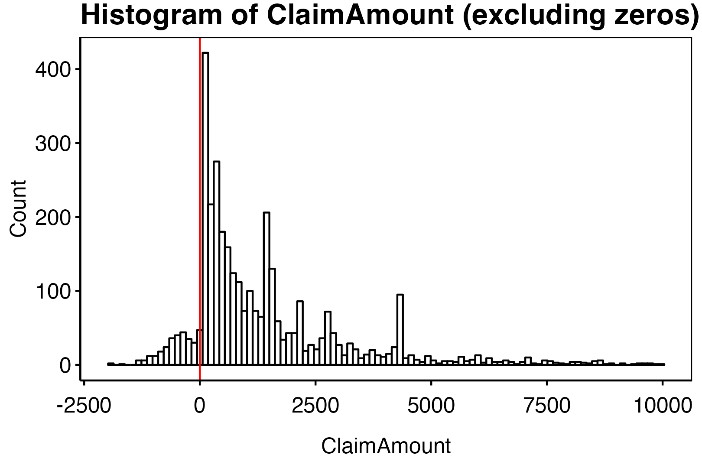
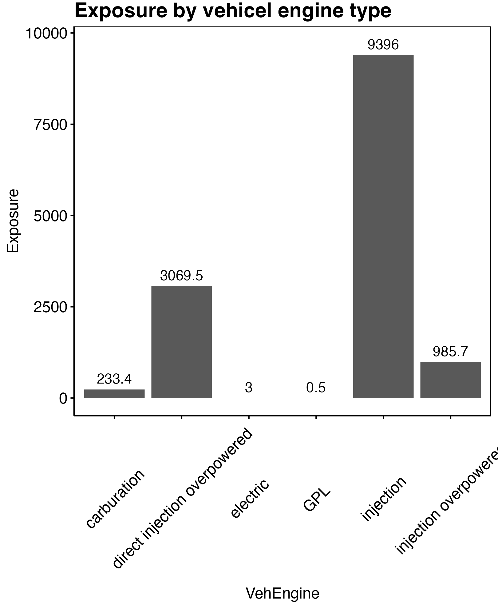

```{r setup, include=FALSE}
knitr::opts_chunk$set(echo = TRUE)
rm(list = ls())
library(knitr)
if (knitr::is_latex_output()) {
  knitr::opts_chunk$set(
    fig.show = 'hide',
    echo = TRUE,
    warning=FALSE,
    message = FALSE
  )
} else {
  knitr::opts_chunk$set(
    warning=FALSE,
    message = FALSE
  )
}
theme_custom <- function() {
  
  theme_minimal() %+replace%
    
    theme(
      
      panel.grid.major = element_blank(),
      panel.grid.minor = element_blank(),
      panel.border = element_rect(colour = "black", fill=NA),
      axis.ticks = element_line(),
      #axis.line.x = element_line(color = "#C5C5C5"),
      axis.line = element_line(color = "black"),
      #axis.ticks = element_blank(),
      legend.position = "bottom",
      legend.title = element_blank(),
      #plot.background = element_rect(fill='transparent', color=NA),
      
      plot.title = element_text(             #title
                   #family = font,            #set font family
                   size = 16,                #set font size
                   face = 'bold',            #bold typeface
                   hjust = 0,                #left align
                   vjust = 2,
                   color = "black"),               #raise slightly
      
      plot.subtitle = element_text(          #subtitle
                   #family = font,            #font family
                   size = 12,
                   hjust = 0,
                   color = "black"),               #font size
      
      plot.caption = element_text(           #caption
                   #family = font,            #font family
                    face = "italic",
                   size = 8,                 #font size
                   hjust = 1,
                   color = "black"),               #right align
      
      axis.title = element_text(             #axis titles
                   #family = font,            #font family
                   size = 12,
                   color = "black"),               #font size
      
      axis.text = element_text(              #axis text
                   #family = font,            #axis famuly
                   size = 12,
                   color = "black"),                #font size
      
      axis.text.x = element_text(            #margin for axis text
                    margin=margin(5, b = 10))
      
    )
}
```

```{r,echo = FALSE}
library(CASdatasets)
library(lattice) 
library(evmix)
library(ggplot2)
library(mlr3)
library(mlr3learners)
library(mlr3extralearners)
library(dbarts)
library(mlr3mbo)
library(mlr3measures)
library(mlr3tuning)
library(ranger)
library(mlr3viz)
library(fastDummies)
library(dplyr)
```


# Getting familiar with the data

```{r,echo = FALSE}
data("freMPL1")
```


The data we use in this project is on the form of a table where out main objective is model the claim size $Y_i$ given the explanatory variables $X_i$ in the table. In particular, we want to construct an estimator that predicts an expecected claim size given the information available i.e. the quantity $\mathbb E[Y\ \vert\ X]$.

\begin{wrapfigure}{r}{0.50\textwidth}
  \begin{center}
    \includegraphics[width=0.48\textwidth]{figures/plot1.png}
  \end{center}
  \caption{Histogram of the variable `ClaimAmount`.}
\end{wrapfigure}

**Missing values.** As with any statistical modelling we start by doing some exploratory analysis of the data `freMPL1`. As it was seen in the previous section, the number of variables (columns) missing datapoints were only one. The one in question is `RecordEnd` which has `r sum(is.na(freMPL1$RecordEnd))` out of `r dim(freMPL1)[1]` missing values. This does not bather us since we have the variable `Exposure` giving the time difference between `RecordBeg` and `RecordEnd` in calendar years. Furthermore we have that `RecordBeg` ranges from `r min(freMPL1$RecordBeg)` to `r max(freMPL1$RecordBeg)` and `RecordBeg + 365.25*Exposure` being at most `r max(freMPL1$RecordBeg+ freMPL1$Exposure*365.25)` meaning that all contracts span within the year 2004. Assuming no seasonality trends this would incentivice us to remove the two variables `RecordBeg` and `RecordEnd`.

```{r, echo = FALSE, out.width="75%",fig.align='center',warning=FALSE}
p <- ggplot(data=freMPL1[freMPL1$ClaimAmount != 0 & freMPL1$ClaimAmount < 10000,], aes(x=ClaimAmount)) + 
  geom_histogram(col = 'black', fill = 'white', bins = 100) + 
  geom_vline(xintercept = 0, col = 'red') + theme_custom() +
  labs(title = "Histogram of ClaimAmount (excluding zeros)",
       y = "Count")
ggsave("figures/plot1.png",bg='transparent',plot = p, height = 1080,width = 1620, units="px")
#
```

**ClaimAmount and ClaimInd.** The variable of interest, `ClaimAmount`, excibits a strange behaviour as it contains `r sum(freMPL1$ClaimAmount <0)` strictly negative values. This is seen in figure 1. As this does not intuitively makes sense we will set these values as zero and ensure that the `ClaimInd` reflects this change.

```{r, echo = FALSE, results='hide'}
p <- freMPL1 %>% group_by(VehEngine) %>%
  summarise(
    Exposure = sum(Exposure)
  ) %>%
  ggplot(data=., aes(x=VehEngine, y = Exposure)) + geom_col() + theme_custom() +
  theme(axis.text.x = element_text(angle = 45)) +
  geom_text(aes(x = VehEngine, y= Exposure+300, label = round(Exposure,1))) +
  labs(title = "Exposure by vehicel engine type")
ggsave("figures/plot2.png",bg='transparent',plot = p, height = 1980,width = 1620, units="px")
#
#table(freMPL1$VehEngine,freMPL1$VehEnergy)

p <- freMPL1 %>% group_by(SocioCateg = substr(SocioCateg,4,5)) %>%
  summarise(
    Exposure = sum(Exposure)
  ) %>% 
  ggplot(data=., aes(x=SocioCateg, y = Exposure)) + geom_col() + theme_custom() +
  theme(axis.text.x = element_text(angle = 90)) +
  geom_text(aes(x = SocioCateg, y= Exposure+300, label = round(Exposure,1)),angle = 90) +
  labs(title = "Exposure by social class type")
ggsave("figures/plot3.png",bg='transparent',plot = p, height = 1980,width = 1620, units="px")

tmp <- table(SocioCateg = substr(freMPL1$SocioCateg,4,5)) %>% as.data.table()
tmp$SocioCateg <- as.numeric(tmp$SocioCateg)
tmp <- tmp %>% arrange(SocioCateg) %>%
  mutate(cumsum = cumsum(N))
p <- ggplot(tmp) + geom_line(aes(x=SocioCateg,y=cumsum)) + theme_custom() +
  labs(title = "Distribution of SocioCateg")
ggsave("figures/plot4.png",bg='transparent',plot = p, height = 1080,width = 1620, units="px")

p <- freMPL1 %>% group_by(VehPrice) %>%
  summarise(
    Exposure = sum(Exposure)
  ) %>%
  ggplot(data=., aes(x=VehPrice, y = Exposure)) + geom_col() + theme_custom() +
  theme(axis.text.x = element_text(angle = 0)) +
  geom_text(aes(x = VehPrice, y= Exposure+100, label = round(Exposure,1)),angle = 90) +
  labs(title = "Exposure by vehicle price")
ggsave("figures/plot5.png",bg='transparent',plot = p, height = 1980,width = 1620, units="px")

p <- freMPL1 %>% group_by(VehMaxSpeed) %>%
  summarise(
    Exposure = sum(Exposure)
  ) %>%
  ggplot(data=., aes(x=VehMaxSpeed, y = Exposure)) + geom_col() + theme_custom() +
  theme(axis.text.x = element_text(angle = 45)) +
  geom_text(aes(x = VehMaxSpeed, y= Exposure+150, label = round(Exposure,1)),angle = 90) +
  labs(title = "Exposure by vehicle max speed")
ggsave("figures/plot6.png",bg='transparent',plot = p, height = 1980,width = 1620, units="px")

p <- freMPL1 %>% group_by(VehBody) %>%
  summarise(
    Exposure = sum(Exposure)
  ) %>%
  ggplot(data=., aes(x=VehBody, y = Exposure)) + geom_col() + theme_custom() +
  theme(axis.text.x = element_text(angle = 45)) +
  geom_text(aes(x = VehBody, y= Exposure+500, label = round(Exposure,1)),angle = 90) +
  labs(title = "Exposure by vehicle body")
ggsave("figures/plot7.png",bg='transparent',plot = p, height = 1980,width = 1620, units="px")
```

**VehEngine and VehEnergy.** *(Vehicle specific, 1)* Regarding the categorical variables we notice that some levels is has sparse data. The variables `VehEngine` and `VehEnergy` has both the levels `GPL` and `electric`. We do however not have any substantial datapoints as in total these levels contain `r sum(freMPL1$VehEngine %in% c("electric","GPL"))` observations. As the total dataset has `r dim(freMPL1)[1]` observations in total we choose to remove these observations.

\begin{figure}[h]
    \centering
    \subfloat[\centering]{{\includegraphics[width=0.25\textwidth]{figures/plot5.png} }}
    \qquad
    \subfloat[\centering]{{\includegraphics[width=0.25\textwidth]{figures/plot6.png} }}
    \qquad
    \subfloat[\centering]{{\includegraphics[width=0.25\textwidth]{figures/plot7.png} }}
    \caption{Exposure by respectively vehicle price (a), max speed (b) and body (c).}
\end{figure}

**VehPrice, VehMaxSpeed and VehBody.** *(Vehicle specific, 2)* In figure 2 we see that `VehPrice` is well represented in most price categories. We do however har a shorter supply of data in the tails. We will therefore combine the lowest three categories A through C, the levels R through T and lastly U through Z. Regarding to the vehicle max speed we see that a very few number of observations are in the lowest category `1-130 kmh`. We therefore combine the lowest level with the level `130-140 kmh`. The only vehicle body with very few observations is `bus` with only `r sum(freMPL1$VehBody == "bus")` observations. We do however see that `bus` act much like the category `sedan` with respect to frequency and severity and so these are combined under `sedan`.

**VehAge, VehUsage and VehClass.** *(Vehicle specific, 3)* The remaining three vehicle specific variable is well represented throughout all levels. The only scarce observation is `VehUsage` being `Professional run`. We therefore combine `Proffesional` and `Professional run` under `Professional`. We leave the remaining levels as is.

\begin{wrapfigure}{r}{0.40\textwidth}
  \begin{center}
    \includegraphics[width=0.38\textwidth]{figures/plot4.png}
  \end{center}
  \caption{Cummulative distribution of the variable `SocioCateg`.}
\end{wrapfigure}

**SocioCateg and Gender.** *(Socails)* When constructing a statistical model, one does not simply have to consider which variables have the most explanatory value but one also have to take into consideration the lawfullness of discriminating customors based on covariates as gender, race and so forth. It is common knowledge that insurance companies cannot discriminate based on gender and so we will not use the variable `gender` as explanatory variable even though it might improve the model predictions. The variable `SocioCateg` representing the socioeconomic status of the insured ranges between category 1 and 99. It is not at the moment clear whether this is a covariate that may be used in pricing, so we will prefer not using it. However, if it does indeed improve the fit without overfitting, we may get some additional information from this variable. The data is indicate that the custumors in general are in the category 50 with a few other levels having significant more observations than others. For this reason we combine the catagories from 1 to 49 into `A` and the catagories 51 to 99 into `C` and keep the category `B` as is.

**LicAge, DrivAge and MariStat.** *(Customer specific)* In general in France, one can acquire a drivers license at the age of 18 and so we have the obvious restriction `LicAge <= DrivAge - 18` and we will in general have that the license age will be approximately 18 years less than the drivers license. It is therefore reasonable to discuss whether to include both variables. We would however assume that for an older person the license age would be more important than for youngsters. Furthermore, we would assume that the `ClaimInd` and the `LicAge` are negative correlated. We will therefore include both. Both `Alone` and `Other` is well represented in `MariStat`.

**HasKmLimit, RiskVar, Garage and BonusMalus** *(Policy related and others)* The variables remaining HasKmLimit, RiskVar, Garage and BonusMalus are well represented throughout all levels and so no action is taken here.

```{r, echo=FALSE,message=FALSE,results='hide'}
A <- subset(freMPL1, select =c(Exposure,VehAge,Gender,MariStat,SocioCateg,VehUsage,HasKmLimit,BonusMalus,VehBody,VehPrice,VehEngine,VehEnergy,VehMaxSpeed,VehClass,RiskVar,Garage))
cp <- cor(data.matrix(na.omit(A)), method = "spearman")
ord <- rev(hclust(as.dist(1 - abs(cp)))$order)
colPal <- colorRampPalette(c("blue", "white","red"), space="rgb")(100)
png(filename = "figures/plot8.png", height = 1080,width = 1080, units="px",res=200)
levelplot(cp[ord, ord], xlab = "", ylab = "", col.regions = colPal,
          at = seq(-1,1, length.out=100),scales =list(x=list(rot=45), cex=0.8),
          panel=function(...) {
                       arg <- list(...)
                       panel.levelplot(...)
                       }, )
dev.off()
```

\begin{figure}[h]
  \begin{center}
    \includegraphics[width=0.48\textwidth]{figures/plot8.png}
  \end{center}
  \caption{Spearman correlation matrix.}
\end{figure}

**Correlations.** As discussed previously the age of the driver and the license age i very correlated and so one may consider whether or not both variables are needed. In practice we do however see that age and experience are used when modelling the premium. Secondly, we see that the covariates vehicle engine and energy are very correlated and also the three variables vehicle max speed, price and class are well correlated. Thirdly, we see that vehicle usage and socio category are correlated. This is likely because wealthier people more often have a car for professional use.

```{r,echo=FALSE}
## Feature selection and formatting
data("freMPL1",package = "CASdatasets")

#1: RecordBeg and RecordEnd discarded
freMPL1 <- freMPL1 %>%
  select(-RecordBeg,-RecordEnd)

#2: Claim amount and indicator
freMPL1$ClaimAmount[freMPL1$ClaimAmount<0] <- 0
freMPL1$ClaimInd <- ifelse(freMPL1$ClaimAmount>0,1,0)

#3: Electric or GPL vehicals
freMPL1 <- freMPL1 %>%
  filter(!(VehEngine %in% c("electric","GPL")))

#4: Combining price categories
levels(freMPL1$VehPrice)[1:3] <- "A-C"
n <- length(levels(freMPL1$VehPrice))
levels(freMPL1$VehPrice)[(n-5):n] <- "U-Z"
n <- length(levels(freMPL1$VehPrice))
levels(freMPL1$VehPrice)[(n-3):(n-1)] <- "R-T"

#5: Combining max speed levels
levels(freMPL1$VehMaxSpeed)[1:2] <- "1-140 kmh"

#6: Bus set to sedan
levels(freMPL1$VehBody)[levels(freMPL1$VehBody) == "bus"] <- "sedan"

#7: Gender discarded
freMPL1 <- freMPL1 %>%
  select(-Gender)

#8: SocioCateg change levels
freMPL1 <- freMPL1 %>%
  #Get numerical value of SocioCateg
  mutate(helper = as.numeric(substr(SocioCateg,4,5))) %>%
  #Overwrite SocioCateg 
  mutate(SocioCateg = factor(ifelse(helper > 50, "C",
                                    ifelse( helper < 50, "A",
                                            "B")),
                             levels = c("A","B","C"))) %>%
  select(-helper)

#Preparing the data
df <- freMPL1 %>%
  dummy_cols(.,select_columns = c("VehAge","MariStat","VehUsage",
                                  "VehBody","VehPrice","VehEngine",
                                  "VehEnergy","VehMaxSpeed","VehClass",
                                  "Garage","SocioCateg","RiskVar"),
             remove_selected_columns = TRUE)
colnames(df) <- make.names(colnames(df))
```

\newpage

# Training a regression model

The technical premium is based upon a frequency/severity model. We have the base model assumptions as: Let $Y:=Y_{t+\Delta t}$ be the claim risen by a policy during the interval $[t,t+\Delta t)$ with $\Delta t$ representing the exposure. Notice that in princible $\Delta t$ is a stopping time defined as

$$
\Delta t := \min\big(1,\inf\{s\ge t : Y_s>0\}\big),
$$
meaning the policy is terminated at the time $t+\Delta t$ with $t+\Delta t=t+1$ if $Y=0$. Notice that the exposure is censored if $\Delta t_i<1$ and $Y_i=0$. We furthermore have the covariates $X\in \mathcal X$ with $\mathcal X$ being a $p$-dimensional space. We are interested in the object $\mathbb E[Y\ \vert\ X]$ being the expected claim risen given the covariates $X$. Our main assumption is that this expectation is decomposed into

$$
\mathbb E[Y\ \vert\ X]=\mathbb E[Y1_{Y>0}\ \vert\ X]=\mathbb E[Y\ \vert\ X,1_{Y>0}]\cdot \mathbb E[1_{Y>0}\ \vert\ X]=\mu_X\cdot p_X,
$$

where $\mu_X$ is the expected claim in the event, that a claim arises i.e. the severity and $p_X$ is the probability that a claim arises i.e. the frequency. However since the data is censored with exposure $\tilde{\Delta t}\le \Delta t$ we need to consider how we may translate a predictive model into a price function for new policies. In practice, we include exposure as a covariate.

We will search for the most efficient estimators for both the severity and frequency. We will denote these estimators by $m_\mu(X)$ and $m_p(X)$ where we will denote the model by a superscript $m^{(*)}_j$ with $*$ denoting the model for $j=\mu,p$.

## Modelling severity

```{r,echo = FALSE}
#Get the severity data
df_sev <- df %>% 
  filter(ClaimInd == 1) %>%
  select(-Exposure)

#Start a task
task_sev <- df_sev %>%
  #Make sure not to include ClaimInd
  select(-ClaimInd) %>%
  #Start tast with target ClaimAmound
  as_task_regr(.,
               target = "ClaimAmount",
               id= "Severity")

#Split data into training and test
set.seed(20230313) #We choose a seed
splits <- partition(task_sev,
                    ratio = 0.8)
df_sev_train <- df_sev[splits$train,]
df_sev_test <- df_sev[splits$test,]

#Start task on training data
task_sev_train <- as_task_regr(df_sev_train, target = "ClaimAmount")
```

```{r,echo = FALSE,message=FALSE,results='hide'}
#Generalized Additive Model
sev_gam_tuned_regr <- lrn("regr.gam") 
indicators <- colnames(df)[!(colnames(df) %in% c("LicAge","BonusMalus","DrivAge","ClaimAmount","Exposure","ClaimInd"))]
#indicators <- indicators[!grepl("RiskVar",indicators)]
sev_gam_tuned_regr$param_set$values$formula <- reformulate(c("s(LicAge)",
                                                         "s(BonusMalus)",
                                                         "s(DrivAge)",
                                                         indicators),
                                                       "ClaimAmount")
#Train model
sev_gam_tuned_regr$train(task_sev_train)
#Test predictions on test
predictions <- sev_gam_tuned_regr$predict_newdata(df_sev_test)
sev_gam_mse <- mean((predictions$response-predictions$truth)^2)
sev_gam_L1 <- mean(abs(predictions$response-predictions$truth))
plotdf <- data.frame(response = predictions$response,
                     truth = predictions$truth)
p_gam <- ggplot(plotdf) +
  geom_vline(xintercept = 10**(1:5), col = "gray") +
  geom_hline(yintercept = 10**(2:5), col = "gray") +
  geom_point(aes(truth,response)) +
  scale_x_continuous(trans = "log10",limits = c(10,50000),breaks = 10**(1:5)) +
  scale_y_continuous(trans = "log10",limits = c(100,50000),breaks = 10**(2:5)) +
  geom_abline(slope = 1,intercept = 0, col = "red") +
  geom_smooth(aes(truth,response)) +
  theme_custom() +
  annotate(geom = "text", x = 100,
           y = 30000,
           label = paste0("MSE: ",round(sev_gam_mse/10**7,3),"*10^7\n","L1: ",round(sev_gam_L1,0))) +
  labs(title = "GAM: Response vs. truth")
ggsave("figures/sev_p_gam.png",bg='transparent',plot = p_gam, height = 1980*3/4,width = 1620*3/4, units="px")
ggsave("figures/sev_p_gam_wide.png",bg='transparent',plot = p_gam, height = 1620*3/4,width = 1980*3/4, units="px")
p_gam_2 <- ggplot(plotdf) + geom_histogram(aes(x=response,y = ..density..), bins = 50, fill = "gray",col = "black") +
  geom_density(aes(x=response)) +
  geom_density(aes(x=truth),col = "red") +
  scale_x_continuous(trans = "log10",limits = c(10,50000),breaks = 10**(1:5)) +
  theme_custom() +
  labs(title = "GAM: Distribution of respose and truth")
ggsave("figures/sev_p_gam2.png",bg='transparent',plot = p_gam_2, height = 1980*3/4,width = 1620*3/4, units="px")
ggsave("figures/sev_p_gam2_wide.png",bg='transparent',plot = p_gam_2, height = 1620*3/4,width = 1980*3/4, units="px")
plotdf2 <- rbind(
  cbind(x = plotdf$response, cat = 1),
  cbind(x = plotdf$truth, cat = 2)
) %>% as.data.frame()
plotdf2$cat <- factor(plotdf2$cat, levels = unique(plotdf2$cat))
p_gam_3 <- ggplot(plotdf2,aes(x=cat,y=x)) + geom_violin() +
  geom_boxplot(width=0.1)+
  geom_hline(yintercept = 0) + 
  ylim(-1500,10000) + theme_custom() +
  theme(axis.title = element_blank(),
        axis.ticks.x = element_blank(),
        axis.text.x = element_blank())
p_gam_combined <- ggpubr::ggarrange(p_gam_2,p_gam_3,nrow=1,widths = c(5,2))
ggsave("figures/sev_p_gam3.png",bg='transparent',plot = p_gam_combined, height = 1620*3/4,width = 1980*4/4, units="px")
```

```{r,echo = FALSE,message=FALSE,results='hide'}
#Elastic net
sev_glmnet_learner <- lrn("regr.glmnet", 
                        s= to_tune(0, 1),
                        alpha=to_tune(0, 1))
update_data <- FALSE
if (update_data == TRUE) {
  #Estimate hyperparameters
  set.seed(20230313) #We choose a seed
  sev_glmnet_learner_instance <- tune(
    #method = tnr("random_search"), ### tuning method
    method = mlr3tuning::tnr("mbo"), ### tuning method
    task = task_sev_train,
    learner = sev_glmnet_learner,
    resampling = rsmp("cv", folds = 5), #### resampling method: 5-fold cross validation
    measures = msr("regr.mse"), #### root mean squared error
    terminator = trm("evals", n_evals = 200) #### terminator
  )
  saveRDS(sev_glmnet_learner_instance, file = "rds/sev_glmnet_learner_instance.rds")
} else {
  sev_glmnet_learner_instance <- readRDS("rds/sev_glmnet_learner_instance.rds")
}
sev_glmnet_tuned_regr <- lrn("regr.glmnet")  
sev_glmnet_tuned_regr$param_set$values <- sev_glmnet_learner_instance$result_learner_param_vals
#Train model
sev_glmnet_tuned_regr$train(task_sev_train)
#Test predictions on test
predictions <- sev_glmnet_tuned_regr$predict_newdata(df_sev_test)
sev_glmnet_mse <- mean((predictions$response-predictions$truth)^2)
sev_glmnet_L1 <- mean(abs(predictions$response-predictions$truth))
plotdf <- data.frame(response = predictions$response,
                     truth = predictions$truth)
p_glmnet <- ggplot(plotdf) +
  geom_vline(xintercept = 10**(1:5), col = "gray") +
  geom_hline(yintercept = 10**(2:5), col = "gray") +
  geom_point(aes(truth,response)) +
  scale_x_continuous(trans = "log10",limits = c(10,50000),breaks = 10**(1:5)) +
  scale_y_continuous(trans = "log10",limits = c(100,50000),breaks = 10**(2:5)) +
  geom_abline(slope = 1,intercept = 0, col = "red") +
  geom_smooth(aes(truth,response)) +
  theme_custom() +
  annotate(geom = "text", x = 100,
           y = 30000,
           label = paste0("MSE: ",round(sev_glmnet_mse/10**7,3),"*10^7\n","L1: ",round(sev_glmnet_L1,0))) +
  labs(title = "Elastic net: Distribution of respose and truth")
ggsave("figures/sev_p_glmnet.png",bg='transparent',plot = p_glmnet, height = 1980*3/4,width = 1620*3/4, units="px")
ggsave("figures/sev_p_glmnet_wide.png",bg='transparent',plot = p_glmnet, height = 1620*3/4,width = 1980*3/4, units="px")
p_glmnet_2 <- ggplot(plotdf) + geom_histogram(aes(x=response,y = ..density..), bins = 50, fill = "gray",col = "black") +
  geom_density(aes(x=response)) +
  geom_density(aes(x=truth),col = "red") +
  scale_x_continuous(trans = "log10",limits = c(10,50000),breaks = 10**(1:5)) +
  theme_custom() +
  labs(title = "Elastic net: Distribution of respose and truth")
ggsave("figures/sev_p_glmnet2.png",bg='transparent',plot = p_glmnet_2, height = 1980*3/4,width = 1620*3/4, units="px")
ggsave("figures/sev_p_glmnet2_wide.png",bg='transparent',plot = p_glmnet_2, height = 1620*3/4,width = 1980*3/4, units="px")
plotdf2 <- rbind(
  cbind(x = plotdf$response, cat = 1),
  cbind(x = plotdf$truth, cat = 2)
) %>% as.data.frame()
plotdf2$cat <- factor(plotdf2$cat, levels = unique(plotdf2$cat))
p_glmnet_3 <- ggplot(plotdf2,aes(x=cat,y=x)) + geom_violin() +
  geom_boxplot(width=0.1)+
  geom_hline(yintercept = 0) + 
  ylim(-1500,10000) + theme_custom() +
  theme(axis.title = element_blank(),
        axis.ticks.x = element_blank(),
        axis.text.x = element_blank())
p_glmnet_combined <- ggpubr::ggarrange(p_glmnet_2,p_glmnet_3,nrow=1,widths = c(5,2))
ggsave("figures/sev_p_glmnet3.png",bg='transparent',plot = p_glmnet_combined, height = 1620*3/4,width = 1980*4/4, units="px")
```

```{r,echo = FALSE,message=FALSE,results='hide'}
#XGB
sev_xgb_learner <- lrn("regr.xgboost", 
                   eta = to_tune(0, 0.5),
                   nrounds = to_tune(10, 5000),
                   max_depth = to_tune(1, 3))
if (update_data == TRUE) {
  #Estimate hyperparameters
  set.seed(20230313) #We choose a seed
  sev_xgb_learner_instance = tune(
    #method = tnr("random_search"), ### tuning method
    method = mlr3tuning::tnr("mbo"), ### tuning method
    task = task_sev_train,
    learner = sev_xgb_learner,
    resampling = rsmp("cv", folds = 5), #### resampling method: 5-fold cross validation
    measures = msr("regr.mse"), #### root mean squared error
    terminator = trm("evals", n_evals = 200) #### terminator
  )
  saveRDS(sev_xgb_learner_instance, file = "rds/sev_xgb_learner_instance.rds")
} else {
  sev_xgb_learner_instance <- readRDS("rds/sev_xgb_learner_instance.rds")
}
sev_xgb_tuned_regr <- lrn("regr.xgboost")  
sev_xgb_tuned_regr$param_set$values <- sev_xgb_learner_instance$result_learner_param_vals
#Train model
sev_xgb_tuned_regr$train(task_sev_train)
#Test predictions on test
predictions <- sev_xgb_tuned_regr$predict_newdata(df_sev_test)
sev_xgb_mse <- mean((predictions$response-predictions$truth)^2)
sev_xgb_L1 <- mean(abs(predictions$response-predictions$truth))
plotdf <- data.frame(response = predictions$response,
                     truth = predictions$truth)
p_xgboost <- ggplot(plotdf) +
  geom_vline(xintercept = 10**(1:5), col = "gray") +
  geom_hline(yintercept = 10**(2:5), col = "gray") +
  geom_point(aes(truth,response)) +
  scale_x_continuous(trans = "log10",limits = c(10,50000),breaks = 10**(1:5)) +
  scale_y_continuous(trans = "log10",limits = c(100,50000),breaks = 10**(2:5)) +
  geom_abline(slope = 1,intercept = 0, col = "red") +
  geom_smooth(aes(truth,response)) +
  theme_custom() +
  annotate(geom = "text", x = 100,
           y = 30000,
           label = paste0("MSE: ",round(sev_xgb_mse/10**7,3),"*10^7\n","L1: ",round(sev_xgb_L1,0))) +
  labs(title = "XGBoost: Distribution of respose and truth")
ggsave("figures/sev_p_xgboost.png",bg='transparent',plot = p_xgboost, height = 1980*3/4,width = 1620*3/4, units="px")
ggsave("figures/sev_p_xgboost_wide.png",bg='transparent',plot = p_xgboost, height = 1620*3/4,width = 1980*3/4, units="px")
p_xgboost_2 <- ggplot(plotdf) + geom_histogram(aes(x=response,y = ..density..), bins = 50, fill = "gray",col = "black") +
  geom_density(aes(x=response)) +
  geom_density(aes(x=truth),col = "red") +
  scale_x_continuous(trans = "log10",limits = c(10,50000),breaks = 10**(1:5)) +
  theme_custom() +
  labs(title = "Elastic net: Distribution of respose and truth")
ggsave("figures/sev_p_xgboost2.png",bg='transparent',plot = p_xgboost_2, height = 1980*3/4,width = 1620*3/4, units="px")
ggsave("figures/sev_p_xgboost2_wide.png",bg='transparent',plot = p_xgboost_2, height = 1620*3/4,width = 1980*3/4, units="px")
plotdf2 <- rbind(
  cbind(x = plotdf$response, cat = 1),
  cbind(x = plotdf$truth, cat = 2)
) %>% as.data.frame()
plotdf2$cat <- factor(plotdf2$cat, levels = unique(plotdf2$cat))
p_xgboost_3 <- ggplot(plotdf2,aes(x=cat,y=x)) + geom_violin() +
  geom_boxplot(width=0.1)+
  geom_hline(yintercept = 0) + 
  ylim(-1500,10000) + theme_custom() +
  theme(axis.title = element_blank(),
        axis.ticks.x = element_blank(),
        axis.text.x = element_blank())
p_xgboost_combined <- ggpubr::ggarrange(p_xgboost_2,p_xgboost_3,nrow=1,widths = c(5,2))
ggsave("figures/sev_p_xgboost3.png",bg='transparent',plot = p_xgboost_combined, height = 1620*3/4,width = 1980*4/4, units="px")
```

```{r,echo = FALSE,message=FALSE,results='hide'}
#BART
sev_bart_learner <- lrn("regr.bart",
                        ntree = to_tune(73,400))
if (update_data == TRUE) {
  #Estimate hyperparameters
  set.seed(20230313) #We choose a seed
  sev_bart_learner_instance = tune(
    #method = tnr("random_search"), ### tuning method
    method = mlr3tuning::tnr("mbo"), ### tuning method
    task = task_sev_train,
    learner = sev_bart_learner,
    resampling = rsmp("cv", folds = 5), #### resampling method: 5-fold cross validation
    measures = msr("regr.mse"), #### root mean squared error
    terminator = trm("evals", n_evals = 200) 
  )
  saveRDS(sev_bart_learner_instance, file = "rds/sev_bart_learner_instance.rds")
} else {
  sev_bart_learner_instance <- readRDS("rds/sev_bart_learner_instance.rds")
}
sev_bart_tuned_regr <- lrn("regr.bart")  
sev_bart_tuned_regr$param_set$values <- sev_bart_learner_instance$result_learner_param_vals
#Train model
sev_bart_tuned_regr$train(task_sev_train)
#Test predictions on test
predictions <- sev_bart_tuned_regr$predict_newdata(df_sev_test)
sev_bart_mse <- mean((predictions$response-predictions$truth)^2)
sev_bart_L1 <- mean(abs(predictions$response-predictions$truth))
plotdf <- data.frame(response = predictions$response,
                     truth = predictions$truth)
p_bart <- ggplot(plotdf) +
  geom_vline(xintercept = 10**(1:5), col = "gray") +
  geom_hline(yintercept = 10**(2:5), col = "gray") +
  geom_point(aes(truth,response)) +
  scale_x_continuous(trans = "log10",limits = c(10,50000),breaks = 10**(1:5)) +
  scale_y_continuous(trans = "log10",limits = c(100,50000),breaks = 10**(2:5)) +
  geom_abline(slope = 1,intercept = 0, col = "red") +
  geom_smooth(aes(truth,response)) +
  theme_custom() +
  annotate(geom = "text", x = 100,
           y = 30000,
           label = paste0("MSE: ",round(sev_bart_mse/10**7,3),"*10^7\n","L1: ",round(sev_bart_L1,0))) +
  labs(title = "Bart: Distribution of respose and truth")
ggsave("figures/sev_p_bart.png",bg='transparent',plot = p_bart, height = 1980*3/4,width = 1620*3/4, units="px")
ggsave("figures/sev_p_bart_wide.png",bg='transparent',plot = p_bart, height = 1620*3/4,width = 1980*3/4, units="px")
p_bart_2 <- ggplot(plotdf) + geom_histogram(aes(x=response,y = ..density..), bins = 50, fill = "gray",col = "black") +
  geom_density(aes(x=response)) +
  geom_density(aes(x=truth),col = "red") +
  scale_x_continuous(trans = "log10",limits = c(10,50000),breaks = 10**(1:5)) +
  theme_custom() +
  labs(title = "Bart: Distribution of respose and truth")
ggsave("figures/sev_p_bart2.png",bg='transparent',plot = p_bart_2, height = 1980*3/4,width = 1620*3/4, units="px")
ggsave("figures/sev_p_bart2_wide.png",bg='transparent',plot = p_bart_2, height = 1620*3/4,width = 1980*3/4, units="px")
plotdf2 <- rbind(
  cbind(x = plotdf$response, cat = 1),
  cbind(x = plotdf$truth, cat = 2)
) %>% as.data.frame()
plotdf2$cat <- factor(plotdf2$cat, levels = unique(plotdf2$cat))
p_bart_3 <- ggplot(plotdf2,aes(x=cat,y=x)) + geom_violin() +
  geom_boxplot(width=0.1)+
  geom_hline(yintercept = 0) + 
  ylim(-1500,10000) + theme_custom() +
  theme(axis.title = element_blank(),
        axis.ticks.x = element_blank(),
        axis.text.x = element_blank())
p_bart_combined <- ggpubr::ggarrange(p_bart_2,p_bart_3,nrow=1,widths = c(5,2))
ggsave("figures/sev_p_bart3.png",bg='transparent',plot = p_bart_combined, height = 1620*3/4,width = 1980*4/4, units="px")
```

```{r,echo = FALSE,message=FALSE,results='hide'}
#RANGER
sev_ranger_learner <- lrn("regr.ranger", 
                      mtry.ratio = to_tune(0.1,1), 
                      min.node.size = to_tune(1, 50), 
                      num.trees = 50)
if (update_data == TRUE) {
  #Estimate hyperparameters
  set.seed(20230313) #We choose a seed
  sev_ranger_learner_instance = tune(
    #method = tnr("random_search"), ### tuning method
    method = mlr3tuning::tnr("mbo"), ### tuning method
    task = task_sev_train,
    learner = sev_ranger_learner,
    resampling = rsmp("cv", folds = 5), #### resampling method: 5-fold cross validation
    measures = msr("regr.mse"), #### root mean squared error
    terminator = trm("evals", n_evals = 200) #### terminator
  )
  saveRDS(sev_ranger_learner_instance, file = "rds/sev_ranger_learner_instance.rds")
} else {
  sev_ranger_learner_instance <- readRDS("rds/sev_ranger_learner_instance.rds")
}
sev_ranger_tuned_regr <- lrn("regr.ranger")  
sev_ranger_tuned_regr$param_set$values <- sev_ranger_learner_instance$result_learner_param_vals
#Train model
sev_ranger_tuned_regr$train(task_sev_train)
#Test predictions on test
predictions <- sev_ranger_tuned_regr$predict_newdata(df_sev_test)
sev_ranger_mse <- mean((predictions$response-predictions$truth)^2)
sev_ranger_L1 <- mean(abs(predictions$response-predictions$truth))
plotdf <- data.frame(response = predictions$response,
                     truth = predictions$truth)
p_ranger <- ggplot(plotdf) +
  geom_vline(xintercept = 10**(1:5), col = "gray") +
  geom_hline(yintercept = 10**(2:5), col = "gray") +
  geom_point(aes(truth,response)) +
  scale_x_continuous(trans = "log10",limits = c(10,50000),breaks = 10**(1:5)) +
  scale_y_continuous(trans = "log10",limits = c(100,50000),breaks = 10**(2:5)) +
  geom_abline(slope = 1,intercept = 0, col = "red") +
  geom_smooth(aes(truth,response)) +
  theme_custom() +
  annotate(geom = "text", x = 100,
           y = 30000,
           label = paste0("MSE: ",round(sev_ranger_mse/10**7,3),"*10^7\n","L1: ",round(sev_ranger_L1,0))) +
  labs(title = "Ranger: Distribution of respose and truth")
ggsave("figures/sev_p_ranger.png",bg='transparent',plot = p_ranger, height = 1980*3/4,width = 1620*3/4, units="px")
ggsave("figures/sev_p_ranger_wide.png",bg='transparent',plot = p_ranger, height = 1620*3/4,width = 1980*3/4, units="px")
p_ranger_2 <- ggplot(plotdf) + geom_histogram(aes(x=response,y = ..density..), bins = 50, fill = "gray",col = "black") +
  geom_density(aes(x=response)) +
  geom_density(aes(x=truth),col = "red") +
  scale_x_continuous(trans = "log10",limits = c(10,50000),breaks = 10**(1:5)) +
  theme_custom() +
  labs(title = "Ranger: Distribution of respose and truth")
ggsave("figures/sev_p_ranger2.png",bg='transparent',plot = p_ranger_2, height = 1980*3/4,width = 1620*3/4, units="px")
ggsave("figures/sev_p_ranger2_wide.png",bg='transparent',plot = p_ranger_2, height = 1620*3/4,width = 1980*3/4, units="px")
plotdf2 <- rbind(
  cbind(x = plotdf$response, cat = 1),
  cbind(x = plotdf$truth, cat = 2)
) %>% as.data.frame()
plotdf2$cat <- factor(plotdf2$cat, levels = unique(plotdf2$cat))
p_ranger_3 <- ggplot(plotdf2,aes(x=cat,y=x)) + geom_violin() +
  geom_boxplot(width=0.1)+
  geom_hline(yintercept = 0) + 
  ylim(-1500,10000) + theme_custom() +
  theme(axis.title = element_blank(),
        axis.ticks.x = element_blank(),
        axis.text.x = element_blank())
p_ranger_combined <- ggpubr::ggarrange(p_ranger_2,p_ranger_3,nrow=1,widths = c(5,2))
ggsave("figures/sev_p_ranger3.png",bg='transparent',plot = p_ranger_combined, height = 1620*3/4,width = 1980*4/4, units="px")
```

We model the severity by modelling `ClaimAmount ~ X_1 + X_2 + ...` for `X_i` being either a numerical variable or a 0/1 variable. As the response is numerical we choose the $L^2$ loss given by the loss function

$$
L(y_1,y_2)=(y_1-y_2)^2.
$$


We will by default not use any other feature selection as described in the previous sections. We will start by testing which of the following five models does best under the $L^2$ loss

  1. The generalized additive model,
  2. Elastic net linear model,
  3. eXtreme Gradient Boosting or short XGBoost,
  4. Bayesian Additive Regression Tree or shot BART,
  5. Random forests implemented through `ranger`.

### Generalized Additive Model

The generalized additive model we do not necessary assume that $Y\ \vert\ X$ is normal distributed and may be modeled as a linear combination of features. Instead we assume that the conditional mean satisfies the following

$$
g\left(\mathbb E[Y\ \vert\ X]\right)=\beta_0 + \sum_{i=1}^pf_i(X_i):=\eta \tag{1}
$$

where $g$ is the link function relating the parameter $\eta$ with the mean. The functions $f_i$ for $i=1,...,p$ are smoothing functions. Furthermore we in general assume that $Y\ \vert\ X\sim \mathcal E$ for some exponential distribution. However in this case we choose the link function $g(x)=x$ (identity) and the response distribution as gaussian, that is we assume the model

$$
Y\ \vert\ X=\beta_0 + \sum_{i=1}^pf_i(X_i)+\varepsilon,
$$

with $\varepsilon\sim\mathcal N(0,\sigma^2)$. For the smoothing functions we choose splines and apply them to the continuous variables `LicAge`, `BonusMalus` and `DrivAge`. The rest of the variables are indicators and so no smoother is applied. Fitting this model to the training data and predicting onto the test data yields the below pairs `(truth,response)`.

\begin{figure}[h]
    \centering
    \subfloat[\centering]{{\includegraphics[width=0.34\textwidth]{figures/sev_p_gam_wide.png} }}
    \qquad
    \subfloat[\centering]{{\includegraphics[width=0.46\textwidth]{figures/sev_p_gam3.png} }}
    \caption{(a): Predictions for the GAM with x being the actual value and y being the estimate. The red line represent the mapping $y=x$. (b, left): Distribution of the response and actual values. The red density function represents the empirical density of the test data set. (b, right): A combined boxplot and violin plot of the distribution of the response (left) and the actual value (right).}
\end{figure}

One sees that the model predicts negative claims. This is obviously problematic since this would imply that the technical premium would be negative as well. Other than this, the model does a poor job in capturing the heavy tail of the true distribution. This is not a problem with the model but rather a lack of extreme value considerations.

We can check the model predictions on a couple of specific policies, namely the row numbers 6257, 25018, 30503 and 30563. Let us briefly take a look at the four policies.

```{r,echo=FALSE}
policies <- c(6257,24131,25018,25196,30503,30563)
policies_sev_gam <- sev_gam_tuned_regr$predict_newdata(df[policies,])
options(scipen = 999)
library(kableExtra)
kbl(freMPL1[policies,],caption = "Policy covariates for policies of interest (6257, 24131, 25018, 25196, 30503 and 30563).", format="latex", booktabs=TRUE) %>% 
  kable_styling(latex_options=c("scale_down","hold_position"))
```

Then applying the estimator we obtain the estimates.

| Estimator | $\hat R_{L^2}$ | $\hat R_{L^1}$ | 6257 | 24131 | 25018 | 25196 | 30503  | 30563 |
| :-: | :-: | :-: | :-: | :-: | :-: | :-: | :-: | :-: |
| $m^{(GAM)}_\mu$ | $`r round(sev_gam_mse/10**7,3)`\cdot 10^7$ | `r round(sev_gam_L1,2)` | `r round(policies_sev_gam$response[1],digits = 2)` | `r round(policies_sev_gam$response[2],digits = 2)` | `r round(policies_sev_gam$response[3],digits = 2)` | `r round(policies_sev_gam$response[4],digits = 2)` | `r round(policies_sev_gam$response[5],digits = 2)` | `r round(policies_sev_gam$response[6],digits = 2)` |


### Elastic net linear model

\begin{figure}[h]
    \centering
    \subfloat[\centering]{{\includegraphics[width=0.34\textwidth]{figures/sev_p_glmnet_wide.png} }}
    \qquad
    \subfloat[\centering]{{\includegraphics[width=0.46\textwidth]{figures/sev_p_glmnet3.png} }}
    \caption{(a): Predictions for the elastic net regression model with x being the actual value and y being the estimate. The red line represent the mapping $y=x$. (b, left): Distribution of the response and actual values. The red density function represents the empirical density of the test data set. (b, right): A combined boxplot and violin plot of the distribution of the response (left) and the actual value (right).}
\end{figure}

The elastic net is a penalized linear model where the estimate is based on the algorithm

$$
m^{(EN)}_\mu(X)=\left(\beta_\lambda^{EN }\right)^\top X
$$

where $\beta$-parameter is determined through the minimization problem

$$
\hat{\beta}_\lambda^{\text {glmnet }} =\underset{\beta \in \mathbb{R}^p}{\arg \min }\left\{\hat{R}_n(\beta)+J_\lambda(\beta)\right\},\hspace{15pt}J_\lambda(\beta)=\lambda \left[\alpha\sum_{j=1}^p\left|\beta_j\right|+\frac{1-\alpha}{2}\sum_{j=1}^p\beta_j^2\right].
$$

Through 5-fold cross validation we choose the parameters $\lambda = `r round(sev_glmnet_learner_instance$result_learner_param_vals$s,digits = 6)`$ and $\alpha = `r round(sev_glmnet_learner_instance$result_learner_param_vals$alpha,digits = 6)`$. We may consider the estimate for the policies from above.

```{r,echo=FALSE}
policies_sev_glmnet <- sev_glmnet_tuned_regr$predict_newdata(df[policies,])
```

| Estimator | $\hat R_{L^2}$ | $\hat R_{L^1}$ | 6257 | 24131 | 25018 | 25196 | 30503  | 30563 |
| :-: | :-: | :-: | :-: | :-: | :-: | :-: | :-: | :-: |
| $m^{(EN)}_\mu$ | $`r round(sev_glmnet_mse/10**7,3)`\cdot 10^7$ | `r round(sev_glmnet_L1,2)` | `r round(policies_sev_glmnet$response[1],digits = 2)` | `r round(policies_sev_glmnet$response[2],digits = 2)` | `r round(policies_sev_glmnet$response[3],digits = 2)` | `r round(policies_sev_glmnet$response[4],digits = 2)` | `r round(policies_sev_glmnet$response[5],digits = 2)` | `r round(policies_sev_glmnet$response[6],digits = 2)` |

### XGBoost

\begin{figure}[h]
    \centering
    \subfloat[\centering]{{\includegraphics[width=0.34\textwidth]{figures/sev_p_xgboost_wide.png} }}
    \qquad
    \subfloat[\centering]{{\includegraphics[width=0.46\textwidth]{figures/sev_p_xgboost3.png} }}
    \caption{(a): Predictions for the XGBoost regression model with x being the actual value and y being the estimate. The red line represent the mapping $y=x$. (b, left): Distribution of the response and actual values. The red density function represents the empirical density of the test data set. (b, right): A combined boxplot and violin plot of the distribution of the response (left) and the actual value (right).}
\end{figure}

```{r,echo=FALSE}
policies_sev_xgb <- sev_xgb_tuned_regr$predict_newdata(df[policies,])
```

| Estimator | $\hat R_{L^2}$ | $\hat R_{L^1}$ | 6257 | 24131 | 25018 | 25196 | 30503  | 30563 |
| :-: | :-: | :-: | :-: | :-: | :-: | :-: | :-: | :-: |
| $m^{(XGB)}_\mu$ | $`r round(sev_xgb_mse/10**7,3)`\cdot 10^7$ | `r round(sev_xgb_L1,2)` | `r round(policies_sev_xgb$response[1],digits = 2)` | `r round(policies_sev_xgb$response[2],digits = 2)` | `r round(policies_sev_xgb$response[3],digits = 2)` | `r round(policies_sev_xgb$response[4],digits = 2)` | `r round(policies_sev_xgb$response[5],digits = 2)` | `r round(policies_sev_xgb$response[6],digits = 2)` |

\newpage

### BART

\begin{figure}[h]
    \centering
    \subfloat[\centering]{{\includegraphics[width=0.34\textwidth]{figures/sev_p_bart_wide.png} }}
    \qquad
    \subfloat[\centering]{{\includegraphics[width=0.46\textwidth]{figures/sev_p_bart3.png} }}
    \caption{(a): Predictions for the BART regression model with x being the actual value and y being the estimate. The red line represent the mapping $y=x$. (b, left): Distribution of the response and actual values. The red density function represents the empirical density of the test data set. (b, right): A combined boxplot and violin plot of the distribution of the response (left) and the actual value (right).}
\end{figure}

```{r,echo=FALSE}
policies_sev_bart <- sev_bart_tuned_regr$predict_newdata(df[policies,])
```

| Estimator | $\hat R_{L^2}$ | $\hat R_{L^1}$ | 6257 | 24131 | 25018 | 25196 | 30503  | 30563 |
| :-: | :-: | :-: | :-: | :-: | :-: | :-: | :-: | :-: |
| $m^{(Bart)}_\mu$ | $`r round(sev_bart_mse/10**7,3)`\cdot 10^7$ | `r round(sev_bart_L1,2)` | `r round(policies_sev_bart$response[1],digits = 2)` | `r round(policies_sev_bart$response[2],digits = 2)` | `r round(policies_sev_bart$response[3],digits = 2)` | `r round(policies_sev_bart$response[4],digits = 2)` | `r round(policies_sev_bart$response[5],digits = 2)` | `r round(policies_sev_bart$response[6],digits = 2)` |

### Ranger

\begin{figure}[h]
    \centering
    \subfloat[\centering]{{\includegraphics[width=0.34\textwidth]{figures/sev_p_ranger_wide.png} }}
    \qquad
    \subfloat[\centering]{{\includegraphics[width=0.46\textwidth]{figures/sev_p_ranger3.png} }}
    \caption{(a): Predictions for the ranger regression model with x being the actual value and y being the estimate. The red line represent the mapping $y=x$. (b, left): Distribution of the response and actual values. The red density function represents the empirical density of the test data set. (b, right): A combined boxplot and violin plot of the distribution of the response (left) and the actual value (right).}
\end{figure}

```{r,echo=FALSE}
policies_sev_ranger <- sev_ranger_tuned_regr$predict_newdata(df[policies,])
```

| Estimator | $\hat R_{L^2}$ | $\hat R_{L^1}$ | 6257 | 24131 | 25018 | 25196 | 30503  | 30563 |
| :-: | :-: | :-: | :-: | :-: | :-: | :-: | :-: | :-: |
| $m^{(Ranger)}_\mu$ | $`r round(sev_ranger_mse/10**7,3)`\cdot 10^7$ | `r round(sev_ranger_L1,2)` | `r round(policies_sev_ranger$response[1],digits = 2)` | `r round(policies_sev_ranger$response[2],digits = 2)` | `r round(policies_sev_ranger$response[3],digits = 2)` | `r round(policies_sev_ranger$response[4],digits = 2)` | `r round(policies_sev_ranger$response[5],digits = 2)` | `r round(policies_sev_ranger$response[6],digits = 2)` |

\newpage

### Combining results

| Estimator | $\hat R_{L^2}$ | $\hat R_{L^1}$ | 6257 | 24131 | 25018 | 25196 | 30503  | 30563 |
| :- | :-: | :-: | :-: | :-: | :-: | :-: | :-: | :-: |
| $m^{(GAM)}_\mu$ | $`r round(sev_gam_mse/10**7,3)`\cdot 10^7$ | `r round(sev_gam_L1,2)` | `r round(policies_sev_gam$response[1],digits = 2)` | `r round(policies_sev_gam$response[2],digits = 2)` | `r round(policies_sev_gam$response[3],digits = 2)` | `r round(policies_sev_gam$response[4],digits = 2)` | `r round(policies_sev_gam$response[5],digits = 2)` | `r round(policies_sev_gam$response[6],digits = 2)` |
| $m^{(EN)}_\mu$ | $`r round(sev_glmnet_mse/10**7,3)`\cdot 10^7$ | `r round(sev_glmnet_L1,2)` | `r round(policies_sev_glmnet$response[1],digits = 2)` | `r round(policies_sev_glmnet$response[2],digits = 2)` | `r round(policies_sev_glmnet$response[3],digits = 2)` | `r round(policies_sev_glmnet$response[4],digits = 2)` | `r round(policies_sev_glmnet$response[5],digits = 2)` | `r round(policies_sev_glmnet$response[6],digits = 2)` |
| $m^{(XGB)}_\mu$ | $`r round(sev_xgb_mse/10**7,3)`\cdot 10^7$ | `r round(sev_xgb_L1,2)` | `r round(policies_sev_xgb$response[1],digits = 2)` | `r round(policies_sev_xgb$response[2],digits = 2)` | `r round(policies_sev_xgb$response[3],digits = 2)` | `r round(policies_sev_xgb$response[4],digits = 2)` | `r round(policies_sev_xgb$response[5],digits = 2)` | `r round(policies_sev_xgb$response[6],digits = 2)` |
| $m^{(Bart)}_\mu$ | $`r round(sev_bart_mse/10**7,3)`\cdot 10^7$ | `r round(sev_bart_L1,2)` | `r round(policies_sev_bart$response[1],digits = 2)` | `r round(policies_sev_bart$response[2],digits = 2)` | `r round(policies_sev_bart$response[3],digits = 2)` | `r round(policies_sev_bart$response[4],digits = 2)` | `r round(policies_sev_bart$response[5],digits = 2)` | `r round(policies_sev_bart$response[6],digits = 2)` |
| $m^{(Ranger)}_\mu$ | $`r round(sev_ranger_mse/10**7,3)`\cdot 10^7$ | `r round(sev_ranger_L1,2)` | `r round(policies_sev_ranger$response[1],digits = 2)` | `r round(policies_sev_ranger$response[2],digits = 2)` | `r round(policies_sev_ranger$response[3],digits = 2)` | `r round(policies_sev_ranger$response[4],digits = 2)` | `r round(policies_sev_ranger$response[5],digits = 2)` | `r round(policies_sev_ranger$response[6],digits = 2)` |

We choose the Ranger model going forward because it has the lowest MLE and it seems the most precise in estimating, seen on figure 9a. This is maybe because random trees deal well with sparsity and thus the model has worked around the high correlation of the variables.

The bad performance of the GAM model shows that the response might have a very non-additive character which also speaks in favor of the Ranger model since random trees deal very poorly with additive models.

\newpage

## Modelling frequency

```{r,echo=FALSE}
p <- freMPL1 %>%
  mutate(Exposure = round(Exposure/0.01,digits = 0)*0.01) %>%
  filter(ClaimInd == 1) %>%
  group_by(Exposure) %>%
  summarise(Count = sum(ClaimInd)) %>%
  arrange(Exposure) %>%
  mutate(Akk = cumsum(Count)) %>%
  ggplot(.) + geom_line(aes(x=Exposure, y = Akk)) +
  theme_custom() +
  labs(
    title = "Total claims along exposure",
    subtitle = "Accumulated claims by exposure",
    y = "Acc. claims"
  )
ggsave("figures/plot9.png",bg='transparent',plot = p, height = 1620,width = 1980, units="px")
p <- freMPL1 %>%
  mutate(Exposure = round(Exposure/0.1,digits = 0)*0.1) %>%
  group_by(Exposure) %>%
  summarise(ClaimInd = sum(ClaimInd),
            Count = sum(Exposure >=0 )) %>%
  arrange(Exposure) %>%
  mutate(Frequency = ClaimInd/Count) %>%
  ggplot(.) + geom_col(aes(x=Exposure, y = Frequency)) +
  theme_custom() +
  labs(
    title = "Frequency for different exposure intervals",
    subtitle = "Total claims divided by total observations",
    y = "Frequency"
  )
ggsave("figures/plot10.png",bg='transparent',plot = p, height = 1620*4/6,width = 1980*4/5, units="px")
```

\begin{wrapfigure}{r}{0.50\textwidth}
  \begin{center}
    \includegraphics[width=0.48\textwidth]{figures/plot10.png}
  \end{center}
  \caption{The figure shows that the frequency is linear in exposure.}
\end{wrapfigure}

We have chosen to have exposure as an explanatory variable, since we from the plots can see a somewhat linear tendency between the exposure and Claimind. Thus the idea is that the more exposure you have the more likelihood there is of you making a claim. We did not use the weight method, because we do not want an observation with more exposure to have a bigger impact, but rather that the risk is explained by the exposure.

When we evaluate the risk of the estimators we use the log loss function given as

$$
L(y,p) = -\Big(y\cdot \log p + (1-y)\cdot \log(1-p)\Big).
$$

```{r,echo = FALSE}
#Get the frequency data
df_freq <- df %>%
  mutate(ClaimInd = factor(ClaimInd, levels = c(0,1))) %>%
  #Make sure not to include ClaimAmount
  select(-ClaimAmount)

#Start a task
task_freq <- df_freq %>%
  #Start tast with target ClaimInd
  as_task_classif(.,
               target = "ClaimInd",
               id= "Frequency")

#Split data into training and test
set.seed(20230313) #We choose a seed
splits <- partition(task_freq,
                    ratio = 0.8)
df_freq_train <- df_freq[splits$train,]
df_freq_test <- df_freq[splits$test,]

#Start task on training data
task_freq_train <- as_task_classif(df_freq_train,
                                target = "ClaimInd",
                                id= "Frequency_train")
```

```{r,echo = FALSE,message=FALSE,results='hide'}
#Generalized Additive Model
freq_gam_tuned <- lrn("classif.gam",
                      predict_type = "prob")
indicators <- colnames(df)[!(colnames(df) %in% c("LicAge","BonusMalus","DrivAge","ClaimAmount","ClaimInd"))]
freq_gam_tuned$param_set$values$formula <- reformulate(c("s(LicAge)",
                                                         "s(BonusMalus)",
                                                         "s(DrivAge)",
                                                         indicators),
                                                       "ClaimInd")
#Train model
freq_gam_tuned$train(task_freq_train)
#Test predictions on test
predictions <- freq_gam_tuned$predict_newdata(df_freq_test)
ll_loss <- function(y,p) {
  p <- ifelse(p == 1, 1-0.0000001,p)
  p <- ifelse(p==0, 0.0000001, p)
  return(-( y * log(p) + (1 - y)*log(1-p)))
}
freq_gam_ll <- mean(ll_loss(y = as.numeric(as.character(predictions$truth)),
                            p = predictions$prob[,2]))
plotdf <- data.frame(response = predictions$prob[,2],
                     truth = as.numeric(as.character(predictions$truth)))
p_gam <- ggplot(plotdf,aes(x=factor(truth),y=response)) + geom_violin() +
  geom_boxplot(width=0.1)+
  ylim(0,0.25) + theme_custom() +
  labs(
    title = "GAM: Distribution of predicted probabilities",
    x = "truth (ClaimInd)",
    y= "prob"
  )
ggsave("figures/freq_p_gam.png",bg='transparent',plot = p_gam, height = 1980*3/4,width = 1620*3/4, units="px")
ggsave("figures/freq_p_gam_wide.png",bg='transparent',plot = p_gam, height = 1620*3/4,width = 1980*3/4, units="px")
```

```{r,echo = FALSE,message=FALSE,results='hide'}
#Elastic net
freq_glmnet_learner <- lrn("classif.glmnet", 
                          s = to_tune(0, 1),
                          alpha = to_tune(0, 1),
                          predict_type = "prob")

update_data <- FALSE
if (update_data == TRUE) {
  #Estimate hyperparameters
  set.seed(20230313) #We choose a seed
  freq_glmnet_learner_instance <- tune(
    #method = tnr("random_search"), ### tuning method
    method = mlr3tuning::tnr("mbo"), ### tuning method
    task = task_freq_train,
    learner = freq_glmnet_learner,
    resampling = rsmp("cv", folds = 5), #### resampling method: 5-fold cross validation
    measures = msr("classif.logloss"), #### root mean squared error
    terminator = trm("evals", n_evals = 200) #### terminator
  )
  saveRDS(freq_glmnet_learner_instance, file = "rds/freq_glmnet_learner_instance.rds")
} else {
  freq_glmnet_learner_instance <- readRDS("rds/freq_glmnet_learner_instance.rds")
}
freq_glmnet_tuned <- lrn("classif.glmnet",
                          predict_type = "prob")
freq_glmnet_tuned$param_set$values <- freq_glmnet_learner_instance$result_learner_param_vals
#Train model
freq_glmnet_tuned$train(task_freq_train)
#Test predictions on test
predictions <- freq_glmnet_tuned$predict_newdata(df_freq_test)
freq_glmnet_ll <- mean(ll_loss(y = as.numeric(as.character(predictions$truth)),
                              p = predictions$prob[,2]))
plotdf <- data.frame(response = predictions$prob[,2],
                     truth = as.numeric(as.character(predictions$truth)))
p_glmnet <- ggplot(plotdf,aes(x=factor(truth),y=response)) + geom_violin() +
  geom_boxplot(width=0.1)+
  ylim(0,0.25) + theme_custom() +
  labs(
    title = "Elastic net: Distribution of predicted probabilities",
    x = "truth (ClaimInd)",
    y= "prob"
  )
ggsave("figures/freq_p_glmnet.png",bg='transparent',plot = p_glmnet, height = 1980*3/4,width = 1620*3/4, units="px")
ggsave("figures/freq_p_glmnet_wide.png",bg='transparent',plot = p_glmnet, height = 1620*3/4,width = 1980*3/4, units="px")
```

```{r,echo = FALSE,message=FALSE,results='hide'}
#XGB
freq_xgb_learner <- lrn("classif.xgboost", 
                        eta = to_tune(0, 0.5),
                        nrounds = to_tune(10, 5000),
                        max_depth = to_tune(1, 3),
                        predict_type = "prob")
if (update_data == TRUE) {
  #Estimate hyperparameters
  set.seed(20230313) #We choose a seed
  freq_xgb_learner_instance = tune(
    #method = tnr("random_search"), ### tuning method
    method = mlr3tuning::tnr("mbo"), ### tuning method
    task = task_freq_train,
    learner = freq_xgb_learner,
    resampling = rsmp("cv", folds = 5), #### resampling method: 5-fold cross validation
    measures = msr("classif.logloss"), #### root mean squared error
    terminator = trm("evals", n_evals = 100) #### terminator
  )
  saveRDS(freq_xgb_learner_instance, file = "rds/freq_xgb_learner_instance.rds")
} else {
  freq_xgb_learner_instance <- readRDS("rds/freq_xgb_learner_instance.rds")
}
freq_xgb_tuned <- lrn("classif.xgboost",
                      predict_type = "prob")  
freq_xgb_tuned$param_set$values <- freq_xgb_learner_instance$result_learner_param_vals
#Train model
freq_xgb_tuned$train(task_freq_train)
#Test predictions on test
predictions <- freq_xgb_tuned$predict_newdata(df_freq_test)
freq_xgb_ll <- mean(ll_loss(y = as.numeric(as.character(predictions$truth)),
                            p = predictions$prob[,2]))
plotdf <- data.frame(response = predictions$prob[,2],
                     truth = as.numeric(as.character(predictions$truth)))
p_xgb <- ggplot(plotdf,aes(x=factor(truth),y=response)) + geom_violin() +
  geom_boxplot(width=0.1)+
  ylim(0,0.25) + theme_custom() +
  labs(
    title = "XGBoost: Distribution of predicted probabilities",
    x = "truth (ClaimInd)",
    y= "prob"
  )
ggsave("figures/freq_p_xgb.png",bg='transparent',plot = p_xgb, height = 1980*3/4,width = 1620*3/4, units="px")
ggsave("figures/freq_p_xgb_wide.png",bg='transparent',plot = p_xgb, height = 1620*3/4,width = 1980*3/4, units="px")
```

```{r,echo = FALSE,message=FALSE,results='hide'}
#BART
freq_bart_learner <- lrn("classif.bart",
                        ntree = to_tune(73,400),
                        predict_type = "prob")
if (update_data == TRUE) {
  #Estimate hyperparameters
  set.seed(20230313) #We choose a seed
  freq_bart_learner_instance = tune(
    #method = tnr("random_search"), ### tuning method
    method = mlr3tuning::tnr("mbo"), ### tuning method
    task = task_freq_train,
    learner = freq_bart_learner,
    resampling = rsmp("cv", folds = 5), #### resampling method: 5-fold cross validation
    measures = msr("classif.logloss"), #### root mean squared error
    terminator = trm("evals", n_evals = 75) 
  )
  saveRDS(freq_bart_learner_instance, file = "rds/freq_bart_learner_instance.rds")
} else {
  freq_bart_learner_instance <- readRDS("rds/freq_bart_learner_instance.rds")
}
freq_bart_tuned <- lrn("classif.bart",
                      predict_type = "prob")  
freq_bart_tuned$param_set$values <- freq_bart_learner_instance$result_learner_param_vals
#Train model
freq_bart_tuned$train(task_freq_train)
#Test predictions on test
predictions <- freq_bart_tuned$predict_newdata(df_freq_test)
freq_bart_ll <- mean(ll_loss(y = as.numeric(as.character(predictions$truth)),
                            p = predictions$prob[,2]))
plotdf <- data.frame(response = predictions$prob[,2],
                     truth = as.numeric(as.character(predictions$truth)))
p_bart <- ggplot(plotdf,aes(x=factor(truth),y=response)) + geom_violin() +
  geom_boxplot(width=0.1)+
  ylim(0,0.25) + theme_custom() +
  labs(
    title = "BART: Distribution of predicted probabilities",
    x = "truth (ClaimInd)",
    y= "prob"
  )
ggsave("figures/freq_p_bart.png",bg='transparent',plot = p_bart, height = 1980*3/4,width = 1620*3/4, units="px")
ggsave("figures/freq_p_bart_wide.png",bg='transparent',plot = p_bart, height = 1620*3/4,width = 1980*3/4, units="px")
```

```{r,echo = FALSE,message=FALSE,results='hide'}
#RANGER
freq_ranger_learner <- lrn("classif.ranger", 
                      mtry.ratio = to_tune(0.1,1), 
                      min.node.size = to_tune(1, 50), 
                      num.trees = 50,
                      predict_type = "prob")
if (update_data == TRUE) {
  #Estimate hyperparameters
  set.seed(20230313) #We choose a seed
  freq_ranger_learner_instance = tune(
    #method = tnr("random_search"), ### tuning method
    method = mlr3tuning::tnr("mbo"), ### tuning method
    task = task_freq_train,
    learner = freq_ranger_learner,
    resampling = rsmp("cv", folds = 5), #### resampling method: 5-fold cross validation
    measures = msr("classif.logloss"), #### root mean squared error
    terminator = trm("evals", n_evals = 200) #### terminator
  )
  saveRDS(freq_ranger_learner_instance, file = "rds/freq_ranger_learner_instance.rds")
} else {
  freq_ranger_learner_instance <- readRDS("rds/freq_ranger_learner_instance.rds")
}
freq_ranger_tuned <- lrn("classif.ranger",
                           predict_type = "prob")  
freq_ranger_tuned$param_set$values <- freq_ranger_learner_instance$result_learner_param_vals
#Train model
freq_ranger_tuned$train(task_freq_train)
#Test predictions on test
predictions <- freq_ranger_tuned$predict_newdata(df_freq_test)
freq_ranger_ll <- mean(ll_loss(y = as.numeric(as.character(predictions$truth)),
                            p = predictions$prob[,2]))
plotdf <- data.frame(response = predictions$prob[,2],
                     truth = as.numeric(as.character(predictions$truth)))
p_ranger <- ggplot(plotdf,aes(x=factor(truth),y=response)) + geom_violin() +
  geom_boxplot(width=0.1)+
  ylim(0,0.25) + theme_custom() +
  labs(
    title = "Ranger: Distribution of predicted probabilities",
    x = "truth (ClaimInd)",
    y= "prob"
  )
ggsave("figures/freq_p_ranger.png",bg='transparent',plot = p_ranger, height = 1980*3/4,width = 1620*3/4, units="px")
ggsave("figures/freq_p_ranger_wide.png",bg='transparent',plot = p_ranger, height = 1620*3/4,width = 1980*3/4, units="px")
```

### Generalized Additive Model

We fit a Generalized additive model by fitting `ClaimInd` to the covariates. Specifically this is done by choosing the logit link function $g$ in equation (1). The logit link function is given by

$$
g(p)=\log\left(\frac{p}{1-p}\right)=\log p-\log(1-p)\in \mathbb R.
$$

\begin{figure}[h]
    \centering
    \includegraphics[width=0.34\textwidth]{figures/freq_p_gam_wide.png}
    \caption{A combined boxplot and violin plot of the distribution of the predicted probability for respectively the non claim (left) and claim (right) policies.}
\end{figure}

We can check the model predictions on a couple of specific policies, namely the row numbers 6257, 25018, 30503 and 30563. Let us briefly take a look at the four policies.

```{r,echo=FALSE}
policies_freq_gam <- freq_gam_tuned$predict_newdata(df_freq[policies,])
```

Then applying the estimator we obtain the estimates.

| Estimator | $\hat R_{LL}$ | 6257 | 24131 | 25018 | 25196 | 30503  | 30563 |
| :-: | :-: | :-: | :-: | :-: | :-: | :-: | :-: |
| $m^{(GAM)}_p$ | `r round(freq_gam_ll,7)` | `r round(policies_freq_gam$prob[1,2],digits = 5)` | `r round(policies_freq_gam$prob[2,2],digits = 5)` | `r round(policies_freq_gam$prob[3,2],digits = 5)` | `r round(policies_freq_gam$prob[4,2],digits = 5)` | `r round(policies_freq_gam$prob[5,2],digits = 5)` | `r round(policies_freq_gam$prob[6,2],digits = 5)` |

\newpage

### Elastic net linear model

\begin{figure}[h]
    \centering
    \includegraphics[width=0.34\textwidth]{figures/freq_p_glmnet_wide.png}
    \caption{A combined boxplot and violin plot of the distribution of the predicted probability for respectively the non claim (left) and claim (right) policies.}
\end{figure}

We can check the model predictions on a couple of specific policies, namely the row numbers 6257, 25018, 30503 and 30563. Let us briefly take a look at the four policies.

```{r,echo=FALSE}
policies_freq_glmnet <- freq_glmnet_tuned$predict_newdata(df_freq[policies,])
```

Then applying the estimator we obtain the estimates.

| Estimator | $\hat R_{LL}$ | 6257 | 24131 | 25018 | 25196 | 30503  | 30563 |
| :-: | :-: | :-: | :-: | :-: | :-: | :-: | :-: |
| $m^{(EN)}_p$ | `r round(freq_glmnet_ll,7)` | `r round(policies_freq_glmnet$prob[1,2],digits = 5)` | `r round(policies_freq_glmnet$prob[2,2],digits = 5)` | `r round(policies_freq_glmnet$prob[3,2],digits = 5)` | `r round(policies_freq_glmnet$prob[4,2],digits = 5)` | `r round(policies_freq_glmnet$prob[5,2],digits = 5)` | `r round(policies_freq_glmnet$prob[6,2],digits = 5)` |

### XGBoost

\begin{figure}[h]
    \centering
    \includegraphics[width=0.34\textwidth]{figures/freq_p_xgb_wide.png}
    \caption{A combined boxplot and violin plot of the distribution of the predicted probability for respectively the non claim (left) and claim (right) policies.}
\end{figure}

We can check the model predictions on a couple of specific policies, namely the row numbers 6257, 25018, 30503 and 30563. Let us briefly take a look at the four policies.

```{r,echo=FALSE}
policies_freq_xgb <- freq_xgb_tuned$predict_newdata(df_freq[policies,])
```

Then applying the estimator we obtain the estimates.

| Estimator | $\hat R_{LL}$ | 6257 | 24131 | 25018 | 25196 | 30503  | 30563 |
| :-: | :-: | :-: | :-: | :-: | :-: | :-: | :-: |
| $m^{(XGB)}_p$ | `r round(freq_xgb_ll,7)` | `r round(policies_freq_xgb$prob[1,2],digits = 5)` | `r round(policies_freq_xgb$prob[2,2],digits = 5)` | `r round(policies_freq_xgb$prob[3,2],digits = 5)` | `r round(policies_freq_xgb$prob[4,2],digits = 5)` | `r round(policies_freq_xgb$prob[5,2],digits = 5)` | `r round(policies_freq_xgb$prob[6,2],digits = 5)` |

### BART

\begin{figure}[h]
    \centering
    \includegraphics[width=0.34\textwidth]{figures/freq_p_bart_wide.png}
    \caption{A combined boxplot and violin plot of the distribution of the predicted probability for respectively the non claim (left) and claim (right) policies.}
\end{figure}

We can check the model predictions on a couple of specific policies, namely the row numbers 6257, 25018, 30503 and 30563. Let us briefly take a look at the four policies.

```{r,echo=FALSE}
policies_freq_bart <- freq_bart_tuned$predict_newdata(df_freq[policies,])
```

Then applying the estimator we obtain the estimates.

| Estimator | $\hat R_{LL}$ | 6257 | 24131 | 25018 | 25196 | 30503  | 30563 |
| :-: | :-: | :-: | :-: | :-: | :-: | :-: | :-: |
| $m^{(Bart)}_p$ | `r round(freq_bart_ll,7)` | `r round(policies_freq_bart$prob[1,2],digits = 5)` | `r round(policies_freq_bart$prob[2,2],digits = 5)` | `r round(policies_freq_bart$prob[3,2],digits = 5)` | `r round(policies_freq_bart$prob[4,2],digits = 5)` | `r round(policies_freq_bart$prob[5,2],digits = 5)` | `r round(policies_freq_bart$prob[6,2],digits = 5)` |

### Ranger

\begin{figure}[h]
    \centering
    \includegraphics[width=0.34\textwidth]{figures/freq_p_ranger_wide.png}
    \caption{A combined boxplot and violin plot of the distribution of the predicted probability for respectively the non claim (left) and claim (right) policies.}
\end{figure}

We can check the model predictions on a couple of specific policies, namely the row numbers 6257, 25018, 30503 and 30563. Let us briefly take a look at the four policies.

```{r,echo=FALSE}
policies_ranger_glmnet <- freq_ranger_tuned$predict_newdata(df_freq[policies,])
```

Then applying the estimator we obtain the estimates.

| Estimator | $\hat R_{LL}$ | 6257 | 24131 | 25018 | 25196 | 30503 | 30563 | 
| :-: | :-: | :-: | :-: | :-: | :-: | :-: | :-: | 
| $m^{(Ranger)}_p$ | `r round(freq_ranger_ll,7)` | `r round(policies_ranger_glmnet$prob[1,2],digits = 5)` | `r round(policies_ranger_glmnet$prob[2,2],digits = 5)` | `r round(policies_ranger_glmnet$prob[3,2],digits = 5)` | `r round(policies_ranger_glmnet$prob[4,2],digits = 5)` | `r round(policies_ranger_glmnet$prob[5,2],digits = 5)` | `r round(policies_ranger_glmnet$prob[6,2],digits = 5)` |

\newpage

### Combining results

| Estimator | $\hat R_{LL}$ | 6257 | 24131 | 25018 | 25196 | 30503 | 30563 | 
| :-: | :-: | :-: | :-: | :-: | :-: | :-: | :-: | 
| $m^{(GAM)}_p$ | `r round(freq_gam_ll,7)` | `r round(policies_freq_gam$prob[1,2],digits = 5)` | `r round(policies_freq_gam$prob[2,2],digits = 5)` | `r round(policies_freq_gam$prob[3,2],digits = 5)` | `r round(policies_freq_gam$prob[4,2],digits = 5)` | `r round(policies_freq_gam$prob[5,2],digits = 5)` | `r round(policies_freq_gam$prob[6,2],digits = 5)` |
| $m^{(EN)}_p$ | `r round(freq_glmnet_ll,7)` | `r round(policies_freq_glmnet$prob[1,2],digits = 5)` | `r round(policies_freq_glmnet$prob[2,2],digits = 5)` | `r round(policies_freq_glmnet$prob[3,2],digits = 5)` | `r round(policies_freq_glmnet$prob[4,2],digits = 5)` | `r round(policies_freq_glmnet$prob[5,2],digits = 5)` | `r round(policies_freq_glmnet$prob[6,2],digits = 5)` |
| $m^{(XGB)}_p$ | `r round(freq_xgb_ll,7)` | `r round(policies_freq_xgb$prob[1,2],digits = 5)` | `r round(policies_freq_xgb$prob[2,2],digits = 5)` | `r round(policies_freq_xgb$prob[3,2],digits = 5)` | `r round(policies_freq_xgb$prob[4,2],digits = 5)` | `r round(policies_freq_xgb$prob[5,2],digits = 5)` | `r round(policies_freq_xgb$prob[6,2],digits = 5)` |
| $m^{(Bart)}_p$ | `r round(freq_bart_ll,7)` | `r round(policies_freq_bart$prob[1,2],digits = 5)` | `r round(policies_freq_bart$prob[2,2],digits = 5)` | `r round(policies_freq_bart$prob[3,2],digits = 5)` | `r round(policies_freq_bart$prob[4,2],digits = 5)` | `r round(policies_freq_bart$prob[5,2],digits = 5)` | `r round(policies_freq_bart$prob[6,2],digits = 5)` |
| $m^{(Ranger)}_p$ | `r round(freq_ranger_ll,7)` | `r round(policies_ranger_glmnet$prob[1,2],digits = 5)` | `r round(policies_ranger_glmnet$prob[2,2],digits = 5)` | `r round(policies_ranger_glmnet$prob[3,2],digits = 5)` | `r round(policies_ranger_glmnet$prob[4,2],digits = 5)` | `r round(policies_ranger_glmnet$prob[5,2],digits = 5)` | `r round(policies_ranger_glmnet$prob[6,2],digits = 5)` |

Once again the ranger model outperforms the other models. Furthermore, it seems that the probabilities assign to the test data indicates, that the estimator correctly assigns noteworthy larger probabilities to the policies that indeed ended up with a claim. Lastly, one might want to investigate if the model predicts probabilities very close to zero. If so, we would maybe for business reasons rather penalize these probabilities while transferring the increased income as savings to the policies with a lower competitive price.

\newpage

## The technical price

The technical price is given by the product

$$
\pi=\mu_X\cdot p_X.
$$

Notice that the length of the contract i.e. the exposure is used as a covariate in the frequency/severity model, and so the effect of longer contracts is already priced in. By default new contracts are sold with a yearly length, however in the case of estimating on the dataset we use the given `Exposure`. Since the risk is the less with the ranger algorithm we estimate $\pi$ by

$$
\hat \pi=\hat m_\mu^{(Ranger)}(X)\cdot\hat m_p^{(Ranger)}(X)\cdot e.
$$

We can apply the technical price onto the dataset `freMPL1` by running the following code:

```{r}
# Estimating mu
m_mu_ranger <- sev_ranger_tuned_regr$predict_newdata(df)$response
m_mu_ranger_2 <- df %>%
  mutate(Exposure = 1) %>%
  sev_ranger_tuned_regr$predict_newdata(.)
m_mu_ranger_2 <- m_mu_ranger_2$response
# Estimating p
m_p_ranger <- freq_ranger_tuned$predict_newdata(df_freq)$prob[,2]
m_p_ranger_2 <- df_freq %>%
  mutate(Exposure = 1) %>%
  freq_ranger_tuned$predict_newdata(.)
m_p_ranger_2 <- m_p_ranger_2$prob[,2]
# Inserting estimates
freMPL1[,"pi_hat"] <- m_mu_ranger * m_p_ranger
freMPL1[,"mu_hat"] <- m_mu_ranger
freMPL1[,"p_hat"] <- m_p_ranger
freMPL1[,"pi_hat_new"] <- m_mu_ranger_2 * m_p_ranger_2
```

We can summarize the models predictions on the policies below.

```{r,echo=FALSE}
options(scipen = 999)
```


| Policy | Exposure | $\hat \mu_X$ | $\hat p_X$ | $\hat \pi$ |
| :-: | :-: | :-: | :-: | :-: | :-: |
| 6257 | `r round(freMPL1$Exposure[6257],2)` | `r round(freMPL1$mu_hat[6257],2)` | `r round(freMPL1$p_hat[6257],5)` | `r round(freMPL1$pi_hat[6257],2)` | 
| 24131 | `r round(freMPL1$Exposure[24131],2)` | `r round(freMPL1$mu_hat[24131],2)` | `r round(freMPL1$p_hat[24131],5)` | `r round(freMPL1$pi_hat[24131],2)` | 
| 25018 | `r round(freMPL1$Exposure[25018],2)` | `r round(freMPL1$mu_hat[25018],2)` | `r round(freMPL1$p_hat[25018],5)` | `r round(freMPL1$pi_hat[25018],2)` | 
| 25196 | `r round(freMPL1$Exposure[25196],2)` | `r round(freMPL1$mu_hat[25196],2)` | `r round(freMPL1$p_hat[25196],5)` | `r round(freMPL1$pi_hat[25196],2)` | 
| 30503 | `r round(freMPL1$Exposure[30503],2)` | `r round(freMPL1$mu_hat[30503],2)` | `r round(freMPL1$p_hat[30503],5)` | `r round(freMPL1$pi_hat[30503],2)` | 
| 30563 | `r round(freMPL1$Exposure[30563],2)` | `r round(freMPL1$mu_hat[30563],2)` | `r round(freMPL1$p_hat[30563],5)` | `r round(freMPL1$pi_hat[30563],2)` |

If we set the exposure to one we get new estimates and the technical price the insurance firm will give to new contracts.

| Policy | Exposure | $\hat \mu_X$ | $\hat p_X$ | $\hat \pi$ |
| :-: | :-: | :-: | :-: | :-: | :-: |
| 6257 | 1 | `r round(m_mu_ranger_2[6257],2)` | `r round(m_p_ranger_2[6257],5)` | `r round(freMPL1$pi_hat_new[6257],2)` | 
| 24131 | 1 | `r round(m_mu_ranger_2[24131],2)` | `r round(m_p_ranger_2[24131],5)` | `r round(freMPL1$pi_hat_new[24131],2)` | 
| 25018 | 1 | `r round(m_mu_ranger_2[25018],2)` | `r round(m_p_ranger_2[25018],5)` | `r round(freMPL1$pi_hat_new[25018],2)` | 
| 25196 | 1 | `r round(m_mu_ranger_2[25196],2)` | `r round(m_p_ranger_2[25196],5)` | `r round(freMPL1$pi_hat_new[25196],2)` | 
| 30503 | 1 | `r round(m_mu_ranger_2[30503],2)` | `r round(m_p_ranger_2[30503],5)` | `r round(freMPL1$pi_hat_new[30503],2)` | 
| 30563 | 1 | `r round(m_mu_ranger_2[30563],2)` | `r round(m_p_ranger_2[30563],5)` | `r round(freMPL1$pi_hat_new[30563],2)` | 

In the table above we have altered the dataset with exposure set to 1 for all rows, to predict the price of a new contract i.e. with exposure of one year. One sees that the prices for the new contracts are larger than the technical price for the historical as the exposure is larger. Furthermore as expected we see that the estimate $\hat \mu_X$ does not depend on the exposure.

\newpage

# Repreducing statement

## Packages

```{r, eval=TRUE, message=FALSE}
library(CASdatasets)
library(lattice) 
library(evmix)
library(ggplot2)
library(mlr3)
library(mlr3learners)
library(mlr3extralearners)
library(dbarts)
library(mlr3mbo)
library(mlr3measures)
library(mlr3tuning)
library(ranger)
library(mlr3viz)
library(fastDummies)
library(dplyr)
```

## Statistical data

The data we will be working with is the `freMPL1` (*French Motor Personal Line datasets*) dataset from the package `CASdatasets` (*Computational Actuarial Science datasets*). The author write the following regarding the dataset

 > This collection of ten datasets comes from a private motor French insurer. Each dataset includes risk features, claim amount and claim history of around 30,000 policies for year 2004.

A detailed description of the variables may be read in the below table.

| Variable | Description |
| :------- | :---------- |
| *Exposure* | The exposure, in years. |
| *LicAge* | The driving licence age, in months. |
| *RecordBeg* | Beginning date of record. |
| *RecordEnd* | End date of record.|
| *VehAge* | The vehicle age, in years. |
| *Gender* | The gender, either "Male" or "Female". |
| *MariStat*  | The marital status, either "Alone" or "Other". |
| *SocioCateg* | The social category known as CSP in France, between "CSP1" and "CSP99". |
| *VehUsage* | The vehicle usage among "Private", "Private+trip to office" "Professional", "Professional run". |
| *DrivAge* | The driver age, in years (in France, people can drive a car at 18). |
| *HasKmLimit* | A numeric, 1 if there is a km limit for the policy, 0 otherwise. |
| *BonusMalus* | A numeric for the bonus/malus, between 50 and 350: <100 means bonus, >100 means malus in France. |
| *VehBody* | The vehicle body, among "bus","cabriolet","coupe","microvan","othermicrovan", |
| *VehPrice* | The category of the vehicle price from "A" (cheapest) to "Z" (most expensive). |
| *VehEngine* | The vehicle engine, among "carburation","directinjectionoverpowered","electric", "GPL", "injection", "injection overpowered". |
| *VehEnergy* | The vehicle energy, among "diesel", "eletric", "GPL", "regular". |
| *VehMaxSpeed* | The VehMaxSpeed, among "1-130km/h","130-140km/h","140-150km/h","150-160 km/h", "160-170 km/h", "170-180 km/h", "180-190 km/h", "190-200 km/h", "200-220 km/h", "220+ km/h". |
| *VehClass* | The vehicle class (unknown categories), among "0", "A", "B", "H", "M1", "M2". |
| *ClaimAmount* | Total claim amount of the guarantee. |
| *RiskVar* | Unkonw risk variable between 1 and 20, possibly ordered. |
| *Garage* | The garage, if any, among "Collective garage", "None", "Private garage". |
| *ClaimInd* | Claim indicator of the guarantee. (this is not the claim number) |

### Feature formatting

The following changes has been made to the data `freMPL1`:

  1. The columns `RecordBeg` and `RecordEnd` are discarded.
  2. The negative `ClaimAmount` entries is overwritten with zeroes and the `ClaimIndicator` is changed accordingly.
  3. The observations `VehEngine` being equal to either `electric` or `GPL` is removed.
  4. The levels A-C, R-T and U-Z are combined in `VehPrice`.
  5. The lowest two `VehMaxSpeed` are combined.
  6. The category `bus` is layed under `sedan` in the column `VehBody`.
  7. The `gender` column is also discarded.
  8. The column `SocioCateg` is combined into three layers: `A`, `B` and `C`.

These changes may be read in the script below.

```{r, eval = FALSE}
## Feature selection and formatting
data("freMPL1",package = "CASdatasets")

#1: RecordBeg and RecordEnd discarded
freMPL1 <- freMPL1 %>%
  select(-RecordBeg,-RecordEnd)

#2: Claim amount and indicator
freMPL1$ClaimAmount[freMPL1$ClaimAmount<0] <- 0
freMPL1$ClaimInd <- ifelse(freMPL1$ClaimAmount>0,1,0)

#3: Electric or GPL vehicals
freMPL1 <- freMPL1 %>%
  filter(!(VehEngine %in% c("electric","GPL")))

#4: Combining price categories
levels(freMPL1$VehPrice)[1:3] <- "A-C"
n <- length(levels(freMPL1$VehPrice))
levels(freMPL1$VehPrice)[(n-5):n] <- "U-Z"
n <- length(levels(freMPL1$VehPrice))
levels(freMPL1$VehPrice)[(n-3):(n-1)] <- "R-T"

#5: Combining max speed levels
levels(freMPL1$VehMaxSpeed)[1:2] <- "1-140 kmh"

#6: Bus set to sedan
levels(freMPL1$VehBody)[levels(freMPL1$VehBody) == "bus"] <- "sedan"

#7: Gender discarded
freMPL1 <- freMPL1 %>%
  select(-Gender)

#8: SocioCateg change levels
freMPL1 <- freMPL1 %>%
  #Get numerical value of SocioCateg
  mutate(helper = as.numeric(substr(SocioCateg,4,5))) %>%
  #Overwrite SocioCateg 
  mutate(SocioCateg = factor(ifelse(helper > 50, "C",
                                    ifelse( helper < 50, "A",
                                            "B")),
                             levels = c("A","B","C"))) %>%
  select(-helper)
```

### Preparing the dataset

We lastly format the data by creating a data frame called `data` which we will henceforth be referring to. The data frame is created with splitting the catagorical variables into indicators given whether or not a covariates is equal to a given level. For instance the `VehEnergy` column with the levels `diesel`, `eletric`, `GPL` and `regular` are split into the columns `VehEnergy_diesel`, `VehEnergy_eletric`, `VehEnergy_GPL` and `VehEnergy_regular`, where per row only one is equal to 1 and the rest equal to 0.

```{r, eval = FALSE}
df <- freMPL1 %>%
  dummy_cols(.,select_columns = c("VehAge","MariStat","VehUsage",
                                  "VehBody","VehPrice","VehEngine",
                                  "VehEnergy","VehMaxSpeed","VehClass",
                                  "Garage","SocioCateg","RiskVar"),
             remove_selected_columns = TRUE)
colnames(df) <- make.names(colnames(df))
```

## Severity models

### Starting a task

We start by preparing test and training data and start a task.

```{r,eval = FALSE}
#Get the severity data
df_sev <- df %>% 
  filter(ClaimInd == 1) %>%
  select(-Exposure)

#Start a task
task_sev <- df_sev %>%
  #Make sure not to include ClaimInd
  select(-ClaimInd) %>%
  #Start tast with target ClaimAmound
  as_task_regr(.,
               target = "ClaimAmount",
               id= "Severity")

#Split data into training and test
set.seed(20230313) #We choose a seed
splits <- partition(task_sev,
                    ratio = 0.8)
df_sev_train <- df_sev[splits$train,]
df_sev_test <- df_sev[splits$test,]

#Start task on training data
task_sev_train <- as_task_regr(df_sev_train, target = "ClaimAmount")
```

### Defining learners

Now we define a learner for each of the five estimators some will be tuned in the following section.

```{r, eval =FALSE}
### Generalized Additive Model
sev_gam_tuned_regr <- lrn("regr.gam") 
indicators <- colnames(df)[!(colnames(df) %in% c("LicAge","BonusMalus",
                                                 "DrivAge","ClaimAmount",
                                                 "Exposure","ClaimInd"))]
sev_gam_tuned_regr$param_set$values$formula <- reformulate(c("s(LicAge)",
                                                         "s(BonusMalus)",
                                                         "s(DrivAge)",
                                                         indicators),
                                                       "ClaimAmount")
### Elastic net
sev_glmnet_learner <- lrn("regr.glmnet", 
                        s= to_tune(0, 1),
                        alpha=to_tune(0, 1))

### XGBoost
sev_xgb_learner <- lrn("regr.xgboost", 
                   eta = to_tune(0, 0.5),
                   nrounds = to_tune(10, 5000),
                   max_depth = to_tune(1, 3))

### BART
sev_bart_learner <- lrn("regr.bart",
                        ntree = to_tune(73,400))

### RANGER
sev_ranger_learner <- lrn("regr.ranger", 
                      mtry.ratio = to_tune(0.1,1), 
                      min.node.size = to_tune(1, 50), 
                      num.trees = 50)
```

### Estimating hyperparameters

We then use 5-fold cross validation to tune the parameters in the four models.

```{r,eval = FALSE}
#### Elastic net
set.seed(20230313) #We choose a seed
# 1: Estimating hyperparameters with 5-fold cross validation
sev_glmnet_learner_instance <- tune(
  #method = tnr("random_search"), ### tuning method
  method = mlr3tuning::tnr("mbo"), ### tuning method
  task = task_sev_train,
  learner = sev_glmnet_learner,
  resampling = rsmp("cv", folds = 5), #### resampling method: 5-fold cross validation
  measures = msr("regr.mse"), #### root mean squared error
  terminator = trm("evals", n_evals = 200) #### terminator
)
#Save the instance as it require a lot of
#computational time
saveRDS(sev_glmnet_learner_instance, file = "rds/sev_glmnet_learner_instance.rds")
# 2: Define new tuned learner
sev_glmnet_tuned_regr <- lrn("regr.glmnet")  
sev_glmnet_tuned_regr$param_set$values <- sev_glmnet_learner_instance$result_learner_param_vals

### XGBoost
set.seed(20230313) #We choose a seed
# 1: Estimating hyperparameters with 5-fold cross validation
sev_xgb_learner_instance = tune(
  #method = tnr("random_search"), ### tuning method
  method = mlr3tuning::tnr("mbo"), ### tuning method
  task = task_sev_train,
  learner = sev_xgb_learner,
  resampling = rsmp("cv", folds = 5), #### resampling method: 5-fold cross validation
  measures = msr("regr.mse"), #### root mean squared error
  terminator = trm("evals", n_evals = 200) #### terminator
)
#Save the instance
saveRDS(sev_xgb_learner_instance, file = "rds/sev_xgb_learner_instance.rds")
# 2: Define new tuned learner
sev_xgb_tuned_regr <- lrn("regr.xgboost")  
sev_xgb_tuned_regr$param_set$values <- sev_xgb_learner_instance$result_learner_param_vals

### BART
set.seed(20230313) #We choose a seed
# 1: Estimating hyperparameters with 5-fold cross validation
sev_bart_learner_instance = tune(
  #method = tnr("random_search"), ### tuning method
  method = mlr3tuning::tnr("mbo"), ### tuning method
  task = task_sev_train,
  learner = sev_bart_learner,
  resampling = rsmp("cv", folds = 5), #### resampling method: 5-fold cross validation
  measures = msr("regr.mse"), #### root mean squared error
  terminator = trm("evals", n_evals = 200) 
)
#Save the instance
saveRDS(sev_bart_learner_instance, file = "rds/sev_bart_learner_instance.rds")
# 2: Define new tuned learner
sev_bart_tuned_regr <- lrn("regr.bart")  
sev_bart_tuned_regr$param_set$values <- sev_bart_learner_instance$result_learner_param_vals

### RANGER
#Estimate hyperparameters
set.seed(20230313) #We choose a seed
# 1: Estimating hyperparameters with 5-fold cross validation
sev_ranger_learner_instance = tune(
  #method = tnr("random_search"), ### tuning method
  method = mlr3tuning::tnr("mbo"), ### tuning method
  task = task_sev_train,
  learner = sev_ranger_learner,
  resampling = rsmp("cv", folds = 5), #### resampling method: 5-fold cross validation
  measures = msr("regr.mse"), #### root mean squared error
  terminator = trm("evals", n_evals = 200) #### terminator
)
#Save the instance
saveRDS(sev_ranger_learner_instance, file = "rds/sev_ranger_learner_instance.rds")
# 2: Define new tuned learner
sev_ranger_tuned_regr <- lrn("regr.ranger")  
sev_ranger_tuned_regr$param_set$values <- sev_ranger_learner_instance$result_learner_param_vals
```
```{r,echo = FALSE}
options(scipen = 999)
```

We may list the estimates in the following table.

| **Hyperparamater** | **Search space** | **Estimate** |
| :- | :- | :-: |
| *Elastic net* | | |
| `s` | $[0,1]$ | `r round(sev_glmnet_learner_instance$result_learner_param_vals$s,digits = 6)` |
| `alpha` | $[0,1]$ | `r round(sev_glmnet_learner_instance$result_learner_param_vals$alpha,digits = 6)` |
| | | |
| *XGBoost* | | |
| `eta` | $[0,0.5]$ | `r round(sev_xgb_learner_instance$result_learner_param_vals$eta,digits = 6)` |
| `nrounds` | $[10,5000]$ | `r sev_xgb_learner_instance$result_learner_param_vals$nrounds` |
| `max_depth` | $[1,3]$ | `r sev_xgb_learner_instance$result_learner_param_vals$max_depth` |
| | | |
| *BART* | | |
| `ntree` | $[73,400]$ | `r sev_bart_learner_instance$result_learner_param_vals$ntree` |
| | | |
| *Ranger* | | |
| `mtry.ratio` | $[0.1,1]$ | `r round(sev_ranger_learner_instance$result_learner_param_vals$mtry.ratio,digits = 6)` |
| `min.node.size` | $[0.1,1]$ | `r round(sev_ranger_learner_instance$result_learner_param_vals$min.node.size,digits = 6)` |


### Fitting the models

```{r,eval =FALSE}
### Generalized Additive Model
sev_gam_tuned_regr$train(task_sev_train)

#### Elastic net
sev_glmnet_tuned_regr$train(task_sev_train)

### XGBoost
sev_xgb_tuned_regr$train(task_sev_train)

### BART
sev_bart_tuned_regr$train(task_sev_train)

### RANGER
sev_ranger_tuned_regr$train(task_sev_train)
```

### Predicting

```{r,eval = FALSE}
### Generalized Additive Model
sev_gam_predictions <- sev_gam_tuned_regr$predict_newdata(df_sev_test)
sev_gam_mse <- mean((sev_gam_predictions$response-sev_gam_predictions$truth)^2)
sev_gam_L1 <- mean(abs(sev_gam_predictions$response-sev_gam_predictions$truth))

#### Elastic net
sev_glmnet_predictions <- sev_glmnet_tuned_regr$predict_newdata(df_sev_test)
sev_glmnet_mse <- mean((sev_glmnet_predictions$response-sev_glmnet_predictions$truth)^2)
sev_glmnet_L1 <- mean(abs(sev_glmnet_predictions$response-sev_glmnet_predictions$truth))

### XGBoost
sev_xgb_predictions <- sev_xgb_tuned_regr$predict_newdata(df_sev_test)
sev_xgb_mse <- mean((sev_xgb_predictions$response-sev_xgb_predictions$truth)^2)
sev_xgb_L1 <- mean(abs(sev_xgb_predictions$response-sev_xgb_predictions$truth))

### BART
sev_bart_predictions <- sev_bart_tuned_regr$predict_newdata(df_sev_test)
sev_bart_mse <- mean((sev_bart_predictions$response-sev_bart_predictions$truth)^2)
sev_bart_L1 <- mean(abs(sev_bart_predictions$response-sev_bart_predictions$truth))

### RANGER
sev_ranger_predictions <- sev_ranger_tuned_regr$predict_newdata(df_sev_test)
sev_ranger_mse <- mean((sev_ranger_predictions$response-sev_ranger_predictions$truth)^2)
sev_ranger_L1 <- mean(abs(sev_ranger_predictions$response-sev_ranger_predictions$truth))
```

## Frequency models

### Starting a task

We start by preparing test and training data and start a task.

```{r,eval = FALSE}
#Get the frequency data
df_freq <- df %>%
  mutate(ClaimInd = factor(ClaimInd, levels = c(0,1))) %>%
  #Make sure not to include ClaimAmount
  select(-ClaimAmount)

#Start a task
task_freq <- df_freq %>%
  #Start tast with target ClaimInd
  as_task_classif(.,
               target = "ClaimInd",
               id= "Frequency")

#Split data into training and test
set.seed(20230313) #We choose a seed
splits <- partition(task_freq,
                    ratio = 0.8)
df_freq_train <- df_freq[splits$train,]
df_freq_test <- df_freq[splits$test,]

#Start task on training data
task_freq_train <- as_task_classif(df_freq_train,
                                target = "ClaimInd",
                                id= "Frequency_train")
```

### Defining learners

Now we define a learner for each of the five estimators some will be tuned in the following section.

```{r, eval =FALSE}
### Generalized Additive Model
freq_gam_tuned <- lrn("classif.gam",
                      predict_type = "prob")
indicators <- colnames(df)[!(colnames(df) %in% c("LicAge","BonusMalus","DrivAge",
                                                 "ClaimAmount","ClaimInd"))]
freq_gam_tuned$param_set$values$formula <- reformulate(c("s(LicAge)",
                                                         "s(BonusMalus)",
                                                         "s(DrivAge)",
                                                         indicators),
                                                       "ClaimInd")
### Elastic net
freq_glmnet_learner <- lrn("classif.glmnet", 
                          s = to_tune(0, 1),
                          alpha = to_tune(0, 1),
                          predict_type = "prob")

### XGBoost
freq_xgb_learner <- lrn("classif.xgboost", 
                        eta = to_tune(0, 0.5),
                        nrounds = to_tune(10, 5000),
                        max_depth = to_tune(1, 3),
                        predict_type = "prob")

### BART
freq_bart_learner <- lrn("classif.bart",
                        ntree = to_tune(73,400),
                        predict_type = "prob")

### RANGER
freq_ranger_learner <- lrn("classif.ranger", 
                      mtry.ratio = to_tune(0.1,1), 
                      min.node.size = to_tune(1, 50), 
                      num.trees = 50,
                      predict_type = "prob")
```

### Estimating hyperparameters

We then use 5-fold cross validation to tune the parameters in the four models.

```{r,eval = FALSE}
#### Elastic net
set.seed(20230313) #We choose a seed
# 1: Estimating hyperparameters with 5-fold cross validation
freq_glmnet_learner_instance <- tune(
  #method = tnr("random_search"), ### tuning method
  method = mlr3tuning::tnr("mbo"), ### tuning method
  task = task_freq_train,
  learner = freq_glmnet_learner,
  resampling = rsmp("cv", folds = 5), #### resampling method: 5-fold cross validation
  measures = msr("classif.logloss"), #### root mean squared error
  terminator = trm("evals", n_evals = 200) #### terminator
)
#Save the instance as it require a lot of
#computational time
saveRDS(freq_glmnet_learner_instance, file = "rds/freq_glmnet_learner_instance.rds")
# 2: Define new tuned learner
freq_glmnet_tuned <- lrn("classif.glmnet",
                          predict_type = "prob")
freq_glmnet_tuned$param_set$values <- freq_glmnet_learner_instance$result_learner_param_vals

### XGBoost
set.seed(20230313) #We choose a seed
# 1: Estimating hyperparameters with 5-fold cross validation
freq_xgb_learner_instance = tune(
  #method = tnr("random_search"), ### tuning method
  method = mlr3tuning::tnr("mbo"), ### tuning method
  task = task_freq_train,
  learner = freq_xgb_learner,
  resampling = rsmp("cv", folds = 5), #### resampling method: 5-fold cross validation
  measures = msr("classif.logloss"), #### root mean squared error
  terminator = trm("evals", n_evals = 100) #### terminator
)
#Save the instance
saveRDS(freq_xgb_learner_instance, file = "rds/freq_xgb_learner_instance.rds")
# 2: Define new tuned learner
freq_xgb_tuned <- lrn("classif.xgboost",
                           predict_type = "prob")  
freq_xgb_tuned$param_set$values <- freq_xgb_learner_instance$result_learner_param_vals

### BART
set.seed(20230313) #We choose a seed
# 1: Estimating hyperparameters with 5-fold cross validation
freq_bart_learner_instance = tune(
  #method = tnr("random_search"), ### tuning method
  method = mlr3tuning::tnr("mbo"), ### tuning method
  task = task_freq_train,
  learner = freq_bart_learner,
  resampling = rsmp("cv", folds = 5), #### resampling method: 5-fold cross validation
  measures = msr("classif.logloss"), #### root mean squared error
  terminator = trm("evals", n_evals = 75) 
)
#Save the instance
saveRDS(freq_bart_learner_instance, file = "rds/freq_bart_learner_instance.rds")
# 2: Define new tuned learner
freq_bart_tuned <- lrn("classif.bart",
                           predict_type = "prob")  
freq_bart_tuned$param_set$values <- freq_bart_learner_instance$result_learner_param_vals

### RANGER
#Estimate hyperparameters
set.seed(20230313) #We choose a seed
# 1: Estimating hyperparameters with 5-fold cross validation
freq_ranger_learner_instance = tune(
  #method = tnr("random_search"), ### tuning method
  method = mlr3tuning::tnr("mbo"), ### tuning method
  task = task_freq_train,
  learner = freq_ranger_learner,
  resampling = rsmp("cv", folds = 5), #### resampling method: 5-fold cross validation
  measures = msr("classif.logloss"), #### root mean squared error
  terminator = trm("evals", n_evals = 200) #### terminator
)
#Save the instance
saveRDS(freq_ranger_learner_instance, file = "rds/freq_ranger_learner_instance.rds")
# 2: Define new tuned learner
freq_ranger_tuned <- lrn("classif.ranger",
                        predict_type = "prob")  
freq_ranger_tuned$param_set$values <- freq_ranger_learner_instance$result_learner_param_vals
```

We may list the estimates in the following table.

| **Hyperparamater** | **Search space** | **Estimate** |
| :- | :- | :-: |
| *Elastic net* | | |
| `s` | $[0,1]$ | `r round(freq_glmnet_learner_instance$result_learner_param_vals$s,digits = 6)` |
| `alpha` | $[0,1]$ | `r round(freq_glmnet_learner_instance$result_learner_param_vals$alpha,digits = 6)` |
| | | |
| *XGBoost* | | |
| `eta` | $[0,0.5]$ | `r round(freq_xgb_learner_instance$result_learner_param_vals$eta,digits = 6)` |
| `nrounds` | $[10,5000]$ | `r freq_xgb_learner_instance$result_learner_param_vals$nrounds` |
| `max_depth` | $[1,3]$ | `r freq_xgb_learner_instance$result_learner_param_vals$max_depth` |
| | | |
| *BART* | | |
| `ntree` | $[73,400]$ | `r freq_bart_learner_instance$result_learner_param_vals$ntree` |
| | | |
| *Ranger* | | |
| `mtry.ratio` | $[0.1,1]$ | `r round(freq_ranger_learner_instance$result_learner_param_vals$mtry.ratio,digits = 6)` |
| `min.node.size` | $[0.1,1]$ | `r round(freq_ranger_learner_instance$result_learner_param_vals$min.node.size,digits = 6)` |


### Fitting the models

```{r,eval =FALSE}
### Generalized Additive Model
freq_gam_tuned$train(task_freq_train)

#### Elastic net
freq_glmnet_tuned$train(task_freq_train)

### XGBoost
freq_xgb_tuned$train(task_freq_train)

### BART
freq_bart_tuned$train(task_freq_train)

### RANGER
freq_ranger_tuned$train(task_freq_train)
```

### Predicting

```{r,eval = FALSE}
### Generalized Additive Model
freq_gam_predictions <- freq_gam_tuned$predict_newdata(df_freq_test)
ll_loss <- function(y,p) {
  p <- ifelse(p == 1, 1-0.0000001,p)
  p <- ifelse(p==0, 0.0000001, p)
  return(-( y * log(p) + (1 - y)*log(1-p)))
}
freq_gam_ll <- mean(
  ll_loss(
    y = as.numeric(as.character(predictions$truth)),
    p = predictions$prob[,2]
  )
)

#### Elastic net
freq_glmnet_predictions <- freq_glmnet_tuned$predict_newdata(df_freq_test)
freq_glmnet_ll <- mean(
  ll_loss(
    y = as.numeric(as.character(freq_glmnet_predictions$truth)),
    p = freq_glmnet_predictions$prob[,2]
  )
)

### XGBoost
freq_XGB_predictions <- freq_xgb_tuned$predict_newdata(df_freq_test)
freq_XGB_ll <- mean(
  ll_loss(
    y = as.numeric(as.character(freq_XGB_predictions$truth)),
    p = freq_XGB_predictions$prob[,2]
  )
)

### BART
freq_bart_predictions <- freq_bart_tuned$predict_newdata(df_freq_test)
freq_bart_ll <- mean(
  ll_loss(
    y = as.numeric(as.character(freq_bart_predictions$truth)),
    p = freq_bart_predictions$prob[,2]
  )
)

### RANGER
freq_ranger_predictions <- freq_ranger_tuned$predict_newdata(df_freq_test)
freq_ranger_ll <- mean(
  ll_loss(
    y = as.numeric(as.character(freq_ranger_predictions$truth)),
    p = freq_ranger_predictions$prob[,2]
  )
)
```


## Estimating the technical price

```{r,eval = FALSE}
# Estimating mu
m_mu_ranger <- sev_ranger_tuned_regr$predict_newdata(df)$response
m_mu_ranger_2 <- df %>%
  mutate(Exposure = 1) %>%
  sev_ranger_tuned_regr$predict_newdata(.)
m_mu_ranger_2 <- m_mu_ranger_2$response
# Estimating p
m_p_ranger <- freq_ranger_tuned$predict_newdata(df_freq)$prob[,2]
m_p_ranger_2 <- df_freq %>%
  mutate(Exposure = 1) %>%
  freq_ranger_tuned$predict_newdata(.)
m_p_ranger_2 <- m_p_ranger_2$prob[,2]
# Inserting estimates
freMPL1[,"pi_hat"] <- m_mu_ranger * m_p_ranger
freMPL1[,"mu_hat"] <- m_mu_ranger
freMPL1[,"p_hat"] <- m_p_ranger
freMPL1[,"pi_hat_new"] <- m_mu_ranger_2 * m_p_ranger_2
```


\newpage

# Figures

## Comparing the severity models

\begin{figure}[h]
    \centering
    \subfloat[\centering]{{\includegraphics[width=0.3\textwidth]{figures/sev_p_gam.png} }}
    \subfloat[\centering]{{\includegraphics[width=0.3\textwidth]{figures/sev_p_glmnet.png} }}
    \subfloat[\centering]{{\includegraphics[width=0.3\textwidth]{figures/sev_p_xgboost.png} }}
    \qquad
    \subfloat[\centering]{{\includegraphics[width=0.3\textwidth]{figures/sev_p_bart.png} }}
    \subfloat[\centering]{{\includegraphics[width=0.3\textwidth]{figures/sev_p_ranger.png} }}
    \caption{Predictions for the five algorithms with x being the actual value and y being the estimate. The red line represent the mapping $y=x$.}
\end{figure}

\newpage

## Comparing the frequency models

\begin{figure}[h]
    \centering
    \subfloat[\centering]{{\includegraphics[width=0.3\textwidth]{figures/freq_p_gam.png} }}
    \subfloat[\centering]{{\includegraphics[width=0.3\textwidth]{figures/freq_p_glmnet.png} }}
    \subfloat[\centering]{{\includegraphics[width=0.3\textwidth]{figures/freq_p_xgb.png} }}
    \qquad
    \subfloat[\centering]{{\includegraphics[width=0.3\textwidth]{figures/freq_p_bart.png} }}
    \subfloat[\centering]{{\includegraphics[width=0.3\textwidth]{figures/freq_p_ranger.png} }}
    \caption{Combined violin and boxplot of the predicted probabilities for non-claim and claim policies.}
\end{figure}