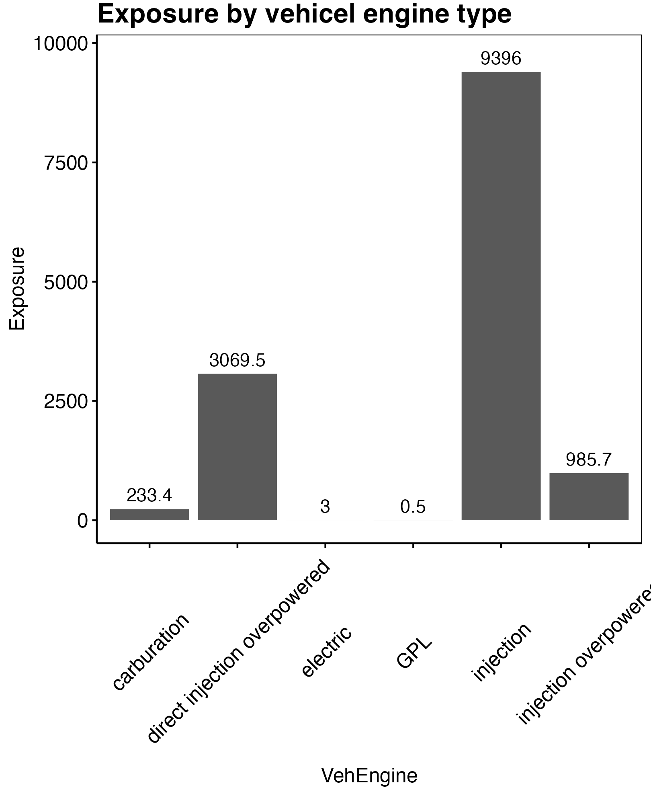

```{r setup, include=FALSE}
knitr::opts_chunk$set(echo = TRUE)
rm(list = ls())
library(knitr)
if (knitr::is_latex_output()) {
  knitr::opts_chunk$set(
    fig.show = 'hide',
    echo = TRUE,
    warning=FALSE,
    message = FALSE
  )
} else {
  knitr::opts_chunk$set(
    warning=FALSE,
    message = FALSE
  )
}
theme_custom <- function() {
  
  theme_minimal() %+replace%
    
    theme(
      
      panel.grid.major = element_blank(),
      panel.grid.minor = element_blank(),
      panel.border = element_rect(colour = "black", fill=NA),
      axis.ticks = element_line(),
      #axis.line.x = element_line(color = "#C5C5C5"),
      axis.line = element_line(color = "black"),
      #axis.ticks = element_blank(),
      legend.position = "bottom",
      legend.title = element_blank(),
      #plot.background = element_rect(fill='transparent', color=NA),
      
      plot.title = element_text(             #title
                   #family = font,            #set font family
                   size = 16,                #set font size
                   face = 'bold',            #bold typeface
                   hjust = 0,                #left align
                   vjust = 2,
                   color = "black"),               #raise slightly
      
      plot.subtitle = element_text(          #subtitle
                   #family = font,            #font family
                   size = 12,
                   hjust = 0,
                   color = "black"),               #font size
      
      plot.caption = element_text(           #caption
                   #family = font,            #font family
                    face = "italic",
                   size = 8,                 #font size
                   hjust = 1,
                   color = "black"),               #right align
      
      axis.title = element_text(             #axis titles
                   #family = font,            #font family
                   size = 12,
                   color = "black"),               #font size
      
      axis.text = element_text(              #axis text
                   #family = font,            #axis famuly
                   size = 12,
                   color = "black"),                #font size
      
      axis.text.x = element_text(            #margin for axis text
                    margin=margin(5, b = 10))
      
    )
}
```

# Getting familiar with the data

```{r,echo = FALSE}
library(CASdatasets)
library(lattice)
library(evmix)
library(ggplot2)
library(mlr3)
library(mlr3learners)
library(dbarts)
library(mlr3mbo)
library(mlr3measures)
library(mlr3tuning)
library(ranger)
library(mlr3viz)
library(fastDummies)
library(dplyr)
library(patchwork)
library(xgboost)
library(glex) #remotes::install_github("PlantedML/glex")
library(treeshap) #devtools::install_github('ModelOriented/treeshap')
library(kableExtra)
data("freMPL1")
```

The data we use in this project is on the form of a table where out main objective is model the claim size $Y_i$ given the explanatory variables $X_i$ in the table. In particular, we want to construct an estimator that predicts an expecected claim size given the information available i.e. the quantity $\mathbb E[Y\ \vert\ X]$.

\begin{wrapfigure}{r}{0.50\textwidth}
  \begin{center}
    \includegraphics[width=0.48\textwidth]{figures/plot1.png}
  \end{center}
  \caption{Histogram of the variable `ClaimAmount`.}
\end{wrapfigure}

**Missing values.** As with any statistical modelling we start by doing some exploratory analysis of the data `freMPL1`. As it was seen in the previous section, the number of variables (columns) missing datapoints were only one. The one in question is `RecordEnd` which has `r sum(is.na(freMPL1$RecordEnd))` out of `r dim(freMPL1)[1]` missing values. This does not bather us since we have the variable `Exposure` giving the time difference between `RecordBeg` and `RecordEnd` in calendar years. Furthermore we have that `RecordBeg` ranges from `r min(freMPL1$RecordBeg)` to `r max(freMPL1$RecordBeg)` and `RecordBeg + 365.25*Exposure` being at most `r max(freMPL1$RecordBeg+ freMPL1$Exposure*365.25)` meaning that all contracts span within the year 2004. Assuming no seasonality trends this would incentivice us to remove the two variables `RecordBeg` and `RecordEnd`.

```{r, echo = FALSE, out.width="75%",fig.align='center',warning=FALSE}
p <- ggplot(data=freMPL1[freMPL1$ClaimAmount != 0 & freMPL1$ClaimAmount < 10000,], aes(x=ClaimAmount)) + 
  geom_histogram(col = 'black', fill = 'white', bins = 100) + 
  geom_vline(xintercept = 0, col = 'red') + theme_custom() +
  labs(title = "Histogram of ClaimAmount (excluding zeros)",
       y = "Count")
ggsave("figures/plot1.png",bg='transparent',plot = p, height = 1080,width = 1620, units="px")
#knitr::include_graphics("figures/plot1.png")
```

**ClaimAmount and ClaimInd.** The variable of interest, `ClaimAmount`, excibits a strange behaviour as it contains `r sum(freMPL1$ClaimAmount <0)` strictly negative values. This is seen in figure 1. As this does not intuitively makes sense we will set these values as zero and ensure that the `ClaimInd` reflects this change.

```{r, echo = FALSE, results='hide'}
p <- freMPL1 %>% group_by(VehEngine) %>%
  summarise(
    Exposure = sum(Exposure)
  ) %>%
  ggplot(data=., aes(x=VehEngine, y = Exposure)) + geom_col() + theme_custom() +
  theme(axis.text.x = element_text(angle = 45)) +
  geom_text(aes(x = VehEngine, y= Exposure+300, label = round(Exposure,1))) +
  labs(title = "Exposure by vehicel engine type")
ggsave("figures/plot2.png",bg='transparent',plot = p, height = 1980,width = 1620, units="px")
#
#table(freMPL1$VehEngine,freMPL1$VehEnergy)

p <- freMPL1 %>% group_by(SocioCateg = substr(SocioCateg,4,5)) %>%
  summarise(
    Exposure = sum(Exposure)
  ) %>% 
  ggplot(data=., aes(x=SocioCateg, y = Exposure)) + geom_col() + theme_custom() +
  theme(axis.text.x = element_text(angle = 90)) +
  geom_text(aes(x = SocioCateg, y= Exposure+300, label = round(Exposure,1)),angle = 90) +
  labs(title = "Exposure by social class type")
ggsave("figures/plot3.png",bg='transparent',plot = p, height = 1980,width = 1620, units="px")

tmp <- table(SocioCateg = substr(freMPL1$SocioCateg,4,5)) %>% as.data.table()
tmp$SocioCateg <- as.numeric(tmp$SocioCateg)
tmp <- tmp %>% arrange(SocioCateg) %>%
  mutate(cumsum = cumsum(N))
p <- ggplot(tmp) + geom_line(aes(x=SocioCateg,y=cumsum)) + theme_custom() +
  labs(title = "Distribution of SocioCateg")
ggsave("figures/plot4.png",bg='transparent',plot = p, height = 1080,width = 1620, units="px")

p <- freMPL1 %>% group_by(VehPrice) %>%
  summarise(
    Exposure = sum(Exposure)
  ) %>%
  ggplot(data=., aes(x=VehPrice, y = Exposure)) + geom_col() + theme_custom() +
  theme(axis.text.x = element_text(angle = 0)) +
  geom_text(aes(x = VehPrice, y= Exposure+100, label = round(Exposure,1)),angle = 90) +
  labs(title = "Exposure by vehicle price")
ggsave("figures/plot5.png",bg='transparent',plot = p, height = 1980,width = 1620, units="px")

p <- freMPL1 %>% group_by(VehMaxSpeed) %>%
  summarise(
    Exposure = sum(Exposure)
  ) %>%
  ggplot(data=., aes(x=VehMaxSpeed, y = Exposure)) + geom_col() + theme_custom() +
  theme(axis.text.x = element_text(angle = 45)) +
  geom_text(aes(x = VehMaxSpeed, y= Exposure+150, label = round(Exposure,1)),angle = 90) +
  labs(title = "Exposure by vehicle max speed")
ggsave("figures/plot6.png",bg='transparent',plot = p, height = 1980,width = 1620, units="px")

p <- freMPL1 %>% group_by(VehBody) %>%
  summarise(
    Exposure = sum(Exposure)
  ) %>%
  ggplot(data=., aes(x=VehBody, y = Exposure)) + geom_col() + theme_custom() +
  theme(axis.text.x = element_text(angle = 45)) +
  geom_text(aes(x = VehBody, y= Exposure+500, label = round(Exposure,1)),angle = 90) +
  labs(title = "Exposure by vehicle body")
ggsave("figures/plot7.png",bg='transparent',plot = p, height = 1980,width = 1620, units="px")
```

**VehEngine and VehEnergy.** *(Vehicle specific, 1)* Regarding the categorical variables we notice that some levels is has sparse data. The variables `VehEngine` and `VehEnergy` has both the levels `GPL` and `electric`. We do however not have any substantial datapoints as in total these levels contain `r sum(freMPL1$VehEngine %in% c("electric","GPL"))` observations. As the total dataset has `r dim(freMPL1)[1]` observations in total we choose to remove these observations.

\begin{figure}[h]
    \centering
    \subfloat[\centering]{{\includegraphics[width=0.25\textwidth]{figures/plot5.png} }}
    \qquad
    \subfloat[\centering]{{\includegraphics[width=0.25\textwidth]{figures/plot6.png} }}
    \qquad
    \subfloat[\centering]{{\includegraphics[width=0.25\textwidth]{figures/plot7.png} }}
    \caption{Exposure by respectively vehicle price (a), max speed (b) and body (c).}
\end{figure}

**VehPrice, VehMaxSpeed and VehBody.** *(Vehicle specific, 2)* In figure 2 we see that `VehPrice` is well represented in most price categories. We do however har a shorter supply of data in the tails. We will therefore combine the lowest three categories A through C, the levels R through T and lastly U through Z. Regarding to the vehicle max speed we see that a very few number of observations are in the lowest category `1-130 kmh`. We therefore combine the lowest level with the level `130-140 kmh`. The only vehicle body with very few observations is `bus` with only `r sum(freMPL1$VehBody == "bus")` observations. We do however see that `bus` act much like the category `sedan` with respect to frequency and severity and so these are combined under `sedan`.

**VehAge, VehUsage and VehClass.** *(Vehicle specific, 3)* The remaining three vehicle specific variable is well represented throughout all levels. The only scarce observation is `VehUsage` being `Professional run`. We therefore combine `Proffesional` and `Professional run` under `Professional`. We leave the remaining levels as is.

\begin{wrapfigure}{r}{0.40\textwidth}
  \begin{center}
    \includegraphics[width=0.38\textwidth]{figures/plot4.png}
  \end{center}
  \caption{Cummulative distribution of the variable `SocioCateg`.}
\end{wrapfigure}

**SocioCateg and Gender.** *(Socails)* When constructing a statistical model, one does not simply have to consider which variables have the most explanatory value but one also have to take into consideration the lawfullness of discriminating customors based on covariates as gender, race and so forth. It is common knowledge that insurance companies cannot discriminate based on gender and so we will not use the variable `gender` as explanatory variable even though it might improve the model predictions. The variable `SocioCateg` representing the socioeconomic status of the insured ranges between category 1 and 99. It is not at the moment clear whether this is a covariate that may be used in pricing, so we will prefer not using it. However, if it does indeed improve the fit without overfitting, we may get some additional information from this variable. The data is indicate that the custumors in general are in the category 50 with a few other levels having significant more observations than others. For this reason we combine the catagories from 1 to 49 into `A` and the catagories 51 to 99 into `C` and keep the category `B` as is.

**LicAge, DrivAge and MariStat.** *(Customer specific)* In general in France, one can acquire a drivers license at the age of 18 and so we have the obvious restriction `LicAge <= DrivAge - 18` and we will in general have that the license age will be approximately 18 years less than the drivers license. It is therefore reasonable to discuss whether to include both variables. We would however assume that for an older person the license age would be more important than for youngsters. Furthermore, we would assume that the `ClaimInd` and the `LicAge` are negative correlated. We will therefore include both. Both `Alone` and `Other` is well represented in `MariStat`.

**HasKmLimit, RiskVar, Garage and BonusMalus** *(Policy related and others)* The variables remaining HasKmLimit, RiskVar, Garage and BonusMalus are well represented throughout all levels and so no action is taken here.

```{r, echo=FALSE,message=FALSE,results='hide'}
A <- subset(freMPL1, select =c(Exposure,VehAge,Gender,MariStat,SocioCateg,VehUsage,HasKmLimit,BonusMalus,VehBody,VehPrice,VehEngine,VehEnergy,VehMaxSpeed,VehClass,RiskVar,Garage))
cp <- cor(data.matrix(na.omit(A)), method = "spearman")
ord <- rev(hclust(as.dist(1 - abs(cp)))$order)
colPal <- colorRampPalette(c("blue", "white","red"), space="rgb")(100)
png(filename = "figures/plot8.png", height = 1080,width = 1080, units="px",res=200)
levelplot(cp[ord, ord], xlab = "", ylab = "", col.regions = colPal,
          at = seq(-1,1, length.out=100),scales =list(x=list(rot=45), cex=0.8),
          panel=function(...) {
                       arg <- list(...)
                       panel.levelplot(...)
                       }, )
dev.off()
```

\begin{figure}[h]
  \begin{center}
    \includegraphics[width=0.48\textwidth]{figures/plot8.png}
  \end{center}
  \caption{Spearman correlation matrix.}
\end{figure}

**Correlations.** As discussed previously the age of the driver and the license age i very correlated and so one may consider whether or not both variables are needed. In practice we do however see that age and experience are used when modelling the premium. Secondly, we see that the covariates vehicle engine and energy are very correlated and also the three variables vehicle max speed, price and class are well correlated. Thirdly, we see that vehicle usage and socio category are correlated. This is likely because wealthier people more often have a car for professional use.

\newpage

# Modelling the technical premium

```{r, echo = FALSE,message = FALSE, warning=FALSE}
###### Feature selection and formatting
data("freMPL1",package = "CASdatasets")

#1: RecordBeg and RecordEnd discarded
freMPL1 <- freMPL1 %>%
  select(-RecordBeg,-RecordEnd)

#2: Add id's
freMPL1[,"ID"] <- 1:dim(freMPL1)[1]

#3: Claim amount and indicator
freMPL1$ClaimAmount[freMPL1$ClaimAmount<0] <- 0
freMPL1$ClaimInd <- ifelse(freMPL1$ClaimAmount>0,1,0)

#4: Electric or GPL vehicals
freMPL1 <- freMPL1 %>%
  filter(!(VehEngine %in% c("electric","GPL")))

#5: Combining price categories
levels(freMPL1$VehPrice)[1:3] <- "A-C"
n <- length(levels(freMPL1$VehPrice))
levels(freMPL1$VehPrice)[(n-5):n] <- "U-Z"
n <- length(levels(freMPL1$VehPrice))
levels(freMPL1$VehPrice)[(n-3):(n-1)] <- "R-T"

#6: Combining max speed levels
levels(freMPL1$VehMaxSpeed)[1:2] <- "1-140 kmh"

#7: Bus set to sedan
levels(freMPL1$VehBody)[levels(freMPL1$VehBody) == "bus"] <- "sedan"

#8: SocioCateg change levels
freMPL1 <- freMPL1 %>%
  #Get numerical value of SocioCateg
  mutate(helper = as.numeric(substr(SocioCateg,4,5))) %>%
  #Overwrite SocioCateg 
  mutate(SocioCateg = factor(ifelse(helper > 50, "C",
                                    ifelse( helper < 50, "A",
                                            "B")),
                             levels = c("A","B","C"))) %>%
  select(-helper)

#Create df
df <- freMPL1
#Catagorical variables
cat_variables <- c("Gender","VehAge","MariStat","SocioCateg",
                   "VehUsage","HasKmLimit","VehBody","VehPrice","VehEngine",
                   "VehEnergy","VehMaxSpeed","VehClass","RiskVar","Garage")
for (col in cat_variables) {
  #Get ordering
  ord <- freMPL1 %>% 
    #Group by distinct values
    group_by(!!as.name(col)) %>%
    #Calculate frequency and mean claim
    summarise(Frequency = sum(ClaimInd)/sum(Exposure),
              Severity = sum(ClaimAmount)/sum(ClaimAmount > 0)) %>%
    ungroup() %>%
    #Order Frequency
    arrange(Frequency) %>%
    #Insert 0,...,n
    mutate(Frequency = 0:(length(unique(!!as.name(col)))-1)) %>%
    #Order Severity
    arrange(Severity) %>%
    #Insert 0,...,n
    mutate(Severity = 0:(length(unique(!!as.name(col)))-1))
  #Prepare ord for merging
  colnames(ord)[2:3] <- paste0(col, c("_Freq","_Sev"))
  
  #Merge new columns into df
  df <- df %>%
    merge(., ord, all.x = TRUE)
}

##### Make data frames
#Get relevant columns
sev_columns <- colnames(df)[!grepl("_Freq",colnames(df)) &
                              !(colnames(df) %in% cat_variables)]
df_sev <- df[,sev_columns] %>%
  filter(ClaimInd == 1) %>%
  select(-ClaimInd,-Exposure)
#Save ID in row names
row.names(df_sev) <- df_sev$ID
df_sev <- df_sev %>%
  select(-ID) %>%
  mutate_if(is.integer, as.numeric)

#Get relevant columns
freq_columns <- colnames(df)[!grepl("_Sev",colnames(df)) &
                              !(colnames(df) %in% cat_variables)]
df_freq <- df[,freq_columns] %>%
  select(-ClaimAmount) %>%
  mutate(ClaimInd = factor(ClaimInd, levels = c(0,1)))
#Save ID in row names
row.names(df_freq) <- df_freq$ID
df_freq <- df_freq %>%
  select(-ID) %>%
  mutate_if(is.integer, as.numeric)

##### Hyperparameters
#Severity parameters
#sev_xgb_learner_instance <- readRDS("rds/sev_xgb_learner_instance.rds")
#Frequency parameters
#freq_xgb_learner_instance <- readRDS("rds/freq_xgb_learner_instance.rds")

##### Training XGBoost
##### Severity
#Partition for training
indicies <- function(size,ratio){
  set.seed(20230328) #We choose a seed
  train <- sort(sample(1:size,ceiling(size*ratio),replace = FALSE))
  test <- (1:size)[!(1:size %in% train)]
  return(list(train = train, test = test))
}
set.seed(20230328) #We choose a seed
splits <- indicies(dim(df_sev)[1],0.85)
#Split covariates and truth
regr_data_train <- list(
  covariates = as.matrix(df_sev[splits$train,] %>% select(-ClaimAmount)),
  truth = as.numeric(df_sev$ClaimAmount[splits$train])
)
regr_data_test <- list(
  covariates = as.matrix(df_sev[splits$test,] %>% select(-ClaimAmount)),
  truth = as.numeric(df_sev$ClaimAmount[splits$test])
)
#Fit model using hyperparameters
xgb_regr_train <- readRDS("rds/xgb_regr_train.rds")

#Split covariates and truth
regr_data <- list(
  covariates = as.matrix(df_sev %>% select(-ClaimAmount)),
  truth = as.numeric(df_sev$ClaimAmount)
)
#Fit model using hyperparameters
xgb_regr <- readRDS("rds/xgb_regr.rds")

##### Frequency
#Partition for training
set.seed(20230328) #We choose a seed
splits <- indicies(dim(df_freq)[1],0.85)
#Split covariates and truth
freq_data_train <- list(
  covariates = as.matrix(df_freq[splits$train,] %>% select(-ClaimInd)),
  truth = as.numeric(as.character(df_freq$ClaimInd[splits$train]))
)
freq_data_test <- list(
  covariates = as.matrix(df_freq[splits$test,] %>% select(-ClaimInd)),
  truth = as.numeric(as.character(df_freq$ClaimInd[splits$test]))
)
#Fit model using hyperparameters
xgb_freq_train <- readRDS("rds/xgb_freq_train.rds")

#Split covariates and truth
freq_data <- list(
  covariates = as.matrix(df_freq %>% select(-ClaimInd)),
  truth = as.numeric(as.character(df_freq$ClaimInd))
)
#Fit model using hyperparameters
xgb_freq <- readRDS("rds/xgb_freq.rds")

### Plot of test data truth vs predictions
plotdf <- data.frame(truth = regr_data_test$truth,
                     prediction = predict(xgb_regr_train, newdata = regr_data_test$covariates))
p <- ggplot(plotdf) + geom_point(aes(x=prediction, y = truth)) +
  scale_x_continuous(trans = "log10",limits = c(0.5,200000),breaks = 10**(0:5)) +
  scale_y_continuous(trans = "log10",limits = c(0.5,200000),breaks = 10**(0:5)) + 
  geom_abline(slope=1,intercept = 0, col = "red")+ theme_custom() +
  labs(title = "XGBoost predictions vs. truth")
ggsave("figures/sev_p1.png",bg='transparent',plot = p, height = 1620*3/4,width = 1980*3/4, units="px")
p <- ggplot(plotdf) + geom_histogram(aes(x=prediction,y = ..density..), bins = 75, fill = "gray",col = "black") +
  #geom_density(aes(x=prediction)) +
  geom_density(aes(x=truth),col = "red") +
  scale_x_continuous(trans = "log10",limits = c(0.5,200000),breaks = 10**(0:5)) +
  theme_custom() +
  labs(title = "Distribution of respose and truth")
ggsave("figures/sev_p2.png",bg='transparent',plot = p, height = 1620*3/4,width = 1980*3/4, units="px")

### Plot violins
plotdf <- data.frame(response = predict(xgb_freq_train, newdata = freq_data_test$covariates),
                     truth = freq_data_test$truth)
p <- ggplot(plotdf,aes(x=factor(truth),y=response)) + geom_violin() +
  geom_boxplot(width=0.1)+
  ylim(0,1.5) + theme_custom() +
  labs(
    title = "Distribution of predicted frequencies",
    x = "truth (ClaimInd)",
    y= "prob"
  )
ggsave("figures/freq_p1.png",bg='transparent',plot = p, height = 1980*3/4,width = 1980*3/4, units="px")
```

The technical premium is based upon a frequency/severity model. We have the base model assumptions as: Let $Y:=Y_{t+\Delta t}$ be the claim risen by a policy during the interval $[t,t+\Delta t)$ with $\Delta t$ representing the exposure. Notice that in princible $\Delta t$ is a stopping time defined as

$$
\Delta t := \min\big(1,\inf\{s\ge t : Y_s>0\}\big),
$$
meaning the policy is terminated at the time $t+\Delta t$ with $t+\Delta t=t+1$ if $Y=0$. Notice that the exposure is censored if $\Delta t_i<1$ and $Y_i=0$. We furthermore have the covariates $X\in \mathcal X$ with $\mathcal X$ being a $p$-dimensional space. We are interested in the object $\mathbb E[Y\ \vert\ X]$ being the expected claim risen given the covariates $X$. Our main assumption is that this expectation is decomposed into

$$
\mathbb E[Y\ \vert\ X]=\mathbb E[Y1_{Y>0}\ \vert\ X]=\mathbb E[Y\ \vert\ X,1_{Y>0}]\cdot \mathbb E[1_{Y>0}\ \vert\ X]=\mu_X\cdot p_X,
$$

where $\mu_X$ is the expected claim in the event, that a claim arises i.e. the severity and $p_X$ is the probability that a claim arises i.e. the frequency. However since the data is censored with exposure $\tilde{\Delta t}\le \Delta t$ we need to consider how we may translate a predictive model into a price function for new policies. In practice, we include exposure as a covariate.

We will search for the most efficient estimators for both the severity and frequency. We will denote these estimators by $m_\mu(X)$ and $m_p(X)$ where we will denote the model by a superscript $m^{(*)}_j$ with $*$ denoting the model for $j=\mu,p$.

## Severity

\begin{figure}[h]
    \centering
    \subfloat[\centering]{{\includegraphics[width=0.45\textwidth]{figures/sev_p1.png} }}
    \qquad
    \subfloat[\centering]{{\includegraphics[width=0.45\textwidth]{figures/sev_p2.png} }}
    \caption{(a): Predictions from the model with y being the actual value and x being the estimate. The red line represent the mapping $y=x$. (b): Distribution of the response and actual values. The red density function represents the empirical density of the test data set.}
\end{figure}

We fit a XGBoost estimator to the dataset where we only consider the non-zero claims. The distribution of the claim is rather heavy tailed as most claims are relative small but some claims have the potential of being large. If we fit a gamma distribution to the entire dataset, we see that the claim amount appear to be gamma distributed with shape 0.51 and scale 4681. As such it would be appropriate to use the log link function when fitting the parameters by setting `objective = "reg:gamma"`. This means that the estimator $m_\mu(X)$ takes the form

$$
\log(\mathbb E[Y\ \vert\ X,Y>0])=m_\mu(X).
$$

Since XGBoost is a tree based algorithm with estimator $\hat m_\mu(X) = \sum_{i=1}^k \hat f_k(X)$ we have the decomposition

$$
\mathbb E[Y\ \vert\ X,Y>0] \approx\exp\left(\sum_{i=1}^k \hat f_k(X)\right) =\prod_{i=1}^k\exp\left(\hat f_k(X)\right),
$$

where $k$ is the weak leaner (`nrounds`). By using the package `mlr3` and the root mean squared loss we can estimate the hyperparameters: leaning rate $\eta$, depth and number og trees $k$. This is done using 5-fold cross validation with 1000 evals. Using the hyperparameters the model is fitted to the dataset.

In the figure above it can be seen how the model does on the training set using a model fitted to 85% randomly chosen datapoints. The model seem to predict well and we see a symmetry around $y=x$. I does however seem as though the estimates have less variance than the actual claim amounts (see the (b) figure).

## Frequency

\begin{wrapfigure}{r}{0.50\textwidth}
  \begin{center}
    \includegraphics[width=0.48\textwidth]{figures/freq_p1.png}
  \end{center}
  \caption{A combined boxplot and violin plot of the distribution of the predicted probability for respectively the non claim (left) and claim (right) policies.}
\end{wrapfigure}

The frequency is modeled using the `xgboost` packages. The claims is assumed to arrive poisson distributed given the covariates $X$ and so the XGBoost estimator is fitted with `objective = "count:poisson"`. This implements the log-link function and optimizes using the gradient of the poisson deviance.

Like in the case of the severity model we have the same log link function and so for trees $1,...,l$ we will have the estimate

$$
\mathbb E[1_{Y>0}\ \vert\ X]\approx\prod_{i=1}^l\exp(g_i(X)).
$$

In the figure on the right, we see that the algorithm fit higher probabilities (frequencies) to policies that actually happened to raise a claim.

## Initial estimate of the technical premium

The technical price is given by the product

$$
\pi=\mu_X\cdot p_X.
$$

Notice that the length of the contract i.e. the exposure is used as a covariate in the frequency/severity model, and so the effect of longer contracts is already priced in. By default new contracts are sold with a yearly length, however in the case of estimating on the dataset we use the given `Exposure`. Up untill now we have used the protected feature gender in the estimate, so we start by fitting a biased estimate

$$
\hat \pi^{(biased)}(X)=\hat m_\mu^{(biased)}(X)\cdot\hat m_p^{(biased)}(X).
$$

We can apply the technical price onto the dataset `df` by running the following code:

```{r}
# Estimating mu
sev_covariates <- df[,sev_columns] %>%
  select(-ClaimInd,-ID,-ClaimAmount,-Exposure)
sev_covariates <-  as.matrix(sev_covariates)
m_mu <- predict(xgb_regr, newdata = sev_covariates)
# Estimating p
freq_covariates <- df[,freq_columns] %>%
  select(-ClaimInd,-ID,-ClaimAmount)
freq_covariates <- as.matrix(freq_covariates)
m_p <- predict(xgb_freq_train, newdata = freq_covariates)
freq_covariates[,"Exposure"] <- 1
m_p_2 <- predict(xgb_freq_train, newdata = freq_covariates)
# Inserting estimates
df[,"pi_hat"] <- m_mu * m_p
df[,"mu_hat"] <- m_mu
df[,"p_hat"] <- m_p
df[,"p_hat_new"] <- m_p_2
df[,"pi_hat_new"] <- m_mu * m_p_2
```

We can summarize the models predictions on the policies below.

```{r,echo=FALSE}
options(scipen = 999)
tbl <- df %>% 
  mutate(Exposure_2 = 1,mu_hat_2= mu_hat) %>%
  select(ID,Gender,Exposure,p_hat,mu_hat,pi_hat,Exposure_2,p_hat_new,mu_hat_2,pi_hat_new) %>%
  filter(ID %in% c(6254,24123,25010,25188,30495,30555)) %>%
  mutate_if(is.numeric, format, digits=3,nsmall = 0) %>%
  arrange(ID)
colnames(tbl) <- c(
  "Policy","Gender",
  "Exposure","p(Y>0)","E(Y|Y>0)","Price",
  "Exposure","p(Y>0)","E(Y|Y>0)","Price"
)
tbl %>%
  kbl(., longtable = T, booktabs = T, caption = "Comparing premiums") %>%
  add_header_above(c(" " = 2,"Actual" = 4, "Extrapolated" = 4)) %>%
  kable_styling(latex_options = c("repeat_header", "hold_position"))
```

In the table above we have altered the dataset with exposure set to 1 for all rows, to predict the price of a new contract i.e. with exposure of one year. One sees that the prices for the new contracts are larger than the technical price for the historical as the exposure is larger. Furthermore as expected we see that the estimate $\hat \mu_X$ does not depend on the exposure.

\newpage

# Decomposing the estimates

```{r,echo = FALSE}
### Severity
unified_xgb_regr <- xgboost.unify(xgb_regr,
                                  data=sev_covariates)

update_data <- FALSE
if (update_data == TRUE) {
  treeshap_xgb_regr <- treeshap(unified_xgb_regr,
                                sev_covariates,
                                verbose = 0)
  saveRDS(treeshap_xgb_regr, file = "rds/treeshap_xgb_regr.rds")
} else {
  treeshap_xgb_regr <- readRDS("rds/treeshap_xgb_regr.rds")
}

pols <- c(6254,24123,25010,25188,30495,30555)
plots <- lapply(pols, function(pol) {
  obsnr <- as.integer(row.names(df)[df$ID == pol])
  p <- plot_contribution(treeshap_xgb_regr,obs= obsnr,explain_deviation = TRUE,
                    title = paste0("SHAP Break-Down, policy ",pol))
  return(p)
})
p <- ggpubr::ggarrange(plotlist = plots, ncol= 3,nrow = 2)
ggsave("figures/sev_shap_breakdown.png",bg='transparent',plot = p, height = 1980*2*3/4,width = 1980*3, units="px")
plotdf <- treeshap_xgb_regr$shaps
colnames(plotdf) <- paste0(colnames(plotdf),"_shap")
colnames(plotdf) <- gsub("_Sev","",colnames(plotdf))
fac_cols <- colnames(treeshap_xgb_regr$observations,plotdf)[grepl("_Sev",colnames(treeshap_xgb_regr$observations,plotdf))]
num_cols <- colnames(treeshap_xgb_regr$observations,plotdf)[!(colnames(treeshap_xgb_regr$observations,plotdf) %in% fac_cols)]
fac_cols <- gsub("_Sev","",fac_cols)
plotdf <- cbind(plotdf, df[,c(fac_cols,num_cols)])
plots <- lapply(fac_cols, function(col) {
  tmp <- plotdf
  tmp[,"x"] <- factor(tmp[,col])
  tmp[,"y"] <- tmp[,paste0(col,"_shap")]
  p <- ggplot(tmp,aes(x=x,y=y)) + geom_violin() +
    geom_boxplot(width=0.1)+ theme_custom()+
    labs(x = col, y = "SHAP",
         title = paste0("SHAP breakdown of ",col)) +
    theme(axis.text.x = element_text(angle = 45))
  return(p)
})
p <- ggpubr::ggarrange(plotlist = plots, ncol= 3,nrow = 5)
ggsave("figures/sev_shap_fac_breakdown.png",bg='transparent',plot = p, height = 1980*4,width = 1980*3.5, units="px")
plots <- lapply(num_cols, function(col) {
  tmp <- plotdf
  tmp[,"x"] <- tmp[,col]
  tmp[,"y"] <- tmp[,paste0(col,"_shap")]
  p <- ggplot(tmp,aes(x=x,y=y,col = Gender)) + geom_point() + geom_smooth() + theme_custom()+
    labs(x = col, y = "SHAP",
         title = paste0("SHAP breakdown of ",col)) 
  return(p)
})
p <- ggpubr::ggarrange(plotlist = plots, ncol= 1,nrow = 3)
ggsave("figures/sev_shap_num_breakdown.png",bg='transparent',plot = p, height = 1980*4*3/5,width = 1980*3.5*1/2, units="px")
tmp <- data.frame(
  Variable = c(fac_cols,num_cols),
  Importance = sapply(c(fac_cols,num_cols), function(col) { mean(abs(plotdf[,paste0(col,"_shap")])) }),
  Importance_up = sapply(c(fac_cols,num_cols), function(col) { mean(pmax(0,plotdf[,paste0(col,"_shap")])) }),
  Importance_down = sapply(c(fac_cols,num_cols), function(col) { mean(pmax(0,-plotdf[,paste0(col,"_shap")]))}),
  Col = ifelse(c(fac_cols,num_cols) == "Gender","Gender","Others")
) %>% arrange(Importance) %>%
  mutate(Variable = factor(Variable, levels = Variable))
tmp2 <- tmp %>% select(-Importance,-Col) %>%
  reshape2::melt(.,id.vars = "Variable") %>%
  mutate(Col = ifelse(Variable == "Gender","Gender","Others"))
#p <- ggplot(tmp,aes(x=Importance,y=Variable,fill = Col)) +
#  geom_col() + scale_fill_manual(values = c("darkblue","lightgray")) +
#  theme_custom() + theme(legend.position = "none",axis.title.y = element_blank())
p <- ggplot(tmp2,aes(x= value, y= Variable, fill = paste0(variable,Col))) + geom_col() +
  scale_fill_manual(values = c("darkred","pink","darkgreen","lightgreen"))  +
  theme_custom() + theme(legend.position = "none",axis.title.y = element_blank()) +
  labs(x = "Importance")
ggsave("figures/sev_shap_importance.png",bg='transparent',plot = p, height = 1980*3/5,width = 1980*3/4, units="px")

### Frequency
unified_xgb_freq <- xgboost.unify(xgb_freq,
                                  data=freq_covariates)

if (update_data == TRUE) {
  treeshap_xgb_freq <- treeshap(unified_xgb_freq,
                                freq_covariates,
                                verbose = 0)
  saveRDS(treeshap_xgb_freq, file = "rds/treeshap_xgb_freq.rds")
} else {
  treeshap_xgb_freq <- readRDS("rds/treeshap_xgb_freq.rds")
}

#plot_contribution(treeshap_xgb_freq, obs = 6254)
pols <- c(6254,24123,25010,25188,30495,30555)
plots <- lapply(pols, function(pol) {
  obsnr <- as.integer(row.names(df)[df$ID == pol])
  p <- plot_contribution(treeshap_xgb_freq,obs= obsnr,explain_deviation = TRUE,
                    title = paste0("SHAP Break-Down, policy ",pol))
  return(p)
})
p <- ggpubr::ggarrange(plotlist = plots, ncol= 3,nrow = 2)
ggsave("figures/freq_shap_breakdown.png",bg='transparent',plot = p, height = 1980*2*3/4,width = 1980*3, units="px")
plotdf <- treeshap_xgb_freq$shaps
colnames(plotdf) <- paste0(colnames(plotdf),"_shap")
colnames(plotdf) <- gsub("_Freq","",colnames(plotdf))
fac_cols <- colnames(treeshap_xgb_freq$observations,plotdf)[grepl("_Freq",colnames(treeshap_xgb_freq$observations,plotdf))]
num_cols <- colnames(treeshap_xgb_freq$observations,plotdf)[!(colnames(treeshap_xgb_freq$observations,plotdf) %in% fac_cols)]
fac_cols <- gsub("_Freq","",fac_cols)
plotdf <- cbind(plotdf, df[,c(fac_cols,num_cols)])
plots <- lapply(fac_cols, function(col) {
  tmp <- plotdf
  tmp[,"x"] <- factor(tmp[,col])
  tmp[,"y"] <- tmp[,paste0(col,"_shap")]
  p <- ggplot(tmp,aes(x=x,y=y)) + geom_violin() +
    geom_boxplot(width=0.1)+ theme_custom()+
    labs(x = col, y = "SHAP",
         title = paste0("SHAP breakdown of ",col)) +
    theme(axis.text.x = element_text(angle = 45))
  return(p)
})
p <- ggpubr::ggarrange(plotlist = plots, ncol= 3,nrow = 5)
ggsave("figures/freq_shap_fac_breakdown.png",bg='transparent',plot = p, height = 1980*4,width = 1980*3.5, units="px")
plots <- lapply(num_cols, function(col) {
  tmp <- plotdf
  tmp[,"x"] <- tmp[,col]
  tmp[,"y"] <- tmp[,paste0(col,"_shap")]
  p <- ggplot(tmp,aes(x=x,y=y,col = Gender)) + geom_point() + geom_smooth() + theme_custom()+
    labs(x = col, y = "SHAP",
         title = paste0("SHAP breakdown of ",col)) 
  return(p)
})
p <- ggpubr::ggarrange(plotlist = plots, ncol= 2,nrow = 2)
ggsave("figures/freq_shap_num_breakdown.png",bg='transparent',plot = p, height = 1980*4*3/5,width = 1980*3.5*1/2, units="px")
tmp <- data.frame(
  Variable = c(fac_cols,num_cols),
  Importance = sapply(c(fac_cols,num_cols), function(col) { mean(abs(plotdf[,paste0(col,"_shap")])) }),
  Importance_up = sapply(c(fac_cols,num_cols), function(col) { mean(pmax(0,plotdf[,paste0(col,"_shap")])) }),
  Importance_down = sapply(c(fac_cols,num_cols), function(col) { mean(pmax(0,-plotdf[,paste0(col,"_shap")]))}),
  Col = ifelse(c(fac_cols,num_cols) == "Gender","Gender","Others")
) %>% arrange(Importance) %>%
  mutate(Variable = factor(Variable, levels = Variable))
tmp2 <- tmp %>% select(-Importance,-Col) %>%
  reshape2::melt(.,id.vars = "Variable") %>%
  mutate(Col = ifelse(Variable == "Gender","Gender","Others"))
#p <- ggplot(tmp,aes(x=Importance,y=Variable,fill = Col)) +
#  geom_col() + scale_fill_manual(values = c("darkblue","lightgray")) +
#  theme_custom() + theme(legend.position = "none",axis.title.y = element_blank())
p <- ggplot(tmp2,aes(x= value, y= Variable, fill = paste0(variable,Col))) + geom_col() +
  scale_fill_manual(values = c("darkred","pink","darkgreen","lightgreen"))  +
  theme_custom() + theme(legend.position = "none",axis.title.y = element_blank()) +
  labs(x = "Importance")
ggsave("figures/freq_shap_importance.png",bg='transparent',plot = p, height = 1980*3/5,width = 1980*3/4, units="px")

# plot a tree
#https://www.r-bloggers.com/2021/04/how-to-plot-xgboost-trees-in-r/
#xgb.plot.tree(model = xgb_regr, trees = 100)
#xgb.plot.tree(model = xgb_freq, trees = 0)
tree_preds <- data.frame(it = 1:2345)
n <- 10
for (i in 1:2345) {
  tree_preds[i,2:(n+1)] <- predict(xgb_regr, sev_covariates[1:n,], iterationrange=c(1,i+1))
}
plotdf <- tree_preds %>% reshape2::melt(., id.vars = "it")
p <- ggplot(plotdf) + geom_line(aes(x = it, y = value, col = variable)) + theme_custom() +
  theme(legend.position = "none") +
  labs(title = "Severity model, convergence",
       x = "Number of trees", y = "Estimate")
ggsave("figures/sev_tree_converge.png",bg='transparent',plot = p, height = 1980*3/4,width = 1980, units="px")
tree_preds <- data.frame(it = 1:4986)
n <- 10
for (i in 1:4986) {
  tree_preds[i,2:(n+1)] <- predict(xgb_freq, freq_covariates[1:n,], iterationrange=c(1,i+1))
}
plotdf <- tree_preds %>% reshape2::melt(., id.vars = "it")
p <-ggplot(plotdf) + geom_line(aes(x = it, y = value, col = variable)) + theme_custom() +
  theme(legend.position = "none") +
  labs(title = "Frequency model, convergence",
       x = "Number of trees", y = "Estimate") 
ggsave("figures/freq_tree_converge.png",bg='transparent',plot = p, height = 1980*3/4,width = 1980, units="px")
```

When fitting a algorithm such as XGBoost it can be difficult to interpret how, when it comes to pricing, the model is affected by the risk factors $X$. Certainly, one could try to uncover the dynamics of the algorithm by studying the structure of the trees and making an outline of all leaves. However since most models consist of hundreds if not thousand of trees this task would be tidies and even though this is possible one would probably be left with more new questions than the ones answered. 

\begin{figure}[h]
    \centering
    \subfloat[\centering]{{\includegraphics[width=0.45\textwidth]{figures/tree_1.png} }}
    \qquad
    \subfloat[\centering]{{\includegraphics[width=0.45\textwidth]{figures/tree_2.png} }}
    \caption{(a): Tree number 101 in $\hat m^{(biased)}_\mu(X)$. (b): Tree number 1 in $\hat m^{(biased)}_p(X)$.}
\end{figure}

Above one can see how one selected tree from either one of the decision trees of $\hat m^{(biased)}_\mu$ and $\hat m^{(biased)}_p$ contribute to the estimate. For instance for the severity model we see that the space $\mathcal X$ is separated into four leaves where the estimate up until tree number 100 will be increased with a factor of $\exp(\hat f_k(X))$. To be specific we see that

\begin{align*}
\exp(\hat f_k(X))=\begin{cases}
  1+1.39\cdot 10^{-3} & \text{if}\qquad  \text{LicAge}<438.5\\
  1+184.12\cdot 10^{-3} & \text{if}\qquad  438.5\le \text{LicAge}<439.5\\
  1-161.40\cdot 10^{-3} & \text{if}\qquad  \text{LicAge}\ge 439.5\text{ and MariStat\_Sev}=0\\
  1-4.44\cdot 10^{-3} & \text{if}\qquad \text{LicAge}\ge 439.5\text{ and MariStat\_Sev}=1
\end{cases}
\end{align*}

Likewise we see that the frequency model changes the estimates with a factor of

\begin{align*}
\exp(\hat g_k(X))=\begin{cases}
  1-52.46\cdot 10^{-3} & \text{if}\qquad  \text{Exposure}<0.1215\\
  1-46.67\cdot 10^{-3} & \text{if}\qquad 0.1215\le \text{Exposure}<0.4225\\
  1-40.58\cdot 10^{-3} & \text{if}\qquad  0.4225\le \text{Exposure}<0.6875\\
  1-34.10\cdot 10^{-3} & \text{if}\qquad  0.6875\le \text{Exposure}
\end{cases}
\end{align*}

The reader will notice that exposure is the first variable used in improving the estimate indicating the the probability of an insurance event is highly correlated with the amount of exposure. This is consistent with the assumption that the number of claims is poisson distributed and claims arrives as a poisson count process.

\begin{figure}[h]
    \centering
    \subfloat[\centering]{{\includegraphics[width=0.45\textwidth]{figures/sev_tree_converge.png} }}
    \qquad
    \subfloat[\centering]{{\includegraphics[width=0.45\textwidth]{figures/freq_tree_converge.png} }}
    \caption{Convergence of estimator for the first 10 policies.}
\end{figure}

Running through every step we can plot how the model estimate approaches a value for each added tree. Above we see how the algorithm predicts the first 10 policies by applying the improvement $\exp(\hat f_k(X))$ for $k=1,...,K$ and $\exp(\hat g_l(X))$ for $l=1,...,L$ for the two estimator. This picture gives us an indication of how robust the estimates are, but if we want to decompose the final estimate into contributions from each covariates we will have to turn to another tool.

## Breakdown of the severity estimator

\begin{figure}[h!]
    \centering
    \includegraphics[width=0.9\textwidth]{figures/sev_shap_breakdown.png}
    \caption{Decomposition of the severity estimates for the policies 6254, 24123, 25010, 25188, 30495 and 30555. The intercept of the model is approximatly 2550. The prediction deviation gives the logarithm of the factor multiplier. That is the estimate for the policy 6254 is $2550\cdot \exp(-0.886)\approx 1050$ as seen in table 1.}
\end{figure}

Machine learning models can be incredibly powerful tools for solving complex problems, but they can also be difficult to interpret. This is because many machine learning algorithms, such as XGBoost, are designed to learn complex patterns and relationships within data, often involving numerous input features. While these models can achieve high levels of accuracy, understanding exactly how they arrive at their predictions can be challenging. This is why one often turns to decomposing the estimator into contributions from each feature.

Shapley values provide a method for interpreting the contribution of each feature or variable in a machine learning algorithm to the final prediction made by the model. This is particularly useful for complex models such as XGBoost, which involve many interacting features and non-linear relationships. By using Shapley values, one can gain a better understanding of the relative importance of each feature and how they contribute to the overall prediction. Specifically, the Shapley values gives a constant for each feauture that represent how the contribution $X_i=x_i$ have on the $i$th observation.

In the table above, we see how the policies 6254, 24123, 25010, 25188, 30495 and 30555 may be decomposed into contributions from each feature. Even though this gives an insight into the specifics of how one arrives at the estimator the result cannot be extrapolated as a smooth function. Taking a look at the figures above, we may read the green boxes as the feature is increasing the risk and red boxes as reducing the risk, that is in terms of the severity of a possible claim. This gives the insurance company the following information regarding policy 6254: The short period of license increases the likelihood that the severity, if a claim arises from policy 6254. However 
this effect is cancelled out by the age of the policy holder and the value of bonus malus. Lastly, the values the remaining features has lessen the risk giving the policy 6254 an overall reduction in premium against the intercept premium. 

\begin{wrapfigure}{r}{0.50\textwidth}
  \begin{center}
    \includegraphics[width=0.45\textwidth]{figures/sev_shap_importance.png}
  \end{center}
  \caption{Variable importance. The figures list the mean of the absolut shap value (green from positive shaps, red from negative shaps).}
\end{wrapfigure}

We can take the entire dataset and calculate for each feature the quantity

$$
\frac{1}{N}\sum_{i=1}^N\vert\phi_k(X_i)\vert,
$$

being the mean absolute contribution of the $k$th feature and $\phi_k(X_i)$ being the Shapley contribution of the $k$th feauture in observation $i$. This value gives in general the importance of the $k$th feature in the model predictions. Of cause it may be that on a large scale the $k$th feature has an effect close to zero ($\frac{1}{N}\sum_{i=1}^N\phi_k(X_i)\approx 0$), but that would only mean that the feature on a portfolio level is not a significant risk factor as it *cancels out*. By calculating the mean of the absolute value we get how each feature affects the risk on an individual level.

In the figure un the right we have decomposed the mean of the absolute value into mean of the absolut value from positive and negative shaps, such that one can see the magnitude of negative and positive impacts of each feature. In general these are largely symmetric, but features such as driver age and bonus malus more often lower the risk than increasing it. We can furthermore see that the severity is largely dependent on the features license age, the drivers age, bonus malus and the value of the RiskVar. However combining the contributions of the vehicle specific features we see that the estimate is largely determined by the nature of the car itself. This is particularly nice, since one would assume that severity risk is mostly a function of the fundamentals of the car i.e. price, cost of new parts and so forth. We could classify this as inherent risk factors. Beside the inherent risk factors we would assume that the severity risk secondly is determined by the person holding the policy in the sense that some may drive more reckless than others. The figure on the right confirms these assumptions.

In the figure B.1 and B.2 in the figure appendix the categorical effects are shown using violin/boxplots and the continuous effects are shown by scatterplots. Some noteworthy observations include, but are not limitid t:

  * Gender does not have a large effect on the risk. This is also seen by the conditional shap value of the continuous features.
  * A MariStat of alone decreases the risk,
  * SocioCateg of A increases risk and C decreases risk,
  * Professional run decreases the risk,
  * Ages below around 30 decreases risk while ages above 80 increases risk (be aware of the low amount of data points),
  * License age decreases risk.

## Breakdown of the frequency estimator

\begin{figure}[h]
    \centering
    \includegraphics[width=0.9\textwidth]{figures/freq_shap_breakdown.png}
    \caption{Decomposition of the frequency estimates for the policies 6254, 24123, 25010, 25188, 30495 and 30555. The prediction deviation gives the logarithm of the factor multiplier.}
\end{figure}

We can like in the severity model decompose the estimates of the frequency model into an intercept and contributions from each feature for all observations in the data set. Consider the figure above. We see that exposure plays a key role in the probability that a claim is risen. In particular, if one has low exposure (below 0.1) the estimate is largely lowered by factors around $\exp(-1.5)\approx 0.22$. This is clearly seen in figure C.2 in the appendix.

\begin{wrapfigure}{r}{0.50\textwidth}
  \begin{center}
    \includegraphics[width=0.45\textwidth]{figures/freq_shap_importance.png}
  \end{center}
  \caption{Variable importance. The figures list the mean of the absolut shap value (green from positive shaps, red from negative shaps).}
\end{wrapfigure}

The importance of exposure is likewise clearly seen in the figure on the right. This figures gives the mean absolute shapley value for each feature decomposed into positive and negative contributions. We can see that exposure is by far the most important risk factor. Other than exposure we can see that the person driving the car is also very important as the age of the driver and the age of he/her license heavely impacts the probability of an insurance event. Other interesting conclusion one may derive is:

  * Gender is not significantly impacting the estimate although the males more often get large discounts on their probability. This means that the model somewhat discriminates women as males get an *unfair* low probability,
  * A maristat of alone significantly lowers the risk,
  * Professional run contracts and private + trip to office raises the risk,
  * Contracts with distance restrictions largely lowers risk. The median shapely value is around -0.15 i.e. a lower probability of a factor $\exp(-0.15)=0.861$.
  * Enginetype and energy does impact probabilities with carburation lowering risk and diesel increasing risk and
  * Vehicles in private garages lowers risk noteworthy.

\newpage

# Discrimination and debaissing of the model

```{r,echo=FALSE}
sev_covariates <- df[,sev_columns] %>%
  select(-ClaimInd,-ID,-ClaimAmount,-Exposure) %>%
  mutate_if(is.integer, as.numeric) %>%
  as.matrix()
if (update_data == TRUE) {
  glex_sev <- glex(xgb_regr, sev_covariates)
  saveRDS(glex_sev, file = "rds/glex_sev.rds")
} else {
  glex_sev <- readRDS("rds/glex_sev.rds")
}

# Recalibrating
## Somehow log(prob) - glex = -1.19 for all predictions
## We shift the intercept
xgb_sev_pred <- predict(xgb_regr, newdata = sev_covariates)
glex_sev_pred <- glex_sev$intercept + rowSums(glex_sev$m)
shift <- mean(log(xgb_sev_pred) - glex_sev_pred)
glex_sev$intercept <- glex_sev$intercept + shift

## Debiasing
# Remove gender effects
calibrated_sum_regr <- sum(exp(glex_sev$intercept + rowSums(glex_sev$m)))

glex_sev$m <- glex_sev$m %>%
  select(-contains("Gender"))
# Construct unbiased estimate of mu
unbias_sev <- exp(glex_sev$intercept + rowSums(glex_sev$m))
uncalibrated_sum_regr <- sum(unbias_sev)
# Scale up estimates
df[,"mu_hat_debiased"] <- unbias_sev
```

```{r,echo = FALSE}
freq_covariates <- df[,freq_columns] %>%
  select(-ClaimInd,-ID,-ClaimAmount) %>%
  mutate_if(is.integer, as.numeric) %>%
  as.matrix()
if (update_data == TRUE) {
  glex_freq <- glex(xgb_freq, freq_covariates)
  saveRDS(glex_freq, file = "rds/glex_freq.rds")
  # Version with exposure 1
  freq_covariates_2 <- freq_covariates
  freq_covariates_2[,"Exposure"] <- 1
  glex_freq_2 <- glex(xgb_freq, freq_covariates_2)
  saveRDS(glex_freq_2, file = "rds/glex_freq_2.rds")
} else {
  freq_covariates_2 <- freq_covariates
  freq_covariates_2[,"Exposure"] <- 1
  glex_freq <- readRDS("rds/glex_freq.rds")
  glex_freq_2 <- readRDS("rds/glex_freq_2.rds")
}

# Recalibrating
## Somehow log(prob) - glex = -1.19 for all predictions
## We shift the intercept
xgb_freq_pred <- predict(xgb_freq, newdata = freq_covariates)
glex_freq_pred <- glex_freq$intercept + rowSums(glex_freq$m)
shift <- mean(log(xgb_freq_pred) - glex_freq_pred)
glex_freq$intercept <- glex_freq$intercept + shift
xgb_freq_pred <- predict(xgb_freq, newdata = freq_covariates_2)
glex_freq_pred <- glex_freq_2$intercept + rowSums(glex_freq_2$m)
shift <- mean(log(xgb_freq_pred) - glex_freq_pred)
glex_freq_2$intercept <- glex_freq_2$intercept + shift

## Debiasing
# Remove gender effects
calibrated_sum_freq <- sum(exp(glex_freq$intercept + rowSums(glex_freq$m)))
calibrated_sum_freq_2 <- sum(exp(glex_freq_2$intercept + rowSums(glex_freq_2$m)))
glex_freq$m <- glex_freq$m %>%
  select(-contains("Gender_Freq"))
glex_freq_2$m <- glex_freq_2$m %>%
  select(-contains("Gender_Freq"))

# Construct unbiased estimate of mu
unbias_freq <- exp(glex_freq$intercept + rowSums(glex_freq$m))
unbias_freq_2 <- exp(glex_freq_2$intercept + rowSums(glex_freq_2$m))
uncalibrated_sum_freq <- sum(unbias_freq)
uncalibrated_sum_freq_2 <- sum(unbias_freq_2)

# Scale up estimates
df[,"p_hat_debiased"] <- unbias_freq
df[,"pi_hat_debiased"] <- unbias_freq*unbias_sev
c <- sum(df$pi_hat)/sum(unbias_freq*unbias_sev) # 0.99048
e <- c*uncalibrated_sum_regr*uncalibrated_sum_freq/(calibrated_sum_regr*calibrated_sum_freq) # 0.9920408
c_mu <- calibrated_sum_regr/uncalibrated_sum_regr*sqrt(e) # 0.9943802
c_p <- calibrated_sum_freq/uncalibrated_sum_freq*sqrt(e) # 0.9960801
#c_mu*c_p # 0.9904823
#c # 0.9904823
p_star <- unbias_freq * c_p
mu_star <- unbias_sev * c_mu
unbias <- p_star*mu_star
df[,"mu_star"] <- unbias_sev
df[,"p_star"] <- unbias_freq
df[,"pi_star"] <- unbias
```

```{r,echo=FALSE}
p <- ggplot(df) + geom_point(aes(x=pi_hat,y=pi_star, col = Gender)) +
  scale_x_continuous(trans = "log10") +
  scale_y_continuous(trans = "log10") +
  theme_custom() +
  labs(title = "Change of the technical premium",
       subtitle = "A plot of the pair (debiased premium,biased premium)",
       x = "Biassed estimate", y = "Debiassed estimate")
ggsave("figures/pi_debiassed.png",bg='transparent',plot = p, height = 1980*3/4,width = 1980, units="px")
```

\begin{wrapfigure}{r}{0.50\textwidth}
  \begin{center}
    \includegraphics[width=0.45\textwidth]{figures/pi_debiassed.png}
  \end{center}
  \caption{Debiased premium versus biassed premium.}
\end{wrapfigure}

The estimate up until now have included the protected feature `Gender` and does some discriminating although the shap decomposition indicates that gender does not affect the premium. In fact, we saw that gender was either the least important or second lest important feature in the biased price model. Even though the effect might be small we want to give a solution to this discriminating pricing.

The problem with simply removing gender from the model training is that gender is correlated with the non-protected features $U\subset X$. and so the gender effect will migrate to the features with high gender correlation. That is we have the supposed structural causal model:

  * Let $\texttt{Gender}=U$ be given,
  * We assume that the unprotected features $U=f_U(V,N_U)$ for some noise variable $N_U$ and $f_U$ being measurable.
  * We assume furthermore that the claim amount $Y=f_Y(V,U,N_Y)$ for some noise variable $N_Y$ and measurable function $f_Y$.

Notice that $Y$ simply is the total claim i.e. being non-zero with probability $p>0$. It is well-known that we may eliminate the causal effect of $U$ by intervening on $U$ and conditioning on $\text{do}(U=u)$. This is also known as counter factual fairness and a counter factual fair estimate therefore arises from the object

$$
\hat \pi^{(debiased)}(X) = \mathbb E[\hat \pi^{(biased)}(X)\ \vert\ \text{do}(U=u)].
$$
This is difficult to compute and is obviously unknown, we can however under marginal identification establish the decomposition

$$
\hat \pi^{(biased)}(X)=\hat \pi^{(biased)}_0+\sum_{i=1}^d\hat \pi^{(biased)}_i(X_i)+\sum_{i,j=1}^d\hat \pi^{(biased)}_{ij}(X_i,X_j),
$$

assuming at most two interactions. The above is constructed unique under the condition

$$
\forall S\subseteq\{1,...,d\}\ :\ \sum_{T\subseteq \{1,...,d\} : T\cap S\ne \emptyset}\int \hat \pi^{(biased)}_T(x_T)p(x_S)\ dx_S=0.
$$

In pratice we estimate using $\hat p$ since $p$ is unknown. We can using this decomposition give an estimator that is debiased in the sense that

$$
\hat \pi^{(debiased)}(X)=\mathbb E[\hat \pi^{(debiased)}(X)\ \vert\ \text{do}(U=u)],
$$

although not calibrated. To be specific we simply set

$$
\hat \pi^{(debiased)}(X) = \hat \pi^{(biased)}_0+\sum_{i=1}^{d-1}\hat \pi^{(biased)}_i(X_i)+\sum_{i,j=1}^{d-1}\hat \pi^{(biased)}_{ij}(X_i,X_j),
$$

assuming that gender is the $d$th feature. The library `glex` gives a decompose where one simply may set the gender contributions, including interactions with gender, to zero and obtain a non-biased estimate. Recall that $\pi=p\mu$ hence if the biased model is calibrated we should have

$$
\sum_{i=1}^N\hat \pi^{(biased)}(x_i)=\sum_{i=1}^N\hat m_p^{(biased)}(x_i)\hat m_\mu^{(biased)}(x_i)=\sum_{i=1}^N\mathbb E[Y\ \vert\ X=x_i].
$$

Hence we need calibrate the model by pricing according to

$$
\hat \pi^{*}(x_i)=c\cdot \hat \pi^{(debiased)}(x_i)\quad s.t.\quad\sum_{i=1}^N\hat \pi^{*}(x_i)=\sum_{i=1}^N\hat \pi^{(biased)}(x_i)
$$

giving that the scaler $c$ is on the form:

$$
c=\frac{\sum_{i=1}^N\hat \pi^{(biased)}(x_i)}{\sum_{i=1}^N\hat \pi^{(debiased)}(x_i)}.
$$

Could we translate $c$ into $c_\mu$ and $c_p$ such that $\hat \pi^{*}(x_i)=\left(c_\mu \hat{m}_{\mu}^{(debiased)}(x_i)\right)\left(c_p \hat{m}_{p}^{(debiased)}(x_i)\right)$? The answer is obviously yes but we obviously have for fixed $c$: $c_\mu=c/c_p$ and $c_p=c/c_\mu$ and therefore infinite ways of doing this. We may choose a version of the set $\{c/k,k\}$ for $k\in\mathbb R$ such that we can construct a reasonable calibrated version of $\hat{m}_{\mu}^{(debiased)}$ and $\hat{m}_{p}^{(debiased)}$. In particular we could decompose $c$ into:

$$
c=\frac{\sum_{i=1}^N\hat \pi^{(biased)}(x_i)}{\sum_{i=1}^N\hat \pi^{(debiased)}(x_i)}=\underbrace{\left(\frac{\sum_{i=1}^N\hat{m}_{\mu}^{(biased)}(x_i)}{\sum_{i=1}^N\hat{m}_{\mu}^{(debiased)}(x_i)}\right)}_{:=c_\mu/\sqrt{e}}\underbrace{\left(\frac{\sum_{i=1}^N\hat{m}_{p}^{(biased)}(x_i)}{\sum_{i=1}^N\hat{m}_{p}^{(debiased)}(x_i)}\right)}_{:=c_p/\sqrt{e}}\cdot e
$$

with

$$
e=\frac{\left(\sum_{i=1}^N\hat \pi^{(biased)}(x_i)\right)\left(\sum_{i=1}^N\hat{m}_{\mu}^{(debiased)}(x_i)\right)\left(\sum_{i=1}^N\hat{m}_{p}^{(debiased)}(x_i)\right)}{\left(\sum_{i=1}^N\hat \pi^{(debiased)}(x_i)\right)\left(\sum_{i=1}^N\hat{m}_{\mu}^{(biased)}(x_i)\right)\left(\sum_{i=1}^N\hat{m}_{p}^{(biased)}(x_i)\right)}
$$

although this might be a bit excessive in the name of separating the estimates. We apply this debiasing algorithm and estimate a unbiased price model for the policies 6254, 24123, 25010, 25188, 30495 and 30555.

```{r,echo = FALSE}
#Predictions from model without gender
xgb_regr_no_gender <- readRDS("rds/xgb_regr_no_gender.rds")
xgb_freq_no_gender <- readRDS("rds/xgb_freq_no_gender.rds")
sev_covariates_no_gender <- df[,sev_columns] %>%
  select(-ClaimInd,-ID,-ClaimAmount,-Exposure,-Gender_Sev) %>%
  mutate_if(is.integer, as.numeric) %>%
  as.matrix()
freq_covariates_no_gender <- df[,freq_columns] %>%
  select(-ClaimInd,-ID,-ClaimAmount,-Gender_Freq) %>%
  mutate_if(is.integer, as.numeric) %>%
  as.matrix()
mu_hat_no_gender <- predict(xgb_regr_no_gender, sev_covariates_no_gender)
p_hat_no_gender <- predict(xgb_freq_no_gender, freq_covariates_no_gender)
df[,"mu_hat_no_gender"] <- mu_hat_no_gender
df[,"p_hat_no_gender"] <- p_hat_no_gender
df[,"pi_hat_no_gender"] <- p_hat_no_gender*mu_hat_no_gender

tbl <- df %>%
  mutate(chg = 100*(as.numeric(pi_star)-as.numeric(pi_hat))/as.numeric(pi_hat),
         chg = ifelse(chg > 0, paste0("+ ",round(chg,digits=2)),
                      paste0("- ",round(-chg,digits=2)))) %>%
  select(ID,Gender,p_hat,mu_hat,pi_hat,p_star,mu_star,pi_star,chg,p_hat_no_gender,mu_hat_no_gender,pi_hat_no_gender) %>%
  filter(ID %in% c(6254,24123,25010,25188,30495,30555)) %>%
  mutate_if(is.numeric, format, digits=3,nsmall = 0) %>%
  arrange(ID)
colnames(tbl) <- c(
  "Policy","Gender",
  "p(Y>0)","E(Y|Y>0)","Price",
  "p(Y>0)","E(Y|Y>0)","Price",
  "Change, %",
  "p(Y>0)","E(Y|Y>0)","Price"
)
tbl %>%
  kbl(., longtable = T, booktabs = T, caption = "Comparing premiums") %>%
  add_header_above(c(" " = 2,"Biased" = 3, "Debiased" = 3," "= 1, "Without gender" = 3)) %>%
  kable_styling(latex_options = c("repeat_header", "hold_position"),font_size = 7) %>%
  footnote(general = paste0("Corrections parameters: $c=",round(c,digits = 4),"$, $c_\\\\mu=",
                            round(c_mu,digits = 4),"$ and $c_p=",round(c_p,digits = 4),"$."),escape = F) 
```

```{r,echo=FALSE,eval=FALSE}
sum(df$pi_hat)
sum(df$ClaimAmount)
sum(df$pi_star)
sum(df$ClaimInd)
sum(df$p_hat)
sum(df$p_star)
```


As it can be read in the table, the premiums change with up to 15 percent (plus or minus). It can furthermore be seen in the figure above how the biased premiums are shifted. We included model estimates from a model that is fitted without any use of the gender feature.

In conclusion, the project successfully developed a pricing model for car insurance using xgboost. The incorporation of gender in the initial model allowed for later debiasing, which was achieved using marginal identification. The model's debiasing allows for fairer pricing and could potentially improve customer satisfaction. Overall, the project demonstrates the potential for machine learning to be used in the insurance industry to create more equitable pricing models.

\newpage

# Repreducing statement

## Packages

```{r, eval=FALSE, message=FALSE}
library(CASdatasets)
library(lattice)
library(evmix)
library(ggplot2)
library(mlr3)
library(mlr3learners)
library(mlr3extralearners)
library(dbarts)
library(mlr3mbo)
library(mlr3measures)
library(mlr3tuning)
library(ranger)
library(mlr3viz)
library(fastDummies)
library(dplyr)
library(patchwork)
library(xgboost)
library(glex)
library(treeshap)
```

\newpage

## Statistical data

The data we will be working with is the `freMPL1` (*French Motor Personal Line datasets*) dataset from the package `CASdatasets` (*Computational Actuarial Science datasets*). The author write the following regarding the dataset

 > This collection of ten datasets comes from a private motor French insurer. Each dataset includes risk features, claim amount and claim history of around 30,000 policies for year 2004.

A detailed description of the variables may be read in the below table.

| Variable | Description |
| :------- | :---------- |
| *Exposure* | The exposure, in years. |
| *LicAge* | The driving licence age, in months. |
| *RecordBeg* | Beginning date of record. |
| *RecordEnd* | End date of record.|
| *VehAge* | The vehicle age, in years. |
| *Gender* | The gender, either "Male" or "Female". |
| *MariStat*  | The marital status, either "Alone" or "Other". |
| *SocioCateg* | The social category known as CSP in France, between "CSP1" and "CSP99". |
| *VehUsage* | The vehicle usage among "Private", "Private+trip to office" "Professional", "Professional run". |
| *DrivAge* | The driver age, in years (in France, people can drive a car at 18). |
| *HasKmLimit* | A numeric, 1 if there is a km limit for the policy, 0 otherwise. |
| *BonusMalus* | A numeric for the bonus/malus, between 50 and 350: <100 means bonus, >100 means malus in France. |
| *VehBody* | The vehicle body, among "bus","cabriolet","coupe","microvan","othermicrovan", |
| *VehPrice* | The category of the vehicle price from "A" (cheapest) to "Z" (most expensive). |
| *VehEngine* | The vehicle engine, among "carburation","directinjectionoverpowered","electric", "GPL", "injection", "injection overpowered". |
| *VehEnergy* | The vehicle energy, among "diesel", "eletric", "GPL", "regular". |
| *VehMaxSpeed* | The VehMaxSpeed, among "1-130km/h","130-140km/h","140-150km/h","150-160 km/h", "160-170 km/h", "170-180 km/h", "180-190 km/h", "190-200 km/h", "200-220 km/h", "220+ km/h". |
| *VehClass* | The vehicle class (unknown categories), among "0", "A", "B", "H", "M1", "M2". |
| *ClaimAmount* | Total claim amount of the guarantee. |
| *RiskVar* | Unkonw risk variable between 1 and 20, possibly ordered. |
| *Garage* | The garage, if any, among "Collective garage", "None", "Private garage". |
| *ClaimInd* | Claim indicator of the guarantee. (this is not the claim number) |

\newpage

### Feature formatting

The following changes has been made to the data `freMPL1`:

  1. The columns `RecordBeg` and `RecordEnd` are discarded.
  2. The column `ID` is added to remember policynumbers.
  3. The negative `ClaimAmount` entries is overwritten with zeroes and the `ClaimIndicator` is changed accordingly.
  4. The observations `VehEngine` being equal to either `electric` or `GPL` is removed.
  5. The levels A-C, R-T and U-Z are combined in `VehPrice`.
  6. The lowest two `VehMaxSpeed` are combined.
  7. The category `bus` is layed under `sedan` in the column `VehBody`.
  8. The column `SocioCateg` is combined into three layers: `A`, `B` and `C`.

These changes may be read in the script below.

```{r, eval = TRUE}
## Feature selection and formatting
data("freMPL1",package = "CASdatasets")

#1: RecordBeg and RecordEnd discarded
freMPL1 <- freMPL1 %>%
  select(-RecordBeg,-RecordEnd)

#2: Add id's
freMPL1[,"ID"] <- 1:dim(freMPL1)[1]

#3: Claim amount and indicator
freMPL1$ClaimAmount[freMPL1$ClaimAmount<0] <- 0
freMPL1$ClaimInd <- ifelse(freMPL1$ClaimAmount>0,1,0)

#4: Electric or GPL vehicals
freMPL1 <- freMPL1 %>%
  filter(!(VehEngine %in% c("electric","GPL")))

#5: Combining price categories
levels(freMPL1$VehPrice)[1:3] <- "A-C"
n <- length(levels(freMPL1$VehPrice))
levels(freMPL1$VehPrice)[(n-5):n] <- "U-Z"
n <- length(levels(freMPL1$VehPrice))
levels(freMPL1$VehPrice)[(n-3):(n-1)] <- "R-T"

#6: Combining max speed levels
levels(freMPL1$VehMaxSpeed)[1:2] <- "1-140 kmh"

#7: Bus set to sedan
levels(freMPL1$VehBody)[levels(freMPL1$VehBody) == "bus"] <- "sedan"

#8: SocioCateg change levels
freMPL1 <- freMPL1 %>%
  #Get numerical value of SocioCateg
  mutate(helper = as.numeric(substr(SocioCateg,4,5))) %>%
  #Overwrite SocioCateg 
  mutate(SocioCateg = factor(ifelse(helper > 50, "C",
                                    ifelse( helper < 50, "A",
                                            "B")),
                             levels = c("A","B","C"))) %>%
  select(-helper)
```

\newpage

### Preparing the dataset

We lastly format the data by creating a data frame called `data` which we will henceforth be referring to. The data frame is created with splitting the catagorical variables into sorted numerical variables by ordering on both severity and frequency. For instance the `RiskVar` column are translated via the table:

```{r,echo=FALSE}
col <- "RiskVar"
#Get ordering
ord <- freMPL1 %>% 
  #Group by distinct values
  group_by(!!as.name(col)) %>%
  #Calculate frequency and mean claim
  summarise(Frequency = sum(ClaimInd)/sum(Exposure),
            Severity = sum(ClaimAmount)/sum(ClaimAmount > 0)) %>%
  ungroup() %>%
  #Order Frequency
  arrange(Frequency) %>%
  #Insert 0,...,n
  mutate(RiskVar_Freq = 0:(length(unique(!!as.name(col)))-1)) %>%
  #Order Severity
  arrange(Severity) %>%
  #Insert 0,...,n
  mutate(RiskVar_Sev = 0:(length(unique(!!as.name(col)))-1))
library(kableExtra)
options(scipen = 999)
ord %>%
  mutate_if(is.numeric, format, digits=3,nsmall = 0) %>%
  arrange(RiskVar) %>%
  kbl(., longtable = T, booktabs = T, caption = "RiskVar transformation") %>%
  add_header_above(c("Before" = 1,"Metrics" = 2, "After" = 2)) %>% 
  kable_styling(latex_options = c("repeat_header","striped", "hold_position"))
```

The code is implemented below.

```{r, eval = FALSE}
#Create df
df <- freMPL1
#Catagorical variables
cat_variables <- c("Gender","VehAge","MariStat","SocioCateg",
                   "VehUsage","HasKmLimit","VehBody","VehPrice","VehEngine",
                   "VehEnergy","VehMaxSpeed","VehClass","RiskVar","Garage")
for (col in cat_variables) {
  #Get ordering
  ord <- freMPL1 %>% 
    #Group by distinct values
    group_by(!!as.name(col)) %>%
    #Calculate frequency and mean claim
    summarise(Frequency = sum(ClaimInd)/sum(Exposure),
              Severity = sum(ClaimAmount)/sum(ClaimAmount > 0)) %>%
    ungroup() %>%
    #Order Frequency
    arrange(Frequency) %>%
    #Insert 0,...,n
    mutate(Frequency = 0:(length(unique(!!as.name(col)))-1)) %>%
    #Order Severity
    arrange(Severity) %>%
    #Insert 0,...,n
    mutate(Severity = 0:(length(unique(!!as.name(col)))-1))
  #Prepare ord for merging
  colnames(ord)[2:3] <- paste0(col, c("_Freq","_Sev"))
  
  #Merge new columns into df
  df <- df %>%
    merge(., ord, all.x = TRUE)
}
```

```{r,echo=FALSE,eval =FALSE}
scaler <- max(ord$Frequency)/max(ord$Severity)
p <- ggplot(ord) + geom_line(aes(x= Variable, y = Frequency),col = "blue") + geom_line(aes(x=Variable, y = Severity*scaler), col = "red")
```

\newpage

## Modelling the technical premium

### Severity model

We work with the data `df_sev` which is a subset of `df` with the filter `ClaimAmount > 0`.

```{r,eval =FALSE}
#Get relevant columns
sev_columns <- colnames(df)[!grepl("_Freq",colnames(df)) &
                              !(colnames(df) %in% cat_variables)]
df_sev <- df[,sev_columns] %>%
  filter(ClaimInd == 1) %>%
  select(-ClaimInd,-Exposure)
#Save ID in row names
row.names(df_sev) <- df_sev$ID
df_sev <- df_sev %>%
  select(-ID)%>%
  mutate_if(is.integer, as.numeric)
```

\newpage

#### Estimating hyperparameters

The hyperparameter is estimated using `mlr3`.

```{r,eval =FALSE}
#Start a task
task_sev <- df_sev %>%
  #Start tast with target ClaimAmount
  as_task_regr(.,
               target = "ClaimAmount",
               id= "Severity")

### XGBoost
sev_xgb_learner <- lrn("regr.xgboost",
                   eta = to_tune(0, 0.5),
                   nrounds = to_tune(75, 3000),
                   max_depth = to_tune(1, 2))

### XGBoost
set.seed(20230328) #We choose a seed
# 1: Estimating hyperparameters with 5-fold cross validation
sev_xgb_learner_instance = tune(
  #method = tnr("random_search"), ### tuning method
  method = mlr3tuning::tnr("mbo"), ### tuning method
  task = task_sev,
  learner = sev_xgb_learner,
  resampling = rsmp("cv", folds = 5), #### resampling method: 5-fold cross validation
  measures = msr("regr.rmse"), #### Root Mean Squared Log Error
  terminator = trm("evals", n_evals = 1000) #### terminator
)
#Save the instance
saveRDS(sev_xgb_learner_instance, file = "rds/sev_xgb_learner_instance.rds")
```

```{r,echo = FALSE}
tbl <- data.frame(
  Hyperparameter = c("eta","nrounds","max_depth"),
  `Search domain` = c("[0,0.5]","[75,3000]","[1,2]"),
  `regr.rmsle` = c("0.01085696","221","1"),
  `regr.rmse` = c("0.2113299","2345","2"),
  `regr.mse` = c("0.318963","2313","2"), #1
  `regr.rmse` = c("0.3076677","1574","2"), #2
  `regr.mse` = c("0.1096531","2996","2") # 3
)
colnames(tbl) <- c(
  "Hyperparameter",
  "Search domain",
  "regr.rmsle",
  "regr.rmse",
  "regr.mse",
  "regr.rmse",
  "regr.mse"
)
tbl %>%
  kbl(., longtable = T, booktabs = T, caption = "Hyperparameters") %>%
  add_header_above(c(" " = 2,"Respone = Y" = 3, "Respone = log(Y)" =  2)) %>%
  kable_styling(latex_options = c("repeat_header", "hold_position"))
```

\newpage

#### Fitting the model

The model is fitted using `xgboost`.

```{r,eval = FALSE}
#Partition for training
indicies <- function(size,ratio){
  set.seed(20230328) #We choose a seed
  train <- sort(sample(1:size,ceiling(size*ratio),replace = FALSE))
  test <- (1:size)[!(1:size %in% train)]
  return(list(train = train, test = test))
}
splits <- indicies(dim(df_sev)[1],0.85)
#Split covariates and truth
regr_data_train <- list(
  covariates = as.matrix(df_sev[splits$train,] %>% select(-ClaimAmount)),
  truth = as.numeric(df_sev$ClaimAmount[splits$train])
)
regr_data_test <- list(
  covariates = as.matrix(df_sev[splits$test,] %>% select(-ClaimAmount)),
  truth = as.numeric(df_sev$ClaimAmount[splits$test])
)
#Fit model using hyperparameters
xgb_regr_train <- xgboost(
  data = regr_data_train$covariates,
  label = regr_data_train$truth,
  eta = 0.2113299,
  nrounds = 2345,
  max_depth = 2,
  objective = "reg:gamma"
)
#Save model
saveRDS(xgb_regr_train, file = "rds/xgb_regr_train.rds")
```
```{r,eval = TRUE}
#Predictions vs. truth
pred <- predict(xgb_regr_train, newdata = regr_data_test$covariates)
truth <- regr_data_test$truth
mean(pred)
mean(truth)
#Mean Squared Error
MSE <- mean((pred - truth)^2)
MSE
sqrt(MSE)
```
```{r,eval = FALSE}
#Split covariates and truth
regr_data <- list(
  covariates = as.matrix(df_sev %>% select(-ClaimAmount)),
  truth = as.numeric(df_sev$ClaimAmount)
)
#Fit model using hyperparameters
xgb_regr <- xgboost(
  data = regr_data$covariates,
  label = regr_data$truth,
  eta = 0.2113299,
  nrounds = 2345,
  max_depth = 2,
  objective = "reg:gamma"
)
mean(regr_data$truth) #2388.372
mean(predict(xgb_regr, newdata = regr_data$covariates)) #1889.226
#Save model
saveRDS(xgb_regr, file = "rds/xgb_regr.rds")
#Model without gender
regr_data_no_gender <- list(
  covariates = as.matrix(df_sev %>% select(-ClaimAmount,-Gender_Sev)),
  truth = as.numeric(df_sev$ClaimAmount)
)
xgb_regr_no_gender <- xgboost(
  data = regr_data_no_gender$covariates,
  label = regr_data$truth,
  eta = 0.2113299,
  nrounds = 2345,
  max_depth = 2,
  objective = "reg:gamma"
)
mean(predict(xgb_regr_no_gender, newdata = regr_data_no_gender$covariates))
#1893.192
saveRDS(xgb_regr_no_gender, file = "rds/xgb_regr_no_gender.rds")
```

\newpage

### Frequency model

We work with the data `df_freq` which is a copy of `df` with the transformed columns `._Freq`.

```{r,eval =FALSE}
#Get relevant columns
freq_columns <- colnames(df)[!grepl("_Sev",colnames(df)) &
                              !(colnames(df) %in% cat_variables)]
df_freq <- df[,freq_columns] %>%
  select(-ClaimAmount) %>%
  mutate(ClaimInd = factor(ClaimInd, levels = c(0,1)))
#Save ID in row names
row.names(df_freq) <- df_freq$ID
df_freq <- df_freq %>%
  select(-ID) %>%
  mutate_if(is.integer, as.numeric)
```

\newpage

#### Estimating hyperparameters

The hyperparameter is estimated using `mlr3`.

```{r,eval = FALSE}
#Start a task
task_freq <- df_freq %>%
  #Start tast with target ClaimInd
  as_task_classif(.,
               target = "ClaimInd",
               id= "Frequency")
#XGB
freq_xgb_learner <- lrn("classif.xgboost", 
                        eta = to_tune(0, 0.5),
                        nrounds = to_tune(3000, 10000),
                        max_depth = to_tune(1, 2),
                        predict_type = "prob")
freq_xgb_learner_instance = tune(
    #method = tnr("random_search"), ### tuning method
    method = mlr3tuning::tnr("mbo"), ### tuning method
    task = task_freq,
    learner = freq_xgb_learner,
    resampling = rsmp("cv", folds = 5), #### resampling method: 5-fold cross validation
    measures = msr("classif.logloss"), #### log loss
    terminator = trm("evals", n_evals = 500) #### terminator
  )
saveRDS(freq_xgb_learner_instance, file = "rds/freq_xgb_learner_instance.rds")
```

```{r,echo = FALSE}
tbl <- data.frame(
  Hyperparameter = c("eta","nrounds","max_depth"),
  `Search domain` = c("[0,0.5]","[75,5000]","[1,2]"),
  `Estimate` = c("0.1127201","4986","2"),
  `Search domain` = c("[0,0.5]","[3000,10000]","[1,2]"),
  `Estimate` = c("0.3078314","3014","2")
)
colnames(tbl) <- c(
  "Hyperparameter",
  "Search domain",
  "Estimate",
  "Search domain",
  "Estimate"
)
tbl %>%
  kbl(., longtable = T, booktabs = T, caption = "Hyperparameters") %>%
  add_header_above(c(" " = 1,"First run" = 2, "Second run" =  2)) %>%
  kable_styling(latex_options = c("repeat_header", "hold_position"))
```

\newpage

#### Fitting the model

The model is fitted using `xgboost`.

```{r,eval=FALSE}
#Partition for training
set.seed(20230328) #We choose a seed
splits <- indicies(dim(df_freq)[1],0.85)
#Split covariates and truth
freq_data_train <- list(
  covariates = as.matrix(df_freq[splits$train,] %>% select(-ClaimInd)),
  truth = as.numeric(as.character(df_freq$ClaimInd[splits$train]))
)
freq_data_test <- list(
  covariates = as.matrix(df_freq[splits$test,] %>% select(-ClaimInd)),
  truth = as.numeric(as.character(df_freq$ClaimInd[splits$test]))
)
#Fit model using hyperparameters
xgb_freq_train <- xgboost(
  data = freq_data_train$covariates,
  label = freq_data_train$truth,
  eta = 0.1127201,
  nrounds = 4986,
  max_depth = 2,
  objective="count:poisson"
)
#Save model
saveRDS(xgb_freq_train, file = "rds/xgb_freq_train.rds")
```
```{r}
#Predictions vs. truth
pred <- predict(xgb_freq_train, newdata = freq_data_test$covariates)
truth <- freq_data_test$truth
mean(pred)
mean(truth)
#log loss
ll_loss <- function(y,p) {
  p <- ifelse(p == 1, 1-0.0000001,p)
  p <- ifelse(p==0, 0.0000001, p)
  ll <- -( y * log(p) + (1 - y)*log(1-p))
  ll <- ifelse(is.na(ll),0,ll)
  return(ll)
}
mean(ll_loss(truth,pred))
```
```{r,eval=FALSE}
#Split covariates and truth
freq_data <- list(
  covariates = as.matrix(df_freq %>% select(-ClaimInd)),
  truth = as.numeric(as.character(df_freq$ClaimInd))
)
#Fit model using hyperparameters
xgb_freq <- xgboost(
  data = freq_data$covariates,
  label = freq_data$truth,
  eta = 0.1127201,
  nrounds = 4986,
  max_depth = 2,
  objective="count:poisson"
)
mean(freq_data$truth) # 0.106712
mean(predict(xgb_freq, newdata = freq_data$covariates)) # 0.1067164
#Save model
saveRDS(xgb_freq, file = "rds/xgb_freq.rds")
#Model without gender
freq_data_no_gender <- list(
  covariates = as.matrix(df_freq %>% select(-ClaimInd,-Gender_Freq)),
  truth = as.numeric(as.character(df_freq$ClaimInd))
)
xgb_freq_no_gender <- xgboost(
  data = freq_data_no_gender$covariates,
  label = freq_data_no_gender$truth,
  eta = 0.1127201,
  nrounds = 4986,
  max_depth = 2,
  objective="count:poisson"
)
mean(predict(xgb_freq_no_gender, newdata = freq_data_no_gender$covariates))
# 0.1067151
saveRDS(xgb_freq_no_gender, file = "rds/xgb_freq_no_gender.rds")
```

\newpage

## Estimating the biased technical premium

We calculate the technical premium by predicting from the xgboost algorithm.

```{r,eval=FALSE}
# Estimating mu
sev_covariates <- df[,sev_columns] %>%
  select(-ClaimInd,-ID,-ClaimAmount,-Exposure)
sev_covariates <-  as.matrix(sev_covariates)
m_mu <- predict(xgb_regr, newdata = sev_covariates)
# Estimating p
freq_covariates <- df[,freq_columns] %>%
  select(-ClaimInd,-ID,-ClaimAmount)
freq_covariates <- as.matrix(freq_covariates)
m_p <- predict(xgb_freq_train, newdata = freq_covariates)
freq_covariates[,"Exposure"] <- 1
m_p_2 <- predict(xgb_freq_train, newdata = freq_covariates)
# Inserting estimates
df[,"pi_hat"] <- m_mu * m_p
df[,"mu_hat"] <- m_mu
df[,"p_hat"] <- m_p
df[,"p_hat_new"] <- m_p_2
df[,"pi_hat_new"] <- m_mu * m_p_2
```

\newpage

## Extracting SHAP values

Shap values are gathered using `treeshap`. 

```{r,eval=FALSE}
#### Severity
unified_xgb_regr <- xgboost.unify(xgb_regr,
                                  data=sev_covariates)
treeshap_xgb_regr <- treeshap(unified_xgb_regr,
                              sev_covariates,
                              verbose = 0)
saveRDS(treeshap_xgb_regr, file = "rds/treeshap_xgb_regr.rds")
#### Frequency
unified_xgb_freq <- xgboost.unify(xgb_freq,
                                  data=freq_covariates)

treeshap_xgb_freq <- treeshap(unified_xgb_freq,
                              freq_covariates,
                              verbose = 0)
saveRDS(treeshap_xgb_freq, file = "rds/treeshap_xgb_freq.rds")
```

\newpage

## Debiassing the premium

Using `glex` we calculate a decomposition under marginal identification. Afterwards the model is calibrated according to the biassed aggregated premium.

```{r,eval=FALSE}
#### Severity
sev_covariates <- df[,sev_columns] %>%
  select(-ClaimInd,-ID,-ClaimAmount,-Exposure) %>%
  mutate_if(is.integer, as.numeric) %>%
  as.matrix()

glex_sev <- glex(xgb_regr, sev_covariates)
saveRDS(glex_sev, file = "rds/glex_sev.rds")

# Recalibrating
## Somehow log(prob) - glex = -1.19 for all predictions
## We shift the intercept
xgb_sev_pred <- predict(xgb_regr, newdata = sev_covariates)
glex_sev_pred <- glex_sev$intercept + rowSums(glex_sev$m)
shift <- mean(log(xgb_sev_pred) - glex_sev_pred)
glex_sev$intercept <- glex_sev$intercept + shift

## Debiasing
# Remove gender effects
calibrated_sum_regr <- sum(exp(glex_sev$intercept + rowSums(glex_sev$m)))

glex_sev$m <- glex_sev$m %>%
  select(-contains("Gender"))
# Construct unbiased estimate of mu
unbias_sev <- exp(glex_sev$intercept + rowSums(glex_sev$m))
uncalibrated_sum_regr <- sum(unbias_sev)
# Scale up estimates
df[,"mu_hat_debiased"] <- unbias_sev

#### Frequency
freq_covariates <- df[,freq_columns] %>%
  select(-ClaimInd,-ID,-ClaimAmount) %>%
  mutate_if(is.integer, as.numeric) %>%
  as.matrix()

glex_freq <- glex(xgb_freq, freq_covariates)
saveRDS(glex_freq, file = "rds/glex_freq.rds")
# Version with exposure 1
freq_covariates_2 <- freq_covariates
freq_covariates_2[,"Exposure"] <- 1
glex_freq_2 <- glex(xgb_freq, freq_covariates_2)
saveRDS(glex_freq_2, file = "rds/glex_freq_2.rds")

# Recalibrating
## Somehow log(prob) - glex = -1.19 for all predictions
## We shift the intercept
xgb_freq_pred <- predict(xgb_freq, newdata = freq_covariates)
glex_freq_pred <- glex_freq$intercept + rowSums(glex_freq$m)
shift <- mean(log(xgb_freq_pred) - glex_freq_pred)
glex_freq$intercept <- glex_freq$intercept + shift
xgb_freq_pred <- predict(xgb_freq, newdata = freq_covariates_2)
glex_freq_pred <- glex_freq_2$intercept + rowSums(glex_freq_2$m)
shift <- mean(log(xgb_freq_pred) - glex_freq_pred)
glex_freq_2$intercept <- glex_freq_2$intercept + shift

## Debiasing
# Remove gender effects
calibrated_sum_freq <- sum(exp(glex_freq$intercept + rowSums(glex_freq$m)))
calibrated_sum_freq_2 <- sum(exp(glex_freq_2$intercept + rowSums(glex_freq_2$m)))
glex_freq$m <- glex_freq$m %>%
  select(-contains("Gender_Freq"))
glex_freq_2$m <- glex_freq_2$m %>%
  select(-contains("Gender_Freq"))

# Construct unbiased estimate of mu
unbias_freq <- exp(glex_freq$intercept + rowSums(glex_freq$m))
unbias_freq_2 <- exp(glex_freq_2$intercept + rowSums(glex_freq_2$m))
uncalibrated_sum_freq <- sum(unbias_freq)
uncalibrated_sum_freq_2 <- sum(unbias_freq_2)

# Scale up estimates
df[,"p_hat_debiased"] <- unbias_freq
df[,"pi_hat_debiased"] <- unbias_freq*unbias_sev
c <- sum(df$pi_hat)/sum(unbias_freq*unbias_sev) # 0.99048
e <- c*uncalibrated_sum_regr*uncalibrated_sum_freq/(calibrated_sum_regr*calibrated_sum_freq) # 0.9920408
c_mu <- calibrated_sum_regr/uncalibrated_sum_regr*sqrt(e) # 0.9943802
c_p <- calibrated_sum_freq/uncalibrated_sum_freq*sqrt(e) # 0.9960801
#c_mu*c_p # 0.9904823
#c # 0.9904823
p_star <- unbias_freq * c_p
mu_star <- unbias_sev * c_mu
unbias <- p_star*mu_star
df[,"mu_star"] <- unbias_sev
df[,"p_star"] <- unbias_freq
df[,"pi_star"] <- unbias
```

\newpage

# Figure Appendix

## Figure A: Distributions of severity

```{r,echo= FALSE}
X <- df_sev$ClaimAmount
N <- length(X)
shape <- (N*sum(X))/(N*sum(log(X)*X)-sum(X)*sum(log(X)))
scale <- (N**(-2))*(N*sum(log(X)*X)-sum(X)*sum(log(X)))
rate <- 1/scale
p <- ggplot(data=df_sev,aes(x=ClaimAmount)) +
  geom_histogram(aes(y=..density..), bins = 75) +
  geom_line(aes(x=ClaimAmount, y=dgamma(ClaimAmount, rate = rate, shape = shape)), color="red", size = 1) +
  theme_custom() + xlim(0,5000) + ylim(0,0.0015) +
  labs(title = "Gamma distribution fitted to claim amount")
ggsave("figures/sev_gamma.png",bg='transparent',plot = p, height = 1080*1.5,width = 1620*1.5, units="px")
```

\begin{figure}[h]
    \centering
    \includegraphics[width=0.75\textwidth]{figures/sev_gamma.png}
\end{figure}

One may fit samples $X_1,...,X_N$ of iid $\Gamma(\alpha,\beta)$ distributed variables using MLE methods. In this notation we have $\alpha>0$ being the shape parameter and $\beta > 0$ being the rate. One may calculate an estimate of $\alpha$ and $\beta$ using:

$$
\hat\alpha_N=\frac{N\sum_{i=1}^NX_i}{N\sum_{i=1}^N\log(X_i)X_i-\left(\sum_{i=1}^NX_i\right)\left(\sum_{i=1}^N\log(X_i)\right)}
$$

and 

$$
\frac{1}{\hat\beta_N}=\frac{1}{N^2}\left(N\sum_{i=1}^N\log(X_i)X_i-\left(\sum_{i=1}^NX_i\right)\left(\sum_{i=1}^N\log(X_i)\right)\right).
$$

\newpage

## Figure B.1: Shapley breakdown, severity, factor variables

\begin{figure}[h]
    \centering
    \includegraphics[width=0.85\textwidth]{figures/sev_shap_fac_breakdown.png}
\end{figure}

\newpage

## Figure B.2: Shapley breakdown, severity, numerical variables

\begin{figure}[h]
    \centering
    \includegraphics[width=0.75\textwidth]{figures/sev_shap_num_breakdown.png}
\end{figure}

\newpage

## Figure C.1: Shapley breakdown, frequency, factor variables

\begin{figure}[h]
    \centering
    \includegraphics[width=0.85\textwidth]{figures/freq_shap_fac_breakdown.png}
\end{figure}

\newpage

## Figure C.2: Shapley breakdown, frequency, numerical variables

\begin{figure}[h]
    \centering
    \includegraphics[width=0.75\textwidth]{figures/freq_shap_num_breakdown.png}
\end{figure}

