```{r setup, include=FALSE}
knitr::opts_chunk$set(echo = TRUE,warning = FALSE,message = FALSE,eval = TRUE)
rm(list =ls())
```

# Libraries and options

```{r,message=FALSE}
library(AalenJohansen)
library(dplyr)
library(ggplot2)
library(ggpubr)
library(latex2exp)
library(reshape2)
library(zoo)
library(kableExtra)
projected_objects <- c("projected_objects","mode")
mode <- "markdown"
#mode <- "develop"
```

**Notice:** The setting `mode = "markdown` gives a lighter version of the simulation studies below and is intended for fast compilation of the markdown project. If the above `mode <- "develop"` is commented out, then the below is based on the light version of this appendix. Due to this figures and tables may differ from the ones given in the project. If you want to go through the figures used in the main document please see the folder `plots_backup`.

# Appendix A {.tabset}

**Please use the tabset to navigate through appendix A.1 - A.6.**

## A.1 - Simulating In-Homogeneous Markov Chain

```{r}
#### Appendix A.1 ####
M <- t(matrix(c(-3.5,2,1.5,
              3,-4,1,
              0,0,0),ncol=3,nrow=3))
lambda <- function(t){
  1/(1+0.5*t)
}
d_Lambda <- function(t,M,lambda){
  lambda(t)*M
}
jump_rate <- function(i,t,u){
  #the variable u is not used, it will be used later for time sojourned in the current state
  d_L_t <- d_Lambda(t,M,lambda)
  J <- dim(d_L_t)[1]
  vec <- (1:J==i)*1
  -vec%*%d_L_t%*%vec
}
mark_dist <- function(i,s,v){
  #the variable v is not used
  d_L_t <- d_Lambda(s,M,lambda)
  J <- dim(d_L_t)[1]
  vec <- (1:J==i)*1
  tmp <- (vec %*% d_L_t)* (1-vec)
  tmp / sum(tmp)
}

#Simulate paths
simulate_markov_inhomogenous <- function(L) {
  R <- runif(L,0,10)
  paths <- lapply(1:L,function(n) {
    sim_path(1,rates = jump_rate, dist = mark_dist,
             tn = R[n], bs= c(R[n]*3,R[n]*4,0))})
}
L <- 10000
set.seed(1)
paths <- simulate_markov_inhomogenous(L)
projected_objects <- c(projected_objects,
                       "simulate_markov_inhomogenous",
                       "mark_dist","jump_rate","M","lambda","d_Lambda")
```

We can see an example of a path here.

```{r}
paths[[1]]
```

## A.2 - Functions {.tabset}

**Please use the tabset to navigate through appendix A.2.1 - A.2.7.**

### A.2.1 - Paths to df

```{r}
#### Appendix A.2.1 ####
#Convert path data to main_df
paths_to_df <- function(paths){
  L <- length(paths)
  times <- unlist(lapply(1:L, function(i){
    paths[[i]]$times
  }))
  states <- unlist(lapply(1:L, function(i){
    paths[[i]]$states
  }))
  obs <- unlist(lapply(1:L, function(i){
    rep(i,length(paths[[i]]$times))
  }))
  df <- data.frame(Id = obs, Start_Time = times, Start_State = states)
  #End time & end state
  df <- df %>%
    arrange(Start_Time) %>%
    group_by(Id) %>%
    mutate(End_Time = data.table::shift(Start_Time,-1),
           End_State = data.table::shift(Start_State,-1)) %>%
    ungroup() %>%
    replace(is.na(.), Inf) %>%
    arrange(Id, Start_Time) %>%
    mutate(End_State = ifelse(is.infinite(End_State),Start_State,End_State),
           Censored = ifelse(Start_State == End_State,
                             ifelse(is.finite(End_Time),TRUE,FALSE),FALSE)) %>%
    group_by(Id) %>%
    mutate(Censored = ifelse((!Censored) & is.infinite(End_Time) & (cumsum(Censored) >0),TRUE,Censored)) %>%
    ungroup()
  df <- df[,c("Id","Start_Time","End_Time","Start_State","End_State","Censored")]
  return(df)
}
main_df <- paths_to_df(paths)
projected_objects <- c(projected_objects,"paths_to_df")
```

We can print the first 10 rows.

```{r}
main_df[1:10,]
```

### A.2.2 - Df to I

```{r}
#### Appendix A.2.2 ####
#Convert main_df to I
df_to_I <- function(df,num_states) {
  Init <- df %>%
    group_by(State = Start_State) %>%
    summarise(Time = 0,
              Change = sum(Start_Time == 0))
  I <- suppressMessages(df %>%
    filter(End_Time < Inf) %>%
    mutate(Count_from = TRUE) %>%
    bind_rows(filter(.,Censored == FALSE) %>% mutate(Count_from = FALSE)) %>%
    arrange(Id,End_Time) %>%
    mutate(State = ifelse(Count_from, Start_State,End_State)) %>%
    group_by(Time = End_Time, State) %>%
    summarise(Change = sum((!Count_from)*1)-sum(Count_from*1)) %>%
    ungroup() %>%
    bind_rows(Init) %>%
    arrange(Time) %>%
    group_by(State) %>%
    mutate(I_j = cumsum(Change)) %>%
    reshape2::dcast(Time ~ State, value.var = "I_j") %>%
    zoo::na.locf(na.rm = FALSE) %>%
    replace(is.na(.), 0))
  if ( sum(!(1:num_states %in% colnames(I))) >0) {
    I[,1:num_states[!(1:num_states %in% colnames(I))]] <- 0
  }
  I <- I[,c("Time",1:num_states)]
  I_left_limit <- I
  I_left_limit[2:(dim(I)[1]-1),2:dim(I)[2]] <- I[3:dim(I)[1],2:dim(I)[2]] 
  I_left_limit[dim(I)[1],2:dim(I)[2]] <- I[(dim(I)[1]-1),2:dim(I)[2]]
  return(list(I = I, I_left_limit = I_left_limit))
}
I_list <- df_to_I(main_df,3)
projected_objects <- c(projected_objects,"df_to_I")
```

The first 10 rows.

```{r}
I_list$I[1:10,]
I_list$I_left_limit[1:10,]
```

### A.2.3 - Df to N

```{r}
#### Appendix A.2.3 ####
#Convert main_df to N
df_to_N <- function(df, num_states) {
  N <- df %>%
    filter((Censored == FALSE) & (End_Time < Inf)) %>%
    arrange(End_Time) %>%
    group_by(Start_State, End_State) %>%
    mutate(Transitions = cumsum(End_State >= 0),
           #j_k = paste0(Start_State,",", End_State)
    ) %>%
    select(Time = End_Time,Start_State, End_State,Transitions) %>%
    bind_rows(filter(., Transitions == 1) %>% mutate(Time = 0, Transitions = 0)) %>%
    reshape2::dcast(Time ~ Start_State * End_State, value.var = "Transitions") %>%
    zoo::na.locf(na.rm = FALSE) %>%
    replace(is.na(.), 0)
  c <- paste0(unlist(lapply( 1:num_states, function(i) rep(i,num_states))),"_",rep(1:num_states,num_states))
  if ( sum(!(c %in% colnames(N))) >0) {
    N[,c[!(c %in% colnames(N))]] <- 0
  }
  N <- N[,c("Time",c)]
  for (i in 1:num_states) {
    target <- paste0(i,"_",(1:num_states)[!(1:num_states %in% i)])
    N[,paste0(i,"_",i)] <- -rowSums(N[,target])
  }
  delta_N <- N
  delta_N[2:dim(N)[1],2:dim(N)[2]] <- delta_N[2:dim(N)[1],2:dim(N)[2]] - delta_N[1:(dim(N)[1]-1),2:dim(N)[2]]
  return(list(N = N, delta_N = delta_N))
}
N_list <- df_to_N(main_df, 3)
projected_objects <- c(projected_objects,"df_to_N")
```

An example.

```{r}
N_list$N[1:10,]
N_list$delta_N[1:10,]
```


### A.2.4 - N and I to NA

```{r}
#### Appendix A.2.4 ####
#Calculate Nelson-Aalen
N_I_to_NA <- function(I_list,N_list, num_states) {
  delta_N <- N_list$delta_N
  I_left_limit <- I_list$I_left_limit
  I_left_limit <- I_left_limit[I_left_limit$Time %in% delta_N$Time,]
  I_factor <- delta_N
  for (i in 1:num_states) {
    target <- paste0(i,"_",1:num_states)
    vec <- 1/I_left_limit[,colnames(I_left_limit) == i]
    vec <- ifelse(is.infinite(vec),0,vec)
    I_factor[,target] <- vec
  }
  delta_NelsonAalen <- delta_N
  delta_NelsonAalen[,2:dim(delta_N)[2]] <- delta_NelsonAalen[,2:dim(delta_N)[2]]*I_factor[,2:dim(delta_N)[2]]
  NelsonAalen <- delta_NelsonAalen
  NelsonAalen[,2:dim(delta_N)[2]] <- cumsum(delta_NelsonAalen[,2:dim(delta_N)[2]])
  return(list(NelsonAalen = NelsonAalen,delta_NelsonAalen=delta_NelsonAalen))
}
NelsonAalen_list <- N_I_to_NA(I_list,N_list,3)
projected_objects <- c(projected_objects,"N_I_to_NA")
```

An example.

```{r}
NelsonAalen_list$NelsonAalen[1:10,]
NelsonAalen_list$delta_NelsonAalen[1:10,]
```

### A.2.5 - NA to P

```{r}
#### Appendix A.2.5 ####
#Calculate product integral
NA_to_p <- function(I_list,N_list,NelsonAalen_list, num_states) {
  #This may be slow
  identity <- diag(as.numeric(1), ncol = num_states,nrow=num_states)
  Nelson <- NelsonAalen_list$delta_NelsonAalen
  Nelson <- lapply(1:dim(Nelson)[1], function(i) matrix(Nelson[i,2:dim(Nelson)[2]],nrow=num_states,ncol = num_states,byrow=TRUE))
  Prod_int <- list()
  Prod_int[[1]] <- identity
  for (i in 2:length(Nelson)) {
    Prod_int[[i]] <- Prod_int[[i-1]] %*% (identity + as.numeric(Nelson[[i]]))
  }
  P <- NelsonAalen_list$delta_NelsonAalen
  P[,2:dim(P)[2]] <- matrix(unlist(Prod_int),ncol = num_states**2, byrow = TRUE)
  return(P)
}
transitionprobs <- NA_to_p(I_list,N_list,NelsonAalen_list, 3)
projected_objects <- c(projected_objects,"NA_to_p")
```

An example.

```{r}
transitionprobs[1:10,]
```

### A.2.6 - Conditioned P

```{r}
#### Appendix A.2.6 ####
#Conditional probabilities
P_conditioned <- function(NelsonAalen_list,s,j,num_states) {
  Init <- (1:num_states==j)*1
  Nelson <- NelsonAalen_list$delta_NelsonAalen %>%
    filter(Time >= s)
  Nelson <- lapply(1:dim(Nelson)[1], function(i) matrix(Nelson[i,2:dim(Nelson)[2]],nrow=num_states,ncol = num_states,byrow=TRUE))
  Prod_int <- list()
  Prod_int[[1]] <- Init
  identity <- diag(as.numeric(1), ncol = num_states,nrow=num_states)
  for (i in 1:length(Nelson)) {
    Prod_int[[i+1]] <- Prod_int[[i]] %*% (identity + as.numeric(Nelson[[i]]))
  }
  p_con <- NelsonAalen_list$delta_NelsonAalen %>%
    filter(Time >= s) %>%
    bind_rows(filter(., row_number()==1) %>% mutate(Time = s)) %>%
    arrange(Time)
  p_con <- p_con[,1:(num_states + 1)]
  colnames(p_con) <- c("Time",1:num_states)
  p_con[,2:dim(p_con)[2]] <- matrix(unlist(Prod_int),ncol = num_states, byrow = TRUE)
  return(p_con)
}
p_con <- P_conditioned(NelsonAalen_list,1,1,3)
projected_objects <- c(projected_objects,"P_conditioned")
```

An example.

```{r}
p_con[1:10,]
```

### A.2.7 - Complete estimate

```{r}
#### Appendix A.2.7 ####
#Putting it all together with as-if variant
Estimate <- function(paths,num_states,s= NA, j = NA, as_if = FALSE,debug = TRUE) {
  start_time <- Sys.time()
  # 1. Start by converting to data frame
  if (is.na(s)) {
    s <- 0
    j <- 1
  }
  main_df_tmp <- paths_to_df(paths)
  if(debug) {
    print(paste0("Convert paths to main_df: ",round(as.numeric(Sys.time()-start_time,units = "secs"),digits=3)," seconds."))
    start_time <- Sys.time()
  }
  if (as_if) {
    tmp <- main_df_tmp %>%
      filter(Start_Time <= s) %>%
      group_by(Id) %>%
      mutate(max_Time = max(Start_Time)) %>%
      filter(max_Time == Start_Time) %>%
      filter(((is.finite(End_Time) | (Censored == FALSE)))) %>%
      filter(Start_State == j)
    main_df_tmp <- main_df_tmp %>% filter(Id %in% tmp$Id)
  }
  # 2. Calculate I and N
  I_list_tmp <- df_to_I(main_df_tmp,num_states)
  if (debug) {
    print(paste0("Convert main_df to I: ",round(as.numeric(Sys.time()-start_time,units = "secs"),digits=3)," seconds."))
    start_time <- Sys.time()
  }
  N_list_tmp <- df_to_N(main_df_tmp,num_states)
  if (debug) {
    print(paste0("Convert main_df to N: ",round(as.numeric(Sys.time()-start_time,units = "secs"),digits=3)," seconds."))
    start_time <- Sys.time()
  }
  # 3. Calculate Nelson-Aalen
  NelsonAalen_list_tmp <- N_I_to_NA(I_list_tmp,N_list_tmp,num_states)
  if (debug) {
    print(paste0("Convert I and N to Nelson-Aalen: ",round(as.numeric(Sys.time()-start_time,units = "secs"),digits=3)," seconds."))
    start_time <- Sys.time()
  }
  # 4. Calculate Aalen-Johansen
  P_tmp <- NA_to_p(I_list_tmp,N_list_tmp,NelsonAalen_list_tmp, 3)
  if (debug) {
    print(paste0("Convert Nelson-Aalen to transition probs: ",round(as.numeric(Sys.time()-start_time,units = "secs"),digits=3)," seconds."))
    start_time <- Sys.time()
  }
  # 5. Calculate probabilties
  p_con_tmp <- P_conditioned(NelsonAalen_list_tmp,s,j,num_states)
  if (debug) {
    print(paste0("Convert transition probs to conditioned probs: ",round(as.numeric(Sys.time()-start_time,units = "secs"),digits=3)," seconds."))
    start_time <- Sys.time()
  }
  return(list(I = I_list_tmp$I, I_left_limit = I_list_tmp$I_left_limit,
              N = N_list_tmp$N,delta_N = N_list_tmp$delta_N,
              NelsonAalen = NelsonAalen_list_tmp$NelsonAalen, delta_NelsonAalen= NelsonAalen_list_tmp$delta_NelsonAalen,
              P = P_tmp, p_con = p_con_tmp))
}
total <- Estimate(paths,3)
total <- Estimate(paths,3,s=1,j=1,as_if = TRUE)
projected_objects <- c(projected_objects,"Estimate")
```

## A.3 - Cash-Flows

```{r}
#### Appendix A.3 ####
num_states <- 3
s <- 1
j <- 1
debug <- TRUE
pi <- 1
T <- 3
T_max <- 10
r <- 0
estimate_to_cashflow <- function(estimate,pi,T,r=0,T_max = NA) {
  p_con <- estimate$p_con
  if (is.na(T_max)) {
    T_max <- max(p_con$Time)
  }
  p_con[dim(p_con)[1]+1,] <- c(T_max, p_con[dim(p_con)[1],2:dim(p_con)[2]])
  s <- min(p_con$Time)
  t_0 <- p_con[-dim(p_con)[1],1]
  t_1 <- p_con[-1,1]
  t <- p_con$Time
  p_con <- p_con[,2:dim(p_con)[2]]
  Nelson <- estimate$delta_NelsonAalen %>%
    filter(Time >= s)
  Nelson[dim(Nelson)[1]+1,] <- c(T_max,Nelson[dim(Nelson)[1],2:dim(Nelson)[2]])
  
  #A1(t_1) - A1(t_0) = int_{t_0}^{t_1} e^{-r(t-s)}p(Z_{t_0}=a)dt=(1/r)p(Z_{t_0}=a)e^{rs}(e^{-rt_0}-e^{-rt_1})
  if (r == 0) {
    A1_increments <-  p_con[-1,1]*ifelse(t_1>T,t_1-pmax(T,t_0),0) #A_1(t)-A_1(s)=p(Z_t=1)*(t-s)
    A1 <- c(0,cumsum(A1_increments))
    A2_increments <- - pi * p_con[-1,1] * ifelse(t_0<T,pmin(T,t_1)-t_0,0) #A_2(t)-A_2(s)=-pi*p(Z_t=1)*(t-s)
    A2 <- c(0,cumsum(A2_increments))
    A3_increments <- p_con[-1,2] * (t_1-t_0)
    A3 <- c(0,cumsum(A3_increments))
    A4_increments <- (p_con[-1,1] * Nelson[,"1_3"] + p_con[-1,2] * Nelson[,"2_3"])
    A4 <- c(0,cumsum(A4_increments))
  } else {
    A1_increments <-  (exp(r*s)/r)*p_con[-1,1]*ifelse(t_1>T,exp(-r*pmax(T,t_0))-exp(-r*t_1),0) #(1/r)p(Z_{t_0}=a)e^{rs}(e^{-rt_0}-e^{-rt_1})
    A1 <- c(0,cumsum(A1_increments))
    A2_increments <- - pi*(exp(r*s)/r)*p_con[-1,1]* ifelse(t_0<T,exp(-r*t_0) - exp(-r*pmin(T,t_1)),0) #-pi(1/r)p(Z_{t_0}=a)e^{rs}(e^{-rt_0}-e^{-rt_1})
    A2 <- c(0,cumsum(A2_increments))
    A3_increments <- (exp(r*s)/r)*p_con[-1,2] * (exp(-r*t_0)-exp(-r*t_1)) #(1/r)p(Z_{t_0}=b)e^{rs}(e^{-rt_0}-e^{-rt_1})
    A3 <- c(0,cumsum(A3_increments))
    A4_increments <- exp(-r*(t_1-s))*(p_con[-1,1] * Nelson[,"1_3"] + p_con[-1,2] * Nelson[,"2_3"])
    A4 <- c(0,cumsum(A4_increments))
  }
  A <- data.frame(
    Time = t,
    A1 = A1, A2 = A2, A3 = A3, A4 = A4
  ) %>% mutate(A = A1 + A2 + A3 + A4)
  return(A)
}
estimate <- Estimate(paths,3)
cashflow <- estimate_to_cashflow(estimate,1,3,T_max = 10)
cashflow_with_rate <- estimate_to_cashflow(estimate,1,3,r=0.04,T_max = 10)
projected_objects <- c(projected_objects,"estimate_to_cashflow")
```

## A.4 - Plots

```{r}
#Runge-Kutta for true probabilities
runge_kutta <- function(f,a,b,y0,n) {
  y <- list()
  y[[1]] <- y0
  t <- list()
  t[[1]] <- a
  h <- (b-a)/n
  t0 <- a
  for (i in 1:n) {
    k1 <- f(t0,y0)
    k2 <- f(t0 + h/2, y0 + (h/2)*k1)
    k3 <- f(t0 + h/2, y0 + (h/2)*k2)
    k4 <- f(t0 + h, y0 + h*k3)
    y1 <- y0+ (h/6)*(k1+2*k2+2*k3+k4)
    y[[i+1]] <- y1
    t[[i+1]] <- t0+h
    t0 <- t0+h
    y0 <- y1
  }
  return(list(t=t,y=y))
}
n_steps <- 10000
plot_function1 <- function(paths,pi,T,T_max = NA,num_states,s= 0, j = 1, debug = TRUE,n_steps=10000,r=0) {
  #Markov estimate
  estimate1 <- Estimate(paths,num_states,s= s, j = j, as_if = FALSE, debug = debug)
  start_time <- Sys.time()
  if (is.na(T_max)) {
    T_max <- max(estimate1$I$Time)
  }
  cashflow1 <- estimate_to_cashflow(estimate1,pi=pi,T=T,T_max = T_max,r=r)
  if (debug) {
    print(paste0("Calculate cashflows: ",round(as.numeric(Sys.time()-start_time,units = "secs"),digits=3)," seconds."))
    start_time <- Sys.time()
  }
  #As-If-Markov estimate
  estimate2 <- Estimate(paths,num_states,s= s, j = j, as_if = TRUE, debug = debug)
  start_time <- Sys.time()
  cashflow2 <- estimate_to_cashflow(estimate2,pi=pi,T=T,T_max = T_max,r=r)
  if (debug) {
    print(paste0("Calculate cashflows: ",round(as.numeric(Sys.time()-start_time,units = "secs"),digits=3)," seconds."))
    start_time <- Sys.time()
  }
  #Plots of probabilities
  plotdf <- estimate1$p_con
  colnames(plotdf)[2:4] <- paste0("j=",1:3,", Markov")
  plotdf <- plotdf%>% reshape2::melt(., id = "Time")
  plotdf2 <- estimate2$p_con
  colnames(plotdf2)[2:4] <- paste0("j=",1:3,", As-If")
  plotdf2 <- plotdf2%>% reshape2::melt(., id = "Time")
  #True values (approximated with 4th order runge kutta)
  derivative <- function(t,y) {
    y %*% d_Lambda(t,M,lambda)
  }
  y <- runge_kutta(derivative, s,10,(1:num_states == j)*1,n_steps)
  plotdf3 <- data.frame(Time = unlist(y$t),
                        matrix(unlist(y$y),ncol=3,byrow=TRUE))
  colnames(plotdf3)[2:4] <- paste0("j=",1:3,", True")
  plotdf3 <- plotdf3 %>% reshape2::melt(., id = "Time")
  asif_n <- sum(estimate2$I[1,])-estimate2$I[1,1]
  markov_n <- sum(estimate1$I[1,])-estimate1$I[1,1]
  p1 <- ggplot() +
    geom_step(data = plotdf ,mapping = aes(x=Time, y = value,col = variable)) + 
    geom_step(data = plotdf2,mapping = aes(x=Time, y = value,col = variable),linetype = "dashed") +
    geom_line(data = plotdf3,mapping = aes(x=Time, y = value,col = variable),linetype = "dotted",linewidth=1) +
    xlim(s,T_max) +
    theme_bw() +
    labs(title = TeX(paste0("Occupation probabilities under assumption $Z_",s,"=",letters[j],"$")),
         y =  TeX(paste0("$P(Z_t=j | Z_s=",letters[j],")$")),
         x = "t",
         subtitle = paste0("As-if estimate based on ",asif_n," observations,\nMarkov based on ",markov_n," observations")) +
    theme(plot.title = element_text(face = "bold"),
          plot.subtitle = element_text(face = "italic")) +
    scale_color_manual(values=c("#FA8072", "#FF0000","#8B0000",
                                "#7B68EE", "#1E90FF","#00008B",
                                "#3CB371", "#32CD32","#006400"),
                       name = "Probability, Estimate",
                       labels = c(TeX(paste0("$P(Z_t=a | Z_s=",letters[j],")$, As-If")),
                                  TeX(paste0("$P(Z_t=a | Z_s=",letters[j],")$, Markov")),
                                  TeX(paste0("$P(Z_t=a | Z_s=",letters[j],")$, True")),
                                  TeX(paste0("$P(Z_t=b | Z_s=",letters[j],")$, As-If")),
                                  TeX(paste0("$P(Z_t=b | Z_s=",letters[j],")$, Markov")),
                                  TeX(paste0("$P(Z_t=b | Z_s=",letters[j],")$, True")),
                                  TeX(paste0("$P(Z_t=c | Z_s=",letters[j],")$, As-If")),
                                  TeX(paste0("$P(Z_t=c | Z_s=",letters[j],")$, Markov")),
                                  TeX(paste0("$P(Z_t=c | Z_s=",letters[j],")$, True"))))
  #Plots of intensities
  plotdf1 <- estimate1$NelsonAalen %>% 
    select(Time,
           `Lambda(1,2), Markov`=`1_2`,
           `Lambda(1,3), Markov`=`1_3`,
           `Lambda(2,1), Markov`=`2_1`,
           `Lambda(2,3), Markov`=`2_3`) %>%
    filter(Time >= s)
  plotdf1[,2:dim(plotdf1)[2]] <- plotdf1[,2:dim(plotdf1)[2]] - as.data.frame(matrix(as.numeric(rep(plotdf1[1,2:dim(plotdf1)[2]],dim(plotdf1)[1])),ncol = dim(plotdf1)[2]-1,byrow = TRUE))
  plotdf1 <- plotdf1 %>%
    reshape2::melt(., id = "Time")
  plotdf2 <- estimate2$NelsonAalen %>% 
    select(Time,
           `Lambda(1,2), As-if`=`1_2`,
           `Lambda(1,3), As-if`=`1_3`,
           `Lambda(2,1), As-if`=`2_1`,
           `Lambda(2,3), As-if`=`2_3`) %>%
    filter(Time >= s)
  plotdf2[,2:dim(plotdf2)[2]] <- plotdf2[,2:dim(plotdf2)[2]] - as.data.frame(matrix(as.numeric(rep(plotdf2[1,2:dim(plotdf2)[2]],dim(plotdf2)[1])),ncol = dim(plotdf2)[2]-1,byrow = TRUE))
  plotdf2 <- plotdf2 %>%
    reshape2::melt(., id = "Time")
  times <- s+0:n_steps*(10-s)/n_steps
  plotdf3 <- data.frame(Time = times,
                        matrix(unlist(lapply(times, function(t) as.numeric(t(2*M*(log(1+0.5*t)-log(1+0.5*s)))))),ncol = num_states**2,byrow = TRUE))
  colnames(plotdf3) <- c("Time",unlist(lapply(1:num_states, function(i) paste0(i,"_",1:num_states))))
  plotdf3 <- plotdf3 %>% 
    select(Time,
           `Lambda(1,2), True`=`1_2`,
           `Lambda(1,3), True`=`1_3`,
           `Lambda(2,1), True`=`2_1`,
           `Lambda(2,3), True`=`2_3`) %>%
    reshape2::melt(., id = "Time")
  p2 <- ggplot() +
    geom_step(data = plotdf1 ,mapping = aes(x=Time, y = value,col = variable)) + 
    geom_step(data = plotdf2,mapping = aes(x=Time, y = value,col = variable),linetype = "dashed") +
    geom_line(data = plotdf3,mapping = aes(x=Time, y = value,col = variable),linetype = "dotted",linewidth=1) +
    xlim(s,T_max) +
    theme_bw() +
    labs(title = TeX(paste0("Cumulative transition rates under assumption $Z_",s,"=",letters[j],"$")),
         y =  TeX(paste0("$\\Lambda_{jk}(t | Z_s=",letters[j],")-\\Lambda_{jk}(s | Z_s=",letters[j],")$")),
         x = "t",
         subtitle = paste0("As-if estimate based on ",asif_n," observations,\nMarkov based on ",markov_n," observations")) +
    theme(plot.title = element_text(face = "bold"),
          plot.subtitle = element_text(face = "italic")) +
    scale_color_manual(values=c("#FA8072", "#FF0000","#8B0000",
                                 "#7B68EE","#1E90FF","#00008B",
                                 "#3CB371", "#32CD32","#006400",
                                 "#FFA500","#FFA500","#FFD700"),
                       name = "j to k, Estimate",
                       labels = c("j=a, k=b, As-If",
                                  "j=a, k=b, Markov",
                                  "j=a, k=b, True",
                                  "j=a, k=c, As-If",
                                  "j=a, k=c, Markov",
                                  "j=a, k=c, True",
                                  "j=b, k=a, As-If",
                                  "j=b, k=a, Markov",
                                  "j=b, k=c, True",
                                  "j=b, k=c, As-If",
                                  "j=b, k=c, Markov",
                                  "j=b, k=c, True"))
  #Plots of cashflows
  colnames(cashflow1)[2:dim(cashflow1)[2]] <- paste0(colnames(cashflow1)[2:dim(cashflow1)[2]],", Markov")
  plotdf1 <- cashflow1 %>% reshape2::melt(id = "Time")
  colnames(cashflow2)[2:dim(cashflow2)[2]] <- paste0(colnames(cashflow2)[2:dim(cashflow2)[2]],", As-If")
  plotdf2 <- cashflow2 %>% reshape2::melt(id = "Time")
  #Calculate true values
  prob_to_1 <- approxfun(y$t,y=unlist(y$y)[1:length(y$t)*length(y$y[[1]])-2])
  prob_to_2 <- approxfun(y$t,y=unlist(y$y)[1:length(y$t)*length(y$y[[1]])-1])
  prob_to_3 <- approxfun(y$t,y=unlist(y$y)[1:length(y$t)*length(y$y[[1]])-0])
  A1_derivative <- function(t,y){
    exp(-r*(t-s))*(t>T)*prob_to_1(t)
  }
  A1 <- runge_kutta(A1_derivative,s,T_max,0,n_steps)
  A2_derivative <- function(t,y){
    -exp(-r*(t-s))*pi*(t<=T)*prob_to_1(t)
  }
  A2 <- runge_kutta(A2_derivative,s,T_max,0,n_steps)
  A3_derivative <- function(t,y){
    exp(-r*(t-s))*prob_to_2(t)
  }
  A3 <- runge_kutta(A3_derivative,s,T_max,0,n_steps)
  A4_derivative <- function(t,y){
    #prob_to_1(t-)=prob_to_1(t) same for prob_to_2
    exp(-r*(t-s))*(prob_to_1(t)*d_Lambda(t,M,lambda)[1,3]+prob_to_2(t)*d_Lambda(t,M,lambda)[2,3])
  }
  A4 <- runge_kutta(A4_derivative,s,T_max,0,n_steps)
  cashflow3 <- data.frame(
    Time = unlist(A1$t),
    A1 = unlist(A1$y),
    A2 = unlist(A2$y),
    A3 = unlist(A3$y),
    A4 = unlist(A4$y)
  ) %>%
    mutate(A = A1 + A2 + A3 + A4)
  colnames(cashflow3) <- c("Time","A1, true","A2, true","A3, true","A4, true","A, true")
  plotdf3 <- cashflow3 %>% reshape2::melt(id = "Time")
  if (debug) {
    print(paste0("Calculate theoretical cashflows and more: ",round(as.numeric(Sys.time()-start_time,units = "secs"),digits=3)," seconds."))
    start_time <- Sys.time()
  }
  p3 <- ggplot() +
    geom_step(data = plotdf1 ,mapping = aes(x=Time, y = value,col = variable)) +
    geom_step(data = plotdf2,mapping = aes(x=Time, y = value,col = variable), linetype = "dashed") +
    geom_line(data = plotdf3,mapping = aes(x=Time, y = value,col = variable), linetype = "dotted", linewidth=1) +
    #geom_vline(xintercept = T, col = "black",linetype = "dashed") +
    xlim(s,T_max) +
    theme_bw() +
    labs(title = TeX(paste0("Accumulated cash-flow under assumption $Z_",s,"=",letters[j],"$")),
         y =  TeX(paste0("$A(t | Z_s=",letters[j],")-A(s | Z_s=",letters[j],")$")),
         x = "t",
         subtitle = paste0("As-if estimate based on ",asif_n," observations,\nMarkov based on ",markov_n," observations")) +
    theme(plot.title = element_text(face = "bold"),
          plot.subtitle = element_text(face = "italic")) +
    scale_color_manual(values=c("#FA8072", "#FF0000","#8B0000",
                                "#7B68EE","#1E90FF","#00008B",
                                "#3CB371", "#32CD32","#006400",
                                "#DB7093","#FF1493","#C71585",
                                "#FFD700","#F0E68C","#FF8C00"),
                       name = "Cash-flow, Estimate",
                       labels = c(TeX("Total ($A$), As-If"),
                                  TeX("Total ($A$), Markov"),
                                  TeX("Total ($A$), True"),
                                  TeX("Pension ($A_1$), As-If"),
                                  TeX("Pension ($A_1$), Markov"),
                                  TeX("Pension ($A_1$), True"),
                                  TeX("Premium ($A_2$), As-If"),
                                  TeX("Premium ($A_2$), Markov"),
                                  TeX("Premium ($A_2$), True"),
                                  TeX("Disabled ($A_3$), As-If"),
                                  TeX("Disabled ($A_3$), Markov"),
                                  TeX("Disabled ($A_3$), True"),
                                  TeX("Death ($A_4$), As-If"),
                                  TeX("Death ($A_4$), Markov"),
                                  TeX("Death ($A_4$), True")))
  return(list(p1= p1, p2 = p2, p3 = p3))
}
plot1 <- plot_function1(paths,pi = 1,T= 3,num_states = 3,T_max = 10,s= 0, j = 1,debug = FALSE, r=0)
plot2 <- plot_function1(paths,pi = 1,T= 3,num_states = 3,T_max = 10,s= 1, j = 1,debug = FALSE, r=0)
plot3 <- plot_function1(paths,pi = 1,T= 3,num_states = 3,T_max = 10,s= 3, j = 1,debug = FALSE, r=0)
plot4 <- plot_function1(paths,pi = 1,T= 3,num_states = 3,T_max = 10,s= 6, j = 1,debug = FALSE, r=0)
p1 <- ggarrange(plotlist = list(plot1$p1,plot2$p1,plot3$p1,plot4$p1),ncol = 2,nrow=2,common.legend = TRUE)
p2 <- ggarrange(plotlist = list(plot1$p2,plot2$p2,plot3$p2,plot4$p2),ncol = 2,nrow=2,common.legend = TRUE)
p3 <- ggarrange(plotlist = list(plot1$p3,plot2$p3,plot3$p3,plot4$p3),ncol = 2,nrow=2,common.legend = TRUE)
scaler <- 1.75
ggsave("plotA1.png",p1,units = "px", width = 4/5*1920*scaler,height = 1080*scaler,scale = 1.5)
ggsave("plotA2.png",p2,units = "px", width = 4/5*1920*scaler,height = 1080*scaler,scale = 1.5)
ggsave("plotA3.png",p3,units = "px", width = 4/5*1920*scaler,height = 1080*scaler,scale = 1.5)
projected_objects <- c(projected_objects,"runge_kutta")
```

We can show the plots below.

```{r}
knitr::include_graphics("plotA1.png")
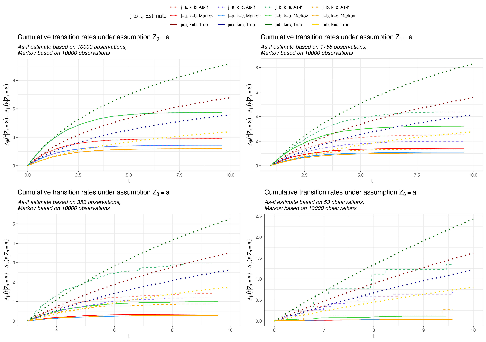
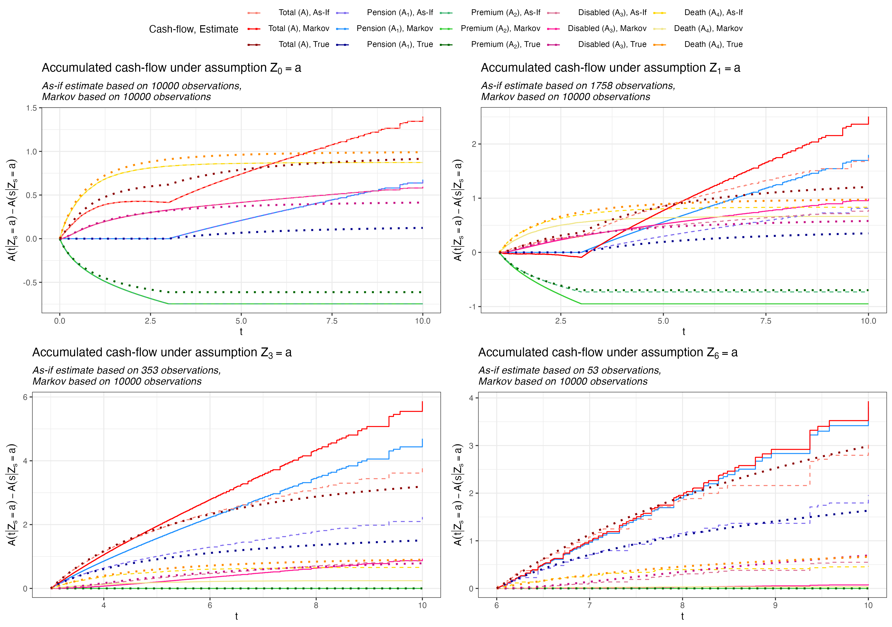
```

## A.5 - Reserve and equivalence premium

We can calculate the reserve by changing the rate in the cashflow function. The above reserve become

```{r}
r <- 0.04
s <- 2
j <- 1
reserves <- function(paths,pi,T,num_states,s= 0,r=0, n_steps = 10000, debug = TRUE,T_max) {
  c_names <- c("State","Time","A1","A2","A3","A4","A")
  cashflows1 <- lapply(1:(num_states-1), function(state) {
    estimate <- Estimate(paths,num_states,s= s, j = state, as_if = FALSE, debug = debug)
    cashflow <- estimate_to_cashflow(estimate,pi,T, r= r,T_max = T_max)
    cashflow <- cbind(State = letters[state],cashflow)
    cashflow[dim(cashflow)[1],]
  })
  cashflows1 <- matrix(unlist(cashflows1),ncol = 7,byrow = TRUE)
  colnames(cashflows1) <- c_names
  cashflows1 <- cbind(Estimate = "Markov", cashflows1)  %>% as.data.frame()
  
  cashflows2 <- lapply(1:(num_states-1), function(state) {
    estimate <- Estimate(paths,num_states,s= s, j = state, as_if = TRUE, debug = debug)
    cashflow <- estimate_to_cashflow(estimate,pi,T, r= r,T_max = T_max)
    cashflow <- cbind(State = letters[state],cashflow)
    cashflow[dim(cashflow)[1],]
  })
  cashflows2 <- matrix(unlist(cashflows2),ncol = 7,byrow = TRUE)
  colnames(cashflows2) <- c_names
  cashflows2 <- cbind(Estimate = "As-If", cashflows2) %>% as.data.frame()
  
  #True values (approximated with 4th order runge kutta)
  derivative <- function(t,y) {
    y %*% d_Lambda(t,M,lambda)
  }
  cashflows3 <- lapply(1:(num_states-1), function(state) {
    y <- runge_kutta(derivative, s,T_max,(1:num_states == state)*1,n_steps)
    #Calculate true values
    prob_to_1 <- approxfun(y$t,y=unlist(y$y)[1:length(y$t)*length(y$y[[1]])-2])
    prob_to_2 <- approxfun(y$t,y=unlist(y$y)[1:length(y$t)*length(y$y[[1]])-1])
    prob_to_3 <- approxfun(y$t,y=unlist(y$y)[1:length(y$t)*length(y$y[[1]])-0])
    A1_derivative <- function(t,y){
      exp(-r*(t-s))*(t>T)*prob_to_1(t)
    }
    A1 <- runge_kutta(A1_derivative,s,T_max,0,n_steps)
    A2_derivative <- function(t,y){
      -exp(-r*(t-s))*pi*(t<=T)*prob_to_1(t)
    }
    A2 <- runge_kutta(A2_derivative,s,T_max,0,n_steps)
    A3_derivative <- function(t,y){
      exp(-r*(t-s))*prob_to_2(t)
    }
    A3 <- runge_kutta(A3_derivative,s,T_max,0,n_steps)
    A4_derivative <- function(t,y){
      #prob_to_1(t-)=prob_to_1(t) same for prob_to_2
      exp(-r*(t-s))*(prob_to_1(t)*d_Lambda(t,M,lambda)[1,3]+prob_to_2(t)*d_Lambda(t,M,lambda)[2,3])
    }
    A4 <- runge_kutta(A4_derivative,s,T_max,0,n_steps)
    cashflow3 <- data.frame(
      Estimate = "True",
      State = letters[state],
      Time = unlist(A1$t),
      A1 = unlist(A1$y),
      A2 = unlist(A2$y),
      A3 = unlist(A3$y),
      A4 = unlist(A4$y)
    ) %>%
      mutate(A = A1 + A2 + A3 + A4)
    cashflow3 <- cashflow3[dim(cashflow3)[1],]
    cashflow3
  })
  cashflows3 <- matrix(unlist(cashflows3),ncol = 8,byrow= TRUE) %>% as.data.frame()
  colnames(cashflows3) <- colnames(cashflows1)
  Reserves <- rbind(cashflows1,cashflows2,cashflows3)
  for (col in c("Time","A1","A2","A3","A4","A")) {
    class(Reserves[,col]) <- "numeric"
  }
  return(Reserves)
}
reserves_table <- reserves(paths,num_states = 3, pi = 1, T = 3, s= 2,r = 0.04,T_max=10)

reserves_table <- reserves_table %>%
  mutate(hat_pi = -(A1 + A3 + A4)/A2)
reserves_table[,c("Estimate","State","Time","hat_pi","A","A1","A2","A3","A4")] %>%
  kbl(digits=3) %>%
  kable_styling()
#For latex
reserves_table[,c("Estimate","State","Time","hat_pi","A","A1","A2","A3","A4")] %>%
  kbl(digits = 3, format = "latex", booktabs = T)
```


```{r}
rm(list = ls()[!(ls() %in% projected_objects)])
```


## A.6 - Supremum norm

```{r,eval=FALSE}
#### Appendix A.4 ####
S <- c(1,2,3,6)
J <- 1:2
L <- 1:10*1000
t_max <- 10
supremums <- function(L,S,J, debug = TRUE,n_steps = 10000,t_max) {
  
  results <- data.frame(L = NA,s=NA,j=NA,as_if = TRUE,`Lambda(1,2)`=NA,`Lambda(1,3)`=NA,`Lambda(2,1)`=NA,`Lambda(2,3)`=NA)
  L <- as.integer(L)
  counter <- 1
  
  if (debug) {
    print(paste0(Sys.time()," Starting simulating ",max(L)," sample paths."))
  }
  paths <- simulate_markov_inhomogenous(max(L))
  if (debug) {
    print(paste0(Sys.time()," Done simulating ",max(L)," sample paths."))
  }
  max_time <- paths[[1]]
  for (l in L) {
    tmp_paths <- paths[1:l]
    estimates1 <- lapply(S, function(s) {
      lapply(J, function(j) {
        tryCatch(Estimate(tmp_paths,3, s= s, j=j,as_if = FALSE, debug = FALSE),
                              error = function(e) NA)
      })
    })
    estimates2 <- lapply(S, function(s) {
      lapply(J, function(j) {
        tryCatch(Estimate(tmp_paths,3, s= s, j=j,as_if = TRUE, debug = FALSE),
                              error = function(e) NA)
      })
    })
    for (k in 1:length(S)) {
      s <- S[k]
      for (i in 1:length(J)) {
        j <- J[i]
        #Generate paths
        estimate1 <- estimates1[[k]][[i]]
        estimate2 <- estimates2[[k]][[i]]
        if ((length(estimate1)>1) & (length(estimate2)>1)) {
          markov <- estimate1$NelsonAalen %>% 
            select(Time,
                   `Lambda(1,2)`=`1_2`,
                   `Lambda(1,3)`=`1_3`,
                   `Lambda(2,1)`=`2_1`,
                   `Lambda(2,3)`=`2_3`) %>%
            filter(Time >= max(estimate1$NelsonAalen$Time[estimate1$NelsonAalen$Time <= s]))
          markov[1,1] <- s
          markov[,2:dim(markov)[2]] <- markov[,2:dim(markov)[2]] -
            as.data.frame(matrix(as.numeric(rep(markov[1,2:dim(markov)[2]],dim(markov)[1])),ncol = dim(markov)[2]-1,byrow = TRUE))
          markov[dim(markov)[1]+1,] <- markov[dim(markov)[1],]
          markov[dim(markov)[1],1] <- t_max #make sure we extend
          as_if_markov <- estimate2$NelsonAalen %>% 
            select(Time,
                   `Lambda(1,2)`=`1_2`,
                   `Lambda(1,3)`=`1_3`,
                   `Lambda(2,1)`=`2_1`,
                   `Lambda(2,3)`=`2_3`) %>%
            filter(Time >= max(estimate2$NelsonAalen$Time[estimate2$NelsonAalen$Time <= s]))
          as_if_markov[1,1] <- s
          as_if_markov[,2:dim(as_if_markov)[2]] <- as_if_markov[,2:dim(as_if_markov)[2]] -
            as.data.frame(matrix(as.numeric(rep(as_if_markov[1,2:dim(as_if_markov)[2]],dim(as_if_markov)[1])),ncol = dim(as_if_markov)[2]-1,byrow = TRUE))
          as_if_markov[dim(as_if_markov)[1]+1,] <- as_if_markov[dim(as_if_markov)[1],]
          as_if_markov[dim(as_if_markov)[1],1] <- t_max
          times <- sort(unique(c(as_if_markov$Time,markov$Time)),decreasing = FALSE)
          true_values <- data.frame(Time = times,
                                    matrix(unlist(lapply(times, function(t) as.numeric(t(2*M*(log(1+0.5*t)-log(1+0.5*s)))))),ncol = num_states**2,byrow = TRUE))
          colnames(true_values) <- c("Time",unlist(lapply(1:num_states, function(i) paste0(i,"_",1:num_states))))
          true_values <- true_values %>% 
            select(Time,
                   `Lambda(1,2),true`=`1_2`,
                   `Lambda(1,3),true`=`1_3`,
                   `Lambda(2,1),true`=`2_1`,
                   `Lambda(2,3),true`=`2_3`)
          markov <- merge(markov,true_values,all.x = TRUE)
          as_if_markov <- merge(as_if_markov,true_values,all.x = TRUE)
          n_markov <- dim(markov)[1]
          results[counter,] <- c(
            l,s,j,FALSE,
            max(c(abs(markov$`Lambda(1,2)`-markov$`Lambda(1,2),true`),abs(markov$`Lambda(1,2)`[1:(n_markov-1)]-markov$`Lambda(1,2),true`[2:n_markov]))),
            max(c(abs(markov$`Lambda(1,3)`-markov$`Lambda(1,3),true`),abs(markov$`Lambda(1,3)`[1:(n_markov-1)]-markov$`Lambda(1,3),true`[2:n_markov]))),
            max(c(abs(markov$`Lambda(2,1)`-markov$`Lambda(2,1),true`),abs(markov$`Lambda(2,1)`[1:(n_markov-1)]-markov$`Lambda(2,1),true`[2:n_markov]))),
            max(c(abs(markov$`Lambda(2,3)`-markov$`Lambda(2,3),true`),abs(markov$`Lambda(2,3)`[1:(n_markov-1)]-markov$`Lambda(2,3),true`[2:n_markov])))
          )
          n_as_if_markov <- dim(as_if_markov)[1]
          results[counter+1,] <- c(
            l,s,j,TRUE,
            max(c(abs(as_if_markov$`Lambda(1,2)`-as_if_markov$`Lambda(1,2),true`),abs(as_if_markov$`Lambda(1,2)`[1:(n_as_if_markov-1)]-as_if_markov$`Lambda(1,2),true`[2:n_as_if_markov]))),
            max(c(abs(as_if_markov$`Lambda(1,3)`-as_if_markov$`Lambda(1,3),true`),abs(as_if_markov$`Lambda(1,2)`[1:(n_as_if_markov-1)]-as_if_markov$`Lambda(1,2),true`[2:n_as_if_markov]))),
            max(c(abs(as_if_markov$`Lambda(2,1)`-as_if_markov$`Lambda(2,1),true`),abs(as_if_markov$`Lambda(1,2)`[1:(n_as_if_markov-1)]-as_if_markov$`Lambda(1,2),true`[2:n_as_if_markov]))),
            max(c(abs(as_if_markov$`Lambda(2,3)`-as_if_markov$`Lambda(2,3),true`),abs(as_if_markov$`Lambda(1,2)`[1:(n_as_if_markov-1)]-as_if_markov$`Lambda(1,2),true`[2:n_as_if_markov])))
          )
          counter <- counter + 2
          if (debug == TRUE) {
            print(paste0(Sys.time(),": Done with L=",l,", s=",s," and j=",j,"."))
          }
        } else {
          print(paste0(Sys.time(),": Error with L=",l,", s=",s," and j=",j,"."))
        }
      }
    }
    rm(estimates1,estimates2)
  }
  return(results)
}
#Not run
L_1 <- ceiling(1000*65**(0:20/15))
L_1
L_2 <- ceiling(1000*88**(0:20/16))
L_2
rm(results)
results_state_1 <- supremums(L = L_1[1],S=c(1,2,3,6),J=1,debug=TRUE,t_max = 10)
results_state_2 <- supremums(L = L_2[1],S=c(1,2,3,6),J=2,debug=TRUE,t_max = 10)
results <- rbind(results_state_1,results_state_2)
results[,"run"] <- 1
runs <- 1
#Start at 12-06-2023 10:11:13
for (i in 1:21) {
  for (j in 1:10) {
    #Run 10 simulations for L[1:i] i.e. 21*10 for the smallest number and 10 for the largest in L
    results_state_1 <- supremums(L = L_1[1:i],S=c(1,2,3,6),J=1,debug=FALSE,t_max = 10)
    results_state_2 <- supremums(L = L_2[1:i],S=c(1,2,3,6),J=2,debug=FALSE,t_max = 10)
    results_state_1[,"run"] <- runs + 1 
    results_state_2[,"run"] <- runs + 1
    results <- rbind(results,results_state_1,results_state_2)
    print(paste0(Sys.time(),": Done with iteration ",runs + 1,"."))
    runs <- runs + 1
  }
}
#End at 13-06-2023 12:32:56 (~26-27 hours)
write.csv(results, file = "results_markov_sim.csv",row.names = FALSE)
```

```{r}
s <- 6
j <- 2
plot_function2 <- function(results, s, j) {
  J <- j
  S <- s
  plotdf <- results %>% filter( (s==S) &(j== J)) %>% filter(as_if == TRUE) %>%
    select(-s,-j,-as_if,-run) %>%
    melt(id = "L") %>% group_by(L,variable) %>%
    summarise(mean = mean(value))
  plotdf2 <- results %>% filter( (s==S) &(j== J)) %>% filter(as_if == FALSE) %>%
    select(-s,-j,-as_if,-run) %>%
    melt(id = "L") %>% group_by(L,variable) %>%
    summarise(mean = mean(value))
  
  p_a_b <- ggplot() + geom_point(data = plotdf %>% filter(variable == "Lambda.1.2."), aes(x=L,y = mean), col = "blue")+
    geom_line(data = plotdf %>% filter(variable == "Lambda.1.2."), aes(x=L,y = mean)) +
    geom_point(data = plotdf2 %>% filter(variable == "Lambda.1.2."), aes(x=L,y = mean), col = "red") +
    geom_line(data = plotdf2 %>% filter(variable == "Lambda.1.2."), aes(x=L,y = mean), col = "red") +
    scale_y_continuous(trans = "log2",breaks = 2**(-5:9)) + scale_x_continuous(trans = "log2",breaks = c(2**(1:18))) +
    theme_bw() +
    labs(title = TeX(paste0("Supremum norm for $\\Lambda_{ab}( \\cdot | Z_{",s,"}=",letters[j],")$")),
         y =  TeX(paste0("Norm (log scale)")),
         x = "L (log scale)") +
    theme(plot.title = element_text(face = "bold"),
          plot.subtitle = element_text(face = "italic"))
  
  p_a_c <- ggplot() + geom_point(data = plotdf %>% filter(variable == "Lambda.1.3."), aes(x=L,y = mean), col = "blue")+
    geom_line(data = plotdf %>% filter(variable == "Lambda.1.3."), aes(x=L,y = mean)) +
    geom_point(data = plotdf2 %>% filter(variable == "Lambda.1.3."), aes(x=L,y = mean), col = "red") +
    geom_line(data = plotdf2 %>% filter(variable == "Lambda.1.3."), aes(x=L,y = mean), col = "red") +
    scale_y_continuous(trans = "log2",breaks = 2**(-5:9)) + scale_x_continuous(trans = "log2",breaks = c(2**(1:18))) +
    theme_bw() +
    labs(title = TeX(paste0("Supremum norm for $\\Lambda_{ac}( \\cdot | Z_{",s,"}=",letters[j],")$")),
         y =  TeX(paste0("Norm (log scale)")),
         x = "L (log scale)") +
    theme(plot.title = element_text(face = "bold"),
          plot.subtitle = element_text(face = "italic"))
  
  p_b_a <- ggplot() + geom_point(data = plotdf %>% filter(variable == "Lambda.2.1."), aes(x=L,y = mean), col = "blue")+
    geom_line(data = plotdf %>% filter(variable == "Lambda.2.1."), aes(x=L,y = mean)) +
    geom_point(data = plotdf2 %>% filter(variable == "Lambda.2.1."), aes(x=L,y = mean), col = "red") +
    geom_line(data = plotdf2 %>% filter(variable == "Lambda.2.1."), aes(x=L,y = mean), col = "red") +
    scale_y_continuous(trans = "log2",breaks = 2**(-5:9)) + scale_x_continuous(trans = "log2",breaks = c(2**(1:18))) +
    theme_bw() +
    labs(title = TeX(paste0("Supremum norm for $\\Lambda_{ba}( \\cdot | Z_{",s,"}=",letters[j],")$")),
         y =  TeX(paste0("Norm (log scale)")),
         x = "L (log scale)") +
    theme(plot.title = element_text(face = "bold"),
          plot.subtitle = element_text(face = "italic"))
  
  p_b_c <- ggplot() + geom_point(data = plotdf %>% filter(variable == "Lambda.2.3."), aes(x=L,y = mean), col = "blue")+
    geom_line(data = plotdf %>% filter(variable == "Lambda.2.3."), aes(x=L,y = mean)) +
    geom_point(data = plotdf2 %>% filter(variable == "Lambda.2.3."), aes(x=L,y = mean), col = "red") +
    geom_line(data = plotdf2 %>% filter(variable == "Lambda.2.3."), aes(x=L,y = mean), col = "red") +
    scale_y_continuous(trans = "log2",breaks = 2**(-5:9)) + scale_x_continuous(trans = "log2",breaks = c(2**(1:18))) +
    theme_bw() +
    labs(title = TeX(paste0("Supremum norm for $\\Lambda_{bc}( \\cdot | Z_{",s,"}=",letters[j],")$")),
         y =  TeX(paste0("Norm (log scale)")),
         x = "L (log scale)") +
    theme(plot.title = element_text(face = "bold"),
          plot.subtitle = element_text(face = "italic"))
  
  return(list(p_a_b = p_a_b, p_a_c = p_a_c, p_b_a = p_b_a, p_b_c = p_b_c))
  
}
results <- read.csv(file = "results_markov_sim.csv")
plots <- plot_function2(results,6,1)
p1 <- ggarrange(plotlist = plots, ncol = 4, nrow=1)
scaler <- 2*1920
ggsave("plotA4.png",p1,units = "px", width = scaler,height = 0.25*scaler,scale = 1.5)
plots <- plot_function2(results,6,2)
p1 <- ggarrange(plotlist = plots, ncol = 4, nrow=1)
scaler <- 2*1920
ggsave("plotA5.png",p1,units = "px", width = scaler,height = 0.25*scaler,scale = 1.5)
```

```{r}
knitr::include_graphics("plotA4.png")

```

```{r}
rm(list = ls()[!(ls() %in% projected_objects)])
```

# Appendix B {.tabset}

**Please use the tabset to navigate through appendix B.1 - B.3.**

## B.1 - Simulating from Semi-Markov

```{r}
##################################
###### Estimate Semi-Markov ######
##################################
#### Appendix B.1 ####
lambda_a_b <- function(t,u) {
  0.09+0.001*t+(t>u)*0.015*t
}
lambda_a_c <- function(t,u) {
  0.01+0.002*t+(t>u)*0.001*t
}
lambda_b_a <- function(t,u) {
  0.04+0.005*t+0.1*0.5**u
}
lambda_b_c <- function(t,u) {
  0.09+0.001*t+0.01*2**u
}
jump_rate <- function(i, t, u){
  if(i == 1){
    lambda_a_b(t,u)+lambda_a_c(t,u)
  } else if(i == 2){
    lambda_b_a(t,u)+lambda_b_c(t,u)
  } else{
    0
  }
}

mark_dist <- function(i, s, u){
  if(i == 1){
    tmp1 <- lambda_a_b(s,u)
    tmp2 <- lambda_a_c(s,u)
    c(0, tmp1/(tmp1+tmp2), tmp2/(tmp1+tmp2))
  } else if(i == 2){
    tmp1 <- lambda_b_a(s,u)
    tmp2 <- lambda_b_c(s,u)
    c(tmp1/(tmp1+tmp2),0, tmp2/(tmp1+tmp2))
  } else{
    0
  }
}

#Simulate paths
simulate_semimarkov <- function(L,jump_rate,mark_dist) {
  R <- runif(L,10,40)
  paths <- lapply(1:L,function(n) {
    sim_path(1,rates = jump_rate, dist = mark_dist,tn = R[n],
             bs = c(lambda_a_b(R[n],0)+lambda_a_c(R[n],0),
                    lambda_b_a(R[n],0)+lambda_b_c(R[n],0),
                    0))})
}
if (mode == "markdown") {
  L <- 10**4
  L_max <- 10**5
} else {
  L <- 10**5
  L_max <- 10**5
}

set.seed(1)
paths <- simulate_semimarkov(L,jump_rate,mark_dist)
#For true probabilities assuming P(Z_t = c) close to 1 for t> 100
max_time <- 40
set.seed(1)
paths_non_censored <- lapply(1:L,function(n) {
    sim_path(1,rates = jump_rate, dist = mark_dist,tn = max_time,
             bs = c(lambda_a_b(max_time,0)+lambda_a_c(max_time,0),
                    lambda_b_a(max_time,0)+lambda_b_c(max_time,0),
                    0))})

projected_objects <- c(projected_objects,
                       "lambda_a_b","lambda_a_c","lambda_b_a","lambda_b_c",
                       "simulate_semimarkov")
```

We can see an example of a path here. Notice that the death transition occurs shortly after the censoring.

```{r}
paths[[1]]
paths_non_censored[[1]]
```

## B.2 - Plots

```{r}
#### Appendix B.2 ####
num_states <- 3
pi = 1
T= 15
num_states = 3
s= 10
T_max = 40
plot_function_B1 <- function(paths,paths_non_censored,pi,T,num_states,s= 0, debug = TRUE,T_max) {
  #Markov estimate
  estimates_markov <- lapply(1:(num_states-1), function(i) Estimate(paths,num_states,s= s, j = i, as_if = FALSE, debug = debug))
  #As-If-Markov estimate
  estimates_asif <- lapply(1:(num_states-1), function(i) Estimate(paths,num_states,s= s, j = i, as_if = TRUE, debug = debug))
  #True estimate (approximation)
  estimates_true <- lapply(1:(num_states-1), function(i) Estimate(paths_non_censored,num_states,s= s, j = i, as_if = TRUE, debug = debug))
  true_df <- paths_to_df(paths_non_censored)
  plot1 <- list()
  plot2 <- list()
  plot3 <- list()
  plot4 <- list()
  for (i in 1:(num_states-1)) {
    j <- i
    estimate1 <- estimates_markov[[j]]
    start_time <- Sys.time()
    cashflow1 <- estimate_to_cashflow(estimate1,pi=pi,T=T,T_max = T_max)
    if (debug) {
      print(paste0("Calculate cashflows: ",round(as.numeric(Sys.time()-start_time,units = "secs"),digits=3)," seconds."))
      start_time <- Sys.time()
    }
    estimate2 <- estimates_asif[[j]]
    start_time <- Sys.time()
    cashflow2 <- estimate_to_cashflow(estimate2,pi=pi,T=T,T_max = T_max)
    if (debug) {
      print(paste0("Calculate cashflows: ",round(as.numeric(Sys.time()-start_time,units = "secs"),digits=3)," seconds."))
      start_time <- Sys.time()
    }
    estimate3 <- estimates_true[[j]]
    start_time <- Sys.time()
    cashflow3 <- estimate_to_cashflow(estimate3,pi=pi,T=T,T_max = T_max)
    if (debug) {
      print(paste0("Calculate cashflows: ",round(as.numeric(Sys.time()-start_time,units = "secs"),digits=3)," seconds."))
      start_time <- Sys.time()
    }
    
    #Plots of probabilities
    plotdf <- estimate1$p_con
    colnames(plotdf)[2:4] <- paste0("j=",1:3,", Markov")
    plotdf <- plotdf%>% reshape2::melt(., id = "Time")
    plotdf2 <- estimate2$p_con
    colnames(plotdf2)[2:4] <- paste0("j=",1:3,", As-If")
    plotdf2 <- plotdf2%>% reshape2::melt(., id = "Time")
    plotdf3 <- estimate3$p_con
    colnames(plotdf3)[2:4] <- paste0("j=",1:3,", As-If")
    plotdf3 <- plotdf3 %>% reshape2::melt(., id = "Time")
    markov_n <- sum(estimate1$I[1,])-estimate1$I[1,1]
    asif_n <- sum(estimate2$I[1,])-estimate2$I[1,1]
    true_n <- sum(estimate3$I[1,])-estimate3$I[1,1]
    #True values E[1(Z_t=j)|Z_s=j]
    ids <- true_df %>%
      filter(Start_Time <= s) %>%
      group_by(Id) %>%
      mutate(max_Time = max(Start_Time)) %>%
      filter(max_Time == Start_Time) %>%
      filter(Start_State == j)
    true_df_tmp <- true_df %>% filter(Id %in% ids$Id)
    true_I <- df_to_I(true_df_tmp, num_states)$I %>% as.data.frame()
    true_I[,2:(num_states +1)] <- true_I[,2:(num_states +1)]/sum(true_I[1,2:(num_states +1)])
    max_time <- max(c(plotdf$Time,plotdf2$Time))
    plotdf3 <- true_I %>% filter(Time >= s) %>% filter(Time <= max_time)
    colnames(plotdf3)[2:4] <- paste0("j=",1:3,", True")
    plotdf3 <- plotdf3 %>% melt(., id = "Time")
    options(scipen = 999)
    #End
    max_time <- max(c(plotdf$Time,plotdf2$Time))
    p1 <- ggplot() +
      geom_step(data = plotdf ,mapping = aes(x=Time, y = value,col = variable)) + 
      geom_step(data = plotdf2,mapping = aes(x=Time, y = value,col = variable),linetype = "dashed") +
      geom_line(data = plotdf3, mapping =aes(x = Time, y = value, col = variable), linetype = "dotted",linewidth=0.75) +
      xlim(s,max_time) +
      theme_bw() +
      labs(title = TeX(paste0("Occupation probabilities given $Z_{",s,"}=",letters[j],"$")),
           y =  TeX(paste0("$P(Z_t=j | Z_{",s,"}=",letters[j],")$")),
           x = "t",
           subtitle = paste0("As-if estimate based on ",asif_n," observations,\nMarkov based on ",markov_n," observations\nTrue values based on ",true_n," non-censored sample paths")) +
      theme(plot.title = element_text(face = "bold"),
            plot.subtitle = element_text(face = "italic")) +
      scale_color_manual(values=c("#FA8072", "#FF0000","#8B0000",
                                  "#7B68EE", "#1E90FF","#00008B",
                                  "#3CB371", "#32CD32","#006400"
                                  ),
                         name = "Probability, Estimate",
                         labels = c(TeX(paste0("$P(Z_t=a | Z_{",s,"}=",letters[j],")$, As-If")),
                                    TeX(paste0("$P(Z_t=a | Z_{",s,"}=",letters[j],"))$, Markov")),
                                    TeX(paste0("$P(Z_t=a | Z_{",s,"}=",letters[j],"))$, True")),
                                    TeX(paste0("$P(Z_t=b | Z_{",s,"}=",letters[j],"))$, As-If")),
                                    TeX(paste0("$P(Z_t=b | Z_{",s,"}=",letters[j],"))$, Markov")),
                                    TeX(paste0("$P(Z_t=b | Z_{",s,"}=",letters[j],"))$, True")),
                                    TeX(paste0("$P(Z_t=c | Z_{",s,"}=",letters[j],"))$, As-If")),
                                    TeX(paste0("$P(Z_t=c | Z_{",s,"}=",letters[j],"))$, Markov")),
                                    TeX(paste0("$P(Z_t=c | Z_{",s,"}=",letters[j],"))$, True"))))
    #Plots of intensities
    plotdf1 <- estimate1$NelsonAalen %>% 
      select(Time,
             `Lambda(1,2), Markov`=`1_2`,
             `Lambda(1,3), Markov`=`1_3`,
             `Lambda(2,1), Markov`=`2_1`,
             `Lambda(2,3), Markov`=`2_3`) %>%
      filter(Time >= s)
    plotdf1[,2:dim(plotdf1)[2]] <- plotdf1[,2:dim(plotdf1)[2]] - as.data.frame(matrix(as.numeric(rep(plotdf1[1,2:dim(plotdf1)[2]],dim(plotdf1)[1])),ncol = dim(plotdf1)[2]-1,byrow = TRUE))
    plotdf1 <- plotdf1 %>%
      reshape2::melt(., id = "Time")
    plotdf2 <- estimate2$NelsonAalen %>% 
      select(Time,
             `Lambda(1,2), As-if`=`1_2`,
             `Lambda(1,3), As-if`=`1_3`,
             `Lambda(2,1), As-if`=`2_1`,
             `Lambda(2,3), As-if`=`2_3`) %>%
      filter(Time >= s)
    plotdf2[,2:dim(plotdf2)[2]] <- plotdf2[,2:dim(plotdf2)[2]] - as.data.frame(matrix(as.numeric(rep(plotdf2[1,2:dim(plotdf2)[2]],dim(plotdf2)[1])),ncol = dim(plotdf2)[2]-1,byrow = TRUE))
    plotdf2 <- plotdf2 %>%
      reshape2::melt(., id = "Time")
    #True
    plotdf3 <- estimate3$NelsonAalen %>% 
      select(Time,
             `Lambda(1,2), True`=`1_2`,
             `Lambda(1,3), True`=`1_3`,
             `Lambda(2,1), True`=`2_1`,
             `Lambda(2,3), True`=`2_3`) %>%
      filter(Time >= s)
    plotdf3[,2:dim(plotdf3)[2]] <- plotdf3[,2:dim(plotdf3)[2]] - as.data.frame(matrix(as.numeric(rep(plotdf3[1,2:dim(plotdf3)[2]],dim(plotdf3)[1])),ncol = dim(plotdf3)[2]-1,byrow = TRUE))
    plotdf3 <- plotdf3 %>%
      reshape2::melt(., id = "Time")
    y_max <- max(c(plotdf$value,plotdf2$value,plotdf3$value[plotdf3$Time<=max_time]))
    p2 <- ggplot() +
      geom_step(data = plotdf1 ,mapping = aes(x=Time, y = value,col = variable),linetype = "solid") + 
      geom_step(data = plotdf2,mapping = aes(x=Time, y = value,col = variable),linetype = "dashed") +
      geom_line(data = plotdf3,mapping = aes(x=Time, y = value,col = variable),linetype = "dotted",linewidth=0.75) +
      xlim(s,max_time) + ylim(0,y_max) +
      theme_bw() +
      labs(title = TeX(paste0("Cumulative transition rates given $Z_{",s,"}=",letters[j],"$")),
           y =  TeX(paste0("$\\Lambda_{jk}(t | Z_{",s,"}=",letters[j],")-\\Lambda_{jk}(s | Z_{",s,"}=",letters[j],")$")),
           x = "t",
           subtitle = paste0("As-if estimate based on ",asif_n," observations,\nMarkov based on ",markov_n," observations\nTrue values based on ",true_n," non-censored sample paths")) +
      theme(plot.title = element_text(face = "bold"),
            plot.subtitle = element_text(face = "italic")) +
      scale_color_manual(values=c("#FA8072", "#FF0000","#8B0000",
                                  "#7B68EE","#1E90FF","#00008B",
                                  "#3CB371", "#32CD32","#006400",
                                  "#FFA500","#FFA500","#FFD700"
                                  ),
                         name = "j to k, Estimate",
                         labels = c("j=a, k=b, As-If",
                                    "j=a, k=b, Markov",
                                    "j=a, k=b, True",
                                    "j=a, k=c, As-If",
                                    "j=a, k=c, Markov",
                                    "j=a, k=c, True",
                                    "j=b, k=a, As-If",
                                    "j=b, k=a, Markov",
                                    "j=b, k=a, True",
                                    "j=b, k=c, As-If",
                                    "j=b, k=c, Markov",
                                    "j=b, k=c, True"))
    #Plots of cashflows
    colnames(cashflow1)[2:dim(cashflow1)[2]] <- paste0(colnames(cashflow1)[2:dim(cashflow1)[2]],", Markov")
    plotdf1 <- cashflow1 %>% reshape2::melt(id = "Time")
    colnames(cashflow2)[2:dim(cashflow2)[2]] <- paste0(colnames(cashflow2)[2:dim(cashflow2)[2]],", As-If")
    plotdf2 <- cashflow2 %>% reshape2::melt(id = "Time")
    colnames(cashflow3)[2:dim(cashflow3)[2]] <- paste0(colnames(cashflow3)[2:dim(cashflow2)[2]],", True")
    plotdf3 <- cashflow3 %>% reshape2::melt(id = "Time")
    y_min <- min(c(0,plotdf1$value,plotdf2$value,plotdf3$value[plotdf3$Time<=max_time]))
    y_max <- max(c(plotdf1$value,plotdf2$value,plotdf3$value[plotdf3$Time<=max_time]))
    ggplot(data = plotdf1) + geom_line(mapping = aes(x=Time, y = value,col = variable), linetype = "dotted", linewidth=0.75)
    p3 <- ggplot() +
      geom_step(data = plotdf1 ,mapping = aes(x=Time, y = value,col = variable)) +
      geom_step(data = plotdf2,mapping = aes(x=Time, y = value,col = variable), linetype = "dashed") +
      geom_line(data = plotdf3,mapping = aes(x=Time, y = value,col = variable), linetype = "dotted", linewidth=0.75) +
      geom_vline(xintercept = T, col = "black",linetype = "dashed") +
      xlim(s,max_time) + ylim(y_min,y_max) +
      theme_bw() +
      labs(title = TeX(paste0("Accumulated cash-flow given $Z_{",s,"}=",letters[j],"$")),
           y =  TeX(paste0("A(t | Z_{",s,"}=",letters[j],")-A(s | Z_{",s,"}=",letters[j],")")),
           x = "t",
           subtitle = paste0("As-if estimate based on ",asif_n," observations,\nMarkov based on ",markov_n," observations\nTrue values based on ",true_n," non-censored sample paths")) +
      theme(plot.title = element_text(face = "bold"),
            plot.subtitle = element_text(face = "italic")) +
      scale_color_manual(values=c("#FA8072", "#FF0000","#8B0000",
                                  "#7B68EE","#1E90FF","#00008B",
                                  "#3CB371", "#32CD32","#006400",
                                  "#DB7093","#FF1493","#C71585",
                                  "#FFD700","#F0E68C","#FF8C00"
                                  ),
                         name = "Cash-flow, Estimate",
                         labels = c(TeX("Total ($A$), As-If"),
                                    TeX("Total ($A$), Markov"),
                                    TeX("Total ($A$), True"),
                                    TeX("Pension ($A_1$), As-If"),
                                    TeX("Pension ($A_1$), Markov"),
                                    TeX("Pension ($A_1$), True"),
                                    TeX("Premium ($A_2$), As-If"),
                                    TeX("Premium ($A_2$), Markov"),
                                    TeX("Premium ($A_2$), True"),
                                    TeX("Disabled ($A_3$), As-If"),
                                    TeX("Disabled ($A_3$), Markov"),
                                    TeX("Disabled ($A_3$), True"),
                                    TeX("Death ($A_4$), As-If"),
                                    TeX("Death ($A_4$), Markov"),
                                    TeX("Death ($A_4$), True")))
    
    plot1[[i]] <- p1
    plot2[[i]] <- p2
    plot3[[i]] <- p3
    plot4_tmp <- list()
    for (k in 1:num_states) {
      #Compare probs P(Z_t=i|Z_s=i)
      as_if_probs <- estimates_asif[[j]]$p_con[,c(1,k+1)]
      markov_probs <- estimates_markov[[j]]$p_con[,c(1,k+1)]
      true_probs <- estimates_true[[j]]$p_con[,c(1,k+1)]
      colnames(as_if_probs) <- c("Time","As_if")
      colnames(markov_probs) <- c("Time","Markov")
      colnames(true_probs) <- c("Time","True")
      plotdf <- merge(as_if_probs,markov_probs, by ="Time",all = TRUE)
      plotdf <- merge(plotdf,true_probs, by ="Time",all = TRUE) %>% na.locf(na.rm = FALSE) %>% melt(id.vars= "Time")
      p4 <- ggplot() +
        geom_step(data = plotdf,mapping = aes(x=Time, y = value,col = variable)) +
        xlim(s,max_time) +
        theme_bw() +
        labs(title = TeX(paste0("Probability that $Z_t=",letters[k],"$ given $Z_{",s,"}=",letters[j],"$")),
             y =  "Probability",
             x = "t",
             subtitle = paste0("As-if estimate based on ",asif_n," observations,\nMarkov based on ",markov_n," observations\nTrue values based on ",true_n," non-censored sample paths")) +
        theme(plot.title = element_text(face = "bold"),
              plot.subtitle = element_text(face = "italic")) +
        scale_color_manual(values=c("#FA8072", "#1E90FF","#3CB371"),
                           name = "Estimate",
                           labels = c("As-If","Markov","True"))
      plot4_tmp[[k]] <- p4
    }
    plot4[[j]] <- plot4_tmp
  }
  #Compare probs P(Z_t=i|Z_s=i)
  as_if_probs <- estimates_asif[[1]]$p_con[,1:2]
  markov_probs <- estimates_markov[[1]]$p_con[,1:2]
  true_probs <- estimates_true[[1]]$p_con[,1:2]
  for (i in 2:(num_states-1)){
    as_if_probs <- merge(as_if_probs, estimates_asif[[i]]$p_con[,c(1,i+1)], by = "Time",all = TRUE)
    markov_probs <- merge(markov_probs, estimates_markov[[i]]$p_con[,c(1,i+1)], by = "Time",all = TRUE)
    true_probs <- merge(true_probs, estimates_true[[i]]$p_con[,c(1,i+1)], by = "Time",all = TRUE)
  }
  colnames(as_if_probs) <- c("Time",paste0(1:(num_states-1),"_asif")) 
  colnames(markov_probs) <- c("Time",paste0(1:(num_states-1),"_markov"))
  colnames(true_probs) <- c("Time",paste0(1:(num_states-1),"_true"))
  probs <- merge(as_if_probs,markov_probs, by = "Time",all = TRUE)
  probs <- merge(probs,true_probs, by = "Time",all = TRUE)
  probs <- na.locf(probs, na.rm = FALSE)
  plotdf1 <- markov_probs %>% na.locf(na.rm = FALSE) %>% melt(id.vars = "Time")
  plotdf2 <- as_if_probs %>% na.locf(na.rm = FALSE) %>% melt(id.vars = "Time")
  plotdf3 <- true_probs %>% na.locf(na.rm = FALSE) %>% melt(id.vars = "Time")
  p5 <- ggplot() +
    geom_step(data = plotdf1,mapping = aes(x=Time, y = value,col = variable), linetype = "solid") +
    geom_step(data = plotdf2,mapping = aes(x=Time, y = value,col = variable), linetype = "dashed") +
    geom_line(data = plotdf3,mapping = aes(x=Time, y = value,col = variable), linetype = "dotted", linewidth=0.75) +
    xlim(s,40) +
    theme_bw() +
    labs(title = TeX(paste0("Occupation probability given $Z_{",s,"}=j$")),
         y =  TeX(paste0("$P(Z_t=j | Z_s=j)$")),
         x = "t",
         subtitle = paste0("As-if estimate based on ",asif_n," observations,\nMarkov based on ",markov_n," observations\nTrue values based on ",true_n," non-censored sample paths")) +
    theme(plot.title = element_text(face = "bold"),
          plot.subtitle = element_text(face = "italic")) +
    scale_color_manual(values=c("#FA8072", "#FF0000","#8B0000",
                                "#7B68EE","#1E90FF","#00008B",
                                "#3CB371", "#32CD32","#006400",
                                "#DB7093","#FF1493","#C71585",
                                "#FFD700","#F0E68C","#FF8C00"
                                ),
                       name = "Probability, Estimate",
                       labels = c(TeX("j=a, As-If"),
                                  TeX("j=a, Markov"),
                                  TeX("j=a, True"),
                                  TeX("j=b, As-If"),
                                  TeX("j=b, Markov"),
                                  TeX("j=b, True")))
  
  return(list(plot1= plot1, plot2 = plot2, plot3 = plot3,plot4 =plot4,plot5 = p5))
}
plot1 <- plot_function_B1(paths,paths_non_censored,pi = 1, T= 15,num_states = 3,s= 5,debug = FALSE,T_max = 40)
plot2 <- plot_function_B1(paths,paths_non_censored,pi = 1, T= 15,num_states = 3,s= 10,debug = FALSE,T_max = 40)
plot3 <- plot_function_B1(paths,paths_non_censored,pi = 1, T= 15,num_states = 3,s= 20,debug = FALSE,T_max = 40)
plot4 <- plot_function_B1(paths,paths_non_censored,pi = 1, T= 15,num_states = 3,s= 30,debug = FALSE,T_max = 40)

p1_1 <- ggarrange(plotlist = list(plot1$plot1[[1]],plot2$plot1[[1]],plot3$plot1[[1]],plot4$plot1[[1]]),ncol = 4,nrow=1,common.legend = TRUE)
p1_2 <- ggarrange(plotlist = list(plot1$plot1[[2]],plot2$plot1[[2]],plot3$plot1[[2]],plot4$plot1[[2]]),ncol = 4,nrow=1,common.legend = TRUE)
p1 <- ggarrange(plotlist = list(plot1$plot1[[1]],plot2$plot1[[1]],plot3$plot1[[1]],plot4$plot1[[1]],
                                  plot1$plot1[[2]],plot2$plot1[[2]],plot3$plot1[[2]],plot4$plot1[[2]]),ncol = 4,nrow=2,common.legend = TRUE)

p2_1 <- ggarrange(plotlist = list(plot1$plot2[[1]],plot2$plot2[[1]],plot3$plot2[[1]],plot4$plot2[[1]]),ncol = 4,nrow=1,common.legend = TRUE)
p2_2 <- ggarrange(plotlist = list(plot1$plot2[[2]],plot2$plot2[[2]],plot3$plot2[[2]],plot4$plot2[[2]]),ncol = 4,nrow=1,common.legend = TRUE)
p2 <- ggarrange(plotlist = list(plot1$plot2[[1]],plot2$plot2[[1]],plot3$plot2[[1]],plot4$plot2[[1]],
                                  plot1$plot2[[2]],plot2$plot2[[2]],plot3$plot2[[2]],plot4$plot2[[2]]),ncol = 4,nrow=2,common.legend = TRUE)

p3_1 <- ggarrange(plotlist = list(plot1$plot3[[1]],plot2$plot3[[1]],plot3$plot3[[1]],plot4$plot3[[1]]),ncol = 4,nrow=1,common.legend = TRUE)
p3_2 <- ggarrange(plotlist = list(plot1$plot3[[2]],plot2$plot3[[2]],plot3$plot3[[2]],plot4$plot3[[2]]),ncol = 4,nrow=1,common.legend = TRUE)
p3 <- ggarrange(plotlist = list(plot1$plot3[[1]],plot2$plot3[[1]],plot3$plot3[[1]],plot4$plot3[[1]],
                                  plot1$plot3[[2]],plot2$plot3[[2]],plot3$plot3[[2]],plot4$plot3[[2]]),ncol = 4,nrow=2,common.legend = TRUE)

scaler <- 2*1920
ggsave("plotB1_1.png",p1_1,units = "px", width = scaler,height = 0.25*scaler,scale = 1.5)
ggsave("plotB1_2.png",p1_2,units = "px", width = scaler,height = 0.25*scaler,scale = 1.5)
ggsave("plotB1.png",p1,units = "px", width = scaler,height = 0.5*scaler,scale = 1.5)

ggsave("plotB2_1.png",p2_1,units = "px", width = scaler,height = 0.25*scaler,scale = 1.5)
ggsave("plotB2_2.png",p2_2,units = "px", width = scaler,height = 0.25*scaler,scale = 1.5)
ggsave("plotB2.png",p2,units = "px", width = scaler,height = 0.5*scaler,scale = 1.5)

ggsave("plotB3_1.png",p3_1,units = "px", width = scaler,height = 0.25*scaler,scale = 1.5)
ggsave("plotB3_2.png",p3_2,units = "px", width = scaler,height = 0.25*scaler,scale = 1.5)
ggsave("plotB3.png",p3,units = "px", width = scaler,height = 0.5*scaler,scale = 1.5)
```

We can show the plots below.

```{r}


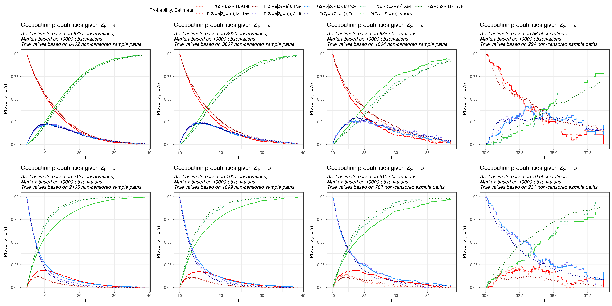

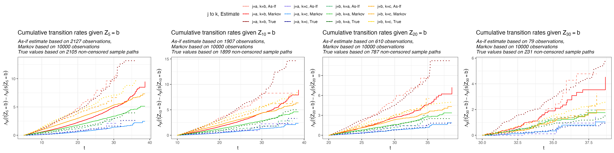
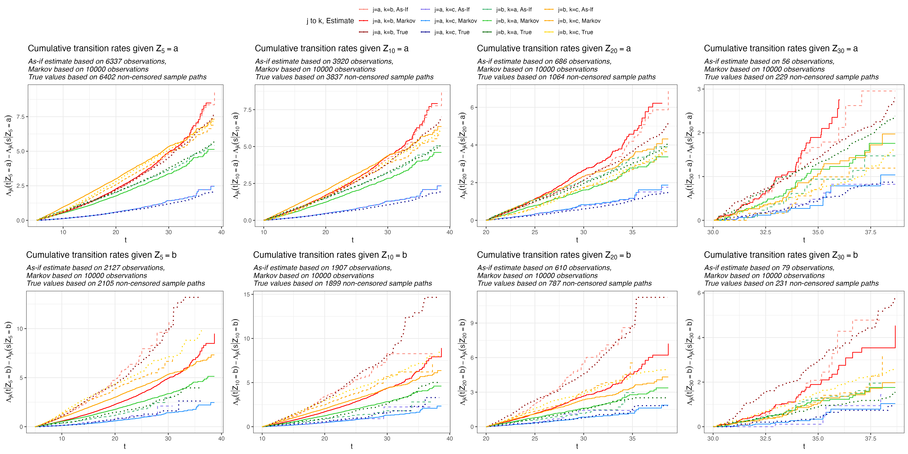


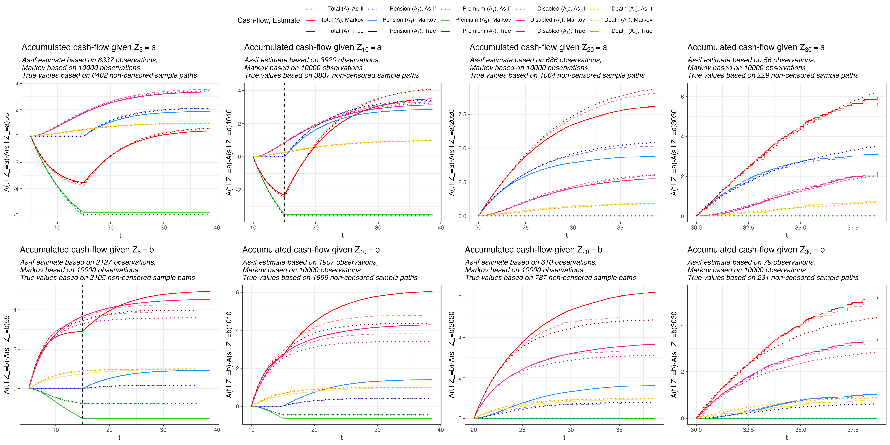
```

```{r}
rm(list = ls()[!(ls() %in% c(projected_objects,"paths","paths_non_censored"))])
```


## B.3 - Reserve and equivalence premium

We can calculate the reserve by changing the rate in the cashflow function. The above reserve become

```{r}
r <- 0.04
s <- 5
j <- 1
T_max <- 40
reserves <- function(paths,paths_non_censored,pi,T,num_states,s= 0,r=0, n_steps = 10000, debug = TRUE,T_max) {
  c_names <- c("State","Time","A1","A2","A3","A4","A")
  cashflows1 <- lapply(1:(num_states-1), function(state) {
    estimate <- Estimate(paths,num_states,s= s, j = state, as_if = FALSE, debug = debug)
    cashflow <- estimate_to_cashflow(estimate,pi,T, r= r,T_max = T_max)
    cashflow <- cbind(State = letters[state],cashflow)
    cashflow[dim(cashflow)[1],]
  })
  cashflows1 <- matrix(unlist(cashflows1),ncol = 7,byrow = TRUE)
  colnames(cashflows1) <- c_names
  cashflows1 <- cbind(Estimate = "Markov", cashflows1)  %>% as.data.frame()
  
  cashflows2 <- lapply(1:(num_states-1), function(state) {
    estimate <- Estimate(paths,num_states,s= s, j = state, as_if = TRUE, debug = debug)
    cashflow <- estimate_to_cashflow(estimate,pi,T, r= r,T_max = T_max)
    cashflow <- cbind(State = letters[state],cashflow)
    cashflow[dim(cashflow)[1],]
  })
  cashflows2 <- matrix(unlist(cashflows2),ncol = 7,byrow = TRUE)
  colnames(cashflows2) <- c_names
  cashflows2 <- cbind(Estimate = "As-If", cashflows2) %>% as.data.frame()
  
  #True values (approximated with Monte Carlo non-censored)
  cashflows3 <- lapply(1:(num_states-1), function(state) {
    estimate <- Estimate(paths_non_censored,num_states,s= s, j = state, as_if = TRUE, debug = debug)
    cashflow <- estimate_to_cashflow(estimate,pi,T, r= r,T_max = T_max)
    cashflow <- cbind(State = letters[state],cashflow)
    cashflow[dim(cashflow)[1],]
  })
  cashflows3 <- matrix(unlist(cashflows3),ncol = 7,byrow = TRUE)
  colnames(cashflows3) <- c_names
  cashflows3 <- cbind(Estimate = "True", cashflows3)  %>% as.data.frame()
  
  Reserves <- rbind(cashflows1,cashflows2,cashflows3)
  for (col in c("Time","A1","A2","A3","A4","A")) {
    class(Reserves[,col]) <- "numeric"
  }
  return(Reserves)
}
reserves_table <- reserves(paths,paths_non_censored,num_states = 3, pi = 1, T = 15, s= 5,r = 0.04,T_max=40)

reserves_table <- reserves_table %>%
  mutate(hat_pi = -(A1 + A3 + A4)/A2)
reserves_table[,c("Estimate","State","hat_pi","A","A1","A2","A3","A4")] %>%
  kbl(digits=3) %>%
  kable_styling()
#For latex
reserves_table[,c("Estimate","State","hat_pi","A","A1","A2","A3","A4")] %>%
  kbl(digits = 3, format = "latex", booktabs = T)
```

```{r}
rm(list = ls()[!(ls() %in% projected_objects)])
```

# Appendix C {.tabset}

**Please use the tabset to navigate through appendix C.1 - C.2.**

## C.1 - Model risk in Semi-Markov case

Simulating

```{r}
if (mode == "markdown") {
  L_max <- 10**5
} else {
  L_max <- 10*10**5
}

set.seed(1)
start_time <- Sys.time()
paths <- simulate_semimarkov(L_max,jump_rate,mark_dist)
Sys.time() - start_time # Time difference of 1.577325 mins

#For true probabilities assuming P(Z_t = c) close to 1 for t> 100
max_time <- 40
set.seed(1)
start_time <- Sys.time()
paths_non_censored <- lapply(1:L_max,function(n) {
    sim_path(1,rates = jump_rate, dist = mark_dist,tn = max_time,
             bs = c(lambda_a_b(max_time,0)+lambda_a_c(max_time,0),
                    lambda_b_a(max_time,0)+lambda_b_c(max_time,0),
                    0))})
Sys.time() - start_time # Time difference of 3.293936 mins
```

Calculating p norm

$$
\left(\int_{t_0}^{t_1} \vert f(x)-\hat f(x)\vert^p\ \text dx\right)^{1/p}
$$

and supremum norm

$$
\sup_{x\in [t_0,t_1]} \vert f(x) - \hat f(x)\vert.
$$

```{r}
s <- 10
j <- 2
num_states <- 3
T_max <- 40
p <- 2
best_estimators <- function(paths,paths_non_censored,s,j,p,num_states,debug = FALSE, T_max) {
  
  if (debug) {
    print(paste0(Sys.time()," Calculating Markov estimate."))
    start_time <- Sys.time()
  }
  Markov_estimate <- Estimate(paths,num_states, s = s, j = j, as_if = FALSE, debug = FALSE)$p_con
  
  if (debug) {
    print(Sys.time() - start_time)
    print(paste0(Sys.time()," Calculating As-If estimate."))
    start_time <- Sys.time()
  }
  As_If_estimate <- Estimate(paths,num_states, s = s, j = j, as_if = TRUE, debug = FALSE)$p_con
  
  if (debug) {
    print(Sys.time() - start_time)
    print(paste0(Sys.time()," Calculating true estimate."))
    start_time <- Sys.time()
  }
  True_estimate <- Estimate(paths_non_censored,num_states, s = s, j = j, as_if = TRUE, debug = FALSE)$p_con
  
  colnames(Markov_estimate) <- c("Time",paste0(1:num_states,"_Markov"))
  colnames(As_If_estimate) <- c("Time",paste0(1:num_states,"_As_If"))
  colnames(True_estimate) <- c("Time",paste0(1:num_states,"_True"))
  
  p_con <- merge(Markov_estimate, As_If_estimate, all = TRUE, by = "Time")
  rm(Markov_estimate, As_If_estimate)
  p_con <- merge(p_con, True_estimate %>% filter(Time <= T_max), all = TRUE, by = "Time")
  rm(True_estimate)
  p_con[dim(p_con)[1]+1, ] <- c(T_max,p_con[dim(p_con)[1], 2:dim(p_con)[2]])
  
  p_con <- p_con %>% na.locf(., na.rm = FALSE)
  
  p_con_diff <- p_con[,1:(num_states*2+1)]
  norms <- NULL
  for (i in 1:num_states) {
    p_con_diff[,paste0(i,"_Markov")] <- abs( p_con[,paste0(i,"_Markov")] - p_con[,paste0(i,"_True")])
    p_con_diff[,paste0(i,"_As_If")] <- abs( p_con[,paste0(i,"_As_If")] - p_con[,paste0(i,"_True")])
    p_con_diff[,paste0(i,"_Markov_p")] <- abs( p_con[,paste0(i,"_Markov")] - p_con[,paste0(i,"_True")])**p
    p_con_diff[,paste0(i,"_As_If_p")] <- abs( p_con[,paste0(i,"_As_If")] - p_con[,paste0(i,"_True")])**p
    
    delta_t <- p_con_diff$Time[2:dim(p_con_diff)[1]]-p_con_diff$Time[1:(dim(p_con_diff)[1]-1)]
    if (is.null(norms)) {
      norms <- data.frame(
        Estimator = c("Markov","As_If"),
        State = c(i,i),
        Sup_Norm = c(
          max(p_con_diff[,paste0(i,"_Markov")]),
          max(p_con_diff[,paste0(i,"_As_If")])
        ),
        P_Norm = c(
          sum(p_con_diff[1:(dim(p_con_diff)[1]-1),paste0(i,"_Markov")]**p*delta_t)**(1/p),
          sum(p_con_diff[1:(dim(p_con_diff)[1]-1),paste0(i,"_As_If")]**p*delta_t)**(1/p)
        )
      )
    } else {
      norms_tmp <- data.frame(
        Estimator = c("Markov","As_If"),
        State = c(i,i),
        Sup_Norm = c(
          max(p_con_diff[,paste0(i,"_Markov")]),
          max(p_con_diff[,paste0(i,"_As_If")])
        ),
        P_Norm = c(
          sum(p_con_diff[1:(dim(p_con_diff)[1]-1),paste0(i,"_Markov")]**p*delta_t)**(1/p)/(T_max - s),
          sum(p_con_diff[1:(dim(p_con_diff)[1]-1),paste0(i,"_As_If")]**p*delta_t)**(1/p)/(T_max - s)
        )
      )
      norms <- rbind(norms,norms_tmp)
    }
  }
  if (debug) {
    print(Sys.time() - start_time)
    print(paste0(Sys.time()," Making plots."))
    start_time <- Sys.time()
  }
  plotdf1 <- p_con_diff[,c("Time",paste0(1:num_states, "_Markov"))] %>% melt(.,id.vars = "Time")
  plotdf2 <- p_con_diff[,c("Time",paste0(1:num_states, "_As_If"))] %>% melt(.,id.vars = "Time")
  p1 <- ggplot() +
    geom_line(data = plotdf1,mapping = aes(x=Time, y = value,col = variable)) + 
    geom_line(data = plotdf2,mapping = aes(x=Time, y = value,col = variable),linetype = "dashed") +
    xlim(s,T_max) +
    theme_bw() +
    labs(title = TeX(paste0("Model risk for $Z_{",s,"}=",letters[j],"$")),
         y =  "Norm",
         x = "t") +
    theme(plot.title = element_text(face = "bold")) +
    scale_color_manual(values=c("#8B0000", "#FF0000",
                                "#00008B", "#1E90FF",
                                "#006400", "#32CD32"
                                ),
                       name = "Probability, Estimate",
                       labels = c(TeX(paste0("$P(Z_t=a | Z_{",s,"}=",letters[j],")$, As-If")),
                                  TeX(paste0("$P(Z_t=a | Z_{",s,"}=",letters[j],"))$, Markov")),
                                  TeX(paste0("$P(Z_t=b | Z_{",s,"}=",letters[j],"))$, As-If")),
                                  TeX(paste0("$P(Z_t=b | Z_{",s,"}=",letters[j],"))$, Markov")),
                                  TeX(paste0("$P(Z_t=c | Z_{",s,"}=",letters[j],"))$, As-If")),
                                  TeX(paste0("$P(Z_t=c | Z_{",s,"}=",letters[j],"))$, Markov"))))
  
  plotdf1 <- p_con[,c("Time",paste0(1:num_states, "_Markov"))] %>% melt(.,id.vars = "Time")
  plotdf2 <- p_con[,c("Time",paste0(1:num_states, "_As_If"))] %>% melt(.,id.vars = "Time")
  plotdf3 <- p_con[,c("Time",paste0(1:num_states, "_True"))] %>% melt(.,id.vars = "Time")
  p2 <- ggplot() +
      geom_line(data = plotdf1 ,mapping = aes(x=Time, y = value,col = variable)) + 
      geom_line(data = plotdf2,mapping = aes(x=Time, y = value,col = variable),linetype = "dashed") +
      geom_line(data = plotdf3, mapping =aes(x = Time, y = value, col = variable), linetype = "dotted",linewidth=0.75) +
      xlim(s,T_max) +
      theme_bw() +
      labs(title = TeX(paste0("Occupation probabilities given $Z_{",s,"}=",letters[j],"$")),
           y =  TeX(paste0("$P(Z_t=j | Z_{",s,"}=",letters[j],")$")),
           x = "t") +
      theme(plot.title = element_text(face = "bold"),
            plot.subtitle = element_text(face = "italic")) +
      scale_color_manual(values=c("#FA8072", "#FF0000","#8B0000",
                                  "#7B68EE", "#1E90FF","#00008B",
                                  "#3CB371", "#32CD32","#006400"
                                  ),
                         name = "Probability, Estimate",
                         labels = c(TeX(paste0("$P(Z_t=a | Z_{",s,"}=",letters[j],")$, As-If")),
                                    TeX(paste0("$P(Z_t=a | Z_{",s,"}=",letters[j],"))$, Markov")),
                                    TeX(paste0("$P(Z_t=a | Z_{",s,"}=",letters[j],"))$, True")),
                                    TeX(paste0("$P(Z_t=b | Z_{",s,"}=",letters[j],"))$, As-If")),
                                    TeX(paste0("$P(Z_t=b | Z_{",s,"}=",letters[j],"))$, Markov")),
                                    TeX(paste0("$P(Z_t=b | Z_{",s,"}=",letters[j],"))$, True")),
                                    TeX(paste0("$P(Z_t=c | Z_{",s,"}=",letters[j],"))$, As-If")),
                                    TeX(paste0("$P(Z_t=c | Z_{",s,"}=",letters[j],"))$, Markov")),
                                    TeX(paste0("$P(Z_t=c | Z_{",s,"}=",letters[j],"))$, True"))))
  if (debug) {
    print(Sys.time() - start_time)
    print(paste0(Sys.time()," Done."))
  }
  return(list(p_con = p_con, p_con_diff = p_con_diff, norms = norms, p1 = p1, p2 = p2))
}
results <- best_estimators(paths,paths_non_censored,s=5,j=1,p=2,num_states=3,debug = TRUE, T_max=40)
results2 <- best_estimators(paths,paths_non_censored,s=5,j=2,p=2,num_states=3,debug = TRUE, T_max=40)

scaler <- 1920
plots <- ggarrange(plotlist = list(results$p1, results$p2), ncol = 1)
ggsave("plotC1_1.png",plots,units = "px", width = scaler,height = 0.75*scaler,scale = 1.5)
plots <- ggarrange(plotlist = list(results2$p1, results2$p2), ncol = 1)
ggsave("plotC1_2.png",plots,units = "px", width = scaler,height = 0.75*scaler,scale = 1.5)
plots <- ggarrange(plotlist = list(results$p1, results2$p1), ncol = 1,common.legend = TRUE)
ggsave("plotC1.png",plots,units = "px", width = scaler,height = 0.75*scaler,scale = 1.5)
```

```{r}


```

We have the estimate of the $p$-norm and supremum norm

```{r}
tbl <- results$norms[,c("State","Estimator","Sup_Norm", "P_Norm")]
colnames(tbl) <- c("Occupation State","Estimator","Sup_Norm", "P_Norm")
tbl2 <- results2$norms[,c("State","Estimator","Sup_Norm", "P_Norm")]
colnames(tbl2) <- c("Occupation State","Estimator","Sup_Norm", "P_Norm")
tbl[,"Start State"] <- "a"
tbl2[,"Start State"] <- "b"
tbl <- rbind(tbl,tbl2)
tbl <- tbl %>% mutate(Norm = "p-norm") %>% add_row(mutate(., Norm = "sup-norm")) %>%
  mutate(value = ifelse(Norm == "sup-norm", Sup_Norm, P_Norm)) %>% group_by(Norm,Estimator,`Start State`) %>%
  summarise(
    Risk_a = sum(value*(`Occupation State` == 1))*10^4,
    Risk_b = sum(value*(`Occupation State` == 2))*10^4,
    Risk_c = sum(value*(`Occupation State` == 3))*10^4
  ) %>% arrange(Norm,Estimator,`Start State`) %>%
  mutate(Estimator = ifelse(Estimator == "As_If","As-If","Markov"))

tbl %>%
  kbl(digits=4) %>%
  kable_styling()
#For latex
tbl %>% kbl(digits = 2, format = "latex", booktabs = T)
```

## C.2 - Approximation risk

We calculate approximation risk by subsetting on larger and larger subsets $L_1<L_2<...<L_M=L_{\max}$.

```{r}
if (mode == "markdown") {
  Ls <- c(2500,5000,10000,25000,50000)
} else {
  Ls <- c(5000,10000,50000,100000,500000)
}
debug <- TRUE
s <- 5
j <- 1
approximation_risk <- function(paths,results,Ls,s,j,p=2,num_states,debug = FALSE, T_max) {
  if (debug) {
    print(paste0(Sys.time()," Calculating Markov estimate."))
    start_time <- Sys.time()
  }
  Markov_estimate <- lapply(Ls, function(L) Estimate(paths[1:L],num_states, s = s, j = j, as_if = FALSE, debug = FALSE)$p_con)
  
  if (debug) {
    print(Sys.time() - start_time)
    print(paste0(Sys.time()," Calculating As-If estimate."))
    start_time <- Sys.time()
  }
  As_If_estimate <- lapply(Ls, function(L) Estimate(paths[1:L],num_states, s = s, j = j, as_if = TRUE, debug = FALSE)$p_con)
  
  if (debug) {
    print(Sys.time() - start_time)
    print(paste0(Sys.time()," Making plots."))
    start_time <- Sys.time()
  }
  
  plots <- lapply(1:num_states, function(i) {
    
    p_con <- results$p_con[,c(1,1 + i,1 + i + num_states)]
    times <- data.frame(Time = p_con[,"Time"])
    
    for (k in 1:length(Ls)) {
        L <- Ls[k]
        
        markov_tmp <- Markov_estimate[[k]][,c(1,1+i)]
        colnames(markov_tmp) <- c("Time", "Markov")
        asif_tmp <- As_If_estimate[[k]][,c(1,1+i)]
        colnames(asif_tmp) <- c("Time", "As_If")
        
        
        tmp <- merge(times,markov_tmp,all = TRUE,by = "Time")
        tmp <- merge(tmp,asif_tmp,all = TRUE,by = "Time")
        tmp <- na.locf(tmp, na.rm = FALSE)
        tmp[,"L"] <- L
        tmp2 <- tmp
        tmp2[,"Markov"] <- tmp2[,"Markov"] - p_con[,2]
        tmp2[,"As_If"] <- tmp2[,"As_If"] - p_con[,3]
        
        delta_t <- c(tmp$Time[2:dim(tmp)[1]]-tmp$Time[1:(dim(tmp)[1]-1)],0)
        tmp[,"Markov"] <- cumsum(abs(tmp[,"Markov"] - p_con[,2])**1*delta_t)**(1/1)/(T_max- s)
        tmp[,"As_If"] <- cumsum(abs(tmp[,"As_If"] - p_con[,3])**1*delta_t)**(1/1)/(T_max- s)
        
        norms_tmp <- data.frame(
          Estimator = c("Markov","As_If"),
          L = c(L,L),
          State = c(i,i),
          Sup_Norm = c(
            max(abs(tmp2[,"Markov"])),
            max(abs(tmp2[,"As_If"]))
          ),
          P_Norm = c(
            sum(abs(tmp2[,"Markov"])**p*delta_t)**(1/p)/(T_max - s),
            sum(abs(tmp2[,"As_If"])**p*delta_t)**(1/p)/(T_max - s)
          )
        )
        
        tmp <- tmp[tmp$Time %in% unique(c(markov_tmp$Time,asif_tmp$Time)),]
        tmp2 <- tmp2[tmp2$Time %in% unique(c(markov_tmp$Time,asif_tmp$Time)),]
        
        if (k > 1) {
          plotdf <- rbind(plotdf,tmp)
          plotdf2 <- rbind(plotdf2,tmp2)
          norms <- rbind(norms, norms_tmp)
        } else {
          plotdf <- tmp
          plotdf2 <- tmp2
          norms <- norms_tmp
        }
    }
    
    plot1 <- ggplot(plotdf) +
      geom_line(mapping = aes(x=Time, y = Markov,col = factor(paste0(L,", Markov"))), linetype = "solid") +
      geom_line(mapping = aes(x=Time, y = As_If,col =  factor(paste0(L,", Af-If"))), linetype = "solid") +
      theme_bw() +
      labs(title = TeX(paste0("Accumulated norm for $p^{(L)}_{",letters[i],"}$")),
           y =  TeX(paste0("$AR(p^{(L)}_",letters[i],"(\\cdot | Z_{",s,"}=",letters[j],"))$")),
           x = "t",col = "L") +
      theme(plot.title = element_text(face = "bold"),
            plot.subtitle = element_text(face = "italic")) +
      scale_color_manual(values=c("#8B0000","#00008B",
                                  "#CD5C5C","#7B68EE",
                                  "#FF0000", "#6495ED",
                                  "#FA8072","#87CEFA",
                                  "#FFA07A","#B0E0E6"
                                  ))
    plot2 <- ggplot(plotdf) +
      geom_line(mapping = aes(x=Time, y = Markov-As_If,col = factor(L)), linetype = "solid") +
      theme_bw() +
      labs(title = TeX(paste0("Difference in norms $p^{(L)}_{",letters[i],"}$")),
           y =  TeX(paste0("Markov - As-If")),
           x = "t",col = "L") +
      theme(plot.title = element_text(face = "bold"),
            plot.subtitle = element_text(face = "italic")) +
      scale_color_manual(values=c("#00008B","#7B68EE", "#6495ED","#87CEFA","#B0E0E6"))
    
    
    
    return(list(p1 = plot1, p2 = plot2,norms = norms))})
  
  if (debug) {
    print(Sys.time() - start_time)
    print(paste0(Sys.time()," Done."))
  }
  
  return(plots)
}
app_results <- approximation_risk(paths,results,Ls=Ls,s=5,j=1,p=2,num_states=3,debug = TRUE, T_max=40)
app_results2 <- approximation_risk(paths,results2,Ls=Ls,s=5,j=2,p=2,num_states=3,debug = TRUE, T_max=40)

scaler <- 1920
#j=1
plots <- ggarrange(plotlist = list(app_results[[1]]$p1, app_results[[2]]$p1,app_results[[3]]$p1), ncol = 3,common.legend = TRUE)
ggsave("plotC2_1.png",plots,units = "px", width = scaler,height = 0.5*scaler,scale = 1.5)

plots <- ggarrange(plotlist = list(app_results[[1]]$p2, app_results[[2]]$p2,app_results[[3]]$p2), ncol = 3,common.legend = TRUE)
ggsave("plotC2_2.png",plots,units = "px", width = scaler,height = 0.5*scaler,scale = 1.5)

plots <- ggarrange(plotlist = list(app_results[[1]]$p1, app_results[[2]]$p1,app_results[[3]]$p1,
                                   app_results[[1]]$p2, app_results[[2]]$p2,app_results[[3]]$p2), ncol = 3,nrow=2,common.legend = TRUE)
ggsave("plotC2.png",plots,units = "px", width = 1.1*scaler,height = 0.9*scaler,scale = 1.5)

#j=2
plots <- ggarrange(plotlist = list(app_results2[[1]]$p1, app_results2[[2]]$p1,app_results2[[3]]$p1), ncol = 3,common.legend = TRUE)
ggsave("plotC3_1.png",plots,units = "px", width = scaler,height = 0.5*scaler,scale = 1.5)
plots <- ggarrange(plotlist = list(app_results2[[1]]$p2, app_results2[[2]]$p2,app_results2[[3]]$p2), ncol = 3,common.legend = TRUE)
ggsave("plotC3_2.png",plots,units = "px", width = scaler,height = 0.5*scaler,scale = 1.5)
plots <- ggarrange(plotlist = list(app_results2[[1]]$p1, app_results2[[2]]$p1,app_results2[[3]]$p1,
                                   app_results2[[1]]$p2, app_results2[[2]]$p2,app_results2[[3]]$p2), ncol = 3,nrow=2,common.legend = TRUE)
ggsave("plotC3.png",plots,units = "px", width = 1.1*scaler,height = 0.9*scaler,scale = 1.5)

#combined
plots <- ggarrange(plotlist = list(app_results[[1]]$p1, app_results[[2]]$p1,app_results[[3]]$p1,
                                   app_results2[[1]]$p1, app_results2[[2]]$p1,app_results2[[3]]$p1), ncol = 3,nrow=2,common.legend = TRUE)
ggsave("plotC4_1.png",plots,units = "px", width = 1.1*scaler,height = 0.9*scaler,scale = 1.5)
plots <- ggarrange(plotlist = list(app_results[[1]]$p2, app_results[[2]]$p2,app_results[[3]]$p2,
                                   app_results2[[1]]$p2, app_results2[[2]]$p2,app_results2[[3]]$p2), ncol = 3,nrow=2,common.legend = TRUE)
ggsave("plotC4_2.png",plots,units = "px", width = 1.1*scaler,height = 0.9*scaler,scale = 1.5)
```

```{r}

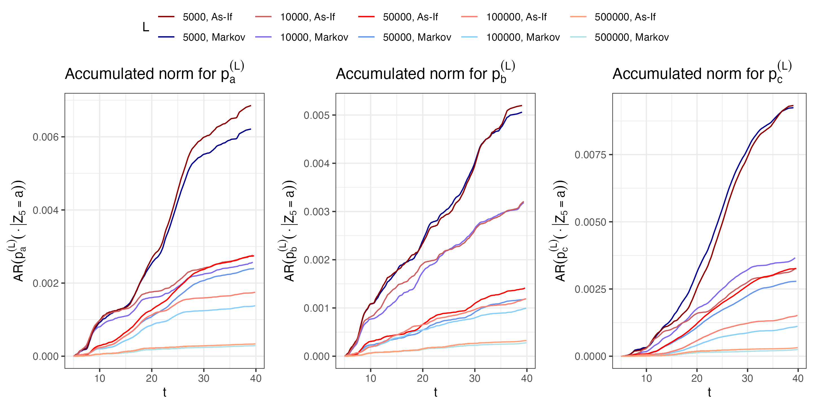
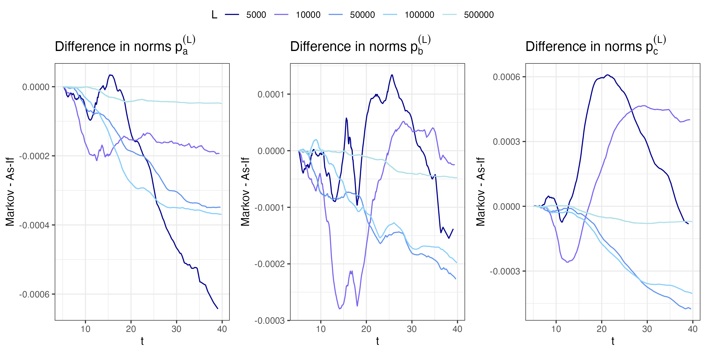
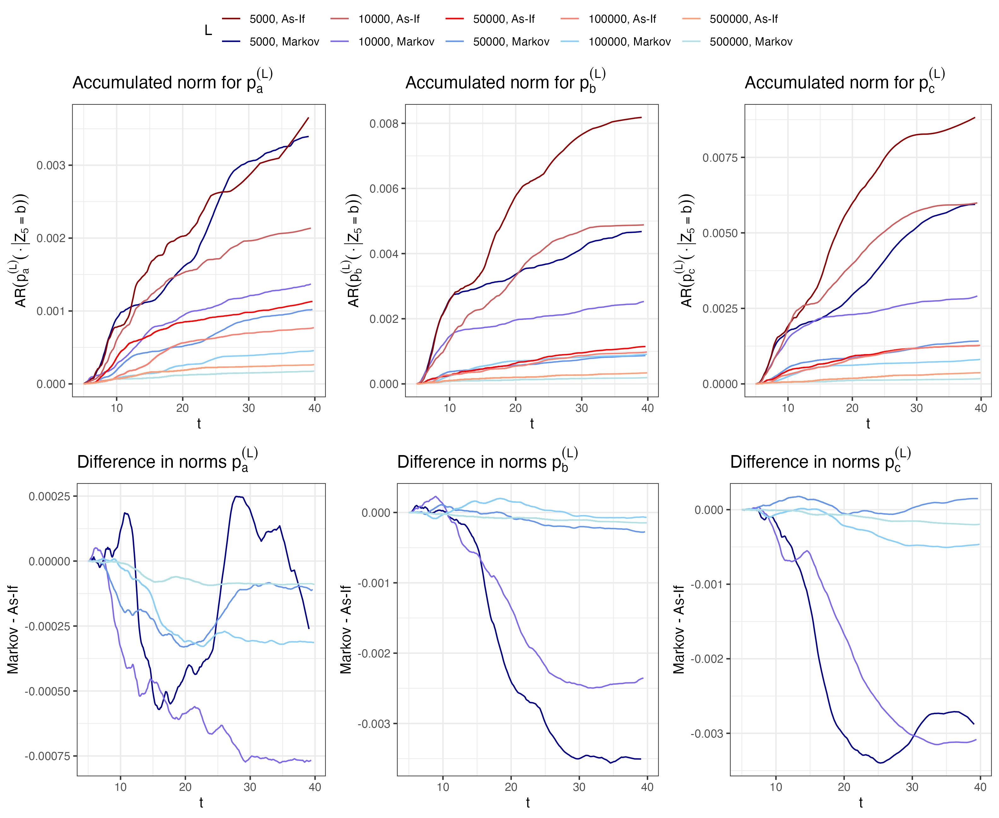
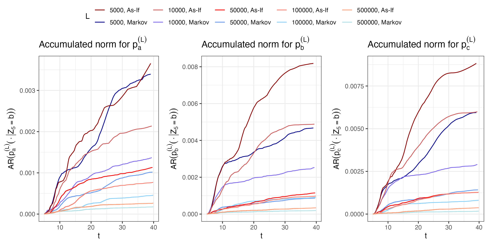
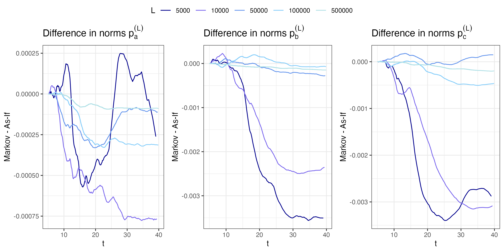

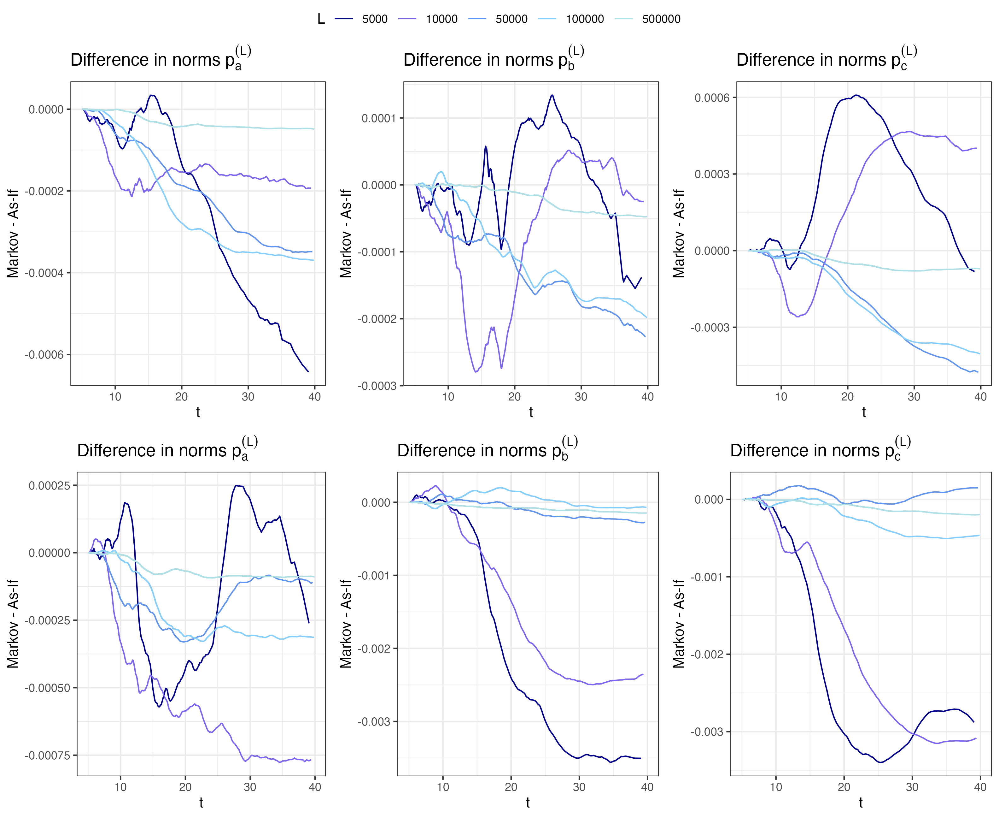
```

```{r}
tbl <- rbind(app_results[[1]]$norms,app_results[[2]]$norms,app_results[[3]]$norms)
tbl <- tbl[,c("State","Estimator","L","Sup_Norm", "P_Norm")]
colnames(tbl) <- c("Occupation State","Estimator","L","Sup_Norm", "P_Norm")
class(tbl$L) <- "integer"
tbl2 <- rbind(app_results2[[1]]$norms,app_results2[[2]]$norms,app_results2[[3]]$norms)
tbl2 <- tbl2[,c("State","Estimator","L","Sup_Norm", "P_Norm")]
colnames(tbl2) <- c("Occupation State","Estimator","L","Sup_Norm", "P_Norm")
class(tbl2$L) <- "integer"
tbl[,"Start State"] <- "a"
tbl2[,"Start State"] <- "b"
tbl <- rbind(tbl,tbl2)
tbl <- tbl %>% mutate(Norm = "p-norm") %>% add_row(mutate(., Norm = "sup-norm")) %>%
  mutate(value = ifelse(Norm == "sup-norm", Sup_Norm, P_Norm)) %>% group_by(`Start State`,`Estimator`,`Norm`,L) %>%
  summarise(
    Risk_a = sum(value*(`Occupation State` == 1))*10^4,
    Risk_b = sum(value*(`Occupation State` == 2))*10^4,
    Risk_c = sum(value*(`Occupation State` == 3))*10^4
  ) %>% arrange(`Start State`,Estimator,Norm,L) %>%
  mutate(Estimator = ifelse(Estimator == "As_If","As-If","Markov"))

tbl %>%
  kbl(digits=4) %>%
  kable_styling()
#For latex
tbl_p <- tbl[tbl$Norm == "p-norm",c("Start State","Estimator","L","Risk_a","Risk_b","Risk_c")]
tbl_p %>% kbl(digits = 2, format = "latex", booktabs = T)
```

